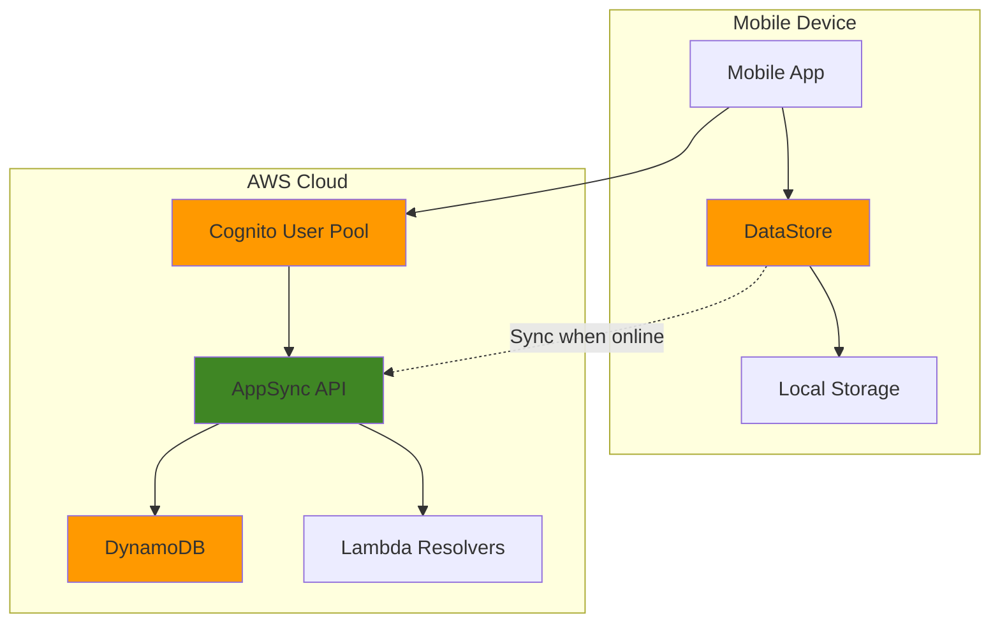

# Developing Offline-First Mobile Applications with Amplify DataStore

## Problem

Mobile applications frequently encounter unreliable network connectivity in real-world scenarios, leading to poor user experiences when users lose access to critical app features while offline. Traditional mobile architectures that rely solely on API calls fail when network connections are interrupted, causing data loss, frustrated users, and reduced app engagement. Organizations need a solution that provides seamless offline functionality with automatic synchronization when connectivity is restored.

## Solution

AWS Amplify DataStore provides an offline-first programming model that automatically synchronizes data between local device storage and cloud-based services. DataStore handles conflict resolution, real-time subscriptions, and selective synchronization while maintaining data consistency across multiple devices and users. This solution creates a robust mobile application architecture that works reliably in both online and offline scenarios.

## Architecture Diagram



## Prerequisites

1. AWS account with appropriate permissions for Amplify, AppSync, DynamoDB, and Cognito
2. AWS CLI v2 installed and configured (or AWS CloudShell)
3. Node.js 18+ and npm installed
4. Amplify CLI installed globally (`npm install -g @aws-amplify/cli`)
5. React Native development environment setup (Node.js, React Native CLI, Android Studio/Xcode)
6. Estimated cost: $10-20/month for DynamoDB, AppSync, and Cognito usage during development

> **Note**: This recipe uses React Native for demonstration, but DataStore works with iOS, Android, Flutter, and web applications.

## Preparation

```bash
# Set environment variables
export AWS_REGION=$(aws configure get region)
export AWS_ACCOUNT_ID=$(aws sts get-caller-identity \
    --query Account --output text)

# Generate unique identifiers for resources
RANDOM_SUFFIX=$(aws secretsmanager get-random-password \
    --exclude-punctuation --exclude-uppercase \
    --password-length 6 --require-each-included-type \
    --output text --query RandomPassword)

export APP_NAME="offline-tasks-${RANDOM_SUFFIX}"
export PROJECT_DIR="${HOME}/amplify-offline-app"

# Create React Native project
npx react-native@latest init ${APP_NAME} \
    --template react-native-template-typescript

# Navigate to project directory
cd "${HOME}/${APP_NAME}"

# Initialize Amplify in the project
npx amplify-app@latest
```

## Steps

1. **Configure DataStore with Authentication**:

   Authentication is essential for offline-first applications because it enables secure data ownership and access control across devices. Amazon Cognito User Pools provide managed identity services that integrate seamlessly with DataStore, ensuring that each user's data remains private and synchronized only to their authorized devices. This authentication layer enables the `@auth` directives in your GraphQL schema to function properly.

   ```bash
   # Add authentication to the project
   amplify add auth
   
   # Select default configuration with username
   # Choose: Default configuration
   # Sign-in method: Username
   # Advanced settings: No
   
   echo "✅ Authentication configuration added"
   ```

   The Cognito User Pool is now configured and will provide JWT tokens for authenticated API calls. This security foundation ensures that DataStore synchronization respects user ownership rules and maintains data privacy across offline and online operations.

2. **Create Data Models with Conflict Resolution**:

   AppSync provides a managed GraphQL API that serves as the backend for DataStore synchronization. The Auto Merge conflict resolution strategy automatically handles data conflicts by merging changes at the field level, reducing the complexity of managing concurrent updates from multiple devices. Enabling DataStore generates the necessary local storage models and synchronization logic that works seamlessly with your GraphQL schema.

   ```bash
   # Add API with DataStore
   amplify add api
   
   # Choose: GraphQL
   # API name: accept default
   # Authorization mode: Amazon Cognito User Pool
   # Additional auth types: No
   # Conflict resolution: Auto Merge
   # Enable DataStore: Yes
   
   echo "✅ API and DataStore configured"
   ```

   The AppSync API is now configured with DataStore capabilities, providing real-time subscriptions and automatic conflict resolution. This creates the cloud-based synchronization layer that keeps data consistent across all user devices while handling network interruptions gracefully.

3. **Define Schema with Relationships**:

   The GraphQL schema defines your data model with powerful features for offline-first applications. The `@model` directive automatically generates CRUD operations, DynamoDB tables, and DataStore models. The `@auth` rules ensure data privacy by restricting access to the record owner. The `@hasMany` relationship creates efficient data relationships that work both online and offline, enabling complex queries while maintaining performance.

   ```bash
   # Create comprehensive schema
   cat > amplify/backend/api/*/schema.graphql << 'EOF'
   type Task @model @auth(rules: [{ allow: owner }]) {
     id: ID!
     title: String!
     description: String
     priority: Priority!
     status: Status!
     dueDate: AWSDateTime
     tags: [String]
     projectID: ID @index(name: "byProject")
     createdAt: AWSDateTime!
     updatedAt: AWSDateTime!
   }
   
   type Project @model @auth(rules: [{ allow: owner }]) {
     id: ID!
     name: String!
     description: String
     color: String
     tasks: [Task] @hasMany(indexName: "byProject", fields: ["id"])
     createdAt: AWSDateTime!
     updatedAt: AWSDateTime!
   }
   
   enum Priority {
     LOW
     MEDIUM
     HIGH
     URGENT
   }
   
   enum Status {
     PENDING
     IN_PROGRESS
     COMPLETED
     CANCELLED
   }
   EOF
   
   echo "✅ Schema defined with relationships and enums"
   ```

   The schema now defines a complete task management data model with owner-based authorization and relational data. This structure enables DataStore to automatically handle data synchronization, conflict resolution, and real-time subscriptions for both Task and Project entities while maintaining strict access controls.

4. **Deploy Backend Resources**:

   Deploying the Amplify backend provisions all necessary AWS resources including DynamoDB tables, AppSync API, Lambda resolvers, and IAM roles. This process creates the cloud infrastructure that enables your mobile application to synchronize data reliably. The deployment also generates the local configuration files needed for DataStore to connect to your backend services.

   ```bash
   # Push changes to create backend
   amplify push --yes
   
   # Wait for deployment to complete
   echo "✅ Backend deployed successfully"
   ```

   The backend deployment is complete, and all AWS resources are now available for your application. DataStore can now synchronize local data with DynamoDB through the AppSync API, providing the foundation for offline-first functionality.

5. **Install and Configure DataStore Dependencies**:

   DataStore requires specific dependencies to function properly in React Native environments. The `aws-amplify` package provides the core DataStore functionality, while `react-native-get-random-values` ensures proper UUID generation for offline record creation. AsyncStorage serves as the local persistence layer, enabling DataStore to store data locally when offline and queue changes for synchronization when connectivity returns.

   ```bash
   # Install required dependencies
   npm install aws-amplify @aws-amplify/ui-react-native \
       @aws-amplify/react-native
   
   # Install React Native specific dependencies
   npm install react-native-get-random-values \
       @react-native-community/netinfo \
       @react-native-async-storage/async-storage \
       @azure/core-asynciterator-polyfill \
       react-native-safe-area-context
   
   # For iOS, install pods
   cd ios && pod install && cd ..
   
   echo "✅ Dependencies installed"
   ```

   All necessary dependencies are now installed and configured for DataStore functionality. Your React Native application can now leverage local storage for offline operations and automatic synchronization when network connectivity is available.

6. **Configure DataStore with Selective Sync**:

   Selective synchronization is crucial for mobile applications to optimize bandwidth usage and local storage. Sync expressions allow you to filter which records are synchronized to each device based on business logic, user preferences, or device capabilities. This reduces data transfer costs, improves sync performance, and ensures devices only store relevant data locally.

   ```bash
   # Create DataStore configuration
   mkdir -p src
   cat > src/datastore-config.js << 'EOF'
   import { DataStore, syncExpression } from 'aws-amplify/datastore';
   import { Task, Project } from './models';
   
   // Configure selective sync based on user preferences
   const configureSyncExpressions = (userPreferences) => {
     return [
       syncExpression(Task, () => {
         const thirtyDaysAgo = new Date();
         thirtyDaysAgo.setDate(thirtyDaysAgo.getDate() - 30);
         
         return (task) => task.and(taskFilters => [
           taskFilters.createdAt.gt(thirtyDaysAgo.toISOString()),
           taskFilters.status.ne('CANCELLED')
         ]);
       }),
       syncExpression(Project, () => {
         return (project) => project.name.ne('Archived');
       })
     ];
   };
   
   export const configureDataStore = (userPreferences = {}) => {
     DataStore.configure({
       syncExpressions: configureSyncExpressions(userPreferences),
       maxRecordsToSync: 10000,
       syncPageSize: 1000,
       fullSyncInterval: 24 * 60 * 60 * 1000, // 24 hours
       errorHandler: (error) => {
         console.warn('DataStore sync error:', error);
       }
     });
   };
   EOF
   
   echo "✅ DataStore configuration created"
   ```

   The DataStore configuration now includes selective sync expressions that optimize data transfer and storage. Only recent and active data will be synchronized to the device, improving performance and reducing storage requirements while maintaining functionality.

7. **Implement Offline-First Data Operations**:

   The DataService layer provides a clean abstraction over DataStore operations, implementing patterns that work consistently in both offline and online scenarios. DataStore automatically queues operations when offline and synchronizes them when connectivity returns. The service layer includes error handling, data validation, and optimistic updates that provide immediate user feedback even when offline.

   ```bash
   # Create data service layer
   mkdir -p src/services
   cat > src/services/DataService.js << 'EOF'
   import { DataStore, Predicates } from 'aws-amplify/datastore';
   import { Task, Project, Priority, Status } from '../models';
   
   export class DataService {
     // Task operations
     static async createTask(taskData) {
       try {
         const task = await DataStore.save(new Task({
           title: taskData.title,
           description: taskData.description,
           priority: taskData.priority || Priority.MEDIUM,
           status: Status.PENDING,
           dueDate: taskData.dueDate,
           tags: taskData.tags || [],
           projectID: taskData.projectID
         }));
         return task;
       } catch (error) {
         console.error('Error creating task:', error);
         throw error;
       }
     }
   
     static async getTasks(filters = {}) {
       try {
         let predicate = Predicates.ALL;
         
         if (filters.status) {
           predicate = (task) => task.status.eq(filters.status);
         }
         
         if (filters.priority) {
           predicate = predicate === Predicates.ALL 
             ? (task) => task.priority.eq(filters.priority)
             : (task) => task.and(t => [
                 t.status.eq(filters.status),
                 t.priority.eq(filters.priority)
               ]);
         }
         
         return await DataStore.query(Task, predicate);
       } catch (error) {
         console.error('Error fetching tasks:', error);
         throw error;
       }
     }
   
     static async updateTask(taskId, updates) {
       try {
         const original = await DataStore.query(Task, taskId);
         if (!original) {
           throw new Error('Task not found');
         }
         
         const updated = await DataStore.save(
           Task.copyOf(original, updated => {
             Object.assign(updated, updates);
           })
         );
         return updated;
       } catch (error) {
         console.error('Error updating task:', error);
         throw error;
       }
     }
   
     static async deleteTask(taskId) {
       try {
         const task = await DataStore.query(Task, taskId);
         if (task) {
           await DataStore.delete(task);
         }
       } catch (error) {
         console.error('Error deleting task:', error);
         throw error;
       }
     }
   
     // Project operations
     static async createProject(projectData) {
       try {
         const project = await DataStore.save(new Project({
           name: projectData.name,
           description: projectData.description,
           color: projectData.color || '#007AFF'
         }));
         return project;
       } catch (error) {
         console.error('Error creating project:', error);
         throw error;
       }
     }
   
     static async getProjects() {
       try {
         return await DataStore.query(Project);
       } catch (error) {
         console.error('Error fetching projects:', error);
         throw error;
       }
     }
   
     // Sync management
     static async forceSyncNow() {
       try {
         await DataStore.stop();
         await DataStore.start();
       } catch (error) {
         console.error('Error forcing sync:', error);
         throw error;
       }
     }
   
     static async clearLocalData() {
       try {
         await DataStore.clear();
       } catch (error) {
         console.error('Error clearing local data:', error);
         throw error;
       }
     }
   }
   EOF
   
   echo "✅ Data service layer implemented"
   ```

   The DataService layer now provides comprehensive CRUD operations that work seamlessly in both online and offline modes. All operations include proper error handling and follow DataStore best practices for optimal performance and reliability.

8. **Create Conflict Resolution Handler**:

   Custom conflict resolution becomes essential when the default auto-merge strategy doesn't align with business requirements. This implementation provides priority-based conflict resolution where higher priority tasks and completed status take precedence. Understanding conflict resolution patterns helps maintain data consistency while respecting business rules and user intent across multiple devices.

   ```bash
   # Create conflict resolution utilities
   mkdir -p src/utils
   cat > src/utils/ConflictResolver.js << 'EOF'
   import { Hub } from 'aws-amplify/utils';
   
   export class ConflictResolver {
     static setupConflictHandling() {
       Hub.listen('datastore', ({ payload }) => {
         if (payload.event === 'syncConflict') {
           this.handleSyncConflict(payload.data);
         }
       });
     }
   
     static handleSyncConflict(conflictData) {
       const { modelName, localModel, remoteModel } = conflictData;
       
       console.log(`Conflict detected for ${modelName}:`, {
         local: localModel,
         remote: remoteModel
       });
   
       // Custom conflict resolution logic
       switch (modelName) {
         case 'Task':
           return this.resolveTaskConflict(localModel, remoteModel);
         case 'Project':
           return this.resolveProjectConflict(localModel, remoteModel);
         default:
           // Default to server wins
           return remoteModel;
       }
     }
   
     static resolveTaskConflict(localModel, remoteModel) {
       // Priority-based conflict resolution
       const localPriority = this.getPriorityWeight(localModel.priority);
       const remotePriority = this.getPriorityWeight(remoteModel.priority);
   
       if (localModel.status === 'COMPLETED' && remoteModel.status !== 'COMPLETED') {
         // Local completion wins
         return localModel;
       }
   
       if (localPriority > remotePriority) {
         // Higher priority wins
         return localModel;
       }
   
       // Most recent update wins
       return new Date(localModel.updatedAt) > new Date(remoteModel.updatedAt) 
         ? localModel : remoteModel;
     }
   
     static resolveProjectConflict(localModel, remoteModel) {
       // Most recent update wins for projects
       return new Date(localModel.updatedAt) > new Date(remoteModel.updatedAt) 
         ? localModel : remoteModel;
     }
   
     static getPriorityWeight(priority) {
       const weights = {
         'LOW': 1,
         'MEDIUM': 2,
         'HIGH': 3,
         'URGENT': 4
       };
       return weights[priority] || 1;
     }
   }
   EOF
   
   echo "✅ Conflict resolution handler created"
   ```

   The conflict resolution handler now implements business-specific logic for handling data conflicts. This ensures that the most important changes are preserved when conflicts occur between local and remote data modifications.

9. **Implement Network Status Monitoring**:

   Network monitoring is essential for providing users with appropriate feedback about synchronization status and application capabilities. This service integrates DataStore's network events with React Native's NetInfo to provide comprehensive connectivity awareness. Understanding network status allows the application to adjust behavior, queue operations appropriately, and inform users about sync capabilities.

   ```bash
   # Create network status service
   cat > src/services/NetworkService.js << 'EOF'
   import { Hub } from 'aws-amplify/utils';
   import NetInfo from '@react-native-community/netinfo';
   
   export class NetworkService {
     static isOnline = false;
     static listeners = [];
   
     static initialize() {
       // Monitor DataStore network status
       Hub.listen('datastore', ({ payload }) => {
         if (payload.event === 'networkStatus') {
           this.isOnline = payload.data.active;
           this.notifyListeners(payload.data.active);
         }
       });
   
       // Monitor device network connectivity
       NetInfo.addEventListener(state => {
         console.log('Network connection type:', state.type);
         console.log('Is connected:', state.isConnected);
         
         if (!state.isConnected && this.isOnline) {
           this.notifyListeners(false);
         }
       });
     }
   
     static addListener(callback) {
       this.listeners.push(callback);
       return () => {
         this.listeners = this.listeners.filter(l => l !== callback);
       };
     }
   
     static notifyListeners(isOnline) {
       this.listeners.forEach(callback => callback(isOnline));
     }
   
     static getNetworkStatus() {
       return {
         isOnline: this.isOnline,
         canSync: this.isOnline
       };
     }
   }
   EOF
   
   echo "✅ Network status monitoring implemented"
   ```

   Network status monitoring is now integrated with both DataStore events and device network information. This provides comprehensive connectivity awareness that helps users understand when their data can synchronize with the cloud.

10. **Create Real-time Sync Manager**:

    The SyncManager provides centralized monitoring of DataStore synchronization events, enabling applications to provide detailed feedback about sync status, pending changes, and conflicts. This visibility helps users understand the application state and builds confidence in the offline-first experience. Real-time sync monitoring is essential for debugging and optimizing synchronization performance.

    ```bash
    # Create sync manager
    cat > src/services/SyncManager.js << 'EOF'
    import { DataStore } from 'aws-amplify/datastore';
    import { Hub } from 'aws-amplify/utils';
    
    export class SyncManager {
      static syncStatus = {
        isSyncing: false,
        lastSyncTime: null,
        pendingChanges: 0,
        syncErrors: []
      };
    
      static listeners = [];
    
      static initialize() {
        Hub.listen('datastore', ({ payload }) => {
          switch (payload.event) {
            case 'syncQueriesStarted':
              this.updateSyncStatus({
                isSyncing: true,
                syncErrors: []
              });
              break;
    
            case 'syncQueriesReady':
              this.updateSyncStatus({
                isSyncing: false,
                lastSyncTime: new Date()
              });
              break;
    
            case 'outboxStatus':
              this.updateSyncStatus({
                pendingChanges: payload.data.isEmpty ? 0 : 1
              });
              break;
    
            case 'syncConflict':
              this.handleSyncConflict(payload.data);
              break;
    
            case 'syncError':
              this.handleSyncError(payload.data);
              break;
          }
        });
      }
    
      static handleSyncConflict(conflictData) {
        console.log('Sync conflict detected:', conflictData);
        this.updateSyncStatus({
          syncErrors: [...this.syncStatus.syncErrors, {
            type: 'conflict',
            data: conflictData,
            timestamp: new Date()
          }]
        });
      }
    
      static handleSyncError(errorData) {
        console.error('Sync error:', errorData);
        this.updateSyncStatus({
          syncErrors: [...this.syncStatus.syncErrors, {
            type: 'error',
            data: errorData,
            timestamp: new Date()
          }]
        });
      }
    
      static updateSyncStatus(updates) {
        this.syncStatus = { ...this.syncStatus, ...updates };
        this.notifyListeners(this.syncStatus);
      }
    
      static addListener(callback) {
        this.listeners.push(callback);
        return () => {
          this.listeners = this.listeners.filter(l => l !== callback);
        };
      }
    
      static notifyListeners(status) {
        this.listeners.forEach(callback => callback(status));
      }
    
      static getSyncStatus() {
        return this.syncStatus;
      }
    
      static async manualSync() {
        try {
          await DataStore.stop();
          await DataStore.start();
        } catch (error) {
          console.error('Manual sync failed:', error);
          throw error;
        }
      }
    }
    EOF
    
    echo "✅ Sync manager implemented"
    ```

    The SyncManager now provides comprehensive monitoring of all DataStore synchronization events. This gives users real-time visibility into sync status, pending changes, and any errors that occur during synchronization.

11. **Create React Native Components with Offline Support**:

    The React Native components demonstrate how to build a user interface that gracefully handles offline scenarios. The implementation shows real-time sync status, provides immediate feedback for user actions, and maintains functionality regardless of network connectivity. This approach ensures users can continue working productively even when offline, with all changes automatically synchronized when connectivity returns.

    ```bash
    # Create main app component
    mkdir -p src/components
    cat > src/components/TaskApp.tsx << 'EOF'
    import React, { useState, useEffect } from 'react';
    import { View, Text, StyleSheet, FlatList, TouchableOpacity, Alert } from 'react-native';
    import { DataService } from '../services/DataService';
    import { NetworkService } from '../services/NetworkService';
    import { SyncManager } from '../services/SyncManager';
    import { Task, Status } from '../models';
    
    export const TaskApp: React.FC = () => {
      const [tasks, setTasks] = useState<Task[]>([]);
      const [isOnline, setIsOnline] = useState(false);
      const [syncStatus, setSyncStatus] = useState(SyncManager.getSyncStatus());
      const [loading, setLoading] = useState(true);
    
      useEffect(() => {
        initializeApp();
        
        return () => {
          // Cleanup listeners on unmount
        };
      }, []);
    
      const initializeApp = async () => {
        try {
          // Initialize services
          NetworkService.initialize();
          SyncManager.initialize();
    
          // Setup listeners
          const networkUnsubscribe = NetworkService.addListener(setIsOnline);
          const syncUnsubscribe = SyncManager.addListener(setSyncStatus);
    
          // Load initial data
          await loadTasks();
          setLoading(false);
        } catch (error) {
          console.error('App initialization failed:', error);
          Alert.alert('Error', 'Failed to initialize app');
          setLoading(false);
        }
      };
    
      const loadTasks = async () => {
        try {
          const allTasks = await DataService.getTasks();
          setTasks(allTasks);
        } catch (error) {
          console.error('Error loading tasks:', error);
        }
      };
    
      const createSampleTask = async () => {
        try {
          const task = await DataService.createTask({
            title: `Task ${Date.now()}`,
            description: 'Created offline-first',
            priority: 'HIGH'
          });
          setTasks(prev => [...prev, task]);
        } catch (error) {
          console.error('Error creating task:', error);
          Alert.alert('Error', 'Failed to create task');
        }
      };
    
      const toggleTaskStatus = async (task: Task) => {
        try {
          const newStatus = task.status === Status.COMPLETED ? Status.PENDING : Status.COMPLETED;
          const updated = await DataService.updateTask(task.id, { status: newStatus });
          setTasks(prev => prev.map(t => t.id === task.id ? updated : t));
        } catch (error) {
          console.error('Error updating task:', error);
          Alert.alert('Error', 'Failed to update task');
        }
      };
    
      const renderTask = ({ item }: { item: Task }) => (
        <TouchableOpacity
          style={[styles.taskItem, { opacity: item.status === Status.COMPLETED ? 0.6 : 1 }]}
          onPress={() => toggleTaskStatus(item)}
        >
          <Text style={styles.taskTitle}>{item.title}</Text>
          <Text style={styles.taskStatus}>Status: {item.status}</Text>
          <Text style={styles.taskPriority}>Priority: {item.priority}</Text>
        </TouchableOpacity>
      );
    
      if (loading) {
        return (
          <View style={styles.container}>
            <Text>Loading...</Text>
          </View>
        );
      }
    
      return (
        <View style={styles.container}>
          <View style={styles.header}>
            <Text style={styles.title}>Offline-First Tasks</Text>
            <View style={styles.statusContainer}>
              <Text style={[styles.status, { color: isOnline ? 'green' : 'red' }]}>
                {isOnline ? 'Online' : 'Offline'}
              </Text>
              {syncStatus.isSyncing && <Text style={styles.syncStatus}>Syncing...</Text>}
            </View>
          </View>
    
          <TouchableOpacity style={styles.addButton} onPress={createSampleTask}>
            <Text style={styles.addButtonText}>Add Task</Text>
          </TouchableOpacity>
    
          <FlatList
            data={tasks}
            renderItem={renderTask}
            keyExtractor={(item) => item.id}
            style={styles.taskList}
          />
    
          <View style={styles.footer}>
            <Text style={styles.footerText}>
              {syncStatus.pendingChanges} pending changes | 
              Last sync: {syncStatus.lastSyncTime?.toLocaleTimeString() || 'Never'}
            </Text>
          </View>
        </View>
      );
    };
    
    const styles = StyleSheet.create({
      container: {
        flex: 1,
        backgroundColor: '#f5f5f5',
      },
      header: {
        padding: 20,
        backgroundColor: '#fff',
        borderBottomWidth: 1,
        borderBottomColor: '#e0e0e0',
      },
      title: {
        fontSize: 24,
        fontWeight: 'bold',
        marginBottom: 10,
      },
      statusContainer: {
        flexDirection: 'row',
        alignItems: 'center',
      },
      status: {
        fontSize: 16,
        fontWeight: '600',
        marginRight: 10,
      },
      syncStatus: {
        fontSize: 14,
        color: '#666',
      },
      addButton: {
        backgroundColor: '#007AFF',
        padding: 15,
        margin: 20,
        borderRadius: 8,
        alignItems: 'center',
      },
      addButtonText: {
        color: '#fff',
        fontSize: 16,
        fontWeight: '600',
      },
      taskList: {
        flex: 1,
      },
      taskItem: {
        backgroundColor: '#fff',
        padding: 15,
        marginHorizontal: 20,
        marginVertical: 5,
        borderRadius: 8,
        borderWidth: 1,
        borderColor: '#e0e0e0',
      },
      taskTitle: {
        fontSize: 16,
        fontWeight: '600',
        marginBottom: 5,
      },
      taskStatus: {
        fontSize: 14,
        color: '#666',
      },
      taskPriority: {
        fontSize: 14,
        color: '#666',
      },
      footer: {
        padding: 15,
        backgroundColor: '#fff',
        borderTopWidth: 1,
        borderTopColor: '#e0e0e0',
      },
      footerText: {
        fontSize: 12,
        color: '#666',
        textAlign: 'center',
      },
    });
    EOF
    
    echo "✅ React Native components created"
    ```

    The React Native components now provide a complete user interface that works seamlessly in both online and offline modes. Users receive real-time feedback about network status and sync progress while maintaining full functionality regardless of connectivity.

12. **Configure App with Amplify and DataStore**:

    The final application configuration brings together all components to create a fully functional offline-first application. The initialization sequence ensures DataStore is properly configured before the UI loads, establishes conflict resolution handlers, and starts the synchronization process. This configuration pattern provides a robust foundation for production applications.

    ```bash
    # Add polyfill import to index.js
    cat > index.js << 'EOF'
    import '@azure/core-asynciterator-polyfill';
    import 'react-native-get-random-values';
    import {AppRegistry} from 'react-native';
    import App from './App';
    import {name as appName} from './app.json';
    
    AppRegistry.registerComponent(appName, () => App);
    EOF
    
    # Update App.tsx to initialize Amplify
    cat > App.tsx << 'EOF'
    import React, { useEffect, useState } from 'react';
    import { SafeAreaProvider } from 'react-native-safe-area-context';
    import { Amplify } from 'aws-amplify';
    import { DataStore } from 'aws-amplify/datastore';
    import { Authenticator } from '@aws-amplify/ui-react-native';
    
    import amplifyconfig from './src/amplifyconfiguration.json';
    import { TaskApp } from './src/components/TaskApp';
    import { configureDataStore } from './src/datastore-config';
    import { ConflictResolver } from './src/utils/ConflictResolver';
    
    Amplify.configure(amplifyconfig);
    
    const App: React.FC = () => {
      const [isReady, setIsReady] = useState(false);
    
      useEffect(() => {
        initializeApp();
      }, []);
    
      const initializeApp = async () => {
        try {
          // Configure DataStore with sync expressions
          configureDataStore();
          
          // Setup conflict resolution
          ConflictResolver.setupConflictHandling();
          
          // Start DataStore
          await DataStore.start();
          
          setIsReady(true);
          console.log('App initialized successfully');
        } catch (error) {
          console.error('App initialization failed:', error);
          setIsReady(true); // Allow app to start even if DataStore fails
        }
      };
    
      if (!isReady) {
        return null; // You could show a loading screen here
      }
    
      return (
        <SafeAreaProvider>
          <Authenticator.Provider>
            <Authenticator>
              <TaskApp />
            </Authenticator>
          </Authenticator.Provider>
        </SafeAreaProvider>
      );
    };
    
    export default App;
    EOF
    
    echo "✅ App configuration completed"
    ```

    The application is now fully configured with proper initialization sequence, authentication, and DataStore setup. The app gracefully handles initialization failures and provides a robust offline-first experience for users.

## Validation & Testing

1. **Verify DataStore initialization**:

   Validating the backend deployment ensures all AWS resources are properly configured and accessible. The `amplify status` command shows the deployment state of each service, confirming that the API and authentication components are ready for DataStore synchronization.

   ```bash
   # Check DataStore status
   amplify status
   
   # Expected output should show API and Auth as deployed
   echo "✅ Backend resources verified"
   ```

2. **Test offline functionality**:

   Testing offline scenarios validates that DataStore properly handles network interruptions and maintains application functionality. This verification ensures that users can continue creating, updating, and viewing data even when connectivity is unavailable, with changes automatically synchronized when the network returns.

   ```bash
   # Run the app in simulator
   npx react-native run-ios
   # or
   npx react-native run-android
   
   # Test offline mode by disabling network in simulator
   echo "✅ Test app functionality with network disabled"
   ```

3. **Validate sync behavior**:

   Monitoring synchronization events helps verify that DataStore is properly handling data updates and conflicts. These events indicate when initial sync completes, when outbound changes are processed, and when conflicts are detected, providing insight into the synchronization process.

   ```bash
   # Check sync logs in development console
   # Look for DataStore events: ready, syncQueriesStarted, syncQueriesReady
   
   # Test conflict resolution by making changes from multiple devices
   echo "✅ Verify data synchronization across devices"
   ```

4. **Monitor real-time subscriptions**:

   ```bash
   # Check AppSync console for real-time subscriptions
   aws appsync list-graphql-apis \
       --region $AWS_REGION \
       --query 'graphqlApis[?contains(name, `${APP_NAME}`)].{Name:name,ApiId:apiId}'
   
   echo "✅ Verify real-time subscriptions are active"
   ```

5. **Test selective sync expressions**:

   ```bash
   # Verify only recent tasks are synced
   # Check DynamoDB for data filtering
   aws dynamodb scan \
       --table-name Task-* \
       --region $AWS_REGION \
       --max-items 5
   
   echo "✅ Selective sync filtering verified"
   ```

## Cleanup

1. **Remove Amplify backend resources**:

   Cleaning up AWS resources prevents ongoing charges for unused services. The `amplify delete` command removes all provisioned resources including DynamoDB tables, AppSync APIs, Cognito User Pools, and IAM roles, ensuring no residual costs remain after testing.

   ```bash
   # Delete all Amplify resources
   amplify delete
   
   # Confirm deletion
   echo "✅ Amplify backend resources deleted"
   ```

2. **Clean up local project**:

   Removing the local project directory cleans up all generated code, dependencies, and configuration files. This ensures a clean development environment and removes any locally cached data that might interfere with future projects.

   ```bash
   # Remove project directory
   cd $HOME
   rm -rf "${APP_NAME}"
   
   echo "✅ Local project cleaned up"
   ```

3. **Verify resource cleanup**:

   Verifying complete resource removal ensures that all AWS services have been properly deleted and no unexpected charges will occur. This validation step provides confidence that the cleanup process was successful and all project resources have been removed.

   ```bash
   # Check for remaining resources
   aws appsync list-graphql-apis \
       --region $AWS_REGION \
       --query 'graphqlApis[?contains(name, `${APP_NAME}`)].name'
   
   aws dynamodb list-tables \
       --region $AWS_REGION \
       --query 'TableNames[?contains(@, `${APP_NAME}`)]'
   
   echo "✅ Cleanup verification completed"
   ```

## Discussion

AWS Amplify DataStore provides a comprehensive solution for building offline-first mobile applications that automatically handle data synchronization, conflict resolution, and real-time updates. The DataStore programming model abstracts away the complexities of managing local storage, API calls, and synchronization logic, allowing developers to focus on building compelling user experiences.

The architecture leverages several key components working together: DataStore manages local storage and synchronization, AppSync provides the GraphQL API layer with real-time subscriptions, DynamoDB stores data in the cloud, and Cognito handles user authentication and authorization. This combination creates a robust system that works seamlessly across online and offline scenarios following [AWS Well-Architected Framework principles](https://docs.aws.amazon.com/wellarchitected/latest/framework/welcome.html).

Selective synchronization is particularly important for mobile applications where bandwidth and storage are limited. By using sync expressions, applications can filter data based on user preferences, device capabilities, or business rules. This approach reduces data transfer costs, improves sync performance, and ensures that only relevant data is stored locally. The [AWS AppSync documentation](https://docs.aws.amazon.com/appsync/latest/devguide/designing-a-graphql-api.html) provides additional guidance on designing effective GraphQL APIs for mobile applications.

Conflict resolution strategies are critical for maintaining data consistency across multiple devices and users. Amplify DataStore supports multiple conflict resolution strategies including optimistic concurrency, auto-merge, and custom Lambda-based resolution. The auto-merge strategy works well for most use cases, automatically resolving conflicts based on data types and update patterns. For more complex scenarios, custom conflict resolution logic can be implemented to handle business-specific requirements.

> **Tip**: Monitor DataStore sync performance using CloudWatch metrics and adjust sync expressions based on actual usage patterns to optimize performance and costs. See the [AWS Amplify DataStore documentation](https://docs.aws.amazon.com/prescriptive-guidance/latest/patterns/build-a-serverless-react-native-mobile-app-by-using-aws-amplify.html) for additional best practices.

## Challenge

Extend this offline-first architecture with these advanced features:

1. **Implement custom conflict resolution logic** that considers business rules, user roles, and data sensitivity when resolving conflicts between local and remote changes using [AWS Lambda resolvers](https://docs.aws.amazon.com/appsync/latest/devguide/designing-a-graphql-api.html).

2. **Add support for large file attachments** using S3 with presigned URLs, implementing offline queuing for file uploads and automatic retry mechanisms with proper error handling.

3. **Create advanced selective sync patterns** that dynamically adjust sync expressions based on user behavior, device storage capacity, and network conditions to optimize performance.

4. **Build comprehensive sync analytics** that track sync performance, conflict rates, and user engagement metrics using CloudWatch to optimize the offline experience.

5. **Implement multi-tenant data isolation** with fine-grained access controls that work consistently across offline and online scenarios using Cognito User Groups and AppSync authorization.

## Infrastructure Code

*Infrastructure code will be generated after recipe approval.*