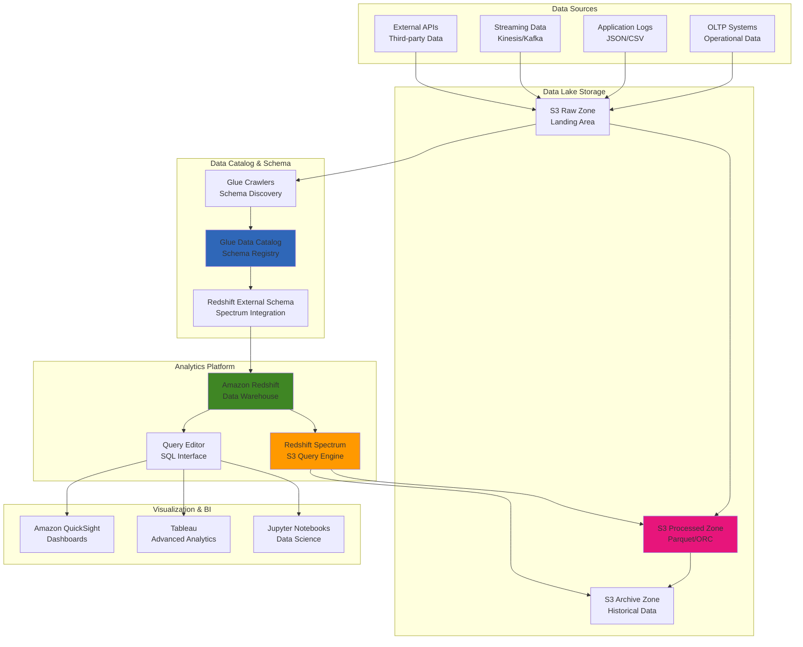

# Enabling Operational Analytics with Amazon Redshift Spectrum

## Problem

Organizations need to perform complex analytical queries across both structured data warehouse data and large volumes of unstructured data stored in data lakes without the cost and complexity of loading all data into expensive data warehouse storage. Traditional approaches require extensive ETL processes, data duplication, and significant storage costs. Companies struggle with analyzing operational data that spans multiple systems, formats, and storage locations while maintaining query performance and cost efficiency.

## Solution

Implement operational analytics using Amazon Redshift Spectrum to query data directly from S3 data lakes while leveraging Redshift's powerful analytical capabilities. This solution provides seamless integration between data warehouse and data lake, cost-effective storage for infrequently accessed data, high-performance analytics across structured and semi-structured data, automatic scaling of compute resources, and unified SQL interface for all data sources. The architecture enables real-time operational insights without data movement overhead.

## Architecture Diagram



## Prerequisites

1. AWS account with permissions for Redshift, S3, Glue, and IAM services
2. AWS CLI v2 installed and configured with appropriate credentials
3. Understanding of SQL and data warehousing concepts
4. Basic knowledge of data lake architectures and file formats
5. Sample operational datasets for testing analytics scenarios
6. Estimated cost: $200-500/month depending on cluster size and query frequency

> **Note**: Redshift Spectrum charges separately for data scanned from S3. Use columnar formats like Parquet and partitioning to minimize costs and improve performance. See [Amazon Redshift Spectrum pricing](https://aws.amazon.com/redshift/pricing/#Redshift_Spectrum_pricing).

## Preparation

```bash
# Set environment variables
export AWS_REGION=$(aws configure get region)
export AWS_ACCOUNT_ID=$(aws sts get-caller-identity \
    --query Account --output text)

# Generate unique identifiers for resources
RANDOM_SUFFIX=$(aws secretsmanager get-random-password \
    --exclude-punctuation --exclude-uppercase \
    --password-length 6 --require-each-included-type \
    --output text --query RandomPassword)

export DATA_LAKE_BUCKET="spectrum-data-lake-${RANDOM_SUFFIX}"
export REDSHIFT_CLUSTER="spectrum-cluster-${RANDOM_SUFFIX}"
export GLUE_DATABASE="spectrum_db_${RANDOM_SUFFIX}"
export REDSHIFT_ROLE_NAME="RedshiftSpectrumRole-${RANDOM_SUFFIX}"
export GLUE_ROLE_NAME="GlueSpectrumRole-${RANDOM_SUFFIX}"
export MASTER_USERNAME="admin"
export MASTER_PASSWORD="TempPassword123!"

echo "✅ Environment prepared"
echo "Data Lake Bucket: ${DATA_LAKE_BUCKET}"
echo "Redshift Cluster: ${REDSHIFT_CLUSTER}"
echo "Glue Database: ${GLUE_DATABASE}"
```

## Steps

1. **Create S3 data lake with sample operational data**:

   Amazon S3 forms the foundation of our data lake architecture, providing virtually unlimited scalable storage with 99.999999999% (11 9's) durability. S3's partitioned structure enables Redshift Spectrum to perform efficient data scanning, reading only the specific partitions needed for each query. This separation of storage and compute allows for cost-effective data retention while maintaining query performance.

   ```bash
   # Create S3 bucket for data lake storage
   # This bucket will serve as the foundation for our analytical data lake
   aws s3 mb s3://${DATA_LAKE_BUCKET} --region ${AWS_REGION}
   
   # Enable versioning and encryption for data protection
   aws s3api put-bucket-versioning \
       --bucket ${DATA_LAKE_BUCKET} \
       --versioning-configuration Status=Enabled
   
   aws s3api put-bucket-encryption \
       --bucket ${DATA_LAKE_BUCKET} \
       --server-side-encryption-configuration \
       'Rules=[{ApplyServerSideEncryptionByDefault:{SSEAlgorithm:AES256}}]'
   
   # Create sample sales transactions data in CSV format
   # This represents typical operational transaction data from an e-commerce system
   cat > sales_transactions.csv << 'EOF'
transaction_id,customer_id,product_id,quantity,unit_price,transaction_date,store_id,region,payment_method
TXN001,CUST001,PROD001,2,29.99,2024-01-15,STORE001,North,credit_card
TXN002,CUST002,PROD002,1,199.99,2024-01-15,STORE002,South,debit_card
TXN003,CUST003,PROD003,3,15.50,2024-01-16,STORE001,North,cash
TXN004,CUST001,PROD004,1,89.99,2024-01-16,STORE003,East,credit_card
TXN005,CUST004,PROD001,2,29.99,2024-01-17,STORE002,South,credit_card
TXN006,CUST002,PROD003,1,15.50,2024-01-17,STORE001,North,debit_card
TXN007,CUST003,PROD002,1,199.99,2024-01-18,STORE003,East,cash
TXN008,CUST001,PROD005,3,45.00,2024-01-18,STORE002,South,credit_card
EOF
   
   # Create sample customer data representing user profiles
   cat > customers.csv << 'EOF'
customer_id,first_name,last_name,email,phone,registration_date,tier,city,state
CUST001,John,Doe,john.doe@email.com,555-0101,2023-01-15,premium,New York,NY
CUST002,Jane,Smith,jane.smith@email.com,555-0102,2023-02-20,standard,Los Angeles,CA
CUST003,Bob,Johnson,bob.johnson@email.com,555-0103,2023-03-10,standard,Chicago,IL
CUST004,Alice,Brown,alice.brown@email.com,555-0104,2023-04-05,premium,Miami,FL
CUST005,Charlie,Wilson,charlie.wilson@email.com,555-0105,2023-05-12,standard,Seattle,WA
EOF
   
   # Create sample product catalog with pricing and cost information
   cat > products.csv << 'EOF'
product_id,product_name,category,brand,cost,retail_price,supplier_id
PROD001,Wireless Headphones,Electronics,TechBrand,20.00,29.99,SUP001
PROD002,Smart Watch,Electronics,TechBrand,120.00,199.99,SUP001
PROD003,Coffee Mug,Home,HomeBrand,8.00,15.50,SUP002
PROD004,Bluetooth Speaker,Electronics,AudioMax,50.00,89.99,SUP003
PROD005,Desk Lamp,Home,HomeBrand,25.00,45.00,SUP002
EOF
   
   # Upload data using partitioning structure for performance optimization
   # Partitioning by year/month enables Spectrum to scan only relevant data
   aws s3 cp sales_transactions.csv \
       s3://${DATA_LAKE_BUCKET}/operational-data/sales/year=2024/month=01/
   
   aws s3 cp customers.csv \
       s3://${DATA_LAKE_BUCKET}/operational-data/customers/
   
   aws s3 cp products.csv \
       s3://${DATA_LAKE_BUCKET}/operational-data/products/
   
   echo "✅ Created S3 data lake with sample operational data"
   ```

   The data lake is now established with proper partitioning structure that enables Spectrum to scan only relevant data subsets. This partitioning strategy directly impacts both query performance and cost, as Spectrum charges based on the amount of data scanned from S3.

   > **Note**: Data partitioning is crucial for Spectrum performance and cost optimization. Partitions enable the query engine to scan only relevant data, significantly reducing processing time and costs. Learn more about [Spectrum best practices](https://docs.aws.amazon.com/redshift/latest/dg/c-using-spectrum.html).

2. **Create IAM role for Redshift Spectrum**:

   Redshift Spectrum requires secure access to both S3 data and Glue metadata catalog. IAM roles enable this access through the principle of least privilege, providing temporary credentials that Redshift can assume to access external resources. This security model eliminates the need for permanent access keys while ensuring fine-grained control over data access permissions.

   ```bash
   # Create trust policy allowing Redshift service to assume this role
   # This enables Redshift to access S3 and Glue resources on your behalf
   cat > redshift-trust-policy.json << EOF
{
    "Version": "2012-10-17",
    "Statement": [
        {
            "Effect": "Allow",
            "Principal": {
                "Service": "redshift.amazonaws.com"
            },
            "Action": "sts:AssumeRole"
        }
    ]
}
EOF
   
   # Define comprehensive permissions for Spectrum to access data sources
   # These permissions enable reading from S3 and querying Glue catalog metadata
   cat > redshift-spectrum-policy.json << EOF
{
    "Version": "2012-10-17",
    "Statement": [
        {
            "Effect": "Allow",
            "Action": [
                "s3:GetObject",
                "s3:ListBucket",
                "s3:GetBucketLocation"
            ],
            "Resource": [
                "arn:aws:s3:::${DATA_LAKE_BUCKET}",
                "arn:aws:s3:::${DATA_LAKE_BUCKET}/*"
            ]
        },
        {
            "Effect": "Allow",
            "Action": [
                "glue:GetDatabase",
                "glue:GetDatabases",
                "glue:GetTable",
                "glue:GetTables",
                "glue:GetPartition",
                "glue:GetPartitions"
            ],
            "Resource": "*"
        }
    ]
}
EOF
   
   # Create IAM role for Redshift Spectrum access
   aws iam create-role \
       --role-name ${REDSHIFT_ROLE_NAME} \
       --assume-role-policy-document file://redshift-trust-policy.json
   
   # Create and attach custom policy for Spectrum operations
   aws iam create-policy \
       --policy-name "${REDSHIFT_ROLE_NAME}-Policy" \
       --policy-document file://redshift-spectrum-policy.json
   
   SPECTRUM_POLICY_ARN=$(aws iam list-policies \
       --query "Policies[?PolicyName=='${REDSHIFT_ROLE_NAME}-Policy'].Arn" \
       --output text)
   
   aws iam attach-role-policy \
       --role-name ${REDSHIFT_ROLE_NAME} \
       --policy-arn ${SPECTRUM_POLICY_ARN}
   
   # Retrieve role ARN for cluster configuration
   REDSHIFT_ROLE_ARN=$(aws iam get-role \
       --role-name ${REDSHIFT_ROLE_NAME} \
       --query 'Role.Arn' --output text)
   
   echo "✅ Created IAM role for Redshift Spectrum: ${REDSHIFT_ROLE_ARN}"
   ```

   The IAM role is now configured with appropriate permissions for Spectrum operations. This role enables secure, auditable access to S3 data and Glue catalog metadata, following AWS security best practices for cross-service authentication as outlined in the [Redshift IAM policies documentation](https://docs.aws.amazon.com/redshift/latest/dg/c-spectrum-iam-policies.html).

3. **Create Redshift cluster with Spectrum capabilities**:

   Amazon Redshift provides a fully managed, petabyte-scale data warehouse with built-in Spectrum functionality. The cluster serves as the compute engine for analytical queries, while Spectrum extends this capability to query data directly from S3. This configuration enables hybrid analytics where frequently accessed data resides in Redshift for optimal performance, while historical or infrequently accessed data remains in cost-effective S3 storage.

   ```bash
   # Create Redshift cluster with Spectrum-enabled configuration
   # Using ra3.xlplus node type for modern managed storage capabilities
   aws redshift create-cluster \
       --cluster-identifier ${REDSHIFT_CLUSTER} \
       --node-type ra3.xlplus \
       --master-username ${MASTER_USERNAME} \
       --master-user-password ${MASTER_PASSWORD} \
       --db-name analytics \
       --cluster-type single-node \
       --publicly-accessible \
       --iam-roles ${REDSHIFT_ROLE_ARN} \
       --encrypted
   
   echo "Creating Redshift cluster... This may take 10-15 minutes"
   
   # Wait for cluster provisioning to complete
   # This ensures the cluster is ready before proceeding with configuration
   aws redshift wait cluster-available \
       --cluster-identifier ${REDSHIFT_CLUSTER}
   
   # Retrieve cluster endpoint for connection strings
   CLUSTER_ENDPOINT=$(aws redshift describe-clusters \
       --cluster-identifier ${REDSHIFT_CLUSTER} \
       --query 'Clusters[0].Endpoint.Address' --output text)
   
   echo "✅ Redshift cluster created: ${CLUSTER_ENDPOINT}"
   ```

   The cluster creation process includes automatic security group configuration, parameter group setup, and IAM role association. The ra3.xlplus node type provides modern managed storage capabilities with independent compute and storage scaling, recommended for production workloads.

   > **Warning**: This recipe creates a publicly accessible cluster for demonstration purposes. For production environments, deploy clusters in a VPC with private subnets and proper security group configurations. See [Creating a cluster in a VPC](https://docs.aws.amazon.com/redshift/latest/mgmt/getting-started-cluster-in-vpc.html).

4. **Set up Glue Data Catalog for Spectrum**:

   AWS Glue Data Catalog acts as a centralized metadata repository that enables Spectrum to understand the structure and location of data stored in S3. Glue crawlers automatically discover schema information by analyzing data files, creating table definitions that Spectrum can use for SQL queries. This metadata layer eliminates the need for manual schema management and provides automatic schema evolution capabilities.

   ```bash
   # Create Glue database to organize table metadata
   # This database serves as the central metadata repository for Spectrum
   aws glue create-database \
       --database-input '{
           "Name": "'${GLUE_DATABASE}'",
           "Description": "Database for Redshift Spectrum operational analytics"
       }'
   
   # Create trust policy for Glue service operations
   cat > glue-trust-policy.json << EOF
{
    "Version": "2012-10-17",
    "Statement": [
        {
            "Effect": "Allow",
            "Principal": {
                "Service": "glue.amazonaws.com"
            },
            "Action": "sts:AssumeRole"
        }
    ]
}
EOF
   
   # Create IAM role for Glue crawlers to discover schema automatically
   aws iam create-role \
       --role-name ${GLUE_ROLE_NAME} \
       --assume-role-policy-document file://glue-trust-policy.json
   
   # Attach AWS managed policy for Glue service operations
   aws iam attach-role-policy \
       --role-name ${GLUE_ROLE_NAME} \
       --policy-arn arn:aws:iam::aws:policy/service-role/AWSGlueServiceRole
   
   # Attach S3 access policy for data discovery
   aws iam attach-role-policy \
       --role-name ${GLUE_ROLE_NAME} \
       --policy-arn ${SPECTRUM_POLICY_ARN}
   
   GLUE_ROLE_ARN=$(aws iam get-role \
       --role-name ${GLUE_ROLE_NAME} \
       --query 'Role.Arn' --output text)
   
   # Create crawler for sales data with automatic schema detection
   # Crawlers analyze data structure and create table definitions
   aws glue create-crawler \
       --name "sales-crawler-${RANDOM_SUFFIX}" \
       --role ${GLUE_ROLE_ARN} \
       --database-name ${GLUE_DATABASE} \
       --targets '{
           "S3Targets": [
               {
                   "Path": "s3://'${DATA_LAKE_BUCKET}'/operational-data/sales/"
               }
           ]
       }'
   
   # Create crawler for customer data
   aws glue create-crawler \
       --name "customers-crawler-${RANDOM_SUFFIX}" \
       --role ${GLUE_ROLE_ARN} \
       --database-name ${GLUE_DATABASE} \
       --targets '{
           "S3Targets": [
               {
                   "Path": "s3://'${DATA_LAKE_BUCKET}'/operational-data/customers/"
               }
           ]
       }'
   
   # Create crawler for product data
   aws glue create-crawler \
       --name "products-crawler-${RANDOM_SUFFIX}" \
       --role ${GLUE_ROLE_ARN} \
       --database-name ${GLUE_DATABASE} \
       --targets '{
           "S3Targets": [
               {
                   "Path": "s3://'${DATA_LAKE_BUCKET}'/operational-data/products/"
               }
           ]
       }'
   
   # Execute crawlers to populate data catalog
   aws glue start-crawler --name "sales-crawler-${RANDOM_SUFFIX}"
   aws glue start-crawler --name "customers-crawler-${RANDOM_SUFFIX}"
   aws glue start-crawler --name "products-crawler-${RANDOM_SUFFIX}"
   
   echo "✅ Set up Glue Data Catalog and started crawlers"
   
   # Wait for crawlers to complete
   echo "Waiting for crawlers to complete..."
   sleep 120
   ```

   The Glue Data Catalog is now configured and crawlers are analyzing the data structure. This automated schema discovery process creates table definitions that Spectrum will use to understand how to query the S3 data, providing a seamless SQL interface over raw data files.

   > **Warning**: Glue crawlers analyze your data structure and may take several minutes to complete. Ensure crawlers finish before proceeding to the next step to avoid schema-related errors in Spectrum queries.

5. **Configure Redshift external schema for Spectrum**:

   The external schema creates a logical connection between Redshift and the Glue Data Catalog, enabling SQL queries to seamlessly access S3 data as if it were stored in traditional database tables. This configuration establishes the hybrid architecture where internal Redshift tables and external S3 data can be joined in single queries, providing comprehensive analytical capabilities across all data sources.

   ```bash
   # Create comprehensive SQL script for Spectrum configuration
   # This establishes the connection between Redshift and the Glue catalog
   cat > setup-spectrum.sql << EOF
-- Create external schema pointing to Glue catalog
-- This enables Redshift to query tables defined in the Glue Data Catalog
CREATE EXTERNAL SCHEMA spectrum_schema
FROM DATA CATALOG
DATABASE '${GLUE_DATABASE}'
IAM_ROLE '${REDSHIFT_ROLE_ARN}'
CREATE EXTERNAL DATABASE IF NOT EXISTS;

-- Create internal tables for frequently accessed data
-- Frequently queried data should reside in Redshift for optimal performance
CREATE TABLE internal_customers (
    customer_id VARCHAR(20),
    first_name VARCHAR(50),
    last_name VARCHAR(50),
    email VARCHAR(100),
    tier VARCHAR(20),
    city VARCHAR(50),
    state VARCHAR(10)
);

-- Load sample internal data for hybrid querying scenarios
INSERT INTO internal_customers VALUES
('CUST001', 'John', 'Doe', 'john.doe@email.com', 'premium', 'New York', 'NY'),
('CUST002', 'Jane', 'Smith', 'jane.smith@email.com', 'standard', 'Los Angeles', 'CA'),
('CUST003', 'Bob', 'Johnson', 'bob.johnson@email.com', 'standard', 'Chicago', 'IL');

-- Create view combining internal and external data sources
-- This demonstrates hybrid analytics across warehouse and data lake
CREATE VIEW operational_analytics AS
SELECT 
    s.transaction_id,
    s.customer_id,
    c.first_name,
    c.last_name,
    c.tier,
    s.product_id,
    s.quantity,
    s.unit_price,
    s.quantity * s.unit_price as total_amount,
    s.transaction_date,
    s.region,
    s.payment_method
FROM spectrum_schema.sales s
LEFT JOIN internal_customers c ON s.customer_id = c.customer_id;
EOF
   
   echo "✅ Created Spectrum setup SQL script"
   echo "Execute this script in your Redshift query client:"
   echo "psql -h ${CLUSTER_ENDPOINT} -p 5439 -U ${MASTER_USERNAME} -d analytics -f setup-spectrum.sql"
   ```

   The Spectrum configuration is complete, establishing the bridge between Redshift's analytical engine and S3 data lake storage. This setup enables hybrid queries that can join warehouse tables with data lake files, providing comprehensive operational analytics capabilities.

6. **Execute operational analytics queries**:

   These analytical queries demonstrate Spectrum's ability to process operational data directly from S3 while providing enterprise-grade query performance. The queries showcase various analytical patterns including aggregations, joins across internal and external tables, and time-based analysis. Each query leverages Spectrum's parallel processing capabilities to scan only relevant data partitions, optimizing both performance and cost.

   ```bash
   # Create comprehensive suite of operational analytics queries
   # These queries demonstrate various analytical scenarios using Spectrum
   cat > operational-queries.sql << EOF
-- Query 1: Sales performance by region using Spectrum
-- This query aggregates transaction data directly from S3
SELECT 
    region,
    COUNT(*) as transaction_count,
    SUM(quantity * unit_price) as total_revenue,
    AVG(quantity * unit_price) as avg_transaction_value
FROM spectrum_schema.sales
GROUP BY region
ORDER BY total_revenue DESC;

-- Query 2: Customer tier analysis combining internal and external data
-- Demonstrates hybrid querying across Redshift tables and S3 data
SELECT 
    c.tier,
    COUNT(DISTINCT s.customer_id) as active_customers,
    COUNT(s.transaction_id) as total_transactions,
    SUM(s.quantity * s.unit_price) as total_spent,
    AVG(s.quantity * s.unit_price) as avg_transaction
FROM spectrum_schema.sales s
JOIN internal_customers c ON s.customer_id = c.customer_id
GROUP BY c.tier
ORDER BY total_spent DESC;

-- Query 3: Product performance analysis using external catalog
-- Joins multiple external tables to analyze product profitability
SELECT 
    s.product_id,
    p.product_name,
    p.category,
    COUNT(*) as units_sold,
    SUM(s.quantity * s.unit_price) as revenue,
    AVG(s.unit_price) as avg_selling_price,
    p.cost,
    (AVG(s.unit_price) - p.cost) as avg_margin
FROM spectrum_schema.sales s
JOIN spectrum_schema.products p ON s.product_id = p.product_id
GROUP BY s.product_id, p.product_name, p.category, p.cost
ORDER BY revenue DESC;

-- Query 4: Time-based sales trends for operational monitoring
-- Provides daily sales metrics for operational dashboards
SELECT 
    DATE_TRUNC('day', transaction_date) as sale_date,
    COUNT(*) as daily_transactions,
    SUM(quantity * unit_price) as daily_revenue,
    COUNT(DISTINCT customer_id) as unique_customers
FROM spectrum_schema.sales
GROUP BY DATE_TRUNC('day', transaction_date)
ORDER BY sale_date;

-- Query 5: Cross-selling analysis for market basket insights
-- Identifies products frequently purchased together
SELECT 
    s1.product_id as product_1,
    s2.product_id as product_2,
    COUNT(*) as co_purchase_count
FROM spectrum_schema.sales s1
JOIN spectrum_schema.sales s2 
    ON s1.customer_id = s2.customer_id 
    AND s1.transaction_date = s2.transaction_date
    AND s1.product_id < s2.product_id
GROUP BY s1.product_id, s2.product_id
HAVING COUNT(*) > 1
ORDER BY co_purchase_count DESC;
EOF
   
   echo "✅ Created operational analytics queries"
   echo "Execute these queries in your Redshift query client to test Spectrum capabilities"
   ```

   The operational analytics queries are now ready for execution, providing comprehensive insights across your data warehouse and data lake. These queries demonstrate the power of hybrid analytics, enabling business intelligence and operational reporting across all data sources through a unified SQL interface.

## Validation & Testing

1. **Verify Glue catalog tables**:

   ```bash
   # Check crawler completion status for all crawlers
   echo "Checking crawler status..."
   aws glue get-crawler --name "sales-crawler-${RANDOM_SUFFIX}" \
       --query 'Crawler.State' --output text
   
   aws glue get-crawler --name "customers-crawler-${RANDOM_SUFFIX}" \
       --query 'Crawler.State' --output text
   
   aws glue get-crawler --name "products-crawler-${RANDOM_SUFFIX}" \
       --query 'Crawler.State' --output text
   
   # List all discovered tables in the Glue database
   aws glue get-tables --database-name ${GLUE_DATABASE} \
       --query 'TableList[*].[Name,StorageDescriptor.Location]' \
       --output table
   
   # Examine detailed schema for sales table
   aws glue get-table \
       --database-name ${GLUE_DATABASE} \
       --name sales \
       --query 'Table.StorageDescriptor.Columns[*].[Name,Type]' \
       --output table
   ```

   Expected output: Tables should show proper schema detection with correct data types and S3 locations. All crawlers should be in "READY" state.

2. **Test Redshift Spectrum connectivity**:

   ```bash
   # Display connection information for database clients
   echo "Testing Redshift connection..."
   echo "Cluster endpoint: ${CLUSTER_ENDPOINT}"
   echo "Database: analytics"
   echo "Username: ${MASTER_USERNAME}"
   echo "Port: 5439"
   echo ""
   echo "Connect using psql:"
   echo "psql -h ${CLUSTER_ENDPOINT} -p 5439 -U ${MASTER_USERNAME} -d analytics"
   echo ""
   echo "Or use AWS Query Editor v2 in the Redshift console"
   echo "https://console.aws.amazon.com/redshiftv2/home?region=${AWS_REGION}#query-editor-v2:"
   
   # Test connection with AWS CLI (if available)
   echo ""
   echo "Testing cluster connectivity..."
   aws redshift describe-clusters \
       --cluster-identifier ${REDSHIFT_CLUSTER} \
       --query 'Clusters[0].ClusterStatus' --output text
   ```

3. **Validate Spectrum query performance**:

   ```bash
   # Create performance monitoring queries to analyze Spectrum efficiency
   cat > performance-check.sql << EOF
-- Check Spectrum query performance metrics
-- These queries help monitor and optimize Spectrum usage
SELECT 
    query,
    starttime,
    endtime,
    DATEDIFF(seconds, starttime, endtime) as duration_seconds,
    rows,
    bytes
FROM stl_query
WHERE querytxt LIKE '%spectrum_schema%'
ORDER BY starttime DESC
LIMIT 10;

-- Analyze data scanned by Spectrum queries
-- This helps identify opportunities for cost optimization
SELECT 
    query,
    segment,
    step,
    max_rows,
    rows,
    bytes,
    ROUND(bytes/1024/1024, 2) as mb_scanned
FROM svl_s3query
ORDER BY query DESC
LIMIT 10;

-- Check external schema configuration
SELECT 
    schemaname,
    tablename,
    location,
    input_format,
    output_format
FROM svv_external_tables
WHERE schemaname = 'spectrum_schema';
EOF
   
   echo "✅ Created performance monitoring queries"
   echo "Execute these queries after running operational analytics to monitor performance"
   ```

4. **Verify data accessibility**:

   ```bash
   # Create simple validation query to confirm data access
   cat > data-validation.sql << EOF
-- Verify external tables are accessible
SELECT COUNT(*) as sales_records FROM spectrum_schema.sales;
SELECT COUNT(*) as customer_records FROM spectrum_schema.customers;  
SELECT COUNT(*) as product_records FROM spectrum_schema.products;

-- Test joins between external and internal data
SELECT COUNT(*) as hybrid_records 
FROM spectrum_schema.sales s
JOIN internal_customers c ON s.customer_id = c.customer_id;
EOF
   
   echo "✅ Created data validation queries"
   echo "Expected: sales_records=8, customer_records=5, product_records=5"
   ```

## Cleanup

1. **Delete Redshift cluster**:

   ```bash
   # Remove Redshift cluster without creating final snapshot
   aws redshift delete-cluster \
       --cluster-identifier ${REDSHIFT_CLUSTER} \
       --skip-final-cluster-snapshot
   
   echo "Deleting Redshift cluster..."
   
   # Wait for complete cluster deletion
   aws redshift wait cluster-deleted \
       --cluster-identifier ${REDSHIFT_CLUSTER}
   
   echo "✅ Deleted Redshift cluster"
   ```

2. **Remove Glue resources**:

   ```bash
   # Delete Glue crawlers
   aws glue delete-crawler --name "sales-crawler-${RANDOM_SUFFIX}"
   aws glue delete-crawler --name "customers-crawler-${RANDOM_SUFFIX}"
   aws glue delete-crawler --name "products-crawler-${RANDOM_SUFFIX}"
   
   # Remove Glue database and associated tables
   aws glue delete-database --name ${GLUE_DATABASE}
   
   echo "✅ Deleted Glue resources"
   ```

3. **Clean up S3 data lake**:

   ```bash
   # Remove all data from the data lake bucket
   aws s3 rm s3://${DATA_LAKE_BUCKET} --recursive
   
   # Delete the bucket itself
   aws s3 rb s3://${DATA_LAKE_BUCKET}
   
   echo "✅ Cleaned up S3 data lake"
   ```

4. **Remove IAM roles and policies**:

   ```bash
   # Clean up Redshift IAM resources
   aws iam detach-role-policy \
       --role-name ${REDSHIFT_ROLE_NAME} \
       --policy-arn ${SPECTRUM_POLICY_ARN}
   
   aws iam delete-policy --policy-arn ${SPECTRUM_POLICY_ARN}
   aws iam delete-role --role-name ${REDSHIFT_ROLE_NAME}
   
   # Clean up Glue IAM resources
   aws iam detach-role-policy \
       --role-name ${GLUE_ROLE_NAME} \
       --policy-arn arn:aws:iam::aws:policy/service-role/AWSGlueServiceRole
   
   aws iam detach-role-policy \
       --role-name ${GLUE_ROLE_NAME} \
       --policy-arn ${SPECTRUM_POLICY_ARN}
   
   aws iam delete-role --role-name ${GLUE_ROLE_NAME}
   
   # Remove temporary files
   rm -f redshift-trust-policy.json redshift-spectrum-policy.json
   rm -f glue-trust-policy.json
   rm -f sales_transactions.csv customers.csv products.csv
   rm -f setup-spectrum.sql operational-queries.sql performance-check.sql
   rm -f data-validation.sql
   
   echo "✅ Cleaned up all resources"
   ```

## Discussion

Amazon Redshift Spectrum provides a powerful solution for operational analytics by enabling direct querying of data lake storage while leveraging the analytical capabilities of a data warehouse. This hybrid approach optimizes costs by storing frequently accessed data in Redshift and infrequently accessed data in S3, while providing a unified SQL interface for all data sources.

The key advantages include cost optimization through tiered storage, seamless scaling of compute resources independent of storage, and the ability to analyze petabytes of data without complex ETL processes. Spectrum automatically handles data format conversion and parallel processing, making it transparent to end users. The service charges based on the amount of data scanned from S3, making efficient data organization crucial for cost management.

Performance optimization comes through proper data partitioning, using columnar formats like Parquet or ORC, and strategic placement of frequently accessed data in Redshift tables. The integration with AWS Glue Data Catalog provides automatic schema discovery and evolution, reducing administrative overhead while ensuring data consistency across analytical workloads.

For operational analytics, this architecture enables real-time insights across historical and current data without the latency of traditional ETL processes. The ability to join data warehouse tables with data lake files provides comprehensive analytical capabilities for business intelligence and operational reporting. Organizations can query years of historical data alongside current operational metrics in a single SQL statement, enabling trend analysis and comprehensive business insights.

> **Tip**: Use columnar file formats like Parquet and implement proper partitioning strategies to minimize data scanned by Spectrum queries, which directly impacts costs and performance. Consider converting CSV data to Parquet format for production workloads to achieve 10x performance improvements and cost reductions.

## Challenge

Extend this solution by implementing these enhancements:

1. **Advanced Performance Optimization**: Implement sophisticated partitioning strategies, convert data to Parquet format, and create materialized views for frequently accessed aggregations to optimize query performance and reduce costs
2. **Real-time Data Integration**: Add streaming data ingestion using Amazon Kinesis Data Firehose to enable real-time operational analytics with automatic format conversion and partitioning
3. **Automated Data Lifecycle Management**: Create intelligent data tiering policies using S3 lifecycle rules that automatically move data between storage classes based on access patterns and age
4. **Machine Learning Integration**: Integrate Amazon SageMaker with Redshift Spectrum for advanced analytics and predictive modeling on operational data using SQL-based ML functions
5. **Multi-Region Analytics**: Implement cross-region Spectrum queries and data replication strategies for global operational analytics and disaster recovery using S3 Cross-Region Replication

## Infrastructure Code

*Infrastructure code will be generated after recipe approval.*