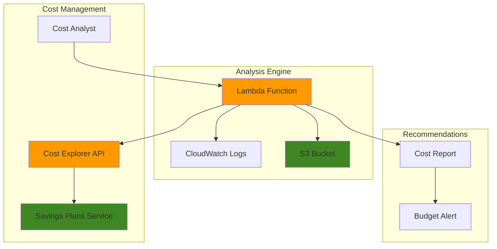

# Optimizing Costs with Automated Savings Plans

## Problem

Organizations struggle to optimize their AWS spending as compute usage scales across multiple services and regions. Without systematic analysis of historical usage patterns, they miss opportunities to reduce costs through commitment-based pricing models like Savings Plans. Manual cost analysis is time-consuming and prone to human error, leading to either over-commitment or under-utilization of cost-saving opportunities.

## Solution

Use AWS Cost Explorer APIs to automatically analyze historical usage patterns and generate personalized Savings Plans recommendations. This solution automates the collection of usage data, evaluates different commitment scenarios, and provides actionable recommendations for optimal cost savings while maintaining operational flexibility.

## Architecture Diagram



## Prerequisites

1. AWS account with appropriate permissions for Cost Explorer and Savings Plans
2. AWS CLI v2 installed and configured (or AWS CloudShell)
3. At least 60 days of historical usage data in your AWS account
4. Basic understanding of AWS compute services (EC2, Lambda, Fargate)
5. Estimated cost: $0.01 per API call + Lambda execution costs (under $5/month)

> **Note**: Cost Explorer APIs have a cost of $0.01 per request. This recipe will make approximately 10-15 API calls for comprehensive analysis.

> **Warning**: Ensure your IAM user or role has billing and cost management permissions. Cost Explorer access requires specific billing permissions that may not be available to all users by default.

## Preparation

```bash
# Set environment variables
export AWS_REGION=$(aws configure get region)
export AWS_ACCOUNT_ID=$(aws sts get-caller-identity \
    --query Account --output text)

# Generate unique identifiers for resources
RANDOM_SUFFIX=$(aws secretsmanager get-random-password \
    --exclude-punctuation --exclude-uppercase \
    --password-length 6 --require-each-included-type \
    --output text --query RandomPassword)

# Set resource names
export LAMBDA_FUNCTION_NAME="savings-plans-analyzer-${RANDOM_SUFFIX}"
export S3_BUCKET_NAME="cost-recommendations-${AWS_ACCOUNT_ID}-${RANDOM_SUFFIX}"
export IAM_ROLE_NAME="SavingsPlansAnalyzerRole-${RANDOM_SUFFIX}"

# Create S3 bucket for storing recommendations
aws s3 mb s3://${S3_BUCKET_NAME} --region ${AWS_REGION}

echo "✅ Created S3 bucket: ${S3_BUCKET_NAME}"
```

## Steps

1. **Create IAM Role for Cost Explorer Access**:

   AWS Identity and Access Management (IAM) provides the security foundation for our cost analysis solution. IAM roles enable secure, temporary credential delegation without hardcoding secrets, following the principle of least privilege. Cost Explorer APIs require specific permissions to analyze usage patterns and generate recommendations, while Savings Plans APIs need access to retrieve current commitments and offerings. This step creates a service-linked role that allows our Lambda function to securely interact with AWS billing and cost management services.

   ```bash
   # Create trust policy for Lambda
   cat > trust-policy.json << EOF
   {
       "Version": "2012-10-17",
       "Statement": [
           {
               "Effect": "Allow",
               "Principal": {
                   "Service": "lambda.amazonaws.com"
               },
               "Action": "sts:AssumeRole"
           }
       ]
   }
   EOF
   
   # Create IAM role
   aws iam create-role \
       --role-name ${IAM_ROLE_NAME} \
       --assume-role-policy-document file://trust-policy.json
   
   # Create policy for Cost Explorer and Savings Plans access
   cat > ce-policy.json << EOF
   {
       "Version": "2012-10-17",
       "Statement": [
           {
               "Effect": "Allow",
               "Action": [
                   "ce:GetSavingsPlansPurchaseRecommendation",
                   "ce:StartSavingsPlansPurchaseRecommendationGeneration",
                   "ce:GetCostAndUsage",
                   "ce:GetDimensionValues",
                   "ce:GetUsageReport",
                   "savingsplans:DescribeSavingsPlans",
                   "savingsplans:DescribeSavingsPlansOfferings",
                   "s3:PutObject",
                   "s3:GetObject",
                   "logs:CreateLogGroup",
                   "logs:CreateLogStream",
                   "logs:PutLogEvents"
               ],
               "Resource": "*"
           }
       ]
   }
   EOF
   
   aws iam put-role-policy \
       --role-name ${IAM_ROLE_NAME} \
       --policy-name CostExplorerAccess \
       --policy-document file://ce-policy.json
   
   # Get role ARN
   ROLE_ARN=$(aws iam get-role --role-name ${IAM_ROLE_NAME} \
       --query Role.Arn --output text)
   
   echo "✅ Created IAM role: ${ROLE_ARN}"
   ```

   The IAM role is now established with precise permissions for Cost Explorer and Savings Plans access. This security foundation ensures our analysis function can retrieve billing data while maintaining compliance with organizational security policies. The role ARN will be used by Lambda to assume these permissions during execution.

2. **Create Lambda Function for Savings Plans Analysis**:

   AWS Lambda provides serverless compute capabilities that perfectly match the episodic nature of cost analysis workloads. This function implements the core business logic for analyzing usage patterns across different Savings Plans types (Compute, EC2 Instance, and SageMaker). Lambda's event-driven architecture ensures cost-effective execution - you only pay when analysis runs, making it ideal for monthly or on-demand cost optimization tasks. The function processes multiple recommendation scenarios simultaneously, comparing different commitment terms and payment options to provide comprehensive savings opportunities.

   ```bash
   # Create Lambda function code
   cat > savings_analyzer.py << 'EOF'
   import json
   import boto3
   import datetime
   from decimal import Decimal
   
   def lambda_handler(event, context):
       ce_client = boto3.client('ce')
       s3_client = boto3.client('s3')
       
       # Define analysis parameters
       lookback_days = event.get('lookback_days', 'SIXTY_DAYS')
       term_years = event.get('term_years', 'ONE_YEAR')
       payment_option = event.get('payment_option', 'NO_UPFRONT')
       
       results = {
           'analysis_date': datetime.datetime.now().isoformat(),
           'parameters': {
               'lookback_days': lookback_days,
               'term_years': term_years,
               'payment_option': payment_option
           },
           'recommendations': []
       }
       
       # Analyze different Savings Plans types
       sp_types = ['COMPUTE_SP', 'EC2_INSTANCE_SP', 'SAGEMAKER_SP']
       
       for sp_type in sp_types:
           try:
               print(f"Analyzing {sp_type} recommendations...")
               
               # Get Savings Plans recommendations
               response = ce_client.get_savings_plans_purchase_recommendation(
                   SavingsPlansType=sp_type,
                   TermInYears=term_years,
                   PaymentOption=payment_option,
                   LookbackPeriodInDays=lookback_days,
                   PageSize=10
               )
               
               # Process recommendation data
               if 'SavingsPlansPurchaseRecommendation' in response:
                   rec = response['SavingsPlansPurchaseRecommendation']
                   summary = rec.get('SavingsPlansPurchaseRecommendationSummary', {})
                   
                   recommendation = {
                       'savings_plan_type': sp_type,
                       'summary': {
                           'estimated_monthly_savings': summary.get('EstimatedMonthlySavingsAmount', '0'),
                           'estimated_roi': summary.get('EstimatedROI', '0'),
                           'estimated_savings_percentage': summary.get('EstimatedSavingsPercentage', '0'),
                           'hourly_commitment': summary.get('HourlyCommitmentToPurchase', '0'),
                           'total_recommendations': summary.get('TotalRecommendationCount', '0')
                       },
                       'details': []
                   }
                   
                   # Add detailed recommendations
                   for detail in rec.get('SavingsPlansPurchaseRecommendationDetails', []):
                       recommendation['details'].append({
                           'account_id': detail.get('AccountId', ''),
                           'currency_code': detail.get('CurrencyCode', 'USD'),
                           'estimated_monthly_savings': detail.get('EstimatedMonthlySavingsAmount', '0'),
                           'estimated_roi': detail.get('EstimatedROI', '0'),
                           'hourly_commitment': detail.get('HourlyCommitmentToPurchase', '0'),
                           'upfront_cost': detail.get('UpfrontCost', '0'),
                           'savings_plans_details': detail.get('SavingsPlansDetails', {})
                       })
                   
                   results['recommendations'].append(recommendation)
               
           except Exception as e:
               print(f"Error analyzing {sp_type}: {str(e)}")
               results['recommendations'].append({
                   'savings_plan_type': sp_type,
                   'error': str(e)
               })
       
       # Calculate total potential savings
       total_monthly_savings = 0
       for rec in results['recommendations']:
           if 'error' not in rec:
               try:
                   savings = float(rec['summary']['estimated_monthly_savings'])
                   total_monthly_savings += savings
               except (ValueError, KeyError):
                   pass
       
       results['total_monthly_savings'] = total_monthly_savings
       results['annual_savings_potential'] = total_monthly_savings * 12
       
       # Save results to S3
       bucket_name = event.get('bucket_name')
       if bucket_name:
           timestamp = datetime.datetime.now().strftime('%Y%m%d_%H%M%S')
           key = f"savings-plans-recommendations/{timestamp}.json"
           
           s3_client.put_object(
               Bucket=bucket_name,
               Key=key,
               Body=json.dumps(results, indent=2, default=str),
               ContentType='application/json'
           )
           
           results['report_location'] = f"s3://{bucket_name}/{key}"
       
       return {
           'statusCode': 200,
           'body': json.dumps(results, indent=2, default=str)
       }
   EOF
   
   # Create deployment package
   zip -r savings-analyzer.zip savings_analyzer.py
   
   # Create Lambda function
   aws lambda create-function \
       --function-name ${LAMBDA_FUNCTION_NAME} \
       --runtime python3.12 \
       --role ${ROLE_ARN} \
       --handler savings_analyzer.lambda_handler \
       --zip-file fileb://savings-analyzer.zip \
       --timeout 300 \
       --memory-size 512
   
   echo "✅ Created Lambda function: ${LAMBDA_FUNCTION_NAME}"
   ```

   The Lambda function is now deployed and ready to analyze your AWS usage patterns. This serverless architecture automatically scales to handle varying analysis workloads while maintaining cost efficiency. The function can process multiple Savings Plans scenarios concurrently, providing comprehensive recommendations for optimal cost savings.

3. **Test Cost Explorer API Access**:

   Cost Explorer provides programmatic access to your AWS billing and usage data, enabling automated analysis of spending patterns over time. This verification step ensures your account has the necessary data history and API access required for Savings Plans analysis. Cost Explorer's APIs offer granular insights into service-level usage, which is essential for generating accurate commitment recommendations. The test query retrieves a sample of your historical costs grouped by service, validating that sufficient data exists for meaningful analysis.

   ```bash
   # Test basic Cost Explorer access with current date range
   START_DATE=$(date -d '2 months ago' +%Y-%m-01)
   END_DATE=$(date -d '1 month ago' +%Y-%m-01)
   
   aws ce get-cost-and-usage \
       --time-period Start=${START_DATE},End=${END_DATE} \
       --granularity MONTHLY \
       --metrics BlendedCost \
       --group-by Type=DIMENSION,Key=SERVICE \
       --query 'ResultsByTime[0].Groups[0:5].[Keys[0],Metrics.BlendedCost.Amount]' \
       --output table
   
   echo "✅ Cost Explorer API access verified"
   ```

   Cost Explorer API access is confirmed and your account has sufficient historical data for analysis. This validation ensures that subsequent Savings Plans recommendations will be based on comprehensive usage patterns rather than limited data sets.

4. **Generate Savings Plans Recommendations**:

   This step triggers the core analysis workflow that examines your historical usage patterns to identify optimal Savings Plans opportunities. The Lambda function analyzes three distinct Savings Plans types: Compute SP (applies to EC2, Fargate, and Lambda), EC2 Instance SP (applies only to EC2), and SageMaker SP (applies to SageMaker workloads). Each type offers different flexibility and discount levels, allowing you to match commitment strategies with your specific workload patterns. The analysis considers your lookback period, preferred term length, and payment options to generate personalized recommendations.

   ```bash
   # Create input parameters for analysis
   cat > analysis-params.json << EOF
   {
       "lookback_days": "SIXTY_DAYS",
       "term_years": "ONE_YEAR",
       "payment_option": "NO_UPFRONT",
       "bucket_name": "${S3_BUCKET_NAME}"
   }
   EOF
   
   # Invoke Lambda function for analysis
   aws lambda invoke \
       --function-name ${LAMBDA_FUNCTION_NAME} \
       --payload file://analysis-params.json \
       --output-file response.json
   
   # Display results
   cat response.json | jq '.body' | jq -r . | jq .
   
   echo "✅ Generated Savings Plans recommendations"
   ```

   The analysis is complete and comprehensive recommendations have been generated for all applicable Savings Plans types. These recommendations include estimated monthly savings, ROI calculations, and required hourly commitments, providing the data needed for informed cost optimization decisions.

5. **Analyze Different Commitment Scenarios**:

   Savings Plans offer three payment options that significantly impact upfront costs and total savings potential. No Upfront provides maximum cash flow flexibility with slightly lower discounts, Partial Upfront balances immediate costs with savings optimization, and All Upfront maximizes discount percentages but requires full commitment payment. This comparative analysis helps you understand the financial trade-offs between different payment strategies, enabling alignment with your organization's cash flow preferences and financial policies.

   ```bash
   # Test different payment options
   for payment_option in "NO_UPFRONT" "PARTIAL_UPFRONT" "ALL_UPFRONT"; do
       echo "Analyzing ${payment_option} payment option..."
       
       # Create scenario-specific parameters
       cat > scenario-params.json << EOF
   {
       "lookback_days": "SIXTY_DAYS",
       "term_years": "ONE_YEAR",
       "payment_option": "${payment_option}",
       "bucket_name": "${S3_BUCKET_NAME}"
   }
   EOF
       
       # Run analysis
       aws lambda invoke \
           --function-name ${LAMBDA_FUNCTION_NAME} \
           --payload file://scenario-params.json \
           --output-file "response_${payment_option}.json"
       
       # Extract total savings
       TOTAL_SAVINGS=$(cat "response_${payment_option}.json" | \
           jq -r '.body' | jq -r . | jq -r '.total_monthly_savings')
       
       echo "  Monthly savings potential: $${TOTAL_SAVINGS}"
   done
   
   echo "✅ Analyzed multiple payment scenarios"
   ```

   All payment option scenarios have been analyzed, providing a complete picture of savings opportunities across different financial commitment strategies. This comparative data enables you to select the optimal balance between upfront investment and total cost reduction.

6. **Create Detailed Cost Analysis Report**:

   Comprehensive cost reporting provides essential context for Savings Plans decisions by analyzing current commitments and historical purchase patterns. This step examines your existing Savings Plans to identify utilization rates and potential gaps in coverage. The historical cost analysis reveals spending trends across different purchase types (On-Demand, Reserved Instances, Savings Plans), helping you understand where additional commitments could provide the most value. This data forms the foundation for strategic cost optimization planning.

   ```bash
   # Get current Savings Plans commitments
   aws savingsplans describe-savings-plans \
       --states Active \
       --query 'SavingsPlans[*].[SavingsPlanId,SavingsPlanType,Commitment,TermDurationInSeconds]' \
       --output table
   
   # Create comprehensive cost report with current year
   CURRENT_YEAR=$(date +%Y)
   
   aws ce get-cost-and-usage \
       --time-period Start=${CURRENT_YEAR}-01-01,End=${CURRENT_YEAR}-12-31 \
       --granularity MONTHLY \
       --metrics BlendedCost UnblendedCost \
       --group-by Type=DIMENSION,Key=PURCHASE_TYPE \
       --query 'ResultsByTime[*].[TimePeriod.Start,Groups[*].[Keys[0],Metrics.BlendedCost.Amount]]' \
       --output json > cost-analysis.json
   
   # Upload cost analysis to S3
   aws s3 cp cost-analysis.json \
       s3://${S3_BUCKET_NAME}/cost-analysis/historical-usage.json
   
   echo "✅ Created detailed cost analysis report"
   ```

   The comprehensive cost analysis report is now available in S3, providing detailed insights into your spending patterns and existing commitments. This historical perspective enables more informed decisions about future Savings Plans purchases and helps identify optimization opportunities.

7. **Set Up Automated Recommendation Generation**:

   Amazon EventBridge enables automated, schedule-based execution of cost analysis workflows, ensuring continuous monitoring of optimization opportunities. Monthly analysis captures evolving usage patterns and seasonal variations that could impact Savings Plans effectiveness. This automation removes the burden of manual cost reviews while ensuring recommendations stay current with changing workload demands. The event-driven architecture integrates seamlessly with Lambda, providing reliable execution without infrastructure management overhead.

   ```bash
   # Create EventBridge rule for monthly analysis
   aws events put-rule \
       --name "MonthlySavingsPlansAnalysis" \
       --schedule-expression "rate(30 days)" \
       --description "Monthly Savings Plans recommendations generation"
   
   # Add Lambda function as target
   aws lambda add-permission \
       --function-name ${LAMBDA_FUNCTION_NAME} \
       --statement-id "AllowEventBridgeInvoke" \
       --action lambda:InvokeFunction \
       --principal events.amazonaws.com \
       --source-arn "arn:aws:events:${AWS_REGION}:${AWS_ACCOUNT_ID}:rule/MonthlySavingsPlansAnalysis"
   
   # Create target configuration
   cat > targets.json << EOF
   [
       {
           "Id": "1",
           "Arn": "arn:aws:lambda:${AWS_REGION}:${AWS_ACCOUNT_ID}:function:${LAMBDA_FUNCTION_NAME}",
           "Input": "{\"lookback_days\": \"SIXTY_DAYS\", \"term_years\": \"ONE_YEAR\", \"payment_option\": \"NO_UPFRONT\", \"bucket_name\": \"${S3_BUCKET_NAME}\"}"
       }
   ]
   EOF
   
   aws events put-targets \
       --rule "MonthlySavingsPlansAnalysis" \
       --targets file://targets.json
   
   echo "✅ Set up automated monthly analysis"
   ```

   Automated monthly analysis is now configured and will run continuously to identify new optimization opportunities. This ensures your cost optimization strategy adapts to changing usage patterns without requiring manual intervention.

8. **Create CloudWatch Dashboard for Cost Monitoring**:

   Amazon CloudWatch provides comprehensive observability for your cost analysis infrastructure, enabling monitoring of Lambda function performance, error rates, and execution patterns. The dashboard visualizes key operational metrics that help ensure reliable analysis execution and troubleshoot any issues that might affect recommendation quality. CloudWatch Logs integration provides detailed execution traces for audit purposes and debugging complex scenarios. This monitoring foundation is essential for maintaining trust in automated cost optimization workflows.

   ```bash
   # Create dashboard configuration
   cat > dashboard-config.json << EOF
   {
       "widgets": [
           {
               "type": "metric",
               "x": 0,
               "y": 0,
               "width": 12,
               "height": 6,
               "properties": {
                   "metrics": [
                       ["AWS/Lambda", "Duration", "FunctionName", "${LAMBDA_FUNCTION_NAME}"],
                       ["AWS/Lambda", "Invocations", "FunctionName", "${LAMBDA_FUNCTION_NAME}"],
                       ["AWS/Lambda", "Errors", "FunctionName", "${LAMBDA_FUNCTION_NAME}"]
                   ],
                   "view": "timeSeries",
                   "stacked": false,
                   "region": "${AWS_REGION}",
                   "title": "Savings Plans Analyzer Performance",
                   "period": 300
               }
           },
           {
               "type": "log",
               "x": 0,
               "y": 6,
               "width": 24,
               "height": 6,
               "properties": {
                   "query": "SOURCE '/aws/lambda/${LAMBDA_FUNCTION_NAME}' | fields @timestamp, @message | sort @timestamp desc | limit 50",
                   "region": "${AWS_REGION}",
                   "title": "Recent Analysis Logs"
               }
           }
       ]
   }
   EOF
   
   # Create dashboard
   aws cloudwatch put-dashboard \
       --dashboard-name "SavingsPlansRecommendations" \
       --dashboard-body file://dashboard-config.json
   
   echo "✅ Created CloudWatch dashboard for monitoring"
   ```

   The CloudWatch dashboard is now active and provides real-time visibility into your cost analysis infrastructure performance. This monitoring capability ensures reliable operation and enables proactive identification of any issues affecting recommendation generation.

## Validation & Testing

1. **Verify Savings Plans Recommendations Generation**:

   ```bash
   # Check Lambda function logs
   aws logs describe-log-groups \
       --log-group-name-prefix "/aws/lambda/${LAMBDA_FUNCTION_NAME}" \
       --query 'logGroups[0].logGroupName' --output text
   
   # Get recent log events
   aws logs filter-log-events \
       --log-group-name "/aws/lambda/${LAMBDA_FUNCTION_NAME}" \
       --start-time $(date -d '1 hour ago' +%s)000 \
       --query 'events[*].message' --output text
   ```

   Expected output: Log entries showing successful API calls and recommendation generation

2. **Test Different Savings Plans Types**:

   ```bash
   # Test EC2 Instance Savings Plans recommendations
   aws ce get-savings-plans-purchase-recommendation \
       --savings-plans-type EC2_INSTANCE_SP \
       --term-in-years ONE_YEAR \
       --payment-option NO_UPFRONT \
       --lookback-period-in-days SIXTY_DAYS \
       --page-size 5 \
       --query 'SavingsPlansPurchaseRecommendation.SavingsPlansPurchaseRecommendationSummary'
   ```

3. **Validate S3 Report Generation**:

   ```bash
   # List generated reports
   aws s3 ls s3://${S3_BUCKET_NAME}/savings-plans-recommendations/ --recursive
   
   # Download and review latest report
   LATEST_REPORT=$(aws s3 ls s3://${S3_BUCKET_NAME}/savings-plans-recommendations/ \
       --recursive | sort | tail -n 1 | awk '{print $4}')
   
   aws s3 cp s3://${S3_BUCKET_NAME}/${LATEST_REPORT} latest-report.json
   cat latest-report.json | jq '.total_monthly_savings'
   ```

## Cleanup

1. **Remove EventBridge Rule and Targets**:

   ```bash
   # Remove targets from rule
   aws events remove-targets \
       --rule "MonthlySavingsPlansAnalysis" \
       --ids "1"
   
   # Delete EventBridge rule
   aws events delete-rule \
       --name "MonthlySavingsPlansAnalysis"
   
   echo "✅ Removed EventBridge automation"
   ```

2. **Delete Lambda Function**:

   ```bash
   # Delete Lambda function
   aws lambda delete-function \
       --function-name ${LAMBDA_FUNCTION_NAME}
   
   echo "✅ Deleted Lambda function"
   ```

3. **Remove IAM Role and Policies**:

   ```bash
   # Delete role policy
   aws iam delete-role-policy \
       --role-name ${IAM_ROLE_NAME} \
       --policy-name CostExplorerAccess
   
   # Delete IAM role
   aws iam delete-role \
       --role-name ${IAM_ROLE_NAME}
   
   echo "✅ Removed IAM role"
   ```

4. **Clean Up S3 Bucket and Local Files**:

   ```bash
   # Empty S3 bucket
   aws s3 rm s3://${S3_BUCKET_NAME} --recursive
   
   # Delete S3 bucket
   aws s3 rb s3://${S3_BUCKET_NAME}
   
   # Remove local files
   rm -f trust-policy.json ce-policy.json savings_analyzer.py \
         savings-analyzer.zip analysis-params.json response*.json \
         scenario-params.json cost-analysis.json targets.json \
         dashboard-config.json latest-report.json
   
   echo "✅ Cleaned up all resources"
   ```

5. **Delete CloudWatch Dashboard**:

   ```bash
   # Delete dashboard
   aws cloudwatch delete-dashboards \
       --dashboard-names "SavingsPlansRecommendations"
   
   echo "✅ Deleted CloudWatch dashboard"
   ```

## Discussion

This solution provides a comprehensive approach to cost optimization through automated Savings Plans analysis. The Cost Explorer API enables programmatic access to AWS usage patterns, allowing organizations to make data-driven decisions about commitment-based pricing. By analyzing different Savings Plans types (Compute, EC2 Instance, and SageMaker), the solution covers the most common AWS compute workloads, following AWS Well-Architected Framework cost optimization principles.

The Lambda-based architecture ensures scalability and cost-effectiveness, as the analysis function only runs when needed. The automated scheduling through EventBridge provides continuous monitoring without manual intervention. The S3 integration enables historical tracking of recommendations and decision-making processes for compliance and audit purposes. This approach aligns with AWS best practices for serverless architectures and event-driven design patterns.

Key benefits include reduced manual effort in cost analysis, improved accuracy through automated calculations, and consistent evaluation of optimization opportunities. The solution also provides flexibility to analyze different commitment scenarios (payment options and terms) to find the optimal balance between upfront costs and long-term savings. For more information on AWS Cost Explorer best practices, see the [AWS Cost Management User Guide](https://docs.aws.amazon.com/cost-management/latest/userguide/ce-api-best-practices.html).

> **Tip**: Run the analysis monthly to capture seasonal usage patterns and ensure recommendations reflect current workload characteristics, as recommended in the [AWS Savings Plans User Guide](https://docs.aws.amazon.com/savingsplans/latest/userguide/what-is-savings-plans.html).

## Challenge

Extend this solution by implementing these enhancements:

1. **Multi-Account Analysis**: Modify the Lambda function to analyze Savings Plans recommendations across multiple AWS accounts in an organization using AWS Organizations APIs for centralized cost optimization.

2. **ROI Threshold Automation**: Add logic to automatically filter recommendations based on minimum ROI thresholds and create purchase recommendations only for high-value opportunities exceeding predefined criteria.

3. **Integration with AWS Budgets**: Connect the recommendations to AWS Budgets API to automatically create budget alerts when potential savings exceed predefined thresholds or when utilization drops below expected levels.

4. **Slack/Teams Integration**: Build notification workflows that send formatted Savings Plans recommendations to collaboration platforms with approval workflows for purchase decisions and automated reporting.

5. **Cost Anomaly Integration**: Combine with AWS Cost Anomaly Detection to identify unusual spending patterns that might affect Savings Plans utilization and adjust recommendations accordingly.

## Infrastructure Code

### Available Infrastructure as Code:

- [Infrastructure Code Overview](code/README.md) - Detailed description of all infrastructure components
- [AWS CDK (Python)](code/cdk-python/) - AWS CDK Python implementation
- [AWS CDK (TypeScript)](code/cdk-typescript/) - AWS CDK TypeScript implementation
- [CloudFormation](code/cloudformation.yaml) - AWS CloudFormation template
- [Bash CLI Scripts](code/scripts/) - Example bash scripts using AWS CLI commands to deploy infrastructure
- [Terraform](code/terraform/) - Terraform configuration files