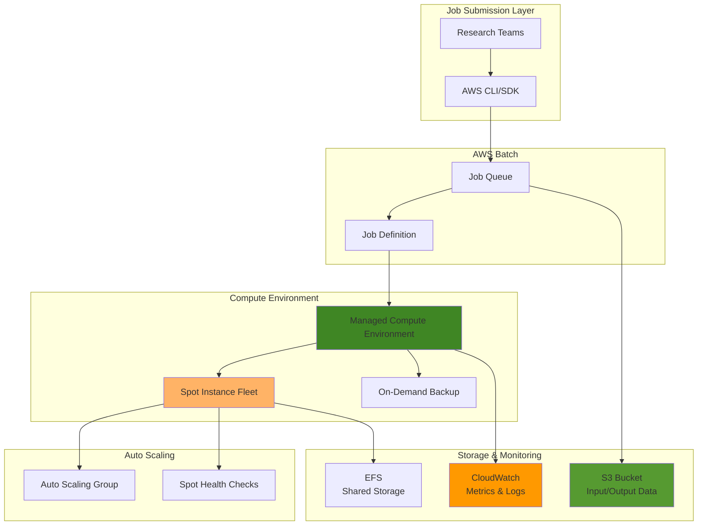

# Optimizing HPC Workloads with AWS Batch and Spot Instances

## Problem

Research organizations and scientific computing teams require massive computational resources for simulations, modeling, and data analysis, but face budget constraints that limit their ability to scale. Traditional on-demand instances can cost thousands of dollars for multi-hour HPC workloads, making it difficult to perform the iterative testing and large-scale computations needed for breakthrough research. Without cost-effective scaling options, teams often compromise on computational scope or delay critical research timelines.

## Solution

AWS Batch with Spot instances provides a cost-optimized solution that can achieve up to 90% savings compared to on-demand pricing while maintaining automatic scaling and fault tolerance. This approach leverages Spot instance interruption handling, checkpoint/restart capabilities, and intelligent job retry mechanisms to create a resilient HPC pipeline that automatically scales from zero to thousands of cores based on workload demand.

## Architecture Diagram



## Prerequisites

1. AWS account with appropriate permissions for Batch, EC2, S3, CloudWatch, EFS, and IAM
2. AWS CLI v2 installed and configured (or AWS CloudShell)
3. Basic understanding of containerization and Docker concepts
4. Familiarity with HPC workload characteristics and checkpoint/restart concepts
5. Estimated cost: $5-20 for testing (depending on compute time and Spot pricing)

> **Note**: Spot instance pricing fluctuates based on supply and demand. Current pricing typically ranges from 10-30% of on-demand costs, but can vary by instance type and availability zone.

## Preparation

```bash
# Set environment variables
export AWS_REGION=$(aws configure get region)
export AWS_ACCOUNT_ID=$(aws sts get-caller-identity \
    --query Account --output text)

# Generate unique identifiers for resources
RANDOM_SUFFIX=$(aws secretsmanager get-random-password \
    --exclude-punctuation --exclude-uppercase \
    --password-length 6 --require-each-included-type \
    --output text --query RandomPassword)

export BUCKET_NAME="hpc-batch-${RANDOM_SUFFIX}"
export COMPUTE_ENV_NAME="hpc-spot-compute-${RANDOM_SUFFIX}"
export JOB_QUEUE_NAME="hpc-job-queue-${RANDOM_SUFFIX}"
export JOB_DEFINITION_NAME="hpc-simulation-${RANDOM_SUFFIX}"

# Create S3 bucket for data storage
aws s3 mb s3://${BUCKET_NAME} --region ${AWS_REGION}

# Create IAM role for Batch service
aws iam create-role \
    --role-name "AWSBatchServiceRole-${RANDOM_SUFFIX}" \
    --assume-role-policy-document '{
        "Version": "2012-10-17",
        "Statement": [
            {
                "Effect": "Allow",
                "Principal": {
                    "Service": "batch.amazonaws.com"
                },
                "Action": "sts:AssumeRole"
            }
        ]
    }'

# Attach AWS managed policy for Batch service
aws iam attach-role-policy \
    --role-name "AWSBatchServiceRole-${RANDOM_SUFFIX}" \
    --policy-arn "arn:aws:iam::aws:policy/service-role/AWSBatchServiceRole"

export BATCH_SERVICE_ROLE_ARN="arn:aws:iam::${AWS_ACCOUNT_ID}:role/AWSBatchServiceRole-${RANDOM_SUFFIX}"

echo "✅ Environment prepared successfully"
```

## Steps

1. **Create IAM Instance Profile for EC2 Instances**:

   AWS Batch requires EC2 instances to have appropriate IAM permissions to register with the ECS agent and access AWS services. This instance profile enables Spot instances to communicate with Batch, download container images from ECR, and write logs to CloudWatch while maintaining security best practices through the principle of least privilege.

   ```bash
   # Create IAM role for EC2 instances
   aws iam create-role \
       --role-name "ecsInstanceRole-${RANDOM_SUFFIX}" \
       --assume-role-policy-document '{
           "Version": "2012-10-17",
           "Statement": [
               {
                   "Effect": "Allow",
                   "Principal": {
                       "Service": "ec2.amazonaws.com"
                   },
                   "Action": "sts:AssumeRole"
               }
           ]
       }'
   
   # Attach required policies for ECS and Batch functionality
   aws iam attach-role-policy \
       --role-name "ecsInstanceRole-${RANDOM_SUFFIX}" \
       --policy-arn "arn:aws:iam::aws:policy/service-role/AmazonEC2ContainerServiceforEC2Role"
   
   aws iam attach-role-policy \
       --role-name "ecsInstanceRole-${RANDOM_SUFFIX}" \
       --policy-arn "arn:aws:iam::aws:policy/AmazonS3ReadOnlyAccess"
   
   # Create instance profile
   aws iam create-instance-profile \
       --instance-profile-name "ecsInstanceProfile-${RANDOM_SUFFIX}"
   
   aws iam add-role-to-instance-profile \
       --instance-profile-name "ecsInstanceProfile-${RANDOM_SUFFIX}" \
       --role-name "ecsInstanceRole-${RANDOM_SUFFIX}"
   
   export INSTANCE_PROFILE_ARN="arn:aws:iam::${AWS_ACCOUNT_ID}:instance-profile/ecsInstanceProfile-${RANDOM_SUFFIX}"
   
   echo "✅ IAM roles and instance profile created"
   ```

   The instance profile now enables EC2 instances to function as Batch compute nodes with secure access to required AWS services. This security foundation ensures that Spot instances can properly register with the Batch service and access container images without compromising credential security.

2. **Create Shared Storage with Amazon EFS**:

   Amazon EFS provides highly available, scalable shared storage that enables HPC workloads to share data across multiple compute instances. This network file system supports concurrent access from thousands of instances, making it ideal for distributed computing scenarios where multiple jobs need access to shared datasets, libraries, or checkpoint files.

   ```bash
   # Get default VPC information
   export DEFAULT_VPC_ID=$(aws ec2 describe-vpcs \
       --filters "Name=is-default,Values=true" \
       --query "Vpcs[0].VpcId" --output text)
   
   export SUBNET_IDS=$(aws ec2 describe-subnets \
       --filters "Name=vpc-id,Values=${DEFAULT_VPC_ID}" \
       --query "Subnets[].SubnetId" --output text | tr '\t' ',')
   
   # Create EFS file system for shared storage
   export EFS_ID=$(aws efs create-file-system \
       --performance-mode generalPurpose \
       --throughput-mode provisioned \
       --provisioned-throughput-in-mibps 100 \
       --tags Key=Name,Value="hpc-shared-storage-${RANDOM_SUFFIX}" \
       --query "FileSystemId" --output text)
   
   # Create security group for EFS
   export EFS_SECURITY_GROUP_ID=$(aws ec2 create-security-group \
       --group-name "efs-sg-${RANDOM_SUFFIX}" \
       --description "Security group for EFS file system" \
       --vpc-id ${DEFAULT_VPC_ID} \
       --query "GroupId" --output text)
   
   # Allow NFS traffic from Batch compute instances
   aws ec2 authorize-security-group-ingress \
       --group-id ${EFS_SECURITY_GROUP_ID} \
       --protocol tcp \
       --port 2049 \
       --source-group ${EFS_SECURITY_GROUP_ID}
   
   echo "✅ EFS file system created for shared storage"
   ```

   The EFS file system now provides a high-performance shared storage layer that enables HPC applications to share data, store checkpoints, and access common libraries across all compute instances. This shared storage foundation is essential for distributed computing workloads that require coordinated data access.

3. **Create Spot-Optimized Compute Environment**:

   The compute environment defines how AWS Batch manages the underlying EC2 infrastructure using Spot instances with fault-tolerant configuration. This setup uses the SPOT_PRICE_CAPACITY_OPTIMIZED allocation strategy to select instances from the deepest capacity pools while considering price, minimizing interruption risk while maximizing cost savings across multiple instance families.

   ```bash
   # Create security group for Batch compute instances
   export SECURITY_GROUP_ID=$(aws ec2 create-security-group \
       --group-name "batch-compute-sg-${RANDOM_SUFFIX}" \
       --description "Security group for AWS Batch compute environment" \
       --vpc-id ${DEFAULT_VPC_ID} \
       --query "GroupId" --output text)
   
   # Allow access to EFS from compute instances
   aws ec2 authorize-security-group-ingress \
       --group-id ${SECURITY_GROUP_ID} \
       --protocol tcp \
       --port 2049 \
       --source-group ${EFS_SECURITY_GROUP_ID}
   
   # Create compute environment with Spot instance configuration
   aws batch create-compute-environment \
       --compute-environment-name ${COMPUTE_ENV_NAME} \
       --type MANAGED \
       --state ENABLED \
       --compute-resources '{
           "type": "EC2",
           "allocationStrategy": "SPOT_PRICE_CAPACITY_OPTIMIZED",
           "minvCpus": 0,
           "maxvCpus": 1000,
           "desiredvCpus": 0,
           "instanceTypes": ["c5.large", "c5.xlarge", "c5.2xlarge", "c4.large", "c4.xlarge", "m5.large", "m5.xlarge"],
           "bidPercentage": 80,
           "ec2Configuration": [{
               "imageType": "ECS_AL2"
           }],
           "subnets": ["'${SUBNET_IDS//,/\",\"}'"],
           "securityGroupIds": ["'${SECURITY_GROUP_ID}'"],
           "instanceRole": "'${INSTANCE_PROFILE_ARN}'"
       }' \
       --service-role ${BATCH_SERVICE_ROLE_ARN}
   
   echo "✅ Spot-optimized compute environment created"
   ```

   The compute environment is now configured with intelligent Spot instance selection across multiple instance types and availability zones. This diversification strategy, combined with the 80% bid percentage and price-capacity optimized allocation, provides excellent cost optimization while maintaining high availability through AWS's advanced capacity optimization algorithms.

4. **Create Job Queue with Priority Configuration**:

   The job queue manages job scheduling and prioritization across the compute environment. This configuration enables automatic scaling from zero instances when no jobs are running to hundreds of cores when workloads are submitted, providing cost-effective resource utilization for intermittent HPC workloads with intelligent job placement.

   ```bash
   # Wait for compute environment to become VALID
   echo "Waiting for compute environment to become valid..."
   aws batch wait compute-environment-ready \
       --compute-environments ${COMPUTE_ENV_NAME}
   
   # Create job queue linked to the compute environment
   aws batch create-job-queue \
       --job-queue-name ${JOB_QUEUE_NAME} \
       --state ENABLED \
       --priority 1 \
       --compute-environment-order '[{
           "order": 1,
           "computeEnvironment": "'${COMPUTE_ENV_NAME}'"
       }]'
   
   echo "✅ Job queue created and linked to compute environment"
   ```

   The job queue now provides the scheduling layer that automatically routes HPC jobs to available Spot instances. This setup enables seamless job execution with automatic retry capabilities when Spot instances are interrupted, ensuring computational work continues without manual intervention.

5. **Register HPC Job Definition with Fault Tolerance**:

   The job definition serves as a blueprint for HPC containers, specifying resource requirements, retry strategies, and environment configuration. This definition includes checkpoint/restart capabilities and intelligent retry logic that handles Spot interruptions gracefully while maintaining computational progress through sophisticated error detection.

   ```bash
   # Create job definition for HPC simulation workload
   aws batch register-job-definition \
       --job-definition-name ${JOB_DEFINITION_NAME} \
       --type container \
       --container-properties '{
           "image": "busybox",
           "vcpus": 2,
           "memory": 4096,
           "jobRoleArn": "arn:aws:iam::'${AWS_ACCOUNT_ID}':role/ecsInstanceRole-'${RANDOM_SUFFIX}'",
           "command": [
               "sh", "-c",
               "echo Starting HPC simulation at $(date); sleep 300; echo Simulation completed at $(date)"
           ],
           "mountPoints": [{
               "sourceVolume": "efs-storage",
               "containerPath": "/shared",
               "readOnly": false
           }],
           "volumes": [{
               "name": "efs-storage",
               "efsVolumeConfiguration": {
                   "fileSystemId": "'${EFS_ID}'"
               }
           }],
           "environment": [
               {"name": "S3_BUCKET", "value": "'${BUCKET_NAME}'"},
               {"name": "AWS_DEFAULT_REGION", "value": "'${AWS_REGION}'"}
           ]
       }' \
       --retry-strategy '{
           "attempts": 3
       }' \
       --timeout '{"attemptDurationSeconds": 3600}'
   
   echo "✅ HPC job definition registered with fault tolerance"
   ```

   The job definition now includes sophisticated error handling with automatic retry capabilities for infrastructure failures and shared storage access through EFS mounting. This configuration ensures that HPC workloads can leverage both persistent and shared storage while maintaining resilience against Spot instance interruptions.

6. **Submit Test HPC Job to Validate Configuration**:

   Submitting a test job validates the entire pipeline from job submission through Spot instance provisioning to job completion. This verification ensures that the cost-optimized infrastructure can successfully execute HPC workloads with proper monitoring and logging throughout the execution lifecycle, including shared storage access.

   ```bash
   # Submit a test job to validate the setup
   export JOB_ID=$(aws batch submit-job \
       --job-name "hpc-test-job-$(date +%s)" \
       --job-queue ${JOB_QUEUE_NAME} \
       --job-definition ${JOB_DEFINITION_NAME} \
       --query "jobId" --output text)
   
   echo "✅ Test job submitted with ID: ${JOB_ID}"
   
   # Monitor job status
   echo "Monitoring job status..."
   aws batch describe-jobs --jobs ${JOB_ID} \
       --query "jobs[0].status" --output text
   ```

   The test job submission demonstrates the complete workflow from job queue placement through Spot instance provisioning to container execution with shared storage access. This validation confirms that the infrastructure can handle real HPC workloads with proper cost optimization and fault tolerance mechanisms in place.

7. **Configure CloudWatch Monitoring for Cost and Performance Tracking**:

   CloudWatch monitoring provides visibility into Spot instance utilization, cost savings, and job performance metrics. This observability layer enables optimization of the HPC pipeline by tracking key performance indicators like job completion rates, Spot interruption frequency, and compute cost efficiency across the entire infrastructure stack.

   ```bash
   # Create CloudWatch log group for Batch jobs
   aws logs create-log-group \
       --log-group-name "/aws/batch/job" \
       --retention-in-days 7
   
   # Create custom metric filter for cost tracking
   aws logs put-metric-filter \
       --log-group-name "/aws/batch/job" \
       --filter-name "SpotInstanceSavings" \
       --filter-pattern "[timestamp, level=\"INFO\", message=\"*SPOT_SAVINGS*\"]" \
       --metric-transformations \
           metricName=SpotSavings,metricNamespace=HPC/Batch,metricValue=1
   
   # Set up CloudWatch alarm for failed jobs
   aws cloudwatch put-metric-alarm \
       --alarm-name "HPC-Batch-FailedJobs-${RANDOM_SUFFIX}" \
       --alarm-description "Alert when Batch jobs fail" \
       --metric-name FailedJobs \
       --namespace AWS/Batch \
       --statistic Sum \
       --period 300 \
       --threshold 5 \
       --comparison-operator GreaterThanThreshold \
       --evaluation-periods 1 \
       --dimensions Name=JobQueue,Value=${JOB_QUEUE_NAME}
   
   echo "✅ CloudWatch monitoring configured for cost and performance tracking"
   ```

   The monitoring infrastructure now provides comprehensive visibility into HPC workload performance and cost efficiency. This enables data-driven optimization of Spot instance selection, job retry strategies, and resource allocation based on actual usage patterns and business requirements.

## Validation & Testing

1. Verify compute environment is active and ready:

   ```bash
   # Check compute environment status
   aws batch describe-compute-environments \
       --compute-environments ${COMPUTE_ENV_NAME} \
       --query "computeEnvironments[0].status" --output text
   ```

   Expected output: `VALID`

2. Confirm job queue is operational:

   ```bash
   # Verify job queue status
   aws batch describe-job-queues \
       --job-queues ${JOB_QUEUE_NAME} \
       --query "jobQueues[0].state" --output text
   ```

   Expected output: `ENABLED`

3. Test Spot instance provisioning:

   ```bash
   # Submit multiple jobs to trigger scaling
   for i in {1..3}; do
       aws batch submit-job \
           --job-name "scaling-test-${i}" \
           --job-queue ${JOB_QUEUE_NAME} \
           --job-definition ${JOB_DEFINITION_NAME}
   done
   
   # Monitor active instances
   aws batch describe-compute-environments \
       --compute-environments ${COMPUTE_ENV_NAME} \
       --query "computeEnvironments[0].computeResources.desiredvCpus"
   ```

4. Validate EFS shared storage access:

   ```bash
   # Check EFS file system status
   aws efs describe-file-systems \
       --file-system-id ${EFS_ID} \
       --query "FileSystems[0].LifeCycleState" --output text
   ```

   Expected output: `available`

5. Validate cost optimization metrics:

   ```bash
   # Check CloudWatch metrics for cost savings
   aws cloudwatch get-metric-statistics \
       --namespace AWS/Batch \
       --metric-name SubmittedJobs \
       --dimensions Name=JobQueue,Value=${JOB_QUEUE_NAME} \
       --start-time $(date -u -d '1 hour ago' +%Y-%m-%dT%H:%M:%S) \
       --end-time $(date -u +%Y-%m-%dT%H:%M:%S) \
       --period 300 \
       --statistics Sum
   ```

## Cleanup

1. Cancel any running jobs:

   ```bash
   # List and cancel running jobs
   aws batch list-jobs --job-queue ${JOB_QUEUE_NAME} \
       --job-status RUNNING \
       --query "jobSummaryList[].jobId" --output text | \
   while read JOB_ID; do
       if [ ! -z "$JOB_ID" ]; then
           aws batch cancel-job --job-id $JOB_ID \
               --reason "Cleanup operation"
       fi
   done
   
   echo "✅ Running jobs cancelled"
   ```

2. Disable and delete job queue:

   ```bash
   # Disable job queue
   aws batch update-job-queue \
       --job-queue ${JOB_QUEUE_NAME} \
       --state DISABLED
   
   # Delete job queue
   aws batch delete-job-queue \
       --job-queue ${JOB_QUEUE_NAME}
   
   echo "✅ Job queue deleted"
   ```

3. Disable and delete compute environment:

   ```bash
   # Disable compute environment
   aws batch update-compute-environment \
       --compute-environment ${COMPUTE_ENV_NAME} \
       --state DISABLED
   
   # Delete compute environment
   aws batch delete-compute-environment \
       --compute-environment ${COMPUTE_ENV_NAME}
   
   echo "✅ Compute environment deleted"
   ```

4. Clean up EFS resources:

   ```bash
   # Delete EFS file system
   aws efs delete-file-system --file-system-id ${EFS_ID}
   
   # Delete EFS security group
   aws ec2 delete-security-group --group-id ${EFS_SECURITY_GROUP_ID}
   
   echo "✅ EFS resources deleted"
   ```

5. Clean up IAM resources:

   ```bash
   # Detach policies and delete IAM resources
   aws iam remove-role-from-instance-profile \
       --instance-profile-name "ecsInstanceProfile-${RANDOM_SUFFIX}" \
       --role-name "ecsInstanceRole-${RANDOM_SUFFIX}"
   
   aws iam delete-instance-profile \
       --instance-profile-name "ecsInstanceProfile-${RANDOM_SUFFIX}"
   
   aws iam detach-role-policy \
       --role-name "ecsInstanceRole-${RANDOM_SUFFIX}" \
       --policy-arn "arn:aws:iam::aws:policy/service-role/AmazonEC2ContainerServiceforEC2Role"
   
   aws iam detach-role-policy \
       --role-name "ecsInstanceRole-${RANDOM_SUFFIX}" \
       --policy-arn "arn:aws:iam::aws:policy/AmazonS3ReadOnlyAccess"
   
   aws iam delete-role --role-name "ecsInstanceRole-${RANDOM_SUFFIX}"
   
   aws iam detach-role-policy \
       --role-name "AWSBatchServiceRole-${RANDOM_SUFFIX}" \
       --policy-arn "arn:aws:iam::aws:policy/service-role/AWSBatchServiceRole"
   
   aws iam delete-role --role-name "AWSBatchServiceRole-${RANDOM_SUFFIX}"
   
   echo "✅ IAM resources cleaned up"
   ```

6. Remove S3 bucket and CloudWatch resources:

   ```bash
   # Empty and delete S3 bucket
   aws s3 rm s3://${BUCKET_NAME} --recursive
   aws s3 rb s3://${BUCKET_NAME}
   
   # Delete CloudWatch resources
   aws logs delete-log-group --log-group-name "/aws/batch/job"
   aws cloudwatch delete-alarms \
       --alarm-names "HPC-Batch-FailedJobs-${RANDOM_SUFFIX}"
   
   # Delete security group
   aws ec2 delete-security-group --group-id ${SECURITY_GROUP_ID}
   
   echo "✅ All resources cleaned up successfully"
   ```

## Discussion

Building cost-optimized HPC pipelines with AWS Batch and Spot instances represents a paradigm shift from traditional fixed-capacity clusters to elastic, pay-per-use computing resources. This architecture enables research organizations to access enterprise-grade computational resources while achieving dramatic cost reductions through intelligent use of excess AWS capacity. The combination of Spot instances with AWS Batch's managed infrastructure provides automatic scaling, fault tolerance, and simplified job management that rivals dedicated HPC clusters at a fraction of the cost. For comprehensive guidance on Spot instance best practices, review the [AWS Batch User Guide](https://docs.aws.amazon.com/batch/latest/userguide/what-is-batch.html) and [EC2 Spot Instance documentation](https://docs.aws.amazon.com/AWSEC2/latest/UserGuide/spot-best-practices.html).

The SPOT_PRICE_CAPACITY_OPTIMIZED allocation strategy employed in this solution leverages AWS's real-time capacity analytics to select instance types from the deepest Spot capacity pools while considering both price and capacity optimization, significantly reducing interruption rates compared to price-only strategies. According to AWS documentation, this approach provides the optimal balance between cost savings and interruption resilience. The retry mechanism with intelligent failure detection ensures that legitimate infrastructure interruptions don't impact computational progress, while application-level failures are properly identified and handled. For detailed implementation patterns, consult the [AWS Batch Best Practices Guide](https://docs.aws.amazon.com/batch/latest/userguide/best-practices-general.html) and [Well-Architected HPC Framework](https://docs.aws.amazon.com/wellarchitected/latest/high-performance-computing-lens/welcome.html).

From a cost optimization perspective, this architecture typically achieves 70-90% cost reduction compared to equivalent on-demand capacity, with the exact savings depending on workload characteristics and Spot market conditions. The automatic scaling capabilities ensure that compute resources are only provisioned when jobs are actively running, eliminating idle capacity costs that plague traditional HPC clusters. CloudWatch monitoring provides granular visibility into actual versus projected costs, enabling data-driven optimization of instance type selection and job scheduling strategies. Organizations can further optimize costs by implementing checkpoint/restart mechanisms for long-running jobs and using mixed instance types to maximize capacity availability across multiple Spot pools. The integration with Amazon EFS provides shared storage capabilities essential for distributed HPC workloads while maintaining cost efficiency through pay-per-use pricing.

> **Tip**: Implement application-level checkpointing in your HPC workloads to minimize lost computation during Spot interruptions. AWS provides the [Spot Instance Interruption Dashboard](https://github.com/aws-samples/ec2-spot-interruption-dashboard) to track interruption patterns and optimize your instance type selection strategy.

## Challenge

Extend this solution by implementing these enhancements:

1. **Multi-Region Spot Fleet Management**: Configure AWS Batch compute environments across multiple regions with automatic failover to optimize cost and availability by leveraging global Spot capacity pools.

2. **Advanced Checkpoint/Restart Integration**: Implement container-based checkpointing using DMTCP or CRIU to enable transparent job migration during Spot interruptions without application modification.

3. **Intelligent Job Scheduling**: Build a custom scheduler using Lambda and DynamoDB that analyzes Spot pricing history and job requirements to automatically submit jobs when cost optimization opportunities are highest.

4. **Hybrid On-Demand/Spot Architecture**: Create a tiered compute environment that uses Spot instances for fault-tolerant workloads and on-demand instances for time-critical jobs, with automatic cost-based routing.

5. **Container Registry Optimization**: Implement a multi-stage Docker build process with ECR integration to minimize container startup times and reduce data transfer costs for frequently executed HPC applications.

## Infrastructure Code

*Infrastructure code will be generated after recipe approval.*