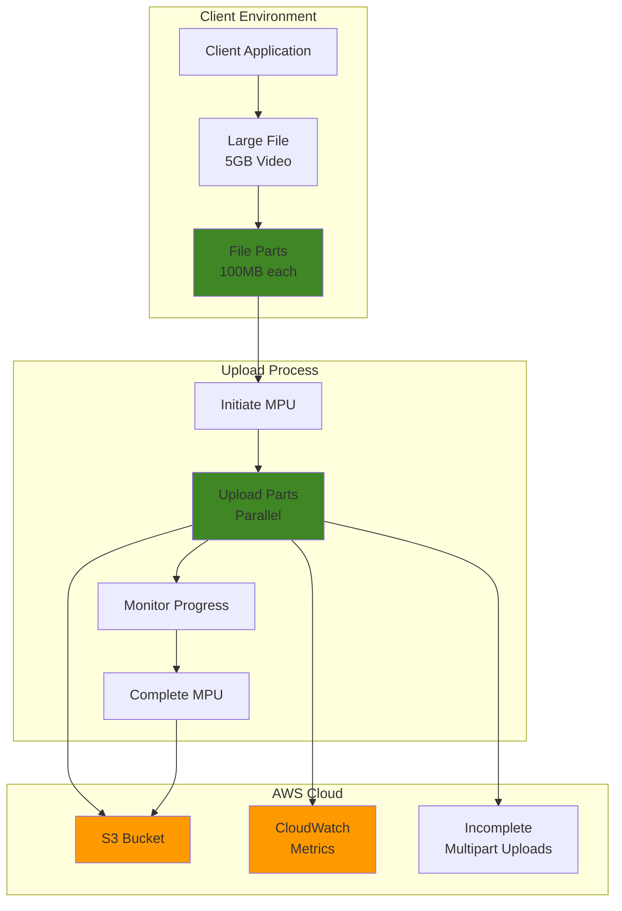

# Optimizing Large File Uploads with S3 Multipart Strategies

## Problem

Video production companies and media organizations regularly need to upload large files (several gigabytes) to S3 for processing and distribution. Traditional single-part uploads frequently fail due to network interruptions, leading to complete restart of lengthy uploads and wasted time and bandwidth. These failures become more frequent with larger files, creating significant operational bottlenecks and increasing costs due to repeated upload attempts.

## Solution

Implement S3 multipart upload strategies with optimized part sizing, parallel uploads, and robust error handling mechanisms. This approach divides large files into smaller parts that can be uploaded independently and in parallel, dramatically improving upload reliability and performance while providing the ability to pause and resume uploads when network issues occur.

## Architecture Diagram



## Prerequisites

1. AWS account with S3 full access permissions
2. AWS CLI v2 installed and configured (or AWS CloudShell)
3. Understanding of S3 storage classes and lifecycle policies
4. Large test file (1GB+) or ability to create one for testing
5. Estimated cost: $0.10-$0.50 for testing (storage and request charges)

> **Note**: Multipart uploads store parts until completion or abort, which incurs storage charges. Always clean up incomplete uploads to avoid ongoing costs.

## Preparation

```bash
# Set environment variables
export AWS_REGION=$(aws configure get region)
export AWS_ACCOUNT_ID=$(aws sts get-caller-identity \
    --query Account --output text)

# Generate unique identifiers for resources
RANDOM_SUFFIX=$(aws secretsmanager get-random-password \
    --exclude-punctuation --exclude-uppercase \
    --password-length 6 --require-each-included-type \
    --output text --query RandomPassword)

export BUCKET_NAME="multipart-upload-demo-${RANDOM_SUFFIX}"
export TEST_FILE_NAME="large-test-file.bin"
export TEST_FILE_SIZE="1073741824"  # 1GB in bytes

# Create S3 bucket for testing (handle regions correctly)
if [ "$AWS_REGION" = "us-east-1" ]; then
    aws s3api create-bucket \
        --bucket $BUCKET_NAME \
        --region $AWS_REGION
else
    aws s3api create-bucket \
        --bucket $BUCKET_NAME \
        --region $AWS_REGION \
        --create-bucket-configuration LocationConstraint=$AWS_REGION
fi

echo "✅ Created S3 bucket: $BUCKET_NAME"

# Create a large test file for demonstration
dd if=/dev/urandom of=$TEST_FILE_NAME bs=1048576 count=1024

echo "✅ Created 1GB test file: $TEST_FILE_NAME"
```

## Steps

1. **Configure multipart upload threshold and part size**:

   S3 multipart upload configuration determines when files will automatically be split into parts and how those parts are processed. The multipart_threshold sets the file size at which the AWS CLI will automatically switch from single-part to multipart uploads, while multipart_chunksize determines the size of each individual part. Optimizing these settings is crucial for achieving maximum upload performance, especially for large media files where network reliability and bandwidth utilization directly impact business operations.

   ```bash
   # Set optimal configuration for large files
   aws configure set default.s3.multipart_threshold 100MB
   aws configure set default.s3.multipart_chunksize 100MB
   aws configure set default.s3.max_concurrent_requests 10
   aws configure set default.s3.max_bandwidth 1GB/s
   
   # Verify configuration
   aws configure list | grep s3
   
   echo "✅ Configured multipart upload settings"
   ```

   These settings establish the foundation for reliable large file uploads. The 100MB threshold ensures files are split into manageable parts that can be retried individually if network issues occur, while the concurrent request limit prevents overwhelming the network connection or S3 service limits.

2. **Initiate multipart upload with metadata**:

   Creating a multipart upload generates a unique upload ID that coordinates all subsequent part uploads for a specific file. This initialization step registers the upload intent with S3, enabling the service to track parts and maintain consistency throughout the upload process. Including metadata and checksum validation ensures data integrity and provides operational insights for monitoring and troubleshooting upload operations across your organization.

   ```bash
   # Start multipart upload with checksum validation
   UPLOAD_ID=$(aws s3api create-multipart-upload \
       --bucket $BUCKET_NAME \
       --key $TEST_FILE_NAME \
       --metadata "upload-strategy=multipart,file-size=$TEST_FILE_SIZE" \
       --checksum-algorithm SHA256 \
       --storage-class STANDARD \
       --query 'UploadId' --output text)
   
   echo "✅ Initiated multipart upload with ID: $UPLOAD_ID"
   ```

   The upload ID returned by this operation serves as the coordination token for all subsequent part uploads. S3 uses this ID to group parts together and ensure they belong to the same logical file, enabling atomic completion or abort operations that maintain data consistency.

3. **Split file into parts and upload in parallel**:

   Parallel part uploading is the core advantage of S3 multipart uploads, enabling you to maximize bandwidth utilization and dramatically reduce total upload time. By splitting large files into 100MB parts and uploading them concurrently, you can achieve near-linear performance improvements based on available bandwidth and network conditions. This approach also provides resilience against network interruptions, as only failed parts need to be retried rather than restarting the entire upload.

   ```bash
   # Calculate number of parts needed (100MB each)
   PART_SIZE=104857600  # 100MB in bytes
   TOTAL_PARTS=$(( ($TEST_FILE_SIZE + $PART_SIZE - 1) / $PART_SIZE ))
   
   echo "Uploading $TOTAL_PARTS parts of 100MB each..."
   
   # Create parts manifest file
   PARTS_FILE="parts-manifest.json"
   echo '{"Parts": [' > $PARTS_FILE
   
   # Upload parts in parallel (limiting to 5 concurrent uploads)
   for i in $(seq 1 $TOTAL_PARTS); do
       (
           PART_START=$(( ($i - 1) * $PART_SIZE ))
           
           # Create part file
           dd if=$TEST_FILE_NAME of="part-$i" \
               bs=1 skip=$PART_START count=$PART_SIZE 2>/dev/null
           
           # Upload part with retry logic
           ETAG=$(aws s3api upload-part \
               --bucket $BUCKET_NAME \
               --key $TEST_FILE_NAME \
               --part-number $i \
               --upload-id $UPLOAD_ID \
               --body "part-$i" \
               --checksum-algorithm SHA256 \
               --query 'ETag' --output text)
           
           echo "Part $i uploaded with ETag: $ETAG"
           
           # Add to parts manifest
           if [ $i -eq $TOTAL_PARTS ]; then
               echo "{\"ETag\": $ETAG, \"PartNumber\": $i}" >> $PARTS_FILE
           else
               echo "{\"ETag\": $ETAG, \"PartNumber\": $i}," >> $PARTS_FILE
           fi
           
           # Cleanup part file
           rm "part-$i"
       ) &
       
       # Limit concurrent uploads
       if (( $i % 5 == 0 )); then
           wait
       fi
   done
   
   wait  # Wait for all uploads to complete
   echo ']}' >> $PARTS_FILE
   
   echo "✅ Uploaded all $TOTAL_PARTS parts successfully"
   ```

   Each part uploads independently with its own ETag for integrity verification. The parts manifest collects these ETags, which are required for the final completion step. This parallel approach can reduce upload times by 3-5x compared to sequential uploads, especially for large files over reliable high-bandwidth connections.

4. **Monitor upload progress and list parts**:

   Monitoring multipart upload progress provides critical operational visibility for managing large file transfers in production environments. The list-parts operation confirms that all expected parts have been successfully uploaded and provides metadata for troubleshooting any missing or corrupted parts. This verification step is essential before attempting to complete the multipart upload, as missing parts will cause the completion operation to fail.

   ```bash
   # List uploaded parts to verify completion
   aws s3api list-parts \
       --bucket $BUCKET_NAME \
       --key $TEST_FILE_NAME \
       --upload-id $UPLOAD_ID \
       --query 'Parts[*].[PartNumber,Size,ETag]' \
       --output table
   
   # Check storage usage
   aws s3api list-multipart-uploads \
       --bucket $BUCKET_NAME \
       --query 'Uploads[*].[Key,UploadId,Initiated]' \
       --output table
   
   echo "✅ Verified all parts are uploaded"
   ```

   This monitoring approach provides real-time visibility into upload status and helps identify any issues before proceeding to completion. The parts listing shows the actual parts that S3 has received and stored, while the multipart uploads listing provides an overview of all in-progress uploads for operational management.

5. **Complete multipart upload**:

   The completion operation is the final atomic step that assembles all uploaded parts into a single, consistent object in S3. This operation validates that all required parts are present with matching ETags, then creates the final object with the combined data. S3 performs this assembly atomically, meaning the object either appears complete and intact or doesn't appear at all, ensuring data consistency for applications consuming the uploaded files.

   ```bash
   # Complete the multipart upload
   aws s3api complete-multipart-upload \
       --bucket $BUCKET_NAME \
       --key $TEST_FILE_NAME \
       --upload-id $UPLOAD_ID \
       --multipart-upload file://$PARTS_FILE
   
   echo "✅ Completed multipart upload"
   ```

   Upon successful completion, the individual parts are automatically deleted by S3, and the file becomes available as a standard S3 object with the full file size and a single ETag representing the entire object. This atomic completion ensures that applications never see partial or inconsistent file states.

6. **Implement automated cleanup for incomplete uploads**:

   Incomplete multipart uploads continue to consume storage and incur charges until they are either completed or explicitly aborted. S3 lifecycle policies provide an automated solution to manage these orphaned uploads, preventing unexpected storage costs and maintaining bucket hygiene. This is particularly important in production environments where network failures or application crashes can leave numerous incomplete uploads that accumulate over time.

   ```bash
   # Create lifecycle policy for incomplete multipart uploads
   cat > lifecycle-policy.json << 'EOF'
   {
       "Rules": [
           {
               "ID": "CleanupIncompleteMultipartUploads",
               "Status": "Enabled",
               "Filter": {"Prefix": ""},
               "AbortIncompleteMultipartUpload": {
                   "DaysAfterInitiation": 7
               }
           }
       ]
   }
   EOF
   
   # Apply lifecycle policy
   aws s3api put-bucket-lifecycle-configuration \
       --bucket $BUCKET_NAME \
       --lifecycle-configuration file://lifecycle-policy.json
   
   echo "✅ Applied lifecycle policy for multipart cleanup"
   ```

   The 7-day retention period provides sufficient time for legitimate uploads to complete while preventing long-term accumulation of incomplete uploads. Organizations can adjust this timeframe based on their typical upload patterns and operational requirements, balancing between cost optimization and operational flexibility.

7. **Set up CloudWatch monitoring for multipart uploads**:

   CloudWatch monitoring provides essential visibility into S3 upload performance, storage utilization, and operational health. Tracking metrics like bucket size and object count helps organizations understand usage patterns, plan capacity, and identify potential issues with upload operations. This monitoring foundation enables proactive management of storage resources and supports capacity planning for large-scale file upload operations.

   ```bash
   # Create CloudWatch dashboard for S3 multipart metrics
   cat > dashboard-config.json << EOF
   {
       "widgets": [
           {
               "type": "metric",
               "properties": {
                   "metrics": [
                       ["AWS/S3", "NumberOfObjects", "BucketName", "$BUCKET_NAME"],
                       [".", "BucketSizeBytes", ".", ".", "StorageType", "StandardStorage"]
                   ],
                   "period": 300,
                   "stat": "Average",
                   "region": "$AWS_REGION",
                   "title": "S3 Bucket Metrics"
               }
           }
       ]
   }
   EOF
   
   # Create dashboard
   aws cloudwatch put-dashboard \
       --dashboard-name "S3-MultipartUpload-Monitoring" \
       --dashboard-body file://dashboard-config.json
   
   echo "✅ Created CloudWatch dashboard for monitoring"
   ```

   The dashboard provides real-time visibility into storage growth and object accumulation patterns. Organizations can extend this monitoring by adding custom metrics for upload success rates, average part sizes, and completion times to gain deeper insights into their multipart upload operations.

## Validation & Testing

1. **Verify uploaded file integrity**:

   File integrity verification ensures that the multipart upload process successfully reconstructed the original file without corruption or data loss. This validation step compares the uploaded object's metadata against the original file characteristics, confirming that the assembly process completed correctly and the file is ready for production use.

   ```bash
   # Check file exists and size matches
   aws s3api head-object \
       --bucket $BUCKET_NAME \
       --key $TEST_FILE_NAME \
       --query '[ContentLength,ETag,ChecksumSHA256]' \
       --output table
   
   # Compare with original file size
   echo "Original file size: $TEST_FILE_SIZE bytes"
   echo "Uploaded file size: $(aws s3api head-object \
       --bucket $BUCKET_NAME \
       --key $TEST_FILE_NAME \
       --query 'ContentLength' --output text) bytes"
   ```

   Expected output: File sizes should match exactly

2. **Test download performance**:

   Download testing validates both the integrity and accessibility of the uploaded file while providing performance benchmarks for retrieval operations. This end-to-end validation confirms that the multipart upload process created a fully functional S3 object that applications can reliably download and use in production scenarios.

   ```bash
   # Download file to verify integrity
   time aws s3 cp s3://$BUCKET_NAME/$TEST_FILE_NAME \
       downloaded-$TEST_FILE_NAME
   
   # Compare checksums
   ORIGINAL_CHECKSUM=$(shasum -a 256 $TEST_FILE_NAME | cut -d' ' -f1)
   DOWNLOADED_CHECKSUM=$(shasum -a 256 downloaded-$TEST_FILE_NAME | cut -d' ' -f1)
   
   echo "Original checksum: $ORIGINAL_CHECKSUM"
   echo "Downloaded checksum: $DOWNLOADED_CHECKSUM"
   
   if [ "$ORIGINAL_CHECKSUM" = "$DOWNLOADED_CHECKSUM" ]; then
       echo "✅ File integrity verified"
   else
       echo "❌ File integrity check failed"
   fi
   ```

3. **Test multipart upload abort and cleanup**:

   Testing the abort functionality validates the cleanup mechanisms essential for production environments where uploads may need to be cancelled due to changing requirements or system issues. This capability ensures that incomplete uploads can be properly terminated without leaving orphaned parts that consume storage and incur costs.

   ```bash
   # Start another multipart upload to test abort
   TEST_UPLOAD_ID=$(aws s3api create-multipart-upload \
       --bucket $BUCKET_NAME \
       --key "test-abort-upload.bin" \
       --query 'UploadId' --output text)
   
   # Abort the upload
   aws s3api abort-multipart-upload \
       --bucket $BUCKET_NAME \
       --key "test-abort-upload.bin" \
       --upload-id $TEST_UPLOAD_ID
   
   echo "✅ Successfully tested multipart upload abort"
   ```

## Cleanup

1. **Remove uploaded files**:

   Cleaning up test files prevents ongoing storage charges and maintains bucket hygiene after completing the demonstration. This step removes all objects created during the testing process, preparing the bucket for deletion or reuse.

   ```bash
   # Delete all objects in bucket
   aws s3 rm s3://$BUCKET_NAME --recursive
   
   echo "✅ Deleted all objects from bucket"
   ```

2. **Clean up incomplete multipart uploads**:

   Explicitly removing any remaining incomplete multipart uploads ensures complete cleanup and prevents hidden storage charges. This step identifies and aborts any uploads that weren't properly completed or cleaned up by the lifecycle policy.

   ```bash
   # List and abort any remaining incomplete uploads
   aws s3api list-multipart-uploads \
       --bucket $BUCKET_NAME \
       --query 'Uploads[*].[Key,UploadId]' \
       --output text | \
   while read key upload_id; do
       if [ -n "$key" ] && [ -n "$upload_id" ]; then
           aws s3api abort-multipart-upload \
               --bucket $BUCKET_NAME \
               --key "$key" \
               --upload-id "$upload_id"
           echo "Aborted upload: $key ($upload_id)"
       fi
   done
   
   echo "✅ Cleaned up incomplete multipart uploads"
   ```

3. **Delete S3 bucket and local files**:

   Final cleanup removes all AWS resources and local files created during the demonstration, ensuring no ongoing charges and restoring the environment to its original state. This comprehensive cleanup includes the S3 bucket, CloudWatch dashboard, and all temporary local files.

   ```bash
   # Remove bucket
   aws s3api delete-bucket --bucket $BUCKET_NAME
   
   # Clean up local files
   rm -f $TEST_FILE_NAME downloaded-$TEST_FILE_NAME
   rm -f $PARTS_FILE lifecycle-policy.json dashboard-config.json
   
   # Remove CloudWatch dashboard
   aws cloudwatch delete-dashboards \
       --dashboard-names "S3-MultipartUpload-Monitoring"
   
   echo "✅ Cleaned up all resources"
   ```

## Discussion

Multipart upload is essential for large file transfers in S3, providing significant advantages over single-part uploads as outlined in the [AWS S3 Multipart Upload documentation](https://docs.aws.amazon.com/AmazonS3/latest/userguide/mpuoverview.html). The key benefits include improved throughput through parallel uploads, quick recovery from network issues by only retrying failed parts, and the ability to pause and resume uploads. When implementing multipart uploads, AWS recommends using this approach for objects that are 100MB or larger, with part sizes between 100MB and 500MB typically providing optimal performance, balancing between parallel efficiency and API call overhead.

The parallel upload strategy demonstrated in this recipe can dramatically reduce upload times for large files by maximizing bandwidth utilization. By uploading multiple parts simultaneously, you can achieve near-linear performance improvements based on available bandwidth. However, it's crucial to implement proper error handling and retry logic, as network interruptions are common with large file transfers. This recipe follows the AWS Well-Architected Framework's Performance Efficiency pillar by optimizing resource usage and monitoring performance through CloudWatch.

Cost optimization is another important consideration that aligns with the AWS Well-Architected Framework's Cost Optimization pillar. Incomplete multipart uploads continue to incur storage charges until they're either completed or aborted. Implementing lifecycle policies to automatically clean up incomplete uploads after a reasonable timeframe (typically 7 days) prevents unexpected storage costs. The [S3 Lifecycle Management documentation](https://docs.aws.amazon.com/AmazonS3/latest/userguide/object-lifecycle-mgmt.html) provides comprehensive guidance on automated cleanup strategies. Additionally, monitoring upload progress and performance through CloudWatch provides valuable insights for optimizing your upload strategies and detecting anomalies early.

> **Warning**: Always implement proper error handling and retry logic in production applications, as network interruptions can cause individual part uploads to fail even when overall connectivity remains stable.

> **Tip**: For applications requiring maximum upload performance, consider using S3 Transfer Acceleration, which can improve upload speeds by up to 500% for users geographically distant from the S3 bucket region. See the [Transfer Acceleration documentation](https://docs.aws.amazon.com/AmazonS3/latest/userguide/transfer-acceleration.html) for implementation details.

## Challenge

Extend this solution by implementing these enhancements:

1. **Implement intelligent part sizing** - Create a function that automatically calculates optimal part sizes based on file size and available bandwidth, adjusting between 5MB and 5GB per part according to AWS limits.

2. **Add progress tracking and resumption** - Build a system that tracks upload progress in a local database and can resume interrupted uploads from the last successful part, following AWS best practices for stateful applications.

3. **Implement bandwidth throttling** - Add configurable bandwidth limits to prevent uploads from consuming all available network capacity during business hours, with integration to AWS Systems Manager Parameter Store for dynamic configuration.

4. **Create upload queue management** - Develop a queuing system using Amazon SQS that manages multiple concurrent file uploads with priority handling and resource allocation based on file size and business requirements.

5. **Add advanced error handling** - Implement exponential backoff retry logic with circuit breaker patterns for handling various failure scenarios including network timeouts and service throttling, incorporating AWS SDK retry mechanisms.

## Infrastructure Code

*Infrastructure code will be generated after recipe approval.*