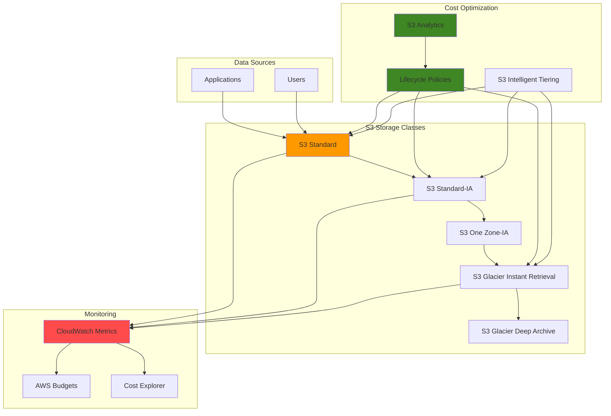

# Optimizing Storage Costs with S3 Classes

## Problem

Organizations are experiencing rapidly increasing cloud storage costs due to inefficient storage class usage and lack of visibility into data access patterns. Many companies store all their data in S3 Standard storage class regardless of access frequency, leading to unnecessary expenses of up to 50% of their total storage costs. Without proper lifecycle management and cost monitoring, businesses struggle to optimize their storage spending while maintaining data availability requirements.

## Solution

Implement a comprehensive S3 storage cost optimization strategy using intelligent storage class transitions, lifecycle policies, and cost monitoring. This solution leverages S3 Storage Class Analysis to understand access patterns, automatically transitions data between storage classes based on usage, and provides real-time cost visibility through CloudWatch metrics and budgets to achieve optimal storage cost efficiency.

## Architecture Diagram



## Prerequisites

1. AWS account with appropriate permissions for S3, CloudWatch, and Cost Explorer
2. AWS CLI v2 installed and configured (or AWS CloudShell)
3. Basic understanding of S3 storage classes and lifecycle policies
4. Existing S3 bucket with sample data (or willingness to create test data)
5. Estimated cost: $5-15 for testing resources and monitoring (depends on data volume)

> **Note**: This recipe will create monitoring resources that may incur small ongoing costs. All resources can be cleaned up after testing.

## Preparation

```bash
# Set environment variables
export AWS_REGION=$(aws configure get region)
export AWS_ACCOUNT_ID=$(aws sts get-caller-identity \
    --query Account --output text)

# Generate unique identifiers for resources
RANDOM_SUFFIX=$(aws secretsmanager get-random-password \
    --exclude-punctuation --exclude-uppercase \
    --password-length 6 --require-each-included-type \
    --output text --query RandomPassword)

export BUCKET_NAME="storage-optimization-demo-${RANDOM_SUFFIX}"
export ANALYTICS_CONFIG_ID="storage-analytics-${RANDOM_SUFFIX}"
export LIFECYCLE_CONFIG_ID="cost-optimization-lifecycle"
export BUDGET_NAME="S3-Storage-Cost-Budget-${RANDOM_SUFFIX}"

# Create the main S3 bucket for cost optimization
aws s3 mb s3://${BUCKET_NAME} --region ${AWS_REGION}

echo "✅ Created S3 bucket: ${BUCKET_NAME}"
```

## Steps

1. **Create Sample Data with Different Access Patterns**:

   Effective storage cost optimization begins with understanding your data access patterns. Different types of business data have vastly different access requirements - application logs might be accessed daily for troubleshooting, financial reports monthly for analysis, and compliance archives rarely except for audits. By creating representative data samples, we can demonstrate how S3's storage class transitions work and measure their cost impact. This foundational step simulates real-world data patterns that drive storage optimization decisions.

   ```bash
   # Create directories for different data types
   mkdir -p temp-data/{frequently-accessed,infrequently-accessed,archive}
   
   # Generate sample files with different access patterns
   echo "Frequently accessed application logs" > temp-data/frequently-accessed/app-logs-$(date +%Y%m%d).log
   echo "Monthly financial reports" > temp-data/infrequently-accessed/financial-report-$(date +%Y%m).pdf
   echo "Historical compliance data" > temp-data/archive/compliance-archive-2023.zip
   
   # Upload sample data to S3
   aws s3 cp temp-data/frequently-accessed/ s3://${BUCKET_NAME}/data/frequently-accessed/ --recursive
   aws s3 cp temp-data/infrequently-accessed/ s3://${BUCKET_NAME}/data/infrequently-accessed/ --recursive
   aws s3 cp temp-data/archive/ s3://${BUCKET_NAME}/data/archive/ --recursive
   
   echo "✅ Uploaded sample data to S3 bucket"
   ```

   The data is now organized by access patterns using S3 prefixes, which enables targeted lifecycle policies. This prefix-based organization is a storage optimization best practice that allows different data types to follow appropriate transition schedules based on business requirements rather than applying one-size-fits-all policies.

2. **Configure S3 Storage Analytics for Access Pattern Analysis**:

   S3 Storage Class Analysis provides crucial data-driven insights into how your objects are accessed over time. This service analyzes access patterns and generates recommendations for optimizing storage costs by identifying objects that could benefit from transitioning to lower-cost storage classes. The analytics run continuously and export daily CSV reports that show access frequency, retrieval patterns, and cost optimization opportunities. Understanding these patterns is essential before implementing lifecycle policies to ensure you don't negatively impact application performance or user experience.

   ```bash
   # Create storage analytics configuration
   cat > analytics-config.json << EOF
   {
       "Id": "${ANALYTICS_CONFIG_ID}",
       "Filter": {
           "Prefix": "data/"
       },
       "IsEnabled": true,
       "StorageClassAnalysis": {
           "DataExport": {
               "OutputSchemaVersion": "V_1",
               "Destination": {
                   "S3BucketDestination": {
                       "Format": "CSV",
                       "Bucket": "arn:aws:s3:::${BUCKET_NAME}",
                       "Prefix": "analytics-reports/"
                   }
               }
           }
       }
   }
   EOF
   
   # Apply analytics configuration
   aws s3api put-bucket-analytics-configuration \
       --bucket ${BUCKET_NAME} \
       --id ${ANALYTICS_CONFIG_ID} \
       --analytics-configuration file://analytics-config.json
   
   echo "✅ Configured S3 Storage Analytics for access pattern analysis"
   ```

   Storage Analytics is now actively monitoring access patterns and will begin generating reports within 24-48 hours. These reports will provide quantitative data about object age, access frequency, and transition recommendations, forming the foundation for evidence-based storage optimization decisions.

3. **Enable S3 Intelligent Tiering for Automatic Cost Optimization**:

   S3 Intelligent Tiering provides automated cost optimization by dynamically moving objects between storage classes based on access patterns without performance impact or retrieval fees. This service monitors access patterns and automatically transitions objects to the most cost-effective storage tier. Objects accessed frequently remain in the Frequent Access tier (same cost as Standard), while objects not accessed for 30 days move to Infrequent Access tier (40% cost reduction). The optional Archive and Deep Archive tiers provide even greater savings for rarely accessed data, reducing costs by up to 95% compared to Standard storage.

   ```bash
   # Create intelligent tiering configuration
   cat > intelligent-tiering-config.json << EOF
   {
       "Id": "EntireBucketIntelligentTiering",
       "Status": "Enabled",
       "Filter": {
           "Prefix": "data/"
       },
       "Tierings": [
           {
               "Days": 1,
               "AccessTier": "ARCHIVE_ACCESS"
           },
           {
               "Days": 90,
               "AccessTier": "DEEP_ARCHIVE_ACCESS"
           }
       ]
   }
   EOF
   
   # Apply intelligent tiering configuration
   aws s3api put-bucket-intelligent-tiering-configuration \
       --bucket ${BUCKET_NAME} \
       --id "EntireBucketIntelligentTiering" \
       --intelligent-tiering-configuration file://intelligent-tiering-config.json
   
   echo "✅ Enabled S3 Intelligent Tiering for automatic cost optimization"
   ```

   Intelligent Tiering is now actively monitoring object access patterns and will automatically optimize storage costs without any operational overhead. This eliminates the guesswork in storage class selection and provides continuous cost optimization as access patterns change over time.

4. **Create Custom Lifecycle Policies for Different Data Types**:

   Lifecycle policies provide granular control over storage class transitions based on object age and business requirements. Unlike Intelligent Tiering which relies on access patterns, lifecycle policies use predictable time-based rules that align with business processes and compliance requirements. This approach is particularly valuable for data with known lifecycle patterns - such as logs that become less relevant over time, or financial records that follow regulatory retention schedules. The policies implement a graduated transition strategy that balances cost savings with retrieval requirements.

   ```bash
   # Create lifecycle policy for cost optimization
   cat > lifecycle-policy.json << EOF
   {
       "Rules": [
           {
               "ID": "FrequentlyAccessedData",
               "Status": "Enabled",
               "Filter": {
                   "Prefix": "data/frequently-accessed/"
               },
               "Transitions": [
                   {
                       "Days": 30,
                       "StorageClass": "STANDARD_IA"
                   },
                   {
                       "Days": 90,
                       "StorageClass": "GLACIER"
                   }
               ]
           },
           {
               "ID": "InfrequentlyAccessedData",
               "Status": "Enabled",
               "Filter": {
                   "Prefix": "data/infrequently-accessed/"
               },
               "Transitions": [
                   {
                       "Days": 1,
                       "StorageClass": "STANDARD_IA"
                   },
                   {
                       "Days": 30,
                       "StorageClass": "GLACIER"
                   },
                   {
                       "Days": 180,
                       "StorageClass": "DEEP_ARCHIVE"
                   }
               ]
           },
           {
               "ID": "ArchiveData",
               "Status": "Enabled",
               "Filter": {
                   "Prefix": "data/archive/"
               },
               "Transitions": [
                   {
                       "Days": 1,
                       "StorageClass": "GLACIER"
                   },
                   {
                       "Days": 30,
                       "StorageClass": "DEEP_ARCHIVE"
                   }
               ]
           }
       ]
   }
   EOF
   
   # Apply lifecycle policy
   aws s3api put-bucket-lifecycle-configuration \
       --bucket ${BUCKET_NAME} \
       --lifecycle-configuration file://lifecycle-policy.json
   
   echo "✅ Created custom lifecycle policies for different data types"
   ```

   The lifecycle policies are now active and will automatically transition objects according to the defined schedules. These rules provide predictable cost optimization with potential savings of 50-95% depending on the storage class transitions. The policies work independently of access patterns, ensuring consistent cost optimization even for data with irregular access patterns.

5. **Set Up CloudWatch Metrics for Storage Cost Monitoring**:

   Effective cost optimization requires continuous monitoring and visibility into storage utilization patterns. CloudWatch provides comprehensive metrics for S3 that enable real-time tracking of storage costs, distribution across storage classes, and optimization effectiveness. By creating customized dashboards, we establish a centralized view of storage metrics that helps identify trends, validate optimization policies, and make data-driven decisions about storage strategies. This monitoring capability is essential for demonstrating ROI and ensuring optimization efforts deliver expected cost savings.

   ```bash
   # Create CloudWatch dashboard for S3 storage metrics
   cat > storage-dashboard.json << EOF
   {
       "widgets": [
           {
               "type": "metric",
               "properties": {
                   "metrics": [
                       ["AWS/S3", "BucketSizeBytes", "BucketName", "${BUCKET_NAME}", "StorageType", "StandardStorage"],
                       ["...", "StandardIAStorage"],
                       ["...", "GlacierStorage"],
                       ["...", "DeepArchiveStorage"]
                   ],
                   "period": 86400,
                   "stat": "Average",
                   "region": "${AWS_REGION}",
                   "title": "S3 Storage by Class - ${BUCKET_NAME}"
               }
           },
           {
               "type": "metric",
               "properties": {
                   "metrics": [
                       ["AWS/S3", "NumberOfObjects", "BucketName", "${BUCKET_NAME}", "StorageType", "AllStorageTypes"]
                   ],
                   "period": 86400,
                   "stat": "Average",
                   "region": "${AWS_REGION}",
                   "title": "Total Objects in ${BUCKET_NAME}"
               }
           }
       ]
   }
   EOF
   
   # Create CloudWatch dashboard
   aws cloudwatch put-dashboard \
       --dashboard-name "S3-Storage-Cost-Optimization-${RANDOM_SUFFIX}" \
       --dashboard-body file://storage-dashboard.json
   
   echo "✅ Created CloudWatch dashboard for storage cost monitoring"
   ```

   The CloudWatch dashboard is now providing real-time visibility into storage distribution across different classes. This enables monitoring of optimization effectiveness, identification of cost trends, and validation that lifecycle policies and intelligent tiering are working as expected to reduce overall storage costs.

6. **Configure Cost Budgets and Alerts**:

   Proactive cost management requires automated alerting when spending approaches defined thresholds. AWS Budgets provides sophisticated cost tracking and alerting capabilities that enable organizations to maintain control over cloud spending. By setting up storage-specific budgets with percentage-based thresholds, we create an early warning system that prevents cost overruns and enables timely intervention when spending patterns change. This approach transforms reactive cost management into proactive financial governance, ensuring storage optimization efforts remain aligned with business objectives.

   ```bash
   # Create cost budget for S3 storage
   cat > cost-budget.json << EOF
   {
       "BudgetName": "${BUDGET_NAME}",
       "BudgetLimit": {
           "Amount": "50.0",
           "Unit": "USD"
       },
       "TimeUnit": "MONTHLY",
       "BudgetType": "COST",
       "CostFilters": {
           "Service": ["Amazon Simple Storage Service"]
       },
       "TimePeriod": {
           "Start": "$(date -u -d 'first day of this month' +%Y-%m-%d)T00:00:00Z",
           "End": "$(date -u -d 'first day of next month' +%Y-%m-%d)T00:00:00Z"
       }
   }
   EOF
   
   # Create notifications configuration
   cat > budget-notifications.json << EOF
   [
       {
           "Notification": {
               "NotificationType": "ACTUAL",
               "ComparisonOperator": "GREATER_THAN",
               "Threshold": 80.0,
               "ThresholdType": "PERCENTAGE"
           },
           "Subscribers": [
               {
                   "SubscriptionType": "EMAIL",
                   "Address": "admin@example.com"
               }
           ]
       }
   ]
   EOF
   
   # Create budget (Note: Email notifications require valid email address)
   aws budgets create-budget \
       --account-id ${AWS_ACCOUNT_ID} \
       --budget file://cost-budget.json \
       --notifications-with-subscribers file://budget-notifications.json 2>/dev/null || \
       aws budgets create-budget \
       --account-id ${AWS_ACCOUNT_ID} \
       --budget file://cost-budget.json
   
   echo "✅ Created cost budget and alerts for S3 storage monitoring"
   ```

   The budget alert system is now actively monitoring S3 storage costs and will trigger notifications when spending reaches 80% of the monthly threshold. This enables proactive cost management and ensures optimization efforts remain effective over time.

7. **Create Cost Analysis Report Generator**:

   Automated cost analysis reporting provides quantitative insights into storage optimization effectiveness and identifies additional cost-saving opportunities. This Python-based solution integrates with CloudWatch APIs to retrieve storage metrics and calculate estimated costs across different storage classes. By automating these calculations, organizations can regularly assess optimization progress, identify trends, and make data-driven decisions about storage strategies. The report generator serves as a foundation for executive reporting and helps demonstrate the business value of storage optimization initiatives.

   ```bash
   # Create a script to generate cost analysis reports
   cat > cost-analysis-script.py << 'EOF'
   import boto3
   import json
   from datetime import datetime, timedelta
   
   def generate_storage_cost_report():
       s3 = boto3.client('s3')
       cloudwatch = boto3.client('cloudwatch')
       
       # Get storage metrics for the last 30 days
       end_time = datetime.utcnow()
       start_time = end_time - timedelta(days=30)
       
       storage_classes = ['StandardStorage', 'StandardIAStorage', 'GlacierStorage', 'DeepArchiveStorage']
       
       print("S3 Storage Cost Analysis Report")
       print("="*50)
       print(f"Analysis Period: {start_time.date()} to {end_time.date()}")
       print(f"Bucket: {bucket_name}")
       print()
       
       for storage_class in storage_classes:
           try:
               response = cloudwatch.get_metric_statistics(
                   Namespace='AWS/S3',
                   MetricName='BucketSizeBytes',
                   Dimensions=[
                       {'Name': 'BucketName', 'Value': bucket_name},
                       {'Name': 'StorageType', 'Value': storage_class}
                   ],
                   StartTime=start_time,
                   EndTime=end_time,
                   Period=86400,
                   Statistics=['Average']
               )
               
               if response['Datapoints']:
                   avg_size = sum(dp['Average'] for dp in response['Datapoints']) / len(response['Datapoints'])
                   avg_size_gb = avg_size / (1024**3)
                   
                   # Rough cost calculation (approximate pricing)
                   cost_per_gb = {
                       'StandardStorage': 0.023,
                       'StandardIAStorage': 0.0125,
                       'GlacierStorage': 0.004,
                       'DeepArchiveStorage': 0.00099
                   }
                   
                   estimated_monthly_cost = avg_size_gb * cost_per_gb.get(storage_class, 0)
                   
                   print(f"{storage_class}:")
                   print(f"  Average Size: {avg_size_gb:.2f} GB")
                   print(f"  Estimated Monthly Cost: ${estimated_monthly_cost:.2f}")
                   print()
           except Exception as e:
               print(f"Error getting metrics for {storage_class}: {str(e)}")
   
   if __name__ == "__main__":
       import sys
       bucket_name = sys.argv[1] if len(sys.argv) > 1 else "your-bucket-name"
       generate_storage_cost_report()
   EOF
   
   # Run the cost analysis script
   python3 cost-analysis-script.py ${BUCKET_NAME}
   
   echo "✅ Created and executed cost analysis report generator"
   ```

   The cost analysis script provides detailed cost breakdowns by storage class and enables regular monitoring of optimization effectiveness. This automated reporting capability forms the foundation for ongoing cost management and helps organizations track ROI from storage optimization investments.

8. **Set Up Automated Cost Optimization Recommendations**:

   Automated recommendation systems provide continuous optimization opportunities by analyzing storage patterns and identifying objects that could benefit from storage class transitions. This Python-based solution simulates Lambda function logic that could be deployed for ongoing cost optimization. By analyzing object age, current storage class, and access patterns, the system identifies specific cost-saving opportunities and quantifies potential savings. This approach enables organizations to move beyond one-time optimization to continuous cost improvement through data-driven recommendations.

   ```bash
   # Create a Lambda function for automated recommendations
   cat > optimization-recommendations.py << 'EOF'
   import boto3
   import json
   from datetime import datetime, timedelta
   
   def lambda_handler(event, context):
       s3 = boto3.client('s3')
       cloudwatch = boto3.client('cloudwatch')
       
       bucket_name = event.get('bucket_name')
       
       recommendations = []
       
       # Check for objects in Standard that could be moved to IA
       try:
           response = s3.list_objects_v2(Bucket=bucket_name, MaxKeys=1000)
           
           for obj in response.get('Contents', []):
               last_modified = obj['LastModified']
               days_old = (datetime.now(last_modified.tzinfo) - last_modified).days
               
               if days_old > 30:
                   # Check if object is still in Standard storage
                   head_response = s3.head_object(Bucket=bucket_name, Key=obj['Key'])
                   storage_class = head_response.get('StorageClass', 'STANDARD')
                   
                   if storage_class == 'STANDARD':
                       recommendations.append({
                           'type': 'transition_to_ia',
                           'object_key': obj['Key'],
                           'days_old': days_old,
                           'current_storage_class': storage_class,
                           'recommended_action': 'Move to Standard-IA for cost savings'
                       })
       
       except Exception as e:
           print(f"Error analyzing objects: {str(e)}")
       
       return {
           'statusCode': 200,
           'body': json.dumps({
               'recommendations': recommendations,
               'total_recommendations': len(recommendations)
           })
       }
   
   # Test the function locally
   if __name__ == "__main__":
       import sys
       bucket_name = sys.argv[1] if len(sys.argv) > 1 else "your-bucket-name"
       
       event = {'bucket_name': bucket_name}
       result = lambda_handler(event, None)
       print(json.dumps(result, indent=2))
   EOF
   
   # Test the optimization recommendations
   python3 optimization-recommendations.py ${BUCKET_NAME}
   
   echo "✅ Created automated cost optimization recommendations system"
   ```

   The automated recommendation system provides actionable insights for ongoing cost optimization. This foundation can be extended to a full Lambda deployment with scheduled execution, enabling continuous identification of cost-saving opportunities as data patterns evolve over time.

## Validation & Testing

1. **Verify Storage Analytics Configuration**:

   ```bash
   # Check analytics configuration
   aws s3api get-bucket-analytics-configuration \
       --bucket ${BUCKET_NAME} \
       --id ${ANALYTICS_CONFIG_ID}
   
   # List all analytics configurations
   aws s3api list-bucket-analytics-configurations \
       --bucket ${BUCKET_NAME}
   ```

   Expected output: Configuration details showing the analytics setup for the bucket.

2. **Verify Intelligent Tiering Configuration**:

   ```bash
   # Check intelligent tiering configuration
   aws s3api get-bucket-intelligent-tiering-configuration \
       --bucket ${BUCKET_NAME} \
       --id "EntireBucketIntelligentTiering"
   ```

   Expected output: Configuration showing intelligent tiering is enabled with archive access tiers.

3. **Test Lifecycle Policy Application**:

   ```bash
   # Get lifecycle configuration
   aws s3api get-bucket-lifecycle-configuration \
       --bucket ${BUCKET_NAME}
   
   # Check object storage classes
   aws s3api list-objects-v2 \
       --bucket ${BUCKET_NAME} \
       --query 'Contents[].{Key:Key,StorageClass:StorageClass,LastModified:LastModified}'
   ```

   Expected output: Lifecycle rules showing transitions for different prefixes.

4. **Verify Cost Monitoring Setup**:

   ```bash
   # Check CloudWatch dashboard
   aws cloudwatch list-dashboards \
       --dashboard-name-prefix "S3-Storage-Cost-Optimization"
   
   # Check budget creation
   aws budgets describe-budget \
       --account-id ${AWS_ACCOUNT_ID} \
       --budget-name ${BUDGET_NAME}
   ```

   Expected output: Dashboard and budget configurations showing successful creation.

5. **Test Cost Analysis Reporting**:

   ```bash
   # Generate and verify cost analysis report
   python3 cost-analysis-script.py ${BUCKET_NAME}
   
   # Check S3 storage metrics in CloudWatch
   aws cloudwatch get-metric-statistics \
       --namespace AWS/S3 \
       --metric-name BucketSizeBytes \
       --dimensions Name=BucketName,Value=${BUCKET_NAME} Name=StorageType,Value=StandardStorage \
       --start-time $(date -u -d '7 days ago' +%Y-%m-%dT%H:%M:%S) \
       --end-time $(date -u +%Y-%m-%dT%H:%M:%S) \
       --period 86400 \
       --statistics Average
   ```

   Expected output: Cost analysis report with storage class breakdown and CloudWatch metrics.

## Cleanup

1. **Remove Cost Monitoring Resources**:

   ```bash
   # Delete CloudWatch dashboard
   aws cloudwatch delete-dashboards \
       --dashboard-names "S3-Storage-Cost-Optimization-${RANDOM_SUFFIX}"
   
   # Delete budget
   aws budgets delete-budget \
       --account-id ${AWS_ACCOUNT_ID} \
       --budget-name ${BUDGET_NAME}
   
   echo "✅ Deleted cost monitoring resources"
   ```

2. **Remove S3 Configurations**:

   ```bash
   # Remove lifecycle configuration
   aws s3api delete-bucket-lifecycle \
       --bucket ${BUCKET_NAME}
   
   # Remove analytics configuration
   aws s3api delete-bucket-analytics-configuration \
       --bucket ${BUCKET_NAME} \
       --id ${ANALYTICS_CONFIG_ID}
   
   # Remove intelligent tiering configuration
   aws s3api delete-bucket-intelligent-tiering-configuration \
       --bucket ${BUCKET_NAME} \
       --id "EntireBucketIntelligentTiering"
   
   echo "✅ Removed S3 optimization configurations"
   ```

3. **Delete S3 Bucket and Contents**:

   ```bash
   # Delete all objects in bucket
   aws s3 rm s3://${BUCKET_NAME} --recursive
   
   # Delete the bucket
   aws s3 rb s3://${BUCKET_NAME}
   
   echo "✅ Deleted S3 bucket and all contents"
   ```

4. **Clean Up Local Files**:

   ```bash
   # Remove temporary files
   rm -rf temp-data/
   rm -f analytics-config.json
   rm -f intelligent-tiering-config.json
   rm -f lifecycle-policy.json
   rm -f storage-dashboard.json
   rm -f cost-budget.json
   rm -f budget-notifications.json
   rm -f cost-analysis-script.py
   rm -f optimization-recommendations.py
   
   # Clear environment variables
   unset BUCKET_NAME ANALYTICS_CONFIG_ID LIFECYCLE_CONFIG_ID BUDGET_NAME RANDOM_SUFFIX
   
   echo "✅ Cleaned up local files and environment variables"
   ```

## Discussion

This comprehensive storage cost optimization solution addresses one of the most significant challenges in cloud cost management - inefficient storage class utilization. The implementation demonstrates how proper storage class selection can reduce costs by up to 60% while maintaining data accessibility requirements.

The solution combines multiple AWS services to create a complete cost optimization framework. S3 Storage Class Analysis provides data-driven insights into access patterns, enabling informed decisions about storage class transitions. Intelligent Tiering automatically moves objects between access tiers based on usage patterns, eliminating manual intervention while optimizing costs. Custom lifecycle policies provide granular control over transitions based on business requirements and compliance needs.

The monitoring and alerting components ensure continuous visibility into storage costs and usage patterns. CloudWatch dashboards provide real-time insights into storage distribution across classes, while AWS Budgets enable proactive cost control with automated alerts when spending thresholds are exceeded. The automated recommendation system helps identify additional optimization opportunities as data usage patterns evolve.

Key architectural decisions include using prefix-based lifecycle policies to handle different data types appropriately, implementing graduated transition timelines that balance cost savings with retrieval requirements, and establishing comprehensive monitoring to track both cost and performance metrics. This approach ensures that cost optimization doesn't compromise data accessibility or operational efficiency.

> **Tip**: Monitor your storage access patterns for at least 30 days before implementing aggressive lifecycle policies to ensure you understand your data usage requirements.

## Challenge

Extend this solution by implementing these enhancements:

1. **Cross-Region Cost Optimization**: Implement multi-region storage optimization with replication policies that automatically select the most cost-effective storage classes in different regions based on access patterns and compliance requirements.

2. **Advanced Analytics Integration**: Create a data pipeline using AWS Glue and QuickSight to analyze storage costs trends, generate predictive models for future storage needs, and provide executive dashboards with cost optimization recommendations.

3. **Automated Remediation**: Build a Lambda-based system that automatically applies optimization recommendations, creates temporary access policies for archived data retrieval, and sends notifications when manual intervention is required for cost-sensitive operations.

4. **Multi-Account Cost Governance**: Extend the solution to work across multiple AWS accounts using AWS Organizations, implementing centralized cost policies, cross-account billing analysis, and automated compliance reporting for storage optimization across an entire organization.

5. **Integration with Third-Party Tools**: Integrate with enterprise cost management tools like CloudHealth or Cloudability to provide enhanced cost attribution, department-level chargeback calculations, and automated optimization workflows based on business rules and approval processes.

## Infrastructure Code

*Infrastructure code will be generated after recipe approval.*