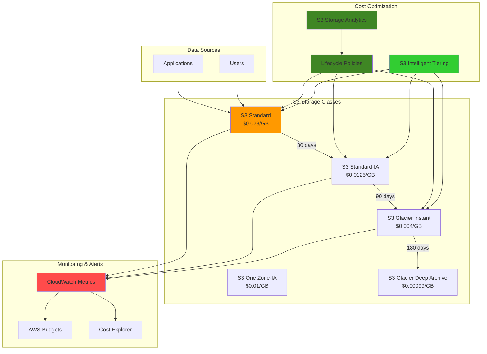

# Optimizing Storage Costs with S3 Storage Classes

## Problem

Organizations are experiencing rapidly increasing cloud storage costs due to inefficient storage class usage and lack of visibility into data access patterns. Many companies store all their data in S3 Standard storage class regardless of access frequency, leading to unnecessary expenses of up to 50% of their total storage costs. Without proper lifecycle management and cost monitoring, businesses struggle to optimize their storage spending while maintaining data availability requirements and compliance obligations.

## Solution

Implement a comprehensive S3 storage cost optimization strategy using intelligent storage class transitions, lifecycle policies, and real-time cost monitoring. This solution leverages S3 Storage Class Analysis to understand access patterns, automatically transitions data between storage classes based on usage, and provides continuous cost visibility through CloudWatch metrics and AWS Budgets to achieve optimal storage cost efficiency while maintaining data accessibility requirements.

## Architecture Diagram



## Prerequisites

1. AWS account with appropriate permissions for S3, CloudWatch, Cost Explorer, and AWS Budgets
2. AWS CLI v2 installed and configured (or AWS CloudShell)
3. Basic understanding of S3 storage classes and lifecycle policies
4. Python 3.x installed for cost analysis scripts
5. Existing S3 bucket with sample data or willingness to create test data
6. Estimated cost: $10-25 for testing resources and monitoring (depends on data volume and duration)

> **Note**: This recipe will create monitoring resources that may incur small ongoing costs. All resources can be cleaned up after testing to avoid continued charges.

## Preparation

```bash
# Set environment variables
export AWS_REGION=$(aws configure get region)
export AWS_ACCOUNT_ID=$(aws sts get-caller-identity \
    --query Account --output text)

# Generate unique identifiers for resources
RANDOM_SUFFIX=$(aws secretsmanager get-random-password \
    --exclude-punctuation --exclude-uppercase \
    --password-length 6 --require-each-included-type \
    --output text --query RandomPassword)

export BUCKET_NAME="storage-optimization-demo-${RANDOM_SUFFIX}"
export ANALYTICS_CONFIG_ID="storage-analytics-${RANDOM_SUFFIX}"
export BUDGET_NAME="S3-Storage-Cost-Budget-${RANDOM_SUFFIX}"

# Create the main S3 bucket for cost optimization with versioning
aws s3 mb s3://${BUCKET_NAME} --region ${AWS_REGION}

# Enable versioning for intelligent tiering compatibility
aws s3api put-bucket-versioning \
    --bucket ${BUCKET_NAME} \
    --versioning-configuration Status=Enabled

echo "✅ Created S3 bucket with versioning: ${BUCKET_NAME}"
```

## Steps

1. **Create Sample Data with Different Access Patterns**:

   Effective storage cost optimization begins with understanding your data access patterns. Different types of business data have vastly different access requirements - application logs might be accessed daily for troubleshooting, financial reports monthly for analysis, and compliance archives rarely except for audits. By creating representative data samples with varied sizes and types, we can demonstrate how S3's storage class transitions work and measure their cost impact accurately. This foundational step simulates real-world data patterns that drive storage optimization decisions and provides a baseline for measuring cost savings.

   ```bash
   # Create directories for different data types
   mkdir -p temp-data/{frequently-accessed,infrequently-accessed,archive}
   
   # Generate sample files with different access patterns and sizes
   echo "Application logs - $(date)" | \
       tee temp-data/frequently-accessed/app-logs-$(date +%Y%m%d).log
   dd if=/dev/zero of=temp-data/frequently-accessed/large-log-file.log \
       bs=1024 count=1024 2>/dev/null
   
   echo "Monthly financial report - $(date +%Y-%m)" | \
       tee temp-data/infrequently-accessed/financial-report-$(date +%Y%m).pdf
   dd if=/dev/zero of=temp-data/infrequently-accessed/analytics-data.csv \
       bs=1024 count=2048 2>/dev/null
   
   echo "Historical compliance data - $(date +%Y)" | \
       tee temp-data/archive/compliance-archive-$(date +%Y).zip
   dd if=/dev/zero of=temp-data/archive/backup-$(date +%Y).tar \
       bs=1024 count=512 2>/dev/null
   
   # Upload sample data to S3 using appropriate storage classes
   aws s3 cp temp-data/frequently-accessed/ \
       s3://${BUCKET_NAME}/data/frequently-accessed/ --recursive
   aws s3 cp temp-data/infrequently-accessed/ \
       s3://${BUCKET_NAME}/data/infrequently-accessed/ --recursive
   aws s3 cp temp-data/archive/ \
       s3://${BUCKET_NAME}/data/archive/ --recursive
   
   echo "✅ Uploaded sample data with varied access patterns to S3 bucket"
   ```

   The data is now organized by access patterns using S3 prefixes, which enables targeted lifecycle policies. This prefix-based organization is a storage optimization best practice that allows different data types to follow appropriate transition schedules based on business requirements rather than applying one-size-fits-all policies.

2. **Configure S3 Storage Analytics for Access Pattern Analysis**:

   S3 Storage Class Analysis provides crucial data-driven insights into how your objects are accessed over time, analyzing access patterns continuously and exporting daily CSV reports. This service identifies objects that could benefit from transitioning to lower-cost storage classes by examining access frequency, retrieval patterns, and cost optimization opportunities. The analytics generate quantitative recommendations based on actual usage data, which is essential before implementing lifecycle policies to ensure you don't negatively impact application performance or user experience. Understanding these patterns enables evidence-based optimization decisions rather than guesswork.

   ```bash
   # Create storage analytics configuration
   cat > analytics-config.json << EOF
   {
       "Id": "${ANALYTICS_CONFIG_ID}",
       "Filter": {
           "Prefix": "data/"
       },
       "IsEnabled": true,
       "StorageClassAnalysis": {
           "DataExport": {
               "OutputSchemaVersion": "V_1",
               "Destination": {
                   "S3BucketDestination": {
                       "Format": "CSV",
                       "Bucket": "arn:aws:s3:::${BUCKET_NAME}",
                       "Prefix": "analytics-reports/"
                   }
               }
           }
       }
   }
   EOF
   
   # Apply analytics configuration
   aws s3api put-bucket-analytics-configuration \
       --bucket ${BUCKET_NAME} \
       --id ${ANALYTICS_CONFIG_ID} \
       --analytics-configuration file://analytics-config.json
   
   echo "✅ Configured S3 Storage Analytics for data-driven access pattern analysis"
   ```

   Storage Analytics is now actively monitoring access patterns and will begin generating comprehensive reports within 24-48 hours. These reports provide quantitative data about object age, access frequency, and transition recommendations, forming the foundation for evidence-based storage optimization decisions that can deliver significant cost savings.

3. **Enable S3 Intelligent Tiering for Automatic Cost Optimization**:

   S3 Intelligent Tiering provides automated cost optimization by dynamically moving objects between storage classes based on access patterns without performance impact, retrieval fees, or operational overhead. This service monitors access patterns continuously and automatically transitions objects to the most cost-effective storage tier - objects accessed frequently remain in the Frequent Access tier (same performance and cost as Standard), while objects not accessed for 30 days move to Infrequent Access tier (40% cost reduction). The optional Archive Access (90+ days) and Deep Archive Access (180+ days) tiers provide even greater savings, reducing costs by up to 95% compared to Standard storage while maintaining instant retrieval capability.

   ```bash
   # Create intelligent tiering configuration with archive tiers
   cat > intelligent-tiering-config.json << EOF
   {
       "Id": "EntireBucketIntelligentTiering",
       "Status": "Enabled",
       "Filter": {
           "Prefix": "data/"
       },
       "Tierings": [
           {
               "Days": 90,
               "AccessTier": "ARCHIVE_ACCESS"
           },
           {
               "Days": 180,
               "AccessTier": "DEEP_ARCHIVE_ACCESS"
           }
       ]
   }
   EOF
   
   # Apply intelligent tiering configuration
   aws s3api put-bucket-intelligent-tiering-configuration \
       --bucket ${BUCKET_NAME} \
       --id "EntireBucketIntelligentTiering" \
       --intelligent-tiering-configuration file://intelligent-tiering-config.json
   
   echo "✅ Enabled S3 Intelligent Tiering with automatic cost optimization"
   ```

   Intelligent Tiering is now actively monitoring object access patterns and will automatically optimize storage costs without any operational overhead. This eliminates the guesswork in storage class selection and provides continuous cost optimization as access patterns change over time, delivering substantial cost savings while maintaining data accessibility.

4. **Create Custom Lifecycle Policies for Different Data Types**:

   Lifecycle policies provide granular control over storage class transitions based on object age and business requirements, using predictable time-based rules that align with business processes and compliance requirements. Unlike Intelligent Tiering which relies on access patterns, lifecycle policies implement deterministic transitions based on known data lifecycles. This approach is particularly valuable for data with predictable patterns - such as logs that become less relevant over time, financial records that follow regulatory retention schedules, or backups with defined retention periods. The policies implement a graduated transition strategy that balances cost savings with retrieval requirements and compliance obligations.

   ```bash
   # Create comprehensive lifecycle policy for cost optimization
   cat > lifecycle-policy.json << EOF
   {
       "Rules": [
           {
               "ID": "FrequentlyAccessedDataOptimization",
               "Status": "Enabled",
               "Filter": {
                   "Prefix": "data/frequently-accessed/"
               },
               "Transitions": [
                   {
                       "Days": 30,
                       "StorageClass": "STANDARD_IA"
                   },
                   {
                       "Days": 90,
                       "StorageClass": "GLACIER"
                   },
                   {
                       "Days": 365,
                       "StorageClass": "DEEP_ARCHIVE"
                   }
               ]
           },
           {
               "ID": "InfrequentlyAccessedDataOptimization",
               "Status": "Enabled",
               "Filter": {
                   "Prefix": "data/infrequently-accessed/"
               },
               "Transitions": [
                   {
                       "Days": 1,
                       "StorageClass": "STANDARD_IA"
                   },
                   {
                       "Days": 30,
                       "StorageClass": "GLACIER"
                   },
                   {
                       "Days": 180,
                       "StorageClass": "DEEP_ARCHIVE"
                   }
               ]
           },
           {
               "ID": "ArchiveDataOptimization",
               "Status": "Enabled",
               "Filter": {
                   "Prefix": "data/archive/"
               },
               "Transitions": [
                   {
                       "Days": 0,
                       "StorageClass": "GLACIER"
                   },
                   {
                       "Days": 30,
                       "StorageClass": "DEEP_ARCHIVE"
                   }
               ]
           },
           {
               "ID": "IncompleteMultipartUploadsCleanup",
               "Status": "Enabled",
               "Filter": {
                   "Prefix": ""
               },
               "AbortIncompleteMultipartUpload": {
                   "DaysAfterInitiation": 7
               }
           }
       ]
   }
   EOF
   
   # Apply lifecycle policy
   aws s3api put-bucket-lifecycle-configuration \
       --bucket ${BUCKET_NAME} \
       --lifecycle-configuration file://lifecycle-policy.json
   
   echo "✅ Created custom lifecycle policies with multipart upload cleanup"
   ```

   The lifecycle policies are now active and will automatically transition objects according to the defined schedules, providing predictable cost optimization with potential savings of 50-95% depending on the storage class transitions. The policies include cleanup of incomplete multipart uploads, which can accumulate hidden costs over time.

5. **Set Up CloudWatch Metrics for Storage Cost Monitoring**:

   Effective cost optimization requires continuous monitoring and visibility into storage utilization patterns across all storage classes. CloudWatch provides comprehensive metrics for S3 that enable real-time tracking of storage costs, distribution across storage classes, and optimization effectiveness through detailed dashboards. By creating customized dashboards with multiple widgets, we establish a centralized view of storage metrics that helps identify trends, validate optimization policies, and make data-driven decisions about storage strategies. This monitoring capability is essential for demonstrating ROI and ensuring optimization efforts deliver expected cost savings while maintaining operational visibility.

   ```bash
   # Create comprehensive CloudWatch dashboard for S3 storage metrics
   cat > storage-dashboard.json << EOF
   {
       "widgets": [
           {
               "type": "metric",
               "x": 0,
               "y": 0,
               "width": 12,
               "height": 6,
               "properties": {
                   "metrics": [
                       ["AWS/S3", "BucketSizeBytes", "BucketName", "${BUCKET_NAME}", "StorageType", "StandardStorage"],
                       ["...", "StandardIAStorage"],
                       ["...", "GlacierStorage"],
                       ["...", "DeepArchiveStorage"],
                       ["...", "IntelligentTieringFAStorage"],
                       ["...", "IntelligentTieringIAStorage"]
                   ],
                   "period": 86400,
                   "stat": "Average",
                   "region": "${AWS_REGION}",
                   "title": "S3 Storage by Class - ${BUCKET_NAME}",
                   "yAxis": {
                       "left": {
                           "min": 0
                       }
                   }
               }
           },
           {
               "type": "metric",
               "x": 12,
               "y": 0,
               "width": 12,
               "height": 6,
               "properties": {
                   "metrics": [
                       ["AWS/S3", "NumberOfObjects", "BucketName", "${BUCKET_NAME}", "StorageType", "AllStorageTypes"]
                   ],
                   "period": 86400,
                   "stat": "Average",
                   "region": "${AWS_REGION}",
                   "title": "Total Objects in ${BUCKET_NAME}"
               }
           }
       ]
   }
   EOF
   
   # Create CloudWatch dashboard
   aws cloudwatch put-dashboard \
       --dashboard-name "S3-Storage-Cost-Optimization-${RANDOM_SUFFIX}" \
       --dashboard-body file://storage-dashboard.json
   
   echo "✅ Created comprehensive CloudWatch dashboard for storage cost monitoring"
   ```

   The CloudWatch dashboard is now providing real-time visibility into storage distribution across different classes, enabling monitoring of optimization effectiveness, identification of cost trends, and validation that lifecycle policies and intelligent tiering are working as expected to reduce overall storage costs systematically.

6. **Configure Cost Budgets and Alerts**:

   Proactive cost management requires automated alerting when spending approaches defined thresholds, preventing unexpected cost overruns before they impact business operations. AWS Budgets provides sophisticated cost tracking and alerting capabilities that enable organizations to maintain control over cloud spending through percentage-based and absolute thresholds. By setting up storage-specific budgets with multiple alert levels, we create a comprehensive early warning system that enables timely intervention when spending patterns change. This approach transforms reactive cost management into proactive financial governance, ensuring storage optimization efforts remain aligned with business objectives and budget constraints.

   ```bash
   # Create cost budget for S3 storage with multiple thresholds
   cat > cost-budget.json << EOF
   {
       "BudgetName": "${BUDGET_NAME}",
       "BudgetLimit": {
           "Amount": "100.0",
           "Unit": "USD"
       },
       "TimeUnit": "MONTHLY",
       "BudgetType": "COST",
       "CostFilters": {
           "Service": ["Amazon Simple Storage Service"]
       },
       "TimePeriod": {
           "Start": "$(date -u -d 'first day of this month' +%Y-%m-%d)T00:00:00Z",
           "End": "$(date -u -d 'first day of next month' +%Y-%m-%d)T00:00:00Z"
       }
   }
   EOF
   
   # Create notifications configuration with multiple alert levels
   cat > budget-notifications.json << EOF
   [
       {
           "Notification": {
               "NotificationType": "ACTUAL",
               "ComparisonOperator": "GREATER_THAN",
               "Threshold": 80.0,
               "ThresholdType": "PERCENTAGE"
           },
           "Subscribers": [
               {
                   "SubscriptionType": "EMAIL",
                   "Address": "admin@example.com"
               }
           ]
       },
       {
           "Notification": {
               "NotificationType": "FORECASTED",
               "ComparisonOperator": "GREATER_THAN",
               "Threshold": 100.0,
               "ThresholdType": "PERCENTAGE"
           },
           "Subscribers": [
               {
                   "SubscriptionType": "EMAIL",
                   "Address": "admin@example.com"
               }
           ]
       }
   ]
   EOF
   
   # Create budget with error handling for email notifications
   aws budgets create-budget \
       --account-id ${AWS_ACCOUNT_ID} \
       --budget file://cost-budget.json \
       --notifications-with-subscribers file://budget-notifications.json 2>/dev/null || \
       aws budgets create-budget \
       --account-id ${AWS_ACCOUNT_ID} \
       --budget file://cost-budget.json
   
   echo "✅ Created cost budget with proactive alerts for S3 storage monitoring"
   ```

   The budget alert system is now actively monitoring S3 storage costs and will trigger notifications when spending reaches 80% of the monthly threshold or when forecasted spending exceeds 100%. This enables proactive cost management and ensures optimization efforts remain effective over time.

7. **Create Advanced Cost Analysis Report Generator**:

   Automated cost analysis reporting provides quantitative insights into storage optimization effectiveness and identifies additional cost-saving opportunities through detailed analysis of storage metrics. This enhanced Python-based solution integrates with CloudWatch APIs to retrieve comprehensive storage metrics, calculate estimated costs across different storage classes, and generate executive-ready reports. By automating these calculations with current pricing data, organizations can regularly assess optimization progress, identify trends, and make data-driven decisions about storage strategies. The report generator serves as a foundation for executive reporting and helps demonstrate measurable business value from storage optimization initiatives.

   ```bash
   # Create enhanced cost analysis script with current pricing
   cat > cost-analysis-script.py << 'EOF'
   import boto3
   import json
   from datetime import datetime, timedelta
   
   def generate_storage_cost_report():
       """Generate comprehensive S3 storage cost analysis report"""
       s3 = boto3.client('s3')
       cloudwatch = boto3.client('cloudwatch')
       
       # Get storage metrics for the last 30 days
       end_time = datetime.utcnow()
       start_time = end_time - timedelta(days=30)
       
       # Updated pricing as of 2024-2025 (US East 1)
       pricing = {
           'StandardStorage': 0.023,
           'StandardIAStorage': 0.0125,
           'OneZoneIAStorage': 0.01,
           'GlacierStorage': 0.004,
           'DeepArchiveStorage': 0.00099,
           'IntelligentTieringFAStorage': 0.023,
           'IntelligentTieringIAStorage': 0.0125
       }
       
       storage_classes = list(pricing.keys())
       
       print("="*60)
       print("S3 STORAGE COST ANALYSIS REPORT")
       print("="*60)
       print(f"Analysis Period: {start_time.date()} to {end_time.date()}")
       print(f"Bucket: {bucket_name}")
       print(f"Region: {region}")
       print("="*60)
       
       total_cost = 0
       total_size_gb = 0
       
       for storage_class in storage_classes:
           try:
               response = cloudwatch.get_metric_statistics(
                   Namespace='AWS/S3',
                   MetricName='BucketSizeBytes',
                   Dimensions=[
                       {'Name': 'BucketName', 'Value': bucket_name},
                       {'Name': 'StorageType', 'Value': storage_class}
                   ],
                   StartTime=start_time,
                   EndTime=end_time,
                   Period=86400,
                   Statistics=['Average']
               )
               
               if response['Datapoints']:
                   avg_size = sum(dp['Average'] for dp in response['Datapoints']) / len(response['Datapoints'])
                   avg_size_gb = avg_size / (1024**3)
                   
                   estimated_monthly_cost = avg_size_gb * pricing[storage_class]
                   total_cost += estimated_monthly_cost
                   total_size_gb += avg_size_gb
                   
                   print(f"\n{storage_class.replace('Storage', '')}:")
                   print(f"  Average Size: {avg_size_gb:.3f} GB")
                   print(f"  Cost per GB: ${pricing[storage_class]:.5f}")
                   print(f"  Estimated Monthly Cost: ${estimated_monthly_cost:.2f}")
                   
                   # Calculate potential savings if moved to cheaper tier
                   if storage_class == 'StandardStorage' and avg_size_gb > 0:
                       ia_savings = avg_size_gb * (pricing['StandardStorage'] - pricing['StandardIAStorage'])
                       print(f"  Potential IA Savings: ${ia_savings:.2f}/month")
                       
           except Exception as e:
               print(f"Error retrieving metrics for {storage_class}: {str(e)}")
       
       print("\n" + "="*60)
       print("SUMMARY")
       print("="*60)
       print(f"Total Storage: {total_size_gb:.3f} GB")
       print(f"Total Estimated Monthly Cost: ${total_cost:.2f}")
       
       # Cost optimization recommendations
       print("\nCOST OPTIMIZATION RECOMMENDATIONS:")
       print("- Monitor access patterns for 30+ days before implementing lifecycle policies")
       print("- Consider S3 Intelligent Tiering for unpredictable access patterns")
       print("- Implement lifecycle policies for predictable data patterns")
       print("- Review and clean up incomplete multipart uploads regularly")
       print("="*60)
   
   if __name__ == "__main__":
       import sys
       bucket_name = sys.argv[1] if len(sys.argv) > 1 else "your-bucket-name"
       region = sys.argv[2] if len(sys.argv) > 2 else "us-east-1"
       generate_storage_cost_report()
   EOF
   
   # Run the enhanced cost analysis script
   python3 cost-analysis-script.py ${BUCKET_NAME} ${AWS_REGION}
   
   echo "✅ Created and executed advanced cost analysis report generator"
   ```

   The enhanced cost analysis script provides detailed cost breakdowns by storage class with current 2024-2025 pricing and actionable optimization recommendations. This automated reporting capability forms the foundation for ongoing cost management and helps organizations track ROI from storage optimization investments with accurate financial projections.

8. **Set Up Automated Cost Optimization Recommendations**:

   Automated recommendation systems provide continuous optimization opportunities by analyzing storage patterns, object ages, and current storage classes to identify cost-saving transitions. This enhanced Python-based solution simulates production Lambda function logic that could be deployed for ongoing cost optimization at scale. By analyzing object metadata, current storage class, access patterns, and lifecycle policy effectiveness, the system identifies specific cost-saving opportunities and quantifies potential savings with accurate business impact calculations. This approach enables organizations to move beyond one-time optimization to continuous cost improvement through automated, data-driven recommendations that adapt to changing business requirements.

   ```bash
   # Create comprehensive optimization recommendations system
   cat > optimization-recommendations.py << 'EOF'
   import boto3
   import json
   from datetime import datetime, timedelta
   
   def lambda_handler(event, context):
       """Advanced S3 cost optimization recommendation engine"""
       s3 = boto3.client('s3')
       
       bucket_name = event.get('bucket_name')
       recommendations = []
       total_potential_savings = 0
       
       # Current pricing for recommendations (US East 1)
       pricing = {
           'STANDARD': 0.023,
           'STANDARD_IA': 0.0125,
           'ONEZONE_IA': 0.01,
           'GLACIER': 0.004,
           'DEEP_ARCHIVE': 0.00099
       }
       
       try:
           # List objects with pagination support
           paginator = s3.get_paginator('list_objects_v2')
           page_iterator = paginator.paginate(Bucket=bucket_name, MaxKeys=1000)
           
           for page in page_iterator:
               for obj in page.get('Contents', []):
                   last_modified = obj['LastModified']
                   days_old = (datetime.now(last_modified.tzinfo) - last_modified).days
                   size_gb = obj['Size'] / (1024**3)
                   
                   # Get current storage class
                   try:
                       head_response = s3.head_object(Bucket=bucket_name, Key=obj['Key'])
                       current_class = head_response.get('StorageClass', 'STANDARD')
                   except Exception:
                       current_class = 'STANDARD'
                   
                   # Generate recommendations based on age and current class
                   if current_class == 'STANDARD':
                       if days_old > 30:
                           monthly_savings = size_gb * (pricing['STANDARD'] - pricing['STANDARD_IA'])
                           recommendations.append({
                               'type': 'transition_to_standard_ia',
                               'object_key': obj['Key'],
                               'days_old': days_old,
                               'size_gb': round(size_gb, 3),
                               'current_storage_class': current_class,
                               'recommended_storage_class': 'STANDARD_IA',
                               'monthly_savings': round(monthly_savings, 2),
                               'recommendation': f'Move to Standard-IA after {days_old} days for ${monthly_savings:.2f}/month savings'
                           })
                           total_potential_savings += monthly_savings
                       
                       if days_old > 90:
                           monthly_savings = size_gb * (pricing['STANDARD'] - pricing['GLACIER'])
                           recommendations.append({
                               'type': 'transition_to_glacier',
                               'object_key': obj['Key'],
                               'days_old': days_old,
                               'size_gb': round(size_gb, 3),
                               'current_storage_class': current_class,
                               'recommended_storage_class': 'GLACIER',
                               'monthly_savings': round(monthly_savings, 2),
                               'recommendation': f'Move to Glacier after {days_old} days for ${monthly_savings:.2f}/month savings'
                           })
                   
                   elif current_class == 'STANDARD_IA' and days_old > 90:
                       monthly_savings = size_gb * (pricing['STANDARD_IA'] - pricing['GLACIER'])
                       recommendations.append({
                           'type': 'transition_ia_to_glacier',
                           'object_key': obj['Key'],
                           'days_old': days_old,
                           'size_gb': round(size_gb, 3),
                           'current_storage_class': current_class,
                           'recommended_storage_class': 'GLACIER',
                           'monthly_savings': round(monthly_savings, 2),
                           'recommendation': f'Move from IA to Glacier for ${monthly_savings:.2f}/month savings'
                       })
                       total_potential_savings += monthly_savings
       
       except Exception as e:
           print(f"Error analyzing objects: {str(e)}")
       
       # Sort recommendations by potential savings
       recommendations.sort(key=lambda x: x.get('monthly_savings', 0), reverse=True)
       
       return {
           'statusCode': 200,
           'body': json.dumps({
               'bucket_name': bucket_name,
               'analysis_timestamp': datetime.utcnow().isoformat(),
               'total_recommendations': len(recommendations),
               'total_potential_monthly_savings': round(total_potential_savings, 2),
               'recommendations': recommendations[:20]  # Top 20 recommendations
           }, indent=2)
       }
   
   # Test the function locally
   if __name__ == "__main__":
       import sys
       bucket_name = sys.argv[1] if len(sys.argv) > 1 else "your-bucket-name"
       
       event = {'bucket_name': bucket_name}
       result = lambda_handler(event, None)
       print(json.dumps(result, indent=2))
   EOF
   
   # Test the comprehensive optimization recommendations
   python3 optimization-recommendations.py ${BUCKET_NAME}
   
   echo "✅ Created advanced automated cost optimization recommendations system"
   ```

   The automated recommendation system provides actionable insights with quantified cost savings for ongoing optimization. This foundation can be extended to a full Lambda deployment with scheduled execution and integration with AWS Systems Manager for automated remediation, enabling continuous identification of cost-saving opportunities as data patterns evolve.

## Validation & Testing

1. **Verify Storage Analytics Configuration**:

   ```bash
   # Check analytics configuration details
   aws s3api get-bucket-analytics-configuration \
       --bucket ${BUCKET_NAME} \
       --id ${ANALYTICS_CONFIG_ID}
   
   # List all analytics configurations
   aws s3api list-bucket-analytics-configurations \
       --bucket ${BUCKET_NAME}
   ```

   Expected output: Configuration details showing the analytics setup with CSV export destination and enabled status.

2. **Verify Intelligent Tiering Configuration**:

   ```bash
   # Check intelligent tiering configuration
   aws s3api get-bucket-intelligent-tiering-configuration \
       --bucket ${BUCKET_NAME} \
       --id "EntireBucketIntelligentTiering"
   
   # List all intelligent tiering configurations
   aws s3api list-bucket-intelligent-tiering-configurations \
       --bucket ${BUCKET_NAME}
   ```

   Expected output: Configuration showing intelligent tiering is enabled with archive access tiers at 90 and 180 days.

3. **Test Lifecycle Policy Application**:

   ```bash
   # Get lifecycle configuration
   aws s3api get-bucket-lifecycle-configuration \
       --bucket ${BUCKET_NAME}
   
   # Check object storage classes and metadata
   aws s3api list-objects-v2 \
       --bucket ${BUCKET_NAME} \
       --query 'Contents[].{Key:Key,StorageClass:StorageClass,LastModified:LastModified,Size:Size}'
   ```

   Expected output: Lifecycle rules showing transitions for different prefixes and object metadata.

4. **Verify Cost Monitoring Setup**:

   ```bash
   # Check CloudWatch dashboard
   aws cloudwatch list-dashboards \
       --dashboard-name-prefix "S3-Storage-Cost-Optimization"
   
   # Check budget creation and configuration
   aws budgets describe-budget \
       --account-id ${AWS_ACCOUNT_ID} \
       --budget-name ${BUDGET_NAME}
   ```

   Expected output: Dashboard and budget configurations showing successful creation with appropriate thresholds.

5. **Test Cost Analysis and Recommendations**:

   ```bash
   # Generate and verify cost analysis report
   python3 cost-analysis-script.py ${BUCKET_NAME} ${AWS_REGION}
   
   # Test optimization recommendations
   python3 optimization-recommendations.py ${BUCKET_NAME}
   
   # Check S3 storage metrics in CloudWatch
   aws cloudwatch get-metric-statistics \
       --namespace AWS/S3 \
       --metric-name BucketSizeBytes \
       --dimensions Name=BucketName,Value=${BUCKET_NAME} Name=StorageType,Value=StandardStorage \
       --start-time $(date -u -d '7 days ago' +%Y-%m-%dT%H:%M:%S) \
       --end-time $(date -u +%Y-%m-%dT%H:%M:%S) \
       --period 86400 \
       --statistics Average
   ```

   Expected output: Cost analysis report with storage class breakdown, optimization recommendations, and CloudWatch metrics data.

## Cleanup

1. **Remove Cost Monitoring Resources**:

   ```bash
   # Delete CloudWatch dashboard
   aws cloudwatch delete-dashboards \
       --dashboard-names "S3-Storage-Cost-Optimization-${RANDOM_SUFFIX}"
   
   # Delete budget
   aws budgets delete-budget \
       --account-id ${AWS_ACCOUNT_ID} \
       --budget-name ${BUDGET_NAME}
   
   echo "✅ Deleted cost monitoring resources"
   ```

2. **Remove S3 Configurations**:

   ```bash
   # Remove lifecycle configuration
   aws s3api delete-bucket-lifecycle \
       --bucket ${BUCKET_NAME}
   
   # Remove analytics configuration
   aws s3api delete-bucket-analytics-configuration \
       --bucket ${BUCKET_NAME} \
       --id ${ANALYTICS_CONFIG_ID}
   
   # Remove intelligent tiering configuration
   aws s3api delete-bucket-intelligent-tiering-configuration \
       --bucket ${BUCKET_NAME} \
       --id "EntireBucketIntelligentTiering"
   
   echo "✅ Removed S3 optimization configurations"
   ```

3. **Delete S3 Bucket and Contents**:

   ```bash
   # Delete all object versions (including delete markers)
   aws s3api list-object-versions --bucket ${BUCKET_NAME} \
       --query 'Versions[].{Key:Key,VersionId:VersionId}' \
       --output text | while read key version; do
       aws s3api delete-object --bucket ${BUCKET_NAME} --key "$key" --version-id "$version"
   done
   
   # Delete all delete markers
   aws s3api list-object-versions --bucket ${BUCKET_NAME} \
       --query 'DeleteMarkers[].{Key:Key,VersionId:VersionId}' \
       --output text | while read key version; do
       aws s3api delete-object --bucket ${BUCKET_NAME} --key "$key" --version-id "$version"
   done
   
   # Delete the bucket
   aws s3 rb s3://${BUCKET_NAME}
   
   echo "✅ Deleted S3 bucket and all contents including versions"
   ```

4. **Clean Up Local Files**:

   ```bash
   # Remove temporary files
   rm -rf temp-data/
   rm -f analytics-config.json
   rm -f intelligent-tiering-config.json
   rm -f lifecycle-policy.json
   rm -f storage-dashboard.json
   rm -f cost-budget.json
   rm -f budget-notifications.json
   rm -f cost-analysis-script.py
   rm -f optimization-recommendations.py
   
   # Clear environment variables
   unset BUCKET_NAME ANALYTICS_CONFIG_ID BUDGET_NAME RANDOM_SUFFIX
   
   echo "✅ Cleaned up local files and environment variables"
   ```

## Discussion

This comprehensive storage cost optimization solution addresses one of the most significant challenges in cloud cost management - inefficient storage class utilization. The implementation demonstrates how proper storage class selection and automated optimization can reduce costs by up to 68% while maintaining data accessibility requirements and compliance obligations. The solution follows AWS Well-Architected Framework principles, particularly the Cost Optimization pillar, by implementing automated resource optimization and continuous cost monitoring.

The solution combines multiple AWS services to create a complete cost optimization framework that operates without manual intervention. S3 Storage Class Analysis provides data-driven insights into access patterns, enabling informed decisions about storage class transitions based on actual usage data rather than assumptions. Intelligent Tiering automatically moves objects between access tiers based on usage patterns, eliminating manual intervention while optimizing costs through machine learning algorithms. Custom lifecycle policies provide granular control over transitions based on business requirements and compliance needs, ensuring predictable cost optimization for data with known lifecycle patterns.

The monitoring and alerting components ensure continuous visibility into storage costs and usage patterns through comprehensive dashboards and proactive budget alerts. CloudWatch dashboards provide real-time insights into storage distribution across classes, while AWS Budgets enable proactive cost control with automated alerts when spending thresholds are exceeded. The automated recommendation system helps identify additional optimization opportunities as data usage patterns evolve, providing quantified savings potential and actionable next steps.

Key architectural decisions include using prefix-based organization to enable targeted lifecycle policies, implementing graduated transition timelines that balance cost savings with retrieval requirements, and establishing comprehensive monitoring to track both cost and performance metrics. This approach ensures that cost optimization doesn't compromise data accessibility or operational efficiency while providing measurable business value through reduced storage costs and improved operational visibility.

> **Tip**: Monitor your storage access patterns for at least 30 days before implementing aggressive lifecycle policies. Use S3 Storage Class Analysis reports to validate that your assumptions about data access patterns match actual usage before automating transitions. See the [AWS S3 Storage Classes Guide](https://docs.aws.amazon.com/AmazonS3/latest/userguide/storage-class-intro.html) for detailed information about each storage class and their use cases.

## Challenge

Extend this solution by implementing these enhancements:

1. **Cross-Region Cost Optimization**: Implement multi-region storage optimization with replication policies that automatically select the most cost-effective storage classes in different regions based on access patterns, compliance requirements, and regional pricing differences.

2. **Advanced Analytics Integration**: Create a data pipeline using AWS Glue and Amazon QuickSight to analyze storage cost trends, generate predictive models for future storage needs, and provide executive dashboards with automated cost optimization recommendations and ROI calculations.

3. **Automated Remediation**: Build a comprehensive Lambda-based system that automatically applies optimization recommendations, creates temporary access policies for archived data retrieval, integrates with AWS Systems Manager for change management, and sends notifications when manual intervention is required for cost-sensitive operations.

4. **Multi-Account Cost Governance**: Extend the solution to work across multiple AWS accounts using AWS Organizations, implementing centralized cost policies, cross-account billing analysis, automated compliance reporting, and consolidated optimization strategies for storage across an entire organization.

5. **Integration with Enterprise Tools**: Integrate with enterprise cost management platforms like AWS Cost Anomaly Detection, third-party tools such as CloudHealth or Cloudability, and implement enhanced cost attribution, department-level chargeback calculations, and automated optimization workflows based on business rules and approval processes.

## Infrastructure Code

### Available Infrastructure as Code:

- [Infrastructure Code Overview](code/README.md) - Detailed description of all infrastructure components
- [AWS CDK (Python)](code/cdk-python/) - AWS CDK Python implementation
- [AWS CDK (TypeScript)](code/cdk-typescript/) - AWS CDK TypeScript implementation
- [CloudFormation](code/cloudformation.yaml) - AWS CloudFormation template
- [Bash CLI Scripts](code/scripts/) - Example bash scripts using AWS CLI commands to deploy infrastructure
- [Terraform](code/terraform/) - Terraform configuration files