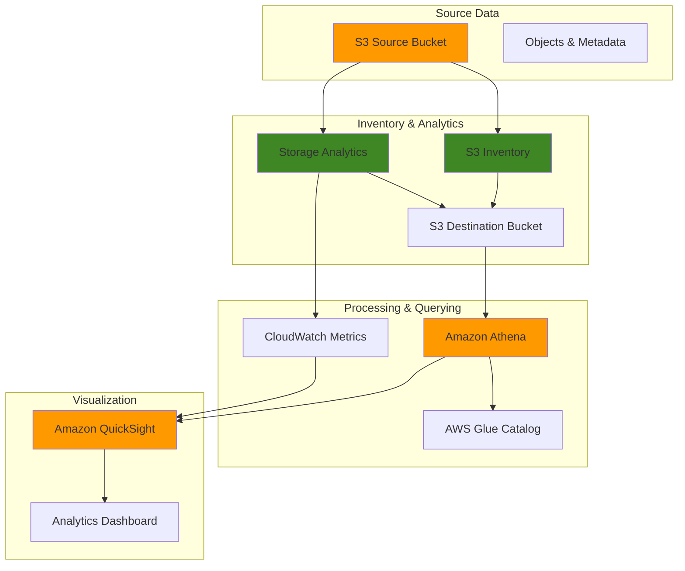

# Optimizing Storage with S3 Analytics and Reporting

## Problem

Enterprise organizations store petabytes of data across thousands of S3 buckets without clear visibility into storage usage patterns, costs, and optimization opportunities. IT teams struggle to answer basic questions like which objects haven't been accessed in months, what storage classes are being underutilized, and how to reduce storage costs while maintaining performance. Manual auditing through S3 console or CLI operations is time-consuming and doesn't scale for large datasets, leaving organizations paying for inefficient storage configurations.

## Solution

This solution implements S3 Inventory and Storage Analytics to create automated reporting dashboards that provide comprehensive visibility into storage usage patterns, cost optimization opportunities, and data access behaviors. By combining S3 Inventory reports with Storage Class Analysis and Amazon Athena queries, organizations can identify underutilized storage tiers, track object lifecycle patterns, and generate actionable insights for cost optimization without impacting application performance.

## Architecture Diagram



## Prerequisites

1. AWS account with IAM permissions for S3, Athena, Glue, CloudWatch, and QuickSight
2. AWS CLI v2 installed and configured (or AWS CloudShell)
3. Basic understanding of S3 storage classes and lifecycle policies
4. Existing S3 bucket with objects to analyze (or sample data will be created)
5. Estimated cost: $5-20 per month for small datasets (S3 inventory $0.0025 per million objects, Athena $5 per TB scanned, QuickSight $9 per user, Lambda minimal cost for low-frequency execution)

> **Note**: S3 Inventory reports are generated daily or weekly and may take up to 48 hours for the first report to appear.

## Preparation

```bash
# Set environment variables
export AWS_REGION=$(aws configure get region)
export AWS_ACCOUNT_ID=$(aws sts get-caller-identity \
    --query Account --output text)

# Generate unique identifiers for resources
RANDOM_SUFFIX=$(aws secretsmanager get-random-password \
    --exclude-punctuation --exclude-uppercase \
    --password-length 6 --require-each-included-type \
    --output text --query RandomPassword)

# Set resource names
export SOURCE_BUCKET="storage-analytics-source-${RANDOM_SUFFIX}"
export DEST_BUCKET="storage-analytics-reports-${RANDOM_SUFFIX}"
export INVENTORY_CONFIG_ID="daily-inventory-config"
export ANALYTICS_CONFIG_ID="storage-class-analysis"
export ATHENA_DATABASE="s3_inventory_db"
export ATHENA_TABLE="inventory_table"

# Create source bucket for demonstration
aws s3 mb s3://${SOURCE_BUCKET} --region ${AWS_REGION}

# Create destination bucket for reports
aws s3 mb s3://${DEST_BUCKET} --region ${AWS_REGION}

# Upload sample data to source bucket for analysis
echo "Sample data for storage analytics" > sample-file.txt
aws s3 cp sample-file.txt s3://${SOURCE_BUCKET}/data/sample-file.txt
aws s3 cp sample-file.txt s3://${SOURCE_BUCKET}/logs/access-log.txt
aws s3 cp sample-file.txt s3://${SOURCE_BUCKET}/archive/old-data.txt

echo "✅ Created buckets and uploaded sample data"
```

## Steps

1. **Configure S3 Inventory for automated reporting**:

   S3 Inventory provides a flat file listing of your objects and their metadata, eliminating the need for recursive LIST operations that can be expensive and slow on large buckets. This feature generates reports on a scheduled basis (daily or weekly) containing crucial metadata like storage class, size, last modified date, and encryption status. Understanding inventory configuration enables cost-effective monitoring and analysis of storage patterns without impacting production workloads.

   ```bash
   # Create inventory configuration JSON
   cat > inventory-config.json << EOF
   {
       "Id": "${INVENTORY_CONFIG_ID}",
       "IsEnabled": true,
       "IncludedObjectVersions": "Current",
       "Schedule": {
           "Frequency": "Daily"
       },
       "OptionalFields": [
           "Size",
           "LastModifiedDate",
           "StorageClass",
           "ETag",
           "ReplicationStatus",
           "EncryptionStatus"
       ],
       "Destination": {
           "S3BucketDestination": {
               "AccountId": "${AWS_ACCOUNT_ID}",
               "Bucket": "arn:aws:s3:::${DEST_BUCKET}",
               "Format": "CSV",
               "Prefix": "inventory-reports/"
           }
       }
   }
   EOF
   
   # Apply inventory configuration
   aws s3api put-bucket-inventory-configuration \
       --bucket ${SOURCE_BUCKET} \
       --id ${INVENTORY_CONFIG_ID} \
       --inventory-configuration file://inventory-config.json
   
   echo "✅ Configured S3 Inventory for daily reporting"
   ```

   The inventory configuration is now active and will generate the first report within 24-48 hours. This automated reporting foundation eliminates manual monitoring overhead and provides consistent data for downstream analytics processes. The CSV format ensures compatibility with standard data processing tools while the daily frequency provides timely insights for operational decisions.

2. **Set up destination bucket policy for inventory reports**:

   S3 bucket policies follow the principle of least privilege by granting only the specific permissions required for service-to-service communication. The S3 inventory service needs permission to write reports to your destination bucket, but security conditions ensure that only your authorized source bucket can trigger these writes. This IAM policy pattern demonstrates cross-service authorization while maintaining strict security boundaries essential for enterprise storage management.

   ```bash
   # Create bucket policy for inventory destination
   cat > inventory-bucket-policy.json << EOF
   {
       "Version": "2012-10-17",
       "Statement": [
           {
               "Sid": "InventoryDestinationBucketPolicy",
               "Effect": "Allow",
               "Principal": {
                   "Service": "s3.amazonaws.com"
               },
               "Action": "s3:PutObject",
               "Resource": "arn:aws:s3:::${DEST_BUCKET}/*",
               "Condition": {
                   "ArnLike": {
                       "aws:SourceArn": "arn:aws:s3:::${SOURCE_BUCKET}"
                   },
                   "StringEquals": {
                       "aws:SourceAccount": "${AWS_ACCOUNT_ID}",
                       "s3:x-amz-acl": "bucket-owner-full-control"
                   }
               }
           }
       ]
   }
   EOF
   
   # Apply bucket policy
   aws s3api put-bucket-policy \
       --bucket ${DEST_BUCKET} \
       --policy file://inventory-bucket-policy.json
   
   echo "✅ Applied destination bucket policy for inventory reports"
   ```

   The bucket policy is now configured with security conditions that verify both the source ARN and account ID, preventing unauthorized inventory reports from other buckets or accounts. The "bucket-owner-full-control" ACL ensures you maintain complete control over generated reports while enabling the S3 service to deliver them securely.

3. **Configure Storage Class Analysis for optimization insights**:

   Storage Class Analysis observes access patterns over time to recommend when objects should transition to more cost-effective storage tiers like Standard-IA or Glacier. This intelligent analysis typically requires 30 days of observation to generate meaningful insights but can identify potential cost savings of 40-60% for infrequently accessed data. The analysis focuses on specific prefixes, allowing granular optimization strategies for different data types and business requirements.

   ```bash
   # Create storage analytics configuration
   cat > analytics-config.json << EOF
   {
       "Id": "${ANALYTICS_CONFIG_ID}",
       "Filter": {
           "Prefix": "data/"
       },
       "StorageClassAnalysis": {
           "DataExport": {
               "OutputSchemaVersion": "V_1",
               "Destination": {
                   "S3BucketDestination": {
                       "Format": "CSV",
                       "BucketAccountId": "${AWS_ACCOUNT_ID}",
                       "Bucket": "arn:aws:s3:::${DEST_BUCKET}",
                       "Prefix": "analytics-reports/"
                   }
               }
           }
       }
   }
   EOF
   
   # Apply analytics configuration
   aws s3api put-bucket-analytics-configuration \
       --bucket ${SOURCE_BUCKET} \
       --id ${ANALYTICS_CONFIG_ID} \
       --analytics-configuration file://analytics-config.json
   
   echo "✅ Configured Storage Class Analysis for optimization insights"
   ```

   Storage Class Analysis is now monitoring access patterns for objects with the "data/" prefix and will begin generating recommendations after sufficient observation time. This targeted approach allows you to optimize specific data categories while maintaining performance for frequently accessed content. The CSV exports integrate seamlessly with your analytics pipeline for automated cost optimization workflows.

> **Warning**: Storage Class Analysis requires at least 30 days of observation to generate meaningful recommendations. Implement this early in your optimization planning to ensure sufficient data collection time.

4. **Create Athena database and configure query environment**:

   Amazon Athena enables serverless SQL queries directly against S3 data without requiring data movement or complex ETL processes. By creating a dedicated database for inventory analysis, you establish a structured querying environment that can process petabytes of inventory data with standard SQL. Athena integrates with the AWS Glue Data Catalog to automatically discover schema and enable fast, cost-effective analytics on your storage metadata.

   ```bash
   # Create Athena database
   aws athena start-query-execution \
       --query-string "CREATE DATABASE IF NOT EXISTS ${ATHENA_DATABASE}" \
       --result-configuration OutputLocation=s3://${DEST_BUCKET}/athena-results/ \
       --work-group primary
   
   # Wait for query to complete
   sleep 10
   
   # Configure Athena query result location
   aws athena update-work-group \
       --work-group primary \
       --configuration-updates \
       ResultConfigurationUpdates='{
           "OutputLocation": "s3://'${DEST_BUCKET}'/athena-results/"
       }'
   
   echo "✅ Created Athena database and configured query environment"
   ```

   The Athena database is now ready to query inventory reports using familiar SQL syntax. This serverless approach eliminates infrastructure management overhead while providing enterprise-scale analytics capabilities. Query results are automatically stored in S3, enabling further analysis or integration with business intelligence tools for comprehensive storage insights.

5. **Set up CloudWatch metrics for storage analytics monitoring**:

   CloudWatch dashboards provide real-time visibility into storage metrics and operational health, complementing the batch analytics from inventory reports. These dashboards track storage growth, request patterns, and cost trends with configurable time periods and alerting capabilities. Understanding CloudWatch metrics enables proactive monitoring and helps correlate storage analytics insights with actual usage patterns and performance impacts.

   ```bash
   # Create CloudWatch dashboard configuration
   cat > dashboard-config.json << EOF
   {
       "widgets": [
           {
               "type": "metric",
               "properties": {
                   "metrics": [
                       ["AWS/S3", "BucketSizeBytes", "BucketName", "${SOURCE_BUCKET}", "StorageType", "StandardStorage"],
                       [".", ".", ".", ".", ".", "StandardIAStorage"],
                       [".", "NumberOfObjects", ".", ".", ".", "AllStorageTypes"]
                   ],
                   "period": 86400,
                   "stat": "Average",
                   "region": "${AWS_REGION}",
                   "title": "S3 Storage Metrics"
               }
           },
           {
               "type": "metric",
               "properties": {
                   "metrics": [
                       ["AWS/S3", "BucketRequests", "BucketName", "${SOURCE_BUCKET}", "FilterId", "EntireBucket"]
                   ],
                   "period": 3600,
                   "stat": "Sum",
                   "region": "${AWS_REGION}",
                   "title": "S3 Request Metrics"
               }
           }
       ]
   }
   EOF
   
   # Create CloudWatch dashboard
   aws cloudwatch put-dashboard \
       --dashboard-name "S3-Storage-Analytics-${RANDOM_SUFFIX}" \
       --dashboard-body file://dashboard-config.json
   
   echo "✅ Created CloudWatch dashboard for storage analytics monitoring"
   ```

   The CloudWatch dashboard now provides continuous monitoring of storage size by storage class and request patterns. This real-time view complements the batch inventory analysis, enabling you to spot trends, detect anomalies, and validate optimization strategies. The dashboard serves as an operational tool for daily monitoring while inventory reports provide detailed analysis for strategic decisions.

6. **Create sample Athena queries for inventory analysis**:

   Pre-built SQL queries accelerate your analytics workflow by providing proven patterns for common storage optimization scenarios. These queries demonstrate advanced SQL techniques like date parsing, conditional aggregation, and cost calculation that translate inventory metadata into actionable business insights. Understanding these query patterns enables you to customize analysis for your specific use cases and build automated reporting workflows.

   ```bash
   # Create queries directory
   mkdir -p athena-queries
   
   # Create query for storage class distribution
   cat > athena-queries/storage-class-distribution.sql << EOF
   -- Query to analyze storage class distribution
   SELECT 
       storage_class,
       COUNT(*) as object_count,
       SUM(size) as total_size_bytes,
       ROUND(SUM(size) / 1024.0 / 1024.0 / 1024.0, 2) as total_size_gb
   FROM ${ATHENA_DATABASE}.${ATHENA_TABLE}
   GROUP BY storage_class
   ORDER BY total_size_bytes DESC;
   EOF
   
   # Create query for old objects analysis
   cat > athena-queries/old-objects-analysis.sql << EOF
   -- Query to find objects older than 30 days
   SELECT 
       key,
       size,
       storage_class,
       last_modified_date,
       DATE_DIFF('day', DATE_PARSE(last_modified_date, '%Y-%m-%dT%H:%i:%s.%fZ'), CURRENT_DATE) as days_old
   FROM ${ATHENA_DATABASE}.${ATHENA_TABLE}
   WHERE DATE_DIFF('day', DATE_PARSE(last_modified_date, '%Y-%m-%dT%H:%i:%s.%fZ'), CURRENT_DATE) > 30
   ORDER BY days_old DESC;
   EOF
   
   # Create query for prefix-based analysis
   cat > athena-queries/prefix-analysis.sql << EOF
   -- Query to analyze storage by prefix
   SELECT 
       CASE 
           WHEN key LIKE 'data/%' THEN 'data'
           WHEN key LIKE 'logs/%' THEN 'logs'
           WHEN key LIKE 'archive/%' THEN 'archive'
           ELSE 'other'
       END as prefix_category,
       COUNT(*) as object_count,
       SUM(size) as total_size_bytes,
       AVG(size) as avg_size_bytes
   FROM ${ATHENA_DATABASE}.${ATHENA_TABLE}
   GROUP BY 1
   ORDER BY total_size_bytes DESC;
   EOF
   
   echo "✅ Created sample Athena queries for inventory analysis"
   ```

   These SQL templates provide immediate analytical capabilities for storage class optimization, lifecycle policy planning, and prefix-based organization analysis. The queries can be executed manually for ad-hoc analysis or integrated into automated reporting pipelines. These patterns form the foundation for building comprehensive storage governance and cost optimization programs.

7. **Set up automated reporting with Lambda function**:

   AWS Lambda enables serverless automation of storage analytics workflows, executing analysis queries on schedule without managing infrastructure. This function demonstrates event-driven architecture patterns where storage insights trigger automated actions like generating reports, updating lifecycle policies, or sending notifications. Understanding Lambda integration with Athena creates scalable, cost-effective automation that adapts to your data growth without operational overhead.

   ```bash
   # Create Lambda function for automated reporting
   cat > lambda-function.py << 'EOF'
   import json
   import boto3
   import os
   from datetime import datetime, timedelta
   
   def lambda_handler(event, context):
       athena = boto3.client('athena')
       s3 = boto3.client('s3')
       
       # Configuration
       database = os.environ['ATHENA_DATABASE']
       table = os.environ['ATHENA_TABLE']
       output_bucket = os.environ['DEST_BUCKET']
       
       # Query for storage optimization insights
       query = f"""
       SELECT 
           storage_class,
           COUNT(*) as object_count,
           SUM(size) as total_size_bytes,
           ROUND(SUM(size) / 1024.0 / 1024.0 / 1024.0, 2) as total_size_gb,
           ROUND(AVG(size) / 1024.0 / 1024.0, 2) as avg_size_mb
       FROM {database}.{table}
       GROUP BY storage_class
       ORDER BY total_size_bytes DESC;
       """
       
       try:
           # Execute query
           response = athena.start_query_execution(
               QueryString=query,
               ResultConfiguration={
                   'OutputLocation': f's3://{output_bucket}/athena-results/'
               },
               WorkGroup='primary'
           )
           
           return {
               'statusCode': 200,
               'body': json.dumps({
                   'message': 'Storage analytics query executed successfully',
                   'queryExecutionId': response['QueryExecutionId']
               })
           }
           
       except Exception as e:
           return {
               'statusCode': 500,
               'body': json.dumps({
                   'error': str(e)
               })
           }
   EOF
   
   # Create Lambda deployment package
   zip lambda-function.zip lambda-function.py
   
   # Create IAM role for Lambda
   cat > lambda-trust-policy.json << EOF
   {
       "Version": "2012-10-17",
       "Statement": [
           {
               "Effect": "Allow",
               "Principal": {
                   "Service": "lambda.amazonaws.com"
               },
               "Action": "sts:AssumeRole"
           }
       ]
   }
   EOF
   
   # Create Lambda execution role
   aws iam create-role \
       --role-name StorageAnalyticsLambdaRole-${RANDOM_SUFFIX} \
       --assume-role-policy-document file://lambda-trust-policy.json
   
   # Attach basic Lambda execution policy
   aws iam attach-role-policy \
       --role-name StorageAnalyticsLambdaRole-${RANDOM_SUFFIX} \
       --policy-arn arn:aws:iam::aws:policy/service-role/AWSLambdaBasicExecutionRole
   
   # Create custom policy for Athena and S3 access
   cat > lambda-custom-policy.json << EOF
   {
       "Version": "2012-10-17",
       "Statement": [
           {
               "Effect": "Allow",
               "Action": [
                   "athena:StartQueryExecution",
                   "athena:GetQueryExecution",
                   "athena:GetQueryResults",
                   "s3:GetObject",
                   "s3:PutObject",
                   "s3:ListBucket",
                   "glue:GetDatabase",
                   "glue:GetTable"
               ],
               "Resource": "*"
           }
       ]
   }
   EOF
   
   # Create and attach custom policy
   aws iam put-role-policy \
       --role-name StorageAnalyticsLambdaRole-${RANDOM_SUFFIX} \
       --policy-name StorageAnalyticsPolicy \
       --policy-document file://lambda-custom-policy.json
   
   # Wait for role to be available
   sleep 10
   
   # Create Lambda function
   LAMBDA_ROLE_ARN=$(aws iam get-role \
       --role-name StorageAnalyticsLambdaRole-${RANDOM_SUFFIX} \
       --query 'Role.Arn' --output text)
   
   aws lambda create-function \
       --function-name StorageAnalyticsFunction-${RANDOM_SUFFIX} \
       --runtime python3.12 \
       --role ${LAMBDA_ROLE_ARN} \
       --handler lambda-function.lambda_handler \
       --zip-file fileb://lambda-function.zip \
       --environment Variables="{
           ATHENA_DATABASE=${ATHENA_DATABASE},
           ATHENA_TABLE=${ATHENA_TABLE},
           DEST_BUCKET=${DEST_BUCKET}
       }"
   
   echo "✅ Created Lambda function for automated reporting"
   ```

   The Lambda function is now deployed with the necessary IAM permissions to execute Athena queries and access S3 resources. This serverless automation layer can be triggered by schedules, S3 events, or API calls to provide on-demand analytics. The function establishes a foundation for building sophisticated storage governance workflows that automatically respond to changing conditions and optimize costs without manual intervention.

8. **Configure EventBridge schedule for automated reports**:

   Amazon EventBridge provides reliable, serverless event scheduling that integrates seamlessly with AWS services like Lambda. This scheduling mechanism ensures your storage analytics run consistently without manual intervention, enabling continuous monitoring and optimization. EventBridge's scheduling capabilities support complex timing patterns and can integrate with multiple targets, creating robust automation workflows for enterprise storage management.

   ```bash
   # Create EventBridge rule for daily reports
   aws events put-rule \
       --name StorageAnalyticsSchedule-${RANDOM_SUFFIX} \
       --schedule-expression "rate(1 day)" \
       --description "Daily storage analytics reporting"
   
   # Add Lambda as target
   LAMBDA_ARN=$(aws lambda get-function \
       --function-name StorageAnalyticsFunction-${RANDOM_SUFFIX} \
       --query 'Configuration.FunctionArn' --output text)
   
   aws events put-targets \
       --rule StorageAnalyticsSchedule-${RANDOM_SUFFIX} \
       --targets "Id=1,Arn=${LAMBDA_ARN}"
   
   # Grant EventBridge permission to invoke Lambda
   aws lambda add-permission \
       --function-name StorageAnalyticsFunction-${RANDOM_SUFFIX} \
       --statement-id storage-analytics-schedule \
       --action lambda:InvokeFunction \
       --principal events.amazonaws.com \
       --source-arn arn:aws:events:${AWS_REGION}:${AWS_ACCOUNT_ID}:rule/StorageAnalyticsSchedule-${RANDOM_SUFFIX}
   
   echo "✅ Configured EventBridge schedule for automated daily reports"
   ```

   The automated reporting pipeline is now complete, with EventBridge triggering daily analysis of your storage inventory data. This event-driven architecture ensures consistent reporting while maintaining cost efficiency through serverless execution. The schedule can be modified to meet your specific reporting requirements, from real-time analysis to monthly summaries.

## Validation & Testing

1. **Verify S3 Inventory configuration**:

   ```bash
   # Check inventory configuration
   aws s3api get-bucket-inventory-configuration \
       --bucket ${SOURCE_BUCKET} \
       --id ${INVENTORY_CONFIG_ID}
   
   # List analytics configurations
   aws s3api list-bucket-analytics-configurations \
       --bucket ${SOURCE_BUCKET}
   ```

   Expected output: JSON configuration showing daily inventory schedule and analytics setup.

2. **Test Athena database setup**:

   ```bash
   # List databases
   aws athena get-database \
       --catalog-name AwsDataCatalog \
       --database-name ${ATHENA_DATABASE}
   
   # Check if query results location is configured
   aws athena get-work-group \
       --work-group primary \
       --query 'WorkGroup.Configuration.ResultConfiguration.OutputLocation'
   ```

3. **Verify CloudWatch dashboard**:

   ```bash
   # List dashboards
   aws cloudwatch list-dashboards \
       --dashboard-name-prefix "S3-Storage-Analytics"
   
   # Get dashboard details
   aws cloudwatch get-dashboard \
       --dashboard-name "S3-Storage-Analytics-${RANDOM_SUFFIX}"
   ```

4. **Test Lambda function**:

   ```bash
   # Invoke Lambda function manually
   aws lambda invoke \
       --function-name StorageAnalyticsFunction-${RANDOM_SUFFIX} \
       --payload '{}' \
       response.json
   
   # Check response
   cat response.json
   ```

## Cleanup

1. **Remove EventBridge rule and Lambda function**:

   ```bash
   # Remove EventBridge rule
   aws events remove-targets \
       --rule StorageAnalyticsSchedule-${RANDOM_SUFFIX} \
       --ids "1"
   
   aws events delete-rule \
       --name StorageAnalyticsSchedule-${RANDOM_SUFFIX}
   
   # Delete Lambda function
   aws lambda delete-function \
       --function-name StorageAnalyticsFunction-${RANDOM_SUFFIX}
   
   echo "✅ Removed EventBridge rule and Lambda function"
   ```

2. **Remove IAM role and policies**:

   ```bash
   # Detach policies from role
   aws iam detach-role-policy \
       --role-name StorageAnalyticsLambdaRole-${RANDOM_SUFFIX} \
       --policy-arn arn:aws:iam::aws:policy/service-role/AWSLambdaBasicExecutionRole
   
   # Remove inline policy
   aws iam delete-role-policy \
       --role-name StorageAnalyticsLambdaRole-${RANDOM_SUFFIX} \
       --policy-name StorageAnalyticsPolicy
   
   # Delete role
   aws iam delete-role \
       --role-name StorageAnalyticsLambdaRole-${RANDOM_SUFFIX}
   
   echo "✅ Removed IAM role and policies"
   ```

3. **Remove S3 configurations and buckets**:

   ```bash
   # Remove inventory configuration
   aws s3api delete-bucket-inventory-configuration \
       --bucket ${SOURCE_BUCKET} \
       --id ${INVENTORY_CONFIG_ID}
   
   # Remove analytics configuration
   aws s3api delete-bucket-analytics-configuration \
       --bucket ${SOURCE_BUCKET} \
       --id ${ANALYTICS_CONFIG_ID}
   
   # Delete bucket contents and buckets
   aws s3 rm s3://${SOURCE_BUCKET} --recursive
   aws s3 rb s3://${SOURCE_BUCKET}
   
   aws s3 rm s3://${DEST_BUCKET} --recursive
   aws s3 rb s3://${DEST_BUCKET}
   
   echo "✅ Removed S3 configurations and buckets"
   ```

4. **Remove CloudWatch dashboard and Athena database**:

   ```bash
   # Delete CloudWatch dashboard
   aws cloudwatch delete-dashboards \
       --dashboard-names "S3-Storage-Analytics-${RANDOM_SUFFIX}"
   
   # Drop Athena database
   aws athena start-query-execution \
       --query-string "DROP DATABASE IF EXISTS ${ATHENA_DATABASE} CASCADE" \
       --result-configuration OutputLocation=s3://${DEST_BUCKET}/athena-results/ \
       --work-group primary
   
   echo "✅ Removed CloudWatch dashboard and Athena database"
   ```

## Discussion

This solution provides a comprehensive approach to S3 storage analytics and cost optimization through automated inventory reporting and storage class analysis. [S3 Inventory](https://docs.aws.amazon.com/AmazonS3/latest/userguide/storage-inventory.html) generates detailed reports about your objects and their metadata on a scheduled basis, providing visibility into storage usage patterns without the performance impact of LIST operations. The inventory reports include critical metadata such as storage class, size, last modified date, and encryption status, enabling data-driven decisions about storage optimization.

[Storage Class Analysis](https://docs.aws.amazon.com/AmazonS3/latest/userguide/analytics-storage-class.html) complements inventory reporting by observing actual access patterns over time and providing recommendations for transitioning objects to more cost-effective storage tiers. The analysis typically requires 30 days of observation to provide meaningful insights, but delivers actionable recommendations for optimizing storage costs. By combining these tools with [Amazon Athena](https://docs.aws.amazon.com/athena/latest/ug/what-is.html) for querying and Amazon QuickSight for visualization, organizations can create powerful dashboards that surface storage optimization opportunities and track cost savings over time.

The automated reporting workflow using Lambda and EventBridge ensures that storage analytics insights are generated consistently and can trigger automated actions such as lifecycle policy updates or cost optimization notifications. This approach follows [AWS Well-Architected Framework](https://docs.aws.amazon.com/wellarchitected/latest/framework/welcome.html) cost optimization principles and scales effectively from small workloads to enterprise-level implementations with petabytes of data across thousands of buckets.

> **Tip**: Start with a small subset of your data using prefix filters in both inventory and analytics configurations to validate the solution before scaling to your entire storage footprint. This approach aligns with AWS best practices for gradual implementation and testing.

## Challenge

Extend this solution by implementing these enhancements:

1. **Multi-Account Analytics**: Configure cross-account inventory reporting to consolidate storage analytics across multiple AWS accounts using [AWS Organizations](https://docs.aws.amazon.com/organizations/latest/userguide/orgs_introduction.html) and cross-account IAM roles for centralized governance.

2. **Advanced Cost Modeling**: Integrate [AWS Cost Explorer APIs](https://docs.aws.amazon.com/awsaccountbilling/latest/aboutv2/ce-api.html) to calculate actual storage costs by storage class and create ROI projections for lifecycle transitions with real-time cost tracking.

3. **Predictive Analytics**: Use [Amazon SageMaker](https://docs.aws.amazon.com/sagemaker/latest/dg/whatis.html) to build machine learning models that predict future storage growth patterns and recommend proactive optimization strategies based on historical access patterns.

4. **Automated Lifecycle Management**: Create Lambda functions that automatically update [S3 lifecycle policies](https://docs.aws.amazon.com/AmazonS3/latest/userguide/object-lifecycle-mgmt.html) based on storage analytics insights, with approval workflows for significant changes using AWS Step Functions.

5. **Real-time Alerting**: Implement [CloudWatch alarms](https://docs.aws.amazon.com/AmazonCloudWatch/latest/monitoring/AlarmThatSendsEmail.html) that trigger when storage costs exceed thresholds or when optimization opportunities are identified, with integration to Slack or other notification systems via SNS.

## Infrastructure Code

### Available Infrastructure as Code:

- [Infrastructure Code Overview](code/README.md) - Detailed description of all infrastructure components
- [AWS CDK (Python)](code/cdk-python/) - AWS CDK Python implementation
- [AWS CDK (TypeScript)](code/cdk-typescript/) - AWS CDK TypeScript implementation
- [CloudFormation](code/cloudformation.yaml) - AWS CloudFormation template
- [Bash CLI Scripts](code/scripts/) - Example bash scripts using AWS CLI commands to deploy infrastructure
- [Terraform](code/terraform/) - Terraform configuration files