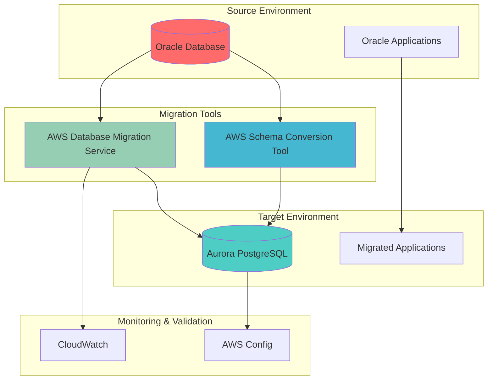

# Oracle to PostgreSQL Migration with DMS

## Problem

Enterprise organizations running Oracle databases face escalating licensing costs, vendor lock-in constraints, and complex maintenance requirements that impact their operational efficiency and budget allocation. Many companies pay millions annually in Oracle licensing fees while struggling with restrictive audit policies and limited scaling flexibility. The inability to quickly adapt database infrastructure to changing business needs creates technical debt and competitive disadvantages, forcing organizations to seek modernization paths that reduce costs while maintaining mission-critical application performance.

## Solution

AWS Database Migration Service (DMS) combined with AWS Schema Conversion Tool (SCT) provides a comprehensive solution for migrating Oracle databases to PostgreSQL with minimal downtime and automated schema conversion. This approach leverages SCT to analyze and convert Oracle database schemas, procedures, and functions to PostgreSQL-compatible formats, while DMS handles the data migration with continuous replication capabilities. The solution enables organizations to achieve significant cost savings, eliminate vendor lock-in, and gain access to modern PostgreSQL features and cloud-native scalability.

## Architecture Diagram



## Prerequisites

1. AWS account with DMS, RDS, and SCT permissions (DMS, RDS, IAM full access)
2. AWS CLI v2 installed and configured (or AWS CloudShell)
3. Oracle database with appropriate privileges (DBA or equivalent access)
4. Java 8 or later installed for running AWS SCT
5. Network connectivity between source Oracle and target PostgreSQL databases
6. Understanding of Oracle PL/SQL and PostgreSQL procedures
7. Estimated cost: $150-300 for Aurora PostgreSQL instance during migration period

> **Warning**: This migration process involves schema conversion and data transformation that may require application code modifications. Test thoroughly in a non-production environment first.

## Preparation

```bash
# Set environment variables
export AWS_REGION=$(aws configure get region)
export AWS_ACCOUNT_ID=$(aws sts get-caller-identity \
    --query Account --output text)

# Generate unique identifiers for resources
RANDOM_SUFFIX=$(aws secretsmanager get-random-password \
    --exclude-punctuation --exclude-uppercase \
    --password-length 6 --require-each-included-type \
    --output text --query RandomPassword)

export MIGRATION_PROJECT_NAME="oracle-to-postgresql-${RANDOM_SUFFIX}"
export REPLICATION_INSTANCE_ID="dms-replication-${RANDOM_SUFFIX}"
export AURORA_CLUSTER_ID="aurora-postgresql-${RANDOM_SUFFIX}"
export DMS_SUBNET_GROUP_NAME="dms-subnet-group-${RANDOM_SUFFIX}"

# Create VPC and networking components for migration
VPC_ID=$(aws ec2 create-vpc \
    --cidr-block 10.0.0.0/16 \
    --query 'Vpc.VpcId' --output text)

aws ec2 create-tags \
    --resources ${VPC_ID} \
    --tags Key=Name,Value=${MIGRATION_PROJECT_NAME}-vpc

# Create internet gateway for public access (needed for DMS)
IGW_ID=$(aws ec2 create-internet-gateway \
    --query 'InternetGateway.InternetGatewayId' --output text)

aws ec2 attach-internet-gateway \
    --vpc-id ${VPC_ID} \
    --internet-gateway-id ${IGW_ID}

# Create subnets in different AZs
SUBNET_1_ID=$(aws ec2 create-subnet \
    --vpc-id ${VPC_ID} \
    --cidr-block 10.0.1.0/24 \
    --availability-zone ${AWS_REGION}a \
    --query 'Subnet.SubnetId' --output text)

SUBNET_2_ID=$(aws ec2 create-subnet \
    --vpc-id ${VPC_ID} \
    --cidr-block 10.0.2.0/24 \
    --availability-zone ${AWS_REGION}b \
    --query 'Subnet.SubnetId' --output text)

# Create security group for DMS and Aurora
SECURITY_GROUP_ID=$(aws ec2 create-security-group \
    --group-name ${MIGRATION_PROJECT_NAME}-sg \
    --description "Security group for DMS migration" \
    --vpc-id ${VPC_ID} \
    --query 'GroupId' --output text)

# Allow DMS and PostgreSQL traffic
aws ec2 authorize-security-group-ingress \
    --group-id ${SECURITY_GROUP_ID} \
    --protocol tcp \
    --port 5432 \
    --source-group ${SECURITY_GROUP_ID}

# Create DB subnet group for Aurora
aws rds create-db-subnet-group \
    --db-subnet-group-name ${AURORA_CLUSTER_ID}-subnet-group \
    --db-subnet-group-description "Subnet group for Aurora PostgreSQL" \
    --subnet-ids ${SUBNET_1_ID} ${SUBNET_2_ID}

# Create DMS subnet group
aws dms create-replication-subnet-group \
    --replication-subnet-group-identifier ${DMS_SUBNET_GROUP_NAME} \
    --replication-subnet-group-description "DMS subnet group for migration" \
    --subnet-ids ${SUBNET_1_ID} ${SUBNET_2_ID}

echo "✅ Created VPC and networking components"
```

> **Note**: Ensure your VPC CIDR blocks don't overlap with existing network infrastructure to avoid routing conflicts during migration. See [AWS VPC Documentation](https://docs.aws.amazon.com/vpc/latest/userguide/what-is-amazon-vpc.html) for network planning best practices.

## Steps

1. **Create Aurora PostgreSQL Target Database**:

   Aurora PostgreSQL provides a cloud-native, fully-managed database service that delivers up to 3x better performance than standard PostgreSQL while maintaining full compatibility. Unlike traditional RDS PostgreSQL, Aurora uses a distributed storage architecture that automatically scales up to 128TB and provides continuous backup to S3. This foundational step establishes the high-performance target environment that will handle your migrated Oracle workloads with enhanced reliability and cost-effectiveness.

   ```bash
   # Create Aurora PostgreSQL cluster
   aws rds create-db-cluster \
       --db-cluster-identifier ${AURORA_CLUSTER_ID} \
       --engine aurora-postgresql \
       --engine-version 16.4 \
       --master-username dbadmin \
       --master-user-password 'TempPassword123!' \
       --db-subnet-group-name ${AURORA_CLUSTER_ID}-subnet-group \
       --vpc-security-group-ids ${SECURITY_GROUP_ID} \
       --backup-retention-period 7 \
       --preferred-backup-window "03:00-04:00" \
       --preferred-maintenance-window "sun:04:00-sun:05:00" \
       --port 5432
   
   # Create Aurora PostgreSQL instance
   aws rds create-db-instance \
       --db-instance-identifier ${AURORA_CLUSTER_ID}-instance-1 \
       --db-instance-class db.r6i.large \
       --engine aurora-postgresql \
       --db-cluster-identifier ${AURORA_CLUSTER_ID} \
       --monitoring-interval 60 \
       --performance-insights-enabled \
       --performance-insights-retention-period 7
   
   # Wait for cluster to be available
   aws rds wait db-cluster-available \
       --db-cluster-identifier ${AURORA_CLUSTER_ID}
   
   echo "✅ Aurora PostgreSQL cluster created and available"
   ```

   The Aurora PostgreSQL cluster is now provisioned with enterprise-grade features including automated backups, point-in-time recovery, and Performance Insights monitoring. This managed infrastructure eliminates the operational overhead of database administration while providing the scalability and reliability needed for production workloads. The cluster serves as the foundation for all subsequent migration activities.

2. **Install and Configure AWS Schema Conversion Tool**:

   AWS Schema Conversion Tool (SCT) is a critical component for heterogeneous database migrations, providing automated analysis and conversion of Oracle database schemas to PostgreSQL-compatible formats. SCT examines Oracle-specific objects including stored procedures, functions, triggers, and data types, then generates equivalent PostgreSQL code while identifying potential conversion challenges. This tool significantly reduces manual effort in schema modernization and provides detailed assessment reports that help plan migration strategies and estimate required development resources.

   ```bash
   # Download AWS SCT (Linux/Ubuntu)
   curl -O https://s3.amazonaws.com/publicsctdownload/Ubuntu/aws-schema-conversion-tool-1.0.latest.zip
   
   # Extract and install
   unzip aws-schema-conversion-tool-1.0.latest.zip
   cd aws-schema-conversion-tool-1.0.*
   
   # Install SCT (Ubuntu/Debian)
   sudo dpkg -i aws-schema-conversion-tool-1.0.*.deb
   
   # For CentOS/RHEL/Fedora use:
   # sudo yum install aws-schema-conversion-tool-1.0.*.rpm
   
   # Verify installation
   which aws-schema-conversion-tool
   
   echo "✅ AWS SCT installed successfully"
   ```

   AWS SCT is now ready to analyze your Oracle database and generate PostgreSQL-compatible schema objects. The tool provides both graphical and command-line interfaces, enabling integration into automated migration workflows. With SCT properly configured, you can now proceed to assess conversion complexity and generate detailed migration reports that inform your overall migration strategy.

3. **Create DMS IAM Roles and Policies**:

   AWS DMS requires specific IAM roles to access VPC resources and CloudWatch logging services securely. These service-linked roles follow the principle of least privilege, granting DMS only the minimum permissions necessary for network management and operational monitoring. The VPC management role enables DMS to create and manage network interfaces within your VPC, while the CloudWatch logs role provides audit trails and troubleshooting capabilities essential for production migration operations.

   ```bash
   # Create DMS VPC role (if not exists)
   aws iam create-role \
       --role-name dms-vpc-role \
       --assume-role-policy-document '{
           "Version": "2012-10-17",
           "Statement": [
               {
                   "Effect": "Allow",
                   "Principal": {
                       "Service": "dms.amazonaws.com"
                   },
                   "Action": "sts:AssumeRole"
               }
           ]
       }' 2>/dev/null || echo "DMS VPC role already exists"
   
   # Attach DMS VPC management policy
   aws iam attach-role-policy \
       --role-name dms-vpc-role \
       --policy-arn arn:aws:iam::aws:policy/service-role/AmazonDMSVPCManagementRole
   
   # Create DMS CloudWatch logs role (if not exists)  
   aws iam create-role \
       --role-name dms-cloudwatch-logs-role \
       --assume-role-policy-document '{
           "Version": "2012-10-17",
           "Statement": [
               {
                   "Effect": "Allow",
                   "Principal": {
                       "Service": "dms.amazonaws.com"
                   },
                   "Action": "sts:AssumeRole"
               }
           ]
       }' 2>/dev/null || echo "DMS CloudWatch logs role already exists"
   
   # Attach CloudWatch logs policy
   aws iam attach-role-policy \
       --role-name dms-cloudwatch-logs-role \
       --policy-arn arn:aws:iam::aws:policy/service-role/AmazonDMSCloudWatchLogsRole
   
   echo "✅ DMS IAM roles created"
   ```

   The DMS service roles are now configured with appropriate security boundaries, enabling secure network operations and comprehensive logging. These roles provide the foundation for DMS to operate within your VPC while maintaining audit compliance and operational visibility. The security configuration ensures that all migration activities are properly authenticated and logged for enterprise governance requirements.

4. **Create DMS Replication Instance**:

   The DMS replication instance serves as the compute engine that processes data migration tasks between source and target databases. This EC2-based instance handles data transformation, filtering, and transmission while maintaining transaction consistency and providing fault tolerance through Multi-AZ deployment. The instance size determines migration throughput and concurrent task capacity, making it crucial for meeting performance and timeline requirements in large-scale enterprise migrations.

   ```bash
   # Create DMS replication instance
   aws dms create-replication-instance \
       --replication-instance-identifier ${REPLICATION_INSTANCE_ID} \
       --replication-instance-class dms.c6i.large \
       --allocated-storage 100 \
       --auto-minor-version-upgrade \
       --multi-az \
       --replication-subnet-group-identifier ${DMS_SUBNET_GROUP_NAME} \
       --publicly-accessible false \
       --vpc-security-group-ids ${SECURITY_GROUP_ID}
   
   # Wait for replication instance to be available
   aws dms wait replication-instance-available \
       --replication-instance-identifier ${REPLICATION_INSTANCE_ID}
   
   echo "✅ DMS replication instance created and available"
   ```

   The DMS replication instance is now operational and ready to handle migration tasks with high availability and performance. The Multi-AZ configuration ensures continuous operation even during instance maintenance or failure scenarios. This compute foundation provides the processing power and network connectivity required for efficient data transfer and transformation between Oracle and PostgreSQL systems.

5. **Configure Source Oracle Database Endpoint**:

   DMS endpoints define the connection parameters and behavior settings for source and target databases. The Oracle source endpoint configuration includes advanced settings for handling Oracle-specific features like LogMiner, ASM storage, and character set semantics. These settings optimize data extraction performance and ensure compatibility with Oracle's transaction log mechanisms, enabling efficient change data capture for continuous replication scenarios.

   ```bash
   # Create Oracle source endpoint
   aws dms create-endpoint \
       --endpoint-identifier oracle-source-endpoint \
       --endpoint-type source \
       --engine-name oracle \
       --server-name your-oracle-server.example.com \
       --port 1521 \
       --database-name ORCL \
       --username oracle_user \
       --password 'oracle_password' \
       --oracle-settings '{
           "SecurityDbEncryption": "NONE",
           "SecurityDbEncryptionName": "",
           "AsmPassword": "",
           "AsmServer": "",
           "AsmUser": "",
           "CharLengthSemantics": "default",
           "DirectPathNoLog": false,
           "DirectPathParallelLoad": false,
           "EnableHomogenousTablespace": true,
           "FailTasksOnLobTruncation": true,
           "NumberDatatypeScale": 0,
           "OraclePathPrefix": "",
           "ParallelAsmReadThreads": 0,
           "ReadAheadBlocks": 10000,
           "ReadTableSpaceName": false,
           "ReplacePathPrefix": false,
           "RetryInterval": 5,
           "UseAlternateFolderForOnline": false,
           "UsePathPrefix": ""
       }'
   
   # Test connection to Oracle source
   aws dms test-connection \
       --replication-instance-arn $(aws dms describe-replication-instances \
           --replication-instance-identifier ${REPLICATION_INSTANCE_ID} \
           --query 'ReplicationInstances[0].ReplicationInstanceArn' --output text) \
       --endpoint-arn $(aws dms describe-endpoints \
           --endpoint-identifier oracle-source-endpoint \
           --query 'Endpoints[0].EndpointArn' --output text)
   
   echo "✅ Oracle source endpoint configured and tested"
   ```

   The Oracle source endpoint is now established with optimized settings for enterprise-grade data extraction. The connection test validates network connectivity and authentication, ensuring reliable access to Oracle transaction logs and table data. This endpoint configuration enables DMS to efficiently capture both initial data loads and ongoing changes from your Oracle database.

6. **Configure Target PostgreSQL Database Endpoint**:

   The PostgreSQL target endpoint configuration optimizes data loading performance and ensures proper handling of PostgreSQL-specific features like JSONB, arrays, and custom data types. Advanced settings include batch processing parameters, transaction consistency controls, and DDL capture capabilities that enhance migration efficiency while maintaining data integrity. These configurations are particularly important for Aurora PostgreSQL to leverage its distributed architecture and performance optimizations.

   ```bash
   # Get Aurora PostgreSQL endpoint
   AURORA_ENDPOINT=$(aws rds describe-db-clusters \
       --db-cluster-identifier ${AURORA_CLUSTER_ID} \
       --query 'DBClusters[0].Endpoint' --output text)
   
   # Create PostgreSQL target endpoint
   aws dms create-endpoint \
       --endpoint-identifier postgresql-target-endpoint \
       --endpoint-type target \
       --engine-name postgres \
       --server-name ${AURORA_ENDPOINT} \
       --port 5432 \
       --database-name postgres \
       --username dbadmin \
       --password 'TempPassword123!' \
       --postgresql-settings '{
           "HeartbeatEnable": true,
           "HeartbeatSchema": "replication",
           "HeartbeatFrequency": 5,
           "CaptureDdls": true,
           "MaxFileSize": 512,
           "DatabaseMode": "default",
           "DdlArtifactsSchema": "public",
           "ExecuteTimeout": 60,
           "FailTasksOnLobTruncation": true,
           "MapBooleanAsBoolean": false,
           "MapJsonbAsClob": false,
           "MapLongVarcharAs": "wstring",
           "AfterConnectScript": "",
           "BatchApplyEnabled": false,
           "BatchApplyPreserveTransaction": true,
           "BatchApplyTimeoutMax": 30,
           "BatchApplyTimeoutMin": 1,
           "BatchSplitSize": 0
       }'
   
   # Test connection to PostgreSQL target
   aws dms test-connection \
       --replication-instance-arn $(aws dms describe-replication-instances \
           --replication-instance-identifier ${REPLICATION_INSTANCE_ID} \
           --query 'ReplicationInstances[0].ReplicationInstanceArn' --output text) \
       --endpoint-arn $(aws dms describe-endpoints \
           --endpoint-identifier postgresql-target-endpoint \
           --query 'Endpoints[0].EndpointArn' --output text)
   
   echo "✅ PostgreSQL target endpoint configured and tested"
   ```

   The PostgreSQL target endpoint is now configured with enterprise-grade settings that optimize data loading and ensure transaction consistency. The connection validation confirms Aurora PostgreSQL accessibility and proper authentication, establishing the pathway for efficient data ingestion. This endpoint configuration enables DMS to leverage Aurora's distributed storage architecture for maximum write performance during migration operations.

7. **Run Schema Conversion with AWS SCT**:

   Schema conversion is the most critical phase of heterogeneous database migration, transforming Oracle-specific database objects into PostgreSQL-compatible equivalents. SCT analyzes Oracle PL/SQL procedures, functions, triggers, and complex data types, then generates PostgreSQL PL/pgSQL code while identifying conversion challenges that require manual intervention. The assessment report provides detailed complexity analysis and effort estimates, enabling informed decision-making about migration scope and resource allocation.

   ```bash
   # Create SCT project configuration file
   cat > sct-project-config.json << EOF
   {
     "ProjectName": "${MIGRATION_PROJECT_NAME}",
     "SourceDatabaseEngine": "Oracle",
     "TargetDatabaseEngine": "PostgreSQL",
     "SourceConnection": {
       "ServerName": "your-oracle-server.example.com",
       "Port": 1521,
       "DatabaseName": "ORCL",
       "Username": "oracle_user",
       "Password": "oracle_password"
     },
     "TargetConnection": {
       "ServerName": "${AURORA_ENDPOINT}",
       "Port": 5432,
       "DatabaseName": "postgres",
       "Username": "dbadmin",
       "Password": "TempPassword123!"
     },
     "ConversionSettings": {
       "GenerateLogsReport": true,
       "OptimizeForAurora": true,
       "ConvertViews": true,
       "ConvertProcedures": true,
       "ConvertFunctions": true,
       "ConvertTriggers": true
     }
   }
   EOF
   
   # Launch SCT GUI for assessment (manual step)
   echo "Open AWS SCT GUI and create a new project using the configuration above"
   echo "Run assessment and generate conversion report"
   
   # Alternative: Use SCT CLI if available in your environment
   # aws-schema-conversion-tool --project-file sct-project-config.json \
   #     --action assess \
   #     --output-dir ./sct-assessment-report
   
   echo "✅ Schema conversion configuration prepared"
   ```

   The schema conversion assessment provides comprehensive analysis of migration complexity, identifying potential challenges and generating PostgreSQL-compatible database objects. The conversion report serves as a roadmap for application development teams, highlighting areas requiring manual code changes and providing conversion statistics. This assessment enables accurate project planning and resource allocation for the overall migration initiative.

   > **Tip**: Review the SCT assessment report carefully to identify objects requiring manual conversion. Plan additional development time for complex PL/SQL procedures and custom Oracle functions that may not convert automatically. The [AWS SCT User Guide](https://docs.aws.amazon.com/SchemaConversionTool/latest/userguide/CHAP_Welcome.html) provides detailed guidance on handling conversion challenges.

8. **Create Database Migration Task**:

   The DMS migration task orchestrates the actual data movement from Oracle to PostgreSQL using sophisticated table mapping rules and transformation logic. The task configuration defines data selection criteria, schema transformations, and performance optimization settings that ensure efficient data transfer while maintaining referential integrity. Full-load-and-CDC migration type enables initial data synchronization followed by continuous replication, minimizing downtime and ensuring data consistency throughout the migration process.

   ```bash
   # Create table mapping configuration
   cat > table-mapping.json << EOF
   {
     "rules": [
       {
         "rule-type": "selection",
         "rule-id": "1",
         "rule-name": "1",
         "object-locator": {
           "schema-name": "HR",
           "table-name": "%"
         },
         "rule-action": "include",
         "filters": []
       },
       {
         "rule-type": "transformation",
         "rule-id": "2",
         "rule-name": "2",
         "rule-target": "schema",
         "object-locator": {
           "schema-name": "HR"
         },
         "rule-action": "rename",
         "value": "hr"
       },
       {
         "rule-type": "transformation",
         "rule-id": "3",
         "rule-name": "3",
         "rule-target": "table",
         "object-locator": {
           "schema-name": "HR",
           "table-name": "%"
         },
         "rule-action": "convert-lowercase"
       }
     ]
   }
   EOF
   
   # Create migration task
   aws dms create-replication-task \
       --replication-task-identifier ${MIGRATION_PROJECT_NAME}-task \
       --source-endpoint-arn $(aws dms describe-endpoints \
           --endpoint-identifier oracle-source-endpoint \
           --query 'Endpoints[0].EndpointArn' --output text) \
       --target-endpoint-arn $(aws dms describe-endpoints \
           --endpoint-identifier postgresql-target-endpoint \
           --query 'Endpoints[0].EndpointArn' --output text) \
       --replication-instance-arn $(aws dms describe-replication-instances \
           --replication-instance-identifier ${REPLICATION_INSTANCE_ID} \
           --query 'ReplicationInstances[0].ReplicationInstanceArn' --output text) \
       --migration-type full-load-and-cdc \
       --table-mappings file://table-mapping.json \
       --replication-task-settings '{
           "TargetMetadata": {
               "TargetSchema": "",
               "SupportLobs": true,
               "FullLobMode": false,
               "LobChunkSize": 0,
               "LimitedSizeLobMode": true,
               "LobMaxSize": 32,
               "InlineLobMaxSize": 0,
               "LoadMaxFileSize": 0,
               "ParallelLoadThreads": 0,
               "ParallelLoadBufferSize": 0,
               "BatchApplyEnabled": false,
               "TaskRecoveryTableEnabled": false,
               "ParallelApplyThreads": 0,
               "ParallelApplyBufferSize": 0,
               "ParallelApplyQueuesPerThread": 0
           },
           "FullLoadSettings": {
               "TargetTablePrepMode": "DROP_AND_CREATE",
               "CreatePkAfterFullLoad": false,
               "StopTaskCachedChangesApplied": false,
               "StopTaskCachedChangesNotApplied": false,
               "MaxFullLoadSubTasks": 8,
               "TransactionConsistencyTimeout": 600,
               "CommitRate": 10000
           },
           "Logging": {
               "EnableLogging": true,
               "LogComponents": [
                   {
                       "Id": "TRANSFORMATION",
                       "Severity": "LOGGER_SEVERITY_DEFAULT"
                   },
                   {
                       "Id": "SOURCE_UNLOAD",
                       "Severity": "LOGGER_SEVERITY_DEFAULT"
                   },
                   {
                       "Id": "TARGET_LOAD",
                       "Severity": "LOGGER_SEVERITY_DEFAULT"
                   }
               ]
           }
       }'
   
   echo "✅ Database migration task created"
   ```

   The migration task is now configured with optimized settings for enterprise-scale data transfer and transformation. The task definition includes comprehensive logging, error handling, and performance tuning parameters that ensure reliable data migration with full audit trails. This configuration enables DMS to efficiently handle both initial data loads and ongoing change synchronization between Oracle and PostgreSQL systems.

9. **Start Database Migration Task**:

   Starting the migration task initiates the data transfer process, beginning with full table loads followed by continuous change data capture from Oracle transaction logs. The monitoring loop provides real-time visibility into migration progress, table statistics, and performance metrics essential for tracking large-scale enterprise migrations. This active monitoring enables proactive identification of performance bottlenecks and ensures migration timelines are met with data integrity maintained throughout the process.

   ```bash
   # Start the migration task
   aws dms start-replication-task \
       --replication-task-arn $(aws dms describe-replication-tasks \
           --replication-task-identifier ${MIGRATION_PROJECT_NAME}-task \
           --query 'ReplicationTasks[0].ReplicationTaskArn' --output text) \
       --start-replication-task-type start-replication
   
   # Monitor migration progress
   echo "Monitoring migration progress..."
   
   for i in {1..10}; do
       TASK_STATUS=$(aws dms describe-replication-tasks \
           --replication-task-identifier ${MIGRATION_PROJECT_NAME}-task \
           --query 'ReplicationTasks[0].Status' --output text)
       
       echo "Migration task status: ${TASK_STATUS}"
       
       if [ "$TASK_STATUS" = "running" ]; then
           # Get migration statistics
           aws dms describe-table-statistics \
               --replication-task-arn $(aws dms describe-replication-tasks \
                   --replication-task-identifier ${MIGRATION_PROJECT_NAME}-task \
                   --query 'ReplicationTasks[0].ReplicationTaskArn' --output text) \
               --query 'TableStatistics[0:5].[TableName,TableState,FullLoadRows,Inserts,Updates,Deletes]' \
               --output table
       fi
       
       if [ "$TASK_STATUS" = "stopped" ] || [ "$TASK_STATUS" = "failed" ]; then
           break
       fi
       
       sleep 30
   done
   
   echo "✅ Database migration task started and monitoring initiated"
   ```

   The migration task is now actively transferring data from Oracle to PostgreSQL with comprehensive monitoring and progress tracking. The real-time statistics provide visibility into table-level migration status, enabling proactive management of the migration process. This monitoring foundation ensures successful completion of the data migration phase while maintaining operational visibility throughout the process.

10. **Apply Converted Schema Objects**:

    Schema object application involves deploying SCT-generated PostgreSQL code including procedures, functions, triggers, and indexes to the target database. This step requires careful review of converted objects to ensure business logic integrity and optimal performance characteristics. The process includes creating PostgreSQL-specific optimizations like partial indexes, materialized views, and custom data types that leverage PostgreSQL's advanced features while maintaining compatibility with migrated application code.

    ```bash
    # Connect to PostgreSQL and apply converted schema
    PGPASSWORD='TempPassword123!' psql \
        -h ${AURORA_ENDPOINT} \
        -U dbadmin \
        -d postgres \
        -c "CREATE SCHEMA IF NOT EXISTS hr;"
    
    # Apply converted procedures and functions from SCT
    # Note: This requires manual review and application of SCT-generated SQL
    
    # Create sample converted function (example)
    PGPASSWORD='TempPassword123!' psql \
        -h ${AURORA_ENDPOINT} \
        -U dbadmin \
        -d postgres \
        -c "
        CREATE OR REPLACE FUNCTION hr.get_employee_count()
        RETURNS INTEGER AS \$\$
        BEGIN
            RETURN (SELECT COUNT(*) FROM hr.employees);
        END;
        \$\$ LANGUAGE plpgsql;
        "
    
    # Create indexes on migrated tables
    PGPASSWORD='TempPassword123!' psql \
        -h ${AURORA_ENDPOINT} \
        -U dbadmin \
        -d postgres \
        -c "
        CREATE INDEX IF NOT EXISTS idx_employees_department_id 
        ON hr.employees(department_id);
        CREATE INDEX IF NOT EXISTS idx_employees_manager_id 
        ON hr.employees(manager_id);
        "
    
    # Update table statistics
    PGPASSWORD='TempPassword123!' psql \
        -h ${AURORA_ENDPOINT} \
        -U dbadmin \
        -d postgres \
        -c "ANALYZE hr.employees;"
    
    echo "✅ Schema objects applied to PostgreSQL target"
    ```

    The converted schema objects are now deployed to PostgreSQL with optimized indexing and performance configurations. The database schema is functionally equivalent to the original Oracle structure while leveraging PostgreSQL's advanced features for improved performance and scalability. This foundation enables application teams to complete their code migration with confidence in the underlying database architecture.

11. **Configure Monitoring and Alerting**:

    Comprehensive monitoring and alerting provide operational visibility into migration performance and reliability, enabling proactive management of enterprise-scale database migrations. CloudWatch alarms monitor critical metrics like replication lag and task failures, providing early warning of potential issues that could impact migration timelines. This monitoring framework ensures 24/7 visibility into migration operations and enables rapid response to performance degradation or failure scenarios.

    ```bash
    # Create SNS topic for DMS alerts (optional)
    SNS_TOPIC_ARN=$(aws sns create-topic \
        --name dms-migration-alerts \
        --query 'TopicArn' --output text)
    
    # Create CloudWatch alarm for replication lag
    aws cloudwatch put-metric-alarm \
        --alarm-name "${MIGRATION_PROJECT_NAME}-replication-lag" \
        --alarm-description "Monitor DMS replication lag" \
        --metric-name CDCLatencySource \
        --namespace AWS/DMS \
        --statistic Average \
        --period 300 \
        --threshold 300 \
        --comparison-operator GreaterThanThreshold \
        --evaluation-periods 2 \
        --alarm-actions ${SNS_TOPIC_ARN} \
        --dimensions Name=ReplicationInstanceIdentifier,Value=${REPLICATION_INSTANCE_ID} \
                   Name=ReplicationTaskIdentifier,Value=${MIGRATION_PROJECT_NAME}-task
    
    # Create CloudWatch alarm for migration errors
    aws cloudwatch put-metric-alarm \
        --alarm-name "${MIGRATION_PROJECT_NAME}-migration-errors" \
        --alarm-description "Monitor DMS migration errors" \
        --metric-name CDCChangesMemorySource \
        --namespace AWS/DMS \
        --statistic Sum \
        --period 300 \
        --threshold 1000 \
        --comparison-operator GreaterThanThreshold \
        --evaluation-periods 1 \
        --alarm-actions ${SNS_TOPIC_ARN} \
        --dimensions Name=ReplicationTaskIdentifier,Value=${MIGRATION_PROJECT_NAME}-task
    
    echo "✅ Monitoring and alerting configured"
    ```

    The monitoring and alerting infrastructure is now operational, providing comprehensive visibility into migration performance and reliability. CloudWatch alarms enable proactive incident response and ensure migration operations maintain service level agreements. This monitoring foundation supports both real-time operations and historical analysis for continuous improvement of migration processes.

12. **Perform Post-Migration Validation**:

    Post-migration validation ensures data integrity and completeness through comprehensive testing of row counts, data types, and referential constraints. This critical quality assurance step validates that the migration preserved all business-critical data while maintaining relational integrity and performance characteristics. The validation process includes both automated data comparison and manual testing of business logic to ensure the PostgreSQL environment is ready for production workloads.

    ```bash
    # Validate row counts between source and target
    echo "Validating data migration..."
    
    # Create validation script
    cat > validate-migration.sql << 'EOF'
    -- Connect to PostgreSQL and validate data
    SELECT schemaname, tablename, n_tup_ins as row_count
    FROM pg_stat_user_tables 
    WHERE schemaname = 'hr'
    ORDER BY tablename;
    
    -- Check for any data type conversion issues
    SELECT table_name, column_name, data_type
    FROM information_schema.columns
    WHERE table_schema = 'hr'
    AND data_type IN ('text', 'varchar', 'character varying')
    ORDER BY table_name, column_name;
    
    -- Validate foreign key constraints
    SELECT conname, conrelid::regclass AS table_name, 
           confrelid::regclass AS referenced_table
    FROM pg_constraint
    WHERE contype = 'f'
    AND connamespace = (SELECT oid FROM pg_namespace WHERE nspname = 'hr');
    EOF
    
    # Run validation queries
    PGPASSWORD='TempPassword123!' psql \
        -h ${AURORA_ENDPOINT} \
        -U dbadmin \
        -d postgres \
        -f validate-migration.sql
    
    # Check DMS task statistics
    aws dms describe-table-statistics \
        --replication-task-arn $(aws dms describe-replication-tasks \
            --replication-task-identifier ${MIGRATION_PROJECT_NAME}-task \
            --query 'ReplicationTasks[0].ReplicationTaskArn' --output text) \
        --query 'TableStatistics[*].[TableName,TableState,FullLoadRows,ValidationState]' \
        --output table
    
    echo "✅ Post-migration validation completed"
    ```

    The post-migration validation confirms successful data transfer and schema conversion with comprehensive integrity checks. All critical business data has been preserved and optimized for PostgreSQL's performance characteristics. The validation results provide confidence that the migration meets enterprise quality standards and the database is ready for application testing and production deployment.

## Validation & Testing

1. **Verify Migration Task Status**:

   ```bash
   # Check overall migration task status
   aws dms describe-replication-tasks \
       --replication-task-identifier ${MIGRATION_PROJECT_NAME}-task \
       --query 'ReplicationTasks[0].[Status,ReplicationTaskStats]' \
       --output table
   ```

   Expected output: Task status should be "running" or "stopped" with successful completion statistics.

2. **Test Data Consistency**:

   ```bash
   # Compare record counts
   PGPASSWORD='TempPassword123!' psql \
       -h ${AURORA_ENDPOINT} \
       -U dbadmin \
       -d postgres \
       -c "SELECT COUNT(*) as postgresql_count FROM hr.employees;"
   
   # Compare sample data
   PGPASSWORD='TempPassword123!' psql \
       -h ${AURORA_ENDPOINT} \
       -U dbadmin \
       -d postgres \
       -c "SELECT * FROM hr.employees LIMIT 5;"
   ```

3. **Validate Schema Conversion**:

   ```bash
   # Test converted functions
   PGPASSWORD='TempPassword123!' psql \
       -h ${AURORA_ENDPOINT} \
       -U dbadmin \
       -d postgres \
       -c "SELECT hr.get_employee_count();"
   
   # Check index creation
   PGPASSWORD='TempPassword123!' psql \
       -h ${AURORA_ENDPOINT} \
       -U dbadmin \
       -d postgres \
       -c "SELECT indexname FROM pg_indexes WHERE schemaname = 'hr';"
   ```

4. **Performance Testing**:

   ```bash
   # Run performance comparison queries
   PGPASSWORD='TempPassword123!' psql \
       -h ${AURORA_ENDPOINT} \
       -U dbadmin \
       -d postgres \
       -c "EXPLAIN ANALYZE SELECT * FROM hr.employees WHERE department_id = 10;"
   ```

## Cleanup

1. **Stop Migration Task**:

   ```bash
   # Stop the replication task
   aws dms stop-replication-task \
       --replication-task-arn $(aws dms describe-replication-tasks \
           --replication-task-identifier ${MIGRATION_PROJECT_NAME}-task \
           --query 'ReplicationTasks[0].ReplicationTaskArn' --output text)
   
   echo "✅ Migration task stopped"
   ```

2. **Delete DMS Resources**:

   ```bash
   # Delete replication task
   aws dms delete-replication-task \
       --replication-task-arn $(aws dms describe-replication-tasks \
           --replication-task-identifier ${MIGRATION_PROJECT_NAME}-task \
           --query 'ReplicationTasks[0].ReplicationTaskArn' --output text)
   
   # Delete endpoints
   aws dms delete-endpoint \
       --endpoint-arn $(aws dms describe-endpoints \
           --endpoint-identifier oracle-source-endpoint \
           --query 'Endpoints[0].EndpointArn' --output text)
   
   aws dms delete-endpoint \
       --endpoint-arn $(aws dms describe-endpoints \
           --endpoint-identifier postgresql-target-endpoint \
           --query 'Endpoints[0].EndpointArn' --output text)
   
   # Delete replication instance
   aws dms delete-replication-instance \
       --replication-instance-arn $(aws dms describe-replication-instances \
           --replication-instance-identifier ${REPLICATION_INSTANCE_ID} \
           --query 'ReplicationInstances[0].ReplicationInstanceArn' --output text)
   
   echo "✅ DMS resources deleted"
   ```

3. **Delete Aurora PostgreSQL Cluster**:

   ```bash
   # Delete Aurora instance
   aws rds delete-db-instance \
       --db-instance-identifier ${AURORA_CLUSTER_ID}-instance-1 \
       --skip-final-snapshot
   
   # Wait for instance deletion
   aws rds wait db-instance-deleted \
       --db-instance-identifier ${AURORA_CLUSTER_ID}-instance-1
   
   # Delete Aurora cluster
   aws rds delete-db-cluster \
       --db-cluster-identifier ${AURORA_CLUSTER_ID} \
       --skip-final-snapshot
   
   echo "✅ Aurora PostgreSQL cluster deleted"
   ```

4. **Clean Up Network Resources**:

   ```bash
   # Delete CloudWatch alarms
   aws cloudwatch delete-alarms \
       --alarm-names "${MIGRATION_PROJECT_NAME}-replication-lag" \
                     "${MIGRATION_PROJECT_NAME}-migration-errors"
   
   # Delete SNS topic (if created)
   aws sns delete-topic --topic-arn ${SNS_TOPIC_ARN}
   
   # Delete subnet groups
   aws dms delete-replication-subnet-group \
       --replication-subnet-group-identifier ${DMS_SUBNET_GROUP_NAME}
   
   aws rds delete-db-subnet-group \
       --db-subnet-group-name ${AURORA_CLUSTER_ID}-subnet-group
   
   # Delete security group
   aws ec2 delete-security-group --group-id ${SECURITY_GROUP_ID}
   
   # Delete subnets
   aws ec2 delete-subnet --subnet-id ${SUBNET_1_ID}
   aws ec2 delete-subnet --subnet-id ${SUBNET_2_ID}
   
   # Detach and delete internet gateway
   aws ec2 detach-internet-gateway \
       --vpc-id ${VPC_ID} \
       --internet-gateway-id ${IGW_ID}
   
   aws ec2 delete-internet-gateway --internet-gateway-id ${IGW_ID}
   
   # Delete VPC
   aws ec2 delete-vpc --vpc-id ${VPC_ID}
   
   # Clean up environment variables
   unset MIGRATION_PROJECT_NAME REPLICATION_INSTANCE_ID AURORA_CLUSTER_ID
   unset DMS_SUBNET_GROUP_NAME VPC_ID SUBNET_1_ID SUBNET_2_ID SECURITY_GROUP_ID
   
   echo "✅ Network resources and environment variables cleaned up"
   ```

## Discussion

Oracle to PostgreSQL migration represents one of the most complex database modernization challenges organizations face today. The heterogeneous nature of this migration requires careful attention to schema conversion, data type mapping, and procedural language translation. [AWS DMS](https://docs.aws.amazon.com/dms/latest/oracle-to-aurora-postgresql-migration-playbook/chap-oracle-aurora-pg.tools.awsdms.html) and [SCT](https://docs.aws.amazon.com/SchemaConversionTool/latest/userguide/CHAP_Welcome.html) provide a comprehensive toolkit that automates much of this complexity, but successful migrations still require thorough planning and validation.

The AWS Schema Conversion Tool serves as the foundation for heterogeneous migrations by analyzing Oracle database objects and generating PostgreSQL-compatible equivalents. SCT's assessment reports provide crucial insights into conversion complexity, identifying objects that require manual intervention and estimating overall migration effort. The tool's ability to convert Oracle PL/SQL procedures and functions to PostgreSQL PL/pgSQL significantly reduces manual coding requirements, though complex business logic may still require developer review and optimization.

AWS DMS complements SCT by handling the data migration process with minimal downtime through its [change data capture capabilities](https://docs.aws.amazon.com/dms/latest/userguide/CHAP_Task.CDC.html). The service's ability to perform full load followed by ongoing replication ensures data consistency throughout the migration window. However, organizations must carefully consider factors such as replication lag, network bandwidth, and source database performance impact when planning migration timelines according to [DMS best practices](https://docs.aws.amazon.com/dms/latest/userguide/CHAP_BestPractices.html).

[Aurora PostgreSQL](https://docs.aws.amazon.com/AmazonRDS/latest/AuroraUserGuide/Aurora.AuroraPostgreSQL.html) provides advanced features including JSON/JSONB support, full-text search, and extensibility through custom functions, often providing opportunities for application enhancement beyond simple migration. Organizations frequently discover that PostgreSQL's cost-effectiveness and modern feature set enable new capabilities that were previously cost-prohibitive with Oracle licensing. The latest [Aurora PostgreSQL versions](https://docs.aws.amazon.com/AmazonRDS/latest/AuroraPostgreSQLReleaseNotes/aurorapostgresql-release-calendar.html) offer enhanced performance and compatibility features that further ease migration complexity.

> **Tip**: Use AWS SCT's assessment reports to identify conversion challenges early in the migration planning process, allowing sufficient time for application code modifications and testing. Consider using newer DMS instance classes like C6i for better performance and cost efficiency.

## Challenge

Extend this migration solution by implementing these advanced capabilities:

1. **Implement Blue-Green Deployment Strategy**: Create a blue-green deployment pattern using Aurora PostgreSQL read replicas and Route 53 weighted routing to enable zero-downtime cutover with instant rollback capabilities.

2. **Build Automated Performance Optimization**: Develop Lambda functions that analyze PostgreSQL query performance using pg_stat_statements and automatically apply index recommendations and configuration tuning based on workload patterns.

3. **Create Cross-Region Disaster Recovery**: Implement Aurora Global Database with automated failover capabilities and DMS-based ongoing replication to ensure business continuity across AWS regions.

4. **Develop Application Code Modernization Pipeline**: Build a CodePipeline workflow that automatically identifies and converts Oracle-specific SQL patterns in application code to PostgreSQL equivalents using regex-based transformations and automated testing.

5. **Implement Cost Optimization Automation**: Create a comprehensive cost monitoring solution using Cost Explorer APIs that tracks migration-related expenses and automatically right-sizes Aurora instances based on utilization patterns and performance metrics.

## Infrastructure Code

### Available Infrastructure as Code:

- [Infrastructure Code Overview](code/README.md) - Detailed description of all infrastructure components
- [AWS CDK (Python)](code/cdk-python/) - AWS CDK Python implementation
- [AWS CDK (TypeScript)](code/cdk-typescript/) - AWS CDK TypeScript implementation
- [CloudFormation](code/cloudformation.yaml) - AWS CloudFormation template
- [Bash CLI Scripts](code/scripts/) - Example bash scripts using AWS CLI commands to deploy infrastructure
- [Terraform](code/terraform/) - Terraform configuration files