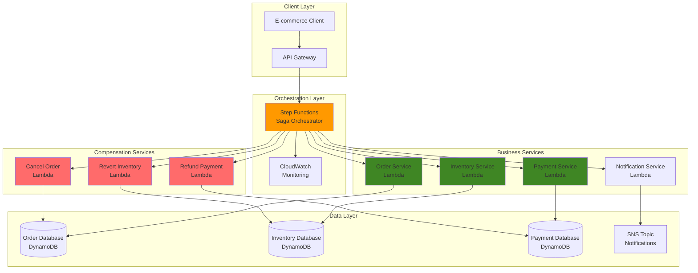

# Orchestrating Distributed Transactions with Saga Patterns

## Problem

Modern e-commerce platforms require complex distributed transactions that span multiple services - inventory management, payment processing, order fulfillment, and customer notifications. When these operations fail midway through a transaction, traditional rollback mechanisms are insufficient because each service maintains its own data store. A failed payment after inventory deduction leaves the system in an inconsistent state, leading to oversold items, incorrect customer charges, and operational chaos that can cost thousands of dollars in lost revenue and customer trust.

## Solution

Implement the saga orchestration pattern using AWS Step Functions to coordinate distributed transactions across multiple services. Step Functions acts as a central coordinator that executes business logic in sequence and triggers compensating actions when failures occur. This approach ensures data consistency through automated rollback mechanisms while maintaining service independence and enabling complex business workflows that span multiple microservices.

## Architecture Diagram



## Prerequisites

1. AWS account with appropriate permissions for Step Functions, Lambda, DynamoDB, SNS, API Gateway, IAM, and CloudWatch
2. AWS CLI v2 installed and configured (or AWS CloudShell)
3. Basic understanding of distributed systems and transaction management concepts
4. Familiarity with Amazon States Language (ASL) for Step Functions workflows
5. Knowledge of event-driven architecture patterns
6. Estimated cost: $5-10 for resources created during this tutorial

> **Note**: This recipe demonstrates advanced distributed transaction patterns. Ensure you understand the business requirements before implementing saga patterns in production.

## Preparation

```bash
# Set environment variables
export AWS_REGION=$(aws configure get region)
export AWS_ACCOUNT_ID=$(aws sts get-caller-identity \
    --query Account --output text)

# Generate unique identifiers for resources
RANDOM_SUFFIX=$(aws secretsmanager get-random-password \
    --exclude-punctuation --exclude-uppercase \
    --password-length 6 --require-each-included-type \
    --output text --query RandomPassword)

# Set resource names
export SAGA_STATE_MACHINE_NAME="saga-orchestrator-${RANDOM_SUFFIX}"
export ORDER_TABLE_NAME="saga-orders-${RANDOM_SUFFIX}"
export INVENTORY_TABLE_NAME="saga-inventory-${RANDOM_SUFFIX}"
export PAYMENT_TABLE_NAME="saga-payments-${RANDOM_SUFFIX}"
export SAGA_TOPIC_NAME="saga-notifications-${RANDOM_SUFFIX}"

# Create DynamoDB tables for business services
aws dynamodb create-table \
    --table-name $ORDER_TABLE_NAME \
    --attribute-definitions \
        AttributeName=orderId,AttributeType=S \
    --key-schema \
        AttributeName=orderId,KeyType=HASH \
    --billing-mode PAY_PER_REQUEST \
    --tags Key=Environment,Value=Demo

aws dynamodb create-table \
    --table-name $INVENTORY_TABLE_NAME \
    --attribute-definitions \
        AttributeName=productId,AttributeType=S \
    --key-schema \
        AttributeName=productId,KeyType=HASH \
    --billing-mode PAY_PER_REQUEST \
    --tags Key=Environment,Value=Demo

aws dynamodb create-table \
    --table-name $PAYMENT_TABLE_NAME \
    --attribute-definitions \
        AttributeName=paymentId,AttributeType=S \
    --key-schema \
        AttributeName=paymentId,KeyType=HASH \
    --billing-mode PAY_PER_REQUEST \
    --tags Key=Environment,Value=Demo

# Create SNS topic for notifications
SAGA_TOPIC_ARN=$(aws sns create-topic \
    --name $SAGA_TOPIC_NAME \
    --output text --query TopicArn)

# Wait for tables to be created
aws dynamodb wait table-exists \
    --table-name $ORDER_TABLE_NAME
aws dynamodb wait table-exists \
    --table-name $INVENTORY_TABLE_NAME
aws dynamodb wait table-exists \
    --table-name $PAYMENT_TABLE_NAME

# Create sample inventory items
aws dynamodb put-item \
    --table-name $INVENTORY_TABLE_NAME \
    --item '{
        "productId": {"S": "laptop-001"},
        "quantity": {"N": "10"},
        "price": {"N": "999.99"},
        "reserved": {"N": "0"}
    }'

aws dynamodb put-item \
    --table-name $INVENTORY_TABLE_NAME \
    --item '{
        "productId": {"S": "phone-002"},
        "quantity": {"N": "25"},
        "price": {"N": "599.99"},
        "reserved": {"N": "0"}
    }'

echo "✅ Foundation resources created successfully"
```

## Steps

1. **Create IAM Role for Step Functions**:

   AWS Step Functions requires proper IAM permissions to orchestrate Lambda functions and interact with other AWS services. The Step Functions service acts as the central coordinator in our saga pattern, making it essential to establish trust relationships and appropriate permissions for invoking Lambda functions, accessing DynamoDB tables, and publishing to SNS topics.

   ```bash
   # Create trust policy for Step Functions
   cat > saga-trust-policy.json << 'EOF'
   {
     "Version": "2012-10-17",
     "Statement": [
       {
         "Effect": "Allow",
         "Principal": {
           "Service": "states.amazonaws.com"
         },
         "Action": "sts:AssumeRole"
       }
     ]
   }
   EOF
   
   # Create IAM role
   SAGA_ROLE_ARN=$(aws iam create-role \
       --role-name saga-orchestrator-role-${RANDOM_SUFFIX} \
       --assume-role-policy-document file://saga-trust-policy.json \
       --output text --query Role.Arn)
   
   # Attach policies for Step Functions to invoke Lambda
   aws iam attach-role-policy \
       --role-name saga-orchestrator-role-${RANDOM_SUFFIX} \
       --policy-arn arn:aws:iam::aws:policy/service-role/AWSLambdaRole
   
   # Create custom policy for DynamoDB and SNS access
   cat > saga-permissions-policy.json << EOF
   {
     "Version": "2012-10-17",
     "Statement": [
       {
         "Effect": "Allow",
         "Action": [
           "dynamodb:PutItem",
           "dynamodb:UpdateItem",
           "dynamodb:GetItem",
           "dynamodb:DeleteItem",
           "dynamodb:Query",
           "dynamodb:Scan"
         ],
         "Resource": [
           "arn:aws:dynamodb:${AWS_REGION}:${AWS_ACCOUNT_ID}:table/${ORDER_TABLE_NAME}",
           "arn:aws:dynamodb:${AWS_REGION}:${AWS_ACCOUNT_ID}:table/${INVENTORY_TABLE_NAME}",
           "arn:aws:dynamodb:${AWS_REGION}:${AWS_ACCOUNT_ID}:table/${PAYMENT_TABLE_NAME}"
         ]
       },
       {
         "Effect": "Allow",
         "Action": [
           "sns:Publish"
         ],
         "Resource": "${SAGA_TOPIC_ARN}"
       },
       {
         "Effect": "Allow",
         "Action": [
           "logs:CreateLogGroup",
           "logs:CreateLogStream",
           "logs:PutLogEvents",
           "logs:DescribeLogGroups",
           "logs:DescribeLogStreams"
         ],
         "Resource": "arn:aws:logs:${AWS_REGION}:${AWS_ACCOUNT_ID}:*"
       }
     ]
   }
   EOF
   
   aws iam put-role-policy \
       --role-name saga-orchestrator-role-${RANDOM_SUFFIX} \
       --policy-name saga-permissions \
       --policy-document file://saga-permissions-policy.json
   
   echo "✅ Step Functions role created: $SAGA_ROLE_ARN"
   ```

   The IAM role is now configured with the necessary permissions to orchestrate the entire saga workflow. This security foundation enables Step Functions to invoke Lambda functions and manage the distributed transaction lifecycle while maintaining the principle of least privilege.

2. **Create Lambda Functions for Business Services**:

   Lambda functions serve as the microservices in our saga pattern, representing individual business capabilities like order processing, inventory management, and payment handling. Each function operates independently with its own data store, enabling the loose coupling essential for distributed architectures. Creating a shared IAM role simplifies management while ensuring consistent permissions across all business services.

   ```bash
   # Create Lambda execution role
   cat > lambda-trust-policy.json << 'EOF'
   {
     "Version": "2012-10-17",
     "Statement": [
       {
         "Effect": "Allow",
         "Principal": {
           "Service": "lambda.amazonaws.com"
         },
         "Action": "sts:AssumeRole"
       }
     ]
   }
   EOF
   
   LAMBDA_ROLE_ARN=$(aws iam create-role \
       --role-name saga-lambda-role-${RANDOM_SUFFIX} \
       --assume-role-policy-document file://lambda-trust-policy.json \
       --output text --query Role.Arn)
   
   # Attach basic Lambda execution policy
   aws iam attach-role-policy \
       --role-name saga-lambda-role-${RANDOM_SUFFIX} \
       --policy-arn arn:aws:iam::aws:policy/service-role/AWSLambdaBasicExecutionRole
   
   # Attach DynamoDB and SNS permissions
   aws iam put-role-policy \
       --role-name saga-lambda-role-${RANDOM_SUFFIX} \
       --policy-name saga-lambda-permissions \
       --policy-document file://saga-permissions-policy.json
   
   echo "✅ Lambda execution role created: $LAMBDA_ROLE_ARN"
   ```

   The Lambda execution role provides the security foundation for all business service functions. This role enables each microservice to access its dedicated DynamoDB table and publish notifications, establishing the secure infrastructure required for distributed transaction processing.

3. **Create Order Service Lambda Function**:

   The Order Service represents the first step in our e-commerce transaction flow, responsible for creating new order records and assigning unique identifiers. This service demonstrates the idempotent design principles essential for saga patterns - each order creation generates a unique ID that enables tracking throughout the distributed transaction lifecycle.

   ```bash
   # Create Order Service function code
   cat > order-service.py << 'EOF'
   import json
   import boto3
   import uuid
   from datetime import datetime
   
   dynamodb = boto3.resource('dynamodb')
   
   def lambda_handler(event, context):
       try:
           table_name = event['tableName']
           table = dynamodb.Table(table_name)
           
           order_id = str(uuid.uuid4())
           order_data = {
               'orderId': order_id,
               'customerId': event['customerId'],
               'productId': event['productId'],
               'quantity': event['quantity'],
               'status': 'PENDING',
               'timestamp': datetime.utcnow().isoformat()
           }
           
           table.put_item(Item=order_data)
           
           return {
               'statusCode': 200,
               'status': 'ORDER_PLACED',
               'orderId': order_id,
               'message': 'Order placed successfully'
           }
           
       except Exception as e:
           return {
               'statusCode': 500,
               'status': 'ORDER_FAILED',
               'error': str(e)
           }
   EOF
   
   # Package and deploy Order Service
   zip order-service.zip order-service.py
   
   ORDER_FUNCTION_ARN=$(aws lambda create-function \
       --function-name saga-order-service-${RANDOM_SUFFIX} \
       --runtime python3.12 \
       --role $LAMBDA_ROLE_ARN \
       --handler order-service.lambda_handler \
       --zip-file fileb://order-service.zip \
       --timeout 30 \
       --output text --query FunctionArn)
   
   echo "✅ Order Service Lambda created: $ORDER_FUNCTION_ARN"
   ```

   The Order Service is now deployed and ready to initiate new transactions. This function establishes the transaction context with unique order identifiers that will be referenced throughout the saga execution, enabling proper correlation and compensation if failures occur.

4. **Create Inventory Service Lambda Function**:

   The Inventory Service implements sophisticated reservation logic that temporarily holds stock for pending orders without permanently reducing available quantities. This two-phase approach (reserve then commit) is crucial for saga patterns, as it allows compensation mechanisms to release reserved inventory if subsequent steps fail. The service validates availability and uses atomic DynamoDB operations to prevent race conditions.

   ```bash
   # Create Inventory Service function code
   cat > inventory-service.py << 'EOF'
   import json
   import boto3
   from boto3.dynamodb.conditions import Key
   
   dynamodb = boto3.resource('dynamodb')
   
   def lambda_handler(event, context):
       try:
           table_name = event['tableName']
           table = dynamodb.Table(table_name)
           
           product_id = event['productId']
           quantity_needed = int(event['quantity'])
           
           # Get current inventory
           response = table.get_item(Key={'productId': product_id})
           
           if 'Item' not in response:
               return {
                   'statusCode': 404,
                   'status': 'INVENTORY_NOT_FOUND',
                   'message': 'Product not found in inventory'
               }
           
           item = response['Item']
           available_quantity = int(item['quantity']) - int(item.get('reserved', 0))
           
           if available_quantity < quantity_needed:
               return {
                   'statusCode': 400,
                   'status': 'INSUFFICIENT_INVENTORY',
                   'message': f'Only {available_quantity} items available'
               }
           
           # Reserve inventory
           table.update_item(
               Key={'productId': product_id},
               UpdateExpression='SET reserved = reserved + :qty',
               ExpressionAttributeValues={':qty': quantity_needed}
           )
           
           return {
               'statusCode': 200,
               'status': 'INVENTORY_RESERVED',
               'productId': product_id,
               'quantity': quantity_needed,
               'message': 'Inventory reserved successfully'
           }
           
       except Exception as e:
           return {
               'statusCode': 500,
               'status': 'INVENTORY_FAILED',
               'error': str(e)
           }
   EOF
   
   # Package and deploy Inventory Service
   zip inventory-service.zip inventory-service.py
   
   INVENTORY_FUNCTION_ARN=$(aws lambda create-function \
       --function-name saga-inventory-service-${RANDOM_SUFFIX} \
       --runtime python3.12 \
       --role $LAMBDA_ROLE_ARN \
       --handler inventory-service.lambda_handler \
       --zip-file fileb://inventory-service.zip \
       --timeout 30 \
       --output text --query FunctionArn)
   
   echo "✅ Inventory Service Lambda created: $INVENTORY_FUNCTION_ARN"
   ```

   The Inventory Service now provides robust stock management with atomic reservation capabilities. This service ensures inventory consistency across concurrent transactions while enabling efficient rollback through the reserved quantity tracking mechanism essential for saga compensation patterns.

5. **Create Payment Service Lambda Function**:

   The Payment Service simulates real-world payment processing complexity, including the inherent unreliability of external payment gateways. By introducing controlled failure rates, this service demonstrates how saga patterns handle partial failures in distributed systems. The service creates payment records for successful transactions and returns appropriate error codes for saga decision-making.

   ```bash
   # Create Payment Service function code
   cat > payment-service.py << 'EOF'
   import json
   import boto3
   import uuid
   import random
   from datetime import datetime
   
   dynamodb = boto3.resource('dynamodb')
   
   def lambda_handler(event, context):
       try:
           table_name = event['tableName']
           table = dynamodb.Table(table_name)
           
           # Simulate payment processing with 20% failure rate
           if random.random() < 0.2:
               return {
                   'statusCode': 400,
                   'status': 'PAYMENT_FAILED',
                   'message': 'Payment processing failed'
               }
           
           payment_id = str(uuid.uuid4())
           payment_data = {
               'paymentId': payment_id,
               'orderId': event['orderId'],
               'customerId': event['customerId'],
               'amount': event['amount'],
               'status': 'COMPLETED',
               'timestamp': datetime.utcnow().isoformat()
           }
           
           table.put_item(Item=payment_data)
           
           return {
               'statusCode': 200,
               'status': 'PAYMENT_COMPLETED',
               'paymentId': payment_id,
               'amount': event['amount'],
               'message': 'Payment processed successfully'
           }
           
       except Exception as e:
           return {
               'statusCode': 500,
               'status': 'PAYMENT_FAILED',
               'error': str(e)
           }
   EOF
   
   # Package and deploy Payment Service
   zip payment-service.zip payment-service.py
   
   PAYMENT_FUNCTION_ARN=$(aws lambda create-function \
       --function-name saga-payment-service-${RANDOM_SUFFIX} \
       --runtime python3.12 \
       --role $LAMBDA_ROLE_ARN \
       --handler payment-service.lambda_handler \
       --zip-file fileb://payment-service.zip \
       --timeout 30 \
       --output text --query FunctionArn)
   
   echo "✅ Payment Service Lambda created: $PAYMENT_FUNCTION_ARN"
   ```

   The Payment Service is now operational with realistic failure simulation, providing the unpredictable behavior that tests saga compensation mechanisms. This service demonstrates how distributed systems must gracefully handle external dependencies while maintaining transactional integrity through proper error handling and state tracking.

6. **Create Compensation Lambda Functions**:

   Compensation functions are the cornerstone of saga pattern implementation, providing the semantic undo operations that restore system consistency when transactions fail. Each compensation function reverses the effects of its corresponding business operation using domain-specific logic rather than technical rollbacks. These functions must be idempotent to handle retry scenarios and carefully designed to maintain data integrity.

   ```bash
   # Create Cancel Order compensation function
   cat > cancel-order.py << 'EOF'
   import json
   import boto3
   
   dynamodb = boto3.resource('dynamodb')
   
   def lambda_handler(event, context):
       try:
           table_name = event['tableName']
           table = dynamodb.Table(table_name)
           
           order_id = event['orderId']
           
           # Update order status to cancelled
           table.update_item(
               Key={'orderId': order_id},
               UpdateExpression='SET #status = :status',
               ExpressionAttributeNames={'#status': 'status'},
               ExpressionAttributeValues={':status': 'CANCELLED'}
           )
           
           return {
               'statusCode': 200,
               'status': 'ORDER_CANCELLED',
               'orderId': order_id,
               'message': 'Order cancelled successfully'
           }
           
       except Exception as e:
           return {
               'statusCode': 500,
               'status': 'CANCELLATION_FAILED',
               'error': str(e)
           }
   EOF
   
   # Create Revert Inventory compensation function
   cat > revert-inventory.py << 'EOF'
   import json
   import boto3
   
   dynamodb = boto3.resource('dynamodb')
   
   def lambda_handler(event, context):
       try:
           table_name = event['tableName']
           table = dynamodb.Table(table_name)
           
           product_id = event['productId']
           quantity = int(event['quantity'])
           
           # Release reserved inventory
           table.update_item(
               Key={'productId': product_id},
               UpdateExpression='SET reserved = reserved - :qty',
               ExpressionAttributeValues={':qty': quantity}
           )
           
           return {
               'statusCode': 200,
               'status': 'INVENTORY_REVERTED',
               'productId': product_id,
               'quantity': quantity,
               'message': 'Inventory reservation reverted'
           }
           
       except Exception as e:
           return {
               'statusCode': 500,
               'status': 'REVERT_FAILED',
               'error': str(e)
           }
   EOF
   
   # Create Refund Payment compensation function
   cat > refund-payment.py << 'EOF'
   import json
   import boto3
   import uuid
   from datetime import datetime
   
   dynamodb = boto3.resource('dynamodb')
   
   def lambda_handler(event, context):
       try:
           table_name = event['tableName']
           table = dynamodb.Table(table_name)
           
           # Create refund record
           refund_id = str(uuid.uuid4())
           refund_data = {
               'paymentId': refund_id,
               'originalPaymentId': event['paymentId'],
               'orderId': event['orderId'],
               'customerId': event['customerId'],
               'amount': event['amount'],
               'status': 'REFUNDED',
               'type': 'REFUND',
               'timestamp': datetime.utcnow().isoformat()
           }
           
           table.put_item(Item=refund_data)
           
           return {
               'statusCode': 200,
               'status': 'PAYMENT_REFUNDED',
               'refundId': refund_id,
               'amount': event['amount'],
               'message': 'Payment refunded successfully'
           }
           
       except Exception as e:
           return {
               'statusCode': 500,
               'status': 'REFUND_FAILED',
               'error': str(e)
           }
   EOF
   
   # Deploy compensation functions
   zip cancel-order.zip cancel-order.py
   zip revert-inventory.zip revert-inventory.py
   zip refund-payment.zip refund-payment.py
   
   CANCEL_ORDER_ARN=$(aws lambda create-function \
       --function-name saga-cancel-order-${RANDOM_SUFFIX} \
       --runtime python3.12 \
       --role $LAMBDA_ROLE_ARN \
       --handler cancel-order.lambda_handler \
       --zip-file fileb://cancel-order.zip \
       --timeout 30 \
       --output text --query FunctionArn)
   
   REVERT_INVENTORY_ARN=$(aws lambda create-function \
       --function-name saga-revert-inventory-${RANDOM_SUFFIX} \
       --runtime python3.12 \
       --role $LAMBDA_ROLE_ARN \
       --handler revert-inventory.lambda_handler \
       --zip-file fileb://revert-inventory.zip \
       --timeout 30 \
       --output text --query FunctionArn)
   
   REFUND_PAYMENT_ARN=$(aws lambda create-function \
       --function-name saga-refund-payment-${RANDOM_SUFFIX} \
       --runtime python3.12 \
       --role $LAMBDA_ROLE_ARN \
       --handler refund-payment.lambda_handler \
       --zip-file fileb://refund-payment.zip \
       --timeout 30 \
       --output text --query FunctionArn)
   
   echo "✅ Compensation functions created successfully"
   ```

   The compensation functions are now deployed, providing the critical rollback capabilities that enable saga pattern reliability. These functions implement the semantic undo operations that restore business consistency when distributed transactions encounter failures, ensuring the system can gracefully recover from partial completion states.

7. **Create Notification Service Lambda Function**:

   The Notification Service provides customer communication capabilities that complete the user experience of distributed transactions. This service publishes messages to SNS topics, enabling flexible delivery to multiple channels like email, SMS, or application notifications. Proper notification handling is essential for building trust in distributed systems where transaction outcomes may not be immediately visible to users.

   ```bash
   # Create Notification Service function code
   cat > notification-service.py << 'EOF'
   import json
   import boto3
   
   sns = boto3.client('sns')
   
   def lambda_handler(event, context):
       try:
           topic_arn = event['topicArn']
           message = event['message']
           subject = event.get('subject', 'Order Notification')
           
           response = sns.publish(
               TopicArn=topic_arn,
               Subject=subject,
               Message=json.dumps(message, indent=2)
           )
           
           return {
               'statusCode': 200,
               'status': 'NOTIFICATION_SENT',
               'messageId': response['MessageId'],
               'message': 'Notification sent successfully'
           }
           
       except Exception as e:
           return {
               'statusCode': 500,
               'status': 'NOTIFICATION_FAILED',
               'error': str(e)
           }
   EOF
   
   # Package and deploy Notification Service
   zip notification-service.zip notification-service.py
   
   NOTIFICATION_FUNCTION_ARN=$(aws lambda create-function \
       --function-name saga-notification-service-${RANDOM_SUFFIX} \
       --runtime python3.12 \
       --role $LAMBDA_ROLE_ARN \
       --handler notification-service.lambda_handler \
       --zip-file fileb://notification-service.zip \
       --timeout 30 \
       --output text --query FunctionArn)
   
   echo "✅ Notification Service Lambda created: $NOTIFICATION_FUNCTION_ARN"
   ```

   The Notification Service is now ready to provide comprehensive customer communication throughout the transaction lifecycle. This service ensures users receive timely updates about order status, whether successful completion or failure with compensation, maintaining transparency in distributed transaction processing.

8. **Create Step Functions State Machine Definition**:

   The Step Functions state machine definition encodes the complete saga orchestration logic using Amazon States Language (ASL). This JSON specification defines the transaction flow, compensation paths, retry policies, and error handling strategies. The state machine serves as the executable representation of business process requirements, providing visual workflow representation and automated execution management.

   ```bash
   # Create the saga orchestrator state machine definition
   cat > saga-state-machine.json << EOF
   {
     "Comment": "Saga Pattern Orchestrator for E-commerce Transactions",
     "StartAt": "PlaceOrder",
     "States": {
       "PlaceOrder": {
         "Type": "Task",
         "Resource": "arn:aws:states:::lambda:invoke",
         "Parameters": {
           "FunctionName": "${ORDER_FUNCTION_ARN}",
           "Payload": {
             "tableName": "${ORDER_TABLE_NAME}",
             "customerId.$": "$.customerId",
             "productId.$": "$.productId",
             "quantity.$": "$.quantity"
           }
         },
         "ResultPath": "$.orderResult",
         "Next": "CheckOrderStatus",
         "Retry": [
           {
             "ErrorEquals": ["States.TaskFailed"],
             "IntervalSeconds": 2,
             "MaxAttempts": 3,
             "BackoffRate": 2.0
           }
         ],
         "Catch": [
           {
             "ErrorEquals": ["States.ALL"],
             "Next": "OrderFailed",
             "ResultPath": "$.error"
           }
         ]
       },
       "CheckOrderStatus": {
         "Type": "Choice",
         "Choices": [
           {
             "Variable": "$.orderResult.Payload.status",
             "StringEquals": "ORDER_PLACED",
             "Next": "ReserveInventory"
           }
         ],
         "Default": "OrderFailed"
       },
       "ReserveInventory": {
         "Type": "Task",
         "Resource": "arn:aws:states:::lambda:invoke",
         "Parameters": {
           "FunctionName": "${INVENTORY_FUNCTION_ARN}",
           "Payload": {
             "tableName": "${INVENTORY_TABLE_NAME}",
             "productId.$": "$.productId",
             "quantity.$": "$.quantity"
           }
         },
         "ResultPath": "$.inventoryResult",
         "Next": "CheckInventoryStatus",
         "Retry": [
           {
             "ErrorEquals": ["States.TaskFailed"],
             "IntervalSeconds": 2,
             "MaxAttempts": 3,
             "BackoffRate": 2.0
           }
         ],
         "Catch": [
           {
             "ErrorEquals": ["States.ALL"],
             "Next": "CancelOrder",
             "ResultPath": "$.error"
           }
         ]
       },
       "CheckInventoryStatus": {
         "Type": "Choice",
         "Choices": [
           {
             "Variable": "$.inventoryResult.Payload.status",
             "StringEquals": "INVENTORY_RESERVED",
             "Next": "ProcessPayment"
           }
         ],
         "Default": "CancelOrder"
       },
       "ProcessPayment": {
         "Type": "Task",
         "Resource": "arn:aws:states:::lambda:invoke",
         "Parameters": {
           "FunctionName": "${PAYMENT_FUNCTION_ARN}",
           "Payload": {
             "tableName": "${PAYMENT_TABLE_NAME}",
             "orderId.$": "$.orderResult.Payload.orderId",
             "customerId.$": "$.customerId",
             "amount.$": "$.amount"
           }
         },
         "ResultPath": "$.paymentResult",
         "Next": "CheckPaymentStatus",
         "Retry": [
           {
             "ErrorEquals": ["States.TaskFailed"],
             "IntervalSeconds": 2,
             "MaxAttempts": 3,
             "BackoffRate": 2.0
           }
         ],
         "Catch": [
           {
             "ErrorEquals": ["States.ALL"],
             "Next": "RevertInventory",
             "ResultPath": "$.error"
           }
         ]
       },
       "CheckPaymentStatus": {
         "Type": "Choice",
         "Choices": [
           {
             "Variable": "$.paymentResult.Payload.status",
             "StringEquals": "PAYMENT_COMPLETED",
             "Next": "SendSuccessNotification"
           }
         ],
         "Default": "RevertInventory"
       },
       "SendSuccessNotification": {
         "Type": "Task",
         "Resource": "arn:aws:states:::lambda:invoke",
         "Parameters": {
           "FunctionName": "${NOTIFICATION_FUNCTION_ARN}",
           "Payload": {
             "topicArn": "${SAGA_TOPIC_ARN}",
             "subject": "Order Completed Successfully",
             "message": {
               "orderId.$": "$.orderResult.Payload.orderId",
               "customerId.$": "$.customerId",
               "status": "SUCCESS",
               "details": "Your order has been processed successfully"
             }
           }
         },
         "ResultPath": "$.notificationResult",
         "Next": "Success"
       },
       "Success": {
         "Type": "Pass",
         "Result": {
           "status": "SUCCESS",
           "message": "Transaction completed successfully"
         },
         "End": true
       },
       "RevertInventory": {
         "Type": "Task",
         "Resource": "arn:aws:states:::lambda:invoke",
         "Parameters": {
           "FunctionName": "${REVERT_INVENTORY_ARN}",
           "Payload": {
             "tableName": "${INVENTORY_TABLE_NAME}",
             "productId.$": "$.productId",
             "quantity.$": "$.quantity"
           }
         },
         "ResultPath": "$.revertResult",
         "Next": "CancelOrder",
         "Catch": [
           {
             "ErrorEquals": ["States.ALL"],
             "Next": "CompensationFailed",
             "ResultPath": "$.compensationError"
           }
         ]
       },
       "CancelOrder": {
         "Type": "Task",
         "Resource": "arn:aws:states:::lambda:invoke",
         "Parameters": {
           "FunctionName": "${CANCEL_ORDER_ARN}",
           "Payload": {
             "tableName": "${ORDER_TABLE_NAME}",
             "orderId.$": "$.orderResult.Payload.orderId"
           }
         },
         "ResultPath": "$.cancelResult",
         "Next": "RefundPayment",
         "Catch": [
           {
             "ErrorEquals": ["States.ALL"],
             "Next": "CompensationFailed",
             "ResultPath": "$.compensationError"
           }
         ]
       },
       "RefundPayment": {
         "Type": "Task",
         "Resource": "arn:aws:states:::lambda:invoke",
         "Parameters": {
           "FunctionName": "${REFUND_PAYMENT_ARN}",
           "Payload": {
             "tableName": "${PAYMENT_TABLE_NAME}",
             "paymentId.$": "$.paymentResult.Payload.paymentId",
             "orderId.$": "$.orderResult.Payload.orderId",
             "customerId.$": "$.customerId",
             "amount.$": "$.amount"
           }
         },
         "ResultPath": "$.refundResult",
         "Next": "SendFailureNotification",
         "Catch": [
           {
             "ErrorEquals": ["States.ALL"],
             "Next": "CompensationFailed",
             "ResultPath": "$.compensationError"
           }
         ]
       },
       "SendFailureNotification": {
         "Type": "Task",
         "Resource": "arn:aws:states:::lambda:invoke",
         "Parameters": {
           "FunctionName": "${NOTIFICATION_FUNCTION_ARN}",
           "Payload": {
             "topicArn": "${SAGA_TOPIC_ARN}",
             "subject": "Order Processing Failed",
             "message": {
               "orderId.$": "$.orderResult.Payload.orderId",
               "customerId.$": "$.customerId",
               "status": "FAILED",
               "details": "Your order could not be processed and has been cancelled"
             }
           }
         },
         "ResultPath": "$.notificationResult",
         "Next": "TransactionFailed"
       },
       "OrderFailed": {
         "Type": "Task",
         "Resource": "arn:aws:states:::lambda:invoke",
         "Parameters": {
           "FunctionName": "${NOTIFICATION_FUNCTION_ARN}",
           "Payload": {
             "topicArn": "${SAGA_TOPIC_ARN}",
             "subject": "Order Creation Failed",
             "message": {
               "customerId.$": "$.customerId",
               "status": "FAILED",
               "details": "Order creation failed"
             }
           }
         },
         "ResultPath": "$.notificationResult",
         "Next": "TransactionFailed"
       },
       "TransactionFailed": {
         "Type": "Pass",
         "Result": {
           "status": "FAILED",
           "message": "Transaction failed and compensations completed"
         },
         "End": true
       },
       "CompensationFailed": {
         "Type": "Pass",
         "Result": {
           "status": "COMPENSATION_FAILED",
           "message": "Transaction failed and compensation actions also failed"
         },
         "End": true
       }
     }
   }
   EOF
   
   echo "✅ State machine definition created"
   ```

   The state machine definition now contains the complete saga orchestration logic with sophisticated error handling and compensation flows. This JSON specification serves as both documentation and executable code, providing clear visibility into the distributed transaction behavior while automating the complex coordination required for reliable saga pattern implementation.

9. **Deploy the Step Functions State Machine**:

   Deploying the Step Functions state machine creates the active orchestrator that will coordinate distributed transactions. The deployment includes comprehensive logging configuration that captures execution details for debugging and monitoring. This step transforms the JSON definition into a running service capable of managing complex business workflows with built-in resilience and observability.

   ```bash
   # Wait for IAM roles to propagate
   sleep 30
   
   # Create CloudWatch log group for Step Functions logging
   aws logs create-log-group \
       --log-group-name /aws/stepfunctions/saga-logs-${RANDOM_SUFFIX}
   
   # Create the Step Functions state machine with proper logging configuration
   SAGA_STATE_MACHINE_ARN=$(aws stepfunctions create-state-machine \
       --name $SAGA_STATE_MACHINE_NAME \
       --definition file://saga-state-machine.json \
       --role-arn $SAGA_ROLE_ARN \
       --type STANDARD \
       --logging-configuration '{
         "level": "ALL",
         "includeExecutionData": true,
         "destinations": [
           {
             "cloudWatchLogsLogGroup": {
               "logGroupArn": "arn:aws:logs:'${AWS_REGION}':'${AWS_ACCOUNT_ID}':log-group:/aws/stepfunctions/saga-logs-'${RANDOM_SUFFIX}'"
             }
           }
         ]
       }' \
       --tags '[{"key": "Environment", "value": "Demo"}]' \
       --output text --query stateMachineArn)
   
   echo "✅ Saga orchestrator state machine created: $SAGA_STATE_MACHINE_ARN"
   ```

   The Step Functions state machine is now active and ready to orchestrate distributed transactions. This deployment establishes the central coordination point for saga pattern execution, providing automated workflow management with comprehensive logging and monitoring capabilities essential for production distributed systems.

10. **Create API Gateway for Saga Initiation**:

    API Gateway provides the external interface for initiating saga transactions, creating a REST endpoint that clients can invoke to start distributed transactions. The integration with Step Functions enables direct workflow initiation without requiring intermediate Lambda functions, reducing latency and simplifying the architecture. This approach demonstrates serverless API patterns for workflow orchestration.

    ```bash
    # Create REST API
    API_ID=$(aws apigateway create-rest-api \
        --name saga-api-${RANDOM_SUFFIX} \
        --description "API for initiating saga transactions" \
        --output text --query id)
    
    # Get root resource ID
    ROOT_RESOURCE_ID=$(aws apigateway get-resources \
        --rest-api-id $API_ID \
        --query 'items[0].id' \
        --output text)
    
    # Create orders resource
    ORDERS_RESOURCE_ID=$(aws apigateway create-resource \
        --rest-api-id $API_ID \
        --parent-id $ROOT_RESOURCE_ID \
        --path-part orders \
        --output text --query id)
    
    # Create IAM role for API Gateway to invoke Step Functions
    cat > api-gateway-trust-policy.json << 'EOF'
    {
      "Version": "2012-10-17",
      "Statement": [
        {
          "Effect": "Allow",
          "Principal": {
            "Service": "apigateway.amazonaws.com"
          },
          "Action": "sts:AssumeRole"
        }
      ]
    }
    EOF
    
    API_GATEWAY_ROLE_ARN=$(aws iam create-role \
        --role-name saga-api-gateway-role-${RANDOM_SUFFIX} \
        --assume-role-policy-document file://api-gateway-trust-policy.json \
        --output text --query Role.Arn)
    
    # Create policy for Step Functions access
    cat > api-gateway-policy.json << EOF
    {
      "Version": "2012-10-17",
      "Statement": [
        {
          "Effect": "Allow",
          "Action": [
            "states:StartExecution"
          ],
          "Resource": "${SAGA_STATE_MACHINE_ARN}"
        }
      ]
    }
    EOF
    
    aws iam put-role-policy \
        --role-name saga-api-gateway-role-${RANDOM_SUFFIX} \
        --policy-name StepFunctionsAccess \
        --policy-document file://api-gateway-policy.json
    
    # Wait for role propagation
    sleep 30
    
    # Create POST method for orders
    aws apigateway put-method \
        --rest-api-id $API_ID \
        --resource-id $ORDERS_RESOURCE_ID \
        --http-method POST \
        --authorization-type NONE
    
    # Set up Step Functions integration
    aws apigateway put-integration \
        --rest-api-id $API_ID \
        --resource-id $ORDERS_RESOURCE_ID \
        --http-method POST \
        --type AWS \
        --integration-http-method POST \
        --uri "arn:aws:apigateway:${AWS_REGION}:states:action/StartExecution" \
        --credentials $API_GATEWAY_ROLE_ARN \
        --request-templates '{"application/json": "{\"stateMachineArn\": \"'${SAGA_STATE_MACHINE_ARN}'\", \"input\": \"$util.escapeJavaScript($input.body)\"}"}'
    
    # Configure method responses
    aws apigateway put-method-response \
        --rest-api-id $API_ID \
        --resource-id $ORDERS_RESOURCE_ID \
        --http-method POST \
        --status-code 200 \
        --response-models '{"application/json": "Empty"}'
    
    aws apigateway put-integration-response \
        --rest-api-id $API_ID \
        --resource-id $ORDERS_RESOURCE_ID \
        --http-method POST \
        --status-code 200 \
        --response-templates '{"application/json": "{\"executionArn\": \"$input.path(\"$.executionArn\")\", \"startDate\": \"$input.path(\"$.startDate\")\"}"}'
    
    # Deploy API
    aws apigateway create-deployment \
        --rest-api-id $API_ID \
        --stage-name prod
    
    API_ENDPOINT="https://${API_ID}.execute-api.${AWS_REGION}.amazonaws.com/prod"
    
    echo "✅ API Gateway created: $API_ENDPOINT"
    ```

    The API Gateway is now providing a production-ready interface for saga transaction initiation. This RESTful endpoint enables external systems and user interfaces to trigger distributed transactions while maintaining proper security and access control, completing the end-to-end saga pattern implementation.

## Validation & Testing

1. **Test Successful Transaction Flow**:

   ```bash
   # Test successful order processing
   curl -X POST ${API_ENDPOINT}/orders \
       -H "Content-Type: application/json" \
       -d '{
         "customerId": "customer-123",
         "productId": "laptop-001",
         "quantity": 2,
         "amount": 1999.98
       }'
   ```

   Expected output: JSON response with `executionArn` and `startDate` indicating successful saga initiation.

2. **Monitor Step Functions Execution**:

   ```bash
   # List recent executions
   aws stepfunctions list-executions \
       --state-machine-arn $SAGA_STATE_MACHINE_ARN \
       --max-items 5
   
   # Get execution details (replace with actual execution ARN)
   EXECUTION_ARN=$(aws stepfunctions list-executions \
       --state-machine-arn $SAGA_STATE_MACHINE_ARN \
       --max-items 1 \
       --query 'executions[0].executionArn' \
       --output text)
   
   aws stepfunctions describe-execution \
       --execution-arn $EXECUTION_ARN
   ```

3. **Test Transaction Failure and Compensation**:

   ```bash
   # Test with insufficient inventory
   curl -X POST ${API_ENDPOINT}/orders \
       -H "Content-Type: application/json" \
       -d '{
         "customerId": "customer-456",
         "productId": "laptop-001",
         "quantity": 20,
         "amount": 19999.80
       }'
   
   # Test payment failure (20% chance with random failure)
   for i in {1..5}; do
     curl -X POST ${API_ENDPOINT}/orders \
         -H "Content-Type: application/json" \
         -d '{
           "customerId": "customer-'$i'",
           "productId": "phone-002",
           "quantity": 1,
           "amount": 599.99
         }'
     sleep 2
   done
   ```

4. **Verify Data Consistency**:

   ```bash
   # Check inventory levels
   aws dynamodb scan \
       --table-name $INVENTORY_TABLE_NAME \
       --query 'Items[*].[productId.S, quantity.N, reserved.N]' \
       --output table
   
   # Check order status
   aws dynamodb scan \
       --table-name $ORDER_TABLE_NAME \
       --query 'Items[*].[orderId.S, customerId.S, status.S]' \
       --output table
   
   # Check payment records
   aws dynamodb scan \
       --table-name $PAYMENT_TABLE_NAME \
       --query 'Items[*].[paymentId.S, orderId.S, status.S, type.S]' \
       --output table
   ```

## Cleanup

1. **Delete API Gateway**:

   ```bash
   # Delete API Gateway
   aws apigateway delete-rest-api \
       --rest-api-id $API_ID
   
   echo "✅ API Gateway deleted"
   ```

2. **Delete Step Functions State Machine**:

   ```bash
   # Delete Step Functions state machine
   aws stepfunctions delete-state-machine \
       --state-machine-arn $SAGA_STATE_MACHINE_ARN
   
   echo "✅ Step Functions state machine deleted"
   ```

3. **Delete Lambda Functions**:

   ```bash
   # Delete all Lambda functions
   aws lambda delete-function \
       --function-name saga-order-service-${RANDOM_SUFFIX}
   aws lambda delete-function \
       --function-name saga-inventory-service-${RANDOM_SUFFIX}
   aws lambda delete-function \
       --function-name saga-payment-service-${RANDOM_SUFFIX}
   aws lambda delete-function \
       --function-name saga-notification-service-${RANDOM_SUFFIX}
   aws lambda delete-function \
       --function-name saga-cancel-order-${RANDOM_SUFFIX}
   aws lambda delete-function \
       --function-name saga-revert-inventory-${RANDOM_SUFFIX}
   aws lambda delete-function \
       --function-name saga-refund-payment-${RANDOM_SUFFIX}
   
   echo "✅ Lambda functions deleted"
   ```

4. **Delete DynamoDB Tables**:

   ```bash
   # Delete DynamoDB tables
   aws dynamodb delete-table \
       --table-name $ORDER_TABLE_NAME
   aws dynamodb delete-table \
       --table-name $INVENTORY_TABLE_NAME
   aws dynamodb delete-table \
       --table-name $PAYMENT_TABLE_NAME
   
   echo "✅ DynamoDB tables deleted"
   ```

5. **Delete SNS Topic, CloudWatch Logs, and IAM Roles**:

   ```bash
   # Delete SNS topic
   aws sns delete-topic \
       --topic-arn $SAGA_TOPIC_ARN
   
   # Delete CloudWatch log group
   aws logs delete-log-group \
       --log-group-name /aws/stepfunctions/saga-logs-${RANDOM_SUFFIX}
   
   # Delete IAM roles
   aws iam delete-role-policy \
       --role-name saga-orchestrator-role-${RANDOM_SUFFIX} \
       --policy-name saga-permissions
   aws iam detach-role-policy \
       --role-name saga-orchestrator-role-${RANDOM_SUFFIX} \
       --policy-arn arn:aws:iam::aws:policy/service-role/AWSLambdaRole
   aws iam delete-role \
       --role-name saga-orchestrator-role-${RANDOM_SUFFIX}
   
   aws iam delete-role-policy \
       --role-name saga-lambda-role-${RANDOM_SUFFIX} \
       --policy-name saga-lambda-permissions
   aws iam detach-role-policy \
       --role-name saga-lambda-role-${RANDOM_SUFFIX} \
       --policy-arn arn:aws:iam::aws:policy/service-role/AWSLambdaBasicExecutionRole
   aws iam delete-role \
       --role-name saga-lambda-role-${RANDOM_SUFFIX}
   
   aws iam delete-role-policy \
       --role-name saga-api-gateway-role-${RANDOM_SUFFIX} \
       --policy-name StepFunctionsAccess
   aws iam delete-role \
       --role-name saga-api-gateway-role-${RANDOM_SUFFIX}
   
   # Clean up local files
   rm -f *.json *.py *.zip
   
   echo "✅ All resources cleaned up successfully"
   ```

## Discussion

The saga pattern implemented in this recipe demonstrates a sophisticated approach to managing distributed transactions across multiple microservices. Unlike traditional two-phase commit protocols, sagas provide eventual consistency through a sequence of local transactions and compensating actions. This pattern excels in cloud-native architectures where services are loosely coupled and failures are treated as normal operational conditions.

The orchestration approach using Step Functions provides several advantages over choreography-based sagas. Central coordination simplifies debugging and monitoring, while the visual state machine representation makes business logic transparent to stakeholders. Step Functions' built-in retry mechanisms and error handling reduce the complexity of implementing robust failure scenarios. The integration with CloudWatch provides comprehensive observability into transaction flows and failure patterns.

The compensation pattern demonstrated here follows industry best practices for saga implementation. Each business transaction has a corresponding compensating action that semantically undoes the operation. The order of compensations is crucial - they execute in reverse order of the original transactions to maintain consistency. The state machine handles both technical failures (network timeouts, service unavailability) and business failures (insufficient inventory, payment declined) with appropriate compensation strategies.

One critical consideration is the idempotency of both business operations and compensating actions. Services must handle duplicate requests gracefully, especially during retry scenarios. The payment service implementation includes randomized failures to simulate real-world conditions where external payment processors may be temporarily unavailable. This realistic failure modeling helps validate the robustness of the saga implementation.

> **Warning**: Saga patterns introduce eventual consistency which may not be suitable for all use cases. Consider the business requirements carefully before implementing sagas in scenarios requiring strong consistency.

Cost optimization opportunities include using Step Functions Express workflows for high-volume, short-duration transactions, and implementing smart retry policies that avoid unnecessary Lambda invocations. The pattern scales horizontally by design, making it suitable for high-throughput e-commerce scenarios. Regular monitoring of execution patterns can reveal optimization opportunities for both cost and performance.

For more information on saga patterns and distributed transactions, refer to the [AWS Prescriptive Guidance on Saga Patterns](https://docs.aws.amazon.com/prescriptive-guidance/latest/cloud-design-patterns/saga.html) and the [Step Functions Developer Guide](https://docs.aws.amazon.com/step-functions/latest/dg/welcome.html). The [AWS Well-Architected Framework](https://docs.aws.amazon.com/wellarchitected/latest/framework/welcome.html) provides additional guidance on building reliable, secure, and cost-effective distributed systems.

## Challenge

Extend this solution by implementing these advanced enhancements:

1. **Implement Saga Choreography Pattern**: Create an event-driven version using EventBridge and Lambda functions that communicate through domain events, comparing the trade-offs between orchestration and choreography approaches.

2. **Add Advanced Monitoring and Alerting**: Integrate X-Ray tracing for distributed transaction monitoring, create CloudWatch dashboards for saga metrics, and implement SNS alerts for compensation failures and high failure rates.

3. **Implement Semantic Locking**: Add mechanisms to prevent concurrent saga executions from interfering with each other, using DynamoDB conditional writes and optimistic locking strategies.

4. **Create a Saga Framework**: Build a reusable saga framework using AWS CDK that can be easily deployed for different business domains, including parameterized state machines and standardized compensation patterns.

5. **Add Circuit Breaker Pattern**: Implement circuit breakers in the Lambda functions to prevent cascading failures and provide graceful degradation when downstream services are unavailable.

## Infrastructure Code

*Infrastructure code will be generated after recipe approval.*