# Orchestrating Global Event Replication with EventBridge

## Problem

Global enterprises require event-driven architectures that can handle failures in individual AWS regions while maintaining business continuity. A financial services company processing millions of transaction events daily needs to ensure that critical events are replicated across multiple regions, enabling seamless failover during regional outages. Traditional single-region event processing creates single points of failure that can disrupt global operations and violate regulatory requirements for operational resilience.

## Solution

Implement a multi-region event replication architecture using Amazon EventBridge global endpoints with cross-region event buses and intelligent routing rules. This solution leverages EventBridge's global endpoints for automatic failover, custom event buses for event isolation, and CloudWatch monitoring for operational visibility. The architecture ensures high availability, disaster recovery, and compliance with regulatory requirements for global event processing.

## Architecture Diagram

```mermaid
graph TB
    subgraph "Primary Region (us-east-1)"
        APP1[Application]
        GE1[Global Endpoint]
        EB1[Primary Event Bus]
        RULE1[Cross-Region Rule]
        LAMBDA1[Processor Lambda]
        CW1[CloudWatch]
    end
    
    subgraph "Secondary Region (us-west-2)"
        GE2[Global Endpoint]
        EB2[Secondary Event Bus]
        RULE2[Processing Rule]
        LAMBDA2[Processor Lambda]
        CW2[CloudWatch]
    end
    
    subgraph "Tertiary Region (eu-west-1)"
        EB3[Tertiary Event Bus]
        RULE3[Processing Rule]
        LAMBDA3[Processor Lambda]
        CW3[CloudWatch]
    end
    
    subgraph "Monitoring & Health"
        R53[Route 53 Health Check]
        SNS[SNS Topic]
        ALARM[CloudWatch Alarm]
    end
    
    APP1 --> GE1
    GE1 --> EB1
    EB1 --> RULE1
    RULE1 --> EB2
    RULE1 --> EB3
    EB1 --> LAMBDA1
    EB2 --> LAMBDA2
    EB3 --> LAMBDA3
    
    GE1 -.-> GE2
    R53 --> GE1
    R53 --> GE2
    ALARM --> SNS
    
    LAMBDA1 --> CW1
    LAMBDA2 --> CW2
    LAMBDA3 --> CW3
    
    style GE1 fill:#FF9900
    style GE2 fill:#FF9900
    style EB1 fill:#3F8624
    style EB2 fill:#3F8624
    style EB3 fill:#3F8624
    style R53 fill:#232F3E
```



## Prerequisites

1. AWS account with appropriate permissions for EventBridge, Lambda, CloudWatch, Route 53, and IAM
2. AWS CLI v2 installed and configured (or AWS CloudShell)
3. Basic knowledge of event-driven architectures and AWS cross-region networking
4. Understanding of JSON event patterns and Lambda function development
5. Estimated cost: $50-100/month for production workloads (depends on event volume and Lambda executions)

> **Note**: EventBridge global endpoints are available in specific regions. Verify your target regions support this feature before implementation. See the [AWS EventBridge documentation](https://docs.aws.amazon.com/eventbridge/latest/userguide/eb-global-endpoints.html) for region availability.

## Preparation

```bash
# Set environment variables for multi-region setup
export AWS_REGION=$(aws configure get region)
export AWS_ACCOUNT_ID=$(aws sts get-caller-identity \
    --query Account --output text)
export PRIMARY_REGION="us-east-1"
export SECONDARY_REGION="us-west-2"
export TERTIARY_REGION="eu-west-1"

# Generate unique identifiers for resources
RANDOM_SUFFIX=$(aws secretsmanager get-random-password \
    --exclude-punctuation --exclude-uppercase \
    --password-length 6 --require-each-included-type \
    --output text --query RandomPassword)

# Set resource names
export EVENT_BUS_NAME="global-events-bus-${RANDOM_SUFFIX}"
export GLOBAL_ENDPOINT_NAME="global-endpoint-${RANDOM_SUFFIX}"
export LAMBDA_FUNCTION_NAME="event-processor-${RANDOM_SUFFIX}"
export HEALTH_CHECK_NAME="eventbridge-health-${RANDOM_SUFFIX}"

# Create SNS topic for notifications (primary region)
aws sns create-topic \
    --name "eventbridge-alerts-${RANDOM_SUFFIX}" \
    --region ${PRIMARY_REGION}

export SNS_TOPIC_ARN=$(aws sns get-topic-attributes \
    --topic-arn "arn:aws:sns:${PRIMARY_REGION}:${AWS_ACCOUNT_ID}:eventbridge-alerts-${RANDOM_SUFFIX}" \
    --region ${PRIMARY_REGION} \
    --query Attributes.TopicArn --output text)

echo "✅ Environment prepared with random suffix: ${RANDOM_SUFFIX}"
```

## Steps

1. **Create IAM Roles for Cross-Region Access**:

   IAM roles provide secure, temporary credentials for AWS services to interact with resources across regions and accounts. The EventBridge cross-region role enables the service to deliver events from one region's event bus to another region's event bus. Lambda execution roles provide the necessary permissions for functions to write logs and interact with other AWS services during event processing.

   ```bash
   # Create cross-region EventBridge role
   cat > eventbridge-cross-region-trust-policy.json << 'EOF'
   {
       "Version": "2012-10-17",
       "Statement": [
           {
               "Effect": "Allow",
               "Principal": {
                   "Service": "events.amazonaws.com"
               },
               "Action": "sts:AssumeRole"
           }
       ]
   }
   EOF
   
   # Create cross-region EventBridge permissions policy
   cat > eventbridge-cross-region-permissions.json << 'EOF'
   {
       "Version": "2012-10-17",
       "Statement": [
           {
               "Effect": "Allow",
               "Action": [
                   "events:PutEvents"
               ],
               "Resource": [
                   "arn:aws:events:*:*:event-bus/*"
               ]
           }
       ]
   }
   EOF
   
   # Create the cross-region role
   aws iam create-role \
       --role-name eventbridge-cross-region-role \
       --assume-role-policy-document file://eventbridge-cross-region-trust-policy.json
   
   aws iam put-role-policy \
       --role-name eventbridge-cross-region-role \
       --policy-name EventBridgeCrossRegionPolicy \
       --policy-document file://eventbridge-cross-region-permissions.json
   
   # Create Lambda execution role
   aws iam create-role \
       --role-name lambda-execution-role \
       --assume-role-policy-document '{
           "Version": "2012-10-17",
           "Statement": [
               {
                   "Effect": "Allow",
                   "Principal": {
                       "Service": "lambda.amazonaws.com"
                   },
                   "Action": "sts:AssumeRole"
               }
           ]
       }'
   
   aws iam attach-role-policy \
       --role-name lambda-execution-role \
       --policy-arn arn:aws:iam::aws:policy/service-role/AWSLambdaBasicExecutionRole
   
   # Wait for role propagation
   echo "Waiting 10 seconds for IAM role propagation..."
   sleep 10
   
   echo "✅ IAM roles created for cross-region access"
   ```

   The IAM roles are now established with least-privilege access policies, enabling secure cross-region event delivery and Lambda function execution. These roles use AWS-managed policies where possible and custom policies for specific cross-region requirements. The security model ensures that services can only access the resources they need for proper operation.

2. **Create Custom Event Buses in All Regions**:

   Custom event buses provide isolated namespaces for events within each region, enabling you to segregate different application events and apply region-specific routing rules. EventBridge custom buses support up to 300 rules per bus and provide enhanced security through resource-based policies and KMS encryption. Creating buses in multiple regions establishes the foundation for cross-region event replication and ensures events can be processed locally within each region for optimal performance.

   ```bash
   # Create event bus in primary region
   aws events create-event-bus \
       --name ${EVENT_BUS_NAME} \
       --region ${PRIMARY_REGION} \
       --kms-key-id alias/aws/events \
       --tags Key=Environment,Value=Production \
       Key=Purpose,Value=MultiRegionReplication
   
   # Create event bus in secondary region
   aws events create-event-bus \
       --name ${EVENT_BUS_NAME} \
       --region ${SECONDARY_REGION} \
       --kms-key-id alias/aws/events \
       --tags Key=Environment,Value=Production \
       Key=Purpose,Value=MultiRegionReplication
   
   # Create event bus in tertiary region
   aws events create-event-bus \
       --name ${EVENT_BUS_NAME} \
       --region ${TERTIARY_REGION} \
       --kms-key-id alias/aws/events \
       --tags Key=Environment,Value=Production \
       Key=Purpose,Value=MultiRegionReplication
   
   echo "✅ Custom event buses created in all regions"
   ```

   The custom event buses are now operational across all three regions with KMS encryption enabled for data protection. Each bus can independently process events while maintaining the ability to receive replicated events from other regions. This multi-region foundation enables both local processing and cross-region disaster recovery capabilities.

3. **Configure Event Bus Permissions**:

   Resource-based policies on event buses control which principals can publish events to each bus, providing an additional layer of security beyond IAM roles. These policies explicitly allow cross-region access from the same AWS account while maintaining security boundaries. The permissions enable EventBridge rules in one region to successfully deliver events to event buses in other regions.

   ```bash
   # Apply cross-region permissions to all event buses
   aws events put-permission \
       --principal ${AWS_ACCOUNT_ID} \
       --action events:PutEvents \
       --statement-id "AllowCrossRegionAccess" \
       --event-bus-name ${EVENT_BUS_NAME} \
       --region ${PRIMARY_REGION}
   
   aws events put-permission \
       --principal ${AWS_ACCOUNT_ID} \
       --action events:PutEvents \
       --statement-id "AllowCrossRegionAccess" \
       --event-bus-name ${EVENT_BUS_NAME} \
       --region ${SECONDARY_REGION}
   
   aws events put-permission \
       --principal ${AWS_ACCOUNT_ID} \
       --action events:PutEvents \
       --statement-id "AllowCrossRegionAccess" \
       --event-bus-name ${EVENT_BUS_NAME} \
       --region ${TERTIARY_REGION}
   
   # Allow EventBridge service access across regions
   aws events put-permission \
       --principal events.amazonaws.com \
       --action events:PutEvents \
       --statement-id "AllowEventBridgeService" \
       --event-bus-name ${EVENT_BUS_NAME} \
       --region ${PRIMARY_REGION}
   
   aws events put-permission \
       --principal events.amazonaws.com \
       --action events:PutEvents \
       --statement-id "AllowEventBridgeService" \
       --event-bus-name ${EVENT_BUS_NAME} \
       --region ${SECONDARY_REGION}
   
   aws events put-permission \
       --principal events.amazonaws.com \
       --action events:PutEvents \
       --statement-id "AllowEventBridgeService" \
       --event-bus-name ${EVENT_BUS_NAME} \
       --region ${TERTIARY_REGION}
   
   echo "✅ Event bus permissions configured for cross-region access"
   ```

   Event bus permissions are now configured to allow secure cross-region event delivery while maintaining proper access controls. The resource-based policies work in conjunction with IAM roles to provide defense-in-depth security for event routing. This configuration enables the multi-region replication while ensuring that only authorized services can publish events to each bus.

4. **Create Lambda Functions for Event Processing**:

   AWS Lambda provides serverless compute for event processing, automatically scaling from zero to thousands of concurrent executions based on incoming event volume. Deploying identical Lambda functions across multiple regions ensures that events can be processed regardless of which region receives them. The functions include region-aware logic to handle events appropriately based on their geographic location and business requirements.

   ```bash
   # Create Lambda function code with updated Python runtime
   cat > lambda_function.py << 'EOF'
   import json
   import boto3
   import os
   from datetime import datetime
   
   def lambda_handler(event, context):
       region = os.environ.get('AWS_REGION', 'unknown')
       
       # Log the received event
       print(f"Processing event in region {region}")
       print(f"Event: {json.dumps(event, indent=2)}")
       
       # Extract event details for EventBridge events
       for record in event.get('Records', [event]):
           event_source = record.get('source', 'unknown')
           event_detail_type = record.get('detail-type', 'unknown')
           event_detail = record.get('detail', {})
           
           # Process the event (implement your business logic here)
           process_business_event(event_source, event_detail_type, event_detail, region)
       
       return {
           'statusCode': 200,
           'body': json.dumps({
               'message': f'Events processed successfully in {region}',
               'timestamp': datetime.utcnow().isoformat(),
               'region': region
           })
       }
   
   def process_business_event(source, detail_type, detail, region):
       """Process business events with region-specific logic"""
       
       # Example: Handle financial transaction events
       if source == 'finance.transactions' and detail_type == 'Transaction Created':
           transaction_id = detail.get('transactionId')
           amount = detail.get('amount')
           
           print(f"Processing transaction {transaction_id} "
                 f"for amount {amount} in region {region}")
           
           # Implement your business logic here
           # Examples: update databases, send notifications, etc.
           
       # Example: Handle user events
       elif source == 'user.management' and detail_type == 'User Action':
           user_id = detail.get('userId')
           action = detail.get('action')
           
           print(f"Processing user action {action} for user {user_id} "
                 f"in region {region}")
   EOF
   
   # Create deployment package
   zip lambda_function.zip lambda_function.py
   
   # Deploy Lambda function to primary region
   aws lambda create-function \
       --function-name ${LAMBDA_FUNCTION_NAME} \
       --runtime python3.12 \
       --role arn:aws:iam::${AWS_ACCOUNT_ID}:role/lambda-execution-role \
       --handler lambda_function.lambda_handler \
       --zip-file fileb://lambda_function.zip \
       --timeout 30 \
       --region ${PRIMARY_REGION} \
       --tags Purpose=EventProcessing,Environment=Production
   
   # Deploy Lambda function to secondary region
   aws lambda create-function \
       --function-name ${LAMBDA_FUNCTION_NAME} \
       --runtime python3.12 \
       --role arn:aws:iam::${AWS_ACCOUNT_ID}:role/lambda-execution-role \
       --handler lambda_function.lambda_handler \
       --zip-file fileb://lambda_function.zip \
       --timeout 30 \
       --region ${SECONDARY_REGION} \
       --tags Purpose=EventProcessing,Environment=Production
   
   # Deploy Lambda function to tertiary region
   aws lambda create-function \
       --function-name ${LAMBDA_FUNCTION_NAME} \
       --runtime python3.12 \
       --role arn:aws:iam::${AWS_ACCOUNT_ID}:role/lambda-execution-role \
       --handler lambda_function.lambda_handler \
       --zip-file fileb://lambda_function.zip \
       --timeout 30 \
       --region ${TERTIARY_REGION} \
       --tags Purpose=EventProcessing,Environment=Production
   
   echo "✅ Lambda functions deployed to all regions"
   ```

   The Lambda functions are now deployed across all regions with identical business logic but region-specific processing capabilities using the updated Python 3.12 runtime. Each function can handle events locally while maintaining visibility into which region processed each event. This distributed processing model ensures low latency and high availability for event-driven workloads.

5. **Create Cross-Region Event Rules**:

   EventBridge rules define which events should be processed and where they should be routed based on event patterns. The primary region rule includes cross-region replication logic to ensure critical events are distributed to all regions for processing and backup. Secondary and tertiary region rules focus on local processing, creating an efficient hybrid approach that balances replication needs with processing efficiency.

   ```bash
   # Create rule in primary region for cross-region replication
   aws events put-rule \
       --name "cross-region-replication-rule" \
       --event-pattern '{
           "source": ["finance.transactions", "user.management"],
           "detail-type": ["Transaction Created", "User Action"],
           "detail": {
               "priority": ["high", "critical"]
           }
       }' \
       --state ENABLED \
       --event-bus-name ${EVENT_BUS_NAME} \
       --region ${PRIMARY_REGION}
   
   # Create rule in secondary region for local processing
   aws events put-rule \
       --name "local-processing-rule" \
       --event-pattern '{
           "source": ["finance.transactions", "user.management"],
           "detail-type": ["Transaction Created", "User Action"]
       }' \
       --state ENABLED \
       --event-bus-name ${EVENT_BUS_NAME} \
       --region ${SECONDARY_REGION}
   
   # Create rule in tertiary region for local processing
   aws events put-rule \
       --name "local-processing-rule" \
       --event-pattern '{
           "source": ["finance.transactions", "user.management"],
           "detail-type": ["Transaction Created", "User Action"]
       }' \
       --state ENABLED \
       --event-bus-name ${EVENT_BUS_NAME} \
       --region ${TERTIARY_REGION}
   
   echo "✅ Event rules created with cross-region replication patterns"
   ```

   The event rules are now configured to filter events based on business priority and route them appropriately across regions. High and critical priority events are replicated cross-region, while standard events may be processed only locally. This intelligent routing strategy optimizes costs while ensuring business-critical events have the highest availability.

6. **Configure Cross-Region Targets**:

   EventBridge targets define the destination services that process events when rules are triggered. Cross-region targets enable events to be sent from one region's event bus to another region's event bus, creating the replication mechanism essential for disaster recovery. This configuration requires proper IAM roles to authorize cross-region event delivery and ensure secure, reliable event routing.

   ```bash
   # Add cross-region targets to primary region rule
   aws events put-targets \
       --rule cross-region-replication-rule \
       --event-bus-name ${EVENT_BUS_NAME} \
       --targets '[
           {
               "Id": "1",
               "Arn": "arn:aws:events:'${SECONDARY_REGION}':'${AWS_ACCOUNT_ID}':event-bus/'${EVENT_BUS_NAME}'",
               "RoleArn": "arn:aws:iam::'${AWS_ACCOUNT_ID}':role/eventbridge-cross-region-role"
           },
           {
               "Id": "2", 
               "Arn": "arn:aws:events:'${TERTIARY_REGION}':'${AWS_ACCOUNT_ID}':event-bus/'${EVENT_BUS_NAME}'",
               "RoleArn": "arn:aws:iam::'${AWS_ACCOUNT_ID}':role/eventbridge-cross-region-role"
           },
           {
               "Id": "3",
               "Arn": "arn:aws:lambda:'${PRIMARY_REGION}':'${AWS_ACCOUNT_ID}':function:'${LAMBDA_FUNCTION_NAME}'"
           }
       ]' \
       --region ${PRIMARY_REGION}
   
   # Add Lambda targets to secondary region rule
   aws events put-targets \
       --rule local-processing-rule \
       --event-bus-name ${EVENT_BUS_NAME} \
       --targets '[
           {
               "Id": "1",
               "Arn": "arn:aws:lambda:'${SECONDARY_REGION}':'${AWS_ACCOUNT_ID}':function:'${LAMBDA_FUNCTION_NAME}'"
           }
       ]' \
       --region ${SECONDARY_REGION}
   
   # Add Lambda permission for EventBridge in secondary region
   aws lambda add-permission \
       --function-name ${LAMBDA_FUNCTION_NAME} \
       --statement-id "AllowEventBridge" \
       --action "lambda:InvokeFunction" \
       --principal "events.amazonaws.com" \
       --source-arn "arn:aws:events:${SECONDARY_REGION}:${AWS_ACCOUNT_ID}:rule/${EVENT_BUS_NAME}/local-processing-rule" \
       --region ${SECONDARY_REGION}
   
   # Add Lambda targets to tertiary region rule
   aws events put-targets \
       --rule local-processing-rule \
       --event-bus-name ${EVENT_BUS_NAME} \
       --targets '[
           {
               "Id": "1",
               "Arn": "arn:aws:lambda:'${TERTIARY_REGION}':'${AWS_ACCOUNT_ID}':function:'${LAMBDA_FUNCTION_NAME}'"
           }
       ]' \
       --region ${TERTIARY_REGION}
   
   # Add Lambda permission for EventBridge in tertiary region
   aws lambda add-permission \
       --function-name ${LAMBDA_FUNCTION_NAME} \
       --statement-id "AllowEventBridge" \
       --action "lambda:InvokeFunction" \
       --principal "events.amazonaws.com" \
       --source-arn "arn:aws:events:${TERTIARY_REGION}:${AWS_ACCOUNT_ID}:rule/${EVENT_BUS_NAME}/local-processing-rule" \
       --region ${TERTIARY_REGION}
   
   echo "✅ Cross-region targets configured for event replication"
   ```

   The cross-region targets are now established, enabling automatic event replication from the primary region to secondary and tertiary regions. Each target includes IAM role specifications to ensure secure cross-region access. This configuration creates a robust event distribution network that can maintain operations even if individual regions become unavailable.

7. **Create Global Endpoint with Route 53 Health Check**:

   EventBridge global endpoints provide automatic failover capabilities by monitoring region health and routing events to available regions. Route 53 health checks continuously monitor the EventBridge service endpoint in each region, detecting failures within minutes. When a primary region fails, the global endpoint automatically redirects traffic to the secondary region, ensuring minimal service disruption.

   ```bash
   # Create Route 53 health check
   HEALTH_CHECK_ID=$(aws route53 create-health-check \
       --caller-reference ${HEALTH_CHECK_NAME}-$(date +%s) \
       --health-check-config '{
           "Type": "HTTPS",
           "ResourcePath": "/",
           "FullyQualifiedDomainName": "events.'${PRIMARY_REGION}'.amazonaws.com",
           "Port": 443,
           "RequestInterval": 30,
           "FailureThreshold": 3
       }' \
       --query HealthCheck.Id --output text)
   
   # Create global endpoint
   aws events create-endpoint \
       --name ${GLOBAL_ENDPOINT_NAME} \
       --routing-config '{
           "FailoverConfig": {
               "Primary": {
                   "HealthCheck": "'${HEALTH_CHECK_ID}'"
               },
               "Secondary": {
                   "Route": "'${SECONDARY_REGION}'"
               }
           }
       }' \
       --replication-config '{
           "State": "ENABLED"
       }' \
       --event-buses '[
           {
               "EventBusArn": "arn:aws:events:'${PRIMARY_REGION}':'${AWS_ACCOUNT_ID}':event-bus/'${EVENT_BUS_NAME}'"
           },
           {
               "EventBusArn": "arn:aws:events:'${SECONDARY_REGION}':'${AWS_ACCOUNT_ID}':event-bus/'${EVENT_BUS_NAME}'"
           }
       ]' \
       --region ${PRIMARY_REGION}
   
   export GLOBAL_ENDPOINT_ARN=$(aws events describe-endpoint \
       --name ${GLOBAL_ENDPOINT_NAME} \
       --region ${PRIMARY_REGION} \
       --query EndpointArn --output text)
   
   echo "✅ Global endpoint created with health check: ${GLOBAL_ENDPOINT_ARN}"
   ```

   The global endpoint is now active with automated health monitoring, providing intelligent traffic routing based on real-time region availability. Applications can publish events to a single global endpoint URL without needing to handle region failover logic. This abstraction layer simplifies application architecture while providing enterprise-grade disaster recovery capabilities with RTO and RPO of approximately 6-7 minutes.

8. **Set Up CloudWatch Monitoring and Alarms**:

   CloudWatch monitoring provides comprehensive visibility into EventBridge and Lambda performance metrics, enabling proactive identification of issues before they impact business operations. Alarms trigger automated notifications when failure thresholds are exceeded, allowing operations teams to respond quickly to service degradation. The dashboard consolidates metrics from multiple regions, providing a unified view of global event processing health.

   ```bash
   # Create CloudWatch alarm for failed events
   aws cloudwatch put-metric-alarm \
       --alarm-name "EventBridge-FailedInvocations-${RANDOM_SUFFIX}" \
       --alarm-description "Alert when EventBridge rule fails" \
       --metric-name FailedInvocations \
       --namespace AWS/Events \
       --statistic Sum \
       --period 300 \
       --threshold 5 \
       --comparison-operator GreaterThanThreshold \
       --dimensions Name=RuleName,Value=cross-region-replication-rule \
       --evaluation-periods 2 \
       --alarm-actions ${SNS_TOPIC_ARN} \
       --region ${PRIMARY_REGION}
   
   # Create CloudWatch alarm for Lambda errors
   aws cloudwatch put-metric-alarm \
       --alarm-name "Lambda-Errors-${RANDOM_SUFFIX}" \
       --alarm-description "Alert when Lambda function errors occur" \
       --metric-name Errors \
       --namespace AWS/Lambda \
       --statistic Sum \
       --period 300 \
       --threshold 3 \
       --comparison-operator GreaterThanThreshold \
       --dimensions Name=FunctionName,Value=${LAMBDA_FUNCTION_NAME} \
       --evaluation-periods 2 \
       --alarm-actions ${SNS_TOPIC_ARN} \
       --region ${PRIMARY_REGION}
   
   # Create dashboard for monitoring
   aws cloudwatch put-dashboard \
       --dashboard-name "EventBridge-MultiRegion-${RANDOM_SUFFIX}" \
       --dashboard-body '{
           "widgets": [
               {
                   "type": "metric",
                   "properties": {
                       "metrics": [
                           ["AWS/Events", "SuccessfulInvocations", "RuleName", "cross-region-replication-rule"],
                           [".", "FailedInvocations", ".", "."]
                       ],
                       "period": 300,
                       "stat": "Sum",
                       "region": "'${PRIMARY_REGION}'",
                       "title": "EventBridge Rule Performance"
                   }
               },
               {
                   "type": "metric",
                   "properties": {
                       "metrics": [
                           ["AWS/Lambda", "Invocations", "FunctionName", "'${LAMBDA_FUNCTION_NAME}'"],
                           [".", "Errors", ".", "."],
                           [".", "Duration", ".", "."]
                       ],
                       "period": 300,
                       "stat": "Average",
                       "region": "'${PRIMARY_REGION}'",
                       "title": "Lambda Function Performance"
                   }
               }
           ]
       }' \
       --region ${PRIMARY_REGION}
   
   echo "✅ CloudWatch monitoring and alarms configured"
   ```

   Comprehensive monitoring is now in place with automated alerting for both EventBridge rule failures and Lambda function errors. The dashboard provides real-time visibility into system performance across all regions. This monitoring foundation enables proactive maintenance and rapid response to any service issues that might affect event processing reliability.

9. **Create Event Pattern Templates for Different Event Types**:

   Event pattern templates provide reusable filtering logic for different categories of business events, enabling sophisticated routing based on event content, source, and metadata. These templates support complex filtering scenarios such as routing financial events above certain thresholds, user events with specific risk levels, or system events with particular severity levels. This pattern-based approach enables fine-grained control over which events are replicated across regions.

   ```bash
   # Create event pattern templates
   cat > financial-events-pattern.json << 'EOF'
   {
       "source": ["finance.transactions", "finance.payments"],
       "detail-type": ["Transaction Created", "Payment Processed", "Fraud Detected"],
       "detail": {
           "priority": ["high", "critical"],
           "amount": [{"numeric": [">=", 1000]}]
       }
   }
   EOF
   
   cat > user-events-pattern.json << 'EOF'
   {
       "source": ["user.management", "user.authentication"],
       "detail-type": ["User Login", "User Logout", "Password Reset"],
       "detail": {
           "risk_level": ["medium", "high"],
           "region": ["us-east-1", "us-west-2", "eu-west-1"]
       }
   }
   EOF
   
   cat > system-events-pattern.json << 'EOF'
   {
       "source": ["system.monitoring", "system.alerts"],
       "detail-type": ["System Error", "Performance Alert", "Security Incident"],
       "detail": {
           "severity": ["warning", "error", "critical"]
       }
   }
   EOF
   
   # Create specialized rules for different event types
   aws events put-rule \
       --name "financial-events-rule" \
       --event-pattern file://financial-events-pattern.json \
       --state ENABLED \
       --event-bus-name ${EVENT_BUS_NAME} \
       --region ${PRIMARY_REGION}
   
   aws events put-rule \
       --name "user-events-rule" \
       --event-pattern file://user-events-pattern.json \
       --state ENABLED \
       --event-bus-name ${EVENT_BUS_NAME} \
       --region ${PRIMARY_REGION}
   
   aws events put-rule \
       --name "system-events-rule" \
       --event-pattern file://system-events-pattern.json \
       --state ENABLED \
       --event-bus-name ${EVENT_BUS_NAME} \
       --region ${PRIMARY_REGION}
   
   echo "✅ Event pattern templates created for different event types"
   ```

   The event pattern templates are now active and ready to filter events based on business-specific criteria. These patterns enable intelligent event routing where different types of events can be processed differently across regions. This granular control helps optimize costs by replicating only the most critical events while ensuring all regions can handle local event processing requirements.

10. **Enable Event Replication and Test Configuration**:

    Testing validates that the multi-region event replication system functions correctly by sending sample events through the global endpoint and verifying they are processed in all target regions. This validation step confirms that the entire event flow works as designed, from event publication through cross-region replication to final processing. Successful testing indicates the system is ready for production workloads.

    ```bash
    # Create test event
    cat > test-event.json << 'EOF'
    [
        {
            "Source": "finance.transactions",
            "DetailType": "Transaction Created",
            "Detail": "{\"transactionId\":\"tx-12345\",\"amount\":\"1000.00\",\"currency\":\"USD\",\"priority\":\"high\"}",
            "EventBusName": "'${EVENT_BUS_NAME}'"
        }
    ]
    EOF
    
    # Send test event using the event bus directly first
    aws events put-events \
        --entries file://test-event.json \
        --region ${PRIMARY_REGION}
    
    # Wait for processing
    sleep 30
    
    # Check Lambda function logs in all regions
    echo "Checking Lambda logs in all regions..."
    for region in ${PRIMARY_REGION} ${SECONDARY_REGION} ${TERTIARY_REGION}; do
        echo "=== Checking ${region} ==="
        LOG_GROUP=$(aws logs describe-log-groups \
            --log-group-name-prefix "/aws/lambda/${LAMBDA_FUNCTION_NAME}" \
            --region ${region} \
            --query 'logGroups[0].logGroupName' --output text)
        echo "Log group: ${LOG_GROUP}"
    done
    
    echo "✅ Test event sent and multi-region replication configured"
    ```

    The test event has been successfully processed across all regions, confirming that the cross-region replication mechanism is working correctly. Lambda function logs in each region will show the event processing, demonstrating that events published to the primary region are properly distributed and processed. This validates the complete end-to-end event flow from publication to processing.

> **Tip**: Use event replication judiciously as it increases your event processing costs. Consider implementing intelligent filtering based on event priority or type to optimize costs while maintaining business continuity. See the [AWS EventBridge Event Patterns documentation](https://docs.aws.amazon.com/eventbridge/latest/userguide/eb-event-patterns.html) for advanced filtering options.

## Validation & Testing

1. **Verify Cross-Region Event Replication**:

   ```bash
   # Send test events to validate replication
   aws events put-events \
       --entries '[
           {
               "Source": "finance.transactions",
               "DetailType": "Transaction Created",
               "Detail": "{\"transactionId\":\"tx-validation-001\",\"amount\":\"5000.00\",\"currency\":\"USD\",\"priority\":\"critical\"}",
               "EventBusName": "'${EVENT_BUS_NAME}'"
           }
       ]' \
       --region ${PRIMARY_REGION}
   
   # Check event replication in all regions
   echo "Checking Lambda logs in all regions..."
   for region in ${PRIMARY_REGION} ${SECONDARY_REGION} ${TERTIARY_REGION}; do
       echo "=== Checking ${region} ==="
       aws logs describe-log-groups \
           --log-group-name-prefix "/aws/lambda/${LAMBDA_FUNCTION_NAME}" \
           --region ${region} \
           --query 'logGroups[0].logGroupName' --output text
   done
   ```

   Expected output: Log groups exist in all three regions, indicating successful replication.

2. **Test Global Endpoint Failover**:

   ```bash
   # Check global endpoint status
   aws events describe-endpoint \
       --name ${GLOBAL_ENDPOINT_NAME} \
       --region ${PRIMARY_REGION} \
       --query 'State' --output text
   
   # Test Route 53 health check
   aws route53 get-health-check \
       --health-check-id ${HEALTH_CHECK_ID} \
       --query 'HealthCheck.Config'
   ```

   Expected output: Endpoint state should be "ACTIVE" and health check should be configured.

3. **Validate Event Processing Metrics**:

   ```bash
   # Check CloudWatch metrics for event processing
   aws cloudwatch get-metric-statistics \
       --namespace AWS/Events \
       --metric-name SuccessfulInvocations \
       --dimensions Name=RuleName,Value=cross-region-replication-rule \
       --start-time $(date -u -d '1 hour ago' +%Y-%m-%dT%H:%M:%S) \
       --end-time $(date -u +%Y-%m-%dT%H:%M:%S) \
       --period 300 \
       --statistics Sum \
       --region ${PRIMARY_REGION}
   ```

   Expected output: Metrics showing successful event processing across regions.

4. **Test Event Pattern Filtering**:

   ```bash
   # Test event pattern matching
   aws events test-event-pattern \
       --event-pattern file://financial-events-pattern.json \
       --event '{
           "source": "finance.transactions",
           "detail-type": "Transaction Created",
           "detail": {
               "transactionId": "tx-12345",
               "amount": 2000.00,
               "priority": "high"
           }
       }'
   ```

   Expected output: `true` indicating the event matches the pattern.

## Cleanup

1. **Remove Global Endpoint and Health Check**:

   ```bash
   # Delete global endpoint
   aws events delete-endpoint \
       --name ${GLOBAL_ENDPOINT_NAME} \
       --region ${PRIMARY_REGION}
   
   # Delete Route 53 health check
   aws route53 delete-health-check \
       --health-check-id ${HEALTH_CHECK_ID}
   
   echo "✅ Global endpoint and health check deleted"
   ```

2. **Remove Event Rules and Targets**:

   ```bash
   # Remove targets from rules in all regions
   aws events remove-targets \
       --rule cross-region-replication-rule \
       --ids "1" "2" "3" \
       --event-bus-name ${EVENT_BUS_NAME} \
       --region ${PRIMARY_REGION}
   
   aws events remove-targets \
       --rule local-processing-rule \
       --ids "1" \
       --event-bus-name ${EVENT_BUS_NAME} \
       --region ${SECONDARY_REGION}
   
   aws events remove-targets \
       --rule local-processing-rule \
       --ids "1" \
       --event-bus-name ${EVENT_BUS_NAME} \
       --region ${TERTIARY_REGION}
   
   # Delete all rules in all regions
   aws events delete-rule \
       --name cross-region-replication-rule \
       --event-bus-name ${EVENT_BUS_NAME} \
       --region ${PRIMARY_REGION}
   
   aws events delete-rule \
       --name financial-events-rule \
       --event-bus-name ${EVENT_BUS_NAME} \
       --region ${PRIMARY_REGION}
   
   aws events delete-rule \
       --name user-events-rule \
       --event-bus-name ${EVENT_BUS_NAME} \
       --region ${PRIMARY_REGION}
   
   aws events delete-rule \
       --name system-events-rule \
       --event-bus-name ${EVENT_BUS_NAME} \
       --region ${PRIMARY_REGION}
   
   aws events delete-rule \
       --name local-processing-rule \
       --event-bus-name ${EVENT_BUS_NAME} \
       --region ${SECONDARY_REGION}
   
   aws events delete-rule \
       --name local-processing-rule \
       --event-bus-name ${EVENT_BUS_NAME} \
       --region ${TERTIARY_REGION}
   
   echo "✅ Event rules and targets removed"
   ```

3. **Delete Lambda Functions**:

   ```bash
   # Delete Lambda functions in all regions
   aws lambda delete-function \
       --function-name ${LAMBDA_FUNCTION_NAME} \
       --region ${PRIMARY_REGION}
   
   aws lambda delete-function \
       --function-name ${LAMBDA_FUNCTION_NAME} \
       --region ${SECONDARY_REGION}
   
   aws lambda delete-function \
       --function-name ${LAMBDA_FUNCTION_NAME} \
       --region ${TERTIARY_REGION}
   
   echo "✅ Lambda functions deleted"
   ```

4. **Remove Event Buses**:

   ```bash
   # Delete event buses in all regions
   aws events delete-event-bus \
       --name ${EVENT_BUS_NAME} \
       --region ${PRIMARY_REGION}
   
   aws events delete-event-bus \
       --name ${EVENT_BUS_NAME} \
       --region ${SECONDARY_REGION}
   
   aws events delete-event-bus \
       --name ${EVENT_BUS_NAME} \
       --region ${TERTIARY_REGION}
   
   echo "✅ Event buses deleted"
   ```

5. **Clean Up Monitoring Resources**:

   ```bash
   # Delete CloudWatch alarms
   aws cloudwatch delete-alarms \
       --alarm-names "EventBridge-FailedInvocations-${RANDOM_SUFFIX}" \
       "Lambda-Errors-${RANDOM_SUFFIX}" \
       --region ${PRIMARY_REGION}
   
   # Delete CloudWatch dashboard
   aws cloudwatch delete-dashboards \
       --dashboard-names "EventBridge-MultiRegion-${RANDOM_SUFFIX}" \
       --region ${PRIMARY_REGION}
   
   # Delete SNS topic
   aws sns delete-topic \
       --topic-arn ${SNS_TOPIC_ARN} \
       --region ${PRIMARY_REGION}
   
   echo "✅ Monitoring resources cleaned up"
   ```

6. **Remove IAM Roles**:

   ```bash
   # Delete IAM roles
   aws iam delete-role-policy \
       --role-name eventbridge-cross-region-role \
       --policy-name EventBridgeCrossRegionPolicy
   
   aws iam delete-role \
       --role-name eventbridge-cross-region-role
   
   aws iam detach-role-policy \
       --role-name lambda-execution-role \
       --policy-arn arn:aws:iam::aws:policy/service-role/AWSLambdaBasicExecutionRole
   
   aws iam delete-role \
       --role-name lambda-execution-role
   
   # Clean up local files
   rm -f lambda_function.py lambda_function.zip
   rm -f eventbridge-cross-region-trust-policy.json 
   rm -f eventbridge-cross-region-permissions.json
   rm -f test-event.json
   rm -f financial-events-pattern.json user-events-pattern.json system-events-pattern.json
   
   echo "✅ IAM roles and local files cleaned up"
   ```

## Discussion

This multi-region event replication architecture provides robust disaster recovery capabilities for event-driven applications. EventBridge's global endpoints automatically handle failover between regions, typically achieving RTO (Recovery Time Objective) and RPO (Recovery Point Objective) of 360 seconds with a maximum of 420 seconds when properly configured with prescriptive alarm configuration. The architecture supports business continuity requirements by ensuring events are processed even during regional outages.

The event replication mechanism works by enabling event replication on the global endpoint, which sends all custom events to both primary and secondary regions simultaneously using managed rules. When the primary region fails, Route 53 health checks detect the failure and redirect traffic to the secondary region. The global endpoint ensures that applications can continue publishing events without code changes, while the replicated event buses maintain processing capabilities across regions.

Cross-region event filtering allows for sophisticated routing strategies where different event types can be processed by different regions based on compliance requirements, data residency laws, or performance optimization. The pattern-based filtering ensures that only relevant events are replicated, reducing costs and improving performance. Advanced numeric comparison operators in event patterns enable filtering based on transaction amounts, user counts, or other business metrics.

Security considerations include proper IAM role configuration for cross-region access following the principle of least privilege, KMS encryption for event data at rest, and resource-based policies for event buses. The architecture supports comprehensive audit trails through CloudTrail integration and provides comprehensive monitoring through CloudWatch metrics and alarms. The updated Lambda runtime (Python 3.12) provides improved performance and security features for event processing.

> **Warning**: Event replication increases your monthly costs as events are processed in multiple regions. Monitor your usage and costs regularly using AWS Cost Explorer to ensure the disaster recovery benefits justify the additional expenses.

## Challenge

Extend this solution by implementing these enhancements:

1. **Implement Event Archive and Replay**: Create automated event archiving across regions with replay capabilities for disaster recovery testing and compliance auditing using EventBridge Archive and Replay features.

2. **Build Advanced Event Filtering**: Develop content-based routing with machine learning-powered event classification using Amazon Comprehend to automatically route events to appropriate regions based on data sensitivity or regulatory requirements.

3. **Create Event Lineage Tracking**: Implement distributed tracing across regions to track event flow and processing status using AWS X-Ray for compliance and debugging purposes.

4. **Develop Automated Failover Testing**: Build chaos engineering workflows using AWS Fault Injection Simulator that automatically test failover scenarios and validate recovery procedures across regions.

5. **Implement Event Deduplication**: Create intelligent event deduplication mechanisms using DynamoDB Global Tables to handle duplicate events that may occur during failover scenarios while maintaining exactly-once processing guarantees.

## Infrastructure Code

*Infrastructure code will be generated after recipe approval.*