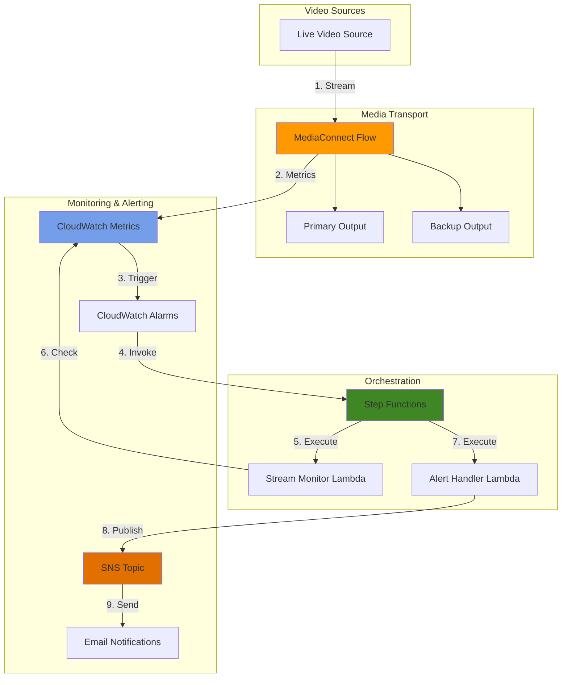

# Orchestrating Media Workflows with MediaConnect and Step Functions

## Problem

Media companies and broadcasters struggle with managing complex live video streaming workflows that require coordination between multiple processing steps, real-time monitoring of stream health, and immediate alerting when quality issues arise. Traditional approaches using manual intervention or basic scripting lack the reliability and scalability needed for mission-critical broadcasts, leading to increased operational overhead and potential service disruptions during live events.

## Solution

This recipe implements an automated media workflow using AWS Elemental MediaConnect for reliable video transport, AWS Step Functions for orchestration, CloudWatch for real-time monitoring, and SNS for instant notifications. The solution automatically ingests live streams, monitors quality metrics, triggers remediation workflows when issues are detected, and alerts operations teams, providing a robust foundation for 24/7 broadcast operations.

## Architecture Diagram



## Prerequisites

1. AWS account with appropriate permissions for MediaConnect, Step Functions, Lambda, CloudWatch, and SNS
2. AWS CLI v2 installed and configured (or AWS CloudShell)
3. Basic understanding of video streaming concepts and protocols
4. A live video source capable of streaming via supported protocols (RTP, Zixi, SRT)
5. Estimated cost: $50-100/month for a single stream with monitoring (varies by bandwidth usage)

> **Note**: MediaConnect pricing is based on data transfer and flow hours. Monitor your usage to control costs.

## Preparation

```bash
# Set environment variables
export AWS_REGION=$(aws configure get region)
export AWS_ACCOUNT_ID=$(aws sts get-caller-identity \
    --query Account --output text)

# Generate unique identifiers for resources
RANDOM_SUFFIX=$(aws secretsmanager get-random-password \
    --exclude-punctuation --exclude-uppercase \
    --password-length 6 --require-each-included-type \
    --output text --query RandomPassword)

export FLOW_NAME="live-stream-${RANDOM_SUFFIX}"
export STATE_MACHINE_NAME="media-workflow-${RANDOM_SUFFIX}"
export SNS_TOPIC_NAME="media-alerts-${RANDOM_SUFFIX}"
export LAMBDA_ROLE_NAME="media-lambda-role-${RANDOM_SUFFIX}"
export SF_ROLE_NAME="media-sf-role-${RANDOM_SUFFIX}"

# Create S3 bucket for Lambda deployment packages
export LAMBDA_BUCKET="lambda-code-${RANDOM_SUFFIX}"
aws s3 mb s3://${LAMBDA_BUCKET} --region ${AWS_REGION}

echo "✅ Environment variables set and S3 bucket created"
```

## Steps

1. **Create SNS Topic for Media Alerts**:

   Amazon SNS provides a fully managed pub/sub messaging service that enables real-time notifications to operations teams when stream quality issues are detected. Creating a dedicated topic for media alerts establishes a central communication channel that can fan out notifications to multiple endpoints including email, SMS, or webhook integrations with incident management systems. SNS follows the [AWS Well-Architected Framework](https://docs.aws.amazon.com/wellarchitected/latest/framework/welcome.html) principles for reliable message delivery with built-in retry logic and dead letter queues.

   ```bash
   # Create SNS topic for media workflow alerts
   SNS_TOPIC_ARN=$(aws sns create-topic \
       --name ${SNS_TOPIC_NAME} \
       --tags Key=Environment,Value=Production \
              Key=Purpose,Value=MediaAlerts \
       --query TopicArn --output text)
   
   # Subscribe email for notifications (replace with your email)
   aws sns subscribe \
       --topic-arn ${SNS_TOPIC_ARN} \
       --protocol email \
       --notification-endpoint your-email@example.com
   
   echo "✅ SNS topic created: ${SNS_TOPIC_ARN}"
   echo "⚠️  Check your email to confirm the subscription"
   ```

   The SNS topic is now ready to receive alert messages from your media workflow. Email subscription requires confirmation through a link sent to the specified address, ensuring that only authorized recipients receive critical stream health notifications. For production deployments, consider implementing [SNS message filtering](https://docs.aws.amazon.com/sns/latest/dg/sns-message-filtering.html) to route different severity levels to appropriate channels.

2. **Create IAM Roles for Lambda and Step Functions**:

   IAM roles provide secure, temporary credential delegation that allows Lambda functions and Step Functions to interact with AWS services without hardcoding credentials. These roles follow the principle of least privilege as outlined in the [AWS Security Best Practices](https://docs.aws.amazon.com/IAM/latest/UserGuide/best-practices.html), granting only the specific permissions needed for media workflow operations including MediaConnect management, CloudWatch metrics access, and SNS publishing capabilities.

   ```bash
   # Create Lambda execution role
   aws iam create-role \
       --role-name ${LAMBDA_ROLE_NAME} \
       --assume-role-policy-document '{
         "Version": "2012-10-17",
         "Statement": [{
           "Effect": "Allow",
           "Principal": {"Service": "lambda.amazonaws.com"},
           "Action": "sts:AssumeRole"
         }]
       }'
   
   # Attach policies for Lambda
   aws iam attach-role-policy \
       --role-name ${LAMBDA_ROLE_NAME} \
       --policy-arn arn:aws:iam::aws:policy/service-role/AWSLambdaBasicExecutionRole
   
   # Create custom policy for MediaConnect and CloudWatch access
   aws iam put-role-policy \
       --role-name ${LAMBDA_ROLE_NAME} \
       --policy-name MediaConnectAccess \
       --policy-document '{
         "Version": "2012-10-17",
         "Statement": [
           {
             "Effect": "Allow",
             "Action": [
               "mediaconnect:DescribeFlow",
               "mediaconnect:ListFlows",
               "cloudwatch:GetMetricStatistics",
               "cloudwatch:GetMetricData",
               "sns:Publish"
             ],
             "Resource": "*"
           }
         ]
       }'
   
   # Wait for role propagation
   sleep 10
   
   LAMBDA_ROLE_ARN=$(aws iam get-role \
       --role-name ${LAMBDA_ROLE_NAME} \
       --query Role.Arn --output text)
   
   echo "✅ Lambda IAM role created: ${LAMBDA_ROLE_ARN}"
   ```

   Now create the Step Functions execution role following the [Step Functions IAM documentation](https://docs.aws.amazon.com/step-functions/latest/dg/procedure-create-iam-role.html):

   ```bash
   # Create Step Functions execution role
   aws iam create-role \
       --role-name ${SF_ROLE_NAME} \
       --assume-role-policy-document '{
         "Version": "2012-10-17",
         "Statement": [{
           "Effect": "Allow",
           "Principal": {"Service": "states.amazonaws.com"},
           "Action": "sts:AssumeRole"
         }]
       }'
   
   # Create policy for Step Functions to invoke Lambda
   aws iam put-role-policy \
       --role-name ${SF_ROLE_NAME} \
       --policy-name StepFunctionsExecutionPolicy \
       --policy-document '{
         "Version": "2012-10-17",
         "Statement": [
           {
             "Effect": "Allow",
             "Action": [
               "lambda:InvokeFunction",
               "logs:CreateLogGroup",
               "logs:CreateLogStream",
               "logs:PutLogEvents"
             ],
             "Resource": "*"
           }
         ]
       }'
   
   # Wait for role propagation
   sleep 10
   
   SF_ROLE_ARN=$(aws iam get-role \
       --role-name ${SF_ROLE_NAME} \
       --query Role.Arn --output text)
   
   echo "✅ Step Functions IAM role created: ${SF_ROLE_ARN}"
   ```

   Both IAM roles are now configured with appropriate permissions, enabling secure execution of Lambda functions for stream monitoring and Step Functions for workflow orchestration without exposing long-term credentials. This approach aligns with the [AWS Security Hub compliance standards](https://docs.aws.amazon.com/securityhub/latest/userguide/what-is-securityhub.html) for access management.

3. **Create Lambda Functions for Stream Monitoring**:

   Lambda functions provide serverless compute for monitoring MediaConnect flow health metrics and generating alerts. The stream monitor function queries CloudWatch metrics to evaluate stream quality indicators like packet loss and jitter, while the alert handler formats and sends notifications through SNS. This serverless approach eliminates infrastructure management while ensuring automatic scaling and high availability as described in the [Lambda operational excellence guide](https://docs.aws.amazon.com/lambda/latest/operatorguide/intro.html).

   ```bash
   # Create stream monitor Lambda function
   cat > stream-monitor.py << 'EOF'
import json
import boto3
import os
from datetime import datetime, timedelta

cloudwatch = boto3.client('cloudwatch')
mediaconnect = boto3.client('mediaconnect')

def lambda_handler(event, context):
    flow_arn = event.get('flow_arn')
    if not flow_arn:
        return {
            'statusCode': 400,
            'error': 'Missing flow_arn parameter'
        }
    
    try:
        # Get flow details
        flow = mediaconnect.describe_flow(FlowArn=flow_arn)
        flow_name = flow['Flow']['Name']
        
        # Query CloudWatch metrics for the last 5 minutes
        end_time = datetime.utcnow()
        start_time = end_time - timedelta(minutes=5)
        
        # Check source packet loss
        response = cloudwatch.get_metric_statistics(
            Namespace='AWS/MediaConnect',
            MetricName='SourcePacketLossPercent',
            Dimensions=[
                {'Name': 'FlowARN', 'Value': flow_arn}
            ],
            StartTime=start_time,
            EndTime=end_time,
            Period=300,
            Statistics=['Average', 'Maximum']
        )
        
        # Analyze metrics
        issues = []
        if response['Datapoints']:
            latest = sorted(response['Datapoints'], 
                           key=lambda x: x['Timestamp'])[-1]
            if latest['Maximum'] > 0.1:  # 0.1% packet loss threshold
                issues.append({
                    'metric': 'PacketLoss',
                    'value': latest['Maximum'],
                    'threshold': 0.1,
                    'severity': 'HIGH'
                })
        
        # Check source jitter
        jitter_response = cloudwatch.get_metric_statistics(
            Namespace='AWS/MediaConnect',
            MetricName='SourceJitter',
            Dimensions=[
                {'Name': 'FlowARN', 'Value': flow_arn}
            ],
            StartTime=start_time,
            EndTime=end_time,
            Period=300,
            Statistics=['Average', 'Maximum']
        )
        
        if jitter_response['Datapoints']:
            latest_jitter = sorted(jitter_response['Datapoints'], 
                                 key=lambda x: x['Timestamp'])[-1]
            if latest_jitter['Maximum'] > 50:  # 50ms jitter threshold
                issues.append({
                    'metric': 'Jitter',
                    'value': latest_jitter['Maximum'],
                    'threshold': 50,
                    'severity': 'MEDIUM'
                })
        
        return {
            'statusCode': 200,
            'flow_name': flow_name,
            'flow_arn': flow_arn,
            'timestamp': end_time.isoformat(),
            'issues': issues,
            'healthy': len(issues) == 0
        }
    except Exception as e:
        print(f"Error monitoring stream: {str(e)}")
        return {
            'statusCode': 500,
            'error': str(e)
        }
EOF
   
   # Create alert handler Lambda function
   cat > alert-handler.py << 'EOF'
import json
import boto3
import os

sns = boto3.client('sns')

def lambda_handler(event, context):
    # Extract monitoring results
    monitoring_result = event
    sns_topic_arn = event.get('sns_topic_arn', os.environ.get('SNS_TOPIC_ARN'))
    
    if not sns_topic_arn:
        return {
            'statusCode': 400,
            'error': 'Missing SNS topic ARN'
        }
    
    try:
        if not monitoring_result.get('healthy', True):
            # Construct alert message
            subject = f"MediaConnect Alert: {monitoring_result['flow_name']}"
            
            message_lines = [
                f"Flow: {monitoring_result['flow_name']}",
                f"Time: {monitoring_result['timestamp']}",
                f"Status: UNHEALTHY",
                "",
                "Issues Detected:"
            ]
            
            for issue in monitoring_result.get('issues', []):
                message_lines.append(
                    f"- {issue['metric']}: {issue['value']:.2f} "
                    f"(threshold: {issue['threshold']}) "
                    f"[{issue['severity']}]"
                )
            
            # Extract region from context
            region = context.invoked_function_arn.split(':')[3]
            flow_id = monitoring_result['flow_arn'].split('/')[-1]
            
            message_lines.extend([
                "",
                "Recommended Actions:",
                "1. Check source encoder stability",
                "2. Verify network connectivity",
                "3. Review CloudWatch dashboard for detailed metrics",
                f"4. Access flow in console: https://console.aws.amazon.com/mediaconnect/home?region={region}#/flows/{flow_id}"
            ])
            
            message = "\n".join(message_lines)
            
            # Send SNS notification
            response = sns.publish(
                TopicArn=sns_topic_arn,
                Subject=subject,
                Message=message
            )
            
            return {
                'statusCode': 200,
                'notification_sent': True,
                'message_id': response['MessageId']
            }
        
        return {
            'statusCode': 200,
            'notification_sent': False,
            'reason': 'Flow is healthy'
        }
    except Exception as e:
        print(f"Error sending alert: {str(e)}")
        return {
            'statusCode': 500,
            'error': str(e)
        }
EOF
   
   # Package and deploy Lambda functions
   zip stream-monitor.zip stream-monitor.py
   zip alert-handler.zip alert-handler.py
   
   # Upload to S3
   aws s3 cp stream-monitor.zip s3://${LAMBDA_BUCKET}/
   aws s3 cp alert-handler.zip s3://${LAMBDA_BUCKET}/
   
   # Create Lambda functions with updated runtime
   MONITOR_LAMBDA_ARN=$(aws lambda create-function \
       --function-name stream-monitor-${RANDOM_SUFFIX} \
       --runtime python3.12 \
       --role ${LAMBDA_ROLE_ARN} \
       --handler stream-monitor.lambda_handler \
       --code S3Bucket=${LAMBDA_BUCKET},S3Key=stream-monitor.zip \
       --timeout 60 \
       --memory-size 256 \
       --environment Variables={SNS_TOPIC_ARN=${SNS_TOPIC_ARN}} \
       --query FunctionArn --output text)
   
   ALERT_LAMBDA_ARN=$(aws lambda create-function \
       --function-name alert-handler-${RANDOM_SUFFIX} \
       --runtime python3.12 \
       --role ${LAMBDA_ROLE_ARN} \
       --handler alert-handler.lambda_handler \
       --code S3Bucket=${LAMBDA_BUCKET},S3Key=alert-handler.zip \
       --timeout 30 \
       --memory-size 128 \
       --environment Variables={SNS_TOPIC_ARN=${SNS_TOPIC_ARN}} \
       --query FunctionArn --output text)
   
   echo "✅ Lambda functions created and deployed"
   ```

   The Lambda functions are now deployed and ready to monitor MediaConnect flows. The stream monitor function evaluates key quality metrics against configurable thresholds based on [MediaConnect monitoring best practices](https://docs.aws.amazon.com/mediaconnect/latest/ug/monitor-with-cloudwatch.html), while the alert handler generates detailed notifications with actionable recommendations for operations teams.

4. **Create Step Functions State Machine**:

   AWS Step Functions provides visual workflow orchestration that coordinates the execution of Lambda functions in a reliable, scalable manner. This state machine implements a monitoring workflow that checks stream health, evaluates results, and conditionally triggers alerts. The EXPRESS workflow type ensures low-latency execution suitable for real-time monitoring as documented in the [Step Functions performance guide](https://docs.aws.amazon.com/step-functions/latest/dg/concepts-standard-vs-express.html).

   ```bash
   # Create Step Functions state machine definition
   cat > state-machine.json << EOF
{
  "Comment": "Media workflow for monitoring MediaConnect flows",
  "StartAt": "MonitorStream",
  "States": {
    "MonitorStream": {
      "Type": "Task",
      "Resource": "${MONITOR_LAMBDA_ARN}",
      "Parameters": {
        "flow_arn.$": "$.flow_arn",
        "sns_topic_arn": "${SNS_TOPIC_ARN}"
      },
      "ResultPath": "$.monitoring_result",
      "Next": "EvaluateHealth",
      "Retry": [
        {
          "ErrorEquals": ["States.TaskFailed"],
          "IntervalSeconds": 2,
          "MaxAttempts": 3,
          "BackoffRate": 2.0
        }
      ]
    },
    "EvaluateHealth": {
      "Type": "Choice",
      "Choices": [
        {
          "Variable": "$.monitoring_result.healthy",
          "BooleanEquals": false,
          "Next": "SendAlert"
        }
      ],
      "Default": "HealthyFlow"
    },
    "SendAlert": {
      "Type": "Task",
      "Resource": "${ALERT_LAMBDA_ARN}",
      "Parameters": {
        "flow_name.$": "$.monitoring_result.flow_name",
        "flow_arn.$": "$.monitoring_result.flow_arn",
        "timestamp.$": "$.monitoring_result.timestamp",
        "issues.$": "$.monitoring_result.issues",
        "healthy.$": "$.monitoring_result.healthy",
        "sns_topic_arn": "${SNS_TOPIC_ARN}"
      },
      "End": true,
      "Retry": [
        {
          "ErrorEquals": ["States.TaskFailed"],
          "IntervalSeconds": 2,
          "MaxAttempts": 2,
          "BackoffRate": 2.0
        }
      ]
    },
    "HealthyFlow": {
      "Type": "Pass",
      "Result": "Flow is healthy - no action required",
      "End": true
    }
  }
}
EOF
   
   # Create the state machine
   STATE_MACHINE_ARN=$(aws stepfunctions create-state-machine \
       --name ${STATE_MACHINE_NAME} \
       --definition file://state-machine.json \
       --role-arn ${SF_ROLE_ARN} \
       --type EXPRESS \
       --logging-configuration '{
         "level": "ERROR",
         "includeExecutionData": false,
         "destinations": [{
           "cloudWatchLogsLogGroup": {
             "logGroupArn": "arn:aws:logs:'${AWS_REGION}':'${AWS_ACCOUNT_ID}':log-group:/aws/stepfunctions/'${STATE_MACHINE_NAME}'"
           }
         }]
       }' \
       --tags Key=Environment,Value=Production \
              Key=Purpose,Value=MediaMonitoring \
       --query stateMachineArn --output text)
   
   echo "✅ Step Functions state machine created: ${STATE_MACHINE_ARN}"
   ```

   The state machine implements a decision-based workflow that monitors stream health and conditionally sends alerts. Using EXPRESS type ensures low-latency execution suitable for real-time monitoring, while the visual workflow definition makes it easy to understand and modify the monitoring logic. The enhanced configuration includes retry logic for improved reliability. For complex workflows, review the [Step Functions best practices](https://docs.aws.amazon.com/step-functions/latest/dg/bp-express.html) documentation.

5. **Create MediaConnect Flow**:

   AWS Elemental MediaConnect provides reliable, secure transport for live video over IP networks, replacing traditional satellite or fiber connections. Creating a flow establishes the ingestion point for your live stream with enterprise-grade features including error correction, encryption, and redundancy. MediaConnect implements the RIST and Zixi protocols for packet recovery, ensuring broadcast-quality delivery even over unpredictable internet connections as detailed in the [MediaConnect reliability guide](https://docs.aws.amazon.com/mediaconnect/latest/ug/what-is-reliability.html).

   ```bash
   # Create MediaConnect flow
   # Note: Replace the WhitelistCidr with your actual source IP
   FLOW_ARN=$(aws mediaconnect create-flow \
       --name ${FLOW_NAME} \
       --availability-zone ${AWS_REGION}a \
       --source Name=PrimarySource,Description="Primary live stream source",Protocol=rtp,WhitelistCidr="0.0.0.0/0",IngestPort=5000 \
       --outputs Name=PrimaryOutput,Description="Primary stream output",Protocol=rtp,Destination="10.0.0.100",Port=5001 Name=BackupOutput,Description="Backup stream output",Protocol=rtp,Destination="10.0.0.101",Port=5002 \
       --query Flow.FlowArn --output text)
   
   # Get the ingest endpoint
   INGEST_IP=$(aws mediaconnect describe-flow \
       --flow-arn ${FLOW_ARN} \
       --query Flow.Source.IngestIp --output text)
   
   echo "✅ MediaConnect flow created: ${FLOW_ARN}"
   echo "📡 Stream to: ${INGEST_IP}:5000 (RTP)"
   
   # Start the flow
   aws mediaconnect start-flow --flow-arn ${FLOW_ARN}
   
   echo "✅ MediaConnect flow started and ready to receive streams"
   ```

   The MediaConnect flow is now active and ready to receive your live video stream. The dual outputs provide redundancy for downstream systems, while the flow automatically handles packet recovery and stream health monitoring. For production deployments, consider implementing [source failover](https://docs.aws.amazon.com/mediaconnect/latest/ug/source-failover.html) and [encryption](https://docs.aws.amazon.com/mediaconnect/latest/ug/encryption-static-key.html) for enhanced reliability and security.

6. **Configure CloudWatch Alarms for Stream Health**:

   CloudWatch Alarms provide automated monitoring that triggers actions when metrics breach defined thresholds. Configuring alarms for MediaConnect metrics enables proactive detection of stream quality issues before they impact viewers. The alarm configuration follows [CloudWatch alarm best practices](https://docs.aws.amazon.com/AmazonCloudWatch/latest/monitoring/Best_Practice_Recommended_Alarms_AWS_Services.html) with appropriate evaluation periods and datapoints to reduce false positives.

   ```bash
   # Create CloudWatch alarm for packet loss
   aws cloudwatch put-metric-alarm \
       --alarm-name "${FLOW_NAME}-packet-loss" \
       --alarm-description "Triggers when packet loss exceeds threshold" \
       --metric-name SourcePacketLossPercent \
       --namespace AWS/MediaConnect \
       --statistic Maximum \
       --period 300 \
       --threshold 0.1 \
       --comparison-operator GreaterThanThreshold \
       --datapoints-to-alarm 1 \
       --evaluation-periods 1 \
       --dimensions Name=FlowARN,Value=${FLOW_ARN} \
       --alarm-actions ${SNS_TOPIC_ARN} \
       --treat-missing-data notBreaching
   
   # Create CloudWatch alarm for high jitter
   aws cloudwatch put-metric-alarm \
       --alarm-name "${FLOW_NAME}-jitter" \
       --alarm-description "Triggers when jitter exceeds threshold" \
       --metric-name SourceJitter \
       --namespace AWS/MediaConnect \
       --statistic Maximum \
       --period 300 \
       --threshold 50 \
       --comparison-operator GreaterThanThreshold \
       --datapoints-to-alarm 2 \
       --evaluation-periods 2 \
       --dimensions Name=FlowARN,Value=${FLOW_ARN} \
       --alarm-actions ${SNS_TOPIC_ARN} \
       --treat-missing-data notBreaching
   
   # Create CloudWatch alarm to trigger Step Functions
   aws cloudwatch put-metric-alarm \
       --alarm-name "${FLOW_NAME}-workflow-trigger" \
       --alarm-description "Triggers media monitoring workflow" \
       --metric-name SourcePacketLossPercent \
       --namespace AWS/MediaConnect \
       --statistic Average \
       --period 60 \
       --threshold 0.05 \
       --comparison-operator GreaterThanThreshold \
       --datapoints-to-alarm 1 \
       --evaluation-periods 1 \
       --dimensions Name=FlowARN,Value=${FLOW_ARN} \
       --treat-missing-data notBreaching
   
   echo "✅ CloudWatch alarms configured for stream monitoring"
   ```

   Multiple alarms now monitor different aspects of stream health with varying sensitivity levels. The packet loss alarm triggers immediately for severe issues, while the jitter alarm requires sustained degradation before alerting. This multi-layered approach reduces false positives while ensuring critical issues are caught quickly, following the [MediaConnect metric monitoring guide](https://docs.aws.amazon.com/mediaconnect/latest/ug/monitor-with-cloudwatch-metrics-list.html).

7. **Create EventBridge Rule for Automated Workflow Execution**:

   Amazon EventBridge provides event-driven integration between CloudWatch Alarms and Step Functions, enabling automatic workflow execution without polling or manual intervention. This rule creates a serverless event pipeline that responds to alarm state changes within milliseconds. The event-driven architecture follows [EventBridge best practices](https://docs.aws.amazon.com/eventbridge/latest/userguide/eb-event-patterns.html) for reliable event processing.

   ```bash
   # Create EventBridge rule to trigger Step Functions on alarm
   aws events put-rule \
       --name "${FLOW_NAME}-alarm-rule" \
       --description "Triggers workflow on MediaConnect alarm" \
       --event-pattern "{
         \"source\": [\"aws.cloudwatch\"],
         \"detail-type\": [\"CloudWatch Alarm State Change\"],
         \"detail\": {
           \"alarmName\": [\"${FLOW_NAME}-workflow-trigger\"],
           \"state\": {
             \"value\": [\"ALARM\"]
           }
         }
       }" \
       --state ENABLED
   
   # Create IAM role for EventBridge
   aws iam create-role \
       --role-name eventbridge-sf-role-${RANDOM_SUFFIX} \
       --assume-role-policy-document '{
         "Version": "2012-10-17",
         "Statement": [{
           "Effect": "Allow",
           "Principal": {"Service": "events.amazonaws.com"},
           "Action": "sts:AssumeRole"
         }]
       }'
   
   aws iam put-role-policy \
       --role-name eventbridge-sf-role-${RANDOM_SUFFIX} \
       --policy-name InvokeStepFunctions \
       --policy-document '{
         "Version": "2012-10-17",
         "Statement": [{
           "Effect": "Allow",
           "Action": "states:StartExecution",
           "Resource": "'${STATE_MACHINE_ARN}'"
         }]
       }'
   
   # Wait for role propagation
   sleep 10
   
   EB_ROLE_ARN=$(aws iam get-role \
       --role-name eventbridge-sf-role-${RANDOM_SUFFIX} \
       --query Role.Arn --output text)
   
   # Add Step Functions as target
   aws events put-targets \
       --rule ${FLOW_NAME}-alarm-rule \
       --targets '[{
         "Id": "1",
         "Arn": "'${STATE_MACHINE_ARN}'",
         "RoleArn": "'${EB_ROLE_ARN}'",
         "Input": "{\"flow_arn\": \"'${FLOW_ARN}'\"}"
       }]'
   
   echo "✅ EventBridge rule configured for automated workflow execution"
   ```

   The event-driven architecture is now complete, creating an automated pipeline from metric detection through workflow execution to alert delivery. This serverless integration ensures consistent, rapid response to streaming issues without manual intervention or custom polling logic. For complex event routing scenarios, consult the [EventBridge event patterns guide](https://docs.aws.amazon.com/eventbridge/latest/userguide/eb-event-patterns.html).

8. **Create CloudWatch Dashboard for Visualization**:

   CloudWatch Dashboards provide real-time visualization of streaming metrics, enabling operations teams to monitor multiple flows and quickly identify trends or anomalies. Creating a custom dashboard consolidates key performance indicators into a single view, supporting both proactive monitoring and rapid troubleshooting during incidents. The dashboard configuration follows [CloudWatch dashboard best practices](https://docs.aws.amazon.com/AmazonCloudWatch/latest/monitoring/CloudWatch_Dashboards.html) for effective visualization.

   ```bash
   # Create CloudWatch dashboard for media monitoring
   cat > dashboard-body.json << EOF
{
  "widgets": [
    {
      "type": "metric",
      "x": 0,
      "y": 0,
      "width": 12,
      "height": 6,
      "properties": {
        "metrics": [
          [ "AWS/MediaConnect", "SourcePacketLossPercent", "FlowARN", "${FLOW_ARN}", { "stat": "Maximum" } ],
          [ ".", "SourceJitter", ".", ".", { "stat": "Average", "yAxis": "right" } ]
        ],
        "view": "timeSeries",
        "stacked": false,
        "region": "${AWS_REGION}",
        "title": "Stream Health Metrics",
        "period": 300,
        "yAxis": {
          "left": {
            "min": 0,
            "max": 1
          },
          "right": {
            "min": 0
          }
        }
      }
    },
    {
      "type": "metric",
      "x": 12,
      "y": 0,
      "width": 12,
      "height": 6,
      "properties": {
        "metrics": [
          [ "AWS/MediaConnect", "SourceBitrate", "FlowARN", "${FLOW_ARN}", { "stat": "Average" } ],
          [ ".", "SourceUptime", ".", ".", { "stat": "Maximum", "yAxis": "right" } ]
        ],
        "view": "timeSeries",
        "stacked": false,
        "region": "${AWS_REGION}",
        "title": "Stream Performance",
        "period": 300,
        "yAxis": {
          "left": {
            "min": 0
          },
          "right": {
            "min": 0,
            "max": 100
          }
        }
      }
    }
  ]
}
EOF
   
   aws cloudwatch put-dashboard \
       --dashboard-name ${FLOW_NAME}-monitoring \
       --dashboard-body file://dashboard-body.json
   
   echo "✅ CloudWatch dashboard created for stream monitoring"
   echo "📊 View at: https://console.aws.amazon.com/cloudwatch/home?region=${AWS_REGION}#dashboards:name=${FLOW_NAME}-monitoring"
   ```

   The dashboard now provides at-a-glance visibility into stream health with customizable time ranges and automatic refresh. Operations teams can monitor packet loss, jitter, bitrate, and uptime trends, enabling data-driven decisions about stream quality and infrastructure optimization. For advanced visualizations, explore [CloudWatch Insights](https://docs.aws.amazon.com/AmazonCloudWatch/latest/logs/AnalyzingLogData.html) for log analysis.

> **Warning**: Ensure proper network connectivity and firewall rules are configured for your MediaConnect source IP whitelist before streaming. Production deployments should use specific IP ranges rather than 0.0.0.0/0 for security.

## Validation & Testing

1. Verify MediaConnect flow is active:

   ```bash
   # Check flow status
   aws mediaconnect describe-flow \
       --flow-arn ${FLOW_ARN} \
       --query 'Flow.{Name:Name,Status:Status,IngestIP:Source.IngestIp,IngestPort:Source.IngestPort}'
   ```

   Expected output: Flow should show Status as "ACTIVE" with IngestIP and port details

2. Test Step Functions execution manually:

   ```bash
   # Execute state machine with test input
   EXECUTION_ARN=$(aws stepfunctions start-execution \
       --state-machine-arn ${STATE_MACHINE_ARN} \
       --input "{\"flow_arn\": \"${FLOW_ARN}\"}" \
       --query executionArn --output text)
   
   # Wait for execution to complete
   sleep 10
   
   # Check execution result
   aws stepfunctions describe-execution \
       --execution-arn ${EXECUTION_ARN} \
       --query '{Status:status,Output:output}'
   ```

3. Verify CloudWatch metrics are being collected:

   ```bash
   # Query recent metrics
   aws cloudwatch get-metric-statistics \
       --namespace AWS/MediaConnect \
       --metric-name SourceUptime \
       --dimensions Name=FlowARN,Value=${FLOW_ARN} \
       --start-time $(date -u -d '10 minutes ago' +%Y-%m-%dT%H:%M:%S) \
       --end-time $(date -u +%Y-%m-%dT%H:%M:%S) \
       --period 300 \
       --statistics Maximum
   ```

4. Test the complete alert workflow:

   ```bash
   # Manually invoke the Lambda function for testing
   aws lambda invoke \
       --function-name stream-monitor-${RANDOM_SUFFIX} \
       --payload "{\"flow_arn\": \"${FLOW_ARN}\"}" \
       response.json
   
   # Check the response
   cat response.json && echo
   rm response.json
   ```

## Cleanup

1. Stop and delete MediaConnect flow:

   ```bash
   # Stop the flow first
   aws mediaconnect stop-flow --flow-arn ${FLOW_ARN}
   
   # Wait for flow to stop
   aws mediaconnect wait flow-deleted --flow-arn ${FLOW_ARN} || sleep 15
   
   # Delete the flow
   aws mediaconnect delete-flow --flow-arn ${FLOW_ARN}
   
   echo "✅ Deleted MediaConnect flow"
   ```

2. Delete CloudWatch resources:

   ```bash
   # Delete alarms
   aws cloudwatch delete-alarms \
       --alarm-names "${FLOW_NAME}-packet-loss" \
                     "${FLOW_NAME}-jitter" \
                     "${FLOW_NAME}-workflow-trigger"
   
   # Delete dashboard
   aws cloudwatch delete-dashboards \
       --dashboard-names ${FLOW_NAME}-monitoring
   
   echo "✅ Deleted CloudWatch alarms and dashboard"
   ```

3. Remove EventBridge rule:

   ```bash
   # Remove targets first
   aws events remove-targets \
       --rule ${FLOW_NAME}-alarm-rule \
       --ids 1
   
   # Delete the rule
   aws events delete-rule \
       --name ${FLOW_NAME}-alarm-rule
   
   echo "✅ Deleted EventBridge rule"
   ```

4. Delete Step Functions state machine:

   ```bash
   # Delete state machine
   aws stepfunctions delete-state-machine \
       --state-machine-arn ${STATE_MACHINE_ARN}
   
   echo "✅ Deleted Step Functions state machine"
   ```

5. Remove Lambda functions:

   ```bash
   # Delete Lambda functions
   aws lambda delete-function \
       --function-name stream-monitor-${RANDOM_SUFFIX}
   
   aws lambda delete-function \
       --function-name alert-handler-${RANDOM_SUFFIX}
   
   echo "✅ Deleted Lambda functions"
   ```

6. Clean up IAM roles and SNS:

   ```bash
   # Detach and delete Lambda role policies
   aws iam delete-role-policy \
       --role-name ${LAMBDA_ROLE_NAME} \
       --policy-name MediaConnectAccess
   
   aws iam detach-role-policy \
       --role-name ${LAMBDA_ROLE_NAME} \
       --policy-arn arn:aws:iam::aws:policy/service-role/AWSLambdaBasicExecutionRole
   
   aws iam delete-role --role-name ${LAMBDA_ROLE_NAME}
   
   # Delete Step Functions role
   aws iam delete-role-policy \
       --role-name ${SF_ROLE_NAME} \
       --policy-name StepFunctionsExecutionPolicy
   
   aws iam delete-role --role-name ${SF_ROLE_NAME}
   
   # Delete EventBridge role
   aws iam delete-role-policy \
       --role-name eventbridge-sf-role-${RANDOM_SUFFIX} \
       --policy-name InvokeStepFunctions
   
   aws iam delete-role --role-name eventbridge-sf-role-${RANDOM_SUFFIX}
   
   # Delete SNS topic
   aws sns delete-topic --topic-arn ${SNS_TOPIC_ARN}
   
   # Delete S3 bucket
   aws s3 rm s3://${LAMBDA_BUCKET} --recursive
   aws s3 rb s3://${LAMBDA_BUCKET}
   
   # Clean up local files
   rm -f stream-monitor.py alert-handler.py state-machine.json dashboard-body.json
   rm -f stream-monitor.zip alert-handler.zip
   
   echo "✅ Deleted IAM roles, SNS topic, S3 bucket, and local files"
   ```

## Discussion

This recipe demonstrates how to build a production-ready media monitoring solution using AWS managed services for real-time video workflows. The combination of MediaConnect for reliable transport, Step Functions for orchestration, and CloudWatch for monitoring creates a robust architecture that scales automatically and requires minimal operational overhead. For comprehensive guidance on MediaConnect capabilities, see the [AWS Elemental MediaConnect User Guide](https://docs.aws.amazon.com/mediaconnect/latest/ug/what-is.html).

The serverless approach using Lambda and Step Functions eliminates the need for always-on monitoring infrastructure while providing sub-second response times to quality issues. This architecture follows the [AWS Well-Architected Framework](https://docs.aws.amazon.com/wellarchitected/latest/framework/welcome.html) principles by implementing automated monitoring, self-healing capabilities, and comprehensive alerting. The use of CloudWatch metrics and alarms provides deep visibility into stream health with configurable thresholds that can be adjusted based on your specific quality requirements as documented in the [CloudWatch monitoring best practices](https://docs.aws.amazon.com/AmazonCloudWatch/latest/monitoring/Best_Practice_Recommended_Alarms_AWS_Services.html).

From a cost perspective, this solution optimizes spending by using usage-based pricing models across all services. MediaConnect charges only for active flow hours and data transfer, while Lambda and Step Functions bill per execution, making this approach cost-effective for both 24/7 broadcasts and event-based streaming. For detailed pricing considerations, review the [MediaConnect pricing documentation](https://aws.amazon.com/mediaconnect/pricing/) and [Step Functions pricing guide](https://aws.amazon.com/step-functions/pricing/). Consider implementing [AWS Budgets](https://docs.aws.amazon.com/cost-management/latest/userguide/budgets-managing-costs.html) to monitor and control media workflow costs.

Security is built into every layer of this architecture through IAM roles with least-privilege permissions, encrypted transport options in MediaConnect, and secure API calls between services. For production deployments, consider implementing additional security measures such as VPC endpoints for private connectivity and AWS Secrets Manager for storing sensitive configuration. The [MediaConnect security documentation](https://docs.aws.amazon.com/mediaconnect/latest/ug/security.html) provides comprehensive guidance on hardening your media workflows. Additionally, enable [AWS CloudTrail](https://docs.aws.amazon.com/awscloudtrail/latest/userguide/cloudtrail-user-guide.html) for auditing all API calls made by your media workflow components.

> **Tip**: Use MediaConnect's built-in source failover capability to automatically switch between primary and backup sources, ensuring uninterrupted streaming even during encoder failures. Configure multiple sources with different priorities as described in the [MediaConnect failover guide](https://docs.aws.amazon.com/mediaconnect/latest/ug/source-failover.html).

## Challenge

Extend this solution by implementing these enhancements:

1. Add automatic source failover by configuring multiple sources in MediaConnect and implementing health checks that trigger failover when the primary source degrades
2. Integrate with AWS Elemental MediaLive to enable real-time transcoding and multi-bitrate adaptive streaming for broader device compatibility
3. Implement machine learning-based anomaly detection using Amazon SageMaker to predict quality issues before they impact viewers
4. Create a multi-region deployment with MediaConnect flows in different regions and automated traffic routing based on source location
5. Build a web dashboard using AWS Amplify that displays real-time metrics and allows operators to manually trigger remediation workflows

## Infrastructure Code

*Infrastructure code will be generated after recipe approval.*