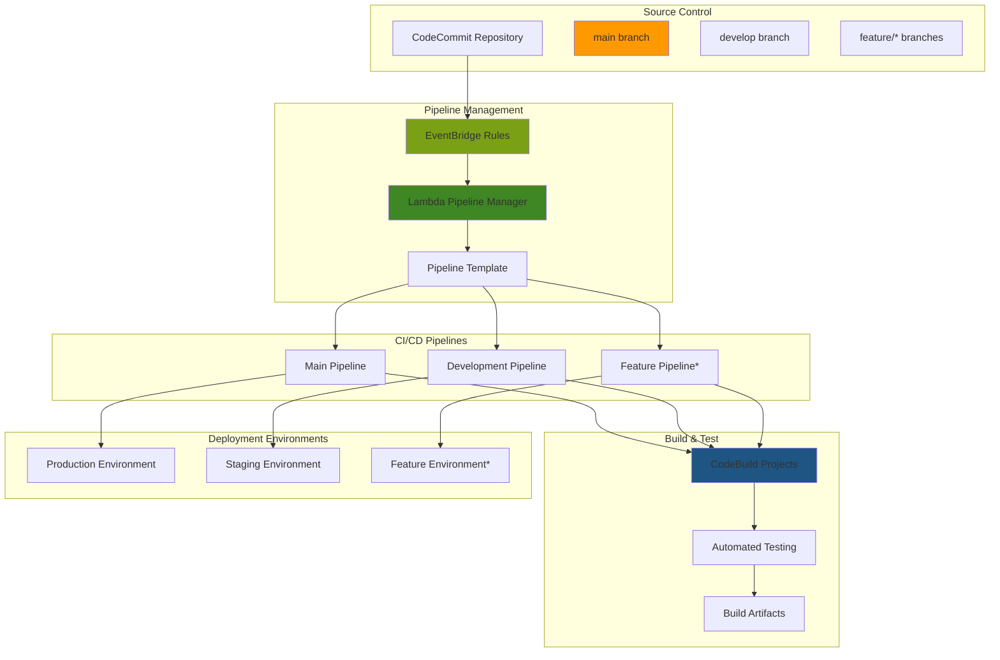

# Orchestrating Multi-Branch CI/CD Automation with CodePipeline

## Problem

Modern software development teams often work with multiple branches simultaneously - feature branches, development branches, staging branches, and production branches. Traditional CI/CD pipelines only trigger on a single branch, creating deployment bottlenecks and preventing parallel development workflows. Development teams need separate testing and deployment environments for each branch while maintaining consistent deployment processes across all environments. Without automated multi-branch CI/CD, teams resort to manual deployments, inconsistent testing, and delayed feedback loops that slow down development velocity.

## Solution

This solution implements an automated multi-branch CI/CD system using AWS CodePipeline with dynamic pipeline creation based on branch events. It leverages CodeCommit for source control, Lambda functions for pipeline automation, and CodeBuild for branch-specific builds. The architecture automatically creates, manages, and tears down pipelines for feature branches while maintaining permanent pipelines for main development branches.

## Architecture Diagram



## Prerequisites

1. AWS account with permissions to create CodePipeline, CodeCommit, CodeBuild, Lambda, EventBridge, and IAM resources
2. AWS CLI v2 installed and configured (or AWS CloudShell)
3. Understanding of Git branching workflows and CI/CD concepts
4. Basic knowledge of YAML/JSON configuration files
5. Sample application code with build specifications
6. Estimated cost: $50-100/month for development usage (varies based on build frequency and pipeline activity)

> **Note**: This solution creates multiple pipelines dynamically, which can accumulate costs if not properly managed. Consider implementing cleanup automation for feature branches.

## Preparation

```bash
# Set environment variables
export AWS_REGION=$(aws configure get region)
export AWS_ACCOUNT_ID=$(aws sts get-caller-identity \
    --query Account --output text)

# Generate unique identifiers for resources
RANDOM_SUFFIX=$(aws secretsmanager get-random-password \
    --exclude-punctuation --exclude-uppercase \
    --password-length 6 --require-each-included-type \
    --output text --query RandomPassword)

export REPO_NAME="multi-branch-app-${RANDOM_SUFFIX}"
export PIPELINE_MANAGER_FUNCTION="pipeline-manager-${RANDOM_SUFFIX}"
export PIPELINE_ROLE_NAME="CodePipelineMultiBranchRole-${RANDOM_SUFFIX}"
export CODEBUILD_ROLE_NAME="CodeBuildMultiBranchRole-${RANDOM_SUFFIX}"
export LAMBDA_ROLE_NAME="LambdaPipelineManagerRole-${RANDOM_SUFFIX}"
export ARTIFACT_BUCKET="multi-branch-artifacts-${RANDOM_SUFFIX}"

# Create S3 bucket for pipeline artifacts
aws s3 mb s3://${ARTIFACT_BUCKET} --region ${AWS_REGION}

echo "✅ Environment variables set and artifact bucket created"
```

## Steps

1. **Create CodeCommit Repository with Sample Application**:

   Starting with a centralized repository enables the foundation for multi-branch workflows. CodeCommit provides native integration with EventBridge for real-time branch event notifications.

   ```bash
   # Create the repository
   aws codecommit create-repository \
       --repository-name ${REPO_NAME} \
       --repository-description "Multi-branch CI/CD demo application"
   
   # Get repository clone URL
   REPO_URL=$(aws codecommit get-repository \
       --repository-name ${REPO_NAME} \
       --query 'repositoryMetadata.cloneUrlHttp' \
       --output text)
   
   echo "✅ Repository created: ${REPO_URL}"
   ```

   The repository now serves as the central hub for all branch operations and provides the event source that triggers our automated pipeline management. CodeCommit's integration with EventBridge ensures that every branch lifecycle event generates the necessary triggers for pipeline automation.

   > **Note**: CodeCommit repositories support up to 25,000 concurrent connections and unlimited repository size. Learn more about [CodeCommit limits](https://docs.aws.amazon.com/codecommit/latest/userguide/limits.html) for large-scale deployments.

2. **Create IAM Roles for Pipeline Components**:

   Proper IAM configuration ensures secure access between pipeline components while maintaining least privilege principles. Each service requires specific permissions for cross-service communication.

   ```bash
   # Create CodePipeline service role
   aws iam create-role \
       --role-name ${PIPELINE_ROLE_NAME} \
       --assume-role-policy-document '{
           "Version": "2012-10-17",
           "Statement": [
               {
                   "Effect": "Allow",
                   "Principal": {
                       "Service": "codepipeline.amazonaws.com"
                   },
                   "Action": "sts:AssumeRole"
               }
           ]
       }'
   
   # Attach policies to CodePipeline role
   aws iam attach-role-policy \
       --role-name ${PIPELINE_ROLE_NAME} \
       --policy-arn arn:aws:iam::aws:policy/AWSCodePipelineFullAccess
   
   aws iam attach-role-policy \
       --role-name ${PIPELINE_ROLE_NAME} \
       --policy-arn arn:aws:iam::aws:policy/AWSCodeCommitFullAccess
   
   aws iam attach-role-policy \
       --role-name ${PIPELINE_ROLE_NAME} \
       --policy-arn arn:aws:iam::aws:policy/AWSCodeBuildDeveloperAccess
   
   # Create CodeBuild service role
   aws iam create-role \
       --role-name ${CODEBUILD_ROLE_NAME} \
       --assume-role-policy-document '{
           "Version": "2012-10-17",
           "Statement": [
               {
                   "Effect": "Allow",
                   "Principal": {
                       "Service": "codebuild.amazonaws.com"
                   },
                   "Action": "sts:AssumeRole"
               }
           ]
       }'
   
   # Attach policies to CodeBuild role
   aws iam attach-role-policy \
       --role-name ${CODEBUILD_ROLE_NAME} \
       --policy-arn arn:aws:iam::aws:policy/CloudWatchLogsFullAccess
   
   aws iam attach-role-policy \
       --role-name ${CODEBUILD_ROLE_NAME} \
       --policy-arn arn:aws:iam::aws:policy/AmazonS3FullAccess
   
   echo "✅ IAM roles created for pipeline components"
   ```

   These IAM roles now provide the security foundation for your multi-branch CI/CD system. The separation of concerns between CodePipeline, CodeBuild, and Lambda ensures that each service has precisely the permissions it needs without over-privileging any component.

3. **Create Lambda Role and Function for Pipeline Management**:

   The Lambda function acts as the orchestration engine, automatically creating and destroying pipelines based on branch lifecycle events. This serverless approach scales infinitely with your branching strategy.

   ```bash
   # Create Lambda execution role
   aws iam create-role \
       --role-name ${LAMBDA_ROLE_NAME} \
       --assume-role-policy-document '{
           "Version": "2012-10-17",
           "Statement": [
               {
                   "Effect": "Allow",
                   "Principal": {
                       "Service": "lambda.amazonaws.com"
                   },
                   "Action": "sts:AssumeRole"
               }
           ]
       }'
   
   # Attach policies to Lambda role
   aws iam attach-role-policy \
       --role-name ${LAMBDA_ROLE_NAME} \
       --policy-arn arn:aws:iam::aws:policy/service-role/AWSLambdaBasicExecutionRole
   
   aws iam attach-role-policy \
       --role-name ${LAMBDA_ROLE_NAME} \
       --policy-arn arn:aws:iam::aws:policy/AWSCodePipelineFullAccess
   
   aws iam attach-role-policy \
       --role-name ${LAMBDA_ROLE_NAME} \
       --policy-arn arn:aws:iam::aws:policy/AWSCodeBuildAdminAccess
   
   # Wait for role propagation
   sleep 10
   
   echo "✅ Lambda role created with necessary permissions"
   ```

   The Lambda function is now ready to orchestrate pipeline lifecycle events. This serverless architecture means you only pay for actual branch operations and the function automatically scales to handle concurrent branch creation and deletion events.

   > **Warning**: Lambda functions have a 15-minute execution timeout. For repositories with many branches, consider implementing pagination for pipeline operations. See [Lambda limits](https://docs.aws.amazon.com/lambda/latest/dg/gettingstarted-limits.html) for details.

4. **Create CodeBuild Project Template**:

   A single CodeBuild project template serves all branches, reducing configuration overhead while maintaining consistent build environments. The project scales automatically based on concurrent build demand.

   ```bash
   # Create CodeBuild project for multi-branch builds
   aws codebuild create-project \
       --name "multi-branch-build-${RANDOM_SUFFIX}" \
       --description "Build project for multi-branch pipelines" \
       --service-role "arn:aws:iam::${AWS_ACCOUNT_ID}:role/${CODEBUILD_ROLE_NAME}" \
       --artifacts '{
           "type": "CODEPIPELINE"
       }' \
       --environment '{
           "type": "LINUX_CONTAINER",
           "image": "aws/codebuild/amazonlinux-x86_64-standard:5.0",
           "computeType": "BUILD_GENERAL1_SMALL",
           "environmentVariables": [
               {
                   "name": "AWS_DEFAULT_REGION",
                   "value": "'${AWS_REGION}'"
               },
               {
                   "name": "AWS_ACCOUNT_ID",
                   "value": "'${AWS_ACCOUNT_ID}'"
               }
           ]
       }' \
       --source '{
           "type": "CODEPIPELINE",
           "buildspec": "version: 0.2\nphases:\n  pre_build:\n    commands:\n      - echo Build started on `date`\n      - echo Running tests...\n  build:\n    commands:\n      - echo Building application...\n      - npm install\n      - npm run build\n  post_build:\n    commands:\n      - echo Build completed on `date`\nartifacts:\n  files:\n    - '**/*'"
       }'
   
   export CODEBUILD_PROJECT_NAME="multi-branch-build-${RANDOM_SUFFIX}"
   
   echo "✅ CodeBuild project created: ${CODEBUILD_PROJECT_NAME}"
   ```

   The CodeBuild project is now configured to serve all branches through the same build environment, ensuring consistency while supporting parallel builds. This approach reduces configuration drift between branches and provides predictable build behavior across your entire development workflow.

5. **Create Lambda Function for Pipeline Automation**:

   The pipeline automation logic handles branch creation, deletion, and push events. The function uses AWS SDKs to dynamically create pipeline configurations and manage their lifecycle.

   ```bash
   # Create Lambda function code
   cat > pipeline-manager.py << 'EOF'
import json
import boto3
import os
import logging
from typing import Dict, Any

logger = logging.getLogger()
logger.setLevel(logging.INFO)

codepipeline = boto3.client('codepipeline')
codecommit = boto3.client('codecommit')

def lambda_handler(event: Dict[str, Any], context: Any) -> Dict[str, Any]:
    """
    Lambda function to manage multi-branch CI/CD pipelines
    """
    try:
        # Parse EventBridge event
        detail = event.get('detail', {})
        event_name = detail.get('eventName', '')
        repository_name = detail.get('requestParameters', {}).get('repositoryName', '')
        
        if event_name == 'CreateBranch':
            return handle_branch_creation(detail, repository_name)
        elif event_name == 'DeleteBranch':
            return handle_branch_deletion(detail, repository_name)
        elif event_name == 'GitPush':
            return handle_git_push(detail, repository_name)
        
        return {
            'statusCode': 200,
            'body': json.dumps('Event processed but no action taken')
        }
        
    except Exception as e:
        logger.error(f"Error processing event: {str(e)}")
        return {
            'statusCode': 500,
            'body': json.dumps(f'Error: {str(e)}')
        }

def handle_branch_creation(detail: Dict[str, Any], repository_name: str) -> Dict[str, Any]:
    """Handle branch creation events"""
    branch_name = detail.get('requestParameters', {}).get('branchName', '')
    
    if not branch_name:
        return {'statusCode': 400, 'body': 'Branch name not found'}
    
    # Only create pipelines for feature branches
    if branch_name.startswith('feature/'):
        pipeline_name = f"{repository_name}-{branch_name.replace('/', '-')}"
        
        try:
            create_branch_pipeline(repository_name, branch_name, pipeline_name)
            logger.info(f"Created pipeline {pipeline_name} for branch {branch_name}")
            
            return {
                'statusCode': 200,
                'body': json.dumps(f'Pipeline {pipeline_name} created successfully')
            }
        except Exception as e:
            logger.error(f"Failed to create pipeline: {str(e)}")
            return {
                'statusCode': 500,
                'body': json.dumps(f'Pipeline creation failed: {str(e)}')
            }
    
    return {'statusCode': 200, 'body': 'No pipeline created for this branch type'}

def handle_branch_deletion(detail: Dict[str, Any], repository_name: str) -> Dict[str, Any]:
    """Handle branch deletion events"""
    branch_name = detail.get('requestParameters', {}).get('branchName', '')
    
    if branch_name.startswith('feature/'):
        pipeline_name = f"{repository_name}-{branch_name.replace('/', '-')}"
        
        try:
            # Delete the pipeline
            codepipeline.delete_pipeline(name=pipeline_name)
            logger.info(f"Deleted pipeline {pipeline_name}")
            
            return {
                'statusCode': 200,
                'body': json.dumps(f'Pipeline {pipeline_name} deleted successfully')
            }
        except codepipeline.exceptions.PipelineNotFoundException:
            return {
                'statusCode': 404,
                'body': json.dumps(f'Pipeline {pipeline_name} not found')
            }
        except Exception as e:
            logger.error(f"Failed to delete pipeline: {str(e)}")
            return {
                'statusCode': 500,
                'body': json.dumps(f'Pipeline deletion failed: {str(e)}')
            }
    
    return {'statusCode': 200, 'body': 'No pipeline deleted for this branch type'}

def handle_git_push(detail: Dict[str, Any], repository_name: str) -> Dict[str, Any]:
    """Handle git push events"""
    # For push events, we just log and let the pipeline trigger naturally
    branch_name = detail.get('requestParameters', {}).get('branchName', '')
    logger.info(f"Git push detected on branch {branch_name} in repository {repository_name}")
    
    return {
        'statusCode': 200,
        'body': json.dumps('Git push event processed')
    }

def create_branch_pipeline(repository_name: str, branch_name: str, pipeline_name: str) -> None:
    """Create a new pipeline for the specified branch"""
    
    pipeline_definition = {
        "pipeline": {
            "name": pipeline_name,
            "roleArn": f"arn:aws:iam::{os.environ['AWS_ACCOUNT_ID']}:role/{os.environ['PIPELINE_ROLE_NAME']}",
            "artifactStore": {
                "type": "S3",
                "location": os.environ['ARTIFACT_BUCKET']
            },
            "stages": [
                {
                    "name": "Source",
                    "actions": [
                        {
                            "name": "SourceAction",
                            "actionTypeId": {
                                "category": "Source",
                                "owner": "AWS",
                                "provider": "CodeCommit",
                                "version": "1"
                            },
                            "configuration": {
                                "RepositoryName": repository_name,
                                "BranchName": branch_name
                            },
                            "outputArtifacts": [
                                {
                                    "name": "SourceOutput"
                                }
                            ]
                        }
                    ]
                },
                {
                    "name": "Build",
                    "actions": [
                        {
                            "name": "BuildAction",
                            "actionTypeId": {
                                "category": "Build",
                                "owner": "AWS",
                                "provider": "CodeBuild",
                                "version": "1"
                            },
                            "configuration": {
                                "ProjectName": os.environ['CODEBUILD_PROJECT_NAME']
                            },
                            "inputArtifacts": [
                                {
                                    "name": "SourceOutput"
                                }
                            ],
                            "outputArtifacts": [
                                {
                                    "name": "BuildOutput"
                                }
                            ]
                        }
                    ]
                }
            ]
        }
    }
    
    # Create the pipeline
    codepipeline.create_pipeline(**pipeline_definition)
EOF
   
   # Package Lambda function
   zip pipeline-manager.zip pipeline-manager.py
   
   # Create Lambda function
   LAMBDA_ROLE_ARN="arn:aws:iam::${AWS_ACCOUNT_ID}:role/${LAMBDA_ROLE_NAME}"
   
   aws lambda create-function \
       --function-name ${PIPELINE_MANAGER_FUNCTION} \
       --runtime python3.13 \
       --role ${LAMBDA_ROLE_ARN} \
       --handler pipeline-manager.lambda_handler \
       --zip-file fileb://pipeline-manager.zip \
       --description "Multi-branch pipeline manager" \
       --timeout 300 \
       --environment Variables="{
           AWS_ACCOUNT_ID=${AWS_ACCOUNT_ID},
           PIPELINE_ROLE_NAME=${PIPELINE_ROLE_NAME},
           CODEBUILD_PROJECT_NAME=${CODEBUILD_PROJECT_NAME},
           ARTIFACT_BUCKET=${ARTIFACT_BUCKET}
       }"
   
   echo "✅ Lambda function created: ${PIPELINE_MANAGER_FUNCTION}"
   ```

   The Lambda function is now deployed and ready to respond to repository events. The intelligent branch filtering logic ensures that only feature branches trigger new pipeline creation, while core branches like main and develop use permanent pipelines for production-ready deployments.

   > **Tip**: Consider implementing pipeline templates stored in S3 for more complex configurations. This allows you to version pipeline definitions and apply different templates based on branch naming conventions.

6. **Create EventBridge Rules for Branch Management**:

   EventBridge provides real-time event processing for CodeCommit repository changes. The rule filters ensure only relevant branch events trigger pipeline management functions.

   ```bash
   # Create EventBridge rule for CodeCommit events
   aws events put-rule \
       --name "CodeCommitBranchEvents-${RANDOM_SUFFIX}" \
       --description "Trigger pipeline management for branch events" \
       --event-pattern '{
           "source": ["aws.codecommit"],
           "detail-type": ["CodeCommit Repository State Change"],
           "detail": {
               "repositoryName": ["'${REPO_NAME}'"],
               "eventName": ["CreateBranch", "DeleteBranch", "GitPush"]
           }
       }'
   
   # Add Lambda function as target
   LAMBDA_ARN="arn:aws:lambda:${AWS_REGION}:${AWS_ACCOUNT_ID}:function:${PIPELINE_MANAGER_FUNCTION}"
   
   aws events put-targets \
       --rule "CodeCommitBranchEvents-${RANDOM_SUFFIX}" \
       --targets "Id"="1","Arn"="${LAMBDA_ARN}"
   
   # Grant EventBridge permission to invoke Lambda
   aws lambda add-permission \
       --function-name ${PIPELINE_MANAGER_FUNCTION} \
       --statement-id "EventBridgeInvoke" \
       --action "lambda:InvokeFunction" \
       --principal events.amazonaws.com \
       --source-arn "arn:aws:events:${AWS_REGION}:${AWS_ACCOUNT_ID}:rule/CodeCommitBranchEvents-${RANDOM_SUFFIX}"
   
   echo "✅ EventBridge rules configured for automated pipeline management"
   ```

   EventBridge is now monitoring your repository for branch lifecycle events and will automatically invoke the Lambda function within seconds of any branch creation, deletion, or push operation. This real-time event processing eliminates delays in pipeline provisioning and provides immediate feedback to developers.

7. **Create Base Pipelines for Main Branches**:

   Permanent pipelines for core branches (main, develop) provide stable CI/CD processes for critical code paths. These pipelines often include additional stages like security scanning and deployment approvals.

   ```bash
   # Create main branch pipeline
   aws codepipeline create-pipeline \
       --cli-input-json '{
           "pipeline": {
               "name": "'${REPO_NAME}'-main",
               "roleArn": "arn:aws:iam::'${AWS_ACCOUNT_ID}':role/'${PIPELINE_ROLE_NAME}'",
               "artifactStore": {
                   "type": "S3",
                   "location": "'${ARTIFACT_BUCKET}'"
               },
               "stages": [
                   {
                       "name": "Source",
                       "actions": [
                           {
                               "name": "SourceAction",
                               "actionTypeId": {
                                   "category": "Source",
                                   "owner": "AWS",
                                   "provider": "CodeCommit",
                                   "version": "1"
                               },
                               "configuration": {
                                   "RepositoryName": "'${REPO_NAME}'",
                                   "BranchName": "main"
                               },
                               "outputArtifacts": [
                                   {
                                       "name": "SourceOutput"
                                   }
                               ]
                           }
                       ]
                   },
                   {
                       "name": "Build",
                       "actions": [
                           {
                               "name": "BuildAction",
                               "actionTypeId": {
                                   "category": "Build",
                                   "owner": "AWS",
                                   "provider": "CodeBuild",
                                   "version": "1"
                               },
                               "configuration": {
                                   "ProjectName": "'${CODEBUILD_PROJECT_NAME}'"
                               },
                               "inputArtifacts": [
                                   {
                                       "name": "SourceOutput"
                                   }
                               ],
                               "outputArtifacts": [
                                   {
                                       "name": "BuildOutput"
                                   }
                               ]
                           }
                       ]
                   }
               ]
           }
       }'
   
   # Create develop branch pipeline
   aws codepipeline create-pipeline \
       --cli-input-json '{
           "pipeline": {
               "name": "'${REPO_NAME}'-develop",
               "roleArn": "arn:aws:iam::'${AWS_ACCOUNT_ID}':role/'${PIPELINE_ROLE_NAME}'",
               "artifactStore": {
                   "type": "S3",
                   "location": "'${ARTIFACT_BUCKET}'"
               },
               "stages": [
                   {
                       "name": "Source",
                       "actions": [
                           {
                               "name": "SourceAction",
                               "actionTypeId": {
                                   "category": "Source",
                                   "owner": "AWS",
                                   "provider": "CodeCommit",
                                   "version": "1"
                               },
                               "configuration": {
                                   "RepositoryName": "'${REPO_NAME}'",
                                   "BranchName": "develop"
                               },
                               "outputArtifacts": [
                                   {
                                       "name": "SourceOutput"
                                   }
                               ]
                           }
                       ]
                   },
                   {
                       "name": "Build",
                       "actions": [
                           {
                               "name": "BuildAction",
                               "actionTypeId": {
                                   "category": "Build",
                                   "owner": "AWS",
                                   "provider": "CodeBuild",
                                   "version": "1"
                               },
                               "configuration": {
                                   "ProjectName": "'${CODEBUILD_PROJECT_NAME}'"
                               },
                               "inputArtifacts": [
                                   {
                                       "name": "SourceOutput"
                                   }
                               ],
                               "outputArtifacts": [
                                   {
                                       "name": "BuildOutput"
                                   }
                               ]
                           }
                       ]
                   }
               ]
           }
       }'
   
   echo "✅ Base pipelines created for main and develop branches"
   ```

   Your core branch pipelines are now operational and will trigger automatically on commits to main and develop branches. These permanent pipelines provide the stable foundation for production deployments while the Lambda-managed pipelines handle feature development workflows.

8. **Initialize Repository with Sample Code**:

   Sample application code provides the foundation for testing the multi-branch pipeline functionality. The buildspec.yml file defines the build process that will be executed for every branch.

   ```bash
   # Clone the repository (you'll need to configure Git credentials)
   git clone ${REPO_URL} /tmp/${REPO_NAME}
   cd /tmp/${REPO_NAME}
   
   # Create sample application files
   cat > buildspec.yml << 'EOF'
version: 0.2

phases:
  pre_build:
    commands:
      - echo Build started on `date`
      - echo Running tests...
  build:
    commands:
      - echo Building application...
      - npm install
      - npm run build
  post_build:
    commands:
      - echo Build completed on `date`

artifacts:
  files:
    - '**/*'
EOF

   cat > package.json << 'EOF'
{
  "name": "multi-branch-app",
  "version": "1.0.0",
  "description": "Sample application for multi-branch CI/CD",
  "main": "index.js",
  "scripts": {
    "start": "node index.js",
    "build": "echo 'Build completed'",
    "test": "echo 'Tests passed'"
  },
  "dependencies": {
    "express": "^4.18.0"
  }
}
EOF

   cat > index.js << 'EOF'
const express = require('express');
const app = express();
const port = process.env.PORT || 3000;

app.get('/', (req, res) => {
  res.json({
    message: 'Multi-branch CI/CD pipeline demo',
    version: '1.0.0',
    environment: process.env.NODE_ENV || 'development'
  });
});

app.listen(port, () => {
  console.log(`Server running on port ${port}`);
});
EOF

   # Create main branch
   git add .
   git commit -m "Initial commit with sample application"
   git push origin main
   
   # Create develop branch
   git checkout -b develop
   git push origin develop
   
   echo "✅ Repository initialized with sample code and branches"
   ```

   The repository now contains a complete Node.js application with proper build specifications. The buildspec.yml file defines the build process that will be consistently applied across all branches, ensuring uniform build behavior regardless of which pipeline executes the build.

9. **Test Multi-Branch Pipeline Creation**:

   Testing the automation ensures that the pipeline creation logic works correctly. Feature branches should automatically trigger new pipeline creation within 30-60 seconds of branch creation.

   ```bash
   # Create a feature branch to test pipeline automation
   cd /tmp/${REPO_NAME}
   git checkout -b feature/test-pipeline-automation
   
   # Make a small change
   echo "# Feature Branch Test" > FEATURE_TEST.md
   git add FEATURE_TEST.md
   git commit -m "Add feature test file"
   git push origin feature/test-pipeline-automation
   
   # Wait for pipeline creation (Lambda function needs time to process)
   sleep 30
   
   # Check if pipeline was created
   aws codepipeline list-pipelines \
       --query "pipelines[?contains(name, 'feature-test-pipeline-automation')]" \
       --output table
   
   echo "✅ Feature branch pipeline automation tested"
   ```

   The automation test confirms that your multi-branch system is functioning correctly. New feature branches will automatically receive dedicated pipelines within 30-60 seconds, enabling immediate CI/CD feedback for parallel development efforts.

10. **Set Up CloudWatch Monitoring and Alerts**:

    Comprehensive monitoring provides visibility into pipeline performance and enables proactive issue resolution. CloudWatch dashboards and alarms help identify patterns in build failures, performance bottlenecks, and resource utilization across all your branch-specific pipelines.

    ```bash
    # Create CloudWatch dashboard for pipeline monitoring
    aws cloudwatch put-dashboard \
        --dashboard-name "MultibranchPipelines-${RANDOM_SUFFIX}" \
        --dashboard-body '{
            "widgets": [
                {
                    "type": "metric",
                    "x": 0,
                    "y": 0,
                    "width": 12,
                    "height": 6,
                    "properties": {
                        "metrics": [
                            ["AWS/CodePipeline", "PipelineExecutionSuccess", "PipelineName", "'${REPO_NAME}'-main"],
                            [".", "PipelineExecutionFailure", ".", "."],
                            [".", "PipelineExecutionSuccess", ".", "'${REPO_NAME}'-develop"],
                            [".", "PipelineExecutionFailure", ".", "."]
                        ],
                        "period": 300,
                        "stat": "Sum",
                        "region": "'${AWS_REGION}'",
                        "title": "Pipeline Execution Results"
                    }
                },
                {
                    "type": "metric",
                    "x": 0,
                    "y": 6,
                    "width": 12,
                    "height": 6,
                    "properties": {
                        "metrics": [
                            ["AWS/CodeBuild", "Duration", "ProjectName", "'${CODEBUILD_PROJECT_NAME}'"],
                            [".", "SucceededBuilds", ".", "."],
                            [".", "FailedBuilds", ".", "."]
                        ],
                        "period": 300,
                        "stat": "Average",
                        "region": "'${AWS_REGION}'",
                        "title": "Build Performance"
                    }
                }
            ]
        }'
    
    # Create SNS topic for alerts
    ALERT_TOPIC_ARN=$(aws sns create-topic \
        --name "PipelineAlerts-${RANDOM_SUFFIX}" \
        --output text --query TopicArn)
    
    # Create CloudWatch alarm for pipeline failures
    aws cloudwatch put-metric-alarm \
        --alarm-name "PipelineFailure-${REPO_NAME}" \
        --alarm-description "Alert when pipeline fails" \
        --metric-name PipelineExecutionFailure \
        --namespace AWS/CodePipeline \
        --statistic Sum \
        --period 300 \
        --threshold 1 \
        --comparison-operator GreaterThanOrEqualToThreshold \
        --evaluation-periods 1 \
        --alarm-actions ${ALERT_TOPIC_ARN} \
        --dimensions Name=PipelineName,Value=${REPO_NAME}-main
    
    echo "✅ CloudWatch monitoring and alerts configured"
    ```

    Your monitoring infrastructure now provides real-time visibility into pipeline health across all branches. The dashboard will help you identify trends in build performance and the alerts will notify you immediately when any pipeline experiences failures.

11. **Test Complete Multi-Branch Workflow**:

    End-to-end testing validates that all components work together seamlessly. This comprehensive test simulates real developer workflows and confirms that your multi-branch CI/CD system can handle concurrent feature development with automatic pipeline provisioning and execution.

    ```bash
    # Test the complete workflow
    cd /tmp/${REPO_NAME}
    
    # Create another feature branch
    git checkout -b feature/database-integration
    
    # Add some changes
    echo "Database integration feature" > database.js
    git add database.js
    git commit -m "Add database integration feature"
    git push origin feature/database-integration
    
    # Wait for pipeline creation and execution
    sleep 45
    
    # Check pipeline status
    FEATURE_PIPELINE_NAME="${REPO_NAME}-feature-database-integration"
    aws codepipeline get-pipeline-state \
        --name ${FEATURE_PIPELINE_NAME} \
        --query 'stageStates[*].[stageName,latestExecution.status]' \
        --output table
    
    # List all pipelines to verify multi-branch setup
    aws codepipeline list-pipelines \
        --query "pipelines[?contains(name, '${REPO_NAME}')].[name,created]" \
        --output table
    
    echo "✅ Multi-branch CI/CD workflow tested successfully"
    ```

    Your multi-branch CI/CD system is now fully operational and tested. Developers can create feature branches with confidence knowing that dedicated pipelines will be automatically provisioned and their code will be built and tested in isolation from other development efforts.

## Validation & Testing

1. **Verify Pipeline Creation and Management**:

   ```bash
   # Check all pipelines related to the repository
   aws codepipeline list-pipelines \
       --query "pipelines[?contains(name, '${REPO_NAME}')]"
   ```

   Expected output: Multiple pipelines for different branches (main, develop, feature branches)

2. **Test Branch-based Pipeline Automation**:

   ```bash
   # Create a test feature branch
   cd /tmp/${REPO_NAME}
   git checkout -b feature/test-automation
   echo "Test automation" > test.txt
   git add test.txt
   git commit -m "Test automation feature"
   git push origin feature/test-automation
   
   # Check Lambda function logs
   aws logs describe-log-groups \
       --log-group-name-prefix "/aws/lambda/${PIPELINE_MANAGER_FUNCTION}"
   ```

3. **Verify Pipeline Execution and Build Success**:

   ```bash
   # Check pipeline execution history
   aws codepipeline list-pipeline-executions \
       --pipeline-name "${REPO_NAME}-main" \
       --max-items 5
   
   # Check CodeBuild project status
   aws codebuild list-builds-for-project \
       --project-name ${CODEBUILD_PROJECT_NAME} \
       --sort-order DESCENDING
   ```

4. **Test Pipeline Cleanup on Branch Deletion**:

   ```bash
   # Delete a feature branch to test cleanup
   cd /tmp/${REPO_NAME}
   git push origin --delete feature/test-automation
   
   # Wait for cleanup
   sleep 30
   
   # Verify pipeline was deleted
   aws codepipeline get-pipeline \
       --name "${REPO_NAME}-feature-test-automation" 2>&1 || \
       echo "Pipeline successfully deleted"
   ```

## Cleanup

1. **Delete All Created Pipelines**:

   ```bash
   # List and delete all pipelines
   PIPELINE_NAMES=$(aws codepipeline list-pipelines \
       --query "pipelines[?contains(name, '${REPO_NAME}')].name" \
       --output text)
   
   for pipeline in $PIPELINE_NAMES; do
       aws codepipeline delete-pipeline --name $pipeline
       echo "✅ Deleted pipeline: $pipeline"
   done
   ```

2. **Remove Lambda Function and EventBridge Rules**:

   ```bash
   # Delete EventBridge rule
   aws events remove-targets \
       --rule "CodeCommitBranchEvents-${RANDOM_SUFFIX}" \
       --ids "1"
   
   aws events delete-rule \
       --name "CodeCommitBranchEvents-${RANDOM_SUFFIX}"
   
   # Delete Lambda function
   aws lambda delete-function \
       --function-name ${PIPELINE_MANAGER_FUNCTION}
   
   echo "✅ Cleaned up Lambda function and EventBridge rules"
   ```

3. **Remove CodeBuild Project**:

   ```bash
   # Delete CodeBuild project
   aws codebuild delete-project \
       --name ${CODEBUILD_PROJECT_NAME}
   
   echo "✅ Deleted CodeBuild project"
   ```

4. **Delete IAM Roles and Policies**:

   ```bash
   # Detach and delete policies from roles
   aws iam detach-role-policy \
       --role-name ${PIPELINE_ROLE_NAME} \
       --policy-arn arn:aws:iam::aws:policy/AWSCodePipelineFullAccess
   
   aws iam detach-role-policy \
       --role-name ${PIPELINE_ROLE_NAME} \
       --policy-arn arn:aws:iam::aws:policy/AWSCodeCommitFullAccess
   
   aws iam detach-role-policy \
       --role-name ${PIPELINE_ROLE_NAME} \
       --policy-arn arn:aws:iam::aws:policy/AWSCodeBuildDeveloperAccess
   
   aws iam delete-role --role-name ${PIPELINE_ROLE_NAME}
   
   # Delete other roles
   aws iam detach-role-policy \
       --role-name ${CODEBUILD_ROLE_NAME} \
       --policy-arn arn:aws:iam::aws:policy/CloudWatchLogsFullAccess
   
   aws iam detach-role-policy \
       --role-name ${CODEBUILD_ROLE_NAME} \
       --policy-arn arn:aws:iam::aws:policy/AmazonS3FullAccess
   
   aws iam delete-role --role-name ${CODEBUILD_ROLE_NAME}
   
   aws iam detach-role-policy \
       --role-name ${LAMBDA_ROLE_NAME} \
       --policy-arn arn:aws:iam::aws:policy/service-role/AWSLambdaBasicExecutionRole
   
   aws iam detach-role-policy \
       --role-name ${LAMBDA_ROLE_NAME} \
       --policy-arn arn:aws:iam::aws:policy/AWSCodePipelineFullAccess
   
   aws iam detach-role-policy \
       --role-name ${LAMBDA_ROLE_NAME} \
       --policy-arn arn:aws:iam::aws:policy/AWSCodeBuildAdminAccess
   
   aws iam delete-role --role-name ${LAMBDA_ROLE_NAME}
   
   echo "✅ Deleted all IAM roles"
   ```

5. **Remove CloudWatch Resources**:

   ```bash
   # Delete CloudWatch dashboard
   aws cloudwatch delete-dashboards \
       --dashboard-names "MultibranchPipelines-${RANDOM_SUFFIX}"
   
   # Delete alarms
   aws cloudwatch delete-alarms \
       --alarm-names "PipelineFailure-${REPO_NAME}"
   
   # Delete SNS topic
   aws sns delete-topic \
       --topic-arn ${ALERT_TOPIC_ARN}
   
   echo "✅ Cleaned up CloudWatch resources"
   ```

6. **Remove Repository and Storage**:

   ```bash
   # Delete CodeCommit repository
   aws codecommit delete-repository \
       --repository-name ${REPO_NAME}
   
   # Empty and delete S3 bucket
   aws s3 rm s3://${ARTIFACT_BUCKET} --recursive
   aws s3 rb s3://${ARTIFACT_BUCKET}
   
   # Clean up local files
   rm -rf /tmp/${REPO_NAME}
   rm -f pipeline-manager.py pipeline-manager.zip
   
   echo "✅ Removed repository and storage resources"
   ```

## Discussion

This multi-branch CI/CD solution addresses the core challenge of modern software development teams working with multiple parallel branches. The architecture leverages AWS native services to create a fully automated, scalable pipeline management system that adapts to your git workflow following AWS Well-Architected Framework principles.

The key innovation lies in the Lambda-based pipeline orchestration that responds to git events in real-time. When developers create feature branches, the system automatically provisions dedicated CI/CD pipelines with isolated build environments. This eliminates the traditional bottleneck of shared pipeline resources and enables true parallel development workflows. The EventBridge integration ensures that pipeline creation and deletion happen seamlessly without manual intervention, following event-driven architecture patterns.

The solution implements intelligent branch filtering to balance automation with cost control. Permanent pipelines serve critical branches like main and develop, while ephemeral pipelines are created for feature branches and automatically cleaned up when branches are deleted. This approach optimizes both development velocity and operational costs. The CodeBuild integration provides consistent build environments across all branches using the latest Amazon Linux 2023 container images, ensuring that code quality gates are uniformly applied regardless of the branch being developed.

From a security and governance perspective, the solution maintains centralized control through IAM roles and policies while enabling distributed development. Each pipeline operates within the same security boundaries using least privilege access, and the Lambda function provides audit logs for all pipeline lifecycle events. The CloudWatch monitoring integration offers visibility into pipeline performance and failure patterns across all branches, making it easier to identify and resolve development bottlenecks.

> **Tip**: Consider implementing branch naming conventions (like `feature/`, `bugfix/`, `hotfix/`) to control which branches trigger pipeline creation and apply different pipeline templates based on branch types.

For more advanced implementations, explore [AWS CodeStar](https://aws.amazon.com/codestar/) for project templates, [AWS CodeGuru](https://aws.amazon.com/codeguru/) for automated code reviews within your multi-branch pipelines, and [AWS Well-Architected Framework](https://docs.aws.amazon.com/wellarchitected/latest/framework/welcome.html) for operational excellence guidance.

## Challenge

Extend this multi-branch CI/CD solution with these advanced capabilities:

1. **Implement Environment-Specific Deployments**: Add stage-specific deployment targets (development, staging, production) with approval workflows and environment-specific configurations. Use AWS Systems Manager Parameter Store for environment variables.

2. **Add Automated Testing Integration**: Integrate comprehensive testing stages including unit tests, integration tests, security scans, and performance testing. Use CodeBuild for parallel test execution and AWS Device Farm for mobile application testing.

3. **Create Pull Request Workflows**: Implement automated pipeline triggers for pull requests with merge conflict detection, automated code review using CodeGuru, and merge protection rules based on pipeline success.

4. **Build Cross-Region Pipeline Replication**: Extend the solution to support multi-region deployments with cross-region artifact replication, disaster recovery pipelines, and region-specific compliance requirements.

5. **Implement Advanced Branch Policies**: Add sophisticated branch management with automatic pipeline configuration based on branch metadata, time-based pipeline expiration for feature branches, and integration with project management tools like Jira for automated pipeline lifecycle management.

## Infrastructure Code

*Infrastructure code will be generated after recipe approval.*