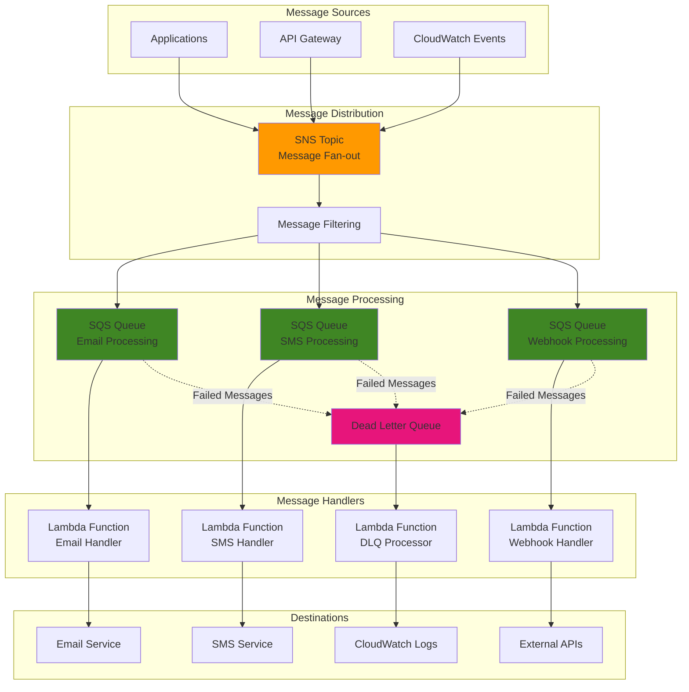

# Building Serverless Notification Systems with SNS, SQS, and Lambda

## Problem

Your organization needs a scalable, reliable notification system that can handle various types of events and deliver them to multiple endpoints without managing servers. Traditional notification systems require complex infrastructure management, struggle with traffic spikes, and lack the flexibility to route messages based on content or priority. You need a solution that can automatically scale, provide guaranteed delivery, handle failures gracefully, and support multiple notification channels including email, SMS, webhooks, and custom processing logic.

## Solution

Implement a serverless notification system using Amazon SNS for message publishing and fan-out, Amazon SQS for reliable message queuing and buffering, and AWS Lambda for custom message processing and delivery. This architecture provides automatic scaling, built-in retry mechanisms, and dead letter queue handling for failed messages. SNS enables one-to-many message distribution, SQS provides durability and decoupling, while Lambda functions handle custom business logic and integrations with external systems. The solution supports multiple notification channels and can process thousands of messages per second without infrastructure management.

## Architecture Diagram



## Prerequisites

1. AWS account with permissions to create SNS topics, SQS queues, and Lambda functions
2. AWS CLI v2 installed and configured with appropriate credentials
3. Basic understanding of serverless architectures and message queuing concepts
4. Python 3.12+ for Lambda function development (or preferred language)
5. Email address for testing notifications
6. Estimated cost: SNS (~$0.50/million requests), SQS (~$0.40/million requests), Lambda (~$0.20/million requests)

> **Note**: This recipe demonstrates core notification patterns that can be extended for production use with additional error handling and monitoring.

## Preparation

```bash
# Set environment variables
export AWS_REGION=$(aws configure get region)
export AWS_ACCOUNT_ID=$(aws sts get-caller-identity \
    --query Account --output text)

# Generate unique identifiers
RANDOM_SUFFIX=$(aws secretsmanager get-random-password \
    --exclude-punctuation --exclude-uppercase \
    --password-length 6 --require-each-included-type \
    --output text --query RandomPassword)

export SNS_TOPIC_NAME="notification-system-${RANDOM_SUFFIX}"
export EMAIL_QUEUE_NAME="email-notifications-${RANDOM_SUFFIX}"
export SMS_QUEUE_NAME="sms-notifications-${RANDOM_SUFFIX}"
export WEBHOOK_QUEUE_NAME="webhook-notifications-${RANDOM_SUFFIX}"
export DLQ_NAME="notification-dlq-${RANDOM_SUFFIX}"

# Set your email for testing
export TEST_EMAIL="your-email@example.com"

echo "✅ Environment variables configured"
```

## Steps

1. **Create SNS topic for message distribution**:

   Amazon SNS serves as the central hub for our notification system, providing publish-subscribe messaging that enables one-to-many message distribution. SNS offers 99.999% availability SLA and can handle millions of messages per second, making it ideal for high-throughput notification scenarios. By establishing the topic first, we create the foundation for reliable message fan-out to multiple subscriber endpoints.

   ```bash
   # Create SNS topic
   SNS_TOPIC_ARN=$(aws sns create-topic \
       --name ${SNS_TOPIC_NAME} \
       --query 'TopicArn' --output text)
   
   echo "SNS Topic ARN: ${SNS_TOPIC_ARN}"
   
   # Add topic policy for cross-service access
   aws sns set-topic-attributes \
       --topic-arn ${SNS_TOPIC_ARN} \
       --attribute-name Policy \
       --attribute-value '{
         "Version": "2012-10-17",
         "Statement": [
           {
             "Effect": "Allow",
             "Principal": {"AWS": "*"},
             "Action": "SNS:Publish",
             "Resource": "'${SNS_TOPIC_ARN}'",
             "Condition": {
               "StringEquals": {
                 "aws:SourceAccount": "'${AWS_ACCOUNT_ID}'"
               }
             }
           }
         ]
       }'
   
   echo "✅ Created SNS topic with permissions"
   ```

   The SNS topic is now ready to receive messages from multiple sources and distribute them to subscribed endpoints. The resource policy ensures secure access while allowing all services within your AWS account to publish messages, establishing the secure foundation for our notification architecture.

2. **Create SQS queues for different notification types**:

   Amazon SQS provides the reliable message buffering and durability layer for our notification system. Each queue handles a specific notification type, enabling parallel processing and isolated scaling per channel. The dead letter queue pattern ensures messages that fail processing multiple times are captured for investigation rather than lost, maintaining system reliability and providing visibility into processing failures.

   ```bash
   # Create dead letter queue first
   DLQ_URL=$(aws sqs create-queue \
       --queue-name ${DLQ_NAME} \
       --query 'QueueUrl' --output text)
   
   DLQ_ARN=$(aws sqs get-queue-attributes \
       --queue-url ${DLQ_URL} \
       --attribute-names QueueArn \
       --query 'Attributes.QueueArn' --output text)
   
   # Create email processing queue with DLQ configuration
   EMAIL_QUEUE_URL=$(aws sqs create-queue \
       --queue-name ${EMAIL_QUEUE_NAME} \
       --attributes '{
         "VisibilityTimeoutSeconds": "300",
         "MessageRetentionPeriod": "1209600",
         "RedrivePolicy": "{\"deadLetterTargetArn\":\"'${DLQ_ARN}'\",\"maxReceiveCount\":3}"
       }' \
       --query 'QueueUrl' --output text)
   
   # Create SMS processing queue with DLQ configuration
   SMS_QUEUE_URL=$(aws sqs create-queue \
       --queue-name ${SMS_QUEUE_NAME} \
       --attributes '{
         "VisibilityTimeoutSeconds": "300",
         "MessageRetentionPeriod": "1209600",
         "RedrivePolicy": "{\"deadLetterTargetArn\":\"'${DLQ_ARN}'\",\"maxReceiveCount\":3}"
       }' \
       --query 'QueueUrl' --output text)
   
   # Create webhook processing queue with DLQ configuration
   WEBHOOK_QUEUE_URL=$(aws sqs create-queue \
       --queue-name ${WEBHOOK_QUEUE_NAME} \
       --attributes '{
         "VisibilityTimeoutSeconds": "300",
         "MessageRetentionPeriod": "1209600",
         "RedrivePolicy": "{\"deadLetterTargetArn\":\"'${DLQ_ARN}'\",\"maxReceiveCount\":3}"
       }' \
       --query 'QueueUrl' --output text)
   
   echo "✅ Created SQS queues with dead letter queue configuration"
   ```

   The queues are configured with 5-minute visibility timeouts to handle Lambda processing time, 14-day message retention for reliability, and dead letter queue redrive after 3 failed attempts. This configuration provides robust message handling while preventing message loss and enabling error investigation.

3. **Configure SQS queue permissions for SNS access**:

   Before subscribing SQS queues to SNS topics, we must configure queue policies to allow SNS to send messages to each queue. This step ensures secure message delivery by explicitly granting the SNS service permission to perform the sqs:SendMessage action on our queues. Without these permissions, SNS subscription attempts would fail with access denied errors.

   ```bash
   # Get queue ARNs for policy configuration
   EMAIL_QUEUE_ARN=$(aws sqs get-queue-attributes \
       --queue-url ${EMAIL_QUEUE_URL} \
       --attribute-names QueueArn \
       --query 'Attributes.QueueArn' --output text)
   
   SMS_QUEUE_ARN=$(aws sqs get-queue-attributes \
       --queue-url ${SMS_QUEUE_URL} \
       --attribute-names QueueArn \
       --query 'Attributes.QueueArn' --output text)
   
   WEBHOOK_QUEUE_ARN=$(aws sqs get-queue-attributes \
       --queue-url ${WEBHOOK_QUEUE_URL} \
       --attribute-names QueueArn \
       --query 'Attributes.QueueArn' --output text)
   
   # Set queue policy for email queue
   aws sqs set-queue-attributes \
       --queue-url ${EMAIL_QUEUE_URL} \
       --attributes '{
         "Policy": "{\"Version\":\"2012-10-17\",\"Statement\":[{\"Effect\":\"Allow\",\"Principal\":{\"Service\":\"sns.amazonaws.com\"},\"Action\":\"sqs:SendMessage\",\"Resource\":\"'${EMAIL_QUEUE_ARN}'\",\"Condition\":{\"ArnEquals\":{\"aws:SourceArn\":\"'${SNS_TOPIC_ARN}'\"}}}]}"
       }'
   
   # Set queue policy for SMS queue
   aws sqs set-queue-attributes \
       --queue-url ${SMS_QUEUE_URL} \
       --attributes '{
         "Policy": "{\"Version\":\"2012-10-17\",\"Statement\":[{\"Effect\":\"Allow\",\"Principal\":{\"Service\":\"sns.amazonaws.com\"},\"Action\":\"sqs:SendMessage\",\"Resource\":\"'${SMS_QUEUE_ARN}'\",\"Condition\":{\"ArnEquals\":{\"aws:SourceArn\":\"'${SNS_TOPIC_ARN}'\"}}}]}"
       }'
   
   # Set queue policy for webhook queue
   aws sqs set-queue-attributes \
       --queue-url ${WEBHOOK_QUEUE_URL} \
       --attributes '{
         "Policy": "{\"Version\":\"2012-10-17\",\"Statement\":[{\"Effect\":\"Allow\",\"Principal\":{\"Service\":\"sns.amazonaws.com\"},\"Action\":\"sqs:SendMessage\",\"Resource\":\"'${WEBHOOK_QUEUE_ARN}'\",\"Condition\":{\"ArnEquals\":{\"aws:SourceArn\":\"'${SNS_TOPIC_ARN}'\"}}}]}"
       }'
   
   echo "✅ Configured SQS queue permissions for SNS access"
   ```

   These policies follow the principle of least privilege by restricting SNS access to only the specific topic ARN we created. The condition ensures that only our designated SNS topic can send messages to these queues, preventing unauthorized access from other SNS topics.

4. **Subscribe SQS queues to SNS topic with message filtering**:

   SNS message filtering enables intelligent routing by evaluating message attributes before delivery, reducing unnecessary processing and costs. Each queue subscription includes filter policies that determine which messages are delivered based on the notification_type attribute. This approach creates efficient, targeted message distribution while supporting both specific channel routing and broadcast capabilities.

   ```bash
   # Subscribe email queue with filter policy
   aws sns subscribe \
       --topic-arn ${SNS_TOPIC_ARN} \
       --protocol sqs \
       --notification-endpoint ${EMAIL_QUEUE_ARN} \
       --attributes '{
         "FilterPolicy": "{\"notification_type\":[\"email\",\"all\"]}",
         "RawMessageDelivery": "true"
       }'
   
   # Subscribe SMS queue with filter policy
   aws sns subscribe \
       --topic-arn ${SNS_TOPIC_ARN} \
       --protocol sqs \
       --notification-endpoint ${SMS_QUEUE_ARN} \
       --attributes '{
         "FilterPolicy": "{\"notification_type\":[\"sms\",\"all\"]}",
         "RawMessageDelivery": "true"
       }'
   
   # Subscribe webhook queue with filter policy
   aws sns subscribe \
       --topic-arn ${SNS_TOPIC_ARN} \
       --protocol sqs \
       --notification-endpoint ${WEBHOOK_QUEUE_ARN} \
       --attributes '{
         "FilterPolicy": "{\"notification_type\":[\"webhook\",\"all\"]}",
         "RawMessageDelivery": "true"
       }'
   
   echo "✅ Subscribed queues to SNS topic with message filtering"
   ```

   Raw message delivery is enabled to receive the original message content without SNS metadata wrapping. The filter policies ensure email notifications route only to email queues, SMS to SMS queues, and webhook to webhook queues, while "all" type messages reach every channel for broadcast scenarios.

5. **Create IAM role for Lambda functions**:

   IAM roles provide secure, temporary credential access for Lambda functions without embedding long-term credentials in code. This follows the principle of least privilege, granting only the minimum permissions required for SQS message processing and CloudWatch logging. The role enables Lambda functions to securely interact with SQS queues while maintaining audit trails through CloudWatch Logs.

   > **Warning**: Always follow the principle of least privilege when creating IAM policies. Grant only the minimum permissions required for your specific use case to maintain security and compliance.

   ```bash
   # Create trust policy for Lambda
   cat > lambda-trust-policy.json << 'EOF'
   {
     "Version": "2012-10-17",
     "Statement": [
       {
         "Effect": "Allow",
         "Principal": {
           "Service": "lambda.amazonaws.com"
         },
         "Action": "sts:AssumeRole"
       }
     ]
   }
   EOF
   
   # Create IAM role
   aws iam create-role \
       --role-name NotificationLambdaRole \
       --assume-role-policy-document file://lambda-trust-policy.json
   
   # Attach basic Lambda execution policy
   aws iam attach-role-policy \
       --role-name NotificationLambdaRole \
       --policy-arn arn:aws:iam::aws:policy/service-role/AWSLambdaBasicExecutionRole
   
   # Create and attach SQS access policy
   cat > sqs-access-policy.json << EOF
   {
     "Version": "2012-10-17",
     "Statement": [
       {
         "Effect": "Allow",
         "Action": [
           "sqs:ReceiveMessage",
           "sqs:DeleteMessage",
           "sqs:GetQueueAttributes",
           "sqs:SendMessage"
         ],
         "Resource": [
           "${EMAIL_QUEUE_ARN}",
           "${SMS_QUEUE_ARN}",
           "${WEBHOOK_QUEUE_ARN}",
           "${DLQ_ARN}"
         ]
       },
       {
         "Effect": "Allow",
         "Action": [
           "logs:CreateLogGroup",
           "logs:CreateLogStream",
           "logs:PutLogEvents"
         ],
         "Resource": "*"
       }
     ]
   }
   EOF
   
   aws iam put-role-policy \
       --role-name NotificationLambdaRole \
       --policy-name SQSAccessPolicy \
       --policy-document file://sqs-access-policy.json
   
   # Wait for role propagation
   sleep 10
   
   # Get role ARN
   LAMBDA_ROLE_ARN=$(aws iam get-role \
       --role-name NotificationLambdaRole \
       --query 'Role.Arn' --output text)
   
   echo "✅ Created IAM role for Lambda functions"
   ```

   The IAM role now provides Lambda functions with secure access to receive, process, and delete messages from SQS queues. CloudWatch logging permissions enable comprehensive monitoring and debugging capabilities, while the limited scope ensures security best practices are maintained throughout the notification system.

6. **Create Lambda function for email processing**:

   AWS Lambda provides serverless compute for processing email notifications with automatic scaling and pay-per-request billing. This function demonstrates the integration pattern for connecting SQS message processing with external email services. Lambda's event-driven execution model ensures efficient resource utilization while the batch processing capability handles multiple messages simultaneously for improved throughput.

   ```bash
   # Create email handler function
   cat > email_handler.py << 'EOF'
   import json
   import logging
   
   logger = logging.getLogger()
   logger.setLevel(logging.INFO)
   
   def lambda_handler(event, context):
       """Process email notification messages from SQS"""
       
       processed_messages = []
       
       for record in event['Records']:
           try:
               # Parse message body
               message_body = json.loads(record['body'])
               
               # Extract notification details
               subject = message_body.get('subject', 'Notification')
               message = message_body.get('message', '')
               recipient = message_body.get('recipient', 'default@example.com')
               priority = message_body.get('priority', 'normal')
               
               # Simulate email sending (replace with actual email service)
               logger.info(f"Sending email to {recipient}")
               logger.info(f"Subject: {subject}")
               logger.info(f"Message: {message}")
               logger.info(f"Priority: {priority}")
               
               # Here you would integrate with SES, SendGrid, or other email service
               # Example: ses.send_email(recipient, subject, message)
               
               processed_messages.append({
                   'messageId': record['messageId'],
                   'status': 'success',
                   'recipient': recipient,
                   'subject': subject
               })
               
           except Exception as e:
               logger.error(f"Error processing message {record['messageId']}: {str(e)}")
               # Message will be retried or sent to DLQ based on SQS configuration
               raise e
       
       return {
           'statusCode': 200,
           'body': json.dumps({
               'processed': len(processed_messages),
               'messages': processed_messages
           })
       }
   EOF
   
   # Create deployment package
   zip email_handler.zip email_handler.py
   
   # Create Lambda function with updated Python runtime
   EMAIL_LAMBDA_ARN=$(aws lambda create-function \
       --function-name EmailNotificationHandler \
       --runtime python3.12 \
       --role ${LAMBDA_ROLE_ARN} \
       --handler email_handler.lambda_handler \
       --zip-file fileb://email_handler.zip \
       --timeout 300 \
       --query 'FunctionArn' --output text)
   
   echo "✅ Created email processing Lambda function"
   ```

   The Lambda function is configured with a 5-minute timeout to handle email service latency and batch processing. In production, you would replace the logging statements with actual email service integration using Amazon SES, SendGrid, or similar providers to deliver notifications to recipients.

7. **Create Lambda function for webhook processing**:

   The webhook processing function demonstrates HTTP integration patterns for delivering notifications to external APIs. This function includes retry logic, timeout handling, and error management to ensure reliable webhook delivery. The HTTP connection pooling using urllib3 optimizes performance for multiple webhook calls within a single invocation.

   ```bash
   # Create webhook handler function
   cat > webhook_handler.py << 'EOF'
   import json
   import logging
   import urllib3
   
   logger = logging.getLogger()
   logger.setLevel(logging.INFO)
   
   http = urllib3.PoolManager()
   
   def lambda_handler(event, context):
       """Process webhook notification messages from SQS"""
       
       processed_messages = []
       
       for record in event['Records']:
           try:
               # Parse message body
               message_body = json.loads(record['body'])
               
               # Extract webhook details
               webhook_url = message_body.get('webhook_url', '')
               payload = message_body.get('payload', {})
               headers = message_body.get('headers', {'Content-Type': 'application/json'})
               retry_count = message_body.get('retry_count', 0)
               
               if not webhook_url:
                   logger.error("No webhook URL provided")
                   continue
               
               # Send webhook request with timeout
               logger.info(f"Sending webhook to {webhook_url}")
               
               try:
                   response = http.request(
                       'POST',
                       webhook_url,
                       body=json.dumps(payload),
                       headers=headers,
                       timeout=30
                   )
                   
                   if response.status == 200:
                       logger.info(f"Webhook sent successfully to {webhook_url}")
                       status = 'success'
                   else:
                       logger.warning(f"Webhook returned status {response.status}")
                       status = 'retry'
                       
               except Exception as webhook_error:
                   logger.error(f"Webhook request failed: {str(webhook_error)}")
                   status = 'failed'
                   if retry_count < 3:
                       raise webhook_error  # Will trigger SQS retry
               
               processed_messages.append({
                   'messageId': record['messageId'],
                   'status': status,
                   'webhook_url': webhook_url,
                   'retry_count': retry_count
               })
               
           except Exception as e:
               logger.error(f"Error processing message {record['messageId']}: {str(e)}")
               raise e
       
       return {
           'statusCode': 200,
           'body': json.dumps({
               'processed': len(processed_messages),
               'messages': processed_messages
           })
       }
   EOF
   
   # Create deployment package
   zip webhook_handler.zip webhook_handler.py
   
   # Create Lambda function with updated Python runtime
   WEBHOOK_LAMBDA_ARN=$(aws lambda create-function \
       --function-name WebhookNotificationHandler \
       --runtime python3.12 \
       --role ${LAMBDA_ROLE_ARN} \
       --handler webhook_handler.lambda_handler \
       --zip-file fileb://webhook_handler.zip \
       --timeout 300 \
       --query 'FunctionArn' --output text)
   
   echo "✅ Created webhook processing Lambda function"
   ```

   The webhook function includes robust error handling and retry logic that integrates with SQS's built-in retry mechanism. Failed webhooks are automatically retried up to 3 times before being sent to the dead letter queue for investigation.

8. **Create event source mappings for Lambda functions**:

   Event source mappings create the crucial link between SQS queues and Lambda functions, enabling automatic message processing without polling overhead. The batch configuration optimizes throughput by processing up to 10 messages per invocation while the batching window ensures low-latency processing even with light message volumes. This configuration balances cost efficiency with responsiveness for real-time notification delivery.

   ```bash
   # Connect email queue to email Lambda function
   aws lambda create-event-source-mapping \
       --event-source-arn ${EMAIL_QUEUE_ARN} \
       --function-name EmailNotificationHandler \
       --batch-size 10 \
       --maximum-batching-window-in-seconds 5
   
   # Connect webhook queue to webhook Lambda function
   aws lambda create-event-source-mapping \
       --event-source-arn ${WEBHOOK_QUEUE_ARN} \
       --function-name WebhookNotificationHandler \
       --batch-size 10 \
       --maximum-batching-window-in-seconds 5
   
   echo "✅ Created event source mappings for Lambda functions"
   ```

   The event source mappings are now active, enabling automatic message processing as soon as messages arrive in the queues. Lambda will scale concurrency automatically based on queue depth, ensuring high throughput during peak notification periods while maintaining cost efficiency during quiet periods.

9. **Create test notification publisher**:

   This Python script demonstrates how to publish messages to our SNS topic with proper message attributes for filtering. The script includes examples of targeted notifications (email-only, webhook-only) and broadcast notifications that reach all channels. Message attributes enable SNS filtering while the message body contains the actual notification data.

   ```bash
   # Create notification publisher script
   cat > publish_notification.py << EOF
   #!/usr/bin/env python3
   import boto3
   import json
   import sys
   from datetime import datetime
   
   def publish_notification(topic_arn, notification_type, subject, message, **kwargs):
       """Publish a notification to SNS topic"""
       
       sns = boto3.client('sns')
       
       # Prepare message attributes for filtering
       message_attributes = {
           'notification_type': {
               'DataType': 'String',
               'StringValue': notification_type
           },
           'timestamp': {
               'DataType': 'String',
               'StringValue': datetime.utcnow().isoformat()
           }
       }
       
       # Prepare message body
       message_body = {
           'subject': subject,
           'message': message,
           'timestamp': datetime.utcnow().isoformat(),
           **kwargs
       }
       
       try:
           response = sns.publish(
               TopicArn=topic_arn,
               Message=json.dumps(message_body),
               Subject=subject,
               MessageAttributes=message_attributes
           )
           
           print(f"Published {notification_type} notification:")
           print(f"  Message ID: {response['MessageId']}")
           print(f"  Subject: {subject}")
           print(f"  Type: {notification_type}")
           return response['MessageId']
           
       except Exception as e:
           print(f"Error publishing notification: {e}")
           return None
   
   if __name__ == "__main__":
       topic_arn = "${SNS_TOPIC_ARN}"
       
       # Test different notification types
       notifications = [
           {
               'type': 'email',
               'subject': 'Test Email Notification',
               'message': 'This is a test email notification from the serverless notification system.',
               'recipient': '${TEST_EMAIL}',
               'priority': 'high'
           },
           {
               'type': 'webhook',
               'subject': 'Test Webhook Notification', 
               'message': 'This is a test webhook notification.',
               'webhook_url': 'https://httpbin.org/post',
               'payload': {
                   'event': 'test_notification',
                   'data': {'test': True, 'timestamp': datetime.utcnow().isoformat()}
               }
           },
           {
               'type': 'all',
               'subject': 'Broadcast Notification',
               'message': 'This notification will be sent to all channels.',
               'recipient': '${TEST_EMAIL}',
               'webhook_url': 'https://httpbin.org/post',
               'payload': {'broadcast': True}
           }
       ]
       
       for notification in notifications:
           notification_type = notification.pop('type')
           subject = notification.pop('subject')
           message = notification.pop('message')
           
           message_id = publish_notification(
               topic_arn, notification_type, subject, message, **notification
           )
           
           if message_id:
               print(f"✅ Published {notification_type} notification")
           else:
               print(f"❌ Failed to publish {notification_type} notification")
           print()
   EOF
   
   chmod +x publish_notification.py
   
   echo "✅ Created notification publisher script"
   ```

   The publisher script demonstrates the complete message flow from source to destination, showing how message attributes control routing while the message body contains the actual notification payload for processing by Lambda functions.

## Validation & Testing

1. **Test the notification system**:

   ```bash
   # Run the test publisher
   python3 publish_notification.py
   
   echo "✅ Published test notifications"
   ```

   Expected output: Three notifications published with different message IDs for email, webhook, and broadcast types.

2. **Monitor Lambda function execution**:

   ```bash
   # Check email handler logs
   echo "Checking email handler logs..."
   aws logs describe-log-groups \
       --log-group-name-prefix "/aws/lambda/EmailNotificationHandler" \
       --query 'logGroups[0].logGroupName' --output text | \
   xargs -I {} aws logs describe-log-streams \
       --log-group-name {} \
       --order-by LastEventTime --descending \
       --max-items 1 \
       --query 'logStreams[0].logStreamName' --output text | \
   xargs -I {} aws logs get-log-events \
       --log-group-name "/aws/lambda/EmailNotificationHandler" \
       --log-stream-name {} \
       --query 'events[].message' --output text
   
   echo "Checking webhook handler logs..."
   aws logs describe-log-groups \
       --log-group-name-prefix "/aws/lambda/WebhookNotificationHandler" \
       --query 'logGroups[0].logGroupName' --output text | \
   xargs -I {} aws logs describe-log-streams \
       --log-group-name {} \
       --order-by LastEventTime --descending \
       --max-items 1 \
       --query 'logStreams[0].logStreamName' --output text | \
   xargs -I {} aws logs get-log-events \
       --log-group-name "/aws/lambda/WebhookNotificationHandler" \
       --log-stream-name {} \
       --query 'events[].message' --output text
   ```

   Expected output: Log entries showing successful processing of email and webhook notifications with message details.

3. **Check queue metrics**:

   ```bash
   # Check queue depths and verify message processing
   echo "Queue message counts:"
   
   for queue_url in "${EMAIL_QUEUE_URL}" "${SMS_QUEUE_URL}" "${WEBHOOK_QUEUE_URL}" "${DLQ_URL}"; do
       queue_name=$(basename ${queue_url})
       message_count=$(aws sqs get-queue-attributes \
           --queue-url ${queue_url} \
           --attribute-names ApproximateNumberOfMessages \
           --query 'Attributes.ApproximateNumberOfMessages' --output text)
       echo "  ${queue_name}: ${message_count} messages"
   done
   ```

   Expected output: All queues should show 0 messages, indicating successful processing. If messages remain, check Lambda function logs for errors.

## Cleanup

1. **Delete Lambda functions and event source mappings**:

   ```bash
   # List and delete event source mappings
   aws lambda list-event-source-mappings \
       --function-name EmailNotificationHandler \
       --query 'EventSourceMappings[].UUID' --output text | \
   xargs -I {} aws lambda delete-event-source-mapping --uuid {}
   
   aws lambda list-event-source-mappings \
       --function-name WebhookNotificationHandler \
       --query 'EventSourceMappings[].UUID' --output text | \
   xargs -I {} aws lambda delete-event-source-mapping --uuid {}
   
   # Delete Lambda functions
   aws lambda delete-function --function-name EmailNotificationHandler
   aws lambda delete-function --function-name WebhookNotificationHandler
   
   echo "✅ Deleted Lambda functions and event source mappings"
   ```

2. **Delete SQS queues**:

   ```bash
   # Delete all queues
   aws sqs delete-queue --queue-url ${EMAIL_QUEUE_URL}
   aws sqs delete-queue --queue-url ${SMS_QUEUE_URL}
   aws sqs delete-queue --queue-url ${WEBHOOK_QUEUE_URL}
   aws sqs delete-queue --queue-url ${DLQ_URL}
   
   echo "✅ Deleted SQS queues"
   ```

3. **Delete SNS topic and IAM resources**:

   ```bash
   # Delete SNS topic
   aws sns delete-topic --topic-arn ${SNS_TOPIC_ARN}
   
   # Delete IAM role and policies
   aws iam delete-role-policy \
       --role-name NotificationLambdaRole \
       --policy-name SQSAccessPolicy
   
   aws iam detach-role-policy \
       --role-name NotificationLambdaRole \
       --policy-arn arn:aws:iam::aws:policy/service-role/AWSLambdaBasicExecutionRole
   
   aws iam delete-role --role-name NotificationLambdaRole
   
   echo "✅ Deleted SNS topic and IAM resources"
   ```

4. **Clean up local files**:

   ```bash
   # Remove local files
   rm -f email_handler.py email_handler.zip
   rm -f webhook_handler.py webhook_handler.zip
   rm -f publish_notification.py
   rm -f lambda-trust-policy.json sqs-access-policy.json
   
   # Clear environment variables
   unset SNS_TOPIC_NAME EMAIL_QUEUE_NAME SMS_QUEUE_NAME
   unset WEBHOOK_QUEUE_NAME DLQ_NAME TEST_EMAIL
   unset SNS_TOPIC_ARN EMAIL_QUEUE_URL SMS_QUEUE_URL
   unset WEBHOOK_QUEUE_URL DLQ_URL LAMBDA_ROLE_ARN
   
   echo "✅ Cleaned up local files and variables"
   ```

## Discussion

This serverless notification system demonstrates the power of combining SNS, SQS, and Lambda to create a highly scalable, reliable messaging architecture. The solution provides several key benefits: automatic scaling based on message volume, built-in retry mechanisms with dead letter queues, message filtering to route notifications to appropriate handlers, and complete decoupling between message producers and consumers.

The architecture supports multiple notification channels simultaneously, allowing you to send the same message to email, SMS, webhooks, and custom processors. Message filtering ensures that each queue only receives relevant messages, reducing processing overhead and costs. The dead letter queue pattern provides visibility into failed messages and enables manual intervention when needed.

For production deployments, consider implementing additional features such as message encryption using AWS KMS, enhanced monitoring with CloudWatch alarms, integration with AWS X-Ray for distributed tracing, and implementing circuit breaker patterns to handle downstream service failures gracefully. The system can easily be extended to support additional notification channels like Slack, Microsoft Teams, or mobile push notifications. Refer to the [AWS Well-Architected Framework](https://docs.aws.amazon.com/wellarchitected/latest/framework/welcome.html) for additional architectural guidance on building resilient, secure, and cost-optimized systems.

> **Tip**: Use SNS message attributes for filtering rather than parsing message bodies, as this is more efficient and allows SNS to filter messages before they reach SQS queues. Learn more about [SNS message filtering](https://docs.aws.amazon.com/sns/latest/dg/sns-subscription-filter-policies.html) in the AWS documentation.

## Challenge

Extend this solution by implementing these enhancements:

1. **Add SMS support** by integrating with Amazon SNS SMS or Amazon Pinpoint to send text message notifications with phone number validation
2. **Implement message prioritization** using separate high-priority queues with dedicated Lambda functions for urgent notifications
3. **Build a notification dashboard** using API Gateway and a web interface to monitor message volumes, success rates, and failed deliveries
4. **Add message templating** with DynamoDB to store notification templates and support personalized messages with variable substitution
5. **Create notification scheduling** using EventBridge rules to send delayed or recurring notifications at specific times

## Infrastructure Code

### Available Infrastructure as Code:

- [Infrastructure Code Overview](code/README.md) - Detailed description of all infrastructure components
- [AWS CDK (Python)](code/cdk-python/) - AWS CDK Python implementation
- [AWS CDK (TypeScript)](code/cdk-typescript/) - AWS CDK TypeScript implementation
- [CloudFormation](code/cloudformation.yaml) - AWS CloudFormation template
- [Bash CLI Scripts](code/scripts/) - Example bash scripts using AWS CLI commands to deploy infrastructure
- [Terraform](code/terraform/) - Terraform configuration files