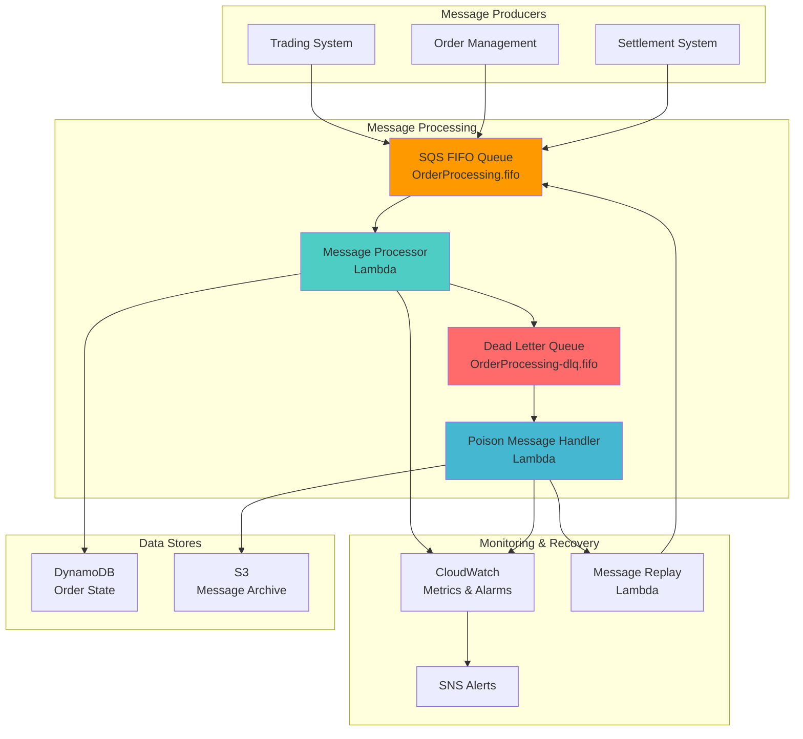

# Processing Ordered Messages with SQS FIFO and Dead Letter Queues

## Problem

Financial trading systems and order management platforms require strict message ordering guarantees while maintaining high throughput and fault tolerance. Traditional message queues often face challenges with maintaining order during failures, handling duplicate messages, and managing poison messages that cannot be processed successfully, leading to system downtime and data inconsistencies.

## Solution

Implement a robust ordered message processing system using Amazon SQS FIFO queues with sophisticated deduplication, message grouping strategies, and comprehensive dead letter queue handling. This architecture ensures exactly-once processing within message groups while providing failure isolation and automated recovery mechanisms for mission-critical applications.

## Architecture Diagram



## Prerequisites

1. AWS account with permissions for SQS, Lambda, DynamoDB, CloudWatch, SNS, and IAM
2. AWS CLI v2 installed and configured (or AWS CloudShell)
3. Understanding of FIFO message ordering, deduplication, and message grouping concepts
4. Knowledge of error handling patterns and dead letter queue strategies
5. Estimated cost: $15-20 for testing resources (delete after completion)

> **Note**: This recipe implements production-grade message processing patterns with comprehensive error handling and monitoring, following AWS Well-Architected Framework principles.

> **Warning**: FIFO queues have throughput limitations of 3,000 messages per second per message group. Design your message grouping strategy carefully to avoid bottlenecks in high-volume scenarios.

> **Tip**: Monitor the `ApproximateAgeOfOldestMessage` metric to detect processing backlogs early. Consider implementing auto-scaling based on queue depth for production workloads as described in the [SQS best practices documentation](https://docs.aws.amazon.com/AWSSimpleQueueService/latest/SQSDeveloperGuide/sqs-best-practices.html).

## Preparation

```bash
# Set environment variables
export AWS_REGION=$(aws configure get region)
export AWS_ACCOUNT_ID=$(aws sts get-caller-identity \
    --query Account --output text)

# Generate unique identifiers
RANDOM_SUFFIX=$(aws secretsmanager get-random-password \
    --exclude-punctuation --exclude-uppercase \
    --password-length 6 --require-each-included-type \
    --output text --query RandomPassword)

export PROJECT_NAME="fifo-processing-${RANDOM_SUFFIX}"
export MAIN_QUEUE_NAME="${PROJECT_NAME}-main-queue.fifo"
export DLQ_NAME="${PROJECT_NAME}-dlq.fifo"
export ORDER_TABLE_NAME="${PROJECT_NAME}-orders"
export ARCHIVE_BUCKET_NAME="${PROJECT_NAME}-message-archive"
export SNS_TOPIC_NAME="${PROJECT_NAME}-alerts"

echo "✅ Environment configured with project: ${PROJECT_NAME}"
```

## Steps

1. **Create DynamoDB Table for Order State Management**:

   DynamoDB serves as the persistent state store for our message processing system, providing the durability and consistency required for financial order management. The table design includes a Global Secondary Index (GSI) to enable efficient querying by message group, allowing us to track processing order within each business domain. DynamoDB Streams will capture all data changes, enabling downstream systems to react to order state transitions in real-time.

   ```bash
   # Create orders table with proper design for FIFO processing
   aws dynamodb create-table \
       --table-name ${ORDER_TABLE_NAME} \
       --attribute-definitions \
           AttributeName=OrderId,AttributeType=S \
           AttributeName=MessageGroupId,AttributeType=S \
           AttributeName=ProcessedAt,AttributeType=S \
       --key-schema \
           AttributeName=OrderId,KeyType=HASH \
       --global-secondary-indexes \
           IndexName=MessageGroup-ProcessedAt-index,KeySchema="[{AttributeName=MessageGroupId,KeyType=HASH},{AttributeName=ProcessedAt,KeyType=RANGE}]",Projection="{ProjectionType=ALL}",ProvisionedThroughput="{ReadCapacityUnits=5,WriteCapacityUnits=5}" \
       --provisioned-throughput \
           ReadCapacityUnits=10,WriteCapacityUnits=10 \
       --stream-specification StreamEnabled=true,StreamViewType=NEW_AND_OLD_IMAGES
   
   # Wait for table to become active
   aws dynamodb wait table-exists \
       --table-name ${ORDER_TABLE_NAME}
   
   echo "✅ DynamoDB table created: ${ORDER_TABLE_NAME}"
   ```

   The DynamoDB table is now ready to store order state with the MessageGroup-ProcessedAt-index enabling efficient queries for monitoring processing progress within each message group. The table's stream capability will allow other systems to react to order state changes, providing a foundation for event-driven architectures.

2. **Create S3 Bucket for Message Archiving**:

   S3 provides cost-effective, durable storage for poison message archival and forensic analysis. The lifecycle policy automatically transitions archived messages to cheaper storage classes over time, reducing long-term costs while maintaining accessibility for compliance and debugging purposes. This archival strategy is essential for financial systems where message audit trails must be preserved for regulatory requirements.

   ```bash
   # Create S3 bucket for archiving poison messages
   aws s3 mb s3://${ARCHIVE_BUCKET_NAME} --region ${AWS_REGION}
   
   # Configure lifecycle policy for cost optimization
   aws s3api put-bucket-lifecycle-configuration \
       --bucket ${ARCHIVE_BUCKET_NAME} \
       --lifecycle-configuration '{
           "Rules": [{
               "ID": "ArchiveTransition",
               "Status": "Enabled",
               "Filter": {"Prefix": "poison-messages/"},
               "Transitions": [{
                   "Days": 30,
                   "StorageClass": "STANDARD_IA"
               }, {
                   "Days": 90,
                   "StorageClass": "GLACIER"
               }]
           }]
       }'
   
   echo "✅ S3 bucket created: ${ARCHIVE_BUCKET_NAME}"
   ```

   The S3 bucket now provides automated lifecycle management for poison messages, transitioning to Standard-IA after 30 days and Glacier after 90 days. This configuration balances cost optimization with operational access requirements, ensuring archived messages remain accessible for investigation while minimizing storage costs.

3. **Create SNS Topic for Alerting**:

   SNS enables real-time alerting for critical system events, ensuring operations teams are immediately notified of poison messages, processing failures, or system anomalies. This pub/sub pattern allows multiple subscribers (email, SMS, Lambda functions, or third-party tools) to receive alerts simultaneously, supporting diverse operational workflows and escalation procedures.

   ```bash
   # Create SNS topic for operational alerts
   aws sns create-topic --name ${SNS_TOPIC_NAME}
   
   SNS_TOPIC_ARN=$(aws sns get-topic-attributes \
       --topic-arn "arn:aws:sns:${AWS_REGION}:${AWS_ACCOUNT_ID}:${SNS_TOPIC_NAME}" \
       --query 'Attributes.TopicArn' --output text)
   
   echo "✅ SNS topic created: ${SNS_TOPIC_ARN}"
   ```

   The SNS topic establishes the foundation for operational alerting, enabling immediate notification of critical events. Multiple communication channels can subscribe to this topic, ensuring alerts reach the appropriate personnel through their preferred notification methods.

4. **Create Dead Letter Queue (FIFO)**:

   The Dead Letter Queue (DLQ) acts as a safety net for messages that cannot be processed successfully, preserving message ordering even for failed processing attempts. FIFO characteristics ensure that poison messages maintain their original sequence, which is crucial for debugging and understanding failure patterns. Content-based deduplication prevents duplicate poison messages from accumulating in the DLQ.

   ```bash
   # Create dead letter queue with FIFO characteristics
   aws sqs create-queue \
       --queue-name ${DLQ_NAME} \
       --attributes '{
           "FifoQueue": "true",
           "ContentBasedDeduplication": "true",
           "MessageRetentionPeriod": "1209600",
           "VisibilityTimeoutSeconds": "300"
       }'
   
   # Get DLQ URL and ARN
   DLQ_URL=$(aws sqs get-queue-url \
       --queue-name ${DLQ_NAME} \
       --query 'QueueUrl' --output text)
   
   DLQ_ARN=$(aws sqs get-queue-attributes \
       --queue-url ${DLQ_URL} \
       --attribute-names QueueArn \
       --query 'Attributes.QueueArn' --output text)
   
   echo "✅ Dead letter queue created: ${DLQ_URL}"
   ```

   The DLQ is now configured with FIFO ordering and extended message retention, providing a controlled environment for analyzing failed messages. The 14-day retention period ensures sufficient time for investigation while automatic deduplication prevents message accumulation from retry scenarios.

5. **Create Main FIFO Queue with Advanced Configuration**:

   The main FIFO queue implements advanced throughput optimization with per-message-group deduplication scope, enabling high-throughput parallel processing while maintaining strict ordering within each business domain. The redrive policy automatically routes failed messages to the DLQ after 3 processing attempts, balancing retry resilience with poison message isolation. This configuration supports up to 3,000 messages per second per message group.

   ```bash
   # Create main FIFO queue with dead letter queue configuration
   aws sqs create-queue \
       --queue-name ${MAIN_QUEUE_NAME} \
       --attributes "{
           \"FifoQueue\": \"true\",
           \"ContentBasedDeduplication\": \"false\",
           \"DeduplicationScope\": \"messageGroup\",
           \"FifoThroughputLimit\": \"perMessageGroupId\",
           \"MessageRetentionPeriod\": \"1209600\",
           \"VisibilityTimeoutSeconds\": \"300\",
           \"RedrivePolicy\": \"{\\\"deadLetterTargetArn\\\":\\\"${DLQ_ARN}\\\",\\\"maxReceiveCount\\\":3}\"
       }"
   
   # Get main queue URL and ARN
   MAIN_QUEUE_URL=$(aws sqs get-queue-url \
       --queue-name ${MAIN_QUEUE_NAME} \
       --query 'QueueUrl' --output text)
   
   MAIN_QUEUE_ARN=$(aws sqs get-queue-attributes \
       --queue-url ${MAIN_QUEUE_URL} \
       --attribute-names QueueArn \
       --query 'Attributes.QueueArn' --output text)
   
   echo "✅ Main FIFO queue created: ${MAIN_QUEUE_URL}"
   ```

   The main FIFO queue is now optimized for high-throughput ordered processing with intelligent failure handling. The per-message-group deduplication scope and throughput limit configuration enable horizontal scaling across different business domains while maintaining strict ordering guarantees within each domain.

6. **Create IAM Roles for Lambda Functions**:

   IAM roles implement the principle of least privilege, granting Lambda functions only the specific permissions required for their designated tasks. The message processor role includes SQS and DynamoDB permissions for normal processing operations, while the poison handler role has additional S3 and SNS permissions for archival and alerting. This security boundary prevents unauthorized access while enabling legitimate operational activities.

   ```bash
   # Create execution role for message processor
   aws iam create-role \
       --role-name "${PROJECT_NAME}-processor-role" \
       --assume-role-policy-document '{
           "Version": "2012-10-17",
           "Statement": [{
               "Effect": "Allow",
               "Principal": {"Service": "lambda.amazonaws.com"},
               "Action": "sts:AssumeRole"
           }]
       }'
   
   # Attach basic execution policy
   aws iam attach-role-policy \
       --role-name "${PROJECT_NAME}-processor-role" \
       --policy-arn "arn:aws:iam::aws:policy/service-role/AWSLambdaBasicExecutionRole"
   
   # Add SQS and DynamoDB permissions
   aws iam put-role-policy \
       --role-name "${PROJECT_NAME}-processor-role" \
       --policy-name "MessageProcessingAccess" \
       --policy-document "{
           \"Version\": \"2012-10-17\",
           \"Statement\": [{
               \"Effect\": \"Allow\",
               \"Action\": [
                   \"sqs:ReceiveMessage\",
                   \"sqs:DeleteMessage\",
                   \"sqs:GetQueueAttributes\",
                   \"sqs:SendMessage\"
               ],
               \"Resource\": [
                   \"${MAIN_QUEUE_ARN}\",
                   \"${DLQ_ARN}\"
               ]
           }, {
               \"Effect\": \"Allow\",
               \"Action\": [
                   \"dynamodb:PutItem\",
                   \"dynamodb:UpdateItem\",
                   \"dynamodb:GetItem\",
                   \"dynamodb:Query\"
               ],
               \"Resource\": \"arn:aws:dynamodb:${AWS_REGION}:${AWS_ACCOUNT_ID}:table/${ORDER_TABLE_NAME}*\"
           }, {
               \"Effect\": \"Allow\",
               \"Action\": [
                   \"cloudwatch:PutMetricData\"
               ],
               \"Resource\": \"*\"
           }]
       }"
   
   # Create role for poison message handler
   aws iam create-role \
       --role-name "${PROJECT_NAME}-poison-handler-role" \
       --assume-role-policy-document '{
           "Version": "2012-10-17",
           "Statement": [{
               "Effect": "Allow",
               "Principal": {"Service": "lambda.amazonaws.com"},
               "Action": "sts:AssumeRole"
           }]
       }'
   
   # Attach basic execution policy
   aws iam attach-role-policy \
       --role-name "${PROJECT_NAME}-poison-handler-role" \
       --policy-arn "arn:aws:iam::aws:policy/service-role/AWSLambdaBasicExecutionRole"
   
   # Add permissions for poison message handling
   aws iam put-role-policy \
       --role-name "${PROJECT_NAME}-poison-handler-role" \
       --policy-name "PoisonMessageHandlingAccess" \
       --policy-document "{
           \"Version\": \"2012-10-17\",
           \"Statement\": [{
               \"Effect\": \"Allow\",
               \"Action\": [
                   \"sqs:ReceiveMessage\",
                   \"sqs:DeleteMessage\",
                   \"sqs:GetQueueAttributes\",
                   \"sqs:SendMessage\"
               ],
               \"Resource\": [
                   \"${DLQ_ARN}\",
                   \"${MAIN_QUEUE_ARN}\"
               ]
           }, {
               \"Effect\": \"Allow\",
               \"Action\": [
                   \"s3:PutObject\",
                   \"s3:GetObject\"
               ],
               \"Resource\": \"arn:aws:s3:::${ARCHIVE_BUCKET_NAME}/*\"
           }, {
               \"Effect\": \"Allow\",
               \"Action\": [
                   \"sns:Publish\"
               ],
               \"Resource\": \"${SNS_TOPIC_ARN}\"
           }, {
               \"Effect\": \"Allow\",
               \"Action\": [
                   \"cloudwatch:PutMetricData\"
               ],
               \"Resource\": \"*\"
           }]
       }"
   
   echo "✅ IAM roles created"
   ```

   The IAM roles now provide secure, least-privilege access for Lambda functions to interact with required AWS services. Each role is scoped to specific resources and actions, creating security boundaries that prevent unauthorized access while enabling legitimate processing operations.

7. **Create Message Processor Lambda Function**:

   The message processor implements sophisticated business logic with built-in idempotency, error handling, and observability features. Reserved concurrency prevents resource contention during traffic spikes, while custom CloudWatch metrics provide deep insights into processing performance. The function includes duplicate detection to handle SQS's at-least-once delivery semantics, ensuring exactly-once processing semantics for critical financial operations.

   ```bash
   # Create sophisticated message processor
   cat > message_processor.py << 'EOF'
import json
import boto3
import time
from datetime import datetime, timedelta
from decimal import Decimal
import hashlib
import random
import os

dynamodb = boto3.resource('dynamodb')
cloudwatch = boto3.client('cloudwatch')
sqs = boto3.client('sqs')

def lambda_handler(event, context):
    """
    Process messages from SQS FIFO queue with ordering guarantees
    """
    processed_count = 0
    failed_count = 0
    
    for record in event['Records']:
        try:
            # Extract message details
            message_body = json.loads(record['body'])
            message_group_id = record['attributes']['MessageGroupId']
            message_dedup_id = record['attributes']['MessageDeduplicationId']
            receipt_handle = record['receiptHandle']
            
            print(f"Processing message: {message_dedup_id} in group: {message_group_id}")
            
            # Simulate business logic processing
            result = process_order_message(message_body, message_group_id, message_dedup_id)
            
            if result['success']:
                processed_count += 1
                
                # Publish custom metrics
                publish_processing_metrics(message_group_id, 'SUCCESS', result['processing_time'])
                
            else:
                failed_count += 1
                # Don't delete message - let it go to DLQ after max retries
                publish_processing_metrics(message_group_id, 'FAILURE', result['processing_time'])
                
                # For demonstration: simulate different failure scenarios
                if should_simulate_failure():
                    raise Exception(f"Simulated processing failure for message {message_dedup_id}")
            
        except Exception as e:
            failed_count += 1
            print(f"Error processing message: {str(e)}")
            
            # Publish error metrics
            publish_processing_metrics(
                record['attributes'].get('MessageGroupId', 'unknown'), 
                'ERROR', 
                0
            )
            
            # Re-raise to trigger DLQ behavior
            raise
    
    # Publish batch metrics
    cloudwatch.put_metric_data(
        Namespace='FIFO/MessageProcessing',
        MetricData=[
            {
                'MetricName': 'ProcessedMessages',
                'Value': processed_count,
                'Unit': 'Count',
                'Dimensions': [
                    {'Name': 'Environment', 'Value': 'Demo'}
                ]
            },
            {
                'MetricName': 'FailedMessages', 
                'Value': failed_count,
                'Unit': 'Count',
                'Dimensions': [
                    {'Name': 'Environment', 'Value': 'Demo'}
                ]
            }
        ]
    )
    
    return {
        'statusCode': 200,
        'processedCount': processed_count,
        'failedCount': failed_count
    }

def process_order_message(message_body, message_group_id, message_dedup_id):
    """
    Process individual order message with idempotency
    """
    start_time = time.time()
    
    try:
        # Extract order information
        order_id = message_body.get('orderId')
        order_type = message_body.get('orderType')
        amount = message_body.get('amount')
        timestamp = message_body.get('timestamp')
        
        if not all([order_id, order_type, amount]):
            raise ValueError("Missing required order fields")
        
        table = dynamodb.Table(os.environ['ORDER_TABLE_NAME'])
        
        # Check for duplicate processing (idempotency)
        try:
            existing_item = table.get_item(
                Key={'OrderId': order_id}
            )
            
            if 'Item' in existing_item:
                if existing_item['Item'].get('MessageDeduplicationId') == message_dedup_id:
                    print(f"Message {message_dedup_id} already processed for order {order_id}")
                    return {
                        'success': True, 
                        'processing_time': time.time() - start_time,
                        'duplicate': True
                    }
        except Exception as e:
            print(f"Error checking for duplicates: {str(e)}")
        
        # Validate order amount (business rule)
        if Decimal(str(amount)) < 0:
            raise ValueError(f"Invalid order amount: {amount}")
        
        # Simulate complex business logic
        time.sleep(random.uniform(0.1, 0.5))  # Simulate processing time
        
        # Store order state with message tracking
        table.put_item(
            Item={
                'OrderId': order_id,
                'OrderType': order_type,
                'Amount': Decimal(str(amount)),
                'MessageGroupId': message_group_id,
                'MessageDeduplicationId': message_dedup_id,
                'Status': 'PROCESSED',
                'ProcessedAt': datetime.utcnow().isoformat(),
                'ProcessingTimeMs': int((time.time() - start_time) * 1000),
                'OriginalTimestamp': timestamp
            }
        )
        
        return {
            'success': True, 
            'processing_time': time.time() - start_time,
            'duplicate': False
        }
        
    except Exception as e:
        print(f"Error processing order {message_body.get('orderId', 'unknown')}: {str(e)}")
        return {
            'success': False, 
            'processing_time': time.time() - start_time,
            'error': str(e)
        }

def publish_processing_metrics(message_group_id, status, processing_time):
    """
    Publish detailed processing metrics to CloudWatch
    """
    try:
        cloudwatch.put_metric_data(
            Namespace='FIFO/MessageProcessing',
            MetricData=[
                {
                    'MetricName': 'ProcessingTime',
                    'Value': processing_time * 1000,  # Convert to milliseconds
                    'Unit': 'Milliseconds',
                    'Dimensions': [
                        {'Name': 'MessageGroup', 'Value': message_group_id},
                        {'Name': 'Status', 'Value': status}
                    ]
                },
                {
                    'MetricName': 'MessageStatus',
                    'Value': 1,
                    'Unit': 'Count',
                    'Dimensions': [
                        {'Name': 'MessageGroup', 'Value': message_group_id},
                        {'Name': 'Status', 'Value': status}
                    ]
                }
            ]
        )
    except Exception as e:
        print(f"Error publishing metrics: {str(e)}")

def should_simulate_failure():
    """
    Simulate occasional processing failures for testing
    """
    # 10% chance of failure for demonstration
    return random.random() < 0.1
EOF
   
   # Package and deploy message processor
   zip message_processor.zip message_processor.py
   
   PROCESSOR_ROLE_ARN=$(aws iam get-role \
       --role-name "${PROJECT_NAME}-processor-role" \
       --query 'Role.Arn' --output text)
   
   aws lambda create-function \
       --function-name "${PROJECT_NAME}-message-processor" \
       --runtime python3.12 \
       --role ${PROCESSOR_ROLE_ARN} \
       --handler message_processor.lambda_handler \
       --zip-file fileb://message_processor.zip \
       --environment "Variables={ORDER_TABLE_NAME=${ORDER_TABLE_NAME}}" \
       --timeout 300 \
       --reserved-concurrency 10
   
   echo "✅ Message processor Lambda created"
   ```

   The message processor Lambda is now deployed with reserved concurrency and comprehensive error handling capabilities. The function implements business logic validation, idempotency checks, and detailed observability, providing a robust foundation for processing critical financial messages with strict ordering requirements.

8. **Create Poison Message Handler Lambda Function**:

   The poison message handler provides intelligent analysis and automated recovery capabilities for failed messages, reducing operational overhead and improving system resilience. It categorizes failures by severity, attempts automated remediation where possible, and archives unrecoverable messages with comprehensive metadata for manual investigation. This automated approach significantly reduces mean time to resolution for common failure scenarios.

   ```bash
   # Create poison message handler for DLQ processing
   cat > poison_message_handler.py << 'EOF'
import json
import boto3
import time
from datetime import datetime
import uuid
import os

s3 = boto3.client('s3')
sns = boto3.client('sns')
sqs = boto3.client('sqs')
cloudwatch = boto3.client('cloudwatch')

def lambda_handler(event, context):
    """
    Handle poison messages from dead letter queue
    """
    processed_count = 0
    
    for record in event['Records']:
        try:
            # Extract message details
            message_body = json.loads(record['body'])
            message_group_id = record['attributes'].get('MessageGroupId', 'unknown')
            message_dedup_id = record['attributes'].get('MessageDeduplicationId', str(uuid.uuid4()))
            
            print(f"Processing poison message: {message_dedup_id} in group: {message_group_id}")
            
            # Analyze the poison message
            analysis_result = analyze_poison_message(message_body, record)
            
            # Archive the poison message to S3
            archive_key = archive_poison_message(message_body, record, analysis_result)
            
            # Send alert for critical poison messages
            if analysis_result['severity'] == 'CRITICAL':
                send_poison_message_alert(message_body, analysis_result, archive_key)
            
            # Attempt automated recovery if possible
            if analysis_result['recoverable']:
                recovery_result = attempt_message_recovery(message_body, message_group_id)
                if recovery_result['success']:
                    print(f"Successfully recovered message {message_dedup_id}")
            
            processed_count += 1
            
            # Publish metrics
            publish_poison_metrics(message_group_id, analysis_result)
            
        except Exception as e:
            print(f"Error handling poison message: {str(e)}")
            # Continue processing other messages
    
    return {
        'statusCode': 200,
        'processedCount': processed_count
    }

def analyze_poison_message(message_body, record):
    """
    Analyze poison message to determine cause and recovery options
    """
    analysis = {
        'severity': 'MEDIUM',
        'recoverable': False,
        'failure_reason': 'unknown',
        'analysis_timestamp': datetime.utcnow().isoformat()
    }
    
    try:
        # Check for common failure patterns
        
        # Missing required fields
        required_fields = ['orderId', 'orderType', 'amount']
        missing_fields = [field for field in required_fields if field not in message_body]
        
        if missing_fields:
            analysis['failure_reason'] = f"missing_fields: {', '.join(missing_fields)}"
            analysis['severity'] = 'HIGH'
            analysis['recoverable'] = False
        
        # Invalid data types or values
        elif 'amount' in message_body:
            try:
                amount = float(message_body['amount'])
                if amount < 0:
                    analysis['failure_reason'] = 'negative_amount'
                    analysis['severity'] = 'MEDIUM'
                    analysis['recoverable'] = True  # Could be corrected
            except (ValueError, TypeError):
                analysis['failure_reason'] = 'invalid_amount_format'
                analysis['severity'] = 'HIGH'
                analysis['recoverable'] = False
        
        # Check message attributes for processing history
        approximate_receive_count = int(record.get('attributes', {}).get('ApproximateReceiveCount', 0))
        if approximate_receive_count > 5:
            analysis['severity'] = 'CRITICAL'
            analysis['failure_reason'] = f'excessive_retries: {approximate_receive_count}'
        
        # Check for malformed JSON or encoding issues
        if not isinstance(message_body, dict):
            analysis['failure_reason'] = 'malformed_json'
            analysis['severity'] = 'HIGH'
            analysis['recoverable'] = False
        
    except Exception as e:
        analysis['failure_reason'] = f'analysis_error: {str(e)}'
        analysis['severity'] = 'CRITICAL'
    
    return analysis

def archive_poison_message(message_body, record, analysis):
    """
    Archive poison message to S3 for investigation
    """
    try:
        timestamp = datetime.utcnow()
        archive_key = f"poison-messages/{timestamp.strftime('%Y/%m/%d')}/{timestamp.strftime('%H%M%S')}-{uuid.uuid4()}.json"
        
        archive_data = {
            'originalMessage': message_body,
            'sqsRecord': {
                'messageId': record.get('messageId'),
                'receiptHandle': record.get('receiptHandle'),
                'messageAttributes': record.get('messageAttributes', {}),
                'attributes': record.get('attributes', {})
            },
            'analysis': analysis,
            'archivedAt': timestamp.isoformat()
        }
        
        s3.put_object(
            Bucket=os.environ['ARCHIVE_BUCKET_NAME'],
            Key=archive_key,
            Body=json.dumps(archive_data, indent=2),
            ContentType='application/json',
            Metadata={
                'severity': analysis['severity'],
                'failure-reason': analysis['failure_reason'][:256],  # Truncate if too long
                'message-group-id': record['attributes'].get('MessageGroupId', 'unknown')
            }
        )
        
        print(f"Archived poison message to: s3://{os.environ['ARCHIVE_BUCKET_NAME']}/{archive_key}")
        return archive_key
        
    except Exception as e:
        print(f"Error archiving poison message: {str(e)}")
        return None

def send_poison_message_alert(message_body, analysis, archive_key):
    """
    Send SNS alert for critical poison messages
    """
    try:
        alert_message = {
            'severity': analysis['severity'],
            'failure_reason': analysis['failure_reason'],
            'order_id': message_body.get('orderId', 'unknown'),
            'archive_location': f"s3://{os.environ['ARCHIVE_BUCKET_NAME']}/{archive_key}" if archive_key else 'failed_to_archive',
            'timestamp': datetime.utcnow().isoformat(),
            'requires_investigation': True
        }
        
        sns.publish(
            TopicArn=os.environ['SNS_TOPIC_ARN'],
            Subject=f"CRITICAL: Poison Message Detected - {analysis['failure_reason']}",
            Message=json.dumps(alert_message, indent=2)
        )
        
        print(f"Sent poison message alert for order {message_body.get('orderId', 'unknown')}")
        
    except Exception as e:
        print(f"Error sending poison message alert: {str(e)}")

def attempt_message_recovery(message_body, message_group_id):
    """
    Attempt automated recovery for recoverable poison messages
    """
    try:
        # Example recovery: fix negative amounts by taking absolute value
        if 'amount' in message_body and float(message_body['amount']) < 0:
            
            # Create corrected message
            corrected_message = message_body.copy()
            corrected_message['amount'] = abs(float(message_body['amount']))
            corrected_message['recovery_applied'] = 'negative_amount_correction'
            corrected_message['original_amount'] = message_body['amount']
            
            # Send corrected message back to main queue
            response = sqs.send_message(
                QueueUrl=os.environ['MAIN_QUEUE_URL'],
                MessageBody=json.dumps(corrected_message),
                MessageGroupId=message_group_id,
                MessageDeduplicationId=f"recovered-{uuid.uuid4()}"
            )
            
            return {
                'success': True,
                'recovery_type': 'negative_amount_correction',
                'new_message_id': response['MessageId']
            }
        
        return {'success': False, 'reason': 'no_recovery_strategy'}
        
    except Exception as e:
        print(f"Error attempting message recovery: {str(e)}")
        return {'success': False, 'reason': str(e)}

def publish_poison_metrics(message_group_id, analysis):
    """
    Publish poison message metrics to CloudWatch
    """
    try:
        cloudwatch.put_metric_data(
            Namespace='FIFO/PoisonMessages',
            MetricData=[
                {
                    'MetricName': 'PoisonMessageCount',
                    'Value': 1,
                    'Unit': 'Count',
                    'Dimensions': [
                        {'Name': 'MessageGroup', 'Value': message_group_id},
                        {'Name': 'Severity', 'Value': analysis['severity']},
                        {'Name': 'FailureReason', 'Value': analysis['failure_reason'][:255]}
                    ]
                },
                {
                    'MetricName': 'RecoverableMessages',
                    'Value': 1 if analysis['recoverable'] else 0,
                    'Unit': 'Count',
                    'Dimensions': [
                        {'Name': 'MessageGroup', 'Value': message_group_id}
                    ]
                }
            ]
        )
    except Exception as e:
        print(f"Error publishing poison metrics: {str(e)}")
EOF
   
   # Package and deploy poison message handler
   zip poison_message_handler.zip poison_message_handler.py
   
   POISON_ROLE_ARN=$(aws iam get-role \
       --role-name "${PROJECT_NAME}-poison-handler-role" \
       --query 'Role.Arn' --output text)
   
   aws lambda create-function \
       --function-name "${PROJECT_NAME}-poison-handler" \
       --runtime python3.12 \
       --role ${POISON_ROLE_ARN} \
       --handler poison_message_handler.lambda_handler \
       --zip-file fileb://poison_message_handler.zip \
       --environment "Variables={ARCHIVE_BUCKET_NAME=${ARCHIVE_BUCKET_NAME},SNS_TOPIC_ARN=${SNS_TOPIC_ARN},MAIN_QUEUE_URL=${MAIN_QUEUE_URL}}" \
       --timeout 300
   
   echo "✅ Poison message handler Lambda created"
   ```

   The poison message handler is now equipped with intelligent failure analysis and automated recovery capabilities. This function reduces operational burden by automatically categorizing and potentially recovering from common failure scenarios, while ensuring critical issues receive immediate attention through automated alerting.

9. **Configure Event Source Mappings**:

   Event Source Mappings establish the connection between SQS queues and Lambda functions, enabling automatic message processing with configurable batch sizes and timing. The main queue uses single-message batches to ensure immediate processing and maintain strict ordering, while the DLQ uses larger batches for efficient poison message handling. These configurations balance processing latency with Lambda invocation costs.

   ```bash
   # Configure event source mapping for main queue
   aws lambda create-event-source-mapping \
       --function-name "${PROJECT_NAME}-message-processor" \
       --event-source-arn ${MAIN_QUEUE_ARN} \
       --batch-size 1 \
       --maximum-batching-window-in-seconds 5
   
   # Configure event source mapping for dead letter queue
   aws lambda create-event-source-mapping \
       --function-name "${PROJECT_NAME}-poison-handler" \
       --event-source-arn ${DLQ_ARN} \
       --batch-size 5 \
       --maximum-batching-window-in-seconds 10
   
   echo "✅ Event source mappings configured"
   ```

   The event source mappings now automatically trigger Lambda functions when messages arrive in their respective queues. The configuration ensures optimal processing characteristics for each queue type, balancing latency requirements with cost efficiency while maintaining message ordering guarantees.

10. **Create CloudWatch Alarms for Monitoring**:

    CloudWatch alarms provide proactive monitoring and alerting for critical system metrics, enabling early detection of processing anomalies, poison message accumulation, and performance degradation. These alarms implement industry best practices for threshold-based monitoring, with appropriate evaluation periods to avoid false positives while ensuring rapid detection of genuine issues.

    ```bash
    # Create alarm for high message processing failure rate
    aws cloudwatch put-metric-alarm \
        --alarm-name "${PROJECT_NAME}-high-failure-rate" \
        --alarm-description "High message processing failure rate" \
        --metric-name FailedMessages \
        --namespace FIFO/MessageProcessing \
        --statistic Sum \
        --period 300 \
        --evaluation-periods 2 \
        --threshold 5 \
        --comparison-operator GreaterThanThreshold \
        --alarm-actions ${SNS_TOPIC_ARN}
    
    # Create alarm for poison messages
    aws cloudwatch put-metric-alarm \
        --alarm-name "${PROJECT_NAME}-poison-messages-detected" \
        --alarm-description "Poison messages detected in DLQ" \
        --metric-name PoisonMessageCount \
        --namespace FIFO/PoisonMessages \
        --statistic Sum \
        --period 300 \
        --evaluation-periods 1 \
        --threshold 1 \
        --comparison-operator GreaterThanOrEqualToThreshold \
        --alarm-actions ${SNS_TOPIC_ARN} \
        --treat-missing-data notBreaching
    
    # Create alarm for processing latency
    aws cloudwatch put-metric-alarm \
        --alarm-name "${PROJECT_NAME}-high-processing-latency" \
        --alarm-description "High message processing latency" \
        --metric-name ProcessingTime \
        --namespace FIFO/MessageProcessing \
        --statistic Average \
        --period 300 \
        --evaluation-periods 2 \
        --threshold 5000 \
        --comparison-operator GreaterThanThreshold \
        --alarm-actions ${SNS_TOPIC_ARN}
    
    echo "✅ CloudWatch alarms created"
    ```

    The CloudWatch alarms now provide comprehensive monitoring coverage for failure rates, poison message detection, and processing latency. These alarms will automatically notify operations teams of issues requiring attention, enabling proactive system management and rapid incident response.

11. **Create Message Replay Lambda Function**:

    The message replay function provides operational flexibility for recovering from various failure scenarios such as code deployments with bugs, downstream system outages, or data corruption issues. It includes intelligent filtering based on time ranges and message groups, with dry-run capabilities for testing recovery strategies before affecting production traffic. This capability is essential for financial systems where message loss can have significant business impact.

    ```bash
    # Create message replay function for operational recovery
    cat > message_replay.py << 'EOF'
import json
import boto3
from datetime import datetime, timedelta
import uuid
import os

s3 = boto3.client('s3')
sqs = boto3.client('sqs')
dynamodb = boto3.resource('dynamodb')

def lambda_handler(event, context):
    """
    Replay messages from S3 archive back to processing queue
    """
    try:
        # Parse replay request
        replay_request = event.get('replay_request', {})
        
        # Default parameters
        start_time = replay_request.get('start_time')
        end_time = replay_request.get('end_time', datetime.utcnow().isoformat())
        message_group_filter = replay_request.get('message_group_id')
        dry_run = replay_request.get('dry_run', True)
        
        if not start_time:
            # Default to last hour
            start_time = (datetime.utcnow() - timedelta(hours=1)).isoformat()
        
        print(f"Replaying messages from {start_time} to {end_time}")
        print(f"Message group filter: {message_group_filter}")
        print(f"Dry run mode: {dry_run}")
        
        # List archived messages in time range
        archived_messages = list_archived_messages(start_time, end_time, message_group_filter)
        
        replay_results = {
            'total_found': len(archived_messages),
            'replayed': 0,
            'skipped': 0,
            'errors': 0,
            'dry_run': dry_run
        }
        
        for message_info in archived_messages:
            try:
                if should_replay_message(message_info):
                    if not dry_run:
                        replay_result = replay_single_message(message_info)
                        if replay_result['success']:
                            replay_results['replayed'] += 1
                        else:
                            replay_results['errors'] += 1
                    else:
                        replay_results['replayed'] += 1
                        print(f"DRY RUN: Would replay message {message_info['key']}")
                else:
                    replay_results['skipped'] += 1
                    
            except Exception as e:
                print(f"Error processing archived message {message_info['key']}: {str(e)}")
                replay_results['errors'] += 1
        
        return {
            'statusCode': 200,
            'body': json.dumps(replay_results)
        }
        
    except Exception as e:
        print(f"Error in message replay: {str(e)}")
        return {
            'statusCode': 500,
            'body': json.dumps({'error': str(e)})
        }

def list_archived_messages(start_time, end_time, message_group_filter=None):
    """
    List archived messages within time range
    """
    archived_messages = []
    
    try:
        # Convert times to datetime objects for filtering
        start_dt = datetime.fromisoformat(start_time.replace('Z', '+00:00'))
        end_dt = datetime.fromisoformat(end_time.replace('Z', '+00:00'))
        
        # List objects in S3 bucket with poison-messages prefix
        paginator = s3.get_paginator('list_objects_v2')
        pages = paginator.paginate(
            Bucket=os.environ['ARCHIVE_BUCKET_NAME'],
            Prefix='poison-messages/'
        )
        
        for page in pages:
            for obj in page.get('Contents', []):
                # Extract timestamp from object key
                try:
                    # Parse key format: poison-messages/YYYY/MM/DD/HHMMSS-uuid.json
                    key_parts = obj['Key'].split('/')
                    if len(key_parts) >= 5:
                        date_part = '/'.join(key_parts[1:4])  # YYYY/MM/DD
                        filename = key_parts[4]
                        time_part = filename.split('-')[0]    # HHMMSS
                        
                        # Reconstruct timestamp
                        timestamp_str = f"{date_part.replace('/', '')}T{time_part[:2]}:{time_part[2:4]}:{time_part[4:6]}"
                        msg_dt = datetime.strptime(timestamp_str, '%Y%m%dT%H:%M:%S')
                        
                        if start_dt <= msg_dt <= end_dt:
                            message_info = {
                                'key': obj['Key'],
                                'timestamp': msg_dt,
                                'size': obj['Size'],
                                'metadata': obj.get('Metadata', {})
                            }
                            
                            # Apply message group filter if specified
                            if not message_group_filter or obj.get('Metadata', {}).get('message-group-id') == message_group_filter:
                                archived_messages.append(message_info)
                
                except Exception as e:
                    print(f"Error parsing object key {obj['Key']}: {str(e)}")
                    continue
        
        print(f"Found {len(archived_messages)} archived messages in time range")
        return archived_messages
        
    except Exception as e:
        print(f"Error listing archived messages: {str(e)}")
        return []

def should_replay_message(message_info):
    """
    Determine if a message should be replayed based on analysis
    """
    try:
        # Get message content from S3
        response = s3.get_object(
            Bucket=os.environ['ARCHIVE_BUCKET_NAME'],
            Key=message_info['key']
        )
        
        message_data = json.loads(response['Body'].read())
        analysis = message_data.get('analysis', {})
        
        # Only replay recoverable messages or those with medium/low severity
        if analysis.get('recoverable', False) or analysis.get('severity') in ['MEDIUM', 'LOW']:
            return True
        
        # Skip critical non-recoverable messages
        return False
        
    except Exception as e:
        print(f"Error analyzing message for replay: {str(e)}")
        return False

def replay_single_message(message_info):
    """
    Replay a single message back to the processing queue
    """
    try:
        # Get message content from S3
        response = s3.get_object(
            Bucket=os.environ['ARCHIVE_BUCKET_NAME'],
            Key=message_info['key']
        )
        
        message_data = json.loads(response['Body'].read())
        original_message = message_data['originalMessage']
        
        # Add replay metadata
        replay_message = original_message.copy()
        replay_message['replayed'] = True
        replay_message['replay_timestamp'] = datetime.utcnow().isoformat()
        replay_message['original_archive_key'] = message_info['key']
        
        # Determine message group ID
        message_group_id = message_info.get('metadata', {}).get('message-group-id', 'replay-group')
        
        # Send message back to main queue
        response = sqs.send_message(
            QueueUrl=os.environ['MAIN_QUEUE_URL'],
            MessageBody=json.dumps(replay_message),
            MessageGroupId=message_group_id,
            MessageDeduplicationId=f"replay-{uuid.uuid4()}"
        )
        
        print(f"Successfully replayed message {message_info['key']}: {response['MessageId']}")
        
        return {
            'success': True,
            'message_id': response['MessageId']
        }
        
    except Exception as e:
        print(f"Error replaying message {message_info['key']}: {str(e)}")
        return {
            'success': False,
            'error': str(e)
        }
EOF
    
    # Package and deploy message replay function
    zip message_replay.zip message_replay.py
    
    aws lambda create-function \
        --function-name "${PROJECT_NAME}-message-replay" \
        --runtime python3.12 \
        --role ${POISON_ROLE_ARN} \
        --handler message_replay.lambda_handler \
        --zip-file fileb://message_replay.zip \
        --environment "Variables={ARCHIVE_BUCKET_NAME=${ARCHIVE_BUCKET_NAME},MAIN_QUEUE_URL=${MAIN_QUEUE_URL}}" \
        --timeout 300
    
    echo "✅ Message replay Lambda created"
    ```

    The message replay function provides powerful operational recovery capabilities with safety features like dry-run mode and intelligent message filtering. This tool enables operations teams to recover from various failure scenarios while maintaining system integrity and avoiding duplicate processing.

## Validation & Testing

1. **Send Test Messages with Different Scenarios**:

   ```bash
   # Send valid messages in different groups
   for group in "trading-group-1" "settlement-group-1" "order-group-1"; do
       for i in {1..3}; do
           MESSAGE_ID=$(uuidgen | tr '[:upper:]' '[:lower:]')
           aws sqs send-message \
               --queue-url ${MAIN_QUEUE_URL} \
               --message-body "{
                   \"orderId\": \"order-${group}-${i}\",
                   \"orderType\": \"BUY\",
                   \"amount\": $(( RANDOM % 1000 + 100 )),
                   \"symbol\": \"STOCK${i}\",
                   \"timestamp\": \"$(date -u +%Y-%m-%dT%H:%M:%SZ)\"
               }" \
               --message-group-id ${group} \
               --message-deduplication-id ${MESSAGE_ID}
           
           echo "Sent message ${MESSAGE_ID} to group ${group}"
       done
   done
   ```

2. **Send Poison Messages to Test Error Handling**:

   ```bash
   # Send messages that will fail processing
   POISON_SCENARIOS=(
       '{"orderId": "poison-1", "orderType": "BUY", "amount": -100, "timestamp": "2025-01-11T12:00:00Z"}'
       '{"orderId": "poison-2", "orderType": "INVALID", "timestamp": "2025-01-11T12:00:00Z"}'
       '{"orderType": "BUY", "amount": 500, "timestamp": "2025-01-11T12:00:00Z"}'
   )
   
   for i in "${!POISON_SCENARIOS[@]}"; do
       MESSAGE_ID=$(uuidgen | tr '[:upper:]' '[:lower:]')
       aws sqs send-message \
           --queue-url ${MAIN_QUEUE_URL} \
           --message-body "${POISON_SCENARIOS[$i]}" \
           --message-group-id "poison-test-group" \
           --message-deduplication-id ${MESSAGE_ID}
       
       echo "Sent poison message ${MESSAGE_ID}"
   done
   ```

3. **Monitor Processing Results**:

   ```bash
   # Wait for processing
   sleep 30
   
   # Check DynamoDB for processed orders
   echo "Checking processed orders..."
   aws dynamodb scan \
       --table-name ${ORDER_TABLE_NAME} \
       --projection-expression "OrderId, OrderType, Amount, #status, ProcessedAt" \
       --expression-attribute-names '{"#status": "Status"}' \
       --max-items 10
   ```

4. **Check Dead Letter Queue for Poison Messages**:

   ```bash
   # Check DLQ depth
   DLQ_ATTRIBUTES=$(aws sqs get-queue-attributes \
       --queue-url ${DLQ_URL} \
       --attribute-names ApproximateNumberOfMessages)
   
   echo "Dead Letter Queue status:"
   echo ${DLQ_ATTRIBUTES} | jq '.Attributes'
   ```

5. **Test Message Replay Functionality**:

   ```bash
   # Wait for poison messages to be processed
   sleep 60
   
   # Test message replay in dry-run mode
   aws lambda invoke \
       --function-name "${PROJECT_NAME}-message-replay" \
       --payload '{
           "replay_request": {
               "start_time": "'$(date -u -d '1 hour ago' +%Y-%m-%dT%H:%M:%SZ)'",
               "dry_run": true
           }
       }' \
       replay_result.json
   
   echo "Replay test result:"
   cat replay_result.json | jq '.'
   ```

6. **Check CloudWatch Metrics and Logs**:

   ```bash
   # List CloudWatch log groups for our functions
   aws logs describe-log-groups \
       --log-group-name-prefix "/aws/lambda/${PROJECT_NAME}" \
       --query 'logGroups[*].logGroupName'
   
   # Check recent metrics
   aws cloudwatch get-metric-statistics \
       --namespace "FIFO/MessageProcessing" \
       --metric-name "ProcessedMessages" \
       --start-time $(date -u -d '1 hour ago' +%Y-%m-%dT%H:%M:%SZ) \
       --end-time $(date -u +%Y-%m-%dT%H:%M:%SZ) \
       --period 300 \
       --statistics Sum
   ```

## Cleanup

1. **Delete Lambda Functions and Event Source Mappings**:

   ```bash
   # List and delete event source mappings
   for function in "${PROJECT_NAME}-message-processor" "${PROJECT_NAME}-poison-handler"; do
       MAPPINGS=$(aws lambda list-event-source-mappings \
           --function-name ${function} \
           --query 'EventSourceMappings[*].UUID' --output text)
       
       for uuid in ${MAPPINGS}; do
           aws lambda delete-event-source-mapping --uuid ${uuid}
       done
   done
   
   # Delete Lambda functions
   for function in "message-processor" "poison-handler" "message-replay"; do
       aws lambda delete-function \
           --function-name "${PROJECT_NAME}-${function}"
   done
   
   echo "✅ Lambda functions deleted"
   ```

2. **Delete SQS Queues**:

   ```bash
   # Delete main queue and DLQ
   aws sqs delete-queue --queue-url ${MAIN_QUEUE_URL}
   aws sqs delete-queue --queue-url ${DLQ_URL}
   
   echo "✅ SQS queues deleted"
   ```

3. **Delete CloudWatch Alarms**:

   ```bash
   # Delete all alarms
   aws cloudwatch delete-alarms \
       --alarm-names \
           "${PROJECT_NAME}-high-failure-rate" \
           "${PROJECT_NAME}-poison-messages-detected" \
           "${PROJECT_NAME}-high-processing-latency"
   
   echo "✅ CloudWatch alarms deleted"
   ```

4. **Delete DynamoDB Table**:

   ```bash
   # Delete orders table
   aws dynamodb delete-table --table-name ${ORDER_TABLE_NAME}
   
   echo "✅ DynamoDB table deleted"
   ```

5. **Delete S3 Bucket and SNS Topic**:

   ```bash
   # Empty and delete S3 bucket
   aws s3 rm s3://${ARCHIVE_BUCKET_NAME} --recursive
   aws s3 rb s3://${ARCHIVE_BUCKET_NAME}
   
   # Delete SNS topic
   aws sns delete-topic --topic-arn ${SNS_TOPIC_ARN}
   
   echo "✅ S3 bucket and SNS topic deleted"
   ```

6. **Delete IAM Roles and Policies**:

   ```bash
   # Delete roles and policies
   for role in "processor-role" "poison-handler-role"; do
       # Detach managed policies
       aws iam detach-role-policy \
           --role-name "${PROJECT_NAME}-${role}" \
           --policy-arn "arn:aws:iam::aws:policy/service-role/AWSLambdaBasicExecutionRole"
       
       # Delete inline policies
       POLICIES=$(aws iam list-role-policies \
           --role-name "${PROJECT_NAME}-${role}" \
           --query 'PolicyNames' --output text)
       
       for policy in ${POLICIES}; do
           aws iam delete-role-policy \
               --role-name "${PROJECT_NAME}-${role}" \
               --policy-name ${policy}
       done
       
       # Delete role
       aws iam delete-role --role-name "${PROJECT_NAME}-${role}"
   done
   
   echo "✅ IAM roles and policies deleted"
   ```

7. **Clean up local files**:

   ```bash
   # Remove temporary files
   rm -f *.py *.zip *.json
   unset PROJECT_NAME MAIN_QUEUE_NAME DLQ_NAME ORDER_TABLE_NAME
   unset ARCHIVE_BUCKET_NAME SNS_TOPIC_NAME
   
   echo "✅ Cleanup completed"
   ```

## Discussion

This advanced implementation demonstrates sophisticated message processing patterns that address real-world challenges in high-volume, mission-critical systems. The use of SQS FIFO queues provides strict ordering guarantees within message groups while enabling horizontal scaling across different business domains. The deduplication scope set to `messageGroup` ensures optimal throughput by allowing parallel processing of different message groups while maintaining order within each group, as detailed in the [SQS message deduplication best practices](https://docs.aws.amazon.com/AWSSimpleQueueService/latest/SQSDeveloperGuide/best-practices-message-deduplication.html).

The dead letter queue strategy goes beyond simple message parking by implementing intelligent poison message analysis and automated recovery mechanisms. The poison message handler categorizes failures by severity and attempts automated remediation where possible, reducing operational overhead. Messages that cannot be automatically recovered are archived to S3 with comprehensive metadata for manual investigation, while critical issues trigger immediate alerts through SNS. This approach follows AWS Well-Architected Framework principles for operational excellence by automating failure handling and providing comprehensive observability.

The architecture incorporates comprehensive observability through CloudWatch metrics and alarms, enabling proactive monitoring of processing latency, failure rates, and poison message patterns. The custom metrics provide deep insights into message group performance and help identify problematic producers or business logic issues. The reserved concurrency on the message processor prevents overwhelming downstream systems during traffic spikes while ensuring predictable performance.

The message replay capability provides operational flexibility for handling various scenarios such as code deployments with bugs, downstream system outages, or data corruption issues. The replay function includes intelligent filtering and dry-run capabilities, allowing operators to test recovery strategies before affecting production traffic. This feature is particularly valuable in financial systems where message loss or duplication can have significant business impact. All functions use Python 3.12 runtime for optimal performance and long-term support as specified in the [Lambda runtime documentation](https://docs.aws.amazon.com/lambda/latest/dg/lambda-runtimes.html).

> **Warning**: In production environments, ensure proper IAM policies limit access to sensitive operations like message replay and poison message handling to authorized personnel only, following AWS security best practices.

## Challenge

Enhance this ordered message processing system with these advanced capabilities:

1. **Implement Message Prioritization** - Add support for high-priority messages that can bypass normal ordering constraints while maintaining consistency within priority levels using separate FIFO queues.

2. **Add Distributed Tracing** - Integrate AWS X-Ray to provide end-to-end visibility of message processing flows across all components and downstream systems.

3. **Create Advanced Message Routing** - Implement content-based routing that can direct messages to different processing paths based on message content or metadata using EventBridge rules.

4. **Build Message Transformation Pipeline** - Add support for message schema evolution and transformation to handle version compatibility across producers and consumers using Step Functions.

5. **Implement Backpressure Management** - Create dynamic throttling mechanisms that can adjust processing rates based on downstream system health and capacity using CloudWatch metrics and Lambda concurrency controls.

## Infrastructure Code

### Available Infrastructure as Code:

- [Infrastructure Code Overview](code/README.md) - Detailed description of all infrastructure components
- [AWS CDK (Python)](code/cdk-python/) - AWS CDK Python implementation
- [AWS CDK (TypeScript)](code/cdk-typescript/) - AWS CDK TypeScript implementation
- [CloudFormation](code/cloudformation.yaml) - AWS CloudFormation template
- [Bash CLI Scripts](code/scripts/) - Example bash scripts using AWS CLI commands to deploy infrastructure
- [Terraform](code/terraform/) - Terraform configuration files