# Organizations Multi-Account Governance with SCPs

## Problem

Large enterprises with multiple AWS accounts struggle to maintain consistent security and cost governance across their organization. Without centralized account management and policy enforcement, organizations face compliance violations, inconsistent security postures, uncontrolled cost growth, and difficulty in implementing enterprise-wide governance policies. Individual account administrators may inadvertently provision expensive resources or bypass corporate security guidelines, leading to budget overruns and security incidents.

## Solution

This solution implements a comprehensive multi-account governance framework using AWS Organizations with Service Control Policies (SCPs) to establish enterprise-wide guardrails. The solution creates organizational units for different business functions, implements policy-based controls for cost management and security compliance, and establishes automated governance workflows that prevent policy violations while maintaining operational flexibility for development teams.

## Architecture Diagram

```mermaid
graph TB
    subgraph "AWS Organization"
        ROOT[Root Organization]
        MGMT[Management Account]
    end
    
    subgraph "Organizational Units"
        PROD_OU[Production OU]
        DEV_OU[Development OU]
        SANDBOX_OU[Sandbox OU]
        SECURITY_OU[Security OU]
    end
    
    subgraph "Member Accounts"
        PROD1[Production Account 1]
        PROD2[Production Account 2]
        DEV1[Development Account 1]
        DEV2[Development Account 2]
        SANDBOX1[Sandbox Account 1]
        SEC1[Security Account]
        LOG1[Logging Account]
    end
    
    subgraph "Service Control Policies"
        COST_SCP[Cost Control SCP]
        SECURITY_SCP[Security SCP]
        COMPLIANCE_SCP[Compliance SCP]
        REGION_SCP[Region Restriction SCP]
    end
    
    subgraph "Governance Services"
        CONFIG[AWS Config]
        CLOUDTRAIL[CloudTrail]
        COST_EXPLORER[Cost Explorer]
        BUDGETS[AWS Budgets]
    end
    
    ROOT --> MGMT
    ROOT --> PROD_OU
    ROOT --> DEV_OU
    ROOT --> SANDBOX_OU
    ROOT --> SECURITY_OU
    
    PROD_OU --> PROD1
    PROD_OU --> PROD2
    DEV_OU --> DEV1
    DEV_OU --> DEV2
    SANDBOX_OU --> SANDBOX1
    SECURITY_OU --> SEC1
    SECURITY_OU --> LOG1
    
    COST_SCP --> PROD_OU
    COST_SCP --> DEV_OU
    SECURITY_SCP --> PROD_OU
    COMPLIANCE_SCP --> PROD_OU
    REGION_SCP --> SANDBOX_OU
    
    MGMT --> CONFIG
    MGMT --> CLOUDTRAIL
    MGMT --> COST_EXPLORER
    MGMT --> BUDGETS
    
    style ROOT fill:#FF9900
    style COST_SCP fill:#FF6B6B
    style SECURITY_SCP fill:#4ECDC4
    style MGMT fill:#45B7D1
```



## Prerequisites

1. AWS account with Organization management permissions
2. AWS CLI v2 installed and configured with appropriate credentials
3. Understanding of AWS IAM policies and JSON syntax
4. Multiple AWS accounts or ability to create new accounts
5. Estimated cost: $50-100/month for CloudTrail, Config, and logging services

> **Note**: Service Control Policies are only available in organizations with all features enabled, not just consolidated billing.

## Preparation

```bash
# Set environment variables
export AWS_REGION=$(aws configure get region)
export ORG_MGMT_ACCOUNT_ID=$(aws sts get-caller-identity \
    --query Account --output text)

# Generate unique identifiers
RANDOM_SUFFIX=$(aws secretsmanager get-random-password \
    --exclude-punctuation --exclude-uppercase \
    --password-length 6 --require-each-included-type \
    --output text --query RandomPassword)

export ORG_NAME="enterprise-org-${RANDOM_SUFFIX}"
export CLOUDTRAIL_BUCKET="org-cloudtrail-${RANDOM_SUFFIX}"
export CONFIG_BUCKET="org-config-${RANDOM_SUFFIX}"

# Create S3 buckets for organization-wide logging
aws s3 mb s3://${CLOUDTRAIL_BUCKET} \
    --region ${AWS_REGION}

aws s3 mb s3://${CONFIG_BUCKET} \
    --region ${AWS_REGION}

echo "✅ Created foundational S3 buckets"
```

## Steps

1. **Create AWS Organization with All Features**:

   AWS Organizations provides centralized management and governance for multiple AWS accounts. Enabling "ALL" features activates Service Control Policies (SCPs), consolidated billing, and advanced account management capabilities that are essential for enterprise-level governance and compliance.

   ```bash
   # Create organization with all features enabled
   ORG_ID=$(aws organizations create-organization \
       --feature-set ALL \
       --query Organization.Id --output text)
   
   export ORG_ID
   
   # Verify organization creation
   aws organizations describe-organization \
       --query 'Organization.[Id,MasterAccountId,FeatureSet]' \
       --output table
   
   echo "✅ Organization created: ${ORG_ID}"
   ```

   The organization is now established with centralized governance capabilities enabled. This foundation allows you to implement consistent policies, billing management, and security controls across all member accounts while maintaining individual account autonomy within defined guardrails.

2. **Create Organizational Units for Different Environments**:

   Organizational Units (OUs) provide logical groupings for accounts with similar governance requirements. Different environments like Production, Development, and Sandbox require different levels of security controls and cost management policies, making OUs essential for implementing appropriate governance at scale.

   ```bash
   # Create Production OU
   PROD_OU_ID=$(aws organizations create-organizational-unit \
       --parent-id ${ORG_ID} \
       --name "Production" \
       --query OrganizationalUnit.Id --output text)
   
   # Create Development OU
   DEV_OU_ID=$(aws organizations create-organizational-unit \
       --parent-id ${ORG_ID} \
       --name "Development" \
       --query OrganizationalUnit.Id --output text)
   
   # Create Sandbox OU
   SANDBOX_OU_ID=$(aws organizations create-organizational-unit \
       --parent-id ${ORG_ID} \
       --name "Sandbox" \
       --query OrganizationalUnit.Id --output text)
   
   # Create Security OU
   SECURITY_OU_ID=$(aws organizations create-organizational-unit \
       --parent-id ${ORG_ID} \
       --name "Security" \
       --query OrganizationalUnit.Id --output text)
   
   # Store OU IDs for later use
   export PROD_OU_ID DEV_OU_ID SANDBOX_OU_ID SECURITY_OU_ID
   
   echo "✅ Created organizational units"
   ```

   The organizational structure now reflects your business environment segmentation, enabling targeted policy application. Production accounts will receive the most restrictive security policies, while Sandbox accounts can have relaxed controls for experimentation, and Security accounts maintain specialized governance requirements.

3. **Enable Service Control Policy Type**:

   Service Control Policies (SCPs) are essential for implementing guardrails that prevent accounts from performing actions that violate organizational policies. Enabling SCP functionality allows you to create preventive controls that work at the account level, regardless of the permissions granted to individual users or roles.

   ```bash
   # Enable SCP policy type for the organization
   aws organizations enable-policy-type \
       --root-id ${ORG_ID} \
       --policy-type SERVICE_CONTROL_POLICY
   
   # Verify policy type is enabled
   aws organizations describe-organization \
       --query 'Organization.AvailablePolicyTypes[?Type==`SERVICE_CONTROL_POLICY`]' \
       --output table
   
   echo "✅ Service Control Policies enabled"
   ```

   Service Control Policies are now active, providing the infrastructure for implementing enterprise-wide governance controls. SCPs act as guardrails that define the maximum permissions available to accounts, ensuring compliance with organizational standards even when individual accounts have broad IAM permissions.

4. **Create Cost Control Service Control Policy**:

   Cost control policies prevent accidental or unauthorized provisioning of expensive resources that can lead to budget overruns. This SCP implements multiple cost protection mechanisms including instance type restrictions, mandatory cost allocation tagging, and expensive service limitations to maintain financial governance.

   ```bash
   # Create cost control SCP document
   cat > cost-control-scp.json << 'EOF'
   {
       "Version": "2012-10-17",
       "Statement": [
           {
               "Sid": "DenyExpensiveInstances",
               "Effect": "Deny",
               "Action": [
                   "ec2:RunInstances"
               ],
               "Resource": "arn:aws:ec2:*:*:instance/*",
               "Condition": {
                   "ForAnyValue:StringLike": {
                       "ec2:InstanceType": [
                           "*.8xlarge",
                           "*.12xlarge",
                           "*.16xlarge",
                           "*.24xlarge",
                           "p3.*",
                           "p4.*",
                           "x1e.*",
                           "r5.*large",
                           "r6i.*large"
                       ]
                   }
               }
           },
           {
               "Sid": "DenyExpensiveRDSInstances",
               "Effect": "Deny",
               "Action": [
                   "rds:CreateDBInstance",
                   "rds:CreateDBCluster"
               ],
               "Resource": "*",
               "Condition": {
                   "ForAnyValue:StringLike": {
                       "rds:db-instance-class": [
                           "*.8xlarge",
                           "*.12xlarge",
                           "*.16xlarge",
                           "*.24xlarge"
                       ]
                   }
               }
           },
           {
               "Sid": "RequireCostAllocationTags",
               "Effect": "Deny",
               "Action": [
                   "ec2:RunInstances",
                   "rds:CreateDBInstance",
                   "s3:CreateBucket"
               ],
               "Resource": "*",
               "Condition": {
                   "Null": {
                       "aws:RequestedRegion": "false"
                   },
                   "ForAllValues:StringNotEquals": {
                       "aws:TagKeys": [
                           "Department",
                           "Project",
                           "Environment",
                           "Owner"
                       ]
                   }
               }
           }
       ]
   }
   EOF
   
   # Create cost control SCP
   COST_SCP_ID=$(aws organizations create-policy \
       --name "CostControlPolicy" \
       --description "Policy to control costs and enforce tagging" \
       --type SERVICE_CONTROL_POLICY \
       --content file://cost-control-scp.json \
       --query Policy.PolicySummary.Id --output text)
   
   export COST_SCP_ID
   
   echo "✅ Created cost control SCP: ${COST_SCP_ID}"
   ```

   The cost control policy now provides automated financial guardrails, preventing users from provisioning expensive instance types and ensuring all resources are properly tagged for cost allocation. This proactive approach prevents cost surprises and maintains budget compliance across the organization.

5. **Create Security Baseline Service Control Policy**:

   Security baseline policies establish fundamental security controls that must be maintained across all accounts. This comprehensive policy prevents root user access, protects audit logging services, and ensures critical security configurations cannot be disabled, forming the foundation of your security posture.

   ```bash
   # Create security baseline SCP document
   cat > security-baseline-scp.json << 'EOF'
   {
       "Version": "2012-10-17",
       "Statement": [
           {
               "Sid": "DenyRootUserActions",
               "Effect": "Deny",
               "Action": "*",
               "Resource": "*",
               "Condition": {
                   "StringEquals": {
                       "aws:PrincipalType": "Root"
                   }
               }
           },
           {
               "Sid": "DenyCloudTrailDisable",
               "Effect": "Deny",
               "Action": [
                   "cloudtrail:StopLogging",
                   "cloudtrail:DeleteTrail",
                   "cloudtrail:PutEventSelectors",
                   "cloudtrail:UpdateTrail"
               ],
               "Resource": "*"
           },
           {
               "Sid": "DenyConfigDisable",
               "Effect": "Deny",
               "Action": [
                   "config:DeleteConfigRule",
                   "config:DeleteConfigurationRecorder",
                   "config:DeleteDeliveryChannel",
                   "config:StopConfigurationRecorder"
               ],
               "Resource": "*"
           },
           {
               "Sid": "DenyUnencryptedS3Objects",
               "Effect": "Deny",
               "Action": "s3:PutObject",
               "Resource": "*",
               "Condition": {
                   "StringNotEquals": {
                       "s3:x-amz-server-side-encryption": "AES256"
                   },
                   "Null": {
                       "s3:x-amz-server-side-encryption": "true"
                   }
               }
           }
       ]
   }
   EOF
   
   # Create security baseline SCP
   SECURITY_SCP_ID=$(aws organizations create-policy \
       --name "SecurityBaselinePolicy" \
       --description "Baseline security controls for all accounts" \
       --type SERVICE_CONTROL_POLICY \
       --content file://security-baseline-scp.json \
       --query Policy.PolicySummary.Id --output text)
   
   export SECURITY_SCP_ID
   
   echo "✅ Created security baseline SCP: ${SECURITY_SCP_ID}"
   ```

   The security baseline policy now establishes mandatory security controls across all protected accounts. This prevents security regression by ensuring critical audit trails remain intact and enforcing encryption standards, creating a consistent security foundation that cannot be bypassed by account administrators.

6. **Create Region Restriction Service Control Policy**:

   Region restriction policies prevent resource deployment in unauthorized geographic locations, helping organizations meet data sovereignty requirements and control costs by limiting regional sprawl. This SCP restricts sandbox accounts to approved regions while preserving access to global services like IAM and CloudFront.

   ```bash
   # Create region restriction SCP for sandbox environments
   cat > region-restriction-scp.json << 'EOF'
   {
       "Version": "2012-10-17",
       "Statement": [
           {
               "Sid": "DenyNonApprovedRegions",
               "Effect": "Deny",
               "NotAction": [
                   "iam:*",
                   "organizations:*",
                   "route53:*",
                   "cloudfront:*",
                   "waf:*",
                   "wafv2:*",
                   "waf-regional:*",
                   "support:*",
                   "trustedadvisor:*"
               ],
               "Resource": "*",
               "Condition": {
                   "StringNotEquals": {
                       "aws:RequestedRegion": [
                           "us-east-1",
                           "us-west-2",
                           "eu-west-1"
                       ]
                   }
               }
           }
       ]
   }
   EOF
   
   # Create region restriction SCP
   REGION_SCP_ID=$(aws organizations create-policy \
       --name "RegionRestrictionPolicy" \
       --description "Restrict sandbox accounts to approved regions" \
       --type SERVICE_CONTROL_POLICY \
       --content file://region-restriction-scp.json \
       --query Policy.PolicySummary.Id --output text)
   
   export REGION_SCP_ID
   
   echo "✅ Created region restriction SCP: ${REGION_SCP_ID}"
   ```

   The region restriction policy now limits where resources can be deployed, ensuring compliance with data governance requirements and preventing accidental deployments in expensive or unauthorized regions. This geographic control is particularly valuable for sandbox environments where experimentation should be contained.

7. **Attach Service Control Policies to Organizational Units**:

   Policy attachment to Organizational Units enables targeted governance by applying different sets of controls based on account function and risk profile. This graduated approach allows production accounts to have the strictest controls while maintaining flexibility for development and experimentation environments.

   ```bash
   # Attach cost control SCP to Production OU
   aws organizations attach-policy \
       --policy-id ${COST_SCP_ID} \
       --target-id ${PROD_OU_ID}
   
   # Attach cost control SCP to Development OU
   aws organizations attach-policy \
       --policy-id ${COST_SCP_ID} \
       --target-id ${DEV_OU_ID}
   
   # Attach security baseline SCP to Production OU
   aws organizations attach-policy \
       --policy-id ${SECURITY_SCP_ID} \
       --target-id ${PROD_OU_ID}
   
   # Attach region restriction SCP to Sandbox OU
   aws organizations attach-policy \
       --policy-id ${REGION_SCP_ID} \
       --target-id ${SANDBOX_OU_ID}
   
   echo "✅ Attached SCPs to organizational units"
   ```

   The policies are now active and enforcing governance controls across your organization. Production accounts are protected by both cost and security policies, development accounts have cost controls, and sandbox accounts are geographically restricted, creating a comprehensive governance framework.

8. **Set Up Organization-Wide CloudTrail**:

   Organization-wide CloudTrail provides comprehensive audit logging across all member accounts, enabling centralized security monitoring and compliance reporting. This unified logging approach captures all API activity organization-wide, eliminating blind spots and providing the audit trail required for governance and compliance frameworks.

   ```bash
   # Configure bucket policy for CloudTrail
   cat > cloudtrail-bucket-policy.json << EOF
   {
       "Version": "2012-10-17",
       "Statement": [
           {
               "Sid": "AWSCloudTrailAclCheck",
               "Effect": "Allow",
               "Principal": {
                   "Service": "cloudtrail.amazonaws.com"
               },
               "Action": "s3:GetBucketAcl",
               "Resource": "arn:aws:s3:::${CLOUDTRAIL_BUCKET}"
           },
           {
               "Sid": "AWSCloudTrailWrite",
               "Effect": "Allow",
               "Principal": {
                   "Service": "cloudtrail.amazonaws.com"
               },
               "Action": "s3:PutObject",
               "Resource": "arn:aws:s3:::${CLOUDTRAIL_BUCKET}/*",
               "Condition": {
                   "StringEquals": {
                       "s3:x-amz-acl": "bucket-owner-full-control"
                   }
               }
           }
       ]
   }
   EOF
   
   # Apply bucket policy
   aws s3api put-bucket-policy \
       --bucket ${CLOUDTRAIL_BUCKET} \
       --policy file://cloudtrail-bucket-policy.json
   
   # Create organization-wide CloudTrail
   CLOUDTRAIL_ARN=$(aws cloudtrail create-trail \
       --name "OrganizationTrail" \
       --s3-bucket-name ${CLOUDTRAIL_BUCKET} \
       --include-global-service-events \
       --is-multi-region-trail \
       --is-organization-trail \
       --query TrailARN --output text)
   
   # Start CloudTrail logging
   aws cloudtrail start-logging \
       --name ${CLOUDTRAIL_ARN}
   
   echo "✅ Created organization-wide CloudTrail"
   ```

   CloudTrail is now capturing all API activity across your organization, providing comprehensive audit logging that supports security investigations, compliance reporting, and governance monitoring. This centralized logging infrastructure forms the foundation for automated security monitoring and incident response.

9. **Configure Consolidated Billing and Cost Allocation**:

   Consolidated billing and cost allocation enable financial governance through unified billing management and detailed cost tracking. Cost allocation tags provide granular visibility into resource consumption by department, project, and environment, enabling accurate chargeback and budget accountability across the organization.

   ```bash
   # Enable cost allocation tags
   aws ce put-dimension-key \
       --key "Department" \
       --match-options EQUALS
   
   aws ce put-dimension-key \
       --key "Project" \
       --match-options EQUALS
   
   aws ce put-dimension-key \
       --key "Environment" \
       --match-options EQUALS
   
   # Create organization-wide budget
   cat > organization-budget.json << EOF
   {
       "BudgetName": "OrganizationMasterBudget",
       "BudgetLimit": {
           "Amount": "5000",
           "Unit": "USD"
       },
       "TimeUnit": "MONTHLY",
       "TimePeriod": {
           "Start": "$(date -d 'first day of this month' '+%Y-%m-01')",
           "End": "$(date -d 'first day of next month' '+%Y-%m-01')"
       },
       "BudgetType": "COST",
       "CostFilters": {
           "LinkedAccount": ["${ORG_MGMT_ACCOUNT_ID}"]
       }
   }
   EOF
   
   aws budgets create-budget \
       --account-id ${ORG_MGMT_ACCOUNT_ID} \
       --budget file://organization-budget.json
   
   echo "✅ Configured billing and cost allocation"
   ```

   Cost management infrastructure is now operational, providing unified billing across all accounts with detailed cost allocation capabilities. The organization-wide budget and tag-based cost tracking enable precise financial governance and accountability for resource consumption.

10. **Create Governance Monitoring Dashboard**:

    Centralized monitoring dashboards provide real-time visibility into organizational governance metrics and compliance status. This CloudWatch dashboard aggregates key organizational data and audit events, enabling proactive governance management and quick identification of policy violations or unusual activity patterns.

    ```bash
    # Create CloudWatch dashboard for governance monitoring
    cat > governance-dashboard.json << 'EOF'
    {
        "widgets": [
            {
                "type": "metric",
                "x": 0,
                "y": 0,
                "width": 12,
                "height": 6,
                "properties": {
                    "metrics": [
                        [ "AWS/Organizations", "TotalAccounts" ],
                        [ "AWS/Organizations", "ActiveAccounts" ]
                    ],
                    "view": "timeSeries",
                    "stacked": false,
                    "region": "us-east-1",
                    "title": "Organization Account Metrics",
                    "period": 300
                }
            },
            {
                "type": "log",
                "x": 0,
                "y": 6,
                "width": 24,
                "height": 6,
                "properties": {
                    "query": "SOURCE '/aws/cloudtrail' | fields @timestamp, sourceIPAddress, userIdentity.type, eventName, errorMessage\n| filter eventName like /organizations/\n| sort @timestamp desc\n| limit 100",
                    "region": "us-east-1",
                    "title": "Organization API Activity",
                    "view": "table"
                }
            }
        ]
    }
    EOF
    
    # Create the dashboard
    aws cloudwatch put-dashboard \
        --dashboard-name "OrganizationGovernance" \
        --dashboard-body file://governance-dashboard.json
    
    echo "✅ Created governance monitoring dashboard"
    ```

    The governance dashboard now provides centralized visibility into your organization's compliance posture and activity patterns. This monitoring capability enables proactive governance management and rapid response to policy violations or security incidents across all member accounts.

## Validation & Testing

1. **Verify Organization Structure**:

   ```bash
   # List all organizational units
   aws organizations list-organizational-units \
       --parent-id ${ORG_ID} \
       --query 'OrganizationalUnits[*].[Name,Id]' \
       --output table
   ```

   Expected output: Table showing Production, Development, Sandbox, and Security OUs

2. **Test Service Control Policy Enforcement**:

   ```bash
   # Attempt to launch a restricted instance type (should fail in policy-attached OUs)
   aws ec2 run-instances \
       --image-id ami-0abcdef1234567890 \
       --instance-type m5.8xlarge \
       --max-count 1 \
       --min-count 1 \
       --dry-run
   ```

   Expected result: AccessDenied error due to SCP restriction

3. **Verify CloudTrail Organization Coverage**:

   ```bash
   # Check CloudTrail status
   aws cloudtrail get-trail-status \
       --name "OrganizationTrail" \
       --query '[IsLogging,LatestDeliveryTime]' \
       --output table
   ```

4. **Test Cost Allocation Tag Enforcement**:

   ```bash
   # Attempt to launch instance without required tags
   aws ec2 run-instances \
       --image-id ami-0abcdef1234567890 \
       --instance-type t3.micro \
       --max-count 1 \
       --min-count 1 \
       --dry-run
   ```

   Expected result: AccessDenied error due to missing required tags

## Cleanup

1. **Remove Service Control Policies**:

   ```bash
   # Detach SCPs from OUs
   aws organizations detach-policy \
       --policy-id ${COST_SCP_ID} \
       --target-id ${PROD_OU_ID}
   
   aws organizations detach-policy \
       --policy-id ${COST_SCP_ID} \
       --target-id ${DEV_OU_ID}
   
   aws organizations detach-policy \
       --policy-id ${SECURITY_SCP_ID} \
       --target-id ${PROD_OU_ID}
   
   aws organizations detach-policy \
       --policy-id ${REGION_SCP_ID} \
       --target-id ${SANDBOX_OU_ID}
   
   # Delete SCPs
   aws organizations delete-policy --policy-id ${COST_SCP_ID}
   aws organizations delete-policy --policy-id ${SECURITY_SCP_ID}
   aws organizations delete-policy --policy-id ${REGION_SCP_ID}
   
   echo "✅ Removed Service Control Policies"
   ```

2. **Delete CloudTrail and Monitoring Resources**:

   ```bash
   # Stop and delete CloudTrail
   aws cloudtrail stop-logging --name "OrganizationTrail"
   aws cloudtrail delete-trail --name "OrganizationTrail"
   
   # Delete CloudWatch dashboard
   aws cloudwatch delete-dashboards \
       --dashboard-names "OrganizationGovernance"
   
   # Delete S3 buckets and contents
   aws s3 rb s3://${CLOUDTRAIL_BUCKET} --force
   aws s3 rb s3://${CONFIG_BUCKET} --force
   
   echo "✅ Deleted monitoring resources"
   ```

3. **Remove Organization Structure**:

   ```bash
   # Delete organizational units (must be empty first)
   aws organizations delete-organizational-unit --organizational-unit-id ${PROD_OU_ID}
   aws organizations delete-organizational-unit --organizational-unit-id ${DEV_OU_ID}
   aws organizations delete-organizational-unit --organizational-unit-id ${SANDBOX_OU_ID}
   aws organizations delete-organizational-unit --organizational-unit-id ${SECURITY_OU_ID}
   
   echo "✅ Removed organizational structure"
   ```

4. **Clean up local files**:

   ```bash
   # Remove policy files
   rm -f cost-control-scp.json security-baseline-scp.json region-restriction-scp.json
   rm -f cloudtrail-bucket-policy.json organization-budget.json governance-dashboard.json
   
   # Unset environment variables
   unset ORG_ID PROD_OU_ID DEV_OU_ID SANDBOX_OU_ID SECURITY_OU_ID
   unset COST_SCP_ID SECURITY_SCP_ID REGION_SCP_ID
   unset CLOUDTRAIL_BUCKET CONFIG_BUCKET ORG_NAME
   
   echo "✅ Cleaned up local environment"
   ```

## Discussion

This comprehensive multi-account governance solution provides enterprise-grade controls for managing large-scale AWS environments. The Service Control Policy framework establishes guardrails that prevent costly mistakes and security violations while maintaining operational flexibility for development teams.

The organizational structure separates different environments and functions, allowing for tailored governance policies. Production accounts receive stricter security controls and cost monitoring, while sandbox accounts have regional restrictions to prevent accidental expensive deployments. The cost control policies enforce mandatory tagging for resource tracking and prevent provisioning of oversized instances that could lead to bill shock.

Key architectural decisions include using the management account for centralized governance services while keeping it isolated from daily operations, implementing graduated policy enforcement across different organizational units, and establishing comprehensive logging and monitoring for compliance auditing. The solution also leverages consolidated billing features to provide unified cost management across all member accounts.

> **Warning**: Service Control Policies are powerful tools that can block critical operations if misconfigured. Always test SCP changes in a non-production environment before applying them to production accounts.

> **Tip**: Use AWS IAM Access Analyzer to validate SCP effectiveness and identify potential policy conflicts before deployment. See [AWS IAM Access Analyzer](https://docs.aws.amazon.com/IAM/latest/UserGuide/what-is-access-analyzer.html) for validation guidance.

> **Best Practice**: Regularly review and update Service Control Policies as your organization grows and AWS introduces new services. Consider implementing a policy review process with your security and finance teams.

## Challenge

Extend this governance framework with these advanced capabilities:

1. **Automated Account Provisioning**: Create Lambda functions triggered by service requests that automatically provision new accounts and move them to appropriate OUs with proper SCPs attached.

2. **Advanced Cost Anomaly Detection**: Implement cross-account cost anomaly detection using Cost Anomaly Detector APIs with automated response actions via Step Functions.

3. **Compliance Automation**: Integrate AWS Config organization rules and AWS Security Hub to automatically detect and remediate compliance violations across all member accounts.

4. **Policy Testing Framework**: Build automated testing for SCP changes using AWS IAM Policy Simulator to validate policy effectiveness before deployment.

5. **Dynamic Policy Adjustment**: Create intelligent policy management that automatically adjusts spending limits and restrictions based on historical usage patterns and budget cycles.

## Infrastructure Code

*Infrastructure code will be generated after recipe approval.*