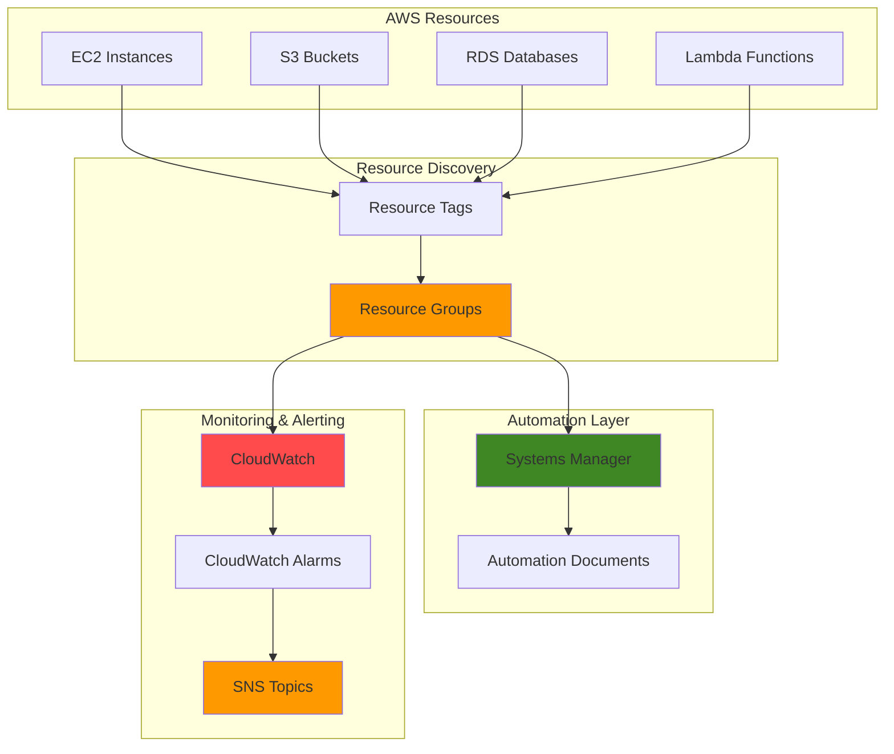

# Organizing Resources with Groups and Automated Management

## Problem

Large organizations struggle with managing hundreds of AWS resources scattered across multiple services, making it difficult to track costs, apply consistent policies, and maintain operational oversight. Manual resource management leads to configuration drift, missed security updates, and budget overruns due to lack of visibility into resource utilization patterns.

## Solution

Build an automated resource organization system using AWS Resource Groups to categorize resources by tags, AWS Systems Manager for automated management tasks, CloudWatch for monitoring resource health and costs, and SNS for proactive notifications. This solution provides centralized visibility, automated compliance enforcement, and cost optimization through intelligent resource grouping and monitoring.

## Architecture Diagram



## Prerequisites

1. AWS account with appropriate permissions for Resource Groups, Systems Manager, CloudWatch, and SNS
2. AWS CLI v2 installed and configured (or AWS CloudShell)
3. Basic understanding of AWS resource tagging strategies
4. Existing AWS resources to organize (EC2, S3, RDS, Lambda, etc.)
5. Estimated cost: $15-25/month for CloudWatch metrics and SNS notifications

> **Note**: This recipe assumes you have existing AWS resources that need organization. If you don't have resources, create a few test resources first with appropriate tags.

## Preparation

```bash
# Set environment variables
export AWS_REGION=$(aws configure get region)
export AWS_ACCOUNT_ID=$(aws sts get-caller-identity \
    --query Account --output text)

# Generate unique identifiers for resources
RANDOM_SUFFIX=$(aws secretsmanager get-random-password \
    --exclude-punctuation --exclude-uppercase \
    --password-length 6 --require-each-included-type \
    --output text --query RandomPassword)

# Set resource naming variables
export RESOURCE_GROUP_NAME="production-web-app-${RANDOM_SUFFIX}"
export SNS_TOPIC_NAME="resource-alerts-${RANDOM_SUFFIX}"
export CLOUDWATCH_DASHBOARD_NAME="resource-dashboard-${RANDOM_SUFFIX}"

# Create foundational SNS topic for notifications
aws sns create-topic \
    --name ${SNS_TOPIC_NAME} \
    --region ${AWS_REGION}

# Get the SNS topic ARN
export SNS_TOPIC_ARN=$(aws sns get-topic-attributes \
    --topic-arn "arn:aws:sns:${AWS_REGION}:${AWS_ACCOUNT_ID}:${SNS_TOPIC_NAME}" \
    --query 'Attributes.TopicArn' --output text)

echo "✅ AWS environment configured with SNS topic: ${SNS_TOPIC_ARN}"
```

## Steps

1. **Create Tag-Based Resource Group**:

   AWS Resource Groups enable you to organize resources using tags, providing a logical grouping mechanism that spans multiple AWS services. This approach allows you to manage resources as a cohesive unit rather than individually, simplifying operations and improving visibility across your infrastructure.

   ```bash
   # Create a resource group for production web application resources
   aws resource-groups create-group \
       --name ${RESOURCE_GROUP_NAME} \
       --description "Production web application resources" \
       --resource-query '{
           "Type": "TAG_FILTERS_1_0",
           "Query": "{\"ResourceTypeFilters\":[\"AWS::AllSupported\"],\"TagFilters\":[{\"Key\":\"Environment\",\"Values\":[\"production\"]},{\"Key\":\"Application\",\"Values\":[\"web-app\"]}]}"
       }' \
       --tags Environment=production,Application=web-app,Purpose=resource-management
   
   # Verify the resource group was created
   aws resource-groups get-group \
       --group-name ${RESOURCE_GROUP_NAME}
   
   echo "✅ Resource group created: ${RESOURCE_GROUP_NAME}"
   ```

   The resource group is now actively discovering and organizing resources based on your specified tags. This provides a centralized view of all resources belonging to your production web application, regardless of which AWS service they belong to.

2. **Configure Systems Manager for Automated Management**:

   Systems Manager Automation provides runbooks that can execute maintenance tasks across resource groups automatically. This enables consistent policy enforcement and operational procedures across your entire resource collection without manual intervention.

   ```bash
   # Create IAM role for Systems Manager automation
   aws iam create-role \
       --role-name ResourceGroupAutomationRole-${RANDOM_SUFFIX} \
       --assume-role-policy-document '{
           "Version": "2012-10-17",
           "Statement": [
               {
                   "Effect": "Allow",
                   "Principal": {
                       "Service": "ssm.amazonaws.com"
                   },
                   "Action": "sts:AssumeRole"
               }
           ]
       }'
   
   # Attach necessary policies for automation
   aws iam attach-role-policy \
       --role-name ResourceGroupAutomationRole-${RANDOM_SUFFIX} \
       --policy-arn arn:aws:iam::aws:policy/AmazonSSMAutomationRole
   
   # Create custom automation document for resource group management
   aws ssm create-document \
       --name "ResourceGroupMaintenance-${RANDOM_SUFFIX}" \
       --document-type "Automation" \
       --document-format "YAML" \
       --content '{
           "schemaVersion": "0.3",
           "description": "Automated maintenance for resource group",
           "assumeRole": "arn:aws:iam::'${AWS_ACCOUNT_ID}':role/ResourceGroupAutomationRole-'${RANDOM_SUFFIX}'",
           "parameters": {
               "ResourceGroupName": {
                   "type": "String",
                   "description": "Name of the resource group to process"
               }
           },
           "mainSteps": [
               {
                   "name": "GetResourceGroupResources",
                   "action": "aws:executeAwsApi",
                   "inputs": {
                       "Service": "resource-groups",
                       "Api": "ListGroupResources",
                       "GroupName": "{{ ResourceGroupName }}"
                   }
               }
           ]
       }'
   
   echo "✅ Systems Manager automation configured for resource group management"
   ```

   The automation framework is now ready to execute maintenance tasks across your resource group. This enables consistent operations and reduces manual overhead while ensuring compliance with organizational policies.

3. **Set Up CloudWatch Monitoring and Dashboards**:

   CloudWatch provides comprehensive monitoring capabilities for resource groups, enabling you to track performance metrics, resource utilization, and costs in real-time. This visibility is crucial for maintaining operational excellence and cost optimization.

   ```bash
   # Create CloudWatch dashboard for resource group monitoring
   aws cloudwatch put-dashboard \
       --dashboard-name ${CLOUDWATCH_DASHBOARD_NAME} \
       --dashboard-body '{
           "widgets": [
               {
                   "type": "metric",
                   "x": 0,
                   "y": 0,
                   "width": 12,
                   "height": 6,
                   "properties": {
                       "metrics": [
                           [ "AWS/EC2", "CPUUtilization", { "stat": "Average" } ],
                           [ "AWS/RDS", "CPUUtilization", { "stat": "Average" } ]
                       ],
                       "period": 300,
                       "stat": "Average",
                       "region": "'${AWS_REGION}'",
                       "title": "Resource Group CPU Utilization"
                   }
               },
               {
                   "type": "metric",
                   "x": 0,
                   "y": 6,
                   "width": 12,
                   "height": 6,
                   "properties": {
                       "metrics": [
                           [ "AWS/Billing", "EstimatedCharges", "Currency", "USD" ]
                       ],
                       "period": 86400,
                       "stat": "Maximum",
                       "region": "us-east-1",
                       "title": "Estimated Monthly Charges"
                   }
               }
           ]
       }'
   
   # Create CloudWatch alarm for high resource utilization
   aws cloudwatch put-metric-alarm \
       --alarm-name "ResourceGroup-HighCPU-${RANDOM_SUFFIX}" \
       --alarm-description "High CPU usage across resource group" \
       --metric-name CPUUtilization \
       --namespace AWS/EC2 \
       --statistic Average \
       --period 300 \
       --threshold 80 \
       --comparison-operator GreaterThanThreshold \
       --evaluation-periods 2 \
       --alarm-actions ${SNS_TOPIC_ARN} \
       --tags Key=Environment,Value=production Key=Application,Value=web-app
   
   echo "✅ CloudWatch monitoring configured with dashboard and alarms"
   ```

   The monitoring infrastructure now provides real-time visibility into resource performance and costs. This enables proactive management and early detection of performance issues or cost anomalies.

4. **Configure Cost Tracking and Budget Alerts**:

   Cost tracking through Resource Groups and CloudWatch enables precise budget monitoring and cost optimization. AWS Budgets provides early warning for budget overruns and helps identify cost optimization opportunities through integration with resource tags.

   ```bash
   # Create budget for resource group monitoring
   aws budgets create-budget \
       --account-id ${AWS_ACCOUNT_ID} \
       --budget '{
           "BudgetName": "ResourceGroup-Budget-'${RANDOM_SUFFIX}'",
           "BudgetLimit": {
               "Amount": "100",
               "Unit": "USD"
           },
           "TimeUnit": "MONTHLY",
           "BudgetType": "COST",
           "CostFilters": {
               "TagKey": ["Environment", "Application"],
               "TagValue": ["production", "web-app"]
           }
       }' \
       --notifications-with-subscribers '[
           {
               "Notification": {
                   "NotificationType": "ACTUAL",
                   "ComparisonOperator": "GREATER_THAN",
                   "Threshold": 80,
                   "ThresholdType": "PERCENTAGE"
               },
               "Subscribers": [
                   {
                       "SubscriptionType": "SNS",
                       "Address": "'${SNS_TOPIC_ARN}'"
                   }
               ]
           }
       ]'
   
   # Create cost anomaly detection for the resource group
   aws ce create-anomaly-detector \
       --anomaly-detector '{
           "DetectorName": "ResourceGroupAnomalyDetector-'${RANDOM_SUFFIX}'",
           "MonitorType": "DIMENSIONAL",
           "DimensionKey": "SERVICE",
           "MatchOptions": ["EQUALS"],
           "MonitorSpecification": "{\"TagKey\":\"Environment\",\"TagValues\":[\"production\"]}"
       }'
   
   echo "✅ Cost tracking and budget alerts configured"
   ```

   The cost management system now actively monitors spending patterns and will alert you to unusual cost spikes or budget threshold breaches. This enables proactive cost control and optimization.

5. **Create SNS Notification System**:

   SNS provides multi-channel notifications for resource group events, ensuring that critical alerts reach the right people through their preferred communication channels. This system enables rapid response to operational issues.

   ```bash
   # Subscribe email to SNS topic for notifications
   read -p "Enter email address for notifications: " EMAIL_ADDRESS
   
   aws sns subscribe \
       --topic-arn ${SNS_TOPIC_ARN} \
       --protocol email \
       --notification-endpoint ${EMAIL_ADDRESS}
   
   # Create additional alarm for resource group health
   aws cloudwatch put-metric-alarm \
       --alarm-name "ResourceGroup-HealthCheck-${RANDOM_SUFFIX}" \
       --alarm-description "Overall health monitoring for resource group" \
       --metric-name StatusCheckFailed \
       --namespace AWS/EC2 \
       --statistic Maximum \
       --period 300 \
       --threshold 0 \
       --comparison-operator GreaterThanThreshold \
       --evaluation-periods 1 \
       --alarm-actions ${SNS_TOPIC_ARN} \
       --treat-missing-data notBreaching
   
   # Test notification system
   aws sns publish \
       --topic-arn ${SNS_TOPIC_ARN} \
       --message "Resource Group monitoring system successfully configured" \
       --subject "AWS Resource Management System - Setup Complete"
   
   echo "✅ SNS notification system configured and tested"
   ```

   The notification system is now operational and will deliver alerts through multiple channels. Check your email for the confirmation message and the test notification to verify the system is working correctly.

6. **Implement Automated Resource Tagging**:

   Automated tagging ensures consistent resource organization and enables effective resource group management. This step creates a systematic approach to resource discovery and categorization using EventBridge to trigger tagging workflows.

   ```bash
   # Create Systems Manager document for automated tagging
   aws ssm create-document \
       --name "AutomatedResourceTagging-${RANDOM_SUFFIX}" \
       --document-type "Automation" \
       --document-format "YAML" \
       --content '{
           "schemaVersion": "0.3",
           "description": "Automated resource tagging for resource groups",
           "assumeRole": "arn:aws:iam::'${AWS_ACCOUNT_ID}':role/ResourceGroupAutomationRole-'${RANDOM_SUFFIX}'",
           "parameters": {
               "ResourceType": {
                   "type": "String",
                   "description": "Type of AWS resource to tag"
               },
               "TagKey": {
                   "type": "String",
                   "description": "Tag key to apply"
               },
               "TagValue": {
                   "type": "String",
                   "description": "Tag value to apply"
               }
           },
           "mainSteps": [
               {
                   "name": "TagResources",
                   "action": "aws:executeAwsApi",
                   "inputs": {
                       "Service": "resourcegroupstaggingapi",
                       "Api": "TagResources",
                       "ResourceARNList": [],
                       "Tags": {
                           "{{ TagKey }}": "{{ TagValue }}"
                       }
                   }
               }
           ]
       }'
   
   # Create EventBridge rule for automated tagging on resource creation
   aws events put-rule \
       --name "AutoTagNewResources-${RANDOM_SUFFIX}" \
       --event-pattern '{
           "source": ["aws.ec2", "aws.s3", "aws.rds"],
           "detail-type": ["AWS API Call via CloudTrail"],
           "detail": {
               "eventSource": ["ec2.amazonaws.com", "s3.amazonaws.com", "rds.amazonaws.com"],
               "eventName": ["RunInstances", "CreateBucket", "CreateDBInstance"]
           }
       }' \
       --state ENABLED
   
   echo "✅ Automated resource tagging system configured"
   ```

   The automated tagging system now ensures that new resources are properly categorized and included in resource groups automatically. This maintains organizational consistency as your infrastructure grows.

## Validation & Testing

1. **Verify Resource Group Creation and Population**:

   ```bash
   # Check resource group details
   aws resource-groups get-group \
       --group-name ${RESOURCE_GROUP_NAME} \
       --query 'Group.{Name:Name,Description:Description}'
   
   # List resources in the group
   aws resource-groups list-group-resources \
       --group-name ${RESOURCE_GROUP_NAME} \
       --query 'ResourceIdentifiers[*].ResourceArn'
   ```

   Expected output: JSON showing your resource group configuration and a list of ARNs for resources matching your tag criteria.

2. **Test CloudWatch Monitoring and Alerts**:

   ```bash
   # Verify CloudWatch dashboard exists
   aws cloudwatch get-dashboard \
       --dashboard-name ${CLOUDWATCH_DASHBOARD_NAME} \
       --query 'DashboardName'
   
   # Check alarm status
   aws cloudwatch describe-alarms \
       --alarm-names "ResourceGroup-HighCPU-${RANDOM_SUFFIX}" \
       --query 'MetricAlarms[0].{Name:AlarmName,State:StateValue}'
   
   # Test alarm notification
   aws cloudwatch set-alarm-state \
       --alarm-name "ResourceGroup-HighCPU-${RANDOM_SUFFIX}" \
       --state-value ALARM \
       --state-reason "Testing notification system"
   ```

   Expected output: Dashboard name confirmation, alarm state information, and a test notification sent to your email.

3. **Validate Systems Manager Automation**:

   ```bash
   # Execute automation document
   aws ssm start-automation-execution \
       --document-name "ResourceGroupMaintenance-${RANDOM_SUFFIX}" \
       --parameters "ResourceGroupName=${RESOURCE_GROUP_NAME}"
   
   # Check execution status
   EXECUTION_ID=$(aws ssm describe-automation-executions \
       --filters Key=DocumentName,Values=ResourceGroupMaintenance-${RANDOM_SUFFIX} \
       --query 'AutomationExecutions[0].AutomationExecutionId' --output text)
   
   aws ssm describe-automation-executions \
       --automation-execution-id ${EXECUTION_ID} \
       --query 'AutomationExecutions[0].AutomationExecutionStatus'
   ```

   Expected output: Automation execution ID and status showing successful completion.

## Cleanup

1. **Remove CloudWatch Resources**:

   ```bash
   # Delete CloudWatch alarms
   aws cloudwatch delete-alarms \
       --alarm-names "ResourceGroup-HighCPU-${RANDOM_SUFFIX}" \
                     "ResourceGroup-HealthCheck-${RANDOM_SUFFIX}"
   
   # Delete CloudWatch dashboard
   aws cloudwatch delete-dashboards \
       --dashboard-names ${CLOUDWATCH_DASHBOARD_NAME}
   
   echo "✅ CloudWatch resources deleted"
   ```

2. **Remove Systems Manager Resources**:

   ```bash
   # Delete automation documents
   aws ssm delete-document \
       --name "ResourceGroupMaintenance-${RANDOM_SUFFIX}"
   
   aws ssm delete-document \
       --name "AutomatedResourceTagging-${RANDOM_SUFFIX}"
   
   # Delete EventBridge rule
   aws events delete-rule \
       --name "AutoTagNewResources-${RANDOM_SUFFIX}"
   
   echo "✅ Systems Manager resources deleted"
   ```

3. **Remove Budget and Cost Monitoring**:

   ```bash
   # Delete budget
   aws budgets delete-budget \
       --account-id ${AWS_ACCOUNT_ID} \
       --budget-name "ResourceGroup-Budget-${RANDOM_SUFFIX}"
   
   # Delete cost anomaly detector
   DETECTOR_ARN=$(aws ce get-anomaly-detectors \
       --query 'AnomalyDetectors[?DetectorName==`ResourceGroupAnomalyDetector-'${RANDOM_SUFFIX}'`].AnomalyDetectorArn' --output text)
   
   aws ce delete-anomaly-detector \
       --anomaly-detector-arn ${DETECTOR_ARN}
   
   echo "✅ Cost monitoring resources deleted"
   ```

4. **Remove SNS and IAM Resources**:

   ```bash
   # Delete SNS topic
   aws sns delete-topic \
       --topic-arn ${SNS_TOPIC_ARN}
   
   # Delete IAM role and policies
   aws iam detach-role-policy \
       --role-name ResourceGroupAutomationRole-${RANDOM_SUFFIX} \
       --policy-arn arn:aws:iam::aws:policy/AmazonSSMAutomationRole
   
   aws iam delete-role \
       --role-name ResourceGroupAutomationRole-${RANDOM_SUFFIX}
   
   echo "✅ SNS and IAM resources deleted"
   ```

5. **Remove Resource Group**:

   ```bash
   # Delete resource group
   aws resource-groups delete-group \
       --group-name ${RESOURCE_GROUP_NAME}
   
   echo "✅ Resource group deleted"
   ```

## Discussion

AWS Resource Groups provide a powerful foundation for organizing and managing cloud resources at scale. This solution demonstrates how to leverage Resource Groups alongside Systems Manager, CloudWatch, and SNS to create a comprehensive resource management system that automates common operational tasks while providing proactive monitoring and alerting capabilities.

The tag-based approach to resource organization offers several advantages over traditional management methods. Tags provide a flexible, cross-service metadata system that enables logical grouping regardless of the underlying AWS service. This approach scales naturally as your infrastructure grows and allows for multiple overlapping organizational schemes (by environment, application, team, or cost center). The [AWS Resource Groups documentation](https://docs.aws.amazon.com/ARG/latest/userguide/resource-groups.html) provides comprehensive guidance on advanced querying and organizational strategies.

Systems Manager Automation extends the value of Resource Groups by enabling consistent operational procedures across grouped resources. The automation framework supports complex workflows that can span multiple AWS services, ensuring that maintenance tasks, security updates, and compliance checks are applied uniformly. This approach reduces operational overhead while improving consistency and reducing the risk of human error. The [AWS Systems Manager Automation documentation](https://docs.aws.amazon.com/systems-manager/latest/userguide/systems-manager-automation.html) offers detailed guidance on creating sophisticated automation workflows.

CloudWatch integration provides essential visibility into resource performance and costs, enabling data-driven decision making for resource optimization. The combination of metrics, alarms, and dashboards creates a comprehensive monitoring solution that can detect issues before they impact users. The [CloudWatch documentation](https://docs.aws.amazon.com/AmazonCloudWatch/latest/monitoring/WhatIsCloudWatch.html) explains advanced monitoring patterns and optimization strategies for large-scale deployments.

> **Tip**: Use AWS Config Rules with Resource Groups to ensure compliance and automatically remediate configuration drift across your organized resources. This adds another layer of automation to your resource management strategy.

## Challenge

Extend this solution by implementing these enhancements:

1. **Multi-Account Resource Management**: Configure cross-account resource groups using AWS Organizations and implement centralized monitoring across multiple AWS accounts for enterprise-scale resource management.

2. **Advanced Cost Optimization**: Implement AWS Cost Explorer integration with custom cost allocation tags and create automated rightsizing recommendations based on CloudWatch metrics and resource group membership.

3. **Security Compliance Automation**: Add AWS Config integration to automatically check resource compliance against organizational policies and trigger automated remediation through Systems Manager when violations are detected.

4. **Intelligent Resource Lifecycle Management**: Create Lambda functions that analyze resource usage patterns and automatically move underutilized resources to lower-cost storage classes or recommend resource termination based on defined criteria.

5. **Custom Metrics and Dashboards**: Develop custom CloudWatch metrics using Lambda functions that track business-specific KPIs across resource groups and create executive dashboards that show both technical and business metrics in real-time.

## Infrastructure Code

*Infrastructure code will be generated after recipe approval.*