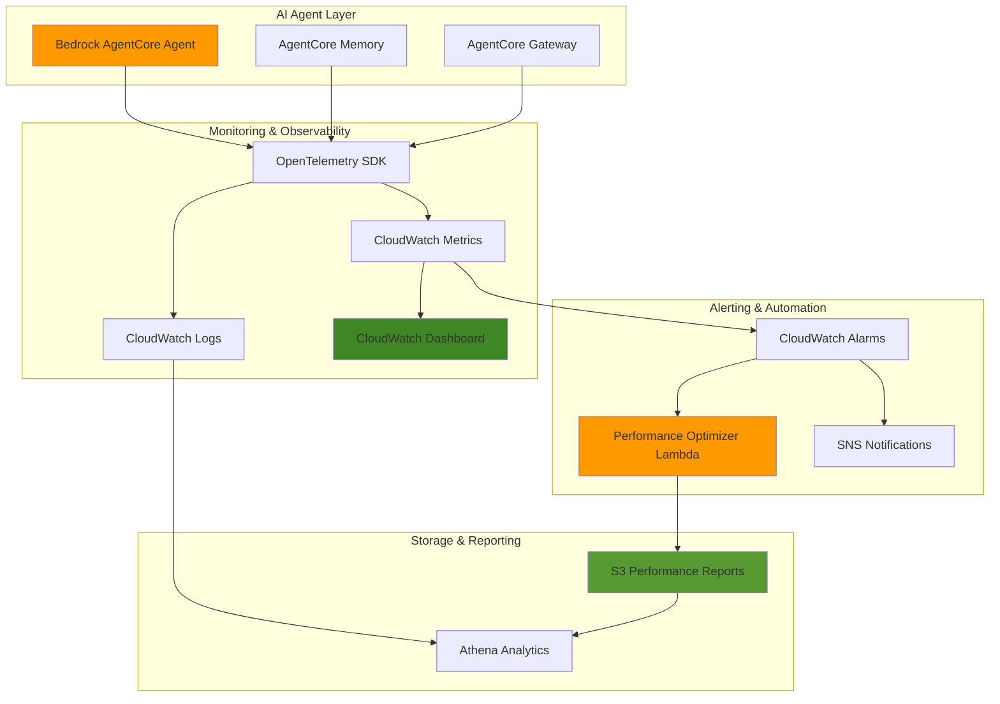

# Performance Monitoring AI Agents with AgentCore and CloudWatch

## Problem

Enterprise AI applications require comprehensive monitoring to ensure optimal performance, especially when AI agents are deployed in production environments serving critical business functions. Without proper observability, organizations struggle to identify performance bottlenecks, debug agent failures, optimize resource utilization, and maintain service level agreements for their AI-powered applications.

## Solution

Build a comprehensive monitoring system using AWS Bedrock AgentCore's built-in observability features, CloudWatch metrics and dashboards, and automated Lambda-based performance optimization alerts. This solution provides real-time visibility into agent execution paths, performance metrics, and automated remediation capabilities to ensure optimal AI agent performance in production environments.

## Architecture Diagram



## Prerequisites

1. AWS account with permissions for Bedrock AgentCore, CloudWatch, Lambda, S3, and IAM
2. AWS CLI v2 installed and configured
3. Basic understanding of AI agents, observability, and serverless monitoring
4. Knowledge of CloudWatch metrics, alarms, and Lambda functions
5. Estimated cost: $15-25 per month for monitoring stack (excluding agent compute costs)

> **Note**: Bedrock AgentCore is currently in preview and available at no charge during the preview period. Standard AWS pricing applies to CloudWatch, Lambda, and S3 services used in this monitoring solution.

## Preparation

```bash
# Set environment variables
export AWS_REGION=$(aws configure get region)
export AWS_ACCOUNT_ID=$(aws sts get-caller-identity \
    --query Account --output text)

# Generate unique identifiers for resources
RANDOM_SUFFIX=$(aws secretsmanager get-random-password \
    --exclude-punctuation --exclude-uppercase \
    --password-length 6 --require-each-included-type \
    --output text --query RandomPassword)

# Set resource names
export AGENT_NAME="ai-agent-${RANDOM_SUFFIX}"
export LAMBDA_FUNCTION_NAME="agent-performance-optimizer-${RANDOM_SUFFIX}"
export S3_BUCKET_NAME="agent-monitoring-data-${RANDOM_SUFFIX}"
export LOG_GROUP_NAME="/aws/bedrock/agentcore/${AGENT_NAME}"

# Create S3 bucket for monitoring data storage
aws s3 mb s3://${S3_BUCKET_NAME} --region ${AWS_REGION}

# Enable S3 bucket versioning and encryption
aws s3api put-bucket-versioning \
    --bucket ${S3_BUCKET_NAME} \
    --versioning-configuration Status=Enabled

aws s3api put-bucket-encryption \
    --bucket ${S3_BUCKET_NAME} \
    --server-side-encryption-configuration \
    'Rules=[{ApplyServerSideEncryptionByDefault:{SSEAlgorithm:AES256}}]'

echo "✅ AWS environment configured and S3 bucket created"
```

## Steps

1. **Create IAM Role for AgentCore with Observability Permissions**:

   AWS Bedrock AgentCore requires specific IAM permissions to emit telemetry data to CloudWatch and enable comprehensive observability. This role follows the principle of least privilege while ensuring all monitoring capabilities are properly enabled for production-grade agent deployments.

   ```bash
   # Create trust policy for AgentCore service
   cat > agentcore-trust-policy.json << EOF
   {
     "Version": "2012-10-17",
     "Statement": [
       {
         "Effect": "Allow",
         "Principal": {
           "Service": "bedrock.amazonaws.com"
         },
         "Action": "sts:AssumeRole"
       }
     ]
   }
   EOF
   
   # Create IAM role for AgentCore
   aws iam create-role \
       --role-name AgentCoreMonitoringRole-${RANDOM_SUFFIX} \
       --assume-role-policy-document file://agentcore-trust-policy.json
   
   # Create custom policy for AgentCore observability
   cat > agentcore-observability-policy.json << EOF
   {
     "Version": "2012-10-17",
     "Statement": [
       {
         "Effect": "Allow",
         "Action": [
           "logs:CreateLogGroup",
           "logs:CreateLogStream",
           "logs:PutLogEvents",
           "logs:DescribeLogGroups",
           "logs:DescribeLogStreams"
         ],
         "Resource": "arn:aws:logs:${AWS_REGION}:${AWS_ACCOUNT_ID}:log-group:/aws/bedrock/agentcore/*"
       },
       {
         "Effect": "Allow",
         "Action": [
           "cloudwatch:PutMetricData"
         ],
         "Resource": "*",
         "Condition": {
           "StringEquals": {
             "cloudwatch:namespace": "AWS/BedrockAgentCore"
           }
         }
       }
     ]
   }
   EOF
   
   # Create the custom policy
   aws iam create-policy \
       --policy-name AgentCoreObservabilityPolicy-${RANDOM_SUFFIX} \
       --policy-document file://agentcore-observability-policy.json
   
   # Attach the custom policy to the role
   aws iam attach-role-policy \
       --role-name AgentCoreMonitoringRole-${RANDOM_SUFFIX} \
       --policy-arn arn:aws:iam::${AWS_ACCOUNT_ID}:policy/AgentCoreObservabilityPolicy-${RANDOM_SUFFIX}
   
   # Store role ARN for later use
   export AGENTCORE_ROLE_ARN=$(aws iam get-role \
       --role-name AgentCoreMonitoringRole-${RANDOM_SUFFIX} \
       --query 'Role.Arn' --output text)
   
   echo "✅ AgentCore IAM role created with observability permissions"
   ```

   The IAM role now provides AgentCore with the necessary permissions to emit metrics, logs, and traces to CloudWatch while maintaining security best practices through service-linked policies.

2. **Configure CloudWatch Log Groups for AgentCore Observability**:

   CloudWatch Log Groups serve as the central repository for AgentCore telemetry data, enabling structured logging and efficient querying. Proper log group configuration is essential for capturing agent execution traces, performance metrics, and debugging information in production environments.

   ```bash
   # Create CloudWatch log group for AgentCore
   aws logs create-log-group \
       --log-group-name ${LOG_GROUP_NAME} \
       --retention-in-days 30
   
   # Create log group for custom metrics
   aws logs create-log-group \
       --log-group-name "/aws/lambda/${LAMBDA_FUNCTION_NAME}" \
       --retention-in-days 7
   
   # Create log group for memory operations
   aws logs create-log-group \
       --log-group-name "/aws/bedrock/agentcore/memory/${AGENT_NAME}" \
       --retention-in-days 30
   
   # Create log group for gateway operations
   aws logs create-log-group \
       --log-group-name "/aws/bedrock/agentcore/gateway/${AGENT_NAME}" \
       --retention-in-days 30
   
   echo "✅ CloudWatch log groups configured for comprehensive observability"
   ```

   The log groups are now configured with appropriate retention policies to balance cost optimization with observability requirements, following AWS Well-Architected Framework cost optimization principles.

3. **Create Performance Monitoring Lambda Function**:

   AWS Lambda provides serverless compute for processing CloudWatch metrics and implementing automated performance optimization logic. This function analyzes agent performance patterns and triggers remediation actions when performance thresholds are exceeded, enabling proactive performance management.

   ```bash
   # Create Lambda function code for performance monitoring
   cat > performance_monitor.py << EOF
   import json
   import boto3
   import os
   from datetime import datetime, timedelta
   
   cloudwatch = boto3.client('cloudwatch')
   s3 = boto3.client('s3')
   
   def lambda_handler(event, context):
       """
       Monitor AgentCore performance metrics and trigger optimization actions
       """
       try:
           # Handle direct CloudWatch alarm format
           if 'Records' in event:
               # SNS message format
               message = json.loads(event['Records'][0]['Sns']['Message'])
               alarm_name = message.get('AlarmName', 'Unknown')
               alarm_description = message.get('AlarmDescription', '')
               new_state = message.get('NewStateValue', 'UNKNOWN')
           else:
               # Direct invocation format
               alarm_name = event.get('AlarmName', 'TestAlarm')
               alarm_description = event.get('AlarmDescription', 'Test alarm')
               new_state = event.get('NewStateValue', 'ALARM')
           
           # Get performance metrics for the last 5 minutes
           end_time = datetime.utcnow()
           start_time = end_time - timedelta(minutes=5)
           
           # Query AgentCore metrics
           try:
               response = cloudwatch.get_metric_statistics(
                   Namespace='AWS/BedrockAgentCore',
                   MetricName='Latency',
                   Dimensions=[
                       {'Name': 'AgentId', 'Value': os.environ['AGENT_NAME']}
                   ],
                   StartTime=start_time,
                   EndTime=end_time,
                   Period=60,
                   Statistics=['Average', 'Maximum']
               )
           except Exception as metric_error:
               print(f"Warning: Could not retrieve metrics - {str(metric_error)}")
               response = {'Datapoints': []}
           
           # Analyze performance and create report
           performance_report = {
               'timestamp': end_time.isoformat(),
               'alarm_triggered': alarm_name,
               'alarm_description': alarm_description,
               'new_state': new_state,
               'metrics': response['Datapoints'],
               'optimization_actions': []
           }
           
           # Add optimization recommendations based on metrics
           if response['Datapoints']:
               avg_latency = sum(dp['Average'] for dp in response['Datapoints']) / len(response['Datapoints'])
               max_latency = max((dp['Maximum'] for dp in response['Datapoints']), default=0)
               
               if avg_latency > 30000:  # 30 seconds
                   performance_report['optimization_actions'].append({
                       'action': 'increase_memory_allocation',
                       'reason': f'High average latency detected: {avg_latency:.2f}ms'
                   })
               
               if max_latency > 60000:  # 60 seconds
                   performance_report['optimization_actions'].append({
                       'action': 'investigate_timeout_issues',
                       'reason': f'Maximum latency threshold exceeded: {max_latency:.2f}ms'
                   })
           else:
               performance_report['optimization_actions'].append({
                   'action': 'verify_agent_health',
                   'reason': 'No metric data available for analysis'
               })
           
           # Store performance report in S3
           report_key = f"performance-reports/{datetime.now().strftime('%Y/%m/%d')}/{alarm_name}-{context.aws_request_id}.json"
           s3.put_object(
               Bucket=os.environ['S3_BUCKET_NAME'],
               Key=report_key,
               Body=json.dumps(performance_report, indent=2),
               ContentType='application/json'
           )
           
           return {
               'statusCode': 200,
               'body': json.dumps({
                   'message': 'Performance analysis completed',
                   'report_location': f"s3://{os.environ['S3_BUCKET_NAME']}/{report_key}",
                   'optimization_actions': len(performance_report['optimization_actions'])
               })
           }
           
       except Exception as e:
           print(f"Error processing performance alert: {str(e)}")
           return {
               'statusCode': 500,
               'body': json.dumps({'error': str(e)})
           }
   EOF
   
   # Package Lambda function
   zip performance_monitor.zip performance_monitor.py
   
   # Create Lambda execution role
   cat > lambda-trust-policy.json << EOF
   {
     "Version": "2012-10-17",
     "Statement": [
       {
         "Effect": "Allow",
         "Principal": {
           "Service": "lambda.amazonaws.com"
         },
         "Action": "sts:AssumeRole"
       }
     ]
   }
   EOF
   
   aws iam create-role \
       --role-name LambdaPerformanceMonitorRole-${RANDOM_SUFFIX} \
       --assume-role-policy-document file://lambda-trust-policy.json
   
   # Attach necessary policies
   aws iam attach-role-policy \
       --role-name LambdaPerformanceMonitorRole-${RANDOM_SUFFIX} \
       --policy-arn arn:aws:iam::aws:policy/service-role/AWSLambdaBasicExecutionRole
   
   aws iam attach-role-policy \
       --role-name LambdaPerformanceMonitorRole-${RANDOM_SUFFIX} \
       --policy-arn arn:aws:iam::aws:policy/CloudWatchReadOnlyAccess
   
   aws iam attach-role-policy \
       --role-name LambdaPerformanceMonitorRole-${RANDOM_SUFFIX} \
       --policy-arn arn:aws:iam::aws:policy/AmazonS3FullAccess
   
   # Get Lambda role ARN
   export LAMBDA_ROLE_ARN=$(aws iam get-role \
       --role-name LambdaPerformanceMonitorRole-${RANDOM_SUFFIX} \
       --query 'Role.Arn' --output text)
   
   # Wait for role propagation
   sleep 10
   
   # Create Lambda function
   aws lambda create-function \
       --function-name ${LAMBDA_FUNCTION_NAME} \
       --runtime python3.12 \
       --role ${LAMBDA_ROLE_ARN} \
       --handler performance_monitor.lambda_handler \
       --zip-file fileb://performance_monitor.zip \
       --timeout 60 \
       --memory-size 256 \
       --environment Variables="{AGENT_NAME=${AGENT_NAME},S3_BUCKET_NAME=${S3_BUCKET_NAME}}"
   
   echo "✅ Performance monitoring Lambda function created"
   ```

   The Lambda function is now configured to process CloudWatch alarms and generate detailed performance reports, enabling automated analysis and optimization recommendations for AI agent performance.

4. **Create CloudWatch Dashboard for Agent Performance Visualization**:

   CloudWatch Dashboards provide centralized visualization of agent performance metrics, enabling real-time monitoring and historical trend analysis. This dashboard displays key performance indicators including latency, throughput, error rates, and resource utilization patterns.

   ```bash
   # Create comprehensive CloudWatch dashboard configuration
   cat > dashboard-config.json << EOF
   {
     "widgets": [
       {
         "type": "metric",
         "x": 0,
         "y": 0,
         "width": 12,
         "height": 6,
         "properties": {
           "metrics": [
             [ "AWS/BedrockAgentCore", "Latency", "AgentId", "${AGENT_NAME}" ],
             [ ".", "Invocations", ".", "." ],
             [ ".", "SessionCount", ".", "." ]
           ],
           "view": "timeSeries",
           "stacked": false,
           "region": "${AWS_REGION}",
           "title": "Agent Performance Metrics",
           "period": 300,
           "stat": "Average"
         }
       },
       {
         "type": "metric",
         "x": 12,
         "y": 0,
         "width": 12,
         "height": 6,
         "properties": {
           "metrics": [
             [ "AWS/BedrockAgentCore", "UserErrors", "AgentId", "${AGENT_NAME}" ],
             [ ".", "SystemErrors", ".", "." ],
             [ ".", "Throttles", ".", "." ]
           ],
           "view": "timeSeries",
           "stacked": false,
           "region": "${AWS_REGION}",
           "title": "Error and Throttle Rates",
           "period": 300,
           "stat": "Sum",
           "yAxis": {
             "left": {
               "min": 0
             }
           }
         }
       },
       {
         "type": "log",
         "x": 0,
         "y": 6,
         "width": 24,
         "height": 6,
         "properties": {
           "query": "SOURCE '${LOG_GROUP_NAME}' | fields @timestamp, @message\n| filter @message like /ERROR/\n| sort @timestamp desc\n| limit 20",
           "region": "${AWS_REGION}",
           "title": "Recent Agent Errors",
           "view": "table"
         }
       }
     ]
   }
   EOF
   
   # Create CloudWatch dashboard
   aws cloudwatch put-dashboard \
       --dashboard-name "AgentCore-Performance-${RANDOM_SUFFIX}" \
       --dashboard-body file://dashboard-config.json
   
   echo "✅ CloudWatch dashboard created for performance visualization"
   ```

   The dashboard provides comprehensive visibility into agent performance with real-time metrics visualization and error tracking capabilities, supporting proactive monitoring and troubleshooting workflows.

5. **Configure CloudWatch Alarms for Performance Thresholds**:

   CloudWatch Alarms enable proactive monitoring by triggering notifications and automated actions when performance metrics exceed defined thresholds. These alarms ensure rapid response to performance degradation and maintain service level agreements for AI agent applications.

   ```bash
   # Create alarm for high agent latency
   aws cloudwatch put-metric-alarm \
       --alarm-name "AgentCore-HighLatency-${RANDOM_SUFFIX}" \
       --alarm-description "Alert when agent latency exceeds 30 seconds" \
       --metric-name Latency \
       --namespace AWS/BedrockAgentCore \
       --statistic Average \
       --period 300 \
       --threshold 30000 \
       --comparison-operator GreaterThanThreshold \
       --evaluation-periods 2 \
       --alarm-actions arn:aws:lambda:${AWS_REGION}:${AWS_ACCOUNT_ID}:function:${LAMBDA_FUNCTION_NAME} \
       --dimensions Name=AgentId,Value=${AGENT_NAME}
   
   # Create alarm for high system error rate
   aws cloudwatch put-metric-alarm \
       --alarm-name "AgentCore-HighSystemErrors-${RANDOM_SUFFIX}" \
       --alarm-description "Alert when system errors exceed threshold" \
       --metric-name SystemErrors \
       --namespace AWS/BedrockAgentCore \
       --statistic Sum \
       --period 300 \
       --threshold 5 \
       --comparison-operator GreaterThanThreshold \
       --evaluation-periods 1 \
       --alarm-actions arn:aws:lambda:${AWS_REGION}:${AWS_ACCOUNT_ID}:function:${LAMBDA_FUNCTION_NAME} \
       --dimensions Name=AgentId,Value=${AGENT_NAME} \
       --treat-missing-data notBreaching
   
   # Create alarm for throttling monitoring
   aws cloudwatch put-metric-alarm \
       --alarm-name "AgentCore-HighThrottles-${RANDOM_SUFFIX}" \
       --alarm-description "Alert when throttling occurs frequently" \
       --metric-name Throttles \
       --namespace AWS/BedrockAgentCore \
       --statistic Sum \
       --period 300 \
       --threshold 10 \
       --comparison-operator GreaterThanThreshold \
       --evaluation-periods 2 \
       --alarm-actions arn:aws:lambda:${AWS_REGION}:${AWS_ACCOUNT_ID}:function:${LAMBDA_FUNCTION_NAME} \
       --dimensions Name=AgentId,Value=${AGENT_NAME} \
       --treat-missing-data notBreaching
   
   # Grant CloudWatch permission to invoke Lambda
   aws lambda add-permission \
       --function-name ${LAMBDA_FUNCTION_NAME} \
       --statement-id allow-cloudwatch-alarms \
       --action lambda:InvokeFunction \
       --principal cloudwatch.amazonaws.com \
       --source-account ${AWS_ACCOUNT_ID}
   
   echo "✅ CloudWatch alarms configured for performance monitoring"
   ```

   The alarm system now provides comprehensive coverage of key performance indicators with automated response capabilities, ensuring rapid detection and remediation of performance issues.

6. **Set Up Custom Metrics Collection for Advanced Analytics**:

   Custom metrics provide additional insights beyond the standard AgentCore metrics, enabling detailed analysis of business-specific performance indicators. This configuration establishes custom metric collection for agent conversation quality, user satisfaction, and business outcome tracking.

   ```bash
   # Create custom metric namespace and filters
   aws logs put-metric-filter \
       --log-group-name ${LOG_GROUP_NAME} \
       --filter-name "AgentResponseTime" \
       --filter-pattern "[timestamp, requestId, level=INFO, metric=\"response_time\", value]" \
       --metric-transformations \
         metricName=AgentResponseTime,metricNamespace=CustomAgentMetrics,metricValue='$value',defaultValue=0
   
   # Create metric filter for conversation quality scores
   aws logs put-metric-filter \
       --log-group-name ${LOG_GROUP_NAME} \
       --filter-name "ConversationQualityScore" \
       --filter-pattern "[timestamp, requestId, level=INFO, metric=\"quality_score\", score]" \
       --metric-transformations \
         metricName=ConversationQuality,metricNamespace=CustomAgentMetrics,metricValue='$score',defaultValue=0
   
   # Create metric filter for business outcome tracking
   aws logs put-metric-filter \
       --log-group-name ${LOG_GROUP_NAME} \
       --filter-name "BusinessOutcomeSuccess" \
       --filter-pattern "[timestamp, requestId, level=INFO, outcome=\"SUCCESS\"]" \
       --metric-transformations \
         metricName=BusinessOutcomeSuccess,metricNamespace=CustomAgentMetrics,metricValue=1,defaultValue=0
   
   echo "✅ Custom metrics collection configured for advanced analytics"
   ```

   Custom metrics collection now provides enhanced visibility into agent performance characteristics that are specific to business requirements and user experience optimization.

## Validation & Testing

1. Verify CloudWatch dashboard displays agent metrics:

   ```bash
   # Check if dashboard was created successfully
   aws cloudwatch get-dashboard \
       --dashboard-name "AgentCore-Performance-${RANDOM_SUFFIX}"
   
   # List available metrics for the agent namespace
   aws cloudwatch list-metrics \
       --namespace AWS/BedrockAgentCore \
       --dimensions Name=AgentId,Value=${AGENT_NAME}
   ```

   Expected output: Dashboard configuration JSON and list of available metrics for the agent.

2. Test CloudWatch alarm functionality:

   ```bash
   # List created alarms
   aws cloudwatch describe-alarms \
       --alarm-names "AgentCore-HighLatency-${RANDOM_SUFFIX}" \
               "AgentCore-HighSystemErrors-${RANDOM_SUFFIX}" \
               "AgentCore-HighThrottles-${RANDOM_SUFFIX}"
   
   # Test Lambda function can be invoked
   aws lambda invoke \
       --function-name ${LAMBDA_FUNCTION_NAME} \
       --payload '{"AlarmName":"TestAlarm","AlarmDescription":"Test","NewStateValue":"ALARM"}' \
       response.json
   
   cat response.json
   ```

   Expected output: Alarm configurations showing INSUFFICIENT_DATA state and successful Lambda invocation response.

3. Verify log groups and metric filters:

   ```bash
   # Check log groups were created
   aws logs describe-log-groups \
       --log-group-name-prefix "/aws/bedrock/agentcore/"
   
   # Verify metric filters
   aws logs describe-metric-filters \
       --log-group-name ${LOG_GROUP_NAME}
   ```

   Expected output: List of created log groups and configured metric filters for custom metrics collection.

## Cleanup

1. Remove CloudWatch alarms and dashboard:

   ```bash
   # Delete CloudWatch alarms
   aws cloudwatch delete-alarms \
       --alarm-names "AgentCore-HighLatency-${RANDOM_SUFFIX}" \
               "AgentCore-HighSystemErrors-${RANDOM_SUFFIX}" \
               "AgentCore-HighThrottles-${RANDOM_SUFFIX}"
   
   # Delete CloudWatch dashboard
   aws cloudwatch delete-dashboards \
       --dashboard-names "AgentCore-Performance-${RANDOM_SUFFIX}"
   
   echo "✅ CloudWatch alarms and dashboard deleted"
   ```

2. Remove Lambda function and related resources:

   ```bash
   # Delete Lambda function
   aws lambda delete-function \
       --function-name ${LAMBDA_FUNCTION_NAME}
   
   # Delete Lambda IAM role and policies
   aws iam detach-role-policy \
       --role-name LambdaPerformanceMonitorRole-${RANDOM_SUFFIX} \
       --policy-arn arn:aws:iam::aws:policy/service-role/AWSLambdaBasicExecutionRole
   
   aws iam detach-role-policy \
       --role-name LambdaPerformanceMonitorRole-${RANDOM_SUFFIX} \
       --policy-arn arn:aws:iam::aws:policy/CloudWatchReadOnlyAccess
   
   aws iam detach-role-policy \
       --role-name LambdaPerformanceMonitorRole-${RANDOM_SUFFIX} \
       --policy-arn arn:aws:iam::aws:policy/AmazonS3FullAccess
   
   aws iam delete-role \
       --role-name LambdaPerformanceMonitorRole-${RANDOM_SUFFIX}
   
   echo "✅ Lambda function and IAM role deleted"
   ```

3. Remove CloudWatch log groups and metric filters:

   ```bash
   # Delete metric filters first
   aws logs delete-metric-filter \
       --log-group-name ${LOG_GROUP_NAME} \
       --filter-name "AgentResponseTime"
   
   aws logs delete-metric-filter \
       --log-group-name ${LOG_GROUP_NAME} \
       --filter-name "ConversationQualityScore"
   
   aws logs delete-metric-filter \
       --log-group-name ${LOG_GROUP_NAME} \
       --filter-name "BusinessOutcomeSuccess"
   
   # Delete log groups
   aws logs delete-log-group --log-group-name ${LOG_GROUP_NAME}
   aws logs delete-log-group --log-group-name "/aws/lambda/${LAMBDA_FUNCTION_NAME}"
   aws logs delete-log-group --log-group-name "/aws/bedrock/agentcore/memory/${AGENT_NAME}"
   aws logs delete-log-group --log-group-name "/aws/bedrock/agentcore/gateway/${AGENT_NAME}"
   
   echo "✅ CloudWatch log groups and metric filters deleted"
   ```

4. Remove S3 bucket and AgentCore IAM role:

   ```bash
   # Empty and delete S3 bucket
   aws s3 rm s3://${S3_BUCKET_NAME} --recursive
   aws s3 rb s3://${S3_BUCKET_NAME}
   
   # Delete AgentCore IAM role
   aws iam detach-role-policy \
       --role-name AgentCoreMonitoringRole-${RANDOM_SUFFIX} \
       --policy-arn arn:aws:iam::${AWS_ACCOUNT_ID}:policy/AgentCoreObservabilityPolicy-${RANDOM_SUFFIX}
   
   aws iam delete-policy \
       --policy-arn arn:aws:iam::${AWS_ACCOUNT_ID}:policy/AgentCoreObservabilityPolicy-${RANDOM_SUFFIX}
   
   aws iam delete-role \
       --role-name AgentCoreMonitoringRole-${RANDOM_SUFFIX}
   
   # Clean up local files
   rm -f agentcore-trust-policy.json lambda-trust-policy.json
   rm -f agentcore-observability-policy.json dashboard-config.json
   rm -f performance_monitor.py performance_monitor.zip response.json
   
   echo "✅ All resources cleaned up successfully"
   ```

## Discussion

This comprehensive monitoring solution leverages AWS Bedrock AgentCore's built-in observability features combined with CloudWatch's powerful monitoring and alerting capabilities. The architecture follows the AWS Well-Architected Framework's operational excellence pillar by implementing automated monitoring, alerting, and remediation workflows that ensure optimal AI agent performance in production environments.

AWS Bedrock AgentCore provides native OpenTelemetry integration, which standardizes telemetry data collection and enables seamless integration with existing monitoring infrastructure. The service automatically emits key performance metrics including invocations, session count, latency, throttles, and error rates, providing comprehensive visibility into agent operational health. According to the [AWS Bedrock AgentCore observability documentation](https://docs.aws.amazon.com/bedrock-agentcore/latest/devguide/observability.html), this telemetry data is stored in CloudWatch Logs and can be visualized through curated dashboards in the CloudWatch console.

The Lambda-based performance optimization function demonstrates how to implement automated response to performance degradation events. By analyzing CloudWatch metrics and generating detailed reports stored in S3, organizations can build historical performance baselines and implement machine learning-based performance prediction models. This approach aligns with the reliability pillar of the Well-Architected Framework by enabling proactive performance management and automated failure recovery. The function handles both direct alarm invocations and SNS message formats, providing flexibility for different alerting scenarios.

Custom metric filters extend the monitoring capabilities beyond standard AgentCore metrics to include business-specific indicators such as conversation quality scores and business outcome success rates. This comprehensive approach to observability enables data-driven optimization of AI agent performance and user experience. The [CloudWatch Logs Insights documentation](https://docs.aws.amazon.com/AmazonCloudWatch/latest/logs/AnalyzingLogData.html) provides guidance on advanced log analysis patterns that can further enhance agent performance insights.

> **Tip**: Configure CloudWatch Composite Alarms to implement sophisticated alerting logic that combines multiple metrics, reducing false positives and improving alert precision for complex AI agent performance scenarios.

## Challenge

Extend this monitoring solution by implementing these advanced capabilities:

1. **Real-time Performance Analytics**: Integrate Amazon Kinesis Data Analytics to process AgentCore metrics in real-time and implement dynamic performance threshold adjustment based on usage patterns and historical data analysis.

2. **Multi-Agent Fleet Management**: Expand the monitoring system to support multiple AgentCore agents across different environments (development, staging, production) with centralized dashboards and cross-agent performance correlation analysis.

3. **Predictive Performance Optimization**: Implement Amazon SageMaker models that analyze historical performance data to predict potential performance degradation and proactively trigger optimization actions before issues impact users.

4. **Cost Optimization Integration**: Enhance the Lambda function to correlate performance metrics with AWS Cost Explorer data, providing insights into cost-per-conversation and enabling cost-aware performance optimization decisions.

5. **Advanced Anomaly Detection**: Utilize Amazon CloudWatch Anomaly Detection to automatically learn normal performance patterns and alert on statistical anomalies that might indicate emerging performance issues or security threats.

## Infrastructure Code

*Infrastructure code will be generated after recipe approval.*