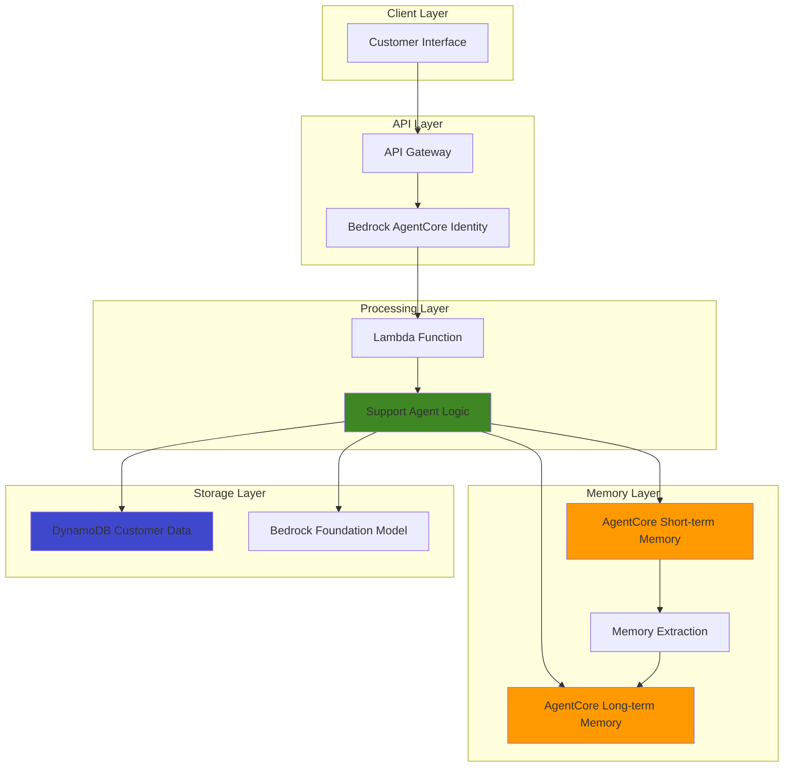

# Persistent Customer Support Agent with Bedrock AgentCore Memory

## Problem

Customer support teams struggle with fragmented conversations where agents lose context between sessions, leading to customers repeatedly explaining their issues and decreased satisfaction. Traditional chatbots fail to remember customer preferences, past interactions, or problem resolution history across multiple touchpoints, resulting in inefficient support workflows and frustrated customers who expect personalized, context-aware assistance.

## Solution

Build an intelligent customer support agent using Amazon Bedrock AgentCore Memory to maintain persistent context across sessions, Lambda functions for conversation processing, DynamoDB for customer metadata storage, and API Gateway for secure client interactions. This solution leverages both short-term memory for within-session context and long-term memory to retain customer preferences, issue history, and personalized insights across multiple support interactions.

## Architecture Diagram



## Prerequisites

1. AWS account with permissions for Bedrock AgentCore, Lambda, DynamoDB, and API Gateway
2. AWS CLI v2 installed and configured (or AWS CloudShell)
3. Basic understanding of serverless architectures and customer support workflows
4. Familiarity with Python programming for Lambda functions
5. Estimated cost: $5-15 for initial testing (varies by usage and region)

> **Note**: Bedrock AgentCore is in preview and requires service activation. Ensure your region supports AgentCore services before proceeding.

## Preparation

```bash
# Set environment variables
export AWS_REGION=$(aws configure get region)
export AWS_ACCOUNT_ID=$(aws sts get-caller-identity \
    --query Account --output text)

# Generate unique identifiers for resources
RANDOM_SUFFIX=$(aws secretsmanager get-random-password \
    --exclude-punctuation --exclude-uppercase \
    --password-length 6 --require-each-included-type \
    --output text --query RandomPassword)

# Set resource names
export MEMORY_NAME="customer-support-memory-${RANDOM_SUFFIX}"
export LAMBDA_FUNCTION_NAME="support-agent-${RANDOM_SUFFIX}"
export DDB_TABLE_NAME="customer-data-${RANDOM_SUFFIX}"
export API_NAME="support-api-${RANDOM_SUFFIX}"

# Create DynamoDB table for customer metadata
aws dynamodb create-table \
    --table-name ${DDB_TABLE_NAME} \
    --attribute-definitions \
        AttributeName=customerId,AttributeType=S \
    --key-schema \
        AttributeName=customerId,KeyType=HASH \
    --provisioned-throughput \
        ReadCapacityUnits=5,WriteCapacityUnits=5 \
    --tags Key=Purpose,Value=CustomerSupport

echo "✅ Environment configured with resources: ${MEMORY_NAME}, ${LAMBDA_FUNCTION_NAME}"
```

## Steps

1. **Create AgentCore Memory for Persistent Context**:

   Amazon Bedrock AgentCore Memory provides enterprise-grade memory management for AI agents, supporting both short-term session context and long-term customer insights. The memory service automatically extracts structured information from raw conversations, enabling personalized support experiences across multiple sessions and touchpoints.

   ```bash
   # Create AgentCore Memory with built-in strategies
   aws bedrock-agentcore-control create-memory \
       --name ${MEMORY_NAME} \
       --description "Customer support agent memory" \
       --event-expiry-duration "P30D" \
       --memory-strategies '[
           {
               "summarization": {
                   "enabled": true
               }
           },
           {
               "semantic_memory": {
                   "enabled": true
               }
           },
           {
               "user_preferences": {
                   "enabled": true
               }
           }
       ]'

   # Store memory ID for later use
   MEMORY_ID=$(aws bedrock-agentcore-control get-memory \
       --name ${MEMORY_NAME} \
       --query 'memory.memoryId' \
       --output text)

   echo "✅ AgentCore Memory created with ID: ${MEMORY_ID}"
   ```

   The memory configuration enables three key strategies: summarization for conversation overviews, semantic memory for facts and knowledge extraction, and user preferences for personalization. This multi-strategy approach ensures comprehensive context preservation across customer interactions.

2. **Create IAM Role for Lambda Function**:

   The Lambda execution role requires comprehensive permissions to interact with AgentCore Memory, DynamoDB for customer data, and Bedrock for AI model inference. This follows the principle of least privilege while enabling all necessary service integrations for the customer support agent.

   ```bash
   # Create trust policy for Lambda
   cat > trust-policy.json << 'EOF'
   {
       "Version": "2012-10-17",
       "Statement": [
           {
               "Effect": "Allow",
               "Principal": {
                   "Service": "lambda.amazonaws.com"
               },
               "Action": "sts:AssumeRole"
           }
       ]
   }
   EOF

   # Create IAM role
   aws iam create-role \
       --role-name ${LAMBDA_FUNCTION_NAME}-role \
       --assume-role-policy-document file://trust-policy.json

   # Create permissions policy
   cat > permissions-policy.json << EOF
   {
       "Version": "2012-10-17",
       "Statement": [
           {
               "Effect": "Allow",
               "Action": [
                   "logs:CreateLogGroup",
                   "logs:CreateLogStream",
                   "logs:PutLogEvents"
               ],
               "Resource": "*"
           },
           {
               "Effect": "Allow",
               "Action": [
                   "bedrock-agentcore:CreateEvent",
                   "bedrock-agentcore:ListSessions",
                   "bedrock-agentcore:ListEvents",
                   "bedrock-agentcore:GetEvent",
                   "bedrock-agentcore:RetrieveMemoryRecords"
               ],
               "Resource": "*"
           },
           {
               "Effect": "Allow",
               "Action": [
                   "bedrock:InvokeModel"
               ],
               "Resource": "arn:aws:bedrock:${AWS_REGION}::foundation-model/*"
           },
           {
               "Effect": "Allow",
               "Action": [
                   "dynamodb:GetItem",
                   "dynamodb:PutItem",
                   "dynamodb:UpdateItem",
                   "dynamodb:Query"
               ],
               "Resource": "arn:aws:dynamodb:${AWS_REGION}:${AWS_ACCOUNT_ID}:table/${DDB_TABLE_NAME}"
           }
       ]
   }
   EOF

   # Attach policies to role
   aws iam put-role-policy \
       --role-name ${LAMBDA_FUNCTION_NAME}-role \
       --policy-name SupportAgentPolicy \
       --policy-document file://permissions-policy.json

   aws iam attach-role-policy \
       --role-name ${LAMBDA_FUNCTION_NAME}-role \
       --policy-arn arn:aws:iam::aws:policy/service-role/AWSLambdaBasicExecutionRole

   # Wait for role to be ready
   sleep 10

   # Get role ARN
   LAMBDA_ROLE_ARN=$(aws iam get-role \
       --role-name ${LAMBDA_FUNCTION_NAME}-role \
       --query 'Role.Arn' --output text)

   echo "✅ IAM role created: ${LAMBDA_ROLE_ARN}"
   ```

3. **Create Lambda Function for Support Agent Logic**:

   The Lambda function serves as the central processing unit for customer support interactions, integrating with AgentCore Memory to maintain context and leveraging Bedrock foundation models for intelligent responses. This serverless approach ensures automatic scaling based on support volume while maintaining consistent performance.

   ```bash
   # Create Lambda function code
   cat > lambda_function.py << 'EOF'
   import json
   import boto3
   import os
   from datetime import datetime

   bedrock_agentcore = boto3.client('bedrock-agentcore')
   bedrock_runtime = boto3.client('bedrock-runtime')
   dynamodb = boto3.resource('dynamodb')

   def lambda_handler(event, context):
       try:
           # Parse incoming request
           body = json.loads(event['body']) if 'body' in event else event
           customer_id = body.get('customerId')
           message = body.get('message')
           session_id = body.get('sessionId', f"session-{customer_id}-{int(datetime.now().timestamp())}")
           
           # Retrieve customer context from DynamoDB
           table = dynamodb.Table(os.environ['DDB_TABLE_NAME'])
           customer_data = get_customer_data(table, customer_id)
           
           # Retrieve relevant memories from AgentCore
           memory_context = retrieve_memory_context(customer_id, message)
           
           # Generate AI response using Bedrock
           ai_response = generate_support_response(message, memory_context, customer_data)
           
           # Store interaction in AgentCore Memory
           store_interaction(customer_id, session_id, message, ai_response)
           
           # Update customer data if needed
           update_customer_data(table, customer_id, body.get('metadata', {}))
           
           return {
               'statusCode': 200,
               'headers': {
                   'Content-Type': 'application/json',
                   'Access-Control-Allow-Origin': '*'
               },
               'body': json.dumps({
                   'response': ai_response,
                   'sessionId': session_id,
                   'customerId': customer_id
               })
           }
           
       except Exception as e:
           print(f"Error: {str(e)}")
           return {
               'statusCode': 500,
               'body': json.dumps({'error': 'Internal server error'})
           }

   def get_customer_data(table, customer_id):
       try:
           response = table.get_item(Key={'customerId': customer_id})
           return response.get('Item', {})
       except Exception as e:
           print(f"Error retrieving customer data: {e}")
           return {}

   def retrieve_memory_context(customer_id, query):
       try:
           response = bedrock_agentcore.retrieve_memory_records(
               memoryId=os.environ['MEMORY_ID'],
               query=query,
               filter={'customerId': customer_id},
               maxResults=5
           )
           return [record['content'] for record in response.get('memoryRecords', [])]
       except Exception as e:
           print(f"Error retrieving memory: {e}")
           return []

   def generate_support_response(message, memory_context, customer_data):
       try:
           # Prepare context for AI model
           context = f"""
           Customer Support Context:
           - Previous interactions: {'; '.join(memory_context)}
           - Customer profile: {json.dumps(customer_data)}
           - Current query: {message}
           
           Provide a helpful, personalized response based on the customer's history and current request.
           Be empathetic, professional, and reference relevant past interactions when appropriate.
           """
           
           # Invoke Bedrock model
           response = bedrock_runtime.invoke_model(
               modelId='anthropic.claude-3-haiku-20240307-v1:0',
               body=json.dumps({
                   'anthropic_version': 'bedrock-2023-05-31',
                   'max_tokens': 500,
                   'messages': [
                       {
                           'role': 'user',
                           'content': context
                       }
                   ]
               })
           )
           
           result = json.loads(response['body'].read())
           return result['content'][0]['text']
           
       except Exception as e:
           print(f"Error generating response: {e}")
           return "I apologize, but I'm experiencing technical difficulties. Please try again or contact support."

   def store_interaction(customer_id, session_id, user_message, agent_response):
       try:
           # Store user message
           bedrock_agentcore.create_event(
               memoryId=os.environ['MEMORY_ID'],
               sessionId=session_id,
               eventData={
                   'type': 'user_message',
                   'customerId': customer_id,
                   'content': user_message,
                   'timestamp': datetime.now().isoformat()
               }
           )
           
           # Store agent response
           bedrock_agentcore.create_event(
               memoryId=os.environ['MEMORY_ID'],
               sessionId=session_id,
               eventData={
                   'type': 'agent_response',
                   'customerId': customer_id,
                   'content': agent_response,
                   'timestamp': datetime.now().isoformat()
               }
           )
       except Exception as e:
           print(f"Error storing interaction: {e}")

   def update_customer_data(table, customer_id, metadata):
       try:
           if metadata:
               table.put_item(
                   Item={
                       'customerId': customer_id,
                       'lastInteraction': datetime.now().isoformat(),
                       **metadata
                   }
               )
       except Exception as e:
           print(f"Error updating customer data: {e}")
   EOF

   # Create deployment package
   zip -r function.zip lambda_function.py

   # Create Lambda function
   aws lambda create-function \
       --function-name ${LAMBDA_FUNCTION_NAME} \
       --runtime python3.11 \
       --role ${LAMBDA_ROLE_ARN} \
       --handler lambda_function.lambda_handler \
       --zip-file fileb://function.zip \
       --timeout 30 \
       --memory-size 512 \
       --environment Variables="{
           MEMORY_ID=${MEMORY_ID},
           DDB_TABLE_NAME=${DDB_TABLE_NAME}
       }"

   echo "✅ Lambda function created: ${LAMBDA_FUNCTION_NAME}"
   ```

   The Lambda function integrates multiple AWS services to provide intelligent customer support: it retrieves customer history from DynamoDB, queries AgentCore Memory for relevant context, generates personalized responses using Bedrock models, and stores new interactions for future context. This architecture ensures each customer interaction builds upon previous knowledge while maintaining session continuity.

4. **Create API Gateway for Client Access**:

   API Gateway provides a secure, scalable entry point for customer support interactions with built-in authentication, throttling, and monitoring capabilities. The REST API design enables seamless integration with web applications, mobile apps, and other client interfaces while maintaining consistent access patterns.

   ```bash
   # Create REST API
   API_ID=$(aws apigateway create-rest-api \
       --name ${API_NAME} \
       --description "Customer Support Agent API" \
       --query 'id' --output text)

   # Get root resource ID
   ROOT_RESOURCE_ID=$(aws apigateway get-resources \
       --rest-api-id ${API_ID} \
       --query 'items[0].id' --output text)

   # Create support resource
   SUPPORT_RESOURCE_ID=$(aws apigateway create-resource \
       --rest-api-id ${API_ID} \
       --parent-id ${ROOT_RESOURCE_ID} \
       --path-part support \
       --query 'id' --output text)

   # Create POST method
   aws apigateway put-method \
       --rest-api-id ${API_ID} \
       --resource-id ${SUPPORT_RESOURCE_ID} \
       --http-method POST \
       --authorization-type NONE

   # Get Lambda function ARN for integration
   LAMBDA_ARN=$(aws lambda get-function \
       --function-name ${LAMBDA_FUNCTION_NAME} \
       --query 'Configuration.FunctionArn' --output text)

   # Configure Lambda integration
   aws apigateway put-integration \
       --rest-api-id ${API_ID} \
       --resource-id ${SUPPORT_RESOURCE_ID} \
       --http-method POST \
       --type AWS_PROXY \
       --integration-http-method POST \
       --uri "arn:aws:apigateway:${AWS_REGION}:lambda:path/2015-03-31/functions/${LAMBDA_ARN}/invocations"

   # Add Lambda permission for API Gateway
   aws lambda add-permission \
       --function-name ${LAMBDA_FUNCTION_NAME} \
       --statement-id api-gateway-invoke \
       --action lambda:InvokeFunction \
       --principal apigateway.amazonaws.com \
       --source-arn "arn:aws:execute-api:${AWS_REGION}:${AWS_ACCOUNT_ID}:${API_ID}/*/*"

   # Deploy API
   aws apigateway create-deployment \
       --rest-api-id ${API_ID} \
       --stage-name prod

   # Get API endpoint
   API_ENDPOINT="https://${API_ID}.execute-api.${AWS_REGION}.amazonaws.com/prod"

   echo "✅ API Gateway created: ${API_ENDPOINT}/support"
   ```

   The API Gateway deployment creates a production-ready endpoint with Lambda proxy integration, enabling seamless request forwarding and response handling. This configuration supports JSON payloads for customer support requests and automatically manages CORS headers for web-based client applications.

5. **Configure Memory Extraction Strategies**:

   AgentCore Memory's extraction strategies automatically process raw conversations to identify key insights, customer preferences, and factual information. This background processing ensures that valuable context is preserved and made searchable across future support interactions without impacting real-time response performance.

   ```bash
   # Update memory with custom extraction strategy
   cat > memory-strategy.json << 'EOF'
   {
       "custom": {
           "enabled": true,
           "systemPrompt": "Extract the following from customer support conversations: 1) Customer preferences and requirements, 2) Technical issues and their resolutions, 3) Product interests and purchasing intent, 4) Satisfaction levels and feedback. Focus on actionable insights that improve future support interactions.",
           "modelId": "anthropic.claude-3-haiku-20240307-v1:0"
       }
   }
   EOF

   # Add custom strategy to memory
   aws bedrock-agentcore-control update-memory \
       --name ${MEMORY_NAME} \
       --add-memory-strategies file://memory-strategy.json

   echo "✅ Memory extraction strategies configured"
   ```

   The custom extraction strategy complements built-in strategies by focusing on customer support-specific insights such as technical resolution patterns, satisfaction indicators, and product preferences. This domain-specific approach ensures that the most relevant information for future support interactions is captured and made searchable.

6. **Create Test Customer Data**:

   Sample customer data demonstrates the system's ability to maintain customer context and preferences across sessions. This foundational data enables personalized support experiences by providing agent context about customer history, preferences, and previous interaction patterns.

   ```bash
   # Add sample customer data to DynamoDB
   aws dynamodb put-item \
       --table-name ${DDB_TABLE_NAME} \
       --item '{
           "customerId": {"S": "customer-001"},
           "name": {"S": "Sarah Johnson"},
           "email": {"S": "sarah.johnson@example.com"},
           "preferredChannel": {"S": "chat"},
           "productInterests": {"SS": ["enterprise-software", "analytics"]},
           "supportTier": {"S": "premium"},
           "lastInteraction": {"S": "'$(date -u +%Y-%m-%dT%H:%M:%SZ)'"}
       }'

   aws dynamodb put-item \
       --table-name ${DDB_TABLE_NAME} \
       --item '{
           "customerId": {"S": "customer-002"},
           "name": {"S": "Michael Chen"},
           "email": {"S": "michael.chen@example.com"},
           "preferredChannel": {"S": "email"},
           "productInterests": {"SS": ["mobile-apps", "integration"]},
           "supportTier": {"S": "standard"},
           "lastInteraction": {"S": "'$(date -u +%Y-%m-%dT%H:%M:%SZ)'"}
       }'

   echo "✅ Sample customer data created"
   ```

   The customer profiles include essential metadata such as communication preferences, product interests, and support tier levels. This information enables the AI agent to provide personalized responses and route requests appropriately based on customer context and support entitlements.

## Validation & Testing

1. **Verify AgentCore Memory Configuration**:

   ```bash
   # Check memory status and configuration
   aws bedrock-agentcore-control get-memory \
       --name ${MEMORY_NAME}
   
   # List available memory strategies
   aws bedrock-agentcore-control list-memory-strategies \
       --name ${MEMORY_NAME}
   ```

   Expected output: Memory status should show "ACTIVE" with configured strategies including summarization, semantic memory, user preferences, and custom extraction.

2. **Test Customer Support Interaction**:

   ```bash
   # Test initial customer interaction
   curl -X POST ${API_ENDPOINT}/support \
       -H "Content-Type: application/json" \
       -d '{
           "customerId": "customer-001",
           "message": "Hi, I am having trouble with the analytics dashboard loading slowly. It takes over 30 seconds to display my reports.",
           "metadata": {
               "userAgent": "Mozilla/5.0 (Chrome)",
               "sessionLocation": "dashboard"
           }
       }'
   
   # Test follow-up interaction to verify memory
   sleep 5
   curl -X POST ${API_ENDPOINT}/support \
       -H "Content-Type: application/json" \
       -d '{
           "customerId": "customer-001",
           "message": "Is there any update on the dashboard performance issue I reported?"
       }'
   ```

   Expected output: The first response should acknowledge the dashboard performance issue. The second response should reference the previous interaction, demonstrating memory retention and context awareness.

3. **Verify Memory Record Creation**:

   ```bash
   # Wait for memory extraction to complete (usually 1-2 minutes)
   sleep 120
   
   # Retrieve memory records for the customer
   aws bedrock-agentcore retrieve-memory-records \
       --memory-id ${MEMORY_ID} \
       --query "dashboard performance" \
       --filter '{"customerId": "customer-001"}' \
       --max-results 5
   ```

   Expected output: Memory records should show extracted insights about the dashboard performance issue, customer preferences, and support context.

4. **Test Cross-Session Memory Persistence**:

   ```bash
   # Simulate a new session with same customer
   curl -X POST ${API_ENDPOINT}/support \
       -H "Content-Type: application/json" \
       -d '{
           "customerId": "customer-001",
           "sessionId": "new-session-001",
           "message": "I would like to upgrade my analytics package to get better performance."
       }'
   ```

   Expected output: The response should reference previous dashboard performance discussions and provide personalized upgrade recommendations based on the customer's enterprise software interests and premium support tier.

## Cleanup

1. **Remove API Gateway and Lambda Resources**:

   ```bash
   # Delete API Gateway
   aws apigateway delete-rest-api --rest-api-id ${API_ID}
   
   # Delete Lambda function
   aws lambda delete-function --function-name ${LAMBDA_FUNCTION_NAME}
   
   echo "✅ API Gateway and Lambda resources deleted"
   ```

2. **Remove IAM Role and Policies**:

   ```bash
   # Detach policies from role
   aws iam detach-role-policy \
       --role-name ${LAMBDA_FUNCTION_NAME}-role \
       --policy-arn arn:aws:iam::aws:policy/service-role/AWSLambdaBasicExecutionRole
   
   # Delete inline policy
   aws iam delete-role-policy \
       --role-name ${LAMBDA_FUNCTION_NAME}-role \
       --policy-name SupportAgentPolicy
   
   # Delete IAM role
   aws iam delete-role --role-name ${LAMBDA_FUNCTION_NAME}-role
   
   echo "✅ IAM resources cleaned up"
   ```

3. **Remove DynamoDB Table**:

   ```bash
   # Delete DynamoDB table
   aws dynamodb delete-table --table-name ${DDB_TABLE_NAME}
   
   echo "✅ DynamoDB table deleted"
   ```

4. **Remove AgentCore Memory**:

   ```bash
   # Delete AgentCore Memory (this will remove all stored conversations and extracted insights)
   aws bedrock-agentcore-control delete-memory --name ${MEMORY_NAME}
   
   # Clean up local files
   rm -f trust-policy.json permissions-policy.json lambda_function.py \
         function.zip memory-strategy.json
   
   echo "✅ AgentCore Memory and local files cleaned up"
   ```

## Discussion

This solution demonstrates the power of Amazon Bedrock AgentCore Memory in creating sophisticated customer support systems that maintain context across multiple touchpoints and sessions. The architecture leverages AgentCore's dual memory system: short-term memory for immediate session context and long-term memory for persistent customer insights and preferences. This approach addresses the fundamental challenge in customer support where traditional systems lose context between interactions, forcing customers to repeatedly explain their issues.

The integration of DynamoDB provides additional structured storage for customer metadata, while API Gateway ensures secure, scalable access to the support agent. The Lambda function serves as the orchestration layer, intelligently combining real-time customer data, historical memory context, and AI-generated responses to create personalized support experiences. This serverless architecture automatically scales based on support volume while maintaining consistent response times and context accuracy.

AgentCore Memory's automatic extraction strategies represent a significant advancement in conversational AI systems. The service uses foundation models to automatically identify and extract key insights from raw conversations, including customer preferences, technical issues, and satisfaction indicators. This extracted information becomes searchable and can be semantically queried to provide relevant context for future interactions. The system's ability to perform semantic search across memory records means that related issues or preferences can be surfaced even when the exact keywords don't match, significantly improving the quality of personalized support.

The solution follows AWS Well-Architected Framework principles by implementing proper security controls through IAM roles with least privilege access, ensuring reliability through serverless auto-scaling components, optimizing performance through efficient memory retrieval patterns, and providing cost optimization through pay-per-use pricing models. The architecture also demonstrates operational excellence through comprehensive logging and monitoring capabilities built into each AWS service component.

For organizations implementing customer support AI, this pattern provides a foundation for building systems that truly understand and remember customers across all touchpoints. The persistent memory capabilities ensure that customer interactions build upon previous knowledge, creating increasingly personalized and effective support experiences over time.

> **Tip**: Monitor memory extraction performance and adjust strategies based on your specific customer support patterns. The semantic search capabilities work best with diverse, well-structured conversation data.

**Sources:**
- [Amazon Bedrock AgentCore Documentation](https://docs.aws.amazon.com/bedrock-agentcore/latest/devguide/what-is-bedrock-agentcore.html)
- [AgentCore Memory Configuration Guide](https://docs.aws.amazon.com/bedrock-agentcore/latest/devguide/configure-memory.html)
- [AWS CLI bedrock-agentcore-control Reference](https://docs.aws.amazon.com/cli/latest/reference/bedrock-agentcore-control/)
- [Lambda API Gateway Integration Tutorial](https://docs.aws.amazon.com/lambda/latest/dg/services-apigateway-tutorial.html)
- [AWS Well-Architected Framework](https://docs.aws.amazon.com/wellarchitected/latest/framework/welcome.html)

## Challenge

Extend this customer support solution by implementing these enhancements:

1. **Multi-Channel Support Integration**: Add support for email, SMS, and voice channels by integrating Amazon Connect and SES, allowing the same memory context to be shared across all communication channels while maintaining consistent customer experience.

2. **Advanced Sentiment Analysis**: Implement real-time sentiment analysis using Amazon Comprehend to track customer satisfaction throughout conversations, automatically escalating negative sentiment issues to human agents and updating long-term memory with emotional context.

3. **Proactive Support Recommendations**: Create a background process using EventBridge and additional Lambda functions that analyzes memory patterns to identify customers who might need proactive support based on usage patterns, previous issues, or product updates.

4. **Knowledge Base Integration**: Integrate with Amazon Bedrock Knowledge Bases to provide the agent access to product documentation, FAQ databases, and troubleshooting guides, enabling more accurate and comprehensive responses to technical questions.

5. **Multi-Language Support**: Implement Amazon Translate integration to support customers in multiple languages while maintaining memory context across language switches, ensuring global customer support capabilities with consistent personalization.

## Infrastructure Code

### Available Infrastructure as Code:

- [Infrastructure Code Overview](code/README.md) - Detailed description of all infrastructure components
- [AWS CDK (Python)](code/cdk-python/) - AWS CDK Python implementation
- [AWS CDK (TypeScript)](code/cdk-typescript/) - AWS CDK TypeScript implementation
- [CloudFormation](code/cloudformation.yaml) - AWS CloudFormation template
- [Bash CLI Scripts](code/scripts/) - Example bash scripts using AWS CLI commands to deploy infrastructure
- [Terraform](code/terraform/) - Terraform configuration files