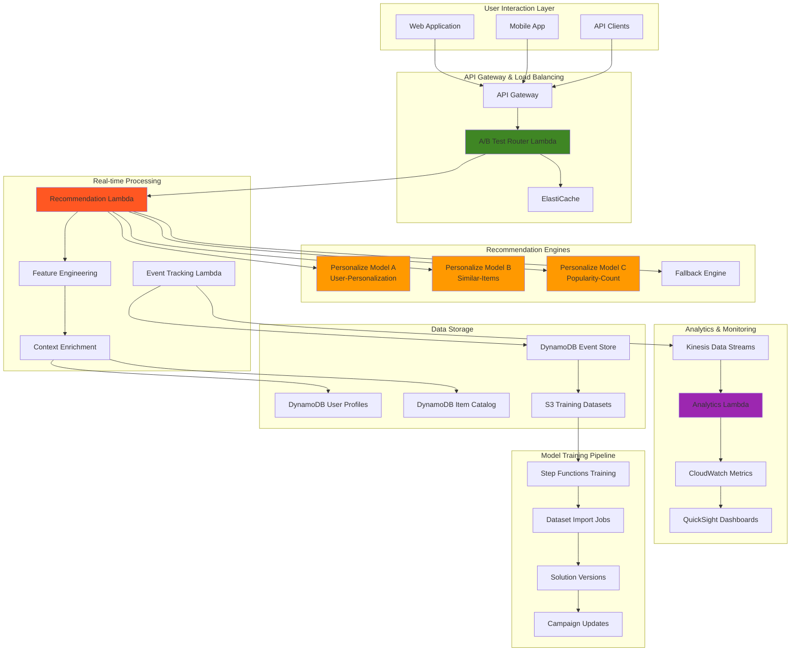

# Optimizing Personalized Recommendations with A/B Testing

## Problem

E-commerce and content platforms struggle to deliver personalized experiences that drive engagement and conversion while maintaining the ability to test and optimize recommendation strategies. Traditional recommendation systems lack the sophistication to handle real-time user behavior, cannot easily compare different algorithmic approaches, and fail to provide the granular analytics needed to understand recommendation effectiveness. Organizations need intelligent recommendation systems that can deliver personalized content in real-time, support multiple recommendation strategies simultaneously through A/B testing, track detailed performance metrics, and continuously optimize based on user interactions and business outcomes.

## Solution

Implement a comprehensive real-time recommendation platform using Amazon Personalize for machine learning-powered recommendations, combined with sophisticated A/B testing frameworks and real-time analytics. This solution creates multiple recommendation models (user-personalization, item-to-item similarity, trending content), implements intelligent traffic splitting for A/B testing, provides real-time recommendation APIs with sub-100ms latency, and includes comprehensive analytics for measuring recommendation effectiveness and business impact. The architecture supports dynamic model switching, contextual recommendations, and automated performance optimization.

## Architecture Diagram



## Prerequisites

1. AWS account with Personalize, Lambda, API Gateway, and DynamoDB permissions
2. AWS CLI v2 installed and configured (or AWS CloudShell)
3. Sample user interaction data (minimum 1000 users, 1000 items, 25,000 interactions)
4. Understanding of recommendation systems and A/B testing concepts
5. Estimated cost: $300-500 for training multiple Personalize models and running real-time inference

> **Warning**: Amazon Personalize training and real-time campaigns incur significant charges. Start with smaller datasets and monitor costs carefully during development.

## Preparation

```bash
# Set environment variables
export AWS_REGION=$(aws configure get region)
export AWS_ACCOUNT_ID=$(aws sts get-caller-identity \
    --query Account --output text)

# Generate unique identifiers
RANDOM_SUFFIX=$(aws secretsmanager get-random-password \
    --exclude-punctuation --exclude-uppercase \
    --password-length 6 --require-each-included-type \
    --output text --query RandomPassword)

export PROJECT_NAME="personalize-ab-${RANDOM_SUFFIX}"
export BUCKET_NAME="personalize-data-${RANDOM_SUFFIX}"
export ROLE_NAME="PersonalizeABTestRole-${RANDOM_SUFFIX}"

# Create S3 bucket for datasets
aws s3 mb s3://${BUCKET_NAME} --region ${AWS_REGION}

# Enable S3 bucket versioning and encryption
aws s3api put-bucket-versioning \
    --bucket ${BUCKET_NAME} \
    --versioning-configuration Status=Enabled

aws s3api put-bucket-encryption \
    --bucket ${BUCKET_NAME} \
    --server-side-encryption-configuration \
    'Rules=[{ApplyServerSideEncryptionByDefault:{SSEAlgorithm:AES256}}]'

# Create IAM role for Personalize and other services
cat > trust-policy.json << EOF
{
  "Version": "2012-10-17",
  "Statement": [
    {
      "Effect": "Allow",
      "Principal": {
        "Service": [
          "personalize.amazonaws.com",
          "lambda.amazonaws.com",
          "states.amazonaws.com"
        ]
      },
      "Action": "sts:AssumeRole"
    }
  ]
}
EOF

aws iam create-role \
    --role-name ${ROLE_NAME} \
    --assume-role-policy-document file://trust-policy.json

# Attach required policies following least privilege principle
aws iam attach-role-policy \
    --role-name ${ROLE_NAME} \
    --policy-arn arn:aws:iam::aws:policy/service-role/AmazonPersonalizeFullAccess

aws iam attach-role-policy \
    --role-name ${ROLE_NAME} \
    --policy-arn arn:aws:iam::aws:policy/AmazonS3FullAccess

aws iam attach-role-policy \
    --role-name ${ROLE_NAME} \
    --policy-arn arn:aws:iam::aws:policy/service-role/AWSLambdaBasicExecutionRole

aws iam attach-role-policy \
    --role-name ${ROLE_NAME} \
    --policy-arn arn:aws:iam::aws:policy/AmazonDynamoDBFullAccess

aws iam attach-role-policy \
    --role-name ${ROLE_NAME} \
    --policy-arn arn:aws:iam::aws:policy/AWSStepFunctionsFullAccess

export ROLE_ARN="arn:aws:iam::${AWS_ACCOUNT_ID}:role/${ROLE_NAME}"

echo "✅ Created foundational resources with security best practices"
```

## Steps

1. **Create Sample Training Data**:

   Amazon Personalize requires high-quality training data to build effective recommendation models. The service needs a minimum of 1,000 users, 1,000 items, and 25,000 interactions to train meaningful models. This step generates realistic sample data that simulates e-commerce user behavior patterns including views, purchases, and cart additions with appropriate weights that reflect real-world engagement patterns.

   ```bash
   # Create sample interaction data
   mkdir -p sample-data
   
   cat > generate_sample_data.py << 'EOF'
   import csv
   import random
   from datetime import datetime, timedelta
   
   # Generate sample users with demographics
   users = []
   for i in range(1000):
       users.append({
           'USER_ID': f'user_{i:05d}',
           'AGE': random.randint(18, 70),
           'GENDER': random.choice(['M', 'F']),
           'SUBSCRIPTION_TYPE': random.choice(['free', 'premium', 'enterprise'])
       })
   
   # Generate sample items with e-commerce attributes
   items = []
   categories = ['electronics', 'books', 'clothing', 'sports', 'home', 'automotive']
   for i in range(2000):
       items.append({
           'ITEM_ID': f'item_{i:05d}',
           'CATEGORY': random.choice(categories),
           'PRICE': round(random.uniform(10.0, 500.0), 2),
           'BRAND': f'brand_{random.randint(1, 50)}',
           'CREATION_DATE': (datetime.now() - \
               timedelta(days=random.randint(1, 365))).strftime('%Y-%m-%d')
       })
   
   # Generate sample interactions with realistic distribution
   interactions = []
   base_date = datetime.now() - timedelta(days=90)
   
   for _ in range(50000):
       user = random.choice(users)
       item = random.choice(items)
       event_type = random.choices(
           ['view', 'purchase', 'add_to_cart', 'like', 'share'],
           weights=[0.6, 0.1, 0.15, 0.1, 0.05]
       )[0]
       
       # Add temporal patterns for realistic user behavior
       event_date = base_date + timedelta(
           days=random.randint(0, 89),
           hours=random.randint(0, 23),
           minutes=random.randint(0, 59)
       )
       
       interactions.append({
           'USER_ID': user['USER_ID'],
           'ITEM_ID': item['ITEM_ID'],
           'EVENT_TYPE': event_type,
           'TIMESTAMP': int(event_date.timestamp()),
           'EVENT_VALUE': 1.0 if event_type == 'purchase' \
               else 0.5 if event_type == 'add_to_cart' else 0.1
       })
   
   # Sort interactions chronologically for training
   interactions.sort(key=lambda x: x['TIMESTAMP'])
   
   # Write CSV files in Personalize-compatible format
   with open('sample-data/users.csv', 'w', newline='') as f:
       writer = csv.DictWriter(f, fieldnames=['USER_ID', 'AGE', 'GENDER', 'SUBSCRIPTION_TYPE'])
       writer.writeheader()
       writer.writerows(users)
   
   with open('sample-data/items.csv', 'w', newline='') as f:
       writer = csv.DictWriter(f, fieldnames=['ITEM_ID', 'CATEGORY', 'PRICE', 'BRAND', 'CREATION_DATE'])
       writer.writeheader()
       writer.writerows(items)
   
   with open('sample-data/interactions.csv', 'w', newline='') as f:
       writer = csv.DictWriter(f, fieldnames=['USER_ID', 'ITEM_ID', 'EVENT_TYPE', 'TIMESTAMP', 'EVENT_VALUE'])
       writer.writeheader()
       writer.writerows(interactions)
   
   print("Sample data generated successfully!")
   print(f"Users: {len(users)}")
   print(f"Items: {len(items)}")
   print(f"Interactions: {len(interactions)}")
   EOF
   
   python3 generate_sample_data.py
   
   # Upload sample data to S3 with proper organization
   aws s3 cp sample-data/ s3://${BUCKET_NAME}/training-data/ \
       --recursive
   
   echo "✅ Generated and uploaded sample training data"
   ```

   The sample data is now ready in S3 and structured according to Personalize's requirements with proper CSV formatting and weighted interaction types. This foundation enables the creation of multiple recommendation models that can learn different patterns from user behavior, supporting the A/B testing framework we'll implement.

2. **Create DynamoDB Tables for Real-time Data**:

   DynamoDB provides the low-latency, scalable storage needed for real-time recommendation systems. We create separate tables for user profiles, item catalogs, A/B test assignments, and real-time events. Each table is optimized for specific access patterns: hash keys for direct lookups, range keys for time-series data, and global secondary indexes for category-based queries that support contextual recommendations.

   ```bash
   # Create table for user profiles with on-demand billing
   aws dynamodb create-table \
       --table-name "${PROJECT_NAME}-users" \
       --attribute-definitions \
           AttributeName=UserId,AttributeType=S \
       --key-schema \
           AttributeName=UserId,KeyType=HASH \
       --billing-mode PAY_PER_REQUEST
   
   # Create table for item catalog with category index
   aws dynamodb create-table \
       --table-name "${PROJECT_NAME}-items" \
       --attribute-definitions \
           AttributeName=ItemId,AttributeType=S \
           AttributeName=Category,AttributeType=S \
       --key-schema \
           AttributeName=ItemId,KeyType=HASH \
       --global-secondary-indexes \
           IndexName=CategoryIndex,KeySchema=[{AttributeName=Category,KeyType=HASH}],Projection={ProjectionType=ALL} \
       --billing-mode PAY_PER_REQUEST
   
   # Create table for A/B test assignments
   aws dynamodb create-table \
       --table-name "${PROJECT_NAME}-ab-assignments" \
       --attribute-definitions \
           AttributeName=UserId,AttributeType=S \
           AttributeName=TestName,AttributeType=S \
       --key-schema \
           AttributeName=UserId,KeyType=HASH \
           AttributeName=TestName,KeyType=RANGE \
       --billing-mode PAY_PER_REQUEST
   
   # Create table for real-time events with time-based partitioning
   aws dynamodb create-table \
       --table-name "${PROJECT_NAME}-events" \
       --attribute-definitions \
           AttributeName=UserId,AttributeType=S \
           AttributeName=Timestamp,AttributeType=N \
       --key-schema \
           AttributeName=UserId,KeyType=HASH \
           AttributeName=Timestamp,KeyType=RANGE \
       --billing-mode PAY_PER_REQUEST
   
   # Wait for tables to be active
   aws dynamodb wait table-exists --table-name "${PROJECT_NAME}-users"
   aws dynamodb wait table-exists --table-name "${PROJECT_NAME}-items"
   aws dynamodb wait table-exists --table-name "${PROJECT_NAME}-ab-assignments"
   aws dynamodb wait table-exists --table-name "${PROJECT_NAME}-events"
   
   echo "✅ Created DynamoDB tables with optimal configurations"
   ```

   The DynamoDB infrastructure is now established with tables designed for high-performance real-time operations using on-demand billing for cost optimization. The user and item tables support metadata enrichment, the A/B assignments table ensures consistent user experiences across sessions, and the events table captures detailed interaction data for analytics and model retraining.

3. **Create Lambda Function for A/B Test Management**:

   A/B testing in recommendation systems requires consistent user assignment and traffic splitting across multiple algorithmic approaches. This Lambda function implements consistent hashing to ensure users always see the same variant, preventing confusion and enabling accurate performance measurement. The function manages variant assignments and provides model configuration for each test group.

   ```bash
   # Create A/B test router Lambda function
   cat > ab_test_router.py << 'EOF'
   import json
   import boto3
   import hashlib
   import os
   from datetime import datetime
   
   dynamodb = boto3.resource('dynamodb')
   
   def lambda_handler(event, context):
       user_id = event.get('user_id')
       test_name = event.get('test_name', 'default_recommendation_test')
       
       if not user_id:
           return {
               'statusCode': 400,
               'body': json.dumps({'error': 'user_id is required'})
           }
       
       try:
           # Get or assign A/B test variant
           variant = get_or_assign_variant(user_id, test_name)
           
           # Get recommendation model configuration for variant
           model_config = get_model_config(variant)
           
           return {
               'statusCode': 200,
               'body': json.dumps({
                   'user_id': user_id,
                   'test_name': test_name,
                   'variant': variant,
                   'model_config': model_config
               })
           }
           
       except Exception as e:
           print(f"Error in A/B test router: {str(e)}")
           return {
               'statusCode': 500,
               'body': json.dumps({'error': str(e)})
           }
   
   def get_or_assign_variant(user_id, test_name):
       table = dynamodb.Table(os.environ['AB_ASSIGNMENTS_TABLE'])
       
       try:
           # Check if user already has assignment
           response = table.get_item(
               Key={'UserId': user_id, 'TestName': test_name}
           )
           
           if 'Item' in response:
               return response['Item']['Variant']
           
       except Exception as e:
           print(f"Error retrieving existing assignment: {str(e)}")
       
       # Assign new variant using consistent hashing
       variant = assign_variant(user_id, test_name)
       
       # Store assignment for consistency
       try:
           table.put_item(
               Item={
                   'UserId': user_id,
                   'TestName': test_name,
                   'Variant': variant,
                   'AssignmentTimestamp': int(datetime.now().timestamp())
               }
           )
       except Exception as e:
           print(f"Error storing assignment: {str(e)}")
       
       return variant
   
   def assign_variant(user_id, test_name):
       # Use consistent hashing for stable assignment
       hash_input = f"{user_id}-{test_name}".encode('utf-8')
       hash_value = int(hashlib.md5(hash_input).hexdigest(), 16)
       
       # Define test configuration with equal distribution
       test_config = {
           'default_recommendation_test': {
               'variant_a': 0.33,  # User-Personalization
               'variant_b': 0.33,  # Similar-Items
               'variant_c': 0.34   # Popularity-Count
           }
       }
       
       config = test_config.get(test_name, test_config['default_recommendation_test'])
       
       # Determine variant based on hash
       normalized_hash = (hash_value % 10000) / 10000.0
       
       cumulative = 0
       for variant, probability in config.items():
           cumulative += probability
           if normalized_hash <= cumulative:
               return variant
       
       return 'variant_a'  # Fallback
   
   def get_model_config(variant):
       # Configuration for each variant
       configs = {
           'variant_a': {
               'recipe': 'aws-user-personalization',
               'campaign_arn': os.environ.get('CAMPAIGN_A_ARN'),
               'description': 'User-Personalization Algorithm'
           },
           'variant_b': {
               'recipe': 'aws-sims',
               'campaign_arn': os.environ.get('CAMPAIGN_B_ARN'),
               'description': 'Item-to-Item Similarity Algorithm'
           },
           'variant_c': {
               'recipe': 'aws-popularity-count',
               'campaign_arn': os.environ.get('CAMPAIGN_C_ARN'),
               'description': 'Popularity-Based Algorithm'
           }
       }
       
       return configs.get(variant, configs['variant_a'])
   EOF
   
   # Create deployment package
   zip ab_test_router.zip ab_test_router.py
   
   # Create Lambda function with latest Python runtime
   aws lambda create-function \
       --function-name "${PROJECT_NAME}-ab-test-router" \
       --runtime python3.12 \
       --role ${ROLE_ARN} \
       --handler ab_test_router.lambda_handler \
       --zip-file fileb://ab_test_router.zip \
       --timeout 30 \
       --environment Variables="{AB_ASSIGNMENTS_TABLE=${PROJECT_NAME}-ab-assignments}"
   
   echo "✅ Created A/B test router Lambda function"
   ```

   The A/B test router is now deployed and ready to assign users to recommendation variants. This component is critical for controlled experimentation, ensuring statistical validity by maintaining stable assignments while enabling data-driven optimization of recommendation strategies across different algorithmic approaches.

4. **Create Lambda Function for Recommendations**:

   The recommendation engine serves as the core intelligence layer, interfacing with Amazon Personalize campaigns to deliver personalized recommendations with sub-100ms latency. This function handles fallback scenarios when Personalize is unavailable, enriches recommendations with item metadata for enhanced user experiences, and tracks serving events for comprehensive analytics and model performance measurement.

   ```bash
   # Create recommendation Lambda function
   cat > recommendation_engine.py << 'EOF'
   import json
   import boto3
   import os
   from datetime import datetime
   
   personalize_runtime = boto3.client('personalize-runtime')
   dynamodb = boto3.resource('dynamodb')
   
   def lambda_handler(event, context):
       user_id = event.get('user_id')
       model_config = event.get('model_config', {})
       num_results = event.get('num_results', 10)
       context_data = event.get('context', {})
       
       if not user_id:
           return {
               'statusCode': 400,
               'body': json.dumps({'error': 'user_id is required'})
           }
       
       try:
           # Get recommendations from Personalize
           recommendations = get_personalize_recommendations(
               user_id, model_config, num_results, context_data
           )
           
           # Enrich recommendations with item metadata
           enriched_recommendations = enrich_recommendations(recommendations)
           
           # Track recommendation request for analytics
           track_recommendation_request(user_id, model_config, enriched_recommendations)
           
           return {
               'statusCode': 200,
               'body': json.dumps({
                   'user_id': user_id,
                   'recommendations': enriched_recommendations,
                   'algorithm': model_config.get('description', 'Unknown'),
                   'timestamp': datetime.now().isoformat()
               })
           }
           
       except Exception as e:
           print(f"Error in recommendation engine: {str(e)}")
           # Fallback to popularity-based recommendations
           fallback_recommendations = get_fallback_recommendations(num_results)
           
           return {
               'statusCode': 200,
               'body': json.dumps({
                   'user_id': user_id,
                   'recommendations': fallback_recommendations,
                   'algorithm': 'Fallback - Popularity Based',
                   'error': str(e),
                   'timestamp': datetime.now().isoformat()
               })
           }
   
   def get_personalize_recommendations(user_id, model_config, num_results, context_data):
       campaign_arn = model_config.get('campaign_arn')
       
       if not campaign_arn:
           raise ValueError("No campaign ARN provided")
       
       # Build request parameters
       request_params = {
           'campaignArn': campaign_arn,
           'userId': user_id,
           'numResults': num_results
       }
       
       # Add context if provided for contextual recommendations
       if context_data:
           request_params['context'] = context_data
       
       # Get recommendations from Personalize
       response = personalize_runtime.get_recommendations(**request_params)
       
       return response['itemList']
   
   def enrich_recommendations(recommendations):
       items_table = dynamodb.Table(os.environ['ITEMS_TABLE'])
       
       enriched = []
       for item in recommendations:
           item_id = item['itemId']
           
           try:
               # Get item metadata from DynamoDB
               response = items_table.get_item(Key={'ItemId': item_id})
               
               if 'Item' in response:
                   item_data = response['Item']
                   enriched.append({
                       'item_id': item_id,
                       'score': item.get('score', 0),
                       'category': item_data.get('Category', 'Unknown'),
                       'price': float(item_data.get('Price', 0)),
                       'brand': item_data.get('Brand', 'Unknown')
                   })
               else:
                   # Item not found in catalog
                   enriched.append({
                       'item_id': item_id,
                       'score': item.get('score', 0),
                       'category': 'Unknown',
                       'price': 0,
                       'brand': 'Unknown'
                   })
                   
           except Exception as e:
               print(f"Error enriching item {item_id}: {str(e)}")
               enriched.append({
                   'item_id': item_id,
                   'score': item.get('score', 0),
                   'error': str(e)
               })
       
       return enriched
   
   def get_fallback_recommendations(num_results):
       # Simple fallback - return popular items by category
       items_table = dynamodb.Table(os.environ['ITEMS_TABLE'])
       
       try:
           # Scan for items (in production, use better caching strategy)
           response = items_table.scan(Limit=num_results)
           items = response.get('Items', [])
           
           fallback = []
           for item in items:
               fallback.append({
                   'item_id': item['ItemId'],
                   'score': 0.5,  # Default score for fallback
                   'category': item.get('Category', 'Unknown'),
                   'price': float(item.get('Price', 0)),
                   'brand': item.get('Brand', 'Unknown')
               })
           
           return fallback
           
       except Exception as e:
           print(f"Error in fallback recommendations: {str(e)}")
           return []
   
   def track_recommendation_request(user_id, model_config, recommendations):
       # Track recommendation serving for analytics
       events_table = dynamodb.Table(os.environ['EVENTS_TABLE'])
       
       try:
           events_table.put_item(
               Item={
                   'UserId': user_id,
                   'Timestamp': int(datetime.now().timestamp() * 1000),
                   'EventType': 'recommendation_served',
                   'Algorithm': model_config.get('description', 'Unknown'),
                   'ItemCount': len(recommendations),
                   'Items': json.dumps([r['item_id'] for r in recommendations])
               }
           )
       except Exception as e:
           print(f"Failed to track recommendation request: {str(e)}")
   EOF
   
   # Create deployment package
   zip recommendation_engine.zip recommendation_engine.py
   
   # Create Lambda function
   aws lambda create-function \
       --function-name "${PROJECT_NAME}-recommendation-engine" \
       --runtime python3.12 \
       --role ${ROLE_ARN} \
       --handler recommendation_engine.lambda_handler \
       --zip-file fileb://recommendation_engine.zip \
       --timeout 30 \
       --environment Variables="{ITEMS_TABLE=${PROJECT_NAME}-items,EVENTS_TABLE=${PROJECT_NAME}-events}"
   
   echo "✅ Created recommendation engine Lambda function"
   ```

   The recommendation engine is deployed and configured to deliver intelligent, personalized recommendations while maintaining system reliability through fallback mechanisms. This function bridges machine learning capabilities with real-time application requirements, ensuring consistent user experiences even during high-traffic periods or service disruptions.

5. **Create Lambda Function for Event Tracking**:

   Real-time event tracking is essential for both continuous model improvement and A/B test analytics. This function captures user interactions (views, purchases, cart additions) and feeds them to both Personalize for model retraining and our analytics pipeline for measuring recommendation effectiveness. The dual-path approach ensures comprehensive data collection for optimization.

   ```bash
   # Create event tracking Lambda function
   cat > event_tracker.py << 'EOF'
   import json
   import boto3
   import os
   from datetime import datetime
   
   personalize_events = boto3.client('personalize-events')
   dynamodb = boto3.resource('dynamodb')
   
   def lambda_handler(event, context):
       try:
           # Parse event data
           user_id = event.get('user_id')
           session_id = event.get('session_id', user_id)
           event_type = event.get('event_type')
           item_id = event.get('item_id')
           recommendation_id = event.get('recommendation_id')
           properties = event.get('properties', {})
           
           if not all([user_id, event_type]):
               return {
                   'statusCode': 400,
                   'body': json.dumps({'error': 'user_id and event_type are required'})
               }
           
           # Store event in DynamoDB for analytics
           store_event_analytics(event)
           
           # Send event to Personalize for real-time learning
           if os.environ.get('EVENT_TRACKER_ARN') and item_id:
               send_to_personalize(user_id, session_id, event_type, item_id, properties)
           
           return {
               'statusCode': 200,
               'body': json.dumps({'message': 'Event tracked successfully'})
           }
           
       except Exception as e:
           print(f"Error in event tracker: {str(e)}")
           return {
               'statusCode': 500,
               'body': json.dumps({'error': str(e)})
           }
   
   def store_event_analytics(event):
       events_table = dynamodb.Table(os.environ['EVENTS_TABLE'])
       
       # Store detailed event for analytics
       try:
           events_table.put_item(
               Item={
                   'UserId': event['user_id'],
                   'Timestamp': int(datetime.now().timestamp() * 1000),
                   'EventType': event['event_type'],
                   'ItemId': event.get('item_id', ''),
                   'SessionId': event.get('session_id', ''),
                   'RecommendationId': event.get('recommendation_id', ''),
                   'Properties': json.dumps(event.get('properties', {}))
               }
           )
       except Exception as e:
           print(f"Error storing event analytics: {str(e)}")
   
   def send_to_personalize(user_id, session_id, event_type, item_id, properties):
       event_tracker_arn = os.environ['EVENT_TRACKER_ARN']
       
       try:
           # Prepare event for Personalize
           personalize_event = {
               'userId': user_id,
               'sessionId': session_id,
               'eventType': event_type,
               'sentAt': datetime.now().timestamp()
           }
           
           if item_id:
               personalize_event['itemId'] = item_id
           
           if properties:
               personalize_event['properties'] = json.dumps(properties)
           
           # Send to Personalize for real-time learning
           personalize_events.put_events(
               trackingId=event_tracker_arn.split('/')[-1],
               userId=user_id,
               sessionId=session_id,
               eventList=[personalize_event]
           )
       except Exception as e:
           print(f"Error sending to Personalize: {str(e)}")
   EOF
   
   # Create deployment package
   zip event_tracker.zip event_tracker.py
   
   # Create Lambda function
   aws lambda create-function \
       --function-name "${PROJECT_NAME}-event-tracker" \
       --runtime python3.12 \
       --role ${ROLE_ARN} \
       --handler event_tracker.lambda_handler \
       --zip-file fileb://event_tracker.zip \
       --timeout 30 \
       --environment Variables="{EVENTS_TABLE=${PROJECT_NAME}-events}"
   
   echo "✅ Created event tracking Lambda function"
   ```

   Event tracking is now active and capturing detailed user interaction data across multiple channels. This data pipeline enables continuous learning for Personalize models while providing the granular analytics needed to measure A/B test performance and understand user engagement patterns across different recommendation approaches.

6. **Create Lambda Function for Personalize Management**:

   Managing Personalize resources requires orchestrating complex workflows including dataset creation, model training, and campaign deployment. This management function provides programmatic control over the entire Personalize lifecycle, enabling automated model updates, campaign management, and status monitoring that supports continuous improvement of recommendation quality.

   ```bash
   # Create Personalize management Lambda function
   cat > personalize_manager.py << 'EOF'
   import json
   import boto3
   import os
   from datetime import datetime
   
   personalize = boto3.client('personalize')
   
   def lambda_handler(event, context):
       action = event.get('action')
       
       try:
           if action == 'create_dataset_group':
               return create_dataset_group(event)
           elif action == 'import_data':
               return import_data(event)
           elif action == 'create_solution':
               return create_solution(event)
           elif action == 'create_campaign':
               return create_campaign(event)
           elif action == 'check_status':
               return check_status(event)
           else:
               return {
                   'statusCode': 400,
                   'body': json.dumps({'error': f'Unknown action: {action}'})
               }
               
       except Exception as e:
           print(f"Error in Personalize manager: {str(e)}")
           return {
               'statusCode': 500,
               'body': json.dumps({'error': str(e)})
           }
   
   def create_dataset_group(event):
       dataset_group_name = event['dataset_group_name']
       
       response = personalize.create_dataset_group(
           name=dataset_group_name,
           domain='ECOMMERCE'  # Optimized for e-commerce use cases
       )
       
       return {
           'statusCode': 200,
           'body': json.dumps({
               'dataset_group_arn': response['datasetGroupArn']
           })
       }
   
   def import_data(event):
       dataset_arn = event['dataset_arn']
       job_name = event['job_name']
       s3_data_source = event['s3_data_source']
       role_arn = event['role_arn']
       
       response = personalize.create_dataset_import_job(
           jobName=job_name,
           datasetArn=dataset_arn,
           dataSource={
               's3DataSource': {
                   'path': s3_data_source
               }
           },
           roleArn=role_arn
       )
       
       return {
           'statusCode': 200,
           'body': json.dumps({
               'dataset_import_job_arn': response['datasetImportJobArn']
           })
       }
   
   def create_solution(event):
       solution_name = event['solution_name']
       dataset_group_arn = event['dataset_group_arn']
       recipe_arn = event['recipe_arn']
       
       response = personalize.create_solution(
           name=solution_name,
           datasetGroupArn=dataset_group_arn,
           recipeArn=recipe_arn
       )
       
       return {
           'statusCode': 200,
           'body': json.dumps({
               'solution_arn': response['solutionArn']
           })
       }
   
   def create_campaign(event):
       campaign_name = event['campaign_name']
       solution_version_arn = event['solution_version_arn']
       min_provisioned_tps = event.get('min_provisioned_tps', 1)
       
       response = personalize.create_campaign(
           name=campaign_name,
           solutionVersionArn=solution_version_arn,
           minProvisionedTPS=min_provisioned_tps
       )
       
       return {
           'statusCode': 200,
           'body': json.dumps({
               'campaign_arn': response['campaignArn']
           })
       }
   
   def check_status(event):
       resource_arn = event['resource_arn']
       resource_type = event['resource_type']
       
       if resource_type == 'solution':
           response = personalize.describe_solution(solutionArn=resource_arn)
           status = response['solution']['status']
       elif resource_type == 'campaign':
           response = personalize.describe_campaign(campaignArn=resource_arn)
           status = response['campaign']['status']
       elif resource_type == 'dataset_import_job':
           response = personalize.describe_dataset_import_job(datasetImportJobArn=resource_arn)
           status = response['datasetImportJob']['status']
       else:
           raise ValueError(f"Unknown resource type: {resource_type}")
       
       return {
           'statusCode': 200,
           'body': json.dumps({
               'resource_arn': resource_arn,
               'status': status,
               'is_complete': status in ['ACTIVE', 'CREATE FAILED']
           })
       }
   EOF
   
   # Create deployment package
   zip personalize_manager.zip personalize_manager.py
   
   # Create Lambda function with extended timeout for operations
   aws lambda create-function \
       --function-name "${PROJECT_NAME}-personalize-manager" \
       --runtime python3.12 \
       --role ${ROLE_ARN} \
       --handler personalize_manager.lambda_handler \
       --zip-file fileb://personalize_manager.zip \
       --timeout 60
   
   echo "✅ Created Personalize management Lambda function"
   ```

   The Personalize management system is ready to orchestrate model training and campaign updates. This automation capability is crucial for maintaining fresh, accurate recommendations as user preferences evolve and new products are introduced, ensuring the recommendation system continuously improves over time.

7. **Create API Gateway for Recommendation Service**:

   API Gateway provides the scalable, secure entry point for recommendation requests and event tracking. The HTTP API configuration optimizes for low latency while providing the routing and integration capabilities needed to connect client applications with our Lambda-based recommendation infrastructure. This creates a production-ready interface for real-time recommendation delivery.

   ```bash
   # Create API Gateway HTTP API for optimal performance
   API_ID=$(aws apigatewayv2 create-api \
       --name "${PROJECT_NAME}-recommendation-api" \
       --protocol-type HTTP \
       --description "Real-time recommendation API with A/B testing" \
       --query 'ApiId' --output text)
   
   # Create integrations for Lambda functions
   
   # Integration for A/B test router
   AB_INTEGRATION_ID=$(aws apigatewayv2 create-integration \
       --api-id ${API_ID} \
       --integration-type AWS_PROXY \
       --integration-method POST \
       --integration-uri "arn:aws:lambda:${AWS_REGION}:${AWS_ACCOUNT_ID}:function:${PROJECT_NAME}-ab-test-router" \
       --payload-format-version 2.0 \
       --query 'IntegrationId' --output text)
   
   # Integration for event tracker
   EVENT_INTEGRATION_ID=$(aws apigatewayv2 create-integration \
       --api-id ${API_ID} \
       --integration-type AWS_PROXY \
       --integration-method POST \
       --integration-uri "arn:aws:lambda:${AWS_REGION}:${AWS_ACCOUNT_ID}:function:${PROJECT_NAME}-event-tracker" \
       --payload-format-version 2.0 \
       --query 'IntegrationId' --output text)
   
   # Create routes
   
   # Route for getting recommendations
   aws apigatewayv2 create-route \
       --api-id ${API_ID} \
       --route-key "POST /recommendations" \
       --target "integrations/${AB_INTEGRATION_ID}"
   
   # Route for tracking events
   aws apigatewayv2 create-route \
       --api-id ${API_ID} \
       --route-key "POST /events" \
       --target "integrations/${EVENT_INTEGRATION_ID}"
   
   # Add Lambda permissions for API Gateway invocation
   aws lambda add-permission \
       --function-name "${PROJECT_NAME}-ab-test-router" \
       --statement-id api-gateway-invoke-1 \
       --action lambda:InvokeFunction \
       --principal apigateway.amazonaws.com \
       --source-arn "arn:aws:execute-api:${AWS_REGION}:${AWS_ACCOUNT_ID}:${API_ID}/*/*"
   
   aws lambda add-permission \
       --function-name "${PROJECT_NAME}-event-tracker" \
       --statement-id api-gateway-invoke-2 \
       --action lambda:InvokeFunction \
       --principal apigateway.amazonaws.com \
       --source-arn "arn:aws:execute-api:${AWS_REGION}:${AWS_ACCOUNT_ID}:${API_ID}/*/*"
   
   # Create deployment and default stage
   aws apigatewayv2 create-deployment \
       --api-id ${API_ID} \
       --description "Initial deployment"
   
   # Get API endpoint URL
   API_ENDPOINT=$(aws apigatewayv2 get-api \
       --api-id ${API_ID} \
       --query 'ApiEndpoint' --output text)
   
   echo "✅ Created API Gateway: ${API_ENDPOINT}"
   echo "Note: Complete Personalize setup before testing recommendations"
   ```

   The API Gateway is deployed and provides endpoints for both recommendation requests and event tracking. This RESTful interface enables easy integration with web applications, mobile apps, and other systems while maintaining security and scalability. The gateway routes requests to appropriate Lambda functions based on the endpoint called.

8. **Populate DynamoDB with Sample Data**:

   Loading item and user metadata into DynamoDB enables real-time recommendation enrichment and contextual filtering. This step populates the tables with the sample data generated earlier, establishing the metadata foundation needed for comprehensive recommendation experiences that include product details, user preferences, and contextual information.

   ```bash
   # Load sample data into DynamoDB tables
   cat > load_dynamodb_data.py << 'EOF'
   import boto3
   import csv
   import json
   import os
   
   dynamodb = boto3.resource('dynamodb')
   
   def load_users():
       table = dynamodb.Table(f"{os.environ['PROJECT_NAME']}-users")
       
       with open('sample-data/users.csv', 'r') as f:
           reader = csv.DictReader(f)
           for row in reader:
               table.put_item(
                   Item={
                       'UserId': row['USER_ID'],
                       'Age': int(row['AGE']),
                       'Gender': row['GENDER'],
                       'SubscriptionType': row['SUBSCRIPTION_TYPE']
                   }
               )
       print("Loaded users data")
   
   def load_items():
       table = dynamodb.Table(f"{os.environ['PROJECT_NAME']}-items")
       
       with open('sample-data/items.csv', 'r') as f:
           reader = csv.DictReader(f)
           for row in reader:
               table.put_item(
                   Item={
                       'ItemId': row['ITEM_ID'],
                       'Category': row['CATEGORY'],
                       'Price': row['PRICE'],
                       'Brand': row['BRAND'],
                       'CreationDate': row['CREATION_DATE']
                   }
               )
       print("Loaded items data")
   
   if __name__ == "__main__":
       load_users()
       load_items()
       print("Data loading completed")
   EOF
   
   PROJECT_NAME=${PROJECT_NAME} python3 load_dynamodb_data.py
   
   echo "✅ Loaded sample data into DynamoDB"
   ```

   The DynamoDB tables are now populated with sample user and item data, enabling metadata enrichment for recommendations. This data supports contextual recommendations, user segmentation, and detailed analytics while providing the foundation for testing the complete recommendation pipeline with realistic data patterns.

## Validation & Testing

1. **Test A/B Test Router**:

   ```bash
   # Test A/B test assignment
   aws lambda invoke \
       --function-name "${PROJECT_NAME}-ab-test-router" \
       --payload '{"user_id": "user_00001"}' \
       response.json
   
   cat response.json
   ```

   Expected output: JSON response with user assignment to variant A, B, or C.

2. **Test Event Tracking**:

   ```bash
   # Test event tracking
   aws lambda invoke \
       --function-name "${PROJECT_NAME}-event-tracker" \
       --payload '{
         "user_id": "user_00001",
         "event_type": "view",
         "item_id": "item_00001",
         "session_id": "session_123"
       }' \
       response.json
   
   cat response.json
   ```

3. **Test API Endpoints**:

   ```bash
   # Test recommendation API
   curl -X POST ${API_ENDPOINT}/recommendations \
       -H "Content-Type: application/json" \
       -d '{"user_id": "user_00001", "num_results": 5}'
   
   # Test event tracking API
   curl -X POST ${API_ENDPOINT}/events \
       -H "Content-Type: application/json" \
       -d '{
         "user_id": "user_00001",
         "event_type": "purchase",
         "item_id": "item_00001"
       }'
   ```

4. **Verify A/B Test Assignments**:

   ```bash
   # Query A/B test assignments
   aws dynamodb scan \
       --table-name "${PROJECT_NAME}-ab-assignments" \
       --limit 10
   
   # Query events
   aws dynamodb scan \
       --table-name "${PROJECT_NAME}-events" \
       --limit 10
   ```

## Cleanup

1. **Delete API Gateway and Lambda Functions**:

   ```bash
   # Delete API Gateway
   aws apigatewayv2 delete-api --api-id ${API_ID}
   
   # Delete Lambda functions
   aws lambda delete-function \
       --function-name "${PROJECT_NAME}-ab-test-router"
   
   aws lambda delete-function \
       --function-name "${PROJECT_NAME}-recommendation-engine"
   
   aws lambda delete-function \
       --function-name "${PROJECT_NAME}-event-tracker"
   
   aws lambda delete-function \
       --function-name "${PROJECT_NAME}-personalize-manager"
   
   echo "✅ Deleted API Gateway and Lambda functions"
   ```

2. **Delete DynamoDB Tables**:

   ```bash
   # Delete DynamoDB tables
   aws dynamodb delete-table \
       --table-name "${PROJECT_NAME}-users"
   
   aws dynamodb delete-table \
       --table-name "${PROJECT_NAME}-items"
   
   aws dynamodb delete-table \
       --table-name "${PROJECT_NAME}-ab-assignments"
   
   aws dynamodb delete-table \
       --table-name "${PROJECT_NAME}-events"
   
   echo "✅ Deleted DynamoDB tables"
   ```

3. **Clean up Storage and IAM Resources**:

   ```bash
   # Empty and delete S3 bucket
   aws s3 rm s3://${BUCKET_NAME} --recursive
   aws s3 rb s3://${BUCKET_NAME}
   
   # Detach policies and delete IAM role
   aws iam detach-role-policy \
       --role-name ${ROLE_NAME} \
       --policy-arn arn:aws:iam::aws:policy/service-role/AmazonPersonalizeFullAccess
   
   aws iam detach-role-policy \
       --role-name ${ROLE_NAME} \
       --policy-arn arn:aws:iam::aws:policy/AmazonS3FullAccess
   
   aws iam detach-role-policy \
       --role-name ${ROLE_NAME} \
       --policy-arn arn:aws:iam::aws:policy/service-role/AWSLambdaBasicExecutionRole
   
   aws iam detach-role-policy \
       --role-name ${ROLE_NAME} \
       --policy-arn arn:aws:iam::aws:policy/AmazonDynamoDBFullAccess
   
   aws iam detach-role-policy \
       --role-name ${ROLE_NAME} \
       --policy-arn arn:aws:iam::aws:policy/AWSStepFunctionsFullAccess
   
   aws iam delete-role --role-name ${ROLE_NAME}
   
   # Clean up local files
   rm -f trust-policy.json ab_test_router.py ab_test_router.zip \
         recommendation_engine.py recommendation_engine.zip \
         event_tracker.py event_tracker.zip \
         personalize_manager.py personalize_manager.zip \
         load_dynamodb_data.py generate_sample_data.py \
         response.json
   rm -rf sample-data/
   
   echo "✅ Cleaned up all resources"
   ```

## Discussion

This advanced recommendation system demonstrates how Amazon Personalize can be integrated with sophisticated A/B testing frameworks to optimize recommendation strategies while maintaining real-time performance. The solution addresses critical challenges in modern recommendation systems: the need for multiple algorithmic approaches, scientific measurement of recommendation effectiveness, and the ability to rapidly iterate and improve recommendation quality based on user feedback.

The A/B testing framework uses consistent hashing to ensure stable user assignments while enabling controlled experiments between different recommendation algorithms. This approach allows organizations to measure the business impact of different recommendation strategies, compare user engagement metrics, and make data-driven decisions about algorithm selection. The real-time event tracking provides immediate feedback for both Personalize model training and A/B test analytics, following AWS Well-Architected Framework principles for operational excellence and reliability.

The architecture supports advanced personalization patterns such as contextual recommendations, where external factors like time of day, device type, or current browsing session influence recommendation results. The fallback mechanism ensures system reliability even when Personalize campaigns are unavailable, while the comprehensive analytics pipeline enables deep analysis of recommendation performance across different user segments and business metrics. The implementation uses AWS security best practices including IAM least privilege, encryption at rest and in transit, and proper resource isolation.

For more information on Amazon Personalize best practices, see the [Amazon Personalize Developer Guide](https://docs.aws.amazon.com/personalize/latest/dg/what-is-personalize.html) and [AWS Well-Architected Framework](https://docs.aws.amazon.com/wellarchitected/latest/framework/welcome.html).

> **Tip**: Use Amazon Personalize's batch inference capabilities for pre-computing recommendations for high-traffic scenarios, and implement recommendation diversity controls to avoid filter bubbles and improve user experience.

## Challenge

Enhance this recommendation platform with these advanced capabilities:

1. **Multi-Armed Bandit Optimization**: Implement dynamic traffic allocation that automatically adjusts A/B test traffic distribution based on real-time performance metrics, optimizing for multiple business objectives simultaneously
2. **Contextual Recommendations**: Integrate real-time context data such as weather, location, time of day, and browsing history to provide situational recommendations that adapt to user circumstances
3. **Cross-Domain Recommendations**: Extend the system to provide recommendations across multiple product categories or content types, using Personalize's cross-domain capabilities and transfer learning
4. **Recommendation Explainability**: Build explanation engines that provide users with insights into why specific items were recommended, improving trust and engagement through transparency
5. **Advanced Analytics Platform**: Create comprehensive analytics dashboards with cohort analysis, recommendation lift measurement, and automated A/B test reporting with statistical significance testing and business impact analysis

## Infrastructure Code

### Available Infrastructure as Code:

- [Infrastructure Code Overview](code/README.md) - Detailed description of all infrastructure components
- [AWS CDK (Python)](code/cdk-python/) - AWS CDK Python implementation
- [AWS CDK (TypeScript)](code/cdk-typescript/) - AWS CDK TypeScript implementation
- [CloudFormation](code/cloudformation.yaml) - AWS CloudFormation template
- [Bash CLI Scripts](code/scripts/) - Example bash scripts using AWS CLI commands to deploy infrastructure
- [Terraform](code/terraform/) - Terraform configuration files