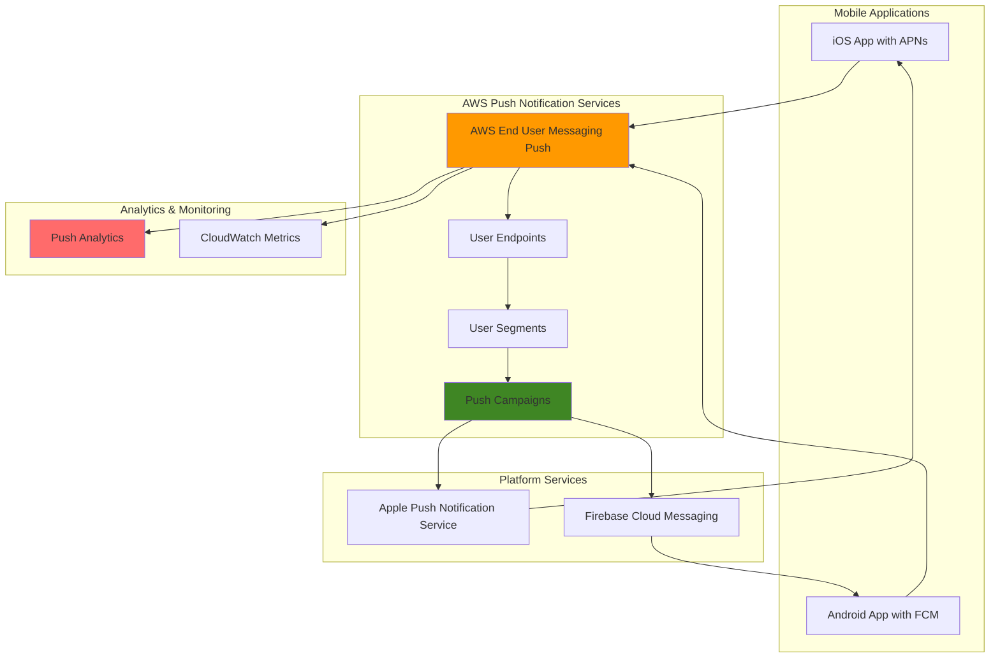

# Pinpoint Mobile Push Notifications

## Problem

A mobile e-commerce application needs to send targeted push notifications to users about flash sales, abandoned cart reminders, and personalized product recommendations. The marketing team struggles with low user engagement rates and wants to implement location-based, behavior-triggered notifications that work across both iOS and Android platforms. Without a centralized mobile engagement platform, they cannot track delivery rates, optimize notification timing, or segment users effectively for personalized campaigns.

## Solution

AWS End User Messaging Push (formerly Amazon Pinpoint) provides a comprehensive mobile engagement platform that enables targeted push notifications across multiple platforms. This solution creates push notification channels for both iOS (APNs) and Android (FCM), sets up user segments based on demographics and behavior, and implements automated campaigns with analytics tracking to optimize user engagement and conversion rates.

## Architecture Diagram



## Prerequisites

1. AWS account with permissions for Pinpoint, SNS, and IAM services
2. AWS CLI v2 installed and configured (or AWS CloudShell)
3. iOS Developer Account with valid APNs certificates or authentication keys
4. Firebase project with FCM credentials for Android notifications
5. Mobile application with SDK integration for push notifications
6. Basic understanding of mobile push notification concepts
7. Estimated cost: $10-50/month for 100,000 push notifications

> **Note**: This recipe focuses on AWS End User Messaging Push service configuration. Actual mobile app integration requires additional development work.

## Preparation

```bash
# Set environment variables
export AWS_REGION=$(aws configure get region)
export AWS_ACCOUNT_ID=$(aws sts get-caller-identity \
    --query Account --output text)

# Generate unique identifiers for resources
RANDOM_SUFFIX=$(aws secretsmanager get-random-password \
    --exclude-punctuation --exclude-uppercase \
    --password-length 6 --require-each-included-type \
    --output text --query RandomPassword)

export APP_NAME="ecommerce-mobile-app-${RANDOM_SUFFIX}"
export SEGMENT_NAME="high-value-customers"
export CAMPAIGN_NAME="flash-sale-notification"

# Create IAM role for Pinpoint service
aws iam create-role \
    --role-name "PinpointServiceRole-${RANDOM_SUFFIX}" \
    --assume-role-policy-document '{
        "Version": "2012-10-17",
        "Statement": [
            {
                "Effect": "Allow",
                "Principal": {
                    "Service": "pinpoint.amazonaws.com"
                },
                "Action": "sts:AssumeRole"
            }
        ]
    }'

# Attach basic policy to the role
aws iam attach-role-policy \
    --role-name "PinpointServiceRole-${RANDOM_SUFFIX}" \
    --policy-arn "arn:aws:iam::aws:policy/service-role/AmazonPinpointServiceRole"

export PINPOINT_ROLE_ARN="arn:aws:iam::${AWS_ACCOUNT_ID}:role/PinpointServiceRole-${RANDOM_SUFFIX}"

echo "✅ Environment prepared with app name: ${APP_NAME}"
```

## Steps

1. **Create Pinpoint Application**:

   AWS End User Messaging Push (formerly Amazon Pinpoint) requires an application container to organize all push notification resources and configurations. This application acts as the foundational layer that enables mobile engagement across multiple platforms while providing centralized analytics and campaign management. Creating this application establishes the core infrastructure needed for targeted mobile communications.

   ```bash
   # Create the main Pinpoint application
   aws pinpoint create-app \
       --create-application-request Name="${APP_NAME}" \
       --region ${AWS_REGION}
   
   # Store the application ID
   export PINPOINT_APP_ID=$(aws pinpoint get-apps \
       --query 'ApplicationsResponse.Item[?Name==`'${APP_NAME}'`].Id' \
       --output text --region ${AWS_REGION})
   
   echo "✅ Created Pinpoint application: ${PINPOINT_APP_ID}"
   ```

   The application is now configured and ready to support multiple platform channels. This foundational step enables all subsequent push notification capabilities including user segmentation, campaign creation, and delivery analytics across iOS and Android platforms.

   > **Note**: AWS End User Messaging Push replaced Amazon Pinpoint for push notifications. Existing Pinpoint applications continue to work. Learn more about [AWS End User Messaging services](https://docs.aws.amazon.com/pinpoint/latest/userguide/welcome.html).

   > **Warning**: Ensure APNs certificates and FCM server keys are properly configured before sending production notifications. Invalid credentials will result in delivery failures and may impact your sender reputation with platform providers.

2. **Configure APNs Channel for iOS**:

   Apple Push Notification Service (APNs) enables secure and reliable push notification delivery to iOS devices. Configuring the APNs channel establishes the communication bridge between your application and Apple's notification infrastructure. This step is critical for iOS mobile engagement as it validates your application's authority to send notifications and enables delivery tracking for iOS users.

   ```bash
   # Enable APNs channel (requires APNs certificate)
   # Note: Replace with your actual certificate file path
   aws pinpoint update-apns-channel \
       --application-id ${PINPOINT_APP_ID} \
       --apns-channel-request \
       Enabled=true,DefaultAuthenticationMethod=CERTIFICATE \
       --region ${AWS_REGION}
   
   # Verify APNs channel status
   aws pinpoint get-apns-channel \
       --application-id ${PINPOINT_APP_ID} \
       --region ${AWS_REGION} \
       --query 'APNSChannelResponse.{Enabled:Enabled,Platform:Platform}'
   
   echo "✅ APNs channel configured for iOS notifications"
   ```

   The APNs channel is now active and ready to deliver push notifications to iOS devices. This establishes secure communication with Apple's notification service and enables iOS-specific features like badge counts, custom sounds, and actionable notifications.

3. **Configure FCM Channel for Android**:

   Firebase Cloud Messaging (FCM) serves as Google's platform for delivering push notifications to Android devices and web applications. Configuring the FCM channel requires a valid Firebase server key that authenticates your application with Google's messaging infrastructure. This setup enables reliable message delivery to Android users while supporting advanced features like message priority, time-to-live settings, and delivery receipts.

   ```bash
   # Enable FCM channel (requires Firebase server key)
   # Note: Replace YOUR_FCM_SERVER_KEY with actual key
   aws pinpoint update-gcm-channel \
       --application-id ${PINPOINT_APP_ID} \
       --gcm-channel-request \
       Enabled=true,ApiKey="YOUR_FCM_SERVER_KEY" \
       --region ${AWS_REGION}
   
   # Verify FCM channel status
   aws pinpoint get-gcm-channel \
       --application-id ${PINPOINT_APP_ID} \
       --region ${AWS_REGION} \
       --query 'GCMChannelResponse.{Enabled:Enabled,Platform:Platform}'
   
   echo "✅ FCM channel configured for Android notifications"
   ```

   The FCM channel is now established and ready to handle Android push notifications. This completes the dual-platform setup, enabling your application to reach users across both major mobile ecosystems with platform-specific notification features and delivery optimizations.

4. **Create User Endpoints**:

   User endpoints represent individual app installations on specific devices and serve as the targeting foundation for all push notifications. Each endpoint contains critical information including device tokens, user demographics, behavioral attributes, and location data that enables sophisticated audience segmentation. Creating test endpoints allows you to validate notification delivery and test segmentation logic before deploying to production users.

   ```bash
   # Create iOS endpoint for a test user
   aws pinpoint update-endpoint \
       --application-id ${PINPOINT_APP_ID} \
       --endpoint-id "ios-user-001" \
       --endpoint-request '{
           "ChannelType": "APNS",
           "Address": "device-token-ios-user-001",
           "Attributes": {
               "PlatformType": ["iOS"],
               "AppVersion": ["1.0.0"]
           },
           "Demographic": {
               "Platform": "iOS",
               "PlatformVersion": "15.0"
           },
           "Location": {
               "Country": "US",
               "City": "Seattle"
           },
           "User": {
               "UserId": "user-001",
               "UserAttributes": {
                   "PurchaseHistory": ["high-value"],
                   "Category": ["electronics"]
               }
           }
       }' \
       --region ${AWS_REGION}
   
   # Create Android endpoint for a test user
   aws pinpoint update-endpoint \
       --application-id ${PINPOINT_APP_ID} \
       --endpoint-id "android-user-002" \
       --endpoint-request '{
           "ChannelType": "GCM",
           "Address": "device-token-android-user-002",
           "Attributes": {
               "PlatformType": ["Android"],
               "AppVersion": ["1.0.0"]
           },
           "Demographic": {
               "Platform": "Android",
               "PlatformVersion": "12.0"
           },
           "Location": {
               "Country": "US",
               "City": "San Francisco"
           },
           "User": {
               "UserId": "user-002",
               "UserAttributes": {
                   "PurchaseHistory": ["medium-value"],
                   "Category": ["clothing"]
               }
           }
       }' \
       --region ${AWS_REGION}
   
   echo "✅ Created user endpoints for iOS and Android"
   ```

   These endpoints are now registered and ready for targeted messaging. The rich attribute data enables sophisticated segmentation strategies, allowing you to create highly personalized campaigns based on user behavior, demographics, and preferences.

5. **Create User Segment**:

   User segmentation is the cornerstone of effective mobile marketing, enabling precise targeting based on customer behavior, demographics, and preferences. Pinpoint's segmentation engine evaluates user attributes in real-time to determine campaign eligibility, ensuring messages reach the most relevant audiences. This targeted approach significantly improves engagement rates and reduces notification fatigue by delivering personalized content to specific user groups.

   ```bash
   # Create segment for high-value customers
   aws pinpoint create-segment \
       --application-id ${PINPOINT_APP_ID} \
       --write-segment-request '{
           "Name": "'${SEGMENT_NAME}'",
           "Dimensions": {
               "UserAttributes": {
                   "PurchaseHistory": {
                       "AttributeType": "INCLUSIVE",
                       "Values": ["high-value"]
                   }
               },
               "Demographic": {
                   "Platform": {
                       "DimensionType": "INCLUSIVE",
                       "Values": ["iOS", "Android"]
                   }
               }
           }
       }' \
       --region ${AWS_REGION}
   
   # Store segment ID
   export SEGMENT_ID=$(aws pinpoint get-segments \
       --application-id ${PINPOINT_APP_ID} \
       --query 'SegmentsResponse.Item[?Name==`'${SEGMENT_NAME}'`].Id' \
       --output text --region ${AWS_REGION})
   
   echo "✅ Created user segment: ${SEGMENT_ID}"
   ```

   The high-value customer segment is now active and will dynamically include users matching the defined criteria. This segment serves as the foundation for targeted campaigns, ensuring that premium offers and important notifications reach your most valuable customers across both platforms.

6. **Create Push Notification Template**:

   Push notification templates enable consistent messaging across campaigns while supporting platform-specific customizations and dynamic content personalization. Templates streamline campaign creation by providing reusable message structures that can include user-specific variables, conditional content, and platform-optimized formatting. This approach ensures brand consistency while maximizing engagement through personalized messaging at scale.

   ```bash
   # Create a reusable push notification template
   aws pinpoint create-push-template \
       --template-name "flash-sale-template" \
       --push-notification-template-request '{
           "ADM": {
               "Action": "OPEN_APP",
               "Body": "Don'\''t miss out! {{User.FirstName}}, exclusive flash sale ends in 2 hours!",
               "Title": "🔥 Flash Sale Alert",
               "Sound": "default"
           },
           "APNS": {
               "Action": "OPEN_APP",
               "Body": "Don'\''t miss out! {{User.FirstName}}, exclusive flash sale ends in 2 hours!",
               "Title": "🔥 Flash Sale Alert",
               "Sound": "default"
           },
           "GCM": {
               "Action": "OPEN_APP",
               "Body": "Don'\''t miss out! {{User.FirstName}}, exclusive flash sale ends in 2 hours!",
               "Title": "🔥 Flash Sale Alert",
               "Sound": "default"
           },
           "Default": {
               "Action": "OPEN_APP",
               "Body": "Don'\''t miss out! Exclusive flash sale ends in 2 hours!",
               "Title": "🔥 Flash Sale Alert"
           }
       }' \
       --region ${AWS_REGION}
   
   echo "✅ Created push notification template"
   ```

   The template is now available for use across multiple campaigns and includes personalization variables for enhanced user engagement. This reusable structure ensures consistent messaging while enabling dynamic content customization based on user attributes and campaign context.

7. **Create Push Campaign**:

   Push campaigns orchestrate targeted message delivery to specific user segments with sophisticated scheduling and delivery optimization features. Campaigns leverage the segments and templates created previously to deliver personalized notifications while respecting user preferences through quiet time settings. The scheduling configuration ensures messages are delivered at optimal times based on user time zones, maximizing engagement while minimizing disruption.

   ```bash
   # Create a push notification campaign
   aws pinpoint create-campaign \
       --application-id ${PINPOINT_APP_ID} \
       --write-campaign-request '{
           "Name": "'${CAMPAIGN_NAME}'",
           "Description": "Flash sale notification for high-value customers",
           "MessageConfiguration": {
               "APNSMessage": {
                   "Action": "OPEN_APP",
                   "Body": "Don'\''t miss out! Flash sale ends in 2 hours - Up to 50% off!",
                   "Title": "🔥 Flash Sale Alert",
                   "Sound": "default"
               },
               "GCMMessage": {
                   "Action": "OPEN_APP",
                   "Body": "Don'\''t miss out! Flash sale ends in 2 hours - Up to 50% off!",
                   "Title": "🔥 Flash Sale Alert",
                   "Sound": "default"
               },
               "DefaultMessage": {
                   "Body": "Don'\''t miss out! Flash sale ends in 2 hours - Up to 50% off!"
               }
           },
           "Schedule": {
               "IsLocalTime": true,
               "QuietTime": {
                   "Start": "22:00",
                   "End": "08:00"
               },
               "StartTime": "IMMEDIATE",
               "Timezone": "America/New_York"
           },
           "SegmentId": "'${SEGMENT_ID}'",
           "SegmentVersion": 1
       }' \
       --region ${AWS_REGION}
   
   # Store campaign ID
   export CAMPAIGN_ID=$(aws pinpoint get-campaigns \
       --application-id ${PINPOINT_APP_ID} \
       --query 'CampaignsResponse.Item[?Name==`'${CAMPAIGN_NAME}'`].Id' \
       --output text --region ${AWS_REGION})
   
   echo "✅ Created push campaign: ${CAMPAIGN_ID}"
   ```

   The campaign is now configured and ready to deliver targeted notifications to high-value customers. The quiet time settings ensure messages are delivered during appropriate hours, while the immediate scheduling triggers delivery once the campaign is activated, reaching users when they're most likely to engage.

8. **Send Test Push Notification**:

   Testing push notifications validates your configuration and ensures proper delivery before launching full campaigns. Direct messaging to specific endpoints bypasses segmentation rules, enabling immediate verification of channel setup, device registration, and message formatting. This validation step is crucial for identifying configuration issues and verifying that notifications display correctly across different platforms and devices.

   ```bash
   # Send a direct test message to a specific endpoint
   aws pinpoint send-messages \
       --application-id ${PINPOINT_APP_ID} \
       --message-request '{
           "MessageConfiguration": {
               "APNSMessage": {
                   "Action": "OPEN_APP",
                   "Body": "Test notification - Your app is working!",
                   "Title": "Test Push Notification",
                   "Sound": "default"
               },
               "GCMMessage": {
                   "Action": "OPEN_APP",
                   "Body": "Test notification - Your app is working!",
                   "Title": "Test Push Notification",
                   "Sound": "default"
               }
           },
           "Endpoints": {
               "ios-user-001": {},
               "android-user-002": {}
           }
       }' \
       --region ${AWS_REGION}
   
   echo "✅ Sent test push notifications to endpoints"
   ```

   Test notifications have been dispatched to verify end-to-end delivery functionality. This confirms that your APNs and FCM channels are properly configured and that messages can successfully reach target devices across both platforms.

9. **Configure Event Streaming for Analytics**:

   Event streaming captures real-time notification delivery events, enabling advanced analytics and operational monitoring beyond Pinpoint's built-in reporting. Amazon Kinesis provides scalable event ingestion that can feed downstream analytics systems, data lakes, or business intelligence tools. This streaming foundation enables custom dashboards, attribution analysis, and automated responses to delivery events, providing comprehensive insights into user engagement patterns.

   ```bash
   # Create Kinesis stream for Pinpoint events
   aws kinesis create-stream \
       --stream-name "pinpoint-events-${RANDOM_SUFFIX}" \
       --shard-count 1 \
       --region ${AWS_REGION}
   
   # Wait for stream to be active
   aws kinesis wait stream-exists \
       --stream-name "pinpoint-events-${RANDOM_SUFFIX}" \
       --region ${AWS_REGION}
   
   # Configure event streaming
   aws pinpoint put-event-stream \
       --application-id ${PINPOINT_APP_ID} \
       --write-event-stream '{
           "DestinationStreamArn": "arn:aws:kinesis:'${AWS_REGION}':'${AWS_ACCOUNT_ID}':stream/pinpoint-events-'${RANDOM_SUFFIX}'",
           "RoleArn": "'${PINPOINT_ROLE_ARN}'"
       }' \
       --region ${AWS_REGION}
   
   echo "✅ Configured event streaming for analytics"
   ```

   Event streaming is now active and will capture all push notification events including deliveries, opens, and failures. This data stream enables real-time monitoring and can be processed by analytics tools to generate custom reports and trigger automated responses based on user engagement patterns.

10. **Set Up CloudWatch Monitoring**:

    CloudWatch monitoring provides operational visibility into push notification performance and reliability through automated alerting and metrics tracking. These alarms detect delivery issues and performance degradation before they impact business outcomes, enabling proactive response to service disruptions. Monitoring failure rates and delivery performance helps maintain high service quality and identifies opportunities for optimization.

    ```bash
    # Create CloudWatch alarm for failed push notifications
    aws cloudwatch put-metric-alarm \
        --alarm-name "PinpointPushFailures-${RANDOM_SUFFIX}" \
        --alarm-description "Alert when push notification failures exceed threshold" \
        --metric-name "DirectSendMessagePermanentFailure" \
        --namespace "AWS/Pinpoint" \
        --statistic "Sum" \
        --period 300 \
        --threshold 5 \
        --comparison-operator "GreaterThanThreshold" \
        --evaluation-periods 2 \
        --dimensions Name=ApplicationId,Value=${PINPOINT_APP_ID} \
        --region ${AWS_REGION}
    
    # Create alarm for delivery rate
    aws cloudwatch put-metric-alarm \
        --alarm-name "PinpointDeliveryRate-${RANDOM_SUFFIX}" \
        --alarm-description "Alert when delivery rate falls below 90%" \
        --metric-name "DirectSendMessageDeliveryRate" \
        --namespace "AWS/Pinpoint" \
        --statistic "Average" \
        --period 300 \
        --threshold 0.9 \
        --comparison-operator "LessThanThreshold" \
        --evaluation-periods 2 \
        --dimensions Name=ApplicationId,Value=${PINPOINT_APP_ID} \
        --region ${AWS_REGION}
    
    echo "✅ Created CloudWatch monitoring alarms"
    ```

    Monitoring alarms are now active and will trigger alerts if notification failures exceed acceptable thresholds or delivery rates drop below performance targets. This operational oversight ensures rapid detection of issues and maintains the reliability needed for critical business communications.

## Validation & Testing

1. **Verify Application and Channels**:

   ```bash
   # Check application status
   aws pinpoint get-app \
       --application-id ${PINPOINT_APP_ID} \
       --region ${AWS_REGION} \
       --query 'ApplicationResponse.{Name:Name,Id:Id}'
   
   # Verify all channels are enabled
   aws pinpoint get-channels \
       --application-id ${PINPOINT_APP_ID} \
       --region ${AWS_REGION} \
       --query 'ChannelsResponse.Channels'
   ```

   Expected output: Application details and enabled channels (APNS, GCM)

2. **Test Endpoint Registration**:

   ```bash
   # Verify endpoints are registered
   aws pinpoint get-endpoint \
       --application-id ${PINPOINT_APP_ID} \
       --endpoint-id "ios-user-001" \
       --region ${AWS_REGION} \
       --query 'EndpointResponse.{ChannelType:ChannelType,Address:Address,User:User.UserId}'
   
   # Check endpoint count
   aws pinpoint get-application-date-range-kpi \
       --application-id ${PINPOINT_APP_ID} \
       --kpi-name "unique-endpoints" \
       --start-time "2024-01-01T00:00:00Z" \
       --end-time "2024-12-31T23:59:59Z" \
       --region ${AWS_REGION}
   ```

3. **Validate Segment Creation**:

   ```bash
   # Check segment size and criteria
   aws pinpoint get-segment \
       --application-id ${PINPOINT_APP_ID} \
       --segment-id ${SEGMENT_ID} \
       --region ${AWS_REGION} \
       --query 'SegmentResponse.{Name:Name,ImportDefinition:ImportDefinition,Dimensions:Dimensions}'
   ```

4. **Test Campaign Analytics**:

   ```bash
   # Check campaign metrics
   aws pinpoint get-campaign-activities \
       --application-id ${PINPOINT_APP_ID} \
       --campaign-id ${CAMPAIGN_ID} \
       --region ${AWS_REGION}
   
   # View campaign analytics
   aws pinpoint get-campaign-date-range-kpi \
       --application-id ${PINPOINT_APP_ID} \
       --campaign-id ${CAMPAIGN_ID} \
       --kpi-name "delivery-rate" \
       --start-time "2024-01-01T00:00:00Z" \
       --end-time "2024-12-31T23:59:59Z" \
       --region ${AWS_REGION}
   ```

## Cleanup

1. **Delete Campaign and Segments**:

   ```bash
   # Delete campaign
   aws pinpoint delete-campaign \
       --application-id ${PINPOINT_APP_ID} \
       --campaign-id ${CAMPAIGN_ID} \
       --region ${AWS_REGION}
   
   # Delete segment
   aws pinpoint delete-segment \
       --application-id ${PINPOINT_APP_ID} \
       --segment-id ${SEGMENT_ID} \
       --region ${AWS_REGION}
   
   echo "✅ Deleted campaigns and segments"
   ```

2. **Remove Push Template**:

   ```bash
   # Delete push notification template
   aws pinpoint delete-push-template \
       --template-name "flash-sale-template" \
       --region ${AWS_REGION}
   
   echo "✅ Deleted push notification template"
   ```

3. **Clean up CloudWatch Resources**:

   ```bash
   # Delete CloudWatch alarms
   aws cloudwatch delete-alarms \
       --alarm-names "PinpointPushFailures-${RANDOM_SUFFIX}" \
                     "PinpointDeliveryRate-${RANDOM_SUFFIX}" \
       --region ${AWS_REGION}
   
   echo "✅ Deleted CloudWatch alarms"
   ```

4. **Remove Event Streaming**:

   ```bash
   # Delete event stream
   aws pinpoint delete-event-stream \
       --application-id ${PINPOINT_APP_ID} \
       --region ${AWS_REGION}
   
   # Delete Kinesis stream
   aws kinesis delete-stream \
       --stream-name "pinpoint-events-${RANDOM_SUFFIX}" \
       --region ${AWS_REGION}
   
   echo "✅ Deleted event streaming resources"
   ```

5. **Delete Pinpoint Application**:

   ```bash
   # Delete the entire Pinpoint application
   aws pinpoint delete-app \
       --application-id ${PINPOINT_APP_ID} \
       --region ${AWS_REGION}
   
   echo "✅ Deleted Pinpoint application"
   ```

6. **Remove IAM Resources**:

   ```bash
   # Detach policies and delete IAM role
   aws iam detach-role-policy \
       --role-name "PinpointServiceRole-${RANDOM_SUFFIX}" \
       --policy-arn "arn:aws:iam::aws:policy/service-role/AmazonPinpointServiceRole"
   
   aws iam delete-role \
       --role-name "PinpointServiceRole-${RANDOM_SUFFIX}"
   
   # Clean up environment variables
   unset PINPOINT_APP_ID SEGMENT_ID CAMPAIGN_ID PINPOINT_ROLE_ARN APP_NAME
   
   echo "✅ Cleaned up all resources"
   ```

## Discussion

AWS End User Messaging Push provides a comprehensive solution for mobile engagement that goes beyond simple push notifications. The service offers sophisticated audience segmentation capabilities, allowing businesses to target users based on demographics, behavior patterns, and custom attributes. This targeted approach significantly improves engagement rates compared to broadcast messaging, as users receive relevant content tailored to their interests and usage patterns.

The integration with both Apple Push Notification Service (APNs) and Firebase Cloud Messaging (FCM) ensures comprehensive coverage across iOS and Android platforms. The service handles the complexity of managing different platform requirements, certificate management, and protocol differences, allowing developers to focus on crafting compelling notification content rather than infrastructure concerns. The built-in analytics and A/B testing capabilities enable continuous optimization of messaging strategies based on real user response data.

One of the key advantages of AWS End User Messaging Push is its integration with the broader AWS ecosystem. Event streaming to Kinesis enables real-time analytics processing, while CloudWatch integration provides operational monitoring and alerting. The service also supports advanced features like quiet time configuration to respect user preferences, local time delivery for global audiences, and automated retry mechanisms for failed deliveries. These features collectively ensure that notifications are delivered at optimal times and with high reliability.

> **Tip**: Use quiet time settings to avoid sending notifications during sleeping hours in users' local time zones, which can significantly improve user satisfaction and reduce app uninstalls.

## Challenge

Extend this solution by implementing these enhancements:

1. **Implement Behavioral Triggers**: Create Lambda functions that automatically send push notifications based on user actions, such as cart abandonment after 30 minutes or price drops on wishlisted items.

2. **Add Advanced Segmentation**: Create dynamic segments based on purchase history, location data, and app usage patterns using Amazon Pinpoint's machine learning capabilities for predictive segmentation.

3. **Build A/B Testing Framework**: Implement systematic A/B testing for notification content, timing, and frequency to optimize engagement rates and conversion metrics.

4. **Integrate with Personalization**: Connect with Amazon Personalize to send product recommendations via push notifications based on individual user preferences and collaborative filtering.

5. **Create Cross-Channel Campaigns**: Extend the solution to include email and SMS channels, creating coordinated multi-channel marketing campaigns that reach users through their preferred communication methods.

## Infrastructure Code

### Available Infrastructure as Code:

- [Infrastructure Code Overview](code/README.md) - Detailed description of all infrastructure components
- [AWS CDK (Python)](code/cdk-python/) - AWS CDK Python implementation
- [AWS CDK (TypeScript)](code/cdk-typescript/) - AWS CDK TypeScript implementation
- [CloudFormation](code/cloudformation.yaml) - AWS CloudFormation template
- [Bash CLI Scripts](code/scripts/) - Example bash scripts using AWS CLI commands to deploy infrastructure
- [Terraform](code/terraform/) - Terraform configuration files