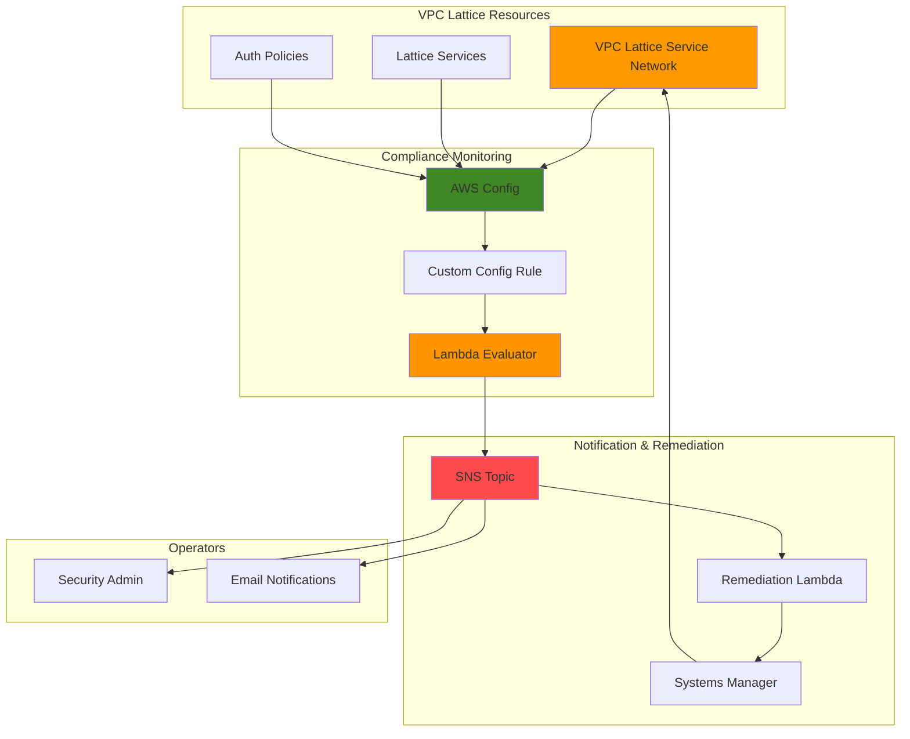

# Policy Enforcement Automation with VPC Lattice and Config

## Problem

Organizations using VPC Lattice service networks struggle with continuous compliance monitoring and enforcement of security policies across distributed microservices architectures. Manual auditing of auth policies, service associations, and network configurations is time-consuming, error-prone, and fails to provide real-time remediation when security violations occur, leaving organizations exposed to compliance drift and potential security breaches.

## Solution

Implement an automated policy enforcement system using AWS Config custom rules to monitor VPC Lattice service networks for compliance violations, Lambda functions for intelligent evaluation and remediation logic, and SNS for immediate notification workflows. This solution provides continuous compliance monitoring with automatic remediation capabilities that enforce organizational security policies across all VPC Lattice resources in real-time.

## Architecture Diagram



## Prerequisites

1. AWS account with administrator access to VPC Lattice, Config, Lambda, and SNS services
2. AWS CLI installed and configured (version 2.x or later)
3. Understanding of VPC Lattice service networks and auth policies
4. Knowledge of AWS Config rules and compliance evaluation
5. Estimated cost: $15-25 per month for AWS Config rules, Lambda executions, and SNS notifications

> **Note**: This recipe follows AWS Well-Architected Framework security principles by implementing defense-in-depth monitoring and automated remediation capabilities.

## Preparation

```bash
# Set environment variables
export AWS_REGION=$(aws configure get region)
export AWS_ACCOUNT_ID=$(aws sts get-caller-identity \
    --query Account --output text)

# Generate unique identifiers for resources
RANDOM_SUFFIX=$(aws secretsmanager get-random-password \
    --exclude-punctuation --exclude-uppercase \
    --password-length 6 --require-each-included-type \
    --output text --query RandomPassword)

# Set resource names
export SERVICE_NETWORK_NAME="compliance-demo-network-${RANDOM_SUFFIX}"
export CONFIG_RULE_NAME="vpc-lattice-policy-compliance-${RANDOM_SUFFIX}"
export SNS_TOPIC_NAME="lattice-compliance-alerts-${RANDOM_SUFFIX}"
export LAMBDA_FUNCTION_NAME="lattice-compliance-evaluator-${RANDOM_SUFFIX}"
export REMEDY_FUNCTION_NAME="lattice-auto-remediation-${RANDOM_SUFFIX}"

# Create IAM role for Config service
aws iam create-role \
    --role-name ConfigServiceRole-${RANDOM_SUFFIX} \
    --assume-role-policy-document '{
        "Version": "2012-10-17",
        "Statement": [
            {
                "Effect": "Allow",
                "Principal": {
                    "Service": "config.amazonaws.com"
                },
                "Action": "sts:AssumeRole"
            }
        ]
    }'

# Attach AWS managed policy for Config service
aws iam attach-role-policy \
    --role-name ConfigServiceRole-${RANDOM_SUFFIX} \
    --policy-arn arn:aws:iam::aws:policy/service-role/ConfigRole

# Add S3 bucket access policy for Config service role
aws iam put-role-policy \
    --role-name ConfigServiceRole-${RANDOM_SUFFIX} \
    --policy-name ConfigS3DeliveryRolePolicy \
    --policy-document '{
        "Version": "2012-10-17",
        "Statement": [
            {
                "Effect": "Allow",
                "Action": [
                    "s3:GetBucketAcl",
                    "s3:ListBucket"
                ],
                "Resource": "arn:aws:s3:::aws-config-bucket-*"
            },
            {
                "Effect": "Allow",
                "Action": "s3:PutObject",
                "Resource": "arn:aws:s3:::aws-config-bucket-*/AWSLogs/*/Config/*",
                "Condition": {
                    "StringEquals": {
                        "s3:x-amz-acl": "bucket-owner-full-control"
                    }
                }
            }
        ]
    }'

echo "✅ AWS environment configured for VPC Lattice compliance monitoring"
```

## Steps

1. **Create SNS Topic for Compliance Notifications**:

   SNS provides reliable, scalable messaging for compliance notifications, enabling immediate alerting when policy violations are detected. This foundation ensures security teams receive real-time notifications about VPC Lattice configuration changes that violate organizational policies.

   ```bash
   # Create SNS topic for compliance alerts
   aws sns create-topic \
       --name ${SNS_TOPIC_NAME} \
       --attributes '{
           "DisplayName": "VPC Lattice Compliance Alerts",
           "DeliveryPolicy": "{\"http\":{\"defaultHealthyRetryPolicy\":{\"minDelayTarget\":20,\"maxDelayTarget\":20,\"numRetries\":3}}}"
       }'
   
   # Get topic ARN
   export SNS_TOPIC_ARN=$(aws sns get-topic-attributes \
       --topic-arn arn:aws:sns:${AWS_REGION}:${AWS_ACCOUNT_ID}:${SNS_TOPIC_NAME} \
       --query 'Attributes.TopicArn' --output text)
   
   # Subscribe email endpoint (replace with your email)
   aws sns subscribe \
       --topic-arn ${SNS_TOPIC_ARN} \
       --protocol email \
       --notification-endpoint admin@company.com
   
   echo "✅ SNS topic created: ${SNS_TOPIC_ARN}"
   ```

2. **Create Lambda Function for Compliance Evaluation**:

   Lambda provides serverless compute for custom compliance logic that evaluates VPC Lattice resources against organizational policies. This function will analyze auth policies, service associations, and network configurations to determine compliance status and trigger appropriate responses.

   ```bash
   # Create Lambda execution role
   aws iam create-role \
       --role-name LatticeComplianceRole-${RANDOM_SUFFIX} \
       --assume-role-policy-document '{
           "Version": "2012-10-17",
           "Statement": [
               {
                   "Effect": "Allow",
                   "Principal": {
                       "Service": "lambda.amazonaws.com"
                   },
                   "Action": "sts:AssumeRole"
               }
           ]
       }'
   
   # Attach basic execution policy
   aws iam attach-role-policy \
       --role-name LatticeComplianceRole-${RANDOM_SUFFIX} \
       --policy-arn arn:aws:iam::aws:policy/service-role/AWSLambdaBasicExecutionRole
   
   # Create custom policy for VPC Lattice and Config access
   aws iam put-role-policy \
       --role-name LatticeComplianceRole-${RANDOM_SUFFIX} \
       --policy-name LatticeCompliancePolicy \
       --policy-document '{
           "Version": "2012-10-17",
           "Statement": [
               {
                   "Effect": "Allow",
                   "Action": [
                       "vpc-lattice:*",
                       "config:PutEvaluations",
                       "sns:Publish",
                       "logs:CreateLogGroup",
                       "logs:CreateLogStream",
                       "logs:PutLogEvents"
                   ],
                   "Resource": "*"
               }
           ]
       }'
   
   # Wait for role propagation
   sleep 10
   
   # Get role ARN
   export LAMBDA_ROLE_ARN=$(aws iam get-role \
       --role-name LatticeComplianceRole-${RANDOM_SUFFIX} \
       --query 'Role.Arn' --output text)
   
   echo "✅ Lambda IAM role created: ${LAMBDA_ROLE_ARN}"
   ```

3. **Deploy Lambda Compliance Evaluator Function**:

   This Lambda function contains the core compliance logic that evaluates VPC Lattice service networks against organizational security policies, checking for proper auth policies, encryption settings, and access controls.

   ```bash
   # Create Lambda function code
   cat > compliance_evaluator.py << 'EOF'
import json
import boto3
import logging
import os
from datetime import datetime

logger = logging.getLogger()
logger.setLevel(logging.INFO)

def lambda_handler(event, context):
    """Evaluate VPC Lattice resources for compliance."""
    
    config_client = boto3.client('config')
    lattice_client = boto3.client('vpc-lattice')
    sns_client = boto3.client('sns')
    
    # Parse Config rule invocation
    configuration_item = event['configurationItem']
    rule_parameters = json.loads(event.get('ruleParameters', '{}'))
    
    compliance_type = 'COMPLIANT'
    annotation = 'Resource is compliant with security policies'
    
    try:
        resource_type = configuration_item['resourceType']
        resource_id = configuration_item['resourceId']
        
        if resource_type == 'AWS::VpcLattice::ServiceNetwork':
            compliance_type, annotation = evaluate_service_network(
                lattice_client, resource_id, rule_parameters
            )
        elif resource_type == 'AWS::VpcLattice::Service':
            compliance_type, annotation = evaluate_service(
                lattice_client, resource_id, rule_parameters
            )
        
        # Send notification if non-compliant
        if compliance_type == 'NON_COMPLIANT':
            send_compliance_notification(sns_client, resource_id, annotation)
            
    except Exception as e:
        logger.error(f"Error evaluating compliance: {str(e)}")
        compliance_type = 'NOT_APPLICABLE'
        annotation = f"Error during evaluation: {str(e)}"
    
    # Return evaluation result to Config
    config_client.put_evaluations(
        Evaluations=[
            {
                'ComplianceResourceType': configuration_item['resourceType'],
                'ComplianceResourceId': configuration_item['resourceId'],
                'ComplianceType': compliance_type,
                'Annotation': annotation,
                'OrderingTimestamp': configuration_item['configurationItemCaptureTime']
            }
        ],
        ResultToken=event['resultToken']
    )
    
    return {
        'statusCode': 200,
        'body': json.dumps(f'Evaluation complete: {compliance_type}')
    }

def evaluate_service_network(client, network_id, parameters):
    """Evaluate service network compliance."""
    try:
        # Get service network details
        response = client.get_service_network(serviceNetworkIdentifier=network_id)
        network = response['serviceNetwork']
        
        # Check for auth policy requirement
        if parameters.get('requireAuthPolicy', 'true') == 'true':
            try:
                client.get_auth_policy(resourceIdentifier=network_id)
            except client.exceptions.ResourceNotFoundException:
                return 'NON_COMPLIANT', 'Service network missing required auth policy'
        
        # Check network name compliance
        if not network['name'].startswith(parameters.get('namePrefix', 'secure-')):
            return 'NON_COMPLIANT', f"Service network name must start with {parameters.get('namePrefix', 'secure-')}"
        
        return 'COMPLIANT', 'Service network meets all security requirements'
        
    except Exception as e:
        return 'NOT_APPLICABLE', f"Unable to evaluate service network: {str(e)}"

def evaluate_service(client, service_id, parameters):
    """Evaluate service compliance."""
    try:
        response = client.get_service(serviceIdentifier=service_id)
        service = response['service']
        
        # Check auth type requirement
        if parameters.get('requireAuth', 'true') == 'true':
            if service.get('authType') == 'NONE':
                return 'NON_COMPLIANT', 'Service must have authentication enabled'
        
        return 'COMPLIANT', 'Service meets security requirements'
        
    except Exception as e:
        return 'NOT_APPLICABLE', f"Unable to evaluate service: {str(e)}"

def send_compliance_notification(sns_client, resource_id, message):
    """Send SNS notification for compliance violations."""
    try:
        sns_client.publish(
            TopicArn=os.environ['SNS_TOPIC_ARN'],
            Subject='VPC Lattice Compliance Violation Detected',
            Message=f"""
Compliance violation detected:

Resource ID: {resource_id}
Issue: {message}
Timestamp: {datetime.utcnow().isoformat()}

Please review and remediate this resource immediately.
            """
        )
    except Exception as e:
        logger.error(f"Failed to send SNS notification: {str(e)}")
EOF
   
   # Create deployment package
   zip compliance_evaluator.zip compliance_evaluator.py
   
   # Create Lambda function
   aws lambda create-function \
       --function-name ${LAMBDA_FUNCTION_NAME} \
       --runtime python3.12 \
       --role ${LAMBDA_ROLE_ARN} \
       --handler compliance_evaluator.lambda_handler \
       --zip-file fileb://compliance_evaluator.zip \
       --timeout 60 \
       --memory-size 256 \
       --environment Variables="{SNS_TOPIC_ARN=${SNS_TOPIC_ARN}}"
   
   echo "✅ Lambda compliance evaluator deployed: ${LAMBDA_FUNCTION_NAME}"
   ```

4. **Set Up AWS Config Configuration Recorder**:

   AWS Config provides continuous monitoring and recording of AWS resource configurations, creating the foundation for compliance evaluation by tracking changes to VPC Lattice resources and triggering evaluation rules when modifications occur.

   ```bash
   # Create S3 bucket for Config
   aws s3 mb s3://aws-config-bucket-${AWS_ACCOUNT_ID}-${AWS_REGION}-${RANDOM_SUFFIX}
   
   # Apply bucket policy for AWS Config service
   cat > config-bucket-policy.json << EOF
{
  "Version": "2012-10-17",
  "Statement": [
    {
      "Sid": "AWSConfigBucketPermissionsCheck",
      "Effect": "Allow",
      "Principal": {
        "Service": "config.amazonaws.com"
      },
      "Action": "s3:GetBucketAcl",
      "Resource": "arn:aws:s3:::aws-config-bucket-${AWS_ACCOUNT_ID}-${AWS_REGION}-${RANDOM_SUFFIX}",
      "Condition": {
        "StringEquals": {
          "AWS:SourceAccount": "${AWS_ACCOUNT_ID}"
        }
      }
    },
    {
      "Sid": "AWSConfigBucketExistenceCheck",
      "Effect": "Allow",
      "Principal": {
        "Service": "config.amazonaws.com"
      },
      "Action": "s3:ListBucket",
      "Resource": "arn:aws:s3:::aws-config-bucket-${AWS_ACCOUNT_ID}-${AWS_REGION}-${RANDOM_SUFFIX}",
      "Condition": {
        "StringEquals": {
          "AWS:SourceAccount": "${AWS_ACCOUNT_ID}"
        }
      }
    },
    {
      "Sid": "AWSConfigBucketDelivery",
      "Effect": "Allow",
      "Principal": {
        "Service": "config.amazonaws.com"
      },
      "Action": "s3:PutObject",
      "Resource": "arn:aws:s3:::aws-config-bucket-${AWS_ACCOUNT_ID}-${AWS_REGION}-${RANDOM_SUFFIX}/AWSLogs/${AWS_ACCOUNT_ID}/Config/*",
      "Condition": {
        "StringEquals": {
          "s3:x-amz-acl": "bucket-owner-full-control",
          "AWS:SourceAccount": "${AWS_ACCOUNT_ID}"
        }
      }
    }
  ]
}
EOF
   
   # Apply bucket policy
   aws s3api put-bucket-policy \
       --bucket aws-config-bucket-${AWS_ACCOUNT_ID}-${AWS_REGION}-${RANDOM_SUFFIX} \
       --policy file://config-bucket-policy.json
   
   # Create Config delivery channel
   aws configservice put-delivery-channel \
       --delivery-channel '{
           "name": "default",
           "s3BucketName": "aws-config-bucket-'${AWS_ACCOUNT_ID}'-'${AWS_REGION}'-'${RANDOM_SUFFIX}'"
       }'
   
   # Create configuration recorder
   aws configservice put-configuration-recorder \
       --configuration-recorder '{
           "name": "default",
           "roleARN": "arn:aws:iam::'${AWS_ACCOUNT_ID}':role/ConfigServiceRole-'${RANDOM_SUFFIX}'",
           "recordingGroup": {
               "allSupported": false,
               "includeGlobalResourceTypes": false,
               "resourceTypes": [
                   "AWS::VpcLattice::ServiceNetwork",
                   "AWS::VpcLattice::Service"
               ]
           }
       }'
   
   # Start configuration recorder
   aws configservice start-configuration-recorder \
       --configuration-recorder-name default
   
   echo "✅ AWS Config recorder configured for VPC Lattice resources"
   ```

5. **Create Custom Config Rule for VPC Lattice Compliance**:

   Custom Config rules provide automated compliance evaluation by connecting AWS Config's resource monitoring capabilities with our Lambda-based evaluation logic, enabling real-time policy enforcement across all VPC Lattice resources.

   ```bash
   # Get Lambda function ARN
   export LAMBDA_ARN=$(aws lambda get-function \
       --function-name ${LAMBDA_FUNCTION_NAME} \
       --query 'Configuration.FunctionArn' --output text)
   
   # Grant Config permission to invoke Lambda
   aws lambda add-permission \
       --function-name ${LAMBDA_FUNCTION_NAME} \
       --statement-id allow-config-invoke \
       --action lambda:InvokeFunction \
       --principal config.amazonaws.com \
       --source-account ${AWS_ACCOUNT_ID}
   
   # Create Config rule
   aws configservice put-config-rule \
       --config-rule '{
           "ConfigRuleName": "'${CONFIG_RULE_NAME}'",
           "Description": "Evaluates VPC Lattice resources for compliance with security policies",
           "Source": {
               "Owner": "AWS_LAMBDA",
               "SourceIdentifier": "'${LAMBDA_ARN}'",
               "SourceDetails": [
                   {
                       "EventSource": "aws.config",
                       "MessageType": "ConfigurationItemChangeNotification"
                   },
                   {
                       "EventSource": "aws.config", 
                       "MessageType": "OversizedConfigurationItemChangeNotification"
                   }
               ]
           },
           "InputParameters": "{\"requireAuthPolicy\": \"true\", \"namePrefix\": \"secure-\", \"requireAuth\": \"true\"}"
       }'
   
   echo "✅ Config rule created: ${CONFIG_RULE_NAME}"
   ```

6. **Create VPC Lattice Service Network for Testing**:

   Creating a test VPC Lattice service network allows us to validate our compliance monitoring system by generating configuration changes that trigger our Config rules and Lambda evaluations.

   ```bash
   # Create VPC for service network association
   export VPC_ID=$(aws ec2 create-vpc \
       --cidr-block 10.0.0.0/16 \
       --tag-specifications 'ResourceType=vpc,Tags=[{Key=Name,Value=lattice-compliance-vpc}]' \
       --query 'Vpc.VpcId' --output text)
   
   # Create VPC Lattice service network (non-compliant name for testing)
   export SERVICE_NETWORK_ID=$(aws vpc-lattice create-service-network \
       --name "test-network-${RANDOM_SUFFIX}" \
       --auth-type AWS_IAM \
       --query 'id' --output text)
   
   # Associate VPC with service network
   aws vpc-lattice create-service-network-vpc-association \
       --service-network-identifier ${SERVICE_NETWORK_ID} \
       --vpc-identifier ${VPC_ID}
   
   echo "✅ VPC Lattice service network created: ${SERVICE_NETWORK_ID}"
   ```

7. **Deploy Automated Remediation Lambda Function**:

   Automated remediation capabilities provide immediate response to compliance violations, reducing manual intervention and ensuring consistent policy enforcement across all VPC Lattice resources through predefined corrective actions.

   ```bash
   # Create remediation function code
   cat > auto_remediation.py << 'EOF'
import json
import boto3
import logging
import os

logger = logging.getLogger()
logger.setLevel(logging.INFO)

def lambda_handler(event, context):
    """Automatically remediate VPC Lattice compliance violations."""
    
    lattice_client = boto3.client('vpc-lattice')
    config_client = boto3.client('config')
    
    try:
        # Parse SNS message
        message = json.loads(event['Records'][0]['Sns']['Message'])
        resource_id = extract_resource_id(message)
        
        if not resource_id:
            logger.error("Unable to extract resource ID from message")
            return
        
        # Attempt remediation based on resource type
        if 'service-network' in resource_id:
            remediate_service_network(lattice_client, resource_id)
        elif 'service' in resource_id:
            remediate_service(lattice_client, resource_id)
        
        # Trigger Config re-evaluation
        config_client.start_config_rules_evaluation(
            ConfigRuleNames=[os.environ['CONFIG_RULE_NAME']]
        )
        
        return {
            'statusCode': 200,
            'body': json.dumps('Remediation completed successfully')
        }
        
    except Exception as e:
        logger.error(f"Remediation failed: {str(e)}")
        return {
            'statusCode': 500,
            'body': json.dumps(f'Remediation failed: {str(e)}')
        }

def extract_resource_id(message):
    """Extract resource ID from compliance message."""
    # Simple extraction logic - in production, use more robust parsing
    lines = message.split('\n')
    for line in lines:
        if 'Resource ID:' in line:
            return line.split('Resource ID:')[1].strip()
    return None

def remediate_service_network(client, network_id):
    """Apply remediation to service network."""
    try:
        # Create basic auth policy if missing
        auth_policy = {
            "Version": "2012-10-17",
            "Statement": [
                {
                    "Effect": "Allow",
                    "Principal": "*",
                    "Action": "vpc-lattice-svcs:*",
                    "Resource": "*",
                    "Condition": {
                        "StringEquals": {
                            "aws:PrincipalAccount": os.environ['AWS_ACCOUNT_ID']
                        }
                    }
                }
            ]
        }
        
        client.put_auth_policy(
            resourceIdentifier=network_id,
            policy=json.dumps(auth_policy)
        )
        
        logger.info(f"Applied auth policy to service network: {network_id}")
        
    except Exception as e:
        logger.error(f"Failed to remediate service network {network_id}: {str(e)}")

def remediate_service(client, service_id):
    """Apply remediation to service."""
    try:
        # Update service to require authentication
        client.update_service(
            serviceIdentifier=service_id,
            authType='AWS_IAM'
        )
        
        logger.info(f"Updated service authentication: {service_id}")
        
    except Exception as e:
        logger.error(f"Failed to remediate service {service_id}: {str(e)}")
EOF
   
   # Create deployment package
   zip auto_remediation.zip auto_remediation.py
   
   # Create remediation Lambda function
   aws lambda create-function \
       --function-name ${REMEDY_FUNCTION_NAME} \
       --runtime python3.12 \
       --role ${LAMBDA_ROLE_ARN} \
       --handler auto_remediation.lambda_handler \
       --zip-file fileb://auto_remediation.zip \
       --timeout 120 \
       --memory-size 256 \
       --environment Variables="{CONFIG_RULE_NAME=${CONFIG_RULE_NAME},AWS_ACCOUNT_ID=${AWS_ACCOUNT_ID}}"
   
   # Subscribe remediation function to SNS topic
   aws sns subscribe \
       --topic-arn ${SNS_TOPIC_ARN} \
       --protocol lambda \
       --notification-endpoint $(aws lambda get-function \
           --function-name ${REMEDY_FUNCTION_NAME} \
           --query 'Configuration.FunctionArn' --output text)
   
   # Grant SNS permission to invoke Lambda
   aws lambda add-permission \
       --function-name ${REMEDY_FUNCTION_NAME} \
       --statement-id allow-sns-invoke \
       --action lambda:InvokeFunction \
       --principal sns.amazonaws.com \
       --source-arn ${SNS_TOPIC_ARN}
   
   echo "✅ Auto-remediation Lambda deployed and connected to SNS"
   ```

## Validation & Testing

1. **Verify Config Rule Activation**:

   ```bash
   # Check Config recorder status
   aws configservice describe-configuration-recorders \
       --query 'ConfigurationRecorders[0].recordingGroup'
   
   aws configservice describe-configuration-recorder-status \
       --query 'ConfigurationRecordersStatus[0].recording'
   
   # Check Config rule status
   aws configservice describe-config-rules \
       --config-rule-names ${CONFIG_RULE_NAME}
   
   # Verify compliance evaluation
   aws configservice get-compliance-details-by-config-rule \
       --config-rule-name ${CONFIG_RULE_NAME}
   ```

   Expected output: Config recorder should show "recording": true, and Config rule should show as "ACTIVE" with evaluation results for VPC Lattice resources.

2. **Test Compliance Violation Detection**:

   ```bash
   # Create a non-compliant service (no auth)
   export TEST_SERVICE_ID=$(aws vpc-lattice create-service \
       --name "test-service-${RANDOM_SUFFIX}" \
       --auth-type NONE \
       --query 'id' --output text)
   
   echo "✅ Created test service: ${TEST_SERVICE_ID}"
   
   # Wait for Config evaluation (Config can take several minutes to detect changes)
   echo "Waiting for AWS Config to detect and evaluate the new service..."
   sleep 60
   
   # Check compliance status
   aws configservice get-compliance-details-by-config-rule \
       --config-rule-name ${CONFIG_RULE_NAME} \
       --compliance-types NON_COMPLIANT
   ```

3. **Verify SNS Notification Delivery**:

   ```bash
   # Check SNS topic for message delivery
   aws sns get-topic-attributes \
       --topic-arn ${SNS_TOPIC_ARN} \
       --query 'Attributes.NumberOfMessagesPublished'
   
   # List recent CloudWatch logs for Lambda function
   aws logs describe-log-groups \
       --log-group-name-prefix "/aws/lambda/${LAMBDA_FUNCTION_NAME}"
   ```

4. **Test Automated Remediation**:

   ```bash
   # Trigger manual remediation test
   aws lambda invoke \
       --function-name ${REMEDY_FUNCTION_NAME} \
       --payload '{"Records":[{"Sns":{"Message":"{\"Resource ID\": \"'${TEST_SERVICE_ID}'\"}"}}]}' \
       response.json
   
   # Verify remediation outcome
   aws vpc-lattice get-service \
       --service-identifier ${TEST_SERVICE_ID} \
       --query 'authType'
   ```

## Cleanup

1. **Remove Lambda Functions**:

   ```bash
   # Delete Lambda functions
   aws lambda delete-function --function-name ${LAMBDA_FUNCTION_NAME}
   aws lambda delete-function --function-name ${REMEDY_FUNCTION_NAME}
   
   echo "✅ Lambda functions deleted"
   ```

2. **Remove AWS Config Resources**:

   ```bash
   # Delete Config rule
   aws configservice delete-config-rule \
       --config-rule-name ${CONFIG_RULE_NAME}
   
   # Stop and delete configuration recorder
   aws configservice stop-configuration-recorder \
       --configuration-recorder-name default
   
   aws configservice delete-configuration-recorder \
       --configuration-recorder-name default
   
   aws configservice delete-delivery-channel \
       --delivery-channel-name default
   
   echo "✅ AWS Config resources removed"
   ```

3. **Remove VPC Lattice Resources**:

   ```bash
   # Delete test service
   aws vpc-lattice delete-service \
       --service-identifier ${TEST_SERVICE_ID}
   
   # Delete service network VPC association
   aws vpc-lattice delete-service-network-vpc-association \
       --service-network-vpc-association-identifier \
       $(aws vpc-lattice list-service-network-vpc-associations \
           --service-network-identifier ${SERVICE_NETWORK_ID} \
           --query 'items[0].id' --output text)
   
   # Delete service network
   aws vpc-lattice delete-service-network \
       --service-network-identifier ${SERVICE_NETWORK_ID}
   
   # Delete VPC
   aws ec2 delete-vpc --vpc-id ${VPC_ID}
   
   echo "✅ VPC Lattice resources cleaned up"
   ```

4. **Remove IAM Roles and SNS Topic**:

   ```bash
   # Delete IAM roles
   aws iam detach-role-policy \
       --role-name LatticeComplianceRole-${RANDOM_SUFFIX} \
       --policy-arn arn:aws:iam::aws:policy/service-role/AWSLambdaBasicExecutionRole
   
   aws iam delete-role-policy \
       --role-name LatticeComplianceRole-${RANDOM_SUFFIX} \
       --policy-name LatticeCompliancePolicy
   
   aws iam delete-role --role-name LatticeComplianceRole-${RANDOM_SUFFIX}
   
   aws iam detach-role-policy \
       --role-name ConfigServiceRole-${RANDOM_SUFFIX} \
       --policy-arn arn:aws:iam::aws:policy/service-role/ConfigRole
   
   aws iam delete-role-policy \
       --role-name ConfigServiceRole-${RANDOM_SUFFIX} \
       --policy-name ConfigS3DeliveryRolePolicy
   
   aws iam delete-role --role-name ConfigServiceRole-${RANDOM_SUFFIX}
   
   # Delete SNS topic
   aws sns delete-topic --topic-arn ${SNS_TOPIC_ARN}
   
   # Delete S3 bucket
   aws s3 rb s3://aws-config-bucket-${AWS_ACCOUNT_ID}-${AWS_REGION}-${RANDOM_SUFFIX} --force
   
   # Clean up temporary files
   rm -f compliance_evaluator.py compliance_evaluator.zip
   rm -f auto_remediation.py auto_remediation.zip
   rm -f config-bucket-policy.json response.json
   
   echo "✅ All resources cleaned up successfully"
   ```

## Discussion

This solution implements a comprehensive policy enforcement system that leverages AWS Config's continuous monitoring capabilities with VPC Lattice's service mesh architecture to provide automated compliance governance. The integration between AWS Config custom rules and Lambda functions enables sophisticated policy evaluation logic that can adapt to complex organizational requirements beyond simple rule-based checking. This approach follows the [AWS Well-Architected Framework security pillar](https://docs.aws.amazon.com/wellarchitected/latest/security-pillar/welcome.html) by implementing defense-in-depth monitoring and automated response capabilities.

The automated remediation component demonstrates how AWS services can work together to create self-healing infrastructure that maintains compliance without human intervention. By combining SNS notifications with Lambda-based remediation functions, organizations can implement graduated response systems that escalate from automatic fixes to human notification based on violation severity. This pattern aligns with AWS operational excellence principles through automation and reliability through continuous monitoring, as outlined in the [AWS Config best practices documentation](https://docs.aws.amazon.com/config/latest/developerguide/best-practices.html).

The solution provides significant value for organizations managing microservices architectures where service-to-service communication policies must be consistently enforced across potentially hundreds of services. VPC Lattice's auth policies and service associations create multiple enforcement points that require continuous monitoring to prevent configuration drift and ensure security boundaries remain intact. For additional guidance on VPC Lattice security patterns, see the [VPC Lattice User Guide](https://docs.aws.amazon.com/vpc-lattice/latest/ug/security.html).

> **Tip**: Consider implementing custom CloudWatch metrics from your Lambda functions to track compliance violation trends and remediation success rates, enabling proactive identification of systemic configuration issues.

## Challenge

Extend this solution by implementing these enhancements:

1. **Multi-Account Compliance Monitoring**: Use AWS Organizations and Config aggregation to monitor VPC Lattice compliance across multiple AWS accounts from a central security account.

2. **Advanced Policy Templates**: Create a library of customizable policy templates stored in Systems Manager Parameter Store that can be dynamically applied based on service tags or organizational units.

3. **Compliance Drift Detection**: Implement CloudWatch Events integration to detect and alert on rapid configuration changes that might indicate unauthorized modifications or potential security incidents.

4. **Integration with AWS Security Hub**: Send compliance findings to Security Hub for centralized security posture management and integration with third-party security tools.

5. **Cost-Aware Compliance**: Extend the solution to include cost governance by monitoring VPC Lattice resource utilization and automatically scaling down or terminating unused services while maintaining compliance requirements.

## Infrastructure Code

*Infrastructure code will be generated after recipe approval.*