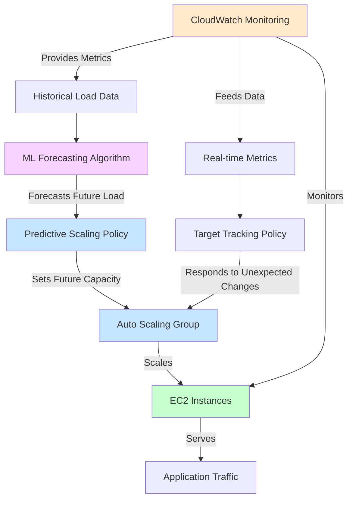

# Implementing Predictive Scaling for EC2 with Auto Scaling and Machine Learning

## Problem

Your e-commerce application experiences predictable but variable load patterns that follow daily and weekly cycles. During peak periods, your infrastructure struggles to scale up quickly enough, resulting in degraded performance and poor customer experience. During low-traffic periods, you're wasting resources on idle EC2 instances. You need a solution that proactively adjusts capacity before demand changes, rather than reactively scaling after performance issues occur.

## Solution

Implement AWS Auto Scaling's predictive scaling feature, which uses machine learning to analyze historical load patterns and automatically forecast future capacity needs. By combining predictive scaling with dynamic target tracking scaling policies, you can create a comprehensive scaling strategy that both anticipates future load based on patterns and adapts to unexpected changes in demand. This solution allows your infrastructure to scale up in advance of predicted demand spikes and scale down during predictable low-traffic periods.

## Architecture Diagram



## Prerequisites

1. AWS account with administrator access
2. VPC with at least two public subnets in different Availability Zones
3. Basic understanding of EC2, Auto Scaling, and CloudWatch
4. A working application with at least 24 hours of historical metric data
5. AWS CLI version 2 installed and configured with proper credentials
6. Estimated cost: $20-50 per month depending on instance types and scale

## Preparation

1. Create a VPC if you don't already have one:

   ```bash
   export AWS_REGION=$(aws configure get region)
   export VPC_ID=$(aws ec2 create-vpc --cidr-block 10.0.0.0/16 \
     --tag-specifications 'ResourceType=vpc,Tags=[{Key=Name,Value=PredictiveScalingVPC}]' \
     --query Vpc.VpcId --output text)
   
   aws ec2 create-subnet --vpc-id $VPC_ID --cidr-block 10.0.1.0/24 \
     --availability-zone ${AWS_REGION}a \
     --tag-specifications 'ResourceType=subnet,Tags=[{Key=Name,Value=PredictiveScalingSubnet1}]'
     
   aws ec2 create-subnet --vpc-id $VPC_ID --cidr-block 10.0.2.0/24 \
     --availability-zone ${AWS_REGION}b \
     --tag-specifications 'ResourceType=subnet,Tags=[{Key=Name,Value=PredictiveScalingSubnet2}]'
   
   export SUBNET_ID_1=$(aws ec2 describe-subnets \
     --filters "Name=vpc-id,Values=$VPC_ID" "Name=cidr-block,Values=10.0.1.0/24" \
     --query "Subnets[0].SubnetId" --output text)
     
   export SUBNET_ID_2=$(aws ec2 describe-subnets \
     --filters "Name=vpc-id,Values=$VPC_ID" "Name=cidr-block,Values=10.0.2.0/24" \
     --query "Subnets[0].SubnetId" --output text)
   ```

2. Create an internet gateway and attach it to your VPC:

   ```bash
   export IGW_ID=$(aws ec2 create-internet-gateway \
     --tag-specifications 'ResourceType=internet-gateway,Tags=[{Key=Name,Value=PredictiveScalingIGW}]' \
     --query InternetGateway.InternetGatewayId --output text)
   
   aws ec2 attach-internet-gateway --vpc-id $VPC_ID --internet-gateway-id $IGW_ID
   ```

3. Create a route table and add a route to the internet:

   ```bash
   export RTB_ID=$(aws ec2 create-route-table --vpc-id $VPC_ID \
     --tag-specifications 'ResourceType=route-table,Tags=[{Key=Name,Value=PredictiveScalingRTB}]' \
     --query RouteTable.RouteTableId --output text)
   
   aws ec2 create-route --route-table-id $RTB_ID \
     --destination-cidr-block 0.0.0.0/0 --gateway-id $IGW_ID
   
   aws ec2 associate-route-table --subnet-id $SUBNET_ID_1 \
     --route-table-id $RTB_ID
   
   aws ec2 associate-route-table --subnet-id $SUBNET_ID_2 \
     --route-table-id $RTB_ID
   ```

4. Create a security group for your EC2 instances:

   ```bash
   export SG_ID=$(aws ec2 create-security-group \
     --group-name PredictiveScalingSG \
     --description "Security group for Predictive Scaling demo" \
     --vpc-id $VPC_ID \
     --query GroupId --output text)
   
   # Allow HTTP traffic
   aws ec2 authorize-security-group-ingress --group-id $SG_ID \
     --protocol tcp --port 80 --cidr 0.0.0.0/0
   ```

5. Create a launch template for your Auto Scaling group:

   ```bash
   # Get the latest Amazon Linux 2 AMI ID
   export AMI_ID=$(aws ec2 describe-images \
     --owners amazon \
     --filters "Name=name,Values=amzn2-ami-hvm-2.0.*-x86_64-gp2" "Name=state,Values=available" \
     --query "sort_by(Images, &CreationDate)[-1].ImageId" \
     --output text)
   
   # Create user data script for a simple web server
   cat > user-data.txt << 'EOF'
   #!/bin/bash
   yum update -y
   yum install -y httpd
   systemctl start httpd
   systemctl enable httpd
   echo "<html><body><h1>Predictive Scaling Demo</h1><p>Instance ID: $(curl -s http://169.254.169.254/latest/meta-data/instance-id)</p></body></html>" > /var/www/html/index.html
   # Create CPU load for demonstration purposes
   cat > /etc/cron.d/stress << 'END'
   # Create CPU load during business hours (8 AM - 8 PM UTC) on weekdays
   0 8 * * 1-5 root stress --cpu 2 --timeout 12h
   # Create lower CPU load during weekends
   0 10 * * 6,0 root stress --cpu 1 --timeout 8h
   END
   yum install -y stress
   EOF
   
   export LAUNCH_TEMPLATE_ID=$(aws ec2 create-launch-template \
     --launch-template-name PredictiveScalingTemplate \
     --version-description "Initial version" \
     --launch-template-data "{
       \"ImageId\": \"$AMI_ID\",
       \"InstanceType\": \"t3.micro\",
       \"SecurityGroupIds\": [\"$SG_ID\"],
       \"UserData\": \"$(base64 user-data.txt)\",
       \"TagSpecifications\": [{
         \"ResourceType\": \"instance\",
         \"Tags\": [{
           \"Key\": \"Name\",
           \"Value\": \"PredictiveScalingInstance\"
         }]
       }]
     }" \
     --query LaunchTemplate.LaunchTemplateId --output text)
   ```

6. Create an IAM role for EC2 instances:

   ```bash
   cat > trust-policy.json << 'EOF'
   {
     "Version": "2012-10-17",
     "Statement": [
       {
         "Effect": "Allow",
         "Principal": {
           "Service": "ec2.amazonaws.com"
         },
         "Action": "sts:AssumeRole"
       }
     ]
   }
   EOF
   
   aws iam create-role --role-name PredictiveScalingEC2Role \
     --assume-role-policy-document file://trust-policy.json
   
   aws iam attach-role-policy --role-name PredictiveScalingEC2Role \
     --policy-arn arn:aws:iam::aws:policy/CloudWatchAgentServerPolicy
   
   export INSTANCE_PROFILE=$(aws iam create-instance-profile \
     --instance-profile-name PredictiveScalingProfile \
     --query InstanceProfile.InstanceProfileName --output text)
   
   aws iam add-role-to-instance-profile \
     --instance-profile-name PredictiveScalingProfile \
     --role-name PredictiveScalingEC2Role
   ```

## Steps

### Step 1: Create an Auto Scaling Group

Auto Scaling Groups (ASGs) are the foundation of elastic compute capacity management in AWS. They automatically manage the number of EC2 instances running to maintain application availability and scale capacity up or down based on defined policies. The ASG will serve as the target for our predictive scaling policies, enabling intelligent capacity adjustments based on machine learning forecasts.

1. **Create your Auto Scaling group with initial settings**:

   ```bash
   aws autoscaling create-auto-scaling-group \
     --auto-scaling-group-name PredictiveScalingASG \
     --launch-template LaunchTemplateId=$LAUNCH_TEMPLATE_ID \
     --min-size 2 \
     --max-size 10 \
     --desired-capacity 2 \
     --vpc-zone-identifier "$SUBNET_ID_1,$SUBNET_ID_2" \
     --default-instance-warmup 300 \
     --tags "Key=Environment,Value=Production,PropagateAtLaunch=true"
   
   echo "✅ Auto Scaling Group created successfully"
   ```

   The ASG is now configured with a baseline capacity of 2 instances and can scale up to 10 instances as needed. The `default-instance-warmup` parameter is critical for predictive scaling accuracy, as it tells AWS how long new instances need to become fully operational and contribute to your application's capacity.

> **Note**: Setting the `default-instance-warmup` parameter is crucial for predictive scaling. This tells Auto Scaling how long it takes for your instances to initialize before they can handle traffic efficiently.

### Step 2: Configure CloudWatch Dashboards for Monitoring

CloudWatch dashboards provide real-time visibility into your infrastructure's performance and scaling behavior. This monitoring capability is essential for understanding how predictive scaling affects your application and for validating that the machine learning forecasts align with actual usage patterns. The dashboard will help you correlate scaling events with performance metrics.

1. **Create a dashboard to monitor your Auto Scaling group's performance**:

   ```bash
   cat > dashboard.json << 'EOF'
   {
     "widgets": [
       {
         "type": "metric",
         "x": 0,
         "y": 0,
         "width": 12,
         "height": 6,
         "properties": {
           "metrics": [
             [ "AWS/EC2", "CPUUtilization", "AutoScalingGroupName", "PredictiveScalingASG", { "stat": "Average" } ]
           ],
           "period": 300,
           "title": "ASG CPU Utilization",
           "region": "REGION_PLACEHOLDER",
           "view": "timeSeries"
         }
       },
       {
         "type": "metric",
         "x": 12,
         "y": 0,
         "width": 12,
         "height": 6,
         "properties": {
           "metrics": [
             [ "AWS/AutoScaling", "GroupInServiceInstances", "AutoScalingGroupName", "PredictiveScalingASG" ]
           ],
           "period": 300,
           "title": "ASG Instance Count",
           "region": "REGION_PLACEHOLDER",
           "view": "timeSeries"
         }
       }
     ]
   }
   EOF
   
   sed -i "s/REGION_PLACEHOLDER/$AWS_REGION/g" dashboard.json
   
   aws cloudwatch put-dashboard \
     --dashboard-name PredictiveScalingDashboard \
     --dashboard-body file://dashboard.json
   
   echo "✅ CloudWatch dashboard created successfully"
   ```

   The dashboard is now configured to display both CPU utilization trends and instance count changes over time. This visualization will be crucial for observing how predictive scaling adjusts capacity before load increases, providing insight into the effectiveness of the machine learning forecasts.

### Step 3: Create a Target Tracking Scaling Policy

Target tracking scaling policies provide reactive scaling capability that complements predictive scaling by responding to real-time changes in application load. While predictive scaling anticipates capacity needs based on historical patterns, target tracking ensures your application maintains optimal performance even when traffic deviates from predicted patterns. This dual approach creates a robust scaling strategy that handles both expected and unexpected load variations.

1. **Configure a target tracking scaling policy to handle unexpected changes in load**:

   ```bash
   aws autoscaling put-scaling-policy \
     --auto-scaling-group-name PredictiveScalingASG \
     --policy-name CPUTargetTracking \
     --policy-type TargetTrackingScaling \
     --target-tracking-configuration "{
       \"PredefinedMetricSpecification\": {
         \"PredefinedMetricType\": \"ASGAverageCPUUtilization\"
       },
       \"TargetValue\": 50.0,
       \"DisableScaleIn\": false
     }"
   
   echo "✅ Target tracking scaling policy created successfully"
   ```

   The target tracking policy is now active and will automatically adjust capacity to maintain 50% average CPU utilization. This creates a safety net that ensures application performance remains consistent even when predictive scaling forecasts are inaccurate or when unexpected traffic spikes occur.

> **Tip**: Target tracking scaling is ideal for complementing predictive scaling because it automatically adjusts your capacity based on a target utilization value. For CPU-intensive workloads, a target value between 40-60% is typically optimal to balance cost and performance.

### Step 4: Wait for Historical Data

Predictive scaling relies on machine learning algorithms that analyze historical load patterns to generate accurate forecasts. AWS requires a minimum of 24 hours of metric history to establish baseline patterns, but the algorithm becomes more accurate with 14 days of data. The machine learning models identify recurring patterns at different time scales (hourly, daily, weekly) to predict future capacity requirements.

1. **Allow time for historical data collection**:

   For an effective predictive scaling policy, you need at least 24 hours of metric history. For our recipe, we'll assume some time has passed, and your Auto Scaling group now has sufficient historical data.

   The Auto Scaling service continuously collects metrics during this period, building a comprehensive understanding of your application's load patterns. This data forms the foundation for accurate capacity forecasting and ensures predictive scaling can make informed decisions about future scaling actions.

### Step 5: Create a Predictive Scaling Policy

Predictive scaling policies use machine learning to forecast future capacity requirements and automatically adjust your Auto Scaling group's capacity before demand changes occur. This proactive approach eliminates the traditional lag time between load increases and scaling responses, ensuring your application maintains optimal performance during traffic spikes. The policy configuration defines how aggressive the scaling should be and how much buffer capacity to maintain.

1. **Create a predictive scaling configuration file**:

   ```bash
   cat > predictive-scaling-config.json << 'EOF'
   {
     "MetricSpecifications": [
       {
         "TargetValue": 50,
         "PredefinedMetricPairSpecification": {
           "PredefinedMetricType": "ASGCPUUtilization"
         }
       }
     ],
     "Mode": "ForecastOnly",
     "SchedulingBufferTime": 300,
     "MaxCapacityBreachBehavior": "IncreaseMaxCapacity",
     "MaxCapacityBuffer": 10
   }
   EOF
   
   echo "✅ Predictive scaling configuration file created"
   ```

   The configuration defines key parameters: `TargetValue` sets the desired CPU utilization level, `ForecastOnly` mode allows evaluation without actual scaling, `SchedulingBufferTime` determines how far in advance instances are launched, and `MaxCapacityBuffer` provides additional headroom beyond the maximum capacity when needed.

2. **Apply the predictive scaling policy**:

   ```bash
   aws autoscaling put-scaling-policy \
     --auto-scaling-group-name PredictiveScalingASG \
     --policy-name PredictiveScalingPolicy \
     --policy-type PredictiveScaling \
     --predictive-scaling-configuration file://predictive-scaling-config.json
   
   echo "✅ Predictive scaling policy applied successfully"
   ```

   The predictive scaling policy is now active in forecast-only mode, generating capacity predictions without taking scaling actions. This allows you to evaluate forecast accuracy and understand the predicted scaling behavior before enabling automatic scaling decisions.

> **Warning**: Initially, keep predictive scaling in "ForecastOnly" mode. This allows you to evaluate forecast accuracy before allowing it to make scaling decisions. After validating forecast accuracy, you can switch to "ForecastAndScale" mode.

### Step 6: Evaluate Forecast Accuracy

Forecast evaluation is a critical step that ensures the machine learning algorithms have accurately learned your application's load patterns. AWS provides detailed forecast data that shows predicted capacity requirements up to 48 hours in advance. Reviewing this data helps you understand how well the algorithm captures your workload characteristics and whether any adjustments to the scaling policy are needed before enabling active scaling.

1. **Retrieve the predictive scaling forecast**:

   ```bash
   export POLICY_ARN=$(aws autoscaling describe-policies \
     --auto-scaling-group-name PredictiveScalingASG \
     --policy-names PredictiveScalingPolicy \
     --query "ScalingPolicies[0].PolicyARN" --output text)
   
   aws autoscaling get-predictive-scaling-forecast \
     --policy-arn $POLICY_ARN
   
   echo "✅ Forecast data retrieved successfully"
   ```

   The forecast response contains predicted load and capacity values with timestamps, allowing you to compare predictions against actual historical performance. This data reveals how accurately the machine learning model understands your application's traffic patterns.

2. **Review the forecast data to determine accuracy**:

   Examine the forecast output to validate that predicted load patterns align with your known traffic characteristics. Look for accurate identification of peak and off-peak periods, and verify that capacity recommendations seem reasonable for your application's typical behavior. This evaluation ensures the algorithm has sufficient data quality to make reliable scaling decisions.

### Step 7: Activate Predictive Scaling

After validating forecast accuracy, you can transition from forecast-only mode to active scaling mode. This enables the machine learning algorithms to automatically adjust your Auto Scaling group's capacity based on predicted demand. The transition to active mode represents the culmination of the predictive scaling setup, where proactive capacity management begins to optimize both performance and cost efficiency.

1. **Update the policy to enable active scaling**:

   ```bash
   cat > active-predictive-scaling-config.json << 'EOF'
   {
     "MetricSpecifications": [
       {
         "TargetValue": 50,
         "PredefinedMetricPairSpecification": {
           "PredefinedMetricType": "ASGCPUUtilization"
         }
       }
     ],
     "Mode": "ForecastAndScale",
     "SchedulingBufferTime": 300,
     "MaxCapacityBreachBehavior": "IncreaseMaxCapacity",
     "MaxCapacityBuffer": 10
   }
   EOF
   
   aws autoscaling put-scaling-policy \
     --auto-scaling-group-name PredictiveScalingASG \
     --policy-name PredictiveScalingPolicy \
     --policy-type PredictiveScaling \
     --predictive-scaling-configuration file://active-predictive-scaling-config.json
   
   echo "✅ Predictive scaling activated successfully"
   ```

   Predictive scaling is now fully operational and will proactively adjust capacity based on machine learning forecasts. The system will launch instances in advance of predicted demand spikes and scale down during anticipated low-traffic periods, optimizing both performance and cost efficiency through intelligent capacity management.

## Validation & Testing

### Monitor Predictive Scaling Behavior

1. Check if predictive scaling is working properly:

   ```bash
   # View recent scaling activities
   aws autoscaling describe-scaling-activities \
     --auto-scaling-group-name PredictiveScalingASG \
     --max-items 10
   
   # View current instance count
   aws autoscaling describe-auto-scaling-groups \
     --auto-scaling-group-name PredictiveScalingASG \
     --query "AutoScalingGroups[0].Instances" \
     --output table
   ```

2. View your dashboard in the CloudWatch console:

   ```bash
   echo "Visit the CloudWatch console to view your dashboard: 
   https://$AWS_REGION.console.aws.amazon.com/cloudwatch/home?region=$AWS_REGION#dashboards:name=PredictiveScalingDashboard"
   ```

### Test Scaling Events

1. To visualize and validate predictive scaling over time, observe your CloudWatch dashboard for at least 48 hours, noting how:
   - Instance count increases before predicted load spikes
   - CPU utilization remains around your target value
   - Resources scale down during predicted low-traffic periods

## Cleanup

To avoid incurring unnecessary charges, clean up the resources created in this recipe:

```bash
# Delete scaling policies
aws autoscaling delete-policy \
  --auto-scaling-group-name PredictiveScalingASG \
  --policy-name PredictiveScalingPolicy

aws autoscaling delete-policy \
  --auto-scaling-group-name PredictiveScalingASG \
  --policy-name CPUTargetTracking

# Delete Auto Scaling group
aws autoscaling update-auto-scaling-group \
  --auto-scaling-group-name PredictiveScalingASG \
  --min-size 0 --max-size 0 --desired-capacity 0

aws autoscaling delete-auto-scaling-group \
  --auto-scaling-group-name PredictiveScalingASG \
  --force-delete

# Delete launch template
aws ec2 delete-launch-template \
  --launch-template-id $LAUNCH_TEMPLATE_ID

# Clean up IAM resources
aws iam remove-role-from-instance-profile \
  --instance-profile-name PredictiveScalingProfile \
  --role-name PredictiveScalingEC2Role

aws iam delete-instance-profile \
  --instance-profile-name PredictiveScalingProfile

aws iam detach-role-policy \
  --role-name PredictiveScalingEC2Role \
  --policy-arn arn:aws:iam::aws:policy/CloudWatchAgentServerPolicy

aws iam delete-role \
  --role-name PredictiveScalingEC2Role

# Delete security group
aws ec2 delete-security-group --group-id $SG_ID

# Delete route table associations
for RT_ASSOC in $(aws ec2 describe-route-tables \
  --route-table-ids $RTB_ID \
  --query "RouteTables[0].Associations[*].RouteTableAssociationId" \
  --output text); do
  aws ec2 disassociate-route-table --association-id $RT_ASSOC
done

# Delete route table
aws ec2 delete-route-table --route-table-id $RTB_ID

# Detach and delete internet gateway
aws ec2 detach-internet-gateway \
  --internet-gateway-id $IGW_ID --vpc-id $VPC_ID

aws ec2 delete-internet-gateway --internet-gateway-id $IGW_ID

# Delete subnets
aws ec2 delete-subnet --subnet-id $SUBNET_ID_1
aws ec2 delete-subnet --subnet-id $SUBNET_ID_2

# Delete VPC
aws ec2 delete-vpc --vpc-id $VPC_ID

# Delete CloudWatch dashboard
aws cloudwatch delete-dashboards \
  --dashboard-names "PredictiveScalingDashboard"

# Remove local files
rm user-data.txt trust-policy.json dashboard.json predictive-scaling-config.json active-predictive-scaling-config.json
```

## Discussion

Predictive scaling represents a significant advancement over traditional reactive scaling approaches, using machine learning to forecast capacity requirements based on historical patterns. This solution is particularly effective for workloads with predictable patterns, such as:

1. E-commerce websites with daily shopping patterns and weekend peaks
2. Enterprise applications with business hours usage spikes
3. Media streaming services with evening viewership increases
4. SaaS platforms with consistent usage patterns across time zones

The key innovation in predictive scaling is how it combines historical data analysis with machine learning forecasting. AWS's algorithms identify patterns at different time scales (hourly, daily, weekly) and generate capacity forecasts up to 48 hours in advance. This forecasting capability eliminates the lag time typically experienced with reactive scaling methods, where performance degradation must occur before scaling actions are triggered.

For optimal results, combine predictive scaling with target tracking scaling policies. Predictive scaling handles anticipated load changes based on patterns, while target tracking handles unexpected traffic variations. This hybrid approach provides both proactive and reactive scaling capabilities.

The `SchedulingBufferTime` parameter (or "Pre-launch instances" in the console) is a critical setting that determines how far in advance instances should be launched before predicted demand requires them. This parameter should be set based on your application's startup time, including instance boot time, application initialization, and any required warming processes.

While predictive scaling is powerful, it's not a one-size-fits-all solution. For new applications without historical data or workloads with unpredictable traffic patterns, traditional dynamic scaling methods may be more appropriate initially. As you gather more historical data, you can gradually incorporate predictive scaling into your scaling strategy.

Sources:
- [Amazon EC2 Auto Scaling Predictive Scaling](https://docs.aws.amazon.com/autoscaling/ec2/userguide/ec2-auto-scaling-predictive-scaling.html)
- [Scaling based on metrics with AWS Auto Scaling](https://docs.aws.amazon.com/autoscaling/plans/userguide/auto-scaling-getting-started.html)
- [AWS re:Invent 2022: Advanced AWS Auto Scaling for EC2](https://www.youtube.com/watch?v=7LGRHKu7MwI)

## Challenge

1. **Implement Custom Metrics**: Extend this recipe to use custom CloudWatch metrics for predictive scaling. For example, create a metric that combines CPU utilization with request rate to get a more nuanced view of your application's load profile.

2. **Multi-Metric Predictive Scaling**: Configure predictive scaling based on multiple metrics simultaneously. Create a solution that considers both CPU utilization and network traffic patterns when forecasting capacity needs.

3. **Seasonal Pattern Handling**: Modify the solution to handle seasonal patterns (like holiday shopping seasons) by incorporating longer historical periods (beyond 14 days) into your capacity planning. Consider how you might implement this using CloudWatch metric math.

## Infrastructure Code

*Infrastructure code will be generated after recipe approval.*