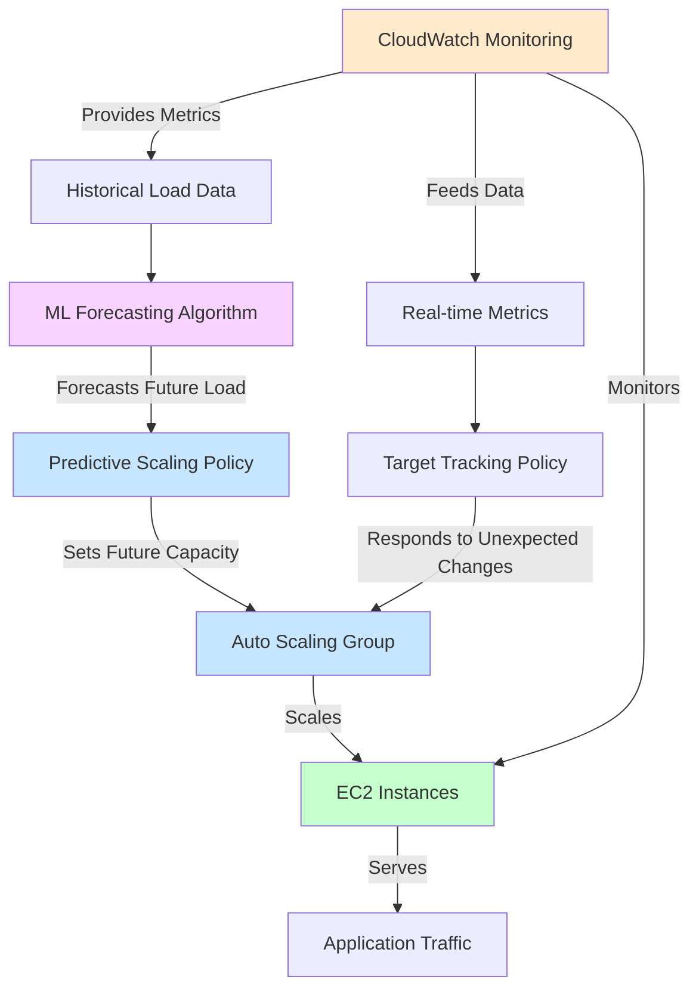

# Implementing Predictive Scaling for EC2 with Auto Scaling and Machine Learning

## Problem

Your e-commerce application experiences predictable but variable load patterns that follow daily and weekly cycles. During peak periods, your infrastructure struggles to scale up quickly enough, resulting in degraded performance and poor customer experience. During low-traffic periods, you're wasting resources on idle EC2 instances. You need a solution that proactively adjusts capacity before demand changes, rather than reactively scaling after performance issues occur.

## Solution

Implement AWS Auto Scaling's predictive scaling feature, which uses machine learning to analyze historical load patterns and automatically forecast future capacity needs. By combining predictive scaling with dynamic target tracking scaling policies, you can create a comprehensive scaling strategy that both anticipates future load based on patterns and adapts to unexpected changes in demand. This solution allows your infrastructure to scale up in advance of predicted demand spikes and scale down during predictable low-traffic periods.

## Architecture Diagram



## Prerequisites

1. AWS account with administrator access
2. VPC with at least two public subnets in different Availability Zones
3. Basic understanding of EC2, Auto Scaling, and CloudWatch
4. A working application with at least 24 hours of historical metric data
5. AWS CLI version 2 installed and configured with proper credentials
6. Estimated cost: $30-60 per month depending on instance types and scale

> **Note**: Predictive scaling requires at least 24 hours of historical data to begin generating forecasts, with optimal accuracy achieved after 14 days of data collection.

## Preparation

```bash
# Set environment variables
export AWS_REGION=$(aws configure get region)
export AWS_ACCOUNT_ID=$(aws sts get-caller-identity \
    --query Account --output text)

# Generate unique identifiers for resources
RANDOM_SUFFIX=$(aws secretsmanager get-random-password \
    --exclude-punctuation --exclude-uppercase \
    --password-length 6 --require-each-included-type \
    --output text --query RandomPassword 2>/dev/null || \
    echo $(date +%s | tail -c 6))

# Create VPC for the demo
export VPC_ID=$(aws ec2 create-vpc --cidr-block 10.0.0.0/16 \
    --tag-specifications 'ResourceType=vpc,Tags=[{Key=Name,Value=PredictiveScalingVPC}]' \
    --query Vpc.VpcId --output text)

# Create subnets in different AZs
aws ec2 create-subnet --vpc-id $VPC_ID --cidr-block 10.0.1.0/24 \
    --availability-zone ${AWS_REGION}a \
    --tag-specifications 'ResourceType=subnet,Tags=[{Key=Name,Value=PredictiveScalingSubnet1}]'
    
aws ec2 create-subnet --vpc-id $VPC_ID --cidr-block 10.0.2.0/24 \
    --availability-zone ${AWS_REGION}b \
    --tag-specifications 'ResourceType=subnet,Tags=[{Key=Name,Value=PredictiveScalingSubnet2}]'

export SUBNET_ID_1=$(aws ec2 describe-subnets \
    --filters "Name=vpc-id,Values=$VPC_ID" "Name=cidr-block,Values=10.0.1.0/24" \
    --query "Subnets[0].SubnetId" --output text)
    
export SUBNET_ID_2=$(aws ec2 describe-subnets \
    --filters "Name=vpc-id,Values=$VPC_ID" "Name=cidr-block,Values=10.0.2.0/24" \
    --query "Subnets[0].SubnetId" --output text)

# Create internet gateway and attach to VPC
export IGW_ID=$(aws ec2 create-internet-gateway \
    --tag-specifications 'ResourceType=internet-gateway,Tags=[{Key=Name,Value=PredictiveScalingIGW}]' \
    --query InternetGateway.InternetGatewayId --output text)

aws ec2 attach-internet-gateway --vpc-id $VPC_ID --internet-gateway-id $IGW_ID

# Create route table and add internet route
export RTB_ID=$(aws ec2 create-route-table --vpc-id $VPC_ID \
    --tag-specifications 'ResourceType=route-table,Tags=[{Key=Name,Value=PredictiveScalingRTB}]' \
    --query RouteTable.RouteTableId --output text)

aws ec2 create-route --route-table-id $RTB_ID \
    --destination-cidr-block 0.0.0.0/0 --gateway-id $IGW_ID

aws ec2 associate-route-table --subnet-id $SUBNET_ID_1 \
    --route-table-id $RTB_ID

aws ec2 associate-route-table --subnet-id $SUBNET_ID_2 \
    --route-table-id $RTB_ID

# Create security group for EC2 instances
export SG_ID=$(aws ec2 create-security-group \
    --group-name PredictiveScalingSG-${RANDOM_SUFFIX} \
    --description "Security group for Predictive Scaling demo" \
    --vpc-id $VPC_ID \
    --query GroupId --output text)

# Allow HTTP traffic
aws ec2 authorize-security-group-ingress --group-id $SG_ID \
    --protocol tcp --port 80 --cidr 0.0.0.0/0

echo "✅ AWS environment configured successfully"
```

## Steps

### 1. Create IAM Role and Launch Template

AWS EC2 instances require proper IAM permissions to publish metrics to CloudWatch and interact with other AWS services. The launch template defines the configuration for new instances, including the AMI, instance type, and user data script that will simulate application load patterns for demonstration purposes.

```bash
# Create IAM trust policy for EC2 instances
cat > trust-policy.json << 'EOF'
{
    "Version": "2012-10-17",
    "Statement": [{
        "Effect": "Allow",
        "Principal": {"Service": "ec2.amazonaws.com"},
        "Action": "sts:AssumeRole"
    }]
}
EOF

# Create IAM role for EC2 instances
aws iam create-role --role-name PredictiveScalingEC2Role-${RANDOM_SUFFIX} \
    --assume-role-policy-document file://trust-policy.json

aws iam attach-role-policy --role-name PredictiveScalingEC2Role-${RANDOM_SUFFIX} \
    --policy-arn arn:aws:iam::aws:policy/CloudWatchAgentServerPolicy

# Create instance profile
export INSTANCE_PROFILE=$(aws iam create-instance-profile \
    --instance-profile-name PredictiveScalingProfile-${RANDOM_SUFFIX} \
    --query InstanceProfile.InstanceProfileName --output text)

aws iam add-role-to-instance-profile \
    --instance-profile-name PredictiveScalingProfile-${RANDOM_SUFFIX} \
    --role-name PredictiveScalingEC2Role-${RANDOM_SUFFIX}

# Get the latest Amazon Linux 2023 AMI ID
export AMI_ID=$(aws ec2 describe-images \
    --owners amazon \
    --filters "Name=name,Values=al2023-ami-2023.*-x86_64" "Name=state,Values=available" \
    --query "sort_by(Images, &CreationDate)[-1].ImageId" \
    --output text)

# Create user data script for web server with CPU load simulation
cat > user-data.txt << 'EOF'
#!/bin/bash
yum update -y
yum install -y httpd stress-ng

# Start and enable Apache
systemctl start httpd
systemctl enable httpd

# Create simple web page
cat > /var/www/html/index.html << 'HTML'
<!DOCTYPE html>
<html>
<head><title>Predictive Scaling Demo</title></head>
<body>
    <h1>Predictive Scaling Demo</h1>
    <p>Instance ID: <span id="instance-id">Loading...</span></p>
    <p>Current Time: <span id="current-time"></span></p>
    <script>
        fetch('http://169.254.169.254/latest/meta-data/instance-id')
            .then(response => response.text())
            .then(data => document.getElementById('instance-id').innerText = data)
            .catch(error => document.getElementById('instance-id').innerText = 'Error loading');
        
        setInterval(() => {
            document.getElementById('current-time').innerText = new Date().toISOString();
        }, 1000);
    </script>
</body>
</html>
HTML

# Create scheduled CPU load for predictable patterns
cat > /etc/cron.d/predictable-load << 'CRON'
# Create CPU load during business hours (9 AM - 6 PM UTC) on weekdays
0 9 * * 1-5 root timeout 8h stress-ng --cpu 2 --cpu-load 60 &
0 18 * * 1-5 root pkill -f stress-ng

# Create moderate load during weekend hours
0 12 * * 6,0 root timeout 4h stress-ng --cpu 1 --cpu-load 40 &
0 16 * * 6,0 root pkill -f stress-ng
CRON

EOF

# Create launch template
export LAUNCH_TEMPLATE_ID=$(aws ec2 create-launch-template \
    --launch-template-name PredictiveScalingTemplate-${RANDOM_SUFFIX} \
    --version-description "Initial version with predictable load patterns" \
    --launch-template-data "{
        \"ImageId\": \"$AMI_ID\",
        \"InstanceType\": \"t3.micro\",
        \"SecurityGroupIds\": [\"$SG_ID\"],
        \"IamInstanceProfile\": {\"Name\": \"$INSTANCE_PROFILE\"},
        \"UserData\": \"$(base64 -w 0 user-data.txt)\",
        \"Monitoring\": {\"Enabled\": true},
        \"TagSpecifications\": [{
            \"ResourceType\": \"instance\",
            \"Tags\": [{\"Key\": \"Name\", \"Value\": \"PredictiveScalingInstance\"}]
        }]
    }" \
    --query LaunchTemplate.LaunchTemplateId --output text)

echo "✅ Launch template created successfully"
```

The launch template is now configured with detailed monitoring enabled and user data that creates predictable load patterns. This simulation helps demonstrate how predictive scaling learns from historical patterns to forecast future capacity needs.

### 2. Create Auto Scaling Group

Auto Scaling Groups (ASGs) are the foundation of elastic compute capacity management in AWS. They automatically manage the number of EC2 instances running to maintain application availability and scale capacity up or down based on defined policies. The ASG will serve as the target for our predictive scaling policies, enabling intelligent capacity adjustments based on machine learning forecasts.

```bash
# Create Auto Scaling Group with initial settings
aws autoscaling create-auto-scaling-group \
    --auto-scaling-group-name PredictiveScalingASG-${RANDOM_SUFFIX} \
    --launch-template LaunchTemplateId=$LAUNCH_TEMPLATE_ID \
    --min-size 2 \
    --max-size 10 \
    --desired-capacity 2 \
    --vpc-zone-identifier "$SUBNET_ID_1,$SUBNET_ID_2" \
    --default-instance-warmup 300 \
    --tags "Key=Environment,Value=Production,PropagateAtLaunch=true" \
          "Key=Project,Value=PredictiveScaling,PropagateAtLaunch=true"

# Wait for ASG to become ready
echo "Waiting for Auto Scaling Group to initialize..."
aws autoscaling wait group-exists \
    --auto-scaling-group-names PredictiveScalingASG-${RANDOM_SUFFIX}

echo "✅ Auto Scaling Group created successfully"
```

The ASG is now configured with a baseline capacity of 2 instances and can scale up to 10 instances as needed. The `default-instance-warmup` parameter is critical for predictive scaling accuracy, as it tells AWS how long new instances need to become fully operational and contribute to your application's capacity.

> **Note**: Setting the `default-instance-warmup` parameter is crucial for predictive scaling. This tells Auto Scaling how long it takes for your instances to initialize before they can handle traffic efficiently.

### 3. Configure CloudWatch Dashboard for Monitoring

CloudWatch dashboards provide real-time visibility into your infrastructure's performance and scaling behavior. This monitoring capability is essential for understanding how predictive scaling affects your application and for validating that the machine learning forecasts align with actual usage patterns. The dashboard will help you correlate scaling events with performance metrics.

```bash
# Create CloudWatch dashboard configuration
cat > dashboard.json << 'EOF'
{
    "widgets": [
        {
            "type": "metric",
            "x": 0,
            "y": 0,
            "width": 12,
            "height": 6,
            "properties": {
                "metrics": [
                    ["AWS/EC2", "CPUUtilization", "AutoScalingGroupName", "PLACEHOLDER_ASG_NAME", {"stat": "Average"}]
                ],
                "period": 300,
                "title": "ASG CPU Utilization",
                "region": "PLACEHOLDER_REGION",
                "view": "timeSeries",
                "yAxis": {"left": {"min": 0, "max": 100}}
            }
        },
        {
            "type": "metric",
            "x": 12,
            "y": 0,
            "width": 12,
            "height": 6,
            "properties": {
                "metrics": [
                    ["AWS/AutoScaling", "GroupInServiceInstances", "AutoScalingGroupName", "PLACEHOLDER_ASG_NAME"]
                ],
                "period": 300,
                "title": "ASG Instance Count",
                "region": "PLACEHOLDER_REGION",
                "view": "timeSeries",
                "yAxis": {"left": {"min": 0}}
            }
        },
        {
            "type": "metric",
            "x": 0,
            "y": 6,
            "width": 24,
            "height": 6,
            "properties": {
                "metrics": [
                    ["AWS/AutoScaling", "GroupDesiredCapacity", "AutoScalingGroupName", "PLACEHOLDER_ASG_NAME"],
                    [".", "GroupMinSize", ".", "."],
                    [".", "GroupMaxSize", ".", "."]
                ],
                "period": 300,
                "title": "ASG Capacity Metrics",
                "region": "PLACEHOLDER_REGION",
                "view": "timeSeries",
                "yAxis": {"left": {"min": 0}}
            }
        }
    ]
}
EOF

# Replace placeholders with actual values
sed -i "s/PLACEHOLDER_REGION/$AWS_REGION/g" dashboard.json
sed -i "s/PLACEHOLDER_ASG_NAME/PredictiveScalingASG-${RANDOM_SUFFIX}/g" dashboard.json

# Create CloudWatch dashboard
aws cloudwatch put-dashboard \
    --dashboard-name PredictiveScalingDashboard-${RANDOM_SUFFIX} \
    --dashboard-body file://dashboard.json

echo "✅ CloudWatch dashboard created successfully"
```

The dashboard is now configured to display CPU utilization trends, instance count changes, and capacity metrics over time. This visualization will be crucial for observing how predictive scaling adjusts capacity before load increases, providing insight into the effectiveness of the machine learning forecasts.

### 4. Create Target Tracking Scaling Policy

Target tracking scaling policies provide reactive scaling capability that complements predictive scaling by responding to real-time changes in application load. While predictive scaling anticipates capacity needs based on historical patterns, target tracking ensures your application maintains optimal performance even when traffic deviates from predicted patterns. This dual approach creates a robust scaling strategy that handles both expected and unexpected load variations.

```bash
# Create target tracking scaling policy
aws autoscaling put-scaling-policy \
    --auto-scaling-group-name PredictiveScalingASG-${RANDOM_SUFFIX} \
    --policy-name CPUTargetTracking-${RANDOM_SUFFIX} \
    --policy-type TargetTrackingScaling \
    --target-tracking-configuration '{
        "PredefinedMetricSpecification": {
            "PredefinedMetricType": "ASGAverageCPUUtilization"
        },
        "TargetValue": 50.0,
        "DisableScaleIn": false
    }'

echo "✅ Target tracking scaling policy created successfully"
```

The target tracking policy is now active and will automatically adjust capacity to maintain 50% average CPU utilization. This creates a safety net that ensures application performance remains consistent even when predictive scaling forecasts are inaccurate or when unexpected traffic spikes occur.

> **Tip**: Target tracking scaling is ideal for complementing predictive scaling because it automatically adjusts your capacity based on a target utilization value. For CPU-intensive workloads, a target value between 40-60% is typically optimal to balance cost and performance.

### 5. Wait for Historical Data Collection

Predictive scaling relies on machine learning algorithms that analyze historical load patterns to generate accurate forecasts. AWS requires a minimum of 24 hours of metric history to establish baseline patterns, but the algorithm becomes more accurate with 14 days of data. The machine learning models identify recurring patterns at different time scales (hourly, daily, weekly) to predict future capacity requirements.

```bash
# Check current data availability
echo "Checking Auto Scaling Group metrics availability..."

CURRENT_TIME=$(date -u +"%Y-%m-%dT%H:%M:%SZ")
START_TIME=$(date -u -d '24 hours ago' +"%Y-%m-%dT%H:%M:%SZ")

# Query for existing metrics to verify data collection
METRIC_COUNT=$(aws cloudwatch get-metric-statistics \
    --namespace AWS/EC2 \
    --metric-name CPUUtilization \
    --dimensions Name=AutoScalingGroupName,Value=PredictiveScalingASG-${RANDOM_SUFFIX} \
    --start-time $START_TIME \
    --end-time $CURRENT_TIME \
    --period 3600 \
    --statistics Average \
    --query 'length(Datapoints)' \
    --output text)

echo "Current metric data points available: $METRIC_COUNT"

if [ "$METRIC_COUNT" -lt 12 ]; then
    echo "⚠️  Insufficient historical data for predictive scaling"
    echo "   Predictive scaling requires at least 24 hours of metrics"
    echo "   Continue with the recipe to set up policies in forecast-only mode"
else
    echo "✅ Sufficient historical data available for predictive scaling"
fi
```

For an effective predictive scaling policy, you need at least 24 hours of metric history. The Auto Scaling service continuously collects metrics during this period, building a comprehensive understanding of your application's load patterns. This data forms the foundation for accurate capacity forecasting and ensures predictive scaling can make informed decisions about future scaling actions.

### 6. Create Predictive Scaling Policy

Predictive scaling policies use machine learning to forecast future capacity requirements and automatically adjust your Auto Scaling group's capacity before demand changes occur. This proactive approach eliminates the traditional lag time between load increases and scaling responses, ensuring your application maintains optimal performance during traffic spikes. The policy configuration defines how aggressive the scaling should be and how much buffer capacity to maintain.

```bash
# Create predictive scaling configuration in forecast-only mode
cat > predictive-scaling-config.json << 'EOF'
{
    "MetricSpecifications": [{
        "TargetValue": 50,
        "PredefinedMetricPairSpecification": {
            "PredefinedMetricType": "ASGCPUUtilization"
        }
    }],
    "Mode": "ForecastOnly",
    "SchedulingBufferTime": 300,
    "MaxCapacityBreachBehavior": "IncreaseMaxCapacity",
    "MaxCapacityBuffer": 10
}
EOF

# Apply the predictive scaling policy
aws autoscaling put-scaling-policy \
    --auto-scaling-group-name PredictiveScalingASG-${RANDOM_SUFFIX} \
    --policy-name PredictiveScalingPolicy-${RANDOM_SUFFIX} \
    --policy-type PredictiveScaling \
    --predictive-scaling-configuration file://predictive-scaling-config.json

echo "✅ Predictive scaling policy created in forecast-only mode"
```

The configuration defines key parameters: `TargetValue` sets the desired CPU utilization level, `ForecastOnly` mode allows evaluation without actual scaling, `SchedulingBufferTime` determines how far in advance instances are launched, and `MaxCapacityBuffer` provides additional headroom beyond the maximum capacity when needed.

> **Warning**: Initially, keep predictive scaling in "ForecastOnly" mode. This allows you to evaluate forecast accuracy before allowing it to make scaling decisions. After validating forecast accuracy, you can switch to "ForecastAndScale" mode.

### 7. Evaluate Forecast Accuracy

Forecast evaluation is a critical step that ensures the machine learning algorithms have accurately learned your application's load patterns. AWS provides detailed forecast data that shows predicted capacity requirements up to 48 hours in advance. Reviewing this data helps you understand how well the algorithm captures your workload characteristics and whether any adjustments to the scaling policy are needed before enabling active scaling.

```bash
# Get the policy ARN for forecast retrieval
export POLICY_ARN=$(aws autoscaling describe-policies \
    --auto-scaling-group-name PredictiveScalingASG-${RANDOM_SUFFIX} \
    --policy-names PredictiveScalingPolicy-${RANDOM_SUFFIX} \
    --query "ScalingPolicies[0].PolicyARN" --output text)

# Retrieve predictive scaling forecast (this may initially return no data)
echo "Attempting to retrieve predictive scaling forecast..."
aws autoscaling get-predictive-scaling-forecast \
    --policy-arn $POLICY_ARN \
    --start-time $(date -u -d '1 hour ago' +"%Y-%m-%dT%H:%M:%SZ") \
    --end-time $(date -u -d '48 hours' +"%Y-%m-%dT%H:%M:%SZ") \
    --output table 2>/dev/null || \
    echo "⚠️  Forecast not yet available - requires 24+ hours of historical data"

echo "✅ Forecast retrieval configured (data available after 24+ hours)"
```

The forecast response contains predicted load and capacity values with timestamps, allowing you to compare predictions against actual historical performance. This data reveals how accurately the machine learning model understands your application's traffic patterns. Examine the forecast output to validate that predicted load patterns align with your known traffic characteristics.

### 8. Activate Predictive Scaling

After validating forecast accuracy, you can transition from forecast-only mode to active scaling mode. This enables the machine learning algorithms to automatically adjust your Auto Scaling group's capacity based on predicted demand. The transition to active mode represents the culmination of the predictive scaling setup, where proactive capacity management begins to optimize both performance and cost efficiency.

```bash
# Create active predictive scaling configuration
cat > active-predictive-scaling-config.json << 'EOF'
{
    "MetricSpecifications": [{
        "TargetValue": 50,
        "PredefinedMetricPairSpecification": {
            "PredefinedMetricType": "ASGCPUUtilization"
        }
    }],
    "Mode": "ForecastAndScale",
    "SchedulingBufferTime": 300,
    "MaxCapacityBreachBehavior": "IncreaseMaxCapacity",
    "MaxCapacityBuffer": 10
}
EOF

# Update policy to enable active scaling
aws autoscaling put-scaling-policy \
    --auto-scaling-group-name PredictiveScalingASG-${RANDOM_SUFFIX} \
    --policy-name PredictiveScalingPolicy-${RANDOM_SUFFIX} \
    --policy-type PredictiveScaling \
    --predictive-scaling-configuration file://active-predictive-scaling-config.json

echo "✅ Predictive scaling activated in ForecastAndScale mode"
```

Predictive scaling is now fully operational and will proactively adjust capacity based on machine learning forecasts. The system will launch instances in advance of predicted demand spikes and scale down during anticipated low-traffic periods, optimizing both performance and cost efficiency through intelligent capacity management.

## Validation & Testing

### Monitor Predictive Scaling Behavior

1. **Check Auto Scaling Group status and recent activities**:

   ```bash
   # View current ASG configuration and instance status
   aws autoscaling describe-auto-scaling-groups \
       --auto-scaling-group-names PredictiveScalingASG-${RANDOM_SUFFIX} \
       --query "AutoScalingGroups[0].{Name:AutoScalingGroupName,MinSize:MinSize,MaxSize:MaxSize,DesiredCapacity:DesiredCapacity,Instances:length(Instances)}" \
       --output table

   # View recent scaling activities
   aws autoscaling describe-scaling-activities \
       --auto-scaling-group-name PredictiveScalingASG-${RANDOM_SUFFIX} \
       --max-items 5 \
       --query "Activities[*].{Time:StartTime,Description:Description,Status:StatusCode}" \
       --output table
   ```

   Expected output: You should see your ASG with the configured capacity and any recent scaling activities with their status.

2. **View CloudWatch dashboard**:

   ```bash
   echo "Visit your CloudWatch dashboard at:"
   echo "https://${AWS_REGION}.console.aws.amazon.com/cloudwatch/home?region=${AWS_REGION}#dashboards:name=PredictiveScalingDashboard-${RANDOM_SUFFIX}"
   ```

### Test Scaling Policies

1. **Verify both scaling policies are active**:

   ```bash
   # List all scaling policies for the ASG
   aws autoscaling describe-policies \
       --auto-scaling-group-name PredictiveScalingASG-${RANDOM_SUFFIX} \
       --query "ScalingPolicies[*].{PolicyName:PolicyName,PolicyType:PolicyType,Enabled:Enabled}" \
       --output table
   ```

   Expected output: Both target tracking and predictive scaling policies should be listed as enabled.

2. **Monitor forecast data (available after 24+ hours)**:

   ```bash
   # Check for available forecast data
   aws autoscaling get-predictive-scaling-forecast \
       --policy-arn $POLICY_ARN \
       --start-time $(date -u +"%Y-%m-%dT%H:%M:%SZ") \
       --end-time $(date -u -d '24 hours' +"%Y-%m-%dT%H:%M:%SZ") \
       --query "ForecastData[*].{Timestamp:Timestamp,LoadForecast:LoadForecast,CapacityForecast:CapacityForecast}" \
       --output table 2>/dev/null || \
       echo "Forecast data not yet available - requires 24+ hours of historical metrics"
   ```

### Long-term Validation

To fully validate predictive scaling effectiveness, observe your infrastructure for at least 48-72 hours, noting how:
- Instance count increases before predicted load spikes (typically 5 minutes before based on SchedulingBufferTime)
- CPU utilization remains around your target value of 50%
- Resources scale down during predicted low-traffic periods
- Forecast accuracy improves over time as more historical data is collected

## Cleanup

To avoid incurring unnecessary charges, clean up all resources created in this recipe:

```bash
# Delete scaling policies
aws autoscaling delete-policy \
    --auto-scaling-group-name PredictiveScalingASG-${RANDOM_SUFFIX} \
    --policy-name PredictiveScalingPolicy-${RANDOM_SUFFIX}

aws autoscaling delete-policy \
    --auto-scaling-group-name PredictiveScalingASG-${RANDOM_SUFFIX} \
    --policy-name CPUTargetTracking-${RANDOM_SUFFIX}

# Scale down and delete Auto Scaling group
aws autoscaling update-auto-scaling-group \
    --auto-scaling-group-name PredictiveScalingASG-${RANDOM_SUFFIX} \
    --min-size 0 --max-size 0 --desired-capacity 0

# Wait for instances to terminate
echo "Waiting for instances to terminate..."
aws autoscaling wait group-in-service \
    --auto-scaling-group-names PredictiveScalingASG-${RANDOM_SUFFIX} || true

aws autoscaling delete-auto-scaling-group \
    --auto-scaling-group-name PredictiveScalingASG-${RANDOM_SUFFIX} \
    --force-delete

# Delete launch template
aws ec2 delete-launch-template \
    --launch-template-id $LAUNCH_TEMPLATE_ID

# Clean up IAM resources
aws iam remove-role-from-instance-profile \
    --instance-profile-name PredictiveScalingProfile-${RANDOM_SUFFIX} \
    --role-name PredictiveScalingEC2Role-${RANDOM_SUFFIX}

aws iam delete-instance-profile \
    --instance-profile-name PredictiveScalingProfile-${RANDOM_SUFFIX}

aws iam detach-role-policy \
    --role-name PredictiveScalingEC2Role-${RANDOM_SUFFIX} \
    --policy-arn arn:aws:iam::aws:policy/CloudWatchAgentServerPolicy

aws iam delete-role \
    --role-name PredictiveScalingEC2Role-${RANDOM_SUFFIX}

# Delete security group
aws ec2 delete-security-group --group-id $SG_ID

# Delete route table associations and route table
aws ec2 disassociate-route-table \
    --association-id $(aws ec2 describe-route-tables \
    --route-table-ids $RTB_ID \
    --query "RouteTables[0].Associations[?Main==\`false\`].RouteTableAssociationId" \
    --output text | tr '\t' '\n' | head -1) 2>/dev/null || true

aws ec2 disassociate-route-table \
    --association-id $(aws ec2 describe-route-tables \
    --route-table-ids $RTB_ID \
    --query "RouteTables[0].Associations[?Main==\`false\`].RouteTableAssociationId" \
    --output text | tr '\t' '\n' | tail -1) 2>/dev/null || true

aws ec2 delete-route-table --route-table-id $RTB_ID

# Delete internet gateway
aws ec2 detach-internet-gateway \
    --internet-gateway-id $IGW_ID --vpc-id $VPC_ID

aws ec2 delete-internet-gateway --internet-gateway-id $IGW_ID

# Delete subnets
aws ec2 delete-subnet --subnet-id $SUBNET_ID_1
aws ec2 delete-subnet --subnet-id $SUBNET_ID_2

# Delete VPC
aws ec2 delete-vpc --vpc-id $VPC_ID

# Delete CloudWatch dashboard
aws cloudwatch delete-dashboards \
    --dashboard-names "PredictiveScalingDashboard-${RANDOM_SUFFIX}"

# Remove local files
rm -f user-data.txt trust-policy.json dashboard.json \
    predictive-scaling-config.json active-predictive-scaling-config.json

echo "✅ All resources cleaned up successfully"
```

## Discussion

Predictive scaling represents a significant advancement over traditional reactive scaling approaches, using machine learning to forecast capacity requirements based on historical patterns. This solution is particularly effective for workloads with predictable patterns, such as e-commerce websites with daily shopping patterns and weekend peaks, enterprise applications with business hours usage spikes, media streaming services with evening viewership increases, and SaaS platforms with consistent usage patterns across time zones.

The key innovation in predictive scaling is how it combines historical data analysis with machine learning forecasting. AWS's algorithms identify patterns at different time scales (hourly, daily, weekly) and generate capacity forecasts up to 48 hours in advance. This forecasting capability eliminates the lag time typically experienced with reactive scaling methods, where performance degradation must occur before scaling actions are triggered.

For optimal results, combine predictive scaling with target tracking scaling policies as demonstrated in this recipe. Predictive scaling handles anticipated load changes based on patterns, while target tracking handles unexpected traffic variations. This hybrid approach provides both proactive and reactive scaling capabilities, ensuring robust performance under all conditions.

The `SchedulingBufferTime` parameter is a critical setting that determines how far in advance instances should be launched before predicted demand requires them. This parameter should be set based on your application's startup time, including instance boot time, application initialization, and any required warming processes. The default value of 300 seconds (5 minutes) works well for most applications, but you may need to adjust it based on your specific requirements.

While predictive scaling is powerful, it's important to understand its limitations. For new applications without historical data or workloads with unpredictable traffic patterns, traditional dynamic scaling methods may be more appropriate initially. As you gather more historical data over weeks and months, you can gradually incorporate predictive scaling into your scaling strategy for improved cost efficiency and performance.

> **Tip**: Monitor your predictive scaling forecasts regularly through the CloudWatch console or CLI to ensure accuracy remains high. If forecast accuracy degrades, consider adjusting the target value or switching temporarily back to forecast-only mode to retrain the model.

**Sources:**
- [Amazon EC2 Auto Scaling Predictive Scaling](https://docs.aws.amazon.com/autoscaling/ec2/userguide/ec2-auto-scaling-predictive-scaling.html)
- [How predictive scaling works - Amazon EC2 Auto Scaling](https://docs.aws.amazon.com/autoscaling/ec2/userguide/predictive-scaling-policy-overview.html)
- [AWS Well-Architected Framework - Performance Efficiency Pillar](https://docs.aws.amazon.com/wellarchitected/latest/performance-efficiency-pillar/welcome.html)

## Challenge

Extend this solution by implementing these enhancements:

1. **Custom Metrics Integration**: Modify the predictive scaling policy to use custom CloudWatch metrics instead of CPU utilization. Create a custom metric that combines application-specific indicators like request rate, queue depth, or database connections for more accurate capacity forecasting.

2. **Multi-Metric Predictive Scaling**: Configure predictive scaling based on multiple metrics simultaneously. Implement a solution that considers both CPU utilization and network I/O patterns when forecasting capacity needs, providing more nuanced scaling decisions.

3. **Regional Load Balancing**: Extend the architecture to include multiple Auto Scaling groups across different AWS regions, with predictive scaling policies that account for regional traffic patterns and time zone differences.

4. **Cost Optimization Integration**: Implement a cost-aware predictive scaling strategy that considers Spot Instance pricing and availability when making scaling decisions, balancing performance requirements with cost optimization.

5. **Advanced Monitoring and Alerting**: Create a comprehensive monitoring solution using CloudWatch Insights and AWS X-Ray to track predictive scaling effectiveness, forecast accuracy, and application performance impact, with automated alerts for forecast drift or scaling anomalies.

## Infrastructure Code

### Available Infrastructure as Code:

- [Infrastructure Code Overview](code/README.md) - Detailed description of all infrastructure components
- [AWS CDK (Python)](code/cdk-python/) - AWS CDK Python implementation
- [AWS CDK (TypeScript)](code/cdk-typescript/) - AWS CDK TypeScript implementation
- [CloudFormation](code/cloudformation.yaml) - AWS CloudFormation template
- [Bash CLI Scripts](code/scripts/) - Example bash scripts using AWS CLI commands to deploy infrastructure
- [Terraform](code/terraform/) - Terraform configuration files