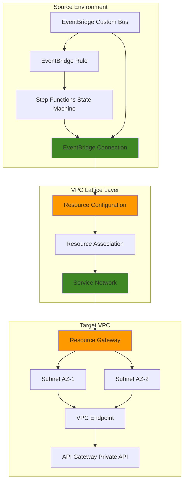

# Private API Integration with VPC Lattice and EventBridge

## Problem

Enterprise microservices architectures often require secure communication between services deployed across multiple VPCs, but traditional solutions involve complex Lambda proxy functions, VPC peering configurations, or exposing APIs to the public internet. These approaches introduce security risks, operational overhead, and performance bottlenecks when EventBridge and Step Functions need to invoke private APIs across VPC boundaries without compromising network isolation or requiring extensive networking configuration.

## Solution

Implement a secure event-driven architecture using VPC Lattice Resource Configurations to enable direct private API access from EventBridge and Step Functions without Lambda proxies. VPC Lattice provides application-level networking that abstracts underlying VPC complexity, while EventBridge connections leverage resource configurations for authenticated, encrypted communication across VPC boundaries, maintaining security while simplifying cross-VPC connectivity.

## Architecture Diagram



## Prerequisites

1. AWS account with VPC Lattice, EventBridge, Step Functions, and API Gateway permissions
2. AWS CLI v2 installed and configured (or CloudShell access)
3. Understanding of VPC networking, API Gateway, and event-driven architectures
4. Knowledge of AWS IAM and resource-based policies
5. Estimated cost: $2-5 for testing (primarily API Gateway, VPC endpoints, and Step Functions executions)

> **Note**: This recipe follows AWS Well-Architected Framework security principles by implementing private networking without internet exposure. See the [AWS Well-Architected Framework](https://docs.aws.amazon.com/wellarchitected/latest/framework/welcome.html) for comprehensive guidance.

## Preparation

```bash
# Set environment variables
export AWS_REGION=$(aws configure get region)
export AWS_ACCOUNT_ID=$(aws sts get-caller-identity \
    --query Account --output text)

# Generate unique identifiers for resources
RANDOM_SUFFIX=$(aws secretsmanager get-random-password \
    --exclude-punctuation --exclude-uppercase \
    --password-length 6 --require-each-included-type \
    --output text --query RandomPassword)

# Set resource names
export VPC_LATTICE_SERVICE_NETWORK="private-api-network-${RANDOM_SUFFIX}"
export RESOURCE_CONFIG_NAME="private-api-config-${RANDOM_SUFFIX}"
export EVENTBRIDGE_BUS_NAME="private-api-bus-${RANDOM_SUFFIX}"
export STEP_FUNCTION_NAME="private-api-workflow-${RANDOM_SUFFIX}"
export API_GATEWAY_NAME="private-demo-api-${RANDOM_SUFFIX}"

# Get available availability zones for subnet creation
AZ_LIST=($(aws ec2 describe-availability-zones \
    --query 'AvailabilityZones[].ZoneName' --output text))
AZ1=${AZ_LIST[0]}
AZ2=${AZ_LIST[1]}

# Create target VPC with subnets for demonstration
aws ec2 create-vpc \
    --cidr-block 10.1.0.0/16 \
    --tag-specifications \
    'ResourceType=vpc,Tags=[{Key=Name,Value=target-vpc},{Key=Purpose,Value=private-api}]'

TARGET_VPC_ID=$(aws ec2 describe-vpcs \
    --filters Name=tag:Name,Values=target-vpc \
    --query 'Vpcs[0].VpcId' --output text)

# Create subnets in different AZs for high availability
aws ec2 create-subnet \
    --vpc-id ${TARGET_VPC_ID} \
    --cidr-block 10.1.1.0/24 \
    --availability-zone ${AZ1} \
    --tag-specifications \
    'ResourceType=subnet,Tags=[{Key=Name,Value=target-subnet-1}]'

aws ec2 create-subnet \
    --vpc-id ${TARGET_VPC_ID} \
    --cidr-block 10.1.2.0/24 \
    --availability-zone ${AZ2} \
    --tag-specifications \
    'ResourceType=subnet,Tags=[{Key=Name,Value=target-subnet-2}]'

SUBNET_ID_1=$(aws ec2 describe-subnets \
    --filters Name=tag:Name,Values=target-subnet-1 \
    --query 'Subnets[0].SubnetId' --output text)

SUBNET_ID_2=$(aws ec2 describe-subnets \
    --filters Name=tag:Name,Values=target-subnet-2 \
    --query 'Subnets[0].SubnetId' --output text)

echo "✅ AWS environment configured with Target VPC: ${TARGET_VPC_ID}"
echo "✅ Subnets created: ${SUBNET_ID_1}, ${SUBNET_ID_2}"
```

## Steps

1. **Create VPC Lattice Service Network**:

   VPC Lattice Service Networks provide application-level connectivity between services across VPCs and accounts. This foundational component enables secure service-to-service communication without complex networking configurations. The service network acts as a logical boundary for related services and applies consistent security policies across all associated resources using AWS IAM for authentication.

   ```bash
   # Create VPC Lattice service network
   aws vpc-lattice create-service-network \
       --name ${VPC_LATTICE_SERVICE_NETWORK} \
       --auth-type AWS_IAM \
       --tags Key=Environment,Value=demo \
              Key=Purpose,Value=private-api-integration
   
   SERVICE_NETWORK_ID=$(aws vpc-lattice list-service-networks \
       --query "items[?name=='${VPC_LATTICE_SERVICE_NETWORK}'].id" \
       --output text)
   
   echo "✅ Service network created: ${SERVICE_NETWORK_ID}"
   ```

   The service network now provides the foundation for secure cross-VPC communication with built-in AWS IAM authentication and authorization capabilities that scale automatically.

2. **Create Private API Gateway with VPC Endpoint**:

   API Gateway private APIs provide secure endpoints accessible only within VPC boundaries through VPC endpoints powered by AWS PrivateLink. This configuration ensures API traffic never traverses the public internet while maintaining high availability and performance through AWS backbone infrastructure. The resource-based policy restricts access to specific VPC endpoints.

   ```bash
   # Create VPC endpoint for API Gateway in target VPC
   aws ec2 create-vpc-endpoint \
       --vpc-id ${TARGET_VPC_ID} \
       --service-name com.amazonaws.${AWS_REGION}.execute-api \
       --vpc-endpoint-type Interface \
       --subnet-ids ${SUBNET_ID_1} ${SUBNET_ID_2} \
       --policy-document '{
           "Version": "2012-10-17",
           "Statement": [
               {
                   "Effect": "Allow",
                   "Principal": "*",
                   "Action": "execute-api:*",
                   "Resource": "*"
               }
           ]
       }' \
       --tag-specifications \
       'ResourceType=vpc-endpoint,Tags=[{Key=Name,Value=api-gateway-endpoint}]'
   
   VPC_ENDPOINT_ID=$(aws ec2 describe-vpc-endpoints \
       --filters Name=vpc-id,Values=${TARGET_VPC_ID} \
               Name=service-name,Values=com.amazonaws.${AWS_REGION}.execute-api \
       --query 'VpcEndpoints[0].VpcEndpointId' --output text)
   
   # Wait for VPC endpoint to be available
   aws ec2 wait vpc-endpoint-available \
       --vpc-endpoint-ids ${VPC_ENDPOINT_ID}
   
   # Create private API Gateway
   aws apigateway create-rest-api \
       --name ${API_GATEWAY_NAME} \
       --endpoint-configuration types=PRIVATE \
       --policy '{
           "Version": "2012-10-17",
           "Statement": [
               {
                   "Effect": "Allow",
                   "Principal": "*",
                   "Action": "execute-api:Invoke",
                   "Resource": "*",
                   "Condition": {
                       "StringEquals": {
                           "aws:sourceVpce": "'${VPC_ENDPOINT_ID}'"
                       }
                   }
               }
           ]
       }'
   
   API_ID=$(aws apigateway get-rest-apis \
       --query "items[?name=='${API_GATEWAY_NAME}'].id" \
       --output text)
   
   echo "✅ Private API Gateway created: ${API_ID}"
   ```

   The private API Gateway is now accessible only through the VPC endpoint, providing secure internal API access with proper resource-based policies enforcing VPC-level isolation.

3. **Configure API Gateway Resources and Methods**:

   Setting up API Gateway resources and methods establishes the actual endpoints that will be invoked by EventBridge and Step Functions. This creates a realistic API structure for demonstrating the private integration capabilities while providing clear testing endpoints with proper HTTP methods and mock responses.

   ```bash
   # Get root resource ID
   ROOT_RESOURCE_ID=$(aws apigateway get-resources \
       --rest-api-id ${API_ID} \
       --query 'items[?path==`/`].id' --output text)
   
   # Create /orders resource
   aws apigateway create-resource \
       --rest-api-id ${API_ID} \
       --parent-id ${ROOT_RESOURCE_ID} \
       --path-part orders
   
   ORDERS_RESOURCE_ID=$(aws apigateway get-resources \
       --rest-api-id ${API_ID} \
       --query 'items[?pathPart==`orders`].id' --output text)
   
   # Create POST method for orders
   aws apigateway put-method \
       --rest-api-id ${API_ID} \
       --resource-id ${ORDERS_RESOURCE_ID} \
       --http-method POST \
       --authorization-type AWS_IAM
   
   # Add mock integration for demonstration
   aws apigateway put-integration \
       --rest-api-id ${API_ID} \
       --resource-id ${ORDERS_RESOURCE_ID} \
       --http-method POST \
       --type MOCK \
       --request-templates '{"application/json": "{\"statusCode\": 200}"}'
   
   # Configure method response
   aws apigateway put-method-response \
       --rest-api-id ${API_ID} \
       --resource-id ${ORDERS_RESOURCE_ID} \
       --http-method POST \
       --status-code 200
   
   # Configure integration response
   aws apigateway put-integration-response \
       --rest-api-id ${API_ID} \
       --resource-id ${ORDERS_RESOURCE_ID} \
       --http-method POST \
       --status-code 200 \
       --response-templates \
       '{"application/json": "{\"orderId\": \"12345\", \"status\": \"created\", \"timestamp\": \"$(context.requestTime)\"}"}'
   
   # Deploy API
   aws apigateway create-deployment \
       --rest-api-id ${API_ID} \
       --stage-name prod
   
   echo "✅ API Gateway configured with /orders endpoint"
   ```

   The API Gateway now provides a functional /orders endpoint with mock integration, demonstrating how EventBridge and Step Functions can invoke business logic through private APIs with proper response handling.

4. **Create VPC Lattice Resource Gateway**:

   Resource Gateways provide entry points for external services to access resources within a VPC through VPC Lattice. They span multiple Availability Zones for high availability and abstract the underlying network infrastructure complexity while maintaining security boundaries. This component enables secure cross-VPC communication patterns.

   ```bash
   # Create resource gateway across multiple AZs
   aws vpc-lattice create-resource-gateway \
       --name "api-gateway-resource-gateway-${RANDOM_SUFFIX}" \
       --vpc-identifier ${TARGET_VPC_ID} \
       --subnet-ids ${SUBNET_ID_1} ${SUBNET_ID_2} \
       --tags Key=Purpose,Value=private-api-access \
              Key=Environment,Value=demo
   
   RESOURCE_GATEWAY_ID=$(aws vpc-lattice list-resource-gateways \
       --query "items[?name=='api-gateway-resource-gateway-${RANDOM_SUFFIX}'].id" \
       --output text)
   
   # Wait for resource gateway to be active
   echo "⏳ Waiting for resource gateway to become active..."
   while true; do
       STATUS=$(aws vpc-lattice get-resource-gateway \
           --resource-gateway-identifier ${RESOURCE_GATEWAY_ID} \
           --query 'status' --output text)
       if [ "$STATUS" = "ACTIVE" ]; then
           break
       fi
       sleep 10
   done
   
   echo "✅ Resource gateway created: ${RESOURCE_GATEWAY_ID}"
   ```

   The resource gateway is now active and ready to provide secure access to the private API Gateway from external VPCs through VPC Lattice networking with high availability across multiple AZs.

5. **Create VPC Lattice Resource Configuration**:

   Resource Configurations define how external services can access specific resources within a VPC. They specify port ranges, authentication requirements, and association policies that govern access to the private API. This abstraction layer simplifies cross-VPC connectivity while maintaining granular security controls and enabling shareable service network access.

   ```bash
   # Create resource configuration for API Gateway
   aws vpc-lattice create-resource-configuration \
       --name ${RESOURCE_CONFIG_NAME} \
       --type SINGLE \
       --resource-gateway-identifier ${RESOURCE_GATEWAY_ID} \
       --resource-configuration-definition '{
           "type": "RESOURCE",
           "resourceIdentifier": "'${VPC_ENDPOINT_ID}'",
           "portRanges": [{"fromPort": 443, "toPort": 443, "protocol": "TCP"}]
       }' \
       --allow-association-to-shareable-service-network \
       --tags Key=Purpose,Value=private-api-integration \
              Key=Environment,Value=demo
   
   RESOURCE_CONFIG_ARN=$(aws vpc-lattice list-resource-configurations \
       --query "items[?name=='${RESOURCE_CONFIG_NAME}'].arn" \
       --output text)
   
   echo "✅ Resource configuration created: ${RESOURCE_CONFIG_ARN}"
   ```

   The resource configuration now enables secure access to the private API Gateway through VPC Lattice, specifying HTTPS connectivity on port 443 with proper security controls and sharing capabilities.

6. **Associate Resource Configuration with Service Network**:

   Creating a resource association connects the resource configuration to the VPC Lattice service network, enabling the private API to be discoverable and accessible by authorized services. This step establishes the network path that EventBridge and Step Functions will use to invoke the private API through the service network.

   ```bash
   # Create resource association
   aws vpc-lattice create-service-network-resource-association \
       --service-network-identifier ${SERVICE_NETWORK_ID} \
       --resource-configuration-identifier ${RESOURCE_CONFIG_ARN}
   
   # Wait for association to become active
   echo "⏳ Waiting for resource association to become active..."
   sleep 15
   
   ASSOCIATION_ID=$(aws vpc-lattice list-service-network-resource-associations \
       --service-network-identifier ${SERVICE_NETWORK_ID} \
       --query "items[?resourceConfigurationArn=='${RESOURCE_CONFIG_ARN}'].id" \
       --output text)
   
   echo "✅ Resource association created: ${ASSOCIATION_ID}"
   ```

   The private API is now accessible through the VPC Lattice service network with proper association policies and security controls in place for cross-VPC connectivity.

7. **Create IAM Role for EventBridge and Step Functions**:

   EventBridge and Step Functions require specific IAM permissions to create connections and invoke private APIs through VPC Lattice. This role encompasses the minimal necessary permissions following the principle of least privilege while enabling the required cross-VPC API integration capabilities and VPC Lattice resource access.

   ```bash
   # Create IAM role for EventBridge and Step Functions
   aws iam create-role \
       --role-name EventBridgeStepFunctionsVPCLatticeRole \
       --assume-role-policy-document '{
           "Version": "2012-10-17",
           "Statement": [
               {
                   "Effect": "Allow",
                   "Principal": {
                       "Service": ["events.amazonaws.com", "states.amazonaws.com"]
                   },
                   "Action": "sts:AssumeRole"
               }
           ]
       }'
   
   # Create and attach policy for VPC Lattice operations
   aws iam put-role-policy \
       --role-name EventBridgeStepFunctionsVPCLatticeRole \
       --policy-name VPCLatticeConnectionPolicy \
       --policy-document '{
           "Version": "2012-10-17",
           "Statement": [
               {
                   "Effect": "Allow",
                   "Action": [
                       "events:CreateConnection",
                       "events:UpdateConnection",
                       "events:InvokeApiDestination",
                       "execute-api:Invoke",
                       "vpc-lattice:GetResourceConfiguration",
                       "states:StartExecution"
                   ],
                   "Resource": "*"
               }
           ]
       }'
   
   ROLE_ARN=$(aws iam get-role \
       --role-name EventBridgeStepFunctionsVPCLatticeRole \
       --query 'Role.Arn' --output text)
   
   echo "✅ IAM role created: ${ROLE_ARN}"
   ```

   The IAM role now provides the necessary permissions for EventBridge and Step Functions to establish secure connections to private APIs through VPC Lattice resource configurations.

8. **Create EventBridge Connection for Private API**:

   EventBridge connections define the authentication and networking configuration for invoking private HTTPS endpoints. By specifying the VPC Lattice resource configuration, EventBridge can securely invoke the private API without requiring Lambda proxy functions or complex VPC peering arrangements, utilizing the resource configuration for secure connectivity.

   ```bash
   # Create EventBridge custom bus
   aws events create-event-bus \
       --name ${EVENTBRIDGE_BUS_NAME}
   
   # Create connection to private API using resource configuration
   aws events create-connection \
       --name "private-api-connection-${RANDOM_SUFFIX}" \
       --description "Connection to private API Gateway via VPC Lattice" \
       --authorization-type INVOCATION_HTTP_PARAMETERS \
       --invocation-http-parameters '{
           "HeaderParameters": {
               "Content-Type": "application/json"
           }
       }' \
       --invocation-endpoint \
       "https://${API_ID}-${VPC_ENDPOINT_ID}.execute-api.${AWS_REGION}.amazonaws.com/prod/orders" \
       --invocation-resource-configuration-arn ${RESOURCE_CONFIG_ARN}
   
   CONNECTION_ARN=$(aws events describe-connection \
       --name "private-api-connection-${RANDOM_SUFFIX}" \
       --query 'ConnectionArn' --output text)
   
   echo "✅ EventBridge connection created: ${CONNECTION_ARN}"
   ```

   EventBridge can now invoke the private API Gateway securely through the VPC Lattice resource configuration, eliminating the need for public internet exposure or Lambda proxy functions.

9. **Create Step Functions State Machine with Private API Integration**:

   Step Functions orchestrates complex workflows that often require invoking multiple APIs. By integrating with EventBridge connections and VPC Lattice resource configurations, Step Functions can directly invoke private APIs as part of state machine execution, enabling secure workflow automation across VPC boundaries with built-in retry logic and error handling.

   ```bash
   # Create Step Functions state machine definition
   cat > step-function-definition.json << 'EOF'
   {
       "Comment": "Workflow that invokes private API via VPC Lattice",
       "StartAt": "ProcessOrder",
       "States": {
           "ProcessOrder": {
               "Type": "Task",
               "Resource": "arn:aws:states:::http:invoke",
               "Parameters": {
                   "ApiEndpoint": "PLACEHOLDER_CONNECTION_ARN",
                   "Method": "POST",
                   "RequestBody": {
                       "customerId": "12345",
                       "orderItems": ["item1", "item2"],
                       "timestamp.$": "$$.State.EnteredTime"
                   },
                   "Headers": {
                       "Content-Type": "application/json"
                   }
               },
               "Retry": [
                   {
                       "ErrorEquals": ["States.Http.StatusCodeFailure"],
                       "IntervalSeconds": 2,
                       "MaxAttempts": 3,
                       "BackoffRate": 2.0
                   }
               ],
               "Catch": [
                   {
                       "ErrorEquals": ["States.TaskFailed"],
                       "Next": "HandleError"
                   }
               ],
               "Next": "ProcessSuccess"
           },
           "ProcessSuccess": {
               "Type": "Pass",
               "Result": "Order processed successfully",
               "End": true
           },
           "HandleError": {
               "Type": "Pass",
               "Result": "Order processing failed",
               "End": true
           }
       }
   }
   EOF
   
   # Replace placeholder with actual connection ARN
   sed -i "s|PLACEHOLDER_CONNECTION_ARN|${CONNECTION_ARN}|g" \
       step-function-definition.json
   
   # Create Step Functions state machine
   aws stepfunctions create-state-machine \
       --name ${STEP_FUNCTION_NAME} \
       --definition file://step-function-definition.json \
       --role-arn ${ROLE_ARN}
   
   STATE_MACHINE_ARN=$(aws stepfunctions list-state-machines \
       --query "stateMachines[?name=='${STEP_FUNCTION_NAME}'].stateMachineArn" \
       --output text)
   
   echo "✅ Step Functions state machine created: ${STATE_MACHINE_ARN}"
   ```

   The Step Functions state machine can now execute workflows that invoke private APIs through VPC Lattice, providing secure orchestration capabilities with error handling and retry logic.

10. **Create EventBridge Rule for Automated Workflow Triggering**:

    EventBridge rules enable event-driven automation by triggering Step Functions workflows based on specific event patterns. This configuration demonstrates how events can automatically initiate workflows that invoke private APIs, creating responsive, loosely-coupled architectures that maintain security boundaries while enabling real-time processing.

    ```bash
    # Create EventBridge rule to trigger Step Functions
    aws events put-rule \
        --event-bus-name ${EVENTBRIDGE_BUS_NAME} \
        --name "trigger-private-api-workflow" \
        --event-pattern '{
            "source": ["demo.application"],
            "detail-type": ["Order Received"]
        }' \
        --state ENABLED
    
    # Add Step Functions as target
    aws events put-targets \
        --event-bus-name ${EVENTBRIDGE_BUS_NAME} \
        --rule "trigger-private-api-workflow" \
        --targets "Id"="1","Arn"="${STATE_MACHINE_ARN}","RoleArn"="${ROLE_ARN}"
    
    echo "✅ EventBridge rule configured to trigger Step Functions workflow"
    ```

    The event-driven architecture is now complete, enabling automatic workflow execution that securely invokes private APIs when specific events occur, demonstrating the full integration pattern.

## Validation & Testing

1. Verify VPC Lattice resource configuration is active:

   ```bash
   # Check resource configuration status
   aws vpc-lattice get-resource-configuration \
       --resource-configuration-identifier ${RESOURCE_CONFIG_ARN}
   ```

   Expected output: Status should show "ACTIVE" with proper resource gateway association and port configuration.

2. Test EventBridge connection to private API:

   ```bash
   # Send test event to trigger workflow
   aws events put-events \
       --entries '[
           {
               "Source": "demo.application",
               "DetailType": "Order Received",
               "Detail": "{\"orderId\": \"test-123\", \"customerId\": \"cust-456\"}",
               "EventBusName": "'${EVENTBRIDGE_BUS_NAME}'"
           }
       ]'
   
   # Wait for execution to start
   sleep 5
   
   # Check Step Functions execution
   EXECUTION_ARN=$(aws stepfunctions list-executions \
       --state-machine-arn ${STATE_MACHINE_ARN} \
       --query 'executions[0].executionArn' --output text)
   
   aws stepfunctions describe-execution \
       --execution-arn ${EXECUTION_ARN}
   ```

   Expected output: Step Functions execution should complete successfully with API response data showing order processing results.

3. Validate VPC Lattice network connectivity:

   ```bash
   # Check service network associations
   aws vpc-lattice list-service-network-resource-associations \
       --service-network-identifier ${SERVICE_NETWORK_ID}
   
   # Verify resource gateway status
   aws vpc-lattice get-resource-gateway \
       --resource-gateway-identifier ${RESOURCE_GATEWAY_ID}
   ```

   Expected output: All associations should be "ACTIVE" and resource gateway should be operational across multiple availability zones.

## Cleanup

1. Remove EventBridge resources:

   ```bash
   # Delete EventBridge rule and targets
   aws events remove-targets \
       --event-bus-name ${EVENTBRIDGE_BUS_NAME} \
       --rule "trigger-private-api-workflow" \
       --ids "1"
   
   aws events delete-rule \
       --event-bus-name ${EVENTBRIDGE_BUS_NAME} \
       --name "trigger-private-api-workflow"
   
   # Delete custom event bus
   aws events delete-event-bus \
       --name ${EVENTBRIDGE_BUS_NAME}
   
   # Delete connection
   aws events delete-connection \
       --name "private-api-connection-${RANDOM_SUFFIX}"
   
   echo "✅ EventBridge resources cleaned up"
   ```

2. Remove Step Functions state machine:

   ```bash
   # Delete Step Functions state machine
   aws stepfunctions delete-state-machine \
       --state-machine-arn ${STATE_MACHINE_ARN}
   
   rm -f step-function-definition.json
   
   echo "✅ Step Functions resources cleaned up"
   ```

3. Remove VPC Lattice resources:

   ```bash
   # Delete resource association
   aws vpc-lattice delete-service-network-resource-association \
       --service-network-resource-association-identifier ${ASSOCIATION_ID}
   
   # Wait for association deletion
   sleep 10
   
   # Delete resource configuration
   aws vpc-lattice delete-resource-configuration \
       --resource-configuration-identifier ${RESOURCE_CONFIG_ARN}
   
   # Wait for configuration deletion
   sleep 10
   
   # Delete resource gateway
   aws vpc-lattice delete-resource-gateway \
       --resource-gateway-identifier ${RESOURCE_GATEWAY_ID}
   
   # Delete service network
   aws vpc-lattice delete-service-network \
       --service-network-identifier ${SERVICE_NETWORK_ID}
   
   echo "✅ VPC Lattice resources cleaned up"
   ```

4. Remove API Gateway and VPC resources:

   ```bash
   # Delete API Gateway
   aws apigateway delete-rest-api --rest-api-id ${API_ID}
   
   # Delete VPC endpoint
   aws ec2 delete-vpc-endpoint --vpc-endpoint-id ${VPC_ENDPOINT_ID}
   
   # Delete subnets
   aws ec2 delete-subnet --subnet-id ${SUBNET_ID_1}
   aws ec2 delete-subnet --subnet-id ${SUBNET_ID_2}
   
   # Delete VPC
   aws ec2 delete-vpc --vpc-id ${TARGET_VPC_ID}
   
   # Delete IAM role and policies
   aws iam delete-role-policy \
       --role-name EventBridgeStepFunctionsVPCLatticeRole \
       --policy-name VPCLatticeConnectionPolicy
   
   aws iam delete-role \
       --role-name EventBridgeStepFunctionsVPCLatticeRole
   
   echo "✅ All resources cleaned up"
   ```

## Discussion

This recipe demonstrates how VPC Lattice Resource Configurations revolutionize private API integration by eliminating the need for Lambda proxy functions and complex VPC peering arrangements. VPC Lattice abstracts underlying network complexity while providing application-level connectivity that scales automatically and maintains security boundaries. The resource configuration pattern enables EventBridge and Step Functions to invoke private APIs directly, reducing latency and operational overhead compared to traditional proxy-based approaches. This architecture pattern follows the [AWS Well-Architected Framework](https://docs.aws.amazon.com/wellarchitected/latest/framework/welcome.html) principles by implementing operational excellence through simplified networking patterns.

The integration leverages AWS IAM for authentication and authorization, ensuring that only authorized services can invoke private APIs through the VPC Lattice network. Resource configurations provide granular control over which ports and protocols are accessible, while resource associations enable secure communication across VPC and account boundaries. This approach aligns with AWS Well-Architected Framework principles by implementing defense-in-depth security, operational excellence through simplified networking, and cost optimization by eliminating unnecessary proxy functions. The [VPC Lattice User Guide](https://docs.aws.amazon.com/vpc-lattice/latest/ug/what-is-vpc-lattice.html) provides comprehensive details on service networking capabilities.

EventBridge connections with VPC Lattice resource configurations enable true event-driven architectures that maintain security isolation. When events trigger Step Functions workflows, the state machines can invoke private APIs without exposing endpoints to public networks or requiring complex network routing. This pattern is particularly valuable for microservices architectures where services must communicate securely across organizational or security boundaries while maintaining loose coupling and independent deployment capabilities. The [EventBridge User Guide](https://docs.aws.amazon.com/eventbridge/latest/userguide/eb-what-is.html) details event-driven patterns and best practices.

The architecture supports cross-account scenarios through VPC Lattice resource sharing using AWS Resource Access Manager, enabling secure API access between different AWS accounts without complex cross-account networking configurations. Organizations can establish service networks that span multiple accounts while maintaining granular access controls and audit capabilities through AWS CloudTrail integration. This enables enterprise-scale microservices deployments with consistent security policies.

> **Tip**: Monitor VPC Lattice metrics in CloudWatch to track API performance, connection health, and resource utilization. The service provides detailed metrics for optimizing network performance and identifying potential bottlenecks. See [CloudWatch Metrics for VPC Lattice](https://docs.aws.amazon.com/vpc-lattice/latest/ug/monitoring-cloudwatch-metrics.html) for comprehensive monitoring guidance.

## Challenge

Extend this solution by implementing these enhancements:

1. **Multi-Account Resource Sharing**: Configure cross-account resource sharing using AWS Resource Access Manager to enable EventBridge and Step Functions in one account to invoke private APIs in another account through VPC Lattice resource configurations.

2. **Circuit Breaker Pattern**: Implement circuit breaker logic in Step Functions with exponential backoff and Amazon SQS dead letter queues to handle private API failures gracefully and prevent cascade failures across microservices.

3. **API Versioning and Blue/Green Deployment**: Create multiple resource configurations pointing to different API Gateway stages (blue/green) and implement EventBridge-driven traffic shifting for zero-downtime deployments with automatic rollback capabilities.

4. **Enhanced Monitoring and Alerting**: Set up CloudWatch custom metrics, AWS X-Ray distributed tracing, and EventBridge-triggered remediation workflows for comprehensive observability of the private API integration with automated incident response.

5. **Multi-Region Disaster Recovery**: Extend the architecture across multiple AWS regions with cross-region resource configurations and EventBridge replication for disaster recovery and high availability scenarios using Route 53 health checks.

## Infrastructure Code

### Available Infrastructure as Code:

- [Infrastructure Code Overview](code/README.md) - Detailed description of all infrastructure components
- [AWS CDK (Python)](code/cdk-python/) - AWS CDK Python implementation
- [AWS CDK (TypeScript)](code/cdk-typescript/) - AWS CDK TypeScript implementation
- [CloudFormation](code/cloudformation.yaml) - AWS CloudFormation template
- [Bash CLI Scripts](code/scripts/) - Example bash scripts using AWS CLI commands to deploy infrastructure
- [Terraform](code/terraform/) - Terraform configuration files