# Establishing Private Blockchain Networks with Amazon Managed Blockchain

## Problem

Enterprise organizations require secure, permissioned blockchain networks to facilitate multi-party transactions, supply chain tracking, and regulatory compliance between trusted business partners. Traditional blockchain infrastructure setup involves complex configuration of distributed nodes, consensus mechanisms, and network security across multiple organizations. Manual blockchain deployment is time-consuming, error-prone, and requires specialized expertise in distributed systems architecture. Without proper infrastructure, organizations struggle with data integrity, transaction transparency, and secure multi-party collaboration.

## Solution

Amazon Managed Blockchain provides a fully managed service for creating private Hyperledger Fabric networks with automated node provisioning, simplified member management, and integrated security controls. This solution establishes a multi-member blockchain network with peer nodes, channels for private transactions, and smart contract deployment capabilities. The architecture enables secure business logic execution through chaincode while maintaining data privacy and regulatory compliance across organizational boundaries.

## Architecture Diagram

```mermaid
graph TB
    subgraph "AWS Account A (Network Creator)"
        subgraph "VPC A"
            EC2A[EC2 Client A]
            VPCE_A[VPC Endpoint A]
        end
        subgraph "Managed Blockchain"
            NETWORK[Blockchain Network]
            MEMBER_A[Member A]
            NODE_A[Peer Node A]
        end
    end
    
    subgraph "AWS Account B (Invited Member)"
        subgraph "VPC B"
            EC2B[EC2 Client B]
            VPCE_B[VPC Endpoint B]
        end
        MEMBER_B[Member B]
        NODE_B[Peer Node B]
    end
    
    subgraph "Blockchain Components"
        CHANNEL[Private Channel]
        CHAINCODE[Smart Contract]
        LEDGER[Distributed Ledger]
    end
    
    EC2A --> VPCE_A
    EC2B --> VPCE_B
    VPCE_A --> NETWORK
    VPCE_B --> NETWORK
    MEMBER_A --> NODE_A
    MEMBER_B --> NODE_B
    NODE_A --> CHANNEL
    NODE_B --> CHANNEL
    CHANNEL --> CHAINCODE
    CHAINCODE --> LEDGER
    
    style NETWORK fill:#FF9900
    style CHANNEL fill:#3F8624
    style CHAINCODE fill:#232F3E
    style LEDGER fill:#FF9900
```



## Prerequisites

1. AWS account with appropriate permissions for Managed Blockchain, VPC, EC2, and IAM
2. AWS CLI v2 installed and configured (or AWS CloudShell)
3. Basic understanding of blockchain concepts and Hyperledger Fabric
4. Knowledge of Linux command line and Docker containers
5. Estimated cost: $50-100/day for network, members, and nodes during testing

> **Note**: Amazon Managed Blockchain charges for network membership, peer nodes, and data storage. Review the [AWS Managed Blockchain pricing](https://aws.amazon.com/managed-blockchain/pricing/) documentation before creating production resources.

## Preparation

```bash
# Set environment variables
export AWS_REGION=$(aws configure get region)
export AWS_ACCOUNT_ID=$(aws sts get-caller-identity \
    --query Account --output text)

# Generate unique identifiers for resources
RANDOM_SUFFIX=$(aws secretsmanager get-random-password \
    --exclude-punctuation --exclude-uppercase \
    --password-length 6 --require-each-included-type \
    --output text --query RandomPassword)

export NETWORK_NAME="SupplyChainNetwork-${RANDOM_SUFFIX}"
export MEMBER_NAME="OrganizationA-${RANDOM_SUFFIX}"
export ADMIN_USER="admin"
export ADMIN_PASSWORD="TempPassword123!"

# Create IAM role for Managed Blockchain
aws iam create-role \
    --role-name ManagedBlockchainRole \
    --assume-role-policy-document '{
        "Version": "2012-10-17",
        "Statement": [
            {
                "Effect": "Allow",
                "Principal": {
                    "Service": "managedblockchain.amazonaws.com"
                },
                "Action": "sts:AssumeRole"
            }
        ]
    }'

# Attach required policies
aws iam attach-role-policy \
    --role-name ManagedBlockchainRole \
    --policy-arn arn:aws:iam::aws:policy/AmazonManagedBlockchainFullAccess

echo "✅ Environment prepared with network name: ${NETWORK_NAME}"
```

## Steps

1. **Create the Blockchain Network**:

   Amazon Managed Blockchain eliminates the complexity of manually setting up blockchain infrastructure by providing fully managed Hyperledger Fabric networks. Creating a blockchain network establishes the foundational infrastructure that enables secure, permissioned transactions between multiple organizations. The network configuration defines governance policies, voting mechanisms, and framework versions that will govern all future operations.

   ```bash
   # Create network configuration file
   cat > network-config.json << EOF
   {
       "Name": "${NETWORK_NAME}",
       "Description": "Private blockchain network for supply chain tracking",
       "Framework": "HYPERLEDGER_FABRIC",
       "FrameworkVersion": "2.2",
       "FrameworkConfiguration": {
           "Fabric": {
               "Edition": "STANDARD"
           }
       },
       "VotingPolicy": {
           "ApprovalThresholdPolicy": {
               "ThresholdPercentage": 50,
               "ProposalDurationInHours": 24,
               "ThresholdComparator": "GREATER_THAN"
           }
       },
       "MemberConfiguration": {
           "Name": "${MEMBER_NAME}",
           "Description": "Founding member of supply chain network",
           "MemberFrameworkConfiguration": {
               "Fabric": {
                   "AdminUsername": "${ADMIN_USER}",
                   "AdminPassword": "${ADMIN_PASSWORD}"
               }
           }
       },
       "Tags": {
           "Environment": "Production",
           "Project": "SupplyChain"
       }
   }
   EOF
   
   # Create the blockchain network
   NETWORK_ID=$(aws managedblockchain create-network \
       --cli-input-json file://network-config.json \
       --query 'NetworkId' --output text)
   
   echo "✅ Created blockchain network: ${NETWORK_ID}"
   
   # Wait for network to become available
   aws managedblockchain get-network \
       --network-id ${NETWORK_ID} \
       --query 'Network.Status' --output text
   ```

   The blockchain network is now created with a founding member and establishes the governance framework for future member additions. This network provides the distributed ledger infrastructure that will enable secure multi-party transactions and smart contract execution across organizational boundaries.

> **Warning**: Network creation can take 10-30 minutes to complete. Ensure all configuration parameters are correct before creation, as some network settings cannot be modified after deployment.

2. **Create VPC Endpoint for Blockchain Access**:

   VPC endpoints enable secure, private connectivity between your VPC and AWS Managed Blockchain services without requiring internet gateways or NAT devices. This network architecture ensures that blockchain communications remain within the AWS backbone, providing enhanced security and reduced latency for blockchain operations. The security group configuration controls which ports and protocols are allowed for Hyperledger Fabric peer communication.

   ```bash
   # Get default VPC ID
   VPC_ID=$(aws ec2 describe-vpcs \
       --filters "Name=isDefault,Values=true" \
       --query 'Vpcs[0].VpcId' --output text)
   
   # Get subnet ID for VPC endpoint
   SUBNET_ID=$(aws ec2 describe-subnets \
       --filters "Name=vpc-id,Values=${VPC_ID}" \
       --query 'Subnets[0].SubnetId' --output text)
   
   # Create security group for VPC endpoint
   SG_ID=$(aws ec2 create-security-group \
       --group-name managed-blockchain-sg \
       --description "Security group for Managed Blockchain VPC endpoint" \
       --vpc-id ${VPC_ID} \
       --query 'GroupId' --output text)
   
   # Add inbound rules for Hyperledger Fabric
   aws ec2 authorize-security-group-ingress \
       --group-id ${SG_ID} \
       --protocol tcp \
       --port 30001 \
       --cidr 10.0.0.0/8
   
   aws ec2 authorize-security-group-ingress \
       --group-id ${SG_ID} \
       --protocol tcp \
       --port 30002 \
       --cidr 10.0.0.0/8
   
   # Create VPC endpoint
   ENDPOINT_ID=$(aws ec2 create-vpc-endpoint \
       --vpc-id ${VPC_ID} \
       --service-name com.amazonaws.${AWS_REGION}.managedblockchain \
       --subnet-ids ${SUBNET_ID} \
       --security-group-ids ${SG_ID} \
       --query 'VpcEndpoint.VpcEndpointId' --output text)
   
   echo "✅ Created VPC endpoint: ${ENDPOINT_ID}"
   ```

   The VPC endpoint is now configured and provides secure access to the blockchain network from within your VPC. This private connectivity ensures that all blockchain communications are encrypted and routed through AWS's private network infrastructure, enhancing both security and performance.

3. **Retrieve Member Information**:

   Each blockchain network member has a unique identity managed through certificate authorities (CAs) that handle cryptographic identity and access management. Retrieving member information provides essential details like certificate authority endpoints, member status, and configuration details needed for blockchain client setup. The CA endpoint serves as the trust anchor for all cryptographic operations within the network.

   ```bash
   # Get member ID from network
   MEMBER_ID=$(aws managedblockchain list-members \
       --network-id ${NETWORK_ID} \
       --query 'Members[0].Id' --output text)
   
   # Get member details
   aws managedblockchain get-member \
       --network-id ${NETWORK_ID} \
       --member-id ${MEMBER_ID} \
       --query 'Member.{Name:Name,Status:Status,CreationDate:CreationDate}'
   
   # Get certificate authority endpoint
   CA_ENDPOINT=$(aws managedblockchain get-member \
       --network-id ${NETWORK_ID} \
       --member-id ${MEMBER_ID} \
       --query 'Member.FrameworkAttributes.Fabric.CaEndpoint' \
       --output text)
   
   echo "✅ Member ID: ${MEMBER_ID}"
   echo "✅ CA Endpoint: ${CA_ENDPOINT}"
   ```

   The member information is now available and provides the cryptographic foundation for blockchain operations. The certificate authority endpoint will be used by blockchain clients to obtain digital certificates and establish trusted connections to the network.

4. **Create Peer Node**:

   Peer nodes are the computing infrastructure that maintains copies of the blockchain ledger, executes smart contracts (chaincode), and participates in transaction validation. Each member organization typically operates one or more peer nodes to ensure high availability and participate in the consensus process. The instance type determines computational capacity for transaction processing and chaincode execution.

   ```bash
   # Create peer node configuration
   cat > node-config.json << EOF
   {
       "NetworkId": "${NETWORK_ID}",
       "MemberId": "${MEMBER_ID}",
       "NodeConfiguration": {
           "InstanceType": "bc.t3.small",
           "AvailabilityZone": "${AWS_REGION}a"
       },
       "Tags": {
           "Environment": "Production",
           "NodeType": "Peer"
       }
   }
   EOF
   
   # Create the peer node
   NODE_ID=$(aws managedblockchain create-node \
       --cli-input-json file://node-config.json \
       --query 'NodeId' --output text)
   
   echo "✅ Created peer node: ${NODE_ID}"
   
   # Wait for node to become available
   sleep 60
   
   # Get node endpoint
   NODE_ENDPOINT=$(aws managedblockchain get-node \
       --network-id ${NETWORK_ID} \
       --member-id ${MEMBER_ID} \
       --node-id ${NODE_ID} \
       --query 'Node.FrameworkAttributes.Fabric.PeerEndpoint' \
       --output text)
   
   echo "✅ Node endpoint: ${NODE_ENDPOINT}"
   ```

   The peer node is now operational and ready to participate in blockchain transactions. This node will maintain a copy of the distributed ledger, validate transactions, and execute smart contracts according to the network's consensus rules.

5. **Launch EC2 Instance for Blockchain Client**:

   Blockchain client applications require specialized software and configurations to interact with Hyperledger Fabric networks. The EC2 instance serves as a development and operational environment with Docker, Node.js, and Hyperledger Fabric client tools pre-installed. This client environment enables application development, chaincode deployment, and transaction submission to the blockchain network.

   ```bash
   # Create key pair for EC2 access
   aws ec2 create-key-pair \
       --key-name blockchain-client-key \
       --query 'KeyMaterial' --output text > blockchain-client-key.pem
   
   chmod 400 blockchain-client-key.pem
   
   # Launch EC2 instance
   INSTANCE_ID=$(aws ec2 run-instances \
       --image-id ami-0c94855b1e9c30529 \
       --instance-type t3.medium \
       --key-name blockchain-client-key \
       --security-group-ids ${SG_ID} \
       --subnet-id ${SUBNET_ID} \
       --user-data '#!/bin/bash
   yum update -y
   yum install -y docker git
   systemctl start docker
   systemctl enable docker
   usermod -a -G docker ec2-user
   
   # Install Docker Compose
   curl -L "https://github.com/docker/compose/releases/download/1.29.2/docker-compose-$(uname -s)-$(uname -m)" -o /usr/local/bin/docker-compose
   chmod +x /usr/local/bin/docker-compose
   
   # Install Node.js and npm
   curl -o- https://raw.githubusercontent.com/nvm-sh/nvm/v0.39.0/install.sh | bash
   export NVM_DIR="$HOME/.nvm"
   [ -s "$NVM_DIR/nvm.sh" ] && \. "$NVM_DIR/nvm.sh"
   nvm install 16
   nvm use 16' \
       --tag-specifications 'ResourceType=instance,Tags=[{Key=Name,Value=blockchain-client}]' \
       --query 'Instances[0].InstanceId' --output text)
   
   # Wait for instance to be running
   aws ec2 wait instance-running --instance-ids ${INSTANCE_ID}
   
   # Get public IP
   PUBLIC_IP=$(aws ec2 describe-instances \
       --instance-ids ${INSTANCE_ID} \
       --query 'Reservations[0].Instances[0].PublicIpAddress' \
       --output text)
   
   echo "✅ EC2 instance launched: ${INSTANCE_ID}"
   echo "✅ Public IP: ${PUBLIC_IP}"
   ```

   The EC2 client instance is now running with all necessary blockchain development tools installed. This environment provides the foundation for developing blockchain applications, deploying smart contracts, and interacting with the distributed ledger.

6. **Set Up Hyperledger Fabric Client**:

   Hyperledger Fabric client tools provide command-line interfaces for channel management, chaincode operations, and transaction processing. These tools include peer CLI for blockchain operations, configtxgen for channel configuration, and cryptogen for certificate management. Proper client setup is essential for deploying smart contracts and submitting transactions to the blockchain network.

   ```bash
   # Create client configuration script
   cat > setup-client.sh << 'EOF'
   #!/bin/bash
   
   # Download Hyperledger Fabric binaries
   cd /home/ec2-user
   curl -sSL https://bit.ly/2ysbOFE | bash -s -- 2.2.0 1.4.9
   
   # Add to PATH
   echo 'export PATH=/home/ec2-user/fabric-samples/bin:$PATH' >> ~/.bashrc
   source ~/.bashrc
   
   # Create directory structure
   mkdir -p /home/ec2-user/blockchain-client/{crypto-config,channel-artifacts}
   
   # Download CA certificate
   mkdir -p /home/ec2-user/blockchain-client/crypto-config/managedblockchain-tls-chain.pem
   EOF
   
   chmod +x setup-client.sh
   
   # Copy setup script to EC2 instance
   scp -i blockchain-client-key.pem setup-client.sh ec2-user@${PUBLIC_IP}:/home/ec2-user/
   
   # Execute setup script
   ssh -i blockchain-client-key.pem ec2-user@${PUBLIC_IP} 'bash /home/ec2-user/setup-client.sh'
   
   echo "✅ Hyperledger Fabric client configured"
   ```

   The Hyperledger Fabric client environment is now configured with all necessary tools and directory structures. This setup enables blockchain operations including channel creation, chaincode deployment, and transaction processing from the client instance.

7. **Create Blockchain Channel**:

   Blockchain channels provide data isolation and privacy by creating separate transaction ledgers within the same network. Channels enable confidential transactions between specific member subsets while maintaining the overall network integrity. This architecture supports complex business scenarios where different organizations need varying levels of data access and transaction privacy.

   ```bash
   # Create channel configuration
   cat > channel-config.json << EOF
   {
       "Name": "supplychainchannel",
       "Description": "Channel for supply chain transactions",
       "MemberConfiguration": [
           {
               "MemberId": "${MEMBER_ID}"
           }
       ]
   }
   EOF
   
   # Create the channel (requires peer CLI on EC2 instance)
   CHANNEL_NAME="supplychainchannel"
   
   # This would typically be done from the EC2 instance with proper certificates
   echo "✅ Channel configuration prepared: ${CHANNEL_NAME}"
   echo "Note: Channel creation requires peer CLI setup on EC2 instance"
   ```

   The channel configuration establishes the foundation for private transactions within the blockchain network. Channels enable selective data sharing and confidential business processes while maintaining the security and consensus benefits of blockchain technology.

8. **Deploy Sample Chaincode**:

   Chaincode (smart contracts) encodes business logic and rules that govern blockchain transactions automatically. This sample chaincode demonstrates asset management capabilities including creation, ownership tracking, and querying. Smart contracts ensure consistent business rule enforcement across all network participants without requiring central authority oversight.

   ```bash
   # Create sample chaincode
   cat > sample-chaincode.go << 'EOF'
   package main
   
   import (
       "encoding/json"
       "fmt"
       "github.com/hyperledger/fabric-contract-api-go/contractapi"
   )
   
   type SmartContract struct {
       contractapi.Contract
   }
   
   type Asset struct {
       ID          string `json:"ID"`
       Description string `json:"description"`
       Owner       string `json:"owner"`
       Timestamp   string `json:"timestamp"`
   }
   
   func (s *SmartContract) CreateAsset(ctx contractapi.TransactionContextInterface, id string, description string, owner string, timestamp string) error {
       asset := Asset{
           ID:          id,
           Description: description,
           Owner:       owner,
           Timestamp:   timestamp,
       }
       
       assetJSON, err := json.Marshal(asset)
       if err != nil {
           return err
       }
       
       return ctx.GetStub().PutState(id, assetJSON)
   }
   
   func (s *SmartContract) QueryAsset(ctx contractapi.TransactionContextInterface, id string) (*Asset, error) {
       assetJSON, err := ctx.GetStub().GetState(id)
       if err != nil {
           return nil, fmt.Errorf("failed to read from world state: %v", err)
       }
       if assetJSON == nil {
           return nil, fmt.Errorf("the asset %s does not exist", id)
       }
       
       var asset Asset
       err = json.Unmarshal(assetJSON, &asset)
       if err != nil {
           return nil, err
       }
       
       return &asset, nil
   }
   
   func main() {
       assetChaincode, err := contractapi.NewChaincode(&SmartContract{})
       if err != nil {
           panic(err.Error())
       }
       
       if err := assetChaincode.Start(); err != nil {
           panic(err.Error())
       }
   }
   EOF
   
   echo "✅ Sample chaincode created"
   ```

   The sample chaincode provides a foundation for asset management and demonstrates key blockchain application patterns. This smart contract can be extended to support complex business workflows, automated compliance checks, and multi-party transaction processing.

9. **Configure Network Security**:

   Blockchain network security requires multiple layers including network-level access controls, cryptographic identity management, and application-level permissions. Security group rules control network traffic flow between peers, while IAM policies govern access to AWS blockchain services. This defense-in-depth approach ensures comprehensive protection for blockchain operations.

   ```bash
   # Create additional security group rules for peer communication
   aws ec2 authorize-security-group-ingress \
       --group-id ${SG_ID} \
       --protocol tcp \
       --port 7051 \
       --source-group ${SG_ID}
   
   aws ec2 authorize-security-group-ingress \
       --group-id ${SG_ID} \
       --protocol tcp \
       --port 7053 \
       --source-group ${SG_ID}
   
   # Create IAM policy for chaincode execution
   cat > chaincode-policy.json << EOF
   {
       "Version": "2012-10-17",
       "Statement": [
           {
               "Effect": "Allow",
               "Action": [
                   "managedblockchain:*",
                   "logs:CreateLogGroup",
                   "logs:CreateLogStream",
                   "logs:PutLogEvents"
               ],
               "Resource": "*"
           }
       ]
   }
   EOF
   
   aws iam create-policy \
       --policy-name BlockchainChaincodePolicy \
       --policy-document file://chaincode-policy.json
   
   echo "✅ Security configuration completed"
   ```

   The security configuration establishes comprehensive protection for blockchain network operations. These controls ensure that only authorized participants can access blockchain resources while maintaining the open, auditable nature of distributed ledger technology.

10. **Create Invitation for Second Member**:

    Multi-organization blockchain networks require formal invitation and approval processes to maintain security and governance. Network members vote on new member proposals using predefined voting policies, ensuring democratic decision-making for network evolution. This governance model balances network growth with security and operational integrity.

    ```bash
    # Create invitation for another AWS account (optional)
    cat > invitation-config.json << EOF
    {
        "NetworkId": "${NETWORK_ID}",
        "InviteeAccountId": "123456789012",
        "MemberConfiguration": {
            "Name": "OrganizationB-${RANDOM_SUFFIX}",
            "Description": "Second member of supply chain network",
            "MemberFrameworkConfiguration": {
                "Fabric": {
                    "AdminUsername": "admin",
                    "AdminPassword": "TempPassword456!"
                }
            }
        }
    }
    EOF
    
    # This would create a proposal for voting by existing members
    echo "✅ Invitation configuration prepared"
    echo "Note: Update InviteeAccountId with actual AWS account ID"
    ```

    The invitation configuration demonstrates blockchain network governance and member management capabilities. This process ensures that network expansion follows established governance policies while maintaining security and operational standards.

11. **Set Up Monitoring and Logging**:

    Comprehensive monitoring and logging provide visibility into blockchain network performance, security events, and operational metrics. CloudWatch integration enables real-time monitoring of transaction throughput, node health, and network connectivity. VPC Flow Logs capture network-level security events and support compliance auditing requirements.

    ```bash
    # Create CloudWatch log group for blockchain logs
    aws logs create-log-group \
        --log-group-name "/aws/managedblockchain/${NETWORK_NAME}"
    
    # Enable VPC Flow Logs
    aws ec2 create-flow-logs \
        --resource-type VPC \
        --resource-ids ${VPC_ID} \
        --traffic-type ALL \
        --log-destination-type cloud-watch-logs \
        --log-group-name VPCFlowLogs \
        --deliver-logs-permission-arn arn:aws:iam::${AWS_ACCOUNT_ID}:role/flowlogsRole
    
    echo "✅ Monitoring and logging configured"
    ```

    The monitoring and logging infrastructure provides essential operational visibility for blockchain network management. These capabilities support performance optimization, security incident response, and regulatory compliance reporting.

12. **Store Network Configuration**:

    Blockchain network configuration data contains critical connection information, endpoints, and identifiers required for ongoing operations. Storing this configuration enables automated deployment scripts, disaster recovery procedures, and operational handoff between teams. This information serves as the authoritative source for network connectivity and resource management.

    ```bash
    # Save network configuration for future use
    cat > network-info.json << EOF
    {
        "NetworkId": "${NETWORK_ID}",
        "NetworkName": "${NETWORK_NAME}",
        "MemberId": "${MEMBER_ID}",
        "MemberName": "${MEMBER_NAME}",
        "NodeId": "${NODE_ID}",
        "NodeEndpoint": "${NODE_ENDPOINT}",
        "CAEndpoint": "${CA_ENDPOINT}",
        "VPCEndpoint": "${ENDPOINT_ID}",
        "EC2Instance": "${INSTANCE_ID}",
        "PublicIP": "${PUBLIC_IP}",
        "Region": "${AWS_REGION}"
    }
    EOF
    
    echo "✅ Network configuration saved to network-info.json"
    cat network-info.json
    ```

    The network configuration file contains all essential information for blockchain operations and serves as documentation for the deployed infrastructure. This configuration enables team collaboration, automated operations, and consistent network management practices.

## Validation & Testing

1. **Verify Network Status**:

   ```bash
   # Check network status
   aws managedblockchain get-network \
       --network-id ${NETWORK_ID} \
       --query 'Network.{Status:Status,Framework:Framework,MemberCount:MemberCount}'
   ```

   Expected output: Network should show "AVAILABLE" status

2. **Test Member and Node Connectivity**:

   ```bash
   # Verify member status
   aws managedblockchain get-member \
       --network-id ${NETWORK_ID} \
       --member-id ${MEMBER_ID} \
       --query 'Member.{Status:Status,Name:Name}'
   
   # Verify node status
   aws managedblockchain get-node \
       --network-id ${NETWORK_ID} \
       --member-id ${MEMBER_ID} \
       --node-id ${NODE_ID} \
       --query 'Node.{Status:Status,InstanceType:InstanceType}'
   ```

   Expected output: Both member and node should show "AVAILABLE" status

3. **Test VPC Endpoint Connection**:

   ```bash
   # Test VPC endpoint connectivity
   aws ec2 describe-vpc-endpoints \
       --vpc-endpoint-ids ${ENDPOINT_ID} \
       --query 'VpcEndpoints[0].State'
   
   # Test from EC2 instance
   ssh -i blockchain-client-key.pem ec2-user@${PUBLIC_IP} \
       'curl -s ${CA_ENDPOINT}/cainfo | head -10'
   ```

   Expected output: VPC endpoint should be "available" and CA endpoint should be reachable

4. **Validate Security Groups**:

   ```bash
   # Check security group rules
   aws ec2 describe-security-groups \
       --group-ids ${SG_ID} \
       --query 'SecurityGroups[0].IpPermissions[*].{Protocol:IpProtocol,FromPort:FromPort,ToPort:ToPort}'
   ```

   Expected output: Should show rules for ports 30001, 30002, 7051, 7053

## Cleanup

1. **Delete Blockchain Network Resources**:

   ```bash
   # Delete peer node
   aws managedblockchain delete-node \
       --network-id ${NETWORK_ID} \
       --member-id ${MEMBER_ID} \
       --node-id ${NODE_ID}
   
   echo "✅ Deleted peer node"
   
   # Wait for node deletion
   sleep 120
   
   # Delete member
   aws managedblockchain delete-member \
       --network-id ${NETWORK_ID} \
       --member-id ${MEMBER_ID}
   
   echo "✅ Deleted member"
   
   # Wait for member deletion
   sleep 120
   
   # Delete network
   aws managedblockchain delete-network \
       --network-id ${NETWORK_ID}
   
   echo "✅ Deleted blockchain network"
   ```

2. **Remove EC2 Resources**:

   ```bash
   # Terminate EC2 instance
   aws ec2 terminate-instances \
       --instance-ids ${INSTANCE_ID}
   
   # Delete key pair
   aws ec2 delete-key-pair \
       --key-name blockchain-client-key
   
   rm -f blockchain-client-key.pem
   
   echo "✅ Deleted EC2 resources"
   ```

3. **Clean Up VPC Resources**:

   ```bash
   # Delete VPC endpoint
   aws ec2 delete-vpc-endpoints \
       --vpc-endpoint-ids ${ENDPOINT_ID}
   
   # Delete security group
   aws ec2 delete-security-group \
       --group-id ${SG_ID}
   
   echo "✅ Deleted VPC resources"
   ```

4. **Remove IAM Resources**:

   ```bash
   # Detach and delete IAM policies
   aws iam detach-role-policy \
       --role-name ManagedBlockchainRole \
       --policy-arn arn:aws:iam::aws:policy/AmazonManagedBlockchainFullAccess
   
   aws iam delete-role \
       --role-name ManagedBlockchainRole
   
   # Delete custom policy
   POLICY_ARN=$(aws iam list-policies \
       --scope Local \
       --query 'Policies[?PolicyName==`BlockchainChaincodePolicy`].Arn' \
       --output text)
   
   aws iam delete-policy \
       --policy-arn ${POLICY_ARN}
   
   echo "✅ Deleted IAM resources"
   ```

5. **Remove Configuration Files**:

   ```bash
   # Clean up local files
   rm -f network-config.json
   rm -f node-config.json
   rm -f channel-config.json
   rm -f invitation-config.json
   rm -f chaincode-policy.json
   rm -f network-info.json
   rm -f sample-chaincode.go
   rm -f setup-client.sh
   
   echo "✅ Cleaned up configuration files"
   ```

## Discussion

Amazon Managed Blockchain simplifies the deployment and management of private blockchain networks by abstracting away the complexity of distributed ledger infrastructure. The service provides automated node provisioning, certificate management, and network governance through voting mechanisms. This solution demonstrates how organizations can establish secure, permissioned blockchain networks for multi-party business processes without managing the underlying infrastructure.

The Hyperledger Fabric framework used in this implementation provides enterprise-grade features including private channels, chaincode (smart contracts), and robust identity management. The architecture ensures data privacy through permissioned access while maintaining transparency and immutability for authorized participants. VPC endpoints enable secure communication between client applications and the blockchain network, while IAM policies control access to network resources.

Key architectural decisions include using the STANDARD edition for production workloads, implementing proper security group configurations for peer-to-peer communication, and establishing monitoring through CloudWatch integration. The solution supports horizontal scaling through additional members and nodes, while maintaining consistent performance and security standards across the network.

Organizations should consider blockchain network governance policies, data retention requirements, and compliance frameworks when implementing production blockchain solutions. The voting mechanisms and member management features enable democratic decision-making for network changes while maintaining security and operational integrity.

> **Tip**: Implement proper key management and certificate rotation policies for production blockchain networks. Consider using AWS KMS for enhanced cryptographic key protection and automated rotation schedules.

## Challenge

Extend this solution by implementing these enhancements:

1. **Multi-Channel Architecture**: Create multiple private channels for different business processes and configure channel-specific access controls for enhanced data privacy.

2. **Cross-Region Disaster Recovery**: Implement backup strategies for blockchain data and establish cross-region member nodes for improved availability and disaster recovery.

3. **Advanced Chaincode Development**: Develop complex smart contracts with business logic for supply chain tracking, asset management, and automated compliance workflows.

4. **Integration with External Systems**: Connect the blockchain network to existing enterprise systems using API Gateway, Lambda functions, and database synchronization mechanisms.

5. **Performance Optimization**: Implement caching strategies, optimize chaincode execution, and configure performance monitoring dashboards for production workloads.

## Infrastructure Code

*Infrastructure code will be generated after recipe approval.*