# Establishing Private Blockchain Networks with Amazon Managed Blockchain

## Problem

Enterprise organizations require secure, permissioned blockchain networks to facilitate multi-party transactions, supply chain tracking, and regulatory compliance between trusted business partners. Traditional blockchain infrastructure setup involves complex configuration of distributed nodes, consensus mechanisms, and network security across multiple organizations. Manual blockchain deployment is time-consuming, error-prone, and requires specialized expertise in distributed systems architecture. Without proper infrastructure, organizations struggle with data integrity, transaction transparency, and secure multi-party collaboration.

## Solution

Amazon Managed Blockchain provides a fully managed service for creating private Hyperledger Fabric networks with automated node provisioning, simplified member management, and integrated security controls. This solution establishes a multi-member blockchain network with peer nodes, channels for private transactions, and smart contract deployment capabilities. The architecture enables secure business logic execution through chaincode while maintaining data privacy and regulatory compliance across organizational boundaries.

## Architecture Diagram

```mermaid
graph TB
    subgraph "AWS Account A (Network Creator)"
        subgraph "VPC A"
            EC2A[EC2 Client A]
            VPCE_A[VPC Endpoint A]
        end
        subgraph "Managed Blockchain"
            NETWORK[Blockchain Network]
            MEMBER_A[Member A]
            NODE_A[Peer Node A]
        end
    end
    
    subgraph "AWS Account B (Invited Member)"
        subgraph "VPC B"
            EC2B[EC2 Client B]
            VPCE_B[VPC Endpoint B]
        end
        MEMBER_B[Member B]
        NODE_B[Peer Node B]
    end
    
    subgraph "Blockchain Components"
        CHANNEL[Private Channel]
        CHAINCODE[Smart Contract]
        LEDGER[Distributed Ledger]
    end
    
    EC2A --> VPCE_A
    EC2B --> VPCE_B
    VPCE_A --> NETWORK
    VPCE_B --> NETWORK
    MEMBER_A --> NODE_A
    MEMBER_B --> NODE_B
    NODE_A --> CHANNEL
    NODE_B --> CHANNEL
    CHANNEL --> CHAINCODE
    CHAINCODE --> LEDGER
    
    style NETWORK fill:#FF9900
    style CHANNEL fill:#3F8624
    style CHAINCODE fill:#232F3E
    style LEDGER fill:#FF9900
```



## Prerequisites

1. AWS account with appropriate permissions for Managed Blockchain, VPC, EC2, and IAM
2. AWS CLI v2 installed and configured (or AWS CloudShell)
3. Basic understanding of blockchain concepts and Hyperledger Fabric
4. Knowledge of Linux command line and Docker containers
5. Estimated cost: $50-100/day for network, members, and nodes during testing

> **Note**: Amazon Managed Blockchain charges for network membership, peer nodes, and data storage. Review the [AWS Managed Blockchain pricing](https://aws.amazon.com/managed-blockchain/pricing/) documentation before creating production resources.

## Preparation

```bash
# Set environment variables
export AWS_REGION=$(aws configure get region)
export AWS_ACCOUNT_ID=$(aws sts get-caller-identity \
    --query Account --output text)

# Generate unique identifiers for resources
RANDOM_SUFFIX=$(aws secretsmanager get-random-password \
    --exclude-punctuation --exclude-uppercase \
    --password-length 6 --require-each-included-type \
    --output text --query RandomPassword)

export NETWORK_NAME="SupplyChainNetwork-${RANDOM_SUFFIX}"
export MEMBER_NAME="OrganizationA-${RANDOM_SUFFIX}"
export ADMIN_USER="admin"
export ADMIN_PASSWORD="TempPassword123!"

# Create IAM role for Managed Blockchain service
aws iam create-role \
    --role-name ManagedBlockchainServiceRole \
    --assume-role-policy-document '{
        "Version": "2012-10-17",
        "Statement": [
            {
                "Effect": "Allow",
                "Principal": {
                    "Service": "managedblockchain.amazonaws.com"
                },
                "Action": "sts:AssumeRole"
            }
        ]
    }'

# Create IAM role for VPC Flow Logs
aws iam create-role \
    --role-name flowlogsRole \
    --assume-role-policy-document '{
        "Version": "2012-10-17",
        "Statement": [
            {
                "Effect": "Allow",
                "Principal": {
                    "Service": "vpc-flow-logs.amazonaws.com"
                },
                "Action": "sts:AssumeRole"
            }
        ]
    }'

# Attach policy to VPC Flow Logs role
aws iam attach-role-policy \
    --role-name flowlogsRole \
    --policy-arn arn:aws:iam::aws:policy/CloudWatchLogsFullAccess

echo "✅ Environment prepared with network name: ${NETWORK_NAME}"
```

## Steps

1. **Create the Blockchain Network**:

   Amazon Managed Blockchain eliminates the complexity of manually setting up blockchain infrastructure by providing fully managed Hyperledger Fabric networks. Creating a blockchain network establishes the foundational infrastructure that enables secure, permissioned transactions between multiple organizations. The network configuration defines governance policies, voting mechanisms, and framework versions that will govern all future operations.

   ```bash
   # Create network using CLI parameters
   NETWORK_ID=$(aws managedblockchain create-network \
       --name "${NETWORK_NAME}" \
       --description "Private blockchain network for supply chain tracking" \
       --framework HYPERLEDGER_FABRIC \
       --framework-version "2.2" \
       --framework-configuration 'Fabric={Edition=STANDARD}' \
       --voting-policy 'ApprovalThresholdPolicy={ThresholdPercentage=50,ProposalDurationInHours=24,ThresholdComparator=GREATER_THAN}' \
       --member-configuration "Name=${MEMBER_NAME},Description=Founding member of supply chain network,MemberFrameworkConfiguration={Fabric={AdminUsername=${ADMIN_USER},AdminPassword=${ADMIN_PASSWORD}}}" \
       --tags Environment=Production,Project=SupplyChain \
       --query 'NetworkId' --output text)
   
   echo "✅ Created blockchain network: ${NETWORK_ID}"
   
   # Wait for network to become available (can take up to 30 minutes)
   echo "Waiting for network to become available..."
   aws managedblockchain wait network-available \
       --network-id ${NETWORK_ID}
   
   # Verify network status
   aws managedblockchain get-network \
       --network-id ${NETWORK_ID} \
       --query 'Network.Status' --output text
   ```

   The blockchain network is now created with a founding member and establishes the governance framework for future member additions. This network provides the distributed ledger infrastructure that will enable secure multi-party transactions and smart contract execution across organizational boundaries.

> **Warning**: Network creation can take 10-30 minutes to complete. Ensure all configuration parameters are correct before creation, as some network settings cannot be modified after deployment.

2. **Get VPC Endpoint Service Name and Create VPC Endpoint**:

   Amazon Managed Blockchain creates a unique VPC endpoint service name for each network, enabling secure, private connectivity between your VPC and the blockchain network. This network architecture ensures that blockchain communications remain within the AWS backbone, providing enhanced security and reduced latency for blockchain operations.

   ```bash
   # Get VPC endpoint service name from network
   VPC_SERVICE_NAME=$(aws managedblockchain get-network \
       --network-id ${NETWORK_ID} \
       --query 'Network.VpcEndpointServiceName' --output text)
   
   echo "VPC Endpoint Service Name: ${VPC_SERVICE_NAME}"
   
   # Get default VPC ID
   VPC_ID=$(aws ec2 describe-vpcs \
       --filters "Name=is-default,Values=true" \
       --query 'Vpcs[0].VpcId' --output text)
   
   # Get subnet ID for VPC endpoint
   SUBNET_ID=$(aws ec2 describe-subnets \
       --filters "Name=vpc-id,Values=${VPC_ID}" \
       --query 'Subnets[0].SubnetId' --output text)
   
   # Create security group for VPC endpoint
   SG_ID=$(aws ec2 create-security-group \
       --group-name managed-blockchain-sg \
       --description "Security group for Managed Blockchain VPC endpoint" \
       --vpc-id ${VPC_ID} \
       --query 'GroupId' --output text)
   
   # Add inbound rules for Hyperledger Fabric peer communication
   aws ec2 authorize-security-group-ingress \
       --group-id ${SG_ID} \
       --protocol tcp \
       --port 30001-30002 \
       --cidr 10.0.0.0/8
   
   aws ec2 authorize-security-group-ingress \
       --group-id ${SG_ID} \
       --protocol tcp \
       --port 7051 \
       --source-group ${SG_ID}
   
   aws ec2 authorize-security-group-ingress \
       --group-id ${SG_ID} \
       --protocol tcp \
       --port 7053 \
       --source-group ${SG_ID}
   
   # Add SSH access for EC2 client
   aws ec2 authorize-security-group-ingress \
       --group-id ${SG_ID} \
       --protocol tcp \
       --port 22 \
       --cidr 0.0.0.0/0
   
   # Create VPC endpoint using the network-specific service name
   ENDPOINT_ID=$(aws ec2 create-vpc-endpoint \
       --vpc-id ${VPC_ID} \
       --service-name ${VPC_SERVICE_NAME} \
       --vpc-endpoint-type Interface \
       --subnet-ids ${SUBNET_ID} \
       --security-group-ids ${SG_ID} \
       --private-dns-enabled \
       --query 'VpcEndpoint.VpcEndpointId' --output text)
   
   echo "✅ Created VPC endpoint: ${ENDPOINT_ID}"
   ```

   The VPC endpoint is now configured and provides secure access to the blockchain network from within your VPC. This private connectivity ensures that all blockchain communications are encrypted and routed through AWS's private network infrastructure, enhancing both security and performance.

3. **Retrieve Member Information**:

   Each blockchain network member has a unique identity managed through certificate authorities (CAs) that handle cryptographic identity and access management. Retrieving member information provides essential details like certificate authority endpoints, member status, and configuration details needed for blockchain client setup. The CA endpoint serves as the trust anchor for all cryptographic operations within the network.

   ```bash
   # Get member ID from network
   MEMBER_ID=$(aws managedblockchain list-members \
       --network-id ${NETWORK_ID} \
       --query 'Members[0].Id' --output text)
   
   # Get member details
   aws managedblockchain get-member \
       --network-id ${NETWORK_ID} \
       --member-id ${MEMBER_ID} \
       --query 'Member.{Name:Name,Status:Status,CreationDate:CreationDate}'
   
   # Wait for member to become available
   echo "Waiting for member to become available..."
   aws managedblockchain wait member-available \
       --network-id ${NETWORK_ID} \
       --member-id ${MEMBER_ID}
   
   # Get certificate authority endpoint
   CA_ENDPOINT=$(aws managedblockchain get-member \
       --network-id ${NETWORK_ID} \
       --member-id ${MEMBER_ID} \
       --query 'Member.FrameworkAttributes.Fabric.CaEndpoint' \
       --output text)
   
   echo "✅ Member ID: ${MEMBER_ID}"
   echo "✅ CA Endpoint: ${CA_ENDPOINT}"
   ```

   The member information is now available and provides the cryptographic foundation for blockchain operations. The certificate authority endpoint will be used by blockchain clients to obtain digital certificates and establish trusted connections to the network.

4. **Create Peer Node**:

   Peer nodes are the computing infrastructure that maintains copies of the blockchain ledger, executes smart contracts (chaincode), and participates in transaction validation. Each member organization typically operates one or more peer nodes to ensure high availability and participate in the consensus process. The instance type determines computational capacity for transaction processing and chaincode execution.

   ```bash
   # Create the peer node
   NODE_ID=$(aws managedblockchain create-node \
       --network-id ${NETWORK_ID} \
       --member-id ${MEMBER_ID} \
       --node-configuration "InstanceType=bc.t3.small,AvailabilityZone=${AWS_REGION}a" \
       --tags Environment=Production,NodeType=Peer \
       --query 'NodeId' --output text)
   
   echo "✅ Created peer node: ${NODE_ID}"
   
   # Wait for node to become available (can take 10-15 minutes)
   echo "Waiting for peer node to become available..."
   aws managedblockchain wait node-available \
       --network-id ${NETWORK_ID} \
       --member-id ${MEMBER_ID} \
       --node-id ${NODE_ID}
   
   # Get node endpoint
   NODE_ENDPOINT=$(aws managedblockchain get-node \
       --network-id ${NETWORK_ID} \
       --member-id ${MEMBER_ID} \
       --node-id ${NODE_ID} \
       --query 'Node.FrameworkAttributes.Fabric.PeerEndpoint' \
       --output text)
   
   echo "✅ Node endpoint: ${NODE_ENDPOINT}"
   ```

   The peer node is now operational and ready to participate in blockchain transactions. This node will maintain a copy of the distributed ledger, validate transactions, and execute smart contracts according to the network's consensus rules.

5. **Launch EC2 Instance for Blockchain Client**:

   Blockchain client applications require specialized software and configurations to interact with Hyperledger Fabric networks. The EC2 instance serves as a development and operational environment with Docker, Node.js, and Hyperledger Fabric client tools pre-installed. This client environment enables application development, chaincode deployment, and transaction submission to the blockchain network.

   ```bash
   # Get the latest Amazon Linux 2023 AMI ID
   AMI_ID=$(aws ec2 describe-images \
       --owners amazon \
       --filters "Name=name,Values=al2023-ami-*" \
               "Name=architecture,Values=x86_64" \
               "Name=virtualization-type,Values=hvm" \
       --query 'sort_by(Images, &CreationDate)[-1].ImageId' \
       --output text)
   
   # Create key pair for EC2 access
   aws ec2 create-key-pair \
       --key-name blockchain-client-key \
       --key-format pem \
       --query 'KeyMaterial' --output text > blockchain-client-key.pem
   
   chmod 400 blockchain-client-key.pem
   
   # Launch EC2 instance with comprehensive blockchain client setup
   INSTANCE_ID=$(aws ec2 run-instances \
       --image-id ${AMI_ID} \
       --instance-type t3.medium \
       --key-name blockchain-client-key \
       --security-group-ids ${SG_ID} \
       --subnet-id ${SUBNET_ID} \
       --user-data '#!/bin/bash
   yum update -y
   yum install -y docker git jq
   systemctl start docker
   systemctl enable docker
   usermod -a -G docker ec2-user
   
   # Install Docker Compose
   curl -L "https://github.com/docker/compose/releases/latest/download/docker-compose-$(uname -s)-$(uname -m)" \
       -o /usr/local/bin/docker-compose
   chmod +x /usr/local/bin/docker-compose
   
   # Install Node.js via NodeSource repository (LTS version)
   curl -fsSL https://rpm.nodesource.com/setup_lts.x | bash -
   yum install -y nodejs
   
   # Install Go (required for Hyperledger Fabric binaries)
   cd /tmp
   wget https://go.dev/dl/go1.19.linux-amd64.tar.gz
   tar -C /usr/local -xzf go1.19.linux-amd64.tar.gz
   echo "export PATH=$PATH:/usr/local/go/bin" >> /etc/environment' \
       --tag-specifications 'ResourceType=instance,Tags=[{Key=Name,Value=blockchain-client}]' \
       --query 'Instances[0].InstanceId' --output text)
   
   # Wait for instance to be running
   aws ec2 wait instance-running --instance-ids ${INSTANCE_ID}
   
   # Wait additional time for user data script to complete
   sleep 120
   
   # Get public IP
   PUBLIC_IP=$(aws ec2 describe-instances \
       --instance-ids ${INSTANCE_ID} \
       --query 'Reservations[0].Instances[0].PublicIpAddress' \
       --output text)
   
   echo "✅ EC2 instance launched: ${INSTANCE_ID}"
   echo "✅ Public IP: ${PUBLIC_IP}"
   ```

   The EC2 client instance is now running with all necessary blockchain development tools installed. This environment provides the foundation for developing blockchain applications, deploying smart contracts, and interacting with the distributed ledger.

6. **Set Up Hyperledger Fabric Client Tools**:

   Hyperledger Fabric client tools provide command-line interfaces for channel management, chaincode operations, and transaction processing. These tools include peer CLI for blockchain operations, configtxgen for channel configuration, and cryptogen for certificate management. Proper client setup is essential for deploying smart contracts and submitting transactions to the blockchain network.

   ```bash
   # Create comprehensive client configuration script
   cat > setup-fabric-client.sh << 'EOF'
   #!/bin/bash
   set -e
   
   # Switch to ec2-user home directory
   cd /home/ec2-user
   
   # Download Hyperledger Fabric binaries and samples for version 2.2
   curl -sSL https://bit.ly/2ysbOFE | bash -s -- 2.2.0 1.4.9
   
   # Add Fabric binaries to PATH
   echo 'export PATH=/home/ec2-user/fabric-samples/bin:$PATH' >> ~/.bashrc
   echo 'export FABRIC_CFG_PATH=/home/ec2-user/fabric-samples/config' >> ~/.bashrc
   
   # Create directory structure for blockchain client
   mkdir -p /home/ec2-user/blockchain-client/{crypto-config,channel-artifacts,chaincode}
   
   # Download Managed Blockchain CA certificate
   mkdir -p /home/ec2-user/blockchain-client/crypto-config/
   wget https://s3.amazonaws.com/managedblockchain-ca-certificates/managedblockchain-ca-certificates.pem \
       -O /home/ec2-user/blockchain-client/crypto-config/managedblockchain-tls-chain.pem
   
   # Set proper ownership
   chown -R ec2-user:ec2-user /home/ec2-user/blockchain-client
   chown -R ec2-user:ec2-user /home/ec2-user/fabric-samples
   
   echo "Hyperledger Fabric client setup completed"
   EOF
   
   chmod +x setup-fabric-client.sh
   
   # Copy setup script to EC2 instance
   scp -i blockchain-client-key.pem -o StrictHostKeyChecking=no \
       setup-fabric-client.sh ec2-user@${PUBLIC_IP}:/home/ec2-user/
   
   # Execute setup script on EC2 instance
   ssh -i blockchain-client-key.pem -o StrictHostKeyChecking=no \
       ec2-user@${PUBLIC_IP} 'sudo bash /home/ec2-user/setup-fabric-client.sh'
   
   echo "✅ Hyperledger Fabric client tools configured"
   ```

   The Hyperledger Fabric client environment is now configured with all necessary tools and directory structures. This setup enables blockchain operations including channel creation, chaincode deployment, and transaction processing from the client instance.

7. **Configure Client Environment Variables**:

   Blockchain client applications require specific environment variables to connect to the network components correctly. These variables define endpoints, certificate paths, and network identifiers that enable secure communication with the Managed Blockchain network. Proper configuration ensures that client commands can successfully interact with peer nodes and certificate authorities.

   ```bash
   # Create environment configuration script for the EC2 client
   cat > configure-client-env.sh << EOF
   #!/bin/bash
   
   # Create environment configuration file
   cat > /home/ec2-user/.blockchain-env << 'ENVEOF'
   export NETWORK_ID="${NETWORK_ID}"
   export MEMBER_ID="${MEMBER_ID}"
   export NODE_ID="${NODE_ID}"
   export CA_ENDPOINT="${CA_ENDPOINT}"
   export NODE_ENDPOINT="${NODE_ENDPOINT}"
   export AWS_REGION="${AWS_REGION}"
   
   # Fabric client configuration
   export FABRIC_CFG_PATH=/home/ec2-user/fabric-samples/config
   export PATH=/home/ec2-user/fabric-samples/bin:\$PATH
   
   # Certificate paths
   export CRYPTO_CONFIG_PATH=/home/ec2-user/blockchain-client/crypto-config
   export TLS_CERT_PATH=\$CRYPTO_CONFIG_PATH/managedblockchain-tls-chain.pem
   
   # Channel configuration
   export CHANNEL_NAME="supplychainchannel"
   export CHAINCODE_NAME="assetcc"
   export CHAINCODE_VERSION="1.0"
   ENVEOF
   
   # Add to bashrc for persistence
   echo 'source ~/.blockchain-env' >> /home/ec2-user/.bashrc
   
   chown ec2-user:ec2-user /home/ec2-user/.blockchain-env
   echo "Client environment variables configured"
   EOF
   
   # Copy and execute configuration script
   scp -i blockchain-client-key.pem -o StrictHostKeyChecking=no \
       configure-client-env.sh ec2-user@${PUBLIC_IP}:/home/ec2-user/
   
   ssh -i blockchain-client-key.pem -o StrictHostKeyChecking=no \
       ec2-user@${PUBLIC_IP} 'bash /home/ec2-user/configure-client-env.sh'
   
   echo "✅ Client environment variables configured"
   ```

   The client environment is now properly configured with all necessary variables for blockchain operations. These environment variables enable seamless interaction with the Managed Blockchain network components and simplify subsequent blockchain commands.

8. **Create Sample Chaincode**:

   Chaincode (smart contracts) encodes business logic and rules that govern blockchain transactions automatically. This sample chaincode demonstrates asset management capabilities including creation, ownership tracking, and querying. Smart contracts ensure consistent business rule enforcement across all network participants without requiring central authority oversight.

   ```bash
   # Create sample chaincode for asset management
   cat > sample-chaincode.go << 'EOF'
   package main
   
   import (
       "encoding/json"
       "fmt"
       "log"
       "time"
       
       "github.com/hyperledger/fabric-contract-api-go/contractapi"
   )
   
   // SmartContract provides functions for managing assets
   type SmartContract struct {
       contractapi.Contract
   }
   
   // Asset describes basic details of an asset
   type Asset struct {
       ID          string `json:"ID"`
       Description string `json:"description"`
       Owner       string `json:"owner"`
       Value       int    `json:"value"`
       Timestamp   string `json:"timestamp"`
   }
   
   // InitLedger adds base set of assets to the ledger
   func (s *SmartContract) InitLedger(ctx contractapi.TransactionContextInterface) error {
       assets := []Asset{
           {ID: "asset1", Description: "Raw Material A", Owner: "Supplier1", Value: 300, Timestamp: time.Now().Format(time.RFC3339)},
           {ID: "asset2", Description: "Component B", Owner: "Manufacturer1", Value: 150, Timestamp: time.Now().Format(time.RFC3339)},
       }
       
       for _, asset := range assets {
           assetJSON, err := json.Marshal(asset)
           if err != nil {
               return err
           }
           
           err = ctx.GetStub().PutState(asset.ID, assetJSON)
           if err != nil {
               return fmt.Errorf("failed to put asset %s to world state: %v", asset.ID, err)
           }
       }
       
       return nil
   }
   
   // CreateAsset issues a new asset to the world state with given details
   func (s *SmartContract) CreateAsset(ctx contractapi.TransactionContextInterface, id string, description string, owner string, value int) error {
       exists, err := s.AssetExists(ctx, id)
       if err != nil {
           return err
       }
       if exists {
           return fmt.Errorf("the asset %s already exists", id)
       }
       
       asset := Asset{
           ID:          id,
           Description: description,
           Owner:       owner,
           Value:       value,
           Timestamp:   time.Now().Format(time.RFC3339),
       }
       
       assetJSON, err := json.Marshal(asset)
       if err != nil {
           return err
       }
       
       return ctx.GetStub().PutState(id, assetJSON)
   }
   
   // ReadAsset returns the asset stored in the world state with given id
   func (s *SmartContract) ReadAsset(ctx contractapi.TransactionContextInterface, id string) (*Asset, error) {
       assetJSON, err := ctx.GetStub().GetState(id)
       if err != nil {
           return nil, fmt.Errorf("failed to read from world state: %v", err)
       }
       if assetJSON == nil {
           return nil, fmt.Errorf("the asset %s does not exist", id)
       }
       
       var asset Asset
       err = json.Unmarshal(assetJSON, &asset)
       if err != nil {
           return nil, err
       }
       
       return &asset, nil
   }
   
   // TransferAsset updates the owner field of asset with given id in world state
   func (s *SmartContract) TransferAsset(ctx contractapi.TransactionContextInterface, id string, newOwner string) error {
       asset, err := s.ReadAsset(ctx, id)
       if err != nil {
           return err
       }
       
       asset.Owner = newOwner
       asset.Timestamp = time.Now().Format(time.RFC3339)
       
       assetJSON, err := json.Marshal(asset)
       if err != nil {
           return err
       }
       
       return ctx.GetStub().PutState(id, assetJSON)
   }
   
   // AssetExists returns true when asset with given ID exists in world state
   func (s *SmartContract) AssetExists(ctx contractapi.TransactionContextInterface, id string) (bool, error) {
       assetJSON, err := ctx.GetStub().GetState(id)
       if err != nil {
           return false, fmt.Errorf("failed to read from world state: %v", err)
       }
       
       return assetJSON != nil, nil
   }
   
   // GetAllAssets returns all assets found in world state
   func (s *SmartContract) GetAllAssets(ctx contractapi.TransactionContextInterface) ([]*Asset, error) {
       resultsIterator, err := ctx.GetStub().GetStateByRange("", "")
       if err != nil {
           return nil, err
       }
       defer resultsIterator.Close()
       
       var assets []*Asset
       for resultsIterator.HasNext() {
           queryResponse, err := resultsIterator.Next()
           if err != nil {
               return nil, err
           }
           
           var asset Asset
           err = json.Unmarshal(queryResponse.Value, &asset)
           if err != nil {
               return nil, err
           }
           assets = append(assets, &asset)
       }
       
       return assets, nil
   }
   
   func main() {
       assetChaincode, err := contractapi.NewChaincode(&SmartContract{})
       if err != nil {
           log.Panicf("Error creating asset-transfer-basic chaincode: %v", err)
       }
       
       if err := assetChaincode.Start(); err != nil {
           log.Panicf("Error starting asset-transfer-basic chaincode: %v", err)
       }
   }
   EOF
   
   # Copy chaincode to EC2 instance
   scp -i blockchain-client-key.pem -o StrictHostKeyChecking=no \
       sample-chaincode.go ec2-user@${PUBLIC_IP}:/home/ec2-user/blockchain-client/chaincode/
   
   echo "✅ Sample chaincode created and deployed to EC2"
   ```

   The sample chaincode provides a comprehensive foundation for asset management and demonstrates key blockchain application patterns. This smart contract includes functions for asset creation, transfer, querying, and includes proper error handling and validation logic.

9. **Set Up Monitoring and Logging**:

   Comprehensive monitoring and logging provide visibility into blockchain network performance, security events, and operational metrics. CloudWatch integration enables real-time monitoring of transaction throughput, node health, and network connectivity. VPC Flow Logs capture network-level security events and support compliance auditing requirements.

   ```bash
   # Create CloudWatch log group for blockchain logs
   aws logs create-log-group \
       --log-group-name "/aws/managedblockchain/${NETWORK_NAME}" \
       --retention-in-days 14
   
   # Create VPC Flow Logs log group
   aws logs create-log-group \
       --log-group-name "VPCFlowLogs" \
       --retention-in-days 7
   
   # Enable VPC Flow Logs for the VPC
   aws ec2 create-flow-logs \
       --resource-type VPC \
       --resource-ids ${VPC_ID} \
       --traffic-type ALL \
       --log-destination-type cloud-watch-logs \
       --log-group-name VPCFlowLogs \
       --deliver-logs-permission-arn arn:aws:iam::${AWS_ACCOUNT_ID}:role/flowlogsRole
   
   # Create CloudWatch dashboard for blockchain monitoring
   cat > dashboard-config.json << EOF
   {
       "widgets": [
           {
               "type": "metric",
               "width": 12,
               "height": 6,
               "properties": {
                   "metrics": [
                       ["AWS/ManagedBlockchain", "NodeUtilization", "NetworkId", "${NETWORK_ID}", "MemberId", "${MEMBER_ID}", "NodeId", "${NODE_ID}"]
                   ],
                   "period": 300,
                   "stat": "Average",
                   "region": "${AWS_REGION}",
                   "title": "Blockchain Node Utilization"
               }
           }
       ]
   }
   EOF
   
   aws cloudwatch put-dashboard \
       --dashboard-name "BlockchainNetwork-${NETWORK_NAME}" \
       --dashboard-body file://dashboard-config.json
   
   rm dashboard-config.json
   
   echo "✅ Monitoring and logging configured"
   ```

   The monitoring and logging infrastructure provides essential operational visibility for blockchain network management. These capabilities support performance optimization, security incident response, and regulatory compliance reporting.

10. **Store Network Configuration**:

    Blockchain network configuration data contains critical connection information, endpoints, and identifiers required for ongoing operations. Storing this configuration enables automated deployment scripts, disaster recovery procedures, and operational handoff between teams. This information serves as the authoritative source for network connectivity and resource management.

    ```bash
    # Save comprehensive network configuration for future use
    cat > network-info.json << EOF
    {
        "NetworkId": "${NETWORK_ID}",
        "NetworkName": "${NETWORK_NAME}",
        "MemberId": "${MEMBER_ID}",
        "MemberName": "${MEMBER_NAME}",
        "NodeId": "${NODE_ID}",
        "NodeEndpoint": "${NODE_ENDPOINT}",
        "CAEndpoint": "${CA_ENDPOINT}",
        "VPCEndpoint": "${ENDPOINT_ID}",
        "VPCServiceName": "${VPC_SERVICE_NAME}",
        "EC2Instance": "${INSTANCE_ID}",
        "PublicIP": "${PUBLIC_IP}",
        "SecurityGroup": "${SG_ID}",
        "VPCId": "${VPC_ID}",
        "SubnetId": "${SUBNET_ID}",
        "Region": "${AWS_REGION}",
        "Framework": "HYPERLEDGER_FABRIC",
        "FrameworkVersion": "2.2",
        "CreatedAt": "$(date -u +%Y-%m-%dT%H:%M:%SZ)"
    }
    EOF
    
    echo "✅ Network configuration saved to network-info.json"
    cat network-info.json
    ```

    The network configuration file contains all essential information for blockchain operations and serves as documentation for the deployed infrastructure. This configuration enables team collaboration, automated operations, and consistent network management practices.

11. **Test Basic Network Connectivity**:

    Network connectivity testing verifies that all components can communicate properly and that the blockchain infrastructure is functioning as expected. These tests validate VPC endpoint connectivity, peer node accessibility, and certificate authority responsiveness before proceeding with chaincode deployment and transaction processing.

    ```bash
    # Test VPC endpoint connectivity from EC2 instance
    echo "Testing blockchain network connectivity..."
    
    # Test CA endpoint accessibility
    ssh -i blockchain-client-key.pem -o StrictHostKeyChecking=no \
        ec2-user@${PUBLIC_IP} \
        "curl -s --connect-timeout 10 ${CA_ENDPOINT}/cainfo | head -5"
    
    # Test peer endpoint connectivity 
    ssh -i blockchain-client-key.pem -o StrictHostKeyChecking=no \
        ec2-user@${PUBLIC_IP} \
        "nc -zv ${NODE_ENDPOINT%%:*} ${NODE_ENDPOINT##*:} 2>&1 | grep 'succeeded'"
    
    # Verify Fabric binaries are accessible
    ssh -i blockchain-client-key.pem -o StrictHostKeyChecking=no \
        ec2-user@${PUBLIC_IP} \
        "source ~/.blockchain-env && peer version"
    
    echo "✅ Network connectivity tests completed"
    ```

    The connectivity tests confirm that the blockchain network components are accessible and properly configured. These validations ensure that subsequent blockchain operations will succeed and that the infrastructure is ready for application development and chaincode deployment.

12. **Create Invitation Configuration (Optional)**:

    Multi-organization blockchain networks require formal invitation and approval processes to maintain security and governance. Network members vote on new member proposals using predefined voting policies, ensuring democratic decision-making for network evolution. This governance model balances network growth with security and operational integrity.

    ```bash
    # Create invitation configuration for additional members
    cat > invitation-config.json << EOF
    {
        "NetworkId": "${NETWORK_ID}",
        "InviteeAccountId": "123456789012",
        "MemberConfiguration": {
            "Name": "OrganizationB-${RANDOM_SUFFIX}",
            "Description": "Second member of supply chain network",
            "MemberFrameworkConfiguration": {
                "Fabric": {
                    "AdminUsername": "admin",
                    "AdminPassword": "TempPassword456!"
                }
            }
        }
    }
    EOF
    
    # Note: To actually create an invitation, use:
    # aws managedblockchain create-proposal --cli-input-json file://invitation-config.json
    
    echo "✅ Invitation configuration prepared"
    echo "Note: Update InviteeAccountId with actual AWS account ID before creating proposal"
    ```

    The invitation configuration demonstrates blockchain network governance and member management capabilities. This process ensures that network expansion follows established governance policies while maintaining security and operational standards.

## Validation & Testing

1. **Verify Network Status**:

   ```bash
   # Check network status and details
   aws managedblockchain get-network \
       --network-id ${NETWORK_ID} \
       --query 'Network.{Status:Status,Framework:Framework,Edition:FrameworkAttributes.Fabric.Edition}'
   ```

   Expected output: Network should show "AVAILABLE" status with "HYPERLEDGER_FABRIC" framework

2. **Test Member and Node Status**:

   ```bash
   # Verify member status
   aws managedblockchain get-member \
       --network-id ${NETWORK_ID} \
       --member-id ${MEMBER_ID} \
       --query 'Member.{Status:Status,Name:Name,CreationDate:CreationDate}'
   
   # Verify node status and instance details
   aws managedblockchain get-node \
       --network-id ${NETWORK_ID} \
       --member-id ${MEMBER_ID} \
       --node-id ${NODE_ID} \
       --query 'Node.{Status:Status,InstanceType:InstanceType,AvailabilityZone:AvailabilityZone}'
   ```

   Expected output: Both member and node should show "AVAILABLE" status

3. **Test VPC Endpoint and Network Connectivity**:

   ```bash
   # Test VPC endpoint status
   aws ec2 describe-vpc-endpoints \
       --vpc-endpoint-ids ${ENDPOINT_ID} \
       --query 'VpcEndpoints[0].{State:State,ServiceName:ServiceName}'
   
   # Test CA endpoint connectivity from EC2 instance
   ssh -i blockchain-client-key.pem -o StrictHostKeyChecking=no \
       ec2-user@${PUBLIC_IP} \
       "curl -s --max-time 10 ${CA_ENDPOINT}/cainfo | jq '.CAName' || echo 'CA endpoint accessible'"
   
   # Test peer endpoint connectivity
   ssh -i blockchain-client-key.pem -o StrictHostKeyChecking=no \
       ec2-user@${PUBLIC_IP} \
       "timeout 5 bash -c '</dev/tcp/${NODE_ENDPOINT%%:*}/${NODE_ENDPOINT##*:}' && echo 'Peer endpoint accessible'"
   ```

   Expected output: VPC endpoint should be "available", CA and peer endpoints should be reachable

4. **Validate Security Group Configuration**:

   ```bash
   # Check security group rules
   aws ec2 describe-security-groups \
       --group-ids ${SG_ID} \
       --query 'SecurityGroups[0].IpPermissions[*].{Protocol:IpProtocol,FromPort:FromPort,ToPort:ToPort,Source:IpRanges[0].CidrIp}'
   ```

   Expected output: Should show rules for ports 22 (SSH), 30001-30002 (Fabric CA/peer), and 7051/7053 (peer-to-peer)

5. **Test Hyperledger Fabric Client Setup**:

   ```bash
   # Verify Fabric binaries and configuration
   ssh -i blockchain-client-key.pem -o StrictHostKeyChecking=no \
       ec2-user@${PUBLIC_IP} \
       "source ~/.blockchain-env && peer version && echo 'Environment: OK'"
   
   # Test chaincode compilation
   ssh -i blockchain-client-key.pem -o StrictHostKeyChecking=no \
       ec2-user@${PUBLIC_IP} \
       "cd blockchain-client/chaincode && go mod init chaincode && go mod tidy && echo 'Chaincode ready'"
   ```

   Expected output: Fabric version information and successful chaincode compilation

## Cleanup

1. **Delete Blockchain Network Resources**:

   ```bash
   # Delete peer node first
   aws managedblockchain delete-node \
       --network-id ${NETWORK_ID} \
       --member-id ${MEMBER_ID} \
       --node-id ${NODE_ID}
   
   echo "✅ Initiated peer node deletion"
   
   # Wait for node deletion (can take several minutes)
   echo "Waiting for node deletion to complete..."
   sleep 180
   
   # Delete member
   aws managedblockchain delete-member \
       --network-id ${NETWORK_ID} \
       --member-id ${MEMBER_ID}
   
   echo "✅ Initiated member deletion"
   
   # Wait for member deletion
   echo "Waiting for member deletion to complete..."
   sleep 180
   
   # Delete network (this will only succeed when all members are deleted)
   aws managedblockchain delete-network \
       --network-id ${NETWORK_ID}
   
   echo "✅ Initiated blockchain network deletion"
   ```

2. **Remove EC2 Resources**:

   ```bash
   # Terminate EC2 instance
   aws ec2 terminate-instances \
       --instance-ids ${INSTANCE_ID}
   
   # Wait for instance termination
   aws ec2 wait instance-terminated --instance-ids ${INSTANCE_ID}
   
   # Delete key pair
   aws ec2 delete-key-pair \
       --key-name blockchain-client-key
   
   # Remove local key file
   rm -f blockchain-client-key.pem
   
   echo "✅ Deleted EC2 resources"
   ```

3. **Clean Up VPC Resources**:

   ```bash
   # Delete VPC endpoint
   aws ec2 delete-vpc-endpoints \
       --vpc-endpoint-ids ${ENDPOINT_ID}
   
   # Wait for VPC endpoint deletion
   sleep 60
   
   # Delete security group
   aws ec2 delete-security-group \
       --group-id ${SG_ID}
   
   echo "✅ Deleted VPC resources"
   ```

4. **Remove CloudWatch and IAM Resources**:

   ```bash
   # Delete CloudWatch dashboard
   aws cloudwatch delete-dashboards \
       --dashboard-names "BlockchainNetwork-${NETWORK_NAME}"
   
   # Delete CloudWatch log groups
   aws logs delete-log-group \
       --log-group-name "/aws/managedblockchain/${NETWORK_NAME}"
   
   aws logs delete-log-group \
       --log-group-name "VPCFlowLogs"
   
   # Detach and delete IAM roles
   aws iam detach-role-policy \
       --role-name flowlogsRole \
       --policy-arn arn:aws:iam::aws:policy/CloudWatchLogsFullAccess
   
   aws iam delete-role \
       --role-name flowlogsRole
   
   aws iam delete-role \
       --role-name ManagedBlockchainServiceRole
   
   echo "✅ Deleted CloudWatch and IAM resources"
   ```

5. **Remove Configuration Files**:

   ```bash
   # Clean up local configuration files
   rm -f network-info.json
   rm -f invitation-config.json
   rm -f sample-chaincode.go
   rm -f setup-fabric-client.sh
   rm -f configure-client-env.sh
   
   # Clear environment variables
   unset NETWORK_ID MEMBER_ID NODE_ID CA_ENDPOINT NODE_ENDPOINT
   unset VPC_SERVICE_NAME ENDPOINT_ID SG_ID VPC_ID SUBNET_ID
   unset INSTANCE_ID PUBLIC_IP AMI_ID
   
   echo "✅ Cleaned up configuration files and environment variables"
   ```

## Discussion

Amazon Managed Blockchain simplifies the deployment and management of private blockchain networks by abstracting away the complexity of distributed ledger infrastructure. The service provides automated node provisioning, certificate management, and network governance through voting mechanisms. This solution demonstrates how organizations can establish secure, permissioned blockchain networks for multi-party business processes without managing the underlying infrastructure complexity that traditionally requires specialized blockchain expertise.

The Hyperledger Fabric 2.2 framework used in this implementation provides enterprise-grade features including private channels, chaincode (smart contracts), and robust identity management through certificate authorities. The architecture ensures data privacy through permissioned access while maintaining transparency and immutability for authorized participants. VPC endpoints enable secure communication between client applications and the blockchain network, while IAM policies control granular access to network resources following AWS security best practices.

Key architectural decisions include using the STANDARD edition for production workloads, implementing comprehensive security group configurations for peer-to-peer communication, and establishing monitoring through CloudWatch integration with custom dashboards. The solution supports horizontal scaling through additional members and nodes, while maintaining consistent performance and security standards across the network. The use of AWS-managed infrastructure reduces operational overhead while providing enterprise-grade reliability and availability.

Organizations should carefully consider blockchain network governance policies, data retention requirements, and compliance frameworks when implementing production blockchain solutions. The voting mechanisms and member management features enable democratic decision-making for network changes while maintaining security and operational integrity. Regular certificate rotation, proper key management, and comprehensive monitoring are essential for production deployments.

> **Tip**: Implement proper key management and certificate rotation policies for production blockchain networks. Consider using [AWS KMS for enhanced cryptographic key protection](https://docs.aws.amazon.com/kms/latest/developerguide/overview.html) and automated rotation schedules to maintain security compliance.

## Challenge

Extend this solution by implementing these enhancements:

1. **Multi-Channel Architecture**: Create multiple private channels for different business processes and configure channel-specific access controls for enhanced data privacy and organizational boundaries.

2. **Cross-Region Disaster Recovery**: Implement backup strategies for blockchain data and establish cross-region member nodes for improved availability and comprehensive disaster recovery capabilities.

3. **Advanced Chaincode Development**: Develop complex smart contracts with business logic for supply chain tracking, asset management, and automated compliance workflows with event-driven architectures.

4. **Integration with External Systems**: Connect the blockchain network to existing enterprise systems using API Gateway, Lambda functions, and database synchronization mechanisms for hybrid architectures.

5. **Performance Optimization and Monitoring**: Implement advanced caching strategies, optimize chaincode execution performance, and configure comprehensive performance monitoring dashboards with alerting for production workloads.

## Infrastructure Code

*Infrastructure code will be generated after recipe approval.*