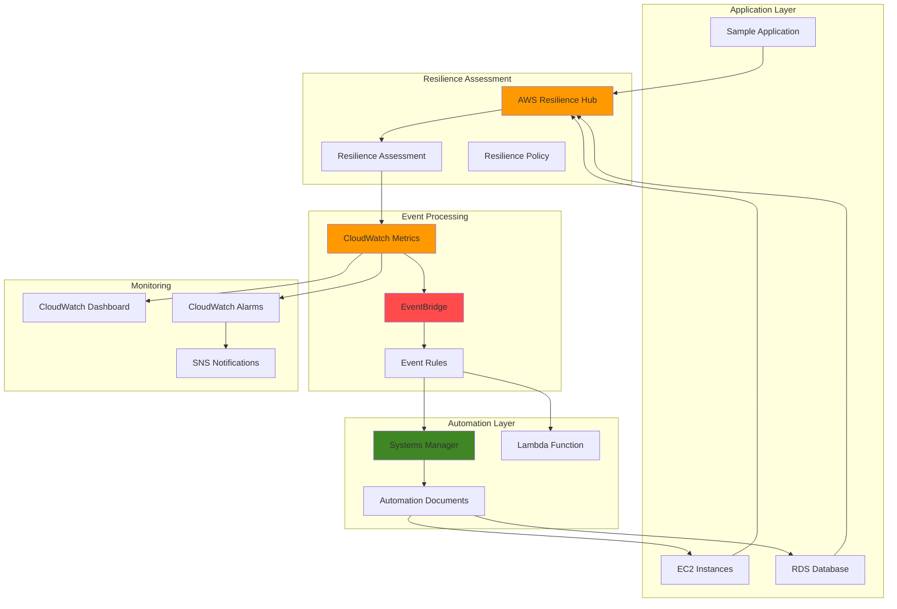

# Monitoring Application Resilience with AWS Resilience Hub and EventBridge

## Problem

Organizations struggle to maintain optimal application resilience as infrastructure complexity grows, often discovering resilience gaps only during outages or disasters. Traditional monitoring approaches are reactive, failing to proactively identify and remediate resilience issues before they impact business operations. Without automated resilience monitoring and remediation, teams spend excessive time on manual assessments and risk prolonged downtime when resilience thresholds are breached.

## Solution

AWS Resilience Hub provides continuous application resilience assessment capabilities that integrate with Amazon EventBridge to trigger automated remediation workflows when resilience scores drop below defined thresholds. This solution automatically executes Systems Manager automation documents to address resilience gaps while CloudWatch provides comprehensive monitoring and alerting across the entire resilience management lifecycle.

## Architecture Diagram



## Prerequisites

1. AWS account with administrative permissions for Resilience Hub, EventBridge, Systems Manager, and CloudWatch
2. AWS CLI v2 installed and configured (or AWS CloudShell access)
3. Basic understanding of AWS Well-Architected Framework resilience principles
4. Sample application or workload with EC2 instances and RDS database for testing
5. Estimated cost: $15-25 USD for 24-hour testing period (includes EC2 t3.micro instances, RDS db.t3.micro, CloudWatch metrics, and EventBridge events)

> **Note**: This recipe follows AWS Well-Architected Framework reliability pillar principles. Ensure proper IAM permissions are configured before proceeding to avoid access denied errors.

## Preparation

```bash
# Set environment variables
export AWS_REGION=$(aws configure get region)
export AWS_ACCOUNT_ID=$(aws sts get-caller-identity \
    --query Account --output text)

# Generate unique identifiers for resources
RANDOM_SUFFIX=$(aws secretsmanager get-random-password \
    --exclude-punctuation --exclude-uppercase \
    --password-length 6 --require-each-included-type \
    --output text --query RandomPassword)

# Set application and resource names
export APP_NAME="resilience-demo-app-${RANDOM_SUFFIX}"
export POLICY_NAME="resilience-policy-${RANDOM_SUFFIX}"
export AUTOMATION_ROLE_NAME="ResilienceAutomationRole-${RANDOM_SUFFIX}"
export LAMBDA_FUNCTION_NAME="resilience-processor-${RANDOM_SUFFIX}"

# Create IAM role for automation
aws iam create-role \
    --role-name ${AUTOMATION_ROLE_NAME} \
    --assume-role-policy-document '{
        "Version": "2012-10-17",
        "Statement": [
            {
                "Effect": "Allow",
                "Principal": {
                    "Service": ["ssm.amazonaws.com", "lambda.amazonaws.com"]
                },
                "Action": "sts:AssumeRole"
            }
        ]
    }'

# Attach necessary policies to automation role
aws iam attach-role-policy \
    --role-name ${AUTOMATION_ROLE_NAME} \
    --policy-arn arn:aws:iam::aws:policy/AmazonSSMAutomationRole

aws iam attach-role-policy \
    --role-name ${AUTOMATION_ROLE_NAME} \
    --policy-arn arn:aws:iam::aws:policy/service-role/AWSLambdaBasicExecutionRole

# Add CloudWatch metrics permissions
aws iam attach-role-policy \
    --role-name ${AUTOMATION_ROLE_NAME} \
    --policy-arn arn:aws:iam::aws:policy/CloudWatchAgentServerPolicy

echo "✅ AWS environment configured with unique identifiers"
```

## Steps

1. **Create Sample Application Infrastructure**:

   AWS Resilience Hub requires an existing application to assess resilience. We'll create a simple multi-tier application with EC2 instances and RDS database to demonstrate resilience monitoring capabilities. This infrastructure provides the foundation for resilience assessment and automated remediation workflows, following AWS Well-Architected Framework best practices for reliability and security.

   ```bash
   # Create VPC and subnets for application
   VPC_ID=$(aws ec2 create-vpc \
       --cidr-block 10.0.0.0/16 \
       --tag-specifications \
       'ResourceType=vpc,Tags=[{Key=Name,Value=resilience-demo-vpc}]' \
       --query 'Vpc.VpcId' --output text)
   
   # Create public subnet in first AZ
   SUBNET_ID_1=$(aws ec2 create-subnet \
       --vpc-id ${VPC_ID} \
       --cidr-block 10.0.1.0/24 \
       --availability-zone ${AWS_REGION}a \
       --tag-specifications \
       'ResourceType=subnet,Tags=[{Key=Name,Value=resilience-demo-subnet-1}]' \
       --query 'Subnet.SubnetId' --output text)
   
   # Create second subnet for RDS Multi-AZ requirements
   SUBNET_ID_2=$(aws ec2 create-subnet \
       --vpc-id ${VPC_ID} \
       --cidr-block 10.0.2.0/24 \
       --availability-zone ${AWS_REGION}b \
       --tag-specifications \
       'ResourceType=subnet,Tags=[{Key=Name,Value=resilience-demo-subnet-2}]' \
       --query 'Subnet.SubnetId' --output text)
   
   # Create internet gateway for public subnet access
   IGW_ID=$(aws ec2 create-internet-gateway \
       --tag-specifications \
       'ResourceType=internet-gateway,Tags=[{Key=Name,Value=resilience-demo-igw}]' \
       --query 'InternetGateway.InternetGatewayId' --output text)
   
   aws ec2 attach-internet-gateway \
       --vpc-id ${VPC_ID} \
       --internet-gateway-id ${IGW_ID}
   
   # Create security group with proper ingress rules
   SG_ID=$(aws ec2 create-security-group \
       --group-name resilience-demo-sg \
       --description "Security group for resilience demo" \
       --vpc-id ${VPC_ID} \
       --query 'GroupId' --output text)
   
   aws ec2 authorize-security-group-ingress \
       --group-id ${SG_ID} \
       --protocol tcp \
       --port 3306 \
       --source-group ${SG_ID}
   
   echo "✅ Application infrastructure foundation created"
   ```

   The VPC provides network isolation with multiple Availability Zones for high availability, while security groups implement least privilege access principles. This multi-AZ setup enables Resilience Hub to assess cross-AZ failover capabilities and backup strategies.

2. **Launch Sample EC2 Instance**:

   EC2 instances serve as compute resources for our resilience assessment. The instance will be monitored by Resilience Hub for availability, performance, and backup configurations. This represents a typical application server that requires resilience monitoring and automated remediation capabilities, configured with AWS Systems Manager for automated management and monitoring.

   ```bash
   # Get latest Amazon Linux 2 AMI
   AMI_ID=$(aws ec2 describe-images \
       --owners amazon \
       --filters 'Name=name,Values=amzn2-ami-hvm-*' \
               'Name=architecture,Values=x86_64' \
               'Name=state,Values=available' \
       --query 'Images | sort_by(@, &CreationDate) | [-1].ImageId' \
       --output text)
   
   # Launch EC2 instance with SSM agent enabled
   INSTANCE_ID=$(aws ec2 run-instances \
       --image-id ${AMI_ID} \
       --instance-type t3.micro \
       --subnet-id ${SUBNET_ID_1} \
       --security-group-ids ${SG_ID} \
       --iam-instance-profile Name=AmazonSSMRoleForInstancesQuickSetup \
       --tag-specifications \
       'ResourceType=instance,Tags=[{Key=Name,Value=resilience-demo-instance},{Key=Environment,Value=demo}]' \
       --user-data '#!/bin/bash
       yum update -y
       yum install -y amazon-cloudwatch-agent' \
       --query 'Instances[0].InstanceId' --output text)
   
   # Wait for instance to be running
   aws ec2 wait instance-running --instance-ids ${INSTANCE_ID}
   
   echo "✅ EC2 instance ${INSTANCE_ID} launched and running"
   ```

   The instance includes CloudWatch agent installation for enhanced monitoring and is configured with Systems Manager for automated management. This setup enables Resilience Hub to assess compute layer resilience and implement automated recovery procedures.

3. **Create RDS Database for Application**:

   RDS provides managed database services with built-in resilience features like automated backups and Multi-AZ deployments. The database will be assessed by Resilience Hub for backup policies, failover capabilities, and recovery procedures to ensure comprehensive application resilience monitoring. Multi-AZ deployment ensures automatic failover capability with minimal downtime.

   ```bash
   # Create DB subnet group spanning multiple AZs
   aws rds create-db-subnet-group \
       --db-subnet-group-name resilience-demo-subnet-group \
       --db-subnet-group-description "Subnet group for resilience demo" \
       --subnet-ids ${SUBNET_ID_1} ${SUBNET_ID_2}
   
   # Create RDS instance with Multi-AZ for high availability
   aws rds create-db-instance \
       --db-instance-identifier resilience-demo-db \
       --db-instance-class db.t3.micro \
       --engine mysql \
       --master-username admin \
       --master-user-password TempPassword123! \
       --allocated-storage 20 \
       --vpc-security-group-ids ${SG_ID} \
       --db-subnet-group-name resilience-demo-subnet-group \
       --backup-retention-period 7 \
       --storage-encrypted \
       --multi-az \
       --auto-minor-version-upgrade \
       --tags Key=Environment,Value=demo Key=Purpose,Value=resilience-testing
   
   # Wait for database to be available
   aws rds wait db-instance-available \
       --db-instance-identifier resilience-demo-db
   
   echo "✅ RDS database created with Multi-AZ deployment and encryption"
   ```

   The RDS instance includes Multi-AZ deployment for automatic failover, encrypted storage for security, and automated backups for point-in-time recovery. These features provide the resilience foundations that Resilience Hub will assess and monitor.

4. **Create Resilience Policy for Application**:

   AWS Resilience Hub policies define resilience requirements including RTO (Recovery Time Objective) and RPO (Recovery Point Objectives) targets across different failure scenarios. These policies establish the baseline for resilience assessments and determine when EventBridge events should be triggered based on policy compliance. Mission-critical tier policies ensure stringent resilience requirements are maintained.

   ```bash
   # Create resilience policy JSON with mission-critical requirements
   cat > resilience-policy.json << EOF
   {
       "policyName": "${POLICY_NAME}",
       "policyDescription": "Mission-critical resilience policy for demo application monitoring",
       "tier": "MissionCritical",
       "policy": {
           "AZ": {
               "rtoInSecs": 300,
               "rpoInSecs": 60
           },
           "Hardware": {
               "rtoInSecs": 600,
               "rpoInSecs": 300
           },
           "Software": {
               "rtoInSecs": 300,
               "rpoInSecs": 60
           },
           "Region": {
               "rtoInSecs": 3600,
               "rpoInSecs": 1800
           }
       },
       "tags": {
           "Environment": "demo",
           "Purpose": "resilience-monitoring"
       }
   }
   EOF
   
   # Create the resilience policy
   aws resiliencehub create-resiliency-policy \
       --cli-input-json file://resilience-policy.json
   
   echo "✅ Mission-critical resilience policy created with stringent RTO/RPO requirements"
   ```

   The policy defines specific recovery objectives: AZ failures must recover within 5 minutes with 1 minute data loss, while regional failures allow up to 1 hour recovery with 30 minutes data loss. These thresholds drive automated alerting and remediation workflows.

5. **Register Application with Resilience Hub**:

   Application registration in Resilience Hub enables continuous resilience assessment and monitoring. The application definition includes all resources that should be evaluated for resilience, providing the foundation for automated EventBridge events when resilience thresholds are not met. The CloudFormation template format enables comprehensive resource discovery and dependency mapping.

   ```bash
   # Create enhanced application template with proper resource mapping
   cat > app-template.json << EOF
   {
       "AWSTemplateFormatVersion": "2010-09-09",
       "Description": "Resilience Hub application template for demo application",
       "Resources": {
           "WebTierInstance": {
               "Type": "AWS::EC2::Instance",
               "Properties": {
                   "InstanceId": "${INSTANCE_ID}"
               }
           },
           "DatabaseInstance": {
               "Type": "AWS::RDS::DBInstance",
               "Properties": {
                   "DBInstanceIdentifier": "resilience-demo-db"
               }
           }
       }
   }
   EOF
   
   # Create application in Resilience Hub
   APP_ARN=$(aws resiliencehub create-app \
       --app-name ${APP_NAME} \
       --description "Demo application for proactive resilience monitoring" \
       --tags Environment=demo,Purpose=resilience-monitoring \
       --query 'app.appArn' --output text)
   
   # Import application template
   aws resiliencehub import-resources-to-draft-app-version \
       --app-arn ${APP_ARN} \
       --source-arns "arn:aws:ec2:${AWS_REGION}:${AWS_ACCOUNT_ID}:instance/${INSTANCE_ID}" \
                     "arn:aws:rds:${AWS_REGION}:${AWS_ACCOUNT_ID}:db:resilience-demo-db"
   
   # Get policy ARN and associate with application
   POLICY_ARN=$(aws resiliencehub list-resiliency-policies \
       --query "resiliencyPolicies[?policyName=='${POLICY_NAME}'].policyArn" \
       --output text)
   
   # Associate resilience policy with application
   aws resiliencehub put-draft-app-version-template \
       --app-arn ${APP_ARN} \
       --app-template-body file://app-template.json
   
   echo "✅ Application ${APP_NAME} registered with Resilience Hub and policy associated"
   ```

   The application registration includes automatic resource discovery and policy association, enabling Resilience Hub to perform comprehensive resilience assessments across all application components and their dependencies.

6. **Create Lambda Function for Event Processing**:

   Lambda functions process EventBridge events triggered by resilience assessment changes. The function analyzes resilience scores, determines appropriate remediation actions, and initiates Systems Manager automation workflows to address identified resilience gaps automatically. This serverless approach provides cost-effective, scalable event processing with built-in fault tolerance.

   ```bash
   # Create enhanced Lambda function code with comprehensive error handling
   cat > lambda_function.py << 'EOF'
   import json
   import boto3
   import logging
   from datetime import datetime
   
   logger = logging.getLogger()
   logger.setLevel(logging.INFO)
   
   def lambda_handler(event, context):
       logger.info(f"Received resilience event: {json.dumps(event)}")
       
       ssm = boto3.client('ssm')
       cloudwatch = boto3.client('cloudwatch')
       
       try:
           # Parse EventBridge event
           event_detail = event.get('detail', {})
           app_name = event_detail.get('applicationName', 'unknown')
           assessment_status = event_detail.get('assessmentStatus', 'UNKNOWN')
           resilience_score = event_detail.get('resilienceScore', 0)
           
           # Log resilience metrics to CloudWatch
           cloudwatch.put_metric_data(
               Namespace='ResilienceHub/Monitoring',
               MetricData=[
                   {
                       'MetricName': 'ResilienceScore',
                       'Dimensions': [
                           {
                               'Name': 'ApplicationName',
                               'Value': app_name
                           }
                       ],
                       'Value': resilience_score,
                       'Unit': 'Percent',
                       'Timestamp': datetime.utcnow()
                   },
                   {
                       'MetricName': 'AssessmentEvents',
                       'Dimensions': [
                           {
                               'Name': 'ApplicationName',
                               'Value': app_name
                           },
                           {
                               'Name': 'Status',
                               'Value': assessment_status
                           }
                       ],
                       'Value': 1,
                       'Unit': 'Count',
                       'Timestamp': datetime.utcnow()
                   }
               ]
           )
           
           # Trigger remediation if score below threshold
           if resilience_score < 80:
               logger.info(f"Resilience score {resilience_score}% below threshold, triggering remediation")
               
               # Create SNS message with detailed information
               message = {
                   'application': app_name,
                   'resilience_score': resilience_score,
                   'status': assessment_status,
                   'timestamp': datetime.utcnow().isoformat(),
                   'action': 'remediation_required'
               }
               
               # Trigger SNS notification automation
               response = ssm.start_automation_execution(
                   DocumentName='AWS-PublishSNSNotification',
                   Parameters={
                       'TopicArn': [f'arn:aws:sns:{boto3.Session().region_name}:{context.invoked_function_arn.split(":")[4]}:resilience-alerts'],
                       'Message': [json.dumps(message, indent=2)]
                   }
               )
               
               logger.info(f"Started automation execution: {response['AutomationExecutionId']}")
           else:
               logger.info(f"Resilience score {resilience_score}% above threshold, no action required")
           
           return {
               'statusCode': 200,
               'body': json.dumps({
                   'message': 'Event processed successfully',
                   'application': app_name,
                   'resilience_score': resilience_score,
                   'assessment_status': assessment_status
               })
           }
           
       except Exception as e:
           logger.error(f"Error processing event: {str(e)}")
           
           # Log error metric
           cloudwatch.put_metric_data(
               Namespace='ResilienceHub/Monitoring',
               MetricData=[
                   {
                       'MetricName': 'ProcessingErrors',
                       'Value': 1,
                       'Unit': 'Count',
                       'Timestamp': datetime.utcnow()
                   }
               ]
           )
           
           raise e
   EOF
   
   # Package Lambda function
   zip lambda_function.zip lambda_function.py
   
   # Create Lambda function with proper configuration
   LAMBDA_ARN=$(aws lambda create-function \
       --function-name ${LAMBDA_FUNCTION_NAME} \
       --runtime python3.9 \
       --role arn:aws:iam::${AWS_ACCOUNT_ID}:role/${AUTOMATION_ROLE_NAME} \
       --handler lambda_function.lambda_handler \
       --zip-file fileb://lambda_function.zip \
       --timeout 60 \
       --memory-size 256 \
       --environment Variables='{LOG_LEVEL=INFO}' \
       --query 'FunctionArn' --output text)
   
   echo "✅ Lambda function created for enhanced resilience event processing"
   ```

   The Lambda function provides comprehensive event processing with detailed CloudWatch metrics, error handling, and automated remediation triggering. It publishes custom metrics for resilience scores and assessment events, enabling detailed monitoring and alerting capabilities.

7. **Configure EventBridge Rule for Resilience Events**:

   EventBridge rules monitor for specific resilience-related events and route them to appropriate targets for processing. This rule detects when resilience assessments complete or when resilience scores change, enabling real-time response to resilience posture changes. The event pattern captures both successful and failed assessments for comprehensive monitoring.

   ```bash
   # Create comprehensive EventBridge rule for all resilience events
   aws events put-rule \
       --name "ResilienceHubAssessmentRule" \
       --description "Comprehensive rule for Resilience Hub assessment events" \
       --event-pattern '{
           "source": ["aws.resiliencehub"],
           "detail-type": [
               "Resilience Assessment State Change",
               "Application Assessment Completed",
               "Policy Compliance Change"
           ],
           "detail": {
               "state": [
                   "ASSESSMENT_COMPLETED",
                   "ASSESSMENT_FAILED",
                   "ASSESSMENT_IN_PROGRESS"
               ]
           }
       }' \
       --state ENABLED
   
   # Add Lambda function as primary target
   aws events put-targets \
       --rule "ResilienceHubAssessmentRule" \
       --targets "Id"="1","Arn"="${LAMBDA_ARN}","InputTransformer"='{
           "InputPathsMap": {
               "app": "$.detail.applicationName",
               "status": "$.detail.state",
               "score": "$.detail.resilienceScore"
           },
           "InputTemplate": "{\"applicationName\": \"<app>\", \"assessmentStatus\": \"<status>\", \"resilienceScore\": <score>}"
       }'
   
   # Grant EventBridge permission to invoke Lambda
   aws lambda add-permission \
       --function-name ${LAMBDA_FUNCTION_NAME} \
       --statement-id "AllowEventBridgeInvoke" \
       --action lambda:InvokeFunction \
       --principal events.amazonaws.com \
       --source-arn \
       "arn:aws:events:${AWS_REGION}:${AWS_ACCOUNT_ID}:rule/ResilienceHubAssessmentRule"
   
   echo "✅ EventBridge rule configured for comprehensive resilience monitoring"
   ```

   The EventBridge rule uses input transformation to normalize event data and ensure consistent processing by downstream targets. This enables sophisticated event routing and processing patterns for different types of resilience events.

8. **Create CloudWatch Dashboard for Resilience Monitoring**:

   CloudWatch dashboards provide visual monitoring of application resilience metrics, assessment history, and automated remediation actions. The dashboard centralizes resilience monitoring data to enable proactive identification of trends and patterns in application resilience posture. Multi-widget layout provides comprehensive visibility across metrics, logs, and alarms.

   ```bash
   # Create comprehensive CloudWatch dashboard configuration
   cat > dashboard-config.json << EOF
   {
       "widgets": [
           {
               "type": "metric",
               "x": 0,
               "y": 0,
               "width": 12,
               "height": 6,
               "properties": {
                   "metrics": [
                       ["ResilienceHub/Monitoring", "ResilienceScore", "ApplicationName", "${APP_NAME}"]
                   ],
                   "period": 300,
                   "stat": "Average",
                   "region": "${AWS_REGION}",
                   "title": "Application Resilience Score Trend",
                   "yAxis": {
                       "left": {
                           "min": 0,
                           "max": 100
                       }
                   },
                   "annotations": {
                       "horizontal": [
                           {
                               "value": 80,
                               "label": "Critical Threshold"
                           }
                       ]
                   }
               }
           },
           {
               "type": "metric",
               "x": 12,
               "y": 0,
               "width": 12,
               "height": 6,
               "properties": {
                   "metrics": [
                       ["ResilienceHub/Monitoring", "AssessmentEvents", "ApplicationName", "${APP_NAME}", "Status", "ASSESSMENT_COMPLETED"],
                       [".", ".", ".", ".", ".", "ASSESSMENT_FAILED"],
                       [".", "ProcessingErrors"]
                   ],
                   "period": 300,
                   "stat": "Sum",
                   "region": "${AWS_REGION}",
                   "title": "Assessment Events and Processing Status"
               }
           },
           {
               "type": "log",
               "x": 0,
               "y": 6,
               "width": 24,
               "height": 6,
               "properties": {
                   "query": "SOURCE '/aws/lambda/${LAMBDA_FUNCTION_NAME}' | fields @timestamp, @message\\n| filter @message like /resilience/\\n| sort @timestamp desc\\n| limit 50",
                   "region": "${AWS_REGION}",
                   "title": "Recent Resilience Events and Processing Logs"
               }
           }
       ]
   }
   EOF
   
   # Create CloudWatch dashboard
   aws cloudwatch put-dashboard \
       --dashboard-name "Application-Resilience-Monitoring" \
       --dashboard-body file://dashboard-config.json
   
   echo "✅ Comprehensive CloudWatch dashboard created for resilience monitoring"
   ```

   The dashboard provides real-time visibility into resilience trends, event processing status, and detailed logging information. The critical threshold annotation helps identify when proactive intervention may be required.

9. **Configure CloudWatch Alarms for Proactive Monitoring**:

   CloudWatch alarms monitor resilience metrics and trigger notifications when thresholds are breached. These alarms provide early warning of resilience degradation and can trigger additional automation workflows to maintain optimal application resilience posture. Multi-threshold monitoring ensures comprehensive coverage of different resilience scenarios.

   ```bash
   # Create SNS topic for resilience alerts
   TOPIC_ARN=$(aws sns create-topic \
       --name resilience-alerts \
       --attributes '{
           "DisplayName": "Resilience Monitoring Alerts",
           "DeliveryPolicy": "{\"http\":{\"defaultHealthyRetryPolicy\":{\"minDelayTarget\":20,\"maxDelayTarget\":20,\"numRetries\":3}}}"
       }' \
       --query 'TopicArn' --output text)
   
   # Create CloudWatch alarm for critically low resilience score
   aws cloudwatch put-metric-alarm \
       --alarm-name "Critical-Low-Resilience-Score" \
       --alarm-description "Critical alert when resilience score drops below 70%" \
       --metric-name ResilienceScore \
       --namespace ResilienceHub/Monitoring \
       --statistic Average \
       --period 300 \
       --threshold 70 \
       --comparison-operator LessThanThreshold \
       --datapoints-to-alarm 1 \
       --evaluation-periods 1 \
       --alarm-actions ${TOPIC_ARN} \
       --ok-actions ${TOPIC_ARN} \
       --dimensions Name=ApplicationName,Value=${APP_NAME}
   
   # Create alarm for warning-level resilience score
   aws cloudwatch put-metric-alarm \
       --alarm-name "Warning-Low-Resilience-Score" \
       --alarm-description "Warning when resilience score drops below 80%" \
       --metric-name ResilienceScore \
       --namespace ResilienceHub/Monitoring \
       --statistic Average \
       --period 300 \
       --threshold 80 \
       --comparison-operator LessThanThreshold \
       --datapoints-to-alarm 2 \
       --evaluation-periods 3 \
       --alarm-actions ${TOPIC_ARN} \
       --dimensions Name=ApplicationName,Value=${APP_NAME}
   
   # Create alarm for assessment failures
   aws cloudwatch put-metric-alarm \
       --alarm-name "Resilience-Assessment-Failures" \
       --alarm-description "Alert when resilience assessments fail repeatedly" \
       --metric-name AssessmentEvents \
       --namespace ResilienceHub/Monitoring \
       --statistic Sum \
       --period 300 \
       --threshold 2 \
       --comparison-operator GreaterThanOrEqualToThreshold \
       --datapoints-to-alarm 1 \
       --evaluation-periods 1 \
       --alarm-actions ${TOPIC_ARN} \
       --dimensions Name=ApplicationName,Value=${APP_NAME} Name=Status,Value=ASSESSMENT_FAILED \
       --treat-missing-data notBreaching
   
   echo "✅ Multi-tier CloudWatch alarms configured for proactive resilience monitoring"
   ```

   The tiered alarm system provides graduated response levels: warning alarms for proactive notification and critical alarms for immediate action. This approach enables appropriate response based on severity and persistence of resilience issues.

10. **Run Initial Resilience Assessment**:

    The initial resilience assessment establishes baseline metrics and identifies existing resilience gaps. This assessment triggers EventBridge events that demonstrate the automated monitoring and response capabilities, validating the complete resilience monitoring workflow. The assessment evaluates all application components against the defined resilience policy requirements.

    ```bash
    # Publish application version for assessment
    aws resiliencehub publish-app-version \
        --app-arn ${APP_ARN}
    
    # Start comprehensive resilience assessment
    ASSESSMENT_ARN=$(aws resiliencehub start-app-assessment \
        --app-arn ${APP_ARN} \
        --app-version $(aws resiliencehub describe-app \
            --app-arn ${APP_ARN} \
            --query 'app.appVersion' --output text) \
        --assessment-name "initial-assessment-$(date +%Y%m%d-%H%M%S)" \
        --tags Environment=demo,Purpose=baseline-assessment \
        --query 'assessment.assessmentArn' --output text)
    
    # Monitor assessment progress
    echo "Assessment ARN: ${ASSESSMENT_ARN}"
    echo "Monitoring assessment progress..."
    
    # Wait for assessment to complete (timeout after 20 minutes)
    for i in {1..40}; do
        STATUS=$(aws resiliencehub describe-app-assessment \
            --assessment-arn ${ASSESSMENT_ARN} \
            --query 'assessment.assessmentStatus' --output text)
        echo "Assessment status: ${STATUS}"
        
        if [[ "${STATUS}" == "Success" || "${STATUS}" == "Failed" ]]; then
            break
        fi
        sleep 30
    done
    
    echo "✅ Initial resilience assessment initiated and monitored"
    echo "Assessment will complete in 5-15 minutes and trigger EventBridge events"
    echo "Monitor progress in CloudWatch dashboard: https://${AWS_REGION}.console.aws.amazon.com/cloudwatch/home?region=${AWS_REGION}#dashboards:name=Application-Resilience-Monitoring"
    ```

    The assessment provides comprehensive evaluation of application resilience across multiple failure scenarios, generating detailed reports and recommendations that drive automated remediation workflows.

## Validation & Testing

1. **Verify Resilience Hub Application Registration**:

   ```bash
   # Check application status and configuration
   aws resiliencehub describe-app --app-arn ${APP_ARN}
   
   # Verify resilience policy association
   aws resiliencehub list-resiliency-policies \
       --query "resiliencyPolicies[?policyName=='${POLICY_NAME}']"
   
   # Check application components
   aws resiliencehub list-app-version-app-components \
       --app-arn ${APP_ARN} \
       --app-version $(aws resiliencehub describe-app \
           --app-arn ${APP_ARN} \
           --query 'app.appVersion' --output text)
   ```

   Expected output: Application should show as "Active" status with associated resilience policy and properly registered components

2. **Test EventBridge Rule Configuration**:

   ```bash
   # Verify EventBridge rule exists and is enabled
   aws events describe-rule --name "ResilienceHubAssessmentRule"
   
   # Check rule targets and input transformation
   aws events list-targets-by-rule --rule "ResilienceHubAssessmentRule"
   
   # Test Lambda function permissions
   aws lambda get-policy --function-name ${LAMBDA_FUNCTION_NAME}
   ```

   Expected output: Rule should be in "ENABLED" state with Lambda function as target and proper input transformation

3. **Monitor Assessment Progress and Events**:

   ```bash
   # Check current assessment status
   aws resiliencehub describe-app-assessment \
       --assessment-arn ${ASSESSMENT_ARN}
   
   # Monitor Lambda function logs for event processing
   aws logs tail /aws/lambda/${LAMBDA_FUNCTION_NAME} --follow --since 1h
   
   # Check for generated CloudWatch metrics
   aws cloudwatch get-metric-statistics \
       --namespace ResilienceHub/Monitoring \
       --metric-name AssessmentEvents \
       --dimensions Name=ApplicationName,Value=${APP_NAME} \
       --start-time $(date -u -d '1 hour ago' +%Y-%m-%dT%H:%M:%SZ) \
       --end-time $(date -u +%Y-%m-%dT%H:%M:%SZ) \
       --period 300 \
       --statistics Sum
   ```

   Expected output: Assessment should progress from "InProgress" to "Success" with corresponding Lambda log entries and CloudWatch metrics

4. **Validate CloudWatch Metrics and Dashboard**:

   ```bash
   # Check for resilience score metrics
   aws cloudwatch get-metric-statistics \
       --namespace ResilienceHub/Monitoring \
       --metric-name ResilienceScore \
       --dimensions Name=ApplicationName,Value=${APP_NAME} \
       --start-time $(date -u -d '2 hours ago' +%Y-%m-%dT%H:%M:%SZ) \
       --end-time $(date -u +%Y-%m-%dT%H:%M:%SZ) \
       --period 300 \
       --statistics Average,Maximum,Minimum
   
   # Verify alarm states
   aws cloudwatch describe-alarms \
       --alarm-names "Critical-Low-Resilience-Score" \
                     "Warning-Low-Resilience-Score" \
                     "Resilience-Assessment-Failures"
   
   # Access dashboard URL
   echo "Dashboard URL: https://${AWS_REGION}.console.aws.amazon.com/cloudwatch/home?region=${AWS_REGION}#dashboards:name=Application-Resilience-Monitoring"
   ```

   Expected output: Metrics should show resilience scores with historical data points and alarms should be in appropriate states

## Cleanup

1. **Remove CloudWatch Resources**:

   ```bash
   # Delete CloudWatch alarms
   aws cloudwatch delete-alarms \
       --alarm-names "Critical-Low-Resilience-Score" \
                     "Warning-Low-Resilience-Score" \
                     "Resilience-Assessment-Failures"
   
   # Delete dashboard
   aws cloudwatch delete-dashboards \
       --dashboard-names "Application-Resilience-Monitoring"
   
   echo "✅ CloudWatch resources cleaned up"
   ```

2. **Remove EventBridge and Lambda Resources**:

   ```bash
   # Delete EventBridge rule targets and rule
   aws events remove-targets \
       --rule "ResilienceHubAssessmentRule" \
       --ids "1"
   
   aws events delete-rule \
       --name "ResilienceHubAssessmentRule"
   
   # Delete Lambda function
   aws lambda delete-function \
       --function-name ${LAMBDA_FUNCTION_NAME}
   
   # Delete SNS topic
   aws sns delete-topic --topic-arn ${TOPIC_ARN}
   
   echo "✅ EventBridge and Lambda resources cleaned up"
   ```

3. **Remove Resilience Hub Resources**:

   ```bash
   # Delete application from Resilience Hub
   aws resiliencehub delete-app \
       --app-arn ${APP_ARN} \
       --force-delete
   
   # Delete resilience policy
   aws resiliencehub delete-resiliency-policy \
       --policy-arn ${POLICY_ARN}
   
   echo "✅ Resilience Hub resources cleaned up"
   ```

4. **Remove Sample Application Infrastructure**:

   ```bash
   # Terminate EC2 instance
   aws ec2 terminate-instances --instance-ids ${INSTANCE_ID}
   aws ec2 wait instance-terminated --instance-ids ${INSTANCE_ID}
   
   # Delete RDS instance
   aws rds delete-db-instance \
       --db-instance-identifier resilience-demo-db \
       --skip-final-snapshot \
       --delete-automated-backups
   
   # Wait for RDS deletion to complete
   aws rds wait db-instance-deleted \
       --db-instance-identifier resilience-demo-db
   
   # Delete DB subnet group
   aws rds delete-db-subnet-group \
       --db-subnet-group-name resilience-demo-subnet-group
   
   # Delete VPC resources in proper order
   aws ec2 delete-security-group --group-id ${SG_ID}
   aws ec2 detach-internet-gateway \
       --vpc-id ${VPC_ID} \
       --internet-gateway-id ${IGW_ID}
   aws ec2 delete-internet-gateway --internet-gateway-id ${IGW_ID}
   aws ec2 delete-subnet --subnet-id ${SUBNET_ID_1}
   aws ec2 delete-subnet --subnet-id ${SUBNET_ID_2}
   aws ec2 delete-vpc --vpc-id ${VPC_ID}
   
   echo "✅ Application infrastructure cleaned up"
   ```

5. **Remove IAM Resources**:

   ```bash
   # Detach policies and delete IAM role
   aws iam detach-role-policy \
       --role-name ${AUTOMATION_ROLE_NAME} \
       --policy-arn arn:aws:iam::aws:policy/AmazonSSMAutomationRole
   
   aws iam detach-role-policy \
       --role-name ${AUTOMATION_ROLE_NAME} \
       --policy-arn arn:aws:iam::aws:policy/service-role/AWSLambdaBasicExecutionRole
   
   aws iam detach-role-policy \
       --role-name ${AUTOMATION_ROLE_NAME} \
       --policy-arn arn:aws:iam::aws:policy/CloudWatchAgentServerPolicy
   
   aws iam delete-role --role-name ${AUTOMATION_ROLE_NAME}
   
   # Clean up local files
   rm -f resilience-policy.json app-template.json dashboard-config.json
   rm -f lambda_function.py lambda_function.zip
   
   echo "✅ IAM resources and local files cleaned up"
   ```

## Discussion

AWS Resilience Hub provides a centralized approach to application resilience management by continuously assessing applications against defined resilience policies and generating actionable recommendations. The service evaluates Recovery Time Objectives (RTO) and Recovery Point Objectives (RPO) across multiple failure scenarios including Availability Zone, hardware, software, and regional failures. By integrating with EventBridge, organizations can create event-driven architectures that automatically respond to resilience posture changes, enabling proactive rather than reactive resilience management. This approach aligns with the AWS Well-Architected Framework's reliability pillar by implementing automated monitoring, testing, and recovery procedures.

The EventBridge integration enables sophisticated event routing patterns that can trigger multiple remediation workflows based on specific resilience assessment outcomes. Custom Lambda functions can process these events to implement business-specific logic, such as automatically scaling resources, enabling additional backup mechanisms, or notifying operations teams when manual intervention is required. This automated approach significantly reduces Mean Time to Recovery (MTTR) by eliminating manual assessment processes and immediately initiating remediation actions when resilience thresholds are breached. The solution demonstrates the power of AWS's event-driven architecture patterns in creating responsive, self-healing systems.

Systems Manager Automation provides the execution layer for remediation actions, offering pre-built automation documents for common operational tasks and the flexibility to create custom automation workflows. The integration with CloudWatch enables comprehensive monitoring and alerting capabilities, ensuring that resilience metrics are tracked over time and trends can be identified before they impact business operations. This holistic approach follows AWS Well-Architected Framework principles by implementing defense in depth, automated recovery mechanisms, and continuous improvement processes. The tiered alarm system provides graduated response levels that enable appropriate action based on severity.

The solution demonstrates enterprise-grade resilience monitoring capabilities that scale across multiple applications and environments. Organizations can extend this pattern to integrate with external tools, implement custom scoring algorithms, or create complex multi-step remediation workflows that address specific business requirements and compliance needs. The comprehensive dashboard and metrics enable data-driven decision making for resilience investments and provide visibility into resilience trends across the application portfolio.

> **Tip**: Use AWS Config Rules in conjunction with Resilience Hub to monitor configuration drift that could impact resilience posture. The combination provides comprehensive visibility into both resilience assessment results and configuration compliance status. See the [AWS Config documentation](https://docs.aws.amazon.com/config/latest/developerguide/resilience-config-rules.html) for integration patterns.

## Challenge

Extend this solution by implementing these enhancements:

1. **Multi-Application Resilience Monitoring**: Modify the EventBridge rules and Lambda function to support monitoring multiple applications simultaneously, with application-specific thresholds and remediation actions stored in DynamoDB for dynamic configuration management. Implement cross-application resilience reporting and trend analysis.

2. **Advanced Remediation Workflows**: Create custom Systems Manager automation documents that automatically implement resilience improvements such as enabling Cross-Region backups, configuring Auto Scaling policies, or deploying applications across additional Availability Zones based on specific resilience gaps identified in assessments.

3. **Integration with AWS Fault Injection Service**: Implement automated chaos engineering by integrating with AWS FIS to periodically test application resilience, automatically running fault injection experiments based on Resilience Hub recommendations and measuring recovery times against defined RTO objectives.

4. **Cost-Aware Resilience Optimization**: Enhance the Lambda function to integrate with AWS Cost Explorer APIs to balance resilience improvements with cost considerations, automatically recommending the most cost-effective resilience enhancements while maintaining compliance with defined RTO and RPO targets.

5. **Cross-Account Resilience Management**: Extend the solution to support multi-account architectures using AWS Organizations, implementing centralized resilience monitoring across development, staging, and production environments with account-specific policies and automated promotion of resilience improvements through CI/CD pipelines.

## Infrastructure Code

*Infrastructure code will be generated after recipe approval.*