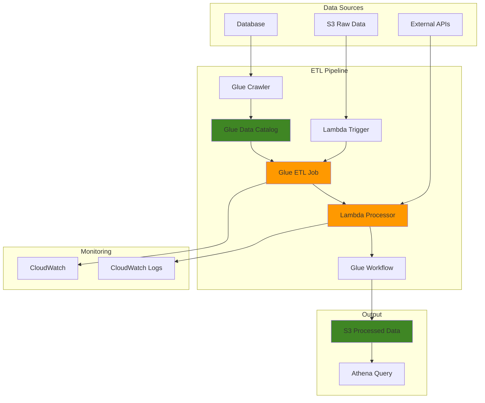

# Processing Data with AWS Glue and Lambda

## Problem

Organizations generate massive amounts of data from various sources including databases, logs, IoT devices, and third-party APIs, requiring complex ETL processes to transform and load this data into analytics systems. Traditional ETL solutions often involve managing infrastructure, handling capacity planning, and dealing with varying workloads that can be costly and time-consuming. Companies need a scalable, cost-effective solution that can automatically handle data processing without infrastructure management while providing reliable orchestration and error handling capabilities.

## Solution

Build a serverless ETL pipeline using AWS Glue for large-scale data transformations and AWS Lambda for lightweight processing tasks and orchestration. This solution leverages AWS Glue's serverless Apache Spark environment for heavy data processing while using Lambda functions for triggering jobs, handling smaller transformations, and managing workflow logic. The architecture provides automatic scaling, pay-per-use pricing, and seamless integration with the AWS data ecosystem.

## Architecture Diagram



## Prerequisites

1. AWS account with appropriate permissions for Glue, Lambda, S3, and CloudWatch
2. AWS CLI v2 installed and configured (or AWS CloudShell)
3. Basic understanding of ETL concepts and Python programming
4. Familiarity with JSON and CSV data formats
5. Knowledge of AWS IAM roles and policies
6. Estimated cost: $5-15 for data processing and storage during recipe execution

> **Note**: This recipe creates serverless resources that scale automatically based on data volume and processing requirements.

## Preparation

```bash
# Set environment variables
export AWS_REGION=$(aws configure get region)
export AWS_ACCOUNT_ID=$(aws sts get-caller-identity \
    --query Account --output text)

# Generate unique identifiers for resources
RANDOM_SUFFIX=$(aws secretsmanager get-random-password \
    --exclude-punctuation --exclude-uppercase \
    --password-length 6 --require-each-included-type \
    --output text --query RandomPassword)

export BUCKET_NAME="serverless-etl-pipeline-${RANDOM_SUFFIX}"
export GLUE_DATABASE="etl_database_${RANDOM_SUFFIX}"
export GLUE_ROLE="GlueETLRole-${RANDOM_SUFFIX}"
export LAMBDA_ROLE="LambdaETLRole-${RANDOM_SUFFIX}"
export JOB_NAME="etl_job_${RANDOM_SUFFIX}"
export CRAWLER_NAME="etl_crawler_${RANDOM_SUFFIX}"
export WORKFLOW_NAME="etl_workflow_${RANDOM_SUFFIX}"

# Create S3 bucket for data storage
aws s3 mb "s3://${BUCKET_NAME}" --region ${AWS_REGION}

# Create directory structure in S3
aws s3api put-object --bucket ${BUCKET_NAME} \
    --key "raw-data/"
aws s3api put-object --bucket ${BUCKET_NAME} \
    --key "processed-data/"
aws s3api put-object --bucket ${BUCKET_NAME} \
    --key "scripts/"
aws s3api put-object --bucket ${BUCKET_NAME} \
    --key "temp/"

echo "✅ S3 bucket and directory structure created"
```

## Steps

1. **Create IAM Roles for Glue and Lambda**:

   IAM roles provide secure, temporary credentials for AWS services to access other resources without exposing permanent access keys. AWS Glue requires specific permissions to read from S3, write job outputs, and interact with the Data Catalog. This principle of least privilege ensures our ETL pipeline operates securely while maintaining the flexibility to process data across multiple AWS services.

   ```bash
   # Create Glue service role
   aws iam create-role \
       --role-name ${GLUE_ROLE} \
       --assume-role-policy-document '{
           "Version": "2012-10-17",
           "Statement": [
               {
                   "Effect": "Allow",
                   "Principal": {
                       "Service": "glue.amazonaws.com"
                   },
                   "Action": "sts:AssumeRole"
               }
           ]
       }'
   
   # Attach AWS managed policy for Glue
   aws iam attach-role-policy \
       --role-name ${GLUE_ROLE} \
       --policy-arn arn:aws:iam::aws:policy/service-role/AWSGlueServiceRole
   
   # Create custom policy for S3 access
   aws iam create-policy \
       --policy-name GlueS3AccessPolicy-${RANDOM_SUFFIX} \
       --policy-document '{
           "Version": "2012-10-17",
           "Statement": [
               {
                   "Effect": "Allow",
                   "Action": [
                       "s3:GetObject",
                       "s3:PutObject",
                       "s3:DeleteObject",
                       "s3:ListBucket"
                   ],
                   "Resource": [
                       "arn:aws:s3:::'"${BUCKET_NAME}"'",
                       "arn:aws:s3:::'"${BUCKET_NAME}"'/*"
                   ]
               }
           ]
       }'
   
   # Attach custom S3 policy to Glue role
   aws iam attach-role-policy \
       --role-name ${GLUE_ROLE} \
       --policy-arn arn:aws:iam::${AWS_ACCOUNT_ID}:policy/GlueS3AccessPolicy-${RANDOM_SUFFIX}
   
   echo "✅ Glue IAM role created and configured"
   ```

   The Glue service role is now established with appropriate permissions for S3 access and Data Catalog operations. This security foundation enables AWS Glue to automatically scale compute resources, read source data, and write processed results while maintaining enterprise-grade security controls.

2. **Create Lambda IAM Role**:

   Lambda functions require distinct IAM roles that enable them to trigger Glue jobs, monitor execution status, and log activities to CloudWatch. Lambda's event-driven architecture makes it ideal for orchestrating ETL workflows, responding to data arrival events, and managing complex processing dependencies without maintaining persistent infrastructure.

   ```bash
   # Create Lambda service role
   aws iam create-role \
       --role-name ${LAMBDA_ROLE} \
       --assume-role-policy-document '{
           "Version": "2012-10-17",
           "Statement": [
               {
                   "Effect": "Allow",
                   "Principal": {
                       "Service": "lambda.amazonaws.com"
                   },
                   "Action": "sts:AssumeRole"
               }
           ]
       }'
   
   # Attach basic Lambda execution policy
   aws iam attach-role-policy \
       --role-name ${LAMBDA_ROLE} \
       --policy-arn arn:aws:iam::aws:policy/service-role/AWSLambdaBasicExecutionRole
   
   # Create custom policy for Lambda to interact with Glue
   aws iam create-policy \
       --policy-name LambdaGlueAccessPolicy-${RANDOM_SUFFIX} \
       --policy-document '{
           "Version": "2012-10-17",
           "Statement": [
               {
                   "Effect": "Allow",
                   "Action": [
                       "glue:StartJobRun",
                       "glue:GetJobRun",
                       "glue:GetJobRuns",
                       "glue:StartCrawler",
                       "glue:GetCrawler",
                       "glue:StartWorkflowRun",
                       "s3:GetObject",
                       "s3:PutObject",
                       "s3:ListBucket"
                   ],
                   "Resource": "*"
               }
           ]
       }'
   
   # Attach custom Glue policy to Lambda role
   aws iam attach-role-policy \
       --role-name ${LAMBDA_ROLE} \
       --policy-arn arn:aws:iam::${AWS_ACCOUNT_ID}:policy/LambdaGlueAccessPolicy-${RANDOM_SUFFIX}
   
   echo "✅ Lambda IAM role created and configured"
   ```

   The Lambda orchestration role is now configured with permissions to control Glue job execution and monitor pipeline status. This separation of concerns between data processing (Glue) and workflow orchestration (Lambda) enables efficient resource utilization and simplified debugging of complex ETL operations.

3. **Create Sample Data and Upload to S3**:

   S3 provides the highly durable, scalable object storage foundation for our data lake architecture. Creating realistic sample data helps demonstrate the ETL pipeline's transformation capabilities and provides a testing environment for validating data quality and processing logic. This data represents common business scenarios with sales transactions and customer information.

   ```bash
   # Create sample CSV data file
   cat > sales_data.csv << 'EOF'
order_id,customer_id,product_id,quantity,price,order_date,region
1001,C001,P001,2,29.99,2024-01-15,North
1002,C002,P002,1,49.99,2024-01-15,South
1003,C003,P001,3,29.99,2024-01-16,East
1004,C001,P003,1,19.99,2024-01-16,North
1005,C004,P002,2,49.99,2024-01-17,West
1006,C005,P001,1,29.99,2024-01-17,South
1007,C002,P003,4,19.99,2024-01-18,East
1008,C006,P004,1,99.99,2024-01-18,North
1009,C003,P004,2,99.99,2024-01-19,West
1010,C007,P002,1,49.99,2024-01-19,South
EOF
   
   # Upload sample data to S3
   aws s3 cp sales_data.csv \
       "s3://${BUCKET_NAME}/raw-data/sales_data.csv"
   
   # Create additional sample data for demonstration
   cat > customer_data.csv << 'EOF'
customer_id,name,email,registration_date,status
C001,John Smith,john@example.com,2023-01-01,active
C002,Jane Doe,jane@example.com,2023-02-15,active
C003,Bob Johnson,bob@example.com,2023-03-20,inactive
C004,Alice Wilson,alice@example.com,2023-04-10,active
C005,Charlie Brown,charlie@example.com,2023-05-05,active
C006,Diana Prince,diana@example.com,2023-06-12,active
C007,Eve Adams,eve@example.com,2023-07-22,active
EOF
   
   aws s3 cp customer_data.csv \
       "s3://${BUCKET_NAME}/raw-data/customer_data.csv"
   
   echo "✅ Sample data uploaded to S3"
   ```

   The sample datasets are now stored in S3 and ready for processing. This establishes the raw data layer that serves as input for our ETL pipeline, simulating real-world scenarios where multiple data sources feed into analytics systems for business intelligence and reporting.

4. **Create Glue Database and Crawler**:

   AWS Glue Data Catalog serves as a centralized metadata repository that automatically discovers, catalogs, and maintains schema information for your data lake. Glue crawlers intelligently scan S3 objects, infer schemas, and create table definitions that enable seamless querying with analytics tools like Athena and EMR. This eliminates manual schema management and ensures consistent metadata across your organization.

   ```bash
   # Create Glue database
   aws glue create-database \
       --database-input "{\"Name\":\"${GLUE_DATABASE}\"}"
   
   # Create Glue crawler to catalog the raw data
   aws glue create-crawler \
       --name ${CRAWLER_NAME} \
       --role "arn:aws:iam::${AWS_ACCOUNT_ID}:role/${GLUE_ROLE}" \
       --database-name ${GLUE_DATABASE} \
       --targets "{
           \"S3Targets\": [
               {
                   \"Path\": \"s3://${BUCKET_NAME}/raw-data/\"
               }
           ]
       }"
   
   # Start the crawler to discover and catalog data
   aws glue start-crawler --name ${CRAWLER_NAME}
   
   # Wait for crawler to complete
   echo "Waiting for crawler to complete..."
   while true; do
       CRAWLER_STATE=$(aws glue get-crawler \
           --name ${CRAWLER_NAME} \
           --query 'Crawler.State' --output text)
       if [ "$CRAWLER_STATE" = "READY" ]; then
           echo "✅ Crawler completed successfully"
           break
       fi
       echo "Crawler state: $CRAWLER_STATE"
       sleep 10
   done
   ```

   The Glue crawler has successfully cataloged our datasets, creating table schemas that can be referenced by ETL jobs and query engines. This automated discovery process establishes the foundation for schema-aware data processing and enables consistent data governance across the analytics pipeline.

> **Warning**: Glue crawlers may incur additional charges for catalog requests and S3 API calls. Monitor your usage in the AWS Billing console and consider implementing crawler schedules to optimize costs for production workloads.

5. **Create Glue ETL Job Script**:

   AWS Glue ETL jobs leverage Apache Spark's distributed computing capabilities to process large datasets efficiently. The ETL script defines transformation logic using PySpark, enabling complex operations like joins, aggregations, and data type conversions at scale. Glue's serverless Spark environment automatically handles cluster provisioning, scaling, and job optimization, eliminating infrastructure management overhead.

   ```bash
   # Create Python script for Glue ETL job
   cat > glue_etl_script.py << 'EOF'
import sys
from awsglue.transforms import *
from awsglue.utils import getResolvedOptions
from pyspark.context import SparkContext
from awsglue.context import GlueContext
from awsglue.job import Job
from pyspark.sql import functions as F
from pyspark.sql.types import *

# Parse job arguments
args = getResolvedOptions(sys.argv, [
    'JOB_NAME',
    'database_name',
    'table_prefix',
    'output_path'
])

# Initialize contexts
sc = SparkContext()
glueContext = GlueContext(sc)
spark = glueContext.spark_session
job = Job(glueContext)
job.init(args['JOB_NAME'], args)

# Read data from Glue Data Catalog
sales_df = glueContext.create_dynamic_frame.from_catalog(
    database=args['database_name'],
    table_name=f"{args['table_prefix']}_sales_data_csv"
).toDF()

customer_df = glueContext.create_dynamic_frame.from_catalog(
    database=args['database_name'],
    table_name=f"{args['table_prefix']}_customer_data_csv"
).toDF()

# Data transformations
# 1. Convert price to numeric and calculate total
sales_df = sales_df.withColumn("price", F.col("price").cast("double"))
sales_df = sales_df.withColumn("total_amount", 
    F.col("quantity") * F.col("price"))

# 2. Convert order_date to proper date format
sales_df = sales_df.withColumn("order_date", 
    F.to_date(F.col("order_date"), "yyyy-MM-dd"))

# 3. Join sales with customer data
enriched_df = sales_df.join(customer_df, "customer_id", "inner")

# 4. Calculate aggregated metrics
daily_sales = enriched_df.groupBy("order_date", "region").agg(
    F.sum("total_amount").alias("daily_revenue"),
    F.count("order_id").alias("daily_orders"),
    F.countDistinct("customer_id").alias("unique_customers")
)

# 5. Calculate customer metrics
customer_metrics = enriched_df.groupBy("customer_id", "name", "status").agg(
    F.sum("total_amount").alias("total_spent"),
    F.count("order_id").alias("total_orders"),
    F.avg("total_amount").alias("avg_order_value")
)

# Write processed data to S3
# Convert back to DynamicFrame for writing
daily_sales_df = DynamicFrame.fromDF(daily_sales, glueContext, "daily_sales")
customer_metrics_df = DynamicFrame.fromDF(customer_metrics, glueContext, "customer_metrics")

# Write daily sales data
glueContext.write_dynamic_frame.from_options(
    frame=daily_sales_df,
    connection_type="s3",
    connection_options={
        "path": f"{args['output_path']}/daily_sales/",
        "partitionKeys": ["order_date"]
    },
    format="parquet"
)

# Write customer metrics
glueContext.write_dynamic_frame.from_options(
    frame=customer_metrics_df,
    connection_type="s3",
    connection_options={
        "path": f"{args['output_path']}/customer_metrics/"
    },
    format="parquet"
)

# Log processing statistics
print(f"Processed {sales_df.count()} sales records")
print(f"Processed {customer_df.count()} customer records")
print(f"Generated {daily_sales.count()} daily sales records")
print(f"Generated {customer_metrics.count()} customer metric records")

job.commit()
EOF
   
   # Upload script to S3
   aws s3 cp glue_etl_script.py \
       "s3://${BUCKET_NAME}/scripts/glue_etl_script.py"
   
   echo "✅ Glue ETL script created and uploaded"
   ```

   The ETL script is now stored in S3 and ready for execution by Glue jobs. This script contains production-ready transformation logic that converts raw sales and customer data into analytics-ready datasets with proper data types, calculated metrics, and optimized storage formats for downstream consumption.

> **Note**: AWS Glue supports job bookmarks for incremental data processing. Enable bookmarks in production to process only new or changed data, significantly reducing processing time and costs. See the [AWS Glue Developer Guide](https://docs.aws.amazon.com/glue/latest/dg/monitor-continuations.html) for implementation details.

6. **Create Glue ETL Job**:

   Creating a Glue job configures the execution environment and resource allocation for our ETL script. Glue version 5.0 provides the latest Apache Spark 3.5 optimizations and significant performance improvements (32% faster than Glue 4.0), while the G.1X worker type offers balanced compute and memory resources suitable for most ETL workloads. The job configuration includes parameters for monitoring, logging, and automatic retries to ensure reliable processing.

   ```bash
   # Create Glue ETL job
   aws glue create-job \
       --name ${JOB_NAME} \
       --role "arn:aws:iam::${AWS_ACCOUNT_ID}:role/${GLUE_ROLE}" \
       --command "{
           \"Name\": \"glueetl\",
           \"ScriptLocation\": \"s3://${BUCKET_NAME}/scripts/glue_etl_script.py\",
           \"PythonVersion\": \"3\"
       }" \
       --default-arguments "{
           \"--database_name\": \"${GLUE_DATABASE}\",
           \"--table_prefix\": \"raw_data\",
           \"--output_path\": \"s3://${BUCKET_NAME}/processed-data\",
           \"--TempDir\": \"s3://${BUCKET_NAME}/temp/\",
           \"--enable-metrics\": \"\",
           \"--enable-continuous-cloudwatch-log\": \"true\",
           \"--job-language\": \"python\"
       }" \
       --max-retries 1 \
       --timeout 60 \
       --glue-version "5.0" \
       --worker-type "G.1X" \
       --number-of-workers 2
   
   echo "✅ Glue ETL job created"
   ```

   The Glue job definition is now registered and ready for execution. This job configuration leverages AWS Glue 5.0's enhanced performance and Apache Spark 3.5 capabilities, providing the blueprint for scalable data processing that enables automatic resource provisioning based on data volume and processing complexity while maintaining cost efficiency through pay-per-use pricing.

7. **Create Lambda Function for Pipeline Orchestration**:

   Lambda functions excel at orchestrating ETL workflows by providing event-driven execution, automatic scaling, and seamless integration with other AWS services. This orchestrator function manages job execution, monitors status, and handles error conditions, creating a resilient pipeline that can respond to data arrival events and schedule-based triggers without maintaining persistent infrastructure.

   ```bash
   # Create Lambda function code
   cat > lambda_function.py << 'EOF'
import json
import boto3
import logging
from datetime import datetime

# Configure logging
logger = logging.getLogger()
logger.setLevel(logging.INFO)

# Initialize AWS clients
glue_client = boto3.client('glue')
s3_client = boto3.client('s3')

def lambda_handler(event, context):
    """
    Lambda function to orchestrate ETL pipeline
    """
    try:
        # Extract configuration from event
        job_name = event.get('job_name')
        database_name = event.get('database_name')
        
        if not job_name:
            raise ValueError("job_name is required in event")
        
        # Start Glue job
        response = glue_client.start_job_run(
            JobName=job_name,
            Arguments={
                '--database_name': database_name,
                '--table_prefix': 'raw_data',
                '--output_path': event.get('output_path', 's3://default-bucket/processed-data')
            }
        )
        
        job_run_id = response['JobRunId']
        logger.info(f"Started Glue job {job_name} with run ID: {job_run_id}")
        
        # Return success response
        return {
            'statusCode': 200,
            'body': json.dumps({
                'message': 'ETL pipeline initiated successfully',
                'job_name': job_name,
                'job_run_id': job_run_id,
                'timestamp': datetime.now().isoformat()
            })
        }
        
    except Exception as e:
        logger.error(f"Error in ETL pipeline: {str(e)}")
        return {
            'statusCode': 500,
            'body': json.dumps({
                'error': str(e),
                'timestamp': datetime.now().isoformat()
            })
        }

def check_job_status(job_name, job_run_id):
    """
    Check the status of a Glue job run
    """
    try:
        response = glue_client.get_job_run(
            JobName=job_name,
            RunId=job_run_id
        )
        
        job_run = response['JobRun']
        status = job_run['JobRunState']
        
        return {
            'status': status,
            'started_on': job_run.get('StartedOn'),
            'completed_on': job_run.get('CompletedOn'),
            'execution_time': job_run.get('ExecutionTime'),
            'error_message': job_run.get('ErrorMessage')
        }
        
    except Exception as e:
        logger.error(f"Error checking job status: {str(e)}")
        return {'error': str(e)}
EOF
   
   # Create deployment package
   zip lambda_function.zip lambda_function.py
   
   # Create Lambda function with current Python runtime
   aws lambda create-function \
       --function-name etl-orchestrator-${RANDOM_SUFFIX} \
       --runtime python3.12 \
       --role "arn:aws:iam::${AWS_ACCOUNT_ID}:role/${LAMBDA_ROLE}" \
       --handler lambda_function.lambda_handler \
       --zip-file fileb://lambda_function.zip \
       --timeout 300 \
       --memory-size 256
   
   echo "✅ Lambda function created"
   ```

   The Lambda orchestrator is now deployed using Python 3.12 runtime and ready to manage ETL pipeline execution. This serverless function provides reliable job triggering, status monitoring, and error handling capabilities, enabling automatic pipeline operations that scale from occasional batch jobs to high-frequency data processing scenarios.

8. **Create Glue Workflow for Pipeline Orchestration**:

   Glue Workflows provide native orchestration capabilities for complex ETL pipelines with dependencies, conditional logic, and scheduling requirements. Workflows complement Lambda orchestration by offering visual pipeline representation, built-in job dependency management, and integrated monitoring through the Glue console, making them ideal for complex multi-step ETL processes.

   ```bash
   # Create Glue workflow
   aws glue create-workflow \
       --name ${WORKFLOW_NAME} \
       --description "Serverless ETL Pipeline Workflow"
   
   # Create workflow trigger
   aws glue create-trigger \
       --name "start-etl-trigger-${RANDOM_SUFFIX}" \
       --workflow-name ${WORKFLOW_NAME} \
       --type SCHEDULED \
       --schedule "cron(0 2 * * ? *)" \
       --actions "[{
           \"JobName\": \"${JOB_NAME}\"
       }]"
   
   echo "✅ Glue workflow and trigger created"
   ```

   The Glue workflow is now configured with automated scheduling through cron expressions, enabling regular batch processing without manual intervention. This scheduled execution pattern is essential for production ETL pipelines that need to process data at consistent intervals while maintaining operational reliability.

9. **Set up S3 Event Notifications**:

   S3 event notifications enable real-time, event-driven ETL processing by automatically triggering Lambda functions when new data arrives. This pattern transforms traditional batch-oriented pipelines into responsive systems that can process data as soon as it becomes available, reducing latency and enabling near real-time analytics capabilities for time-sensitive business operations.

   ```bash
   # Grant S3 permission to invoke Lambda first
   aws lambda add-permission \
       --function-name etl-orchestrator-${RANDOM_SUFFIX} \
       --principal s3.amazonaws.com \
       --action lambda:InvokeFunction \
       --statement-id s3-trigger-${RANDOM_SUFFIX} \
       --source-arn "arn:aws:s3:::${BUCKET_NAME}"
   
   # Create S3 event notification configuration
   cat > s3_notification.json << EOF
{
    "LambdaConfigurations": [
        {
            "Id": "etl-trigger-notification",
            "LambdaFunctionArn": "arn:aws:lambda:${AWS_REGION}:${AWS_ACCOUNT_ID}:function:etl-orchestrator-${RANDOM_SUFFIX}",
            "Events": ["s3:ObjectCreated:*"],
            "Filter": {
                "Key": {
                    "FilterRules": [
                        {
                            "Name": "prefix",
                            "Value": "raw-data/"
                        },
                        {
                            "Name": "suffix",
                            "Value": ".csv"
                        }
                    ]
                }
            }
        }
    ]
}
EOF
   
   # Apply notification configuration to S3 bucket
   aws s3api put-bucket-notification-configuration \
       --bucket ${BUCKET_NAME} \
       --notification-configuration file://s3_notification.json
   
   echo "✅ S3 event notification configured"
   ```

   S3 event notifications are now configured to automatically trigger the ETL pipeline when new CSV files arrive in the raw-data prefix. This event-driven architecture enables immediate data processing without polling or scheduled checks, creating a responsive pipeline that adapts to varying data arrival patterns.

10. **Test the ETL Pipeline**:

    Testing validates that all pipeline components work together correctly and demonstrates the end-to-end data flow from ingestion through transformation to final output. Manual testing provides immediate feedback on job execution, error handling, and data quality, while automated monitoring ensures production readiness and operational visibility.

    ```bash
    # Test Lambda function manually
    aws lambda invoke \
        --function-name etl-orchestrator-${RANDOM_SUFFIX} \
        --payload "{
            \"job_name\": \"${JOB_NAME}\",
            \"database_name\": \"${GLUE_DATABASE}\",
            \"output_path\": \"s3://${BUCKET_NAME}/processed-data\"
        }" \
        response.json
    
    # Display response
    cat response.json
    
    # Parse job run ID from response
    JOB_RUN_ID=$(python3 -c "
import json
with open('response.json', 'r') as f:
    data = json.load(f)
    body = json.loads(data['body'])
    print(body['job_run_id'])
")
    echo "Job Run ID: $JOB_RUN_ID"
    
    # Monitor job status
    echo "Monitoring job status..."
    while true; do
        JOB_STATUS=$(aws glue get-job-run \
            --job-name ${JOB_NAME} \
            --run-id ${JOB_RUN_ID} \
            --query 'JobRun.JobRunState' --output text)
        
        echo "Job Status: $JOB_STATUS"
        
        if [ "$JOB_STATUS" = "SUCCEEDED" ]; then
            echo "✅ ETL job completed successfully"
            break
        elif [ "$JOB_STATUS" = "FAILED" ]; then
            echo "❌ ETL job failed"
            aws glue get-job-run \
                --job-name ${JOB_NAME} \
                --run-id ${JOB_RUN_ID} \
                --query 'JobRun.ErrorMessage' --output text
            break
        fi
        
        sleep 30
    done
    ```

    The ETL pipeline test demonstrates successful end-to-end processing from raw data ingestion through transformation to analytics-ready output. This validation confirms that all components work together seamlessly and provides confidence in the pipeline's ability to handle production workloads reliably.

## Validation & Testing

1. **Verify processed data in S3**:

   ```bash
   # List processed data files
   aws s3 ls "s3://${BUCKET_NAME}/processed-data/" --recursive
   
   # Check daily sales data
   aws s3 ls "s3://${BUCKET_NAME}/processed-data/daily_sales/" \
       --recursive
   
   # Check customer metrics data
   aws s3 ls "s3://${BUCKET_NAME}/processed-data/customer_metrics/" \
       --recursive
   ```

   Expected output: Parquet files organized by date partitions for daily sales and customer metrics

2. **Test data quality and transformations**:

   ```bash
   # Create Athena query to validate processed data (if Athena is available)
   aws athena start-query-execution \
       --query-string "SELECT * FROM ${GLUE_DATABASE}.daily_sales LIMIT 10;" \
       --result-configuration "OutputLocation=s3://${BUCKET_NAME}/query-results/" \
       --work-group primary
   
   # Check CloudWatch logs for job execution details
   aws logs describe-log-groups \
       --log-group-name-prefix "/aws-glue/jobs"
   ```

3. **Validate error handling**:

   ```bash
   # Test with invalid data to trigger error handling
   echo "invalid,data,format" > invalid_data.csv
   aws s3 cp invalid_data.csv \
       "s3://${BUCKET_NAME}/raw-data/invalid_data.csv"
   
   # Monitor logs for error handling
   aws logs filter-log-events \
       --log-group-name "/aws-glue/jobs" \
       --filter-pattern "ERROR" \
       --max-items 5
   ```

## Cleanup

1. **Delete Glue resources**:

   ```bash
   # Delete Glue trigger first
   aws glue delete-trigger \
       --name "start-etl-trigger-${RANDOM_SUFFIX}"
   
   # Delete Glue job
   aws glue delete-job --job-name ${JOB_NAME}
   
   # Delete crawler
   aws glue delete-crawler --name ${CRAWLER_NAME}
   
   # Delete workflow
   aws glue delete-workflow --name ${WORKFLOW_NAME}
   
   # Delete database and tables
   aws glue delete-database --name ${GLUE_DATABASE}
   
   echo "✅ Glue resources deleted"
   ```

2. **Delete Lambda function**:

   ```bash
   # Delete Lambda function
   aws lambda delete-function \
       --function-name etl-orchestrator-${RANDOM_SUFFIX}
   
   echo "✅ Lambda function deleted"
   ```

3. **Delete IAM roles and policies**:

   ```bash
   # Detach policies from Lambda role
   aws iam detach-role-policy \
       --role-name ${LAMBDA_ROLE} \
       --policy-arn arn:aws:iam::aws:policy/service-role/AWSLambdaBasicExecutionRole
   
   aws iam detach-role-policy \
       --role-name ${LAMBDA_ROLE} \
       --policy-arn arn:aws:iam::${AWS_ACCOUNT_ID}:policy/LambdaGlueAccessPolicy-${RANDOM_SUFFIX}
   
   # Detach policies from Glue role
   aws iam detach-role-policy \
       --role-name ${GLUE_ROLE} \
       --policy-arn arn:aws:iam::aws:policy/service-role/AWSGlueServiceRole
   
   aws iam detach-role-policy \
       --role-name ${GLUE_ROLE} \
       --policy-arn arn:aws:iam::${AWS_ACCOUNT_ID}:policy/GlueS3AccessPolicy-${RANDOM_SUFFIX}
   
   # Delete custom policies
   aws iam delete-policy \
       --policy-arn arn:aws:iam::${AWS_ACCOUNT_ID}:policy/GlueS3AccessPolicy-${RANDOM_SUFFIX}
   
   aws iam delete-policy \
       --policy-arn arn:aws:iam::${AWS_ACCOUNT_ID}:policy/LambdaGlueAccessPolicy-${RANDOM_SUFFIX}
   
   # Delete IAM roles
   aws iam delete-role --role-name ${GLUE_ROLE}
   aws iam delete-role --role-name ${LAMBDA_ROLE}
   
   echo "✅ IAM roles and policies deleted"
   ```

4. **Delete S3 bucket and contents**:

   ```bash
   # Delete all objects in bucket
   aws s3 rm "s3://${BUCKET_NAME}" --recursive
   
   # Delete bucket
   aws s3 rb "s3://${BUCKET_NAME}"
   
   # Clean up local files
   rm -f sales_data.csv customer_data.csv glue_etl_script.py
   rm -f lambda_function.py lambda_function.zip
   rm -f s3_notification.json response.json invalid_data.csv
   
   echo "✅ S3 bucket and local files cleaned up"
   ```

## Discussion

This serverless ETL pipeline architecture demonstrates the power of combining AWS Glue and Lambda for scalable data processing workflows. AWS Glue provides the computational power for complex transformations using Apache Spark, while Lambda handles orchestration, monitoring, and lightweight processing tasks. This separation of concerns allows for optimal resource utilization and cost efficiency, particularly with AWS Glue 5.0's 32% performance improvement over previous versions.

The solution leverages several key AWS services working together seamlessly. AWS Glue Data Catalog automatically discovers and catalogs data schemas, making them available for processing without manual intervention. The serverless nature means you only pay for actual compute time used, making it highly cost-effective for variable workloads. CloudWatch integration provides comprehensive monitoring and logging capabilities, essential for production ETL pipelines. The updated AWS Glue 5.0 runtime includes Apache Spark 3.5, Python 3.11, and Java 17, providing significant performance enhancements.

The architecture supports both batch and event-driven processing patterns. The scheduled triggers enable regular batch processing, while S3 event notifications allow for real-time processing as new data arrives. This flexibility is crucial for modern data architectures that need to handle both historical data processing and real-time streaming requirements. The built-in error handling and retry mechanisms ensure robust pipeline operations. For production deployments, consider implementing AWS Glue job bookmarks for incremental processing and additional monitoring with custom CloudWatch metrics.

Performance optimization is achieved through Glue's automatic scaling and Lambda's event-driven execution model. The solution can handle data volumes from gigabytes to petabytes without infrastructure changes. Security is maintained through IAM roles with least-privilege access, following [AWS Well-Architected Framework](https://docs.aws.amazon.com/wellarchitected/latest/framework/welcome.html) principles, and data encryption is available at rest and in transit. The Lambda function uses the current Python 3.12 runtime, ensuring long-term support until 2028.

> **Tip**: Use AWS Glue job bookmarks to process only new or changed data in incremental ETL workflows, significantly reducing processing time and costs. AWS Glue 5.0 also supports requirements.txt for additional Python libraries, making dependency management easier.

## Challenge

Extend this serverless ETL pipeline by implementing these advanced features:

1. **Data Quality Monitoring**: Add AWS Glue DataBrew or custom validation rules to detect and handle data quality issues, including duplicate detection, schema validation, and data profiling with automated alerts using Amazon SNS.

2. **Multi-format Data Processing**: Extend the pipeline to handle JSON, Avro, and streaming data from Kinesis, implementing format-specific transformation logic and schema evolution support using AWS Glue 5.0's enhanced open table format capabilities.

3. **Advanced Orchestration**: Implement AWS Step Functions to create complex workflow dependencies, parallel processing branches, and conditional logic based on data characteristics or processing results, integrating with the existing Lambda orchestrator.

4. **Real-time Processing**: Add Amazon Kinesis Data Analytics or AWS Glue streaming jobs to process real-time data streams alongside batch processing, creating a hybrid lambda architecture that leverages both real-time and batch processing patterns.

5. **Cost Optimization and Performance**: Implement intelligent resource allocation using AWS Glue 5.0's auto-scaling features, leverage G.1X workers with enhanced storage, and implement data lifecycle management with S3 storage classes and archiving strategies to optimize both performance and costs.

## Infrastructure Code

*Infrastructure code will be generated after recipe approval.*