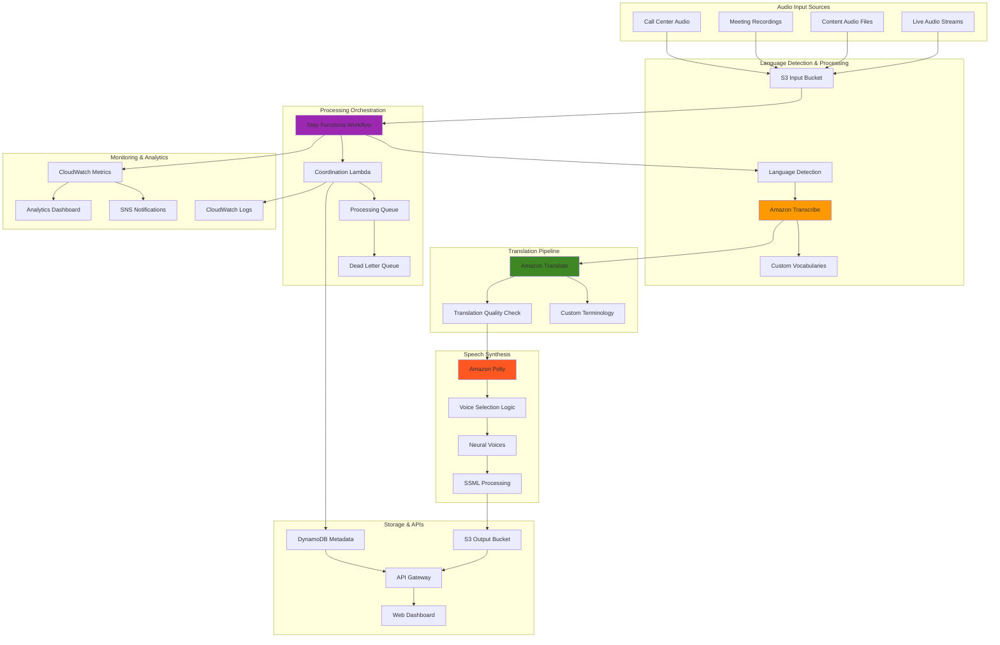

# Processing Multilingual Voice Content with Transcribe and Polly

## Problem

Global organizations require sophisticated voice processing capabilities that handle audio content in dozens of languages, convert speech to text with high accuracy, translate content between languages, and generate natural-sounding speech output. Traditional voice processing solutions struggle with language detection, accent variations, and maintaining context across translation and speech synthesis, creating barriers for call centers, e-learning platforms, and content localization teams.

## Solution

Implement a comprehensive multi-language voice processing platform using Amazon Transcribe for speech recognition, Amazon Translate for language translation, and Amazon Polly for speech synthesis. This solution creates intelligent processing pipelines that automatically detect spoken languages, transcribe audio with custom vocabularies, translate content while preserving context, and generate localized audio output with appropriate voice characteristics.

## Architecture Diagram



## Prerequisites

1. AWS account with Transcribe, Polly, Translate, and Step Functions permissions
2. AWS CLI v2 installed and configured (or AWS CloudShell)
3. Sample audio files in multiple languages for testing
4. Understanding of audio formats and speech processing concepts
5. Estimated cost: $150-300 for processing multiple hours of multi-language audio

> **Warning**: Transcribe, Translate, and Polly services incur per-minute or per-character charges. Monitor usage carefully during testing and consider using smaller audio samples initially.

## Preparation

```bash
# Set environment variables
export AWS_REGION=$(aws configure get region)
export AWS_ACCOUNT_ID=$(aws sts get-caller-identity \
    --query Account --output text)

# Generate unique identifiers
RANDOM_SUFFIX=$(aws secretsmanager get-random-password \
    --exclude-punctuation --exclude-uppercase \
    --password-length 6 --require-each-included-type \
    --output text --query RandomPassword)

export PROJECT_NAME="voice-pipeline-${RANDOM_SUFFIX}"
export INPUT_BUCKET="voice-input-${RANDOM_SUFFIX}"
export OUTPUT_BUCKET="voice-output-${RANDOM_SUFFIX}"
export ROLE_NAME="VoiceProcessingRole-${RANDOM_SUFFIX}"

# Create S3 buckets for input and output
aws s3 mb s3://${INPUT_BUCKET} --region ${AWS_REGION}
aws s3 mb s3://${OUTPUT_BUCKET} --region ${AWS_REGION}

# Create IAM role for voice processing services
cat > trust-policy.json << EOF
{
  "Version": "2012-10-17",
  "Statement": [
    {
      "Effect": "Allow",
      "Principal": {
        "Service": [
          "lambda.amazonaws.com",
          "states.amazonaws.com",
          "transcribe.amazonaws.com"
        ]
      },
      "Action": "sts:AssumeRole"
    }
  ]
}
EOF

aws iam create-role \
    --role-name ${ROLE_NAME} \
    --assume-role-policy-document file://trust-policy.json

# Attach required policies
aws iam attach-role-policy \
    --role-name ${ROLE_NAME} \
    --policy-arn arn:aws:iam::aws:policy/AmazonTranscribeFullAccess

aws iam attach-role-policy \
    --role-name ${ROLE_NAME} \
    --policy-arn arn:aws:iam::aws:policy/AmazonPollyFullAccess

aws iam attach-role-policy \
    --role-name ${ROLE_NAME} \
    --policy-arn arn:aws:iam::aws:policy/TranslateFullAccess

aws iam attach-role-policy \
    --role-name ${ROLE_NAME} \
    --policy-arn arn:aws:iam::aws:policy/AmazonS3FullAccess

aws iam attach-role-policy \
    --role-name ${ROLE_NAME} \
    --policy-arn arn:aws:iam::aws:policy/service-role/AWSLambdaBasicExecutionRole

aws iam attach-role-policy \
    --role-name ${ROLE_NAME} \
    --policy-arn arn:aws:iam::aws:policy/AWSStepFunctionsFullAccess

export ROLE_ARN="arn:aws:iam::${AWS_ACCOUNT_ID}:role/${ROLE_NAME}"

echo "✅ Created foundational resources"
```

## Steps

1. **Create DynamoDB Table for Processing Metadata**:

   Amazon DynamoDB provides a fully managed NoSQL database service that offers fast and predictable performance with seamless scalability. For our voice processing pipeline, we need a central metadata store to track job progress, status updates, and processing results across all pipeline stages. This table serves as the coordination hub that enables our Step Functions workflow to maintain state and provide real-time visibility into processing status.

   ```bash
   # Create table for job tracking
   aws dynamodb create-table \
       --table-name "${PROJECT_NAME}-jobs" \
       --attribute-definitions \
           AttributeName=JobId,AttributeType=S \
           AttributeName=Status,AttributeType=S \
       --key-schema \
           AttributeName=JobId,KeyType=HASH \
       --global-secondary-indexes \
           IndexName=StatusIndex,KeySchema=[{AttributeName=Status,KeyType=HASH}],Projection={ProjectionType=ALL},ProvisionedThroughput={ReadCapacityUnits=5,WriteCapacityUnits=5} \
       --provisioned-throughput \
           ReadCapacityUnits=5,WriteCapacityUnits=5
   
   # Wait for table to be active
   aws dynamodb wait table-exists \
       --table-name "${PROJECT_NAME}-jobs"
   
   echo "✅ Created DynamoDB table for job tracking"
   ```

   The table is now active and ready to track voice processing jobs. The Global Secondary Index on Status enables efficient querying of jobs by their current processing state, which is essential for monitoring and operational dashboards. This foundational data store supports our pipeline's reliability and observability requirements.

2. **Create Lambda Function for Language Detection**:

   Amazon Transcribe's language identification capability can automatically detect the spoken language in audio files, eliminating the need for manual language specification. This is crucial for global voice processing pipelines that handle multilingual content from diverse sources. Our Lambda function leverages Transcribe's IdentifyLanguage feature to automatically determine the source language, which then informs subsequent transcription and translation processes.

   ```bash
   # Create language detection Lambda function
   cat > language_detector.py << 'EOF'
   import json
   import boto3
   import uuid
   from datetime import datetime
   
   transcribe = boto3.client('transcribe')
   dynamodb = boto3.resource('dynamodb')
   s3 = boto3.client('s3')
   
   def lambda_handler(event, context):
       bucket = event['bucket']
       key = event['key']
       job_id = event.get('job_id', str(uuid.uuid4()))
       
       table = dynamodb.Table(event['jobs_table'])
       
       try:
           # Update job status
           table.put_item(
               Item={
                   'JobId': job_id,
                   'Status': 'LANGUAGE_DETECTION',
                   'InputFile': f"s3://{bucket}/{key}",
                   'Timestamp': int(datetime.now().timestamp()),
                   'Stage': 'language_detection'
               }
           )
           
           # Start language identification job
           job_name = f"lang-detect-{job_id}"
           
           transcribe.start_transcription_job(
               TranscriptionJobName=job_name,
               Media={'MediaFileUri': f"s3://{bucket}/{key}"},
               IdentifyLanguage=True,
               OutputBucketName=bucket,
               OutputKey=f"language-detection/{job_id}/"
           )
           
           return {
               'statusCode': 200,
               'job_id': job_id,
               'transcribe_job_name': job_name,
               'bucket': bucket,
               'key': key,
               'stage': 'language_detection'
           }
           
       except Exception as e:
           table.put_item(
               Item={
                   'JobId': job_id,
                   'Status': 'FAILED',
                   'Error': str(e),
                   'Timestamp': int(datetime.now().timestamp()),
                   'Stage': 'language_detection'
               }
           )
           
           return {
               'statusCode': 500,
               'error': str(e),
               'job_id': job_id
           }
   EOF
   
   # Create deployment package
   zip language_detector.zip language_detector.py
   
   # Create Lambda function
   aws lambda create-function \
       --function-name "${PROJECT_NAME}-language-detector" \
       --runtime python3.12 \
       --role ${ROLE_ARN} \
       --handler language_detector.lambda_handler \
       --zip-file fileb://language_detector.zip \
       --timeout 60 \
       --environment Variables="{JOBS_TABLE=${PROJECT_NAME}-jobs}"
   
   echo "✅ Created language detection Lambda function"
   ```

   The language detection function is now deployed and ready to process audio files. This serverless component automatically scales based on demand and integrates seamlessly with our Step Functions workflow. The function updates job status in DynamoDB and initiates Transcribe jobs with language identification enabled, establishing the foundation for automated multilingual processing.

3. **Create Lambda Function for Transcription Processing**:

   Amazon Transcribe converts speech to text with high accuracy across multiple languages and dialects using advanced machine learning models. This step creates a specialized Lambda function that configures transcription jobs based on detected languages, applies custom vocabularies for domain-specific terminology, and enables advanced features like speaker diarization for English content. The function demonstrates how to optimize transcription quality through language-specific configuration and custom vocabulary integration.

   ```bash
   # Create transcription Lambda function
   cat > transcription_processor.py << 'EOF'
   import json
   import boto3
   import uuid
   from datetime import datetime
   
   transcribe = boto3.client('transcribe')
   dynamodb = boto3.resource('dynamodb')
   s3 = boto3.client('s3')
   
   def lambda_handler(event, context):
       job_id = event['job_id']
       bucket = event['bucket']
       key = event['key']
       detected_language = event.get('detected_language', 'en-US')
       
       table = dynamodb.Table(event['jobs_table'])
       
       try:
           # Update job status
           table.update_item(
               Key={'JobId': job_id},
               UpdateExpression='SET #status = :status, #stage = :stage, DetectedLanguage = :lang',
               ExpressionAttributeNames={'#status': 'Status', '#stage': 'Stage'},
               ExpressionAttributeValues={
                   ':status': 'TRANSCRIBING',
                   ':stage': 'transcription',
                   ':lang': detected_language
               }
           )
           
           # Configure transcription based on language
           transcribe_config = {
               'TranscriptionJobName': f"transcribe-{job_id}",
               'Media': {'MediaFileUri': f"s3://{bucket}/{key}"},
               'OutputBucketName': bucket,
               'OutputKey': f"transcriptions/{job_id}/",
               'LanguageCode': detected_language
           }
           
           # Add language-specific settings
           if detected_language.startswith('en'):
               transcribe_config['Settings'] = {
                   'ShowSpeakerLabels': True,
                   'MaxSpeakerLabels': 10,
                   'ShowAlternatives': True,
                   'MaxAlternatives': 3
               }
           
           # Add custom vocabulary if available
           vocab_name = f"custom-vocab-{detected_language.split('-')[0]}"
           try:
               transcribe.get_vocabulary(VocabularyName=vocab_name)
               transcribe_config['Settings'] = transcribe_config.get('Settings', {})
               transcribe_config['Settings']['VocabularyName'] = vocab_name
           except transcribe.exceptions.BadRequestException:
               # Custom vocabulary doesn't exist, continue without it
               pass
           
           # Start transcription job
           transcribe.start_transcription_job(**transcribe_config)
           
           return {
               'statusCode': 200,
               'job_id': job_id,
               'transcribe_job_name': f"transcribe-{job_id}",
               'detected_language': detected_language,
               'bucket': bucket,
               'stage': 'transcription'
           }
           
       except Exception as e:
           table.update_item(
               Key={'JobId': job_id},
               UpdateExpression='SET #status = :status, #error = :error',
               ExpressionAttributeNames={'#status': 'Status'},
               ExpressionAttributeValues={
                   ':status': 'FAILED',
                   ':error': str(e)
               }
           )
           
           return {
               'statusCode': 500,
               'error': str(e),
               'job_id': job_id
           }
   EOF
   
   # Create deployment package
   zip transcription_processor.zip transcription_processor.py
   
   # Create Lambda function
   aws lambda create-function \
       --function-name "${PROJECT_NAME}-transcription-processor" \
       --runtime python3.12 \
       --role ${ROLE_ARN} \
       --handler transcription_processor.lambda_handler \
       --zip-file fileb://transcription_processor.zip \
       --timeout 60 \
       --environment Variables="{JOBS_TABLE=${PROJECT_NAME}-jobs}"
   
   echo "✅ Created transcription processing Lambda function"
   ```

   The transcription processor is now configured to handle multiple languages with optimized settings for each. This intelligent function automatically applies appropriate transcription configurations based on detected languages and attempts to use custom vocabularies when available, ensuring high accuracy for domain-specific content while gracefully handling scenarios where custom resources don't exist.

4. **Create Lambda Function for Translation**:

   Amazon Translate provides neural machine translation that delivers fast, high-quality, and affordable language translation using advanced deep learning models. This Lambda function processes transcribed text and translates it into multiple target languages simultaneously, supporting custom terminology for consistent translation of technical terms and brand names. The function handles language code mapping between Transcribe and Translate services while managing translation failures gracefully.

   ```bash
   # Create translation Lambda function
   cat > translation_processor.py << 'EOF'
   import json
   import boto3
   from datetime import datetime
   
   translate = boto3.client('translate')
   dynamodb = boto3.resource('dynamodb')
   s3 = boto3.client('s3')
   
   def lambda_handler(event, context):
       job_id = event['job_id']
       bucket = event['bucket']
       source_language = event['source_language']
       target_languages = event.get('target_languages', ['es', 'fr', 'de', 'pt'])
       transcription_uri = event['transcription_uri']
       
       table = dynamodb.Table(event['jobs_table'])
       
       try:
           # Update job status
           table.update_item(
               Key={'JobId': job_id},
               UpdateExpression='SET #status = :status, #stage = :stage',
               ExpressionAttributeNames={'#status': 'Status', '#stage': 'Stage'},
               ExpressionAttributeValues={
                   ':status': 'TRANSLATING',
                   ':stage': 'translation'
               }
           )
           
           # Parse S3 URI to extract bucket and key
           if transcription_uri.startswith('s3://'):
               # Remove s3:// prefix and split on first /
               s3_path = transcription_uri[5:]
               bucket_name, key_path = s3_path.split('/', 1)
           else:
               # If it's just a key, use the current bucket
               bucket_name = bucket
               key_path = transcription_uri
           
           # Download transcription results
           transcription_obj = s3.get_object(Bucket=bucket_name, Key=key_path)
           transcription_data = json.loads(transcription_obj['Body'].read().decode('utf-8'))
           
           # Extract transcript text
           transcript = transcription_data['results']['transcripts'][0]['transcript']
           
           # Map language codes
           source_lang_code = map_transcribe_to_translate_language(source_language)
           
           translations = {}
           
           # Translate to each target language
           for target_lang in target_languages:
               if target_lang != source_lang_code:
                   try:
                       # Check if custom terminology exists
                       terminology_name = f"custom-terms-{source_lang_code}-{target_lang}"
                       
                       translate_params = {
                           'Text': transcript,
                           'SourceLanguageCode': source_lang_code,
                           'TargetLanguageCode': target_lang
                       }
                       
                       try:
                           translate.get_terminology(Name=terminology_name)
                           translate_params['TerminologyNames'] = [terminology_name]
                       except translate.exceptions.ResourceNotFoundException:
                           # Custom terminology doesn't exist, continue without it
                           pass
                       
                       result = translate.translate_text(**translate_params)
                       
                       translations[target_lang] = {
                           'translated_text': result['TranslatedText'],
                           'source_language': source_lang_code,
                           'target_language': target_lang,
                           'applied_terminologies': result.get('AppliedTerminologies', [])
                       }
                       
                   except Exception as e:
                       print(f"Translation failed for {target_lang}: {str(e)}")
                       translations[target_lang] = {
                           'error': str(e),
                           'source_language': source_lang_code,
                           'target_language': target_lang
                       }
           
           # Store translation results
           translations_key = f"translations/{job_id}/translations.json"
           s3.put_object(
               Bucket=bucket,
               Key=translations_key,
               Body=json.dumps({
                   'original_text': transcript,
                   'source_language': source_lang_code,
                   'translations': translations,
                   'timestamp': datetime.now().isoformat()
               }),
               ContentType='application/json'
           )
           
           return {
               'statusCode': 200,
               'job_id': job_id,
               'source_language': source_lang_code,
               'translations': translations,
               'translations_uri': translations_key,
               'stage': 'translation'
           }
           
       except Exception as e:
           table.update_item(
               Key={'JobId': job_id},
               UpdateExpression='SET #status = :status, #error = :error',
               ExpressionAttributeNames={'#status': 'Status'},
               ExpressionAttributeValues={
                   ':status': 'FAILED',
                   ':error': str(e)
               }
           )
           
           return {
               'statusCode': 500,
               'error': str(e),
               'job_id': job_id
           }
   
   def map_transcribe_to_translate_language(transcribe_lang):
       # Map Transcribe language codes to Translate language codes
       mapping = {
           'en-US': 'en', 'en-GB': 'en', 'en-AU': 'en',
           'es-US': 'es', 'es-ES': 'es',
           'fr-FR': 'fr', 'fr-CA': 'fr',
           'de-DE': 'de', 'it-IT': 'it',
           'pt-BR': 'pt', 'pt-PT': 'pt',
           'ja-JP': 'ja', 'ko-KR': 'ko',
           'zh-CN': 'zh', 'zh-TW': 'zh-TW',
           'ar-AE': 'ar', 'ar-SA': 'ar',
           'hi-IN': 'hi', 'ru-RU': 'ru',
           'nl-NL': 'nl', 'sv-SE': 'sv'
       }
       return mapping.get(transcribe_lang, transcribe_lang.split('-')[0])
   EOF
   
   # Create deployment package
   zip translation_processor.zip translation_processor.py
   
   # Create Lambda function
   aws lambda create-function \
       --function-name "${PROJECT_NAME}-translation-processor" \
       --runtime python3.12 \
       --role ${ROLE_ARN} \
       --handler translation_processor.lambda_handler \
       --zip-file fileb://translation_processor.zip \
       --timeout 300 \
       --environment Variables="{JOBS_TABLE=${PROJECT_NAME}-jobs}"
   
   echo "✅ Created translation processing Lambda function"
   ```

   The translation processor is now ready to convert transcribed text into multiple target languages. This function stores translation results in S3 for downstream processing and demonstrates best practices for handling multiple language pairs, custom terminology integration, and error handling. The modular design allows easy addition of new target languages and translation quality enhancements.

5. **Create Lambda Function for Speech Synthesis**:

   Amazon Polly turns text into lifelike speech using advanced deep learning technologies to synthesize natural-sounding human speech. This function selects appropriate voices for each target language, leverages neural voices when available for improved quality, and applies SSML (Speech Synthesis Markup Language) enhancements for better speech characteristics. The function demonstrates voice selection strategies and audio optimization techniques for multilingual content.

   ```bash
   # Create speech synthesis Lambda function
   cat > speech_synthesizer.py << 'EOF'
   import json
   import boto3
   from datetime import datetime
   import re
   
   polly = boto3.client('polly')
   dynamodb = boto3.resource('dynamodb')
   s3 = boto3.client('s3')
   
   def lambda_handler(event, context):
       job_id = event['job_id']
       bucket = event['bucket']
       translations = event['translations']
       
       table = dynamodb.Table(event['jobs_table'])
       
       try:
           # Update job status
           table.update_item(
               Key={'JobId': job_id},
               UpdateExpression='SET #status = :status, #stage = :stage',
               ExpressionAttributeNames={'#status': 'Status', '#stage': 'Stage'},
               ExpressionAttributeValues={
                   ':status': 'SYNTHESIZING',
                   ':stage': 'speech_synthesis'
               }
           )
           
           audio_outputs = {}
           
           # Process each translation
           for target_lang, translation_data in translations.items():
               if 'translated_text' in translation_data:
                   try:
                       # Select appropriate voice for language
                       voice_id = select_voice_for_language(target_lang)
                       
                       # Prepare text for synthesis (add SSML if needed)
                       text_to_synthesize = prepare_text_for_synthesis(
                           translation_data['translated_text']
                       )
                       
                       # Synthesize speech
                       synthesis_response = polly.synthesize_speech(
                           Text=text_to_synthesize,
                           VoiceId=voice_id,
                           OutputFormat='mp3',
                           Engine='neural' if supports_neural_voice(voice_id) else 'standard',
                           TextType='ssml' if text_to_synthesize.startswith('<speak>') else 'text'
                       )
                       
                       # Save audio to S3
                       audio_key = f"audio-output/{job_id}/{target_lang}.mp3"
                       s3.put_object(
                           Bucket=bucket,
                           Key=audio_key,
                           Body=synthesis_response['AudioStream'].read(),
                           ContentType='audio/mpeg'
                       )
                       
                       audio_outputs[target_lang] = {
                           'audio_uri': f"s3://{bucket}/{audio_key}",
                           'voice_id': voice_id,
                           'text_length': len(translation_data['translated_text']),
                           'audio_format': 'mp3'
                       }
                       
                   except Exception as e:
                       print(f"Speech synthesis failed for {target_lang}: {str(e)}")
                       audio_outputs[target_lang] = {
                           'error': str(e)
                       }
           
           # Update job with final results
           table.update_item(
               Key={'JobId': job_id},
               UpdateExpression='SET #status = :status, #stage = :stage, AudioOutputs = :outputs',
               ExpressionAttributeNames={'#status': 'Status', '#stage': 'Stage'},
               ExpressionAttributeValues={
                   ':status': 'COMPLETED',
                   ':stage': 'completed',
                   ':outputs': audio_outputs
               }
           )
           
           return {
               'statusCode': 200,
               'job_id': job_id,
               'audio_outputs': audio_outputs,
               'stage': 'completed'
           }
           
       except Exception as e:
           table.update_item(
               Key={'JobId': job_id},
               UpdateExpression='SET #status = :status, #error = :error',
               ExpressionAttributeNames={'#status': 'Status'},
               ExpressionAttributeValues={
                   ':status': 'FAILED',
                   ':error': str(e)
               }
           )
           
           return {
               'statusCode': 500,
               'error': str(e),
               'job_id': job_id
           }
   
   def select_voice_for_language(language_code):
       # Map language codes to appropriate Polly voices (updated for 2025)
       voice_mapping = {
           'en': 'Joanna',  # English - Neural voice
           'es': 'Lupe',    # Spanish - Neural voice
           'fr': 'Lea',     # French - Neural voice  
           'de': 'Vicki',   # German - Neural voice
           'it': 'Bianca',  # Italian - Neural voice
           'pt': 'Camila',  # Portuguese - Neural voice
           'ja': 'Takumi',  # Japanese - Neural voice
           'ko': 'Seoyeon', # Korean - Standard voice
           'zh': 'Zhiyu',   # Chinese - Neural voice
           'ar': 'Zeina',   # Arabic - Standard voice
           'hi': 'Aditi',   # Hindi - Standard voice
           'ru': 'Tatyana', # Russian - Standard voice
           'nl': 'Laura',   # Dutch - Neural voice
           'sv': 'Astrid'   # Swedish - Standard voice
       }
       return voice_mapping.get(language_code, 'Joanna')
   
   def supports_neural_voice(voice_id):
       # Updated neural voices available in Polly for 2025
       neural_voices = [
           'Joanna', 'Matthew', 'Ivy', 'Justin', 'Kendra', 'Kimberly', 'Salli',
           'Joey', 'Lupe', 'Lucia', 'Lea', 'Vicki', 'Bianca', 'Camila',
           'Takumi', 'Zhiyu', 'Ruth', 'Stephen', 'Laura', 'Brian', 'Arthur',
           'Emma', 'Amy', 'Aria', 'Ayanda', 'Olivia'
       ]
       return voice_id in neural_voices
   
   def prepare_text_for_synthesis(text):
       # Add basic SSML for better speech quality
       if len(text) > 1000:
           # For longer texts, add pauses at sentence boundaries
           text = re.sub(r'\.(\s+)', r'.<break time="500ms"/>\1', text)
           text = re.sub(r'!(\s+)', r'!<break time="500ms"/>\1', text)
           text = re.sub(r'\?(\s+)', r'?<break time="500ms"/>\1', text)
           text = f'<speak>{text}</speak>'
       
       return text
   EOF
   
   # Create deployment package
   zip speech_synthesizer.zip speech_synthesizer.py
   
   # Create Lambda function
   aws lambda create-function \
       --function-name "${PROJECT_NAME}-speech-synthesizer" \
       --runtime python3.12 \
       --role ${ROLE_ARN} \
       --handler speech_synthesizer.lambda_handler \
       --zip-file fileb://speech_synthesizer.zip \
       --timeout 300 \
       --environment Variables="{JOBS_TABLE=${PROJECT_NAME}-jobs}"
   
   echo "✅ Created speech synthesis Lambda function"
   ```

   The speech synthesis function is now configured to generate high-quality audio in multiple languages using the latest neural voices. This component completes our voice processing pipeline by converting translated text back to speech using the most appropriate voices and engines for each language. The function stores generated audio files in S3 and updates job metadata with final processing results.

6. **Create Job Status Checker Lambda Function**:

   Asynchronous processing requires robust status monitoring to track job progress and handle completion events. This Lambda function polls Amazon Transcribe job status and extracts results when processing completes. It's designed to work with Step Functions' polling pattern, enabling our workflow to wait for long-running transcription jobs while maintaining efficient resource utilization and proper error handling.

   ```bash
   # Create status checker Lambda function
   cat > job_status_checker.py << 'EOF'
   import json
   import boto3
   
   transcribe = boto3.client('transcribe')
   s3 = boto3.client('s3')
   
   def lambda_handler(event, context):
       job_name = event['transcribe_job_name']
       job_type = event.get('job_type', 'transcription')
       
       try:
           response = transcribe.get_transcription_job(
               TranscriptionJobName=job_name
           )
           
           job_status = response['TranscriptionJob']['TranscriptionJobStatus']
           
           result = {
               'statusCode': 200,
               'job_name': job_name,
               'job_status': job_status,
               'is_complete': job_status in ['COMPLETED', 'FAILED']
           }
           
           if job_status == 'COMPLETED':
               if job_type == 'language_detection':
                   # Extract detected language
                   language_code = response['TranscriptionJob'].get('LanguageCode')
                   identified_languages = response['TranscriptionJob'].get('IdentifiedLanguageScore')
                   
                   result['detected_language'] = language_code
                   result['language_confidence'] = identified_languages
               else:
                   # Extract transcription results location
                   transcript_uri = response['TranscriptionJob']['Transcript']['TranscriptFileUri']
                   result['transcript_uri'] = transcript_uri
                   
                   # Extract detected language for transcription jobs
                   language_code = response['TranscriptionJob'].get('LanguageCode')
                   result['source_language'] = language_code
           
           elif job_status == 'FAILED':
               result['failure_reason'] = response['TranscriptionJob'].get('FailureReason', 'Unknown error')
           
           return result
           
       except Exception as e:
           return {
               'statusCode': 500,
               'error': str(e),
               'job_name': job_name
           }
   EOF
   
   # Create deployment package
   zip job_status_checker.zip job_status_checker.py
   
   # Create Lambda function
   aws lambda create-function \
       --function-name "${PROJECT_NAME}-job-status-checker" \
       --runtime python3.12 \
       --role ${ROLE_ARN} \
       --handler job_status_checker.lambda_handler \
       --zip-file fileb://job_status_checker.zip \
       --timeout 30
   
   echo "✅ Created job status checker Lambda function"
   ```

   The status checker function provides reliable monitoring for asynchronous transcription jobs. This component enables our Step Functions workflow to efficiently wait for transcription completion while extracting important metadata like detected languages and transcript locations. The function's design supports both language detection and transcription job monitoring with appropriate result extraction for each job type.

7. **Create Step Functions Workflow**:

   AWS Step Functions provides serverless orchestration for distributed applications and microservices using visual workflows. Our state machine coordinates the entire voice processing pipeline, managing the sequence of language detection, transcription, translation, and speech synthesis while handling wait states for asynchronous operations. This approach ensures reliable processing with built-in error handling and retry logic following AWS Well-Architected reliability principles.

   ```bash
   # Create Step Functions workflow definition
   cat > voice_processing_workflow.json << EOF
   {
     "Comment": "Multi-language voice processing pipeline",
     "StartAt": "InitializeJob",
     "States": {
       "InitializeJob": {
         "Type": "Pass",
         "Parameters": {
           "bucket.$": "$.bucket",
           "key.$": "$.key",
           "job_id.$": "$.job_id",
           "jobs_table": "${PROJECT_NAME}-jobs",
           "target_languages.$": "$.target_languages"
         },
         "Next": "DetectLanguage"
       },
       "DetectLanguage": {
         "Type": "Task",
         "Resource": "arn:aws:states:::lambda:invoke",
         "Parameters": {
           "FunctionName": "${PROJECT_NAME}-language-detector",
           "Payload.$": "$"
         },
         "ResultPath": "$.language_detection_result",
         "Next": "WaitForLanguageDetection"
       },
       "WaitForLanguageDetection": {
         "Type": "Wait",
         "Seconds": 30,
         "Next": "CheckLanguageDetectionStatus"
       },
       "CheckLanguageDetectionStatus": {
         "Type": "Task",
         "Resource": "arn:aws:states:::lambda:invoke",
         "Parameters": {
           "FunctionName": "${PROJECT_NAME}-job-status-checker",
           "Payload": {
             "transcribe_job_name.$": "$.language_detection_result.Payload.transcribe_job_name",
             "job_type": "language_detection"
           }
         },
         "ResultPath": "$.language_status",
         "Next": "IsLanguageDetectionComplete"
       },
       "IsLanguageDetectionComplete": {
         "Type": "Choice",
         "Choices": [
           {
             "Variable": "$.language_status.Payload.is_complete",
             "BooleanEquals": true,
             "Next": "ProcessTranscription"
           }
         ],
         "Default": "WaitForLanguageDetection"
       },
       "ProcessTranscription": {
         "Type": "Task",
         "Resource": "arn:aws:states:::lambda:invoke",
         "Parameters": {
           "FunctionName": "${PROJECT_NAME}-transcription-processor",
           "Payload": {
             "job_id.$": "$.job_id",
             "bucket.$": "$.bucket",
             "key.$": "$.key",
             "detected_language.$": "$.language_status.Payload.detected_language",
             "jobs_table": "${PROJECT_NAME}-jobs"
           }
         },
         "ResultPath": "$.transcription_result",
         "Next": "WaitForTranscription"
       },
       "WaitForTranscription": {
         "Type": "Wait",
         "Seconds": 60,
         "Next": "CheckTranscriptionStatus"
       },
       "CheckTranscriptionStatus": {
         "Type": "Task",
         "Resource": "arn:aws:states:::lambda:invoke",
         "Parameters": {
           "FunctionName": "${PROJECT_NAME}-job-status-checker",
           "Payload": {
             "transcribe_job_name.$": "$.transcription_result.Payload.transcribe_job_name",
             "job_type": "transcription"
           }
         },
         "ResultPath": "$.transcription_status",
         "Next": "IsTranscriptionComplete"
       },
       "IsTranscriptionComplete": {
         "Type": "Choice",
         "Choices": [
           {
             "Variable": "$.transcription_status.Payload.is_complete",
             "BooleanEquals": true,
             "Next": "ProcessTranslation"
           }
         ],
         "Default": "WaitForTranscription"
       },
       "ProcessTranslation": {
         "Type": "Task",
         "Resource": "arn:aws:states:::lambda:invoke",
         "Parameters": {
           "FunctionName": "${PROJECT_NAME}-translation-processor",
           "Payload": {
             "job_id.$": "$.job_id",
             "bucket.$": "$.bucket",
             "source_language.$": "$.transcription_status.Payload.source_language",
             "target_languages.$": "$.target_languages",
             "transcription_uri.$": "$.transcription_status.Payload.transcript_uri",
             "jobs_table": "${PROJECT_NAME}-jobs"
           }
         },
         "ResultPath": "$.translation_result",
         "Next": "SynthesizeSpeech"
       },
       "SynthesizeSpeech": {
         "Type": "Task",
         "Resource": "arn:aws:states:::lambda:invoke",
         "Parameters": {
           "FunctionName": "${PROJECT_NAME}-speech-synthesizer",
           "Payload": {
             "job_id.$": "$.job_id",
             "bucket.$": "$.bucket",
             "translations.$": "$.translation_result.Payload.translations",
             "jobs_table": "${PROJECT_NAME}-jobs"
           }
         },
         "ResultPath": "$.synthesis_result",
         "End": true
       }
     }
   }
   EOF
   
   # Create Step Functions state machine
   STATE_MACHINE_ARN=$(aws stepfunctions create-state-machine \
       --name "${PROJECT_NAME}-voice-processing" \
       --definition file://voice_processing_workflow.json \
       --role-arn ${ROLE_ARN} \
       --query 'stateMachineArn' --output text)
   
   echo "✅ Created Step Functions workflow: ${STATE_MACHINE_ARN}"
   ```

   The Step Functions state machine is now ready to orchestrate our multi-language voice processing pipeline. This workflow automates the complex coordination between multiple AWS services, handles asynchronous job polling, and provides visual monitoring of processing progress. The state machine ensures reliable execution with proper error handling and can process multiple audio files concurrently.

8. **Create Sample Audio File and Test the Pipeline**:

   Testing our voice processing pipeline requires sample audio content that demonstrates the complete workflow from language detection through speech synthesis. We'll use Amazon Polly to generate a test audio file with clear English speech, then process it through our pipeline to validate language detection, transcription accuracy, translation quality, and speech synthesis results across multiple target languages.

   ```bash
   # Create a simple text-to-speech file for testing
   aws polly synthesize-speech \
       --text "Hello, this is a test of our multi-language voice processing pipeline. We will transcribe this English audio, translate it to multiple languages, and generate speech in each target language." \
       --voice-id Joanna \
       --output-format mp3 \
       --engine neural \
       test-audio.mp3
   
   # Upload test audio to S3
   aws s3 cp test-audio.mp3 s3://${INPUT_BUCKET}/test-audio.mp3
   
   # Start the processing pipeline
   JOB_ID=$(python3 -c "import uuid; print(str(uuid.uuid4()))")
   EXECUTION_ARN=$(aws stepfunctions start-execution \
       --state-machine-arn ${STATE_MACHINE_ARN} \
       --name "test-execution-$(date +%Y%m%d-%H%M%S)" \
       --input "{
         \"bucket\": \"${INPUT_BUCKET}\",
         \"key\": \"test-audio.mp3\",
         \"job_id\": \"${JOB_ID}\",
         \"target_languages\": [\"es\", \"fr\", \"de\"]
       }" \
       --query 'executionArn' --output text)
   
   echo "✅ Started voice processing pipeline: ${EXECUTION_ARN}"
   echo "Job ID: ${JOB_ID}"
   ```

   The voice processing pipeline is now executing with our test audio file using neural voice generation. The Step Functions workflow will automatically progress through language detection, transcription, translation to Spanish, French, and German, and finally generate speech synthesis in each target language. You can monitor progress through the AWS Console or by querying the DynamoDB jobs table.

## Validation & Testing

1. **Monitor Pipeline Execution**:

   ```bash
   # Check Step Functions execution status
   aws stepfunctions describe-execution \
       --execution-arn ${EXECUTION_ARN}
   
   # Check job status in DynamoDB
   aws dynamodb get-item \
       --table-name "${PROJECT_NAME}-jobs" \
       --key "{\"JobId\": {\"S\": \"${JOB_ID}\"}}"
   ```

   Expected output: Execution progressing through language detection, transcription, translation, and speech synthesis stages.

2. **Verify Output Files**:

   ```bash
   # List generated audio files
   aws s3 ls s3://${INPUT_BUCKET}/audio-output/${JOB_ID}/
   
   # Download and check translation results
   aws s3 cp s3://${INPUT_BUCKET}/translations/${JOB_ID}/translations.json .
   cat translations.json
   ```

3. **Test Direct API Calls** (Optional):

   ```bash
   # Test individual components
   # Language detection
   aws lambda invoke \
       --function-name "${PROJECT_NAME}-language-detector" \
       --payload "{\"bucket\": \"${INPUT_BUCKET}\", \"key\": \"test-audio.mp3\", \"jobs_table\": \"${PROJECT_NAME}-jobs\"}" \
       response.json
   
   cat response.json
   ```

## Cleanup

1. **Delete Step Functions and Lambda Functions**:

   ```bash
   # Delete Step Functions state machine
   aws stepfunctions delete-state-machine \
       --state-machine-arn ${STATE_MACHINE_ARN}
   
   # Delete Lambda functions
   aws lambda delete-function \
       --function-name "${PROJECT_NAME}-language-detector"
   
   aws lambda delete-function \
       --function-name "${PROJECT_NAME}-transcription-processor"
   
   aws lambda delete-function \
       --function-name "${PROJECT_NAME}-translation-processor"
   
   aws lambda delete-function \
       --function-name "${PROJECT_NAME}-speech-synthesizer"
   
   aws lambda delete-function \
       --function-name "${PROJECT_NAME}-job-status-checker"
   
   echo "✅ Deleted workflow and Lambda functions"
   ```

2. **Delete Storage Resources**:

   ```bash
   # Empty and delete S3 buckets
   aws s3 rm s3://${INPUT_BUCKET} --recursive
   aws s3 rb s3://${INPUT_BUCKET}
   
   aws s3 rm s3://${OUTPUT_BUCKET} --recursive
   aws s3 rb s3://${OUTPUT_BUCKET}
   
   # Delete DynamoDB table
   aws dynamodb delete-table \
       --table-name "${PROJECT_NAME}-jobs"
   
   echo "✅ Deleted storage resources"
   ```

3. **Clean up IAM and Local Resources**:

   ```bash
   # Detach and delete IAM role
   aws iam detach-role-policy \
       --role-name ${ROLE_NAME} \
       --policy-arn arn:aws:iam::aws:policy/AmazonTranscribeFullAccess
   
   aws iam detach-role-policy \
       --role-name ${ROLE_NAME} \
       --policy-arn arn:aws:iam::aws:policy/AmazonPollyFullAccess
   
   aws iam detach-role-policy \
       --role-name ${ROLE_NAME} \
       --policy-arn arn:aws:iam::aws:policy/TranslateFullAccess
   
   aws iam detach-role-policy \
       --role-name ${ROLE_NAME} \
       --policy-arn arn:aws:iam::aws:policy/AmazonS3FullAccess
   
   aws iam detach-role-policy \
       --role-name ${ROLE_NAME} \
       --policy-arn arn:aws:iam::aws:policy/service-role/AWSLambdaBasicExecutionRole
   
   aws iam detach-role-policy \
       --role-name ${ROLE_NAME} \
       --policy-arn arn:aws:iam::aws:policy/AWSStepFunctionsFullAccess
   
   aws iam delete-role --role-name ${ROLE_NAME}
   
   # Clean up local files
   rm -f trust-policy.json voice_processing_workflow.json \
         language_detector.py language_detector.zip \
         transcription_processor.py transcription_processor.zip \
         translation_processor.py translation_processor.zip \
         speech_synthesizer.py speech_synthesizer.zip \
         job_status_checker.py job_status_checker.zip \
         test-audio.mp3 response.json translations.json
   
   echo "✅ Cleaned up all resources"
   ```

## Discussion

This comprehensive multi-language voice processing solution demonstrates how AWS AI services can be orchestrated to create sophisticated voice localization pipelines that follow AWS Well-Architected Framework principles. The integration of Amazon Transcribe, Amazon Translate, and Amazon Polly provides end-to-end voice processing capabilities that maintain high quality across language barriers while automating complex workflows that would traditionally require significant manual effort and infrastructure management.

The Step Functions orchestration ensures reliable processing with proper error handling and status tracking, while the modular Lambda architecture allows for easy customization and scaling based on demand. Language detection eliminates manual configuration for multilingual content, while custom vocabularies and terminologies can be added to improve accuracy for domain-specific content. The solution supports both batch processing for large content libraries and near real-time processing for interactive applications while maintaining cost efficiency through serverless compute.

For production deployments, consider implementing advanced features such as speaker diarization for multi-speaker content, custom neural voices trained on specific speakers using [Amazon Polly Brand Voice](https://docs.aws.amazon.com/polly/latest/dg/brand-voice.html), and integration with content management systems for automated workflow triggers. The architecture can be extended to support video content by adding subtitle generation and video editing capabilities through AWS Elemental MediaConvert, creating a comprehensive multimedia localization platform.

> **Note**: This architecture follows AWS Well-Architected Framework principles by implementing automated scaling, error handling, and cost optimization. See the [AWS Well-Architected Framework](https://docs.aws.amazon.com/wellarchitected/latest/framework/welcome.html) for additional guidance on building reliable, secure, and cost-effective applications.

> **Warning**: Monitor API quotas and service limits for Transcribe, Translate, and Polly services when processing large volumes of audio content. Implement exponential backoff and retry logic to handle throttling gracefully in production environments. Review the [Amazon Transcribe quotas](https://docs.aws.amazon.com/transcribe/latest/dg/limits-guidelines.html) documentation for current limits.

## Challenge

Enhance this voice processing platform with these advanced capabilities:

1. **Real-time Streaming Pipeline**: Implement real-time voice processing using Amazon Kinesis Video Streams and streaming APIs to process live audio with minimal latency for conference call translation or live event interpretation
2. **Custom Voice Cloning**: Integrate Amazon Polly Brand Voice to create custom neural voices that match specific speakers, enabling consistent voice characteristics across all translated languages
3. **Advanced Audio Processing**: Add audio enhancement features using machine learning to improve audio quality, remove background noise, and normalize volume levels before transcription
4. **Content-Aware Translation**: Implement context-aware translation that maintains conversation flow and cultural nuances by analyzing surrounding content and speaker relationships using Amazon Comprehend
5. **Interactive Voice Applications**: Build voice-enabled applications with Amazon Lex integration that can conduct multilingual conversations with automatic language switching and context preservation

## Infrastructure Code

*Infrastructure code will be generated after recipe approval.*