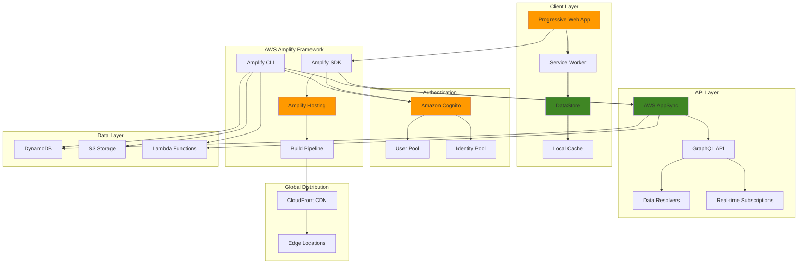

# Developing Progressive Web Applications with AWS Amplify

## Problem

Modern businesses need to deliver full-stack Progressive Web Applications that provide native app-like experiences while maintaining cross-platform compatibility. Traditional web development requires complex setup of backend services, user authentication, real-time data synchronization, and offline functionality. Development teams struggle with integrating multiple AWS services, managing authentication flows, implementing real-time features, and ensuring seamless offline-to-online data synchronization across devices.

## Solution

AWS Amplify provides a complete full-stack development platform for building Progressive Web Applications with integrated backend services, authentication, real-time APIs, and offline-first data management. This solution leverages Amplify CLI for backend provisioning, Cognito for user authentication, AppSync for real-time GraphQL APIs, and DataStore for offline-first data synchronization to create a comprehensive PWA development environment.

## Architecture Diagram



## Prerequisites

1. AWS account with appropriate permissions for Amplify, Cognito, AppSync, DynamoDB, and S3
2. AWS CLI v2 installed and configured (or AWS CloudShell)
3. Node.js 18+ and npm installed locally
4. Amplify CLI installed globally (`npm install -g @aws-amplify/cli`)
5. Git repository for version control
6. Basic knowledge of JavaScript, React, GraphQL, and PWA concepts
7. Estimated cost: $0.01 per build minute + $0.15 per GB data transfer + $0.05 per million API requests

> **Note**: AWS Amplify's free tier includes 1,000 build minutes, 5 GB data transfer, and 250,000 API requests per month, making it cost-effective for development and small-scale applications.

## Preparation

```bash
# Set environment variables
export AWS_REGION=$(aws configure get region)
export AWS_ACCOUNT_ID=$(aws sts get-caller-identity \
    --query Account --output text)

# Generate unique identifiers for resources
RANDOM_SUFFIX=$(aws secretsmanager get-random-password \
    --exclude-punctuation --exclude-uppercase \
    --password-length 6 --require-each-included-type \
    --output text --query RandomPassword 2>/dev/null || \
    echo $(date +%s | tail -c 6))

export APP_NAME="full-stack-pwa-${RANDOM_SUFFIX}"
export PROJECT_NAME="fullstack-pwa-${RANDOM_SUFFIX}"

# Create project directory
mkdir -p ~/${PROJECT_NAME}
cd ~/${PROJECT_NAME}

# Initialize React application
npx create-react-app . --template typescript

# Install Amplify and PWA dependencies
npm install aws-amplify @aws-amplify/ui-react \
    workbox-webpack-plugin workbox-precaching \
    workbox-routing workbox-strategies

echo "✅ Environment variables configured"
echo "Project Name: ${PROJECT_NAME}"
echo "App Name: ${APP_NAME}"
```

## Steps

1. **Initialize Amplify Backend**:

   AWS Amplify transforms traditional full-stack development by providing a unified CLI that provisions and configures backend services automatically. This initialization step establishes the foundation for your entire serverless architecture, connecting your React application to AWS services through infrastructure-as-code principles. The Amplify CLI uses AWS CloudFormation behind the scenes to create consistent, repeatable deployments across environments.

   ```bash
   # Initialize Amplify project
   amplify init
   
   # Follow the prompts:
   # - Enter a name for the project: Use ${PROJECT_NAME}
   # - Initialize the project with the above configuration: Yes
   # - Enter a name for the environment: dev
   # - Choose your default editor: VS Code
   # - Choose the type of app: javascript
   # - What javascript framework: react
   # - Source Directory Path: src
   # - Distribution Directory Path: build
   # - Build Command: npm run build
   # - Start Command: npm start
   # - Select authentication method: AWS profile
   # - Please choose the profile: default
   
   echo "✅ Amplify backend initialized"
   ```

   This initialization creates the amplify/ directory structure containing your backend configuration, establishes environment isolation, and sets up the deployment pipeline. The project is now ready to add backend capabilities through additional Amplify categories, each of which will be automatically provisioned with security best practices and cross-service integrations.

2. **Add Authentication with Cognito**:

   Amazon Cognito provides enterprise-grade authentication and authorization services that scale automatically from thousands to millions of users. By integrating Cognito with Amplify, you gain secure user management, multi-factor authentication, social sign-in capabilities, and fine-grained access controls without building complex authentication infrastructure. This eliminates security vulnerabilities common in custom authentication implementations.

   ```bash
   # Add authentication
   amplify add auth
   
   # Configuration prompts:
   # - Do you want to use default authentication: Default configuration
   # - How do you want users to be able to sign in: Username
   # - Do you want to configure advanced settings: No
   
   echo "✅ Authentication configured"
   ```

   Cognito creates both a User Pool for managing user identities and an Identity Pool for providing temporary AWS credentials to authenticated users. This dual-layer approach ensures users can access only the resources they're authorized to use, implementing the principle of least privilege automatically. The authentication state is seamlessly integrated with your React application through Amplify's SDK.

3. **Add GraphQL API with AppSync**:

   AWS AppSync provides fully managed GraphQL APIs with real-time data synchronization, offline capabilities, and built-in security. GraphQL's single endpoint approach eliminates over-fetching and under-fetching of data while enabling real-time subscriptions for live updates. AppSync automatically generates resolvers, handles caching, and provides conflict resolution for offline-first applications, significantly reducing the complexity of building modern data-driven applications.

   ```bash
   # Add GraphQL API
   amplify add api
   
   # Configuration prompts:
   # - Please select from one of the below mentioned services: GraphQL
   # - Here is the GraphQL API that we will create: Continue
   # - Choose a schema template: Single object with fields
   # - Do you want to edit the schema now: Yes
   
   # Edit the schema to create a Task model
   cat > amplify/backend/api/*/schema.graphql << 'EOF'
   type Task @model @auth(rules: [{allow: owner}]) {
     id: ID!
     title: String!
     description: String
     completed: Boolean!
     priority: Priority!
     dueDate: AWSDate
     createdAt: AWSDateTime!
     updatedAt: AWSDateTime!
   }
   
   enum Priority {
     LOW
     MEDIUM
     HIGH
   }
   
   type Subscription {
     onTaskUpdate: Task @aws_subscribe(mutations: ["updateTask"])
   }
   EOF
   
   echo "✅ GraphQL API configured with Task model"
   ```

   The @model directive automatically creates a complete CRUD API with DynamoDB table, while @auth(rules: [{allow: owner}]) ensures users can only access their own data. The subscription enables real-time updates across all connected clients when tasks are modified. This schema-first approach generates type-safe operations and enables powerful features like optimistic updates and automatic conflict resolution.

4. **Add Storage for File Uploads**:

   Amazon S3 provides virtually unlimited, highly durable object storage with 99.999999999% (11 9's) durability. Integrating S3 through Amplify enables secure file uploads with automatic access control, image resizing, and CDN distribution. This foundation supports features like task attachments, user profile images, and document management while automatically handling security policies and CORS configurations.

   ```bash
   # Add S3 storage
   amplify add storage
   
   # Configuration prompts:
   # - Please select from one of the below mentioned services: Content
   # - Please provide a friendly name: TaskAttachments
   # - Please provide bucket name: Leave default
   # - Who should have access: Auth and guest users
   # - What kind of access do you want for Authenticated users: 
   #   create/update, read, delete
   # - What kind of access do you want for Guest users: read
   # - Do you want to add a Lambda Trigger: No
   
   echo "✅ S3 storage configured"
   ```

   The storage configuration creates IAM policies that enforce user-level isolation, ensuring authenticated users can manage their own files while guests have read-only access to public content. This setup enables features like file sharing, document collaboration, and media management with enterprise-grade security built-in.

5. **Deploy Backend Services**:

   The amplify push command transforms your local configuration into live AWS infrastructure using AWS CloudFormation. This process provisions all backend services, establishes security policies, and generates client-side code for type-safe API interactions. The deployment creates production-ready resources with monitoring, logging, and scaling capabilities automatically configured according to AWS best practices.

   ```bash
   # Deploy all backend resources
   amplify push
   
   # Configuration prompts:
   # - Are you sure you want to continue: Yes
   # - Do you want to generate code for your newly created GraphQL API: Yes
   # - Choose the code generation language target: typescript
   # - Enter the file name pattern of graphql queries: src/graphql/**/*.ts
   # - Do you want to generate/update all possible GraphQL operations: Yes
   # - Enter maximum statement depth: 2
   # - Enter the file name for the generated code: src/API.ts
   
   echo "✅ Backend services deployed"
   ```

   Code generation creates TypeScript interfaces and GraphQL operations that provide compile-time type safety and IntelliSense support. The generated API.ts file contains all necessary types and operations, enabling developers to catch errors at build time rather than runtime. Your backend infrastructure is now live and ready to handle authentication, data operations, and file storage.

6. **Configure Amplify in React Application**:

   The Amplify.configure() call establishes the connection between your React application and the AWS backend services. The aws-exports.js file contains all necessary endpoints, region information, and service configurations generated during deployment. This single configuration step enables your application to authenticate users, make GraphQL queries, and upload files with automatic retry logic and error handling.

   ```bash
   # Configure Amplify in src/index.tsx
   cat > src/index.tsx << 'EOF'
   import React from 'react';
   import ReactDOM from 'react-dom/client';
   import './index.css';
   import App from './App';
   import reportWebVitals from './reportWebVitals';
   import { Amplify } from 'aws-amplify';
   import awsExports from './aws-exports';
   
   // Configure Amplify
   Amplify.configure(awsExports);
   
   const root = ReactDOM.createRoot(
     document.getElementById('root') as HTMLElement
   );
   root.render(
     <React.StrictMode>
       <App />
     </React.StrictMode>
   );
   
   reportWebVitals();
   EOF
   
   echo "✅ Amplify configured in React application"
   ```

   This configuration automatically handles authentication tokens, API endpoints, and storage bucket access, eliminating the need for manual credential management. The Amplify SDK now manages all backend interactions with built-in retry logic, request signing, and connection pooling for optimal performance.

7. **Create PWA with DataStore and Offline Support**:

   Amplify DataStore provides offline-first data synchronization by maintaining a local database that automatically syncs with the cloud when connectivity is available. This approach ensures your application works seamlessly regardless of network conditions, with automatic conflict resolution and optimistic updates. DataStore combines the benefits of local state management with cloud synchronization, eliminating the complexity of building custom offline solutions.

   ```bash
   # Create main App component with authentication
   cat > src/App.tsx << 'EOF'
   import React, { useState, useEffect } from 'react';
   import { withAuthenticator } from '@aws-amplify/ui-react';
   import { Auth, DataStore } from 'aws-amplify';
   import { Task, Priority } from './models';
   import TaskList from './components/TaskList';
   import TaskForm from './components/TaskForm';
   import NetworkStatus from './components/NetworkStatus';
   import '@aws-amplify/ui-react/styles.css';
   import './App.css';
   
   function App({ signOut, user }: any) {
     const [tasks, setTasks] = useState<Task[]>([]);
     const [isOnline, setIsOnline] = useState(navigator.onLine);
     const [syncStatus, setSyncStatus] = useState<string>('synced');
   
     useEffect(() => {
       // Listen for network status changes
       const handleOnline = () => setIsOnline(true);
       const handleOffline = () => setIsOnline(false);
       
       window.addEventListener('online', handleOnline);
       window.addEventListener('offline', handleOffline);
       
       return () => {
         window.removeEventListener('online', handleOnline);
         window.removeEventListener('offline', handleOffline);
       };
     }, []);
   
     useEffect(() => {
       // Subscribe to DataStore changes
       const subscription = DataStore.observe(Task).subscribe(msg => {
         console.log('Task updated:', msg.model, msg.opType, msg.element);
         fetchTasks();
       });
   
       // Start DataStore and sync
       DataStore.start().then(() => {
         setSyncStatus('synced');
         fetchTasks();
       });
   
       return () => subscription.unsubscribe();
     }, []);
   
     const fetchTasks = async () => {
       try {
         const taskList = await DataStore.query(Task);
         setTasks(taskList.sort((a, b) => 
           new Date(b.createdAt).getTime() - new Date(a.createdAt).getTime()
         ));
       } catch (error) {
         console.error('Error fetching tasks:', error);
       }
     };
   
     const handleTaskCreate = async (taskData: any) => {
       try {
         setSyncStatus('syncing');
         await DataStore.save(new Task(taskData));
         setSyncStatus('synced');
       } catch (error) {
         console.error('Error creating task:', error);
         setSyncStatus('error');
       }
     };
   
     const handleTaskUpdate = async (task: Task) => {
       try {
         setSyncStatus('syncing');
         await DataStore.save(Task.copyOf(task, updated => {
           updated.completed = !updated.completed;
         }));
         setSyncStatus('synced');
       } catch (error) {
         console.error('Error updating task:', error);
         setSyncStatus('error');
       }
     };
   
     const handleTaskDelete = async (task: Task) => {
       try {
         setSyncStatus('syncing');
         await DataStore.delete(task);
         setSyncStatus('synced');
       } catch (error) {
         console.error('Error deleting task:', error);
         setSyncStatus('error');
       }
     };
   
     return (
       <div className="App">
         <header className="App-header">
           <h1>Full-Stack PWA Task Manager</h1>
           <div className="user-info">
             <span>Welcome, {user.username}!</span>
             <button onClick={signOut} className="sign-out-button">
               Sign Out
             </button>
           </div>
         </header>
         
         <NetworkStatus isOnline={isOnline} syncStatus={syncStatus} />
         
         <main className="App-main">
           <TaskForm onTaskCreate={handleTaskCreate} />
           <TaskList 
             tasks={tasks} 
             onTaskUpdate={handleTaskUpdate}
             onTaskDelete={handleTaskDelete}
           />
         </main>
       </div>
     );
   }
   
   export default withAuthenticator(App);
   EOF
   
   echo "✅ Created main App component with authentication"
   ```

   The withAuthenticator HOC provides a complete authentication UI with sign-up, sign-in, and password recovery flows. DataStore.observe() creates real-time subscriptions that automatically update the UI when data changes, while DataStore.save() and DataStore.delete() work offline and sync when connectivity returns. This architecture provides a native app-like experience in the browser.

8. **Create Task Management Components**:

   React component architecture promotes reusability and maintainability by separating concerns into focused, single-purpose components. These task management components demonstrate modern React patterns including TypeScript interfaces, functional components with hooks, and CSS modules for styling. The component structure enables easy testing, debugging, and future enhancements while maintaining clean separation between presentation and business logic.

   ```bash
   # Create components directory
   mkdir -p src/components
   
   # Create TaskList component
   cat > src/components/TaskList.tsx << 'EOF'
   import React from 'react';
   import { Task } from '../models';
   import './TaskList.css';
   
   interface TaskListProps {
     tasks: Task[];
     onTaskUpdate: (task: Task) => void;
     onTaskDelete: (task: Task) => void;
   }
   
   const TaskList: React.FC<TaskListProps> = ({ 
     tasks, 
     onTaskUpdate, 
     onTaskDelete 
   }) => {
     const getPriorityColor = (priority: string) => {
       switch (priority) {
         case 'HIGH': return '#ff4444';
         case 'MEDIUM': return '#ffaa00';
         case 'LOW': return '#00aa00';
         default: return '#666666';
       }
     };
   
     return (
       <div className="task-list">
         <h2>Tasks ({tasks.length})</h2>
         {tasks.length === 0 ? (
           <p className="no-tasks">No tasks yet. Create your first task!</p>
         ) : (
           tasks.map((task) => (
             <div key={task.id} className={`task-item ${task.completed ? 'completed' : ''}`}>
               <div className="task-content">
                 <div className="task-header">
                   <h3 className="task-title">{task.title}</h3>
                   <div 
                     className="task-priority"
                     style={{ backgroundColor: getPriorityColor(task.priority) }}
                   >
                     {task.priority}
                   </div>
                 </div>
                 {task.description && (
                   <p className="task-description">{task.description}</p>
                 )}
                 {task.dueDate && (
                   <p className="task-due-date">Due: {task.dueDate}</p>
                 )}
               </div>
               <div className="task-actions">
                 <button 
                   onClick={() => onTaskUpdate(task)}
                   className={`toggle-button ${task.completed ? 'completed' : ''}`}
                 >
                   {task.completed ? '✓' : '○'}
                 </button>
                 <button 
                   onClick={() => onTaskDelete(task)}
                   className="delete-button"
                 >
                   ×
                 </button>
               </div>
             </div>
           ))
         )}
       </div>
     );
   };
   
   export default TaskList;
   EOF
   
   # Create TaskForm component
   cat > src/components/TaskForm.tsx << 'EOF'
   import React, { useState } from 'react';
   import { Priority } from '../models';
   import './TaskForm.css';
   
   interface TaskFormProps {
     onTaskCreate: (task: any) => void;
   }
   
   const TaskForm: React.FC<TaskFormProps> = ({ onTaskCreate }) => {
     const [title, setTitle] = useState('');
     const [description, setDescription] = useState('');
     const [priority, setPriority] = useState<Priority>(Priority.MEDIUM);
     const [dueDate, setDueDate] = useState('');
   
     const handleSubmit = (e: React.FormEvent) => {
       e.preventDefault();
       if (!title.trim()) return;
   
       onTaskCreate({
         title: title.trim(),
         description: description.trim(),
         priority,
         dueDate: dueDate || undefined,
         completed: false,
       });
   
       // Reset form
       setTitle('');
       setDescription('');
       setPriority(Priority.MEDIUM);
       setDueDate('');
     };
   
     return (
       <form onSubmit={handleSubmit} className="task-form">
         <h2>Create New Task</h2>
         <div className="form-group">
           <label htmlFor="title">Title *</label>
           <input
             type="text"
             id="title"
             value={title}
             onChange={(e) => setTitle(e.target.value)}
             placeholder="Enter task title"
             required
           />
         </div>
         
         <div className="form-group">
           <label htmlFor="description">Description</label>
           <textarea
             id="description"
             value={description}
             onChange={(e) => setDescription(e.target.value)}
             placeholder="Enter task description"
             rows={3}
           />
         </div>
         
         <div className="form-row">
           <div className="form-group">
             <label htmlFor="priority">Priority</label>
             <select
               id="priority"
               value={priority}
               onChange={(e) => setPriority(e.target.value as Priority)}
             >
               <option value={Priority.LOW}>Low</option>
               <option value={Priority.MEDIUM}>Medium</option>
               <option value={Priority.HIGH}>High</option>
             </select>
           </div>
           
           <div className="form-group">
             <label htmlFor="dueDate">Due Date</label>
             <input
               type="date"
               id="dueDate"
               value={dueDate}
               onChange={(e) => setDueDate(e.target.value)}
             />
           </div>
         </div>
         
         <button type="submit" className="submit-button">
           Create Task
         </button>
       </form>
     );
   };
   
   export default TaskForm;
   EOF
   
   # Create NetworkStatus component
   cat > src/components/NetworkStatus.tsx << 'EOF'
   import React from 'react';
   import './NetworkStatus.css';
   
   interface NetworkStatusProps {
     isOnline: boolean;
     syncStatus: string;
   }
   
   const NetworkStatus: React.FC<NetworkStatusProps> = ({ isOnline, syncStatus }) => {
     const getStatusMessage = () => {
       if (!isOnline) return 'Offline - Changes saved locally';
       if (syncStatus === 'syncing') return 'Syncing...';
       if (syncStatus === 'error') return 'Sync error - Will retry';
       return 'Online - All changes synced';
     };
   
     const getStatusClass = () => {
       if (!isOnline) return 'offline';
       if (syncStatus === 'syncing') return 'syncing';
       if (syncStatus === 'error') return 'error';
       return 'online';
     };
   
     return (
       <div className={`network-status ${getStatusClass()}`}>
         <div className="status-indicator"></div>
         <span>{getStatusMessage()}</span>
       </div>
     );
   };
   
   export default NetworkStatus;
   EOF
   
   echo "✅ Created task management components"
   ```

   These components leverage React hooks for state management and event handling, with TypeScript interfaces ensuring type safety across component boundaries. The TaskList implements real-time UI updates through props-based data flow, while TaskForm demonstrates controlled components with form validation. The NetworkStatus component provides visual feedback about connectivity and sync status, enhancing user experience during offline scenarios.

9. **Add PWA Configuration and Service Worker**:

   Progressive Web App features bridge the gap between web and native applications by enabling installation, offline functionality, and push notifications. The web app manifest defines how the application appears when installed on devices, while service workers provide powerful caching strategies and background synchronization. This combination creates app-like experiences with the reach and convenience of web applications.

   > **Warning**: Service workers cache resources aggressively, which can cause issues during development. Use browser DevTools to clear service worker cache when testing changes to ensure you're seeing the latest code.

   ```bash
   # Create PWA manifest
   cat > public/manifest.json << 'EOF'
   {
     "short_name": "Task Manager",
     "name": "Full-Stack PWA Task Manager",
     "icons": [
       {
         "src": "favicon.ico",
         "sizes": "64x64 32x32 24x24 16x16",
         "type": "image/x-icon"
       },
       {
         "src": "logo192.png",
         "type": "image/png",
         "sizes": "192x192"
       },
       {
         "src": "logo512.png",
         "type": "image/png",
         "sizes": "512x512"
       }
     ],
     "start_url": ".",
     "display": "standalone",
     "theme_color": "#000000",
     "background_color": "#ffffff",
     "categories": ["productivity", "utilities"]
   }
   EOF
   
   # Create service worker
   cat > public/sw.js << 'EOF'
   const CACHE_NAME = 'task-manager-v1';
   const urlsToCache = [
     '/',
     '/static/js/bundle.js',
     '/static/css/main.css',
     '/manifest.json'
   ];
   
   self.addEventListener('install', (event) => {
     event.waitUntil(
       caches.open(CACHE_NAME)
         .then((cache) => cache.addAll(urlsToCache))
     );
   });
   
   self.addEventListener('fetch', (event) => {
     event.respondWith(
       caches.match(event.request)
         .then((response) => {
           if (response) {
             return response;
           }
           return fetch(event.request);
         })
     );
   });
   EOF
   
   echo "✅ Created PWA configuration files"
   ```

   The manifest.json file enables browsers to prompt users for app installation, while the service worker implements caching strategies that allow the application to work offline. Modern browsers use these files to provide native app-like features including home screen installation, standalone display mode, and background updates. This PWA foundation supports push notifications and background sync for comprehensive mobile experiences.

10. **Add Styling for Components**:

    Modern CSS techniques enhance user experience through responsive design, visual hierarchy, and interactive feedback. These stylesheets implement CSS Grid and Flexbox for layout, CSS transitions for smooth interactions, and media queries for mobile responsiveness. The styling approach prioritizes accessibility, performance, and maintainability while creating visually appealing interfaces that work across devices and screen sizes.

    ```bash
    # Create component styles
    cat > src/components/TaskList.css << 'EOF'
    .task-list {
      margin: 20px 0;
    }
    
    .task-list h2 {
      color: #333;
      margin-bottom: 20px;
    }
    
    .no-tasks {
      text-align: center;
      color: #666;
      font-style: italic;
      margin: 40px 0;
    }
    
    .task-item {
      display: flex;
      justify-content: space-between;
      align-items: center;
      padding: 15px;
      margin-bottom: 10px;
      background: #f8f9fa;
      border-radius: 8px;
      border-left: 4px solid #007bff;
      transition: all 0.2s ease;
    }
    
    .task-item:hover {
      background: #e9ecef;
      transform: translateX(5px);
    }
    
    .task-item.completed {
      opacity: 0.7;
      border-left-color: #28a745;
    }
    
    .task-content {
      flex: 1;
    }
    
    .task-header {
      display: flex;
      align-items: center;
      gap: 10px;
      margin-bottom: 8px;
    }
    
    .task-title {
      margin: 0;
      font-size: 16px;
      color: #333;
    }
    
    .task-priority {
      padding: 4px 8px;
      border-radius: 4px;
      color: white;
      font-size: 12px;
      font-weight: bold;
    }
    
    .task-description {
      margin: 5px 0;
      color: #666;
      font-size: 14px;
    }
    
    .task-due-date {
      margin: 5px 0;
      color: #666;
      font-size: 12px;
    }
    
    .task-actions {
      display: flex;
      gap: 10px;
    }
    
    .toggle-button, .delete-button {
      border: none;
      border-radius: 50%;
      width: 35px;
      height: 35px;
      cursor: pointer;
      font-size: 16px;
      transition: all 0.2s ease;
    }
    
    .toggle-button {
      background: #007bff;
      color: white;
    }
    
    .toggle-button.completed {
      background: #28a745;
    }
    
    .delete-button {
      background: #dc3545;
      color: white;
    }
    
    .toggle-button:hover, .delete-button:hover {
      transform: scale(1.1);
    }
    EOF
    
    cat > src/components/TaskForm.css << 'EOF'
    .task-form {
      background: #f8f9fa;
      padding: 20px;
      border-radius: 8px;
      margin-bottom: 30px;
    }
    
    .task-form h2 {
      margin-top: 0;
      color: #333;
    }
    
    .form-group {
      margin-bottom: 15px;
    }
    
    .form-row {
      display: flex;
      gap: 15px;
    }
    
    .form-row .form-group {
      flex: 1;
    }
    
    .form-group label {
      display: block;
      margin-bottom: 5px;
      color: #333;
      font-weight: 500;
    }
    
    .form-group input,
    .form-group textarea,
    .form-group select {
      width: 100%;
      padding: 8px 12px;
      border: 1px solid #ddd;
      border-radius: 4px;
      font-size: 14px;
    }
    
    .form-group textarea {
      resize: vertical;
    }
    
    .submit-button {
      background: #007bff;
      color: white;
      border: none;
      padding: 12px 24px;
      border-radius: 4px;
      cursor: pointer;
      font-size: 16px;
      transition: background 0.2s ease;
    }
    
    .submit-button:hover {
      background: #0056b3;
    }
    EOF
    
    cat > src/components/NetworkStatus.css << 'EOF'
    .network-status {
      display: flex;
      align-items: center;
      gap: 8px;
      padding: 10px 15px;
      border-radius: 4px;
      margin-bottom: 20px;
      font-size: 14px;
    }
    
    .status-indicator {
      width: 8px;
      height: 8px;
      border-radius: 50%;
    }
    
    .network-status.online .status-indicator {
      background: #28a745;
    }
    
    .network-status.offline .status-indicator {
      background: #dc3545;
    }
    
    .network-status.syncing .status-indicator {
      background: #ffc107;
      animation: pulse 1s infinite;
    }
    
    .network-status.error .status-indicator {
      background: #dc3545;
    }
    
    .network-status.online {
      background: #d4edda;
      color: #155724;
    }
    
    .network-status.offline {
      background: #f8d7da;
      color: #721c24;
    }
    
    .network-status.syncing {
      background: #fff3cd;
      color: #856404;
    }
    
    .network-status.error {
      background: #f8d7da;
      color: #721c24;
    }
    
    @keyframes pulse {
      0% { opacity: 1; }
      50% { opacity: 0.5; }
      100% { opacity: 1; }
    }
    EOF
    
    # Update main App.css
    cat > src/App.css << 'EOF'
    .App {
      max-width: 800px;
      margin: 0 auto;
      padding: 20px;
    }
    
    .App-header {
      display: flex;
      justify-content: space-between;
      align-items: center;
      margin-bottom: 30px;
      padding-bottom: 20px;
      border-bottom: 2px solid #e9ecef;
    }
    
    .App-header h1 {
      margin: 0;
      color: #333;
    }
    
    .user-info {
      display: flex;
      align-items: center;
      gap: 15px;
    }
    
    .sign-out-button {
      background: #dc3545;
      color: white;
      border: none;
      padding: 8px 16px;
      border-radius: 4px;
      cursor: pointer;
      font-size: 14px;
      transition: background 0.2s ease;
    }
    
    .sign-out-button:hover {
      background: #c82333;
    }
    
    .App-main {
      padding: 20px 0;
    }
    
    @media (max-width: 768px) {
      .App {
        padding: 10px;
      }
      
      .App-header {
        flex-direction: column;
        gap: 15px;
        text-align: center;
      }
      
      .user-info {
        flex-direction: column;
        gap: 10px;
      }
    }
    EOF
    
    echo "✅ Created component styling"
    ```

    The CSS implementation follows modern design principles with consistent spacing, typography, and color schemes. Responsive breakpoints ensure the application works effectively on mobile devices, tablets, and desktops. Animation and transition effects provide visual feedback for user interactions, while maintaining performance through efficient CSS selectors and minimal reflows.

## Validation & Testing

1. **Verify Backend Services**:

   ```bash
   # Check Amplify status
   amplify status
   
   # Verify authentication
   aws cognito-idp list-user-pools \
       --max-results 10 \
       --query 'UserPools[?contains(Name, `'${PROJECT_NAME}'`)].{Name:Name,Id:Id}'
   
   # Verify GraphQL API
   aws appsync list-graphql-apis \
       --query 'graphqlApis[?contains(name, `'${PROJECT_NAME}'`)].{Name:name,ApiId:apiId,UrisGRAPHQL:uris.GRAPHQL}'
   ```

   Expected output: Shows authentication, API, and storage services as deployed

2. **Test PWA Functionality**:

   ```bash
   # Start development server
   npm start
   
   # Test in browser:
   echo "Manual tests required:"
   echo "1. Open http://localhost:3000 in browser"
   echo "2. Sign up/sign in with test user"
   echo "3. Create tasks and verify real-time sync"
   echo "4. Test offline mode (disable network)"
   echo "5. Verify service worker registration in DevTools"
   echo "6. Test PWA installation prompt"
   ```

3. **Test Offline Functionality**:

   ```bash
   # Build production version
   npm run build
   
   # Serve built files locally
   npx serve -s build
   
   echo "Offline testing steps:"
   echo "1. Load app in browser"
   echo "2. Sign in and create tasks"
   echo "3. Disable network connection"
   echo "4. Verify app still works offline"
   echo "5. Create tasks while offline"
   echo "6. Re-enable network and verify sync"
   ```

4. **Verify DataStore Sync**:

   ```bash
   # Check DynamoDB tables
   aws dynamodb list-tables \
       --query 'TableNames[?contains(@, `Task`)]'
   
   # Check S3 storage bucket
   aws s3 ls | grep -i ${PROJECT_NAME}
   ```

## Cleanup

1. **Remove Backend Resources**:

   ```bash
   # Remove all Amplify resources
   amplify delete
   
   # Confirm deletion when prompted
   echo "✅ Deleted Amplify backend resources"
   ```

2. **Clean up Local Files**:

   ```bash
   # Remove project directory
   cd ~
   rm -rf ${PROJECT_NAME}
   
   # Clean up environment variables
   unset APP_NAME PROJECT_NAME RANDOM_SUFFIX
   
   echo "✅ Cleaned up local environment"
   ```

## Discussion

Building Progressive Web Applications with AWS Amplify represents a paradigm shift in full-stack development, combining the reach of web applications with the engagement of native mobile apps. This comprehensive approach leverages Amplify's integrated ecosystem to address the complex challenges of modern web application development including authentication, real-time data synchronization, offline functionality, and global distribution.

The architecture demonstrated here showcases Amplify's code-first approach to backend development. By using the Amplify CLI to provision authentication via Amazon Cognito, real-time GraphQL APIs through AWS AppSync, and offline-first data management with DataStore, developers can focus on building features rather than managing infrastructure. The DataStore component is particularly powerful as it provides automatic conflict resolution, real-time synchronization, and seamless offline-to-online transitions.

The PWA implementation goes beyond basic caching strategies by integrating Service Workers with Amplify's DataStore to create a truly offline-first experience. When users work offline, changes are stored locally and automatically synchronized when connectivity is restored. This approach ensures data consistency across devices and provides a native app-like experience regardless of network conditions.

The authentication flow using Amplify's withAuthenticator higher-order component demonstrates how complex authentication requirements can be simplified. The integration with Amazon Cognito provides enterprise-grade security features including multi-factor authentication, social sign-in, and fine-grained access controls, all configured through simple CLI commands.

> **Note**: Amplify DataStore automatically handles conflict resolution when multiple users modify the same data simultaneously, using a "last writer wins" strategy by default. For complex business logic requiring custom conflict resolution, implement resolver functions in AppSync. See [AWS AppSync Conflict Resolution](https://docs.aws.amazon.com/appsync/latest/devguide/conflict-detection-and-sync.html) for advanced scenarios.

> **Tip**: Use Amplify's multi-environment support to create separate development, staging, and production environments, each with isolated backend resources and custom domain configurations for comprehensive testing workflows.

## Challenge

Extend this Progressive Web Application by implementing these advanced features:

1. **Real-time Collaboration**: Implement real-time collaborative editing where multiple users can work on the same tasks simultaneously, with live cursor tracking and conflict resolution using AppSync subscriptions and custom GraphQL resolvers.

2. **Advanced Offline Capabilities**: Build sophisticated offline queuing and sync strategies that handle complex data relationships, implement custom conflict resolution algorithms, and provide detailed sync status reporting with retry mechanisms.

3. **Push Notification System**: Integrate with Amazon Pinpoint to create targeted push notifications based on user behavior, task due dates, and collaborative actions, including both web push notifications and email campaigns.

4. **Multi-tenant Architecture**: Implement organization-level data isolation using Cognito Groups and custom GraphQL authorization rules, allowing multiple organizations to use the same application with complete data separation.

5. **Advanced Analytics and Monitoring**: Build comprehensive analytics dashboards using Amazon QuickSight to track user engagement, task completion rates, and application performance metrics, with custom events tracked through Amazon Pinpoint.

## Infrastructure Code

*Infrastructure code will be generated after recipe approval.*