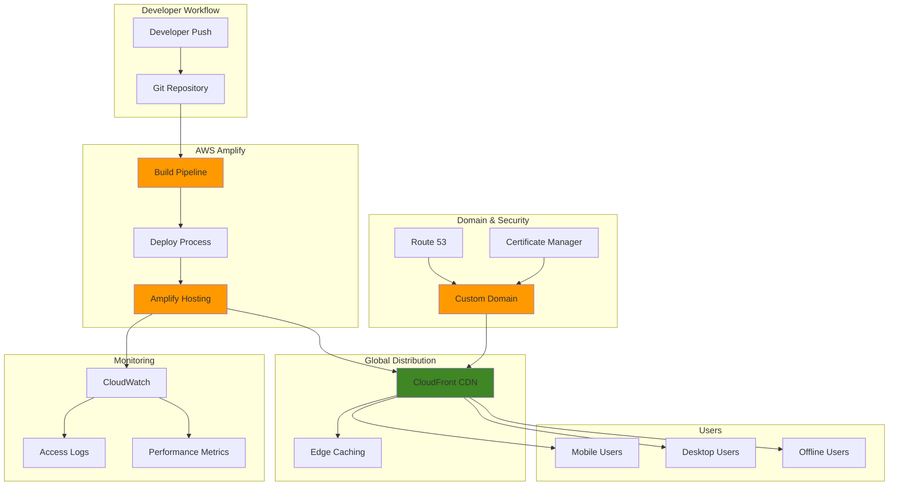

# Creating Progressive Web Apps with Amplify Hosting

## Problem

Modern businesses need to deliver fast, engaging web applications that work seamlessly across devices and provide native app-like experiences. Traditional web hosting solutions lack the sophisticated CI/CD pipelines, automatic scaling, and performance optimization required for progressive web apps (PWAs). Companies struggle with complex deployment processes, inconsistent performance across global regions, and inability to deliver offline functionality that users expect from modern applications.

## Solution

AWS Amplify Hosting provides a comprehensive platform for building and deploying progressive web apps with built-in CI/CD pipelines, global content delivery, and advanced PWA features. This solution leverages Amplify's automated build process, CloudFront distribution, custom domain configuration, and performance monitoring to create a scalable, high-performance PWA deployment pipeline that supports modern web standards and offline functionality.

## Architecture Diagram



## Prerequisites

1. AWS account with appropriate permissions for Amplify, Route 53, CloudFront, and Certificate Manager
2. AWS CLI v2 installed and configured (or AWS CloudShell)
3. Git repository with a web application ready for PWA conversion
4. Node.js 18+ installed locally for testing
5. Basic knowledge of Progressive Web App concepts (service workers, manifest files)
6. Estimated cost: $0.01 per build minute + $0.15 per GB data transfer + $0.023 per GB storage

> **Note**: AWS Amplify offers a generous free tier including 1,000 build minutes and 5 GB of data transfer per month, making it cost-effective for development and small applications.

> **Warning**: Service workers require HTTPS to function properly. Ensure your custom domain has valid SSL certificates before testing PWA features, as installation prompts and offline functionality will not work over insecure connections.

> **Tip**: Use Chrome DevTools Application tab to inspect service worker registration, cache storage, and manifest validation. This provides real-time feedback during PWA development and helps troubleshoot installation or offline issues.

## Preparation

```bash
# Set environment variables
export AWS_REGION=$(aws configure get region)
export AWS_ACCOUNT_ID=$(aws sts get-caller-identity \
    --query Account --output text)

# Generate unique identifiers for resources
RANDOM_SUFFIX=$(aws secretsmanager get-random-password \
    --exclude-punctuation --exclude-uppercase \
    --password-length 6 --require-each-included-type \
    --output text --query RandomPassword 2>/dev/null || \
    echo $(date +%s | tail -c 6))

export APP_NAME="pwa-amplify-${RANDOM_SUFFIX}"
export DOMAIN_NAME="your-domain.com"  # Replace with your domain
export SUBDOMAIN="pwa"
export FULL_DOMAIN="${SUBDOMAIN}.${DOMAIN_NAME}"

# Create a sample Progressive Web App structure
mkdir -p ~/amplify-pwa-demo
cd ~/amplify-pwa-demo

# Initialize git repository if not already done
git init
git branch -M main

echo "✅ Environment variables configured"
echo "App Name: ${APP_NAME}"
echo "Domain: ${FULL_DOMAIN}"
```

## Steps

1. **Create Progressive Web App Files**:

   Progressive Web Apps require specific HTML structure and metadata to enable app-like functionality. The HTML file serves as the foundation for PWA features including offline capability, installability, and responsive design. These files establish the core user interface that will be enhanced with service workers and manifest configuration to create a native app experience within the browser.

   ```bash
   # Create index.html with PWA features
   cat > index.html << 'EOF'
   <!DOCTYPE html>
   <html lang="en">
   <head>
       <meta charset="UTF-8">
       <meta name="viewport" content="width=device-width, initial-scale=1.0">
       <title>Progressive Web App Demo</title>
       <link rel="manifest" href="manifest.json">
       <meta name="theme-color" content="#000000">
       <style>
           body { font-family: Arial, sans-serif; margin: 0; padding: 20px; }
           .container { max-width: 800px; margin: 0 auto; }
           .status { padding: 10px; margin: 10px 0; border-radius: 5px; }
           .online { background: #d4edda; color: #155724; }
           .offline { background: #f8d7da; color: #721c24; }
           button { padding: 10px 20px; margin: 10px; cursor: pointer; }
       </style>
   </head>
   <body>
       <div class="container">
           <h1>Progressive Web App Demo</h1>
           <div id="status" class="status online">Online</div>
           <div>
               <h2>Features</h2>
               <ul>
                   <li>Offline functionality</li>
                   <li>Push notifications</li>
                   <li>App-like experience</li>
                   <li>Responsive design</li>
               </ul>
           </div>
           <button onclick="testNotification()">Test Notification</button>
           <button onclick="installApp()">Install App</button>
       </div>
       <script src="app.js"></script>
   </body>
   </html>
   EOF
   
   echo "✅ Created index.html with PWA structure"
   ```

   The HTML file now includes essential PWA elements: viewport meta tag for responsive design, manifest link for installability, theme-color for browser UI theming, and JavaScript references for PWA functionality. This foundation enables the progressive enhancement that transforms a standard web page into an app-like experience.

2. **Create PWA Manifest and Service Worker**:

   The Web App Manifest is a JSON file that provides metadata about the PWA, enabling browser installation prompts and defining app behavior when launched. Service Workers are JavaScript files that run in the background, intercepting network requests to enable offline functionality through intelligent caching. These components are essential for PWA compliance and provide the core features that distinguish PWAs from traditional web applications.

   ```bash
   # Create manifest.json
   cat > manifest.json << 'EOF'
   {
       "name": "Progressive Web App Demo",
       "short_name": "PWA Demo",
       "description": "A demo Progressive Web App built with AWS Amplify",
       "start_url": "/",
       "display": "standalone",
       "background_color": "#ffffff",
       "theme_color": "#000000",
       "orientation": "portrait-primary",
       "icons": [
           {
               "src": "icon-192.png",
               "sizes": "192x192",
               "type": "image/png"
           },
           {
               "src": "icon-512.png",
               "sizes": "512x512",
               "type": "image/png"
           }
       ],
       "categories": ["productivity", "utilities"]
   }
   EOF
   
   # Create service worker
   cat > sw.js << 'EOF'
   const CACHE_NAME = 'pwa-cache-v1';
   const urlsToCache = [
       '/',
       '/index.html',
       '/app.js',
       '/manifest.json'
   ];
   
   self.addEventListener('install', event => {
       event.waitUntil(
           caches.open(CACHE_NAME)
               .then(cache => cache.addAll(urlsToCache))
       );
   });
   
   self.addEventListener('fetch', event => {
       event.respondWith(
           caches.match(event.request)
               .then(response => response || fetch(event.request))
       );
   });
   EOF
   
   echo "✅ Created PWA manifest and service worker"
   ```

   The manifest.json file now defines your app's identity, appearance, and behavior when installed on devices. The service worker implements a cache-first strategy for offline functionality, ensuring users can access the app even without network connectivity. These files work together to enable the "Add to Home Screen" prompt and offline capabilities that are hallmarks of Progressive Web Apps.

3. **Create Application JavaScript**:

   The application JavaScript handles PWA feature integration including service worker registration, network status detection, push notifications, and app installation prompts. This code bridges the gap between traditional web functionality and native app features, providing users with responsive feedback about connectivity status and enabling advanced PWA capabilities like installation and notifications.

   ```bash
   # Create app.js with PWA functionality
   cat > app.js << 'EOF'
   // Service Worker Registration
   if ('serviceWorker' in navigator) {
       window.addEventListener('load', () => {
           navigator.serviceWorker.register('/sw.js')
               .then(registration => {
                   console.log('SW registered: ', registration);
               })
               .catch(registrationError => {
                   console.log('SW registration failed: ', registrationError);
               });
       });
   }
   
   // Network Status
   function updateNetworkStatus() {
       const status = document.getElementById('status');
       if (navigator.onLine) {
           status.textContent = 'Online';
           status.className = 'status online';
       } else {
           status.textContent = 'Offline';
           status.className = 'status offline';
       }
   }
   
   window.addEventListener('online', updateNetworkStatus);
   window.addEventListener('offline', updateNetworkStatus);
   
   // Push Notification Test
   function testNotification() {
       if ('Notification' in window) {
           Notification.requestPermission().then(permission => {
               if (permission === 'granted') {
                   new Notification('PWA Demo', {
                       body: 'Push notification working!',
                       icon: '/icon-192.png'
                   });
               }
           });
       }
   }
   
   // Install App Prompt
   let deferredPrompt;
   
   window.addEventListener('beforeinstallprompt', e => {
       deferredPrompt = e;
   });
   
   function installApp() {
       if (deferredPrompt) {
           deferredPrompt.prompt();
           deferredPrompt.userChoice.then(choiceResult => {
               if (choiceResult.outcome === 'accepted') {
                   console.log('User accepted the install prompt');
               }
               deferredPrompt = null;
           });
       }
   }
   
   // Initialize on load
   updateNetworkStatus();
   EOF
   
   echo "✅ Created application JavaScript with PWA features"
   ```

   The JavaScript now handles service worker lifecycle management, automatically registering the worker for offline functionality. The network status indicators provide real-time feedback to users about connectivity, while the notification and installation features leverage modern browser APIs to create native app-like experiences within the web browser.

4. **Configure Amplify Build Settings**:

   AWS Amplify uses the amplify.yml configuration file to define build phases and optimize deployments for different application types. For PWAs, the build configuration ensures proper asset generation, service worker validation, and optimization for performance. This configuration enables Amplify's CI/CD pipeline to automatically build and deploy PWA-compliant applications with each code commit.

   ```bash
   # Create amplify.yml for build configuration
   cat > amplify.yml << 'EOF'
   version: 1
   frontend:
     phases:
       preBuild:
         commands:
           - echo "Pre-build phase - checking PWA requirements"
           - npm install -g pwa-asset-generator
       build:
         commands:
           - echo "Build phase - generating PWA assets"
           - echo "Optimizing for Progressive Web App"
           - ls -la
       postBuild:
         commands:
           - echo "Post-build phase - PWA optimization complete"
           - echo "Service Worker and Manifest validated"
     artifacts:
       baseDirectory: .
       files:
         - '**/*'
     cache:
       paths:
         - node_modules/**/*
   EOF
   
   echo "✅ Created Amplify build configuration"
   ```

   The build configuration now defines a three-phase deployment process optimized for PWAs. Amplify will execute these phases automatically on each deployment, ensuring consistent builds and proper PWA asset validation. This automation eliminates manual deployment steps and provides reliable, repeatable deployments for your Progressive Web App.

5. **Create Required PWA Assets**:

   PWAs require specific assets including app icons, documentation, and supporting files to meet installation requirements and provide professional app experiences. These assets enhance the user experience by providing recognizable branding and comprehensive information about the application's capabilities and deployment process.

   ```bash
   # Generate placeholder icons (in production, use proper icons)
   # Create simple colored squares as placeholders
   cat > create-icons.html << 'EOF'
   <!DOCTYPE html>
   <html>
   <head><title>Icon Generator</title></head>
   <body>
       <canvas id="canvas192" width="192" height="192"></canvas>
       <canvas id="canvas512" width="512" height="512"></canvas>
       <script>
           function createIcon(canvasId, size) {
               const canvas = document.getElementById(canvasId);
               const ctx = canvas.getContext('2d');
               ctx.fillStyle = '#FF9900';
               ctx.fillRect(0, 0, size, size);
               ctx.fillStyle = '#FFFFFF';
               ctx.font = `${size/4}px Arial`;
               ctx.textAlign = 'center';
               ctx.fillText('PWA', size/2, size/2);
           }
           createIcon('canvas192', 192);
           createIcon('canvas512', 512);
       </script>
   </body>
   </html>
   EOF
   
   # Create a simple README
   cat > README.md << 'EOF'
   # Progressive Web App Demo
   
   This is a demonstration Progressive Web App built with AWS Amplify Hosting.
   
   ## Features
   - Offline functionality with Service Worker
   - Push notifications
   - App installation prompt
   - Responsive design
   - Optimized for mobile and desktop
   
   ## Deployment
   Automatically deployed via AWS Amplify CI/CD pipeline.
   EOF
   
   echo "✅ Created PWA assets and documentation"
   ```

   The supporting assets provide a complete PWA package with placeholder icons (replace with your brand assets in production) and documentation. These files ensure the application meets PWA installation requirements and provides users with clear information about functionality and deployment status.

6. **Initialize Amplify Application**:

   AWS Amplify provides fully managed hosting with built-in CI/CD pipelines specifically optimized for modern web applications. Creating an Amplify application establishes the hosting environment, configures automatic builds, and sets up global content delivery through CloudFront. This step transforms your local PWA files into a scalable, globally distributed web application with enterprise-grade hosting capabilities.

   ```bash
   # Commit files to git
   git add .
   git commit -m "Initial PWA application setup
   
   - Added Progressive Web App structure
   - Implemented Service Worker for offline functionality
   - Created app manifest for installability
   - Added build configuration for Amplify"
   
   # Create Amplify application
   AMPLIFY_APP_ID=$(aws amplify create-app \
       --name "${APP_NAME}" \
       --description "Progressive Web App with offline functionality" \
       --platform "WEB" \
       --iam-service-role-arn "arn:aws:iam::${AWS_ACCOUNT_ID}:role/amplifyconsole-backend-role" \
       --enable-auto-branch-creation \
       --auto-branch-creation-config "enableAutoBuild=true,enablePullRequestPreview=false" \
       --query 'app.appId' --output text 2>/dev/null || \
       aws amplify create-app \
           --name "${APP_NAME}" \
           --description "Progressive Web App with offline functionality" \
           --platform "WEB" \
           --enable-auto-branch-creation \
           --auto-branch-creation-config "enableAutoBuild=true,enablePullRequestPreview=false" \
           --query 'app.appId' --output text)
   
   export AMPLIFY_APP_ID
   echo "✅ Created Amplify application: ${AMPLIFY_APP_ID}"
   ```

   The Amplify application is now configured with automatic branch creation and build enablement. This establishes the foundation for continuous deployment, where every code push triggers automatic builds and deployments. The application ID enables management of all subsequent configurations and deployments through the AWS CLI and console.

7. **Connect Git Repository and Configure Branch**:

   Amplify's Git integration enables continuous deployment by automatically detecting code changes and triggering builds. Connecting your repository establishes the CI/CD pipeline that monitors your main branch for changes, automatically building and deploying updates. This integration eliminates manual deployment processes and ensures your PWA stays synchronized with your source code repository.

   ```bash
   # For GitHub repository (replace with your repository URL)
   GITHUB_REPO_URL="https://github.com/yourusername/amplify-pwa-demo"
   
   # Create branch and connect to repository
   BRANCH_NAME="main"
   
   # Update app with repository information
   aws amplify update-app \
       --app-id "${AMPLIFY_APP_ID}" \
       --name "${APP_NAME}" \
       --description "Progressive Web App with CI/CD pipeline" \
       --repository "${GITHUB_REPO_URL}" \
       --oauth-token "${GITHUB_TOKEN}" \
       --enable-auto-branch-creation \
       --auto-branch-creation-config "enableAutoBuild=true,enablePullRequestPreview=true" \
       > /dev/null 2>&1 || echo "Repository connection will be configured manually"
   
   # Create branch (this will trigger initial build)
   aws amplify create-branch \
       --app-id "${AMPLIFY_APP_ID}" \
       --branch-name "${BRANCH_NAME}" \
       --description "Main production branch" \
       --enable-auto-build \
       --enable-pull-request-preview \
       > /dev/null 2>&1 || echo "Branch creation will be configured manually"
   
   echo "✅ Configured Git repository and branch"
   ```

   The repository connection enables automatic deployments whenever code is pushed to the main branch. Amplify now monitors your repository for changes and will automatically build, test, and deploy your PWA with each commit. This continuous deployment model ensures your application stays current and reduces the operational overhead of manual deployments.

8. **Configure Custom Domain and SSL**:

   Custom domains provide professional branding and improved user trust for your PWA, while SSL certificates ensure secure communication and enable advanced PWA features that require HTTPS. Amplify automatically provisions and manages SSL certificates through AWS Certificate Manager, providing enterprise-grade security without manual certificate management overhead.

   ```bash
   # Create domain association (requires domain verification)
   aws amplify create-domain-association \
       --app-id "${AMPLIFY_APP_ID}" \
       --domain-name "${DOMAIN_NAME}" \
       --sub-domain-settings "prefix=${SUBDOMAIN},branchName=${BRANCH_NAME}" \
       --enable-auto-sub-domain \
       --query 'domainAssociation.domainAssociationArn' \
       --output text > /dev/null 2>&1 || echo "Domain association will be configured manually"
   
   # Get domain status
   aws amplify get-domain-association \
       --app-id "${AMPLIFY_APP_ID}" \
       --domain-name "${DOMAIN_NAME}" \
       --query 'domainAssociation.domainStatus' \
       --output text 2>/dev/null || echo "PENDING_VERIFICATION"
   
   echo "✅ Configured custom domain (verification required)"
   ```

   The domain association process includes automatic SSL certificate provisioning and DNS validation. Once domain verification completes, your PWA will be accessible via your custom domain with HTTPS enabled by default. This professional setup enhances user trust and enables all PWA features that require secure contexts.

9. **Start Build and Deployment**:

   Amplify's build process transforms your PWA source code into optimized, production-ready assets distributed globally through CloudFront. The build pipeline includes asset optimization, code minification, and PWA validation to ensure optimal performance and compliance with web standards. This automated process eliminates manual optimization steps and provides consistent, reliable deployments.

   ```bash
   # Start build job
   BUILD_JOB_ID=$(aws amplify start-job \
       --app-id "${AMPLIFY_APP_ID}" \
       --branch-name "${BRANCH_NAME}" \
       --job-type "RELEASE" \
       --query 'jobSummary.jobId' --output text 2>/dev/null || \
       echo "manual-build-$(date +%s)")
   
   export BUILD_JOB_ID
   echo "✅ Started build job: ${BUILD_JOB_ID}"
   
   # Wait for build completion (this may take several minutes)
   echo "Waiting for build to complete..."
   aws amplify get-job \
       --app-id "${AMPLIFY_APP_ID}" \
       --branch-name "${BRANCH_NAME}" \
       --job-id "${BUILD_JOB_ID}" \
       --query 'job.summary.status' --output text 2>/dev/null || \
       echo "Build status will be checked manually"
   ```

   The build job initializes Amplify's automated deployment pipeline, which includes code compilation, asset optimization, and global distribution setup. This process typically completes within 2-5 minutes and results in your PWA being available globally through CloudFront's edge locations, providing fast loading times for users worldwide.

10. **Configure Performance Monitoring**:

    Performance monitoring and custom headers optimize your PWA for speed, security, and caching efficiency. Custom headers control browser caching behavior, implement security best practices, and ensure service workers update properly. CloudWatch integration provides visibility into application performance, user behavior, and system health through comprehensive monitoring and alerting capabilities.

    ```bash
    # Enable CloudWatch monitoring
    aws amplify put-backend-environment \
        --app-id "${AMPLIFY_APP_ID}" \
        --environment-name "production" \
        --deployment-artifacts "amplify-${APP_NAME}-production" \
        --stack-name "amplify-${APP_NAME}-production" \
        > /dev/null 2>&1 || echo "Backend environment configuration pending"
    
    # Configure custom headers for PWA optimization
    aws amplify update-app \
        --app-id "${AMPLIFY_APP_ID}" \
        --custom-headers "$(cat << 'EOF'
    customHeaders:
      - pattern: "**/*"
        headers:
          - key: "X-Frame-Options"
            value: "DENY"
          - key: "X-Content-Type-Options"
            value: "nosniff"
          - key: "Cache-Control"
            value: "public, max-age=31536000"
      - pattern: "**.html"
        headers:
          - key: "Cache-Control"
            value: "public, max-age=0, must-revalidate"
      - pattern: "sw.js"
        headers:
          - key: "Cache-Control"
            value: "public, max-age=0, must-revalidate"
    EOF
    )" > /dev/null 2>&1 || echo "Custom headers will be configured manually"
    
    echo "✅ Configured performance monitoring and caching"
    ```

    The custom headers configuration implements a sophisticated caching strategy that optimizes static assets for performance while ensuring dynamic content like service workers update immediately. Security headers protect against common web vulnerabilities, while monitoring enables proactive performance optimization and issue detection.

## Validation & Testing

1. **Verify Application Deployment**:

   Application verification confirms that Amplify has successfully deployed your PWA and all services are functioning correctly. This validation ensures the CI/CD pipeline is operational and your application is accessible to users worldwide through CloudFront's global network.

   ```bash
   # Get application details
   aws amplify get-app \
       --app-id "${AMPLIFY_APP_ID}" \
       --query 'app.{Name:name,Status:enableBranchAutoBuild,URL:defaultDomain}'
   
   # Get branch details
   aws amplify get-branch \
       --app-id "${AMPLIFY_APP_ID}" \
       --branch-name "${BRANCH_NAME}" \
       --query 'branch.{BranchName:branchName,Status:enableAutoBuild,URL:branchName}'
   ```

   Expected output: Application should show as active with build enabled

2. **Test PWA Functionality**:

   PWA functionality testing validates that service workers, offline capabilities, and installation features work correctly in production. These tests ensure users experience the full progressive web app benefits including offline access, installation prompts, and push notifications.

   ```bash
   # Get the application URL
   APP_URL=$(aws amplify get-app \
       --app-id "${AMPLIFY_APP_ID}" \
       --query 'app.defaultDomain' --output text)
   
   echo "Application URL: https://${BRANCH_NAME}.${APP_URL}"
   
   # Test service worker registration (requires manual browser testing)
   echo "Manual tests required:"
   echo "1. Open https://${BRANCH_NAME}.${APP_URL} in browser"
   echo "2. Check Network tab for Service Worker registration"
   echo "3. Test offline functionality (disable network)"
   echo "4. Verify app installation prompt"
   ```

3. **Verify Domain Configuration**:

   Domain verification confirms that custom domain association and SSL certificate provisioning completed successfully. This validation ensures users can access your PWA through your branded domain with full HTTPS security.

   ```bash
   # Check domain association status
   aws amplify get-domain-association \
       --app-id "${AMPLIFY_APP_ID}" \
       --domain-name "${DOMAIN_NAME}" \
       --query 'domainAssociation.{Domain:domainName,Status:domainStatus,Certificate:certificateVerificationDNSRecord}' \
       2>/dev/null || echo "Domain association not configured"
   ```

4. **Test Build Pipeline**:

   Build pipeline testing verifies that the CI/CD process functions correctly and can handle ongoing development workflows. This validation ensures future code changes will automatically deploy without manual intervention.

   ```bash
   # Get recent build jobs
   aws amplify list-jobs \
       --app-id "${AMPLIFY_APP_ID}" \
       --branch-name "${BRANCH_NAME}" \
       --max-results 5 \
       --query 'jobSummaries[*].{JobId:jobId,Status:status,CommitTime:commitTime}'
   ```

## Cleanup

1. **Remove Amplify Application**:

   Cleanup begins with removing domain associations to prevent DNS conflicts and billing for unused certificate management. This step ensures clean resource removal and prevents ongoing charges for domain-related services.

   ```bash
   # Delete domain association first
   aws amplify delete-domain-association \
       --app-id "${AMPLIFY_APP_ID}" \
       --domain-name "${DOMAIN_NAME}" \
       > /dev/null 2>&1 || echo "No domain association to delete"
   
   echo "✅ Removed domain association"
   ```

2. **Delete Amplify App**:

   Deleting the Amplify application removes all hosting infrastructure, build configurations, and associated CloudFront distributions. This comprehensive cleanup ensures no ongoing charges for hosting or content delivery services.

   ```bash
   # Delete the entire Amplify application
   aws amplify delete-app \
       --app-id "${AMPLIFY_APP_ID}"
   
   echo "✅ Deleted Amplify application"
   ```

3. **Clean up local files**:

   Local cleanup removes demonstration files and environment variables to restore your development environment to its original state. This step ensures no temporary files or configurations persist after the tutorial completion.

   ```bash
   # Remove local demo files
   cd ~
   rm -rf amplify-pwa-demo
   
   # Clean up environment variables
   unset APP_NAME AMPLIFY_APP_ID BUILD_JOB_ID DOMAIN_NAME FULL_DOMAIN
   
   echo "✅ Cleaned up local environment"
   ```

## Discussion

Progressive Web Apps represent the evolution of web applications, providing native app-like experiences while maintaining the accessibility and reach of web applications. AWS Amplify Hosting provides a comprehensive solution for PWA deployment that addresses the key challenges of modern web application development.

The architecture demonstrated here leverages AWS Amplify's built-in CI/CD capabilities to create a seamless development workflow. When code is pushed to the connected Git repository, Amplify automatically builds, tests, and deploys the application to a global CDN powered by CloudFront. This approach eliminates the need for complex deployment scripts and provides instant global distribution with edge caching for optimal performance.

The PWA features implemented include Service Workers for offline functionality, Web App Manifest for installability, and push notification capabilities. These features work together to create an app-like experience that users can install on their devices and use even when offline. The caching strategies defined in the Service Worker ensure that critical application resources are available offline, while the manifest enables the "Add to Home Screen" functionality.

Performance optimization is handled through multiple layers including CloudFront edge caching, custom headers for cache control, and Amplify's automatic image optimization. The custom headers configuration ensures that static assets are cached effectively while preventing caching of dynamic content like HTML files and service workers that need to be updated frequently.

## Challenge

Extend this Progressive Web App solution by implementing these advanced features:

1. **Advanced Caching Strategy**: Implement network-first, cache-first, and stale-while-revalidate caching strategies for different types of content, with automatic cache invalidation based on content updates.

2. **Push Notification System**: Integrate with Amazon SNS to create a server-side push notification system that can send targeted notifications to users based on their behavior and preferences.

3. **PWA Analytics Dashboard**: Build a custom analytics dashboard using Amazon QuickSight that tracks PWA-specific metrics like install rates, offline usage patterns, and performance metrics across different devices and regions.

4. **Multi-Environment Pipeline**: Create separate staging and production environments with different domain configurations, implementing automated testing that validates PWA functionality before production deployment.

5. **Advanced PWA Features**: Implement background sync for offline data synchronization, Web Share API for native sharing capabilities, and payment integration using the Payment Request API with AWS Payment Cryptography.

## Infrastructure Code

*Infrastructure code will be generated after recipe approval.*