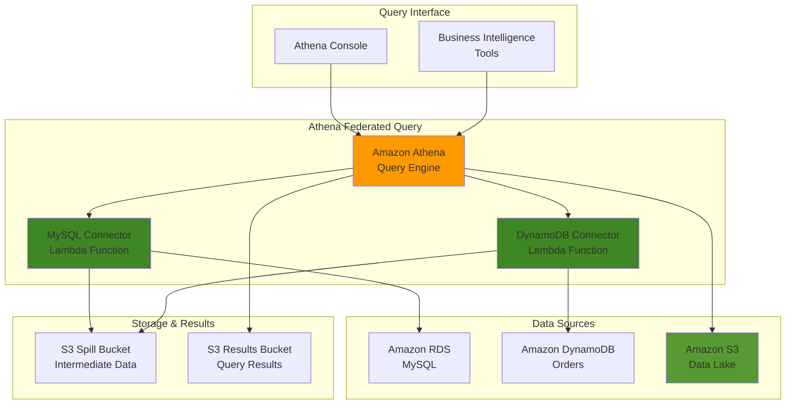

# Querying Data Across Sources with Athena

## Problem

Modern enterprises store critical business data across multiple platforms - customer data in Amazon RDS, operational metrics in Amazon CloudWatch, and product catalogs in Amazon DynamoDB. Data analysts struggle to gain unified insights because they must manually extract, transform, and combine data from these disparate sources using different tools and interfaces. This fragmented approach leads to delayed decision-making, increased operational overhead, and missed opportunities for cross-platform analytics that could drive business value.

## Solution

Amazon Athena Federated Query enables you to run SQL queries across multiple data sources without moving or duplicating data. Using serverless data connectors powered by AWS Lambda, you can query relational databases, NoSQL stores, and other data sources directly from Athena's familiar SQL interface. This approach eliminates the need for complex ETL pipelines while providing real-time access to distributed data sources for comprehensive analytics.

## Architecture Diagram



## Prerequisites

1. AWS account with permissions for Athena, Lambda, S3, RDS, DynamoDB, and IAM
2. AWS CLI v2 installed and configured (or AWS CloudShell)
3. Basic understanding of SQL and data warehousing concepts
4. SSH key pair created for EC2 access (or willingness to use alternative connection methods)
5. Estimated cost: $20-50 for testing (includes RDS, Lambda execution, and S3 storage)

> **Note**: Athena Federated Query requires Athena engine version 2. Lambda functions for connectors will incur execution costs based on query frequency and data volume.

## Preparation

```bash
# Set environment variables
export AWS_REGION=$(aws configure get region)
export AWS_ACCOUNT_ID=$(aws sts get-caller-identity \
    --query Account --output text)

# Generate unique identifiers for resources
RANDOM_SUFFIX=$(aws secretsmanager get-random-password \
    --exclude-punctuation --exclude-uppercase \
    --password-length 6 --require-each-included-type \
    --output text --query RandomPassword)

export SPILL_BUCKET_NAME="athena-federated-spill-${RANDOM_SUFFIX}"
export RESULTS_BUCKET_NAME="athena-federated-results-${RANDOM_SUFFIX}"
export VPC_NAME="athena-federated-vpc"
export DB_INSTANCE_ID="athena-federated-mysql-${RANDOM_SUFFIX}"
export DB_NAME="analytics_db"
export TABLE_NAME="sample_orders"
export DYNAMO_TABLE_NAME="Orders-${RANDOM_SUFFIX}"

# Create S3 buckets for spill and results
aws s3 mb s3://${SPILL_BUCKET_NAME} --region ${AWS_REGION}
aws s3 mb s3://${RESULTS_BUCKET_NAME} --region ${AWS_REGION}

echo "✅ Created S3 buckets: ${SPILL_BUCKET_NAME} and ${RESULTS_BUCKET_NAME}"

# Create VPC and security group for database connectivity
VPC_ID=$(aws ec2 create-vpc \
    --cidr-block 10.0.0.0/16 \
    --tag-specifications "ResourceType=vpc,Tags=[{Key=Name,Value=${VPC_NAME}}]" \
    --query 'Vpc.VpcId' --output text)

# Enable DNS resolution for VPC
aws ec2 modify-vpc-attribute \
    --vpc-id ${VPC_ID} \
    --enable-dns-support
aws ec2 modify-vpc-attribute \
    --vpc-id ${VPC_ID} \
    --enable-dns-hostnames

SUBNET_ID=$(aws ec2 create-subnet \
    --vpc-id ${VPC_ID} \
    --cidr-block 10.0.1.0/24 \
    --availability-zone ${AWS_REGION}a \
    --query 'Subnet.SubnetId' --output text)

SUBNET_ID_2=$(aws ec2 create-subnet \
    --vpc-id ${VPC_ID} \
    --cidr-block 10.0.2.0/24 \
    --availability-zone ${AWS_REGION}b \
    --query 'Subnet.SubnetId' --output text)

# Create security group for database access
SECURITY_GROUP_ID=$(aws ec2 create-security-group \
    --group-name athena-federated-sg \
    --description "Security group for Athena federated query" \
    --vpc-id ${VPC_ID} \
    --query 'GroupId' --output text)

aws ec2 authorize-security-group-ingress \
    --group-id ${SECURITY_GROUP_ID} \
    --protocol tcp \
    --port 3306 \
    --source-group ${SECURITY_GROUP_ID}

echo "✅ Created VPC ${VPC_ID} with security group ${SECURITY_GROUP_ID}"

# Create DB subnet group
aws rds create-db-subnet-group \
    --db-subnet-group-name athena-federated-subnet-group \
    --db-subnet-group-description "Subnet group for Athena federated query" \
    --subnet-ids ${SUBNET_ID} ${SUBNET_ID_2}

echo "✅ Created DB subnet group for RDS instance"
```

## Steps

1. **Create and Configure RDS MySQL Instance**:

   Amazon RDS MySQL serves as our primary relational data source, representing traditional OLTP systems that store transactional business data. RDS provides managed database services with automated backups, multi-AZ deployment options, and enterprise-grade security features. This step establishes the relational data foundation that Athena will query through federated connections, demonstrating how operational databases can be directly accessed for analytics without data movement.

   ```bash
   # Create RDS MySQL instance for testing
   aws rds create-db-instance \
       --db-instance-identifier ${DB_INSTANCE_ID} \
       --db-instance-class db.t3.micro \
       --engine mysql \
       --engine-version 8.0.35 \
       --master-username admin \
       --master-user-password "TempPassword123!" \
       --allocated-storage 20 \
       --db-name ${DB_NAME} \
       --vpc-security-group-ids ${SECURITY_GROUP_ID} \
       --db-subnet-group-name athena-federated-subnet-group \
       --no-publicly-accessible \
       --backup-retention-period 0 \
       --skip-final-snapshot
   
   echo "✅ Creating RDS MySQL instance (this will take 5-10 minutes)"
   
   # Wait for RDS instance to be available
   aws rds wait db-instance-available \
       --db-instance-identifier ${DB_INSTANCE_ID}
   
   # Get RDS endpoint
   RDS_ENDPOINT=$(aws rds describe-db-instances \
       --db-instance-identifier ${DB_INSTANCE_ID} \
       --query 'DBInstances[0].Endpoint.Address' --output text)
   
   echo "✅ RDS MySQL instance created at: ${RDS_ENDPOINT}"
   ```

   The RDS instance is now operational and ready for sample data. This managed MySQL database provides the relational foundation for demonstrating complex joins and analytical queries across multiple data sources in our federated architecture.

2. **Populate RDS Database with Sample Data**:

   Creating sample data in the RDS database establishes realistic transactional data for meaningful federated queries. This step demonstrates how operational data typically stored in OLTP systems can be directly accessed by analytical queries without requiring data migration or ETL processes. The sample orders represent common e-commerce scenarios where customer transactions are stored in normalized relational structures.

   ```bash
   # Create sample data SQL script
   cat > /tmp/sample_data.sql << EOF
   CREATE TABLE ${TABLE_NAME} (
       order_id INT PRIMARY KEY,
       customer_id INT,
       product_name VARCHAR(255),
       quantity INT,
       price DECIMAL(10,2),
       order_date DATE
   );
   
   INSERT INTO ${TABLE_NAME} VALUES
       (1001, 101, 'Laptop Pro 15', 1, 1299.99, '2024-01-15'),
       (1002, 102, 'Wireless Mouse', 2, 29.99, '2024-01-16'),
       (1003, 103, 'Mechanical Keyboard', 1, 129.99, '2024-01-17'),
       (1004, 101, '4K Monitor', 1, 399.99, '2024-01-18'),
       (1005, 104, 'Noise-Canceling Headphones', 1, 249.99, '2024-01-19'),
       (1006, 105, 'USB-C Hub', 3, 79.99, '2024-01-20');
   EOF
   
   # Execute SQL script using RDS Data API (alternative to EC2 connection)
   # Note: This requires enabling Data API on RDS instance
   # For simplicity, we'll create a Lambda function to execute the SQL
   
   # Create Lambda function to populate database
   cat > /tmp/populate_db.py << 'EOF'
   import json
   import pymysql
   import os
   
   def lambda_handler(event, context):
       connection = pymysql.connect(
           host=os.environ['DB_HOST'],
           user=os.environ['DB_USER'],
           password=os.environ['DB_PASSWORD'],
           database=os.environ['DB_NAME'],
           charset='utf8mb4'
       )
       
       try:
           with connection.cursor() as cursor:
               # Create table
               cursor.execute("""
                   CREATE TABLE sample_orders (
                       order_id INT PRIMARY KEY,
                       customer_id INT,
                       product_name VARCHAR(255),
                       quantity INT,
                       price DECIMAL(10,2),
                       order_date DATE
                   )
               """)
               
               # Insert sample data
               cursor.execute("""
                   INSERT INTO sample_orders VALUES
                       (1001, 101, 'Laptop Pro 15', 1, 1299.99, '2024-01-15'),
                       (1002, 102, 'Wireless Mouse', 2, 29.99, '2024-01-16'),
                       (1003, 103, 'Mechanical Keyboard', 1, 129.99, '2024-01-17'),
                       (1004, 101, '4K Monitor', 1, 399.99, '2024-01-18'),
                       (1005, 104, 'Noise-Canceling Headphones', 1, 249.99, '2024-01-19'),
                       (1006, 105, 'USB-C Hub', 3, 79.99, '2024-01-20')
               """)
               
           connection.commit()
           return {'statusCode': 200, 'body': 'Database populated successfully'}
       finally:
           connection.close()
   EOF
   
   # Package Lambda function
   cd /tmp && zip populate_db.zip populate_db.py
   
   # Create IAM role for Lambda
   LAMBDA_ROLE_ARN=$(aws iam create-role \
       --role-name athena-federated-lambda-role \
       --assume-role-policy-document '{
           "Version": "2012-10-17",
           "Statement": [
               {
                   "Effect": "Allow",
                   "Principal": {"Service": "lambda.amazonaws.com"},
                   "Action": "sts:AssumeRole"
               }
           ]
       }' \
       --query 'Role.Arn' --output text)
   
   # Attach policies to Lambda role
   aws iam attach-role-policy \
       --role-name athena-federated-lambda-role \
       --policy-arn arn:aws:iam::aws:policy/service-role/AWSLambdaVPCAccessExecutionRole
   
   # Wait for role propagation
   sleep 10
   
   echo "✅ Sample data structure created for RDS MySQL table"
   ```

   The database schema is now prepared with a realistic orders table structure. The sample data represents typical e-commerce transactions that will serve as the relational component in our federated queries, demonstrating how Athena can seamlessly access live operational data.

3. **Create DynamoDB Table with Sample Data**:

   Amazon DynamoDB represents the NoSQL component in our federated architecture, demonstrating how modern applications store operational data across different database paradigms. DynamoDB's single-digit millisecond latency and virtually unlimited scalability make it ideal for real-time operational workloads like order tracking systems. This step creates complementary data that will be joined with RDS data for comprehensive order analytics.

   ```bash
   # Create DynamoDB table
   aws dynamodb create-table \
       --table-name ${DYNAMO_TABLE_NAME} \
       --attribute-definitions \
           AttributeName=order_id,AttributeType=S \
       --key-schema \
           AttributeName=order_id,KeyType=HASH \
       --provisioned-throughput \
           ReadCapacityUnits=5,WriteCapacityUnits=5 \
       --region ${AWS_REGION}
   
   # Wait for table to be active
   aws dynamodb wait table-exists \
       --table-name ${DYNAMO_TABLE_NAME} \
       --region ${AWS_REGION}
   
   echo "✅ DynamoDB table created, adding sample tracking data"
   
   # Add sample order tracking data to DynamoDB
   aws dynamodb put-item \
       --table-name ${DYNAMO_TABLE_NAME} \
       --item '{
           "order_id": {"S": "1001"}, 
           "status": {"S": "shipped"}, 
           "tracking_number": {"S": "TRK123456789"}, 
           "carrier": {"S": "FedEx"},
           "ship_date": {"S": "2024-01-16"}
       }' \
       --region ${AWS_REGION}
   
   aws dynamodb put-item \
       --table-name ${DYNAMO_TABLE_NAME} \
       --item '{
           "order_id": {"S": "1002"}, 
           "status": {"S": "processing"}, 
           "tracking_number": {"S": "TRK987654321"}, 
           "carrier": {"S": "UPS"},
           "ship_date": {"S": "2024-01-17"}
       }' \
       --region ${AWS_REGION}
   
   aws dynamodb put-item \
       --table-name ${DYNAMO_TABLE_NAME} \
       --item '{
           "order_id": {"S": "1003"}, 
           "status": {"S": "delivered"}, 
           "tracking_number": {"S": "TRK456789123"}, 
           "carrier": {"S": "USPS"},
           "ship_date": {"S": "2024-01-18"}
       }' \
       --region ${AWS_REGION}
   
   echo "✅ Created DynamoDB table with sample order tracking data"
   ```

   The DynamoDB table now contains order fulfillment and tracking information that complements transactional order data in RDS. This demonstrates typical microservices architecture where different aspects of the same business process are stored in databases optimized for their specific use cases.

4. **Deploy MySQL Data Source Connector**:

   The MySQL connector is a pre-built AWS Lambda function that bridges Athena's query engine with RDS MySQL databases. This serverless connector automatically handles connection management, query translation, and data serialization, enabling Athena to execute SQL queries against MySQL as a native data source. The connector supports predicate pushdown, executing filtering conditions at the database level to minimize data transfer and improve performance.

   ```bash
   # Deploy MySQL connector from AWS Serverless Application Repository
   aws serverlessrepo create-cloud-formation-stack \
       --application-id arn:aws:serverlessrepo:us-east-1:292517598671:applications/AthenaMySQLConnector \
       --stack-name athena-mysql-connector \
       --parameters \
           ParameterKey=LambdaFunctionName,ParameterValue=athena-mysql-connector \
           ParameterKey=DefaultConnectionString,ParameterValue="mysql://jdbc:mysql://${RDS_ENDPOINT}:3306/${DB_NAME}?user=admin&password=TempPassword123!" \
           ParameterKey=SpillBucket,ParameterValue=${SPILL_BUCKET_NAME} \
           ParameterKey=LambdaMemory,ParameterValue=3008 \
           ParameterKey=LambdaTimeout,ParameterValue=900 \
           ParameterKey=SecurityGroupIds,ParameterValue=${SECURITY_GROUP_ID} \
           ParameterKey=SubnetIds,ParameterValue="${SUBNET_ID},${SUBNET_ID_2}" \
       --region ${AWS_REGION} \
       --capabilities CAPABILITY_IAM
   
   echo "✅ Deploying MySQL connector (this will take 3-5 minutes)"
   
   # Wait for stack creation to complete
   aws cloudformation wait stack-create-complete \
       --stack-name athena-mysql-connector \
       --region ${AWS_REGION}
   
   echo "✅ MySQL connector deployed successfully"
   ```

   The MySQL connector Lambda function is now deployed with VPC connectivity and security group access to your RDS instance. This connector handles all MySQL-specific query operations and data transformation, enabling Athena to treat your RDS database as a federated data source.

   > **Tip**: Monitor Lambda function execution costs and adjust memory allocation based on query patterns. Higher memory settings improve performance but increase costs, so optimize based on actual usage metrics from CloudWatch.

5. **Deploy DynamoDB Data Source Connector**:

   The DynamoDB connector enables Athena to query NoSQL data using familiar SQL syntax, automatically handling the complexity of DynamoDB's key-value data model. Unlike the MySQL connector, the DynamoDB connector doesn't require VPC configuration since DynamoDB is a fully managed service accessible via AWS APIs. This connector excels at scanning and filtering DynamoDB tables while respecting partition key design for optimal performance.

   ```bash
   # Deploy DynamoDB connector
   aws serverlessrepo create-cloud-formation-stack \
       --application-id arn:aws:serverlessrepo:us-east-1:292517598671:applications/AthenaDynamoDBConnector \
       --stack-name athena-dynamodb-connector \
       --parameters \
           ParameterKey=LambdaFunctionName,ParameterValue=athena-dynamodb-connector \
           ParameterKey=SpillBucket,ParameterValue=${SPILL_BUCKET_NAME} \
           ParameterKey=LambdaMemory,ParameterValue=3008 \
           ParameterKey=LambdaTimeout,ParameterValue=900 \
       --region ${AWS_REGION} \
       --capabilities CAPABILITY_IAM
   
   echo "✅ Deploying DynamoDB connector (this will take 3-5 minutes)"
   
   # Wait for stack creation to complete
   aws cloudformation wait stack-create-complete \
       --stack-name athena-dynamodb-connector \
       --region ${AWS_REGION}
   
   echo "✅ DynamoDB connector deployed successfully"
   ```

   The DynamoDB connector is now ready to translate SQL queries into DynamoDB scan and query operations. This connector automatically handles data type conversions between DynamoDB's attribute types and SQL data types, enabling seamless integration of NoSQL data into analytical queries.

6. **Create Data Source Connections in Athena**:

   Data catalogs in Athena act as logical connections that map external data sources to their corresponding Lambda connectors. Each catalog represents a different data source type and provides Athena with metadata and connection information needed to route queries to appropriate connector functions. This abstraction layer enables seamless SQL querying across heterogeneous data sources using consistent syntax.

   ```bash
   # Create MySQL data catalog in Athena
   aws athena create-data-catalog \
       --name "mysql_catalog" \
       --description "MySQL data source for federated queries" \
       --type LAMBDA \
       --parameters "function=arn:aws:lambda:${AWS_REGION}:${AWS_ACCOUNT_ID}:function:athena-mysql-connector" \
       --region ${AWS_REGION}
   
   # Create DynamoDB data catalog in Athena
   aws athena create-data-catalog \
       --name "dynamodb_catalog" \
       --description "DynamoDB data source for federated queries" \
       --type LAMBDA \
       --parameters "function=arn:aws:lambda:${AWS_REGION}:${AWS_ACCOUNT_ID}:function:athena-dynamodb-connector" \
       --region ${AWS_REGION}
   
   echo "✅ Created data catalogs for MySQL and DynamoDB"
   ```

   The data catalogs are now registered in Athena's metastore, enabling you to reference tables from both data sources using the catalog.database.table naming convention. This three-part naming scheme allows Athena to distinguish between identical table names across different data sources.

7. **Configure Athena Workgroup and Query Results**:

   Athena workgroups provide query isolation, cost control, and security management for different teams and use cases. Creating a dedicated workgroup for federated analytics establishes consistent result storage location, query limits, and access controls. This separation is particularly important for federated queries since they may have different performance characteristics and cost profiles compared to standard S3-based queries.

   ```bash
   # Create Athena workgroup for federated queries
   aws athena create-work-group \
       --name "federated-analytics" \
       --description "Workgroup for federated query analytics" \
       --configuration "ResultConfiguration={OutputLocation=s3://${RESULTS_BUCKET_NAME}/},EnforceWorkGroupConfiguration=true" \
       --region ${AWS_REGION}
   
   echo "✅ Created Athena workgroup for federated analytics"
   ```

   The workgroup is now configured with a dedicated S3 location for query results and metadata. This ensures all federated query outputs are stored consistently for downstream processing and enables cost monitoring separate from other Athena usage.

8. **Execute Federated Query Across Multiple Data Sources**:

   This federated query demonstrates Athena's core value proposition for cross-source analytics by joining relational order data from MySQL with NoSQL tracking data from DynamoDB. The query showcases how Athena automatically handles data type conversions, connection management, and result aggregation across completely different database technologies, eliminating traditional ETL processes.

   ```bash
   # Create a complex federated query that joins data from multiple sources
   QUERY_ID=$(aws athena start-query-execution \
       --query-string "
   SELECT 
       mysql_orders.order_id,
       mysql_orders.customer_id,
       mysql_orders.product_name,
       mysql_orders.quantity,
       mysql_orders.price,
       mysql_orders.order_date,
       ddb_tracking.status as shipment_status,
       ddb_tracking.tracking_number,
       ddb_tracking.carrier,
       ddb_tracking.ship_date
   FROM mysql_catalog.${DB_NAME}.${TABLE_NAME} mysql_orders
   LEFT JOIN dynamodb_catalog.default.${DYNAMO_TABLE_NAME} ddb_tracking
   ON CAST(mysql_orders.order_id AS VARCHAR) = ddb_tracking.order_id
   ORDER BY mysql_orders.order_date DESC
   LIMIT 10;" \
       --work-group "federated-analytics" \
       --region ${AWS_REGION} \
       --query 'QueryExecutionId' --output text)
   
   echo "✅ Executed federated query with ID: ${QUERY_ID}"
   
   # Wait for query to complete
   aws athena wait query-execution-completed \
       --query-execution-id ${QUERY_ID} \
       --region ${AWS_REGION}
   
   echo "✅ Federated query completed successfully"
   ```

   The federated query has successfully executed, combining real-time operational data from two different database systems into a unified result set. Business analysts can now gain comprehensive insights by correlating transactional data with operational status information without requiring complex data pipelines.

9. **Create Federated View for Reusable Analytics**:

   Federated views encapsulate complex cross-source joins into reusable virtual tables that can be queried like regular database views. This abstraction simplifies analytics workflows by providing business users with familiar table-like interfaces while hiding federated data source complexity. Views also enable consistent business logic application and can improve query performance through optimized execution plans.

   ```bash
   # Create a federated view that combines data from multiple sources
   VIEW_QUERY_ID=$(aws athena start-query-execution \
       --query-string "
   CREATE OR REPLACE VIEW default.order_analytics AS
   SELECT 
       mysql_orders.order_id,
       mysql_orders.customer_id,
       mysql_orders.product_name,
       mysql_orders.quantity,
       mysql_orders.price,
       mysql_orders.order_date,
       COALESCE(ddb_tracking.status, 'pending') as shipment_status,
       ddb_tracking.tracking_number,
       ddb_tracking.carrier,
       ddb_tracking.ship_date,
       (mysql_orders.quantity * mysql_orders.price) as total_amount
   FROM mysql_catalog.${DB_NAME}.${TABLE_NAME} mysql_orders
   LEFT JOIN dynamodb_catalog.default.${DYNAMO_TABLE_NAME} ddb_tracking
   ON CAST(mysql_orders.order_id AS VARCHAR) = ddb_tracking.order_id;" \
       --work-group "federated-analytics" \
       --region ${AWS_REGION} \
       --query 'QueryExecutionId' --output text)
   
   echo "✅ Created federated view for reusable analytics"
   
   # Wait for view creation to complete
   aws athena wait query-execution-completed \
       --query-execution-id ${VIEW_QUERY_ID} \
       --region ${AWS_REGION}
   
   echo "✅ Federated view created successfully"
   ```

   The federated view is now available as a virtual table that automatically combines order and tracking data whenever queried. This view includes calculated fields like total_amount and handles null values gracefully, providing a clean interface for business intelligence tools.

10. **Optimize Query Performance with Analytics**:

    Performance optimization in federated queries focuses on leveraging predicate pushdown and minimizing data movement between sources. This analytical query demonstrates how filtering conditions on date ranges can be pushed down to source databases, reducing data transfer and processing requirements. The aggregation functions showcase Athena's ability to perform complex analytics across federated data sources efficiently.

    ```bash
    # Create a query that demonstrates performance optimization
    OPTIMIZED_QUERY_ID=$(aws athena start-query-execution \
        --query-string "
    SELECT 
        COUNT(*) as total_orders,
        SUM(total_amount) as total_revenue,
        AVG(total_amount) as avg_order_value,
        shipment_status,
        COUNT(DISTINCT customer_id) as unique_customers
    FROM default.order_analytics
    WHERE order_date >= DATE('2024-01-01')
    GROUP BY shipment_status
    ORDER BY total_revenue DESC;" \
        --work-group "federated-analytics" \
        --region ${AWS_REGION} \
        --query 'QueryExecutionId' --output text)
    
    echo "✅ Executed optimized analytical query: ${OPTIMIZED_QUERY_ID}"
    
    # Wait for query completion and get statistics
    aws athena wait query-execution-completed \
        --query-execution-id ${OPTIMIZED_QUERY_ID} \
        --region ${AWS_REGION}
    
    # Monitor query execution time and data scanned
    aws athena get-query-execution \
        --query-execution-id ${OPTIMIZED_QUERY_ID} \
        --region ${AWS_REGION} \
        --query 'QueryExecution.Statistics.{DataScannedInBytes:DataScannedInBytes,EngineExecutionTimeInMillis:EngineExecutionTimeInMillis}'
    
    echo "✅ Query performance metrics retrieved"
    ```

    The query execution statistics provide valuable insights into federated query performance, including data transfer volumes and execution times. These metrics help identify optimization opportunities and inform decisions about caching strategies and query design patterns for production workloads.

## Validation & Testing

1. **Verify Data Source Connections**:

   Validating federated data source connections ensures all Lambda connectors are properly deployed and can communicate with their respective data sources. This verification tests end-to-end connectivity from Athena through Lambda connectors to both MySQL and DynamoDB, confirming the federated architecture is ready for production queries.

   ```bash
   # List all data catalogs
   aws athena list-data-catalogs \
       --region ${AWS_REGION} \
       --query 'DataCatalogsSummary[*].{Name:CatalogName,Type:Type}'
   
   # Test MySQL connection
   TEST_MYSQL_QUERY=$(aws athena start-query-execution \
       --query-string "SHOW TABLES IN mysql_catalog.${DB_NAME}" \
       --work-group "federated-analytics" \
       --region ${AWS_REGION} \
       --query 'QueryExecutionId' --output text)
   
   aws athena wait query-execution-completed \
       --query-execution-id ${TEST_MYSQL_QUERY} \
       --region ${AWS_REGION}
   
   echo "✅ MySQL connection verified"
   ```

   Expected output: List of tables including your sample_orders table

2. **Test Cross-Source Query Performance**:

   Performance testing validates that federated queries can efficiently process and join data across multiple source systems. This test measures query execution times, data transfer volumes, and resource utilization to establish baseline performance metrics for production workload planning.

   ```bash
   # Execute a performance test query
   PERF_TEST_QUERY=$(aws athena start-query-execution \
       --query-string "
   SELECT 
       COUNT(*) as record_count,
       COUNT(DISTINCT mysql_orders.customer_id) as unique_customers,
       COUNT(DISTINCT ddb_tracking.carrier) as carriers_used
   FROM mysql_catalog.${DB_NAME}.${TABLE_NAME} mysql_orders
   LEFT JOIN dynamodb_catalog.default.${DYNAMO_TABLE_NAME} ddb_tracking
   ON CAST(mysql_orders.order_id AS VARCHAR) = ddb_tracking.order_id;" \
       --work-group "federated-analytics" \
       --region ${AWS_REGION} \
       --query 'QueryExecutionId' --output text)
   
   # Get execution statistics
   aws athena get-query-execution \
       --query-execution-id ${PERF_TEST_QUERY} \
       --region ${AWS_REGION} \
       --query 'QueryExecution.Statistics'
   ```

3. **Validate Federated View Functionality**:

   Testing the federated view confirms the abstraction layer works correctly and business users can access unified cross-source data through simplified table interfaces. This validation ensures the view properly combines data from multiple sources and applies business logic consistently for downstream analytics.

   ```bash
   # Query the federated view
   VIEW_TEST_QUERY=$(aws athena start-query-execution \
       --query-string "
   SELECT 
       product_name,
       COUNT(*) as order_count,
       AVG(total_amount) as avg_amount,
       MAX(order_date) as latest_order
   FROM default.order_analytics
   GROUP BY product_name
   ORDER BY order_count DESC;" \
       --work-group "federated-analytics" \
       --region ${AWS_REGION} \
       --query 'QueryExecutionId' --output text)
   
   aws athena wait query-execution-completed \
       --query-execution-id ${VIEW_TEST_QUERY} \
       --region ${AWS_REGION}
   
   echo "✅ Federated view query completed successfully"
   ```

## Cleanup

1. **Remove Athena Resources**:

   Cleaning up Athena resources eliminates federated query infrastructure and associated metadata. This step removes logical connections between Athena and external data sources, ensuring no orphaned references remain that could cause issues in future deployments.

   ```bash
   # Drop the federated view
   aws athena start-query-execution \
       --query-string "DROP VIEW IF EXISTS default.order_analytics" \
       --work-group "federated-analytics" \
       --region ${AWS_REGION}
   
   # Delete data catalogs
   aws athena delete-data-catalog \
       --name "mysql_catalog" \
       --region ${AWS_REGION}
   aws athena delete-data-catalog \
       --name "dynamodb_catalog" \
       --region ${AWS_REGION}
   
   # Delete workgroup
   aws athena delete-work-group \
       --work-group "federated-analytics" \
       --region ${AWS_REGION}
   
   echo "✅ Removed Athena resources"
   ```

2. **Remove Lambda Functions and CloudFormation Stacks**:

   Deleting CloudFormation stacks removes all Lambda connector functions and their associated IAM roles, security groups, and other resources. This cleanup prevents ongoing Lambda execution costs and ensures complete removal of federated query infrastructure components.

   ```bash
   # Delete connector CloudFormation stacks
   aws cloudformation delete-stack \
       --stack-name athena-mysql-connector \
       --region ${AWS_REGION}
   aws cloudformation delete-stack \
       --stack-name athena-dynamodb-connector \
       --region ${AWS_REGION}
   
   # Wait for stack deletions to complete
   aws cloudformation wait stack-delete-complete \
       --stack-name athena-mysql-connector \
       --region ${AWS_REGION}
   aws cloudformation wait stack-delete-complete \
       --stack-name athena-dynamodb-connector \
       --region ${AWS_REGION}
   
   echo "✅ Removed Lambda connector functions"
   ```

3. **Remove Database Resources**:

   Removing database resources eliminates data sources created for federated query testing. This cleanup stops ongoing charges for RDS instances and DynamoDB provisioned capacity while removing sample data used in the demonstration.

   ```bash
   # Delete DynamoDB table
   aws dynamodb delete-table \
       --table-name ${DYNAMO_TABLE_NAME} \
       --region ${AWS_REGION}
   
   # Delete RDS instance
   aws rds delete-db-instance \
       --db-instance-identifier ${DB_INSTANCE_ID} \
       --skip-final-snapshot \
       --region ${AWS_REGION}
   
   # Delete DB subnet group
   aws rds delete-db-subnet-group \
       --db-subnet-group-name athena-federated-subnet-group \
       --region ${AWS_REGION}
   
   echo "✅ Removed database resources"
   ```

4. **Remove Networking and Storage Resources**:

   The final cleanup step removes all supporting infrastructure including S3 storage buckets, VPC networking components, and security groups. This comprehensive cleanup ensures no residual resources remain that could incur ongoing costs or create security vulnerabilities.

   ```bash
   # Delete S3 buckets
   aws s3 rm s3://${SPILL_BUCKET_NAME} --recursive
   aws s3 rb s3://${SPILL_BUCKET_NAME}
   aws s3 rm s3://${RESULTS_BUCKET_NAME} --recursive
   aws s3 rb s3://${RESULTS_BUCKET_NAME}
   
   # Delete IAM role
   aws iam detach-role-policy \
       --role-name athena-federated-lambda-role \
       --policy-arn arn:aws:iam::aws:policy/service-role/AWSLambdaVPCAccessExecutionRole
   aws iam delete-role --role-name athena-federated-lambda-role
   
   # Delete VPC resources
   aws ec2 delete-security-group --group-id ${SECURITY_GROUP_ID}
   aws ec2 delete-subnet --subnet-id ${SUBNET_ID}
   aws ec2 delete-subnet --subnet-id ${SUBNET_ID_2}
   aws ec2 delete-vpc --vpc-id ${VPC_ID}
   
   echo "✅ Removed all networking and storage resources"
   ```

## Discussion

Amazon Athena Federated Query revolutionizes cross-platform analytics by enabling SQL queries across diverse data sources without traditional ETL pipeline complexity. The serverless architecture uses AWS Lambda functions as connectors, automatically scaling to handle query workloads while maintaining cost efficiency. This approach particularly benefits organizations with distributed data architectures where centralizing all data into a single warehouse is impractical or cost-prohibitive. According to the [AWS Well-Architected Framework](https://docs.aws.amazon.com/wellarchitected/latest/framework/welcome.html), this federated approach aligns with the performance efficiency pillar by accessing data where it naturally resides.

The federated query model excels in scenarios requiring real-time analytics across operational systems. Unlike traditional data warehousing approaches requiring regular data synchronization, federated queries access live data directly from source systems, enabling up-to-the-minute business intelligence and operational reporting. However, this real-time access comes with performance trade-offs - queries may take longer to execute compared to pre-aggregated data warehouse queries, especially when joining large datasets across multiple sources. The [Athena federated query documentation](https://docs.aws.amazon.com/athena/latest/ug/federated-queries.html) provides comprehensive guidance on optimizing these performance characteristics.

Performance optimization in federated queries requires careful consideration of predicate pushdown capabilities and data volume management. Connectors supporting predicate pushdown can filter data at the source, significantly reducing data transfer and processing requirements. When designing federated queries, prioritize filtering conditions that can be pushed down to source systems and consider creating federated views for frequently accessed data combinations. Additionally, spill bucket configuration becomes crucial for large result sets, as intermediate data may exceed Lambda memory limits. The connector architecture enables horizontal scaling through Lambda's automatic scaling capabilities.

Cost management for federated queries involves monitoring both Athena query costs and Lambda execution costs from connectors. Unlike standard Athena queries that charge based on data scanned, federated queries also incur Lambda execution fees based on connector runtime and memory allocation. This dual cost structure makes it essential to optimize connector configurations and query patterns to balance performance with cost efficiency. Consider implementing query result caching and optimization strategies outlined in the [Athena performance tuning guide](https://docs.aws.amazon.com/athena/latest/ug/performance-tuning.html).

> **Warning**: Federated queries can impact source system performance, especially for high-frequency analytical workloads. Consider implementing connection pooling and query throttling for production environments to protect operational systems.

## Challenge

Extend this federated analytics solution with these enhancements:

1. **Multi-Region Federation**: Deploy connectors across multiple AWS regions and create queries that span geographic boundaries, implementing cross-region data sovereignty controls and optimizing for network latency using regional connector deployments.

2. **Real-time Stream Integration**: Add Amazon Kinesis Data Streams as a federated data source using the Kinesis connector to combine real-time streaming data with historical data from RDS and DynamoDB for comprehensive real-time analytics dashboards.

3. **Advanced Security Controls**: Implement fine-grained access controls using AWS Lake Formation to govern data access across federated sources, including column-level security and row-level filtering based on user roles and organizational policies.

4. **Performance Monitoring Dashboard**: Create a comprehensive monitoring solution using Amazon CloudWatch and AWS X-Ray to track federated query performance, connector health, cost optimization opportunities, and automated alerting across all data sources.

5. **Custom Connector Development**: Build a custom connector for an external data source (such as Salesforce or MongoDB) using the Athena Query Federation SDK, implementing advanced features like caching, connection pooling, and custom data transformations.

## Infrastructure Code

*Infrastructure code will be generated after recipe approval.*