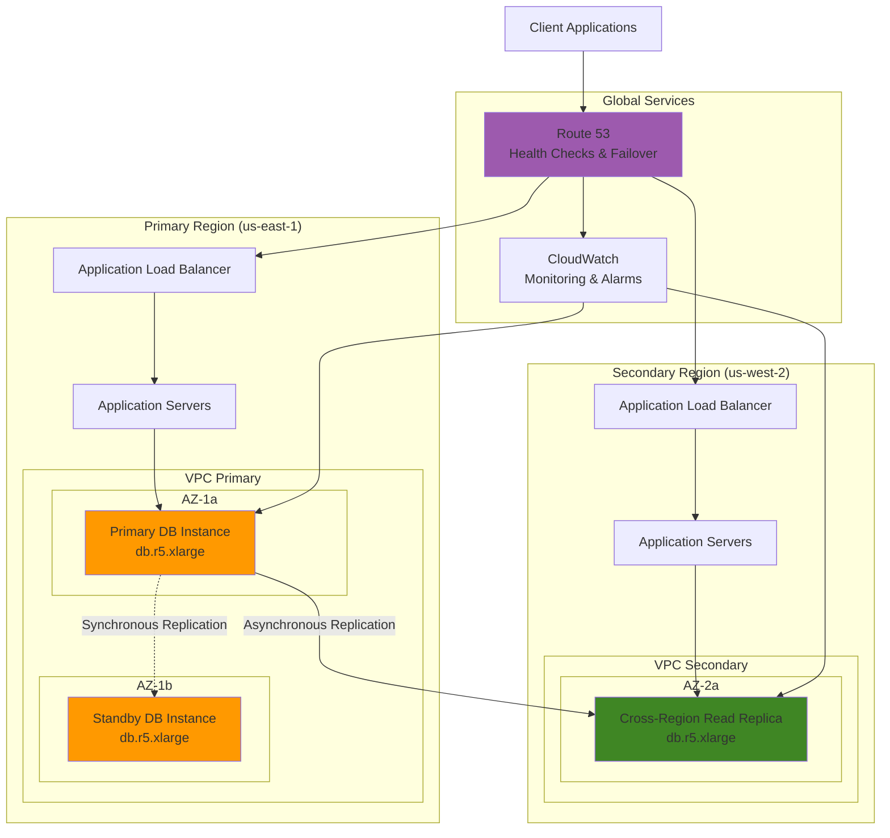

# RDS Multi-Region Failover Strategy


## Problem

Financial services companies need to ensure their customer transaction databases maintain 99.99% availability with zero data loss during both planned maintenance and unexpected failures. A single Multi-AZ deployment provides high availability within one region, but regional disasters, service interruptions, or compliance requirements for geographic data distribution necessitate cross-region disaster recovery capabilities. Traditional approaches often result in complex failover procedures, extended recovery times, and potential data inconsistencies during regional outages.

## Solution

Implement a comprehensive RDS Multi-AZ architecture with automated cross-region read replicas and DNS-based failover using Route 53 health checks. This solution combines synchronous replication within regions (Multi-AZ) with asynchronous cross-region replication, automated monitoring, and intelligent traffic routing to achieve enterprise-grade availability and disaster recovery capabilities.

## Architecture Diagram



## Prerequisites

1. AWS account with RDS, Route 53, and CloudWatch permissions in two regions
2. AWS CLI v2 installed and configured (or AWS CloudShell)
3. Understanding of RDS Multi-AZ concepts and cross-region replication
4. VPC setup in both primary and secondary regions
5. Estimated cost: $800-1,200/month for db.r5.xlarge instances with backup storage

> **Note**: This configuration uses production-grade instance types and will incur significant costs. Consider using smaller instances for testing. See [Amazon RDS Pricing](https://aws.amazon.com/rds/pricing/) for detailed cost calculations.

## Preparation

```bash
# Set environment variables for primary region
export PRIMARY_REGION="us-east-1"
export SECONDARY_REGION="us-west-2" 
export AWS_ACCOUNT_ID=$(aws sts get-caller-identity \
    --query Account --output text)

# Generate unique identifiers
RANDOM_SUFFIX=$(aws secretsmanager get-random-password \
    --exclude-punctuation --exclude-uppercase \
    --password-length 6 --require-each-included-type \
    --output text --query RandomPassword)

export DB_INSTANCE_ID="financial-db-${RANDOM_SUFFIX}"
export DB_REPLICA_ID="financial-db-replica-${RANDOM_SUFFIX}"
export DB_SUBNET_GROUP="financial-subnet-group-${RANDOM_SUFFIX}"
export DB_PARAMETER_GROUP="financial-param-group-${RANDOM_SUFFIX}"
export DB_MASTER_PASSWORD="FinancialDB2024!"

# Create DB subnet groups in both regions
aws rds create-db-subnet-group \
    --region $PRIMARY_REGION \
    --db-subnet-group-name $DB_SUBNET_GROUP \
    --db-subnet-group-description "Financial DB subnet group" \
    --subnet-ids subnet-12345678 subnet-87654321

aws rds create-db-subnet-group \
    --region $SECONDARY_REGION \
    --db-subnet-group-name $DB_SUBNET_GROUP \
    --db-subnet-group-description "Financial DB subnet group" \
    --subnet-ids subnet-abcd1234 subnet-4321dcba

echo "✅ Environment variables and subnet groups configured"
```

## Steps

1. **Create Custom DB Parameter Group for Optimized Performance**:

   Database parameter groups enable fine-tuned control over PostgreSQL engine configuration, providing essential customization for high-availability workloads. Unlike default parameter groups, custom parameter groups allow modification of critical settings like logging levels, checkpoint timing, and connection management that directly impact failover performance and disaster recovery capabilities.

   ```bash
   # Create parameter group for PostgreSQL 15
   aws rds create-db-parameter-group \
       --region $PRIMARY_REGION \
       --db-parameter-group-name $DB_PARAMETER_GROUP \
       --db-parameter-group-family postgres15 \
       --description "Financial DB optimized parameters"
   
   # Configure key parameters for high availability
   aws rds modify-db-parameter-group \
       --region $PRIMARY_REGION \
       --db-parameter-group-name $DB_PARAMETER_GROUP \
       --parameters \
           "ParameterName=log_statement,ParameterValue=all,ApplyMethod=immediate" \
           "ParameterName=log_min_duration_statement,ParameterValue=1000,ApplyMethod=immediate" \
           "ParameterName=checkpoint_completion_target,ParameterValue=0.9,ApplyMethod=immediate"
   
   echo "✅ Parameter group created and configured"
   ```

   The parameter group is now optimized for enterprise workloads with comprehensive logging (enabling full audit trails), performance monitoring (tracking slow queries over 1 second), and optimized checkpoint timing (0.9 target reduces I/O spikes during failover events). These configurations ensure consistent performance during Multi-AZ failovers and provide detailed forensic capabilities for troubleshooting.

2. **Create Primary Multi-AZ RDS Instance**:

   Multi-AZ deployments provide synchronous data replication to a standby instance in a different Availability Zone, ensuring zero data loss during planned maintenance or unexpected failures. This architecture automatically handles failover within 60-120 seconds, maintaining the same endpoint while redirecting traffic to the healthy instance, making it transparent to applications.

   ```bash
   # Create primary Multi-AZ PostgreSQL instance
   aws rds create-db-instance \
       --region $PRIMARY_REGION \
       --db-instance-identifier $DB_INSTANCE_ID \
       --db-instance-class db.r5.xlarge \
       --engine postgres \
       --engine-version 15.4 \
       --master-username dbadmin \
       --master-user-password $DB_MASTER_PASSWORD \
       --allocated-storage 500 \
       --storage-type gp3 \
       --storage-encrypted \
       --multi-az \
       --db-subnet-group-name $DB_SUBNET_GROUP \
       --vpc-security-group-ids sg-financial-db \
       --db-parameter-group-name $DB_PARAMETER_GROUP \
       --backup-retention-period 30 \
       --preferred-backup-window "03:00-04:00" \
       --preferred-maintenance-window "sun:04:00-sun:05:00" \
       --enable-performance-insights \
       --performance-insights-retention-period 7 \
       --monitoring-interval 60 \
       --monitoring-role-arn arn:aws:iam::$AWS_ACCOUNT_ID:role/rds-monitoring-role \
       --deletion-protection
   
   # Wait for instance to be available
   aws rds wait db-instance-available \
       --region $PRIMARY_REGION \
       --db-instance-identifier $DB_INSTANCE_ID
   
   echo "✅ Primary Multi-AZ RDS instance created successfully"
   ```

   The Multi-AZ RDS instance now provides the foundation for enterprise-grade availability with automatic failover capabilities, 30-day backup retention (meeting most compliance requirements), and Performance Insights monitoring. The synchronous replication ensures financial transaction integrity while the automated backup schedule during low-traffic hours minimizes performance impact.

3. **Create Cross-Region Read Replica**:

   Cross-region read replicas extend disaster recovery capabilities beyond single-region Multi-AZ deployments by providing asynchronous replication to a geographically distant region. This addresses regional disasters, regulatory requirements for geographic data distribution, and enables disaster recovery with Recovery Time Objectives (RTO) measured in minutes rather than hours.

   ```bash
   # Create read replica in secondary region
   aws rds create-db-instance-read-replica \
       --region $SECONDARY_REGION \
       --db-instance-identifier $DB_REPLICA_ID \
       --source-db-instance-identifier \
           arn:aws:rds:$PRIMARY_REGION:$AWS_ACCOUNT_ID:db:$DB_INSTANCE_ID \
       --db-instance-class db.r5.xlarge \
       --storage-encrypted \
       --db-subnet-group-name $DB_SUBNET_GROUP \
       --vpc-security-group-ids sg-financial-db \
       --enable-performance-insights \
       --performance-insights-retention-period 7 \
       --monitoring-interval 60 \
       --monitoring-role-arn arn:aws:iam::$AWS_ACCOUNT_ID:role/rds-monitoring-role \
       --deletion-protection
   
   # Wait for replica to be available
   aws rds wait db-instance-available \
       --region $SECONDARY_REGION \
       --db-instance-identifier $DB_REPLICA_ID
   
   echo "✅ Cross-region read replica created successfully"
   ```

   The cross-region read replica establishes the disaster recovery layer of the architecture, typically maintaining replication lag under 5 minutes for most workloads. This replica can be promoted to a standalone database during regional emergencies, providing business continuity with minimal data loss and supporting regulatory compliance for geographic data residence requirements.

4. **Configure CloudWatch Alarms for Database Health**:

   Proactive monitoring through CloudWatch alarms enables early detection of performance degradation and potential failures before they impact applications. These alarms provide automated alerting for connection saturation and replication lag, allowing operations teams to address issues during business hours rather than during emergency incidents.

   ```bash
   # Create alarm for primary database connection failures
   aws cloudwatch put-metric-alarm \
       --region $PRIMARY_REGION \
       --alarm-name "${DB_INSTANCE_ID}-connection-failures" \
       --alarm-description "Alert on database connection failures" \
       --metric-name DatabaseConnections \
       --namespace AWS/RDS \
       --statistic Maximum \
       --period 300 \
       --threshold 80 \
       --comparison-operator GreaterThanThreshold \
       --evaluation-periods 2 \
       --alarm-actions arn:aws:sns:$PRIMARY_REGION:$AWS_ACCOUNT_ID:db-alerts \
       --dimensions Name=DBInstanceIdentifier,Value=$DB_INSTANCE_ID
   
   # Create alarm for replica lag
   aws cloudwatch put-metric-alarm \
       --region $SECONDARY_REGION \
       --alarm-name "${DB_REPLICA_ID}-replica-lag" \
       --alarm-description "Alert on high replica lag" \
       --metric-name ReplicaLag \
       --namespace AWS/RDS \
       --statistic Average \
       --period 300 \
       --threshold 300 \
       --comparison-operator GreaterThanThreshold \
       --evaluation-periods 2 \
       --alarm-actions arn:aws:sns:$SECONDARY_REGION:$AWS_ACCOUNT_ID:db-alerts \
       --dimensions Name=DBInstanceIdentifier,Value=$DB_REPLICA_ID
   
   echo "✅ CloudWatch alarms configured"
   ```

   The monitoring infrastructure now provides automated alerting for connection exhaustion (threshold: 80 connections) and excessive replication lag (threshold: 5 minutes). These thresholds balance sensitivity with false-positive prevention, ensuring teams receive actionable alerts that warrant immediate attention while avoiding alarm fatigue.

5. **Set Up Route 53 Health Checks and DNS Failover**:

   Route 53 DNS failover provides automated traffic redirection during regional disasters, reducing recovery time from hours (manual intervention) to minutes (DNS propagation). This approach maintains a consistent database endpoint for applications while intelligently routing traffic between healthy database instances across regions based on real-time health assessments.

   ```bash
   # Get database endpoints
   PRIMARY_ENDPOINT=$(aws rds describe-db-instances \
       --region $PRIMARY_REGION \
       --db-instance-identifier $DB_INSTANCE_ID \
       --query 'DBInstances[0].Endpoint.Address' \
       --output text)
   
   REPLICA_ENDPOINT=$(aws rds describe-db-instances \
       --region $SECONDARY_REGION \
       --db-instance-identifier $DB_REPLICA_ID \
       --query 'DBInstances[0].Endpoint.Address' \
       --output text)
   
   # Create health check for primary database
   PRIMARY_HEALTH_CHECK=$(aws route53 create-health-check \
       --caller-reference "primary-db-$(date +%s)" \
       --health-check-config \
           Type=CALCULATED,ChildHealthChecks=["health-check-id-1","health-check-id-2"],HealthThreshold=1 \
       --query 'HealthCheck.Id' --output text)
   
   # Create hosted zone for database DNS
   HOSTED_ZONE_ID=$(aws route53 create-hosted-zone \
       --name "financial-db.internal" \
       --caller-reference "db-zone-$(date +%s)" \
       --query 'HostedZone.Id' --output text)
   
   # Create primary DNS record with failover
   aws route53 change-resource-record-sets \
       --hosted-zone-id $HOSTED_ZONE_ID \
       --change-batch '{
         "Changes": [{
           "Action": "CREATE",
           "ResourceRecordSet": {
             "Name": "db.financial-db.internal",
             "Type": "CNAME",
             "SetIdentifier": "primary",
             "Failover": "PRIMARY",
             "TTL": 60,
             "ResourceRecords": [{"Value": "'$PRIMARY_ENDPOINT'"}],
             "HealthCheckId": "'$PRIMARY_HEALTH_CHECK'"
           }
         }]
       }'
   
   # Create secondary DNS record with failover
   aws route53 change-resource-record-sets \
       --hosted-zone-id $HOSTED_ZONE_ID \
       --change-batch '{
         "Changes": [{
           "Action": "CREATE",
           "ResourceRecordSet": {
             "Name": "db.financial-db.internal",
             "Type": "CNAME",
             "SetIdentifier": "secondary",
             "Failover": "SECONDARY",
             "TTL": 60,
             "ResourceRecords": [{"Value": "'$REPLICA_ENDPOINT'"}]
           }
         }]
       }'
   
   echo "✅ Route 53 health checks and DNS failover configured"
   ```

   The DNS failover configuration establishes automatic traffic management with 60-second TTL for rapid failover response. Applications connecting to db.financial-db.internal will automatically receive the healthy database endpoint, enabling transparent disaster recovery without application code changes or manual DNS updates.

6. **Configure Automated Backup Strategy**:

   Cross-region backup replication ensures point-in-time recovery capabilities survive regional disasters, meeting regulatory compliance requirements for geographic backup distribution. This strategy provides independent recovery options even when primary region resources are completely unavailable, supporting business continuity and regulatory audit requirements.

   ```bash
   # Create manual snapshot for baseline
   aws rds create-db-snapshot \
       --region $PRIMARY_REGION \
       --db-instance-identifier $DB_INSTANCE_ID \
       --db-snapshot-identifier "${DB_INSTANCE_ID}-baseline-$(date +%Y%m%d)"
   
   # Configure automated backup replication to secondary region
   aws rds start-db-instance-automated-backups-replication \
       --region $SECONDARY_REGION \
       --source-db-instance-arn \
           arn:aws:rds:$PRIMARY_REGION:$AWS_ACCOUNT_ID:db:$DB_INSTANCE_ID \
       --backup-retention-period 7
   
   echo "✅ Backup strategy configured with cross-region replication"
   ```

   The backup replication establishes a comprehensive recovery framework with both manual baseline snapshots and automated cross-region backup copies. This dual-layer approach ensures recovery capabilities from any point in time while maintaining backup availability across geographic regions, essential for financial services compliance and business continuity planning.

7. **Test Failover Capabilities**:

   Regular failover testing validates the disaster recovery architecture under controlled conditions, ensuring procedures work correctly when emergency situations arise. Testing failover capabilities during planned maintenance windows builds confidence in the system's resilience and identifies potential issues before they impact production operations.

   ```bash
   # Simulate primary database maintenance (reboot with failover)
   echo "Testing Multi-AZ failover..."
   aws rds reboot-db-instance \
       --region $PRIMARY_REGION \
       --db-instance-identifier $DB_INSTANCE_ID \
       --force-failover
   
   # Monitor failover completion
   aws rds wait db-instance-available \
       --region $PRIMARY_REGION \
       --db-instance-identifier $DB_INSTANCE_ID
   
   echo "✅ Multi-AZ failover test completed successfully"
   ```

   The failover test validates the Multi-AZ automatic failover mechanism, typically completing within 60-120 seconds while maintaining the same database endpoint. This verification confirms that applications will experience minimal downtime during maintenance windows and unexpected failures, providing confidence in the high-availability architecture.

8. **Set Up Cross-Region Promotion Capabilities**:

   Automated promotion capabilities enable rapid disaster recovery by establishing the infrastructure needed to promote read replicas to standalone databases during regional emergencies. This preparation reduces recovery time objectives by eliminating manual permission setup and role configuration during high-stress incident response scenarios.

   ```bash
   # Create IAM role for cross-region promotion automation
   cat > promotion-trust-policy.json << EOF
   {
     "Version": "2012-10-17",
     "Statement": [
       {
         "Effect": "Allow",
         "Principal": {"Service": "lambda.amazonaws.com"},
         "Action": "sts:AssumeRole"
       }
     ]
   }
   EOF
   
   aws iam create-role \
       --role-name rds-promotion-role \
       --assume-role-policy-document file://promotion-trust-policy.json
   
   # Attach necessary permissions for promotion
   aws iam attach-role-policy \
       --role-name rds-promotion-role \
       --policy-arn arn:aws:iam::aws:policy/AmazonRDSFullAccess
   
   aws iam attach-role-policy \
       --role-name rds-promotion-role \
       --policy-arn arn:aws:iam::aws:policy/service-role/AWSLambdaBasicExecutionRole
   
   echo "✅ Cross-region promotion capabilities configured"
   ```

   The promotion infrastructure provides the foundation for automated disaster recovery workflows. The IAM role enables Lambda functions to promote read replicas and modify DNS records during regional outages, transforming manual disaster recovery procedures into automated responses that can execute within minutes of detecting regional failures.

## Validation & Testing

1. **Verify Multi-AZ Configuration**:

   ```bash
   # Check Multi-AZ status and availability zones
   aws rds describe-db-instances \
       --region $PRIMARY_REGION \
       --db-instance-identifier $DB_INSTANCE_ID \
       --query 'DBInstances[0].[MultiAZ,AvailabilityZone,SecondaryAvailabilityZone]' \
       --output table
   ```

   Expected output: Multi-AZ should be `true` with different AZs listed.

2. **Test Cross-Region Replication**:

   ```bash
   # Check replica lag
   aws cloudwatch get-metric-statistics \
       --region $SECONDARY_REGION \
       --namespace AWS/RDS \
       --metric-name ReplicaLag \
       --dimensions Name=DBInstanceIdentifier,Value=$DB_REPLICA_ID \
       --start-time $(date -u -d '1 hour ago' +%Y-%m-%dT%H:%M:%S) \
       --end-time $(date -u +%Y-%m-%dT%H:%M:%S) \
       --period 300 \
       --statistics Average
   ```

3. **Test DNS Failover Resolution**:

   ```bash
   # Test DNS resolution
   nslookup db.financial-db.internal 8.8.8.8
   
   # Test with dig for more details
   dig @8.8.8.8 db.financial-db.internal CNAME
   ```

4. **Verify Backup Replication**:

   ```bash
   # Check automated backups in secondary region
   aws rds describe-db-instance-automated-backups \
       --region $SECONDARY_REGION \
       --query 'DBInstanceAutomatedBackups[0].[DBInstanceIdentifier,Status,Region]' \
       --output table
   ```

## Cleanup

1. **Stop automated backup replication**:

   ```bash
   aws rds stop-db-instance-automated-backups-replication \
       --region $SECONDARY_REGION \
       --source-db-instance-arn \
           arn:aws:rds:$PRIMARY_REGION:$AWS_ACCOUNT_ID:db:$DB_INSTANCE_ID
   
   echo "✅ Stopped automated backup replication"
   ```

2. **Delete cross-region read replica**:

   ```bash
   aws rds delete-db-instance \
       --region $SECONDARY_REGION \
       --db-instance-identifier $DB_REPLICA_ID \
       --skip-final-snapshot
   
   echo "✅ Deleted cross-region read replica"
   ```

3. **Delete Route 53 resources**:

   ```bash
   # Delete DNS records
   aws route53 change-resource-record-sets \
       --hosted-zone-id $HOSTED_ZONE_ID \
       --change-batch '{
         "Changes": [{
           "Action": "DELETE",
           "ResourceRecordSet": {
             "Name": "db.financial-db.internal",
             "Type": "CNAME",
             "SetIdentifier": "primary",
             "Failover": "PRIMARY",
             "TTL": 60,
             "ResourceRecords": [{"Value": "'$PRIMARY_ENDPOINT'"}]
           }
         }]
       }'
   
   # Delete hosted zone
   aws route53 delete-hosted-zone --id $HOSTED_ZONE_ID
   
   echo "✅ Cleaned up Route 53 resources"
   ```

4. **Delete primary database**:

   ```bash
   aws rds delete-db-instance \
       --region $PRIMARY_REGION \
       --db-instance-identifier $DB_INSTANCE_ID \
       --final-db-snapshot-identifier "${DB_INSTANCE_ID}-final-snapshot"
   
   echo "✅ Deleted primary database with final snapshot"
   ```

5. **Clean up supporting resources**:

   ```bash
   # Delete parameter group
   aws rds delete-db-parameter-group \
       --region $PRIMARY_REGION \
       --db-parameter-group-name $DB_PARAMETER_GROUP
   
   # Delete subnet groups
   aws rds delete-db-subnet-group \
       --region $PRIMARY_REGION \
       --db-subnet-group-name $DB_SUBNET_GROUP
   
   aws rds delete-db-subnet-group \
       --region $SECONDARY_REGION \
       --db-subnet-group-name $DB_SUBNET_GROUP
   
   # Delete IAM role
   aws iam detach-role-policy \
       --role-name rds-promotion-role \
       --policy-arn arn:aws:iam::aws:policy/AmazonRDSFullAccess
   
   aws iam delete-role --role-name rds-promotion-role
   
   echo "✅ All supporting resources cleaned up"
   ```

## Discussion

This advanced RDS Multi-AZ architecture with cross-region failover provides enterprise-grade database availability through multiple layers of redundancy. The synchronous Multi-AZ replication within the primary region ensures zero data loss during local failures, while the asynchronous cross-region replica provides disaster recovery capabilities for regional outages. This design aligns with the [AWS Well-Architected Framework](https://docs.aws.amazon.com/wellarchitected/latest/reliability-pillar/rel_planning_for_recovery_disaster_recovery.html) reliability pillar for disaster recovery planning.

The Route 53 health check integration enables automated DNS failover, reducing the Recovery Time Objective (RTO) from manual intervention times (potentially hours) to DNS propagation times (typically 1-2 minutes). The CloudWatch monitoring provides proactive alerting for database health issues, enabling teams to address problems before they impact applications.

The cross-region backup replication ensures point-in-time recovery capabilities are maintained even during regional disasters. This is particularly crucial for financial services applications where regulatory requirements mandate specific backup retention periods and geographic distribution of backup data. The [RDS Multi-AZ deployment architecture](https://docs.aws.amazon.com/AmazonRDS/latest/UserGuide/Concepts.MultiAZSingleStandby.html) provides additional technical details on synchronous replication mechanisms.

Performance Insights and enhanced monitoring provide deep visibility into database performance across both regions, enabling optimization and troubleshooting. The parameter group optimizations ensure the database is tuned for high-availability workloads with appropriate logging and checkpoint configurations.

> **Tip**: Implement application-level connection pooling and retry logic to handle brief connectivity interruptions during Multi-AZ failovers. See [Amazon RDS Best Practices](https://docs.aws.amazon.com/AmazonRDS/latest/UserGuide/CHAP_BestPractices.html) for detailed guidance on application resilience patterns.

## Challenge

Extend this solution by implementing these advanced capabilities:

1. **Automated Promotion Pipeline**: Create a Lambda function that automatically promotes the read replica to primary during regional disasters, triggered by CloudWatch alarms and Route 53 health check failures.

2. **Blue-Green Deployments**: Implement RDS Blue-Green deployment capabilities for zero-downtime database upgrades and schema changes across the multi-region setup.

3. **Application-Aware Monitoring**: Integrate custom CloudWatch metrics from your applications to create more sophisticated health checks that verify end-to-end connectivity and query performance.

4. **Cross-Region VPC Peering**: Set up VPC peering between regions to enable private connectivity for replication traffic, reducing costs and improving security.

5. **Automated Backup Testing**: Create a Lambda function that regularly tests backup restoration in an isolated environment to verify backup integrity and restoration procedures.

## Infrastructure Code

*Infrastructure code will be generated after recipe approval.*