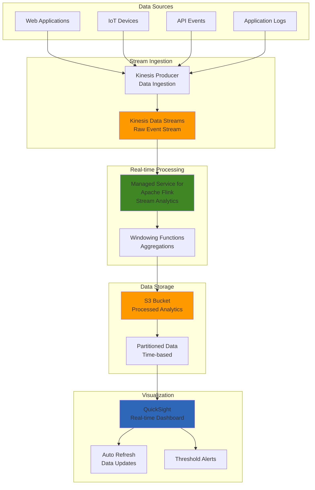

# Building Real-time Analytics Dashboards with Kinesis Analytics and QuickSight

## Problem

Your organization generates continuous streams of data from web applications, IoT devices, or business systems that need real-time analysis and visualization. Traditional batch processing creates delays in insights, while building custom real-time analytics infrastructure requires significant engineering effort and ongoing maintenance. You need a solution that can process streaming data in real-time, perform complex analytics operations, and automatically update dashboards to provide immediate business insights without managing servers or complex infrastructure.

## Solution

Implement a real-time analytics dashboard using Amazon Kinesis Data Streams for data ingestion, Amazon Managed Service for Apache Flink for stream processing and analytics, Amazon S3 for processed data storage, and Amazon QuickSight for interactive dashboard visualization. This architecture processes streaming data continuously, performs real-time aggregations and transformations, stores results for historical analysis, and automatically refreshes dashboards to provide up-to-the-minute business insights. The solution scales automatically with data volume and provides sub-second latency for critical business metrics.

## Architecture Diagram



## Prerequisites

1. AWS account with permissions for Kinesis, Managed Service for Apache Flink, S3, and QuickSight
2. AWS CLI v2 installed and configured with appropriate credentials
3. Basic understanding of streaming data concepts and SQL
4. Sample streaming data source or ability to generate test data
5. Estimated cost: $50-100/month for moderate data volumes (1GB/day processing)

> **Note**: Amazon Managed Service for Apache Flink was previously known as Amazon Kinesis Data Analytics for Apache Flink and provides more advanced capabilities than the discontinued SQL-based service.

## Preparation

```bash
# Set environment variables
export AWS_REGION=$(aws configure get region)
export AWS_ACCOUNT_ID=$(aws sts get-caller-identity \
    --query Account --output text)

# Generate unique identifiers for resources
RANDOM_SUFFIX=$(aws secretsmanager get-random-password \
    --exclude-punctuation --exclude-uppercase \
    --password-length 6 --require-each-included-type \
    --output text --query RandomPassword)

export STREAM_NAME="analytics-stream-${RANDOM_SUFFIX}"
export FLINK_APP_NAME="analytics-app-${RANDOM_SUFFIX}"
export S3_BUCKET_NAME="analytics-results-${RANDOM_SUFFIX}"
export IAM_ROLE_NAME="FlinkAnalyticsRole-${RANDOM_SUFFIX}"

# Create S3 bucket for processed data
aws s3 mb s3://${S3_BUCKET_NAME} --region ${AWS_REGION}

# Create S3 bucket for Flink application code
export FLINK_CODE_BUCKET="flink-code-${RANDOM_SUFFIX}"
aws s3 mb s3://${FLINK_CODE_BUCKET} --region ${AWS_REGION}

echo "✅ Environment prepared with suffix: ${RANDOM_SUFFIX}"
```

## Steps

1. **Create Kinesis Data Stream for ingestion**:

   ```bash
   # Create Kinesis Data Stream with multiple shards for scalability
   # Multiple shards enable parallel processing and higher throughput
   aws kinesis create-stream \
       --stream-name ${STREAM_NAME} \
       --shard-count 2 \
       --region ${AWS_REGION}
   
   # Wait for stream to become active before proceeding
   # This ensures the stream is ready to receive data
   aws kinesis wait stream-exists \
       --stream-name ${STREAM_NAME} \
       --region ${AWS_REGION}
   
   # Retrieve stream ARN for IAM policy configuration
   STREAM_ARN=$(aws kinesis describe-stream \
       --stream-name ${STREAM_NAME} \
       --query 'StreamDescription.StreamARN' \
       --output text)
   
   echo "✅ Created Kinesis Data Stream: ${STREAM_NAME}"
   echo "Stream ARN: ${STREAM_ARN}"
   ```

   > **Note**: The number of shards determines your stream's data throughput capacity. Each shard can ingest 1,000 records per second or 1 MB per second. Learn more about [Kinesis Data Streams capacity](https://docs.aws.amazon.com/kinesis/latest/dev/key-concepts.html#shard).

2. **Create IAM role for Managed Service for Apache Flink**:

   ```bash
   # Create trust policy allowing Flink service to assume this role
   # This enables the Flink application to access AWS resources securely
   cat > flink-trust-policy.json << EOF
   {
       "Version": "2012-10-17",
       "Statement": [
           {
               "Effect": "Allow",
               "Principal": {
                   "Service": "kinesisanalytics.amazonaws.com"
               },
               "Action": "sts:AssumeRole"
           }
       ]
   }
   EOF
   
   # Create the IAM role for Flink execution
   aws iam create-role \
       --role-name ${IAM_ROLE_NAME} \
       --assume-role-policy-document file://flink-trust-policy.json
   
   # Define comprehensive permissions for stream processing operations
   # These permissions enable reading from Kinesis, writing to S3, and logging
   cat > flink-permissions-policy.json << EOF
   {
       "Version": "2012-10-17",
       "Statement": [
           {
               "Effect": "Allow",
               "Action": [
                   "kinesis:DescribeStream",
                   "kinesis:GetShardIterator",
                   "kinesis:GetRecords",
                   "kinesis:ListShards"
               ],
               "Resource": "${STREAM_ARN}"
           },
           {
               "Effect": "Allow",
               "Action": [
                   "s3:GetObject",
                   "s3:PutObject",
                   "s3:DeleteObject"
               ],
               "Resource": [
                   "arn:aws:s3:::${S3_BUCKET_NAME}/*",
                   "arn:aws:s3:::${FLINK_CODE_BUCKET}/*"
               ]
           },
           {
               "Effect": "Allow",
               "Action": [
                   "s3:ListBucket"
               ],
               "Resource": [
                   "arn:aws:s3:::${S3_BUCKET_NAME}",
                   "arn:aws:s3:::${FLINK_CODE_BUCKET}"
               ]
           },
           {
               "Effect": "Allow",
               "Action": [
                   "logs:CreateLogGroup",
                   "logs:CreateLogStream",
                   "logs:PutLogEvents"
               ],
               "Resource": "*"
           }
       ]
   }
   EOF
   
   # Attach the permissions policy to the role
   aws iam put-role-policy \
       --role-name ${IAM_ROLE_NAME} \
       --policy-name FlinkAnalyticsPolicy \
       --policy-document file://flink-permissions-policy.json
   
   # Retrieve role ARN for Flink application configuration
   ROLE_ARN=$(aws iam get-role \
       --role-name ${IAM_ROLE_NAME} \
       --query 'Role.Arn' --output text)
   
   echo "✅ Created IAM role: ${IAM_ROLE_NAME}"
   ```

3. **Create sample Flink application for stream processing**:

   Apache Flink provides distributed stream processing capabilities with exactly-once processing guarantees and low-latency event handling. Building a custom Flink application enables complex analytics operations like windowing, aggregations, and pattern detection on streaming data. This step creates the foundation for real-time analytics by establishing the application structure and dependencies needed for Kinesis integration and S3 output.

   ```bash
   # Create directory structure for the Java Flink application
   # This application will perform real-time analytics on the streaming data
   mkdir -p flink-analytics-app/src/main/java/com/example
   
   # Create Maven project configuration with necessary dependencies
   cat > flink-analytics-app/pom.xml << 'EOF'
   <?xml version="1.0" encoding="UTF-8"?>
   <project xmlns="http://maven.apache.org/POM/4.0.0"
            xmlns:xsi="http://www.w3.org/2001/XMLSchema-instance"
            xsi:schemaLocation="http://maven.apache.org/POM/4.0.0 
            http://maven.apache.org/xsd/maven-4.0.0.xsd">
       <modelVersion>4.0.0</modelVersion>
       <groupId>com.example</groupId>
       <artifactId>flink-analytics-app</artifactId>
       <version>1.0</version>
       <packaging>jar</packaging>
       
       <properties>
           <maven.compiler.source>11</maven.compiler.source>
           <maven.compiler.target>11</maven.compiler.target>
           <flink.version>1.18.0</flink.version>
           <kda.version>2.0</kda.version>
       </properties>
       
       <dependencies>
           <dependency>
               <groupId>com.amazonaws</groupId>
               <artifactId>aws-kinesisanalytics-runtime</artifactId>
               <version>${kda.version}</version>
           </dependency>
           <dependency>
               <groupId>org.apache.flink</groupId>
               <artifactId>flink-streaming-java</artifactId>
               <version>${flink.version}</version>
           </dependency>
           <dependency>
               <groupId>org.apache.flink</groupId>
               <artifactId>flink-connector-kinesis</artifactId>
               <version>4.2.0-1.18</version>
           </dependency>
           <dependency>
               <groupId>org.apache.flink</groupId>
               <artifactId>flink-connector-files</artifactId>
               <version>${flink.version}</version>
           </dependency>
           <dependency>
               <groupId>org.apache.flink</groupId>
               <artifactId>flink-json</artifactId>
               <version>${flink.version}</version>
           </dependency>
       </dependencies>
       
       <build>
           <plugins>
               <plugin>
                   <groupId>org.apache.maven.plugins</groupId>
                   <artifactId>maven-shade-plugin</artifactId>
                   <version>3.2.4</version>
                   <executions>
                       <execution>
                           <phase>package</phase>
                           <goals>
                               <goal>shade</goal>
                           </goals>
                       </execution>
                   </executions>
               </plugin>
           </plugins>
       </build>
   </project>
   EOF
   
   echo "✅ Created Flink application structure"
   ```

   The Maven project structure is now established with all necessary dependencies for Kinesis connectivity and S3 output. This configuration enables the Flink application to consume streaming data, perform windowing operations, and write results to durable storage for dashboard consumption.

4. **Create the main Flink application class**:

   The core Flink application implements streaming analytics using windowing functions and aggregation operations. Windowing enables real-time metrics by grouping events into time-based buckets for processing. This approach provides the foundation for dashboard visualizations by transforming continuous streams into discrete, measurable analytics that can drive business decisions and operational insights.

   ```bash
   # Create the Java application class that implements the streaming analytics logic
   # This class handles windowing operations and event aggregation
   cat > flink-analytics-app/src/main/java/com/example/StreamingAnalyticsJob.java << 'EOF'
   package com.example;
   
   import com.amazonaws.services.kinesisanalytics.runtime.KinesisAnalyticsRuntime;
   import org.apache.flink.api.common.serialization.SimpleStringSchema;
   import org.apache.flink.api.common.typeinfo.Types;
   import org.apache.flink.api.java.tuple.Tuple2;
   import org.apache.flink.connector.file.sink.FileSink;
   import org.apache.flink.connector.kinesis.sink.KinesisStreamsSink;
   import org.apache.flink.core.fs.Path;
   import org.apache.flink.formats.json.JsonRowDataSerializationSchema;
   import org.apache.flink.streaming.api.datastream.DataStream;
   import org.apache.flink.streaming.api.environment.StreamExecutionEnvironment;
   import org.apache.flink.streaming.api.windowing.assigners.TumblingProcessingTimeWindows;
   import org.apache.flink.streaming.api.windowing.time.Time;
   import org.apache.flink.streaming.connectors.kinesis.FlinkKinesisConsumer;
   import org.apache.flink.streaming.connectors.kinesis.config.ConsumerConfigConstants;
   
   import java.util.Map;
   import java.util.Properties;
   
   public class StreamingAnalyticsJob {
       
       public static void main(String[] args) throws Exception {
           final StreamExecutionEnvironment env = StreamExecutionEnvironment.getExecutionEnvironment();
           
           // Get application properties from Kinesis Analytics runtime
           Map<String, Properties> applicationProperties = KinesisAnalyticsRuntime.getApplicationProperties();
           Properties inputProperties = applicationProperties.get("kinesis.analytics.flink.run.options");
           
           String inputStreamName = inputProperties.getProperty("input.stream.name");
           String region = inputProperties.getProperty("aws.region");
           String s3Path = inputProperties.getProperty("s3.path");
           
           // Configure Kinesis consumer with appropriate settings
           Properties kinesisConsumerConfig = new Properties();
           kinesisConsumerConfig.setProperty(ConsumerConfigConstants.AWS_REGION, region);
           kinesisConsumerConfig.setProperty(ConsumerConfigConstants.STREAM_INITIAL_POSITION, "LATEST");
           
           // Create Kinesis source for reading streaming data
           FlinkKinesisConsumer<String> kinesisSource = new FlinkKinesisConsumer<>(
               inputStreamName,
               new SimpleStringSchema(),
               kinesisConsumerConfig
           );
           
           DataStream<String> inputStream = env.addSource(kinesisSource);
           
           // Process stream: count events per minute using tumbling windows
           // This aggregation provides real-time metrics for dashboard visualization
           DataStream<Tuple2<String, Integer>> analytics = inputStream
               .map(value -> new Tuple2<>("event_count", 1))
               .returns(Types.TUPLE(Types.STRING, Types.INT))
               .keyBy(value -> value.f0)
               .window(TumblingProcessingTimeWindows.of(Time.minutes(1)))
               .sum(1);
           
           // Write aggregated results to S3 for QuickSight consumption
           analytics
               .map(tuple -> String.format("{\"timestamp\":\"%d\",\"metric\":\"%s\",\"value\":%d}", 
                   System.currentTimeMillis(), tuple.f0, tuple.f1))
               .sinkTo(FileSink.forRowFormat(new Path(s3Path), new SimpleStringSchema())
                   .withRollingPolicy(
                       org.apache.flink.connector.file.sink.compaction.FileCompactStrategy
                           .Builder.newBuilder()
                           .enableCompactionOnCheckpoint(5)
                           .build())
                   .build());
           
           env.execute("Real-time Analytics Job");
       }
   }
   EOF
   
   echo "✅ Created Flink application code"
   ```

   The Flink application now contains the complete streaming analytics logic with tumbling windows for one-minute aggregations. This implementation ensures consistent, non-overlapping time periods for accurate metrics while providing exactly-once processing guarantees. The application is ready for compilation and deployment to process real-time data streams and generate dashboard-ready analytics.

5. **Build and upload Flink application**:

   ```bash
   # Navigate to the application directory for building
   cd flink-analytics-app
   
   # Install Maven if not already available
   # Maven is required to build the Java Flink application
   if ! command -v mvn &> /dev/null; then
       echo "Installing Maven..."
       # For Amazon Linux/CentOS
       sudo yum install -y maven || \
       # For Ubuntu/Debian
       sudo apt-get update && sudo apt-get install -y maven || \
       # For macOS
       brew install maven
   fi
   
   # Build the JAR file containing the Flink application
   mvn clean package -q
   
   # Upload the compiled application to S3 for deployment
   aws s3 cp target/flink-analytics-app-1.0.jar \
       s3://${FLINK_CODE_BUCKET}/flink-analytics-app-1.0.jar
   
   cd ..
   
   echo "✅ Built and uploaded Flink application"
   ```

   > **Warning**: Ensure Maven is properly installed and configured with internet access to download dependencies. The build process may take several minutes for the first run due to dependency downloads.

6. **Create Managed Service for Apache Flink application**:

   ```bash
   # Create comprehensive application configuration for the Flink service
   # This configuration defines runtime environment, code location, and parameters
   cat > flink-app-config.json << EOF
   {
       "ApplicationName": "${FLINK_APP_NAME}",
       "ApplicationDescription": "Real-time analytics application",
       "RuntimeEnvironment": "FLINK-1_18",
       "ServiceExecutionRole": "${ROLE_ARN}",
       "ApplicationConfiguration": {
           "ApplicationCodeConfiguration": {
               "CodeContent": {
                   "S3ContentLocation": {
                       "BucketARN": "arn:aws:s3:::${FLINK_CODE_BUCKET}",
                       "FileKey": "flink-analytics-app-1.0.jar"
                   }
               },
               "CodeContentType": "ZIPFILE"
           },
           "EnvironmentProperties": {
               "PropertyGroups": [
                   {
                       "PropertyGroupId": "kinesis.analytics.flink.run.options",
                       "PropertyMap": {
                           "input.stream.name": "${STREAM_NAME}",
                           "aws.region": "${AWS_REGION}",
                           "s3.path": "s3://${S3_BUCKET_NAME}/analytics-results/"
                       }
                   }
               ]
           },
           "FlinkApplicationConfiguration": {
               "CheckpointConfiguration": {
                   "ConfigurationType": "DEFAULT"
               },
               "MonitoringConfiguration": {
                   "ConfigurationType": "DEFAULT",
                   "LogLevel": "INFO",
                   "MetricsLevel": "APPLICATION"
               },
               "ParallelismConfiguration": {
                   "ConfigurationType": "DEFAULT",
                   "Parallelism": 1,
                   "ParallelismPerKPU": 1,
                   "AutoScalingEnabled": true
               }
           }
       }
   }
   EOF
   
   # Create the Flink application in AWS
   aws kinesisanalyticsv2 create-application \
       --cli-input-json file://flink-app-config.json
   
   echo "✅ Created Managed Service for Apache Flink application: ${FLINK_APP_NAME}"
   ```

7. **Start the Flink application**:

   ```bash
   # Start the Flink application to begin processing streaming data
   # The application will continuously process data from the Kinesis stream
   aws kinesisanalyticsv2 start-application \
       --application-name ${FLINK_APP_NAME} \
       --run-configuration '{
           "FlinkRunConfiguration": {
               "AllowNonRestoredState": true
           }
       }'
   
   # Allow time for the application to initialize and start processing
   echo "Waiting for application to start..."
   sleep 30
   
   # Verify the application is running successfully
   aws kinesisanalyticsv2 describe-application \
       --application-name ${FLINK_APP_NAME} \
       --query 'ApplicationDetail.ApplicationStatus' \
       --output text
   
   echo "✅ Started Flink application"
   ```

8. **Generate sample data for testing**:

   Testing streaming analytics requires realistic data that simulates production workloads with varied event types and timing patterns. This step creates synthetic data representing common business events like user interactions, purchases, and system events. The data generator enables validation of the entire pipeline from ingestion through processing to visualization, ensuring the analytics dashboard accurately reflects real-time metrics.

   ```bash
   # Create a Python script to generate realistic streaming data
   # This simulates various types of user interactions and events
   cat > generate_sample_data.py << 'EOF'
   import json
   import time
   import random
   import boto3
   from datetime import datetime
   
   def generate_sample_events():
       kinesis = boto3.client('kinesis')
       stream_name = os.environ['STREAM_NAME']
       
       event_types = ['page_view', 'button_click', 'form_submit', 'purchase']
       
       for i in range(100):
           event = {
               'timestamp': datetime.now().isoformat(),
               'event_type': random.choice(event_types),
               'user_id': f'user_{random.randint(1, 1000)}',
               'value': random.randint(1, 100)
           }
           
           kinesis.put_record(
               StreamName=stream_name,
               Data=json.dumps(event),
               PartitionKey=event['user_id']
           )
           
           if i %10 == 0:
               print(f"Sent {i+1} events")
           
           time.sleep(0.1)
   
   if __name__ == '__main__':
       import os
       generate_sample_events()
   EOF
   
   # Execute the data generator to populate the stream
   python3 generate_sample_data.py
   
   echo "✅ Generated sample streaming data"
   ```

   The data generator has successfully populated the Kinesis stream with realistic events that simulate production traffic patterns. This test data flows through the Flink application for processing and aggregation, enabling validation of windowing operations and verification that processed results appear correctly in S3 for QuickSight consumption.

9. **Set up QuickSight data source and dashboard**:

   Amazon QuickSight provides business intelligence capabilities with automatic refresh features for real-time dashboards. By connecting QuickSight to the S3 bucket containing processed analytics data, you create interactive visualizations that update as new data arrives. The manifest file tells QuickSight exactly where to find the processed data and how to interpret the JSON format, enabling automatic dataset updates and real-time dashboard refresh capabilities.

   ```bash
   # Provide instructions for QuickSight setup
   # QuickSight configuration requires manual steps in the AWS Console
   
   echo "Setting up QuickSight data source..."
   echo "Please complete the following steps in the AWS Console:"
   echo "1. Go to QuickSight console"
   echo "2. Create a new data source pointing to S3 bucket: ${S3_BUCKET_NAME}"
   echo "3. Create a dataset from the analytics-results/ folder"
   echo "4. Create a dashboard with real-time refresh enabled"
   
   # Create a manifest file for QuickSight S3 data source configuration
   # This file tells QuickSight where to find the processed analytics data
   cat > quicksight-manifest.json << EOF
   {
       "fileLocations": [
           {
               "URIPrefixes": [
                   "s3://${S3_BUCKET_NAME}/analytics-results/"
               ]
           }
       ],
       "globalUploadSettings": {
           "format": "JSON"
       }
   }
   EOF
   
   # Upload manifest to S3 for QuickSight data source configuration
   aws s3 cp quicksight-manifest.json \
       s3://${S3_BUCKET_NAME}/quicksight-manifest.json
   
   echo "✅ Created QuickSight manifest file"
   echo "Manifest location: s3://${S3_BUCKET_NAME}/quicksight-manifest.json"
   ```

   The QuickSight manifest configuration is now ready to enable automatic dataset discovery and refresh. This file enables QuickSight to automatically detect new analytics data as it arrives from the Flink processing pipeline, ensuring dashboards stay current with real-time metrics and provide up-to-the-minute business insights.

## Validation & Testing

1. **Verify Kinesis Data Stream is receiving data**:

   ```bash
   # Check stream status and configuration
   aws kinesis describe-stream \
       --stream-name ${STREAM_NAME} \
       --query 'StreamDescription.StreamStatus'
   
   # Get shard iterator to read sample records
   SHARD_ITERATOR=$(aws kinesis get-shard-iterator \
       --stream-name ${STREAM_NAME} \
       --shard-id shardId-000000000000 \
       --shard-iterator-type LATEST \
       --query 'ShardIterator' --output text)
   
   # Read and display sample records from the stream
   aws kinesis get-records \
       --shard-iterator ${SHARD_ITERATOR} \
       --limit 5
   ```

   Expected output: JSON records showing the streaming data with timestamps and event details.

2. **Verify Flink application is processing data**:

   ```bash
   # Check the application status and processing metrics
   aws kinesisanalyticsv2 describe-application \
       --application-name ${FLINK_APP_NAME} \
       --query 'ApplicationDetail.[ApplicationStatus,ApplicationVersionId]'
   
   # Check CloudWatch logs for application monitoring and debugging
   aws logs describe-log-groups \
       --log-group-name-prefix "/aws/kinesis-analytics/${FLINK_APP_NAME}"
   ```

3. **Verify processed data in S3**:

   ```bash
   # List all processed analytics files in the S3 bucket
   aws s3 ls s3://${S3_BUCKET_NAME}/analytics-results/ --recursive
   
   # Download and examine sample processed files
   aws s3 cp s3://${S3_BUCKET_NAME}/analytics-results/ . --recursive
   head -5 analytics-results/*
   ```

   Expected output: JSON files containing aggregated analytics data with timestamps and metrics.

4. **Test QuickSight dashboard refresh**:

   ```bash
   echo "To test QuickSight dashboard:"
   echo "1. Open your QuickSight dashboard"
   echo "2. Click 'Refresh' to update with latest data"
   echo "3. Verify that metrics update with new streaming data"
   echo "4. Set up auto-refresh for real-time updates"
   ```

## Cleanup

1. **Stop and delete Flink application**:

   ```bash
   # Stop the Flink application gracefully
   aws kinesisanalyticsv2 stop-application \
       --application-name ${FLINK_APP_NAME}
   
   # Allow time for the application to stop completely
   sleep 30
   
   # Delete the Flink application and associated resources
   aws kinesisanalyticsv2 delete-application \
       --application-name ${FLINK_APP_NAME} \
       --create-timestamp $(aws kinesisanalyticsv2 describe-application \
           --application-name ${FLINK_APP_NAME} \
           --query 'ApplicationDetail.CreateTimestamp')
   
   echo "✅ Deleted Flink application"
   ```

2. **Delete Kinesis Data Stream**:

   ```bash
   # Remove the Kinesis Data Stream
   aws kinesis delete-stream \
       --stream-name ${STREAM_NAME}
   
   echo "✅ Deleted Kinesis Data Stream"
   ```

3. **Remove S3 buckets and data**:

   ```bash
   # Empty and delete S3 buckets used for analytics storage
   aws s3 rm s3://${S3_BUCKET_NAME} --recursive
   aws s3 rb s3://${S3_BUCKET_NAME}
   
   aws s3 rm s3://${FLINK_CODE_BUCKET} --recursive
   aws s3 rb s3://${FLINK_CODE_BUCKET}
   
   echo "✅ Deleted S3 buckets"
   ```

4. **Remove IAM role and policies**:

   ```bash
   # Clean up IAM resources
   aws iam delete-role-policy \
       --role-name ${IAM_ROLE_NAME} \
       --policy-name FlinkAnalyticsPolicy
   
   aws iam delete-role \
       --role-name ${IAM_ROLE_NAME}
   
   # Remove temporary files created during setup
   rm -f flink-trust-policy.json flink-permissions-policy.json
   rm -f flink-app-config.json quicksight-manifest.json
   rm -f generate_sample_data.py
   rm -rf flink-analytics-app/
   
   echo "✅ Cleaned up IAM resources and local files"
   ```

## Discussion

This real-time analytics solution demonstrates the power of combining managed streaming services to create scalable, low-latency analytics pipelines. Amazon Managed Service for Apache Flink provides the computational engine for complex stream processing, while Kinesis Data Streams handles high-throughput data ingestion with automatic scaling. The architecture separates concerns effectively: Kinesis handles ingestion, Flink processes and aggregates data, S3 provides durable storage, and QuickSight delivers interactive visualization.

The solution's strength lies in its serverless nature and automatic scaling capabilities. Flink applications can process millions of events per second while automatically adjusting parallelism based on load. The windowing functions enable time-based aggregations essential for real-time metrics, while checkpointing ensures exactly-once processing guarantees. S3 integration provides both a data lake for historical analysis and a reliable source for QuickSight dashboards.

Cost optimization comes through several mechanisms: Flink's auto-scaling reduces compute costs during low-traffic periods, S3's lifecycle policies can archive older data to cheaper storage classes, and QuickSight's SPICE engine caches frequently accessed data to reduce query costs. The pay-per-use model means you only pay for actual data processing and storage consumption.

> **Tip**: Use Flink's watermarks and event-time processing for handling late-arriving data in production scenarios, and implement custom metrics to monitor application performance and data quality.

## Challenge

Extend this solution by implementing these enhancements:

1. **Advanced Analytics**: Add machine learning models using Flink ML to detect anomalies in real-time streaming data and trigger automated alerts
2. **Multi-Source Integration**: Integrate additional data sources like DynamoDB Streams, CloudWatch Logs, and third-party APIs using Flink's connector ecosystem
3. **Complex Event Processing**: Implement pattern detection using Flink CEP to identify complex business events across multiple data streams
4. **Real-time Personalization**: Build a recommendation engine that updates user profiles in real-time based on streaming behavior data
5. **Advanced Visualization**: Create custom QuickSight visuals with embedded analytics and implement real-time alerting based on dashboard thresholds

## Infrastructure Code

*Infrastructure code will be generated after recipe approval.*