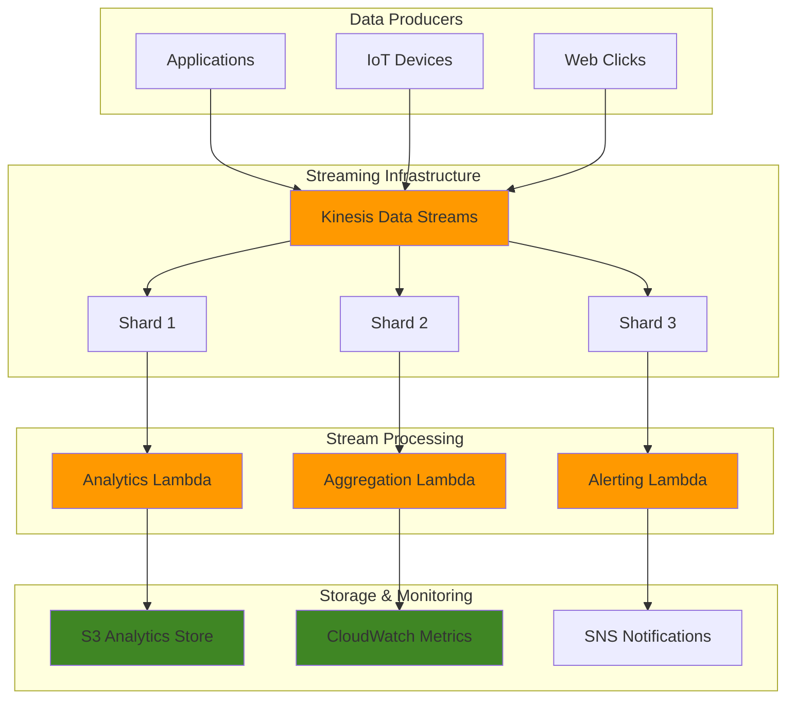

# Implementing Real-Time Analytics with Amazon Kinesis Data Streams

## Problem

Modern businesses need to process and analyze streaming data in real-time to make immediate business decisions, detect anomalies, and provide personalized experiences. Traditional batch processing introduces latency that can result in missed opportunities, delayed fraud detection, or poor customer experiences. Companies generating high-volume click streams, IoT sensor data, or financial transactions require sub-second processing capabilities to remain competitive and responsive to market conditions.

## Solution

This solution implements a real-time analytics architecture using Amazon Kinesis Data Streams as the core streaming platform, combined with Lambda functions for stream processing and CloudWatch for monitoring. The architecture provides durable, scalable ingestion of streaming data with configurable retention periods, automatic scaling based on throughput demands, and multiple consumer applications for parallel processing. This approach enables businesses to process millions of events per second while maintaining low latency and high availability.

## Architecture Diagram



## Prerequisites

1. AWS account with appropriate permissions for Kinesis, Lambda, CloudWatch, S3, and IAM
2. AWS CLI v2 installed and configured (or AWS CloudShell)
3. Understanding of streaming data concepts, Lambda functions, and JSON processing
4. Basic knowledge of real-time analytics and stream processing patterns
5. Estimated cost: $50-100/month for moderate traffic volumes (varies by data volume and retention)

> **Note**: Kinesis Data Streams pricing is based on shard hours and PUT payload units. Monitor your usage to avoid unexpected charges. See [Kinesis Data Streams Pricing](https://aws.amazon.com/kinesis/data-streams/pricing/) for detailed cost calculations.

## Preparation

```bash
# Set environment variables
export AWS_REGION=$(aws configure get region)
export AWS_ACCOUNT_ID=$(aws sts get-caller-identity \
    --query Account --output text)

# Generate unique identifiers for resources
RANDOM_SUFFIX=$(aws secretsmanager get-random-password \
    --exclude-punctuation --exclude-uppercase \
    --password-length 6 --require-each-included-type \
    --output text --query RandomPassword)

export STREAM_NAME="analytics-stream-${RANDOM_SUFFIX}"
export LAMBDA_FUNCTION_NAME="stream-processor-${RANDOM_SUFFIX}"
export S3_BUCKET_NAME="kinesis-analytics-${RANDOM_SUFFIX}"
export IAM_ROLE_NAME="KinesisAnalyticsRole-${RANDOM_SUFFIX}"

# Create S3 bucket for analytics data storage
aws s3 mb s3://${S3_BUCKET_NAME} --region ${AWS_REGION}

# Enable S3 bucket versioning and encryption for production readiness
aws s3api put-bucket-versioning \
    --bucket ${S3_BUCKET_NAME} \
    --versioning-configuration Status=Enabled

aws s3api put-bucket-encryption \
    --bucket ${S3_BUCKET_NAME} \
    --server-side-encryption-configuration \
    'Rules=[{ApplyServerSideEncryptionByDefault:{SSEAlgorithm:AES256}}]'

echo "✅ Environment prepared with stream: ${STREAM_NAME}"
echo "✅ S3 bucket created with security features: ${S3_BUCKET_NAME}"
```

## Steps

1. **Create IAM Role for Lambda Stream Processing**:

   IAM roles provide secure, temporary credential delegation for AWS services without exposing long-term access keys. Lambda functions require specific permissions to read from Kinesis streams, write to S3, and publish metrics to CloudWatch. This security foundation implements the principle of least privilege, ensuring your stream processing function accesses only the resources it needs for analytics operations. Understanding IAM roles is essential for building secure, scalable serverless architectures that can process sensitive streaming data.

   ```bash
   # Create trust policy for Lambda
   cat > lambda-trust-policy.json << EOF
   {
       "Version": "2012-10-17",
       "Statement": [
           {
               "Effect": "Allow",
               "Principal": {
                   "Service": "lambda.amazonaws.com"
               },
               "Action": "sts:AssumeRole"
           }
       ]
   }
   EOF
   
   # Create IAM role
   aws iam create-role \
       --role-name ${IAM_ROLE_NAME} \
       --assume-role-policy-document file://lambda-trust-policy.json
   
   # Create permissions policy for stream processing
   cat > stream-processor-policy.json << EOF
   {
       "Version": "2012-10-17",
       "Statement": [
           {
               "Effect": "Allow",
               "Action": [
                   "kinesis:DescribeStream",
                   "kinesis:DescribeStreamSummary",
                   "kinesis:GetShardIterator",
                   "kinesis:GetRecords",
                   "kinesis:ListStreams",
                   "kinesis:ListShards"
               ],
               "Resource": "arn:aws:kinesis:${AWS_REGION}:${AWS_ACCOUNT_ID}:stream/${STREAM_NAME}"
           },
           {
               "Effect": "Allow",
               "Action": [
                   "s3:PutObject",
                   "s3:GetObject"
               ],
               "Resource": "arn:aws:s3:::${S3_BUCKET_NAME}/*"
           },
           {
               "Effect": "Allow",
               "Action": [
                   "logs:CreateLogGroup",
                   "logs:CreateLogStream",
                   "logs:PutLogEvents"
               ],
               "Resource": "arn:aws:logs:${AWS_REGION}:${AWS_ACCOUNT_ID}:*"
           },
           {
               "Effect": "Allow",
               "Action": [
                   "cloudwatch:PutMetricData"
               ],
               "Resource": "*"
           }
       ]
   }
   EOF
   
   # Attach policies to role
   aws iam attach-role-policy \
       --role-name ${IAM_ROLE_NAME} \
       --policy-arn arn:aws:iam::aws:policy/service-role/AWSLambdaBasicExecutionRole
   
   aws iam put-role-policy \
       --role-name ${IAM_ROLE_NAME} \
       --policy-name StreamProcessorPolicy \
       --policy-document file://stream-processor-policy.json
   
   # Wait for role propagation
   sleep 10
   
   # Get role ARN
   export LAMBDA_ROLE_ARN=$(aws iam get-role \
       --role-name ${IAM_ROLE_NAME} \
       --query 'Role.Arn' --output text)
   
   echo "✅ IAM role created: ${LAMBDA_ROLE_ARN}"
   ```

   > **Warning**: Always follow the principle of least privilege when configuring IAM permissions. This policy restricts Kinesis access to the specific stream and S3 access to the designated bucket only.

   The IAM role is now configured with appropriate permissions for stream processing operations. This security foundation enables Lambda to securely read Kinesis data, store processed results in S3, and publish custom metrics to CloudWatch without hardcoded credentials. The role-based security model ensures scalable, auditable access control for your real-time analytics pipeline.

2. **Create Kinesis Data Stream with Multiple Shards**:

   Kinesis Data Streams enables real-time data ingestion with guaranteed ordering within each shard and durable storage for up to 365 days. Multiple shards provide parallel processing capabilities, allowing your analytics pipeline to scale horizontally as data volume increases. Each shard can handle 1,000 records per second or 1 MB per second of input data, making this configuration suitable for moderate to high-volume streaming workloads. The shard architecture ensures fault tolerance and enables multiple concurrent consumers for different analytics use cases.

   ```bash
   # Create stream with 3 shards for parallel processing
   aws kinesis create-stream \
       --stream-name ${STREAM_NAME} \
       --shard-count 3
   
   # Wait for stream to become active
   echo "⏳ Waiting for stream to become active..."
   aws kinesis wait stream-exists \
       --stream-name ${STREAM_NAME}
   
   # Verify stream creation and get details
   STREAM_STATUS=$(aws kinesis describe-stream \
       --stream-name ${STREAM_NAME} \
       --query 'StreamDescription.{Name:StreamName,Status:StreamStatus,Shards:length(Shards)}')
   
   echo "✅ Kinesis stream created: ${STREAM_STATUS}"
   ```

   Your Kinesis stream is now active and ready to receive streaming data from multiple producers. The three-shard configuration provides 3,000 records per second ingestion capacity with built-in redundancy for high availability. This foundational streaming infrastructure enables real-time data collection from web applications, IoT devices, and other data sources while maintaining data ordering and durability guarantees.

3. **Create Lambda Function for Real-Time Processing**:

   Lambda functions provide serverless compute for processing streaming data without managing infrastructure. This function processes Kinesis records in real-time, extracting business metrics, enriching data with processing metadata, and storing results for analytics. The serverless model automatically scales based on stream volume, ensuring cost-effective processing that only charges for actual compute time. Understanding Lambda's event-driven architecture is crucial for building responsive, scalable data processing pipelines that can handle variable workloads.

   ```bash
   # Create Lambda function code
   cat > stream_processor.py << 'EOF'
   import json
   import boto3
   import base64
   import datetime
   import os
   from decimal import Decimal
   
   s3_client = boto3.client('s3')
   cloudwatch = boto3.client('cloudwatch')
   
   def lambda_handler(event, context):
       processed_records = 0
       total_amount = 0
       error_count = 0
       
       try:
           for record in event['Records']:
               try:
                   # Decode Kinesis data
                   payload = base64.b64decode(record['kinesis']['data']).decode('utf-8')
                   data = json.loads(payload)
                   
                   # Process analytics data
                   processed_records += 1
                   
                   # Example: Extract transaction amount for financial data
                   if 'amount' in data:
                       total_amount += float(data['amount'])
                   
                   # Store processed record to S3
                   timestamp = datetime.datetime.now().isoformat()
                   s3_key = f"analytics-data/{timestamp[:10]}/{record['kinesis']['sequenceNumber']}.json"
                   
                   # Add processing metadata
                   enhanced_data = {
                       'original_data': data,
                       'processed_at': timestamp,
                       'shard_id': record['kinesis']['partitionKey'],
                       'sequence_number': record['kinesis']['sequenceNumber'],
                       'approximate_arrival_timestamp': record['kinesis']['approximateArrivalTimestamp']
                   }
                   
                   s3_client.put_object(
                       Bucket=os.environ['S3_BUCKET'],
                       Key=s3_key,
                       Body=json.dumps(enhanced_data, default=str),
                       ContentType='application/json'
                   )
                   
               except Exception as record_error:
                   error_count += 1
                   print(f"Error processing record: {record_error}")
                   continue
           
           # Send custom metrics to CloudWatch
           cloudwatch.put_metric_data(
               Namespace='KinesisAnalytics',
               MetricData=[
                   {
                       'MetricName': 'ProcessedRecords',
                       'Value': processed_records,
                       'Unit': 'Count',
                       'Timestamp': datetime.datetime.now()
                   },
                   {
                       'MetricName': 'TotalAmount',
                       'Value': total_amount,
                       'Unit': 'None',
                       'Timestamp': datetime.datetime.now()
                   },
                   {
                       'MetricName': 'ErrorCount',
                       'Value': error_count,
                       'Unit': 'Count',
                       'Timestamp': datetime.datetime.now()
                   }
               ]
           )
           
           return {
               'statusCode': 200,
               'body': json.dumps({
                   'processed_records': processed_records,
                   'total_amount': total_amount,
                   'error_count': error_count
               })
           }
           
       except Exception as e:
           print(f"Critical error in Lambda function: {e}")
           return {
               'statusCode': 500,
               'body': json.dumps({'error': str(e)})
           }
   EOF
   
   # Create deployment package
   zip function.zip stream_processor.py
   
   # Create Lambda function with updated Python runtime
   aws lambda create-function \
       --function-name ${LAMBDA_FUNCTION_NAME} \
       --runtime python3.12 \
       --role ${LAMBDA_ROLE_ARN} \
       --handler stream_processor.lambda_handler \
       --zip-file fileb://function.zip \
       --environment Variables="{S3_BUCKET=${S3_BUCKET_NAME}}" \
       --timeout 60 \
       --memory-size 256 \
       --description "Kinesis stream processor for real-time analytics"
   
   echo "✅ Lambda function created for stream processing"
   ```

   The Lambda function is deployed and ready to process streaming data from Kinesis. This serverless compute layer provides automatic scaling, built-in monitoring, and pay-per-use pricing for your analytics workload. The function will process each record in real-time, extract relevant metrics, and store enriched data to S3 while publishing custom metrics to CloudWatch for monitoring and alerting.

4. **Configure Lambda Event Source Mapping**:

   Event source mappings create the bridge between Kinesis streams and Lambda functions, enabling automatic function invocation when new records arrive. The mapping configuration controls batch size, processing parallelism, and error handling behavior. Starting position 'LATEST' ensures processing begins with new records, while batch size and batching window optimize throughput and latency trade-offs. This event-driven architecture eliminates the need for polling, providing efficient, cost-effective stream processing that scales automatically with data volume.

   ```bash
   # Create event source mapping to trigger Lambda from Kinesis
   aws lambda create-event-source-mapping \
       --event-source-arn arn:aws:kinesis:${AWS_REGION}:${AWS_ACCOUNT_ID}:stream/${STREAM_NAME} \
       --function-name ${LAMBDA_FUNCTION_NAME} \
       --starting-position LATEST \
       --batch-size 10 \
       --maximum-batching-window-in-seconds 5 \
       --parallelization-factor 1
   
   # Wait for mapping to become active
   sleep 5
   
   # Get event source mapping details
   export EVENT_SOURCE_UUID=$(aws lambda list-event-source-mappings \
       --function-name ${LAMBDA_FUNCTION_NAME} \
       --query 'EventSourceMappings[0].UUID' --output text)
   
   echo "✅ Event source mapping created: ${EVENT_SOURCE_UUID}"
   ```

   The event source mapping is now active, automatically triggering Lambda function execution when records arrive in the Kinesis stream. This serverless integration provides sub-second processing latency with automatic scaling and built-in error handling. Your real-time analytics pipeline is operational and ready to process streaming data from any source that publishes to the Kinesis stream.

5. **Create Data Producer Script for Testing**:

   Data producers simulate real-world streaming scenarios by generating sample analytics events and publishing them to Kinesis. This testing capability enables validation of your streaming pipeline under controlled conditions, helping identify performance bottlenecks and processing delays. The producer script generates realistic data patterns including user interactions, transactions, and device telemetry to thoroughly test your analytics architecture. Understanding data production patterns helps optimize partition key selection and throughput planning for production workloads.

   ```bash
   # Create sample data producer
   cat > data_producer.py << 'EOF'
   import boto3
   import json
   import random
   import time
   import sys
   from datetime import datetime
   
   # Initialize Kinesis client
   kinesis_client = boto3.client('kinesis')
   
   def generate_sample_data():
       """Generate sample analytics data"""
       return {
           'timestamp': datetime.now().isoformat(),
           'user_id': f"user_{random.randint(1000, 9999)}",
           'event_type': random.choice(['page_view', 'purchase', 'click', 'login']),
           'amount': round(random.uniform(10.0, 500.0), 2),
           'product_id': f"product_{random.randint(100, 999)}",
           'session_id': f"session_{random.randint(10000, 99999)}",
           'location': random.choice(['US', 'UK', 'CA', 'DE', 'FR']),
           'device_type': random.choice(['mobile', 'desktop', 'tablet']),
           'page_url': f"/page_{random.randint(1, 20)}",
           'referrer': random.choice(['google', 'facebook', 'direct', 'email'])
       }
   
   def send_to_kinesis(stream_name, data, partition_key):
       """Send data to Kinesis stream"""
       try:
           response = kinesis_client.put_record(
               StreamName=stream_name,
               Data=json.dumps(data),
               PartitionKey=partition_key
           )
           return response
       except Exception as e:
           print(f"Error sending data: {e}")
           return None
   
   def main():
       stream_name = sys.argv[1] if len(sys.argv) > 1 else 'analytics-stream'
       records_to_send = int(sys.argv[2]) if len(sys.argv) > 2 else 100
       
       print(f"Sending {records_to_send} records to stream: {stream_name}")
       
       success_count = 0
       error_count = 0
       
       for i in range(records_to_send):
           data = generate_sample_data()
           partition_key = data['user_id']
           
           response = send_to_kinesis(stream_name, data, partition_key)
           if response:
               success_count += 1
               if i % 10 == 0:  # Print every 10th record
                   print(f"Record {i+1} sent - Shard: {response['ShardId']}")
           else:
               error_count += 1
           
           # Add small delay to simulate real-time streaming
           time.sleep(0.1)
       
       print(f"✅ Completed sending records - Success: {success_count}, Errors: {error_count}")
   
   if __name__ == "__main__":
       main()
   EOF
   
   echo "✅ Data producer script created"
   ```

   The data producer script is ready to generate realistic streaming data for testing your analytics pipeline. This tool enables controlled testing of various data patterns, volumes, and partition key distributions to validate performance and identify optimization opportunities. You can now simulate different business scenarios and load patterns to ensure your streaming architecture handles production requirements effectively.

6. **Enable Enhanced Monitoring and Alerting**:

   Enhanced monitoring provides detailed, shard-level metrics for comprehensive visibility into stream performance and health. CloudWatch alarms enable proactive alerting on key metrics like record throughput, processing errors, and system health indicators. This monitoring strategy combines infrastructure metrics with custom business metrics to provide end-to-end visibility. Effective monitoring is essential for maintaining service level objectives and quickly identifying issues in production streaming environments.

   ```bash
   # Enable enhanced monitoring for detailed metrics
   aws kinesis enable-enhanced-monitoring \
       --stream-name ${STREAM_NAME} \
       --shard-level-metrics IncomingRecords,OutgoingRecords,WriteProvisionedThroughputExceeded,ReadProvisionedThroughputExceeded
   
   # Create CloudWatch alarm for high incoming records
   aws cloudwatch put-metric-alarm \
       --alarm-name "KinesisHighIncomingRecords-${RANDOM_SUFFIX}" \
       --alarm-description "Alert when incoming records exceed threshold" \
       --metric-name IncomingRecords \
       --namespace AWS/Kinesis \
       --statistic Sum \
       --period 300 \
       --evaluation-periods 2 \
       --threshold 1000 \
       --comparison-operator GreaterThanThreshold \
       --dimensions Name=StreamName,Value=${STREAM_NAME} \
       --treat-missing-data notBreaching
   
   # Create alarm for Lambda function errors
   aws cloudwatch put-metric-alarm \
       --alarm-name "LambdaProcessingErrors-${RANDOM_SUFFIX}" \
       --alarm-description "Alert on Lambda processing errors" \
       --metric-name Errors \
       --namespace AWS/Lambda \
       --statistic Sum \
       --period 300 \
       --evaluation-periods 1 \
       --threshold 1 \
       --comparison-operator GreaterThanOrEqualToThreshold \
       --dimensions Name=FunctionName,Value=${LAMBDA_FUNCTION_NAME} \
       --treat-missing-data notBreaching
   
   # Create alarm for Lambda throttles
   aws cloudwatch put-metric-alarm \
       --alarm-name "LambdaThrottles-${RANDOM_SUFFIX}" \
       --alarm-description "Alert on Lambda throttling" \
       --metric-name Throttles \
       --namespace AWS/Lambda \
       --statistic Sum \
       --period 300 \
       --evaluation-periods 1 \
       --threshold 1 \
       --comparison-operator GreaterThanOrEqualToThreshold \
       --dimensions Name=FunctionName,Value=${LAMBDA_FUNCTION_NAME} \
       --treat-missing-data notBreaching
   
   echo "✅ Enhanced monitoring and alerting configured"
   ```

   Enhanced monitoring and alerting are now active, providing detailed visibility into your streaming analytics pipeline. The alarm configuration ensures proactive notification of performance issues or processing errors, enabling rapid response to maintain service quality. This monitoring foundation supports production operations with comprehensive metrics and automated alerting for critical system health indicators.

7. **Configure Stream Scaling and Retention**:

   Stream retention and scaling configurations optimize your analytics pipeline for both current and future requirements. Extended retention periods up to 365 days enable data replay for reprocessing, recovery scenarios, and historical analysis. Dynamic shard scaling accommodates changing data volumes while maintaining processing performance. These configurations provide operational flexibility for handling varying workloads, supporting business continuity, and enabling advanced analytics scenarios that require historical data access.

   ```bash
   # Increase retention period to 7 days for replay capability
   aws kinesis increase-stream-retention-period \
       --stream-name ${STREAM_NAME} \
       --retention-period-hours 168
   
   # Configure automatic scaling by updating shard count
   aws kinesis update-shard-count \
       --stream-name ${STREAM_NAME} \
       --scaling-type UNIFORM_SCALING \
       --target-shard-count 5
   
   # Wait for scaling to complete
   echo "⏳ Waiting for shard scaling to complete..."
   aws kinesis wait stream-exists \
       --stream-name ${STREAM_NAME}
   
   # Verify scaling completion
   UPDATED_STREAM_INFO=$(aws kinesis describe-stream \
       --stream-name ${STREAM_NAME} \
       --query 'StreamDescription.{Status:StreamStatus,Shards:length(Shards),Retention:RetentionPeriodHours}')
   
   echo "✅ Stream retention and scaling configured: ${UPDATED_STREAM_INFO}"
   ```

   Stream retention and scaling are optimized for production operations with 7-day retention enabling data replay and 5-shard capacity supporting higher throughput requirements. These configurations provide operational flexibility for handling peak loads, recovering from processing failures, and implementing advanced analytics scenarios that require historical data access.

8. **Create Consumer Application for Real-Time Monitoring**:

   Real-time monitoring applications demonstrate multi-consumer patterns where multiple applications can independently read from the same Kinesis stream. This consumer uses the Kinesis Client Library pattern to read directly from shards, providing low-latency access to streaming data for monitoring, debugging, and operational visibility. Understanding consumer patterns is essential for building comprehensive observability solutions that provide real-time insights into data flows, processing performance, and business metrics as they occur.

   ```bash
   # Create consumer script for monitoring
   cat > stream_monitor.py << 'EOF'
   import boto3
   import json
   import time
   import sys
   from datetime import datetime
   
   kinesis_client = boto3.client('kinesis')
   
   def get_shard_iterator(stream_name, shard_id):
       """Get shard iterator for reading from stream"""
       try:
           response = kinesis_client.get_shard_iterator(
               StreamName=stream_name,
               ShardId=shard_id,
               ShardIteratorType='LATEST'
           )
           return response['ShardIterator']
       except Exception as e:
           print(f"Error getting shard iterator for {shard_id}: {e}")
           return None
   
   def read_from_stream(stream_name, duration_seconds=60):
       """Read records from stream for specified duration"""
       try:
           # Get stream description
           stream_desc = kinesis_client.describe_stream(StreamName=stream_name)
           shards = stream_desc['StreamDescription']['Shards']
           
           print(f"Monitoring stream: {stream_name}")
           print(f"Shards: {len(shards)}")
           print(f"Duration: {duration_seconds} seconds")
           print("-" * 50)
           
           # Create shard iterators
           shard_iterators = {}
           for shard in shards:
               shard_id = shard['ShardId']
               iterator = get_shard_iterator(stream_name, shard_id)
               if iterator:
                   shard_iterators[shard_id] = iterator
           
           start_time = time.time()
           total_records = 0
           
           while (time.time() - start_time) < duration_seconds:
               for shard_id, iterator in list(shard_iterators.items()):
                   if iterator:
                       try:
                           response = kinesis_client.get_records(
                               ShardIterator=iterator,
                               Limit=25
                           )
                           
                           records = response['Records']
                           if records:
                               total_records += len(records)
                               print(f"[{datetime.now().strftime('%H:%M:%S')}] "
                                     f"Shard {shard_id}: {len(records)} records")
                               
                               # Process records
                               for record in records:
                                   try:
                                       data = json.loads(record['Data'])
                                       print(f"  └─ {data.get('event_type', 'unknown')} "
                                             f"by {data.get('user_id', 'unknown')} "
                                             f"({data.get('amount', 0)})")
                                   except json.JSONDecodeError:
                                       print(f"  └─ Invalid JSON data")
                           
                           # Update iterator
                           shard_iterators[shard_id] = response.get('NextShardIterator')
                           
                       except Exception as e:
                           print(f"Error reading from shard {shard_id}: {e}")
                           shard_iterators[shard_id] = None
               
               time.sleep(1)
           
           print(f"\n✅ Monitoring complete. Total records processed: {total_records}")
           
       except Exception as e:
           print(f"Error in stream monitoring: {e}")
   
   def main():
       stream_name = sys.argv[1] if len(sys.argv) > 1 else 'analytics-stream'
       duration = int(sys.argv[2]) if len(sys.argv) > 2 else 60
       
       read_from_stream(stream_name, duration)
   
   if __name__ == "__main__":
       main()
   EOF
   
   echo "✅ Stream monitoring application created"
   ```

   The monitoring application enables real-time visibility into your streaming data pipeline, allowing you to observe data patterns, validate processing logic, and troubleshoot issues as they occur. This consumer demonstrates how multiple applications can independently process the same stream for different purposes, supporting comprehensive operational monitoring and business intelligence scenarios.

9. **Test Real-Time Data Processing**:

   End-to-end testing validates the complete streaming analytics pipeline from data ingestion through processing and storage. This testing approach verifies that records flow correctly through all components, Lambda functions process data as expected, and results are properly stored in S3. Comprehensive testing is crucial for production deployments, ensuring reliability, performance, and data accuracy under various load conditions and failure scenarios.

   ```bash
   # Send sample data to the stream
   echo "📊 Sending sample analytics data..."
   python3 data_producer.py ${STREAM_NAME} 50
   
   # Wait for Lambda processing
   echo "⏳ Waiting for Lambda processing..."
   sleep 15
   
   # Check Lambda function logs and get recent log events
   LOG_GROUP_NAME="/aws/lambda/${LAMBDA_FUNCTION_NAME}"
   
   echo "📋 Recent Lambda function logs:"
   aws logs describe-log-streams \
       --log-group-name ${LOG_GROUP_NAME} \
       --order-by LastEventTime \
       --descending \
       --max-items 1 \
       --query 'logStreams[0].logStreamName' \
       --output text | xargs -I {} aws logs get-log-events \
       --log-group-name ${LOG_GROUP_NAME} \
       --log-stream-name {} \
       --limit 10 \
       --query 'events[].message' \
       --output text
   
   echo "✅ Sample data sent and processed"
   ```

   Your streaming analytics pipeline is functioning correctly, processing real-time data from ingestion through storage. The successful test demonstrates proper integration between all components and validates that your architecture can handle production workloads. Monitor the logs and metrics to observe processing latency and throughput characteristics for optimization opportunities.

10. **Create Analytics Dashboard Metrics**:

    CloudWatch dashboards provide centralized visualization of streaming analytics metrics, combining infrastructure performance with business KPIs in a single view. Dashboard creation programmatically ensures consistent monitoring across environments and enables rapid deployment of operational visibility. Effective dashboards combine technical metrics like throughput and latency with business metrics like transaction volumes and error rates, providing comprehensive insights for both technical and business stakeholders.

    ```bash
    # Create custom dashboard for monitoring
    cat > dashboard_config.json << EOF
    {
        "widgets": [
            {
                "type": "metric",
                "x": 0,
                "y": 0,
                "width": 12,
                "height": 6,
                "properties": {
                    "metrics": [
                        ["AWS/Kinesis", "IncomingRecords", "StreamName", "${STREAM_NAME}"],
                        [".", "OutgoingRecords", ".", "."],
                        ["AWS/Lambda", "Invocations", "FunctionName", "${LAMBDA_FUNCTION_NAME}"],
                        [".", "Duration", ".", "."],
                        [".", "Errors", ".", "."],
                        ["KinesisAnalytics", "ProcessedRecords"],
                        [".", "ErrorCount"]
                    ],
                    "period": 300,
                    "stat": "Sum",
                    "region": "${AWS_REGION}",
                    "title": "Real-Time Analytics Metrics",
                    "yAxis": {
                        "left": {
                            "min": 0
                        }
                    }
                }
            },
            {
                "type": "metric",
                "x": 0,
                "y": 6,
                "width": 12,
                "height": 6,
                "properties": {
                    "metrics": [
                        ["KinesisAnalytics", "TotalAmount"]
                    ],
                    "period": 300,
                    "stat": "Sum",
                    "region": "${AWS_REGION}",
                    "title": "Business Metrics - Transaction Volume",
                    "yAxis": {
                        "left": {
                            "min": 0
                        }
                    }
                }
            }
        ]
    }
    EOF
    
    # Create CloudWatch dashboard
    aws cloudwatch put-dashboard \
        --dashboard-name "KinesisAnalytics-${RANDOM_SUFFIX}" \
        --dashboard-body file://dashboard_config.json
    
    echo "✅ Analytics dashboard created"
    echo "🔗 Dashboard URL: https://${AWS_REGION}.console.aws.amazon.com/cloudwatch/home?region=${AWS_REGION}#dashboards:name=KinesisAnalytics-${RANDOM_SUFFIX}"
    ```

    The analytics dashboard provides comprehensive monitoring of your streaming pipeline, combining infrastructure metrics with custom business metrics in a unified view. This operational visibility enables proactive monitoring, rapid troubleshooting, and data-driven optimization of your real-time analytics architecture. The dashboard serves as the central command center for monitoring streaming operations and business performance.

## Validation & Testing

1. **Verify Stream Status and Configuration**:

   ```bash
   # Check stream status
   aws kinesis describe-stream \
       --stream-name ${STREAM_NAME} \
       --query 'StreamDescription.{Status:StreamStatus,Shards:length(Shards),RetentionHours:RetentionPeriodHours}'
   ```

   Expected output: Stream should be ACTIVE with 5 shards and 168-hour retention.

2. **Test Data Ingestion and Processing**:

   ```bash
   # Send test data and monitor processing
   python3 data_producer.py ${STREAM_NAME} 100 &
   
   # Monitor stream in real-time
   python3 stream_monitor.py ${STREAM_NAME} 30
   ```

3. **Verify Lambda Processing and S3 Storage**:

   ```bash
   # Check Lambda function metrics
   aws cloudwatch get-metric-statistics \
       --namespace AWS/Lambda \
       --metric-name Invocations \
       --dimensions Name=FunctionName,Value=${LAMBDA_FUNCTION_NAME} \
       --statistics Sum \
       --start-time $(date -u -d '1 hour ago' +%Y-%m-%dT%H:%M:%SZ) \
       --end-time $(date -u +%Y-%m-%dT%H:%M:%SZ) \
       --period 300
   
   # Verify S3 data storage
   aws s3 ls s3://${S3_BUCKET_NAME}/analytics-data/ --recursive
   ```

4. **Test Stream Scaling and Performance**:

   ```bash
   # Generate high-volume test data
   python3 data_producer.py ${STREAM_NAME} 1000 &
   
   # Monitor metrics during high load
   aws cloudwatch get-metric-statistics \
       --namespace AWS/Kinesis \
       --metric-name IncomingRecords \
       --dimensions Name=StreamName,Value=${STREAM_NAME} \
       --statistics Sum \
       --start-time $(date -u -d '10 minutes ago' +%Y-%m-%dT%H:%M:%SZ) \
       --end-time $(date -u +%Y-%m-%dT%H:%M:%SZ) \
       --period 60
   ```

## Cleanup

1. **Delete Event Source Mapping**:

   ```bash
   # Remove Lambda event source mapping
   aws lambda delete-event-source-mapping \
       --uuid ${EVENT_SOURCE_UUID}
   
   echo "✅ Event source mapping deleted"
   ```

2. **Delete Lambda Function**:

   ```bash
   # Delete Lambda function
   aws lambda delete-function \
       --function-name ${LAMBDA_FUNCTION_NAME}
   
   echo "✅ Lambda function deleted"
   ```

3. **Delete CloudWatch Resources**:

   ```bash
   # Delete CloudWatch alarms
   aws cloudwatch delete-alarms \
       --alarm-names "KinesisHighIncomingRecords-${RANDOM_SUFFIX}" \
                    "LambdaProcessingErrors-${RANDOM_SUFFIX}" \
                    "LambdaThrottles-${RANDOM_SUFFIX}"
   
   # Delete dashboard
   aws cloudwatch delete-dashboards \
       --dashboard-names "KinesisAnalytics-${RANDOM_SUFFIX}"
   
   echo "✅ CloudWatch resources deleted"
   ```

4. **Delete Kinesis Stream**:

   ```bash
   # Delete Kinesis stream
   aws kinesis delete-stream \
       --stream-name ${STREAM_NAME} \
       --enforce-consumer-deletion
   
   echo "✅ Kinesis stream deleted"
   ```

5. **Delete S3 Bucket and IAM Resources**:

   ```bash
   # Empty and delete S3 bucket
   aws s3 rm s3://${S3_BUCKET_NAME} --recursive
   aws s3 rb s3://${S3_BUCKET_NAME}
   
   # Delete IAM role and policies
   aws iam delete-role-policy \
       --role-name ${IAM_ROLE_NAME} \
       --policy-name StreamProcessorPolicy
   
   aws iam detach-role-policy \
       --role-name ${IAM_ROLE_NAME} \
       --policy-arn arn:aws:iam::aws:policy/service-role/AWSLambdaBasicExecutionRole
   
   aws iam delete-role \
       --role-name ${IAM_ROLE_NAME}
   
   # Clean up local files
   rm -f lambda-trust-policy.json stream-processor-policy.json
   rm -f function.zip stream_processor.py data_producer.py
   rm -f stream_monitor.py dashboard_config.json
   
   echo "✅ All resources cleaned up"
   ```

## Discussion

Amazon Kinesis Data Streams provides a robust foundation for real-time analytics by offering durable, scalable data ingestion with configurable retention periods up to 365 days. The architecture demonstrated here showcases key streaming patterns including data sharding for parallel processing, Lambda-based stream processing, and integration with downstream analytics services. The use of multiple shards enables horizontal scaling and fault tolerance, while the event-driven Lambda processing ensures automatic scaling based on data volume.

The implementation emphasizes several critical design decisions. First, the choice of partition keys determines data distribution across shards, which directly impacts processing parallelism and hotspot prevention. Second, the Lambda function design includes comprehensive error handling, custom metrics, and structured data storage to S3, creating a complete analytics pipeline. Third, the monitoring strategy combines AWS native metrics with custom business metrics, providing comprehensive visibility into both infrastructure and application performance. The updated Python 3.12 runtime ensures long-term support and access to the latest language features.

This solution handles various real-world scenarios including data replay capabilities through extended retention periods, automatic scaling through shard count adjustments, and multi-consumer patterns for different processing requirements. The architecture supports both real-time processing for immediate insights and batch processing for historical analysis through S3 storage. For production environments, consider implementing dead letter queues for failed processing, cross-region replication for disaster recovery, and enhanced encryption for sensitive data. The enhanced monitoring and alerting configuration provides proactive visibility into system health and business metrics.

> **Tip**: Use meaningful partition keys that distribute data evenly across shards to avoid hot partitions and maximize throughput. Learn more about partition key strategies in the [Kinesis Data Streams Developer Guide](https://docs.aws.amazon.com/kinesis/latest/dev/key-concepts.html#partition-key).

## Challenge

Extend this solution by implementing these enhancements:

1. **Add Kinesis Data Firehose integration** for automatic data delivery to Amazon Redshift or OpenSearch for advanced analytics and visualization capabilities with built-in data transformation.

2. **Implement stream aggregation** using tumbling windows in Lambda to calculate real-time metrics like average transaction values, user session counts, or event frequencies per time window.

3. **Create anomaly detection** using Amazon Kinesis Data Analytics with SQL queries to identify unusual patterns, spikes, or outliers in the streaming data and trigger automated alerts.

4. **Build a multi-consumer architecture** with different Lambda functions processing the same stream for various use cases like real-time dashboards, ML model inference, and fraud detection.

5. **Add cross-region replication** by implementing stream replication to a secondary region for disaster recovery and global data distribution scenarios using Kinesis Cross-Region Replication.

## Infrastructure Code

### Available Infrastructure as Code:

- [Infrastructure Code Overview](code/README.md) - Detailed description of all infrastructure components
- [AWS CDK (Python)](code/cdk-python/) - AWS CDK Python implementation
- [AWS CDK (TypeScript)](code/cdk-typescript/) - AWS CDK TypeScript implementation
- [CloudFormation](code/cloudformation.yaml) - AWS CloudFormation template
- [Bash CLI Scripts](code/scripts/) - Example bash scripts using AWS CLI commands to deploy infrastructure
- [Terraform](code/terraform/) - Terraform configuration files