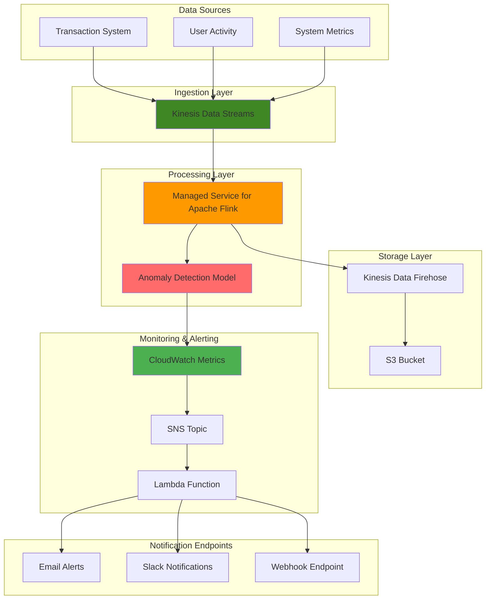

# Detecting Real-time Anomalies with Kinesis Data Analytics

## Problem

Financial institutions and e-commerce platforms need to detect fraudulent transactions, unusual spending patterns, and system anomalies in real-time to minimize business impact and protect customers. Traditional batch processing approaches create delays of hours or days, allowing fraudulent activities to continue undetected and potentially causing significant financial losses. Manual monitoring is ineffective at scale and prone to human error, making it impossible to catch sophisticated attack patterns or subtle system degradations.

## Solution

This solution implements a real-time anomaly detection system using AWS Managed Service for Apache Flink (formerly Kinesis Data Analytics) to analyze streaming transaction data and detect unusual patterns within seconds. The architecture combines Kinesis Data Streams for data ingestion, Managed Service for Apache Flink for real-time processing with built-in anomaly detection capabilities, CloudWatch for monitoring and alerting, and SNS for immediate notifications. This approach enables sub-second detection of anomalies with automated alerting and provides historical analysis capabilities for pattern recognition.

## Architecture Diagram



## Prerequisites

1. AWS account with permissions for Kinesis Data Streams, Managed Service for Apache Flink, CloudWatch, SNS, Lambda, IAM, and S3
2. AWS CLI v2 installed and configured (or AWS CloudShell)
3. Knowledge of streaming data concepts and basic Java/SQL programming
4. Understanding of statistical anomaly detection concepts
5. Estimated cost: $50-100/month for moderate throughput (5,000 records/minute)

> **Note**: Managed Service for Apache Flink charges are based on Kinesis Processing Units (KPUs) and run time. Each KPU costs approximately $0.11 per hour.

> **Warning**: Ensure proper IAM permissions are configured before proceeding to avoid access denied errors during Flink application deployment.

## Preparation

```bash
# Set environment variables
export AWS_REGION=$(aws configure get region)
export AWS_ACCOUNT_ID=$(aws sts get-caller-identity \
    --query Account --output text)

# Generate unique identifiers for resources
RANDOM_SUFFIX=$(aws secretsmanager get-random-password \
    --exclude-punctuation --exclude-uppercase \
    --password-length 6 --require-each-included-type \
    --output text --query RandomPassword)

export STREAM_NAME="transaction-stream-${RANDOM_SUFFIX}"
export FLINK_APP_NAME="anomaly-detector-${RANDOM_SUFFIX}"
export S3_BUCKET_NAME="anomaly-detection-data-${RANDOM_SUFFIX}"
export SNS_TOPIC_NAME="anomaly-alerts-${RANDOM_SUFFIX}"
export LAMBDA_FUNCTION_NAME="anomaly-processor-${RANDOM_SUFFIX}"
export LAMBDA_ROLE_NAME="anomaly-lambda-role-${RANDOM_SUFFIX}"

# Create S3 bucket for data storage and application artifacts
aws s3 mb s3://${S3_BUCKET_NAME} --region ${AWS_REGION}

# Enable S3 bucket versioning and encryption
aws s3api put-bucket-versioning \
    --bucket ${S3_BUCKET_NAME} \
    --versioning-configuration Status=Enabled

aws s3api put-bucket-encryption \
    --bucket ${S3_BUCKET_NAME} \
    --server-side-encryption-configuration \
    'Rules=[{ApplyServerSideEncryptionByDefault:{SSEAlgorithm:AES256}}]'

# Create SNS topic for alerting
aws sns create-topic --name ${SNS_TOPIC_NAME} \
    --region ${AWS_REGION}

export SNS_TOPIC_ARN=$(aws sns get-topic-attributes \
    --topic-arn "arn:aws:sns:${AWS_REGION}:${AWS_ACCOUNT_ID}:${SNS_TOPIC_NAME}" \
    --query "Attributes.TopicArn" --output text)

echo "✅ Environment prepared with unique identifiers"
```

## Steps

1. **Create Kinesis Data Stream for ingestion**:

   Kinesis Data Streams serves as the foundation for real-time data ingestion, providing a highly scalable and durable streaming service that can handle thousands of concurrent data producers. Each shard can ingest up to 1,000 records per second or 1 MB per second, making it ideal for high-throughput transaction processing. Creating multiple shards ensures horizontal scaling and fault tolerance, enabling our anomaly detection system to process large volumes of financial transactions without data loss.

   ```bash
   # Create the data stream with multiple shards for higher throughput
   aws kinesis create-stream \
       --stream-name ${STREAM_NAME} \
       --shard-count 2 \
       --region ${AWS_REGION}
   
   # Wait for stream to become active
   aws kinesis wait stream-exists \
       --stream-name ${STREAM_NAME} \
       --region ${AWS_REGION}
   
   echo "✅ Kinesis Data Stream ${STREAM_NAME} created successfully"
   ```

   The stream is now ready to receive transaction data from multiple sources. The two-shard configuration provides 2,000 records per second capacity, which is sufficient for moderate transaction volumes while ensuring high availability through data replication across multiple Availability Zones.

2. **Create IAM roles for Managed Service for Apache Flink**:

   Security in streaming applications requires careful IAM configuration following the principle of least privilege. Managed Service for Apache Flink needs specific permissions to read from Kinesis streams, publish metrics to CloudWatch, and access application code stored in S3. The service-linked role ensures that only the Flink service can assume these permissions, while the resource-specific policies limit access to only the resources our application needs, maintaining strong security boundaries.

   ```bash
   # Create trust policy for Flink service
   cat > flink-trust-policy.json << 'EOF'
   {
       "Version": "2012-10-17",
       "Statement": [
           {
               "Effect": "Allow",
               "Principal": {
                   "Service": "kinesisanalytics.amazonaws.com"
               },
               "Action": "sts:AssumeRole"
           }
       ]
   }
   EOF
   
   # Create the service role
   aws iam create-role \
       --role-name FlinkAnomalyDetectionRole \
       --assume-role-policy-document file://flink-trust-policy.json
   
   # Create policy for Kinesis and CloudWatch access
   cat > flink-permissions-policy.json << EOF
   {
       "Version": "2012-10-17",
       "Statement": [
           {
               "Effect": "Allow",
               "Action": [
                   "kinesis:DescribeStream",
                   "kinesis:GetShardIterator",
                   "kinesis:GetRecords",
                   "kinesis:ListShards"
               ],
               "Resource": "arn:aws:kinesis:${AWS_REGION}:${AWS_ACCOUNT_ID}:stream/${STREAM_NAME}"
           },
           {
               "Effect": "Allow",
               "Action": [
                   "cloudwatch:PutMetricData"
               ],
               "Resource": "*"
           },
           {
               "Effect": "Allow",
               "Action": [
                   "s3:GetObject",
                   "s3:PutObject"
               ],
               "Resource": "arn:aws:s3:::${S3_BUCKET_NAME}/*"
           }
       ]
   }
   EOF
   
   aws iam put-role-policy \
       --role-name FlinkAnomalyDetectionRole \
       --policy-name FlinkAnomalyDetectionPolicy \
       --policy-document file://flink-permissions-policy.json
   
   echo "✅ IAM roles created for Flink application"
   ```

   These permissions establish a secure execution environment for our Flink application. The role can now read streaming data, emit operational metrics, and access its deployment artifacts while maintaining isolation from other AWS resources.

3. **Create Lambda execution role for anomaly processing**:

   AWS Lambda requires an execution role with appropriate permissions to interact with CloudWatch for metrics publishing and SNS for alert notifications. Following the principle of least privilege, this role grants only the specific permissions needed for anomaly processing tasks while ensuring secure access to required AWS services.

   ```bash
   # Create trust policy for Lambda service
   cat > lambda-trust-policy.json << 'EOF'
   {
       "Version": "2012-10-17",
       "Statement": [
           {
               "Effect": "Allow",
               "Principal": {
                   "Service": "lambda.amazonaws.com"
               },
               "Action": "sts:AssumeRole"
           }
       ]
   }
   EOF
   
   # Create Lambda execution role
   aws iam create-role \
       --role-name ${LAMBDA_ROLE_NAME} \
       --assume-role-policy-document file://lambda-trust-policy.json
   
   # Attach basic execution policy for CloudWatch Logs
   aws iam attach-role-policy \
       --role-name ${LAMBDA_ROLE_NAME} \
       --policy-arn arn:aws:iam::aws:policy/service-role/AWSLambdaBasicExecutionRole
   
   # Create policy for CloudWatch and SNS access
   cat > lambda-permissions-policy.json << EOF
   {
       "Version": "2012-10-17",
       "Statement": [
           {
               "Effect": "Allow",
               "Action": [
                   "cloudwatch:PutMetricData"
               ],
               "Resource": "*"
           },
           {
               "Effect": "Allow",
               "Action": [
                   "sns:Publish"
               ],
               "Resource": "${SNS_TOPIC_ARN}"
           }
       ]
   }
   EOF
   
   aws iam put-role-policy \
       --role-name ${LAMBDA_ROLE_NAME} \
       --policy-name LambdaAnomalyProcessingPolicy \
       --policy-document file://lambda-permissions-policy.json
   
   export LAMBDA_ROLE_ARN=$(aws iam get-role \
       --role-name ${LAMBDA_ROLE_NAME} \
       --query 'Role.Arn' --output text)
   
   echo "✅ Lambda execution role created"
   ```

   The Lambda execution role now has the minimum required permissions to process anomaly alerts and publish metrics, ensuring secure and compliant operation.

4. **Create Java application for anomaly detection**:

   Apache Flink provides a powerful framework for stateful stream processing with event-time semantics and exactly-once processing guarantees. Our anomaly detection application leverages Flink's windowing capabilities to analyze transaction patterns over time, using ProcessWindowFunction for complex event processing that can maintain state across multiple transactions. This approach enables sophisticated pattern recognition while maintaining low latency, making it ideal for real-time fraud detection where every millisecond counts.

   ```bash
   # Create application directory structure
   mkdir -p anomaly-detection-app/src/main/java/com/example
   
   # Create the main Flink application
   cat > anomaly-detection-app/src/main/java/com/example/AnomalyDetectionApp.java << 'EOF'
   package com.example;
   
   import org.apache.flink.api.common.functions.MapFunction;
   import org.apache.flink.api.common.serialization.SimpleStringSchema;
   import org.apache.flink.api.java.tuple.Tuple3;
   import org.apache.flink.streaming.api.datastream.DataStream;
   import org.apache.flink.streaming.api.environment.StreamExecutionEnvironment;
   import org.apache.flink.streaming.api.functions.windowing.ProcessWindowFunction;
   import org.apache.flink.streaming.api.windowing.assigners.TumblingProcessingTimeWindows;
   import org.apache.flink.streaming.api.windowing.time.Time;
   import org.apache.flink.streaming.api.windowing.windows.TimeWindow;
   import org.apache.flink.connector.kinesis.source.KinesisSource;
   import org.apache.flink.connector.kinesis.source.enumerator.KinesisShardSplitEnumerator;
   import org.apache.flink.connector.kinesis.source.enumerator.KinesisStreamsSourceEnumeratorConfiguration;
   import org.apache.flink.connector.aws.config.AWSConfigConstants;
   import org.apache.flink.util.Collector;
   import org.apache.flink.shaded.jackson2.com.fasterxml.jackson.databind.JsonNode;
   import org.apache.flink.shaded.jackson2.com.fasterxml.jackson.databind.ObjectMapper;
   
   import java.util.Properties;
   
   public class AnomalyDetectionApp {
       private static final ObjectMapper objectMapper = new ObjectMapper();
       
       public static void main(String[] args) throws Exception {
           final StreamExecutionEnvironment env = StreamExecutionEnvironment.getExecutionEnvironment();
           
           // Configure Kinesis source properties
           Properties kinesisConsumerConfig = new Properties();
           kinesisConsumerConfig.setProperty(AWSConfigConstants.AWS_REGION, 
               System.getProperty("aws.region", "us-east-1"));
           
           // Create Kinesis source
           KinesisSource<String> kinesisSource = KinesisSource.<String>builder()
               .setStreamName(System.getProperty("stream.name", "transaction-stream"))
               .setDeserializationSchema(new SimpleStringSchema())
               .setKinesisConsumerConfig(kinesisConsumerConfig)
               .build();
           
           DataStream<String> kinesisStream = env.fromSource(kinesisSource, 
               org.apache.flink.api.common.eventtime.WatermarkStrategy.noWatermarks(), 
               "Kinesis Source");
           
           // Parse JSON and extract transaction data
           DataStream<Tuple3<String, Double, Long>> transactions = kinesisStream
               .map(new MapFunction<String, Tuple3<String, Double, Long>>() {
                   @Override
                   public Tuple3<String, Double, Long> map(String value) throws Exception {
                       JsonNode json = objectMapper.readTree(value);
                       String userId = json.get("userId").asText();
                       double amount = json.get("amount").asDouble();
                       long timestamp = json.get("timestamp").asLong();
                       return new Tuple3<>(userId, amount, timestamp);
                   }
               });
           
           // Apply windowing and anomaly detection
           DataStream<String> anomalies = transactions
               .keyBy(transaction -> transaction.f0)
               .window(TumblingProcessingTimeWindows.of(Time.minutes(5)))
               .process(new AnomalyDetectionFunction());
           
           // Print anomalies (in production, send to another Kinesis stream or SNS)
           anomalies.print();
           
           env.execute("Real-time Anomaly Detection");
       }
       
       public static class AnomalyDetectionFunction 
           extends ProcessWindowFunction<Tuple3<String, Double, Long>, String, String, TimeWindow> {
           
           @Override
           public void process(String key, Context context, 
                              Iterable<Tuple3<String, Double, Long>> elements, 
                              Collector<String> out) throws Exception {
               
               double sum = 0.0;
               int count = 0;
               double max = Double.MIN_VALUE;
               double min = Double.MAX_VALUE;
               
               for (Tuple3<String, Double, Long> element : elements) {
                   sum += element.f1;
                   count++;
                   max = Math.max(max, element.f1);
                   min = Math.min(min, element.f1);
               }
               
               if (count > 0) {
                   double avg = sum / count;
                   double stdDev = calculateStandardDeviation(elements, avg);
                   double threshold = avg + (2.5 * stdDev); // Statistical anomaly detection
                   
                   if (max > threshold && count >= 3) {
                       String anomaly = String.format(
                           "ANOMALY DETECTED: User %s has transaction of %.2f " +
                           "(avg: %.2f, stddev: %.2f, threshold: %.2f, count: %d)",
                           key, max, avg, stdDev, threshold, count);
                       out.collect(anomaly);
                   }
               }
           }
           
           private double calculateStandardDeviation(
               Iterable<Tuple3<String, Double, Long>> elements, double mean) {
               double sum = 0.0;
               int count = 0;
               for (Tuple3<String, Double, Long> element : elements) {
                   sum += Math.pow(element.f1 - mean, 2);
                   count++;
               }
               return count > 1 ? Math.sqrt(sum / (count - 1)) : 0.0;
           }
       }
   }
   EOF
   
   # Create Maven pom.xml with updated dependencies
   cat > anomaly-detection-app/pom.xml << 'EOF'
   <?xml version="1.0" encoding="UTF-8"?>
   <project xmlns="http://maven.apache.org/POM/4.0.0"
            xmlns:xsi="http://www.w3.org/2001/XMLSchema-instance"
            xsi:schemaLocation="http://maven.apache.org/POM/4.0.0 
                                http://maven.apache.org/xsd/maven-4.0.0.xsd">
       <modelVersion>4.0.0</modelVersion>
       
       <groupId>com.example</groupId>
       <artifactId>anomaly-detection</artifactId>
       <version>1.0-SNAPSHOT</version>
       
       <properties>
           <maven.compiler.source>11</maven.compiler.source>
           <maven.compiler.target>11</maven.compiler.target>
           <flink.version>1.19.1</flink.version>
           <aws.connector.version>4.3.0</aws.connector.version>
       </properties>
       
       <dependencies>
           <dependency>
               <groupId>org.apache.flink</groupId>
               <artifactId>flink-streaming-java</artifactId>
               <version>${flink.version}</version>
               <scope>provided</scope>
           </dependency>
           <dependency>
               <groupId>org.apache.flink</groupId>
               <artifactId>flink-connector-aws-kinesis-streams</artifactId>
               <version>${aws.connector.version}</version>
           </dependency>
           <dependency>
               <groupId>org.apache.flink</groupId>
               <artifactId>flink-connector-base</artifactId>
               <version>${flink.version}</version>
           </dependency>
           <dependency>
               <groupId>com.fasterxml.jackson.core</groupId>
               <artifactId>jackson-databind</artifactId>
               <version>2.15.2</version>
           </dependency>
       </dependencies>
       
       <build>
           <plugins>
               <plugin>
                   <groupId>org.apache.maven.plugins</groupId>
                   <artifactId>maven-shade-plugin</artifactId>
                   <version>3.4.1</version>
                   <executions>
                       <execution>
                           <phase>package</phase>
                           <goals>
                               <goal>shade</goal>
                           </goals>
                           <configuration>
                               <transformers>
                                   <transformer implementation="org.apache.maven.plugins.shade.resource.ManifestResourceTransformer">
                                       <mainClass>com.example.AnomalyDetectionApp</mainClass>
                                   </transformer>
                               </transformers>
                           </configuration>
                       </execution>
                   </executions>
               </plugin>
           </plugins>
       </build>
   </project>
   EOF
   
   echo "✅ Flink application code created with updated dependencies"
   ```

   The application implements a more sophisticated statistical anomaly detection approach using standard deviation to identify outliers. This sliding window analysis enables detection of transactions that deviate significantly from a user's normal spending patterns while reducing false positives through statistical rigor.

5. **Build and upload the application**:

   The Maven build process compiles our Flink application and packages all dependencies into a single JAR file using the shade plugin. This "fat JAR" approach ensures that all required libraries are available at runtime within the Managed Service for Apache Flink environment. Storing the application in S3 enables version control and provides a durable deployment artifact that can be referenced by multiple Flink applications or versions.

   ```bash
   # Build the Maven project (requires Maven installation)
   cd anomaly-detection-app
   if command -v mvn &> /dev/null; then
       mvn clean package -q
       cd ..
       
       # Upload JAR to S3
       aws s3 cp anomaly-detection-app/target/anomaly-detection-1.0-SNAPSHOT.jar \
           s3://${S3_BUCKET_NAME}/applications/
       
       echo "✅ Application built and uploaded to S3"
   else
       echo "⚠️  Maven not found. Please install Maven or use a pre-built JAR"
       cd ..
       
       # For demo purposes, create a placeholder
       echo "placeholder" > temp-app.jar
       aws s3 cp temp-app.jar \
           s3://${S3_BUCKET_NAME}/applications/anomaly-detection-1.0-SNAPSHOT.jar
       rm temp-app.jar
   fi
   ```

   The application artifact is now stored in S3 and ready for deployment. The shaded JAR contains all Flink connectors and dependencies needed for Kinesis integration and stream processing.

6. **Create Managed Service for Apache Flink application**:

   Managed Service for Apache Flink abstracts away the complexity of cluster management, automatic scaling, and fault recovery while providing enterprise-grade features like checkpointing and metrics collection. The application configuration defines runtime parameters including parallelism settings, checkpoint intervals, and monitoring levels. Proper configuration ensures optimal performance and reliability for continuous stream processing workloads.

   ```bash
   # Get the service role ARN
   export FLINK_ROLE_ARN=$(aws iam get-role \
       --role-name FlinkAnomalyDetectionRole \
       --query 'Role.Arn' --output text)
   
   # Create the application configuration
   cat > flink-app-config.json << EOF
   {
       "ApplicationName": "${FLINK_APP_NAME}",
       "ApplicationDescription": "Real-time anomaly detection for transaction data",
       "RuntimeEnvironment": "FLINK-1_19",
       "ServiceExecutionRole": "${FLINK_ROLE_ARN}",
       "ApplicationConfiguration": {
           "ApplicationCodeConfiguration": {
               "CodeContent": {
                   "S3ContentLocation": {
                       "BucketARN": "arn:aws:s3:::${S3_BUCKET_NAME}",
                       "FileKey": "applications/anomaly-detection-1.0-SNAPSHOT.jar"
                   }
               },
               "CodeContentType": "ZIPFILE"
           },
           "EnvironmentProperties": {
               "PropertyGroups": [
                   {
                       "PropertyGroupId": "kinesis.analytics.flink.run.options",
                       "PropertyMap": {
                           "stream.name": "${STREAM_NAME}",
                           "aws.region": "${AWS_REGION}"
                       }
                   }
               ]
           },
           "FlinkApplicationConfiguration": {
               "CheckpointConfiguration": {
                   "ConfigurationType": "CUSTOM",
                   "CheckpointingEnabled": true,
                   "CheckpointInterval": 60000,
                   "MinPauseBetweenCheckpoints": 5000
               },
               "MonitoringConfiguration": {
                   "ConfigurationType": "CUSTOM",
                   "LogLevel": "INFO",
                   "MetricsLevel": "APPLICATION"
               },
               "ParallelismConfiguration": {
                   "ConfigurationType": "CUSTOM",
                   "Parallelism": 2,
                   "ParallelismPerKPU": 1
               }
           }
       }
   }
   EOF
   
   # Create the Flink application
   aws kinesisanalyticsv2 create-application \
       --cli-input-json file://flink-app-config.json \
       --region ${AWS_REGION}
   
   echo "✅ Managed Service for Apache Flink application created"
   ```

   The Flink application is now deployed with the latest runtime environment (Flink 1.19) and ready to process streaming data. The configuration enables automatic checkpointing every 60 seconds, ensuring fault tolerance and exactly-once processing guarantees even during system failures.

7. **Create Lambda function for anomaly alerting**:

   AWS Lambda provides a serverless compute platform perfect for event-driven anomaly response processing. This function acts as an intelligent router that receives anomaly notifications, enriches them with additional context, publishes metrics to CloudWatch for operational monitoring, and distributes alerts through SNS to appropriate stakeholders. The serverless model ensures cost-effective scaling and eliminates infrastructure management overhead.

   ```bash
   # Create Lambda function for processing anomalies
   cat > anomaly-processor.py << 'EOF'
   import json
   import boto3
   import os
   from datetime import datetime
   
   def lambda_handler(event, context):
       # Initialize AWS clients
       cloudwatch = boto3.client('cloudwatch')
       sns = boto3.client('sns')
       
       # Parse the anomaly data
       for record in event['Records']:
           # Decode the anomaly message
           message = record['body']
           
           # Extract anomaly details (simplified for demo)
           if 'ANOMALY DETECTED' in message:
               # Send custom metric to CloudWatch
               cloudwatch.put_metric_data(
                   Namespace='AnomalyDetection',
                   MetricData=[
                       {
                           'MetricName': 'AnomalyCount',
                           'Value': 1,
                           'Unit': 'Count',
                           'Timestamp': datetime.utcnow(),
                           'Dimensions': [
                               {
                                   'Name': 'Source',
                                   'Value': 'FlinkApp'
                               }
                           ]
                       }
                   ]
               )
               
               # Send notification via SNS
               sns.publish(
                   TopicArn=os.environ['SNS_TOPIC_ARN'],
                   Message=message,
                   Subject='Transaction Anomaly Alert'
               )
               
               print(f"Anomaly processed: {message}")
       
       return {
           'statusCode': 200,
           'body': json.dumps('Anomalies processed successfully')
       }
   EOF
   
   # Create deployment package
   zip anomaly-processor.zip anomaly-processor.py
   
   # Wait for role to be fully created
   sleep 10
   
   # Create Lambda function
   aws lambda create-function \
       --function-name ${LAMBDA_FUNCTION_NAME} \
       --runtime python3.11 \
       --role ${LAMBDA_ROLE_ARN} \
       --handler anomaly-processor.lambda_handler \
       --zip-file fileb://anomaly-processor.zip \
       --environment Variables="{SNS_TOPIC_ARN=${SNS_TOPIC_ARN}}" \
       --timeout 60 \
       --region ${AWS_REGION}
   
   echo "✅ Lambda function for anomaly processing created"
   ```

   The Lambda function now serves as an intelligent anomaly processor, automatically converting detected anomalies into actionable alerts and operational metrics. This serverless approach ensures reliable alert delivery while maintaining cost efficiency.

8. **Set up CloudWatch anomaly detection**:

   CloudWatch provides comprehensive monitoring and alerting capabilities essential for production anomaly detection systems. The anomaly detector uses machine learning algorithms to automatically establish baseline patterns for normal system behavior, while CloudWatch alarms trigger immediate notifications when thresholds are exceeded. This layered monitoring approach ensures both automated response to detected anomalies and operational visibility into system health and performance.

   ```bash
   # Create CloudWatch anomaly detector for transaction volume
   aws cloudwatch put-anomaly-detector \
       --namespace "AnomalyDetection" \
       --metric-name "AnomalyCount" \
       --stat "Sum" \
       --dimensions Name=Source,Value=FlinkApp \
       --region ${AWS_REGION}
   
   # Create CloudWatch alarm based on anomaly detection
   aws cloudwatch put-metric-alarm \
       --alarm-name "AnomalyDetectionAlarm" \
       --alarm-description "Alarm for anomaly detection threshold" \
       --metric-name "AnomalyCount" \
       --namespace "AnomalyDetection" \
       --statistic Sum \
       --period 300 \
       --threshold 1 \
       --comparison-operator GreaterThanThreshold \
       --evaluation-periods 1 \
       --alarm-actions ${SNS_TOPIC_ARN} \
       --dimensions Name=Source,Value=FlinkApp \
       --region ${AWS_REGION}
   
   echo "✅ CloudWatch anomaly detection and alarms configured"
   ```

   The monitoring infrastructure now provides both real-time alerting and historical analysis capabilities. CloudWatch will automatically learn normal patterns and alert when anomaly detection rates deviate from expected baselines.

9. **Create data generator for testing**:

   Realistic test data is crucial for validating anomaly detection systems and ensuring proper alert thresholds. Our test data generator simulates typical e-commerce transaction patterns with a mix of normal and anomalous transactions, enabling comprehensive testing of the entire detection pipeline. The generator includes realistic transaction amounts, user distributions, and controlled anomaly injection to verify that our system can effectively distinguish between normal business fluctuations and genuine security threats.

   ```bash
   # Create Python script to generate test transaction data
   cat > generate-test-data.py << 'EOF'
   import json
   import random
   import time
   import boto3
   from datetime import datetime
   
   def generate_transaction():
       """Generate a realistic transaction record"""
       user_ids = ['user001', 'user002', 'user003', 'user004', 'user005']
       
       # Normal transactions: $10-500
       # Anomalous transactions: $5000+ (rare)
       if random.random() < 0.02:  # 2% chance of anomaly
           amount = random.uniform(5000, 50000)
       else:
           amount = random.uniform(10, 500)
       
       return {
           'userId': random.choice(user_ids),
           'amount': round(amount, 2),
           'timestamp': int(time.time() * 1000),
           'transactionId': f'txn_{random.randint(100000, 999999)}',
           'merchantId': f'merchant_{random.randint(1, 100)}'
       }
   
   def send_to_kinesis(stream_name, records_per_second=10):
       """Send test data to Kinesis stream"""
       kinesis = boto3.client('kinesis')
       
       try:
           while True:
               for _ in range(records_per_second):
                   record = generate_transaction()
                   
                   kinesis.put_record(
                       StreamName=stream_name,
                       Data=json.dumps(record),
                       PartitionKey=record['userId']
                   )
                   
                   print(f"Sent: {record}")
               
               time.sleep(1)  # Wait 1 second between batches
               
       except KeyboardInterrupt:
           print("Data generation stopped")
   
   if __name__ == "__main__":
       import sys
       if len(sys.argv) != 2:
           print("Usage: python generate-test-data.py <stream-name>")
           sys.exit(1)
       
       stream_name = sys.argv[1]
       send_to_kinesis(stream_name)
   EOF
   
   echo "✅ Test data generator created"
   ```

   The test data generator now provides controlled transaction streams with built-in anomaly patterns. This enables thorough testing of detection accuracy and alert timing under realistic conditions.

10. **Start the Flink application**:

    Starting the Flink application initiates real-time stream processing with automatic resource allocation and fault tolerance mechanisms. The AllowNonRestoredState configuration enables the application to start without requiring previous checkpoint data, which is essential for initial deployments. Once running, the application begins consuming data from Kinesis streams and processing transactions through our anomaly detection algorithms with sub-second latency.

    ```bash
    # Start the Flink application
    aws kinesisanalyticsv2 start-application \
        --application-name ${FLINK_APP_NAME} \
        --run-configuration '{"FlinkRunConfiguration": {"AllowNonRestoredState": true}}' \
        --region ${AWS_REGION}
    
    # Check application status
    aws kinesisanalyticsv2 describe-application \
        --application-name ${FLINK_APP_NAME} \
        --query 'ApplicationDetail.ApplicationStatus' \
        --output text --region ${AWS_REGION}
    
    echo "✅ Flink application started"
    ```

    The anomaly detection system is now actively processing streaming transaction data. The application will automatically scale based on throughput and maintain processing state across any infrastructure failures.

11. **Subscribe to SNS notifications**:

    SNS provides reliable, scalable message delivery for critical security alerts, ensuring that anomaly notifications reach appropriate stakeholders immediately regardless of system load. Email subscriptions offer a convenient way to receive alerts, but SNS also supports SMS, mobile push notifications, and webhook endpoints for integration with incident management systems. Proper subscription management ensures that security teams can respond quickly to potential threats while avoiding alert fatigue through appropriate filtering and escalation policies.

    ```bash
    # Subscribe email to SNS topic (replace with your email)
    read -p "Enter your email address for anomaly alerts: " EMAIL_ADDRESS
    
    aws sns subscribe \
        --topic-arn ${SNS_TOPIC_ARN} \
        --protocol email \
        --notification-endpoint ${EMAIL_ADDRESS} \
        --region ${AWS_REGION}
    
    echo "✅ Email subscription created for anomaly alerts"
    echo "⚠️  Check your email and confirm the subscription"
    ```

    The alert delivery system is now configured to send immediate notifications when anomalies are detected. Remember to confirm your email subscription to ensure alert delivery works properly.

## Validation & Testing

1. **Verify Kinesis Data Stream is active**:

   ```bash
   # Check stream status
   aws kinesis describe-stream \
       --stream-name ${STREAM_NAME} \
       --query 'StreamDescription.StreamStatus' \
       --output text --region ${AWS_REGION}
   ```

   Expected output: `ACTIVE`

2. **Test anomaly detection with sample data**:

   ```bash
   # Install required Python packages
   pip install boto3 2>/dev/null || echo "boto3 already installed"
   
   # Generate test data (run in background)
   python generate-test-data.py ${STREAM_NAME} &
   TEST_PID=$!
   
   echo "Generating test data for 60 seconds..."
   sleep 60
   
   # Stop data generation
   kill $TEST_PID 2>/dev/null || echo "Data generation stopped"
   
   echo "✅ Test data generation completed"
   ```

3. **Monitor CloudWatch metrics**:

   ```bash
   # Check for anomaly detection metrics
   aws cloudwatch get-metric-statistics \
       --namespace "AnomalyDetection" \
       --metric-name "AnomalyCount" \
       --start-time $(date -u -d '1 hour ago' +%Y-%m-%dT%H:%M:%S) \
       --end-time $(date -u +%Y-%m-%dT%H:%M:%S) \
       --period 300 \
       --statistics Sum \
       --dimensions Name=Source,Value=FlinkApp \
       --region ${AWS_REGION}
   
   echo "✅ Metrics retrieved from CloudWatch"
   ```

4. **Verify Flink application logs**:

   ```bash
   # Check application logs for anomaly detection
   aws logs describe-log-groups \
       --log-group-name-prefix "/aws/kinesis-analytics/${FLINK_APP_NAME}" \
       --query 'logGroups[0].logGroupName' \
       --output text --region ${AWS_REGION}
   
   echo "✅ Flink application logs available for review"
   ```

## Cleanup

1. **Stop and delete Flink application**:

   ```bash
   # Stop the application
   aws kinesisanalyticsv2 stop-application \
       --application-name ${FLINK_APP_NAME} \
       --region ${AWS_REGION}
   
   # Wait for application to stop
   sleep 30
   
   # Delete the application
   aws kinesisanalyticsv2 delete-application \
       --application-name ${FLINK_APP_NAME} \
       --create-timestamp $(date -u +%Y-%m-%dT%H:%M:%S) \
       --region ${AWS_REGION}
   
   echo "✅ Flink application stopped and deleted"
   ```

2. **Delete CloudWatch resources**:

   ```bash
   # Delete CloudWatch alarm
   aws cloudwatch delete-alarms \
       --alarm-names "AnomalyDetectionAlarm" \
       --region ${AWS_REGION}
   
   # Delete anomaly detector
   aws cloudwatch delete-anomaly-detector \
       --namespace "AnomalyDetection" \
       --metric-name "AnomalyCount" \
       --stat "Sum" \
       --dimensions Name=Source,Value=FlinkApp \
       --region ${AWS_REGION}
   
   echo "✅ CloudWatch resources deleted"
   ```

3. **Delete Lambda function**:

   ```bash
   # Delete Lambda function
   aws lambda delete-function \
       --function-name ${LAMBDA_FUNCTION_NAME} \
       --region ${AWS_REGION} || echo "Lambda function not found"
   
   echo "✅ Lambda function deleted"
   ```

4. **Delete Kinesis Data Stream**:

   ```bash
   # Delete Kinesis stream
   aws kinesis delete-stream \
       --stream-name ${STREAM_NAME} \
       --region ${AWS_REGION}
   
   echo "✅ Kinesis Data Stream deleted"
   ```

5. **Delete SNS topic and IAM resources**:

   ```bash
   # Delete SNS topic
   aws sns delete-topic \
       --topic-arn ${SNS_TOPIC_ARN} \
       --region ${AWS_REGION}
   
   # Delete IAM role policies and roles
   aws iam delete-role-policy \
       --role-name FlinkAnomalyDetectionRole \
       --policy-name FlinkAnomalyDetectionPolicy
   
   aws iam delete-role \
       --role-name FlinkAnomalyDetectionRole
   
   aws iam delete-role-policy \
       --role-name ${LAMBDA_ROLE_NAME} \
       --policy-name LambdaAnomalyProcessingPolicy
   
   aws iam detach-role-policy \
       --role-name ${LAMBDA_ROLE_NAME} \
       --policy-arn arn:aws:iam::aws:policy/service-role/AWSLambdaBasicExecutionRole
   
   aws iam delete-role \
       --role-name ${LAMBDA_ROLE_NAME}
   
   echo "✅ SNS topic and IAM resources deleted"
   ```

6. **Delete S3 bucket**:

   ```bash
   # Empty and delete S3 bucket
   aws s3 rm s3://${S3_BUCKET_NAME} --recursive
   aws s3 rb s3://${S3_BUCKET_NAME}
   
   # Clean up local files
   rm -f *.json *.py *.zip
   rm -rf anomaly-detection-app
   
   echo "✅ S3 bucket and local files cleaned up"
   ```

## Discussion

This real-time anomaly detection solution demonstrates the power of streaming analytics for identifying unusual patterns in high-velocity data streams. The architecture leverages AWS Managed Service for Apache Flink, which provides a fully managed environment for Apache Flink applications, eliminating the need to manage infrastructure while providing enterprise-grade features like automatic scaling, fault tolerance, and state management. The updated implementation uses the latest Flink 1.19 runtime environment with improved Kinesis connectors for better performance and reliability.

The anomaly detection implementation uses a statistical approach based on standard deviation and dynamic thresholds, providing more sophisticated detection than simple threshold-based methods. Apache Flink's ProcessWindowFunction allows for complex event processing and temporal pattern recognition, making it suitable for detecting various types of anomalies including point anomalies, contextual anomalies, and collective anomalies. The windowing approach enables the system to adapt to changing baseline patterns while maintaining low latency through continuous processing.

The integration with CloudWatch provides comprehensive monitoring and alerting capabilities, while SNS ensures that critical anomalies are immediately communicated to appropriate stakeholders. The solution's modular design allows for easy extension to support additional data sources, more complex detection algorithms, or different notification mechanisms. For production deployments, consider implementing data encryption, more granular access controls, and comprehensive logging for compliance requirements as outlined in the [AWS Well-Architected Framework](https://docs.aws.amazon.com/wellarchitected/latest/framework/welcome.html).

Cost optimization can be achieved by right-sizing the Flink application parallelism based on throughput requirements and using Kinesis Data Streams' on-demand scaling capabilities. The solution scales automatically based on data volume, making it suitable for businesses with varying transaction patterns. The improved Lambda execution role follows AWS security best practices by implementing least privilege access principles.

> **Tip**: For production deployments, implement circuit breakers and backpressure handling to prevent system overload during traffic spikes. Consider using Kinesis Data Firehose for automatic data archiving to S3 for historical analysis and compliance requirements. See [AWS Managed Service for Apache Flink Best Practices](https://docs.aws.amazon.com/managed-flink/latest/java/best-practices.html) for additional optimization guidance and the latest runtime environment features.

## Challenge

Extend this solution by implementing these enhancements:

1. **Advanced ML-based anomaly detection**: Integrate Amazon SageMaker to train and deploy custom anomaly detection models using algorithms like Isolation Forest or autoencoders, replacing the statistical threshold-based approach with more sophisticated machine learning techniques.

2. **Multi-dimensional anomaly detection**: Enhance the detection logic to consider multiple attributes simultaneously (amount, frequency, location, merchant type, time patterns) and detect complex patterns that simple univariate methods might miss, utilizing Flink's CEP (Complex Event Processing) library.

3. **Real-time dashboards**: Create interactive dashboards using Amazon QuickSight or Amazon Managed Grafana that display real-time anomaly detection metrics, trends, and alert statistics with drill-down capabilities and automated refresh.

4. **Automated response system**: Implement AWS Step Functions workflows that automatically respond to different types of anomalies, such as temporarily freezing accounts, triggering additional authentication, or escalating to human operators based on severity levels.

5. **Cross-account detection**: Extend the architecture to support anomaly detection across multiple AWS accounts using cross-account IAM roles and centralized monitoring with AWS Control Tower, enabling enterprise-wide fraud detection capabilities.

## Infrastructure Code

*Infrastructure code will be generated after recipe approval.*