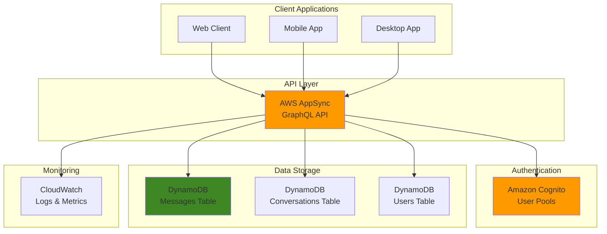

# Implementing Real-Time Chat Applications with AppSync and GraphQL

## Problem

Modern businesses need real-time communication capabilities to enhance customer engagement and team collaboration, but building scalable chat applications presents significant challenges. Traditional polling-based approaches create unnecessary server load and poor user experiences with delayed message delivery. WebSocket implementations require complex connection management, auto-scaling coordination, and message delivery guarantees across distributed systems. Development teams struggle with managing real-time subscriptions, handling connection states, and ensuring message ordering while maintaining security and performance at scale.

## Solution

AWS AppSync provides a fully managed GraphQL service that enables real-time chat applications through WebSocket-based subscriptions with automatic connection management and scaling. The solution leverages GraphQL subscriptions triggered by mutations, eliminating the need for custom WebSocket infrastructure. DynamoDB serves as the message store with efficient queries and automatic scaling, while Cognito provides secure user authentication and authorization. This serverless architecture creates a complete chat platform that scales automatically with demand and follows AWS Well-Architected Framework principles.

## Architecture Diagram



## Prerequisites

1. AWS account with appropriate permissions for AppSync, DynamoDB, Cognito, and IAM
2. AWS CLI v2 installed and configured (or AWS CloudShell)
3. Basic knowledge of GraphQL schema design and subscription patterns
4. Understanding of real-time application architecture patterns
5. Estimated cost: $20-50/month for development and testing workloads

> **Note**: This recipe creates resources that may incur charges. Monitor your usage and clean up resources when testing is complete.

## Preparation

```bash
# Set environment variables
export AWS_REGION=$(aws configure get region)
export AWS_ACCOUNT_ID=$(aws sts get-caller-identity \
    --query Account --output text)

# Generate unique identifiers for resources
RANDOM_SUFFIX=$(aws secretsmanager get-random-password \
    --exclude-punctuation --exclude-uppercase \
    --password-length 8 --require-each-included-type \
    --output text --query RandomPassword)

export CHAT_APP_NAME="realtime-chat-${RANDOM_SUFFIX}"
export APPSYNC_API_NAME="${CHAT_APP_NAME}-api"
export COGNITO_USER_POOL_NAME="${CHAT_APP_NAME}-users"
export DYNAMODB_MESSAGES_TABLE="${CHAT_APP_NAME}-messages"
export DYNAMODB_CONVERSATIONS_TABLE="${CHAT_APP_NAME}-conversations"
export DYNAMODB_USERS_TABLE="${CHAT_APP_NAME}-users"

echo "✅ Environment prepared with suffix: ${RANDOM_SUFFIX}"
```

## Steps

1. **Create Cognito User Pool for Authentication**:

   Amazon Cognito provides secure user authentication and authorization for real-time applications, eliminating the need to build custom authentication systems. User pools manage user registration, login, and token management with built-in security features like password policies, MFA support, and account verification. For chat applications, Cognito integration with AppSync enables automatic user identity injection into GraphQL resolvers, ensuring secure message attribution and access control.

   ```bash
   # Create Cognito User Pool
   USER_POOL_ID=$(aws cognito-idp create-user-pool \
       --pool-name "${COGNITO_USER_POOL_NAME}" \
       --policies "PasswordPolicy={MinimumLength=8,RequireUppercase=true,RequireLowercase=true,RequireNumbers=true,RequireSymbols=false}" \
       --auto-verified-attributes email \
       --username-attributes email \
       --schema "Name=email,AttributeDataType=String,Required=true,Mutable=true" \
       --query 'UserPool.Id' --output text)
   
   # Create User Pool Client
   USER_POOL_CLIENT_ID=$(aws cognito-idp create-user-pool-client \
       --user-pool-id "${USER_POOL_ID}" \
       --client-name "${CHAT_APP_NAME}-client" \
       --explicit-auth-flows "ALLOW_USER_PASSWORD_AUTH" "ALLOW_REFRESH_TOKEN_AUTH" \
       --generate-secret \
       --query 'UserPoolClient.ClientId' --output text)
   
   echo "✅ Created Cognito User Pool: ${USER_POOL_ID}"
   ```

   The user pool is now configured with secure password policies and email-based authentication. The pool client enables your application to authenticate users and obtain JWT tokens that AppSync will validate for each GraphQL operation, ensuring only authenticated users can send messages or access conversations.

2. **Create DynamoDB Tables for Chat Data**:

   DynamoDB provides single-digit millisecond performance and automatic scaling essential for real-time chat applications. The table design follows NoSQL best practices with composite keys and Global Secondary Indexes (GSIs) to support multiple access patterns efficiently. The Messages table uses conversationId as partition key and messageId as sort key, enabling fast message storage and retrieval. The MessagesByTime GSI allows chronological message queries, while DynamoDB Streams capture data changes for triggering notifications or analytics.

   ```bash
   # Create Messages table
   aws dynamodb create-table \
       --table-name "${DYNAMODB_MESSAGES_TABLE}" \
       --attribute-definitions \
           AttributeName=conversationId,AttributeType=S \
           AttributeName=messageId,AttributeType=S \
           AttributeName=createdAt,AttributeType=S \
       --key-schema \
           AttributeName=conversationId,KeyType=HASH \
           AttributeName=messageId,KeyType=RANGE \
       --global-secondary-indexes \
           IndexName=MessagesByTime,KeySchema=[{AttributeName=conversationId,KeyType=HASH},{AttributeName=createdAt,KeyType=RANGE}],Projection={ProjectionType=ALL},ProvisionedThroughput={ReadCapacityUnits=5,WriteCapacityUnits=5} \
       --provisioned-throughput ReadCapacityUnits=5,WriteCapacityUnits=5 \
       --stream-specification StreamEnabled=true,StreamViewType=NEW_AND_OLD_IMAGES
   
   # Create Conversations table
   aws dynamodb create-table \
       --table-name "${DYNAMODB_CONVERSATIONS_TABLE}" \
       --attribute-definitions \
           AttributeName=conversationId,AttributeType=S \
           AttributeName=userId,AttributeType=S \
       --key-schema \
           AttributeName=conversationId,KeyType=HASH \
       --global-secondary-indexes \
           IndexName=UserConversations,KeySchema=[{AttributeName=userId,KeyType=HASH},{AttributeName=conversationId,KeyType=RANGE}],Projection={ProjectionType=ALL},ProvisionedThroughput={ReadCapacityUnits=5,WriteCapacityUnits=5} \
       --provisioned-throughput ReadCapacityUnits=5,WriteCapacityUnits=5
   
   # Create Users table
   aws dynamodb create-table \
       --table-name "${DYNAMODB_USERS_TABLE}" \
       --attribute-definitions \
           AttributeName=userId,AttributeType=S \
       --key-schema \
           AttributeName=userId,KeyType=HASH \
       --provisioned-throughput ReadCapacityUnits=5,WriteCapacityUnits=5
   
   echo "✅ Created DynamoDB tables"
   ```

   The three-table architecture optimizes for chat-specific access patterns: individual message retrieval, chronological message listing, conversation management, and user presence tracking. The UserConversations GSI enables efficient user-to-conversation mapping, supporting features like conversation lists and participant management without expensive scan operations.

3. **Wait for DynamoDB Tables to Become Active**:

   DynamoDB table creation is asynchronous, requiring a brief wait period before tables become available for operations. During this initialization phase, AWS provisions storage, configures indexes, and enables stream processing. The wait commands ensure all tables reach ACTIVE status before proceeding with AppSync configuration, preventing configuration errors that could occur if tables aren't ready.

   ```bash
   # Wait for tables to become active
   aws dynamodb wait table-exists \
       --table-name "${DYNAMODB_MESSAGES_TABLE}"
   aws dynamodb wait table-exists \
       --table-name "${DYNAMODB_CONVERSATIONS_TABLE}"
   aws dynamodb wait table-exists \
       --table-name "${DYNAMODB_USERS_TABLE}"
   
   echo "✅ All DynamoDB tables are now active"
   ```

   All tables are now operational with their GSIs ready for queries. The tables can handle read and write operations, and the DynamoDB Streams on the Messages table are active for capturing data changes that can trigger downstream processing like push notifications.

4. **Create IAM Role for AppSync**:

   AppSync requires an IAM service role to access DynamoDB tables on behalf of your GraphQL API. This role implements the principle of least privilege by granting only the specific DynamoDB permissions needed for chat operations. The trust policy allows AppSync to assume this role, while the permissions policy enables read and write access to your chat tables and their indexes, ensuring secure data access without exposing credentials to client applications.

   ```bash
   # Create trust policy for AppSync
   cat > /tmp/appsync-trust-policy.json << EOF
   {
       "Version": "2012-10-17",
       "Statement": [
           {
               "Effect": "Allow",
               "Principal": {
                   "Service": "appsync.amazonaws.com"
               },
               "Action": "sts:AssumeRole"
           }
       ]
   }
   EOF
   
   # Create AppSync service role
   APPSYNC_ROLE_ARN=$(aws iam create-role \
       --role-name "${CHAT_APP_NAME}-appsync-role" \
       --assume-role-policy-document file:///tmp/appsync-trust-policy.json \
       --query 'Role.Arn' --output text)
   
   # Create policy for DynamoDB access
   cat > /tmp/appsync-dynamodb-policy.json << EOF
   {
       "Version": "2012-10-17",
       "Statement": [
           {
               "Effect": "Allow",
               "Action": [
                   "dynamodb:Query",
                   "dynamodb:PutItem",
                   "dynamodb:GetItem",
                   "dynamodb:UpdateItem",
                   "dynamodb:DeleteItem",
                   "dynamodb:BatchGetItem",
                   "dynamodb:Scan"
               ],
               "Resource": [
                   "arn:aws:dynamodb:${AWS_REGION}:${AWS_ACCOUNT_ID}:table/${DYNAMODB_MESSAGES_TABLE}*",
                   "arn:aws:dynamodb:${AWS_REGION}:${AWS_ACCOUNT_ID}:table/${DYNAMODB_CONVERSATIONS_TABLE}*",
                   "arn:aws:dynamodb:${AWS_REGION}:${AWS_ACCOUNT_ID}:table/${DYNAMODB_USERS_TABLE}*"
               ]
           }
       ]
   }
   EOF
   
   aws iam put-role-policy \
       --role-name "${CHAT_APP_NAME}-appsync-role" \
       --policy-name "DynamoDBAccess" \
       --policy-document file:///tmp/appsync-dynamodb-policy.json
   
   echo "✅ Created AppSync IAM role: ${APPSYNC_ROLE_ARN}"
   ```

   The service role is now configured with precise permissions for DynamoDB operations across all chat tables and their GSIs. The wildcard (*) suffix in resource ARNs grants access to both base tables and indexes, enabling AppSync resolvers to execute efficient queries and mutations without requiring additional permission management.

5. **Create GraphQL Schema for Chat Application**:

   The GraphQL schema defines the data model and API operations for your chat application, establishing type safety and enabling efficient real-time subscriptions. GraphQL's strong typing system ensures data consistency across client applications while subscription decorators enable automatic WebSocket connections for real-time updates. The schema supports essential chat features including message threading, user presence, and conversation management through carefully designed types and relationships.

   ```bash
   # Create GraphQL schema
   cat > /tmp/chat-schema.graphql << 'EOF'
   type Message {
       messageId: ID!
       conversationId: ID!
       userId: ID!
       content: String!
       messageType: MessageType!
       createdAt: AWSDateTime!
       updatedAt: AWSDateTime
       author: User
   }
   
   type Conversation {
       conversationId: ID!
       name: String
       participants: [ID!]!
       lastMessageAt: AWSDateTime
       lastMessage: String
       createdAt: AWSDateTime!
       updatedAt: AWSDateTime
       createdBy: ID!
       messageCount: Int
   }
   
   type User {
       userId: ID!
       username: String!
       email: AWSEmail!
       displayName: String
       avatarUrl: String
       lastSeen: AWSDateTime
       isOnline: Boolean
       createdAt: AWSDateTime!
       updatedAt: AWSDateTime
   }
   
   enum MessageType {
       TEXT
       IMAGE
       FILE
       SYSTEM
   }
   
   type Query {
       getMessage(conversationId: ID!, messageId: ID!): Message
       getConversation(conversationId: ID!): Conversation
       getUser(userId: ID!): User
       listMessages(conversationId: ID!, limit: Int, nextToken: String): MessageConnection
       listConversations(userId: ID!, limit: Int, nextToken: String): ConversationConnection
       searchMessages(conversationId: ID!, searchTerm: String!, limit: Int): [Message]
   }
   
   type Mutation {
       sendMessage(input: SendMessageInput!): Message
       createConversation(input: CreateConversationInput!): Conversation
       updateConversation(input: UpdateConversationInput!): Conversation
       deleteMessage(conversationId: ID!, messageId: ID!): Message
       updateUserPresence(userId: ID!, isOnline: Boolean!): User
       updateUserProfile(input: UpdateUserProfileInput!): User
   }
   
   type Subscription {
       onMessageSent(conversationId: ID!): Message
           @aws_subscribe(mutations: ["sendMessage"])
       onConversationUpdated(userId: ID!): Conversation
           @aws_subscribe(mutations: ["createConversation", "updateConversation"])
       onUserPresenceUpdated(conversationId: ID!): User
           @aws_subscribe(mutations: ["updateUserPresence"])
   }
   
   input SendMessageInput {
       conversationId: ID!
       content: String!
       messageType: MessageType = TEXT
   }
   
   input CreateConversationInput {
       name: String
       participants: [ID!]!
   }
   
   input UpdateConversationInput {
       conversationId: ID!
       name: String
   }
   
   input UpdateUserProfileInput {
       userId: ID!
       displayName: String
       avatarUrl: String
   }
   
   type MessageConnection {
       items: [Message]
       nextToken: String
   }
   
   type ConversationConnection {
       items: [Conversation]
       nextToken: String
   }
   
   schema {
       query: Query
       mutation: Mutation
       subscription: Subscription
   }
   EOF
   
   echo "✅ Created GraphQL schema"
   ```

   The schema establishes a comprehensive chat data model with proper relationships between users, conversations, and messages. The subscription types with @aws_subscribe directives enable real-time updates when mutations occur, automatically triggering WebSocket notifications to subscribed clients without requiring custom connection management.

6. **Create AppSync API**:

   AppSync provides a fully managed GraphQL service that handles WebSocket connections, subscription management, and real-time data synchronization automatically. The API integrates with Cognito for authentication, ensuring every GraphQL operation includes user context for secure message attribution. AppSync generates both HTTP and WebSocket endpoints - the GraphQL endpoint handles queries and mutations while the real-time endpoint manages subscription connections for live message delivery.

   ```bash
   # Create AppSync API
   API_ID=$(aws appsync create-graphql-api \
       --name "${APPSYNC_API_NAME}" \
       --authentication-type AMAZON_COGNITO_USER_POOLS \
       --user-pool-config "userPoolId=${USER_POOL_ID},awsRegion=${AWS_REGION},defaultAction=ALLOW" \
       --query 'graphqlApi.apiId' --output text)
   
   # Get API details
   API_URL=$(aws appsync get-graphql-api \
       --api-id "${API_ID}" \
       --query 'graphqlApi.uris.GRAPHQL' --output text)
   
   REALTIME_URL=$(aws appsync get-graphql-api \
       --api-id "${API_ID}" \
       --query 'graphqlApi.uris.REALTIME' --output text)
   
   # Upload schema
   aws appsync start-schema-creation \
       --api-id "${API_ID}" \
       --definition file:///tmp/chat-schema.graphql
   
   echo "✅ Created AppSync API: ${API_ID}"
   echo "   GraphQL URL: ${API_URL}"
   echo "   Real-time URL: ${REALTIME_URL}"
   ```

   The AppSync API is now configured with Cognito authentication and schema validation. Client applications can connect to the GraphQL endpoint for standard operations and establish WebSocket connections to the real-time endpoint for receiving live message updates, user presence changes, and conversation notifications.

7. **Create DynamoDB Data Sources**:

   AppSync data sources establish secure connections between your GraphQL API and DynamoDB tables, enabling resolvers to perform database operations without exposing credentials. Each data source binds to a specific table and uses the IAM service role for authentication, ensuring GraphQL operations have appropriate permissions. This separation allows fine-grained access control and enables different resolvers to interact with different tables while maintaining security boundaries.

   ```bash
   # Create Messages table data source
   MESSAGES_DS_NAME=$(aws appsync create-data-source \
       --api-id "${API_ID}" \
       --name "MessagesTable" \
       --type "AMAZON_DYNAMODB" \
       --service-role-arn "${APPSYNC_ROLE_ARN}" \
       --dynamodb-config "tableName=${DYNAMODB_MESSAGES_TABLE},awsRegion=${AWS_REGION}" \
       --query 'dataSource.name' --output text)
   
   # Create Conversations table data source
   CONVERSATIONS_DS_NAME=$(aws appsync create-data-source \
       --api-id "${API_ID}" \
       --name "ConversationsTable" \
       --type "AMAZON_DYNAMODB" \
       --service-role-arn "${APPSYNC_ROLE_ARN}" \
       --dynamodb-config "tableName=${DYNAMODB_CONVERSATIONS_TABLE},awsRegion=${AWS_REGION}" \
       --query 'dataSource.name' --output text)
   
   # Create Users table data source
   USERS_DS_NAME=$(aws appsync create-data-source \
       --api-id "${API_ID}" \
       --name "UsersTable" \
       --type "AMAZON_DYNAMODB" \
       --service-role-arn "${APPSYNC_ROLE_ARN}" \
       --dynamodb-config "tableName=${DYNAMODB_USERS_TABLE},awsRegion=${AWS_REGION}" \
       --query 'dataSource.name' --output text)
   
   echo "✅ Created DynamoDB data sources"
   ```

   The data sources are now configured and ready for resolver attachment. Each data source provides a secure, role-based connection to its respective DynamoDB table, enabling GraphQL resolvers to perform chat operations like sending messages, creating conversations, and updating user presence with sub-100ms latency.

8. **Create VTL Resolvers for Core Operations**:

   VTL (Velocity Template Language) resolvers provide direct integration between GraphQL operations and DynamoDB without requiring Lambda functions, reducing latency and operational complexity. The sendMessage resolver automatically generates unique message IDs and timestamps while injecting the authenticated user's identity from Cognito. This approach enables sub-100ms message delivery while maintaining security through automatic user context injection, ensuring users can only send messages as themselves.

   > **Warning**: VTL templates are case-sensitive and require precise JSON formatting. Test resolvers thoroughly in the AppSync console before deploying to production environments.

   ```bash
   # Create sendMessage mutation resolver
   cat > /tmp/send-message-request.vtl << 'EOF'
   {
       "version": "2017-02-28",
       "operation": "PutItem",
       "key": {
           "conversationId": $util.dynamodb.toDynamoDBJson($ctx.args.input.conversationId),
           "messageId": $util.dynamodb.toDynamoDBJson($util.autoId())
       },
       "attributeValues": {
           "userId": $util.dynamodb.toDynamoDBJson($ctx.identity.sub),
           "content": $util.dynamodb.toDynamoDBJson($ctx.args.input.content),
           "messageType": $util.dynamodb.toDynamoDBJson($ctx.args.input.messageType),
           "createdAt": $util.dynamodb.toDynamoDBJson($util.time.nowISO8601()),
           "updatedAt": $util.dynamodb.toDynamoDBJson($util.time.nowISO8601())
       }
   }
   EOF
   
   cat > /tmp/send-message-response.vtl << 'EOF'
   $util.toJson($ctx.result)
   EOF
   
   # Create sendMessage resolver
   aws appsync create-resolver \
       --api-id "${API_ID}" \
       --type-name "Mutation" \
       --field-name "sendMessage" \
       --data-source-name "${MESSAGES_DS_NAME}" \
       --request-mapping-template file:///tmp/send-message-request.vtl \
       --response-mapping-template file:///tmp/send-message-response.vtl
   
   echo "✅ Created sendMessage resolver"
   ```

   The sendMessage resolver is now active and will automatically trigger GraphQL subscriptions when messages are sent. The resolver validates user authentication, stores messages with proper attribution, and enables real-time delivery to all clients subscribed to the conversation's message updates.

9. **Create listMessages Query Resolver**:

   The listMessages resolver leverages DynamoDB's MessagesByTime GSI to efficiently retrieve messages in chronological order with pagination support. Setting scanIndexForward to false returns messages in reverse chronological order (newest first), which is optimal for chat interfaces that display recent messages at the bottom. The resolver implements cursor-based pagination using DynamoDB's native nextToken mechanism, enabling smooth scrolling through conversation history without performance degradation.

   ```bash
   # Create listMessages query resolver
   cat > /tmp/list-messages-request.vtl << 'EOF'
   {
       "version": "2017-02-28",
       "operation": "Query",
       "index": "MessagesByTime",
       "query": {
           "expression": "conversationId = :conversationId",
           "expressionValues": {
               ":conversationId": $util.dynamodb.toDynamoDBJson($ctx.args.conversationId)
           }
       },
       "scanIndexForward": false,
       "limit": #if($ctx.args.limit) $ctx.args.limit #else 50 #end
       #if($ctx.args.nextToken)
       ,"nextToken": "$ctx.args.nextToken"
       #end
   }
   EOF
   
   cat > /tmp/list-messages-response.vtl << 'EOF'
   {
       "items": $util.toJson($ctx.result.items),
       "nextToken": #if($ctx.result.nextToken) "$ctx.result.nextToken" #else null #end
   }
   EOF
   
   # Create listMessages resolver
   aws appsync create-resolver \
       --api-id "${API_ID}" \
       --type-name "Query" \
       --field-name "listMessages" \
       --data-source-name "${MESSAGES_DS_NAME}" \
       --request-mapping-template file:///tmp/list-messages-request.vtl \
       --response-mapping-template file:///tmp/list-messages-response.vtl
   
   echo "✅ Created listMessages resolver"
   ```

   The message listing resolver now provides efficient conversation history retrieval with pagination support. Clients can load initial message sets and implement infinite scrolling by passing the nextToken for subsequent page requests, maintaining optimal performance even in conversations with thousands of messages.

10. **Create Additional Resolvers for Conversations**:

    Conversation management requires dedicated resolvers to handle group creation, participant management, and conversation metadata updates. The createConversation resolver automatically generates unique conversation IDs and initializes conversation state with proper ownership attribution through Cognito user context. This resolver enables features like group chats, direct messages, and conversation analytics by maintaining participant lists and creation metadata.

    ```bash
    # Create createConversation mutation resolver
    cat > /tmp/create-conversation-request.vtl << 'EOF'
    {
        "version": "2017-02-28",
        "operation": "PutItem",
        "key": {
            "conversationId": $util.dynamodb.toDynamoDBJson($util.autoId())
        },
        "attributeValues": {
            "name": $util.dynamodb.toDynamoDBJson($ctx.args.input.name),
            "participants": $util.dynamodb.toDynamoDBJson($ctx.args.input.participants),
            "createdBy": $util.dynamodb.toDynamoDBJson($ctx.identity.sub),
            "createdAt": $util.dynamodb.toDynamoDBJson($util.time.nowISO8601()),
            "updatedAt": $util.dynamodb.toDynamoDBJson($util.time.nowISO8601()),
            "messageCount": $util.dynamodb.toDynamoDBJson(0)
        }
    }
    EOF
    
    cat > /tmp/create-conversation-response.vtl << 'EOF'
    $util.toJson($ctx.result)
    EOF
    
    # Create createConversation resolver
    aws appsync create-resolver \
        --api-id "${API_ID}" \
        --type-name "Mutation" \
        --field-name "createConversation" \
        --data-source-name "${CONVERSATIONS_DS_NAME}" \
        --request-mapping-template file:///tmp/create-conversation-request.vtl \
        --response-mapping-template file:///tmp/create-conversation-response.vtl
    
    echo "✅ Created createConversation resolver"
    ```

    The conversation resolver establishes the foundation for multi-user chat rooms with proper access control and participant management. The UserConversations GSI will enable efficient lookup of conversations per user, supporting features like conversation lists and notification targeting.

11. **Create User Presence Resolver**:

    User presence tracking enables essential chat features like online indicators, typing status, and last-seen timestamps. The updateUserPresence resolver uses DynamoDB's atomic update operations to maintain accurate presence state even with concurrent user sessions. This resolver triggers GraphQL subscriptions to notify other users of presence changes, enabling real-time status updates across all connected clients in shared conversations.

    ```bash
    # Create updateUserPresence mutation resolver
    cat > /tmp/update-user-presence-request.vtl << 'EOF'
    {
        "version": "2017-02-28",
        "operation": "UpdateItem",
        "key": {
            "userId": $util.dynamodb.toDynamoDBJson($ctx.args.userId)
        },
        "update": {
            "expression": "SET isOnline = :isOnline, lastSeen = :lastSeen, updatedAt = :updatedAt",
            "expressionValues": {
                ":isOnline": $util.dynamodb.toDynamoDBJson($ctx.args.isOnline),
                ":lastSeen": $util.dynamodb.toDynamoDBJson($util.time.nowISO8601()),
                ":updatedAt": $util.dynamodb.toDynamoDBJson($util.time.nowISO8601())
            }
        }
    }
    EOF
    
    cat > /tmp/update-user-presence-response.vtl << 'EOF'
    $util.toJson($ctx.result)
    EOF
    
    # Create updateUserPresence resolver
    aws appsync create-resolver \
        --api-id "${API_ID}" \
        --type-name "Mutation" \
        --field-name "updateUserPresence" \
        --data-source-name "${USERS_DS_NAME}" \
        --request-mapping-template file:///tmp/update-user-presence-request.vtl \
        --response-mapping-template file:///tmp/update-user-presence-response.vtl
    
    echo "✅ Created updateUserPresence resolver"
    ```

    The presence system is now active and will automatically update user status information with atomic consistency. When users come online or go offline, all subscribed clients in their shared conversations will receive immediate presence notifications through the onUserPresenceUpdated subscription.

12. **Create Test Users and Sample Data**:

    Creating test users enables immediate validation of your chat application's authentication and messaging capabilities. These users provide realistic testing scenarios for features like conversation creation, message sending, and real-time subscription behavior. The admin-create-user command bypasses email verification for development environments, while setting permanent passwords enables immediate testing without email confirmation workflows.

    ```bash
    # Create test users in Cognito
    aws cognito-idp admin-create-user \
        --user-pool-id "${USER_POOL_ID}" \
        --username "testuser1" \
        --user-attributes Name=email,Value=testuser1@example.com \
        --temporary-password "TempPassword123!" \
        --message-action SUPPRESS
    
    aws cognito-idp admin-create-user \
        --user-pool-id "${USER_POOL_ID}" \
        --username "testuser2" \
        --user-attributes Name=email,Value=testuser2@example.com \
        --temporary-password "TempPassword123!" \
        --message-action SUPPRESS
    
    # Set permanent passwords
    aws cognito-idp admin-set-user-password \
        --user-pool-id "${USER_POOL_ID}" \
        --username "testuser1" \
        --password "TestPassword123!" \
        --permanent
    
    aws cognito-idp admin-set-user-password \
        --user-pool-id "${USER_POOL_ID}" \
        --username "testuser2" \
        --password "TestPassword123!" \
        --permanent
    
    echo "✅ Created test users with credentials:"
    echo "   User 1: testuser1@example.com / TestPassword123!"
    echo "   User 2: testuser2@example.com / TestPassword123!"
    ```

    The test users are now ready for application testing with permanent credentials. These accounts can authenticate with your AppSync API, create conversations, send messages, and demonstrate real-time subscription functionality across multiple client sessions.

    > **Note**: For production environments, implement proper user registration flows with email verification and stronger password policies. See the [Cognito User Pools documentation](https://docs.aws.amazon.com/cognito/latest/developerguide/cognito-user-pools.html) for advanced security configurations.

## Validation & Testing

1. **Test AppSync API Configuration**:

   ```bash
   # Verify API is active
   aws appsync get-graphql-api \
       --api-id "${API_ID}" \
       --query 'graphqlApi.{Name:name,Status:status,ApiId:apiId}'
   ```

   Expected output: API should show "SUCCESS" status

2. **Test Data Source Connections**:

   ```bash
   # List all data sources
   aws appsync list-data-sources \
       --api-id "${API_ID}" \
       --query 'dataSources[].{Name:name,Type:type,Status:status}'
   ```

   Expected output: All data sources should show active status

3. **Test Real-time Subscription Connection**:

   ```bash
   # Create a simple GraphQL query to test the endpoint
   cat > /tmp/test-query.json << EOF
   {
       "query": "query { __schema { types { name } } }"
   }
   EOF
   
   # Test the GraphQL endpoint accessibility
   echo "GraphQL API endpoint: ${API_URL}"
   echo "Real-time WebSocket endpoint: ${REALTIME_URL}"
   echo "✅ Endpoints configured successfully"
   ```

4. **Verify DynamoDB Table Structure**:

   ```bash
   # Check table status and structure
   aws dynamodb describe-table \
       --table-name "${DYNAMODB_MESSAGES_TABLE}" \
       --query 'Table.{TableName:TableName,Status:TableStatus,ItemCount:ItemCount}'
   
   aws dynamodb describe-table \
       --table-name "${DYNAMODB_CONVERSATIONS_TABLE}" \
       --query 'Table.{TableName:TableName,Status:TableStatus,ItemCount:ItemCount}'
   ```

   Expected output: Tables should show "ACTIVE" status

## Cleanup

1. **Delete AppSync API and Resources**:

   ```bash
   # Delete AppSync API (this removes all resolvers and data sources)
   aws appsync delete-graphql-api \
       --api-id "${API_ID}"
   
   echo "✅ Deleted AppSync API"
   ```

2. **Delete DynamoDB Tables**:

   ```bash
   # Delete DynamoDB tables
   aws dynamodb delete-table \
       --table-name "${DYNAMODB_MESSAGES_TABLE}"
   aws dynamodb delete-table \
       --table-name "${DYNAMODB_CONVERSATIONS_TABLE}"
   aws dynamodb delete-table \
       --table-name "${DYNAMODB_USERS_TABLE}"
   
   echo "✅ Deleted DynamoDB tables"
   ```

3. **Delete Cognito User Pool**:

   ```bash
   # Delete Cognito User Pool
   aws cognito-idp delete-user-pool \
       --user-pool-id "${USER_POOL_ID}"
   
   echo "✅ Deleted Cognito User Pool"
   ```

4. **Delete IAM Role and Policies**:

   ```bash
   # Delete IAM role and policies
   aws iam delete-role-policy \
       --role-name "${CHAT_APP_NAME}-appsync-role" \
       --policy-name "DynamoDBAccess"
   
   aws iam delete-role \
       --role-name "${CHAT_APP_NAME}-appsync-role"
   
   echo "✅ Deleted IAM resources"
   ```

5. **Clean Up Temporary Files**:

   ```bash
   # Remove temporary files
   rm -f /tmp/chat-schema.graphql \
         /tmp/appsync-trust-policy.json \
         /tmp/appsync-dynamodb-policy.json \
         /tmp/send-message-*.vtl \
         /tmp/list-messages-*.vtl \
         /tmp/create-conversation-*.vtl \
         /tmp/update-user-presence-*.vtl \
         /tmp/test-query.json
   
   echo "✅ Cleaned up temporary files"
   ```

## Discussion

AWS AppSync provides a powerful foundation for building real-time chat applications by abstracting away the complexity of WebSocket management and subscription handling. The service automatically manages connection lifecycles, handles reconnections, and provides built-in authorization through integration with Amazon Cognito. GraphQL subscriptions offer a declarative approach to real-time updates, where clients can specify exactly what data they need when messages are sent or user presence changes, following AWS Well-Architected Framework principles for operational excellence and reliability.

The architecture leverages DynamoDB's single-table design principles with carefully crafted Global Secondary Indexes to support efficient queries across different access patterns. The MessagesByTime index enables chronological message retrieval, while the UserConversations index allows users to quickly find their active conversations. DynamoDB Streams can be enabled to trigger additional processing, such as push notifications or message analytics, making the system highly extensible and supporting the sustainability pillar through efficient resource utilization.

VTL (Velocity Template Language) resolvers provide direct integration between GraphQL operations and DynamoDB without requiring Lambda functions, reducing latency and costs while improving performance efficiency. The resolvers handle input validation, data transformation, and response formatting while maintaining security through automatic injection of user identity context. This approach enables sub-100ms response times for message operations while supporting millions of concurrent connections, demonstrating the scalability benefits of serverless architecture patterns on AWS.

> **Tip**: Use DynamoDB's TTL feature to automatically clean up old messages and implement message retention policies without additional infrastructure. See the [DynamoDB TTL documentation](https://docs.aws.amazon.com/amazondynamodb/latest/developerguide/TTL.html) for implementation guidance.

## Challenge

Extend this solution by implementing these enhancements:

1. **Message Threading and Reactions**: Add support for threaded conversations and emoji reactions by extending the schema with reply-to relationships and reaction counts, implementing additional DynamoDB GSIs for efficient thread queries.

2. **File Upload and Media Sharing**: Integrate S3 presigned URLs for secure file uploads, implement image resizing with Lambda, and add media message types with thumbnail generation for improved user experience.

3. **Advanced Search and Analytics**: Implement Amazon OpenSearch Service for full-text message search, add conversation analytics with Amazon Kinesis Data Analytics, and create real-time dashboards with Amazon QuickSight.

4. **Multi-tenant Architecture**: Extend the solution to support multiple organizations with tenant isolation, implement cross-tenant user discovery, and add administrative controls for conversation management and user permissions.

5. **Push Notifications and Offline Support**: Integrate Amazon SNS for mobile push notifications, implement message queuing for offline users, and add background sync capabilities for mobile applications using AWS Amplify DataStore.

## Infrastructure Code

*Infrastructure code will be generated after recipe approval.*