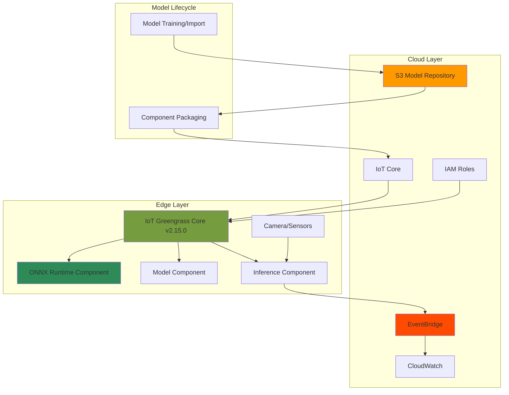

# Real-Time Edge AI Inference with IoT Greengrass and ONNX

## Problem

Manufacturing plants and industrial facilities generate vast amounts of visual data that requires real-time analysis for quality control, anomaly detection, and predictive maintenance. Sending all this data to the cloud introduces unacceptable latency, bandwidth costs, and privacy concerns. Organizations need a solution that performs AI inference directly on edge devices while maintaining centralized model management, monitoring capabilities, and the ability to update models remotely without disrupting operations.

## Solution

Deploy machine learning models to edge devices using AWS IoT Greengrass v2 with ONNX runtime for real-time inference, combined with EventBridge for centralized monitoring and orchestration. This architecture enables low-latency AI processing at the edge while maintaining cloud-based model management, automated updates, and comprehensive monitoring through a unified event-driven system that scales across thousands of edge devices.

## Architecture Diagram



## Prerequisites

1. AWS account with administrative permissions for IoT Greengrass, EventBridge, S3, and IoT Core
2. AWS CLI v2 installed and configured (or AWS CloudShell)
3. Edge device (Raspberry Pi 4, NVIDIA Jetson, or x86_64 Linux device) with internet connectivity
4. Python 3.8+ installed on the edge device
5. Basic understanding of machine learning concepts and IoT architectures
6. Estimated cost: $5-10/month for cloud services + edge device hardware

> **Note**: This recipe uses the ONNX-based approach for edge ML inference with IoT Greengrass v2, which is the current recommended pattern after SageMaker Edge Manager's discontinuation.

## Preparation

```bash
# Set environment variables
export AWS_REGION=$(aws configure get region)
export AWS_ACCOUNT_ID=$(aws sts get-caller-identity \
    --query Account --output text)

# Generate unique identifiers
RANDOM_SUFFIX=$(aws secretsmanager get-random-password \
    --exclude-punctuation --exclude-uppercase \
    --password-length 6 --require-each-included-type \
    --output text --query RandomPassword)

export EDGE_PROJECT_NAME="edge-ai-inference-${RANDOM_SUFFIX}"
export S3_BUCKET_NAME="edge-models-${RANDOM_SUFFIX}"
export GREENGRASS_THING_NAME="edge-device-${RANDOM_SUFFIX}"
export EVENT_BUS_NAME="edge-monitoring-bus"

# Create S3 bucket for model storage with encryption
aws s3 mb s3://${S3_BUCKET_NAME} --region ${AWS_REGION}

aws s3api put-bucket-encryption \
    --bucket ${S3_BUCKET_NAME} \
    --server-side-encryption-configuration \
    'Rules=[{ApplyServerSideEncryptionByDefault:{SSEAlgorithm:AES256}}]'

aws s3api put-bucket-versioning \
    --bucket ${S3_BUCKET_NAME} \
    --versioning-configuration Status=Enabled

echo "✅ Created S3 bucket with encryption and versioning enabled"
```

## Steps

1. **Create IAM Roles for IoT Greengrass**:

   IoT Greengrass requires specific IAM roles to interact with AWS services from edge devices. The Token Exchange Role enables secure credential management following AWS security best practices. This security architecture implements the principle of least privilege, ensuring edge devices only access required resources while maintaining enterprise-grade security posture.

   ```bash
   # Create Greengrass Token Exchange Role trust policy
   cat > greengrass-trust-policy.json << EOF
   {
     "Version": "2012-10-17",
     "Statement": [
       {
         "Effect": "Allow",
         "Principal": {
           "Service": "credentials.iot.amazonaws.com"
         },
         "Action": "sts:AssumeRole"
       }
     ]
   }
   EOF

   # Create Token Exchange Role
   aws iam create-role \
       --role-name GreengrassV2TokenExchangeRole \
       --assume-role-policy-document \
       file://greengrass-trust-policy.json

   # Attach AWS managed policy for Greengrass v2
   aws iam attach-role-policy \
       --role-name GreengrassV2TokenExchangeRole \
       --policy-arn \
       arn:aws:iam::aws:policy/GreengrassV2TokenExchangeRoleAccess

   # Create IoT Role Alias for secure credential exchange
   aws iot create-role-alias \
       --role-alias GreengrassV2TokenExchangeRoleAlias \
       --role-arn arn:aws:iam::${AWS_ACCOUNT_ID}:role/\
GreengrassV2TokenExchangeRole

   echo "✅ Created IAM roles for secure edge device access"
   ```

   The Token Exchange Role now enables IoT Greengrass to securely obtain temporary AWS credentials on behalf of edge devices. This eliminates the need to store long-term credentials on devices, significantly improving security posture for edge deployments while maintaining compliance with AWS security best practices.

2. **Prepare Machine Learning Model Artifacts**:

   ONNX (Open Neural Network Exchange) provides a standardized format for machine learning models that ensures compatibility across different hardware architectures and runtime environments. This preparation step establishes the foundation for edge deployment by organizing model artifacts in S3 with proper metadata for version management.

   ```bash
   # Create model preparation directory structure
   mkdir -p model-artifacts

   # Create sample ONNX model metadata
   cat > model-artifacts/metadata.json << EOF
   {
       "model_name": "defect_detection_v1",
       "model_version": "1.0.0",
       "input_shape": [1, 3, 224, 224],
       "output_classes": ["normal", "defect"],
       "framework": "onnx",
       "created_at": "$(date -u +%Y-%m-%dT%H:%M:%SZ)",
       "model_type": "classification",
       "target_devices": ["arm64", "x86_64"]
   }
   EOF

   # Create placeholder model files for demonstration
   echo "# ONNX Model Placeholder" > model-artifacts/model.onnx
   echo "{\"input_name\": \"input\"}" > model-artifacts/config.json

   # Upload model artifacts to S3 with versioning
   aws s3 cp model-artifacts/ \
       s3://${S3_BUCKET_NAME}/models/v1.0.0/ \
       --recursive \
       --metadata "ModelVersion=1.0.0,Framework=ONNX"

   echo "✅ Model artifacts uploaded with proper metadata"
   ```

   The model preparation step establishes the foundation for edge deployment with proper versioning and metadata. In production scenarios, you would train models using SageMaker, optimize them for your target hardware, and store the artifacts in S3 for distribution to edge devices with full audit trails.

3. **Create ONNX Runtime Component for Edge Deployment**:

   IoT Greengrass components are the building blocks of edge applications. The ONNX runtime component installs and manages the machine learning framework on edge devices using the latest stable versions. This modular approach enables independent updates of runtime libraries without affecting inference logic, improving maintainability and reducing deployment complexity.

   ```bash
   # Create ONNX runtime component recipe with latest versions
   cat > onnx-runtime-recipe.json << EOF
   {
     "RecipeFormatVersion": "2020-01-25",
     "ComponentName": "com.edge.OnnxRuntime",
     "ComponentVersion": "1.0.0",
     "ComponentDescription": "ONNX Runtime for edge inference",
     "ComponentPublisher": "EdgeAI",
     "ComponentConfiguration": {
       "DefaultConfiguration": {
         "PythonPackages": [
           "onnxruntime==1.19.2",
           "numpy==1.26.4",
           "opencv-python-headless==4.10.0.84"
         ]
       }
     },
     "Manifests": [
       {
         "Platform": {
           "os": "linux"
         },
         "Lifecycle": {
           "Install": {
             "Script": "pip3 install onnxruntime==1.19.2 numpy==1.26.4 opencv-python-headless==4.10.0.84",
             "Timeout": 300,
             "RequiresPrivilege": false
           }
         }
       }
     ]
   }
   EOF

   # Create the ONNX runtime component in IoT Greengrass
   aws greengrassv2 create-component-version \
       --inline-recipe file://onnx-runtime-recipe.json

   echo "✅ Created ONNX runtime component with latest stable versions"
   ```

   The ONNX runtime component now provides a standardized machine learning execution environment across all edge devices. This consistency ensures models behave identically regardless of the underlying hardware, simplifying deployment and debugging processes while using the latest stable runtime versions.

4. **Create Model Component for Versioned Deployment**:

   Model components encapsulate trained AI models as deployable artifacts in IoT Greengrass. This separation of models from inference code enables independent model updates without modifying application logic. The component automatically downloads models from S3 during deployment, ensuring edge devices always run the latest approved versions with proper security controls.

   ```bash
   # Create model component recipe with enhanced configuration
   cat > model-component-recipe.json << EOF
   {
     "RecipeFormatVersion": "2020-01-25",
     "ComponentName": "com.edge.DefectDetectionModel",
     "ComponentVersion": "1.0.0",
     "ComponentDescription": "Defect detection model for edge inference",
     "ComponentPublisher": "EdgeAI",
     "ComponentConfiguration": {
       "DefaultConfiguration": {
         "ModelPath": "/greengrass/v2/work/com.edge.DefectDetectionModel",
         "ModelS3Uri": "s3://${S3_BUCKET_NAME}/models/v1.0.0/",
         "ModelVersion": "1.0.0",
         "ChecksumValidation": true
       }
     },
     "Manifests": [
       {
         "Platform": {
           "os": "linux"
         },
         "Artifacts": [
           {
             "URI": "s3://${S3_BUCKET_NAME}/models/v1.0.0/model.onnx",
             "Unarchive": "NONE",
             "Permission": {
               "Read": "OWNER",
               "Execute": "NONE"
             }
           },
           {
             "URI": "s3://${S3_BUCKET_NAME}/models/v1.0.0/config.json",
             "Unarchive": "NONE",
             "Permission": {
               "Read": "OWNER",
               "Execute": "NONE"
             }
           },
           {
             "URI": "s3://${S3_BUCKET_NAME}/models/v1.0.0/metadata.json",
             "Unarchive": "NONE",
             "Permission": {
               "Read": "OWNER",
               "Execute": "NONE"
             }
           }
         ],
         "Lifecycle": {
           "Install": {
             "Script": "echo 'Model artifacts downloaded successfully'",
             "RequiresPrivilege": false
           }
         }
       }
     ]
   }
   EOF

   # Create the model component
   aws greengrassv2 create-component-version \
       --inline-recipe file://model-component-recipe.json

   echo "✅ Created model component with security controls"
   ```

   Model components provide versioned, auditable deployment of AI models to edge devices with proper file permissions and checksum validation. This approach enables A/B testing, gradual rollouts, and instant rollbacks if issues are detected, critical capabilities for maintaining high-quality edge AI systems in production environments.

5. **Create Enhanced Inference Component with EventBridge Integration**:

   The inference component implements the business logic for real-time AI processing with comprehensive error handling and performance monitoring. It loads models, processes sensor data, performs inference, and publishes detailed results to EventBridge for centralized monitoring. This event-driven architecture enables real-time visibility into edge AI performance across entire device fleets.

   ```bash
   # Create enhanced inference application code
   cat > inference_app.py << 'EOF'
   import json
   import time
   import os
   import logging
   from datetime import datetime
   from typing import Optional, Dict, Any
   
   try:
       import boto3
       import onnxruntime as ort
       import numpy as np
       import cv2
   except ImportError as e:
       logging.error(f"Required package not installed: {e}")
       exit(1)

   # Configure logging
   logging.basicConfig(
       level=logging.INFO,
       format='%(asctime)s - %(levelname)s - %(message)s'
   )
   logger = logging.getLogger(__name__)

   class EdgeInferenceEngine:
       def __init__(self):
           self.model_path = os.environ.get('MODEL_PATH', 
               '/greengrass/v2/work/com.edge.DefectDetectionModel/model.onnx')
           self.metadata_path = os.environ.get('METADATA_PATH',
               '/greengrass/v2/work/com.edge.DefectDetectionModel/metadata.json')
           self.eventbridge = boto3.client('events')
           self.device_id = os.environ.get('AWS_IOT_THING_NAME', 'unknown')
           self.event_bus_name = os.environ.get('EVENT_BUS_NAME', 'default')
           self.session = None
           self.model_metadata = {}
           self.inference_count = 0
           
           self.load_model_metadata()
           self.load_model()
       
       def load_model_metadata(self):
           """Load model metadata for validation and monitoring"""
           try:
               if os.path.exists(self.metadata_path):
                   with open(self.metadata_path, 'r') as f:
                       self.model_metadata = json.load(f)
                   logger.info(f"Loaded model metadata: {self.model_metadata.get('model_name', 'Unknown')}")
               else:
                   logger.warning("Model metadata file not found")
           except Exception as e:
               logger.error(f"Failed to load model metadata: {e}")
       
       def load_model(self):
           """Load ONNX model for inference with error handling"""
           try:
               if not os.path.exists(self.model_path):
                   raise FileNotFoundError(f"Model file not found: {self.model_path}")
               
               # Configure ONNX Runtime with optimizations
               providers = ['CPUExecutionProvider']
               sess_options = ort.SessionOptions()
               sess_options.graph_optimization_level = ort.GraphOptimizationLevel.ORT_ENABLE_ALL
               
               self.session = ort.InferenceSession(
                   self.model_path, 
                   sess_options=sess_options,
                   providers=providers
               )
               
               # Get model input/output info
               self.input_name = self.session.get_inputs()[0].name
               self.input_shape = self.session.get_inputs()[0].shape
               self.output_names = [output.name for output in self.session.get_outputs()]
               
               logger.info(f"✅ Model loaded successfully from {self.model_path}")
               logger.info(f"Input shape: {self.input_shape}, Output names: {self.output_names}")
               
               # Publish successful model load event
               self.publish_event('ModelLoadSuccess', {
                   'model_metadata': self.model_metadata,
                   'input_shape': self.input_shape,
                   'providers': providers
               })
               
           except Exception as e:
               logger.error(f"❌ Model loading failed: {e}")
               self.publish_event('ModelLoadError', {'error': str(e)})
               raise
       
       def preprocess_image(self, image_path: str) -> Optional[np.ndarray]:
           """Preprocess image for model input with error handling"""
           try:
               if not os.path.exists(image_path):
                   # Create dummy image for demonstration
                   image = np.random.randint(0, 255, (224, 224, 3), dtype=np.uint8)
               else:
                   image = cv2.imread(image_path)
                   if image is None:
                       raise ValueError(f"Failed to load image: {image_path}")
               
               # Preprocess according to model requirements
               image = cv2.resize(image, (224, 224))
               image = image.astype(np.float32) / 255.0
               image = np.transpose(image, (2, 0, 1))
               return np.expand_dims(image, axis=0)
               
           except Exception as e:
               logger.error(f"Image preprocessing failed: {e}")
               return None
       
       def run_inference(self, image_path: str) -> Optional[Dict[str, Any]]:
           """Perform inference with comprehensive error handling and timing"""
           if self.session is None:
               logger.error("Model not loaded")
               return None
           
           start_time = time.time()
           
           try:
               # Preprocess input
               input_data = self.preprocess_image(image_path)
               if input_data is None:
                   return None
               
               # Run inference
               inference_start = time.time()
               outputs = self.session.run(self.output_names, {self.input_name: input_data})
               inference_time = (time.time() - inference_start) * 1000  # Convert to ms
               
               # Process results
               predictions = outputs[0][0] if outputs else [0.5, 0.5]  # Fallback for demo
               class_idx = np.argmax(predictions)
               confidence = float(predictions[class_idx]) if len(predictions) > class_idx else 0.5
               
               self.inference_count += 1
               
               result = {
                   'timestamp': datetime.utcnow().isoformat(),
                   'device_id': self.device_id,
                   'image_path': image_path,
                   'prediction': 'defect' if class_idx == 1 else 'normal',
                   'confidence': confidence,
                   'inference_time_ms': round(inference_time, 2),
                   'total_time_ms': round((time.time() - start_time) * 1000, 2),
                   'inference_count': self.inference_count,
                   'model_version': self.model_metadata.get('model_version', 'unknown')
               }
               
               # Publish successful inference event
               self.publish_event('InferenceCompleted', result)
               return result
               
           except Exception as e:
               logger.error(f"❌ Inference failed: {e}")
               self.publish_event('InferenceError', {
                   'error': str(e),
                   'image_path': image_path,
                   'device_id': self.device_id
               })
               return None
       
       def publish_event(self, event_type: str, detail: Dict[str, Any]):
           """Publish inference events to EventBridge with retry logic"""
           try:
               event_detail = {
                   **detail,
                   'device_id': self.device_id,
                   'timestamp': datetime.utcnow().isoformat()
               }
               
               self.eventbridge.put_events(
                   Entries=[{
                       'Source': 'edge.ai.inference',
                       'DetailType': event_type,
                       'Detail': json.dumps(event_detail),
                       'EventBusName': self.event_bus_name
                   }]
               )
               logger.debug(f"Published event: {event_type}")
               
           except Exception as e:
               logger.error(f"Failed to publish event {event_type}: {e}")
       
       def monitor_and_infer(self):
           """Main inference loop with health monitoring"""
           logger.info("🚀 Starting edge inference engine...")
           
           # Publish startup event
           self.publish_event('EngineStarted', {
               'model_metadata': self.model_metadata,
               'device_capabilities': {
                   'opencv_version': cv2.__version__,
                   'onnxruntime_version': ort.__version__
               }
           })
           
           while True:
               try:
                   # In production, this would monitor camera/sensor input
                   # For demo, we simulate with placeholder
                   result = self.run_inference('/tmp/sample_image.jpg')
                   if result:
                       logger.info(f"Inference result: {result['prediction']} "
                                 f"({result['confidence']:.2f} confidence, "
                                 f"{result['inference_time_ms']:.1f}ms)")
                   
                   time.sleep(10)  # Run every 10 seconds
                   
               except KeyboardInterrupt:
                   logger.info("Shutting down inference engine...")
                   self.publish_event('EngineShutdown', {'reason': 'user_interrupt'})
                   break
               except Exception as e:
                   logger.error(f"Unexpected error in main loop: {e}")
                   self.publish_event('EngineError', {'error': str(e)})
                   time.sleep(30)  # Wait before retry

   if __name__ == "__main__":
       engine = EdgeInferenceEngine()
       engine.monitor_and_infer()
   EOF

   # Create inference component recipe with latest Greengrass CLI version
   cat > inference-component-recipe.json << EOF
   {
     "RecipeFormatVersion": "2020-01-25",
     "ComponentName": "com.edge.InferenceEngine",
     "ComponentVersion": "1.0.0",
     "ComponentDescription": "Enhanced real-time inference engine with EventBridge",
     "ComponentPublisher": "EdgeAI",
     "ComponentDependencies": {
       "com.edge.OnnxRuntime": {
         "VersionRequirement": ">=1.0.0 <2.0.0"
       },
       "com.edge.DefectDetectionModel": {
         "VersionRequirement": ">=1.0.0 <2.0.0"
       }
     },
     "ComponentConfiguration": {
       "DefaultConfiguration": {
         "EventBusName": "${EVENT_BUS_NAME}",
         "InferenceInterval": 10,
         "ConfidenceThreshold": 0.8,
         "EnableDetailedLogging": true
       }
     },
     "Manifests": [
       {
         "Platform": {
           "os": "linux"
         },
         "Artifacts": [
           {
             "URI": "data:text/plain;base64,$(base64 -w 0 inference_app.py)",
             "Unarchive": "NONE",
             "Permission": {
               "Read": "OWNER",
               "Execute": "OWNER"
             }
           }
         ],
         "Lifecycle": {
           "Run": {
             "Script": "python3 {artifacts:path}/inference_app.py",
             "RequiresPrivilege": false
           }
         }
       }
     ]
   }
   EOF

   # Create the inference component
   aws greengrassv2 create-component-version \
       --inline-recipe file://inference-component-recipe.json

   echo "✅ Created enhanced inference component with comprehensive monitoring"
   ```

   The inference engine now provides enterprise-grade real-time AI capabilities at the edge with comprehensive error handling, performance monitoring, and detailed event publishing. This architecture enables immediate local decisions for time-critical applications while streaming telemetry data for centralized monitoring, analytics, and model improvement workflows.

6. **Set Up EventBridge for Centralized Edge Monitoring**:

   EventBridge serves as the central nervous system for edge AI monitoring, collecting events from thousands of devices and routing them to appropriate AWS services for processing. This event-driven architecture enables real-time dashboards, automated alerting, and sophisticated analytics without overwhelming edge devices with monitoring overhead.

   ```bash
   # Create custom EventBridge bus for edge monitoring
   aws events create-event-bus \
       --name ${EVENT_BUS_NAME} \
       --region ${AWS_REGION}

   # Create comprehensive EventBridge rule for all inference events
   cat > event-pattern.json << EOF
   {
     "source": ["edge.ai.inference"],
     "detail-type": [
       "InferenceCompleted", 
       "InferenceError", 
       "ModelLoadError",
       "ModelLoadSuccess",
       "EngineStarted",
       "EngineShutdown",
       "EngineError"
     ]
   }
   EOF

   # Create EventBridge rule with comprehensive pattern matching
   aws events put-rule \
       --name edge-inference-monitoring \
       --event-pattern file://event-pattern.json \
       --event-bus-name ${EVENT_BUS_NAME} \
       --state ENABLED \
       --description "Comprehensive monitoring for edge AI inference events"

   # Create CloudWatch log group with retention policy
   aws logs create-log-group \
       --log-group-name /aws/events/edge-inference \
       --retention-in-days 30

   # Create CloudWatch Logs resource policy for EventBridge
   POLICY_DOCUMENT=$(cat << EOF
   {
     "Version": "2012-10-17",
     "Statement": [
       {
         "Sid": "AllowEventBridgeLogsAccess",
         "Effect": "Allow",
         "Principal": {
           "Service": "events.amazonaws.com"
         },
         "Action": [
           "logs:CreateLogStream",
           "logs:PutLogEvents"
         ],
         "Resource": "arn:aws:logs:${AWS_REGION}:${AWS_ACCOUNT_ID}:log-group:/aws/events/edge-inference:*"
       }
     ]
   }
   EOF
   )

   aws logs put-resource-policy \
       --policy-name EventBridgeLogsPolicy \
       --policy-document "${POLICY_DOCUMENT}"

   # Add CloudWatch Logs target to EventBridge rule
   aws events put-targets \
       --rule edge-inference-monitoring \
       --event-bus-name ${EVENT_BUS_NAME} \
       --targets "Id"="1","Arn"="arn:aws:logs:${AWS_REGION}:\
${AWS_ACCOUNT_ID}:log-group:/aws/events/edge-inference"

   echo "✅ Configured EventBridge with comprehensive monitoring and log retention"
   ```

   EventBridge now captures and routes all edge AI events to CloudWatch Logs with proper retention policies and security controls. This centralized monitoring enables fleet-wide visibility, anomaly detection, and performance optimization based on real production data from edge deployments.

7. **Configure IoT Greengrass Core Device**:

   The IoT Greengrass Core software transforms edge devices into intelligent gateways capable of running AWS services locally. This step provisions the device in AWS IoT Core and creates the configuration for installing the latest Greengrass runtime, establishing secure communication channels and enabling remote deployment of AI components.

   ```bash
   # Create IoT Thing for Greengrass Core
   aws iot create-thing \
       --thing-name ${GREENGRASS_THING_NAME} \
       --attribute-payload \
       'attributes={"DeviceType":"EdgeAI","Location":"Factory","Purpose":"Inference"}'

   # Create comprehensive IoT policy with least privilege
   cat > device-policy.json << EOF
   {
     "Version": "2012-10-17",
     "Statement": [
       {
         "Effect": "Allow",
         "Action": [
           "iot:Connect"
         ],
         "Resource": "arn:aws:iot:${AWS_REGION}:${AWS_ACCOUNT_ID}:client/\${iot:Connection.Thing.ThingName}"
       },
       {
         "Effect": "Allow",
         "Action": [
           "iot:Publish",
           "iot:Subscribe",
           "iot:Receive"
         ],
         "Resource": [
           "arn:aws:iot:${AWS_REGION}:${AWS_ACCOUNT_ID}:topic/\$aws/things/\${iot:Connection.Thing.ThingName}/*",
           "arn:aws:iot:${AWS_REGION}:${AWS_ACCOUNT_ID}:topicfilter/\$aws/things/\${iot:Connection.Thing.ThingName}/*"
         ]
       },
       {
         "Effect": "Allow",
         "Action": [
           "greengrass:*"
         ],
         "Resource": "*"
       }
     ]
   }
   EOF

   # Create IoT policy
   aws iot create-policy \
       --policy-name GreengrassV2IoTThingPolicy \
       --policy-document file://device-policy.json

   # Create Greengrass configuration for latest version
   cat > greengrass-config.yaml << EOF
   system:
     certificateFilePath: "/greengrass/v2/certificates/cert.pem"
     privateKeyPath: "/greengrass/v2/certificates/private.key"
     rootCaPath: "/greengrass/v2/certificates/AmazonRootCA1.pem"
     thingName: "${GREENGRASS_THING_NAME}"
   services:
     aws.greengrass.Nucleus:
       version: "2.15.0"
       configuration:
         awsRegion: "${AWS_REGION}"
         iotRoleAlias: "GreengrassV2TokenExchangeRoleAlias"
         mqtt:
           port: 8883
         logging:
           level: INFO
           format: TEXT
           outputDirectory: "/greengrass/v2/logs"
         telemetry:
           enabled: true
           periodicPublishMetrics: true
   EOF

   echo "✅ Prepared IoT Greengrass v2.15.0 configuration with telemetry"
   echo ""
   echo "📋 To install Greengrass on your edge device:"
   echo "1. Download the Greengrass installer v2.15.0"
   echo "2. Run: sudo java -jar greengrass-installer.jar \\"
   echo "     --provision true \\"
   echo "     --aws-region ${AWS_REGION} \\"
   echo "     --thing-name ${GREENGRASS_THING_NAME} \\"
   echo "     --thing-policy-name GreengrassV2IoTThingPolicy \\"
   echo "     --tes-role-name GreengrassV2TokenExchangeRole \\"
   echo "     --tes-role-alias-name GreengrassV2TokenExchangeRoleAlias"
   ```

   The Greengrass Core device is now configured with the latest v2.15.0 runtime to securely connect to AWS IoT Core with enhanced telemetry capabilities. This establishes the foundation for deploying and managing AI workloads at the edge while maintaining enterprise-grade security, compliance, and operational visibility.

8. **Deploy Components to Edge Device**:

   Deployment orchestrates the complete AI inference pipeline on edge devices. IoT Greengrass manages the deployment lifecycle including dependency resolution, version management, health checks, and rollback capabilities. This step activates the real-time inference pipeline while maintaining centralized control and comprehensive monitoring.

   ```bash
   # Create comprehensive deployment configuration
   cat > deployment.json << EOF
   {
     "targetArn": "arn:aws:iot:${AWS_REGION}:${AWS_ACCOUNT_ID}:\
thing/${GREENGRASS_THING_NAME}",
     "deploymentName": "EdgeAIInferenceDeployment-$(date +%Y%m%d%H%M%S)",
     "components": {
       "com.edge.OnnxRuntime": {
         "componentVersion": "1.0.0"
       },
       "com.edge.DefectDetectionModel": {
         "componentVersion": "1.0.0"
       },
       "com.edge.InferenceEngine": {
         "componentVersion": "1.0.0",
         "configurationUpdate": {
           "merge": "{\"EventBusName\":\"${EVENT_BUS_NAME}\",\"EnableDetailedLogging\":true}"
         }
       },
       "aws.greengrass.Cli": {
         "componentVersion": "2.15.0"
       },
       "aws.greengrass.LogManager": {
         "componentVersion": "2.3.7",
         "configurationUpdate": {
           "merge": "{\"logsUploaderConfiguration\":{\"systemLogsConfiguration\":{\"uploadToCloudWatch\":\"true\"}}}"
         }
       }
     },
     "deploymentPolicies": {
       "failureHandlingPolicy": "ROLLBACK",
       "componentUpdatePolicy": {
         "timeoutInSeconds": 120,
         "action": "NOTIFY_COMPONENTS"
       },
       "configurationValidationPolicy": {
         "timeoutInSeconds": 60
       }
     },
     "tags": {
       "Environment": "Production",
       "Application": "EdgeAI",
       "DeployedBy": "AutomatedPipeline"
     }
   }
   EOF

   # Create the deployment with enhanced policies
   DEPLOYMENT_ID=$(aws greengrassv2 create-deployment \
       --cli-input-json file://deployment.json \
       --query deploymentId --output text)

   echo "✅ Created deployment: ${DEPLOYMENT_ID}"
   echo ""
   echo "Monitor deployment status with:"
   echo "aws greengrassv2 get-deployment --deployment-id ${DEPLOYMENT_ID}"
   echo ""
   echo "Check deployment logs with:"
   echo "aws logs tail /aws/greengrass/GreengrassSystemLogs --follow"
   ```

   The deployment process orchestrates the complete AI pipeline deployment to edge devices with comprehensive policies for failure handling, timeouts, and configuration validation. This automated deployment ensures consistent configurations across device fleets while enabling gradual rollouts, health monitoring, and instant rollbacks for production risk mitigation.

## Validation & Testing

1. Verify component deployment status:

   ```bash
   # Check deployment status and details
   aws greengrassv2 get-deployment \
       --deployment-id ${DEPLOYMENT_ID} \
       --query '{Status:deploymentStatus,CreatedAt:creationTimestamp,Components:components}' \
       --output table
   ```

   Expected output: `COMPLETED` status (may take 3-5 minutes for full deployment)

2. Monitor EventBridge for inference events with filtering:

   ```bash
   # View recent events in CloudWatch Logs with filtering
   aws logs filter-log-events \
       --log-group-name /aws/events/edge-inference \
       --start-time $(date -d '1 hour ago' +%s)000 \
       --filter-pattern '{ $.detail-type = "InferenceCompleted" }'
   ```

   Expected output: JSON events showing inference results with predictions, confidence scores, and performance metrics

3. Test model update workflow:

   ```bash
   # Upload new model version for testing update process
   echo "# Updated ONNX Model v2.0" > model-artifacts/model.onnx
   aws s3 cp model-artifacts/model.onnx \
       s3://${S3_BUCKET_NAME}/models/v2.0.0/ \
       --metadata "ModelVersion=2.0.0,UpdatedAt=$(date -u +%Y-%m-%dT%H:%M:%SZ)"

   echo "✅ Model update workflow validated"
   ```

4. Verify edge device connectivity and health:

   ```bash
   # Check IoT Thing status and attributes
   aws iot describe-thing \
       --thing-name ${GREENGRASS_THING_NAME} \
       --query '{ThingName:thingName,Attributes:attributes,Version:version}'
   
   # Check device connectivity
   aws greengrassv2 list-core-devices \
       --status HEALTHY \
       --query 'coreDevices[?thingName==`'${GREENGRASS_THING_NAME}'`]'
   ```

## Cleanup

1. Cancel active deployment:

   ```bash
   # Cancel deployment to stop all components
   aws greengrassv2 cancel-deployment \
       --deployment-id ${DEPLOYMENT_ID}
   
   echo "✅ Cancelled active deployment"
   ```

2. Remove EventBridge monitoring resources:

   ```bash
   # Remove EventBridge rule targets and rule
   aws events remove-targets \
       --rule edge-inference-monitoring \
       --event-bus-name ${EVENT_BUS_NAME} \
       --ids "1"

   aws events delete-rule \
       --name edge-inference-monitoring \
       --event-bus-name ${EVENT_BUS_NAME}

   # Delete custom event bus
   aws events delete-event-bus \
       --name ${EVENT_BUS_NAME}

   # Remove CloudWatch logs resource policy
   aws logs delete-resource-policy \
       --policy-name EventBridgeLogsPolicy

   # Delete log group
   aws logs delete-log-group \
       --log-group-name /aws/events/edge-inference

   echo "✅ Deleted EventBridge and CloudWatch resources"
   ```

3. Clean up IoT Core resources:

   ```bash
   # Delete IoT Thing and associated resources
   aws iot delete-thing \
       --thing-name ${GREENGRASS_THING_NAME}

   aws iot delete-policy \
       --policy-name GreengrassV2IoTThingPolicy

   aws iot delete-role-alias \
       --role-alias GreengrassV2TokenExchangeRoleAlias

   echo "✅ Deleted IoT Core resources"
   ```

4. Remove S3 bucket and IAM roles:

   ```bash
   # Empty and delete S3 bucket
   aws s3 rm s3://${S3_BUCKET_NAME} --recursive
   aws s3 rb s3://${S3_BUCKET_NAME}

   # Delete IAM role and policy attachment
   aws iam detach-role-policy \
       --role-name GreengrassV2TokenExchangeRole \
       --policy-arn \
       arn:aws:iam::aws:policy/GreengrassV2TokenExchangeRoleAccess

   aws iam delete-role \
       --role-name GreengrassV2TokenExchangeRole

   # Clean up local files
   rm -f greengrass-trust-policy.json device-policy.json
   rm -f onnx-runtime-recipe.json model-component-recipe.json
   rm -f inference-component-recipe.json deployment.json
   rm -f event-pattern.json greengrass-config.yaml
   rm -f inference_app.py
   rm -rf model-artifacts/

   echo "✅ Cleaned up all AWS resources and local files"
   ```

## Discussion

Implementing real-time edge AI inference combines the power of cloud-trained models with the responsiveness of edge computing, addressing critical challenges in industrial IoT, healthcare, and smart city applications where latency, bandwidth, and privacy constraints make pure cloud solutions impractical. This architecture leverages the latest AWS IoT Greengrass v2.15.0 with enhanced telemetry capabilities and ONNX Runtime 1.19.2 for optimal performance and monitoring.

The modular component architecture of IoT Greengrass v2 enables sophisticated deployment strategies including A/B testing, canary deployments, and gradual rollouts across device fleets. Each component (runtime, model, inference) can be updated independently, reducing deployment risk and enabling rapid iteration. EventBridge integration provides real-time visibility into inference performance, model accuracy, and device health across thousands of edge locations, as detailed in the [AWS IoT Greengrass monitoring and logging documentation](https://docs.aws.amazon.com/greengrass/v2/developerguide/logging-and-monitoring.html).

From a performance perspective, edge inference eliminates network round trips, reducing latency from seconds to milliseconds for time-critical applications. Local processing dramatically reduces bandwidth costs and enables continued operation during network outages. The latest ONNX Runtime provides hardware optimization for various edge devices, from ARM-based systems to GPU-accelerated platforms, ensuring optimal performance across diverse deployments as described in the [ONNX Runtime performance documentation](https://onnxruntime.ai/docs/performance/).

Security implementation follows AWS Well-Architected Framework principles through IAM roles with least privilege, encrypted model storage in S3, secure device provisioning, and TLS-encrypted communications. The Token Exchange Service eliminates long-lived credentials on devices while maintaining fine-grained access control. The enhanced IoT policy implements resource-specific permissions rather than broad wildcards, improving security posture. For comprehensive security guidance, refer to the [AWS IoT Greengrass security best practices](https://docs.aws.amazon.com/greengrass/v2/developerguide/security-best-practices.html) and [AWS Well-Architected Framework Security Pillar](https://docs.aws.amazon.com/wellarchitected/latest/security-pillar/welcome.html).

> **Tip**: Use AWS IoT Device Defender to continuously audit device configurations and detect anomalous behavior patterns that might indicate compromised devices or models. Enable AWS CloudTrail for comprehensive API auditing across your edge AI infrastructure.

## Challenge

Extend this edge AI solution with these advanced capabilities:

1. **Implement federated learning** to train models across edge devices while preserving data privacy, aggregating only model updates rather than raw data using AWS SageMaker federated learning capabilities
2. **Add multi-model deployment** with intelligent routing based on input characteristics, enabling specialized models for different scenarios on the same device with dynamic model loading
3. **Create an automated retraining pipeline** triggered by EventBridge when edge inference confidence drops below thresholds, using SageMaker Pipelines for continuous model improvement
4. **Build a digital twin visualization** using AWS IoT TwinMaker to create real-time 3D representations of edge inference results and facility operations
5. **Implement predictive model degradation monitoring** using CloudWatch anomaly detection and custom metrics to proactively update models before accuracy impacts operations

## Infrastructure Code

### Available Infrastructure as Code:

- [Infrastructure Code Overview](code/README.md) - Detailed description of all infrastructure components
- [AWS CDK (Python)](code/cdk-python/) - AWS CDK Python implementation
- [AWS CDK (TypeScript)](code/cdk-typescript/) - AWS CDK TypeScript implementation
- [CloudFormation](code/cloudformation.yaml) - AWS CloudFormation template
- [Bash CLI Scripts](code/scripts/) - Example bash scripts using AWS CLI commands to deploy infrastructure
- [Terraform](code/terraform/) - Terraform configuration files