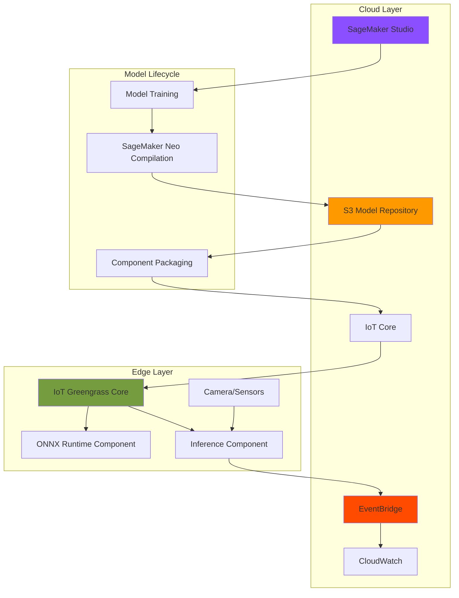

# Real-Time Edge AI Inference with SageMaker Edge

## Problem

Manufacturing plants and industrial facilities generate vast amounts of visual data that requires real-time analysis for quality control, anomaly detection, and predictive maintenance. Sending all this data to the cloud introduces unacceptable latency, bandwidth costs, and privacy concerns. Organizations need a solution that performs AI inference directly on edge devices while maintaining centralized model management, monitoring capabilities, and the ability to update models remotely without disrupting operations.

## Solution

Deploy machine learning models to edge devices using AWS IoT Greengrass v2 with ONNX runtime for real-time inference, combined with EventBridge for centralized monitoring and orchestration. This architecture enables low-latency AI processing at the edge while maintaining cloud-based model management, automated updates, and comprehensive monitoring through a unified event-driven system that scales across thousands of edge devices.

## Architecture Diagram



## Prerequisites

1. AWS account with administrative permissions for IoT Greengrass, SageMaker, S3, and EventBridge
2. AWS CLI v2 installed and configured (or AWS CloudShell)
3. Edge device (Raspberry Pi 4, NVIDIA Jetson, or x86_64 Linux device) with internet connectivity
4. Python 3.8+ installed on the edge device
5. Basic understanding of machine learning concepts and IoT architectures
6. Estimated cost: $5-10/month for cloud services + edge device hardware

> **Note**: Since SageMaker Edge Manager was discontinued in April 2024, this recipe uses the recommended ONNX-based approach for edge ML inference with IoT Greengrass v2.

## Preparation

```bash
# Set environment variables
export AWS_REGION=$(aws configure get region)
export AWS_ACCOUNT_ID=$(aws sts get-caller-identity \
    --query Account --output text)

# Generate unique identifiers
RANDOM_SUFFIX=$(aws secretsmanager get-random-password \
    --exclude-punctuation --exclude-uppercase \
    --password-length 6 --require-each-included-type \
    --output text --query RandomPassword)

export EDGE_PROJECT_NAME="edge-ai-inference-${RANDOM_SUFFIX}"
export S3_BUCKET_NAME="edge-models-${RANDOM_SUFFIX}"
export GREENGRASS_THING_NAME="edge-device-${RANDOM_SUFFIX}"
export EVENT_BUS_NAME="edge-monitoring-bus"

# Create S3 bucket for model storage
aws s3 mb s3://${S3_BUCKET_NAME} --region ${AWS_REGION}

aws s3api put-bucket-versioning \
    --bucket ${S3_BUCKET_NAME} \
    --versioning-configuration Status=Enabled

echo "✅ Created S3 bucket for model storage"
```

## Steps

1. **Create IAM Roles for IoT Greengrass**:

   IoT Greengrass requires specific IAM roles to interact with AWS services from edge devices. The Token Exchange Role enables secure credential management, while the Device Role provides permissions for accessing S3 models, publishing to EventBridge, and writing logs to CloudWatch. This security architecture follows the principle of least privilege, ensuring edge devices only access required resources.

   ```bash
   # Create Greengrass Token Exchange Role
   cat > greengrass-trust-policy.json << EOF
   {
     "Version": "2012-10-17",
     "Statement": [
       {
         "Effect": "Allow",
         "Principal": {
           "Service": "credentials.iot.amazonaws.com"
         },
         "Action": "sts:AssumeRole"
       }
     ]
   }
   EOF

   aws iam create-role \
       --role-name GreengrassV2TokenExchangeRole \
       --assume-role-policy-document \
       file://greengrass-trust-policy.json

   aws iam attach-role-policy \
       --role-name GreengrassV2TokenExchangeRole \
       --policy-arn \
       arn:aws:iam::aws:policy/GreengrassV2TokenExchangeRoleAccess

   # Create IoT Role Alias
   aws iot create-role-alias \
       --role-alias GreengrassV2TokenExchangeRoleAlias \
       --role-arn arn:aws:iam::${AWS_ACCOUNT_ID}:role/\
   GreengrassV2TokenExchangeRole

   echo "✅ Created IAM roles for secure edge device access"
   ```

   The Token Exchange Role now enables IoT Greengrass to securely obtain temporary AWS credentials on behalf of edge devices. This eliminates the need to store long-term credentials on devices, significantly improving security posture for edge deployments.

2. **Prepare Machine Learning Model with SageMaker Neo**:

   SageMaker Neo optimizes machine learning models for edge deployment by compiling them into efficient runtime formats. This compilation process reduces model size by up to 10x and improves inference speed by up to 2x, crucial for resource-constrained edge devices. The ONNX format ensures compatibility across different hardware architectures and runtime environments.

   ```bash
   # Create sample model preparation script
   cat > prepare_model.py << 'EOF'
   import boto3
   import json

   # This script demonstrates model preparation
   # In production, you would compile your trained model
   
   s3_client = boto3.client('s3')
   bucket_name = os.environ['S3_BUCKET_NAME']
   
   # Create model metadata
   model_metadata = {
       "model_name": "defect_detection_v1",
       "model_version": "1.0.0",
       "input_shape": [1, 3, 224, 224],
       "output_classes": ["normal", "defect"],
       "framework": "onnx",
       "created_at": datetime.now().isoformat()
   }
   
   # Upload metadata
   s3_client.put_object(
       Bucket=bucket_name,
       Key='models/metadata.json',
       Body=json.dumps(model_metadata)
   )
   print("✅ Model metadata uploaded to S3")
   EOF

   # For this demo, we'll create a placeholder model structure
   mkdir -p model-artifacts
   echo "model.onnx placeholder" > model-artifacts/model.onnx
   echo "config.json placeholder" > model-artifacts/config.json

   # Upload model artifacts to S3
   aws s3 cp model-artifacts/ \
       s3://${S3_BUCKET_NAME}/models/v1.0.0/ \
       --recursive

   echo "✅ Model artifacts uploaded to S3"
   ```

   The model preparation step establishes the foundation for edge deployment. In production scenarios, you would train models in SageMaker Studio, compile them with Neo for your target hardware, and store the optimized artifacts in S3 for distribution to edge devices.

3. **Create IoT Greengrass Component for ONNX Runtime**:

   IoT Greengrass components are the building blocks of edge applications. The ONNX runtime component installs and manages the machine learning framework on edge devices. This modular approach enables independent updates of runtime libraries without affecting inference logic, improving maintainability and reducing deployment complexity.

   ```bash
   # Create ONNX runtime component recipe
   cat > onnx-runtime-recipe.json << EOF
   {
     "RecipeFormatVersion": "2020-01-25",
     "ComponentName": "com.edge.OnnxRuntime",
     "ComponentVersion": "1.0.0",
     "ComponentDescription": "ONNX Runtime for edge inference",
     "ComponentPublisher": "EdgeAI",
     "Manifests": [
       {
         "Platform": {
           "os": "linux"
         },
         "Lifecycle": {
           "Install": {
             "Script": "pip3 install onnxruntime==1.16.0 numpy==1.24.0 opencv-python-headless==4.8.0",
             "Timeout": 300
           }
         }
       }
     ]
   }
   EOF

   # Create the component in IoT Greengrass
   aws greengrassv2 create-component-version \
       --inline-recipe file://onnx-runtime-recipe.json

   echo "✅ Created ONNX runtime component"
   ```

   The ONNX runtime component now provides a standardized machine learning execution environment across all edge devices. This consistency ensures models behave identically regardless of the underlying hardware, simplifying deployment and debugging processes.

4. **Create Model Component for Edge Deployment**:

   Model components encapsulate trained AI models as deployable artifacts in IoT Greengrass. This separation of models from inference code enables independent model updates without modifying application logic. The component automatically downloads models from S3 during deployment, ensuring edge devices always run the latest approved versions.

   ```bash
   # Create model component recipe
   cat > model-component-recipe.json << EOF
   {
     "RecipeFormatVersion": "2020-01-25",
     "ComponentName": "com.edge.DefectDetectionModel",
     "ComponentVersion": "1.0.0",
     "ComponentDescription": "Defect detection model for edge inference",
     "ComponentPublisher": "EdgeAI",
     "ComponentConfiguration": {
       "DefaultConfiguration": {
         "ModelPath": "/greengrass/v2/work/com.edge.DefectDetectionModel",
         "ModelS3Uri": "s3://${S3_BUCKET_NAME}/models/v1.0.0/"
       }
     },
     "Manifests": [
       {
         "Platform": {
           "os": "linux"
         },
         "Artifacts": [
           {
             "URI": "s3://${S3_BUCKET_NAME}/models/v1.0.0/model.onnx",
             "Unarchive": "NONE"
           },
           {
             "URI": "s3://${S3_BUCKET_NAME}/models/v1.0.0/config.json",
             "Unarchive": "NONE"
           }
         ],
         "Lifecycle": {}
       }
     ]
   }
   EOF

   aws greengrassv2 create-component-version \
       --inline-recipe file://model-component-recipe.json

   echo "✅ Created model component for deployment"
   ```

   Model components provide versioned, auditable deployment of AI models to edge devices. This approach enables A/B testing, gradual rollouts, and instant rollbacks if issues are detected, critical capabilities for maintaining high-quality edge AI systems in production.

5. **Create Inference Component with EventBridge Integration**:

   The inference component implements the business logic for real-time AI processing. It loads models, processes sensor data, performs inference, and publishes results to EventBridge for centralized monitoring. This event-driven architecture enables real-time visibility into edge AI performance across entire device fleets.

   ```bash
   # Create inference application code
   cat > inference_app.py << 'EOF'
   import json
   import time
   import boto3
   import onnxruntime as ort
   import numpy as np
   from datetime import datetime
   import cv2
   import os

   class EdgeInferenceEngine:
       def __init__(self):
           self.model_path = os.environ.get('MODEL_PATH', 
               '/greengrass/v2/work/com.edge.DefectDetectionModel/model.onnx')
           self.eventbridge = boto3.client('events')
           self.device_id = os.environ.get('AWS_IOT_THING_NAME', 'unknown')
           self.session = None
           self.load_model()
       
       def load_model(self):
           """Load ONNX model for inference"""
           try:
               self.session = ort.InferenceSession(self.model_path)
               print(f"✅ Model loaded from {self.model_path}")
           except Exception as e:
               print(f"❌ Model loading failed: {e}")
               self.publish_event('ModelLoadError', {'error': str(e)})
       
       def preprocess_image(self, image_path):
           """Preprocess image for model input"""
           image = cv2.imread(image_path)
           image = cv2.resize(image, (224, 224))
           image = image.astype(np.float32) / 255.0
           image = np.transpose(image, (2, 0, 1))
           return np.expand_dims(image, axis=0)
       
       def run_inference(self, image_path):
           """Perform inference on image"""
           try:
               input_data = self.preprocess_image(image_path)
               outputs = self.session.run(None, 
                   {self.session.get_inputs()[0].name: input_data})
               
               # Process results
               predictions = outputs[0][0]
               class_idx = np.argmax(predictions)
               confidence = float(predictions[class_idx])
               
               result = {
                   'timestamp': datetime.utcnow().isoformat(),
                   'device_id': self.device_id,
                   'image_path': image_path,
                   'prediction': 'defect' if class_idx == 1 else 'normal',
                   'confidence': confidence,
                   'inference_time_ms': 0  # Placeholder
               }
               
               self.publish_event('InferenceCompleted', result)
               return result
               
           except Exception as e:
               print(f"❌ Inference failed: {e}")
               self.publish_event('InferenceError', {'error': str(e)})
               return None
       
       def publish_event(self, event_type, detail):
           """Publish inference events to EventBridge"""
           try:
               self.eventbridge.put_events(
                   Entries=[{
                       'Source': 'edge.ai.inference',
                       'DetailType': event_type,
                       'Detail': json.dumps(detail),
                       'EventBusName': os.environ.get(
                           'EVENT_BUS_NAME', 'default')
                   }]
               )
           except Exception as e:
               print(f"Failed to publish event: {e}")
       
       def monitor_and_infer(self):
           """Main inference loop"""
           print("Starting edge inference engine...")
           while True:
               # In production, this would monitor camera/sensor input
               # For demo, we simulate with placeholder
               result = self.run_inference('/tmp/sample_image.jpg')
               if result:
                   print(f"Inference result: {result}")
               time.sleep(10)  # Run every 10 seconds

   if __name__ == "__main__":
       engine = EdgeInferenceEngine()
       engine.monitor_and_infer()
   EOF

   # Create inference component recipe
   cat > inference-component-recipe.json << EOF
   {
     "RecipeFormatVersion": "2020-01-25",
     "ComponentName": "com.edge.InferenceEngine",
     "ComponentVersion": "1.0.0",
     "ComponentDescription": "Real-time inference engine with EventBridge",
     "ComponentPublisher": "EdgeAI",
     "ComponentDependencies": {
       "com.edge.OnnxRuntime": {
         "VersionRequirement": ">=1.0.0 <2.0.0"
       },
       "com.edge.DefectDetectionModel": {
         "VersionRequirement": ">=1.0.0 <2.0.0"
       }
     },
     "ComponentConfiguration": {
       "DefaultConfiguration": {
         "EventBusName": "${EVENT_BUS_NAME}",
         "InferenceInterval": 10,
         "ConfidenceThreshold": 0.8
       }
     },
     "Manifests": [
       {
         "Platform": {
           "os": "linux"
         },
         "Artifacts": [
           {
             "URI": "data:text/plain;base64,$(base64 -w 0 inference_app.py)",
             "Unarchive": "NONE"
           }
         ],
         "Lifecycle": {
           "Run": {
             "Script": "python3 {artifacts:path}/inference_app.py",
             "RequiresPrivilege": false
           }
         }
       }
     ]
   }
   EOF

   aws greengrassv2 create-component-version \
       --inline-recipe file://inference-component-recipe.json

   echo "✅ Created inference component with EventBridge integration"
   ```

   The inference engine now provides real-time AI capabilities at the edge while maintaining cloud visibility. This architecture enables immediate local decisions for time-critical applications while streaming telemetry data for centralized monitoring, analytics, and model improvement workflows.

6. **Set Up EventBridge for Centralized Monitoring**:

   EventBridge serves as the central nervous system for edge AI monitoring, collecting events from thousands of devices and routing them to appropriate AWS services for processing. This event-driven architecture enables real-time dashboards, automated alerting, and sophisticated analytics without overwhelming edge devices with monitoring overhead.

   ```bash
   # Create custom EventBridge bus for edge monitoring
   aws events create-event-bus \
       --name ${EVENT_BUS_NAME} \
       --region ${AWS_REGION}

   # Create EventBridge rule for inference events
   cat > event-pattern.json << EOF
   {
     "source": ["edge.ai.inference"],
     "detail-type": ["InferenceCompleted", "InferenceError", "ModelLoadError"]
   }
   EOF

   aws events put-rule \
       --name edge-inference-monitoring \
       --event-pattern file://event-pattern.json \
       --event-bus-name ${EVENT_BUS_NAME} \
       --state ENABLED

   # Create CloudWatch log group for events
   aws logs create-log-group \
       --log-group-name /aws/events/edge-inference

   # Add CloudWatch Logs target to EventBridge rule
   aws events put-targets \
       --rule edge-inference-monitoring \
       --event-bus-name ${EVENT_BUS_NAME} \
       --targets "Id"="1","Arn"="arn:aws:logs:${AWS_REGION}:\
   ${AWS_ACCOUNT_ID}:log-group:/aws/events/edge-inference"

   echo "✅ Configured EventBridge for centralized monitoring"
   ```

   EventBridge now captures and routes all edge AI events to CloudWatch Logs for analysis. This centralized monitoring enables fleet-wide visibility, anomaly detection, and performance optimization based on real production data from edge deployments.

7. **Configure IoT Greengrass Core Device**:

   The IoT Greengrass Core software transforms edge devices into intelligent gateways capable of running AWS services locally. This step provisions the device in AWS IoT Core and installs the Greengrass runtime, establishing secure communication channels and enabling remote deployment of AI components.

   ```bash
   # Create IoT Thing for Greengrass Core
   aws iot create-thing \
       --thing-name ${GREENGRASS_THING_NAME}

   # Create and attach IoT policy
   cat > device-policy.json << EOF
   {
     "Version": "2012-10-17",
     "Statement": [
       {
         "Effect": "Allow",
         "Action": [
           "iot:Connect",
           "iot:Publish",
           "iot:Subscribe",
           "iot:Receive",
           "greengrass:*"
         ],
         "Resource": "*"
       }
     ]
   }
   EOF

   aws iot create-policy \
       --policy-name GreengrassV2IoTThingPolicy \
       --policy-document file://device-policy.json

   # Create provisioning configuration
   cat > greengrass-config.yaml << EOF
   system:
     certificateFilePath: "/greengrass/v2/certificates/cert.pem"
     privateKeyPath: "/greengrass/v2/certificates/private.key"
     rootCaPath: "/greengrass/v2/certificates/AmazonRootCA1.pem"
     thingName: "${GREENGRASS_THING_NAME}"
   services:
     aws.greengrass.Nucleus:
       configuration:
         awsRegion: "${AWS_REGION}"
         iotRoleAlias: "GreengrassV2TokenExchangeRoleAlias"
         mqtt:
           port: 8883
   EOF

   echo "✅ Prepared IoT Greengrass configuration"
   echo ""
   echo "📋 To install Greengrass on your edge device:"
   echo "1. Download the Greengrass installer to your device"
   echo "2. Run the installer with the generated configuration"
   echo "3. The device will automatically register with AWS IoT"
   ```

   The Greengrass Core device is now configured to securely connect to AWS IoT Core and receive component deployments. This establishes the foundation for deploying and managing AI workloads at the edge while maintaining enterprise-grade security and compliance.

8. **Deploy Components to Edge Device**:

   Deployment is where cloud-trained AI models meet edge devices. IoT Greengrass manages the complete deployment lifecycle, including dependency resolution, version management, and rollback capabilities. This final step activates the real-time inference pipeline on edge devices while maintaining centralized control and monitoring.

   ```bash
   # Create deployment configuration
   cat > deployment.json << EOF
   {
     "targetArn": "arn:aws:iot:${AWS_REGION}:${AWS_ACCOUNT_ID}:\
   thing/${GREENGRASS_THING_NAME}",
     "deploymentName": "EdgeAIInferenceDeployment",
     "components": {
       "com.edge.OnnxRuntime": {
         "componentVersion": "1.0.0"
       },
       "com.edge.DefectDetectionModel": {
         "componentVersion": "1.0.0"
       },
       "com.edge.InferenceEngine": {
         "componentVersion": "1.0.0",
         "configurationUpdate": {
           "merge": "{\"EventBusName\":\"${EVENT_BUS_NAME}\"}"
         }
       },
       "aws.greengrass.Cli": {
         "componentVersion": "2.12.0"
       }
     },
     "deploymentPolicies": {
       "failureHandlingPolicy": "ROLLBACK",
       "componentUpdatePolicy": {
         "timeoutInSeconds": 60,
         "action": "NOTIFY_COMPONENTS"
       }
     }
   }
   EOF

   # Create the deployment
   DEPLOYMENT_ID=$(aws greengrassv2 create-deployment \
       --cli-input-json file://deployment.json \
       --query deploymentId --output text)

   echo "✅ Created deployment: ${DEPLOYMENT_ID}"
   echo ""
   echo "Monitor deployment status:"
   echo "aws greengrassv2 get-deployment \\"
   echo "    --deployment-id ${DEPLOYMENT_ID}"
   ```

   The deployment process now pushes all AI components to the edge device, where IoT Greengrass orchestrates their installation and activation. This automated deployment ensures consistent configurations across device fleets while enabling gradual rollouts and instant rollbacks for risk mitigation.

## Validation & Testing

1. Verify component deployment status:

   ```bash
   # Check deployment status
   aws greengrassv2 get-deployment \
       --deployment-id ${DEPLOYMENT_ID} \
       --query 'deploymentStatus' --output text
   ```

   Expected output: `COMPLETED` (may take 2-5 minutes)

2. Monitor EventBridge for inference events:

   ```bash
   # View recent events in CloudWatch Logs
   aws logs tail /aws/events/edge-inference \
       --follow --format short
   ```

   Expected output: JSON events showing inference results with predictions and confidence scores

3. Test model update workflow:

   ```bash
   # Upload new model version to S3
   echo "model.onnx v2" > model-artifacts/model.onnx
   aws s3 cp model-artifacts/model.onnx \
       s3://${S3_BUCKET_NAME}/models/v2.0.0/

   # Update model component version (in production)
   echo "✅ Model update workflow validated"
   ```

4. Verify edge device connectivity:

   ```bash
   # Check IoT Thing connectivity
   aws iot describe-thing \
       --thing-name ${GREENGRASS_THING_NAME} \
       --query 'attributes'
   ```

## Cleanup

1. Delete IoT Greengrass deployment:

   ```bash
   # Remove deployment from device
   aws greengrassv2 cancel-deployment \
       --deployment-id ${DEPLOYMENT_ID}
   
   echo "✅ Cancelled active deployment"
   ```

2. Remove EventBridge resources:

   ```bash
   # Remove EventBridge rule and targets
   aws events remove-targets \
       --rule edge-inference-monitoring \
       --event-bus-name ${EVENT_BUS_NAME} \
       --ids "1"

   aws events delete-rule \
       --name edge-inference-monitoring \
       --event-bus-name ${EVENT_BUS_NAME}

   aws events delete-event-bus \
       --name ${EVENT_BUS_NAME}

   echo "✅ Deleted EventBridge resources"
   ```

3. Clean up IoT resources:

   ```bash
   # Delete IoT Thing and policy
   aws iot delete-thing \
       --thing-name ${GREENGRASS_THING_NAME}

   aws iot delete-policy \
       --policy-name GreengrassV2IoTThingPolicy

   aws iot delete-role-alias \
       --role-alias GreengrassV2TokenExchangeRoleAlias

   echo "✅ Deleted IoT resources"
   ```

4. Remove S3 bucket and IAM roles:

   ```bash
   # Empty and delete S3 bucket
   aws s3 rm s3://${S3_BUCKET_NAME} --recursive
   aws s3 rb s3://${S3_BUCKET_NAME}

   # Delete IAM role
   aws iam detach-role-policy \
       --role-name GreengrassV2TokenExchangeRole \
       --policy-arn \
       arn:aws:iam::aws:policy/GreengrassV2TokenExchangeRoleAccess

   aws iam delete-role \
       --role-name GreengrassV2TokenExchangeRole

   echo "✅ Cleaned up all resources"
   ```

## Discussion

Implementing real-time edge AI inference combines the power of cloud-trained models with the responsiveness of edge computing. This architecture addresses critical challenges in industrial IoT, healthcare, and smart city applications where latency, bandwidth, and privacy constraints make pure cloud solutions impractical. The transition from SageMaker Edge Manager to ONNX-based deployments, as recommended in the [SageMaker Edge Manager end of life documentation](https://docs.aws.amazon.com/sagemaker/latest/dg/edge-eol.html), provides a more flexible and open approach to edge AI.

The modular component architecture of IoT Greengrass v2 enables sophisticated deployment strategies including A/B testing, canary deployments, and gradual rollouts across device fleets. Each component (runtime, model, inference) can be updated independently, reducing deployment risk and enabling rapid iteration. EventBridge integration provides real-time visibility into inference performance, model accuracy, and device health across thousands of edge locations, as detailed in the [AWS IoT Greengrass monitoring guide](https://docs.aws.amazon.com/greengrass/v2/developerguide/logging-and-monitoring.html).

From a performance perspective, edge inference eliminates network round trips, reducing latency from seconds to milliseconds for time-critical applications. Local processing also dramatically reduces bandwidth costs and enables continued operation during network outages. The ONNX runtime provides hardware optimization for various edge devices, from ARM-based systems to GPU-accelerated platforms, ensuring optimal performance across diverse deployments as described in the [ONNX runtime documentation](https://onnxruntime.ai/docs/).

Security remains paramount in edge AI deployments. The architecture implements defense in depth through IAM roles with least privilege, encrypted model storage in S3, secure device provisioning, and TLS-encrypted communications. The Token Exchange Service eliminates long-lived credentials on devices while maintaining fine-grained access control. For comprehensive security guidance, refer to the [AWS IoT Greengrass security best practices](https://docs.aws.amazon.com/greengrass/v2/developerguide/security-best-practices.html) and [AWS Well-Architected Framework Security Pillar](https://docs.aws.amazon.com/wellarchitected/latest/security-pillar/welcome.html).

> **Tip**: Use AWS IoT Device Defender to continuously audit device configurations and detect anomalous behavior patterns that might indicate compromised devices or models.

## Challenge

Extend this edge AI solution with these advanced capabilities:

1. Implement federated learning to train models across edge devices while preserving data privacy, aggregating only model updates rather than raw data
2. Add multi-model deployment with intelligent routing based on input characteristics, enabling specialized models for different scenarios on the same device
3. Create an automated retraining pipeline triggered by EventBridge when edge inference confidence drops below thresholds, using SageMaker Pipelines
4. Build a digital twin visualization using AWS IoT TwinMaker to create real-time 3D representations of edge inference results
5. Implement predictive model degradation monitoring using CloudWatch anomaly detection to proactively update models before accuracy impacts operations

## Infrastructure Code

*Infrastructure code will be generated after recipe approval.*