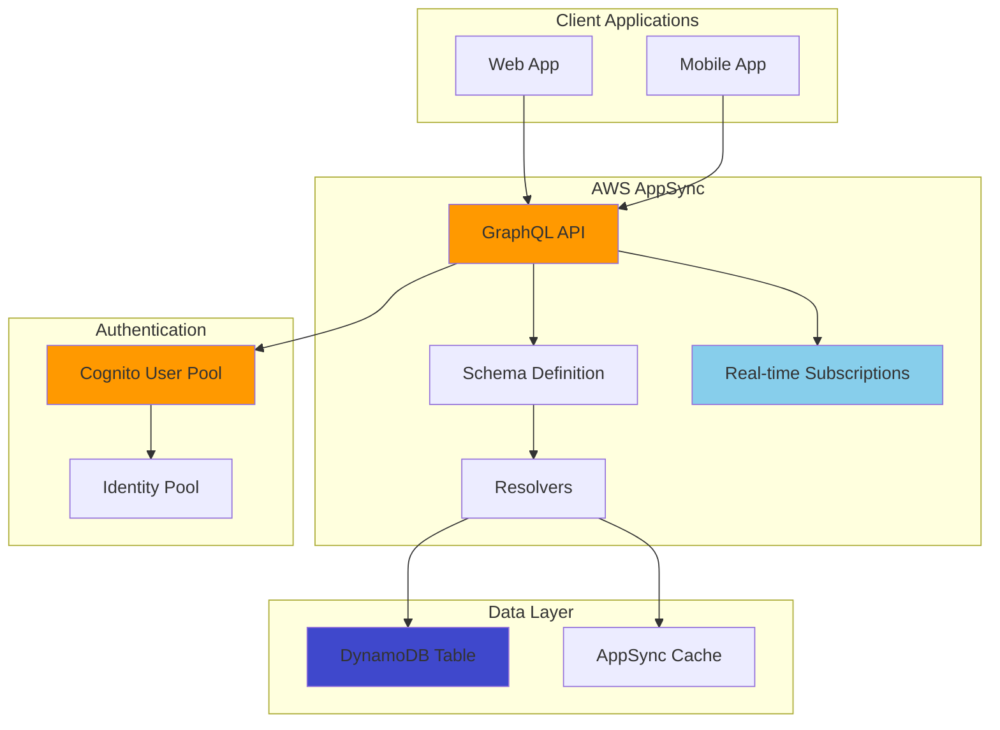

# Real-Time GraphQL API with AppSync

## Problem

Your development team is building modern web and mobile applications that require flexible, real-time data synchronization and efficient API querying. Traditional REST APIs result in over-fetching or under-fetching of data, multiple network requests, and complex client-side data management. You need a solution that allows clients to request exactly the data they need while providing real-time updates, offline capabilities, and robust authentication without managing complex backend infrastructure.

## Solution

Create a fully managed GraphQL API using AWS AppSync that connects to DynamoDB as a data source and integrates with Amazon Cognito for authentication. This solution provides type-safe schema definitions, real-time subscriptions via WebSockets, automatic data synchronization, and fine-grained access control. AppSync eliminates the need to write and maintain GraphQL server code while offering built-in features like caching, offline support, and conflict resolution.



## Prerequisites

1. AWS account with permissions to create AppSync APIs, DynamoDB tables, and Cognito User Pools
2. AWS CLI v2 installed and configured with appropriate permissions
3. Basic understanding of GraphQL concepts (queries, mutations, subscriptions)
4. Familiarity with JSON data structures and NoSQL databases
5. Node.js or Python environment for testing client connections

> **Note**: AppSync charges for requests, data transfer, and caching. Review [AppSync pricing](https://aws.amazon.com/appsync/pricing/) to understand costs.

## Preparation

Set up environment variables and create the foundational authentication infrastructure:

```bash
# Set environment variables
export AWS_REGION=$(aws configure get region)
export AWS_ACCOUNT_ID=$(aws sts get-caller-identity \
	--query Account --output text)

# Generate unique names to avoid conflicts
RANDOM_STRING=$(aws secretsmanager get-random-password \
	--exclude-punctuation --exclude-uppercase \
	--password-length 6 --require-each-included-type \
	--output text --query RandomPassword)

export API_NAME="blog-api-${RANDOM_STRING}"
export TABLE_NAME="BlogPosts-${RANDOM_STRING}"
export USER_POOL_NAME="BlogUserPool-${RANDOM_STRING}"

echo "API Name: $API_NAME"
echo "Table Name: $TABLE_NAME"
echo "User Pool: $USER_POOL_NAME"
```

Create a Cognito User Pool for authentication:

```bash
# Create Cognito User Pool
USER_POOL_ID=$(aws cognito-idp create-user-pool \
	--pool-name $USER_POOL_NAME \
	--policies 'PasswordPolicy={MinimumLength=8,RequireUppercase=true,RequireLowercase=true,RequireNumbers=true,RequireSymbols=false}' \
	--auto-verified-attributes email \
	--username-attributes email \
	--query 'UserPool.Id' --output text)

# Create User Pool Client
USER_POOL_CLIENT_ID=$(aws cognito-idp create-user-pool-client \
	--user-pool-id $USER_POOL_ID \
	--client-name "${API_NAME}-client" \
	--generate-secret \
	--explicit-auth-flows ADMIN_NO_SRP_AUTH \
	--query 'UserPoolClient.ClientId' --output text)

export USER_POOL_ID
export USER_POOL_CLIENT_ID
echo "✅ Cognito User Pool created: $USER_POOL_ID"
echo "✅ User Pool Client created: $USER_POOL_CLIENT_ID"
```

## Steps

1. **Create a DynamoDB table to serve as the data source**:

   DynamoDB serves as the foundational data layer for our GraphQL API, providing single-digit millisecond latency and virtually unlimited scalability. As a fully managed NoSQL database, DynamoDB eliminates the operational overhead of database maintenance while offering features like automatic scaling, backup, and encryption. We're creating a Global Secondary Index (GSI) on the author field to enable efficient queries for posts by a specific author, which is essential for building user-specific feeds and content management features without scanning the entire table.

   ```bash
   # Create DynamoDB table with GSI for author queries
   aws dynamodb create-table \
   	--table-name $TABLE_NAME \
   	--attribute-definitions \
   		AttributeName=id,AttributeType=S \
   		AttributeName=author,AttributeType=S \
   		AttributeName=createdAt,AttributeType=S \
   	--key-schema \
   		AttributeName=id,KeyType=HASH \
   	--global-secondary-indexes \
   		IndexName=AuthorIndex,KeySchema=\[AttributeName=author,KeyType=HASH\],\[AttributeName=createdAt,KeyType=RANGE\],Projection=\{ProjectionType=ALL\},ProvisionedThroughput=\{ReadCapacityUnits=5,WriteCapacityUnits=5\} \
   	--provisioned-throughput \
   		ReadCapacityUnits=5,WriteCapacityUnits=5

   # Wait for table to be active
   echo "Waiting for DynamoDB table to be active..."
   aws dynamodb wait table-exists --table-name $TABLE_NAME
   echo "✅ DynamoDB table created: $TABLE_NAME"
   ```

   The table is now active and configured with both primary access patterns (direct post lookup by ID) and secondary access patterns (author-based queries with timestamp sorting). This dual-access design supports both individual post retrieval and efficient feed generation, which are core requirements for any blog or content management system.

   > **Note**: The GSI allows sorting posts by creation date within each author, enabling features like chronological feeds. Learn more about [DynamoDB GSI design patterns](https://docs.aws.amazon.com/amazondynamodb/latest/developerguide/GSI.html).

2. **Create the GraphQL API with Cognito User Pool authentication**:

   AWS AppSync provides a fully managed GraphQL implementation that eliminates the need to provision and manage GraphQL servers. By integrating with Cognito User Pools, we establish a secure authentication foundation that supports enterprise-grade features like JWT token validation, fine-grained authorization rules, and seamless integration with other AWS services. This combination provides a production-ready API that can scale from zero to millions of requests without infrastructure management.

   ```bash
   # Create AppSync GraphQL API
   API_ID=$(aws appsync create-graphql-api \
   	--name $API_NAME \
   	--authentication-type AMAZON_COGNITO_USER_POOLS \
   	--user-pool-config userPoolId=$USER_POOL_ID,awsRegion=$AWS_REGION,defaultAction=ALLOW \
   	--query 'graphqlApi.apiId' --output text)

   export API_ID
   echo "✅ AppSync API created: $API_ID"

   # Get API details
   API_ENDPOINT=$(aws appsync get-graphql-api --api-id $API_ID \
   	--query 'graphqlApi.uris.GRAPHQL' --output text)
   REALTIME_ENDPOINT=$(aws appsync get-graphql-api --api-id $API_ID \
   	--query 'graphqlApi.uris.REALTIME' --output text)

   export API_ENDPOINT
   export REALTIME_ENDPOINT
   echo "GraphQL Endpoint: $API_ENDPOINT"
   echo "Real-time Endpoint: $REALTIME_ENDPOINT"
   ```

   The API is now established with two critical endpoints: the main GraphQL endpoint for queries and mutations, and the real-time endpoint for WebSocket-based subscriptions. These endpoints provide the foundation for both traditional request-response patterns and real-time data synchronization, enabling modern application features like live updates and collaborative functionality.

3. **Define the GraphQL schema for a blog platform**:

   The GraphQL schema serves as the contract between your API and client applications, defining exactly what data can be queried and how it can be modified. Unlike REST APIs where data structure is implicit, GraphQL schemas are explicit and self-documenting, enabling powerful developer tools like auto-completion and type checking. Our blog platform schema demonstrates essential GraphQL patterns including strongly-typed objects, input validation, cursor-based pagination for efficient data loading, and real-time subscriptions for live updates.

   ```bash
   # Create GraphQL schema file
   cat > schema.graphql << 'EOF'
type BlogPost {
    id: ID!
    title: String!
    content: String!
    author: String!
    createdAt: AWSDateTime!
    updatedAt: AWSDateTime!
    tags: [String]
    published: Boolean!
}

input CreateBlogPostInput {
    title: String!
    content: String!
    tags: [String]
    published: Boolean = false
}

input UpdateBlogPostInput {
    id: ID!
    title: String
    content: String
    tags: [String]
    published: Boolean
}

type Query {
    getBlogPost(id: ID!): BlogPost
    listBlogPosts(limit: Int, nextToken: String): BlogPostConnection
    listBlogPostsByAuthor(author: String!, limit: Int, nextToken: String): BlogPostConnection
}

type Mutation {
    createBlogPost(input: CreateBlogPostInput!): BlogPost
    updateBlogPost(input: UpdateBlogPostInput!): BlogPost
    deleteBlogPost(id: ID!): BlogPost
}

type Subscription {
    onCreateBlogPost: BlogPost
        @aws_subscribe(mutations: ["createBlogPost"])
    onUpdateBlogPost: BlogPost
        @aws_subscribe(mutations: ["updateBlogPost"])
    onDeleteBlogPost: BlogPost
        @aws_subscribe(mutations: ["deleteBlogPost"])
}

type BlogPostConnection {
    items: [BlogPost]
    nextToken: String
}

schema {
    query: Query
    mutation: Mutation
    subscription: Subscription
}
EOF

   # Upload schema to AppSync
   aws appsync start-schema-creation \
   	--api-id $API_ID \
   	--definition fileb://schema.graphql

   echo "Waiting for schema creation to complete..."
   sleep 10

   # Check schema creation status
   SCHEMA_STATUS=$(aws appsync get-schema-creation-status --api-id $API_ID \
   	--query 'status' --output text)

   while [ "$SCHEMA_STATUS" = "PROCESSING" ]; do
       echo "Schema creation in progress..."
       sleep 5
       SCHEMA_STATUS=$(aws appsync get-schema-creation-status --api-id $API_ID \
           --query 'status' --output text)
   done

   echo "✅ GraphQL schema uploaded and processed"
   ```

   The schema is now deployed and ready to serve as the API contract. AppSync has validated the schema syntax and created the necessary infrastructure to support the defined operations. Client applications can now introspect this schema to understand available operations and generate type-safe code.

   > **Warning**: Schema updates in production should be carefully planned as they can break existing client applications. Use [schema evolution best practices](https://docs.aws.amazon.com/appsync/latest/devguide/designing-a-graphql-api.html) to maintain backward compatibility.

4. **Create a DynamoDB data source and attach it to the API**:

   Data sources in AppSync act as the bridge between your GraphQL schema and backend services, abstracting the complexities of service integration while maintaining security through IAM policies. By creating a dedicated service role with least-privilege permissions, we ensure that AppSync can only perform the specific DynamoDB operations required for our blog platform. This security model follows AWS best practices by granting minimal necessary permissions while enabling full functionality.

   ```bash
   # Create service role for AppSync to access DynamoDB
   cat > appsync-service-role-trust-policy.json << EOF
{
    "Version": "2012-10-17",
    "Statement": [
        {
            "Effect": "Allow",
            "Principal": {
                "Service": "appsync.amazonaws.com"
            },
            "Action": "sts:AssumeRole"
        }
    ]
}
EOF

   SERVICE_ROLE_ARN=$(aws iam create-role \
   	--role-name AppSyncDynamoDBRole-${RANDOM_STRING} \
   	--assume-role-policy-document file://appsync-service-role-trust-policy.json \
   	--query 'Role.Arn' --output text)

   # Create policy for DynamoDB access
   cat > appsync-dynamodb-policy.json << EOF
{
    "Version": "2012-10-17",
    "Statement": [
        {
            "Effect": "Allow",
            "Action": [
                "dynamodb:GetItem",
                "dynamodb:PutItem",
                "dynamodb:UpdateItem",
                "dynamodb:DeleteItem",
                "dynamodb:Query",
                "dynamodb:Scan"
            ],
            "Resource": [
                "arn:aws:dynamodb:${AWS_REGION}:${AWS_ACCOUNT_ID}:table/${TABLE_NAME}",
                "arn:aws:dynamodb:${AWS_REGION}:${AWS_ACCOUNT_ID}:table/${TABLE_NAME}/*"
            ]
        }
    ]
}
EOF

   aws iam put-role-policy \
   	--role-name AppSyncDynamoDBRole-${RANDOM_STRING} \
   	--policy-name DynamoDBAccess \
   	--policy-document file://appsync-dynamodb-policy.json

   export SERVICE_ROLE_ARN
   echo "✅ Service role created: $SERVICE_ROLE_ARN"

   # Wait for role to be available
   sleep 10

   # Create DynamoDB data source
   DATA_SOURCE_NAME="BlogPostsDataSource"
   aws appsync create-data-source \
   	--api-id $API_ID \
   	--name $DATA_SOURCE_NAME \
   	--type AMAZON_DYNAMODB \
   	--dynamodb-config tableName=$TABLE_NAME,awsRegion=$AWS_REGION \
   	--service-role-arn $SERVICE_ROLE_ARN

   echo "✅ DynamoDB data source created: $DATA_SOURCE_NAME"
   ```

   The data source connection is now established, enabling AppSync to securely communicate with DynamoDB using the service role. This abstraction layer allows resolvers to focus on data transformation logic rather than connection management, while IAM policies ensure secure, auditable access to backend resources.

5. **Create resolvers for the GraphQL operations**:

   Resolvers contain the business logic that transforms GraphQL operations into backend service calls and formats the responses. Using VTL (Velocity Template Language) mapping templates, we define how GraphQL arguments map to DynamoDB operations and how raw database responses transform into GraphQL-compliant data structures. This declarative approach eliminates the need for custom server code while providing powerful data transformation capabilities including field mapping, conditional logic, and error handling.

   ```bash
   # Create resolver for getBlogPost query
   cat > get-blog-post-request.vtl << 'EOF'
{
    "version": "2017-02-28",
    "operation": "GetItem",
    "key": {
        "id": $util.dynamodb.toDynamoDBJson($ctx.args.id)
    }
}
EOF

   cat > get-blog-post-response.vtl << 'EOF'
#if($ctx.error)
    $util.error($ctx.error.message, $ctx.error.type)
#end
$util.toJson($ctx.result)
EOF

   aws appsync create-resolver \
   	--api-id $API_ID \
   	--type-name Query \
   	--field-name getBlogPost \
   	--data-source-name $DATA_SOURCE_NAME \
   	--request-mapping-template file://get-blog-post-request.vtl \
   	--response-mapping-template file://get-blog-post-response.vtl

   # Create resolver for createBlogPost mutation
   cat > create-blog-post-request.vtl << 'EOF'
#set($id = $util.autoId())
#set($createdAt = $util.time.nowISO8601())
{
    "version": "2017-02-28",
    "operation": "PutItem",
    "key": {
        "id": $util.dynamodb.toDynamoDBJson($id)
    },
    "attributeValues": {
        "title": $util.dynamodb.toDynamoDBJson($ctx.args.input.title),
        "content": $util.dynamodb.toDynamoDBJson($ctx.args.input.content),
        "author": $util.dynamodb.toDynamoDBJson($ctx.identity.username),
        "createdAt": $util.dynamodb.toDynamoDBJson($createdAt),
        "updatedAt": $util.dynamodb.toDynamoDBJson($createdAt),
        "tags": $util.dynamodb.toDynamoDBJson($ctx.args.input.tags),
        "published": $util.dynamodb.toDynamoDBJson($ctx.args.input.published)
    }
}
EOF

   cat > create-blog-post-response.vtl << 'EOF'
#if($ctx.error)
    $util.error($ctx.error.message, $ctx.error.type)
#end
$util.toJson($ctx.result)
EOF

   aws appsync create-resolver \
   	--api-id $API_ID \
   	--type-name Mutation \
   	--field-name createBlogPost \
   	--data-source-name $DATA_SOURCE_NAME \
   	--request-mapping-template file://create-blog-post-request.vtl \
   	--response-mapping-template file://create-blog-post-response.vtl

   # Create resolver for listBlogPosts query
   cat > list-blog-posts-request.vtl << 'EOF'
{
    "version": "2017-02-28",
    "operation": "Scan",
    #if($ctx.args.limit)
    "limit": $ctx.args.limit,
    #end
    #if($ctx.args.nextToken)
    "nextToken": "$ctx.args.nextToken",
    #end
}
EOF

   cat > list-blog-posts-response.vtl << 'EOF'
#if($ctx.error)
    $util.error($ctx.error.message, $ctx.error.type)
#end
{
    "items": $util.toJson($ctx.result.items),
    #if($ctx.result.nextToken)
    "nextToken": "$ctx.result.nextToken"
    #end
}
EOF

   aws appsync create-resolver \
   	--api-id $API_ID \
   	--type-name Query \
   	--field-name listBlogPosts \
   	--data-source-name $DATA_SOURCE_NAME \
   	--request-mapping-template file://list-blog-posts-request.vtl \
   	--response-mapping-template file://list-blog-posts-response.vtl

   # Create resolver for listBlogPostsByAuthor query
   cat > list-by-author-request.vtl << 'EOF'
{
    "version": "2017-02-28",
    "operation": "Query",
    "index": "AuthorIndex",
    "query": {
        "expression": "author = :author",
        "expressionValues": {
            ":author": $util.dynamodb.toDynamoDBJson($ctx.args.author)
        }
    },
    #if($ctx.args.limit)
    "limit": $ctx.args.limit,
    #end
    #if($ctx.args.nextToken)
    "nextToken": "$ctx.args.nextToken",
    #end
    "scanIndexForward": false
}
EOF

   aws appsync create-resolver \
   	--api-id $API_ID \
   	--type-name Query \
   	--field-name listBlogPostsByAuthor \
   	--data-source-name $DATA_SOURCE_NAME \
   	--request-mapping-template file://list-by-author-request.vtl \
   	--response-mapping-template file://list-blog-posts-response.vtl

   echo "✅ GraphQL resolvers created successfully"
   ```

   The resolvers are now operational, providing the essential logic layer that connects GraphQL operations to DynamoDB. Each resolver handles specific responsibilities: retrieving individual posts, creating new content with automatic metadata generation, listing posts with pagination support, and querying posts by author using the GSI. This resolver architecture supports all common blog platform operations while maintaining efficient data access patterns.

   > **Tip**: Consider migrating to JavaScript resolvers for better performance and easier debugging. See the [AppSync JavaScript resolver documentation](https://docs.aws.amazon.com/appsync/latest/devguide/resolver-context-reference-js.html) for modern resolver patterns.

6. **Create a test user in Cognito User Pool**:

   Creating a test user enables us to validate the complete authentication flow and test operations that require user identity. Cognito User Pools manage user registration, authentication, and profile data, while providing JWT tokens that AppSync can validate to enforce authorization rules. This step establishes a real user context for testing authenticated GraphQL operations.

   ```bash
   # Create test user
   TEST_USERNAME="testuser@example.com"
   TEMP_PASSWORD="TempPass123!"

   aws cognito-idp admin-create-user \
   	--user-pool-id $USER_POOL_ID \
   	--username $TEST_USERNAME \
   	--user-attributes Name=email,Value=$TEST_USERNAME Name=email_verified,Value=true \
   	--temporary-password $TEMP_PASSWORD \
   	--message-action SUPPRESS

   # Set permanent password
   NEW_PASSWORD="BlogUser123!"
   aws cognito-idp admin-set-user-password \
   	--user-pool-id $USER_POOL_ID \
   	--username $TEST_USERNAME \
   	--password $NEW_PASSWORD \
   	--permanent

   export TEST_USERNAME
   export NEW_PASSWORD
   echo "✅ Test user created: $TEST_USERNAME"
   echo "Password: $NEW_PASSWORD"
   ```

   The test user is now ready for authentication testing. This user can obtain JWT tokens from Cognito and use them to access authenticated GraphQL operations. The user's identity will be available in resolver context as `$ctx.identity.username`, enabling user-specific data operations and authorization logic.

7. **Configure API key as additional authorization method for testing**:

   Adding API key authentication provides a simplified testing method that bypasses user authentication for development and testing scenarios. While Cognito User Pools provide robust user authentication, API keys offer a quick way to test GraphQL operations without implementing the full authentication flow. This dual authentication setup demonstrates AppSync's flexibility in supporting multiple authorization patterns within a single API.

   ```bash
   # Add API key as additional authorization
   aws appsync update-graphql-api \
   	--api-id $API_ID \
   	--name $API_NAME \
   	--authentication-type AMAZON_COGNITO_USER_POOLS \
   	--user-pool-config userPoolId=$USER_POOL_ID,awsRegion=$AWS_REGION,defaultAction=ALLOW \
   	--additional-authentication-providers authenticationType=API_KEY

   # Create API key for testing
   API_KEY_ID=$(aws appsync create-api-key \
   	--api-id $API_ID \
   	--description "Test API Key" \
   	--expires $(date -d "+30 days" +%s) \
   	--query 'apiKey.id' --output text)

   API_KEY=$(aws appsync list-api-keys --api-id $API_ID \
   	--query 'apiKeys[0].id' --output text)

   export API_KEY
   echo "✅ API Key created for testing: $API_KEY"
   ```

   The API now supports both authentication methods, providing flexibility for different use cases. Cognito User Pool authentication enables production-ready user management with features like password policies and multi-factor authentication, while API key authentication simplifies development and testing workflows.

8. **Create a simple test client script**:

   Building a test client demonstrates how applications interact with AppSync APIs and validates that all components work together correctly. The client implements both authentication methods, showing how to obtain Cognito JWT tokens for authenticated requests and how to use API keys for simpler access patterns. This practical implementation serves as a reference for integrating AppSync into real applications.

   ```bash
   # Create Python test client
   cat > test_client.py << EOF
import json
import requests
import boto3
from botocore.exceptions import ClientError

# Configuration
API_ENDPOINT = "$API_ENDPOINT"
API_KEY = "$API_KEY"
USER_POOL_ID = "$USER_POOL_ID"
CLIENT_ID = "$USER_POOL_CLIENT_ID"
USERNAME = "$TEST_USERNAME"
PASSWORD = "$NEW_PASSWORD"

def get_auth_token():
    """Get Cognito ID token for authenticated requests"""
    try:
        client = boto3.client('cognito-idp')
        
        # Get client secret
        response = client.describe_user_pool_client(
            UserPoolId=USER_POOL_ID,
            ClientId=CLIENT_ID
        )
        client_secret = response['UserPoolClient']['ClientSecret']
        
        # Calculate secret hash
        import hmac
        import hashlib
        import base64
        
        message = USERNAME + CLIENT_ID
        dig = hmac.new(
            client_secret.encode('UTF-8'),
            message.encode('UTF-8'),
            hashlib.sha256
        ).digest()
        secret_hash = base64.b64encode(dig).decode()
        
        # Authenticate user
        auth_response = client.admin_initiate_auth(
            UserPoolId=USER_POOL_ID,
            ClientId=CLIENT_ID,
            AuthFlow='ADMIN_NO_SRP_AUTH',
            AuthParameters={
                'USERNAME': USERNAME,
                'PASSWORD': PASSWORD,
                'SECRET_HASH': secret_hash
            }
        )
        
        return auth_response['AuthenticationResult']['IdToken']
    except ClientError as e:
        print(f"Error getting auth token: {e}")
        return None

def graphql_request(query, variables=None, use_auth=False):
    """Make GraphQL request to AppSync API"""
    headers = {'Content-Type': 'application/json'}
    
    if use_auth:
        token = get_auth_token()
        if token:
            headers['Authorization'] = token
        else:
            print("Failed to get auth token, using API key")
            headers['x-api-key'] = API_KEY
    else:
        headers['x-api-key'] = API_KEY
    
    payload = {'query': query}
    if variables:
        payload['variables'] = variables
    
    response = requests.post(API_ENDPOINT, json=payload, headers=headers)
    return response.json()

# Test queries
def test_api():
    print("Testing AppSync GraphQL API...")
    
    # Test 1: Create a blog post (requires authentication)
    create_mutation = '''
    mutation CreatePost($input: CreateBlogPostInput!) {
        createBlogPost(input: $input) {
            id
            title
            content
            author
            createdAt
            published
            tags
        }
    }
    '''
    
    variables = {
        "input": {
            "title": "My First Blog Post",
            "content": "This is the content of my first blog post created via GraphQL!",
            "tags": ["technology", "aws", "graphql"],
            "published": True
        }
    }
    
    print("\\n1. Creating blog post...")
    result = graphql_request(create_mutation, variables, use_auth=True)
    print(json.dumps(result, indent=2))
    
    # Test 2: List all blog posts
    list_query = '''
    query ListPosts {
        listBlogPosts(limit: 10) {
            items {
                id
                title
                author
                createdAt
                published
                tags
            }
            nextToken
        }
    }
    '''
    
    print("\\n2. Listing blog posts...")
    result = graphql_request(list_query)
    print(json.dumps(result, indent=2))

if __name__ == "__main__":
    test_api()
EOF

   echo "✅ Test client created: test_client.py"
   ```

   The test client is ready to validate our GraphQL API implementation. It demonstrates key integration patterns including Cognito authentication with secret hash calculation, GraphQL request formatting, and error handling. This client serves as both a validation tool and a reference implementation for building production applications.

## Validation & Testing

1. Test the GraphQL schema using the AppSync console:

```bash
echo "GraphQL API Details:"
echo "API ID: $API_ID"
echo "GraphQL Endpoint: $API_ENDPOINT"
echo "Real-time Endpoint: $REALTIME_ENDPOINT"
echo "Region: $AWS_REGION"
echo ""
echo "Test User Credentials:"
echo "Username: $TEST_USERNAME"
echo "Password: $NEW_PASSWORD"
echo "API Key: $API_KEY"
```

2. Run the Python test client to verify API functionality:

```bash
# Ensure boto3 and requests are installed
pip3 install boto3 requests

# Run the test client
python3 test_client.py
```

Expected output should show successful creation and listing of blog posts.

3. Test real-time subscriptions using the AppSync console:

Navigate to the AppSync console → Your API → Queries tab, and run:

```graphql
subscription OnCreateBlogPost {
    onCreateBlogPost {
        id
        title
        author
        createdAt
    }
}
```

Then in another tab, create a blog post:

```graphql
mutation CreatePost {
    createBlogPost(input: {
        title: "Real-time Test Post"
        content: "Testing real-time subscriptions"
        published: true
    }) {
        id
        title
        author
    }
}
```

4. Verify data persistence in DynamoDB:

```bash
aws dynamodb scan --table-name $TABLE_NAME \
	--query 'Items[*]' --output table
```

> **Tip**: Use the AppSync console's built-in GraphQL query explorer to test your API interactively. It provides syntax highlighting, auto-completion, and real-time subscription testing.

## Cleanup

1. Delete AppSync API and associated resources:

```bash
# Delete AppSync API (this removes resolvers and data sources)
aws appsync delete-graphql-api --api-id $API_ID
echo "✅ AppSync API deleted"
```

2. Delete DynamoDB table:

```bash
aws dynamodb delete-table --table-name $TABLE_NAME
echo "✅ DynamoDB table deleted"
```

3. Delete Cognito User Pool:

```bash
aws cognito-idp delete-user-pool --user-pool-id $USER_POOL_ID
echo "✅ Cognito User Pool deleted"
```

4. Delete IAM role and policies:

```bash
aws iam delete-role-policy \
	--role-name AppSyncDynamoDBRole-${RANDOM_STRING} \
	--policy-name DynamoDBAccess

aws iam delete-role --role-name AppSyncDynamoDBRole-${RANDOM_STRING}
echo "✅ IAM role deleted"
```

5. Clean up local files:

```bash
rm -f schema.graphql
rm -f appsync-service-role-trust-policy.json
rm -f appsync-dynamodb-policy.json
rm -f *.vtl
rm -f test_client.py
echo "✅ Local files cleaned up"
```

## Discussion

[AWS AppSync](https://docs.aws.amazon.com/appsync/latest/devguide/) serves as a fully managed GraphQL service that eliminates the operational overhead of running GraphQL servers while providing enterprise-grade features. Unlike traditional REST APIs that require multiple endpoints and often result in over-fetching or under-fetching data, GraphQL allows clients to specify exactly what data they need in a single request. This reduces network overhead and improves application performance, especially critical for mobile applications with limited bandwidth.

The integration with Amazon Cognito demonstrates AppSync's robust authentication capabilities. By using Cognito User Pools, you can implement fine-grained access control at the field level using GraphQL directives like `@aws_auth` and `@aws_cognito_user_pools`. This allows you to create sophisticated authorization rules where different user groups can access different parts of your schema. The resolver templates using VTL (Velocity Template Language) provide powerful transformation capabilities, allowing you to modify requests and responses without writing additional backend code.

Real-time capabilities through GraphQL subscriptions represent one of AppSync's most powerful features. Traditional real-time implementations require complex WebSocket management, connection handling, and message broadcasting logic. AppSync abstracts this complexity, automatically managing WebSocket connections and providing optimized delivery of subscription data. The `@aws_subscribe` directive makes it simple to define which mutations trigger subscription notifications, enabling features like live comments, real-time dashboards, and collaborative editing without additional infrastructure.

> **Note**: When designing GraphQL schemas, consider data access patterns carefully. Unlike REST APIs where you design endpoints around resources, GraphQL schemas should be designed around the data requirements of your client applications.

## Challenge

Extend this recipe by implementing advanced features such as custom business logic using Lambda resolvers, implementing field-level authorization using custom directives, adding full-text search capabilities by integrating with Amazon OpenSearch Service, and creating a mobile application using AWS Amplify that leverages the GraphQL API with offline synchronization. Additionally, implement monitoring and alerting using CloudWatch metrics to track API performance, error rates, and usage patterns.

## Infrastructure Code

*Infrastructure code will be generated after recipe approval.*