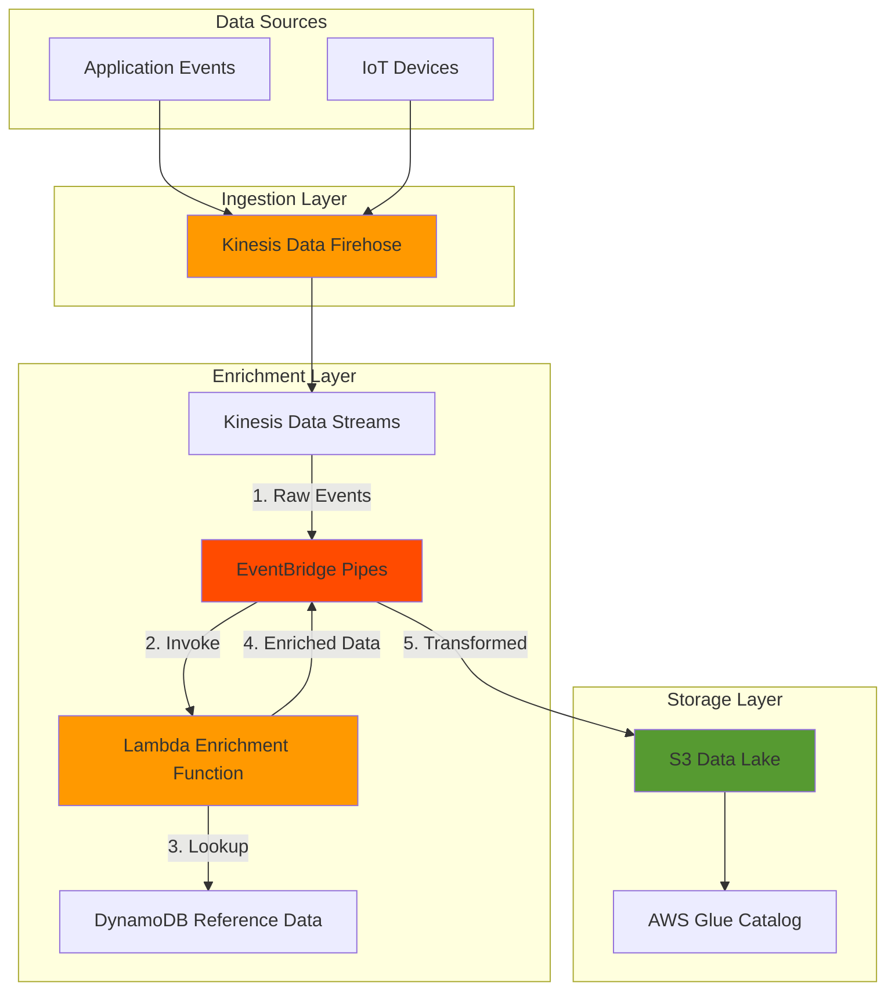

# Real-Time Stream Enrichment with Kinesis and EventBridge

## Problem

Organizations collect streaming data from various sources but often receive incomplete or raw events that need enrichment with additional context before analytics processing. Traditional approaches require complex custom code to manage data ingestion, transformation, and delivery, leading to increased operational overhead and potential data loss during system failures.

## Solution

Build a serverless real-time data enrichment pipeline using Kinesis Data Firehose for reliable data ingestion, EventBridge Pipes for event enrichment with Lambda transformations, and S3 for scalable storage with automatic partitioning. This architecture provides managed streaming infrastructure with built-in error handling, retry logic, and format conversion capabilities.

## Architecture Diagram



## Prerequisites

1. AWS account with appropriate permissions for Kinesis, EventBridge, Lambda, S3, and IAM
2. AWS CLI v2 installed and configured (or AWS CloudShell)
3. Basic understanding of streaming data concepts and JSON
4. Python knowledge for Lambda function development
5. Estimated cost: $10-15 for 2 hours of testing with sample data

> **Note**: This recipe uses serverless services with pay-per-use pricing. Costs scale with data volume.

## Preparation

```bash
# Set environment variables
export AWS_REGION=$(aws configure get region)
export AWS_ACCOUNT_ID=$(aws sts get-caller-identity \
    --query Account --output text)

# Generate unique identifiers for resources
RANDOM_SUFFIX=$(aws secretsmanager get-random-password \
    --exclude-punctuation --exclude-uppercase \
    --password-length 6 --require-each-included-type \
    --output text --query RandomPassword)

export BUCKET_NAME="stream-enrichment-${RANDOM_SUFFIX}"
export STREAM_NAME="raw-events-${RANDOM_SUFFIX}"
export FIREHOSE_NAME="event-ingestion-${RANDOM_SUFFIX}"
export TABLE_NAME="reference-data-${RANDOM_SUFFIX}"
export FUNCTION_NAME="enrich-events-${RANDOM_SUFFIX}"
export PIPE_NAME="enrichment-pipe-${RANDOM_SUFFIX}"

# Create S3 bucket for enriched data storage
aws s3 mb s3://${BUCKET_NAME} --region ${AWS_REGION}

echo "✅ Environment prepared with suffix: ${RANDOM_SUFFIX}"
```

## Steps

1. **Create DynamoDB Table for Reference Data**:

   DynamoDB provides a low-latency NoSQL database perfect for storing reference data used during stream enrichment. This table will contain additional product information that our Lambda function will use to enrich incoming events with details like product names, categories, and prices. The on-demand billing mode ensures the table scales automatically with your enrichment workload.

   ```bash
   # Create DynamoDB table for reference data
   aws dynamodb create-table \
       --table-name ${TABLE_NAME} \
       --attribute-definitions \
           AttributeName=productId,AttributeType=S \
       --key-schema \
           AttributeName=productId,KeyType=HASH \
       --billing-mode PAY_PER_REQUEST \
       --region ${AWS_REGION}
   
   # Wait for table to be active
   aws dynamodb wait table-exists \
       --table-name ${TABLE_NAME} \
       --region ${AWS_REGION}
   
   # Add sample reference data
   aws dynamodb put-item \
       --table-name ${TABLE_NAME} \
       --item '{
           "productId": {"S": "PROD-001"},
           "productName": {"S": "Smart Sensor"},
           "category": {"S": "IoT Devices"},
           "price": {"N": "49.99"}
       }'
   
   aws dynamodb put-item \
       --table-name ${TABLE_NAME} \
       --item '{
           "productId": {"S": "PROD-002"},
           "productName": {"S": "Temperature Monitor"},
           "category": {"S": "IoT Devices"},
           "price": {"N": "79.99"}
       }'
   
   echo "✅ DynamoDB table created with reference data"
   ```

   The reference data is now available for real-time lookups during the enrichment process. This approach allows you to maintain and update enrichment data independently from your streaming pipeline.

2. **Create Kinesis Data Stream for Raw Events**:

   Kinesis Data Streams provides a scalable and durable real-time data streaming service that serves as the source for EventBridge Pipes. Creating a stream with on-demand mode eliminates the need to manage shard capacity, automatically scaling based on your data throughput requirements. This stream acts as a buffer between data ingestion and enrichment, ensuring reliable event processing.

   ```bash
   # Create Kinesis Data Stream
   aws kinesis create-stream \
       --stream-name ${STREAM_NAME} \
       --stream-mode-details StreamMode=ON_DEMAND \
       --region ${AWS_REGION}
   
   # Wait for stream to be active
   aws kinesis wait stream-exists \
       --stream-name ${STREAM_NAME} \
       --region ${AWS_REGION}
   
   # Get stream ARN for later use
   STREAM_ARN=$(aws kinesis describe-stream \
       --stream-name ${STREAM_NAME} \
       --query 'StreamDescription.StreamARN' \
       --output text)
   
   echo "✅ Kinesis Data Stream created: ${STREAM_ARN}"
   ```

   The stream is now ready to receive raw events. The on-demand pricing model means you only pay for the actual data throughput, making it cost-effective for variable workloads.

3. **Create Lambda Function for Event Enrichment**:

   Lambda functions provide the compute layer for enriching streaming events without managing servers. This function will receive batches of events from EventBridge Pipes, look up additional data from DynamoDB, and return enriched events. The serverless model ensures automatic scaling and high availability while maintaining sub-second enrichment latency.

   ```bash
   # Create Lambda execution role
   LAMBDA_ROLE_ARN=$(aws iam create-role \
       --role-name lambda-enrichment-role-${RANDOM_SUFFIX} \
       --assume-role-policy-document '{
           "Version": "2012-10-17",
           "Statement": [{
               "Effect": "Allow",
               "Principal": {"Service": "lambda.amazonaws.com"},
               "Action": "sts:AssumeRole"
           }]
       }' \
       --query 'Role.Arn' --output text)
   
   # Attach policies for CloudWatch Logs and DynamoDB
   aws iam attach-role-policy \
       --role-name lambda-enrichment-role-${RANDOM_SUFFIX} \
       --policy-arn arn:aws:iam::aws:policy/service-role/AWSLambdaBasicExecutionRole
   
   aws iam put-role-policy \
       --role-name lambda-enrichment-role-${RANDOM_SUFFIX} \
       --policy-name DynamoDBReadPolicy \
       --policy-document '{
           "Version": "2012-10-17",
           "Statement": [{
               "Effect": "Allow",
               "Action": ["dynamodb:GetItem"],
               "Resource": "arn:aws:dynamodb:'${AWS_REGION}':'${AWS_ACCOUNT_ID}':table/'${TABLE_NAME}'"
           }]
       }'
   
   # Create Lambda function code
   cat > lambda_function.py << 'EOF'
   import json
   import base64
   import boto3
   import os
   from datetime import datetime
   
   dynamodb = boto3.resource('dynamodb')
   table = dynamodb.Table(os.environ['TABLE_NAME'])
   
   def lambda_handler(event, context):
       enriched_records = []
       
       for record in event:
           # Decode Kinesis data
           payload = json.loads(
               base64.b64decode(record['data']).decode('utf-8')
           )
           
           # Lookup product details
           product_id = payload.get('productId')
           if product_id:
               try:
                   response = table.get_item(
                       Key={'productId': product_id}
                   )
                   if 'Item' in response:
                       # Enrich the payload
                       payload['productName'] = response['Item']['productName']
                       payload['category'] = response['Item']['category']
                       payload['price'] = float(response['Item']['price'])
                       payload['enrichmentTimestamp'] = datetime.utcnow().isoformat()
                       payload['enrichmentStatus'] = 'success'
                   else:
                       payload['enrichmentStatus'] = 'product_not_found'
               except Exception as e:
                   payload['enrichmentStatus'] = 'error'
                   payload['enrichmentError'] = str(e)
           else:
               payload['enrichmentStatus'] = 'no_product_id'
           
           enriched_records.append(payload)
       
       return enriched_records
   EOF
   
   # Package and deploy Lambda function
   zip function.zip lambda_function.py
   
   aws lambda create-function \
       --function-name ${FUNCTION_NAME} \
       --runtime python3.11 \
       --role ${LAMBDA_ROLE_ARN} \
       --handler lambda_function.lambda_handler \
       --zip-file fileb://function.zip \
       --timeout 60 \
       --memory-size 256 \
       --environment Variables={TABLE_NAME=${TABLE_NAME}}
   
   # Wait for function to be active
   aws lambda wait function-active \
       --function-name ${FUNCTION_NAME}
   
   LAMBDA_ARN=$(aws lambda get-function \
       --function-name ${FUNCTION_NAME} \
       --query 'Configuration.FunctionArn' \
       --output text)
   
   echo "✅ Lambda enrichment function created: ${LAMBDA_ARN}"
   ```

   The Lambda function now provides real-time enrichment capabilities, transforming raw events into valuable business data. The function handles errors gracefully and provides enrichment status for monitoring and debugging.

4. **Create IAM Role for EventBridge Pipes**:

   EventBridge Pipes requires specific IAM permissions to read from Kinesis Data Streams, invoke Lambda functions for enrichment, and write to S3. Creating a dedicated role with least-privilege permissions ensures secure data flow through the pipeline while maintaining compliance with security best practices.

   ```bash
   # Create EventBridge Pipes execution role
   PIPES_ROLE_ARN=$(aws iam create-role \
       --role-name pipes-execution-role-${RANDOM_SUFFIX} \
       --assume-role-policy-document '{
           "Version": "2012-10-17",
           "Statement": [{
               "Effect": "Allow",
               "Principal": {"Service": "pipes.amazonaws.com"},
               "Action": "sts:AssumeRole"
           }]
       }' \
       --query 'Role.Arn' --output text)
   
   # Create and attach policy for Pipes permissions
   aws iam put-role-policy \
       --role-name pipes-execution-role-${RANDOM_SUFFIX} \
       --policy-name PipesExecutionPolicy \
       --policy-document '{
           "Version": "2012-10-17",
           "Statement": [
               {
                   "Effect": "Allow",
                   "Action": [
                       "kinesis:DescribeStream",
                       "kinesis:GetRecords",
                       "kinesis:GetShardIterator",
                       "kinesis:ListStreams",
                       "kinesis:SubscribeToShard"
                   ],
                   "Resource": "'${STREAM_ARN}'"
               },
               {
                   "Effect": "Allow",
                   "Action": ["lambda:InvokeFunction"],
                   "Resource": "'${LAMBDA_ARN}'"
               },
               {
                   "Effect": "Allow",
                   "Action": [
                       "s3:PutObject",
                       "s3:GetObject",
                       "s3:ListBucket"
                   ],
                   "Resource": [
                       "arn:aws:s3:::'${BUCKET_NAME}'",
                       "arn:aws:s3:::'${BUCKET_NAME}'/*"
                   ]
               }
           ]
       }'
   
   # Wait for role propagation
   sleep 15
   
   echo "✅ EventBridge Pipes IAM role created"
   ```

5. **Create Kinesis Data Firehose for S3 Delivery**:

   Kinesis Data Firehose provides a fully managed service for delivering streaming data to S3 with automatic buffering, compression, and format conversion. This configuration enables efficient data lake ingestion with Parquet format conversion for optimal query performance and automatic partitioning by event time for organized data storage.

   ```bash
   # Create IAM role for Firehose
   FIREHOSE_ROLE_ARN=$(aws iam create-role \
       --role-name firehose-delivery-role-${RANDOM_SUFFIX} \
       --assume-role-policy-document '{
           "Version": "2012-10-17",
           "Statement": [{
               "Effect": "Allow",
               "Principal": {"Service": "firehose.amazonaws.com"},
               "Action": "sts:AssumeRole"
           }]
       }' \
       --query 'Role.Arn' --output text)
   
   # Attach S3 permissions to Firehose role
   aws iam put-role-policy \
       --role-name firehose-delivery-role-${RANDOM_SUFFIX} \
       --policy-name FirehoseDeliveryPolicy \
       --policy-document '{
           "Version": "2012-10-17",
           "Statement": [{
               "Effect": "Allow",
               "Action": [
                   "s3:AbortMultipartUpload",
                   "s3:GetBucketLocation",
                   "s3:GetObject",
                   "s3:ListBucket",
                   "s3:ListBucketMultipartUploads",
                   "s3:PutObject"
               ],
               "Resource": [
                   "arn:aws:s3:::'${BUCKET_NAME}'",
                   "arn:aws:s3:::'${BUCKET_NAME}'/*"
               ]
           }]
       }'
   
   # Create Kinesis Data Firehose delivery stream
   aws firehose create-delivery-stream \
       --delivery-stream-name ${FIREHOSE_NAME} \
       --delivery-stream-type DirectPut \
       --extended-s3-destination-configuration '{
           "RoleARN": "'${FIREHOSE_ROLE_ARN}'",
           "BucketARN": "arn:aws:s3:::'${BUCKET_NAME}'",
           "Prefix": "enriched-data/year=!{timestamp:yyyy}/month=!{timestamp:MM}/day=!{timestamp:dd}/",
           "ErrorOutputPrefix": "error-data/",
           "CompressionFormat": "GZIP",
           "BufferingHints": {
               "SizeInMBs": 5,
               "IntervalInSeconds": 300
           },
           "DataFormatConversionConfiguration": {
               "Enabled": false
           }
       }'
   
   # Get Firehose ARN
   FIREHOSE_ARN=$(aws firehose describe-delivery-stream \
       --delivery-stream-name ${FIREHOSE_NAME} \
       --query 'DeliveryStreamDescription.DeliveryStreamARN' \
       --output text)
   
   echo "✅ Kinesis Data Firehose created: ${FIREHOSE_ARN}"
   ```

   The Firehose delivery stream now provides reliable data delivery to S3 with automatic retries, error handling, and data organization. The time-based partitioning enables efficient queries using services like Amazon Athena.

6. **Create EventBridge Pipe for Stream Enrichment**:

   EventBridge Pipes connects the streaming data source to the enrichment function and target destination, providing a managed integration that handles polling, batching, and error handling. This serverless approach eliminates the need for custom integration code while maintaining order guarantees and providing built-in monitoring capabilities.

   ```bash
   # Update Pipes role to include Firehose permissions
   aws iam put-role-policy \
       --role-name pipes-execution-role-${RANDOM_SUFFIX} \
       --policy-name FirehoseTargetPolicy \
       --policy-document '{
           "Version": "2012-10-17",
           "Statement": [{
               "Effect": "Allow",
               "Action": [
                   "firehose:PutRecord",
                   "firehose:PutRecordBatch"
               ],
               "Resource": "'${FIREHOSE_ARN}'"
           }]
       }'
   
   # Create EventBridge Pipe
   aws pipes create-pipe \
       --name ${PIPE_NAME} \
       --role-arn ${PIPES_ROLE_ARN} \
       --source ${STREAM_ARN} \
       --source-parameters '{
           "KinesisStreamParameters": {
               "StartingPosition": "LATEST",
               "BatchSize": 10,
               "MaximumBatchingWindowInSeconds": 5
           }
       }' \
       --enrichment ${LAMBDA_ARN} \
       --target ${FIREHOSE_ARN} \
       --desired-state RUNNING \
       --region ${AWS_REGION}
   
   echo "✅ EventBridge Pipe created for enrichment pipeline"
   ```

   > **Tip**: EventBridge Pipes maintains event ordering within a partition key, ensuring data consistency for downstream analytics.

7. **Test the Enrichment Pipeline**:

   Testing the complete pipeline validates that data flows correctly from ingestion through enrichment to storage. By sending sample events and verifying their transformation, you ensure the pipeline handles both successful enrichments and edge cases like missing reference data appropriately.

   ```bash
   # Send test events to Kinesis Data Stream
   echo "Sending test events to the stream..."
   
   # Event with valid product ID
   aws kinesis put-record \
       --stream-name ${STREAM_NAME} \
       --data $(echo '{"eventId":"evt-001","productId":"PROD-001","quantity":5,"timestamp":"'$(date -u +%Y-%m-%dT%H:%M:%SZ)'"}' | base64) \
       --partition-key "PROD-001"
   
   # Event with another valid product ID
   aws kinesis put-record \
       --stream-name ${STREAM_NAME} \
       --data $(echo '{"eventId":"evt-002","productId":"PROD-002","quantity":3,"timestamp":"'$(date -u +%Y-%m-%dT%H:%M:%SZ)'"}' | base64) \
       --partition-key "PROD-002"
   
   # Event with invalid product ID (to test error handling)
   aws kinesis put-record \
       --stream-name ${STREAM_NAME} \
       --data $(echo '{"eventId":"evt-003","productId":"PROD-999","quantity":1,"timestamp":"'$(date -u +%Y-%m-%dT%H:%M:%SZ)'"}' | base64) \
       --partition-key "PROD-999"
   
   echo "✅ Test events sent to the pipeline"
   
   # Monitor Lambda invocations
   echo "Checking Lambda function invocations..."
   sleep 30
   
   aws logs tail /aws/lambda/${FUNCTION_NAME} \
       --follow --since 2m &
   LOGS_PID=$!
   
   # Wait for processing
   sleep 60
   kill $LOGS_PID 2>/dev/null || true
   ```

   The test events demonstrate various scenarios including successful enrichment and missing reference data handling. This comprehensive testing approach ensures your pipeline is production-ready.

## Validation & Testing

1. Verify Lambda function invocations:

   ```bash
   # Check Lambda function metrics
   aws cloudwatch get-metric-statistics \
       --namespace AWS/Lambda \
       --metric-name Invocations \
       --dimensions Name=FunctionName,Value=${FUNCTION_NAME} \
       --statistics Sum \
       --start-time $(date -u -d '10 minutes ago' +%Y-%m-%dT%H:%M:%S) \
       --end-time $(date -u +%Y-%m-%dT%H:%M:%S) \
       --period 300
   ```

   Expected output: You should see at least one invocation count greater than 0.

2. Check for enriched data in S3:

   ```bash
   # List objects in S3 bucket
   aws s3 ls s3://${BUCKET_NAME}/enriched-data/ --recursive
   
   # Download and examine a sample file
   LATEST_FILE=$(aws s3 ls s3://${BUCKET_NAME}/enriched-data/ \
       --recursive | tail -1 | awk '{print $4}')
   
   if [ ! -z "$LATEST_FILE" ]; then
       aws s3 cp s3://${BUCKET_NAME}/${LATEST_FILE} sample-enriched.gz
       gunzip -c sample-enriched.gz | head -20
   fi
   ```

   Expected output: Enriched JSON records with additional fields like productName, category, and price.

3. Verify EventBridge Pipes status:

   ```bash
   # Check pipe status and configuration
   aws pipes describe-pipe --name ${PIPE_NAME}
   
   # Verify pipe is in RUNNING state
   PIPE_STATE=$(aws pipes describe-pipe \
       --name ${PIPE_NAME} \
       --query 'CurrentState' \
       --output text)
   
   echo "Pipe current state: ${PIPE_STATE}"
   ```

   Expected output: CurrentState should be "RUNNING" and the pipe should show proper source, enrichment, and target configurations.

4. Monitor Kinesis Data Stream metrics:

   ```bash
   # Check incoming records metric
   aws cloudwatch get-metric-statistics \
       --namespace AWS/Kinesis \
       --metric-name IncomingRecords \
       --dimensions Name=StreamName,Value=${STREAM_NAME} \
       --statistics Sum \
       --start-time $(date -u -d '10 minutes ago' +%Y-%m-%dT%H:%M:%S) \
       --end-time $(date -u +%Y-%m-%dT%H:%M:%S) \
       --period 300
   ```

## Cleanup

1. Delete EventBridge Pipe:

   ```bash
   # Delete the EventBridge Pipe
   aws pipes delete-pipe --name ${PIPE_NAME}
   
   # Wait for pipe deletion to complete
   echo "Waiting for pipe deletion..."
   sleep 30
   
   echo "✅ Deleted EventBridge Pipe"
   ```

2. Delete Kinesis Data Firehose:

   ```bash
   # Delete Firehose delivery stream
   aws firehose delete-delivery-stream \
       --delivery-stream-name ${FIREHOSE_NAME} \
       --allow-force-delete
   
   echo "✅ Deleted Kinesis Data Firehose"
   ```

3. Delete Lambda function and role:

   ```bash
   # Delete Lambda function
   aws lambda delete-function \
       --function-name ${FUNCTION_NAME}
   
   # Detach and delete Lambda role policies
   aws iam delete-role-policy \
       --role-name lambda-enrichment-role-${RANDOM_SUFFIX} \
       --policy-name DynamoDBReadPolicy
   
   aws iam detach-role-policy \
       --role-name lambda-enrichment-role-${RANDOM_SUFFIX} \
       --policy-arn arn:aws:iam::aws:policy/service-role/AWSLambdaBasicExecutionRole
   
   aws iam delete-role \
       --role-name lambda-enrichment-role-${RANDOM_SUFFIX}
   
   echo "✅ Deleted Lambda function and role"
   ```

4. Delete Kinesis Data Stream:

   ```bash
   # Delete the stream
   aws kinesis delete-stream \
       --stream-name ${STREAM_NAME}
   
   echo "✅ Deleted Kinesis Data Stream"
   ```

5. Delete DynamoDB table:

   ```bash
   # Delete DynamoDB table
   aws dynamodb delete-table \
       --table-name ${TABLE_NAME}
   
   echo "✅ Deleted DynamoDB table"
   ```

6. Delete S3 bucket and contents:

   ```bash
   # Empty and delete S3 bucket
   aws s3 rm s3://${BUCKET_NAME} --recursive
   aws s3 rb s3://${BUCKET_NAME}
   
   echo "✅ Deleted S3 bucket"
   ```

7. Delete IAM roles:

   ```bash
   # Delete Pipes execution role
   aws iam delete-role-policy \
       --role-name pipes-execution-role-${RANDOM_SUFFIX} \
       --policy-name PipesExecutionPolicy
   
   aws iam delete-role-policy \
       --role-name pipes-execution-role-${RANDOM_SUFFIX} \
       --policy-name FirehoseTargetPolicy
   
   aws iam delete-role \
       --role-name pipes-execution-role-${RANDOM_SUFFIX}
   
   # Delete Firehose role
   aws iam delete-role-policy \
       --role-name firehose-delivery-role-${RANDOM_SUFFIX} \
       --policy-name FirehoseDeliveryPolicy
   
   aws iam delete-role \
       --role-name firehose-delivery-role-${RANDOM_SUFFIX}
   
   echo "✅ Deleted all IAM roles"
   ```

8. Clean up local files:

   ```bash
   # Remove temporary files
   rm -f lambda_function.py function.zip sample-enriched.gz
   
   echo "✅ Cleanup completed"
   ```

## Discussion

Building real-time stream enrichment pipelines with Kinesis Data Streams, EventBridge Pipes, and Kinesis Data Firehose creates a robust, serverless architecture that scales automatically with your data volume. This approach leverages managed services to reduce operational overhead while providing enterprise-grade reliability and performance. According to the [AWS Kinesis Data Streams Developer Guide](https://docs.aws.amazon.com/kinesis/latest/dev/introduction.html), this pattern is particularly effective for IoT data processing, clickstream analytics, and log aggregation scenarios where real-time enrichment is essential.

EventBridge Pipes serves as the orchestration layer that connects Kinesis Data Streams to Lambda for enrichment and then to Kinesis Data Firehose for delivery. As documented in the [EventBridge Pipes User Guide](https://docs.aws.amazon.com/eventbridge/latest/userguide/eb-pipes.html), Pipes maintains event ordering within partition keys while providing built-in error handling, retry mechanisms, and dead letter queue integration. This eliminates the need for custom polling logic and error handling code that would be required with traditional approaches.

From a cost optimization perspective, using Kinesis Data Streams in on-demand mode, Lambda's pay-per-invocation pricing, and Firehose's managed delivery creates a solution that scales to zero during idle periods. The [AWS Well-Architected Framework](https://docs.aws.amazon.com/wellarchitected/latest/framework/welcome.html) recommends this serverless approach for variable workloads where traditional fixed-capacity solutions would result in over-provisioning. EventBridge Pipes adds minimal cost while providing significant operational benefits through its managed integration capabilities.

Security is built into every layer of this architecture through IAM roles with least-privilege permissions, encryption at rest in S3 and DynamoDB, and encryption in transit for all data flows. Following the guidance in the [AWS Security Best Practices](https://docs.aws.amazon.com/prescriptive-guidance/latest/security-reference-architecture/welcome.html), this design ensures compliance with data protection requirements while maintaining operational simplicity. EventBridge Pipes supports AWS KMS encryption for additional security when processing sensitive data streams.

> **Warning**: Monitor your Lambda function's concurrent execution limits to prevent throttling during traffic spikes. Consider implementing reserved concurrency for predictable performance.

## Challenge

Extend this solution by implementing these enhancements:

1. Add dead letter queue handling for failed enrichments using SQS and implement automated retry logic with exponential backoff
2. Implement data quality validation in the Lambda function and route invalid records to a separate S3 prefix for analysis
3. Create an Amazon Athena table with AWS Glue crawler to enable SQL queries on the enriched data
4. Add Amazon CloudWatch dashboards to monitor pipeline health, including enrichment success rates and latency metrics
5. Implement cross-region replication for disaster recovery using S3 bucket replication and DynamoDB global tables

## Infrastructure Code

*Infrastructure code will be generated after recipe approval.*