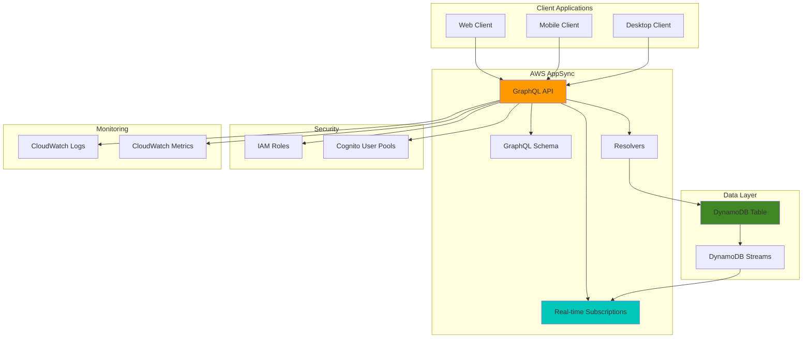

# Synchronizing Real-time Data with AWS AppSync

## Problem

Modern collaborative applications require real-time data synchronization to keep multiple users in sync as they work together. Traditional REST APIs with polling are insufficient for applications like collaborative document editing, real-time chat, or live dashboards where users need immediate updates when data changes. Without proper real-time synchronization, users see stale data, experience conflicts when making simultaneous changes, and have poor user experience due to delayed updates.

## Solution

AWS AppSync provides a managed GraphQL API service with built-in real-time capabilities through WebSocket subscriptions. This solution implements a collaborative task management system where multiple users can create, update, and delete tasks while receiving real-time notifications of changes made by other users. AppSync handles subscription management, conflict resolution, and automatic reconnection, providing a robust foundation for real-time collaborative applications.

## Architecture Diagram



## Prerequisites

1. AWS account with appropriate permissions for AppSync, DynamoDB, IAM, and CloudWatch
2. AWS CLI v2 installed and configured (or AWS CloudShell)
3. Basic knowledge of GraphQL schema design and DynamoDB
4. Understanding of real-time application architecture patterns
5. Estimated cost: $10-15 for resources created (delete resources after completion)

> **Note**: This recipe creates production-ready resources. Monitor costs and clean up resources when testing is complete.

> **Warning**: DynamoDB streams and AppSync subscriptions incur charges based on usage. Ensure proper cleanup after testing to avoid unexpected costs.

## Preparation

```bash
# Set environment variables
export AWS_REGION=$(aws configure get region)
export AWS_ACCOUNT_ID=$(aws sts get-caller-identity \
    --query Account --output text)

# Generate unique identifiers for resources
RANDOM_SUFFIX=$(aws secretsmanager get-random-password \
    --exclude-punctuation --exclude-uppercase \
    --password-length 6 --require-each-included-type \
    --output text --query RandomPassword)

export API_NAME="realtime-tasks-${RANDOM_SUFFIX}"
export TABLE_NAME="tasks-${RANDOM_SUFFIX}"
export ROLE_NAME="appsync-tasks-role-${RANDOM_SUFFIX}"

echo "✅ Environment variables configured"
echo "API Name: ${API_NAME}"
echo "Table Name: ${TABLE_NAME}"
echo "Role Name: ${ROLE_NAME}"
```

## Steps

1. **Create DynamoDB Table for Task Storage**:

   DynamoDB serves as our primary data store with 99.999999999% (11 9's) durability and single-digit millisecond latency. The table design includes DynamoDB Streams which capture data modifications in real-time, enabling AppSync to automatically trigger subscription updates when tasks change. This eliminates the need for complex change detection mechanisms.

   ```bash
   # Create DynamoDB table with Global Secondary Index
   aws dynamodb create-table \
       --table-name ${TABLE_NAME} \
       --attribute-definitions \
           AttributeName=id,AttributeType=S \
           AttributeName=status,AttributeType=S \
           AttributeName=createdAt,AttributeType=S \
       --key-schema \
           AttributeName=id,KeyType=HASH \
       --global-secondary-indexes \
           IndexName=status-createdAt-index,KeySchema=[{AttributeName=status,KeyType=HASH},{AttributeName=createdAt,KeyType=RANGE}],Projection={ProjectionType=ALL},ProvisionedThroughput={ReadCapacityUnits=5,WriteCapacityUnits=5} \
       --provisioned-throughput \
           ReadCapacityUnits=5,WriteCapacityUnits=5 \
       --stream-specification \
           StreamEnabled=true,StreamViewType=NEW_AND_OLD_IMAGES \
       --tags Key=Purpose,Value=AppSyncTutorial
   
   # Wait for table to be active
   aws dynamodb wait table-exists --table-name ${TABLE_NAME}
   
   echo "✅ DynamoDB table ${TABLE_NAME} created with streams enabled"
   ```

   The table is now ready with streams enabled for real-time change capture. The Global Secondary Index allows efficient querying by task status, while the stream configuration ensures all data modifications trigger AppSync subscription notifications to connected clients.

2. **Create IAM Role for AppSync**:

   IAM roles provide secure, temporary credential delegation without hardcoding secrets in application code. This follows AWS security best practices by implementing least privilege access, where AppSync receives only the specific DynamoDB permissions needed for task management operations while maintaining audit trails for compliance.

   ```bash
   # Create trust policy for AppSync
   cat > trust-policy.json << EOF
   {
       "Version": "2012-10-17",
       "Statement": [
           {
               "Effect": "Allow",
               "Principal": {
                   "Service": "appsync.amazonaws.com"
               },
               "Action": "sts:AssumeRole"
           }
       ]
   }
   EOF
   
   # Create IAM role
   aws iam create-role \
       --role-name ${ROLE_NAME} \
       --assume-role-policy-document file://trust-policy.json \
       --tags Key=Purpose,Value=AppSyncTutorial
   
   # Create policy for DynamoDB access
   cat > dynamodb-policy.json << EOF
   {
       "Version": "2012-10-17",
       "Statement": [
           {
               "Effect": "Allow",
               "Action": [
                   "dynamodb:GetItem",
                   "dynamodb:PutItem",
                   "dynamodb:UpdateItem",
                   "dynamodb:DeleteItem",
                   "dynamodb:Query",
                   "dynamodb:Scan"
               ],
               "Resource": [
                   "arn:aws:dynamodb:${AWS_REGION}:${AWS_ACCOUNT_ID}:table/${TABLE_NAME}",
                   "arn:aws:dynamodb:${AWS_REGION}:${AWS_ACCOUNT_ID}:table/${TABLE_NAME}/*"
               ]
           }
       ]
   }
   EOF
   
   # Attach policy to role
   aws iam put-role-policy \
       --role-name ${ROLE_NAME} \
       --policy-name DynamoDBAccess \
       --policy-document file://dynamodb-policy.json
   
   echo "✅ IAM role ${ROLE_NAME} created with DynamoDB permissions"
   ```

   The IAM role is now configured with precise DynamoDB permissions, enabling AppSync to perform all necessary database operations while maintaining security boundaries. This role-based approach ensures scalable, auditable access control across your real-time application infrastructure.

3. **Create GraphQL Schema File**:

   GraphQL schemas define the contract between clients and servers, specifying available operations, data types, and relationships. The schema includes subscription definitions that enable real-time data synchronization by automatically pushing changes to connected clients when mutations occur, creating a seamless collaborative experience.

   ```bash
   # Create GraphQL schema with subscription support
   cat > schema.graphql << 'EOF'
   type Task {
       id: ID!
       title: String!
       description: String
       status: TaskStatus!
       priority: Priority!
       assignedTo: String
       createdAt: AWSDateTime!
       updatedAt: AWSDateTime!
       version: Int!
   }
   
   enum TaskStatus {
       TODO
       IN_PROGRESS
       COMPLETED
       ARCHIVED
   }
   
   enum Priority {
       LOW
       MEDIUM
       HIGH
       URGENT
   }
   
   input CreateTaskInput {
       title: String!
       description: String
       priority: Priority!
       assignedTo: String
   }
   
   input UpdateTaskInput {
       id: ID!
       title: String
       description: String
       status: TaskStatus
       priority: Priority
       assignedTo: String
       version: Int!
   }
   
   type Query {
       getTask(id: ID!): Task
       listTasks(status: TaskStatus, limit: Int, nextToken: String): TaskConnection
       listTasksByStatus(status: TaskStatus!, limit: Int, nextToken: String): TaskConnection
   }
   
   type Mutation {
       createTask(input: CreateTaskInput!): Task
       updateTask(input: UpdateTaskInput!): Task
       deleteTask(id: ID!, version: Int!): Task
   }
   
   type Subscription {
       onTaskCreated: Task
           @aws_subscribe(mutations: ["createTask"])
       onTaskUpdated: Task
           @aws_subscribe(mutations: ["updateTask"])
       onTaskDeleted: Task
           @aws_subscribe(mutations: ["deleteTask"])
   }
   
   type TaskConnection {
       items: [Task]
       nextToken: String
   }
   
   schema {
       query: Query
       mutation: Mutation
       subscription: Subscription
   }
   EOF
   
   echo "✅ GraphQL schema created with real-time subscriptions"
   ```

   The schema establishes the foundation for real-time collaboration with strongly-typed queries, mutations, and subscriptions. The subscription definitions use AWS AppSync directives to automatically trigger notifications when tasks are created, updated, or deleted, ensuring all connected clients stay synchronized.

4. **Create AppSync GraphQL API**:

   AWS AppSync provides a managed GraphQL service that automatically scales to handle thousands of concurrent connections while maintaining low latency. The service manages WebSocket connections, subscription routing, and conflict resolution, eliminating the operational complexity of building real-time infrastructure from scratch.

   ```bash
   # Create AppSync GraphQL API
   API_RESPONSE=$(aws appsync create-graphql-api \
       --name ${API_NAME} \
       --authentication-type API_KEY \
       --tags Purpose=AppSyncTutorial)
   
   export API_ID=$(echo ${API_RESPONSE} | \
       jq -r '.graphqlApi.apiId')
   export API_URL=$(echo ${API_RESPONSE} | \
       jq -r '.graphqlApi.uris.GRAPHQL')
   
   # Upload GraphQL schema
   aws appsync start-schema-creation \
       --api-id ${API_ID} \
       --definition file://schema.graphql
   
   # Wait for schema creation to complete
   sleep 10
   
   echo "✅ AppSync API created with ID: ${API_ID}"
   echo "GraphQL URL: ${API_URL}"
   ```

   The AppSync API is now active and ready to handle GraphQL operations. The service automatically provisions the infrastructure needed for real-time subscriptions, including WebSocket connection management and message routing to ensure reliable delivery of updates to all connected clients.

5. **Create API Key for Testing**:

   API keys provide a simple authentication mechanism for development and testing scenarios. While production applications should use Amazon Cognito User Pools for user authentication, API keys offer a quick way to secure the GraphQL endpoint during development while maintaining access control.

   ```bash
   # Create API key for testing
   API_KEY_RESPONSE=$(aws appsync create-api-key \
       --api-id ${API_ID} \
       --description "Testing key for real-time tasks API" \
       --expires $(date -d "+30 days" +%s))
   
   export API_KEY=$(echo ${API_KEY_RESPONSE} | \
       jq -r '.apiKey.id')
   
   echo "✅ API Key created: ${API_KEY}"
   ```

   The API key enables secure access to the GraphQL endpoint for testing purposes. This temporary authentication method allows you to validate the real-time functionality before implementing production-grade authentication with user pools and fine-grained authorization rules.

6. **Create DynamoDB Data Source**:

   Data sources in AppSync define how GraphQL resolvers connect to backend services. By configuring DynamoDB as a data source, AppSync can automatically generate efficient database operations, handle connection pooling, and provide built-in error handling while maintaining optimal performance.

   ```bash
   # Get IAM role ARN
   ROLE_ARN=$(aws iam get-role \
       --role-name ${ROLE_NAME} \
       --query 'Role.Arn' --output text)
   
   # Create DynamoDB data source
   aws appsync create-data-source \
       --api-id ${API_ID} \
       --name TasksDataSource \
       --type AMAZON_DYNAMODB \
       --service-role-arn ${ROLE_ARN} \
       --dynamodb-config tableName=${TABLE_NAME},awsRegion=${AWS_REGION}
   
   echo "✅ DynamoDB data source created"
   ```

   The data source connection is established, enabling AppSync resolvers to interact with DynamoDB efficiently. This abstraction layer handles connection management, retry logic, and performance optimization automatically, allowing resolvers to focus on business logic rather than infrastructure concerns.

7. **Create Query Resolvers**:

   Resolvers are the bridge between GraphQL schema fields and data sources, translating GraphQL operations into backend-specific requests. These VTL (Velocity Template Language) templates define how queries are transformed into DynamoDB operations, enabling efficient data retrieval with automatic error handling and response formatting.

   ```bash
   # Create getTask resolver
   cat > getTask-request.vtl << 'EOF'
   {
       "version": "2018-05-29",
       "operation": "GetItem",
       "key": {
           "id": $util.dynamodb.toDynamoDBJson($ctx.args.id)
       }
   }
   EOF
   
   cat > getTask-response.vtl << 'EOF'
   #if($ctx.error)
       $util.error($ctx.error.message, $ctx.error.type)
   #end
   $util.toJson($ctx.result)
   EOF
   
   aws appsync create-resolver \
       --api-id ${API_ID} \
       --type-name Query \
       --field-name getTask \
       --data-source-name TasksDataSource \
       --request-mapping-template file://getTask-request.vtl \
       --response-mapping-template file://getTask-response.vtl
   
   # Create listTasks resolver
   cat > listTasks-request.vtl << 'EOF'
   {
       "version": "2018-05-29",
       "operation": "Scan",
       "limit": #if($ctx.args.limit) $ctx.args.limit #else 20 #end,
       "nextToken": #if($ctx.args.nextToken) "$ctx.args.nextToken" #else null #end
   }
   EOF
   
   cat > listTasks-response.vtl << 'EOF'
   #if($ctx.error)
       $util.error($ctx.error.message, $ctx.error.type)
   #end
   {
       "items": $util.toJson($ctx.result.items),
       "nextToken": #if($ctx.result.nextToken) "$ctx.result.nextToken" #else null #end
   }
   EOF
   
   aws appsync create-resolver \
       --api-id ${API_ID} \
       --type-name Query \
       --field-name listTasks \
       --data-source-name TasksDataSource \
       --request-mapping-template file://listTasks-request.vtl \
       --response-mapping-template file://listTasks-response.vtl
   
   echo "✅ Query resolvers created"
   ```

   The query resolvers are now active, enabling efficient data retrieval from DynamoDB. These resolvers handle individual task lookup and list operations with built-in pagination support, providing the read operations needed for collaborative task management applications.

8. **Create Mutation Resolvers with Conflict Resolution**:

   Mutation resolvers handle data modifications and implement optimistic concurrency control through version-based conflict resolution. This approach prevents data corruption in collaborative environments by ensuring that simultaneous updates from multiple users are handled gracefully, maintaining data integrity while providing excellent user experience.

   ```bash
   # Create createTask resolver
   cat > createTask-request.vtl << 'EOF'
   #set($id = $util.autoId())
   #set($createdAt = $util.time.nowISO8601())
   {
       "version": "2018-05-29",
       "operation": "PutItem",
       "key": {
           "id": $util.dynamodb.toDynamoDBJson($id)
       },
       "attributeValues": {
           "title": $util.dynamodb.toDynamoDBJson($ctx.args.input.title),
           "description": $util.dynamodb.toDynamoDBJson($ctx.args.input.description),
           "status": $util.dynamodb.toDynamoDBJson("TODO"),
           "priority": $util.dynamodb.toDynamoDBJson($ctx.args.input.priority),
           "assignedTo": $util.dynamodb.toDynamoDBJson($ctx.args.input.assignedTo),
           "createdAt": $util.dynamodb.toDynamoDBJson($createdAt),
           "updatedAt": $util.dynamodb.toDynamoDBJson($createdAt),
           "version": $util.dynamodb.toDynamoDBJson(1)
       }
   }
   EOF
   
   cat > createTask-response.vtl << 'EOF'
   #if($ctx.error)
       $util.error($ctx.error.message, $ctx.error.type)
   #end
   $util.toJson($ctx.result)
   EOF
   
   aws appsync create-resolver \
       --api-id ${API_ID} \
       --type-name Mutation \
       --field-name createTask \
       --data-source-name TasksDataSource \
       --request-mapping-template file://createTask-request.vtl \
       --response-mapping-template file://createTask-response.vtl
   
   # Create updateTask resolver with optimistic locking
   cat > updateTask-request.vtl << 'EOF'
   #set($updatedAt = $util.time.nowISO8601())
   {
       "version": "2018-05-29",
       "operation": "UpdateItem",
       "key": {
           "id": $util.dynamodb.toDynamoDBJson($ctx.args.input.id)
       },
       "update": {
           "expression": "SET #updatedAt = :updatedAt, #version = #version + :incr",
           "expressionNames": {
               "#updatedAt": "updatedAt",
               "#version": "version"
           },
           "expressionValues": {
               ":updatedAt": $util.dynamodb.toDynamoDBJson($updatedAt),
               ":incr": $util.dynamodb.toDynamoDBJson(1),
               ":expectedVersion": $util.dynamodb.toDynamoDBJson($ctx.args.input.version)
           }
       },
       "condition": {
           "expression": "#version = :expectedVersion",
           "expressionNames": {
               "#version": "version"
           },
           "expressionValues": {
               ":expectedVersion": $util.dynamodb.toDynamoDBJson($ctx.args.input.version)
           }
       }
   }
   
   #if($ctx.args.input.title)
       $util.qr($ctx.stash.put("title", $ctx.args.input.title))
   #end
   #if($ctx.args.input.description)
       $util.qr($ctx.stash.put("description", $ctx.args.input.description))
   #end
   #if($ctx.args.input.status)
       $util.qr($ctx.stash.put("status", $ctx.args.input.status))
   #end
   #if($ctx.args.input.priority)
       $util.qr($ctx.stash.put("priority", $ctx.args.input.priority))
   #end
   #if($ctx.args.input.assignedTo)
       $util.qr($ctx.stash.put("assignedTo", $ctx.args.input.assignedTo))
   #end
   
   #foreach($key in $ctx.stash.keySet())
       $util.qr($ctx.args.update.update.expressionNames.put("#$key", $key))
       $util.qr($ctx.args.update.update.expressionValues.put(":$key", $util.dynamodb.toDynamoDBJson($ctx.stash.get($key))))
       #if($foreach.hasNext)
           #set($expression = "$ctx.args.update.update.expression, #$key = :$key")
       #else
           #set($expression = "$ctx.args.update.update.expression, #$key = :$key")
       #end
   #end
   
   #if($ctx.stash.keySet().size() > 0)
       $util.qr($ctx.args.update.update.put("expression", $expression))
   #end
   
   $util.toJson($ctx.args.update)
   EOF
   
   cat > updateTask-response.vtl << 'EOF'
   #if($ctx.error)
       $util.error($ctx.error.message, $ctx.error.type)
   #end
   $util.toJson($ctx.result)
   EOF
   
   aws appsync create-resolver \
       --api-id ${API_ID} \
       --type-name Mutation \
       --field-name updateTask \
       --data-source-name TasksDataSource \
       --request-mapping-template file://updateTask-request.vtl \
       --response-mapping-template file://updateTask-response.vtl
   
   echo "✅ Mutation resolvers created with conflict resolution"
   ```

   The mutation resolvers are configured with optimistic locking to handle concurrent updates safely. When multiple users modify the same task simultaneously, the version-based conflict resolution ensures data consistency while automatically notifying all connected clients of successful changes through real-time subscriptions.

9. **Create Delete Resolver**:

   The delete resolver implements safe removal of tasks with version-based conflict detection. This ensures that tasks can only be deleted by clients with the current version, preventing accidental deletions in collaborative environments where multiple users might attempt to modify the same task simultaneously.

   ```bash
   # Create deleteTask resolver
   cat > deleteTask-request.vtl << 'EOF'
   {
       "version": "2018-05-29",
       "operation": "DeleteItem",
       "key": {
           "id": $util.dynamodb.toDynamoDBJson($ctx.args.id)
       },
       "condition": {
           "expression": "#version = :expectedVersion",
           "expressionNames": {
               "#version": "version"
           },
           "expressionValues": {
               ":expectedVersion": $util.dynamodb.toDynamoDBJson($ctx.args.version)
           }
       }
   }
   EOF
   
   cat > deleteTask-response.vtl << 'EOF'
   #if($ctx.error)
       $util.error($ctx.error.message, $ctx.error.type)
   #end
   $util.toJson($ctx.result)
   EOF
   
   aws appsync create-resolver \
       --api-id ${API_ID} \
       --type-name Mutation \
       --field-name deleteTask \
       --data-source-name TasksDataSource \
       --request-mapping-template file://deleteTask-request.vtl \
       --response-mapping-template file://deleteTask-response.vtl
   
   echo "✅ Delete resolver created"
   ```

   The delete resolver is now active with conflict protection enabled. Task deletions will trigger real-time notifications to all connected clients through subscriptions, ensuring that all users see the updated task list immediately when items are removed from the collaborative workspace.

10. **Create Sample Client Test Scripts**:

    Client-side GraphQL queries and subscriptions demonstrate how applications interact with the AppSync API. These templates provide the foundation for building real-time user interfaces that can create, update, and subscribe to task changes, enabling seamless collaborative experiences across web, mobile, and desktop applications.

    ```bash
    # Create a sample GraphQL test script
    cat > test-queries.js << 'EOF'
    // Sample GraphQL queries for testing
    const CREATE_TASK = `
    mutation CreateTask($input: CreateTaskInput!) {
        createTask(input: $input) {
            id
            title
            description
            status
            priority
            assignedTo
            createdAt
            updatedAt
            version
        }
    }
    `;
    
    const UPDATE_TASK = `
    mutation UpdateTask($input: UpdateTaskInput!) {
        updateTask(input: $input) {
            id
            title
            description
            status
            priority
            assignedTo
            createdAt
            updatedAt
            version
        }
    }
    `;
    
    const GET_TASK = `
    query GetTask($id: ID!) {
        getTask(id: $id) {
            id
            title
            description
            status
            priority
            assignedTo
            createdAt
            updatedAt
            version
        }
    }
    `;
    
    const LIST_TASKS = `
    query ListTasks($limit: Int, $nextToken: String) {
        listTasks(limit: $limit, nextToken: $nextToken) {
            items {
                id
                title
                description
                status
                priority
                assignedTo
                createdAt
                updatedAt
                version
            }
            nextToken
        }
    }
    `;
    
    const TASK_CREATED_SUBSCRIPTION = `
    subscription OnTaskCreated {
        onTaskCreated {
            id
            title
            description
            status
            priority
            assignedTo
            createdAt
            updatedAt
            version
        }
    }
    `;
    
    const TASK_UPDATED_SUBSCRIPTION = `
    subscription OnTaskUpdated {
        onTaskUpdated {
            id
            title
            description
            status
            priority
            assignedTo
            createdAt
            updatedAt
            version
        }
    }
    `;
    
    console.log('GraphQL queries and subscriptions ready for testing');
    EOF
    
    echo "✅ Sample test scripts created"
    ```

    The test scripts provide GraphQL operation templates that demonstrate real-time subscription patterns. These examples can be integrated into client applications using AWS AppSync SDKs to enable automatic UI updates when tasks change, creating responsive collaborative interfaces.

## Validation & Testing

1. **Test Basic API Functionality**:

   ```bash
   # Test creating a task
   CREATE_TASK_QUERY=$(cat << 'EOF'
   mutation {
       createTask(input: {
           title: "Test Task"
           description: "This is a test task"
           priority: HIGH
           assignedTo: "test@example.com"
       }) {
           id
           title
           status
           priority
           version
           createdAt
       }
   }
   EOF
   )
   
   TASK_RESULT=$(aws appsync post-graphql \
       --api-id ${API_ID} \
       --query "${CREATE_TASK_QUERY}" \
       --auth-type API_KEY \
       --auth-config apiKey=${API_KEY})
   
   TASK_ID=$(echo ${TASK_RESULT} | jq -r '.data.createTask.id')
   
   echo "✅ Created task with ID: ${TASK_ID}"
   ```

2. **Test Real-time Subscription (Basic)**:

   ```bash
   # Test listing tasks
   LIST_QUERY=$(cat << 'EOF'
   query {
       listTasks(limit: 10) {
           items {
               id
               title
               status
               priority
               createdAt
           }
           nextToken
       }
   }
   EOF
   )
   
   LIST_RESULT=$(aws appsync post-graphql \
       --api-id ${API_ID} \
       --query "${LIST_QUERY}" \
       --auth-type API_KEY \
       --auth-config apiKey=${API_KEY})
   
   TASK_COUNT=$(echo ${LIST_RESULT} | jq '.data.listTasks.items | length')
   
   echo "✅ Listed ${TASK_COUNT} tasks successfully"
   ```

3. **Test Conflict Resolution**:

   ```bash
   # Test updating a task (simulate conflict resolution)
   UPDATE_TASK_QUERY=$(cat << EOF
   mutation {
       updateTask(input: {
           id: "${TASK_ID}"
           title: "Updated Test Task"
           status: IN_PROGRESS
           version: 1
       }) {
           id
           title
           status
           version
           updatedAt
       }
   }
   EOF
   )
   
   UPDATE_RESULT=$(aws appsync post-graphql \
       --api-id ${API_ID} \
       --query "${UPDATE_TASK_QUERY}" \
       --auth-type API_KEY \
       --auth-config apiKey=${API_KEY})
   
   echo "✅ Updated task successfully"
   echo "Result: $(echo ${UPDATE_RESULT} | jq '.data.updateTask')"
   ```

4. **Verify CloudWatch Logs**:

   ```bash
   # Check AppSync logs
   LOG_GROUP="/aws/appsync/apis/${API_ID}"
   
   # Get recent log events
   aws logs describe-log-streams \
       --log-group-name ${LOG_GROUP} \
       --order-by LastEventTime \
       --descending \
       --limit 1
   
   echo "✅ CloudWatch logs verified - check console for detailed logs"
   ```

## Cleanup

1. **Delete AppSync API and Resources**:

   ```bash
   # Delete AppSync API (this removes all resolvers and data sources)
   aws appsync delete-graphql-api --api-id ${API_ID}
   
   echo "✅ Deleted AppSync API"
   ```

2. **Delete DynamoDB Table**:

   ```bash
   # Delete DynamoDB table
   aws dynamodb delete-table --table-name ${TABLE_NAME}
   
   echo "✅ Deleted DynamoDB table"
   ```

3. **Delete IAM Role and Policies**:

   ```bash
   # Delete IAM role policy
   aws iam delete-role-policy \
       --role-name ${ROLE_NAME} \
       --policy-name DynamoDBAccess
   
   # Delete IAM role
   aws iam delete-role --role-name ${ROLE_NAME}
   
   echo "✅ Deleted IAM role and policies"
   ```

4. **Clean up Local Files**:

   ```bash
   # Remove temporary files
   rm -f schema.graphql trust-policy.json dynamodb-policy.json
   rm -f *-request.vtl *-response.vtl test-queries.js
   
   echo "✅ Cleaned up temporary files"
   ```

## Discussion

AWS AppSync provides a powerful foundation for building real-time collaborative applications by combining GraphQL APIs with managed WebSocket subscriptions. The key architectural decisions in this solution include using DynamoDB Streams to trigger real-time updates, implementing optimistic locking for conflict resolution, and designing a schema that supports both individual operations and bulk updates.

The subscription mechanism in AppSync automatically handles connection management, reconnection on network failures, and message delivery guarantees. When a mutation is executed, AppSync automatically pushes the changes to all connected clients that have subscribed to the relevant event types. This eliminates the need for complex WebSocket management or polling mechanisms.

Conflict resolution is handled through optimistic concurrency control using version numbers. When multiple clients attempt to update the same item simultaneously, only the first update succeeds, and subsequent updates receive a conditional check failure. This prevents data corruption while maintaining high performance for the common case of non-conflicting updates.

The solution also demonstrates best practices for security through API key authentication, IAM role-based access control, and proper error handling. For production deployments, consider implementing more sophisticated authentication using Amazon Cognito User Pools and fine-grained authorization rules.

> **Tip**: Use GraphQL subscriptions selectively for data that truly requires real-time updates. Overuse of subscriptions can increase costs and complexity without providing user value. See [AWS AppSync documentation](https://docs.aws.amazon.com/appsync/latest/devguide/real-time-data.html) for subscription best practices.

## Challenge

Extend this solution by implementing these enhancements:

1. **Add User Authentication**: Integrate Amazon Cognito User Pools for user management and implement user-specific subscriptions that only receive updates for tasks assigned to them.

2. **Implement Advanced Conflict Resolution**: Create custom conflict resolution logic using AWS Lambda resolvers that can merge changes intelligently based on field-level conflicts rather than rejecting entire updates.

3. **Add Offline Support**: Implement client-side caching and offline mutation queuing using AWS AppSync client SDKs to handle network connectivity issues gracefully.

4. **Create Real-time Analytics**: Build a real-time dashboard that shows task completion rates, user activity, and system metrics using additional subscriptions and CloudWatch metrics.

5. **Scale for High Throughput**: Implement DynamoDB auto-scaling, AppSync caching, and connection throttling to handle thousands of concurrent users with minimal latency.

## Infrastructure Code

*Infrastructure code will be generated after recipe approval.*