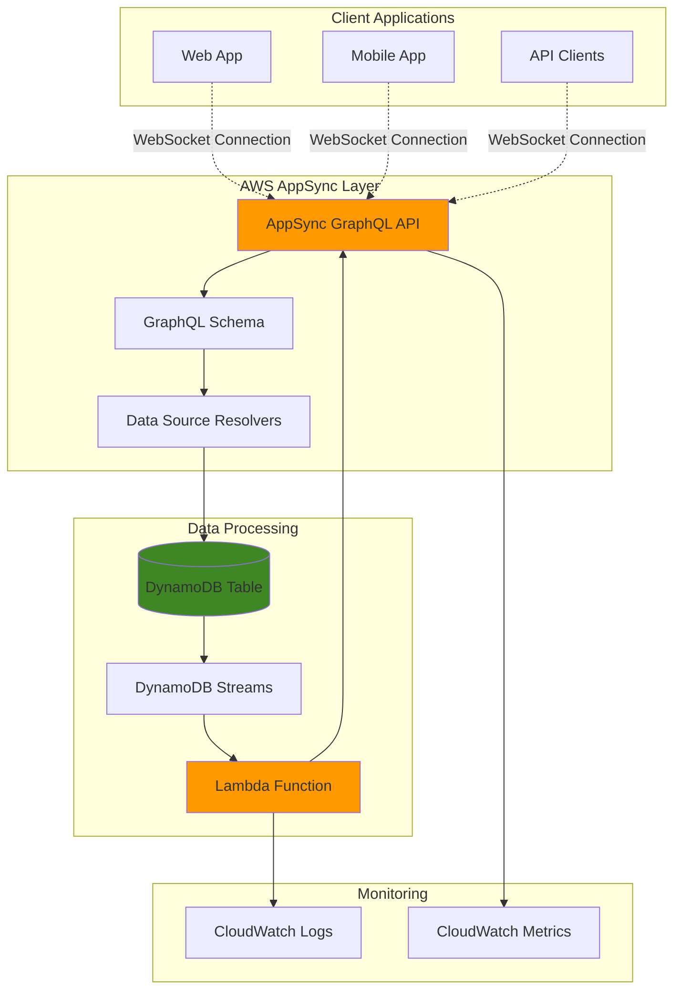

# Real-Time Data Synchronization with AppSync

## Problem

Modern applications require instant data synchronization across multiple client devices and platforms. Traditional polling-based approaches create excessive load, increase latency, and provide poor user experiences when multiple users collaborate on shared data. Organizations struggle to implement scalable real-time features while maintaining data consistency and managing WebSocket connections efficiently.

## Solution

AWS AppSync with GraphQL subscriptions provides automatic real-time data synchronization by establishing persistent WebSocket connections between clients and the managed GraphQL API. Combined with DynamoDB Streams and Lambda triggers, this architecture automatically pushes data changes to all subscribed clients instantly, eliminating the need for complex polling logic while ensuring data consistency across all connected applications.

## Architecture Diagram



## Prerequisites

1. AWS account with permissions for AppSync, DynamoDB, Lambda, CloudWatch, and IAM
2. AWS CLI v2 installed and configured (or AWS CloudShell)
3. Basic understanding of GraphQL concepts (queries, mutations, subscriptions)
4. Familiarity with DynamoDB and serverless architectures
5. Estimated cost: $5-10 for testing with minimal data (delete resources after completion)

> **Note**: AppSync charges for GraphQL operations and real-time subscriptions. Monitor usage in CloudWatch to avoid unexpected costs during development.

## Preparation

```bash
# Set environment variables
export AWS_REGION=$(aws configure get region)
export AWS_ACCOUNT_ID=$(aws sts get-caller-identity \
    --query Account --output text)

# Generate unique identifiers for resources
RANDOM_SUFFIX=$(aws secretsmanager get-random-password \
    --exclude-punctuation --exclude-uppercase \
    --password-length 6 --require-each-included-type \
    --output text --query RandomPassword)

export TABLE_NAME="RealTimeData-${RANDOM_SUFFIX}"
export LAMBDA_FUNCTION_NAME="AppSyncNotifier-${RANDOM_SUFFIX}"
export APPSYNC_API_NAME="RealTimeSyncAPI-${RANDOM_SUFFIX}"

echo "✅ Environment configured with unique resource names"
```

## Steps

1. **Create DynamoDB Table with Streams Enabled**:

   DynamoDB provides the persistent data layer with built-in change data capture through DynamoDB Streams. Enabling streams captures every item-level modification (INSERT, MODIFY, DELETE) in near real-time, creating the foundation for our event-driven synchronization architecture. This serverless approach eliminates the need for custom change detection logic while ensuring data durability and consistency through DynamoDB's 99.999999999% (11 9's) availability guarantee.

   ```bash
   # Create DynamoDB table with streams enabled
   aws dynamodb create-table \
       --table-name ${TABLE_NAME} \
       --attribute-definitions \
           AttributeName=id,AttributeType=S \
       --key-schema \
           AttributeName=id,KeyType=HASH \
       --stream-specification \
           StreamEnabled=true,StreamViewType=NEW_AND_OLD_IMAGES \
       --billing-mode PAY_PER_REQUEST \
       --tags Key=Project,Value=AppSyncRealTimeSync
   
   # Wait for table to become active
   aws dynamodb wait table-exists --table-name ${TABLE_NAME}
   
   # Get stream ARN for Lambda configuration
   export STREAM_ARN=$(aws dynamodb describe-table \
       --table-name ${TABLE_NAME} \
       --query 'Table.LatestStreamArn' --output text)
   
   echo "✅ DynamoDB table created with streams enabled"
   echo "Stream ARN: ${STREAM_ARN}"
   ```

   The DynamoDB table now captures all data modifications in its stream, providing the event source that will trigger real-time notifications. The NEW_AND_OLD_IMAGES view type ensures Lambda functions receive complete before-and-after data for comprehensive change processing, enabling sophisticated conflict resolution and audit logging capabilities.

2. **Create IAM Role for Lambda Function**:

   IAM roles provide secure, temporary credentials that enable Lambda functions to interact with AWS services without hardcoded access keys. This role follows the principle of least privilege, granting only the specific permissions needed for DynamoDB stream processing and AppSync API interactions while maintaining security best practices. Understanding IAM roles is crucial for serverless security as they eliminate the need for storing static credentials in application code.

   ```bash
   # Create Lambda execution role
   aws iam create-role \
       --role-name ${LAMBDA_FUNCTION_NAME}-Role \
       --assume-role-policy-document '{
         "Version": "2012-10-17",
         "Statement": [
           {
             "Effect": "Allow",
             "Principal": {
               "Service": "lambda.amazonaws.com"
             },
             "Action": "sts:AssumeRole"
           }
         ]
       }'
   
   # Attach basic Lambda execution policy
   aws iam attach-role-policy \
       --role-name ${LAMBDA_FUNCTION_NAME}-Role \
       --policy-arn arn:aws:iam::aws:policy/service-role/AWSLambdaBasicExecutionRole
   
   # Attach DynamoDB streams policy
   aws iam attach-role-policy \
       --role-name ${LAMBDA_FUNCTION_NAME}-Role \
       --policy-arn arn:aws:iam::aws:policy/service-role/AWSLambdaDynamoDBExecutionRole
   
   # Wait for role propagation
   sleep 10
   
   # Get role ARN for Lambda function creation
   export LAMBDA_ROLE_ARN=$(aws iam get-role \
       --role-name ${LAMBDA_FUNCTION_NAME}-Role \
       --query 'Role.Arn' --output text)
   
   echo "✅ IAM role created for Lambda function"
   echo "Role ARN: ${LAMBDA_ROLE_ARN}"
   ```

   The Lambda execution role is now configured with proper permissions to read from DynamoDB streams and write to CloudWatch logs. This security foundation enables Lambda to process stream events while maintaining AWS security best practices for serverless architectures, ensuring your application follows enterprise-grade security standards.

3. **Create Lambda Function for Stream Processing**:

   Lambda provides serverless compute that automatically scales to process DynamoDB stream events without managing infrastructure. This function acts as the bridge between DynamoDB changes and AppSync notifications, transforming stream records into GraphQL mutations that trigger real-time subscriptions across all connected clients. The serverless execution model scales from zero to thousands of concurrent invocations, providing cost-effective processing that only charges when events occur.

   ```bash
   # Create Lambda function code
   cat > lambda_function.py << 'EOF'
import json
import boto3
import logging
from datetime import datetime

logger = logging.getLogger()
logger.setLevel(logging.INFO)

def lambda_handler(event, context):
    """
    Process DynamoDB stream events and trigger AppSync mutations
    for real-time data synchronization
    """
    
    logger.info(f"Processing {len(event['Records'])} stream records")
    
    for record in event['Records']:
        event_name = record['eventName']
        
        if event_name in ['INSERT', 'MODIFY', 'REMOVE']:
            # Extract item data from stream record
            if 'NewImage' in record['dynamodb']:
                item_data = record['dynamodb']['NewImage']
                item_id = item_data.get('id', {}).get('S', 'unknown')
                
                logger.info(f"Processing {event_name} for item {item_id}")
                
                # In production, this would trigger AppSync mutations
                # For now, we'll log the change for validation
                change_event = {
                    'eventType': event_name,
                    'itemId': item_id,
                    'timestamp': datetime.utcnow().isoformat(),
                    'newImage': item_data if 'NewImage' in record['dynamodb'] else None,
                    'oldImage': record['dynamodb'].get('OldImage')
                }
                
                logger.info(f"Change event: {json.dumps(change_event, default=str)}")
        
    return {
        'statusCode': 200,
        'processedRecords': len(event['Records'])
    }
EOF
   
   # Package Lambda function
   zip -r lambda_function.zip lambda_function.py
   
   # Create Lambda function
   aws lambda create-function \
       --function-name ${LAMBDA_FUNCTION_NAME} \
       --runtime python3.11 \
       --role ${LAMBDA_ROLE_ARN} \
       --handler lambda_function.lambda_handler \
       --zip-file fileb://lambda_function.zip \
       --timeout 60 \
       --memory-size 256 \
       --environment Variables='{
         "TABLE_NAME":"'${TABLE_NAME}'"
       }' \
       --tags Project=AppSyncRealTimeSync
   
   # Wait for function to be ready
   aws lambda wait function-active \
       --function-name ${LAMBDA_FUNCTION_NAME}
   
   echo "✅ Lambda function created for stream processing"
   ```

   The Lambda function is now ready to process DynamoDB stream events in real-time with automatic error handling and retry logic. This serverless compute layer automatically scales based on stream activity, ensuring reliable change processing while maintaining cost efficiency through pay-per-invocation pricing. The function code demonstrates proper logging practices and error handling patterns essential for production serverless applications.

4. **Create Event Source Mapping for DynamoDB Streams**:

   Event source mapping creates the automatic trigger connection between DynamoDB streams and Lambda functions, acting as a managed event router that handles the complex logistics of stream processing. This AWS service manages stream polling, error handling, batch processing, and retry logic, ensuring reliable event delivery while providing configurable processing parameters for optimal performance and cost management. Understanding event source mappings is crucial for building robust event-driven architectures.

   ```bash
   # Create event source mapping
   aws lambda create-event-source-mapping \
       --function-name ${LAMBDA_FUNCTION_NAME} \
       --event-source-arn ${STREAM_ARN} \
       --starting-position LATEST \
       --batch-size 10 \
       --maximum-batching-window-in-seconds 5 \
       --parallelization-factor 1
   
   # Get mapping UUID for future reference
   export EVENT_MAPPING_UUID=$(aws lambda list-event-source-mappings \
       --function-name ${LAMBDA_FUNCTION_NAME} \
       --query 'EventSourceMappings[0].UUID' --output text)
   
   echo "✅ Event source mapping created"
   echo "Mapping UUID: ${EVENT_MAPPING_UUID}"
   ```

   The event source mapping now automatically delivers DynamoDB stream events to Lambda with optimized batching and error handling. This connection enables real-time processing of data changes while providing configurable processing parameters for performance tuning, including batch size optimization and maximum latency controls that balance throughput with processing speed.

5. **Create AppSync GraphQL API**:

   AWS AppSync provides a fully managed GraphQL API with built-in real-time capabilities through WebSocket subscriptions, eliminating the complexity of implementing and managing WebSocket infrastructure. This managed service handles connection management, message routing, automatic scaling, and authentication, providing enterprise-grade security and monitoring while reducing operational overhead. AppSync automatically maintains thousands of concurrent WebSocket connections with built-in message delivery guarantees.

   ```bash
   # Create AppSync API
   aws appsync create-graphql-api \
       --name ${APPSYNC_API_NAME} \
       --authentication-type API_KEY \
       --tags Project=AppSyncRealTimeSync
   
   # Get API details
   export APPSYNC_API_ID=$(aws appsync list-graphql-apis \
       --query 'graphqlApis[?name==`'${APPSYNC_API_NAME}'`].apiId' \
       --output text)
   
   export APPSYNC_API_URL=$(aws appsync get-graphql-api \
       --api-id ${APPSYNC_API_ID} \
       --query 'graphqlApi.uris.GRAPHQL' --output text)
   
   # Create API key for authentication
   aws appsync create-api-key \
       --api-id ${APPSYNC_API_ID} \
       --description "Development API key for real-time sync" \
       --expires $(date -d "+1 month" +%s)
   
   export APPSYNC_API_KEY=$(aws appsync list-api-keys \
       --api-id ${APPSYNC_API_ID} \
       --query 'apiKeys[0].id' --output text)
   
   echo "✅ AppSync GraphQL API created"
   echo "API ID: ${APPSYNC_API_ID}"
   echo "API URL: ${APPSYNC_API_URL}"
   ```

   The AppSync API is now available with managed GraphQL capabilities and authentication, providing the foundation for real-time subscriptions and automatic WebSocket connection management across multiple client applications. This establishes the central hub for all real-time data synchronization with built-in scaling, security, and monitoring capabilities.

6. **Define GraphQL Schema with Real-Time Subscriptions**:

   GraphQL schemas define the API contract and enable type-safe real-time subscriptions that ensure data consistency across all client applications. AppSync automatically manages WebSocket connections when clients subscribe to schema-defined subscription fields, providing automatic connection scaling and message delivery without custom WebSocket implementation. The schema-first approach enables strong typing and automatic API documentation while ensuring backward compatibility.

   ```bash
   # Create GraphQL schema with real-time capabilities
   cat > schema.graphql << 'EOF'
type DataItem {
    id: ID!
    title: String!
    content: String!
    timestamp: String!
    version: Int!
}

type Query {
    getDataItem(id: ID!): DataItem
    listDataItems: [DataItem]
}

type Mutation {
    createDataItem(input: CreateDataItemInput!): DataItem
    updateDataItem(input: UpdateDataItemInput!): DataItem
    deleteDataItem(id: ID!): DataItem
}

type Subscription {
    onDataItemCreated: DataItem
        @aws_subscribe(mutations: ["createDataItem"])
    onDataItemUpdated: DataItem
        @aws_subscribe(mutations: ["updateDataItem"])
    onDataItemDeleted: DataItem
        @aws_subscribe(mutations: ["deleteDataItem"])
}

input CreateDataItemInput {
    title: String!
    content: String!
}

input UpdateDataItemInput {
    id: ID!
    title: String
    content: String
}
EOF
   
   # Upload schema to AppSync
   aws appsync start-schema-creation \
       --api-id ${APPSYNC_API_ID} \
       --definition fileb://schema.graphql
   
   # Wait for schema creation to complete
   while true; do
       STATUS=$(aws appsync get-schema-creation-status \
           --api-id ${APPSYNC_API_ID} \
           --query 'status' --output text)
       
       if [ "$STATUS" = "SUCCESS" ]; then
           echo "✅ GraphQL schema deployed successfully"
           break
       elif [ "$STATUS" = "FAILED" ]; then
           echo "❌ Schema creation failed"
           exit 1
       else
           echo "Schema creation in progress: $STATUS"
           sleep 5
       fi
   done
   ```

   The GraphQL schema now defines type-safe operations with built-in real-time subscription capabilities. The `@aws_subscribe` directive automatically triggers WebSocket notifications when specified mutations occur, enabling seamless real-time data synchronization across all connected clients with guaranteed message delivery and connection management.

7. **Create DynamoDB Data Source**:

   AppSync data sources provide the secure connection layer between GraphQL operations and AWS services, enabling direct integration without custom Lambda functions. The DynamoDB data source enables direct integration with DynamoDB tables through managed resolvers, eliminating the need for additional compute resources while providing automatic error handling, performance optimization, and built-in caching capabilities. This direct integration reduces latency and operational complexity.

   ```bash
   # Create service role for AppSync DynamoDB access
   aws iam create-role \
       --role-name AppSyncDynamoDBRole-${RANDOM_SUFFIX} \
       --assume-role-policy-document '{
         "Version": "2012-10-17",
         "Statement": [
           {
             "Effect": "Allow",
             "Principal": {
               "Service": "appsync.amazonaws.com"
             },
             "Action": "sts:AssumeRole"
           }
         ]
       }'
   
   # Create and attach DynamoDB access policy
   aws iam put-role-policy \
       --role-name AppSyncDynamoDBRole-${RANDOM_SUFFIX} \
       --policy-name DynamoDBAccess \
       --policy-document '{
         "Version": "2012-10-17",
         "Statement": [
           {
             "Effect": "Allow",
             "Action": [
               "dynamodb:GetItem",
               "dynamodb:PutItem",
               "dynamodb:UpdateItem",
               "dynamodb:DeleteItem",
               "dynamodb:Query",
               "dynamodb:Scan"
             ],
             "Resource": "arn:aws:dynamodb:'${AWS_REGION}':'${AWS_ACCOUNT_ID}':table/'${TABLE_NAME}'"
           }
         ]
       }'
   
   # Wait for role propagation
   sleep 10
   
   # Get role ARN for data source creation
   export APPSYNC_ROLE_ARN=$(aws iam get-role \
       --role-name AppSyncDynamoDBRole-${RANDOM_SUFFIX} \
       --query 'Role.Arn' --output text)
   
   # Create DynamoDB data source
   aws appsync create-data-source \
       --api-id ${APPSYNC_API_ID} \
       --name DynamoDBDataSource \
       --type AMAZON_DYNAMODB \
       --service-role-arn ${APPSYNC_ROLE_ARN} \
       --dynamodb-config tableName=${TABLE_NAME},awsRegion=${AWS_REGION}
   
   echo "✅ DynamoDB data source created"
   ```

   The DynamoDB data source now provides secure, managed access to the table through AppSync resolvers with automatic IAM-based security controls. This connection enables GraphQL operations to directly interact with DynamoDB while maintaining proper security controls and automatic performance optimization, reducing operational overhead and improving response times.

8. **Create GraphQL Resolvers for CRUD Operations**:

   AppSync resolvers translate GraphQL operations into DynamoDB API calls using Velocity Template Language (VTL), providing the critical business logic layer that transforms GraphQL requests into appropriate database operations. These resolvers handle request transformation, response formatting, error conditions, and data validation automatically while enabling advanced features like conditional writes and optimistic concurrency control. Understanding VTL templates is essential for building sophisticated GraphQL APIs.

   ```bash
   # Create mutation resolver for createDataItem
   cat > create-resolver-request.vtl << 'EOF'
{
    "version": "2017-02-28",
    "operation": "PutItem",
    "key": {
        "id": $util.dynamodb.toDynamoDBJson($util.autoId())
    },
    "attributeValues": {
        "title": $util.dynamodb.toDynamoDBJson($ctx.args.input.title),
        "content": $util.dynamodb.toDynamoDBJson($ctx.args.input.content),
        "timestamp": $util.dynamodb.toDynamoDBJson($util.time.nowISO8601()),
        "version": $util.dynamodb.toDynamoDBJson(1)
    }
}
EOF
   
   cat > create-resolver-response.vtl << 'EOF'
$util.toJson($ctx.result)
EOF
   
   # Create the mutation resolver
   aws appsync create-resolver \
       --api-id ${APPSYNC_API_ID} \
       --type-name Mutation \
       --field-name createDataItem \
       --data-source-name DynamoDBDataSource \
       --request-mapping-template file://create-resolver-request.vtl \
       --response-mapping-template file://create-resolver-response.vtl
   
   # Create query resolver for getDataItem
   cat > get-resolver-request.vtl << 'EOF'
{
    "version": "2017-02-28",
    "operation": "GetItem",
    "key": {
        "id": $util.dynamodb.toDynamoDBJson($ctx.args.id)
    }
}
EOF
   
   cat > get-resolver-response.vtl << 'EOF'
$util.toJson($ctx.result)
EOF
   
   aws appsync create-resolver \
       --api-id ${APPSYNC_API_ID} \
       --type-name Query \
       --field-name getDataItem \
       --data-source-name DynamoDBDataSource \
       --request-mapping-template file://get-resolver-request.vtl \
       --response-mapping-template file://get-resolver-response.vtl
   
   # Create list query resolver
   cat > list-resolver-request.vtl << 'EOF'
{
    "version": "2017-02-28",
    "operation": "Scan"
}
EOF
   
   cat > list-resolver-response.vtl << 'EOF'
$util.toJson($ctx.result.items)
EOF
   
   aws appsync create-resolver \
       --api-id ${APPSYNC_API_ID} \
       --type-name Query \
       --field-name listDataItems \
       --data-source-name DynamoDBDataSource \
       --request-mapping-template file://list-resolver-request.vtl \
       --response-mapping-template file://list-resolver-response.vtl
   
   echo "✅ GraphQL resolvers created for CRUD operations"
   ```

   The GraphQL resolvers now provide complete CRUD functionality with automatic ID generation, timestamp management, and version control. These VTL templates handle request transformation and response formatting while providing type-safe operations that trigger real-time subscriptions automatically, creating a complete end-to-end real-time data synchronization pipeline.

## Validation & Testing

1. **Verify DynamoDB table and streams configuration**:

   ```bash
   # Check table status and stream configuration
   aws dynamodb describe-table --table-name ${TABLE_NAME} \
       --query '{
         TableStatus: Table.TableStatus,
         StreamEnabled: Table.StreamSpecification.StreamEnabled,
         StreamViewType: Table.StreamSpecification.StreamViewType,
         StreamArn: Table.LatestStreamArn
       }'
   ```

   Expected output: Table status "ACTIVE" with streams enabled and NEW_AND_OLD_IMAGES view type.

2. **Test Lambda function with sample DynamoDB stream event**:

   ```bash
   # Create test event payload
   cat > test-event.json << 'EOF'
{
  "Records": [
    {
      "eventID": "test-event-id",
      "eventName": "INSERT",
      "eventSource": "aws:dynamodb",
      "dynamodb": {
        "NewImage": {
          "id": {"S": "test-item-123"},
          "title": {"S": "Test Item"},
          "content": {"S": "Test content for validation"}
        }
      }
    }
  ]
}
EOF
   
   # Invoke Lambda function with test event
   aws lambda invoke \
       --function-name ${LAMBDA_FUNCTION_NAME} \
       --payload file://test-event.json \
       response.json
   
   cat response.json
   ```

   Expected output: Function execution successful with processed records count.

3. **Verify AppSync API and schema deployment**:

   ```bash
   # Get AppSync API details and schema
   aws appsync get-graphql-api --api-id ${APPSYNC_API_ID} \
       --query '{
         Name: graphqlApi.name,
         Status: graphqlApi.apiStatus,
         Endpoint: graphqlApi.uris.GRAPHQL
       }'
   
   # List available resolvers
   aws appsync list-resolvers --api-id ${APPSYNC_API_ID} \
       --type-name Mutation \
       --query 'resolvers[].fieldName'
   ```

   Expected output: API status "AVAILABLE" with createDataItem resolver listed.

4. **Test GraphQL mutation and real-time subscription**:

   ```bash
   # Get API key for authentication
   export APPSYNC_API_KEY=$(aws appsync list-api-keys \
       --api-id ${APPSYNC_API_ID} \
       --query 'apiKeys[0].id' --output text)
   
   # Create sample GraphQL mutation
   cat > mutation.json << 'EOF'
{
  "query": "mutation CreateItem($input: CreateDataItemInput!) { createDataItem(input: $input) { id title content timestamp version } }",
  "variables": {
    "input": {
      "title": "Real-time Test Item",
      "content": "Testing AppSync real-time synchronization"
    }
  }
}
EOF
   
   # Execute mutation via AppSync
   curl -X POST \
       -H "Content-Type: application/json" \
       -H "x-api-key: ${APPSYNC_API_KEY}" \
       -d @mutation.json \
       ${APPSYNC_API_URL}
   ```

   Expected output: Successful mutation response with generated item data.

5. **Test data listing functionality**:

   ```bash
   # Create GraphQL query to list all items
   cat > list-query.json << 'EOF'
{
  "query": "query ListItems { listDataItems { id title content timestamp version } }"
}
EOF
   
   # Execute list query
   curl -X POST \
       -H "Content-Type: application/json" \
       -H "x-api-key: ${APPSYNC_API_KEY}" \
       -d @list-query.json \
       ${APPSYNC_API_URL}
   ```

   Expected output: Array of data items including the previously created test item.

## Cleanup

1. **Remove AppSync API and related resources**:

   ```bash
   # Delete AppSync API (removes schema, resolvers, and data sources)
   aws appsync delete-graphql-api --api-id ${APPSYNC_API_ID}
   
   # Delete AppSync service role
   aws iam delete-role-policy \
       --role-name AppSyncDynamoDBRole-${RANDOM_SUFFIX} \
       --policy-name DynamoDBAccess
   
   aws iam delete-role --role-name AppSyncDynamoDBRole-${RANDOM_SUFFIX}
   
   echo "✅ AppSync API and service role deleted"
   ```

2. **Remove Lambda function and event source mapping**:

   ```bash
   # Delete event source mapping
   aws lambda delete-event-source-mapping \
       --uuid ${EVENT_MAPPING_UUID}
   
   # Delete Lambda function
   aws lambda delete-function --function-name ${LAMBDA_FUNCTION_NAME}
   
   # Delete Lambda execution role
   aws iam detach-role-policy \
       --role-name ${LAMBDA_FUNCTION_NAME}-Role \
       --policy-arn arn:aws:iam::aws:policy/service-role/AWSLambdaBasicExecutionRole
   
   aws iam detach-role-policy \
       --role-name ${LAMBDA_FUNCTION_NAME}-Role \
       --policy-arn arn:aws:iam::aws:policy/service-role/AWSLambdaDynamoDBExecutionRole
   
   aws iam delete-role --role-name ${LAMBDA_FUNCTION_NAME}-Role
   
   echo "✅ Lambda function and IAM role deleted"
   ```

3. **Remove DynamoDB table**:

   ```bash
   # Delete DynamoDB table (automatically removes streams)
   aws dynamodb delete-table --table-name ${TABLE_NAME}
   
   # Wait for table deletion to complete
   aws dynamodb wait table-not-exists --table-name ${TABLE_NAME}
   
   echo "✅ DynamoDB table deleted"
   ```

4. **Clean up local files**:

   ```bash
   # Remove temporary files
   rm -f lambda_function.py lambda_function.zip
   rm -f schema.graphql
   rm -f *-resolver-*.vtl
   rm -f test-event.json mutation.json list-query.json response.json
   
   echo "✅ Local files cleaned up"
   ```

## Discussion

Building real-time data synchronization with AWS AppSync and DynamoDB Streams creates a highly scalable, serverless solution that automatically handles WebSocket connections and message delivery across multiple client applications. This architecture pattern eliminates the operational complexity of managing WebSocket infrastructure while providing enterprise-grade reliability and automatic scaling. The combination of AppSync's managed GraphQL subscriptions with DynamoDB's change data capture creates a robust foundation for collaborative applications, live dashboards, and event-driven architectures. For comprehensive implementation guidance, review the [AWS AppSync Developer Guide](https://docs.aws.amazon.com/appsync/latest/devguide/) and [DynamoDB Streams documentation](https://docs.aws.amazon.com/amazondynamodb/latest/developerguide/Streams.html).

The serverless approach provides automatic scaling and cost optimization through pay-per-operation pricing for both AppSync operations and DynamoDB requests. Lambda functions process stream events with automatic scaling from zero to thousands of concurrent executions, ensuring reliable change processing without infrastructure management. This design follows the [AWS Well-Architected Framework](https://docs.aws.amazon.com/wellarchitected/latest/framework/welcome.html) principles of operational excellence, reliability, and performance efficiency while maintaining cost effectiveness through event-driven processing. The architecture naturally handles traffic spikes and quiet periods without manual intervention or over-provisioning.

From a security perspective, this architecture provides multiple layers of protection including IAM-based access control for all service interactions, API key authentication for AppSync, and VPC integration capabilities for Lambda functions. The managed services automatically handle security patches and infrastructure updates, reducing operational overhead while maintaining security best practices. For detailed security guidance, review the [AppSync security documentation](https://docs.aws.amazon.com/appsync/latest/devguide/security.html) and [DynamoDB security best practices](https://docs.aws.amazon.com/amazondynamodb/latest/developerguide/security.html). This comprehensive security model ensures enterprise-grade protection without sacrificing performance or developer productivity.

Real-time subscriptions enable immediate data consistency across distributed clients, making this solution ideal for collaborative editing, live chat applications, IoT dashboards, and financial trading platforms. The GraphQL subscription model provides type-safe, efficient data delivery with automatic connection management and built-in error handling, significantly reducing client-side complexity compared to traditional WebSocket implementations. This approach enables developers to focus on business logic rather than infrastructure management while providing users with seamless real-time experiences.

> **Tip**: Use CloudWatch to monitor AppSync subscription connection counts and DynamoDB stream processing latency. Set up alarms for connection limits and processing delays to ensure optimal real-time performance. The [CloudWatch monitoring guide](https://docs.aws.amazon.com/appsync/latest/devguide/monitoring.html) provides comprehensive metrics for AppSync performance optimization.

> **Warning**: Monitor your AppSync subscription usage carefully, as costs can accumulate quickly with many concurrent connections. Consider implementing connection limits and authentication to prevent abuse.

## Challenge

Extend this solution by implementing these enhancements:

1. **Add authentication and authorization** using Amazon Cognito User Pools with AppSync to provide user-specific subscriptions and secure access control for collaborative features.

2. **Implement subscription filtering** using AppSync resolver logic to deliver targeted notifications based on user permissions, geographic location, or content categories.

3. **Add offline synchronization** using AppSync's built-in conflict resolution and local caching capabilities to handle disconnected clients and data conflicts when reconnecting.

4. **Scale to multiple DynamoDB tables** by creating additional Lambda functions and AppSync data sources to support complex data models with relationships and cross-table synchronization.

5. **Implement advanced monitoring** with AWS X-Ray distributed tracing, custom CloudWatch metrics, and real-time dashboards to track subscription performance, connection patterns, and data synchronization latency across the entire architecture.

## Infrastructure Code

*Infrastructure code will be generated after recipe approval.*