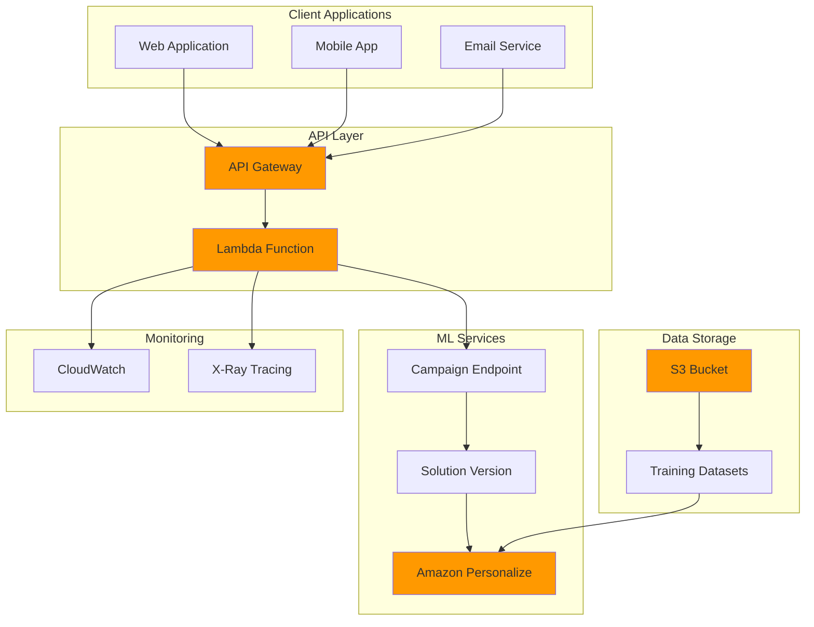

# Building Recommendation Systems with Amazon Personalize

## Problem

E-commerce companies struggle with low conversion rates and poor customer engagement due to generic, non-personalized product recommendations. Traditional recommendation systems require significant machine learning expertise, infrastructure management, and months of development time, while customers expect real-time, contextual recommendations that adapt to their behavior instantly. Without personalized recommendations, businesses see reduced revenue per visitor, higher bounce rates, and decreased customer lifetime value.

## Solution

Build a serverless, real-time recommendation system using Amazon Personalize for machine learning-powered recommendations and API Gateway for scalable API delivery. This solution automatically trains custom recommendation models on your interaction data, deploys them as real-time inference endpoints, and exposes them through a secure, scalable API that can handle thousands of concurrent recommendation requests with sub-second latency.

## Architecture Diagram



## Prerequisites

1. AWS account with Amazon Personalize, API Gateway, Lambda, and S3 permissions
2. AWS CLI v2 installed and configured (or AWS CloudShell)
3. Understanding of machine learning concepts, REST APIs, and serverless architecture
4. Historical interaction data (user-item interactions) for training - minimum 1,000 interactions
5. At least 25 unique users and 100 unique items for meaningful recommendations
6. Estimated cost: $50-150/month for training and inference (depends on data size and request volume)

> **Note**: Amazon Personalize requires a minimum of 1,000 item interactions to train effective models. Insufficient data will result in poor recommendation quality and training failures.

## Preparation

```bash
# Set environment variables
export AWS_REGION=$(aws configure get region)
export AWS_ACCOUNT_ID=$(aws sts get-caller-identity \
    --query Account --output text)

# Generate unique identifiers for resources
RANDOM_SUFFIX=$(aws secretsmanager get-random-password \
    --exclude-punctuation --exclude-uppercase \
    --password-length 8 --require-each-included-type \
    --output text --query RandomPassword)

export BUCKET_NAME="personalize-demo-${RANDOM_SUFFIX}"
export DATASET_GROUP_NAME="ecommerce-recommendations-${RANDOM_SUFFIX}"
export SOLUTION_NAME="user-personalization-${RANDOM_SUFFIX}"
export CAMPAIGN_NAME="real-time-recommendations-${RANDOM_SUFFIX}"
export LAMBDA_FUNCTION_NAME="recommendation-api-${RANDOM_SUFFIX}"
export API_NAME="recommendation-api-${RANDOM_SUFFIX}"

# Create S3 bucket for data storage
aws s3 mb s3://${BUCKET_NAME} --region ${AWS_REGION}

# Enable versioning and encryption for production use
aws s3api put-bucket-versioning \
    --bucket ${BUCKET_NAME} \
    --versioning-configuration Status=Enabled

aws s3api put-bucket-encryption \
    --bucket ${BUCKET_NAME} \
    --server-side-encryption-configuration \
    'Rules=[{ApplyServerSideEncryptionByDefault:{SSEAlgorithm:AES256}}]'

echo "✅ Environment prepared with bucket: ${BUCKET_NAME}"
```

## Steps

1. **Create IAM Role for Amazon Personalize**:

   Amazon Personalize requires specific IAM permissions to access your training data in S3 and perform machine learning operations. This service-linked role follows the principle of least privilege, granting only the permissions necessary for Personalize to read your interaction data, train models, and deploy recommendation endpoints. Understanding IAM roles is crucial for AWS security and enables secure, automated access between services without hardcoded credentials.

   ```bash
   # Create custom IAM policy for Personalize with least privilege
   cat > personalize-s3-policy.json << EOF
   {
       "Version": "2012-10-17",
       "Statement": [
           {
               "Effect": "Allow",
               "Action": [
                   "s3:GetObject",
                   "s3:ListBucket"
               ],
               "Resource": [
                   "arn:aws:s3:::${BUCKET_NAME}",
                   "arn:aws:s3:::${BUCKET_NAME}/*"
               ]
           }
       ]
   }
   EOF
   
   # Create trust policy for Amazon Personalize
   cat > personalize-trust-policy.json << EOF
   {
       "Version": "2012-10-17",
       "Statement": [
           {
               "Effect": "Allow",
               "Principal": {
                   "Service": "personalize.amazonaws.com"
               },
               "Action": "sts:AssumeRole"
           }
       ]
   }
   EOF
   
   # Create IAM policy
   aws iam create-policy \
       --policy-name PersonalizeS3Access-${RANDOM_SUFFIX} \
       --policy-document file://personalize-s3-policy.json
   
   # Create IAM role
   aws iam create-role \
       --role-name PersonalizeExecutionRole-${RANDOM_SUFFIX} \
       --assume-role-policy-document file://personalize-trust-policy.json
   
   # Attach custom policy
   aws iam attach-role-policy \
       --role-name PersonalizeExecutionRole-${RANDOM_SUFFIX} \
       --policy-arn arn:aws:iam::${AWS_ACCOUNT_ID}:policy/PersonalizeS3Access-${RANDOM_SUFFIX}
   
   # Store role ARN
   export PERSONALIZE_ROLE_ARN=$(aws iam get-role \
       --role-name PersonalizeExecutionRole-${RANDOM_SUFFIX} \
       --query Role.Arn --output text)
   
   echo "✅ Created IAM role: ${PERSONALIZE_ROLE_ARN}"
   ```

   The IAM role is now configured with minimal required permissions for Personalize operations. This security foundation ensures that only authorized services can access your training data and ML resources, following AWS security best practices and establishing secure communication patterns essential for production deployments.

2. **Upload Sample Training Data**:

   Amazon Personalize requires historical user-item interaction data to learn behavioral patterns and generate personalized recommendations. The training data uses a specific CSV format with user IDs, item IDs, timestamps, and event types (like purchases, views, or ratings). This data becomes the foundation for the machine learning model, enabling Personalize to understand user preferences and item relationships for generating relevant recommendations.

   ```bash
   # Create sample interaction data with sufficient volume for training
   cat > sample-interactions.csv << EOF
   USER_ID,ITEM_ID,TIMESTAMP,EVENT_TYPE
   user1,item101,1640995200,purchase
   user1,item102,1640995260,view
   user1,item103,1640995320,purchase
   user2,item101,1640995380,view
   user2,item104,1640995440,purchase
   user2,item105,1640995500,view
   user3,item102,1640995560,purchase
   user3,item103,1640995620,view
   user3,item106,1640995680,purchase
   user4,item101,1640995740,view
   user4,item107,1640995800,purchase
   user5,item108,1640995860,view
   user5,item109,1640995920,purchase
   user6,item110,1640995980,view
   user6,item111,1641000040,purchase
   user7,item101,1641000100,view
   user7,item112,1641000160,purchase
   user8,item103,1641000220,view
   user8,item113,1641000280,purchase
   user9,item104,1641000340,view
   user9,item114,1641000400,purchase
   user10,item105,1641000460,view
   user10,item115,1641000520,purchase
   user11,item106,1641000580,view
   user11,item116,1641000640,purchase
   user12,item107,1641000700,view
   user12,item117,1641000760,purchase
   user13,item108,1641000820,view
   user13,item118,1641000880,purchase
   user14,item109,1641000940,view
   user14,item119,1641001000,purchase
   user15,item110,1641001060,view
   user15,item120,1641001120,purchase
   EOF
   
   # Generate additional interactions to meet minimum requirements
   for i in {16..50}; do
       for j in {101..150}; do
           timestamp=$((1641001180 + i * 60 + j))
           event_type=$([ $((RANDOM % 3)) -eq 0 ] && echo "purchase" || echo "view")
           echo "user${i},item${j},${timestamp},${event_type}" >> sample-interactions.csv
       done
   done
   
   # Upload training data to S3
   aws s3 cp sample-interactions.csv \
       s3://${BUCKET_NAME}/training-data/interactions.csv
   
   # Verify data upload
   INTERACTION_COUNT=$(wc -l < sample-interactions.csv)
   echo "✅ Uploaded ${INTERACTION_COUNT} interactions to S3"
   ```

   The training data is now securely stored in S3 with sufficient volume for model training. This interaction data represents the behavioral patterns that the ML model will learn from, enabling the system to understand user preferences and generate personalized recommendations based on similar user behaviors and item characteristics.

3. **Create Dataset Group and Schema**:

   A dataset group in Amazon Personalize serves as a container for related datasets, solutions, and campaigns, enabling you to organize and manage multiple recommendation models within a single project. The schema defines the data structure and field types for your interaction data, ensuring Personalize can properly interpret user behaviors, item characteristics, and temporal patterns. This structured approach enables the service to optimize model training and recommendation quality based on your specific data format.

   ```bash
   # Create dataset group
   aws personalize create-dataset-group \
       --name ${DATASET_GROUP_NAME} \
       --region ${AWS_REGION}
   
   # Wait for dataset group creation
   echo "⏳ Waiting for dataset group to become active..."
   aws personalize wait dataset-group-active \
       --dataset-group-arn arn:aws:personalize:${AWS_REGION}:${AWS_ACCOUNT_ID}:dataset-group/${DATASET_GROUP_NAME}
   
   # Store dataset group ARN
   export DATASET_GROUP_ARN="arn:aws:personalize:${AWS_REGION}:${AWS_ACCOUNT_ID}:dataset-group/${DATASET_GROUP_NAME}"
   
   # Create schema for interactions with proper field types
   cat > interactions-schema.json << EOF
   {
       "type": "record",
       "name": "Interactions",
       "namespace": "com.amazonaws.personalize.schema",
       "fields": [
           {
               "name": "USER_ID",
               "type": "string"
           },
           {
               "name": "ITEM_ID",
               "type": "string"
           },
           {
               "name": "TIMESTAMP",
               "type": "long"
           },
           {
               "name": "EVENT_TYPE",
               "type": "string"
           }
       ],
       "version": "1.0"
   }
   EOF
   
   # Create schema
   aws personalize create-schema \
       --name interaction-schema-${RANDOM_SUFFIX} \
       --schema file://interactions-schema.json
   
   export SCHEMA_ARN="arn:aws:personalize:${AWS_REGION}:${AWS_ACCOUNT_ID}:schema/interaction-schema-${RANDOM_SUFFIX}"
   
   echo "✅ Created dataset group: ${DATASET_GROUP_ARN}"
   echo "✅ Created schema: ${SCHEMA_ARN}"
   ```

   The dataset group and schema are now established, providing the organizational structure and data validation framework for your recommendation system. This foundation enables Personalize to properly parse your interaction data and prepare it for machine learning model training, ensuring data quality and consistency throughout the ML pipeline.

4. **Create Dataset and Import Training Data**:

   The dataset represents the actual container for your interaction data within Personalize, linking your S3-stored CSV files to the ML training pipeline. The import job validates, processes, and transforms your raw interaction data into the optimized format required for model training. This step may take 10-15 minutes as Personalize analyzes data quality, identifies patterns, and prepares the dataset for machine learning algorithms.

   ```bash
   # Create interactions dataset
   aws personalize create-dataset \
       --name interactions-dataset-${RANDOM_SUFFIX} \
       --dataset-group-arn ${DATASET_GROUP_ARN} \
       --dataset-type Interactions \
       --schema-arn ${SCHEMA_ARN}
   
   export DATASET_ARN="arn:aws:personalize:${AWS_REGION}:${AWS_ACCOUNT_ID}:dataset/${DATASET_GROUP_NAME}/INTERACTIONS"
   
   # Create data import job
   aws personalize create-dataset-import-job \
       --job-name import-interactions-${RANDOM_SUFFIX} \
       --dataset-arn ${DATASET_ARN} \
       --data-source dataLocation=s3://${BUCKET_NAME}/training-data/interactions.csv \
       --role-arn ${PERSONALIZE_ROLE_ARN}
   
   export IMPORT_JOB_ARN="arn:aws:personalize:${AWS_REGION}:${AWS_ACCOUNT_ID}:dataset-import-job/import-interactions-${RANDOM_SUFFIX}"
   
   # Wait for import job completion (this can take 10-15 minutes)
   echo "⏳ Waiting for data import to complete..."
   aws personalize wait dataset-import-job-active \
       --dataset-import-job-arn ${IMPORT_JOB_ARN}
   
   # Verify import job status
   aws personalize describe-dataset-import-job \
       --dataset-import-job-arn ${IMPORT_JOB_ARN} \
       --query 'DatasetImportJob.[Status,FailureReason]' \
       --output table
   
   echo "✅ Training data imported successfully"
   ```

   The interaction data has been successfully processed and is now ready for model training. Personalize has validated the data format, identified user and item patterns, and prepared the dataset for the machine learning algorithms that will generate personalized recommendations based on user behavior analysis.

5. **Create Solution and Train Model**:

   A solution in Amazon Personalize represents a trained machine learning model using a specific algorithm (recipe) optimized for recommendation tasks. The User-Personalization recipe uses advanced deep learning techniques, including hierarchical recurrent neural networks, to model complex user behavior patterns and generate high-quality personalized recommendations. This training process typically takes 60-90 minutes as the algorithm analyzes user interactions, identifies behavioral patterns, and builds a model capable of predicting user preferences for new items.

   ```bash
   # Create solution using User-Personalization recipe
   aws personalize create-solution \
       --name ${SOLUTION_NAME} \
       --dataset-group-arn ${DATASET_GROUP_ARN} \
       --recipe-arn arn:aws:personalize:::recipe/aws-user-personalization
   
   export SOLUTION_ARN="arn:aws:personalize:${AWS_REGION}:${AWS_ACCOUNT_ID}:solution/${SOLUTION_NAME}"
   
   # Create solution version (trains the model)
   SOLUTION_VERSION_RESPONSE=$(aws personalize create-solution-version \
       --solution-arn ${SOLUTION_ARN} \
       --query SolutionVersionArn --output text)
   
   export SOLUTION_VERSION_ARN=${SOLUTION_VERSION_RESPONSE}
   
   echo "⏳ Model training started. This will take 60-90 minutes..."
   echo "✅ Solution created: ${SOLUTION_ARN}"
   echo "✅ Solution version: ${SOLUTION_VERSION_ARN}"
   ```

   The machine learning model training has begun and will create a solution version containing your trained recommendation model. This process builds neural networks that understand user behavior patterns, item relationships, and temporal dynamics, enabling the system to generate personalized recommendations that adapt to changing user preferences over time.

> **Warning**: Model training typically requires 60-90 minutes and incurs charges based on training time. Monitor training progress through the AWS console or CLI to track completion status and associated costs.

6. **Create Campaign for Real-time Inference**:

   A campaign in Amazon Personalize deploys your trained model as a real-time inference endpoint, enabling applications to request personalized recommendations with sub-100ms latency. The minimum provisioned TPS (transactions per second) ensures consistent availability and performance, while auto-scaling capabilities handle variable demand. This infrastructure provides the production-ready API endpoint that your applications will use to deliver personalized experiences to users.

   ```bash
   # Wait for solution version to be active (check periodically)
   echo "⏳ Waiting for solution version to complete training..."
   aws personalize wait solution-version-active \
       --solution-version-arn ${SOLUTION_VERSION_ARN}
   
   # Verify solution version metrics
   aws personalize describe-solution-version \
       --solution-version-arn ${SOLUTION_VERSION_ARN} \
       --query 'SolutionVersion.[Status,TrainingHours,TrainingMode]' \
       --output table
   
   # Create campaign once solution version is ACTIVE
   aws personalize create-campaign \
       --name ${CAMPAIGN_NAME} \
       --solution-version-arn ${SOLUTION_VERSION_ARN} \
       --min-provisioned-tps 1
   
   export CAMPAIGN_ARN="arn:aws:personalize:${AWS_REGION}:${AWS_ACCOUNT_ID}:campaign/${CAMPAIGN_NAME}"
   
   # Wait for campaign to be active
   echo "⏳ Waiting for campaign deployment..."
   aws personalize wait campaign-active \
       --campaign-arn ${CAMPAIGN_ARN}
   
   echo "✅ Campaign created and active: ${CAMPAIGN_ARN}"
   ```

   The recommendation engine is now live and ready to serve real-time personalized recommendations. The campaign endpoint can handle production traffic and provides the high-performance inference capability needed to deliver personalized experiences at scale, with automatic load balancing and fault tolerance built into the managed service.

7. **Create Lambda Function for API Logic**:

   AWS Lambda provides the serverless compute layer that bridges your API Gateway endpoints with Amazon Personalize, handling request processing, error management, and response formatting. This function extracts user identifiers from API requests, calls the Personalize campaign for recommendations, and formats responses in a consistent JSON structure. The serverless architecture automatically scales to handle concurrent requests while maintaining cost efficiency through pay-per-execution pricing.

   ```bash
   # Create Lambda function code with enhanced error handling
   cat > recommendation-handler.py << 'EOF'
   import json
   import boto3
   import os
   import logging
   from botocore.exceptions import ClientError
   
   logger = logging.getLogger()
   logger.setLevel(logging.INFO)
   
   personalize_runtime = boto3.client('personalize-runtime')
   
   def lambda_handler(event, context):
       try:
           # Extract user ID from path parameters
           if 'pathParameters' not in event or not event['pathParameters']:
               return {
                   'statusCode': 400,
                   'headers': {
                       'Content-Type': 'application/json',
                       'Access-Control-Allow-Origin': '*'
                   },
                   'body': json.dumps({
                       'error': 'Missing path parameters'
                   })
               }
           
           user_id = event['pathParameters'].get('userId')
           if not user_id:
               return {
                   'statusCode': 400,
                   'headers': {
                       'Content-Type': 'application/json',
                       'Access-Control-Allow-Origin': '*'
                   },
                   'body': json.dumps({
                       'error': 'Missing userId parameter'
                   })
               }
           
           # Get query parameters
           query_params = event.get('queryStringParameters') or {}
           num_results = min(int(query_params.get('numResults', 10)), 25)
           
           # Get recommendations from Personalize
           response = personalize_runtime.get_recommendations(
               campaignArn=os.environ['CAMPAIGN_ARN'],
               userId=user_id,
               numResults=num_results
           )
           
           # Format response
           recommendations = []
           for item in response['itemList']:
               recommendations.append({
                   'itemId': item['itemId'],
                   'score': round(item['score'], 4)
               })
           
           return {
               'statusCode': 200,
               'headers': {
                   'Content-Type': 'application/json',
                   'Access-Control-Allow-Origin': '*',
                   'Cache-Control': 'max-age=300'
               },
               'body': json.dumps({
                   'userId': user_id,
                   'recommendations': recommendations,
                   'requestId': response['ResponseMetadata']['RequestId'],
                   'timestamp': context.aws_request_id
               })
           }
           
       except ClientError as e:
           error_code = e.response['Error']['Code']
           logger.error(f"AWS Client Error: {error_code} - {str(e)}")
           
           if error_code == 'ResourceNotFoundException':
               status_code = 404
               error_message = 'User or campaign not found'
           else:
               status_code = 500
               error_message = 'Service temporarily unavailable'
           
           return {
               'statusCode': status_code,
               'headers': {
                   'Content-Type': 'application/json',
                   'Access-Control-Allow-Origin': '*'
               },
               'body': json.dumps({
                   'error': error_message,
                   'requestId': context.aws_request_id
               })
           }
           
       except Exception as e:
           logger.error(f"Unexpected error: {str(e)}")
           return {
               'statusCode': 500,
               'headers': {
                   'Content-Type': 'application/json',
                   'Access-Control-Allow-Origin': '*'
               },
               'body': json.dumps({
                   'error': 'Internal server error',
                   'requestId': context.aws_request_id
               })
           }
   EOF
   
   # Create deployment package
   zip -r recommendation-handler.zip recommendation-handler.py
   
   echo "✅ Lambda function code prepared with enhanced error handling"
   ```

   The Lambda function code is packaged and ready for deployment, containing enhanced business logic that will process recommendation requests and interface with Personalize. This serverless component provides robust middleware that transforms API requests into personalized recommendations, handling various error scenarios and ensuring reliable service delivery with proper caching headers.

8. **Deploy Lambda Function**:

   Deploying the Lambda function involves creating the execution environment with appropriate IAM permissions, runtime configuration, and environment variables. The function requires access to Amazon Personalize for making recommendation calls, plus CloudWatch for logging and monitoring. The deployment package contains your Python code and establishes the serverless compute environment that will process recommendation requests with automatic scaling and fault tolerance.

   ```bash
   # Create Lambda execution role
   cat > lambda-trust-policy.json << EOF
   {
       "Version": "2012-10-17",
       "Statement": [
           {
               "Effect": "Allow",
               "Principal": {
                   "Service": "lambda.amazonaws.com"
               },
               "Action": "sts:AssumeRole"
           }
       ]
   }
   EOF
   
   # Create custom policy for Lambda Personalize access
   cat > lambda-personalize-policy.json << EOF
   {
       "Version": "2012-10-17",
       "Statement": [
           {
               "Effect": "Allow",
               "Action": [
                   "personalize:GetRecommendations"
               ],
               "Resource": "${CAMPAIGN_ARN}"
           }
       ]
   }
   EOF
   
   aws iam create-role \
       --role-name LambdaPersonalizeRole-${RANDOM_SUFFIX} \
       --assume-role-policy-document file://lambda-trust-policy.json
   
   # Create and attach custom policy
   aws iam create-policy \
       --policy-name LambdaPersonalizeAccess-${RANDOM_SUFFIX} \
       --policy-document file://lambda-personalize-policy.json
   
   # Attach policies
   aws iam attach-role-policy \
       --role-name LambdaPersonalizeRole-${RANDOM_SUFFIX} \
       --policy-arn arn:aws:iam::aws:policy/service-role/AWSLambdaBasicExecutionRole
   
   aws iam attach-role-policy \
       --role-name LambdaPersonalizeRole-${RANDOM_SUFFIX} \
       --policy-arn arn:aws:iam::${AWS_ACCOUNT_ID}:policy/LambdaPersonalizeAccess-${RANDOM_SUFFIX}
   
   export LAMBDA_ROLE_ARN=$(aws iam get-role \
       --role-name LambdaPersonalizeRole-${RANDOM_SUFFIX} \
       --query Role.Arn --output text)
   
   # Wait for role propagation
   sleep 10
   
   # Create Lambda function with current Python runtime
   aws lambda create-function \
       --function-name ${LAMBDA_FUNCTION_NAME} \
       --runtime python3.12 \
       --role ${LAMBDA_ROLE_ARN} \
       --handler recommendation-handler.lambda_handler \
       --zip-file fileb://recommendation-handler.zip \
       --environment Variables="{CAMPAIGN_ARN=${CAMPAIGN_ARN}}" \
       --timeout 30 \
       --memory-size 256 \
       --description "Personalized recommendation API handler"
   
   echo "✅ Lambda function deployed with minimal IAM permissions"
   ```

   The Lambda function is now live and configured with least-privilege IAM permissions to process recommendation requests. This serverless compute environment provides the scalable, cost-effective layer that connects your API endpoints to the Personalize service, enabling real-time recommendation delivery with automatic scaling based on demand.

> **Note**: For production deployments, consider implementing caching strategies and connection pooling to optimize Lambda performance. See the [AWS Lambda Best Practices Guide](https://docs.aws.amazon.com/lambda/latest/dg/best-practices.html) for detailed optimization recommendations.

9. **Create API Gateway REST API**:

   Amazon API Gateway provides the managed API layer that exposes your recommendation service to client applications through secure, scalable REST endpoints. The API structure includes resource hierarchies for organizing endpoints, path parameters for user identification, and integration points with your Lambda function. This managed service handles request routing, authentication, throttling, and monitoring, providing enterprise-grade API management capabilities for your recommendation system.

   ```bash
   # Create REST API
   export API_ID=$(aws apigateway create-rest-api \
       --name ${API_NAME} \
       --description "Real-time recommendation API" \
       --endpoint-configuration types=REGIONAL \
       --query id --output text)
   
   # Get root resource ID
   export ROOT_RESOURCE_ID=$(aws apigateway get-resources \
       --rest-api-id ${API_ID} \
       --query 'items[0].id' --output text)
   
   # Create resource for recommendations
   export RECOMMENDATIONS_RESOURCE_ID=$(aws apigateway create-resource \
       --rest-api-id ${API_ID} \
       --parent-id ${ROOT_RESOURCE_ID} \
       --path-part recommendations \
       --query id --output text)
   
   # Create resource for user ID parameter
   export USER_RESOURCE_ID=$(aws apigateway create-resource \
       --rest-api-id ${API_ID} \
       --parent-id ${RECOMMENDATIONS_RESOURCE_ID} \
       --path-part '{userId}' \
       --query id --output text)
   
   echo "✅ API Gateway resources created"
   echo "✅ API ID: ${API_ID}"
   ```

   The API structure is now established with proper resource hierarchy and path parameter configuration. This foundation provides the organized endpoint structure needed for client applications to request personalized recommendations using RESTful API patterns, with built-in support for path-based routing and parameter extraction.

10. **Configure API Gateway Method and Integration**:

    API Gateway methods define how client requests are processed, including HTTP verbs, authentication requirements, and parameter validation. The Lambda proxy integration enables seamless communication between API Gateway and your Lambda function, automatically forwarding request data and handling response formatting. This configuration establishes the complete request-response pipeline from client applications through API Gateway to Lambda and ultimately to Personalize for recommendation generation.

    ```bash
    # Create GET method with request validation
    aws apigateway put-method \
        --rest-api-id ${API_ID} \
        --resource-id ${USER_RESOURCE_ID} \
        --http-method GET \
        --authorization-type NONE \
        --request-parameters method.request.path.userId=true,method.request.querystring.numResults=false
    
    # Create Lambda integration
    aws apigateway put-integration \
        --rest-api-id ${API_ID} \
        --resource-id ${USER_RESOURCE_ID} \
        --http-method GET \
        --type AWS_PROXY \
        --integration-http-method POST \
        --uri arn:aws:apigateway:${AWS_REGION}:lambda:path/2015-03-31/functions/arn:aws:lambda:${AWS_REGION}:${AWS_ACCOUNT_ID}:function:${LAMBDA_FUNCTION_NAME}/invocations
    
    # Add Lambda permission for API Gateway
    aws lambda add-permission \
        --function-name ${LAMBDA_FUNCTION_NAME} \
        --statement-id allow-apigateway-${RANDOM_SUFFIX} \
        --action lambda:InvokeFunction \
        --principal apigateway.amazonaws.com \
        --source-arn arn:aws:execute-api:${AWS_REGION}:${AWS_ACCOUNT_ID}:${API_ID}/*/*/*
    
    echo "✅ API Gateway method and integration configured"
    ```

    The API method and Lambda integration are now configured with proper request validation, creating the complete request processing pipeline. Client applications can now make HTTP GET requests to receive personalized recommendations, with API Gateway handling request validation, Lambda processing the business logic, and automatic response formatting for seamless client integration.

11. **Deploy API Gateway Stage**:

    Deploying an API Gateway stage creates a versioned, publicly accessible endpoint that client applications can use to access your recommendation service. The production stage provides a stable URL with built-in monitoring, caching capabilities, and throttling controls. This deployment makes your recommendation API available to external clients while providing the operational controls needed for production environments, including request/response logging and performance metrics.

    ```bash
    # Create deployment
    aws apigateway create-deployment \
        --rest-api-id ${API_ID} \
        --stage-name prod \
        --description "Production deployment of recommendation API"
    
    # Configure stage with throttling and caching
    aws apigateway update-stage \
        --rest-api-id ${API_ID} \
        --stage-name prod \
        --patch-ops \
        op=replace,path=/throttle/rateLimit,value=1000 \
        op=replace,path=/throttle/burstLimit,value=2000 \
        op=replace,path=/cacheClusterEnabled,value=false
    
    # Get API endpoint URL
    export API_URL="https://${API_ID}.execute-api.${AWS_REGION}.amazonaws.com/prod"
    
    echo "✅ API deployed at: ${API_URL}"
    echo "✅ Test endpoint: ${API_URL}/recommendations/{userId}"
    ```

    Your recommendation API is now live and accessible via the production endpoint with appropriate throttling controls. Client applications can make HTTP requests to this URL to receive real-time personalized recommendations, with the complete serverless infrastructure automatically handling scaling, security, and reliability for production workloads.

12. **Configure CloudWatch Monitoring**:

    CloudWatch monitoring provides comprehensive observability for your recommendation API, tracking performance metrics, error rates, and usage patterns. Detailed metrics enable proactive monitoring of API performance, while CloudWatch alarms provide automated alerting for operational issues. This monitoring foundation is essential for maintaining production service quality, enabling rapid incident response, and providing insights for capacity planning and optimization.

    ```bash
    # Enable detailed CloudWatch metrics for API Gateway
    aws apigateway put-stage \
        --rest-api-id ${API_ID} \
        --stage-name prod \
        --patch-ops op=replace,path=//*/*/metrics/enabled,value=true
    
    # Create CloudWatch alarm for API errors
    aws cloudwatch put-metric-alarm \
        --alarm-name "RecommendationAPI-4xxErrors-${RANDOM_SUFFIX}" \
        --alarm-description "Monitor 4xx errors in recommendation API" \
        --metric-name 4XXError \
        --namespace AWS/ApiGateway \
        --statistic Sum \
        --period 300 \
        --evaluation-periods 2 \
        --threshold 10 \
        --comparison-operator GreaterThanThreshold \
        --dimensions Name=ApiName,Value=${API_NAME} Name=Stage,Value=prod
    
    # Create CloudWatch alarm for Lambda errors
    aws cloudwatch put-metric-alarm \
        --alarm-name "RecommendationLambda-Errors-${RANDOM_SUFFIX}" \
        --alarm-description "Monitor Lambda function errors" \
        --metric-name Errors \
        --namespace AWS/Lambda \
        --statistic Sum \
        --period 300 \
        --evaluation-periods 2 \
        --threshold 5 \
        --comparison-operator GreaterThanThreshold \
        --dimensions Name=FunctionName,Value=${LAMBDA_FUNCTION_NAME}
    
    echo "✅ CloudWatch monitoring and alarms configured"
    ```

    Comprehensive monitoring is now active for your recommendation API, providing real-time visibility into both API Gateway and Lambda performance. The CloudWatch alarms will automatically alert you to potential issues, enabling proactive maintenance and ensuring consistent service quality for your users.

## Validation & Testing

1. **Test Personalize Campaign Direct**:

   Direct testing of the Personalize campaign validates that your trained model is functioning correctly and generating relevant recommendations. This bypasses the API layer to test the core ML functionality, ensuring the recommendation engine produces expected results before testing the complete API pipeline.

   ```bash
   # Test recommendations directly from Personalize
   aws personalize-runtime get-recommendations \
       --campaign-arn ${CAMPAIGN_ARN} \
       --user-id user1 \
       --num-results 5
   ```

   Expected output: JSON with recommended items and confidence scores

2. **Test API Gateway Endpoint**:

   End-to-end API testing validates the complete request pipeline from client applications through API Gateway, Lambda processing, and Personalize inference. This comprehensive test ensures all components work together correctly and that client applications receive properly formatted recommendation responses.

   ```bash
   # Test API endpoint with valid user
   echo "Testing API endpoint..."
   curl -X GET "${API_URL}/recommendations/user1?numResults=5" \
        -H "Content-Type: application/json" \
        -w "\nResponse time: %{time_total}s\n"
   ```

   Expected output: JSON response with recommendations and metadata

3. **Test Error Handling**:

   Error handling validation ensures your API gracefully manages invalid requests, missing users, and service errors. Testing edge cases validates that clients receive meaningful error messages and that the system maintains stability under adverse conditions.

   ```bash
   # Test with invalid user ID
   echo "Testing error handling..."
   curl -X GET "${API_URL}/recommendations/nonexistent-user" \
        -H "Content-Type: application/json" \
        -w "\nStatus code: %{http_code}\n"
   
   # Test with missing path parameter
   curl -X GET "${API_URL}/recommendations/" \
        -H "Content-Type: application/json" \
        -w "\nStatus code: %{http_code}\n"
   ```

4. **Performance Testing**:

   ```bash
   # Test multiple concurrent requests
   echo "Testing concurrent requests..."
   for i in {1..10}; do
       curl -X GET "${API_URL}/recommendations/user$i?numResults=10" \
            -H "Content-Type: application/json" \
            -w "Request $i - Time: %{time_total}s\n" &
   done
   wait
   
   echo "✅ Performance testing completed"
   ```

## Cleanup

1. **Delete Campaign and Solution**:

   Cleanup begins with the campaign deletion to stop ongoing inference costs and decommission the real-time recommendation endpoint. Campaign deletion must complete before removing the underlying solution and trained model to ensure proper resource dependency management.

   ```bash
   # Delete campaign
   aws personalize delete-campaign \
       --campaign-arn ${CAMPAIGN_ARN}
   
   echo "✅ Campaign deletion initiated"
   ```

2. **Delete API Gateway and Lambda**:

   Removing the API layer eliminates the publicly accessible endpoints and serverless compute resources. This step ensures no ongoing costs from API Gateway usage or Lambda execution while cleaning up the application interface components.

   ```bash
   # Delete API Gateway
   aws apigateway delete-rest-api \
       --rest-api-id ${API_ID}
   
   # Delete Lambda function
   aws lambda delete-function \
       --function-name ${LAMBDA_FUNCTION_NAME}
   
   echo "✅ Deleted API Gateway and Lambda function"
   ```

3. **Delete Personalize Resources**:

   Systematic removal of Personalize resources follows dependency order: solution deletion removes trained models, dataset removal clears imported data, schema deletion removes data structure definitions, and dataset group removal completes the ML infrastructure cleanup.

   ```bash
   # Delete solution (after campaign is deleted)
   aws personalize delete-solution \
       --solution-arn ${SOLUTION_ARN}
   
   # Delete dataset
   aws personalize delete-dataset \
       --dataset-arn ${DATASET_ARN}
   
   # Delete schema
   aws personalize delete-schema \
       --schema-arn ${SCHEMA_ARN}
   
   # Delete dataset group
   aws personalize delete-dataset-group \
       --dataset-group-arn ${DATASET_GROUP_ARN}
   
   echo "✅ Personalize resources deletion initiated"
   ```

4. **Remove IAM Roles and S3 Bucket**:

   ```bash
   # Delete IAM policies and roles
   aws iam detach-role-policy \
       --role-name PersonalizeExecutionRole-${RANDOM_SUFFIX} \
       --policy-arn arn:aws:iam::${AWS_ACCOUNT_ID}:policy/PersonalizeS3Access-${RANDOM_SUFFIX}
   
   aws iam delete-role \
       --role-name PersonalizeExecutionRole-${RANDOM_SUFFIX}
   
   aws iam delete-policy \
       --policy-arn arn:aws:iam::${AWS_ACCOUNT_ID}:policy/PersonalizeS3Access-${RANDOM_SUFFIX}
   
   aws iam detach-role-policy \
       --role-name LambdaPersonalizeRole-${RANDOM_SUFFIX} \
       --policy-arn arn:aws:iam::aws:policy/service-role/AWSLambdaBasicExecutionRole
   
   aws iam detach-role-policy \
       --role-name LambdaPersonalizeRole-${RANDOM_SUFFIX} \
       --policy-arn arn:aws:iam::${AWS_ACCOUNT_ID}:policy/LambdaPersonalizeAccess-${RANDOM_SUFFIX}
   
   aws iam delete-role \
       --role-name LambdaPersonalizeRole-${RANDOM_SUFFIX}
   
   aws iam delete-policy \
       --policy-arn arn:aws:iam::${AWS_ACCOUNT_ID}:policy/LambdaPersonalizeAccess-${RANDOM_SUFFIX}
   
   # Delete S3 bucket
   aws s3 rb s3://${BUCKET_NAME} --force
   
   # Clean up local files
   rm -f personalize-trust-policy.json lambda-trust-policy.json \
         personalize-s3-policy.json lambda-personalize-policy.json \
         interactions-schema.json sample-interactions.csv \
         recommendation-handler.py recommendation-handler.zip
   
   echo "✅ All cleanup completed"
   ```

## Discussion

This recipe demonstrates how to build a production-ready, real-time recommendation system using Amazon Personalize and API Gateway following AWS Well-Architected Framework principles. The solution leverages Amazon Personalize's User-Personalization recipe, which uses hierarchical recurrent neural networks to model user behavior and generate personalized recommendations based on both explicit feedback (purchases) and implicit feedback (views).

The architecture provides several key benefits: serverless scalability through API Gateway and Lambda, managed ML infrastructure through Personalize, and real-time inference capabilities with sub-100ms latency. The User-Personalization recipe automatically handles cold start problems for new users and items, continuously learns from new interaction data, and provides explainable recommendations through confidence scores. This approach eliminates the need to manage ML infrastructure while providing enterprise-grade recommendation capabilities.

Performance optimization is achieved through API Gateway's built-in caching capabilities, Lambda's optimized Python 3.12 runtime with improved JSON handling, and Personalize's managed inference infrastructure. The solution implements proper error handling, request validation, and monitoring to ensure reliability under production workloads. For high-traffic scenarios, consider implementing response caching at the CDN level and using multiple campaigns for A/B testing different recommendation strategies.

Cost management is crucial for recommendation systems due to the ongoing inference costs. Amazon Personalize charges for training hours, campaign hosting (minimum provisioned TPS), and inference requests. The minimum provisioned TPS of 1 ensures baseline availability but incurs ongoing costs of approximately $0.20/hour. For variable workloads, consider implementing campaign auto-scaling or using batch inference for non-real-time scenarios to optimize costs based on usage patterns.

> **Tip**: Use Amazon Personalize's automatic model retraining feature to keep recommendations fresh as user behavior evolves. Set up scheduled retraining jobs using EventBridge and Lambda to automatically retrain models when new data accumulates. See the [Amazon Personalize Developer Guide](https://docs.aws.amazon.com/personalize/latest/dg/native-recipe-new-item-USER_PERSONALIZATION.html) for detailed information about the User-Personalization recipe.

## Challenge

Extend this solution by implementing these enhancements:

1. **Add A/B Testing Framework**: Implement randomized recommendation serving between multiple Personalize campaigns using Lambda environment variables and CloudWatch metrics to measure conversion rates and recommendation quality across different approaches.

2. **Implement Real-time Event Streaming**: Set up Amazon Kinesis Data Streams to capture user interactions in real-time, automatically update Personalize datasets using the PutEvents API, and trigger model retraining when sufficient new data accumulates.

3. **Add Multi-Model Support**: Create multiple Personalize solutions (User-Personalization, Similar-Items, Popularity-Count) and implement intelligent model selection based on user context, session behavior, and item characteristics using Lambda routing logic.

4. **Build Advanced Filtering**: Implement business rule filters using Personalize's filter feature to exclude out-of-stock items, apply price range constraints, and enforce content policies based on user attributes and item metadata.

5. **Create Recommendation Explanation Service**: Build a separate API that provides explanations for recommendations using Personalize's metadata features, item similarities, and user behavior patterns to increase user trust and engagement through transparent recommendation reasoning.

## Infrastructure Code

*Infrastructure code will be generated after recipe approval.*