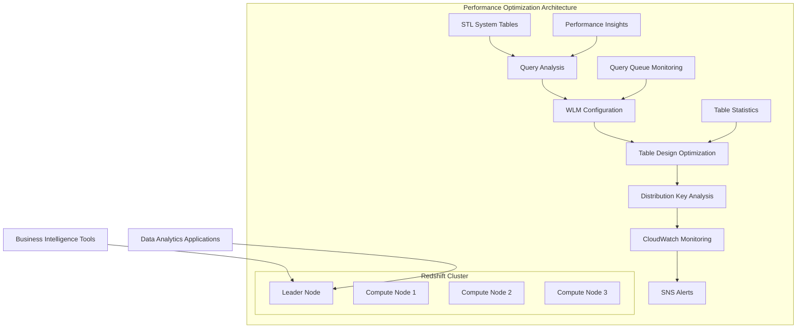

# Optimizing Amazon Redshift Performance

## Problem

Your Amazon Redshift data warehouse is experiencing performance issues with slow-running analytical queries, queue wait times, and inefficient resource utilization. Business users are frustrated with report generation delays, and data analysts are struggling with dashboard responsiveness. You need to systematically identify and resolve performance bottlenecks while establishing monitoring and alerting for ongoing optimization.

## Solution

Implement a comprehensive performance optimization strategy for Amazon Redshift that includes workload management configuration, query performance tuning, distribution key optimization, and automated monitoring. This solution establishes performance baselines, identifies bottlenecks through systematic analysis, and implements both reactive and proactive optimization techniques.



## Prerequisites

1. An existing Amazon Redshift cluster with sample data
2. AWS CLI version 2 installed and configured with appropriate permissions
3. Understanding of SQL and data warehousing concepts
4. Access to query workload for analysis (at least 1 week of query history)
5. Permissions to modify cluster parameter groups and workload management configurations

## Preparation

Let's set up monitoring and create some sample data to work with:

```bash
# Set cluster identifier and region
CLUSTER_IDENTIFIER="my-redshift-cluster"
REGION="us-east-1"

# Get cluster endpoint
CLUSTER_ENDPOINT=$(aws redshift describe-clusters \
  --cluster-identifier $CLUSTER_IDENTIFIER \
  --query 'Clusters[0].Endpoint.Address' --output text)

# Export variables for use throughout the recipe
export CLUSTER_IDENTIFIER
export CLUSTER_ENDPOINT
export AWS_REGION=$REGION

# Create CloudWatch log group for custom metrics
aws logs create-log-group --log-group-name /aws/redshift/performance-metrics

# Create SNS topic for performance alerts
TOPIC_ARN=$(aws sns create-topic --name redshift-performance-alerts \
  --query 'TopicArn' --output text)
export TOPIC_ARN

echo "Setup completed. Cluster endpoint: $CLUSTER_ENDPOINT"
```

## Steps

1. **Analyze current query performance and identify bottlenecks**:

   Performance optimization begins with understanding your current workload patterns and identifying specific bottlenecks. Amazon Redshift provides comprehensive system tables (STL tables) that capture detailed query execution metrics, enabling data-driven optimization decisions. This analysis establishes baselines and prioritizes optimization efforts on queries that will deliver the greatest performance improvements.

   ```bash
   # Connect to Redshift and analyze slow queries (requires psql client)
   # Save this as analyze_performance.sql
   cat > analyze_performance.sql << 'EOF'
   -- Top 10 slowest queries in the last 24 hours
   SELECT 
       query,
       TRIM(database) as database,
       TRIM(user_name) as user_name,
       starttime,
       total_exec_time/1000000.0 as exec_time_seconds,
       aborted,
       TRIM(querytxt) as query_text
   FROM stl_query 
   WHERE starttime >= CURRENT_DATE - 1
       AND total_exec_time > 0
   ORDER BY total_exec_time DESC 
   LIMIT 10;

   -- Query queue wait times
   SELECT 
       w.query,
       w.service_class,
       w.queue_start_time,
       w.queue_end_time,
       DATEDIFF(seconds, w.queue_start_time, w.queue_end_time) as queue_seconds,
       q.total_exec_time/1000000.0 as exec_time_seconds
   FROM stl_wlm_query w
   JOIN stl_query q ON w.query = q.query
   WHERE w.queue_start_time >= CURRENT_DATE - 1
       AND DATEDIFF(seconds, w.queue_start_time, w.queue_end_time) > 0
   ORDER BY queue_seconds DESC
   LIMIT 10;
   EOF

   # Execute performance analysis
   psql -h $CLUSTER_ENDPOINT -U admin -d mydb -f analyze_performance.sql
   ```

   These queries reveal your workload's performance characteristics, identifying both slow-executing queries and queries experiencing queue delays. This foundational analysis guides all subsequent optimization efforts and helps prioritize which queries to optimize first for maximum business impact.

> **Note**: Query analysis using STL system tables provides insight into historical query performance. Focus on queries with high execution times or long queue waits, as these typically offer the best optimization opportunities. Learn more about [Redshift system tables](https://docs.aws.amazon.com/redshift/latest/dg/c_intro_STL_tables.html).

2. **Configure automatic workload management for optimal resource allocation**:

   Workload Management (WLM) is Redshift's resource allocation system that controls how queries are prioritized and executed. Automatic WLM uses machine learning algorithms to dynamically allocate memory and CPU resources, eliminating the manual configuration overhead required with traditional queue-based WLM. This intelligent resource management ensures optimal performance across diverse query workloads.

   ```bash
   # Create a parameter group for WLM optimization
   PARAMETER_GROUP_NAME="optimized-wlm-config"

   # Parameter groups allow you to customize database engine settings
   aws redshift create-cluster-parameter-group \
     --parameter-group-name $PARAMETER_GROUP_NAME \
     --parameter-group-family redshift-1.0 \
     --description "Optimized WLM configuration for performance"

   # Enable automatic WLM with concurrency scaling
   aws redshift modify-cluster-parameter-group \
     --parameter-group-name $PARAMETER_GROUP_NAME \
     --parameter "ParameterName=wlm_json_configuration,ParameterValue=[{\"query_group\":[],\"query_group_wild_card\":0,\"user_group\":[],\"user_group_wild_card\":0,\"concurrency_scaling\":\"auto\"}]"

   # Apply the parameter group to the cluster
   aws redshift modify-cluster \
     --cluster-identifier $CLUSTER_IDENTIFIER \
     --cluster-parameter-group-name $PARAMETER_GROUP_NAME \
     --apply-immediately

   export PARAMETER_GROUP_NAME
   ```

   The cluster now uses automatic WLM with concurrency scaling enabled, providing both intelligent resource allocation and the ability to automatically scale to handle query spikes. This configuration adapts to changing workload patterns and ensures consistent performance during peak usage periods.

3. **Analyze and optimize table distribution strategies**:

   Table distribution strategy fundamentally determines query performance in Redshift's massively parallel processing (MPP) architecture. Poor distribution key selection leads to data skew, where some compute nodes store significantly more data than others, creating performance bottlenecks. This analysis identifies skewed tables and unsorted data that require attention to maximize parallel processing efficiency.

   ```bash
   # Create table analysis script for distribution and maintenance analysis
   cat > table_distribution_analysis.sql << 'EOF'
   -- Analyze table skew and distribution
   SELECT
       TRIM(name) as table_name,
       max_blocks_per_slice - min_blocks_per_slice as skew,
       tbl_rows,
       max_blocks_per_slice,
       min_blocks_per_slice
   FROM (
       SELECT 
           TRIM(t.name) as name,
           t.tbl_rows,
           MIN(ti.max_blocks_per_slice) as min_blocks_per_slice,
           MAX(ti.max_blocks_per_slice) as max_blocks_per_slice
       FROM (
           SELECT 
               tbl,
               slice,
               COUNT(blocknum) as max_blocks_per_slice
           FROM stv_blocklist 
           GROUP BY tbl, slice
       ) ti
       JOIN stv_tbl_perm t ON ti.tbl = t.id
       GROUP BY t.name, t.tbl_rows
   ) tmp
   WHERE skew > 5
   ORDER BY skew DESC;

   -- Check for tables that need VACUUM
   SELECT 
       TRIM(name) as table_name,
       unsorted/DECODE(rows,0,1,rows)::FLOAT * 100 as pct_unsorted
   FROM stv_tbl_perm
   WHERE unsorted > 0
   ORDER BY pct_unsorted DESC;
   EOF

   # Execute table analysis
   psql -h $CLUSTER_ENDPOINT -U admin -d mydb -f table_distribution_analysis.sql
   ```

   This analysis reveals tables with high skew ratios (indicating poor distribution key selection) and tables with significant unsorted data percentages (requiring VACUUM operations). Tables with skew values above 5 should be considered for redistribution key changes, while tables with more than 10% unsorted data benefit from VACUUM operations.

4. **Implement automated VACUUM and ANALYZE operations**:

   Regular maintenance operations are critical for sustained Redshift performance. VACUUM reclaims space from deleted rows and physically sorts data according to sort keys, while ANALYZE updates table statistics used by the query planner for optimal execution plans. Automating these operations ensures consistent performance without manual intervention, targeting only tables that meet specific maintenance criteria.

   ```bash
   # Create Lambda function for automated maintenance
   cat > maintenance_function.py << 'EOF'
import json
import psycopg2
import os
from datetime import datetime

def lambda_handler(event, context):
    host = os.environ['REDSHIFT_HOST']
    database = os.environ['REDSHIFT_DATABASE']
    user = os.environ['REDSHIFT_USER']
    password = os.environ['REDSHIFT_PASSWORD']
    
    try:
        conn = psycopg2.connect(
            host=host,
            database=database,
            user=user,
            password=password,
            port=5439
        )
        
        cur = conn.cursor()
        
        # Get tables that need VACUUM
        cur.execute("""
            SELECT TRIM(name) as table_name,
                   unsorted/DECODE(rows,0,1,rows)::FLOAT * 100 as pct_unsorted
            FROM stv_tbl_perm
            WHERE unsorted > 0 AND rows > 1000
            ORDER BY pct_unsorted DESC
            LIMIT 5;
        """)
        
        tables_to_vacuum = cur.fetchall()
        
        for table_name, pct_unsorted in tables_to_vacuum:
            if pct_unsorted > 10:  # Only VACUUM if >10% unsorted
                print(f"Vacuuming table: {table_name}")
                cur.execute(f"VACUUM {table_name};")
                cur.execute(f"ANALYZE {table_name};")
        
        conn.commit()
        cur.close()
        conn.close()
        
        return {
            'statusCode': 200,
            'body': json.dumps(f'Maintenance completed on {len(tables_to_vacuum)} tables')
        }
        
    except Exception as e:
        print(f"Error: {str(e)}")
        return {
            'statusCode': 500,
            'body': json.dumps(f'Error: {str(e)}')
        }
EOF

   # Package and deploy the Lambda function
   zip maintenance_function.zip maintenance_function.py

   LAMBDA_ROLE_ARN=$(aws iam create-role \
     --role-name RedshiftMaintenanceLambdaRole \
     --assume-role-policy-document '{
       "Version": "2012-10-17",
       "Statement": [
         {
           "Effect": "Allow",
           "Principal": {"Service": "lambda.amazonaws.com"},
           "Action": "sts:AssumeRole"
         }
       ]
     }' --query 'Role.Arn' --output text)

   # Attach basic execution policy
   aws iam attach-role-policy \
     --role-name RedshiftMaintenanceLambdaRole \
     --policy-arn arn:aws:iam::aws:policy/service-role/AWSLambdaBasicExecutionRole

   # Create the Lambda function
   MAINTENANCE_PASSWORD="YourSecureMaintenancePassword123!"

   LAMBDA_FUNCTION_ARN=$(aws lambda create-function \
     --function-name redshift-maintenance \
     --runtime python3.9 \
     --role $LAMBDA_ROLE_ARN \
     --handler maintenance_function.lambda_handler \
     --zip-file fileb://maintenance_function.zip \
     --environment Variables="{REDSHIFT_HOST=$CLUSTER_ENDPOINT,REDSHIFT_DATABASE=mydb,REDSHIFT_USER=admin,REDSHIFT_PASSWORD=$MAINTENANCE_PASSWORD}" \
     --timeout 300 \
     --query 'FunctionArn' --output text)

   export LAMBDA_FUNCTION_ARN
   ```

   The Lambda function is now deployed and configured to connect to your Redshift cluster. This serverless approach to maintenance ensures operations run reliably without requiring dedicated infrastructure, and the function intelligently targets only tables that require maintenance based on the analysis criteria.

> **Warning**: Store database credentials securely using AWS Secrets Manager in production environments. Never hardcode passwords in Lambda functions or environment variables for production workloads.

5. **Set up CloudWatch monitoring and custom metrics**:

   Comprehensive monitoring provides the visibility needed to maintain optimal Redshift performance over time. CloudWatch dashboards aggregate key performance indicators into visual displays that enable rapid identification of performance trends and anomalies. This monitoring foundation supports both reactive troubleshooting and proactive performance management.

   ```bash
   # Create custom CloudWatch dashboard
   cat > dashboard_config.json << EOF
   {
     "widgets": [
       {
         "type": "metric",
         "properties": {
           "metrics": [
             ["AWS/Redshift", "CPUUtilization", "ClusterIdentifier", "$CLUSTER_IDENTIFIER"],
             [".", "DatabaseConnections", ".", "."],
             [".", "HealthStatus", ".", "."]
           ],
           "period": 300,
           "stat": "Average",
           "region": "$AWS_REGION",
           "title": "Redshift Cluster Metrics"
         }
       },
       {
         "type": "metric",
         "properties": {
           "metrics": [
             ["AWS/Redshift", "QueueLength", "ClusterIdentifier", "$CLUSTER_IDENTIFIER"],
             [".", "WLMQueueLength", ".", "."]
           ],
           "period": 300,
           "stat": "Average",
           "region": "$AWS_REGION",
           "title": "Query Queue Metrics"
         }
       }
     ]
   }
   EOF

   # Create the dashboard
   aws cloudwatch put-dashboard \
     --dashboard-name "Redshift-Performance-Dashboard" \
     --dashboard-body file://dashboard_config.json
   ```

   The dashboard now provides real-time visibility into cluster resource utilization and query queue metrics. These visualizations enable rapid identification of performance issues and help establish baseline performance patterns for capacity planning and optimization decisions.

6. **Configure performance alerts**:

   Proactive alerting ensures performance issues are identified and addressed before they impact business operations. CloudWatch alarms monitor critical performance metrics and automatically notify operations teams when thresholds are exceeded. This early warning system enables rapid response to performance degradation and prevents minor issues from escalating into major outages.

   ```bash
   # Create CloudWatch alarms for key performance metrics
   aws cloudwatch put-metric-alarm \
     --alarm-name "Redshift-High-CPU-Usage" \
     --alarm-description "Alert when Redshift CPU usage is high" \
     --metric-name CPUUtilization \
     --namespace AWS/Redshift \
     --statistic Average \
     --period 300 \
     --threshold 80 \
     --comparison-operator GreaterThanThreshold \
     --evaluation-periods 2 \
     --alarm-actions $TOPIC_ARN \
     --dimensions Name=ClusterIdentifier,Value=$CLUSTER_IDENTIFIER

   aws cloudwatch put-metric-alarm \
     --alarm-name "Redshift-High-Queue-Length" \
     --alarm-description "Alert when query queue length is high" \
     --metric-name QueueLength \
     --namespace AWS/Redshift \
     --statistic Average \
     --period 300 \
     --threshold 10 \
     --comparison-operator GreaterThanThreshold \
     --evaluation-periods 1 \
     --alarm-actions $TOPIC_ARN \
     --dimensions Name=ClusterIdentifier,Value=$CLUSTER_IDENTIFIER
   ```

   These alarms now monitor critical performance indicators and will trigger SNS notifications when performance thresholds are exceeded. The CPU alarm uses a 2-period evaluation to avoid false positives from temporary spikes, while the queue length alarm provides immediate notification of potential capacity constraints.

7. **Schedule automated maintenance tasks**:

   Consistent maintenance scheduling ensures optimal performance without manual intervention. EventBridge provides reliable, serverless scheduling that triggers maintenance operations during low-usage periods. The 2 AM schedule minimizes impact on business operations while ensuring maintenance runs consistently every night, maintaining peak performance for daily business activities.

   ```bash
   # Create EventBridge rule for nightly maintenance
   aws events put-rule \
     --name "redshift-nightly-maintenance" \
     --schedule-expression "cron(0 2 * * ? *)" \
     --description "Run Redshift maintenance tasks nightly at 2 AM"

   # Add Lambda function as target
   aws events put-targets \
     --rule "redshift-nightly-maintenance" \
     --targets "Id"="1","Arn"="$LAMBDA_FUNCTION_ARN"

   # Grant EventBridge permission to invoke Lambda
   aws lambda add-permission \
     --function-name redshift-maintenance \
     --statement-id "allow-eventbridge" \
     --action "lambda:InvokeFunction" \
     --principal events.amazonaws.com \
     --source-arn "arn:aws:events:$AWS_REGION:$AWS_ACCOUNT_ID:rule/redshift-nightly-maintenance"
   ```

   The automated maintenance system is now fully operational and will execute nightly at 2 AM. This serverless architecture ensures maintenance operations run reliably without requiring dedicated infrastructure, and the intelligent targeting of maintenance operations minimizes resource consumption while maximizing performance benefits.

## Validation & Testing

1. **Verify workload management configuration is active:**

```bash
# Check current WLM configuration
aws redshift describe-cluster-parameters \
  --parameter-group-name $PARAMETER_GROUP_NAME \
  --source "user" \
  --query 'Parameters[?ParameterName==`wlm_json_configuration`]'
```

Expected output should show automatic WLM is enabled.

2. **Test query performance improvements:**

```bash
# Create a test script to measure query performance
cat > performance_test.sql << 'EOF'
-- Test query performance with timing
\timing on

-- Complex analytical query for testing
SELECT 
    DATE_TRUNC('month', order_date) as month,
    customer_segment,
    SUM(sales_amount) as total_sales,
    AVG(sales_amount) as avg_sales,
    COUNT(*) as order_count
FROM sales_data 
WHERE order_date >= CURRENT_DATE - INTERVAL '12 months'
GROUP BY 1, 2
ORDER BY 1, 2;

-- Check query execution plan
EXPLAIN 
SELECT customer_id, SUM(sales_amount) 
FROM sales_data 
WHERE order_date >= CURRENT_DATE - INTERVAL '30 days'
GROUP BY customer_id
ORDER BY SUM(sales_amount) DESC
LIMIT 100;
EOF

# Run performance test
psql -h $CLUSTER_ENDPOINT -U admin -d mydb -f performance_test.sql
```

3. **Verify monitoring and alerting setup:**

```bash
# Check CloudWatch dashboard
aws cloudwatch get-dashboard \
  --dashboard-name "Redshift-Performance-Dashboard" \
  --query 'DashboardBody' --output text | jq .

# List active alarms
aws cloudwatch describe-alarms \
  --alarm-name-prefix "Redshift-" \
  --query 'MetricAlarms[].{Name:AlarmName,State:StateValue}'
```

## Cleanup

1. **Remove CloudWatch resources:**

```bash
# Delete CloudWatch alarms
aws cloudwatch delete-alarms \
  --alarm-names "Redshift-High-CPU-Usage" "Redshift-High-Queue-Length"

# Delete dashboard
aws cloudwatch delete-dashboards \
  --dashboard-names "Redshift-Performance-Dashboard"

# Delete log group
aws logs delete-log-group \
  --log-group-name /aws/redshift/performance-metrics
```

2. **Remove Lambda function and associated resources:**

```bash
# Remove EventBridge rule
aws events remove-targets --rule "redshift-nightly-maintenance" --ids "1"
aws events delete-rule --name "redshift-nightly-maintenance"

# Delete Lambda function
aws lambda delete-function --function-name redshift-maintenance

# Delete IAM role
aws iam detach-role-policy \
  --role-name RedshiftMaintenanceLambdaRole \
  --policy-arn arn:aws:iam::aws:policy/service-role/AWSLambdaBasicExecutionRole
aws iam delete-role --role-name RedshiftMaintenanceLambdaRole
```

3. **Clean up parameter group and SNS topic:**

```bash
# Reset cluster to default parameter group (if desired)
aws redshift modify-cluster \
  --cluster-identifier $CLUSTER_IDENTIFIER \
  --cluster-parameter-group-name default.redshift-1.0

# Delete custom parameter group
aws redshift delete-cluster-parameter-group \
  --parameter-group-name $PARAMETER_GROUP_NAME

# Delete SNS topic
aws sns delete-topic --topic-arn $TOPIC_ARN

# Clean up local files
rm -f *.sql *.json *.py *.zip
```

## Discussion

Amazon Redshift performance optimization requires a systematic approach that addresses multiple layers of the data warehouse stack. The most impactful optimization technique is implementing proper workload management (WLM) configuration. Automatic WLM, which is now the default and recommended configuration, dynamically allocates resources based on query complexity and system load, eliminating the need for manual queue tuning that was required with legacy manual WLM configurations.

Table design plays a crucial role in query performance, particularly the selection of distribution keys and sort keys. Distribution keys determine how data is distributed across compute nodes, and poor distribution key selection can lead to data skew, where some nodes process significantly more data than others. The recipe includes analysis queries to identify tables with high skew ratios, which indicate suboptimal distribution strategies. Sort keys, on the other hand, determine the physical ordering of data on disk and can dramatically improve performance for queries that filter or join on those columns.

Regular maintenance operations like VACUUM and ANALYZE are essential for maintaining optimal performance over time. VACUUM reclaims space and sorts data according to the table's sort key, while ANALYZE updates table statistics that the query planner uses to generate optimal execution plans. The automated maintenance Lambda function in this recipe ensures these operations run regularly without manual intervention, targeting only tables that meet specific criteria to minimize resource consumption.

> **Note**: According to AWS documentation, [Redshift automatically performs VACUUM DELETE operations](https://docs.aws.amazon.com/redshift/latest/dg/r_VACUUM_command.html) in the background, but manual VACUUM REINDEX operations may still be beneficial for heavily updated tables.

Monitoring and alerting provide the feedback loop necessary for ongoing optimization efforts. CloudWatch metrics like CPU utilization, queue length, and disk space usage help identify when performance issues are occurring, while custom dashboards provide visual insights into performance trends over time. The combination of proactive monitoring and reactive alerting ensures that performance issues are identified and addressed promptly.

## Challenge

Implement advanced performance optimization techniques by creating a more sophisticated monitoring solution that tracks query fingerprints and automatically identifies performance regressions. Set up cross-region disaster recovery for your Redshift cluster and implement workload routing to distribute analytical queries across multiple clusters based on query type and priority. Additionally, explore using Amazon Redshift Spectrum to extend your analytical capabilities to data stored in S3 while maintaining optimal performance for your most frequently accessed data in the cluster.

## Infrastructure Code

*Infrastructure code will be generated after recipe approval.*