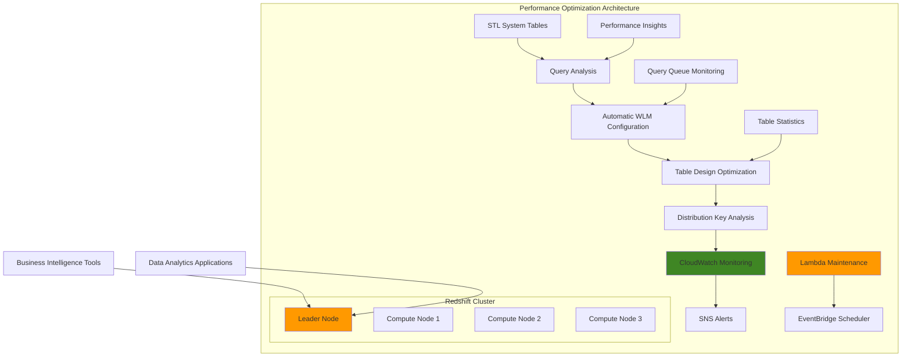

# Optimizing Amazon Redshift Performance with Automated Monitoring

## Problem

Your Amazon Redshift data warehouse is experiencing performance issues with slow-running analytical queries, queue wait times, and inefficient resource utilization. Business users are frustrated with report generation delays, and data analysts are struggling with dashboard responsiveness. You need to systematically identify and resolve performance bottlenecks while establishing monitoring and alerting for ongoing optimization to maintain consistent performance as data volumes grow.

## Solution

Implement a comprehensive performance optimization strategy for Amazon Redshift that includes automatic workload management configuration, query performance analysis, distribution key optimization, and automated monitoring with Lambda-based maintenance. This solution leverages AWS best practices to establish performance baselines, identifies bottlenecks through systematic analysis, and implements both reactive and proactive optimization techniques following the AWS Well-Architected Framework.

## Architecture Diagram



## Prerequisites

1. An existing Amazon Redshift cluster with sample data and at least 1 week of query history
2. AWS CLI version 2 installed and configured with appropriate permissions for Redshift, CloudWatch, SNS, Lambda, and IAM
3. Understanding of SQL and data warehousing concepts
4. Access to query workload for analysis and performance baseline establishment
5. Permissions to modify cluster parameter groups, workload management configurations, and create Lambda functions
6. Estimated cost: $50-100 for monitoring resources (varies by cluster size and retention period)

> **Note**: This recipe follows AWS Well-Architected Framework principles for performance efficiency and operational excellence. Ensure you have appropriate IAM permissions for all AWS services used.

## Preparation

```bash
# Set AWS environment variables
export AWS_REGION=$(aws configure get region)
export AWS_ACCOUNT_ID=$(aws sts get-caller-identity \
    --query Account --output text)

# Generate unique identifiers for resources
RANDOM_SUFFIX=$(aws secretsmanager get-random-password \
    --exclude-punctuation --exclude-uppercase \
    --password-length 6 --require-each-included-type \
    --output text --query RandomPassword)

# Set cluster identifier and validate cluster exists
CLUSTER_IDENTIFIER="my-redshift-cluster"
aws redshift describe-clusters \
    --cluster-identifier $CLUSTER_IDENTIFIER \
    --query 'Clusters[0].ClusterStatus' --output text

# Get cluster endpoint for database connections
CLUSTER_ENDPOINT=$(aws redshift describe-clusters \
    --cluster-identifier $CLUSTER_IDENTIFIER \
    --query 'Clusters[0].Endpoint.Address' --output text)

# Export variables for use throughout the recipe
export CLUSTER_IDENTIFIER
export CLUSTER_ENDPOINT
export RANDOM_SUFFIX

# Create CloudWatch log group for custom metrics
aws logs create-log-group \
    --log-group-name /aws/redshift/performance-metrics

# Create SNS topic for performance alerts
TOPIC_ARN=$(aws sns create-topic \
    --name redshift-performance-alerts-${RANDOM_SUFFIX} \
    --query 'TopicArn' --output text)
export TOPIC_ARN

echo "✅ AWS environment configured"
echo "Cluster endpoint: $CLUSTER_ENDPOINT"
echo "Topic ARN: $TOPIC_ARN"
```

## Steps

1. **Analyze current query performance and identify bottlenecks**:

   Performance optimization begins with understanding your current workload patterns and identifying specific bottlenecks. Amazon Redshift provides comprehensive system tables (STL tables) that capture detailed query execution metrics, enabling data-driven optimization decisions. This analysis establishes baselines and prioritizes optimization efforts on queries that will deliver the greatest performance improvements.

   ```bash
   # Create comprehensive performance analysis script
   cat > analyze_performance.sql << 'EOF'
   -- Top 10 slowest queries in the last 24 hours
   SELECT 
       query,
       TRIM(database) as database,
       TRIM(user_name) as user_name,
       starttime,
       total_exec_time/1000000.0 as exec_time_seconds,
       aborted,
       LEFT(TRIM(querytxt), 100) as query_text_preview
   FROM stl_query 
   WHERE starttime >= CURRENT_DATE - 1
       AND total_exec_time > 0
   ORDER BY total_exec_time DESC 
   LIMIT 10;

   -- Query queue wait times analysis
   SELECT 
       w.query,
       w.service_class,
       w.queue_start_time,
       w.queue_end_time,
       DATEDIFF(seconds, w.queue_start_time, w.queue_end_time) as queue_seconds,
       q.total_exec_time/1000000.0 as exec_time_seconds,
       CASE WHEN w.service_class = 6 THEN 'Default queue'
            WHEN w.service_class = 5 THEN 'WLM queue'
            ELSE 'System queue' END as queue_type
   FROM stl_wlm_query w
   JOIN stl_query q ON w.query = q.query
   WHERE w.queue_start_time >= CURRENT_DATE - 1
       AND DATEDIFF(seconds, w.queue_start_time, w.queue_end_time) > 0
   ORDER BY queue_seconds DESC
   LIMIT 10;

   -- Identify queries with compilation time issues
   SELECT 
       query,
       compile_time/1000000.0 as compile_seconds,
       total_exec_time/1000000.0 as total_seconds,
       (compile_time::float/total_exec_time::float)*100 as compile_percentage
   FROM stl_query
   WHERE starttime >= CURRENT_DATE - 1
       AND compile_time > 0
       AND total_exec_time > 0
   ORDER BY compile_percentage DESC
   LIMIT 10;
   EOF

   # Execute comprehensive performance analysis
   psql -h $CLUSTER_ENDPOINT -U admin -d mydb -f analyze_performance.sql

   echo "✅ Performance analysis completed"
   ```

   These queries reveal your workload's performance characteristics, identifying slow-executing queries, queue delays, and compilation bottlenecks. This foundational analysis guides all subsequent optimization efforts and helps prioritize which queries to optimize first for maximum business impact.

> **Note**: Query analysis using STL system tables provides insight into historical query performance. Focus on queries with high execution times or long queue waits, as these typically offer the best optimization opportunities. Learn more about [Redshift system tables](https://docs.aws.amazon.com/redshift/latest/dg/c_intro_STL_tables.html).

2. **Configure automatic workload management for optimal resource allocation**:

   Workload Management (WLM) is Redshift's resource allocation system that controls how queries are prioritized and executed. Automatic WLM uses machine learning algorithms to dynamically allocate memory and CPU resources, eliminating the manual configuration overhead required with traditional queue-based WLM. This intelligent resource management ensures optimal performance across diverse query workloads and is now the recommended default configuration.

   ```bash
   # Create a parameter group for optimized WLM configuration
   PARAMETER_GROUP_NAME="optimized-wlm-config-${RANDOM_SUFFIX}"

   # Parameter groups allow you to customize database engine settings
   aws redshift create-cluster-parameter-group \
       --parameter-group-name $PARAMETER_GROUP_NAME \
       --parameter-group-family redshift-1.0 \
       --description "Optimized WLM configuration for performance"

   # Configure automatic WLM (recommended default configuration)
   # Automatic WLM is enabled by default and doesn't require explicit JSON configuration
   aws redshift modify-cluster-parameter-group \
       --parameter-group-name $PARAMETER_GROUP_NAME \
       --parameters ParameterName=wlm_json_configuration,ParameterValue="[{\"query_concurrency\":\"auto\"}]"

   # Apply the parameter group to the cluster
   aws redshift modify-cluster \
       --cluster-identifier $CLUSTER_IDENTIFIER \
       --cluster-parameter-group-name $PARAMETER_GROUP_NAME \
       --apply-immediately

   # Wait for parameter group to be applied
   aws redshift wait cluster-available \
       --cluster-identifier $CLUSTER_IDENTIFIER

   export PARAMETER_GROUP_NAME
   echo "✅ Automatic WLM configuration applied"
   ```

   The cluster now uses automatic WLM with intelligent resource allocation, providing dynamic memory and CPU allocation based on query complexity. This configuration adapts to changing workload patterns and ensures consistent performance during peak usage periods without manual intervention.

3. **Analyze and optimize table distribution strategies**:

   Table distribution strategy fundamentally determines query performance in Redshift's massively parallel processing (MPP) architecture. Poor distribution key selection leads to data skew, where some compute nodes store significantly more data than others, creating performance bottlenecks. This analysis identifies skewed tables and unsorted data that require attention to maximize parallel processing efficiency.

   ```bash
   # Create comprehensive table analysis script for distribution and maintenance
   cat > table_distribution_analysis.sql << 'EOF'
   -- Analyze table skew and distribution (updated for modern Redshift)
   SELECT
       TRIM(schema_name) as schema_name,
       TRIM(table_name) as table_name,
       max_blocks_per_slice - min_blocks_per_slice as skew,
       tbl_rows,
       max_blocks_per_slice,
       min_blocks_per_slice,
       CASE 
           WHEN max_blocks_per_slice - min_blocks_per_slice > 10 THEN 'High skew'
           WHEN max_blocks_per_slice - min_blocks_per_slice > 5 THEN 'Medium skew'
           ELSE 'Low skew'
       END as skew_level
   FROM (
       SELECT 
           TRIM(schemaname) as schema_name,
           TRIM(tablename) as table_name,
           tbl_rows,
           MIN(blocks_per_slice) as min_blocks_per_slice,
           MAX(blocks_per_slice) as max_blocks_per_slice
       FROM (
           SELECT 
               schemaname,
               tablename,
               slice,
               tbl_rows,
               COUNT(*) as blocks_per_slice
           FROM svv_diskusage 
           GROUP BY schemaname, tablename, slice, tbl_rows
       ) t
       GROUP BY schemaname, tablename, tbl_rows
   ) tmp
   WHERE max_blocks_per_slice - min_blocks_per_slice > 2
   ORDER BY skew DESC;

   -- Check for tables that need VACUUM (modern approach)
   SELECT 
       schema_name,
       table_name,
       pct_unsorted,
       rows,
       CASE 
           WHEN pct_unsorted > 75 THEN 'Critical - needs immediate VACUUM'
           WHEN pct_unsorted > 25 THEN 'High - should VACUUM soon'
           WHEN pct_unsorted > 10 THEN 'Medium - consider VACUUM'
           ELSE 'Low - VACUUM not needed'
       END as vacuum_recommendation
   FROM svv_table_info
   WHERE pct_unsorted > 10
       AND schema_name NOT IN ('information_schema', 'pg_catalog')
   ORDER BY pct_unsorted DESC;

   -- Identify tables with inefficient data types
   SELECT 
       schemaname,
       tablename,
       "column",
       type,
       encoding,
       distkey,
       sortkey
   FROM pg_table_def
   WHERE schemaname NOT IN ('information_schema', 'pg_catalog')
       AND (type LIKE '%varchar(255)%' OR type LIKE '%varchar(65535)%')
   ORDER BY schemaname, tablename;
   EOF

   # Execute comprehensive table analysis
   psql -h $CLUSTER_ENDPOINT -U admin -d mydb \
       -f table_distribution_analysis.sql

   echo "✅ Table distribution analysis completed"
   ```

   This analysis reveals tables with high skew ratios (indicating poor distribution key selection) and tables with significant unsorted data percentages (requiring VACUUM operations). Tables with skew values above 5 should be considered for redistribution key changes, while tables with more than 10% unsorted data benefit from VACUUM operations.

4. **Implement automated VACUUM and ANALYZE operations**:

   Regular maintenance operations are critical for sustained Redshift performance. VACUUM reclaims space from deleted rows and physically sorts data according to sort keys, while ANALYZE updates table statistics used by the query planner for optimal execution plans. Automating these operations ensures consistent performance without manual intervention, targeting only tables that meet specific maintenance criteria.

   ```bash
   # Create Lambda function for automated maintenance
   cat > maintenance_function.py << 'EOF'
import json
import psycopg2
import os
import boto3
from datetime import datetime

def lambda_handler(event, context):
    # Get database connection parameters from environment variables
    host = os.environ['REDSHIFT_HOST']
    database = os.environ['REDSHIFT_DATABASE']
    user = os.environ['REDSHIFT_USER']
    
    # Use Secrets Manager for password (production best practice)
    secrets_client = boto3.client('secretsmanager')
    secret_name = os.environ['REDSHIFT_SECRET_NAME']
    
    try:
        secret_response = secrets_client.get_secret_value(SecretId=secret_name)
        secret = json.loads(secret_response['SecretString'])
        password = secret['password']
    except Exception as e:
        print(f"Error retrieving secret: {str(e)}")
        return {
            'statusCode': 500,
            'body': json.dumps(f'Error retrieving credentials: {str(e)}')
        }
    
    try:
        # Connect to Redshift
        conn = psycopg2.connect(
            host=host,
            database=database,
            user=user,
            password=password,
            port=5439
        )
        
        cur = conn.cursor()
        
        # Get tables that need VACUUM using modern system views
        cur.execute("""
            SELECT schema_name, table_name, pct_unsorted, rows
            FROM svv_table_info
            WHERE pct_unsorted > 10 
                AND rows > 1000
                AND schema_name NOT IN ('information_schema', 'pg_catalog')
            ORDER BY pct_unsorted DESC
            LIMIT 5;
        """)
        
        tables_to_vacuum = cur.fetchall()
        maintenance_log = []
        
        for schema_name, table_name, pct_unsorted, rows in tables_to_vacuum:
            if pct_unsorted > 10:  # Only VACUUM if >10% unsorted
                table_full_name = f"{schema_name}.{table_name}"
                print(f"Vacuuming table: {table_full_name} ({pct_unsorted}% unsorted)")
                
                # Execute VACUUM and ANALYZE
                cur.execute(f"VACUUM {table_full_name};")
                cur.execute(f"ANALYZE {table_full_name};")
                
                maintenance_log.append({
                    'table': table_full_name,
                    'pct_unsorted_before': pct_unsorted,
                    'rows': rows,
                    'action': 'VACUUM and ANALYZE completed'
                })
        
        conn.commit()
        cur.close()
        conn.close()
        
        return {
            'statusCode': 200,
            'body': json.dumps({
                'message': f'Maintenance completed on {len(tables_to_vacuum)} tables',
                'maintenance_log': maintenance_log,
                'timestamp': datetime.utcnow().isoformat()
            })
        }
        
    except Exception as e:
        print(f"Error: {str(e)}")
        return {
            'statusCode': 500,
            'body': json.dumps(f'Error: {str(e)}')
        }
EOF

   # Create Secrets Manager secret for database credentials
   SECRET_NAME="redshift-maintenance-credentials-${RANDOM_SUFFIX}"
   SECRET_ARN=$(aws secretsmanager create-secret \
       --name $SECRET_NAME \
       --description "Redshift maintenance credentials" \
       --secret-string '{"password":"YourSecureMaintenancePassword123!"}' \
       --query 'ARN' --output text)

   # Package Lambda function with dependencies
   mkdir lambda_package
   pip install psycopg2-binary -t lambda_package/
   cp maintenance_function.py lambda_package/
   cd lambda_package && zip -r ../maintenance_function.zip . && cd ..

   # Create IAM role for Lambda function
   LAMBDA_ROLE_ARN=$(aws iam create-role \
       --role-name RedshiftMaintenanceLambdaRole-${RANDOM_SUFFIX} \
       --assume-role-policy-document '{
         "Version": "2012-10-17",
         "Statement": [
           {
             "Effect": "Allow",
             "Principal": {"Service": "lambda.amazonaws.com"},
             "Action": "sts:AssumeRole"
           }
         ]
       }' --query 'Role.Arn' --output text)

   # Create custom IAM policy for Secrets Manager access
   POLICY_ARN=$(aws iam create-policy \
       --policy-name RedshiftMaintenanceSecretsPolicy-${RANDOM_SUFFIX} \
       --policy-document '{
         "Version": "2012-10-17",
         "Statement": [
           {
             "Effect": "Allow",
             "Action": [
               "secretsmanager:GetSecretValue"
             ],
             "Resource": "'$SECRET_ARN'"
           }
         ]
       }' --query 'Policy.Arn' --output text)

   # Attach policies to Lambda role
   aws iam attach-role-policy \
       --role-name RedshiftMaintenanceLambdaRole-${RANDOM_SUFFIX} \
       --policy-arn arn:aws:iam::aws:policy/service-role/AWSLambdaBasicExecutionRole

   aws iam attach-role-policy \
       --role-name RedshiftMaintenanceLambdaRole-${RANDOM_SUFFIX} \
       --policy-arn $POLICY_ARN

   # Wait for IAM role propagation
   sleep 30

   # Create the Lambda function
   LAMBDA_FUNCTION_ARN=$(aws lambda create-function \
       --function-name redshift-maintenance-${RANDOM_SUFFIX} \
       --runtime python3.11 \
       --role $LAMBDA_ROLE_ARN \
       --handler maintenance_function.lambda_handler \
       --zip-file fileb://maintenance_function.zip \
       --environment Variables="{REDSHIFT_HOST=$CLUSTER_ENDPOINT,REDSHIFT_DATABASE=mydb,REDSHIFT_USER=admin,REDSHIFT_SECRET_NAME=$SECRET_NAME}" \
       --timeout 300 \
       --memory-size 256 \
       --query 'FunctionArn' --output text)

   export LAMBDA_FUNCTION_ARN
   export SECRET_NAME
   echo "✅ Lambda maintenance function deployed"
   ```

   The Lambda function is now deployed with production-ready security practices, using Secrets Manager for credential storage and modern Redshift system views for maintenance decisions. This serverless approach ensures operations run reliably without requiring dedicated infrastructure, and the function intelligently targets only tables that require maintenance based on the analysis criteria.

> **Warning**: Store database credentials securely using AWS Secrets Manager in production environments. Never hardcode passwords in Lambda functions or environment variables for production workloads. Follow the [AWS Well-Architected Security Pillar](https://docs.aws.amazon.com/wellarchitected/latest/security-pillar/welcome.html) for credential management.

5. **Set up CloudWatch monitoring and custom metrics**:

   Comprehensive monitoring provides the visibility needed to maintain optimal Redshift performance over time. CloudWatch dashboards aggregate key performance indicators into visual displays that enable rapid identification of performance trends and anomalies. This monitoring foundation supports both reactive troubleshooting and proactive performance management following AWS operational excellence best practices.

   ```bash
   # Create comprehensive CloudWatch dashboard configuration
   cat > dashboard_config.json << EOF
   {
     "widgets": [
       {
         "type": "metric",
         "x": 0,
         "y": 0,
         "width": 12,
         "height": 6,
         "properties": {
           "metrics": [
             ["AWS/Redshift", "CPUUtilization", "ClusterIdentifier", "$CLUSTER_IDENTIFIER"],
             [".", "DatabaseConnections", ".", "."],
             [".", "HealthStatus", ".", "."],
             [".", "NetworkReceiveThroughput", ".", "."],
             [".", "NetworkTransmitThroughput", ".", "."]
           ],
           "period": 300,
           "stat": "Average",
           "region": "$AWS_REGION",
           "title": "Redshift Cluster Performance Metrics",
           "yAxis": {
             "left": {
               "min": 0
             }
           }
         }
       },
       {
         "type": "metric",
         "x": 0,
         "y": 6,
         "width": 12,
         "height": 6,
         "properties": {
           "metrics": [
             ["AWS/Redshift", "QueueLength", "ClusterIdentifier", "$CLUSTER_IDENTIFIER"],
             [".", "WLMQueueLength", ".", "."],
             [".", "WLMRunningQueries", ".", "."]
           ],
           "period": 300,
           "stat": "Average",
           "region": "$AWS_REGION",
           "title": "Query Queue and Workload Management",
           "yAxis": {
             "left": {
               "min": 0
             }
           }
         }
       },
       {
         "type": "metric",
         "x": 0,
         "y": 12,
         "width": 12,
         "height": 6,
         "properties": {
           "metrics": [
             ["AWS/Redshift", "ReadIOPS", "ClusterIdentifier", "$CLUSTER_IDENTIFIER"],
             [".", "WriteIOPS", ".", "."],
             [".", "ReadLatency", ".", "."],
             [".", "WriteLatency", ".", "."]
           ],
           "period": 300,
           "stat": "Average",
           "region": "$AWS_REGION",
           "title": "Storage Performance Metrics"
         }
       }
     ]
   }
   EOF

   # Create the comprehensive dashboard
   aws cloudwatch put-dashboard \
       --dashboard-name "Redshift-Performance-Dashboard-${RANDOM_SUFFIX}" \
       --dashboard-body file://dashboard_config.json

   echo "✅ CloudWatch dashboard created"
   ```

   The dashboard now provides real-time visibility into cluster resource utilization, query queue metrics, and storage performance. These visualizations enable rapid identification of performance issues and help establish baseline performance patterns for capacity planning and optimization decisions.

6. **Configure performance alerts**:

   Proactive alerting ensures performance issues are identified and addressed before they impact business operations. CloudWatch alarms monitor critical performance metrics and automatically notify operations teams when thresholds are exceeded. This early warning system enables rapid response to performance degradation and prevents minor issues from escalating into major outages.

   ```bash
   # Create comprehensive CloudWatch alarms for performance monitoring
   aws cloudwatch put-metric-alarm \
       --alarm-name "Redshift-High-CPU-Usage-${RANDOM_SUFFIX}" \
       --alarm-description "Alert when Redshift CPU usage exceeds 80% for 10 minutes" \
       --metric-name CPUUtilization \
       --namespace AWS/Redshift \
       --statistic Average \
       --period 300 \
       --threshold 80 \
       --comparison-operator GreaterThanThreshold \
       --evaluation-periods 2 \
       --alarm-actions $TOPIC_ARN \
       --dimensions Name=ClusterIdentifier,Value=$CLUSTER_IDENTIFIER

   aws cloudwatch put-metric-alarm \
       --alarm-name "Redshift-High-Queue-Length-${RANDOM_SUFFIX}" \
       --alarm-description "Alert when query queue length exceeds 10" \
       --metric-name QueueLength \
       --namespace AWS/Redshift \
       --statistic Average \
       --period 300 \
       --threshold 10 \
       --comparison-operator GreaterThanThreshold \
       --evaluation-periods 1 \
       --alarm-actions $TOPIC_ARN \
       --dimensions Name=ClusterIdentifier,Value=$CLUSTER_IDENTIFIER

   aws cloudwatch put-metric-alarm \
       --alarm-name "Redshift-High-Connection-Count-${RANDOM_SUFFIX}" \
       --alarm-description "Alert when database connections exceed 90% of limit" \
       --metric-name DatabaseConnections \
       --namespace AWS/Redshift \
       --statistic Average \
       --period 300 \
       --threshold 450 \
       --comparison-operator GreaterThanThreshold \
       --evaluation-periods 2 \
       --alarm-actions $TOPIC_ARN \
       --dimensions Name=ClusterIdentifier,Value=$CLUSTER_IDENTIFIER

   echo "✅ Performance alarms configured"
   ```

   These alarms now monitor critical performance indicators and will trigger SNS notifications when performance thresholds are exceeded. The CPU alarm uses a 2-period evaluation to avoid false positives from temporary spikes, while the queue length alarm provides immediate notification of potential capacity constraints.

7. **Schedule automated maintenance tasks**:

   Consistent maintenance scheduling ensures optimal performance without manual intervention. EventBridge provides reliable, serverless scheduling that triggers maintenance operations during low-usage periods. The 2 AM UTC schedule minimizes impact on business operations while ensuring maintenance runs consistently every night, maintaining peak performance for daily business activities.

   ```bash
   # Create EventBridge rule for nightly maintenance
   aws events put-rule \
       --name "redshift-nightly-maintenance-${RANDOM_SUFFIX}" \
       --schedule-expression "cron(0 2 * * ? *)" \
       --description "Run Redshift maintenance tasks nightly at 2 AM UTC" \
       --state ENABLED

   # Add Lambda function as target
   aws events put-targets \
       --rule "redshift-nightly-maintenance-${RANDOM_SUFFIX}" \
       --targets "Id"="1","Arn"="$LAMBDA_FUNCTION_ARN"

   # Grant EventBridge permission to invoke Lambda
   aws lambda add-permission \
       --function-name redshift-maintenance-${RANDOM_SUFFIX} \
       --statement-id "allow-eventbridge-${RANDOM_SUFFIX}" \
       --action "lambda:InvokeFunction" \
       --principal events.amazonaws.com \
       --source-arn "arn:aws:events:$AWS_REGION:$AWS_ACCOUNT_ID:rule/redshift-nightly-maintenance-${RANDOM_SUFFIX}"

   echo "✅ Automated maintenance scheduling configured"
   ```

   The automated maintenance system is now fully operational and will execute nightly at 2 AM UTC. This serverless architecture ensures maintenance operations run reliably without requiring dedicated infrastructure, and the intelligent targeting of maintenance operations minimizes resource consumption while maximizing performance benefits.

## Validation & Testing

1. **Verify workload management configuration is active**:

   ```bash
   # Check current WLM configuration
   aws redshift describe-cluster-parameters \
       --parameter-group-name $PARAMETER_GROUP_NAME \
       --source "user" \
       --query 'Parameters[?ParameterName==`wlm_json_configuration`]'
   ```

   Expected output should show automatic WLM configuration is applied.

2. **Test query performance improvements**:

   ```bash
   # Create a comprehensive performance test script
   cat > performance_test.sql << 'EOF'
   -- Test query performance with timing
   \timing on

   -- Complex analytical query for testing
   SELECT 
       DATE_TRUNC('month', order_date) as month,
       customer_segment,
       SUM(sales_amount) as total_sales,
       AVG(sales_amount) as avg_sales,
       COUNT(*) as order_count,
       STDDEV(sales_amount) as sales_stddev
   FROM sales_data 
   WHERE order_date >= CURRENT_DATE - INTERVAL '12 months'
   GROUP BY 1, 2
   ORDER BY 1, 2;

   -- Check query execution plan for optimization opportunities
   EXPLAIN (VERBOSE, BUFFERS)
   SELECT customer_id, SUM(sales_amount) 
   FROM sales_data 
   WHERE order_date >= CURRENT_DATE - INTERVAL '30 days'
   GROUP BY customer_id
   ORDER BY SUM(sales_amount) DESC
   LIMIT 100;

   -- Test concurrent query performance
   SELECT COUNT(*) as active_queries
   FROM stv_inflight 
   WHERE userid > 1;
   EOF

   # Run comprehensive performance test
   psql -h $CLUSTER_ENDPOINT -U admin -d mydb -f performance_test.sql
   ```

3. **Verify monitoring and alerting setup**:

   ```bash
   # Check CloudWatch dashboard
   aws cloudwatch get-dashboard \
       --dashboard-name "Redshift-Performance-Dashboard-${RANDOM_SUFFIX}" \
       --query 'DashboardBody' --output text | jq .

   # List active alarms and their states
   aws cloudwatch describe-alarms \
       --alarm-name-prefix "Redshift-" \
       --query 'MetricAlarms[].{Name:AlarmName,State:StateValue,Threshold:Threshold}'

   # Test Lambda function execution
   aws lambda invoke \
       --function-name redshift-maintenance-${RANDOM_SUFFIX} \
       --payload '{}' \
       response.json && cat response.json
   ```

4. **Validate maintenance automation**:

   ```bash
   # Check EventBridge rule status
   aws events describe-rule \
       --name "redshift-nightly-maintenance-${RANDOM_SUFFIX}" \
       --query '{Name:Name,State:State,ScheduleExpression:ScheduleExpression}'

   # Verify Lambda function can access secrets
   aws lambda get-function-configuration \
       --function-name redshift-maintenance-${RANDOM_SUFFIX} \
       --query 'Environment.Variables'
   ```

## Cleanup

1. **Remove CloudWatch resources**:

   ```bash
   # Delete CloudWatch alarms
   aws cloudwatch delete-alarms \
       --alarm-names "Redshift-High-CPU-Usage-${RANDOM_SUFFIX}" \
       "Redshift-High-Queue-Length-${RANDOM_SUFFIX}" \
       "Redshift-High-Connection-Count-${RANDOM_SUFFIX}"

   # Delete dashboard
   aws cloudwatch delete-dashboards \
       --dashboard-names "Redshift-Performance-Dashboard-${RANDOM_SUFFIX}"

   # Delete log group
   aws logs delete-log-group \
       --log-group-name /aws/redshift/performance-metrics

   echo "✅ CloudWatch resources deleted"
   ```

2. **Remove Lambda function and associated resources**:

   ```bash
   # Remove EventBridge rule and targets
   aws events remove-targets \
       --rule "redshift-nightly-maintenance-${RANDOM_SUFFIX}" --ids "1"
   aws events delete-rule \
       --name "redshift-nightly-maintenance-${RANDOM_SUFFIX}"

   # Delete Lambda function
   aws lambda delete-function \
       --function-name redshift-maintenance-${RANDOM_SUFFIX}

   # Delete Secrets Manager secret
   aws secretsmanager delete-secret \
       --secret-id $SECRET_NAME \
       --force-delete-without-recovery

   # Detach and delete IAM policies and role
   aws iam detach-role-policy \
       --role-name RedshiftMaintenanceLambdaRole-${RANDOM_SUFFIX} \
       --policy-arn arn:aws:iam::aws:policy/service-role/AWSLambdaBasicExecutionRole

   aws iam detach-role-policy \
       --role-name RedshiftMaintenanceLambdaRole-${RANDOM_SUFFIX} \
       --policy-arn $POLICY_ARN

   aws iam delete-policy --policy-arn $POLICY_ARN
   aws iam delete-role --role-name RedshiftMaintenanceLambdaRole-${RANDOM_SUFFIX}

   echo "✅ Lambda resources deleted"
   ```

3. **Clean up parameter group and SNS topic**:

   ```bash
   # Reset cluster to default parameter group (if desired)
   aws redshift modify-cluster \
       --cluster-identifier $CLUSTER_IDENTIFIER \
       --cluster-parameter-group-name default.redshift-1.0

   # Wait for cluster to be available before deleting parameter group
   aws redshift wait cluster-available \
       --cluster-identifier $CLUSTER_IDENTIFIER

   # Delete custom parameter group
   aws redshift delete-cluster-parameter-group \
       --parameter-group-name $PARAMETER_GROUP_NAME

   # Delete SNS topic
   aws sns delete-topic --topic-arn $TOPIC_ARN

   # Clean up local files
   rm -f *.sql *.json *.py *.zip
   rm -rf lambda_package

   echo "✅ All resources cleaned up"
   ```

## Discussion

Amazon Redshift performance optimization requires a systematic approach that addresses multiple layers of the data warehouse stack, following AWS Well-Architected Framework principles for performance efficiency and operational excellence. The most impactful optimization technique is implementing proper workload management (WLM) configuration. Automatic WLM, which is now the default and recommended configuration, dynamically allocates resources based on query complexity and system load, eliminating the need for manual queue tuning that was required with legacy manual WLM configurations.

Table design plays a crucial role in query performance, particularly the selection of distribution keys and sort keys. Distribution keys determine how data is distributed across compute nodes, and poor distribution key selection can lead to data skew, where some nodes process significantly more data than others. The recipe includes analysis queries to identify tables with high skew ratios, which indicate suboptimal distribution strategies. Sort keys determine the physical ordering of data on disk and can dramatically improve performance for queries that filter or join on those columns. Modern Redshift also supports automatic table optimization (ATO) which can automatically apply sort and distribution keys based on query patterns.

Regular maintenance operations like VACUUM and ANALYZE are essential for maintaining optimal performance over time. VACUUM reclaims space and sorts data according to the table's sort key, while ANALYZE updates table statistics that the query planner uses to generate optimal execution plans. The automated maintenance Lambda function in this recipe ensures these operations run regularly without manual intervention, targeting only tables that meet specific criteria to minimize resource consumption. According to AWS documentation, [Redshift automatically performs VACUUM DELETE operations](https://docs.aws.amazon.com/redshift/latest/dg/r_VACUUM_command.html) in the background, but manual VACUUM REINDEX operations may still be beneficial for heavily updated tables.

Monitoring and alerting provide the feedback loop necessary for ongoing optimization efforts. CloudWatch metrics like CPU utilization, queue length, and disk space usage help identify when performance issues are occurring, while custom dashboards provide visual insights into performance trends over time. The combination of proactive monitoring and reactive alerting ensures that performance issues are identified and addressed promptly. This approach aligns with the AWS Well-Architected Framework's emphasis on implementing comprehensive observability to maintain system health and performance.

> **Tip**: Leverage Amazon Redshift Advisor recommendations for automated optimization suggestions. The service provides personalized recommendations based on your cluster's performance characteristics and usage patterns. Learn more about [Redshift Advisor](https://docs.aws.amazon.com/redshift/latest/mgmt/advisor.html).

## Challenge

Extend this solution by implementing these advanced optimization techniques:

1. **Query Monitoring Rules (QMR)**: Create custom WLM rules that automatically terminate or log long-running queries based on specific criteria like execution time, rows processed, or disk usage to prevent resource monopolization.

2. **Concurrency Scaling**: Configure and monitor concurrency scaling to automatically add query processing capacity during peak periods, implementing cost controls and usage analytics to optimize scaling policies.

3. **Cross-Region Performance Monitoring**: Set up cross-region disaster recovery for your Redshift cluster and implement workload routing to distribute analytical queries across multiple clusters based on query type and priority.

4. **Advanced Query Optimization**: Deploy Amazon Redshift Spectrum to extend analytical capabilities to data stored in S3 while maintaining optimal performance for frequently accessed data in the cluster, implementing intelligent data tiering strategies.

5. **Machine Learning Integration**: Use Amazon Redshift ML to implement predictive maintenance models that can forecast when performance issues might occur and automatically trigger optimization procedures before they impact users.

## Infrastructure Code

### Available Infrastructure as Code:

- [Infrastructure Code Overview](code/README.md) - Detailed description of all infrastructure components
- [AWS CDK (Python)](code/cdk-python/) - AWS CDK Python implementation
- [AWS CDK (TypeScript)](code/cdk-typescript/) - AWS CDK TypeScript implementation
- [CloudFormation](code/cloudformation.yaml) - AWS CloudFormation template
- [Bash CLI Scripts](code/scripts/) - Example bash scripts using AWS CLI commands to deploy infrastructure
- [Terraform](code/terraform/) - Terraform configuration files