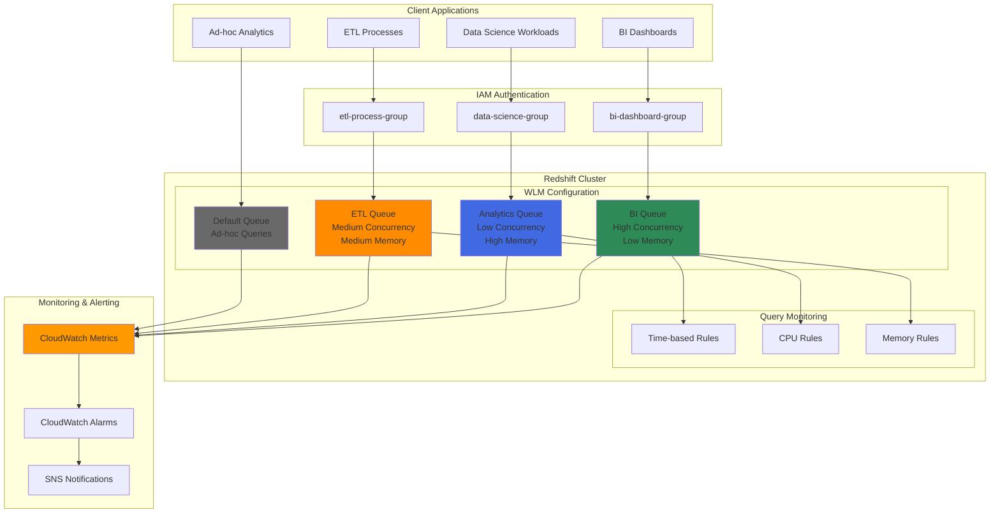

# Redshift Analytics Workload Isolation

## Problem

A multi-tenant SaaS analytics platform serves various client workloads on a shared Amazon Redshift cluster, where data science teams run long-running analytical queries while business intelligence dashboards require fast response times for interactive reporting. Without proper workload isolation, resource-intensive analytics queries monopolize cluster resources, causing dashboard timeouts and degraded user experience for interactive workloads. The organization needs to ensure predictable performance for different workload types while maximizing cluster resource utilization and maintaining cost efficiency.

## Solution

Implement Amazon Redshift Workload Management (WLM) with manual queue configuration to create dedicated resource pools for different workload types. Configure query monitoring rules to automatically handle runaway queries, establish user group-based routing for workload isolation, and implement comprehensive monitoring to track queue performance and resource utilization across tenant workloads.

## Architecture Diagram



## Prerequisites

1. AWS account with Redshift cluster administrative permissions
2. AWS CLI v2 installed and configured (or AWS CloudShell)
3. Basic understanding of SQL and data warehousing concepts
4. Existing Redshift cluster with at least dc2.large or ra3.xlplus instance types
5. Knowledge of IAM user groups and database user management
6. Estimated cost: $50-200 per day for testing cluster (varies by instance type and region)

> **Note**: This recipe uses manual WLM configuration for fine-grained control. AWS recommends automatic WLM for most use cases, but manual WLM provides precise resource allocation control needed for multi-tenant isolation scenarios.

## Preparation

```bash
# Set environment variables
export AWS_REGION=$(aws configure get region)
export AWS_ACCOUNT_ID=$(aws sts get-caller-identity \
    --query Account --output text)

# Generate unique identifiers for resources
RANDOM_SUFFIX=$(aws secretsmanager get-random-password \
    --exclude-punctuation --exclude-uppercase \
    --password-length 6 --require-each-included-type \
    --output text --query RandomPassword)

export CLUSTER_IDENTIFIER="analytics-wlm-cluster-${RANDOM_SUFFIX}"
export PARAMETER_GROUP_NAME="analytics-wlm-pg-${RANDOM_SUFFIX}"
export SNS_TOPIC_NAME="redshift-wlm-alerts-${RANDOM_SUFFIX}"

# Verify cluster existence or create parameter group family reference
export PARAMETER_GROUP_FAMILY="redshift-1.0"

echo "✅ Environment variables configured"
echo "Cluster ID: $CLUSTER_IDENTIFIER"
echo "Parameter Group: $PARAMETER_GROUP_NAME"
```

## Steps

1. **Create Custom Parameter Group for WLM Configuration**:

   Amazon Redshift parameter groups control cluster-level configuration settings, including the critical Workload Management (WLM) configuration that enables workload isolation. Creating a custom parameter group allows you to define specific WLM queue configurations without affecting other clusters using the default parameter group. This establishes the foundation for multi-tenant workload isolation by providing dedicated resource pools for different types of analytical workloads. Parameter groups are cluster-wide settings that require a cluster reboot to take effect. Learn more about [Redshift parameter groups](https://docs.aws.amazon.com/redshift/latest/mgmt/working-with-parameter-groups.html).

   ```bash
   # Create a custom parameter group for WLM configuration
   aws redshift create-cluster-parameter-group \
       --parameter-group-name "$PARAMETER_GROUP_NAME" \
       --parameter-group-family "$PARAMETER_GROUP_FAMILY" \
       --description "Analytics workload isolation parameter group"
   
   echo "✅ Created parameter group: $PARAMETER_GROUP_NAME"
   ```

   The parameter group is now ready to receive WLM configuration. This custom parameter group will be applied to your cluster to enable workload isolation without affecting the default system configuration.

2. **Configure Multi-Queue WLM with Workload Isolation**:

   Workload Management (WLM) is Amazon Redshift's sophisticated query routing and resource allocation system that enables precise control over how analytical workloads consume cluster resources. Manual WLM configuration creates dedicated queues with specific memory allocations, concurrency limits, and timeout values tailored to different workload characteristics. This configuration establishes four distinct queues: BI dashboards require high concurrency (15 slots) with moderate memory (25%) for fast interactive queries, data science workloads need fewer concurrent queries (3 slots) but significant memory (40%) for complex analytics, ETL processes require balanced resources (5 slots, 25% memory), and a default queue handles ad-hoc queries with minimal resource allocation. Each queue operates independently, preventing resource contention between workload types. Detailed information is available in the [WLM implementation guide](https://docs.aws.amazon.com/redshift/latest/dg/cm-c-implementing-workload-management.html).

   ```bash
   # Create WLM configuration JSON for workload isolation
   cat > wlm_config.json << 'EOF'
   [
     {
       "user_group": "bi-dashboard-group",
       "query_group": "dashboard",
       "query_concurrency": 15,
       "memory_percent_to_use": 25,
       "max_execution_time": 120000,
       "query_group_wild_card": 0
     },
     {
       "user_group": "data-science-group", 
       "query_group": "analytics",
       "query_concurrency": 3,
       "memory_percent_to_use": 40,
       "max_execution_time": 7200000,
       "query_group_wild_card": 0
     },
     {
       "user_group": "etl-process-group",
       "query_group": "etl", 
       "query_concurrency": 5,
       "memory_percent_to_use": 25,
       "max_execution_time": 3600000,
       "query_group_wild_card": 0
     },
     {
       "query_concurrency": 2,
       "memory_percent_to_use": 10,
       "max_execution_time": 1800000,
       "query_group_wild_card": 1
     }
   ]
   EOF
   
   # Apply WLM configuration to parameter group
   WLM_CONFIG=$(cat wlm_config.json | tr -d '\n' | tr -d ' ')
   
   aws redshift modify-cluster-parameter-group \
       --parameter-group-name "$PARAMETER_GROUP_NAME" \
       --parameters ParameterName=wlm_json_configuration,ParameterValue="$WLM_CONFIG"
   
   echo "✅ Applied WLM configuration with 4 queues for workload isolation"
   ```

   The WLM configuration is now stored in the parameter group and ready for deployment. This queue structure ensures that each workload type receives appropriate resources while preventing any single workload from monopolizing cluster capacity, achieving true multi-tenant isolation.

   > **Tip**: Queue memory percentages should total 100% or less. Redshift automatically reserves system memory, so the actual available memory for user queries is typically around 75% of total cluster memory. See the [WLM memory allocation guide](https://docs.aws.amazon.com/redshift/latest/dg/tutorial-configuring-workload-management.html) for optimization strategies.

3. **Create IAM Database Users and Groups for Workload Segregation**:

   Database user groups provide the authentication mechanism that enables WLM to automatically route queries to appropriate queues based on the connecting user's group membership. This approach implements secure, identity-based workload routing without requiring application-level queue specification. Each user group corresponds to a specific WLM queue configuration, ensuring that users automatically access the correct resource pool based on their role and workload requirements. This design supports multi-tenant scenarios where different client organizations or internal teams require isolated resource guarantees while sharing the same physical cluster infrastructure. The user creation process uses strong passwords and grants appropriate schema permissions for each workload type. Comprehensive user management guidance is available in the [Redshift database user guide](https://docs.aws.amazon.com/redshift/latest/dg/r_Users.html).

   ```bash
   # Get cluster endpoint for database connections
   CLUSTER_ENDPOINT=$(aws redshift describe-clusters \
       --cluster-identifier "$CLUSTER_IDENTIFIER" \
       --query 'Clusters[0].Endpoint.Address' \
       --output text 2>/dev/null || echo "cluster-not-found")
   
   if [ "$CLUSTER_ENDPOINT" = "cluster-not-found" ]; then
       echo "⚠️  Cluster not found. Creating commands for manual execution:"
       echo "Run these SQL commands after applying parameter group to your cluster:"
   else
       echo "✅ Found cluster endpoint: $CLUSTER_ENDPOINT"
   fi
   
   # Create SQL script for user group setup
   cat > setup_users_groups.sql << 'EOF'
   -- Create user groups for workload isolation
   CREATE GROUP "bi-dashboard-group";
   CREATE GROUP "data-science-group"; 
   CREATE GROUP "etl-process-group";
   
   -- Create users for different workload types
   CREATE USER dashboard_user1 PASSWORD 'BiUser123!@#' IN GROUP "bi-dashboard-group";
   CREATE USER dashboard_user2 PASSWORD 'BiUser123!@#' IN GROUP "bi-dashboard-group";
   CREATE USER analytics_user1 PASSWORD 'DsUser123!@#' IN GROUP "data-science-group";
   CREATE USER analytics_user2 PASSWORD 'DsUser123!@#' IN GROUP "data-science-group";
   CREATE USER etl_user1 PASSWORD 'EtlUser123!@#' IN GROUP "etl-process-group";
   
   -- Grant appropriate permissions
   GRANT ALL ON SCHEMA public TO GROUP "bi-dashboard-group";
   GRANT ALL ON SCHEMA public TO GROUP "data-science-group";
   GRANT ALL ON SCHEMA public TO GROUP "etl-process-group";
   EOF
   
   echo "✅ Created SQL script for user group setup"
   ```

   The user group structure is now defined and ready for deployment to your cluster. When these users connect to Redshift, WLM will automatically route their queries to the appropriate queue based on group membership, ensuring workload isolation without requiring manual queue selection by applications or users.

4. **Configure Query Monitoring Rules for Automatic Query Management**:

   Query Monitoring Rules (QMRs) provide automated governance for analytical workloads by continuously monitoring query performance metrics and taking predefined actions when thresholds are exceeded. This intelligent monitoring system prevents runaway queries from consuming excessive resources while enabling different response strategies for each workload type. BI dashboard queries are tightly controlled with quick timeout and CPU monitoring to maintain interactive performance, analytics queries monitor memory spilling and inefficient join patterns to prevent resource waste, and ETL processes have timeout controls with large scan monitoring for data processing oversight. QMRs can log problematic queries for analysis, abort resource-intensive queries, or hop queries to different queues with more appropriate resource allocations. The "hop" action moves queries that exceed thresholds to the default queue, preventing them from monopolizing specialized queue resources. Comprehensive QMR configuration details are available in the [query monitoring rules documentation](https://docs.aws.amazon.com/redshift/latest/mgmt/parameter-group-modify-qmr-console.html).

   ```bash
   # Create advanced WLM configuration with query monitoring rules
   cat > wlm_config_with_qmr.json << 'EOF'
   [
     {
       "user_group": "bi-dashboard-group",
       "query_group": "dashboard",
       "query_concurrency": 15,
       "memory_percent_to_use": 25,
       "max_execution_time": 120000,
       "query_group_wild_card": 0,
       "rules": [
         {
           "rule_name": "dashboard_timeout_rule",
           "predicate": "query_execution_time > 120",
           "action": "abort"
         },
         {
           "rule_name": "dashboard_cpu_rule", 
           "predicate": "query_cpu_time > 30",
           "action": "log"
         }
       ]
     },
     {
       "user_group": "data-science-group",
       "query_group": "analytics", 
       "query_concurrency": 3,
       "memory_percent_to_use": 40,
       "max_execution_time": 7200000,
       "query_group_wild_card": 0,
       "rules": [
         {
           "rule_name": "analytics_memory_rule",
           "predicate": "query_temp_blocks_to_disk > 100000",
           "action": "log"
         },
         {
           "rule_name": "analytics_nested_loop_rule",
           "predicate": "nested_loop_join_row_count > 1000000",
           "action": "hop"
         }
       ]
     },
     {
       "user_group": "etl-process-group",
       "query_group": "etl",
       "query_concurrency": 5, 
       "memory_percent_to_use": 25,
       "max_execution_time": 3600000,
       "query_group_wild_card": 0,
       "rules": [
         {
           "rule_name": "etl_timeout_rule",
           "predicate": "query_execution_time > 3600",
           "action": "abort"
         },
         {
           "rule_name": "etl_scan_rule",
           "predicate": "scan_row_count > 1000000000",
           "action": "log"
         }
       ]
     },
     {
       "query_concurrency": 2,
       "memory_percent_to_use": 10, 
       "max_execution_time": 1800000,
       "query_group_wild_card": 1,
       "rules": [
         {
           "rule_name": "default_timeout_rule",
           "predicate": "query_execution_time > 1800",
           "action": "abort"
         }
       ]
     }
   ]
   EOF
   
   # Apply enhanced WLM configuration with query monitoring rules
   WLM_CONFIG_QMR=$(cat wlm_config_with_qmr.json | tr -d '\n' | tr -d ' ')
   
   aws redshift modify-cluster-parameter-group \
       --parameter-group-name "$PARAMETER_GROUP_NAME" \
       --parameters ParameterName=wlm_json_configuration,ParameterValue="$WLM_CONFIG_QMR"
   
   echo "✅ Applied WLM configuration with query monitoring rules"
   ```

   The enhanced WLM configuration with query monitoring rules is now configured in the parameter group. This automated governance system will continuously monitor query performance and take appropriate actions to maintain system stability and performance SLAs for all workload types.

5. **Create SNS Topic for WLM Monitoring Alerts**:

   Amazon Simple Notification Service (SNS) provides the communication backbone for real-time alerting when workload management thresholds are exceeded or performance degradation is detected. This notification system enables rapid response to resource contention, queue bottlenecks, or system performance issues that could impact tenant SLAs. SNS topics support multiple delivery mechanisms including email, SMS, and webhook endpoints, allowing integration with existing incident management systems and on-call procedures. The email subscription requires manual confirmation to prevent unauthorized notifications. Establishing proactive alerting is essential for maintaining multi-tenant workload isolation and ensuring business continuity across different analytical workloads. Learn more about [SNS topic configuration](https://docs.aws.amazon.com/sns/latest/dg/sns-create-topic.html).

   ```bash
   # Create SNS topic for workload management alerts
   SNS_TOPIC_ARN=$(aws sns create-topic \
       --name "$SNS_TOPIC_NAME" \
       --query 'TopicArn' \
       --output text)
   
   # Subscribe email to SNS topic (replace with your email)
   read -p "Enter email address for WLM alerts: " EMAIL_ADDRESS
   
   aws sns subscribe \
       --topic-arn "$SNS_TOPIC_ARN" \
       --protocol email \
       --notification-endpoint "$EMAIL_ADDRESS"
   
   echo "✅ Created SNS topic for alerts: $SNS_TOPIC_ARN"
   echo "⚠️  Check your email and confirm the subscription"
   ```

   The SNS topic is now established and ready to receive CloudWatch alarm notifications. This communication channel will ensure immediate notification of workload management issues, enabling rapid response to maintain system performance and tenant isolation guarantees.

6. **Set Up CloudWatch Alarms for Queue Performance Monitoring**:

   Amazon CloudWatch provides comprehensive monitoring capabilities for Redshift cluster performance metrics, enabling proactive detection of workload management issues before they impact user experience. These alarms monitor critical WLM metrics including queue length (indicating query backlog and resource contention), CPU utilization (showing overall cluster load), and query completion rates (detecting system performance degradation). The alarm thresholds are configured based on typical multi-tenant performance expectations: queue lengths above 5 indicate resource contention requiring attention, CPU utilization above 85% suggests cluster saturation, and declining query completion rates may indicate system bottlenecks or runaway queries. The evaluation periods and statistics are optimized for reducing false positives while ensuring timely detection of genuine performance issues. Detailed monitoring guidance is available in the [Redshift monitoring documentation](https://docs.aws.amazon.com/redshift/latest/mgmt/metrics.html).

   ```bash
   # Create CloudWatch alarm for high queue wait time
   aws cloudwatch put-metric-alarm \
       --alarm-name "RedshiftWLM-HighQueueWaitTime" \
       --alarm-description "Alert when WLM queue wait time is high" \
       --metric-name QueueLength \
       --namespace AWS/Redshift \
       --statistic Average \
       --period 300 \
       --threshold 5 \
       --comparison-operator GreaterThanThreshold \
       --dimensions Name=ClusterIdentifier,Value="$CLUSTER_IDENTIFIER" \
       --evaluation-periods 2 \
       --alarm-actions "$SNS_TOPIC_ARN" \
       --treat-missing-data notBreaching
   
   # Create alarm for CPU utilization
   aws cloudwatch put-metric-alarm \
       --alarm-name "RedshiftWLM-HighCPUUtilization" \
       --alarm-description "Alert when cluster CPU utilization is high" \
       --metric-name CPUUtilization \
       --namespace AWS/Redshift \
       --statistic Average \
       --period 300 \
       --threshold 85 \
       --comparison-operator GreaterThanThreshold \
       --dimensions Name=ClusterIdentifier,Value="$CLUSTER_IDENTIFIER" \
       --evaluation-periods 3 \
       --alarm-actions "$SNS_TOPIC_ARN"
   
   # Create alarm for query abort rate
   aws cloudwatch put-metric-alarm \
       --alarm-name "RedshiftWLM-HighQueryAbortRate" \
       --alarm-description "Alert when query abort rate is high" \
       --metric-name QueriesCompletedPerSecond \
       --namespace AWS/Redshift \
       --statistic Sum \
       --period 900 \
       --threshold 10 \
       --comparison-operator LessThanThreshold \
       --dimensions Name=ClusterIdentifier,Value="$CLUSTER_IDENTIFIER" \
       --evaluation-periods 2 \
       --alarm-actions "$SNS_TOPIC_ARN"
   
   echo "✅ Created CloudWatch alarms for WLM monitoring"
   ```

   The CloudWatch alarm system is now actively monitoring cluster performance and will trigger SNS notifications when workload management thresholds are exceeded. This proactive monitoring enables rapid response to performance issues and maintains workload isolation guarantees across tenant workloads.

7. **Apply Parameter Group to Cluster and Enable Enhanced Monitoring**:

   Applying the custom parameter group to your Redshift cluster activates the WLM configuration and query monitoring rules across all database connections. This operation requires a cluster reboot because WLM configuration changes affect the fundamental query execution architecture within Redshift. The reboot process typically takes 1-3 minutes for most cluster sizes and ensures that all compute nodes receive the new workload management configuration. During the reboot, existing connections are terminated, so this operation should be performed during a maintenance window to minimize user impact. Once applied, the cluster will automatically route all incoming queries to appropriate queues based on user group membership and query group settings. The parameter group must be applied with the `--apply-immediately` flag to trigger the reboot process. Additional cluster management details are available in the [cluster management guide](https://docs.aws.amazon.com/redshift/latest/mgmt/working-with-clusters.html).

   ```bash
   # Check if cluster exists, if not provide instructions
   if aws redshift describe-clusters \
       --cluster-identifier "$CLUSTER_IDENTIFIER" \
       --query 'Clusters[0].ClusterIdentifier' \
       --output text >/dev/null 2>&1; then
       
       # Apply parameter group to existing cluster
       aws redshift modify-cluster \
           --cluster-identifier "$CLUSTER_IDENTIFIER" \
           --cluster-parameter-group-name "$PARAMETER_GROUP_NAME" \
           --apply-immediately
       
       echo "✅ Applied parameter group to cluster: $CLUSTER_IDENTIFIER"
       echo "⚠️  Cluster will reboot to apply WLM configuration"
       
   else
       echo "ℹ️  To apply parameter group to your cluster, run:"
       echo "aws redshift modify-cluster \\"
       echo "    --cluster-identifier YOUR_CLUSTER_ID \\"
       echo "    --cluster-parameter-group-name $PARAMETER_GROUP_NAME \\"
       echo "    --apply-immediately"
   fi
   ```

   The parameter group application is now initiated and the cluster will reboot to activate the WLM configuration. After the reboot completes, all workload isolation features will be active and queries will be automatically routed to appropriate queues based on user authentication and group membership.

8. **Create Monitoring Views for WLM Performance Analysis**:

   SQL monitoring views provide detailed visibility into WLM performance by querying Redshift's system tables and creating user-friendly reporting interfaces. These views aggregate complex system metrics into business-friendly dashboards that show queue utilization rates, query monitoring rule actions, and performance trends over time. The queue performance view provides real-time visibility into resource allocation and utilization across all workload types, while the rule actions view tracks automated governance activities and helps identify problematic query patterns. The wait time analysis view enables capacity planning by showing average and peak queue wait times, helping administrators optimize queue configurations for changing workload patterns. These views use Redshift system tables including `stv_wlm_service_class_state`, `stl_wlm_rule_action`, and `stl_query` to provide comprehensive performance insights. Understanding and monitoring these metrics is essential for maintaining optimal multi-tenant performance and resource allocation efficiency.

   ```bash
   # Create SQL script for monitoring views
   cat > wlm_monitoring_views.sql << 'EOF'
   -- Create view to monitor queue performance
   CREATE OR REPLACE VIEW wlm_queue_performance AS
   SELECT 
       service_class,
       CASE 
           WHEN service_class = 6 THEN 'BI Dashboard Queue'
           WHEN service_class = 7 THEN 'Data Science Queue' 
           WHEN service_class = 8 THEN 'ETL Queue'
           WHEN service_class = 5 THEN 'Default Queue'
           ELSE 'System Queue'
       END AS queue_name,
       num_query_tasks,
       num_executing_queries,
       num_executed_queries,
       num_queued_queries,
       query_working_mem,
       available_query_mem,
       ROUND(100.0 * num_executing_queries / num_query_tasks, 2) AS utilization_pct
   FROM stv_wlm_service_class_state
   WHERE service_class >= 5
   ORDER BY service_class;
   
   -- Create view to monitor query monitoring rule actions  
   CREATE OR REPLACE VIEW wlm_rule_actions AS
   SELECT
       userid,
       query,
       service_class,
       rule,
       action,
       recordtime,
       CASE 
           WHEN service_class = 6 THEN 'BI Dashboard Queue'
           WHEN service_class = 7 THEN 'Data Science Queue'
           WHEN service_class = 8 THEN 'ETL Queue' 
           WHEN service_class = 5 THEN 'Default Queue'
           ELSE 'System Queue'
       END AS queue_name
   FROM stl_wlm_rule_action
   WHERE recordtime >= DATEADD(hour, -24, GETDATE())
   ORDER BY recordtime DESC;
   
   -- Create view to analyze queue wait times
   CREATE OR REPLACE VIEW wlm_queue_wait_analysis AS
   SELECT
       service_class,
       CASE 
           WHEN service_class = 6 THEN 'BI Dashboard Queue'
           WHEN service_class = 7 THEN 'Data Science Queue'
           WHEN service_class = 8 THEN 'ETL Queue'
           WHEN service_class = 5 THEN 'Default Queue'
           ELSE 'System Queue'
       END AS queue_name,
       COUNT(*) AS total_queries,
       AVG(total_queue_time/1000000.0) AS avg_queue_wait_seconds,
       MAX(total_queue_time/1000000.0) AS max_queue_wait_seconds,
       AVG(total_exec_time/1000000.0) AS avg_execution_seconds
   FROM stl_query
   WHERE starttime >= DATEADD(hour, -24, GETDATE())
   AND service_class >= 5
   GROUP BY service_class
   ORDER BY service_class;
   EOF
   
   echo "✅ Created SQL monitoring views script"
   ```

   The monitoring views are now ready for deployment to your cluster. These views will provide ongoing visibility into WLM performance and enable data-driven optimization of queue configurations based on actual workload patterns and resource utilization trends.

9. **Test Workload Isolation with Sample Queries**:

   Validation testing ensures that the WLM configuration correctly routes queries to appropriate queues and enforces resource isolation between workload types. These test queries simulate typical workload patterns: lightweight BI dashboard queries that require fast response times, computationally intensive data science queries that need significant memory allocation, and ETL processes that handle large data volumes with moderate resource requirements. By explicitly setting query groups and monitoring the resulting queue assignments, you can verify that workload isolation is functioning correctly and that each tenant workload receives its designated resource allocation. The `SET query_group` statement overrides automatic user group routing to allow testing of specific queue configurations. This validation process is critical for confirming that multi-tenant isolation is working as designed before deploying to production environments.

   ```bash
   # Create test queries for different workload types
   cat > test_workload_isolation.sql << 'EOF'
   -- Test BI Dashboard workload (should use queue 6)
   SET query_group TO 'dashboard';
   SELECT 
       DATE_TRUNC('day', current_date) AS report_date,
       'Sample BI Query' AS query_type,
       RANDOM() * 1000 AS metric_value;
   
   -- Test Data Science workload (should use queue 7)  
   SET query_group TO 'analytics';
   WITH large_dataset AS (
       SELECT 
           GENERATE_SERIES(1, 100000) AS id,
           RANDOM() AS value,
           MD5(RANDOM()::TEXT) AS hash_value
   )
   SELECT 
       COUNT(*) AS total_rows,
       AVG(value) AS avg_value,
       'Analytics Query' AS query_type
   FROM large_dataset;
   
   -- Test ETL workload (should use queue 8)
   SET query_group TO 'etl';
   CREATE TEMP TABLE etl_test AS
   SELECT 
       GENERATE_SERIES(1, 50000) AS id,
       CURRENT_TIMESTAMP AS created_at,
       'ETL Process' AS process_type;
   
   SELECT COUNT(*) FROM etl_test;
   
   -- Reset query group
   RESET query_group;
   EOF
   
   echo "✅ Created test queries for workload validation"
   ```

   The test query suite is now ready for execution against your cluster. Running these queries while monitoring the WLM views will demonstrate that workload isolation is functioning correctly and that each query type is routed to its designated resource pool.

10. **Configure Automatic Queue Monitoring Dashboard**:

    CloudWatch dashboards provide centralized visualization of WLM performance metrics, enabling operations teams to monitor workload isolation effectiveness and cluster health from a unified interface. This dashboard consolidates key performance indicators including queue length trends, query completion rates, CPU utilization patterns, and connection metrics to provide comprehensive visibility into multi-tenant workload performance. The time-series visualizations enable trend analysis and capacity planning while supporting both real-time monitoring and historical analysis of workload patterns. Dashboard widgets can be customized to focus on specific metrics relevant to your operational requirements and tenant SLA monitoring needs. The dashboard configuration uses environment variable substitution to ensure cluster-specific monitoring. Additional dashboard configuration options are detailed in the [CloudWatch dashboard documentation](https://docs.aws.amazon.com/AmazonCloudWatch/latest/monitoring/create_dashboard.html).

    ```bash
    # Create custom CloudWatch dashboard for WLM monitoring
    cat > wlm_dashboard.json << EOF
    {
        "widgets": [
            {
                "type": "metric",
                "properties": {
                    "metrics": [
                        [ "AWS/Redshift", "QueueLength", "ClusterIdentifier", "$CLUSTER_IDENTIFIER" ],
                        [ ".", "QueriesCompletedPerSecond", ".", "." ],
                        [ ".", "CPUUtilization", ".", "." ]
                    ],
                    "period": 300,
                    "stat": "Average",
                    "region": "$AWS_REGION",
                    "title": "Redshift WLM Performance Metrics",
                    "view": "timeSeries"
                }
            },
            {
                "type": "metric", 
                "properties": {
                    "metrics": [
                        [ "AWS/Redshift", "DatabaseConnections", "ClusterIdentifier", "$CLUSTER_IDENTIFIER" ],
                        [ ".", "HealthStatus", ".", "." ]
                    ],
                    "period": 300,
                    "stat": "Average", 
                    "region": "$AWS_REGION",
                    "title": "Cluster Health and Connections",
                    "view": "timeSeries"
                }
            }
        ]
    }
    EOF
    
    # Create CloudWatch dashboard
    aws cloudwatch put-dashboard \
        --dashboard-name "RedshiftWLM-${RANDOM_SUFFIX}" \
        --dashboard-body file://wlm_dashboard.json
    
    echo "✅ Created CloudWatch dashboard for WLM monitoring"
    ```

    The CloudWatch dashboard is now active and providing real-time visibility into WLM performance metrics. This centralized monitoring interface enables ongoing assessment of workload isolation effectiveness and supports data-driven optimization of queue configurations based on actual usage patterns.

## Validation & Testing

1. **Verify Parameter Group Configuration**:

   ```bash
   # Check parameter group configuration
   aws redshift describe-cluster-parameter-groups \
       --parameter-group-name "$PARAMETER_GROUP_NAME" \
       --query 'ParameterGroups[0]'
   
   # Verify WLM configuration is applied
   aws redshift describe-cluster-parameters \
       --parameter-group-name "$PARAMETER_GROUP_NAME" \
       --source user \
       --query 'Parameters[?ParameterName==`wlm_json_configuration`].ParameterValue' \
       --output text
   ```

   Expected output: WLM JSON configuration with 4 queues and query monitoring rules

2. **Test Queue Assignment and Isolation**:

   ```bash
   # Create script to test queue assignments
   cat > validate_queue_assignment.sql << 'EOF'
   -- Check current WLM configuration
   SELECT * FROM stv_wlm_classification_config ORDER BY service_class;
   
   -- Monitor active queues
   SELECT 
       service_class,
       num_query_tasks,
       num_executing_queries, 
       num_queued_queries,
       query_working_mem
   FROM stv_wlm_service_class_state 
   WHERE service_class >= 5;
   
   -- Check if users are properly assigned to groups
   SELECT 
       usename,
       grolist,
       usesysid
   FROM pg_user u
   JOIN pg_group g ON u.usesysid = ANY(g.grolist)
   WHERE g.groname IN ('bi-dashboard-group', 'data-science-group', 'etl-process-group');
   EOF
   
   echo "✅ Created queue assignment validation script"
   echo "Run this SQL script in your Redshift cluster to validate configuration"
   ```

3. **Monitor Query Performance by Queue**:

   ```bash
   # Test CloudWatch metrics availability
   aws cloudwatch get-metric-statistics \
       --namespace AWS/Redshift \
       --metric-name QueueLength \
       --dimensions Name=ClusterIdentifier,Value="$CLUSTER_IDENTIFIER" \
       --start-time $(date -u -d '1 hour ago' +%Y-%m-%dT%H:%M:%S) \
       --end-time $(date -u +%Y-%m-%dT%H:%M:%S) \
       --period 300 \
       --statistics Average
   ```

   Expected output: CloudWatch metrics data showing queue performance over time

## Cleanup

1. **Remove CloudWatch Alarms and Dashboard**:

   ```bash
   # Delete CloudWatch alarms
   aws cloudwatch delete-alarms \
       --alarm-names "RedshiftWLM-HighQueueWaitTime" \
                     "RedshiftWLM-HighCPUUtilization" \
                     "RedshiftWLM-HighQueryAbortRate"
   
   # Delete CloudWatch dashboard
   aws cloudwatch delete-dashboards \
       --dashboard-names "RedshiftWLM-${RANDOM_SUFFIX}"
   
   echo "✅ Deleted CloudWatch alarms and dashboard"
   ```

2. **Remove SNS Topic and Subscriptions**:

   ```bash
   # Delete SNS topic (automatically removes subscriptions)
   aws sns delete-topic --topic-arn "$SNS_TOPIC_ARN"
   
   echo "✅ Deleted SNS topic and subscriptions"
   ```

3. **Reset Cluster to Default Parameter Group**:

   ```bash
   # Reset cluster to default parameter group
   if aws redshift describe-clusters \
       --cluster-identifier "$CLUSTER_IDENTIFIER" >/dev/null 2>&1; then
       
       aws redshift modify-cluster \
           --cluster-identifier "$CLUSTER_IDENTIFIER" \
           --cluster-parameter-group-name "default.redshift-1.0" \
           --apply-immediately
       
       echo "✅ Reset cluster to default parameter group"
   else
       echo "ℹ️  Manually reset your cluster to default parameter group"
   fi
   ```

4. **Delete Custom Parameter Group**:

   ```bash
   # Wait for cluster to finish using parameter group
   echo "⚠️  Waiting for cluster to apply default parameter group..."
   sleep 60
   
   # Delete custom parameter group
   aws redshift delete-cluster-parameter-group \
       --parameter-group-name "$PARAMETER_GROUP_NAME"
   
   echo "✅ Deleted custom parameter group: $PARAMETER_GROUP_NAME"
   ```

5. **Clean Up Local Files**:

   ```bash
   # Remove local configuration files
   rm -f wlm_config.json \
         wlm_config_with_qmr.json \
         setup_users_groups.sql \
         wlm_monitoring_views.sql \
         test_workload_isolation.sql \
         validate_queue_assignment.sql \
         wlm_dashboard.json
   
   # Clear environment variables
   unset CLUSTER_IDENTIFIER PARAMETER_GROUP_NAME SNS_TOPIC_NAME \
         PARAMETER_GROUP_FAMILY SNS_TOPIC_ARN RANDOM_SUFFIX
   
   echo "✅ Cleaned up local files and environment variables"
   ```

## Discussion

Amazon Redshift Workload Management (WLM) provides sophisticated capabilities for isolating and managing analytics workloads in multi-tenant environments. This implementation demonstrates how to create dedicated resource pools that ensure predictable performance for different workload types while maximizing cluster utilization.

The key architectural decision in this solution is using manual WLM configuration instead of automatic WLM. While AWS strongly recommends automatic WLM for most use cases due to its simplicity and dynamic resource allocation capabilities, manual WLM provides the precise control needed for multi-tenant workload isolation scenarios. Each queue is configured with specific memory allocation percentages, concurrency limits, and execution timeouts that align with workload characteristics - BI dashboards need high concurrency with lower memory allocation, while data science workloads require fewer concurrent queries but more memory per query. This granular control enables guaranteed resource allocation that automatic WLM cannot provide in multi-tenant environments.

Query monitoring rules (QMRs) add an essential layer of automated governance by preventing runaway queries from consuming excessive resources. The implementation includes rules for query timeout, CPU usage, memory spilling, and nested loop detection. These rules can log problematic queries for analysis, hop queries to different queues, or abort them entirely. The "hop" action is particularly valuable as it moves poorly performing queries from specialized queues to the default queue, preserving dedicated resources for their intended workloads. This automation reduces the need for manual intervention while maintaining system stability across tenant workloads.

The monitoring strategy combines CloudWatch metrics with custom SQL views to provide comprehensive visibility into WLM performance. CloudWatch alarms provide real-time alerting for queue bottlenecks and resource contention, while the custom views enable detailed analysis of queue utilization patterns and query performance trends. This dual approach supports both reactive incident response and proactive capacity planning. Organizations should regularly review queue performance metrics and adjust memory allocations or concurrency limits based on changing workload patterns and growth trends. The system tables `stv_wlm_service_class_state`, `stl_wlm_rule_action`, and `stl_query` provide rich performance data for ongoing optimization. Learn more about [WLM system tables](https://docs.aws.amazon.com/redshift/latest/dg/cm-c-wlm-system-tables-and-views.html).

> **Warning**: Manual WLM requires ongoing tuning and monitoring. Queue configurations should be reviewed quarterly and adjusted based on workload evolution and cluster scaling needs. Consider migrating to automatic WLM if operational overhead becomes significant.

## Challenge

Extend this workload isolation solution by implementing these enhancements:

1. **Dynamic Queue Scaling**: Implement Lambda functions that automatically adjust queue concurrency and memory allocation based on CloudWatch metrics and time-of-day patterns. Create a scheduling system using EventBridge that increases BI queue resources during business hours and allocates more resources to analytics queues during off-peak times.

2. **Advanced Query Classification**: Develop a machine learning model using Amazon SageMaker that analyzes query patterns and automatically classifies queries into appropriate queues based on estimated resource requirements, query complexity, and historical performance data. Integrate this with query rewriting logic to optimize queries before execution.

3. **Multi-Cluster Workload Federation**: Extend the solution to route different workload types to dedicated Redshift clusters using AWS Application Load Balancer and PgBouncer connection pooling. Implement cross-cluster query federation using Redshift Spectrum for workloads that need to access data across tenant boundaries while maintaining strict isolation.

4. **Cost Optimization Integration**: Build a comprehensive cost allocation system that tracks resource consumption by tenant and workload type using CloudWatch Logs Insights and AWS Cost Explorer APIs. Implement automated recommendations for right-sizing clusters, optimizing reserved instance purchasing, and identifying underutilized queue configurations based on actual workload patterns.

5. **Disaster Recovery for WLM**: Create a cross-region disaster recovery solution that replicates WLM configurations, maintains workload isolation during failover scenarios, and includes automated testing of failover procedures with performance validation across regions using AWS Systems Manager Automation.

## Infrastructure Code

### Available Infrastructure as Code:

- [Infrastructure Code Overview](code/README.md) - Detailed description of all infrastructure components
- [AWS CDK (Python)](code/cdk-python/) - AWS CDK Python implementation
- [AWS CDK (TypeScript)](code/cdk-typescript/) - AWS CDK TypeScript implementation
- [CloudFormation](code/cloudformation.yaml) - AWS CloudFormation template
- [Bash CLI Scripts](code/scripts/) - Example bash scripts using AWS CLI commands to deploy infrastructure
- [Terraform](code/terraform/) - Terraform configuration files