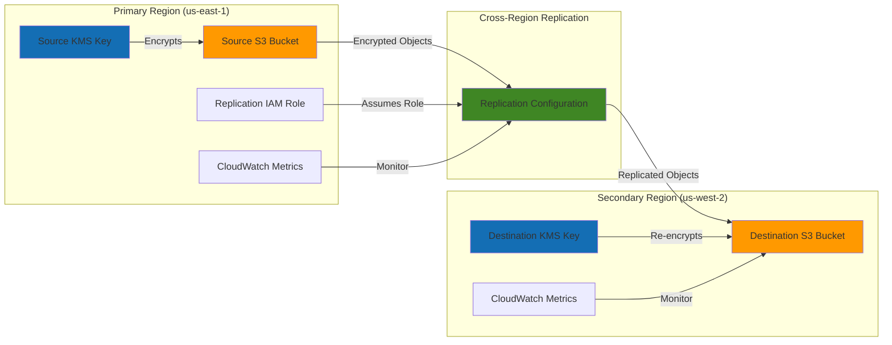

# Replicating S3 Data Across Regions with Encryption

## Problem

A global financial services company needs to ensure business continuity and meet regulatory compliance requirements for critical customer data. Their primary concern is protecting against regional disasters while maintaining strict data encryption standards and access controls across multiple geographic locations. Traditional backup solutions are too slow for their recovery time objectives, and they need automated replication that preserves security controls without manual intervention.

## Solution

Implement S3 Cross-Region Replication (CRR) with KMS encryption and granular IAM access controls to automatically replicate encrypted objects across AWS regions. This solution provides real-time data protection, maintains encryption standards, and ensures compliance with data sovereignty requirements while enabling rapid disaster recovery capabilities.

## Architecture Diagram



## Prerequisites

1. AWS account with administrative permissions for S3, KMS, IAM, and CloudWatch
2. AWS CLI v2 installed and configured (minimum version 2.0.0)
3. Understanding of S3 bucket policies and IAM roles
4. Knowledge of KMS key management and encryption concepts
5. Estimated cost: $0.50-$2.00 per hour for testing (includes S3 storage, KMS requests, and data transfer)

> **Note**: Cross-region replication incurs additional charges for storage in the destination region and data transfer costs between regions. As of January 5, 2023, all new objects uploaded to S3 are automatically encrypted with SSE-S3 at no additional cost.

## Preparation

```bash
# Set environment variables for AWS regions
export AWS_REGION=$(aws configure get region)
export AWS_ACCOUNT_ID=$(aws sts get-caller-identity \
    --query Account --output text)
export PRIMARY_REGION="us-east-1"
export SECONDARY_REGION="us-west-2"

# Generate unique identifiers for resources
RANDOM_SUFFIX=$(aws secretsmanager get-random-password \
    --exclude-punctuation --exclude-uppercase \
    --password-length 8 --require-each-included-type \
    --output text --query RandomPassword)

# Set resource names with consistent naming convention
export SOURCE_BUCKET="crr-source-${RANDOM_SUFFIX}"
export DEST_BUCKET="crr-dest-${RANDOM_SUFFIX}"
export REPLICATION_ROLE="S3ReplicationRole-${RANDOM_SUFFIX}"
export SOURCE_KMS_ALIAS="alias/s3-crr-source-${RANDOM_SUFFIX}"
export DEST_KMS_ALIAS="alias/s3-crr-dest-${RANDOM_SUFFIX}"

# Verify configuration and display resource names
echo "AWS Account ID: ${AWS_ACCOUNT_ID}"
echo "Primary Region: ${PRIMARY_REGION}"
echo "Secondary Region: ${SECONDARY_REGION}"
echo "Source Bucket: ${SOURCE_BUCKET}"
echo "Destination Bucket: ${DEST_BUCKET}"

echo "✅ Environment configured for cross-region replication setup"
```

## Steps

1. **Create KMS keys for encryption in both regions**:

   AWS Key Management Service (KMS) provides centralized key management with hardware security modules (HSMs) that meet FIPS 140-2 Level 2 security standards. For cross-region replication, separate KMS keys in each region ensure cryptographic isolation and enable region-specific key rotation policies. This approach supports compliance requirements for data sovereignty and provides defense-in-depth security.

   ```bash
   # Create KMS key in primary region
   SOURCE_KMS_KEY=$(aws kms create-key \
       --region ${PRIMARY_REGION} \
       --description "S3 Cross-Region Replication Source Key" \
       --policy '{
           "Version": "2012-10-17",
           "Statement": [
               {
                   "Sid": "Enable IAM User Permissions",
                   "Effect": "Allow",
                   "Principal": {
                       "AWS": "arn:aws:iam::'${AWS_ACCOUNT_ID}':root"
                   },
                   "Action": "kms:*",
                   "Resource": "*"
               },
               {
                   "Sid": "Allow S3 Service",
                   "Effect": "Allow",
                   "Principal": {
                       "Service": "s3.amazonaws.com"
                   },
                   "Action": [
                       "kms:Decrypt",
                       "kms:GenerateDataKey"
                   ],
                   "Resource": "*"
               }
           ]
       }' \
       --output text --query 'KeyMetadata.KeyId')

   echo "✅ Created source KMS key: ${SOURCE_KMS_KEY}"

   # Create alias for source key
   aws kms create-alias \
       --region ${PRIMARY_REGION} \
       --alias-name ${SOURCE_KMS_ALIAS} \
       --target-key-id ${SOURCE_KMS_KEY}
   ```

   The KMS key policy grants necessary permissions to both account administrators and the S3 service, enabling seamless encryption operations during replication. The key is now ready to encrypt objects in the source bucket and decrypt them during the replication process.

2. **Create KMS key in destination region**:

   Creating a separate KMS key in the destination region enables envelope encryption where objects are re-encrypted with region-specific keys during replication. This approach ensures that even if one region's encryption is compromised, the other region maintains independent cryptographic protection. Regional key separation also supports data residency requirements and enables independent key rotation schedules.

   ```bash
   # Create KMS key in secondary region
   DEST_KMS_KEY=$(aws kms create-key \
       --region ${SECONDARY_REGION} \
       --description "S3 Cross-Region Replication Destination Key" \
       --policy '{
           "Version": "2012-10-17",
           "Statement": [
               {
                   "Sid": "Enable IAM User Permissions",
                   "Effect": "Allow",
                   "Principal": {
                       "AWS": "arn:aws:iam::'${AWS_ACCOUNT_ID}':root"
                   },
                   "Action": "kms:*",
                   "Resource": "*"
               },
               {
                   "Sid": "Allow S3 Service",
                   "Effect": "Allow",
                   "Principal": {
                       "Service": "s3.amazonaws.com"
                   },
                   "Action": [
                       "kms:Decrypt",
                       "kms:GenerateDataKey"
                   ],
                   "Resource": "*"
               }
           ]
       }' \
       --output text --query 'KeyMetadata.KeyId')

   echo "✅ Created destination KMS key: ${DEST_KMS_KEY}"

   # Create alias for destination key
   aws kms create-alias \
       --region ${SECONDARY_REGION} \
       --alias-name ${DEST_KMS_ALIAS} \
       --target-key-id ${DEST_KMS_KEY}
   ```

   Both source and destination KMS keys are now established, creating the cryptographic foundation for secure cross-region replication. The dual-key architecture ensures that replicated objects are independently encrypted in each region, providing maximum security isolation.

3. **Create source S3 bucket with versioning and encryption**:

   S3 versioning is essential for cross-region replication as it enables tracking of object modifications and deletions across regions. The bucket key feature optimizes KMS costs by reducing API calls while maintaining encryption security. Default encryption ensures that all objects are automatically encrypted upon upload, preventing accidental storage of unencrypted data.

   ```bash
   # Create source bucket
   aws s3api create-bucket \
       --bucket ${SOURCE_BUCKET} \
       --region ${PRIMARY_REGION}

   # Enable versioning on source bucket
   aws s3api put-bucket-versioning \
       --bucket ${SOURCE_BUCKET} \
       --versioning-configuration Status=Enabled

   # Configure default encryption on source bucket
   aws s3api put-bucket-encryption \
       --bucket ${SOURCE_BUCKET} \
       --server-side-encryption-configuration '{
           "Rules": [
               {
                   "ApplyServerSideEncryptionByDefault": {
                       "SSEAlgorithm": "aws:kms",
                       "KMSMasterKeyID": "'${SOURCE_KMS_KEY}'"
                   },
                   "BucketKeyEnabled": true
               }
           ]
       }'

   echo "✅ Created and configured source bucket: ${SOURCE_BUCKET}"
   ```

   The source bucket is now configured with versioning enabled and default KMS encryption, establishing the secure foundation for data ingestion. All objects uploaded to this bucket will be automatically encrypted and tracked for replication to the destination region.

4. **Create destination S3 bucket with versioning and encryption**:

   The destination bucket requires identical versioning configuration to maintain object version consistency across regions. Using a region-specific KMS key for encryption ensures that replicated objects are re-encrypted with the destination region's key, providing cryptographic independence and supporting compliance with data sovereignty requirements.

   ```bash
   # Create destination bucket
   aws s3api create-bucket \
       --bucket ${DEST_BUCKET} \
       --region ${SECONDARY_REGION} \
       --create-bucket-configuration LocationConstraint=${SECONDARY_REGION}

   # Enable versioning on destination bucket
   aws s3api put-bucket-versioning \
       --bucket ${DEST_BUCKET} \
       --versioning-configuration Status=Enabled \
       --region ${SECONDARY_REGION}

   # Configure default encryption on destination bucket
   aws s3api put-bucket-encryption \
       --bucket ${DEST_BUCKET} \
       --server-side-encryption-configuration '{
           "Rules": [
               {
                   "ApplyServerSideEncryptionByDefault": {
                       "SSEAlgorithm": "aws:kms",
                       "KMSMasterKeyID": "'${DEST_KMS_KEY}'"
                   },
                   "BucketKeyEnabled": true
               }
           ]
       }' \
       --region ${SECONDARY_REGION}

   echo "✅ Created and configured destination bucket: ${DEST_BUCKET}"
   ```

   Both buckets now have matching configurations optimized for cross-region replication. The destination bucket is ready to receive encrypted objects that will be automatically re-encrypted with the region-specific KMS key during the replication process.

5. **Create IAM role for replication with necessary permissions**:

   S3 Cross-Region Replication requires a service role that follows the principle of least privilege, granting only the minimum permissions necessary for replication operations. The role must have permissions to read objects from the source bucket, write to the destination bucket, and perform encryption/decryption operations with both KMS keys. This secure delegation enables automated replication without exposing long-term credentials.

   ```bash
   # Create trust policy for replication role
   cat > /tmp/trust-policy.json << EOF
{
    "Version": "2012-10-17",
    "Statement": [
        {
            "Effect": "Allow",
            "Principal": {
                "Service": "s3.amazonaws.com"
            },
            "Action": "sts:AssumeRole"
        }
    ]
}
EOF

   # Create IAM role for replication
   aws iam create-role \
       --role-name ${REPLICATION_ROLE} \
       --assume-role-policy-document file:///tmp/trust-policy.json \
       --description "S3 Cross-Region Replication Role"

   # Create permissions policy for replication role
   cat > /tmp/replication-policy.json << EOF
{
    "Version": "2012-10-17",
    "Statement": [
        {
            "Effect": "Allow",
            "Action": [
                "s3:GetObjectVersion",
                "s3:GetObjectVersionAcl",
                "s3:GetObjectVersionForReplication",
                "s3:GetObjectVersionTagging"
            ],
            "Resource": [
                "arn:aws:s3:::${SOURCE_BUCKET}/*"
            ]
        },
        {
            "Effect": "Allow",
            "Action": [
                "s3:ListBucket",
                "s3:GetBucketVersioning",
                "s3:GetReplicationConfiguration"
            ],
            "Resource": [
                "arn:aws:s3:::${SOURCE_BUCKET}"
            ]
        },
        {
            "Effect": "Allow",
            "Action": [
                "s3:ReplicateObject",
                "s3:ReplicateDelete",
                "s3:ReplicateTags"
            ],
            "Resource": [
                "arn:aws:s3:::${DEST_BUCKET}/*"
            ]
        },
        {
            "Effect": "Allow",
            "Action": [
                "kms:Decrypt"
            ],
            "Resource": [
                "arn:aws:kms:${PRIMARY_REGION}:${AWS_ACCOUNT_ID}:key/${SOURCE_KMS_KEY}"
            ]
        },
        {
            "Effect": "Allow",
            "Action": [
                "kms:GenerateDataKey"
            ],
            "Resource": [
                "arn:aws:kms:${SECONDARY_REGION}:${AWS_ACCOUNT_ID}:key/${DEST_KMS_KEY}"
            ]
        }
    ]
}
EOF

   # Attach policy to role
   aws iam put-role-policy \
       --role-name ${REPLICATION_ROLE} \
       --policy-name S3ReplicationPolicy \
       --policy-document file:///tmp/replication-policy.json

   # Wait for role propagation
   sleep 10

   echo "✅ Created replication IAM role: ${REPLICATION_ROLE}"
   ```

   The replication role is now configured with granular permissions that enable secure object replication while maintaining strict access controls. The role can decrypt objects in the source region and re-encrypt them in the destination region, ensuring end-to-end encryption throughout the replication process.

6. **Configure cross-region replication with encryption**:

   The replication configuration defines how objects are replicated between regions, including encryption requirements and storage class optimization. Source selection criteria ensure that only KMS-encrypted objects are replicated, maintaining security standards. The Standard-IA storage class for replicated objects provides cost optimization while maintaining immediate access when needed.

   ```bash
   # Create replication configuration
   cat > /tmp/replication-config.json << EOF
{
    "Role": "arn:aws:iam::${AWS_ACCOUNT_ID}:role/${REPLICATION_ROLE}",
    "Rules": [
        {
            "ID": "ReplicateEncryptedObjects",
            "Status": "Enabled",
            "Priority": 1,
            "DeleteMarkerReplication": {
                "Status": "Enabled"
            },
            "Filter": {
                "Prefix": ""
            },
            "Destination": {
                "Bucket": "arn:aws:s3:::${DEST_BUCKET}",
                "StorageClass": "STANDARD_IA",
                "EncryptionConfiguration": {
                    "ReplicaKmsKeyID": "arn:aws:kms:${SECONDARY_REGION}:${AWS_ACCOUNT_ID}:key/${DEST_KMS_KEY}"
                }
            },
            "SourceSelectionCriteria": {
                "SseKmsEncryptedObjects": {
                    "Status": "Enabled"
                }
            }
        }
    ]
}
EOF

   # Apply replication configuration
   aws s3api put-bucket-replication \
       --bucket ${SOURCE_BUCKET} \
       --replication-configuration file:///tmp/replication-config.json

   echo "✅ Configured cross-region replication with encryption"
   ```

   Cross-region replication is now active and will automatically replicate new KMS-encrypted objects to the destination region. Objects will be re-encrypted with the destination region's KMS key and stored in the Standard-IA storage class for cost optimization.

7. **Enable replication metrics and monitoring**:

   CloudWatch metrics and alarms provide operational visibility into replication performance and reliability. Replication latency monitoring helps ensure that recovery time objectives (RTO) are met, while failure alerts enable rapid response to replication issues. This monitoring is essential for maintaining business continuity and meeting compliance requirements.

   ```bash
   # Enable replication metrics
   aws s3api put-bucket-metrics-configuration \
       --bucket ${SOURCE_BUCKET} \
       --id "ReplicationMetrics" \
       --metrics-configuration '{
           "Id": "ReplicationMetrics",
           "Filter": {
               "Prefix": ""
           }
       }'

   # Create CloudWatch alarm for replication failures
   aws cloudwatch put-metric-alarm \
       --alarm-name "S3-Replication-Failures-${SOURCE_BUCKET}" \
       --alarm-description "Alert when S3 replication fails" \
       --metric-name ReplicationLatency \
       --namespace AWS/S3 \
       --statistic Maximum \
       --period 300 \
       --threshold 900 \
       --comparison-operator GreaterThanThreshold \
       --evaluation-periods 2 \
       --region ${PRIMARY_REGION} \
       --dimensions Name=SourceBucket,Value=${SOURCE_BUCKET} \
           Name=DestinationBucket,Value=${DEST_BUCKET}

   echo "✅ Enabled replication monitoring and alarms"
   ```

   Comprehensive monitoring is now in place to track replication performance and detect issues proactively. The CloudWatch alarm will trigger if replication latency exceeds 15 minutes, enabling rapid response to potential problems that could impact recovery objectives.

8. **Configure access control policies for both buckets**:

   Bucket policies enforce security requirements at the resource level, complementing IAM permissions with additional access controls. The policies mandate encryption-in-transit (HTTPS) and encryption-at-rest (KMS), preventing accidental exposure of sensitive data. The destination bucket policy specifically allows the replication role while denying other access, maintaining strict security controls.

   ```bash
   # Create bucket policy for source bucket
   cat > /tmp/source-bucket-policy.json << EOF
{
    "Version": "2012-10-17",
    "Statement": [
        {
            "Sid": "DenyUnencryptedObjectUploads",
            "Effect": "Deny",
            "Principal": "*",
            "Action": "s3:PutObject",
            "Resource": "arn:aws:s3:::${SOURCE_BUCKET}/*",
            "Condition": {
                "StringNotEquals": {
                    "s3:x-amz-server-side-encryption": "aws:kms"
                }
            }
        },
        {
            "Sid": "DenyInsecureConnections",
            "Effect": "Deny",
            "Principal": "*",
            "Action": "s3:*",
            "Resource": [
                "arn:aws:s3:::${SOURCE_BUCKET}",
                "arn:aws:s3:::${SOURCE_BUCKET}/*"
            ],
            "Condition": {
                "Bool": {
                    "aws:SecureTransport": "false"
                }
            }
        }
    ]
}
EOF

   # Apply bucket policy to source bucket
   aws s3api put-bucket-policy \
       --bucket ${SOURCE_BUCKET} \
       --policy file:///tmp/source-bucket-policy.json

   # Create bucket policy for destination bucket
   cat > /tmp/dest-bucket-policy.json << EOF
{
    "Version": "2012-10-17",
    "Statement": [
        {
            "Sid": "DenyInsecureConnections",
            "Effect": "Deny",
            "Principal": "*",
            "Action": "s3:*",
            "Resource": [
                "arn:aws:s3:::${DEST_BUCKET}",
                "arn:aws:s3:::${DEST_BUCKET}/*"
            ],
            "Condition": {
                "Bool": {
                    "aws:SecureTransport": "false"
                }
            }
        },
        {
            "Sid": "AllowReplicationRole",
            "Effect": "Allow",
            "Principal": {
                "AWS": "arn:aws:iam::${AWS_ACCOUNT_ID}:role/${REPLICATION_ROLE}"
            },
            "Action": [
                "s3:ReplicateObject",
                "s3:ReplicateDelete",
                "s3:ReplicateTags"
            ],
            "Resource": "arn:aws:s3:::${DEST_BUCKET}/*"
        }
    ]
}
EOF

   # Apply bucket policy to destination bucket
   aws s3api put-bucket-policy \
       --bucket ${DEST_BUCKET} \
       --policy file:///tmp/dest-bucket-policy.json \
       --region ${SECONDARY_REGION}

   echo "✅ Applied security policies to both buckets"
   ```

   Security policies are now enforced at the bucket level, providing defense-in-depth protection. All data access requires encryption-in-transit, and the source bucket will reject any unencrypted object uploads, ensuring comprehensive data protection.

9. **Test replication by uploading encrypted objects**:

   Testing validates that the entire replication pipeline functions correctly, from initial object encryption through cross-region transfer and re-encryption. The test uses explicit KMS encryption parameters to verify that the security controls work as designed. Multiple test files with different prefixes ensure that replication works for various object paths.

   ```bash
   # Create test files
   echo "Test data for replication - $(date)" > /tmp/test-file-1.txt
   echo "Second test file - $(date)" > /tmp/test-file-2.txt

   # Upload files to source bucket with KMS encryption
   aws s3 cp /tmp/test-file-1.txt s3://${SOURCE_BUCKET}/test-file-1.txt \
       --sse aws:kms \
       --sse-kms-key-id ${SOURCE_KMS_KEY}

   aws s3 cp /tmp/test-file-2.txt s3://${SOURCE_BUCKET}/folder/test-file-2.txt \
       --sse aws:kms \
       --sse-kms-key-id ${SOURCE_KMS_KEY}

   echo "✅ Uploaded test files to source bucket"
   
   # Wait for replication to complete
   echo "⏳ Waiting for replication to complete..."
   sleep 30
   ```

   Test objects are now uploaded and the replication process has been initiated. S3 Cross-Region Replication typically completes within minutes for small objects, enabling near real-time data protection across regions.

10. **Verify replication status and encryption**:

    Verification confirms that objects have been successfully replicated and re-encrypted in the destination region. The replication status metadata tracks the progress of each object, while encryption verification ensures that security controls are maintained throughout the process. This validation step is critical for confirming that the disaster recovery capability is functioning correctly.

    ```bash
    # Check replication status
    aws s3api head-object \
        --bucket ${SOURCE_BUCKET} \
        --key test-file-1.txt \
        --query 'ReplicationStatus' \
        --output text

    # Verify objects exist in destination bucket
    aws s3 ls s3://${DEST_BUCKET}/ --recursive --region ${SECONDARY_REGION}

    # Check encryption on replicated objects
    aws s3api head-object \
        --bucket ${DEST_BUCKET} \
        --key test-file-1.txt \
        --region ${SECONDARY_REGION} \
        --query '[ServerSideEncryption,SSEKMSKeyId]' \
        --output table

    echo "✅ Verified replication and encryption status"
    ```

    The replication system is now fully operational and validated. Objects are successfully replicating across regions with proper encryption, providing automated disaster recovery capability for critical business data.

## Validation & Testing

1. **Verify cross-region replication configuration**:

   ```bash
   # Check replication configuration
   aws s3api get-bucket-replication \
       --bucket ${SOURCE_BUCKET} \
       --query 'ReplicationConfiguration.Rules[0].Status' \
       --output text
   ```

   Expected output: `Enabled`

2. **Test replication of new objects**:

   ```bash
   # Upload additional test file
   echo "Additional test - $(date)" > /tmp/test-file-3.txt
   aws s3 cp /tmp/test-file-3.txt s3://${SOURCE_BUCKET}/test-file-3.txt \
       --sse aws:kms \
       --sse-kms-key-id ${SOURCE_KMS_KEY}

   # Wait and check replication
   sleep 30
   aws s3 ls s3://${DEST_BUCKET}/ --recursive --region ${SECONDARY_REGION}
   ```

3. **Verify encryption on replicated objects**:

   ```bash
   # Check encryption details on destination
   aws s3api head-object \
       --bucket ${DEST_BUCKET} \
       --key test-file-3.txt \
       --region ${SECONDARY_REGION} \
       --query '[ServerSideEncryption,SSEKMSKeyId]' \
       --output table
   ```

   Expected output: Shows `aws:kms` encryption with destination KMS key

4. **Test replication metrics**:

   ```bash
   # Check replication metrics
   aws cloudwatch get-metric-statistics \
       --namespace AWS/S3 \
       --metric-name NumberOfObjectsPendingReplication \
       --dimensions Name=SourceBucket,Value=${SOURCE_BUCKET} \
           Name=DestinationBucket,Value=${DEST_BUCKET} \
       --start-time $(date -u -d '1 hour ago' +%Y-%m-%dT%H:%M:%S) \
       --end-time $(date -u +%Y-%m-%dT%H:%M:%S) \
       --period 300 \
       --statistics Sum \
       --region ${PRIMARY_REGION}
   ```

5. **Test access control policies**:

   ```bash
   # Attempt to upload unencrypted object (should fail)
   echo "Unencrypted test" > /tmp/unencrypted.txt
   aws s3 cp /tmp/unencrypted.txt s3://${SOURCE_BUCKET}/unencrypted.txt \
       2>&1 | grep -q "AccessDenied" && echo "✅ Access control working correctly" || echo "❌ Access control failed"
   ```

## Cleanup

1. **Delete objects from both buckets**:

   ```bash
   # Delete all objects from source bucket
   aws s3 rm s3://${SOURCE_BUCKET}/ --recursive

   # Delete all objects from destination bucket
   aws s3 rm s3://${DEST_BUCKET}/ --recursive --region ${SECONDARY_REGION}

   echo "✅ Deleted all objects from both buckets"
   ```

2. **Remove replication configuration**:

   ```bash
   # Remove replication configuration
   aws s3api delete-bucket-replication \
       --bucket ${SOURCE_BUCKET}

   echo "✅ Removed replication configuration"
   ```

3. **Delete S3 buckets**:

   ```bash
   # Delete source bucket
   aws s3api delete-bucket \
       --bucket ${SOURCE_BUCKET}

   # Delete destination bucket
   aws s3api delete-bucket \
       --bucket ${DEST_BUCKET} \
       --region ${SECONDARY_REGION}

   echo "✅ Deleted S3 buckets"
   ```

4. **Remove IAM role and policies**:

   ```bash
   # Delete role policy
   aws iam delete-role-policy \
       --role-name ${REPLICATION_ROLE} \
       --policy-name S3ReplicationPolicy

   # Delete IAM role
   aws iam delete-role \
       --role-name ${REPLICATION_ROLE}

   echo "✅ Deleted IAM role and policies"
   ```

5. **Delete KMS keys and aliases**:

   ```bash
   # Delete KMS aliases
   aws kms delete-alias \
       --alias-name ${SOURCE_KMS_ALIAS} \
       --region ${PRIMARY_REGION}

   aws kms delete-alias \
       --alias-name ${DEST_KMS_ALIAS} \
       --region ${SECONDARY_REGION}

   # Schedule KMS key deletion (7-day waiting period)
   aws kms schedule-key-deletion \
       --key-id ${SOURCE_KMS_KEY} \
       --pending-window-in-days 7 \
       --region ${PRIMARY_REGION}

   aws kms schedule-key-deletion \
       --key-id ${DEST_KMS_KEY} \
       --pending-window-in-days 7 \
       --region ${SECONDARY_REGION}

   echo "✅ Scheduled KMS key deletion"
   ```

6. **Clean up CloudWatch alarms and temporary files**:

   ```bash
   # Delete CloudWatch alarm
   aws cloudwatch delete-alarms \
       --alarm-names "S3-Replication-Failures-${SOURCE_BUCKET}" \
       --region ${PRIMARY_REGION}

   # Clean up temporary files
   rm -f /tmp/trust-policy.json /tmp/replication-policy.json
   rm -f /tmp/replication-config.json
   rm -f /tmp/source-bucket-policy.json /tmp/dest-bucket-policy.json
   rm -f /tmp/test-file-*.txt /tmp/unencrypted.txt

   echo "✅ Cleaned up CloudWatch alarms and temporary files"
   ```

## Discussion

S3 Cross-Region Replication with encryption provides a robust solution for data protection and disaster recovery following AWS Well-Architected Framework principles. The implementation combines several key AWS services to create a comprehensive data protection strategy that addresses operational excellence, security, reliability, performance efficiency, and cost optimization. KMS encryption ensures that data remains protected both at rest and during replication, while IAM roles and bucket policies enforce strict access controls using the principle of least privilege.

The replication configuration uses source selection criteria to specifically target KMS-encrypted objects, ensuring that only properly encrypted data is replicated. The destination bucket uses a separate KMS key, providing additional security through key isolation between regions. This approach follows the defense-in-depth principle, where multiple layers of security controls protect the data throughout the replication process.

Monitoring and alerting capabilities through CloudWatch provide operational visibility into the replication process, supporting the operational excellence pillar. The metrics help identify potential issues before they impact business operations, while the alarms ensure that administrators are notified of any replication failures or delays that exceed acceptable thresholds. For comprehensive monitoring guidance, see the [AWS S3 Monitoring Best Practices](https://docs.aws.amazon.com/AmazonS3/latest/userguide/monitoring-overview.html) documentation.

> **Tip**: Enable S3 Intelligent-Tiering on the destination bucket to automatically optimize storage costs for replicated objects based on access patterns. This aligns with the AWS Well-Architected cost optimization pillar by reducing storage costs without manual intervention.

Cost optimization is achieved through the use of Standard-IA storage class for replicated objects, which provides a balance between cost and availability. The bucket key feature reduces KMS costs by minimizing the number of encryption requests per object. Organizations should also consider implementing lifecycle policies to transition older replicated objects to even lower-cost storage classes like Glacier or Deep Archive, as detailed in the [S3 Storage Classes documentation](https://docs.aws.amazon.com/AmazonS3/latest/userguide/storage-class-intro.html).

## Challenge

Extend this solution by implementing these enhancements:

1. **Multi-destination replication**: Configure replication to multiple regions simultaneously using S3 Multi-Destination Replication rules with different storage classes and encryption keys for each destination region.

2. **Replication time control**: Implement S3 Replication Time Control (RTC) to ensure objects are replicated within 15 minutes, with compliance reporting for regulatory requirements and SLA monitoring.

3. **Cross-account replication**: Set up replication between buckets in different AWS accounts, implementing cross-account IAM roles and bucket policies for secure data sharing while maintaining proper access controls.

4. **Selective replication**: Create advanced replication rules using object tags and prefixes to replicate only specific types of data, such as critical business documents or regulatory compliance data based on classification.

5. **Automated failover**: Develop a Lambda-based solution that automatically updates application configurations to use the destination bucket during regional outages, including Route 53 health checks and DNS failover mechanisms.

## Infrastructure Code

### Available Infrastructure as Code:

- [Infrastructure Code Overview](code/README.md) - Detailed description of all infrastructure components
- [AWS CDK (Python)](code/cdk-python/) - AWS CDK Python implementation
- [AWS CDK (TypeScript)](code/cdk-typescript/) - AWS CDK TypeScript implementation
- [CloudFormation](code/cloudformation.yaml) - AWS CloudFormation template
- [Bash CLI Scripts](code/scripts/) - Example bash scripts using AWS CLI commands to deploy infrastructure
- [Terraform](code/terraform/) - Terraform configuration files