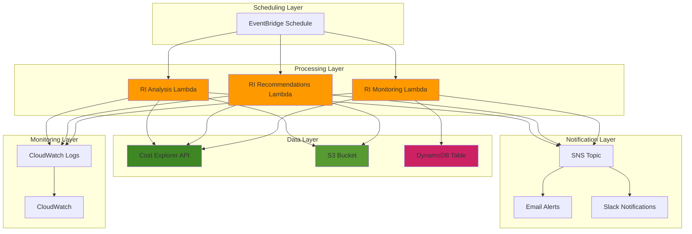

# Automating Reserved Instance Managementexisting_folder_name

## Problem

Organizations frequently struggle with Reserved Instance (RI) management, leading to underutilized reservations and missed cost savings opportunities. Manual monitoring of RI utilization rates, identifying optimization opportunities, and tracking reservation expirations creates operational overhead and delays in cost optimization actions. Without automated RI management, companies often experience poor RI utilization rates below 80% and fail to capitalize on potential savings of up to 75% compared to On-Demand pricing.

## Solution

This solution automates Reserved Instance management through a combination of AWS Cost Explorer APIs, Lambda functions, and EventBridge scheduling. The system automatically retrieves RI utilization data, generates purchase recommendations, monitors expiration dates, and sends alerts for optimization opportunities. This approach ensures consistent RI oversight, proactive cost optimization, and improved financial governance across your AWS infrastructure.

## Architecture Diagram



## Prerequisites

1. AWS account with Cost Explorer enabled and appropriate permissions for Cost Explorer API, Lambda, EventBridge, SNS, S3, and DynamoDB
2. AWS CLI v2 installed and configured (or AWS CloudShell)
3. Basic knowledge of AWS cost management concepts and Reserved Instances
4. Existing Reserved Instances in your account (or ability to create test RIs)
5. Estimated cost: $15-25 per month for Lambda executions, DynamoDB, S3 storage, and SNS notifications

> **Note**: Cost Explorer API has a rate limit of 1,000 requests per day and charges $0.01 per request after the first 1,000 free requests per month.

## Preparation

```bash
# Set environment variables
export AWS_REGION=$(aws configure get region)
export AWS_ACCOUNT_ID=$(aws sts get-caller-identity \
    --query Account --output text)

# Generate unique identifiers for resources
RANDOM_SUFFIX=$(aws secretsmanager get-random-password \
    --exclude-punctuation --exclude-uppercase \
    --password-length 6 --require-each-included-type \
    --output text --query RandomPassword)

export PROJECT_NAME="ri-management-${RANDOM_SUFFIX}"
export S3_BUCKET_NAME="ri-reports-${AWS_ACCOUNT_ID}-${RANDOM_SUFFIX}"
export SNS_TOPIC_NAME="ri-alerts-${RANDOM_SUFFIX}"
export DYNAMODB_TABLE_NAME="ri-tracking-${RANDOM_SUFFIX}"

# Enable Cost Explorer if not already enabled
aws ce get-cost-and-usage \
    --time-period Start=2024-01-01,End=2024-01-02 \
    --granularity MONTHLY \
    --metrics BlendedCost > /dev/null 2>&1 || \
    echo "Cost Explorer needs to be enabled in the AWS Console"

# Create S3 bucket for storing RI reports
aws s3 mb s3://${S3_BUCKET_NAME} --region ${AWS_REGION}

# Create SNS topic for notifications
aws sns create-topic --name ${SNS_TOPIC_NAME} \
    --query TopicArn --output text > topic_arn.txt
export SNS_TOPIC_ARN=$(cat topic_arn.txt)

echo "Setup complete. SNS Topic ARN: ${SNS_TOPIC_ARN}"
```

## Steps

1. **Create DynamoDB Table for RI Tracking**:

   DynamoDB serves as the persistent data store for our RI tracking system, providing fast, scalable NoSQL storage for time-series reservation data. This table will maintain historical records of RI configurations, expiration dates, and utilization patterns, enabling trend analysis and automated alerting. The composite key structure (ReservationId + Timestamp) supports efficient querying of specific reservations while maintaining chronological ordering for time-based analytics.

   ```bash
   # Create DynamoDB table to track RI history and alerts
   aws dynamodb create-table \
       --table-name ${DYNAMODB_TABLE_NAME} \
       --attribute-definitions \
           AttributeName=ReservationId,AttributeType=S \
           AttributeName=Timestamp,AttributeType=N \
       --key-schema \
           AttributeName=ReservationId,KeyType=HASH \
           AttributeName=Timestamp,KeyType=RANGE \
       --billing-mode PAY_PER_REQUEST \
       --tags Key=Project,Value=${PROJECT_NAME}
   
   # Wait for table to be active
   aws dynamodb wait table-exists \
       --table-name ${DYNAMODB_TABLE_NAME}
   
   echo "✅ DynamoDB table created: ${DYNAMODB_TABLE_NAME}"
   ```

   The DynamoDB table is now operational with pay-per-request billing, eliminating the need for capacity planning while providing automatic scaling. This foundational data layer will capture all RI lifecycle events and serve as the source of truth for historical reporting and trend analysis.

2. **Create IAM Role for Lambda Functions**:

   IAM roles provide secure, temporary credential delegation that enables Lambda functions to access AWS services without hardcoded access keys. This security model follows the principle of least privilege, granting only the specific permissions required for Cost Explorer API calls, S3 operations, DynamoDB access, and SNS publishing. The role-based approach ensures credentials are automatically rotated and managed by AWS, reducing security risks while maintaining operational flexibility.

   ```bash
   # Create trust policy for Lambda
   cat > lambda-trust-policy.json << 'EOF'
   {
       "Version": "2012-10-17",
       "Statement": [
           {
               "Effect": "Allow",
               "Principal": {
                   "Service": "lambda.amazonaws.com"
               },
               "Action": "sts:AssumeRole"
           }
       ]
   }
   EOF
   
   # Create IAM role
   aws iam create-role \
       --role-name ${PROJECT_NAME}-lambda-role \
       --assume-role-policy-document file://lambda-trust-policy.json
   
   # Create custom policy for Cost Explorer and other services
   cat > lambda-policy.json << EOF
   {
       "Version": "2012-10-17",
       "Statement": [
           {
               "Effect": "Allow",
               "Action": [
                   "logs:CreateLogGroup",
                   "logs:CreateLogStream",
                   "logs:PutLogEvents"
               ],
               "Resource": "arn:aws:logs:*:*:*"
           },
           {
               "Effect": "Allow",
               "Action": [
                   "ce:GetDimensionValues",
                   "ce:GetUsageAndCosts",
                   "ce:GetReservationCoverage",
                   "ce:GetReservationPurchaseRecommendation",
                   "ce:GetReservationUtilization",
                   "ce:GetRightsizingRecommendation"
               ],
               "Resource": "*"
           },
           {
               "Effect": "Allow",
               "Action": [
                   "s3:GetObject",
                   "s3:PutObject",
                   "s3:DeleteObject"
               ],
               "Resource": "arn:aws:s3:::${S3_BUCKET_NAME}/*"
           },
           {
               "Effect": "Allow",
               "Action": [
                   "dynamodb:PutItem",
                   "dynamodb:GetItem",
                   "dynamodb:UpdateItem",
                   "dynamodb:Query",
                   "dynamodb:Scan"
               ],
               "Resource": "arn:aws:dynamodb:${AWS_REGION}:${AWS_ACCOUNT_ID}:table/${DYNAMODB_TABLE_NAME}"
           },
           {
               "Effect": "Allow",
               "Action": [
                   "sns:Publish"
               ],
               "Resource": "${SNS_TOPIC_ARN}"
           }
       ]
   }
   EOF
   
   # Attach policies to role
   aws iam attach-role-policy \
       --role-name ${PROJECT_NAME}-lambda-role \
       --policy-arn arn:aws:iam::aws:policy/service-role/AWSLambdaBasicExecutionRole
   
   aws iam put-role-policy \
       --role-name ${PROJECT_NAME}-lambda-role \
       --policy-name ${PROJECT_NAME}-custom-policy \
       --policy-document file://lambda-policy.json
   
   echo "✅ IAM role created: ${PROJECT_NAME}-lambda-role"
   ```

   The IAM role is now configured with comprehensive permissions for Cost Explorer operations, storage access, and notification publishing. This security foundation enables the Lambda functions to operate autonomously while maintaining strict access controls and audit trails for compliance requirements.

3. **Create RI Utilization Analysis Lambda Function**:

   Lambda provides serverless compute that scales automatically and charges only for actual execution time, making it ideal for periodic RI analysis tasks. This function leverages the Cost Explorer API to retrieve detailed utilization metrics, identifying underperforming reservations that may require attention. The serverless architecture eliminates infrastructure management overhead while providing reliable, scheduled execution capabilities.

   ```bash
   # Create Lambda function for RI utilization analysis
   cat > ri_utilization_analysis.py << 'EOF'
   import json
   import boto3
   import datetime
   from decimal import Decimal
   import os
   
   def lambda_handler(event, context):
       ce = boto3.client('ce')
       s3 = boto3.client('s3')
       sns = boto3.client('sns')
       
       # Get environment variables
       bucket_name = os.environ['S3_BUCKET_NAME']
       sns_topic_arn = os.environ['SNS_TOPIC_ARN']
       
       # Calculate date range (last 30 days)
       end_date = datetime.date.today()
       start_date = end_date - datetime.timedelta(days=30)
       
       try:
           # Get RI utilization data
           response = ce.get_reservation_utilization(
               TimePeriod={
                   'Start': start_date.strftime('%Y-%m-%d'),
                   'End': end_date.strftime('%Y-%m-%d')
               },
               Granularity='MONTHLY',
               GroupBy=[
                   {
                       'Type': 'DIMENSION',
                       'Key': 'SERVICE'
                   }
               ]
           )
           
           # Process utilization data
           utilization_data = []
           alerts = []
           
           for result in response['UtilizationsByTime']:
               for group in result['Groups']:
                   service = group['Keys'][0]
                   utilization = group['Attributes']['UtilizationPercentage']
                   
                   utilization_data.append({
                       'service': service,
                       'utilization_percentage': float(utilization),
                       'period': result['TimePeriod']['Start'],
                       'total_actual_hours': group['Attributes']['TotalActualHours'],
                       'unused_hours': group['Attributes']['UnusedHours']
                   })
                   
                   # Check for low utilization (below 80%)
                   if float(utilization) < 80:
                       alerts.append({
                           'service': service,
                           'utilization': utilization,
                           'type': 'LOW_UTILIZATION',
                           'message': f'Low RI utilization for {service}: {utilization}%'
                       })
           
           # Save report to S3
           report_key = f"ri-utilization-reports/{start_date.strftime('%Y-%m-%d')}.json"
           s3.put_object(
               Bucket=bucket_name,
               Key=report_key,
               Body=json.dumps({
                   'report_date': end_date.strftime('%Y-%m-%d'),
                   'period': f"{start_date.strftime('%Y-%m-%d')} to {end_date.strftime('%Y-%m-%d')}",
                   'utilization_data': utilization_data,
                   'alerts': alerts
               }, indent=2)
           )
           
           # Send alerts if any
           if alerts:
               message = f"RI Utilization Alert Report\n\n"
               for alert in alerts:
                   message += f"- {alert['message']}\n"
               
               sns.publish(
                   TopicArn=sns_topic_arn,
                   Subject="Reserved Instance Utilization Alert",
                   Message=message
               )
           
           return {
               'statusCode': 200,
               'body': json.dumps({
                   'message': 'RI utilization analysis completed',
                   'report_location': f"s3://{bucket_name}/{report_key}",
                   'alerts_generated': len(alerts)
               })
           }
           
       except Exception as e:
           print(f"Error: {str(e)}")
           return {
               'statusCode': 500,
               'body': json.dumps({'error': str(e)})
           }
   EOF
   
   # Create deployment package
   zip ri-utilization-function.zip ri_utilization_analysis.py
   
   # Create Lambda function
   aws lambda create-function \
       --function-name ${PROJECT_NAME}-ri-utilization \
       --runtime python3.9 \
       --role arn:aws:iam::${AWS_ACCOUNT_ID}:role/${PROJECT_NAME}-lambda-role \
       --handler ri_utilization_analysis.lambda_handler \
       --zip-file fileb://ri-utilization-function.zip \
       --timeout 300 \
       --environment Variables="{S3_BUCKET_NAME=${S3_BUCKET_NAME},SNS_TOPIC_ARN=${SNS_TOPIC_ARN}}" \
       --tags Project=${PROJECT_NAME}
   
   echo "✅ RI Utilization Analysis Lambda function created"
   ```

   The utilization analysis function is now deployed and ready to process RI performance data. This automated system will continuously monitor reservation efficiency, generate detailed reports, and trigger alerts when utilization falls below optimal thresholds, enabling proactive cost optimization.

4. **Create RI Recommendations Lambda Function**:

   AWS Cost Explorer's machine learning algorithms analyze historical usage patterns to generate intelligent RI purchase recommendations, considering factors like instance families, regions, and payment options. This Lambda function automates the retrieval and processing of these recommendations for both EC2 and RDS services, providing data-driven insights for cost optimization decisions. The automated approach ensures consistent evaluation of savings opportunities without manual intervention.

   ```bash
   # Create Lambda function for RI recommendations
   cat > ri_recommendations.py << 'EOF'
   import json
   import boto3
   import datetime
   import os
   
   def lambda_handler(event, context):
       ce = boto3.client('ce')
       s3 = boto3.client('s3')
       sns = boto3.client('sns')
       
       # Get environment variables
       bucket_name = os.environ['S3_BUCKET_NAME']
       sns_topic_arn = os.environ['SNS_TOPIC_ARN']
       
       try:
           # Get RI recommendations for EC2
           ec2_response = ce.get_reservation_purchase_recommendation(
               Service='Amazon Elastic Compute Cloud - Compute',
               LookbackPeriodInDays='SIXTY_DAYS',
               TermInYears='ONE_YEAR',
               PaymentOption='PARTIAL_UPFRONT'
           )
           
           # Get RI recommendations for RDS
           rds_response = ce.get_reservation_purchase_recommendation(
               Service='Amazon Relational Database Service',
               LookbackPeriodInDays='SIXTY_DAYS',
               TermInYears='ONE_YEAR',
               PaymentOption='PARTIAL_UPFRONT'
           )
           
           # Process recommendations
           recommendations = []
           total_estimated_savings = 0
           
           # Process EC2 recommendations
           for recommendation in ec2_response['Recommendations']:
               rec_data = {
                   'service': 'EC2',
                   'instance_type': recommendation['InstanceDetails']['EC2InstanceDetails']['InstanceType'],
                   'region': recommendation['InstanceDetails']['EC2InstanceDetails']['Region'],
                   'recommended_instances': recommendation['RecommendationDetails']['RecommendedNumberOfInstancesToPurchase'],
                   'estimated_monthly_savings': float(recommendation['RecommendationDetails']['EstimatedMonthlySavingsAmount']),
                   'estimated_monthly_on_demand_cost': float(recommendation['RecommendationDetails']['EstimatedMonthlyOnDemandCost']),
                   'upfront_cost': float(recommendation['RecommendationDetails']['UpfrontCost']),
                   'recurring_cost': float(recommendation['RecommendationDetails']['RecurringStandardMonthlyCost'])
               }
               recommendations.append(rec_data)
               total_estimated_savings += rec_data['estimated_monthly_savings']
           
           # Process RDS recommendations
           for recommendation in rds_response['Recommendations']:
               rec_data = {
                   'service': 'RDS',
                   'instance_type': recommendation['InstanceDetails']['RDSInstanceDetails']['InstanceType'],
                   'database_engine': recommendation['InstanceDetails']['RDSInstanceDetails']['DatabaseEngine'],
                   'region': recommendation['InstanceDetails']['RDSInstanceDetails']['Region'],
                   'recommended_instances': recommendation['RecommendationDetails']['RecommendedNumberOfInstancesToPurchase'],
                   'estimated_monthly_savings': float(recommendation['RecommendationDetails']['EstimatedMonthlySavingsAmount']),
                   'estimated_monthly_on_demand_cost': float(recommendation['RecommendationDetails']['EstimatedMonthlyOnDemandCost']),
                   'upfront_cost': float(recommendation['RecommendationDetails']['UpfrontCost']),
                   'recurring_cost': float(recommendation['RecommendationDetails']['RecurringStandardMonthlyCost'])
               }
               recommendations.append(rec_data)
               total_estimated_savings += rec_data['estimated_monthly_savings']
           
           # Save recommendations to S3
           today = datetime.date.today()
           report_key = f"ri-recommendations/{today.strftime('%Y-%m-%d')}.json"
           
           report_data = {
               'report_date': today.strftime('%Y-%m-%d'),
               'total_recommendations': len(recommendations),
               'total_estimated_monthly_savings': total_estimated_savings,
               'recommendations': recommendations
           }
           
           s3.put_object(
               Bucket=bucket_name,
               Key=report_key,
               Body=json.dumps(report_data, indent=2)
           )
           
           # Send notification if there are recommendations
           if recommendations:
               message = f"RI Purchase Recommendations Report\n\n"
               message += f"Total Recommendations: {len(recommendations)}\n"
               message += f"Estimated Monthly Savings: ${total_estimated_savings:.2f}\n\n"
               
               for rec in recommendations[:5]:  # Show top 5
                   message += f"- {rec['service']}: {rec['instance_type']} "
                   message += f"(${rec['estimated_monthly_savings']:.2f}/month savings)\n"
               
               if len(recommendations) > 5:
                   message += f"... and {len(recommendations) - 5} more recommendations\n"
               
               message += f"\nFull report: s3://{bucket_name}/{report_key}"
               
               sns.publish(
                   TopicArn=sns_topic_arn,
                   Subject="Reserved Instance Purchase Recommendations",
                   Message=message
               )
           
           return {
               'statusCode': 200,
               'body': json.dumps({
                   'message': 'RI recommendations analysis completed',
                   'report_location': f"s3://{bucket_name}/{report_key}",
                   'recommendations_count': len(recommendations),
                   'estimated_savings': total_estimated_savings
               })
           }
           
       except Exception as e:
           print(f"Error: {str(e)}")
           return {
               'statusCode': 500,
               'body': json.dumps({'error': str(e)})
           }
   EOF
   
   # Create deployment package
   zip ri-recommendations-function.zip ri_recommendations.py
   
   # Create Lambda function
   aws lambda create-function \
       --function-name ${PROJECT_NAME}-ri-recommendations \
       --runtime python3.9 \
       --role arn:aws:iam::${AWS_ACCOUNT_ID}:role/${PROJECT_NAME}-lambda-role \
       --handler ri_recommendations.lambda_handler \
       --zip-file fileb://ri-recommendations-function.zip \
       --timeout 300 \
       --environment Variables="{S3_BUCKET_NAME=${S3_BUCKET_NAME},SNS_TOPIC_ARN=${SNS_TOPIC_ARN}}" \
       --tags Project=${PROJECT_NAME}
   
   echo "✅ RI Recommendations Lambda function created"
   ```

   The recommendations function is now operational and will regularly analyze usage patterns to identify cost-saving opportunities. This intelligence layer transforms raw utilization data into actionable purchase recommendations, helping organizations make informed decisions about RI investments based on actual consumption patterns.

5. **Create RI Monitoring Lambda Function**:

   Proactive expiration monitoring prevents the costly transition from Reserved Instance pricing back to On-Demand rates when reservations expire unnoticed. This Lambda function queries EC2's describe-reserved-instances API to track active reservations, calculating expiration timelines and storing historical data for trend analysis. The monitoring approach ensures organizations have sufficient lead time to make renewal decisions or adjust capacity planning before reservations expire.

   ```bash
   # Create Lambda function for RI monitoring and expiration tracking
   cat > ri_monitoring.py << 'EOF'
   import json
   import boto3
   import datetime
   import os
   
   def lambda_handler(event, context):
       ce = boto3.client('ce')
       ec2 = boto3.client('ec2')
       dynamodb = boto3.resource('dynamodb')
       sns = boto3.client('sns')
       
       # Get environment variables
       table_name = os.environ['DYNAMODB_TABLE_NAME']
       sns_topic_arn = os.environ['SNS_TOPIC_ARN']
       
       table = dynamodb.Table(table_name)
       
       try:
           # Get EC2 Reserved Instances
           response = ec2.describe_reserved_instances(
               Filters=[
                   {
                       'Name': 'state',
                       'Values': ['active']
                   }
               ]
           )
           
           alerts = []
           current_time = datetime.datetime.utcnow()
           
           for ri in response['ReservedInstances']:
               ri_id = ri['ReservedInstancesId']
               end_date = ri['End']
               
               # Calculate days until expiration
               days_until_expiration = (end_date.replace(tzinfo=None) - current_time).days
               
               # Store RI data in DynamoDB
               table.put_item(
                   Item={
                       'ReservationId': ri_id,
                       'Timestamp': int(current_time.timestamp()),
                       'InstanceType': ri['InstanceType'],
                       'InstanceCount': ri['InstanceCount'],
                       'State': ri['State'],
                       'Start': ri['Start'].isoformat(),
                       'End': ri['End'].isoformat(),
                       'Duration': ri['Duration'],
                       'OfferingClass': ri['OfferingClass'],
                       'OfferingType': ri['OfferingType'],
                       'DaysUntilExpiration': days_until_expiration,
                       'AvailabilityZone': ri.get('AvailabilityZone', 'N/A'),
                       'Region': ri['AvailabilityZone'][:-1] if ri.get('AvailabilityZone') else 'N/A'
                   }
               )
               
               # Check for expiration alerts
               if days_until_expiration <= 90:  # 90 days warning
                   alert_type = 'EXPIRING_SOON' if days_until_expiration > 30 else 'EXPIRING_VERY_SOON'
                   alerts.append({
                       'reservation_id': ri_id,
                       'instance_type': ri['InstanceType'],
                       'instance_count': ri['InstanceCount'],
                       'days_until_expiration': days_until_expiration,
                       'end_date': ri['End'].strftime('%Y-%m-%d'),
                       'alert_type': alert_type
                   })
           
           # Send alerts if any
           if alerts:
               message = f"Reserved Instance Expiration Alert\n\n"
               
               for alert in alerts:
                   urgency = "URGENT" if alert['days_until_expiration'] <= 30 else "WARNING"
                   message += f"[{urgency}] RI {alert['reservation_id']}\n"
                   message += f"  Instance Type: {alert['instance_type']}\n"
                   message += f"  Count: {alert['instance_count']}\n"
                   message += f"  Expires: {alert['end_date']} ({alert['days_until_expiration']} days)\n\n"
               
               sns.publish(
                   TopicArn=sns_topic_arn,
                   Subject="Reserved Instance Expiration Alert",
                   Message=message
               )
           
           return {
               'statusCode': 200,
               'body': json.dumps({
                   'message': 'RI monitoring completed',
                   'total_reservations': len(response['ReservedInstances']),
                   'expiration_alerts': len(alerts)
               })
           }
           
       except Exception as e:
           print(f"Error: {str(e)}")
           return {
               'statusCode': 500,
               'body': json.dumps({'error': str(e)})
           }
   EOF
   
   # Create deployment package
   zip ri-monitoring-function.zip ri_monitoring.py
   
   # Create Lambda function
   aws lambda create-function \
       --function-name ${PROJECT_NAME}-ri-monitoring \
       --runtime python3.9 \
       --role arn:aws:iam::${AWS_ACCOUNT_ID}:role/${PROJECT_NAME}-lambda-role \
       --handler ri_monitoring.lambda_handler \
       --zip-file fileb://ri-monitoring-function.zip \
       --timeout 300 \
       --environment Variables="{DYNAMODB_TABLE_NAME=${DYNAMODB_TABLE_NAME},SNS_TOPIC_ARN=${SNS_TOPIC_ARN}}" \
       --tags Project=${PROJECT_NAME}
   
   echo "✅ RI Monitoring Lambda function created"
   ```

   The monitoring function is now active and will track all Reserved Instance lifecycles, providing early warning alerts for expiring reservations. This proactive approach prevents unexpected cost increases and ensures continuous optimization of your AWS spending through timely renewal planning.

6. **Create EventBridge Schedules for Automation**:

   EventBridge provides reliable, scalable event scheduling that triggers Lambda functions on predefined schedules without requiring dedicated infrastructure. The cron-based scheduling ensures consistent execution of RI analysis tasks, with daily utilization monitoring for rapid issue detection and weekly recommendation reviews for strategic planning. This automation framework eliminates manual oversight requirements while maintaining predictable execution patterns.

   ```bash
   # Create EventBridge rule for daily RI utilization analysis
   aws events put-rule \
       --name ${PROJECT_NAME}-daily-utilization \
       --schedule-expression "cron(0 8 * * ? *)" \
       --description "Daily RI utilization analysis at 8 AM UTC" \
       --state ENABLED
   
   # Add Lambda target to utilization rule
   aws events put-targets \
       --rule ${PROJECT_NAME}-daily-utilization \
       --targets "Id"="1","Arn"="arn:aws:lambda:${AWS_REGION}:${AWS_ACCOUNT_ID}:function:${PROJECT_NAME}-ri-utilization"
   
   # Create EventBridge rule for weekly RI recommendations
   aws events put-rule \
       --name ${PROJECT_NAME}-weekly-recommendations \
       --schedule-expression "cron(0 9 ? * MON *)" \
       --description "Weekly RI recommendations on Monday at 9 AM UTC" \
       --state ENABLED
   
   # Add Lambda target to recommendations rule
   aws events put-targets \
       --rule ${PROJECT_NAME}-weekly-recommendations \
       --targets "Id"="1","Arn"="arn:aws:lambda:${AWS_REGION}:${AWS_ACCOUNT_ID}:function:${PROJECT_NAME}-ri-recommendations"
   
   # Create EventBridge rule for weekly RI monitoring
   aws events put-rule \
       --name ${PROJECT_NAME}-weekly-monitoring \
       --schedule-expression "cron(0 10 ? * MON *)" \
       --description "Weekly RI monitoring on Monday at 10 AM UTC" \
       --state ENABLED
   
   # Add Lambda target to monitoring rule
   aws events put-targets \
       --rule ${PROJECT_NAME}-weekly-monitoring \
       --targets "Id"="1","Arn"="arn:aws:lambda:${AWS_REGION}:${AWS_ACCOUNT_ID}:function:${PROJECT_NAME}-ri-monitoring"
   
   echo "✅ EventBridge schedules created"
   ```

   The automated scheduling system is now operational, ensuring consistent RI management without manual intervention. These schedules will maintain continuous oversight of your reservation portfolio, providing regular analysis and recommendations to optimize your AWS cost structure.

7. **Grant EventBridge Permissions to Invoke Lambda Functions**:

   AWS security model requires explicit permissions for cross-service invocations, ensuring that only authorized event sources can trigger Lambda functions. These permission grants create secure integration points between EventBridge and Lambda, enabling automated execution while maintaining strict access controls. The resource-specific permissions ensure each schedule can only invoke its designated function, providing granular security for the automation workflow.

   ```bash
   # Grant EventBridge permission to invoke utilization Lambda
   aws lambda add-permission \
       --function-name ${PROJECT_NAME}-ri-utilization \
       --statement-id "AllowExecutionFromEventBridge" \
       --action lambda:InvokeFunction \
       --principal events.amazonaws.com \
       --source-arn arn:aws:events:${AWS_REGION}:${AWS_ACCOUNT_ID}:rule/${PROJECT_NAME}-daily-utilization
   
   # Grant EventBridge permission to invoke recommendations Lambda
   aws lambda add-permission \
       --function-name ${PROJECT_NAME}-ri-recommendations \
       --statement-id "AllowExecutionFromEventBridge" \
       --action lambda:InvokeFunction \
       --principal events.amazonaws.com \
       --source-arn arn:aws:events:${AWS_REGION}:${AWS_ACCOUNT_ID}:rule/${PROJECT_NAME}-weekly-recommendations
   
   # Grant EventBridge permission to invoke monitoring Lambda
   aws lambda add-permission \
       --function-name ${PROJECT_NAME}-ri-monitoring \
       --statement-id "AllowExecutionFromEventBridge" \
       --action lambda:InvokeFunction \
       --principal events.amazonaws.com \
       --source-arn arn:aws:events:${AWS_REGION}:${AWS_ACCOUNT_ID}:rule/${PROJECT_NAME}-weekly-monitoring
   
   echo "✅ EventBridge permissions granted to Lambda functions"
   ```

   The secure integration between EventBridge and Lambda is now complete, enabling automated function execution while maintaining comprehensive access controls. This permission structure ensures reliable scheduled operations while preserving the security boundaries required for enterprise environments.

8. **Subscribe Email to SNS Topic for Notifications**:

   SNS provides reliable, scalable messaging that delivers RI alerts and recommendations to stakeholders in real-time. Email subscriptions ensure critical cost optimization insights reach decision-makers promptly, enabling rapid response to utilization issues or expiring reservations. The pub-sub model supports multiple notification endpoints, allowing organizations to integrate with various communication channels and ITSM systems for comprehensive alerting coverage.

   ```bash
   # Subscribe your email to the SNS topic (replace with your email)
   read -p "Enter your email address for RI alerts: " EMAIL_ADDRESS
   
   aws sns subscribe \
       --topic-arn ${SNS_TOPIC_ARN} \
       --protocol email \
       --notification-endpoint ${EMAIL_ADDRESS}
   
   echo "✅ Email subscription created. Check your email and confirm the subscription."
   ```

   The notification system is now configured to deliver RI insights directly to stakeholders, ensuring timely awareness of cost optimization opportunities. This communication channel transforms automated analysis into actionable business intelligence, enabling proactive financial management of your AWS infrastructure.

## Validation & Testing

1. **Test the RI Utilization Analysis Function**:

   ```bash
   # Invoke the utilization analysis function manually
   aws lambda invoke \
       --function-name ${PROJECT_NAME}-ri-utilization \
       --payload '{}' \
       utilization-response.json
   
   # Check the response
   cat utilization-response.json
   ```

   Expected output: JSON response with statusCode 200 and information about the analysis completion.

2. **Test the RI Recommendations Function**:

   ```bash
   # Invoke the recommendations function manually
   aws lambda invoke \
       --function-name ${PROJECT_NAME}-ri-recommendations \
       --payload '{}' \
       recommendations-response.json
   
   # Check the response
   cat recommendations-response.json
   ```

   Expected output: JSON response with recommendations count and estimated savings.

3. **Test the RI Monitoring Function**:

   ```bash
   # Invoke the monitoring function manually
   aws lambda invoke \
       --function-name ${PROJECT_NAME}-ri-monitoring \
       --payload '{}' \
       monitoring-response.json
   
   # Check the response
   cat monitoring-response.json
   ```

   Expected output: JSON response with total reservations monitored and any expiration alerts.

4. **Verify S3 Reports Generation**:

   ```bash
   # List generated reports in S3
   aws s3 ls s3://${S3_BUCKET_NAME}/ri-utilization-reports/
   aws s3 ls s3://${S3_BUCKET_NAME}/ri-recommendations/
   
   # Download and view a sample report
   LATEST_REPORT=$(aws s3 ls s3://${S3_BUCKET_NAME}/ri-utilization-reports/ \
       --query 'Contents[-1].Key' --output text)
   
   if [ "$LATEST_REPORT" != "None" ]; then
       aws s3 cp s3://${S3_BUCKET_NAME}/${LATEST_REPORT} sample-report.json
       echo "Sample report content:"
       cat sample-report.json | jq .
   fi
   ```

5. **Check DynamoDB for RI Tracking Data**:

   ```bash
   # Scan DynamoDB table for RI tracking records
   aws dynamodb scan \
       --table-name ${DYNAMODB_TABLE_NAME} \
       --max-items 5 \
       --query 'Items[*]'
   ```

   Expected output: List of Reserved Instance records with tracking information.

## Cleanup

1. **Delete EventBridge Rules and Targets**:

   ```bash
   # Remove targets from EventBridge rules
   aws events remove-targets \
       --rule ${PROJECT_NAME}-daily-utilization \
       --ids "1"
   
   aws events remove-targets \
       --rule ${PROJECT_NAME}-weekly-recommendations \
       --ids "1"
   
   aws events remove-targets \
       --rule ${PROJECT_NAME}-weekly-monitoring \
       --ids "1"
   
   # Delete EventBridge rules
   aws events delete-rule --name ${PROJECT_NAME}-daily-utilization
   aws events delete-rule --name ${PROJECT_NAME}-weekly-recommendations
   aws events delete-rule --name ${PROJECT_NAME}-weekly-monitoring
   
   echo "✅ EventBridge rules deleted"
   ```

2. **Delete Lambda Functions**:

   ```bash
   # Delete Lambda functions
   aws lambda delete-function \
       --function-name ${PROJECT_NAME}-ri-utilization
   
   aws lambda delete-function \
       --function-name ${PROJECT_NAME}-ri-recommendations
   
   aws lambda delete-function \
       --function-name ${PROJECT_NAME}-ri-monitoring
   
   echo "✅ Lambda functions deleted"
   ```

3. **Delete IAM Role and Policies**:

   ```bash
   # Detach and delete IAM policies
   aws iam detach-role-policy \
       --role-name ${PROJECT_NAME}-lambda-role \
       --policy-arn arn:aws:iam::aws:policy/service-role/AWSLambdaBasicExecutionRole
   
   aws iam delete-role-policy \
       --role-name ${PROJECT_NAME}-lambda-role \
       --policy-name ${PROJECT_NAME}-custom-policy
   
   aws iam delete-role --role-name ${PROJECT_NAME}-lambda-role
   
   echo "✅ IAM role and policies deleted"
   ```

4. **Delete DynamoDB Table**:

   ```bash
   # Delete DynamoDB table
   aws dynamodb delete-table --table-name ${DYNAMODB_TABLE_NAME}
   
   echo "✅ DynamoDB table deleted"
   ```

5. **Delete SNS Topic and S3 Bucket**:

   ```bash
   # Delete SNS topic
   aws sns delete-topic --topic-arn ${SNS_TOPIC_ARN}
   
   # Delete S3 bucket contents and bucket
   aws s3 rm s3://${S3_BUCKET_NAME} --recursive
   aws s3 rb s3://${S3_BUCKET_NAME}
   
   # Clean up local files
   rm -f lambda-trust-policy.json lambda-policy.json
   rm -f ri_*.py *.zip *.json topic_arn.txt
   
   echo "✅ All resources cleaned up"
   ```

## Discussion

This Reserved Instance management automation solution addresses the critical challenge of RI optimization at scale. The architecture leverages AWS Cost Explorer APIs to provide programmatic access to utilization data, recommendations, and cost analysis capabilities that would otherwise require manual intervention through the AWS console.

The solution implements three key automation workflows: utilization monitoring identifies underperforming RIs with threshold-based alerting, recommendation generation provides data-driven purchase guidance using AWS's machine learning algorithms, and expiration tracking ensures proactive renewal planning. The EventBridge scheduling system ensures consistent execution without manual oversight, while the combination of S3 storage and DynamoDB provides both historical reporting and real-time tracking capabilities.

The SNS notification system enables immediate response to optimization opportunities, while the modular Lambda architecture allows for easy customization and extension. Organizations can adjust utilization thresholds, modify scheduling frequencies, or add additional services like ElastiCache and RDS to the monitoring scope. The solution also supports cost allocation through comprehensive tagging and provides audit trails for compliance requirements.

> **Tip**: Monitor your Cost Explorer API usage to avoid unexpected charges - the first 1,000 API calls per month are free, but additional calls cost $0.01 each.

## Challenge

Extend this solution by implementing these enhancements:

1. **Multi-Account Support**: Modify the Lambda functions to work with AWS Organizations and consolidate RI data across multiple accounts using cross-account roles and centralized reporting.

2. **Advanced Analytics**: Integrate with Amazon QuickSight to create interactive dashboards showing RI utilization trends, savings opportunities, and cost optimization metrics with drill-down capabilities.

3. **Automated RI Purchasing**: Add workflow approval mechanisms using AWS Step Functions and SNS to automate the actual purchase of recommended RIs based on predefined criteria and budget constraints.

4. **Integration with ITSM Tools**: Connect the alert system to ServiceNow, Jira, or other IT service management platforms to automatically create tickets for RI optimization actions.

5. **Cost Allocation and Chargeback**: Implement detailed cost allocation reporting that maps RI utilization to specific business units, projects, or cost centers using resource tags and custom billing dimensions.

## Infrastructure Code

*Infrastructure code will be generated after recipe approval.*